# 17.web服务器

# 一、概念

web服务器里面其实就是放的前端程序员写的各种网页代码，之后将web服务器运行起来，用户就可以通过自己电脑上的浏览器输入网址访问！

## 前言

UI的转变：B/S架构

Browser：浏览器

Server：服务器

## 名词

### HTML

HyperText Markup Language ，超级 文本 标记 语言

前端程序员就是通过html标记语言去写网页代码。

### 网页

使用HTML、PHP等语言格式书写的文件。

xxx.html   goods.html   cart.html     order.html 等等    xxx.php

### 主页

网页中呈现用户的第一个页面。一般是 index.html

### 网站

多个网页组合而成的

### URL

<http://www.baidu.com:80/1.html>

ftp://192.168.142.143:21/1.txt

Uniform Resource Locator

统一资源定位符

访问网站的地址

## 网站架构

LAMP架构

Linux + Apache + MySQL + PHP

系统+服务器程序+数据管理软件+中间软件

# 二、静态站点

静态站点，也就是静态网站，也就是网站中的数据是死的，不会变化的，不涉及到数据库中读写数据！

Apache就是一个web服务器软件，我们将其运行起来后，它就可以提供web服务器，也就是用户就可以通过浏览器输入网址访问这个Apache服务器中的网页信息！

## Apache


建议使用2.4及以上的版本

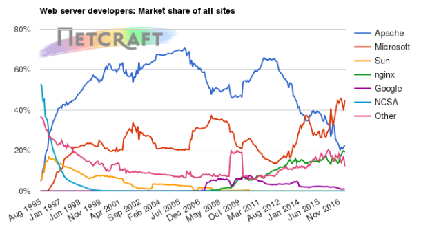

## Apache基础

Apache官网：www.apache.org

软件包名称：httpd

服务端口：80/tcp(http)、443/tcp(https)

主配置文件：/etc/httpd/conf/httpd.conf

子配置文件：/etc/httpd/conf.d/\*.conf（子配置文件必须以.conf结尾，名字随意）

主目录：/var/www/html，网站源代码默认位置

## 安装Apache

```shell
# yum -y install httpd							安装
# systemctl start httpd							启动
# systemctl status httpd						查看服务状态
# systemctl enable httpd						开机自启
# systemctl stop firewalld					关闭防火墙
# setenforce 0											关闭selinux
# httpd -v													查看版本version
Server version: Apache/2.4.53 (CentOS Stream)
```

使用真机浏览器访问测试：

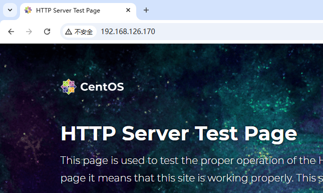

## 虚拟主机

### 目的

虚拟主机VirtualHost

作用：在一台物理服务器上运行多个网站

### 类型

配置虚拟主机的方式有：基于IP地址的、基于端口号的以及基于主机名（域名）的。我们一般使用基于主机名（域名）的。

基于主机名（域名）

* www.a.org
* www.b.org

### 配置虚拟主机目标

在一台服务器上，实现两个网站的架设

网站域名                     	网站资源存放目录

www.a.org 			/var/www/html/a.org

www.b.org 			/b.org

注意关闭firewalld和selinux

### 环境

* 192.168.126.170：web服务器
* 192.168.126.1：真机

### 服务器

192.168.126.170服务器中做如下操作。

#### www.a.org站点设置

1.准备网站源码（网页）目录

```shell
# mkdir /var/www/html/a.org 
# vim /var/www/html/a.org/index.html 
输入网页内容，a.com.com.com
```

2.创建a.org的网站配置文件（下面是创建了一个httpd的子配置文件，配置了针对a.org网站的虚拟主机）

```shell
# vim /etc/httpd/conf.d/a.org.conf 
<VirtualHost *:80>												# 配置虚拟主机
   ServerName       www.a.org							# 服务器起个名字
   DocumentRoot     /var/www/html/a.org		# 注释：网站的根目录
</VirtualHost>

说明：
上面的 *:80 指的是该虚拟主机监听当前服务器中的所有IP地址的80端口，比如这台服务器上有两个IP地址，那么就会监听这两个IP地址的80端口！
```

3.检测配置文件语法，重启服务

```shell
检查刚刚配置的子配置文件是否语法正确
# httpd -t
下面的提示没问题，它就是说我们配置的域名没有检测到，但其实这个域名是我们随便写的，肯定没有了
AH00558: httpd: Could not reliably determine the server's fully qualified domain name, using localhost.localdomain. Set the 'ServerName' directive globally to suppress this message
Syntax OK

重启httpd服务
# systemctl restart httpd 
```

#### www.b.org站点设置

1.准备网站源码目录

```shell
# mkdir /b.org 
# vim /b.org/index.html 
b.org.org.org作为网页内容
```

2.创建b.org的网站配置文件

```shell
# vim /etc/httpd/conf.d/b.org.conf 
在文件中输入以下内容
<VirtualHost	*:80>
   ServerName   www.b.org
   DocumentRoot	/b.org
</VirtualHost>
<Directory	"/b.org">					# 目录授权，仅在网站主目录非“/var/www/html”时操作
   Require	all	granted				# 允许所有的“网站”的访问
</Directory>
```

> 上面之所以要给/b.org目录单独设置一下权限，是因为Apache默认只允许用户访问到/var/www/html目录，我们如果将网页文件放在其他地方，需要指定一下权限

3.检测配置文件语法，重启服务

```shell
# httpd -t 
无报错，就可以启动服务器了
# systemctl restart httpd 
```

### 客户端测试

#### Windows中测试（192.168.126.1）

Windows客户端域名解析

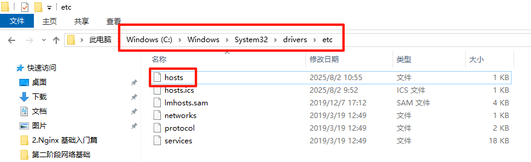

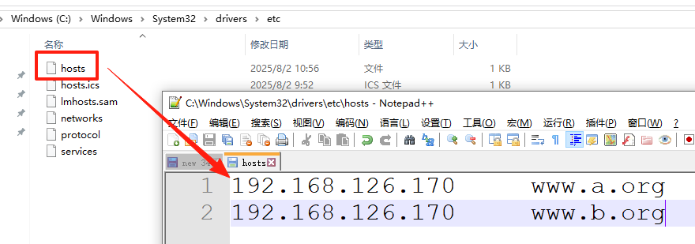

windows客户端测试网站可用性

打开真机的运行窗口，输入cmd（win键+R键）

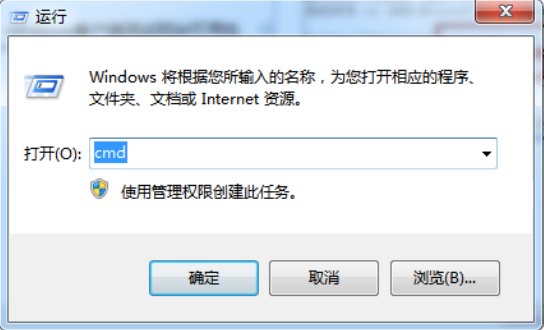

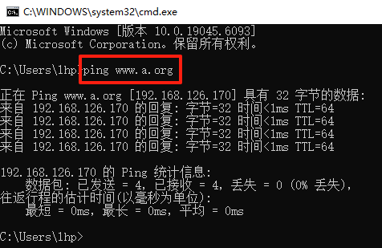

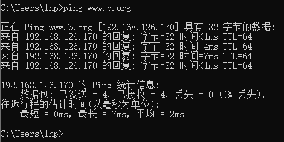


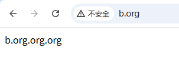

#### Linux中测试（192.168.126.170）

Linux客户端域名解析

```shell
# vim /etc/hosts
192.168.126.170  www.a.org		填写web服务器的IP
192.168.126.170  www.b.org		填写web服务器的IP
```

Linux客户端测试网站可用性

```shell
字符测试
# curl http://www.a.org
a.com.com

# curl http://www.b.org
b.org.org.org
```

图形测试：通过火狐浏览器，分别访问两个网站地址

## 总结

* httpd（Apache）服务器，可以提供web服务
* 我们可以将两套网站都交给httpd服务器管理，那就需要在httpd服务中创建两个虚拟主机
* 创建虚拟主机：1. 在httpd的子配置目录中创建一个.conf的文件 2. 在.conf的配置文件中配置虚拟主机，比如虚拟主机监听的端口、虚拟主机的名称、该虚拟主机对应的网站目录等
* 需要修改hosts文件，就可以通过域名访问httpd服务器了

# 三、动态站点

动态站点，指的就是我们访问的那些网站，它们里面的数据不是写死的，很多都是从数据库查询出来的，会涉及到对数据库数据的操作！

典型的动态网站的结构是：LAMP

## LAMP

Linux系统-网站程序Apache-数据库MySQL-PHP中间件

## 部署论坛系统discuz

### Logo


开源论坛代码服务社区

### 基础环境

```shell
永久关闭selinux
# sed -ri '/^SELINUX=/cSELINUX=disabled' /etc/selinux/config 

临时关闭selinux
# setenforce 0

停止防火墙
# systemctl stop firewalld.service 

开机禁用防火墙
# systemctl disable firewalld.service
```

### 安装LAMP

```shell
注意本实验环境使用的是PHP8。对应的Discuz3.5版本
# yum install -y httpd mariadb-server mariadb php php-mysqlnd gd php-gd

启动网站和数据库
# systemctl start httpd mariadb

开机启动网站和数据库
# systemctl enable httpd mariadb
```

> mariadb其实就是MySQL换了个牌子，本质是一样的！
>
> 上面安装的php服务，其实是PHP代码运行用到的环境，它是会嵌入到httpd服务中的。

### 安装Discuz！

先去官网下载Discuz!源码包：<https://www.discuz.vip/download>，`Discuz_X3.5_SC_UTF8_20250205.zip`。

1. 导入discuz网站源码

```shell
解压zip压缩包
# unzip  Discuz_X3.5_SC_UTF8_20250205.zip

复制upload目录中的所有内容到 /var/www/html中
# cp -rf upload/* /var/www/html

变更/var/www/html目录的拥有者与所属组
# chown -R apache.apache /var/www/html
```

解压后的文件说明：

* upload 这个目录下面的所有文件是我们需要上传到服务器上的可用程序文件（仅上传目录里边的文件）；
* readme 目录为产品介绍、授权、安装、升级、转换以及版本更新日志说明（不要上传）；
* readme.html 为安装、升级教程（不要上传）。
* utility.html 为论坛附带工具下载地址，比如升级程序（不要上传）。

2. 准备数据库

```shell
# mysql		连接MySQL数据库
MariaDB [(none)]> create database discuz;		切记创建数据库要再敲一遍，可以检查是否创建成功

MariaDB [(none)]> set password=password('lhp@123');	设置数据库管理员密码
MariaDB [(none)]> \q	退出数据库
```

3. 在Windows中通过浏览器访问

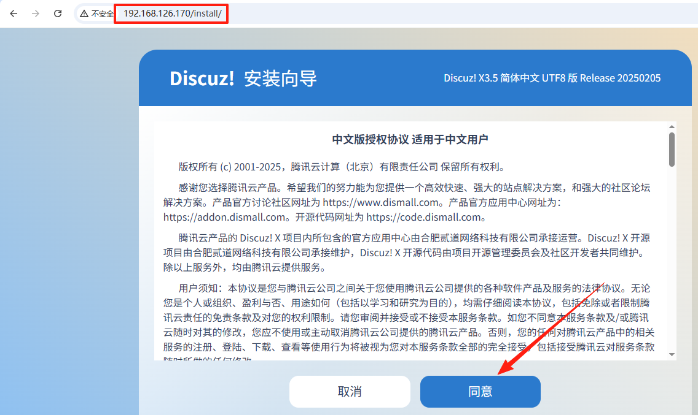

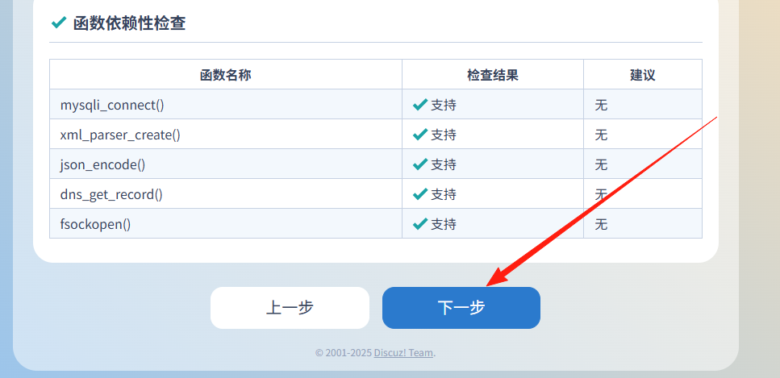

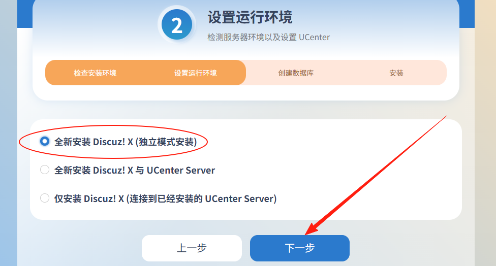

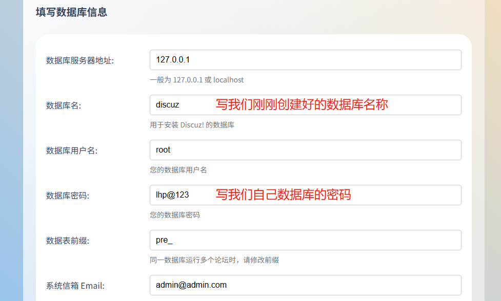

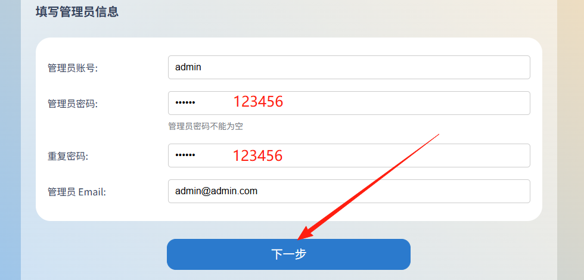

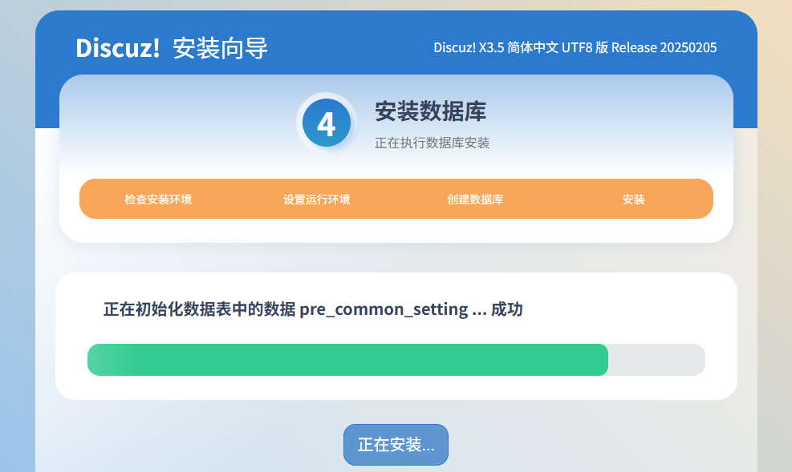

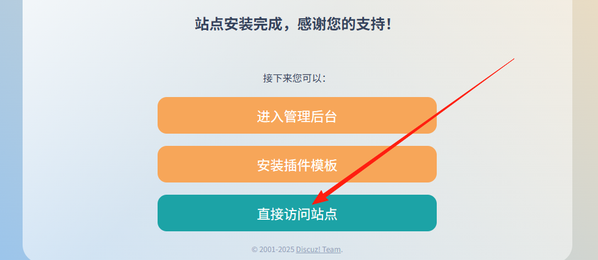

最终用户访问效果如下：

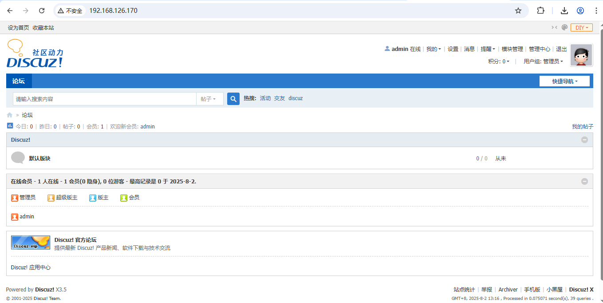

### 客户端测试

通过浏览器访问前台地址：http://Linux服务器的IP地址

通过浏览器访问后台地址：http://Linux服务器的IP地址/admin.php

```shell
Windows客户端测试时，也可以在Windows中添加域名解析，这样就可以通过域名访问啦
编辑hosts文件，添加如下内容
192.168.126.170  www.discuz.com
```

## 部署博客系统 wordpress

前提：将之前的论坛系统所在的Linux服务器给还原快照，回到一个干净的系统，我们重新开始做！

### Logo


### 基础环境

```shell
永久关闭SELinux
# sed -ri '/^SELINUX=/cSELINUX=disabled' /etc/selinux/config 

关闭SELinux
# setenforce 0

关闭防火墙
# systemctl stop firewalld.service 

开机不启动防火墙
# systemctl disable firewalld.service
```

### 安装LAMP

```shell
# yum install -y httpd mariadb-server mariadb php php-mysqlnd gd php-gd
# systemctl start httpd mariadb
# systemctl enable httpd mariadb
```

### 导入wordpress网站源码

官网下载wordpress，网址是：<https://cn.wordpress.org/download/releases/#branch-61>，`wordpress-6.1.1-zh_CN.zip`

将wordpress源码上传到Linux服务器。

```shell
# unzip	wordpress-6.1.1-zh_CN.zip					解压缩源码包
# cp -rf wordpress/* /var/www/html				拷贝源码到主目录
# chmod -R 777 /var/www/html							修改目录的权限为最大，其实也可以像上面案例一样修改拥有者和所属组为apache
```

### 准备数据库（创建一个库）

```shell
# mysql		连接MySQL数据
MariaDB [(none)]> create database wordpress;	切记创建数据库要再敲一遍，可以检查是否创建成功
MariaDB [(none)]> set password=password('lhp@123');	设置数据库管理员密码
MariaDB [(none)]> \q
```

### 安装wordpress

通过浏览器访问：`http://192.168.126.170`

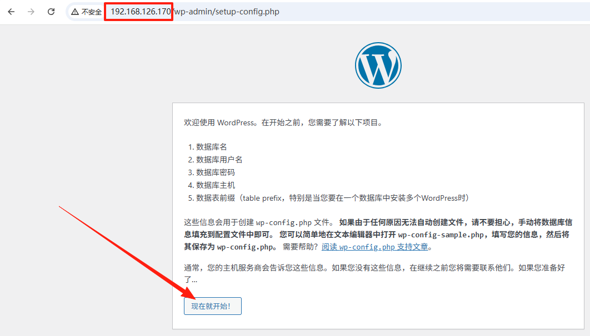

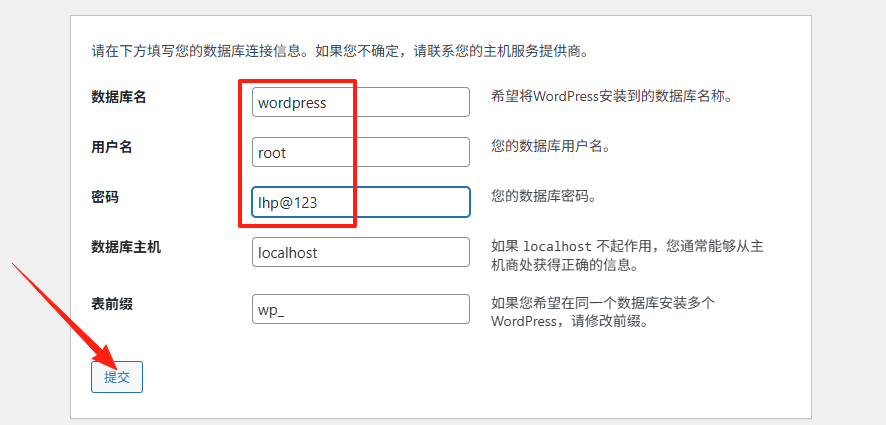

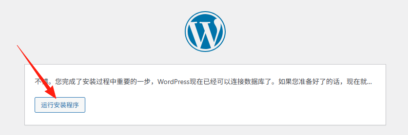

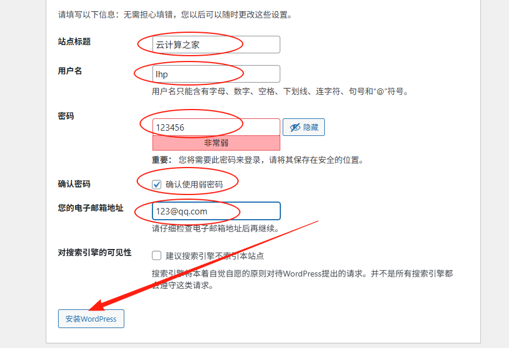

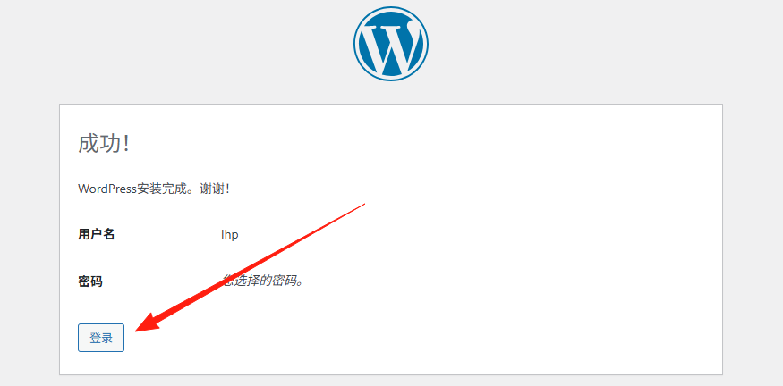

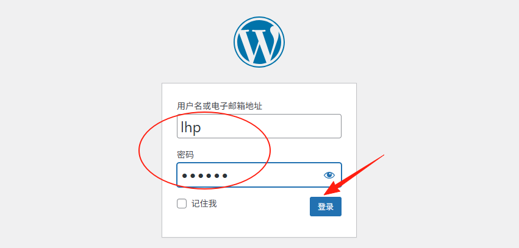

### 客户端测试

使用浏览器访问前台系统：http://192.168.126.170

使用浏览器访问后台系统：<http://192.168.126.170/wp-admin/>

当然，我们可以给Windows系统的hosts文件配置上域名解析，这样就可以通过域名来访问啦：

```shell
修改Windows的hosts文件，添加如下内容：
192.168.126.170		www.wordpress.com
```

## 同时部署论坛和博客系统

### 需求

看上面的论坛和博客系统的部署过程，我们都是在一台干净的Linux服务器中通过Apache服务器软件仅部署论坛系统或者仅部署博客系统。

如果在Apache服务器软件中，只部署一个网站项目，那可以不用配置什么虚拟主机，使用默认的就可以！

如果要在Apache服务器软件中，同时部署多个网站项目，那我们就需要配置虚拟主机，不同的虚拟主机对应不同的网站项目。

**前提：先将Linux系统还原，做一个干净的Linux系统，然后安装环境，同时在Apache服务器中部署两个项目。**

### 安装LAMP环境

```shell
安装LAMP环境
# yum install -y httpd mariadb-server mariadb php php-mysqlnd gd php-gd

启动网站和数据库
# systemctl start httpd mariadb

开机启动网站和数据库
# systemctl enable httpd mariadb
```

### 部署Discuz系统

#### 导入discuz源码

```shell
上传discuz源码到Linux服务器

解压
# unzip Discuz_X3.5_SC_UTF8_20250205.zip

创建discuz项目目录
# mkdir /discuz

复制源代码到discuz项目目录
# cp -r upload/* /discuz/

更改discuz目录的拥有者、所属组为apache
# chown -R apache.apache /discuz/
```

#### 准备discuz数据库

```shell
# mysql		连接MySQL数据
MariaDB [(none)]> create database discuz;	切记创建数据库要再敲一遍，可以检查是否创建成功
MariaDB [(none)]> set password=password('lhp@123');	设置数据库管理员密码
MariaDB [(none)]> \q
```

#### 配置discuz的虚拟主机

```shell
# vim /etc/httpd/conf.d/discuz.conf
<VirtualHost *:80>
        ServerName      www.discuz.com
        DocumentRoot    /discuz
</VirtualHost>

<Directory "/discuz">
        Require all granted
</Directory>

重启httpd服务器
# systemctl restart httpd
```

#### Windows中配置域名解析

```shell
在C:\Windows\System32\drivers\etc\hosts文件中写入如下内容：
192.168.126.170		www.discuz.com
```

#### 安装discuz系统

使用Windows中的浏览器访问进行安装，操作步骤和之前一样的！

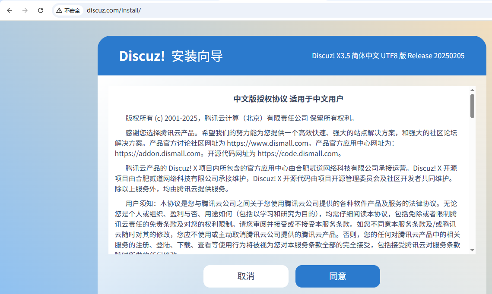

#### 测试系统

在Windows的浏览器中：

访问前台系统：<http://www.discuz.com/>

访问后台系统：<http://www.discuz.com/admin.php>

### 部署wordpress系统

#### 导入wordpress源码

```shell
上传wordpress源码到Linux服务器

解压
# unzip wordpress-6.1.1-zh_CN.zip

创建wordpress项目目录
# mkdir /wordpress

复制源代码到wordpress项目目录
# cp -r wordpress/* /wordpress/

更改wordpress目录的拥有者、所属组为apache
# chown -R apache.apache /wordpress/
```

#### 准备wordpress数据库

```shell
# mysql		连接MySQL数据
MariaDB [(none)]> create database wordpress;	切记创建数据库要再敲一遍，可以检查是否创建成功
MariaDB [(none)]> set password=password('lhp@123');	设置数据库管理员密码
MariaDB [(none)]> \q
```

#### 配置wordpress的虚拟主机

```shell
# vim /etc/httpd/conf.d/wordpress.conf
<VirtualHost *:80>
        ServerName      www.wp.com
        DocumentRoot    /wordpress
</VirtualHost>

<Directory "/wordpress">
        Require all granted
</Directory>

重启httpd服务器
# systemctl restart httpd
```

> 说明：本来上面的虚拟主机名想配置成 www.wordpress.com，之后在Windows中的hosts文件中再配置一下，但是 www.wordpress.com 这个域名貌似有点关键，都配置好了但是不生效。后来简化配置为 www.wp.com

#### Windows中配置域名解析

```shell
在C:\Windows\System32\drivers\etc\hosts文件中添加如下内容：
192.168.126.170		www.wp.com
```

#### 安装wordpress系统

使用Windows中的浏览器访问进行安装，操作步骤和之前一样的！

访问：http://www.wp.com

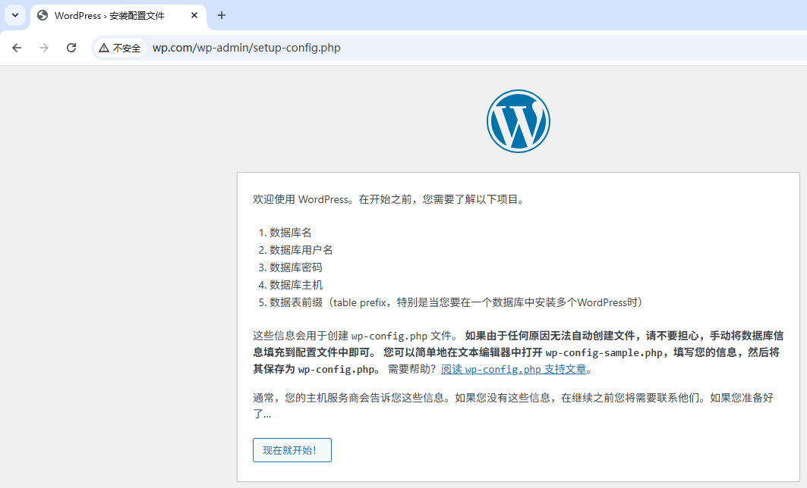

#### 测试系统

在Windows的浏览器中：

访问前台系统：[http://www.wp.com/](http://www.discuz.com/)

访问后台系统：[http://www.](http://www.discuz.com/admin.php)wp.com/wp-admin

## CentOS7部署网上商城ecshop（不讲）

### Logo


### 基础环境

```shell
[root@apache ~]# sed -ri '/^SELINUX=/cSELINUX=disabled' /etc/selinux/config 
[root@apache ~]# setenforce 0
[root@apache ~]# systemctl stop firewalld.service 
[root@apache ~]# systemctl disable firewalld.service
```

### 安装LAMP

```shell
[root@apache ~]# yum -y install httpd mariadb-server mariadb php php-mysql gd php-gd
[root@apache ~]# systemctl start httpd mariadb
[root@apache ~]# systemctl enable httpd mariadb
```

### 下载源码包

ECSHOP官网：<http://www.ecshop.com/>

```shell
[root@apache ~]# mkdir -p /ecshop
[root@apache ~]# unzip          ECShop_V3.0.0_UTF8_release0518.zip
[root@apache ~]# cp    -rf    ECShop_V3.0.0_UTF8_release0518/*  /ecshop
```

### 配置HTTP虚拟主机

```shell
[root@apache ~]# vim	/etc/httpd/conf.d/ecshop.conf
<VirtualHost *:80>
  ServerName 		www.ecshop.com
  ServerAlias   ecshop.com
  DocumentRoot 	/webroot/ecshop
</VirtualHost>

<Directory "/webroot/ecshop">
  Require all granted
</Directory>
[root@apache ~]# httpd -t httpd				配置文件语法检测
[root@apache ~]# systemctl restart httpd
```

### Linux客户端配置域名解析

```shell
[root@localhost ~]# vim /etc/hosts //DNS解析
192.168.142.134www.ecshop.com          //134为 web server IP
```

### 前台安装源码包

#### 欢迎界面

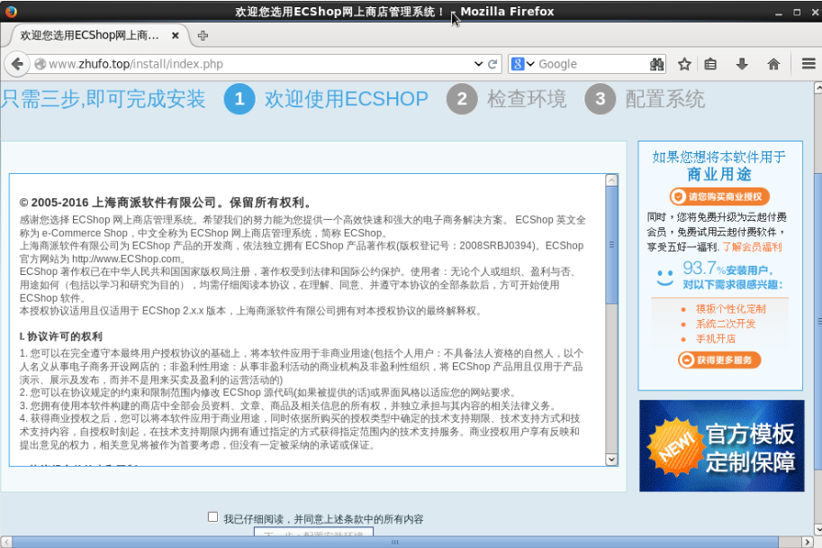

#### 授权源码目录

```shell
[root@apache ~]# chmod	-R	777	/webroot/ecshop/
```

#### 检测环境

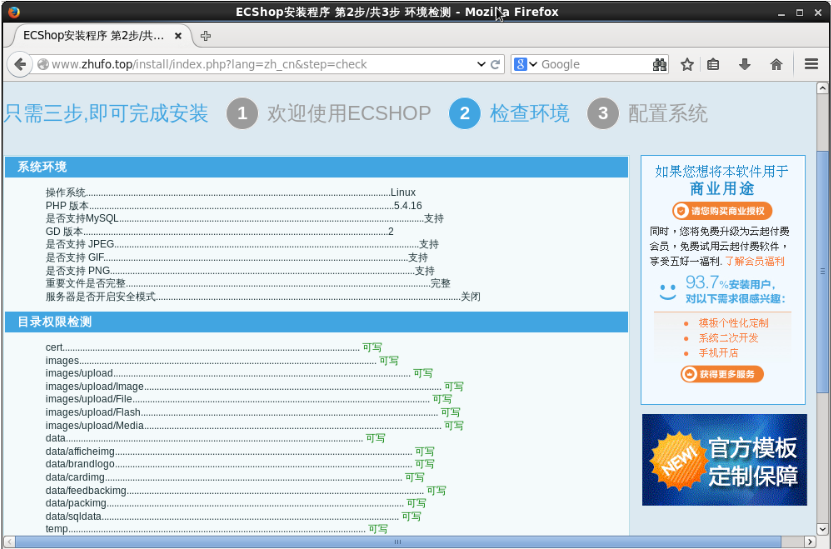

#### 配置时区

报错信息


修改时区

```shell
[root@apache ~]# vim	/etc/php.ini
原先的样子
;date.timezone =
修改后的样子
date.timezone = Asia/Shanghai
[root@apache ~]# systemctl restart httpd
```

#### 配置数据库信息

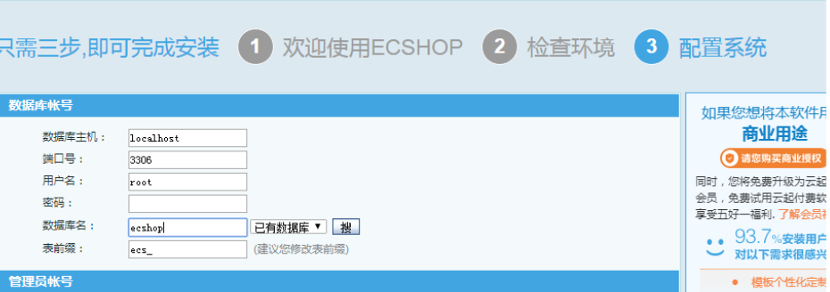

#### 站长信息

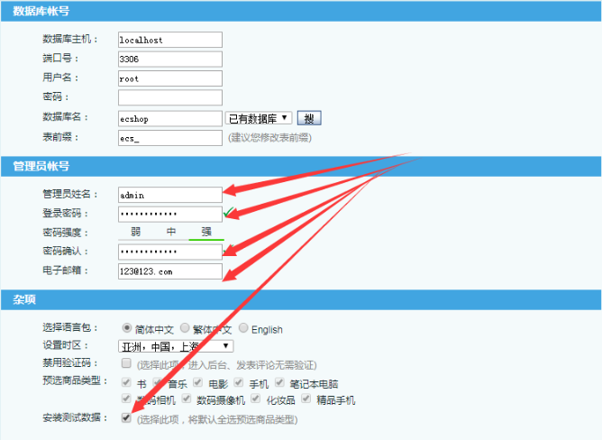

跳过激活


### windows客户端访问电商平台

域名解析

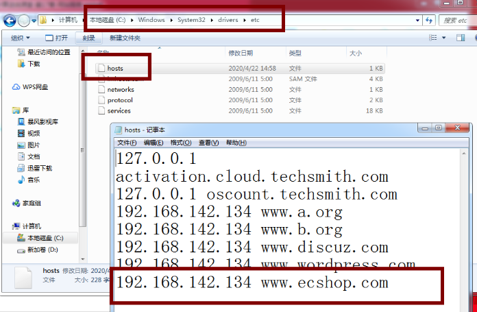

打开客户端浏览器

<http://www.ecshop.com/>

### windows客户端管理后台页面

<http://www.ecshop.com/admin/privilege.php?act=login>


这是前台安装源码包中，设置的站长信息

## CentOS7部署网校系统edusoho（不讲）

### 基础环境

```shell
[root@apache ~]# sed -ri '/^SELINUX=/cSELINUX=disabled' /etc/selinux/config 
[root@apache ~]# setenforce 0
[root@apache ~]# systemctl stop firewalld.service 
[root@apache ~]# systemctl disable firewalld.service
```

### epel源

```shell
# yum -y install epel-release
如果您的服务器yum repolist中有epel源，则不需要安装这一步。
```

### 安装LAMP

```shell
# yum -y install bash-completion httpd php php-cli php-curl php-fpm php-intl php-mcrypt php-mysql php-gd    php-mbstring php-xml php-dom mariadb-server mariadb
# systemctl start httpd mariadb
```

### 准备数据库

```shell
# mysql
MariaDB [(none)]> create database edusoho;
检查MariaDB [(none)]> show databases;
```

### 设置上传限制\[可选]

```shell
网校的视频文件比较大，将默认的2M上传改大些。
# vim /etc/php.ini
post_max_size = 1024M
memory_limit = 1024M
upload_max_filesize = 1024M
date.timezone = Asia/ShangHai

[可选]
# vim /etc/php-fpm.d/www.conf
listen.owner = apache
listen.group = apache
listen.mode = 0666

# systemctl start php-fpm
# systemctl enable php-fpm
```

### 上传源码

```shell
# wget http://download.edusoho.com/edusoho-7.5.12.tar.gz	//或者本地上传
# tar xf edusoho-7.5.12.tar.gz
# mkdir -p /webroot/edusoho
# cp -rf edusoho/* /webroot/edusoho
# chown -R apache.apache /webroot/edusoho
```

### 设置虚拟主机

```shell
# vim /etc/httpd/conf.d/edusoho.conf
<VirtualHost *:80>
   ServerName www.edusoho.com
   DocumentRoot /webroot/edusoho/web
</VirtualHost>

<Directory "/webroot/edusoho/web">
   Require all granted
</Directory>

# systemctl restart httpd
```

### 客户端配置DNS

书写hosts文件

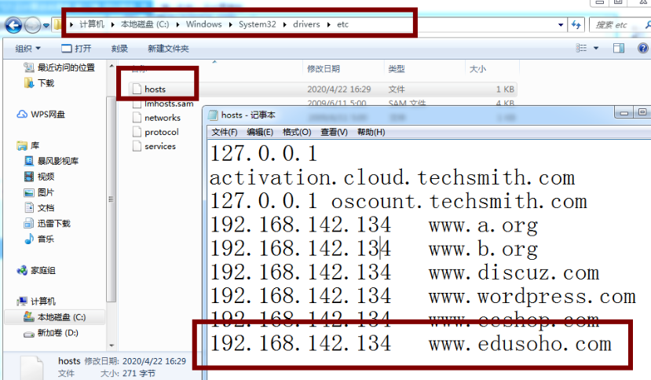

### 客户端前台安装

浏览器访问<http://www.edusoho.com/install/start-install.php>

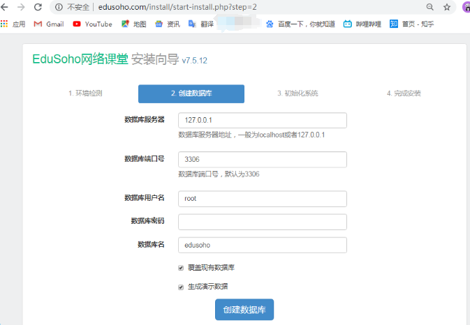

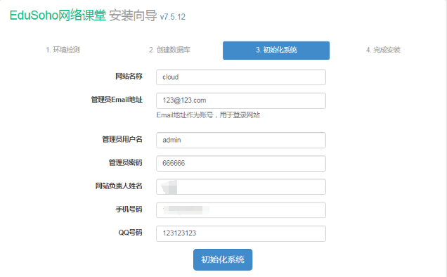

请记住管理员用户名和管理员密码。这是上传视频的账号密码

### 正式访问

<http://www.edusoho.com/app.php>

需要创建课程，分配课时，方可访问。

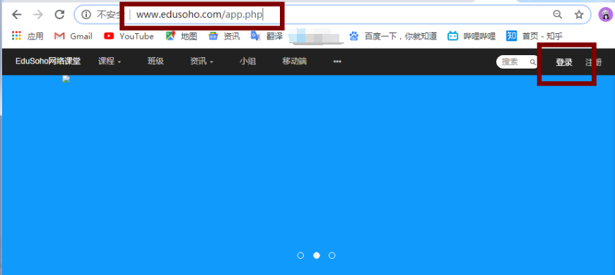


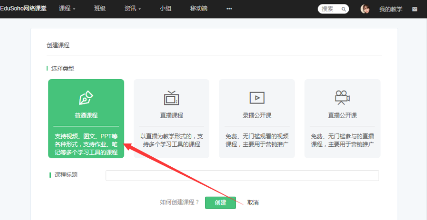

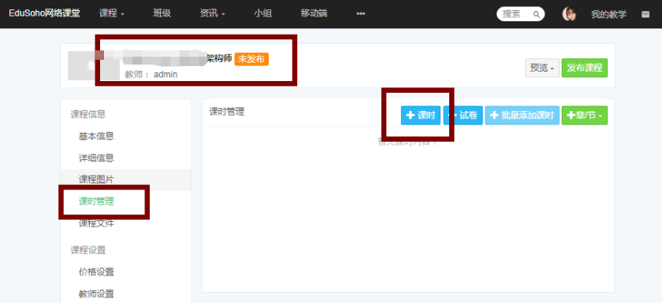

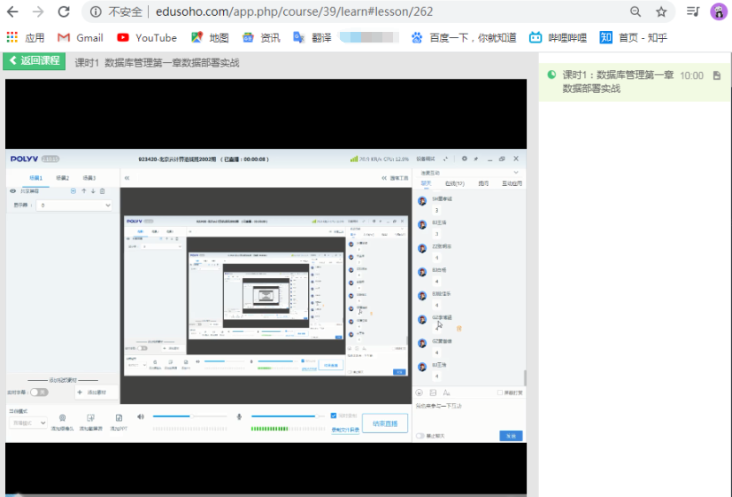


> 更新: 2026-03-31 14:43:16  
> 原文: <https://www.yuque.com/u41736172/az9urv/dk3ogktfl86qrr46>