# 18.域名服务

# 一、前言

## 概述

互联网的访问依靠IP地址。但IP地址不好记。

所以使用域名服务（DNS，好记名），来替代访问的地址。

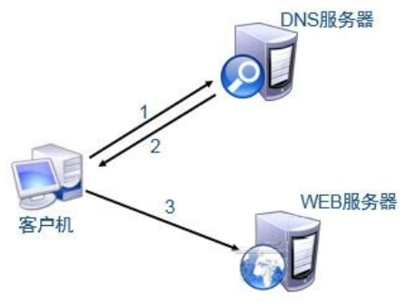

# 二、基本概念

## hosts文件

Windows

* `C:\Windows\System32\drivers\etc\hosts`
* 需要超级管理员权限

Linux

* `/etc/hosts`

作用：实现名字解析，主要为本地主机名、集群节点提供快速解析

缺点：不便于查询，更新

## DNS

DNS（Domain Name System，域名系统）

作用： 实现名字解析（例如将主机名解析为IP）（分布式，层次性）

## FQDN

FQDN：(Fully Qualified Domain Name)完全合格域名/全称域名

baidu.com.

www.baidu.com.

www.sina.com.

www.qq.com.

www.music.baidu.com.

www.icbc.com.cn.

主机名.四级域.三级域.二级域.顶级域.（根域）

## 命名空间

命名空间name space：用于给互联网上的主机命名的一种机制

空间分类

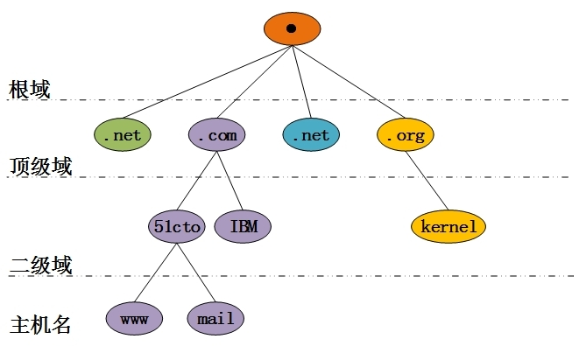


# 三、DNS域名解析示例（本地）

## 环境

服务器192.168.126.170

客户机192.168.126.???

## 客户机DNS本地缓存记录

```shell
linux客户机
# vim	/etc/hosts
192.168.126.170  www.memeda.com
```

## 客户机主机测试

```shell
# ping www.memeda.com			1.看到解析成功	2.看到联通成功

# elinks http://www.memeda.com
# curl http://www.memeda.com
```

## 网站服务器辅助验证

在192.168.126.170服务器端做如下操作：

```shell
# yum install -y httpd
# systemctl start httpd
# systemctl stop firewalld
# echo memeda > /var/www/html/index.html
```

然后在192.168.126.??? 客户机做如下操作：

```shell
# curl http://www.memeda.com
```

# 四、ISP（阿里）域名申请及解析

## 购买阿里云服务器

1. 搜索阿里云


2. 登录阿里云，使用支付宝扫码即可


3. 选择云服务器ECS

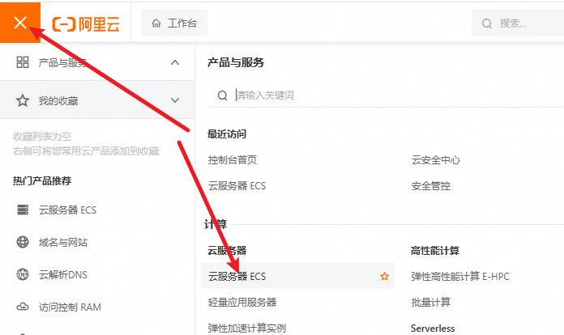

4. 创建实例

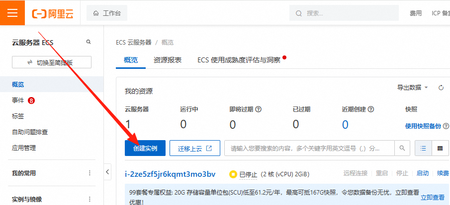

5. 选择付费模式及地域


选择地域是中国香港，是因为后面我们申请域名的话不用备案，大陆的服务器绑定域名需要备案！

6. 选择实例规格，1个CPU、2G内存

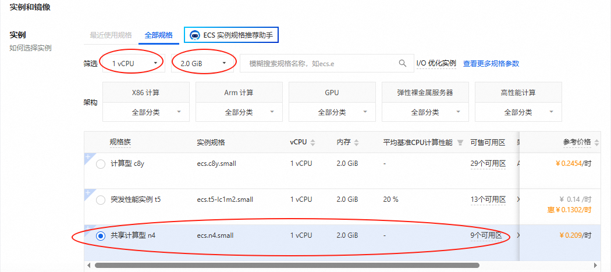

7. 选择系统镜像为CentOS7.9

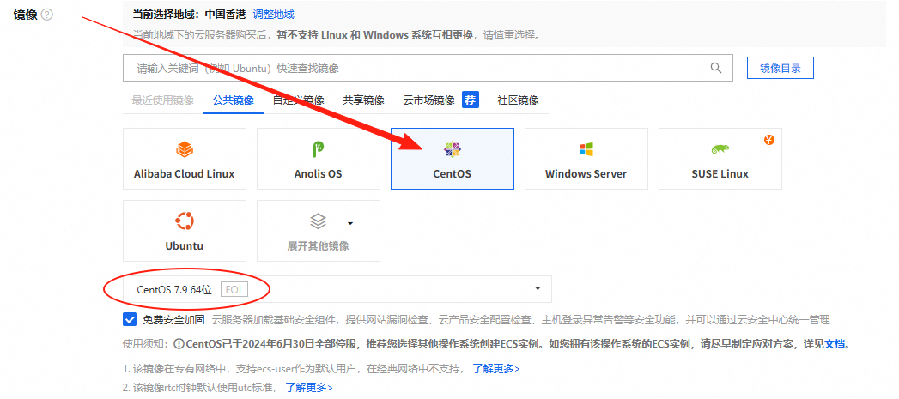

8. 选择磁盘大小：40G

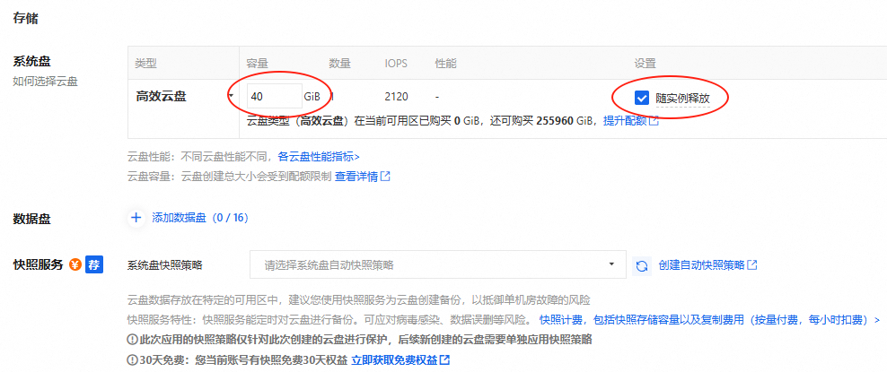

9. 选择带宽


10. 选择开放的端口

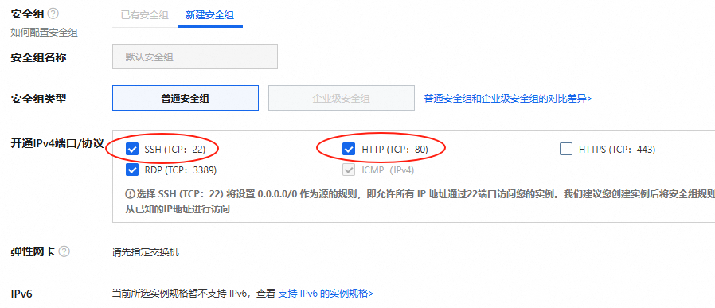

11. 设置密码

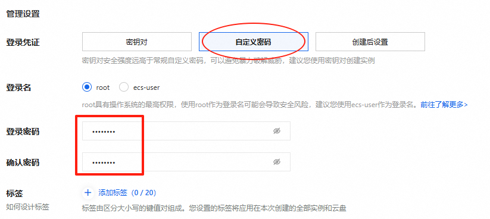

12. 设置释放时间及下单

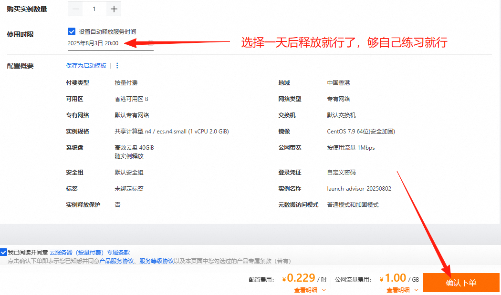

13. 付款就可以了（但是，现在阿里云付费方式是按量付费的话，账户中最少得有100元.........）

大家看自己情况去买吧，不买也无所谓... 其实就是在云服务器中使用Linux系统而已。

再一个，云服务器购买完，如果不用了的话，是可以退订的，在订单中进行退。有五天无理由退订和非全额退订。

## 在阿里云部署论坛系统

### 远程连接阿里云服务器

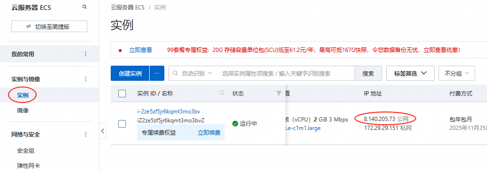

### 安装LAMP环境

```shell
安装LAMP环境
# yum install -y httpd mariadb-server mariadb php php-mysqlnd gd php-gd

启动网站和数据库
# systemctl start httpd mariadb

开机启动网站和数据库
# systemctl enable httpd mariadb
```

### 导入discuz源码

```shell
上传discuz源码到Linux服务器
注意：不能上传之前用的discuz 3.5 版本了，因为我们用的是CentOS7.9，版本较低，我们本次使用discuz 3.4 版本。discuz_3.4.zip

安装unzip工具
# yum -y install unzip

解压
# unzip discuz_3.4.zip

复制discuz目录中的所有内容到 /var/www/html中
# cp -r discuz/* /var/www/html/

变更/var/www/html目录的拥有者与所属组
# chown -R apache.apache /var/www/html
```

### 准备数据库

```shell
# mysql		连接MySQL数据库
MariaDB [(none)]> create database discuz;		切记创建数据库要再敲一遍，可以检查是否创建成功

MariaDB [(none)]> set password=password('lhp@123');	设置数据库管理员密码
MariaDB [(none)]> \q	退出数据库
```

### 安装discuz系统

在Windows中通过浏览器访问：后续的操作和之前都一样。

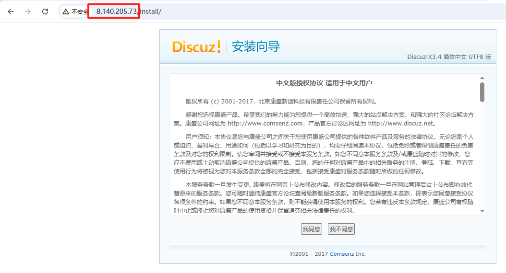

### 客户端测试

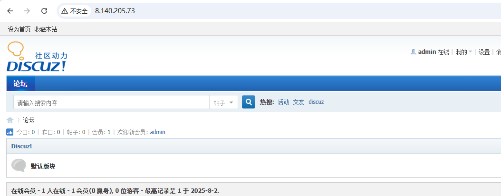

不同的是，我们现在是将论坛项目部署到阿里云了，也就是在公网中呢，如果将这个地址：<http://8.140.205.73/> 发送给你的朋友、同学，他们也都是可以访问到我们的论坛项目的！

## 购买域名

1. 点击域名与网站

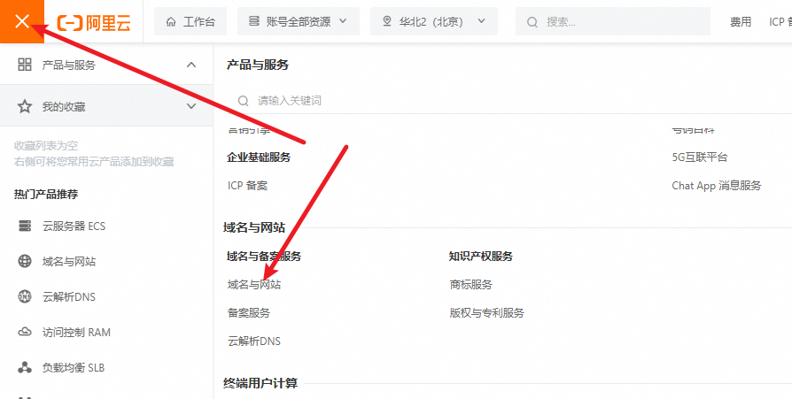

2. 进入域名服务


3. 输入你想要的域名，点击查询


可以看到都太贵了，大家找点便宜的买个：


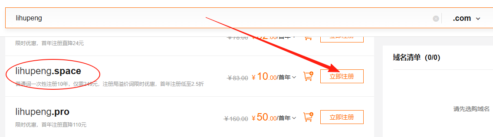

4. 购买域名

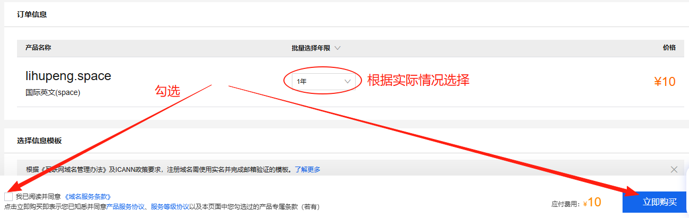

5. 查看买到的域名


## 域名解析

上面的案例中，我们购买了阿里云服务器，并且在阿里云上面部署了论坛项目，我们的论坛项目可以通过公网的IP地址去访问！

然后我们购买了一个域名，下面我们就将该域名和我们购买的阿里云服务器公网IP绑在一起！

以后就可以通过域名访问我们的论坛项目了！


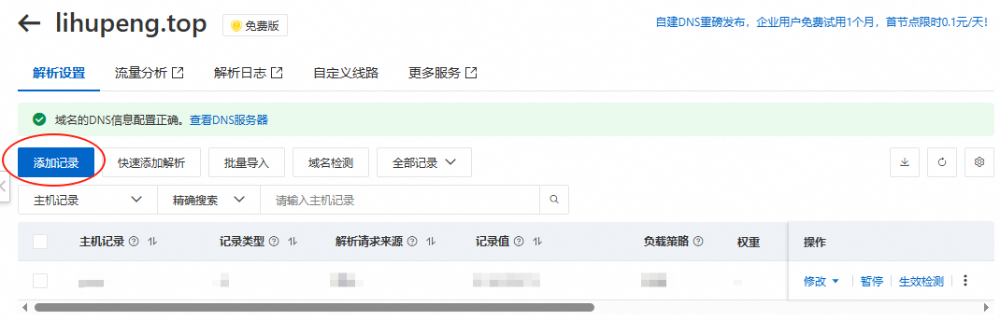


最终的结果：

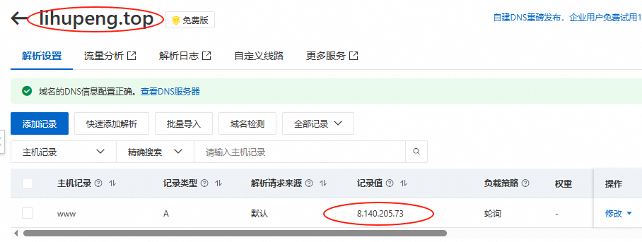

## 客户端域名测试

测试通过域名访问我们的论坛项目：

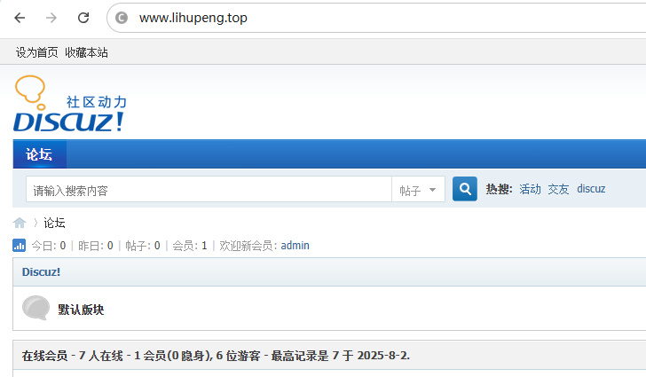

但是，如果在半小时左右后再次通过域名访问，会提示：


我们需要对该域名进行备案才能正常访问！

## 域名备案（略）

第一次购买域名，需要个人身份信息。

# 五、域名解析流程

## DNS解析流程

```shell
例如客户端解析 www.126.com
1.客户端查询自己的缓存（包含hosts中的记录），如果没有将查询发送/etc/resolv.conf中的DNS服务器

2.如果本地DNS服务器对于请求的信息具有权威性，会将（权威答案）发送到客户端。

3.否则（不具有权威性），如果DNS服务器在其缓存中有请求信息，则将（非权威答案）发送到客户端 

4.如果缓存中没有该查询信息，DNS服务器将搜索权威DNS服务器以查找信息：
  a.从根区域开始，按照DNS层次结构向下搜索，直至对于信息具有权威的名称服务器，为客户端获答案，DNS服务器将信息传递给客户端，并在自己的缓存中保留一个副本，以备以后查找。
  b.转发到其它DNS服务器
```


## 递归/迭代

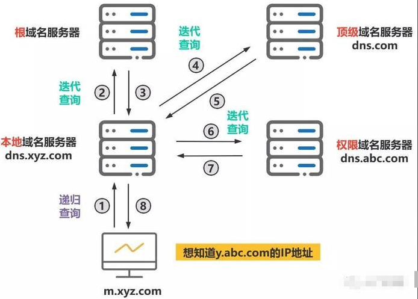

上图有个地方写错了，是权威域名服务器。

客户端是先找本地DNS服务器！

本地DNS服务器：如果你给电脑指定了DNS服务器，就是你指定的，如果你没指定，就用联通、移动。

一般我们先去本地DNS服务器，通过递归查询的方式查找域名对应的IP，如果没找到再通过迭代的方式去权威DNS服务器去一级一级的往下查找！

## 服务器类型

主服务器

* centos7  	bind
* centos9 	bind

从服务器

缓存服务器

## 正向解析/反向解析

DNS服务主要起到两个作用：

1）可以把相对应的域名解析为对应的IP地址，这叫正向解析。

2）可以把相对应的IP地址解析为对应的域名，这叫反向解析。（反垃圾邮件）

# <font style="color:rgb(51, 51, 51);">六、DNS服务器的搭建</font>

## <font style="color:rgb(51, 51, 51);">DNS服务器端软件</font>

<font style="color:rgb(51, 51, 51);">DNS 的域名解析都是 </font>**<font style="color:rgb(51, 51, 51);">udp/53</font>**<font style="color:rgb(51, 51, 51);"> . 主从之间的数据传输默认使用</font>**<font style="color:rgb(51, 51, 51);">tcp/53</font>**

<font style="color:rgb(51, 51, 51);">DNS服务器端软件：</font>

<font style="color:rgb(51, 51, 51);">Bind是一款开放源码的DNS服务器软件，Bind由美国加州大学Berkeley（伯克利）分校开发和维护的，全名为Berkeley Internet Name Domain它是目前世界上使用最为广泛的DNS服务器软件，支持各种unix平台和windows平台。BIND现在由互联网系统协会（Internet Systems Consortium）负责开发与维护。</font>

## <font style="color:rgb(51, 51, 51);">DNS服务器搭建</font>

### <font style="color:rgb(51, 51, 51);">环境准备</font>

| **<font style="color:rgb(51, 51, 51);">编号</font>** | **<font style="color:rgb(51, 51, 51);">主机名称</font>** | **<font style="color:rgb(51, 51, 51);">IP地址</font>** | **<font style="color:rgb(51, 51, 51);">备注信息</font>** |
| :--- | :--- | :--- | :--- |
| <font style="color:rgb(51, 51, 51);">1</font> | <font style="color:rgb(51, 51, 51);">client.lhp.cn</font> | <font style="color:rgb(51, 51, 51);">192.168.126.171</font> | <font style="color:rgb(51, 51, 51);">client客户端，用于测试</font> |
| <font style="color:rgb(51, 51, 51);">2</font> | <font style="color:rgb(51, 51, 51);">dns.lhp.cn</font> | <font style="color:rgb(51, 51, 51);">192.168.126.172</font> | <font style="color:rgb(51, 51, 51);">dns服务器，用于实现域名解析</font> |
| <font style="color:rgb(51, 51, 51);">3</font> | <font style="color:rgb(51, 51, 51);">web.lhp.cn</font> | <font style="color:rgb(51, 51, 51);">192.168.126.173</font> | <font style="color:rgb(51, 51, 51);">web服务器，用于搭建内部web服务</font> |

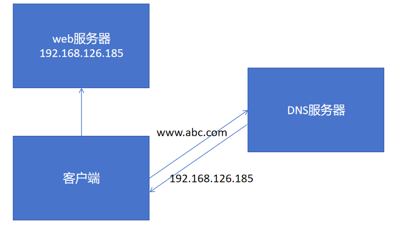

<font style="color:rgb(51, 51, 51);">① 更改主机名称与IP地址</font>

```shell
# hostnamectl set-hostname client.lhp.cn
# hostnamectl set-hostname dns.lhp.cn
# hostnamectl set-hostname web.lhp.cn

# su

# vim /etc/NetworkManager/system-connections/ens33.nmconnection
把IP分别给改好！
```

<font style="color:rgb(51, 51, 51);">② 使用MX进行连接</font>

<font style="color:rgb(51, 51, 51);">③ 关闭防火墙与SELinux</font>

```shell
# systemctl stop firewalld
# systemctl disable firewalld

# setenforce 0
# vim /etc/selinux/config
SELINUX=disabled
```

<font style="color:rgb(51, 51, 51);">④ 配置YUM源（有网配置公网YUM源、无网就配置光盘或自建YUM源）</font>

```shell
# yum clean all
# yum makecache
```

### <font style="color:rgb(51, 51, 51);">安装DNS软件</font>

<font style="color:rgb(51, 51, 51);">DNS服务器：</font>

```shell
# yum install bind -y
```

<font style="color:rgb(51, 51, 51);">安装完毕后，可以使用rpm -q查询是否安装成功：</font>

```shell
# rpm -q bind

# rpm -ql bind
# 日志轮转文件
/etc/logrotate.d/named
# 配置文件目录
/etc/named
# 主配置文件
/etc/named.conf
# zone文件,定义域
/etc/named.rfc1912.zones
# 服务管理脚本
/usr/lib/systemd/system/named.service
# 二进制程序文件
/usr/sbin/named
# 检测配置文件
/usr/sbin/named-checkconf
# 检测域文件
/usr/sbin/named-checkzone
# 根域服务器
/var/named/named.ca
# 正向解析区域文件模板
/var/named/named.localhost
# 反向解析区域文件模板
/var/named/named.loopback
# dns服务器下载文件的默认路径
/var/named/slaves
# 进程pid
/var/rum/named
```

> <font style="color:rgb(119, 119, 119);">find主要用来搜索计算机中的文件，rpm主要用来检查计算机中是否安装过某个软件</font>

### <font style="color:rgb(51, 51, 51);">DNS正向解析配置(域名=>IP)</font>

<font style="color:rgb(51, 51, 51);">/etc/named.conf主要配置访问权限控制（哪些IP或哪些主机可以访问DNS服务器）</font>

<font style="color:rgb(51, 51, 51);">/etc/named.rfc1912.zones主要定义域名如何解析（正向解析），解析到具体哪个IP地址</font>

<font style="color:rgb(51, 51, 51);">① 对named.conf以及named.rfc1912.zones进行备份</font>

```shell
# cp /etc/named.conf /etc/named.conf.bak
# cp /etc/named.rfc1912.zones /etc/named.rfc1912.zones.bak
```

<font style="color:rgb(51, 51, 51);">② named.conf主配置文件详解（访问权限控制）</font>

```shell
# vim /etc/named.conf
```

<font style="color:rgb(51, 51, 51);">添加任何主机都可以访问的权限：</font>

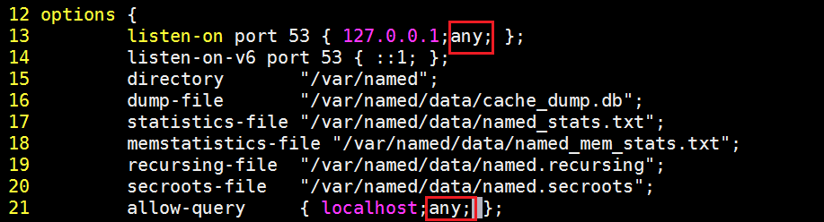

<font style="color:rgb(51, 51, 51);">③ zones子配置文件详解（域名应该指向哪个IP地址）</font>

```shell
# vim /etc/named.rfc1912.zones
...
zone "lhp.cluster" IN {		# www.lhp.cluster
        type master;
        file "lhp.cluster.zone";
        allow-update { none; };
};
```

> <font style="color:rgb(119, 119, 119);">扩展 => vim => ：19，23 co 42，把19-23行，copy到42行的后面</font>

<font style="color:rgb(51, 51, 51);">④ 在/var/named目录创建</font><code><font style="color:rgb(51, 51, 51);">lhp.cluster.zone</font></code><font style="color:rgb(51, 51, 51);">文件定义正向解析</font>

```shell
# cd /var/named
# cp -p named.localhost lhp.cluster.zone
```

> <font style="color:rgb(119, 119, 119);">扩展：-p代表复制文件时保留文件的原有属性</font>

<font style="color:rgb(51, 51, 51);">⑤ 编辑</font><code><font style="color:rgb(51, 51, 51);">lhp.cluster.zone</font></code><font style="color:rgb(51, 51, 51);">文件，定义域名的指向</font>

```shell
# vim lhp.cluster.zone
```

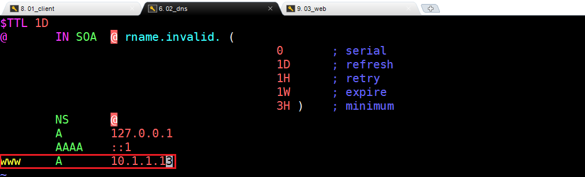

> <font style="color:rgb(119, 119, 119);">扩展：zone文件的格式说明</font>

```shell
zone文件详解
# $TTL  缓存的生存周期
# @ = zonename = lhp.cluster  当前域
# IN  互联网
# SOA 开始授权
# NS  dns服务端	nameserver
# A   ipv4 正向
# AAAA IPV6
# CNAME 别名
# MX  邮件交互记录  5 数字代表优先级 数字越小优先级越高

# 0       ; serial    更新序列号	
# 1D      ; refresh   更新间隔（从服务器下载数据）
# 1H      ; retry     失败重试
# 1W      ; expire    区域文件的过期时间
# 3H )    ; minimum   缓存的最小生存周期

# D Day、H Hour、W Week				
```

### <font style="color:rgb(51, 51, 51);">检查named.conf与zones文件</font>

```shell
# named-checkconf /etc/named.conf
# named-checkconf /etc/named.rfc1912.zones

检查lhp.cluster.zone文件
# cd /var/named
# named-checkzone www.lhp.cluster lhp.cluster.zone
```

### <font style="color:rgb(51, 51, 51);">启动DNS服务（named）</font>

```shell
# systemctl start named
# netstat -tnlp |grep named
```

## <font style="color:rgb(51, 51, 51);">Web服务搭建</font>

web服务器：

```shell
# yum install httpd -y
# systemctl start httpd

# echo 'DNS Test ...' > /var/www/html/index.html
```

## <font style="color:rgb(51, 51, 51);">测试DNS服务器的正向解析</font>

<font style="color:rgb(51, 51, 51);">Client：客户端服务器操作</font>

### <font style="color:rgb(51, 51, 51);">添加DNS服务器</font>

```shell
# 临时
echo 'nameserver 192.168.126.172' > /etc/resolv.conf
注：电脑重启，网络刷新restart network，VMware挂起，临时DNS都会失效

# 永久添加
# vim /etc/NetworkManager/system-connections/ens33.nmconnection
DNS=192.168.126.172
```

### <font style="color:rgb(51, 51, 51);">使用nslookup检测正向解析是否生效</font>

```shell
# nslookup www.lhp.cluster
```

### <font style="color:rgb(51, 51, 51);">使用elinks命令行浏览器或curl来实现访问</font>

```shell
# yum install elinks -y
# elinks
输入www.lhp.cluster
```

```shell
# curl http://www.lhp.cluster
```

## <font style="color:rgb(51, 51, 51);">DNS的反向解析</font>

<font style="color:rgb(51, 51, 51);">目标：把192.168.126.173这个IP地址通过DNS服务器指向</font>[<font style="color:rgb(65, 131, 196);">www.lhp.cluster</font>](https://www.itcast.cluster)<font style="color:rgb(51, 51, 51);">域名</font>

<font style="color:rgb(51, 51, 51);">第一步：开启网络的访问权限控制</font>

```shell
# vim /etc/named.conf
12 options {
13         listen-on port 53 { 127.0.0.1;any; };
14         listen-on-v6 port 53 { ::1; };
15         directory       "/var/named";
16         dump-file       "/var/named/data/cache_dump.db";
17         statistics-file "/var/named/data/named_stats.txt";
18         memstatistics-file "/var/named/data/named_mem_stats.txt";
19         recursing-file  "/var/named/data/named.recursing";
20         secroots-file   "/var/named/data/named.secroots";
21         allow-query     { localhost;any;};
```

<font style="color:rgb(51, 51, 51);">第二步：在zones文件中定义zone文件</font>

```shell
# vim /etc/named.rfc1912.zones
49 zone "126.168.192.in-addr.arpa" IN {
50         type master;
51         file "192.168.126.zone";
52         allow-update { none; };
53 };
```

<font style="color:rgb(51, 51, 51);">第三步：cd /var/named进入到DNS zone配置文件目录，复制named.loopback文件</font>

```shell
# cd /var/named
# cp -p named.loopback 192.168.126.zone
```

<font style="color:rgb(51, 51, 51);">第四步：编辑192.168.126.zone文件，把IP地址=>192.168.126.173指向</font>[<font style="color:rgb(65, 131, 196);">www.lhp.cluster</font>](https://www.itcast.cluster)<font style="color:rgb(51, 51, 51);">域名</font>

```shell
$TTL 1D
@       IN SOA  @ rname.invalid. (
                                        0       ; serial
                                        1D      ; refresh
                                        1H      ; retry
                                        1W      ; expire
                                        3H )    ; minimum
        NS      @
        A       127.0.0.1
        AAAA    ::1
        PTR     localhost.
#增加一条反向解析，把192.168.126.173 => PTR => www.lhp.cluster
173      PTR     www.lhp.cluster
```

<font style="color:rgb(51, 51, 51);">第五步：检查与客户端测试</font>

<font style="color:rgb(51, 51, 51);">DNS服务器：</font>

```shell
# named-checkconf /etc/named.conf
# named-checkconf /etc/named.rfc1912.zones

# cd /var/named
# named-checkzone 192.168.126.zone 192.168.126.zone

# 别忘了重启DNS服务
# systemctl restart named
```

<font style="color:rgb(51, 51, 51);">客户端检测：</font>

```shell
# echo 'nameserver 192.168.126.172' > /etc/resolv.conf
# nslookup 192.168.126.173
www.lhp.cluster.126.168.192.in-addr.arpa.
```

## <font style="color:rgb(51, 51, 51);">多域DNS服务器搭建</font>

<font style="color:rgb(51, 51, 51);">需求：搭建一个DNS服务器，可以同时解析test.net和haha.cc域</font>

| **<font style="color:rgb(51, 51, 51);">编号</font>** | **<font style="color:rgb(51, 51, 51);">域名</font>** | **<font style="color:rgb(51, 51, 51);">IP地址</font>** |
| :--- | :--- | :--- |
| <font style="color:rgb(51, 51, 51);">1</font> | [<font style="color:rgb(65, 131, 196);">www.test.net</font>](https://www.test.net) | <font style="color:rgb(51, 51, 51);">192.168.126.173</font> |
| <font style="color:rgb(51, 51, 51);">2</font> | <font style="color:rgb(51, 51, 51);">bbs.haha.cc</font> | <font style="color:rgb(51, 51, 51);">192.168.126.173</font> |

<font style="color:rgb(51, 51, 51);">第一步：更改named.conf文件，设置网络访问权限</font>

```shell
# vim /etc/named.conf
12 options {
13         listen-on port 53 { 127.0.0.1;any; };
14         listen-on-v6 port 53 { ::1; };
15         directory       "/var/named";
16         dump-file       "/var/named/data/cache_dump.db";
17         statistics-file "/var/named/data/named_stats.txt";
18         memstatistics-file "/var/named/data/named_mem_stats.txt";
19         recursing-file  "/var/named/data/named.recursing";
20         secroots-file   "/var/named/data/named.secroots";
21         allow-query     { localhost;any;};
```

<font style="color:rgb(51, 51, 51);">第二步：更改named.rfc1912.zones，添加test以及haha域</font>

```shell
# vim /etc/named.rfc1912.zones
...
zone "test.net" IN {
        type master;
        file "test.net.zone";
        allow-update { none; };
};

zone "haha.cc" IN {
        type master;
        file "haha.cc.zone";
        allow-update { none; };
};
```

<font style="color:rgb(51, 51, 51);">第三步：进入/var/named目录，复制named.localhost</font>

```shell
# cd /var/named
# cp -p named.localhost test.net.zone
# cp -p named.localhost haha.cc.zone
```

<font style="color:rgb(51, 51, 51);">第四步：编辑test.net.zone与haha.cc.zone文件</font>

```shell
# vim test.net.zone
...
www 	A	 192.168.126.173

# vim haha.cc.zone
...
bbs		A	 192.168.126.173
```

<font style="color:rgb(51, 51, 51);">第五步：检测配置文件，然后启动named服务（重启）</font>

```shell
# named-checkconf /etc/named.conf
# named-checkconf /etc/named.rfc1912.zones

# cd /var/named
# named-checkzone www.test.net test.net.zone
# named-checkzone bbs.haha.cc haha.cc.zone

# systemctl restart named
```

第六步：客户端检测

在Client服务器：

```shell
# nslookup www.test.net

# nslookup bbs.haha.cc
```

## <font style="color:rgb(51, 51, 51);">DNS主从部署</font>

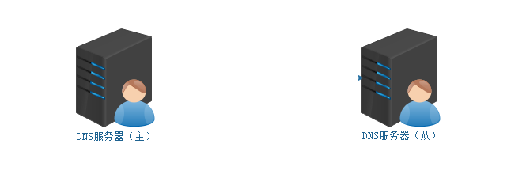

<font style="color:rgb(51, 51, 51);">主从部署的核心思路：</font>

```shell
1. master和slave的系统时间保持一致
2. slave服务器上安装相应的软件（系统版本、软件版本保持一致）
3. 根据需求修改相应的配置文件（master和slave都应该去修改）
4. 主从同步的核心是slave同步master上的区域文件（zone文件）
```

> <font style="color:rgb(119, 119, 119);">master：主	slave：从</font>

<font style="color:rgb(51, 51, 51);">第一步：准备一台slave从服务器(略)</font>

<font style="color:rgb(51, 51, 51);">① 克隆 ② 更改主机名称以及IP地址（更改UUID编号、关闭NetworkManager）③ 关闭防火墙与SELinux ④ 配置YUM源</font>

| **<font style="color:rgb(51, 51, 51);">编号</font>** | **<font style="color:rgb(51, 51, 51);">主机名称</font>** | **<font style="color:rgb(51, 51, 51);">IP地址</font>** | **<font style="color:rgb(51, 51, 51);">备注信息</font>** |
| :--- | :--- | :--- | :--- |
| <font style="color:rgb(51, 51, 51);">1</font> | <font style="color:rgb(51, 51, 51);">slave.lhp.cn</font> | <font style="color:rgb(51, 51, 51);">192.168.126.174</font> | <font style="color:rgb(51, 51, 51);">dns slave从服务器</font> |

<font style="color:rgb(51, 51, 51);">第二步：更改主dns服务器，允许其他的从服务器下载同步资源</font>

```shell
# vim /etc/named.conf
12 options {
13         listen-on port 53 { 127.0.0.1;any; };
14         listen-on-v6 port 53 { ::1; };
15         allow-transfer {192.168.126.174; };	=>  允许从服务器的IP地址过来同步资源
16         directory       "/var/named";
17         dump-file       "/var/named/data/cache_dump.db";
18         statistics-file "/var/named/data/named_stats.txt";
19         memstatistics-file "/var/named/data/named_mem_stats.txt";
20         recursing-file  "/var/named/data/named.recursing";
21         secroots-file   "/var/named/data/named.secroots";
22         allow-query     { localhost;any;};


# systemctl restart named
```

<font style="color:rgb(51, 51, 51);">第三步：SLAVE从服务器配置</font>

```shell
# yum install bind -y

# vim /etc/named.conf
12 options {
13         listen-on port 53 { 127.0.0.1;any; };
14         listen-on-v6 port 53 { ::1; };
15         directory       "/var/named";
16         dump-file       "/var/named/data/cache_dump.db";
17         statistics-file "/var/named/data/named_stats.txt";
18         memstatistics-file "/var/named/data/named_mem_stats.txt";
19         recursing-file  "/var/named/data/named.recursing";
20         secroots-file   "/var/named/data/named.secroots";
21         allow-query     { localhost;any; };

# vim /etc/named.rfc1912.zones
zone "test.net" IN {
        type slave;
        file "slaves/test.net";
        masters { 192.168.126.172; };
};

zone "haha.cc" IN {
        type slave;
        file "slaves/haha.cc";
        masters { 192.168.126.172; };
};

# 检测配置文件是否有错（略）
# named-checkconf ...

# systemctl restart named
```

<font style="color:rgb(51, 51, 51);">第四步：在Client客户端，把Slave从服务器的IP设置为DNS</font>

```shell
# echo 'nameserver 192.168.126.174' > /etc/resolv.conf
# nslookup www.test.net
```

## 补充：DNS配置说明

我们有两个地方可以配置DNS：

第一个：

```shell
# vim /etc/NetworkManager/system-connections/ens33.nmconnection
```

第二个：

```shell
# cat /etc/resolv.conf
```

上面的两种配置方式，第二种是优先使用的！！！！

默认你在第一种方式中配置了DNS，第二种方式的配置文件和你配置的是一样的！

如果我们使用第二种方式进行DNS的配置，那么该配置是临时有效的，关机、重启系统后就失效了！


> 更新: 2026-04-03 08:35:47  
> 原文: <https://www.yuque.com/u41736172/az9urv/ia3bvozcwdgn3xtx>