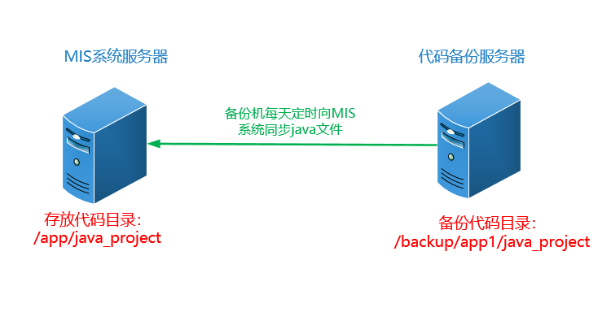
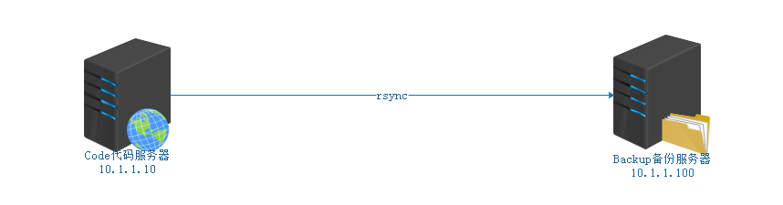

# 19.RSYNC文件同步服务

# 一、scp命令

## 作用

<font style="color:rgb(51, 51, 51);">用于Linux系统与Linux系统之间进行文件的传输（上传、下载）。</font>

## <font style="color:rgb(51, 51, 51);">语法</font>

<font style="color:rgb(51, 51, 51);">上传：</font>

```shell
# scp [选项] 本地文件路径 远程用户名@远程服务器的IP地址:远程文件存储路径
-r : 递归上传，主要针对文件夹
-P : 更换了SSH服务的默认端口必须使用-P选项
```

<font style="color:rgb(51, 51, 51);">下载：</font>

```shell
# scp [选项] 远程用户名@远程服务器的IP地址:远程文件路径 本地文件存储路径
-r : 递归上传，主要针对文件夹
-P : 更换了SSH服务的默认端口必须使用-P选项
```

# <font style="color:rgb(51, 51, 51);">二、RSYNC概述</font>

## <font style="color:rgb(51, 51, 51);">什么是rsync</font>

<font style="color:rgb(51, 51, 51);">rsync的好姐妹		</font>

* <font style="color:rgb(51, 51, 51);">sync 同步：刷新文件系统缓存，强制将修改过的数据块写入磁盘，并且更新超级块。</font>
* <font style="color:rgb(51, 51, 51);">async 异步：将数据先放到缓冲区，再周期性（一般是30s）的去同步到磁盘。</font>
* <font style="color:rgb(51, 51, 51);">rsync 远程同步：remote synchronous</font>

<font style="color:rgb(51, 51, 51);">数据同步过程</font>

<font style="color:rgb(51, 51, 51);">sync数据同步 => 保存文件（目标）=> 强制把缓存中的数据写入磁盘（立即保存），实时性要求比较高的场景</font>

<font style="color:rgb(51, 51, 51);">asyn数据异步 => 保存文件（目标）=> 将数据先放到缓冲区，再周期性（一般是30s）的去同步到磁盘，适合大批量数据同步的场景</font>

## <font style="color:rgb(51, 51, 51);">rsync特点</font>

* <font style="color:rgb(51, 51, 51);">可以镜像保存整个目录树和文件系统</font>
* <font style="color:rgb(51, 51, 51);">可以保留原有的权限(permission,mode)，owner,group,时间(修改时间,modify time)，软硬链接，文件acl，文件属性(attributes)信息等</font>
* <font style="color:rgb(51, 51, 51);">传输效率高，使用同步算法，只比较变化的（增量备份）</font>

<font style="color:rgb(51, 51, 51);">file1.txt file2.txt file3.txt(A服务器)</font>

<font style="color:rgb(51, 51, 51);">rsync实现数据同步=> 只同步file3.txt => 增量备份</font>

<font style="color:rgb(51, 51, 51);">file1.txt file2.txt(B服务器)</font>

* <font style="color:rgb(51, 51, 51);">支持匿名传输，方便网站镜像；也可以做验证，加强安全</font>

## <font style="color:rgb(51, 51, 51);">rsync与scp的区别</font>

<font style="color:rgb(51, 51, 51);">两者都可以实现远程同步，但是相对比而言，rsync能力更强</font>

<font style="color:rgb(51, 51, 51);">① 支持增量备份</font>

<font style="color:rgb(51, 51, 51);">② 数据同步时保持文件的原有属性</font>

# <font style="color:rgb(51, 51, 51);">三、RSYNC的使用</font>

## <font style="color:rgb(51, 51, 51);">基本语法</font>

```shell
# man rsync
NAME
       rsync — a fast, versatile, remote (and local) file-copying tool
       //一种快速、通用、远程（和本地）的文件复制工具
SYNOPSIS
	   //本地文件同步
	   Local:rsync [OPTION...] SRC... [DEST]
	   //远程文件同步
     Access via remote shell:
         Pull: rsync [OPTION...] [USER@]HOST:SRC... [DEST]
         Push: rsync [OPTION...] SRC... [USER@]HOST:DEST        
OPTION选项说明
-v    	详细模式输出
-a    	归档模式，递归的方式传输文件，并保持文件的属性，equals -rlptgoD
-r    	递归拷贝目录
-l			保留软链接
-p    	保留原有权限
-t     	保留原有时间（修改）
-g    	保留属组权限
-o     	保留属主权限
-D    	等于--devices  --specials    表示支持b,c,s,p类型的文件
-R	    保留相对路径
-H    	保留硬链接
-A    	保留ACL策略
-e     	指定要执行的远程shell命令，ssh更改端口常用选项
-E     	保留可执行权限
-X     	保留扩展属性信息  a属性
```

> <font style="color:rgb(119, 119, 119);">PUSH：推，相当于上传；PULL：拉，相当于下载</font>

## <font style="color:rgb(51, 51, 51);">本地文件同步</font>

<font style="color:rgb(51, 51, 51);">本地文件同步简单理解就是把文件从一个位置（同步=>拷贝）到另外一个位置（类似cp）</font>

<font style="color:rgb(51, 51, 51);">案例：/dir1、/dir2与/dir3，/dir1中创建三个文件file1、file2、file3，使用rsync本地同步</font>

```shell
# mkdir /dir1
# mkdir /dir2
# mkdir /dir3

# touch /dir1/file{1..3}

# rsync -av /dir1/ /dir2		=>   把/dir1目录中的所有文件拷贝到/dir2目录中
# rsync -av /dir1 /dir3			=>   把/dir1目录整体同步到/dir3目录中
```

**<font style="color:rgb(51, 51, 51);">案例：rsync --delete（删除目标目录里多余的文件）</font>**

<font style="color:rgb(51, 51, 51);">/dir1 </font><font style="color:rgb(51, 51, 51);">				</font><font style="color:rgb(51, 51, 51);"> === </font><font style="color:rgb(51, 51, 51);">			</font><font style="color:rgb(51, 51, 51);">/dir2</font>

<font style="color:rgb(51, 51, 51);">file1、file2</font><font style="color:rgb(51, 51, 51);">							</font><font style="color:rgb(51, 51, 51);"> file1、file2、file3</font>

<font style="color:rgb(51, 51, 51);">rsync --delete同步后，会自动删除file3文件。（让dir1与dir2目录中的文件高度一致）</font>

```shell
# rsync -av --delete /dir1/ /dir2
```

## <font style="color:rgb(51, 51, 51);">远程文件同步</font>

在做下面的案例时，先完成`四、实战任务（重点）中的 4. 环境准备`

> **<font style="background-color:#FBDE28;">两台Linux服务器之间使用rsync命令进行同步文件时，两边都需要安装rsync命令！</font>**

<font style="color:rgb(51, 51, 51);">Push：上传文件到远程服务器端</font>

```shell
# rsync -av 本地文件或目录 远程用户名@远程服务器的IP地址:目标路径
```

<font style="color:rgb(51, 51, 51);">案例：把linux.txt文档传输到远程服务器端（10.1.1.100）</font>

```shell
# rsync -av linux.txt root@10.1.1.100:/root
```

<font style="color:rgb(51, 51, 51);">案例：把shop文件夹传输到远程服务器端（10.1.1.100）</font>

```shell
# rsync -av shop root@10.1.1.100:/root
```

<font style="color:rgb(51, 51, 51);">Pull：下载文件到本地服务器端</font>

```shell
# rsync -av 远程用户名@远程服务器的IP:目标文件或目录 本地存储位置
```

<font style="color:rgb(51, 51, 51);">案例：把远程服务器（10.1.1.100）的/etc/hosts文件下载到本地</font>

```shell
# rsync -av root@10.1.1.100:/etc/hosts ./
```

<font style="color:rgb(51, 51, 51);">案例：把远程服务器（10.1.1.100）的/shop文件夹下载到本地</font>

```shell
# rsync -av root@10.1.1.100:/shop ./
```

**<font style="color:rgb(51, 51, 51);">思考：</font>**

**<font style="color:rgb(51, 51, 51);">问题1</font>**<font style="color:rgb(51, 51, 51);">：rsync远程同步数据时，默认情况下为什么需要密码？如果不想要密码同步怎么实现？</font>

<font style="color:rgb(51, 51, 51);">rsync在远程同步时，之所以要输入密码的主要原因在于其底层还是基于SSH服务的。SSH有两种认证方式，如果没有配置免密则默认使用用户名+密码的认证方式。</font>

<font style="color:rgb(51, 51, 51);">不想要密码同步，可以考虑使用SSH免密操作。</font>

<font style="color:rgb(51, 51, 51);">Code => Backup</font>

<font style="color:rgb(51, 51, 51);">Code：</font>

```shell
# ssh-keygen -t rsa -P ""
# ssh-copy-id root@10.1.1.100
然后再次将Code服务器的文件同步到Backup服务器就不需要输入密码了
```

**<font style="color:rgb(51, 51, 51);">问题2</font>**<font style="color:rgb(51, 51, 51);">：如果Backup服务器端更改了SSH的默认端口，那这个数据该如何？</font>

```shell
#  rsync -e "ssh -p 新端口" -av rsync.txt root@10.1.1.100:/root
```

演示：

```shell
第一步：在远程服务器中修改ssh的端口号
# vim /etc/ssh/sshd_config
21行 Port 66

第二步：重启sshd服务
# systemctl restart sshd

第三步：在本地服务器中传输文件
# rsync -e "ssh -p 66" -av test2.txt root@192.168.126.182:/root
```

问题3：目前使用 rsync 命令同步文件到另一台服务器的时候，需要写对方的 IP 地址，能不能不写对方的 IP 地址，我记不住，能不能将对方的 IP 地址换成一个域名之类的？？？

```json
第一步：修改hosts文件
# vim /etc/hosts
192.168.126.172 backup backup.lhp.cn

第二步：上传文件到172服务器，使用域名的方式
# rsync -av --delete 文件名 root@backup.lhp.cn:/root
或者 使用域名的绰号
# rsync -av --delete 文件名 root@backup:/root
```

# <font style="color:rgb(51, 51, 51);">四、实战任务(重点)</font>

## 任务背景

<font style="color:rgb(51, 51, 51);">某公司为了保证开发人员线上代码的安全性，现需要对开发人员的代码进行备份。</font>



## 任务要求

1. <font style="color:rgb(51, 51, 51);">备份机器需要每天凌晨1:03分定时同步MIS服务器的/app/java\_project目录下的所有文件。</font>
2. <font style="color:rgb(51, 51, 51);">要求记录同步日志，方便同步失败分析原因。（不仅仅进行同步，还要求有同步日志）</font>

## <font style="color:rgb(51, 51, 51);">任务拆解</font>

1. <font style="color:rgb(51, 51, 51);">选择合适的备份工具和方法来备份（scp可以实现，不是很完美——>rsync）</font>
2. <font style="color:rgb(51, 51, 51);">掌握所选择工具的用法</font>
3. <font style="color:rgb(51, 51, 51);">编写脚本（超纲）让计划任务去执行</font>

## <font style="color:rgb(51, 51, 51);">环境准备</font>

通过之前安装好的Linux虚拟机克隆两台电脑出来即可。



| **<font style="color:rgb(51, 51, 51);">编号</font>** | **<font style="color:rgb(51, 51, 51);">IP地址</font>** | **<font style="color:rgb(51, 51, 51);">主机名称</font>** | **<font style="color:rgb(51, 51, 51);">角色</font>** |
| :--- | :--- | :--- | :--- |
| <font style="color:rgb(51, 51, 51);">1</font> | <font style="color:rgb(51, 51, 51);">192.168.126.171</font> | <font style="color:rgb(51, 51, 51);">code.lhp.cn</font> | <font style="color:rgb(51, 51, 51);">Code（MIS）</font> |
| <font style="color:rgb(51, 51, 51);">2</font> | <font style="color:rgb(51, 51, 51);">192.168.126.172</font> | <font style="color:rgb(51, 51, 51);">backup.lhp.cn</font> | <font style="color:rgb(51, 51, 51);">Backup（Backup）</font> |

<font style="color:rgb(51, 51, 51);">第一步：关闭防火墙与SELinux</font>

```shell
# systemctl stop firewalld
# systemctl disable firewalld

# setenforce 0
# vim /etc/selinux/config
SELINUX=disabled
```

<font style="color:rgb(51, 51, 51);">第二步：更改主机名称</font>

```shell
# hostnamectl set-hostname code.lhp.cn
# hostnamectl set-hostname backup.lhp.cn

# su
```

<font style="color:rgb(51, 51, 51);">第三步：更改IP地址（静态IP）</font>

```shell
# vim /etc/NetworkManager/
```

第四步：<font style="color:rgb(51, 51, 51);">配置YUM源</font>

<font style="color:rgb(51, 51, 51);">第五步：时间同步</font>

## <font style="color:rgb(51, 51, 51);">任务解决方案</font>

**<font style="color:rgb(51, 51, 51);">Code：192.168.126.171服务器</font>**

<font style="color:rgb(51, 51, 51);">第一步：准备代码文件</font>

```shell
# mkdir /app/java_project -p
# mkdir /app/java_project/aa{1..3}
# touch /app/java_project/file{1..9}.java
```

<font style="color:rgb(51, 51, 51);">第二步：把rsync作为系统服务运行</font>

```shell
# vim /etc/rsyncd.conf
[app]
path=/app/java_project
log file=/var/log/rsync.log

适用于CentOS7
# systemctl start rsyncd

注意：目前我们用的是CentOS9，它已经不再将rsyncd作为系统服务了，如果我们要启动该服务，可以直接使用守护模式进行运行rsync
# rsync --daemon

# ps -ef |grep rsync
# netstat -tnlp |grep rsync
```

**<font style="color:rgb(51, 51, 51);">Backup：192.168.126.172</font>**

<font style="color:rgb(51, 51, 51);">第三步：创建备份目录</font>

```shell
# mkdir /backup/app1_java -p
```

<font style="color:rgb(51, 51, 51);">第四步：测试rsync是否可以连接到rsync服务</font>

```shell
# rsync -a root@192.168.126.171::
app
-a：获取rsync服务对应的同步目录标签
```

<font style="color:rgb(51, 51, 51);">下载文件到本地</font>

```shell
# rsync -av --delete root@192.168.126.171::app /backup/app1_java
```

<font style="color:rgb(51, 51, 51);">第五步：编写计划任务 + Shell的脚本文件，自动实现代码备份</font>

<font style="color:rgb(51, 51, 51);">① 编写计划任务</font>

```shell
# crontab -e
3 1 * * * /root/rsync_java.sh 
```

<font style="color:rgb(51, 51, 51);">② 编写rsync\_java.sh脚本程序</font>

```shell
# vim rsync_java.sh
#!/bin/bash
rsync -av --delete root@192.168.126.171::app /backup/app1_java &>/dev/null

# chmod +x rsync_java.sh
```

## <font style="color:rgb(51, 51, 51);">任务总结</font>

<font style="color:rgb(51, 51, 51);">Code代码服务器 => 192.168.126.171	/app/java\_project</font>

<font style="color:rgb(51, 51, 51);">Backup备份服务器 => 192.168.126.172</font>

<font style="color:rgb(51, 51, 51);">Code：</font>

<font style="color:rgb(51, 51, 51);">① 准备代码</font>

<font style="color:rgb(51, 51, 51);">② 编写/etc/rsyncd.conf文件，定义同步代码目录</font>

<font style="color:rgb(51, 51, 51);">③ 启动rsyncd服务</font>

<font style="color:rgb(51, 51, 51);">Backup：</font>

<font style="color:rgb(51, 51, 51);">① 测试rsync是否可以连接到Code服务器上的rsyncd服务</font>

<font style="color:rgb(51, 51, 51);">② 创建备份目录</font>

<font style="color:rgb(51, 51, 51);">③ 编写计划任务，凌晨1点03去Code服务器同步代码</font>

<font style="color:rgb(51, 51, 51);">④ 编写rsync\_java.sh文件，实现同步操作</font>

# <font style="color:rgb(51, 51, 51);">五、RSYNC结合INOTIFY工具实现代码实时同步</font>

<font style="background-color:#FBDE28;">注意：做这个实验前，先把免密登录给做了！！！ 不然下面执行的脚本需要用户手动输入密码！</font>

<font style="color:rgb(51, 51, 51);">第一步：在Code服务器端安装inotify-tools工具（监控器）</font>

```shell
# tar xf inotify-tools-3.13.tar.gz -C /usr/local/
# cd /usr/local/inotify-tools-3.14
# ./configure
# make 
# make install

安装完后，就会产生下面两个命令
/usr/local/bin/inotifywait      等待
/usr/local/bin/inotifywatch     看守

/usr/local/bin/inotifywait
-m : 一直监控某个目录，create、delete、modify等行为
-r : 递归，不仅仅监控目录还要监控目录下的文件
-q : 获取操作信息，但是不输出

-e : 哪些行为需要被监控，modify,delete,create,attrib,move
modify: 文件被修改
delete: 文件被删除
create: 文件被创建
attrib: 文件属性被修改
move: 文件被移动
```

<font style="color:rgb(51, 51, 51);">第二步：编写inotify.sh</font>

```shell
# vim inotify.sh
/usr/local/bin/inotifywait -mrq -e modify,delete,create,attrib,move /app/java_project |while read events
do
	rsync -av --delete /app/java_project/ root@10.1.1.100:/backup/app1_java &> /dev/null
	echo "`date +%F\ %T`出现事件$events" >> /var/log/rsync.log 2>&1
done

我对/app/java_project做了两件事
① 在目录下创建了一个file9.java	=>   create
② 在目录下删除了一个file5.java	=>   delete
create,delete => while => 执行两次
create
rsync数据同步
delete
rsync数据同步
```

<font style="color:rgb(51, 51, 51);">第三步：添加可执行权限</font>

```shell
# chmod +x inotify.sh
```

<font style="color:rgb(51, 51, 51);">第四步：让inotify.sh文件一直执行下去</font>

```shell
# nohup ./inotify.sh  &
& : 让inotify.sh在计算机后台运行，可以使用jobs命令查看，kill %编号结束，当我们退出终端时，这个执行会自动结束
nohup : 让程序一直在后台运行，即使我们关闭了终端
```

<font style="color:rgb(51, 51, 51);">扩展：如何查看rsync.log日志文件</font>

```shell
# cat /var/log/rsync.log
```

> 说明：
>
> `sleep 3000 &`表示在后台运行睡眠的程序，睡眠3000秒！
>
> 但是如果我们关闭终端后，后台运行的这个睡眠程序也就停止了！！！
>
> 如果要想达到，关闭终端后后台程序继续运行，需要这么写：`nohup sleep 3000 &`


> 更新: 2026-04-07 08:39:43  
> 原文: <https://www.yuque.com/u41736172/az9urv/lc50f3nsfvai4xir>