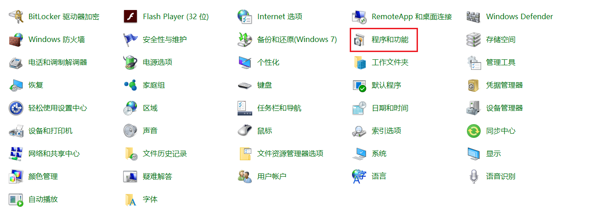
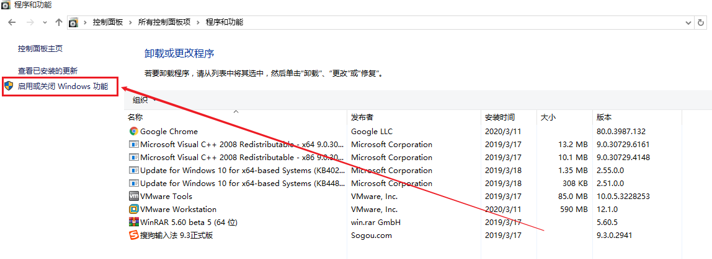
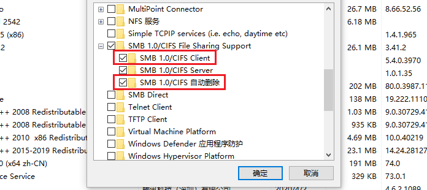
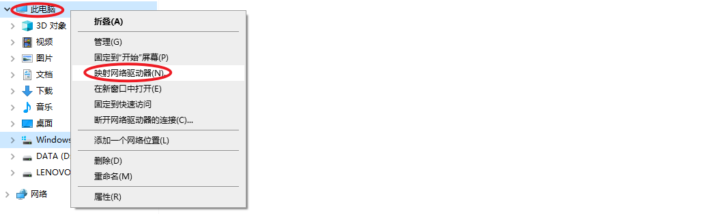
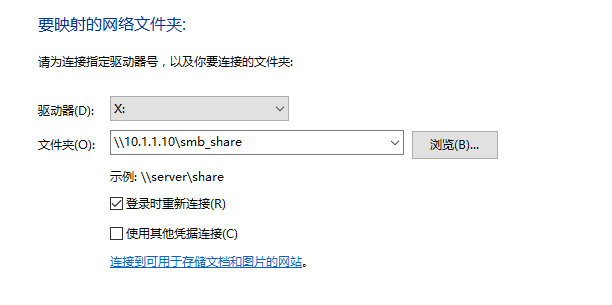

# 20.SAMBA服务

# <font style="color:rgb(51, 51, 51);">一、SAMBA文件共享</font>

## <font style="color:rgb(51, 51, 51);">什么是SAMBA</font>

<font style="color:rgb(51, 51, 51);">SMB（Server Message Block）协议实现文件共享，也称为CIFS（Common Internet File System ）</font>

<font style="color:rgb(51, 51, 51);">是Windows和类Unix系统之间共享文件的一种协议</font>

<font style="color:rgb(51, 51, 51);">客户端主要是Windows；支持多节点同时挂载以及并发写入</font>

<font style="color:rgb(51, 51, 51);">主要用于windows和Linux下的文件共享、打印共享</font>

<font style="color:rgb(51, 51, 51);">实现匿名与本地用户文件共享</font>

## <font style="color:rgb(51, 51, 51);">SAMBA主要进程</font>

<font style="color:rgb(51, 51, 51);">smbd进程：控制发布共享目录与权限、负责文件传输 TCP 139 445</font>

<font style="color:rgb(51, 51, 51);">nmbd进程：用于名称解析netbios UDP 137 138 ; 基于NETBIOS协议获得计算机名称——>解析为相应IP地址，实现信息通讯 </font>

<font style="color:rgb(51, 51, 51);">NetBIOS是Network Basic Input/Output System的简称，一般指用于局域网通信的一套API</font>

## <font style="color:rgb(51, 51, 51);">SAMBA环境准备</font>

<font style="color:rgb(51, 51, 51);">第一步：从模板机中克隆一台Linux服务器，叫做SAMBA</font>

<font style="color:rgb(51, 51, 51);">第二步：更改主机名称与IP地址</font>

```shell
# hostnamectl set-hostname samba.lhp.cn
# su

# vim /etc/sysconfig/network-scripts/ifcfg-ens33
BOOTPROTO=none
IPADDR=10.1.1.10
NETMASK=255.255.255.0
GATEWAY=10.1.1.2
DNS1=8.8.8.8
DNS2=114.114.114.114
# systemctl restart network
扩展：如果是多张网卡，建议使用ifdown ens33以及ifup ens33实现重启网络操作
```

<font style="color:rgb(51, 51, 51);">第三步：关闭防火墙与SELinux</font>

```shell
# systemctl stop firewalld
# systemctl disable firewalld

# setenforce 0
# vim /etc/selinux/config
SELINUX=disabled
```

<font style="color:rgb(51, 51, 51);">第四步：配置yum源</font>

```shell
# yum clean all
# yum makecache
```

## <font style="color:rgb(51, 51, 51);">SAMBA软件安装（服务器搭建）</font>

```shell
# yum install samba -y
# rpm -qa | grep ^samba
```

> <font style="color:rgb(119, 119, 119);">SAMBA也是一个C/S架构的软件，Client主要是Windows</font>

## <font style="color:rgb(51, 51, 51);">了解smb的配置文件</font>

```shell
# vim /etc/samba/smb.conf
[global]  全局选项
	workgroup = MYGROUP                 			定义samba服务器所在的工作组
	server string = Samba Server Version %v   smb服务的描述
	log file = /var/log/samba/log.%m          日志文件
	max log size = 50                   			日志的最大大小KB  
	security = user             							认证模式：share匿名|user用户密码|server外部服务器用户密码
	passdb backend = tdbsam         					密码格式
	load printers = yes         							加载打印机
	cups options = raw          							打印机选项
[homes]                 										局部选项（共享名称）
	comment = Home Directories      					描述
	browseable = no      											隐藏共享名称
	writable = yes      											可读可写
[printers]      														共享名称
	comment = All Printers       							描述
	path = /var/spool/samba  									本地的共享目录
	browseable = no  													隐藏
	guest ok = no ——>   											public = no  需要帐号和密码访问
	writable = no  ——>  											read only =yes 不可写 
	printable = yes      											打印选项
[share]
	path = /dir1
	guest ok = no
	writable = yes
```

## <font style="color:rgb(51, 51, 51);">SAMBA综合案例</font>

<font style="color:rgb(51, 51, 51);">搭建一个SAMBA服务，共享一个目录 /samba/share，客户端使用</font><code><font style="color:rgb(51, 51, 51);">user01/123</font></code><font style="color:rgb(51, 51, 51);">通过 windows 或者Linux 可以在该目录里创建文件删除文件。</font>

<font style="color:rgb(51, 51, 51);">第一步：SAMBA 服务器环境准备</font>

<font style="color:rgb(51, 51, 51);">更改主机名称、IP地址、关闭防火墙、SELinux、配置YUM源</font>

<font style="color:rgb(51, 51, 51);">第二步：安装SAMBA软件</font>

```shell
# yum -y install samba
# rpm -aq | grep samba
```

<font style="color:rgb(51, 51, 51);">第三步：查询SAMBA生成文件列表（rpm -ql）</font>

```shell
# rpm -ql samba
/usr/sbin/smbd
/usr/sbin/nmbd

/usr/lib/systemd/system/smb.service
/usr/lib/systemd/system/nmb.service
```

<font style="color:rgb(51, 51, 51);">第四步：在服务器端创建一个共享目录</font>

```shell
# mkdir /samba/share -p
```

<font style="color:rgb(51, 51, 51);">第五步：编辑 /etc/smb.conf 配置文件，实现 SAMBA 共享</font>

```shell
# vim /etc/samba/smb.conf
...
[smb_share]
    comment = samba service
    path = /samba/share
    guest ok = no
    writable = yes
或者
[samba_share]
    path = /samba/share
    public = no
    writable = yes

备注：guest ok === public
```

<font style="color:rgb(51, 51, 51);">第六步：创建一个user01用户，然后添加到samba认证中，设置密码为123</font>

```shell
# useradd user01
# smbpasswd -a user01
New SMB password:123
Retype new SMB password:123
Added user user01.
```

<font style="color:rgb(51, 51, 51);">以上操作完成后，则SAMBA系统中增加了一个user01的账号以及123的密码</font>

<font style="color:rgb(51, 51, 51);">第七步：启动nmb与smb服务</font>

```shell
# systemctl start nmb
# systemctl start smb
```

<font style="color:rgb(51, 51, 51);">第八步：基于Windows或Linux实现文件共享</font>

**<font style="color:rgb(51, 51, 51);">Windows：</font>**

<font style="color:rgb(51, 51, 51);">① 首先安装SAMBA支持Windows + X，选择控制面板</font>



<font style="color:rgb(51, 51, 51);">② 找到Windows功能选项</font>



<font style="color:rgb(51, 51, 51);">③ 安装SAMBA功能（客户端）</font>



<font style="color:rgb(51, 51, 51);">④ 进入计算机（我的电脑），找到映射网络驱动器</font>



<font style="color:rgb(51, 51, 51);">设置SAMBA服务器的地址信息：</font>



<font style="color:rgb(51, 51, 51);">10.1.1.10 => Linux服务器的IP地址</font>

<font style="color:rgb(51, 51, 51);">smb\_share => SAMBA标签</font>

> <font style="color:rgb(119, 119, 119);">挂载完成后，目录不可写？答：主要原因在于 /samba/share 目录没有写入权限</font>

```shell
# setfacl -R -m u:user01:rwx /samba/share
```

<font style="color:rgb(51, 51, 51);">然后我们就可以在Windows中操作这个共享目录了，Windows中的内容会和Linux中一致</font>

<font style="color:rgb(51, 51, 51);">第九步：基于Linux或Linux实现文件共享</font>

```shell
# yum -y install samba-client
# smbclient -L //192.168.126.180/ -U user01
```

<font style="color:rgb(51, 51, 51);">使用smbclient查看目录信息</font>

```shell
# smbclient //192.168.126.171/smb_share -U user01
```

<font style="color:rgb(51, 51, 51);">把SAMBA挂载到Linux系统（类似NFS）</font>

```shell
# mkdir /u01
# mount -t cifs -o username=user01,pass=123,rw //192.168.126.171/smb_share /u01/
```

<font style="color:rgb(51, 51, 51);">访问控制说明：</font>

```shell
控制读写权限
	writable = yes/no
	readonly = yes/no

如果资源可写，但只允许某些用户可写，其他都是只读
write list = admin, root, @staff（用户组）
read list = mary, @students

控制访问对象
	valid users = tom,mary,@lhp
	invalid users = tom
注意：以上两个选项只能存在其中一个

网络访问控制：
hosts deny = 192.168.0.   拒绝某个网段
hosts allow = 192.168.0.254  允许某个IP
hosts deny = all  拒绝所有
hosts allow = 192.168.0. EXCEPT 192.168.0.254  允许某个网段，但拒绝某个单个IP
注意：deny和allow同时存在，allow优先
```

## <font style="color:rgb(51, 51, 51);">总结</font>

1. <font style="color:rgb(51, 51, 51);">ftp 局域网和外网都可以</font>
2. <font style="color:rgb(51, 51, 51);">nfs 局域网 挂载方式访问 mount.nfs 侧重于Linux与Linux之间</font>
3. <font style="color:rgb(51, 51, 51);">samba 局域网 直接访问(smbclinet)挂载的方式mount.cifs 侧重于Windows与Linux之间</font>


> 更新: 2026-04-07 10:22:58  
> 原文: <https://www.yuque.com/u41736172/az9urv/kmpvexhg7r6gctud>