# 01.Zabbix监控系统

<font style="color:#000000;">作用：</font>

<font style="color:#000000;">Prometheus 既适用于传统监控，也比较适用于容器监控（使用更广泛）。</font>

<font style="color:#000000;">Zabbix 比较老牌的监控系统，很多传统行业项目是基于 Zabbix 进行监控操作，适用于传统监控。</font>

# <font style="color:#000000;">场景说明</font>

<font style="color:#000000;">运维工程师除了搭建架构环境，配置管理外，还需要保证业务的</font>**<font style="color:#000000;">稳定</font>**<font style="color:#000000;">运行。不稳定的情况包括很多方面，如:</font>

* <font style="color:#000000;">CPU 负载过大</font>
* <font style="color:#000000;">内存不够</font>
* <font style="color:#000000;">磁盘空间满了</font>
* <font style="color:#000000;">网络很卡</font>
* <font style="color:#000000;">服务不能被访问</font>

<font style="color:#000000;">等等各种问题。我们运维工程师无法做到时刻盯着服务器查看各类状态，所以需要建立一套完善的</font>**<font style="color:#000000;">自动化监控</font>**<font style="color:#000000;">系统，将所有需要监控的服务器及其各种需要的状态数据都实时地</font>**<font style="color:#000000;">收集</font>**<font style="color:#000000;">，</font>**<font style="color:#000000;">图形展示</font>**<font style="color:#000000;">，</font>**<font style="color:#000000;">报警。</font>**

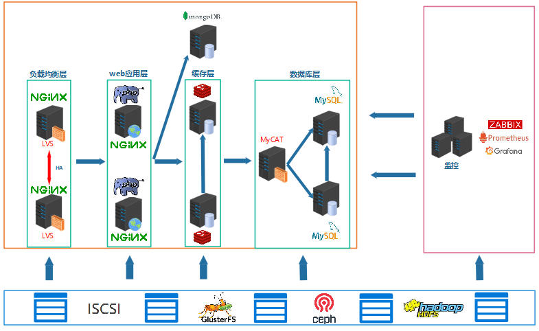

# **<font style="color:#000000;">学习目标</font>**

* <font style="color:#000000;">知道监控的目的与目标</font>
* <font style="color:#000000;">能够安装 zabbix 服务器</font>
* <font style="color:#000000;">能够使用 zabbix-agent 监控本机与远程 linux</font>
* <font style="color:#000000;">能够说出模板的作用</font>
* <font style="color:#000000;">掌握自定义监控项的方法</font>
* <font style="color:#000000;">能够为添加的监控项创建图形</font>
* <font style="color:#000000;">能够为监控项设定触发器</font>
* <font style="color:#000000;">能够实现 zabbix 报警</font>
* <font style="color:#000000;">能够通过自动发现与动作实现自动监控</font>
* <font style="color:#000000;">能够说出导入导出功能的作用</font>
* <font style="color:#000000;">能够通过 proxy 来实现监控</font>

# <font style="color:#000000;">一、认识监控</font>

## **<font style="color:#000000;">监控的目的</font>**

* <font style="color:#000000;">实时收集指标数据并图形展示，通过报警及时发现问题与处理问题。</font>
* <font style="color:#000000;">为架构优化也提供依据。</font>

## <font style="color:rgb(51, 51, 51);">监控的目标</font>

**<font style="color:rgb(51, 51, 51);">生活中的监控：</font>**


<font style="color:rgb(51, 51, 51);">那么</font>**<font style="color:rgb(51, 51, 51);">请问 Linux 系统中的监控主要监控什么</font>**<font style="color:rgb(51, 51, 51);">?</font>

* **<font style="color:rgb(51, 51, 51);">任何你所想要监控的数据</font>**<font style="color:rgb(51, 51, 51);">，如 cpu 负载，cpu 的 idle 时间，内存使用量，内存利用率，io，network 等等。</font>
* <font style="color:rgb(51, 51, 51);">现在很多开源监控方案已经把常见的监控做成了模板，我们可以直接套用</font>
* <font style="color:rgb(51, 51, 51);">大型公司会有更多的监控需求，那么就需要专业的开发人员来做监控开发(运维人员也可以开发)</font>

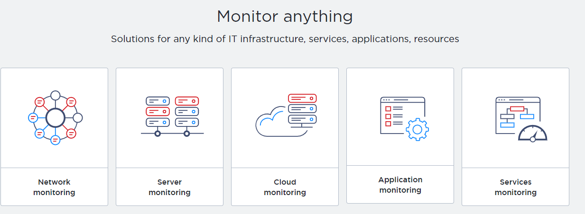

## <font style="color:rgb(51, 51, 51);">主流的开源监控平台介绍</font>

* **<font style="color:rgb(51, 51, 51);">mrtg</font>**<font style="color:rgb(51, 51, 51);">(Multi Router Traffic Grapher)通过 </font>**<font style="color:rgb(51, 51, 51);">snmp </font>**<font style="color:rgb(51, 51, 51);">协议得到设备的流量信息，并以包含 PNG 格式的图形的HTML文档方式显示给用户。</font>
* **<font style="color:rgb(51, 51, 51);">cacti</font>**<font style="color:rgb(51, 51, 51);"> (仙人掌) 用 php 语言实现的一个软件，它的主要功能是用 snmp 服务获取数据，然后用 rrdtool 储存和更新数据。官网地址: </font>[<font style="color:rgb(65, 131, 196);">https://www.cacti.net/</font>](https://www.cacti.net/)
* **<font style="color:rgb(51, 51, 51);">ntop</font>**<font style="color:rgb(51, 51, 51);"> 官网地址: </font>[<font style="color:rgb(65, 131, 196);">https://www.ntop.org/</font>](https://www.ntop.org/)
* **<font style="color:rgb(51, 51, 51);">nagios</font>**<font style="color:rgb(51, 51, 51);"> 能够跨平台，插件多，报警功能强大。官网地址: </font>[<font style="color:rgb(65, 131, 196);">https://www.nagios.org/</font>](https://www.nagios.org/)
* **<font style="color:rgb(51, 51, 51);">centreon</font>**<font style="color:rgb(51, 51, 51);"> 底层使用的就是 nagios。是一个 nagios 整合版软件。官网地址：</font>[<font style="color:rgb(65, 131, 196);">https://www.centreon.com/</font>](https://www.centreon.com/)
* **<font style="color:rgb(51, 51, 51);">ganglia</font>**<font style="color:rgb(51, 51, 51);"> 设计用于测量数以千计的节点，资源消耗非常小。官网地址：</font>[<font style="color:rgb(65, 131, 196);">http://ganglia.info/</font>](http://ganglia.info/)
* **<font style="color:rgb(51, 51, 51);">open-falcon</font>**<font style="color:rgb(51, 51, 51);"> 小米公司开源，高效率，高可用。用户基数相对小。官网地址: </font>[<font style="color:rgb(65, 131, 196);">http://open-falcon.org/</font>](http://open-falcon.org/)
* **<font style="color:rgb(51, 51, 51);background-color:#FBDE28;">zabbix </font>**<font style="color:rgb(51, 51, 51);background-color:#FBDE28;">跨平台，画图，多条件告警，多种API接口。用户基数大。官网地址: </font>[<font style="color:rgb(65, 131, 196);background-color:#FBDE28;">https://www.zabbix.com/</font>](https://www.zabbix.com/)
* **<font style="color:rgb(51, 51, 51);background-color:#FBDE28;">prometheus</font>**<font style="color:rgb(51, 51, 51);background-color:#FBDE28;"> 基于时间序列的数值数据的容器监控解决方案。官网地址: </font>[<font style="color:rgb(65, 131, 196);background-color:#FBDE28;">https://prometheus.io/</font>](https://prometheus.io/)

# <font style="color:rgb(51, 51, 51);">二、zabbix</font>

[<font style="color:rgb(65, 131, 196);">https://www.zabbix.com/</font>](https://www.zabbix.com/)


## <font style="color:rgb(51, 51, 51);">zabbix 基础概念初探</font>

**<font style="color:rgb(51, 51, 51);">主机（host）和主机群组（host group）</font>**

<font style="color:rgb(51, 51, 51);">主机指被监控的一个设备(服务器，交换机等)，当被监控的主机数量巨大时，就需要分组</font>

***

**<font style="color:rgb(51, 51, 51);">zabbix 用户（user）与用户群组（group）</font>**

<font style="color:rgb(51, 51, 51);">zabbix 可以多个用户登录管理(和 Linux 操作系统一样有管理员和普通管理者)</font>

***

**<font style="color:rgb(51, 51, 51);">监控项（item）与应用集（application）</font>**

<font style="color:rgb(51, 51, 51);">监控的需求太多了，就拿监控 cpu 平均负载来说，就有监控1分钟内，5分钟内，15分钟内等三个常见的监控参数。</font>

<font style="color:rgb(51, 51, 51);">监控项（item）是从收集数据或监控的一个</font>**<font style="color:rgb(51, 51, 51);">最小单位</font>**<font style="color:rgb(51, 51, 51);">。把 cpu 1分钟内的平均负载就可以做成一个监控项。</font>

<font style="color:rgb(51, 51, 51);">应用集就是多个监控项的组。</font>

***

**<font style="color:rgb(51, 51, 51);">图形</font>**

<font style="color:rgb(51, 51, 51);">监控项收集的数据需要用图形直观地展示出来。</font>

***

**<font style="color:rgb(51, 51, 51);">触发器和报警</font>**

<font style="color:rgb(51, 51, 51);">当监控项收集的数据达到一个临界点时，就要触发报警通知管理人员。</font>

<font style="color:rgb(51, 51, 51);">如: 当根分区使用率超过 80% 时, 就通过发报警信息到管理人员。</font>

***

**<font style="color:rgb(51, 51, 51);">模板</font>**

<font style="color:rgb(51, 51, 51);">模板主要包括监控项，图形，触发器等概念，相当于是把要监控的东西做成一个合集。</font>

## <font style="color:rgb(51, 51, 51);">监控场景准备</font>

> 之前的 node1、node2 等等服务器都不要了，大家环境不够用可以将他们都删除掉！重新克隆配置。

| 编号 | IP | 主机名 | 作用 |
| --- | --- | --- | --- |
| 1 | 192.168.126.171 | server.lhp.cn | 监控服务器 |
| 2 | 192.168.126.172 | agent1.lhp.cn | 被监控服务器 1 |
| 3 | 192.168.126.173 | agent2.lhp.cn | 被监控服务器 2 |

**<font style="color:rgb(51, 51, 51);">环境准备：</font>**<font style="color:rgb(51, 51, 51);">这里为1台监控服务器和2台被监控端</font>

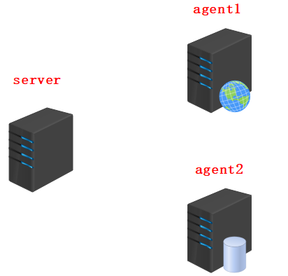

第一步：根据最小化安装系统，克隆三台服务器出来。顺便把三台服务器的 MAC 地址给改改，不一样即可。


第二步：开机，分别配置每台服务器的静态 IP

```powershell
# vim /etc/NetworkManager/system-connections/ens33.nmconnection
address1=192.168.126.171/24

另两台服务器的静态IP也需要修改。
```

<font style="color:rgb(51, 51, 51);">第三步：修改主机名与更改 hosts 文件</font>

```powershell
# hostnamectl set-hostname server.lhp.cn
# su

# hostnamectl set-hostname agent1.lhp.cn
# su

# hostnamectl set-hostname agent2.lhp.cn
# su

127.0.0.1   localhost localhost.localdomain localhost4 localhost4.localdomain4
::1         localhost localhost.localdomain localhost6 localhost6.localdomain6
192.168.126.171 server server.lhp.cn
192.168.126.172 agent1 agent1.lhp.cn
192.168.126.173 agent2 agent2.lhp.cn
```

<font style="color:rgb(51, 51, 51);">第四步：时间同步（已做）</font>

<font style="color:rgb(51, 51, 51);">第五步：关闭防火墙、selinux（已做）</font>

# <font style="color:rgb(51, 51, 51);">三、zabbix 服务器安装</font>

<font style="color:rgb(51, 51, 51);">Zabbix Server/Zabbix Agent（采集）</font>

<font style="color:rgb(51, 51, 51);">Zabbix 底层基于 PHP + MySQL 开发的，需要搭建 LAMP 或 LNMP 架构</font>

<font style="color:rgb(51, 51, 51);">参考: </font>[<font style="color:rgb(65, 131, 196);">https://www.zabbix.com/documentation/current/manual/installation/install\_from\_packages/rhel\_centos</font>](https://www.zabbix.com/documentation/current/manual/installation/install_from_packages/rhel_centos)

**<font style="color:rgb(51, 51, 51);">zabbix 服务器结构图</font>**

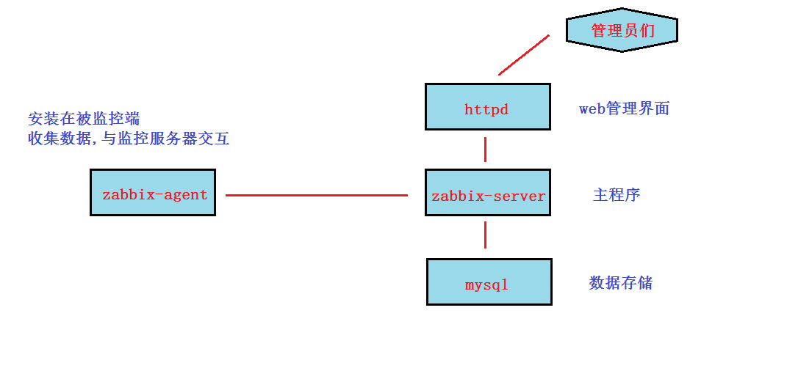

**<font style="color:rgb(51, 51, 51);">zabbix = zabbix-server（服务器端） + zabbix-agent（类似 Prometheus 中的 xxx\_exporter）</font>**

## <font style="color:rgb(51, 51, 51);">MySQL8 部署</font>

在 server 服务器安装 MySQL 数据库，因为 Zabbix 拉取到的数据要存储到 MySQL 数据库中！

<font style="color:rgb(51, 51, 51);">第一步：下载 MySQL</font>

```powershell
# wget https://dev.mysql.com/get/Downloads/MySQL-8.0/mysql-8.0.37-1.el9.x86_64.rpm-bundle.tar
```

<font style="color:rgb(51, 51, 51);">网速比较慢，也可以直接</font>**<font style="color:rgb(51, 51, 51);">使用资料中的 MySQL 离线安装包</font>**<font style="color:rgb(51, 51, 51);">直接安装！</font>

<font style="color:rgb(51, 51, 51);">第二步：解压 MySQL</font>

```powershell
# mkdir /root/mysql
# tar -xf mysql-8.0.37-1.el9.x86_64.rpm-bundle.tar -C /root/mysql

x：代表 "extract"，意思是提取归档文件中的内容。
f：告诉 tar 命令，接下来的参数是一个文件名，而不是要归档或提取的文件列表。
-C（注意大写）：这是一个选项，允许您指定在何处（即哪个目录）解压缩文件。
```

<font style="color:rgb(51, 51, 51);">第三步：安装 MySQL</font>

```powershell
# cd /root/mysql
# rpm -ivh mysql-community-* --force --nodeps

-i: 安装软件包。
-v: 显示详细输出。
-h: 显示安装进度。
--force: 强制覆盖已经存在的文件。这可能会破坏系统，因为它会覆盖现有的文件而不进行任何检查。
--nodeps: 安装软件包时，不检查其依赖关系。这可能会导致软件包无法正常工作，因为它可能缺少必要的库或依赖项。
```

<font style="color:rgb(51, 51, 51);">第四步：启动 MySQL，并开机启动</font>

```powershell
# 启动MySQL
# systemctl start mysqld
 
# MySQL加入开启自启
# systemctl enable mysqld
```

<font style="color:rgb(51, 51, 51);">第五步：查看初始密码</font>

```powershell
# 查询初始密码
# cat /var/log/mysqld.log | grep password
0U&dHcboug!%
```

<font style="color:rgb(51, 51, 51);">第六步：修改密码</font>

<font style="color:rgb(51, 51, 51);">如果你想要设置简单的密码，你需要先更换一个初始密码，然后再修改策略，再修改简单密码，所以先使用一个复杂的密码作为新密码。【注意：数据库中输入的指令注意“；”这个符合别漏掉】</font>

```powershell
# mysql -uroot -p
Enter password:输入初始密码
 
# 使用root登入mysql，密码使用使用上方查询出来的密码→修改密码为Xa%^3T%T4!
mysql> ALTER USER 'root'@'localhost' IDENTIFIED BY 'Xa%^3T%T4!';
 
# 设置密码检查等级
mysql> set global validate_password.policy=0;
 
# 0 (或LOW)：允许密码包含最简单的密码（只包含小写字母、数字、特殊字符中的一类）。
# 1 (或MEDIUM)：要求密码至少包含小写字母、大写字母、数字、特殊字符中的三类。
# 2 (或STRONG)：要求密码至少包含小写字母、大写字母、数字、特殊字符中的四类。
 
# 密码的最短长度
mysql> set global validate_password.length=5;
 
# 密码至少要包含的小写字母个数和大写字母个数
mysql> set global validate_password.mixed_case_count=0;
 
# 再次修改密码为qwe!123，并退出数据库
mysql> ALTER USER 'root'@'localhost' IDENTIFIED BY 'qwe!123';
 
# 退出
mysql> exit
```

## <font style="color:rgb(51, 51, 51);">安装 PHP8.0</font>

因为 Zabbix 底层是基于 PHP 语言开发的，所以需要有 PHP 的环境！在 server 服务器做如下操作：

<font style="color:rgb(51, 51, 51);">第一步：加载 remi 库</font>

```shell
# sudo dnf install -y https://rpms.remirepo.net/enterprise/remi-release-9.rpm
 
官方仓库：由Linux发行版的官方团队维护，包含经过严格测试和官方支持的软件包。
Remi仓库：由Remi个人或他的团队维护，提供更新版本的软件包或官方仓库中没有的软件包。这些软件包可能没有得到官方支持，但由Remi团队维护。
仓库：/etc/yum.repos.d目录
```

<font style="color:rgb(51, 51, 51);">安装完成后，重建缓存</font>

```shell
# 清除dnf的缓存【如RPM软件包文件、旧的headers和元数据（元数据描述了可用的软件包和它们的依赖关系）、dnf生成的其他临时文件】
# dnf clean all 
 
# 下载并缓存元数据
# dnf makecache
```

<font style="color:rgb(51, 51, 51);">第二步：安装 PHP8 和其相关的组件</font>

```shell
# 下面是Zabbix server在使用PHP时需要用到的PHP相关组件的安装：
# sudo dnf install -y php80 php80-php-cli php80-php-gd php80-php-json php80-php-mbstring php80-php-mysqlnd php80-php-xml

php80：
这是PHP 8.0的主要软件包，包含了PHP的核心解释器和基础功能。

php80-php-cli：
PHP的命令行接口（CLI），允许你从命令行运行PHP脚本。这在开发、测试和维护PHP应用程序时非常有用。

php80-php-gd：
#GD库是一个用于处理图像的开源代码库，它提供了一系列函数来动态创建和操作图像。在Zabbix中，它可能被用于图形显示。

php80-php-json：
提供了对JSON格式的解析和生成支持。JSON是Web服务中常用的数据交换格式。

php80-php-mbstring：
提供了对多字节字符串的支持，包括UTF-8等字符集。对于国际化应用非常重要。

php80-php-mysqlnd：
MySQL的原生驱动（Native Driver），用于与MySQL数据库进行交互。由于Zabbix通常使用MySQL作为其后端数据库，因此这个扩展是必须的。

php80-php-xml：
提供了对XML的支持，包括解析和生成XML文档。虽然Zabbix不直接依赖于XML处理，但某些PHP扩展或应用程序可能需要它。

php80-php-bcmath：
BC Math库提供了高精度数学计算的支持。虽然Zabbix本身可能不需要它，但某些PHP应用程序或扩展可能需要它。

php80-php-fpm：
FastCGI进程管理器（FPM）是一个用于管理PHP FastCGI进程的工具。它允许你将PHP作为独立的进程运行，而不是作为Apache或Nginx的模块。如果你打算使用Nginx作为Web服务器，并希望PHP作为FastCGI进程运行，那么这个扩展是必须的。
```

## <font style="color:rgb(51, 51, 51);">安装 Zabbix</font>

Zabbix 底层是基于 PHP + MySQL 的，所以我们要有 LNMP 或者 LAMP 的环境才行！上面已经安装了 MySQL 和 PHP，而 **Zabbix 软件内部集成了 Apache 服务器**，所以不需要单独安装 Web 服务器了！

在 server 服务器中做如下操作。

<font style="color:rgb(51, 51, 51);">第一步：加载 zabbix 软件库（其实就是安装 Zabbix 官方提供的 yum 仓库）</font>

```shell
# rpm -Uvh https://repo.zabbix.com/zabbix/7.0/alma/9/x86_64/zabbix-release-7.0-2.el9.noarch.rpm
简单理解就是加载了zabbix官方的应用商店
```

<font style="color:rgb(51, 51, 51);">第二步：关闭无关的库</font>

<font style="color:rgb(51, 51, 51);">进入 yum 仓库文件夹 /etc/yum.repos.d/ 打开 epel.repo 文件（因为 epel 仓库中也有一个 Zabbix，和我们要安装的最新版本冲突了）</font>

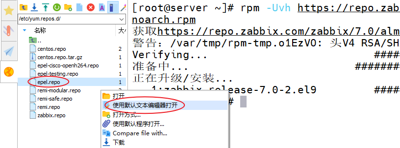

<code><font style="color:rgb(51, 51, 51);background-color:rgb(243, 244, 244);">enabled = 1 改成 enabled = 0</font></code>

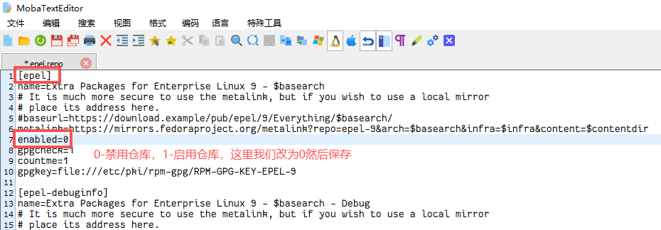

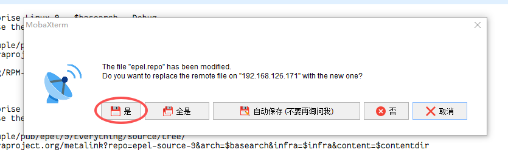

<font style="color:rgb(51, 51, 51);">因为安装 zabbix 所需组件时候，如果不关闭其他库，系统会去其他库中寻找相关组件，导致版本不对等问题，使得安装出现失败，现象如下：</font>

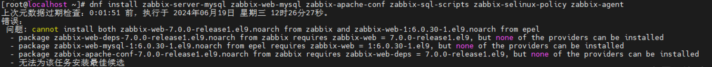

<font style="color:rgb(51, 51, 51);">第三步：安装 zabbix 所需组件</font>

```shell
# 会耗费较多的时间
# dnf install -y zabbix-server-mysql zabbix-web-mysql zabbix-apache-conf zabbix-sql-scripts zabbix-selinux-policy zabbix-agent

zabbix-server-mysql：
这是Zabbix服务器的软件包，它用于收集和处理来自客户端（如Zabbix代理或SNMP设备）的监控数据。这个软件包是为MySQL数据库设计的，因此它依赖于MySQL或MariaDB来存储配置、历史和触发器等信息。

zabbix-web-mysql：
这个软件包包含了Zabbix的前端Web界面，允许用户通过Web浏览器来查看和管理监控数据。这个软件包也是为MySQL数据库设计的，因此它会与zabbix-server-mysql协同工作。

zabbix-apache-conf：
这个软件包提供了Apache HTTP服务器的配置文件，以便能够正确地为Zabbix的Web界面提供服务。如果你使用的是Apache作为Web服务器，这个软件包会帮助你将Zabbix Web界面集成到Apache中。

zabbix-sql-scripts：
这个软件包包含了创建Zabbix数据库结构所需的SQL脚本。在安装Zabbix服务器之前，你需要使用这些脚本来创建和初始化数据库结构。这些脚本是为MySQL和PostgreSQL等数据库设计的。

zabbix-selinux-policy：
如果你的系统启用了SELinux（Security-Enhanced Linux），这个软件包会提供必要的SELinux策略，以确保Zabbix能够正常运行而不会被SELinux阻止。SELinux是一个安全模块，用于提供强制访问控制。

zabbix-agent：
Zabbix代理是一个可以安装在被监控设备上的软件，用于收集设备上的监控数据并将其发送到Zabbix服务器。虽然这个命令是在服务器上执行的，但安装zabbix-agent也可以让你在同一台服务器上监控其本地资源。
```

<font style="color:rgb(51, 51, 51);">第四步：重新启用 epel.repo</font>

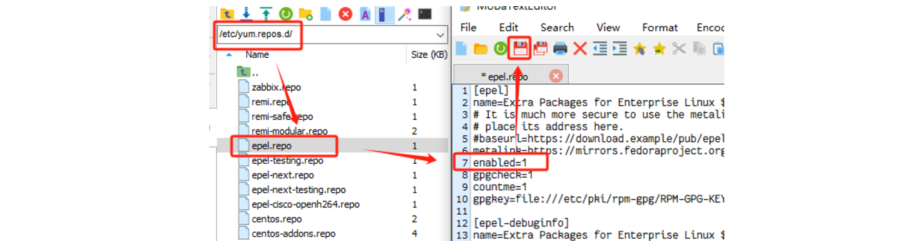

## <font style="color:rgb(51, 51, 51);">配置 Zabbix 数据库</font>

<font style="color:rgb(51, 51, 51);">第一步：创建数据库</font>

```shell
#进入数据库
# mysql -uroot -p
Enter password:输入之前设置root访问数据库的密码 => qwe!123
 
#创建了一个名为zabbix_proxy的新数据库，该数据库使用utf8mb4字符集和utf8mb4_bin校对规则，这使得它特别适合于存储包含特殊字符（如emoji）的数据，并且以二进制方式比较和排序字符串。
mysql> create database zabbix character set utf8mb4 collate utf8mb4_bin;

utf8mb4：
是一个Unicode字符集，可以存储多达4字节的字符。这个字符集特别有用，因为它可以存储像emoji这样的特殊字符，而标准的utf8字符集（实际上是utf8mb3）则不能。

utf8mb4_bin:
utf8mb4_bin是一个二进制校对规则，它基于字符的二进制值进行比较。这意味着它区分大小写，并且不会考虑字符的排序规则（如字母表顺序）。如果你想要一个不区分大小写的校对规则，你可能会选择utf8mb4_general_ci或utf8mb4_unicode_ci等。
```

<font style="color:rgb(51, 51, 51);">第二步：设置密码并授权</font>

```shell
#创建一个数据库访问账号zabbix，密码为qwe!123
mysql> create user zabbix@localhost identified by 'qwe!123';
 
#授予用户 zabbix 在 zabbix 数据库上所有权限，并且这个权限仅适用于从 localhost 主机连接到 MySQL 服务器的用户。
mysql> grant all privileges on zabbix.* to zabbix@localhost;

授予权限：用户 zabbix 将获得在 zabbix 数据库上执行任何操作的能力，包括创建表、删除表、插入数据、更新数据、查询数据等。

指定数据库：这里的 zabbix.* 表示 zabbix 数据库中的所有对象（表、视图、存储过程等）。

指定用户：zabbix@localhost 表示用户名为 zabbix 的用户，并且这个用户只能从 localhost 连接到 MySQL 服务器。localhost 通常指的是 MySQL 服务器所在的机器。

权限范围：这个权限仅限于zabbix数据库，不影响其他数据库。
```

<font style="color:rgb(51, 51, 51);">第三步：临时降低安全性</font>

```shell
#告诉 MySQL 信任你，即使你正在创建或修改一个非确定性函数，你也知道如何确保主服务器和从服务器之间的数据一致性。为了防止后面导入初始数据库时会出现报错，所以临时降低安全性。
mysql> set global log_bin_trust_function_creators = 1;

#退出
mysql> quit;
```

<code><font style="color:rgb(51, 51, 51);background-color:rgb(243, 244, 244);">set global log_bin_trust_function_creators = 1;</font></code><font style="color:rgb(51, 51, 51);">作用：我信任开发人员写的函数，请允许它们执行。</font>

<font style="color:rgb(51, 51, 51);">因为 Zabbix 安装时会在数据库里创建一些函数，而这些函数里用了像</font><code><font style="color:rgb(51, 51, 51);background-color:rgb(243, 244, 244);">NOW()</font></code><font style="color:rgb(51, 51, 51);">这样的语句，MySQL 默认是不让普通人创建这种函数的，怕有风险。</font>

<font style="color:rgb(51, 51, 51);">如果不设置，则结果就会导致 Zabbix 安装报错，从而安装失败。</font>

<font style="color:rgb(51, 51, 51);">设置它，就能解决这个问题，让安装顺利进行。</font>

<font style="color:rgb(51, 51, 51);">第四步：导入数据库</font>

```shell
# 导入zabbixd的初始数据库
# 输入完密码后需要花一些时间进行数据库的初始化创建
# zcat /usr/share/zabbix-sql-scripts/mysql/server.sql.gz | mysql --default-character-set=utf8mb4 -uzabbix -p zabbix
 
Enter password:输入之前设置zabbix访问数据库的密码
```

<font style="color:rgb(51, 51, 51);">官方提供的命令行，大致意思是读取</font><code><font style="color:rgb(51, 51, 51);background-color:rgb(243, 244, 244);">/usr/share/zabbix-sql-scripts/mysql/server.sql.gz</font></code><font style="color:rgb(51, 51, 51);">文件（Zabbix 的 MySQL 初始化脚本）的内容，并将其直接导入到名为</font><code><font style="color:rgb(51, 51, 51);background-color:rgb(243, 244, 244);">zabbix</font></code><font style="color:rgb(51, 51, 51);">的 MySQ L数据库中，使用</font><code><font style="color:rgb(51, 51, 51);background-color:rgb(243, 244, 244);">zabbix</font></code><font style="color:rgb(51, 51, 51);">用户名和提示输入的密码进行身份验证，并确保在数据传输过程中使用</font><code><font style="color:rgb(51, 51, 51);background-color:rgb(243, 244, 244);">utf8mb4</font></code><font style="color:rgb(51, 51, 51);">字符集。</font>

<font style="color:rgb(51, 51, 51);">第五步：将第三步的降低安全性给改回来</font>

```shell
#关闭修改非确定性函数
# mysql -uroot -p
Enter password:输入之前设置root访问数据库的密码
mysql> set global log_bin_trust_function_creators = 0;
mysql> quit;
```

## <font style="color:rgb(51, 51, 51);">配置conf文件</font>

<font style="color:rgb(51, 51, 51);">修改 zabbix 应用程序的配置文件 /etc/zabbix/ 中的 zabbix\_server.conf 数据库密码和监听端口参数，找个空白处输入进去即可。</font>

```shell
# vim /etc/zabbix/zabbix_server.conf
#设置数据库密码为上方设置的zabbix密码qwe!123：
132行 DBPassword=qwe!123
 
#设置监听客户端端口为10051：
13行 ListenPort=10051
```

## <font style="color:rgb(51, 51, 51);">开启端口与服务</font>

<font style="color:rgb(51, 51, 51);">如果生产环境，可以参考如下规则设置防火墙：</font>

```shell
# 查看80端口状态，NO表示没打开，YES表示打开。
# firewall-cmd --zone=public --query-port=80/tcp
 
#开启80、10050、10051端口，重启依然生效
# firewall-cmd --zone=public --add-port=80/tcp --permanent
# firewall-cmd --zone=public --add-port=10050/tcp --permanent
# firewall-cmd --zone=public --add-port=10051/tcp --permanent
 
# 重新加载防火墙配置，立即生效
# firewall-cmd –reload

10050端口号：是Zabbix服务端使用的
10051端口号：是Zabbix agent使用的
```

<font style="color:rgb(51, 51, 51);">重启服务：</font>

```shell
#重新启动zabbix-server、zabbix-agent、httpd、php-fpm服务
# systemctl restart zabbix-server zabbix-agent httpd php-fpm
 
#加入开机自动启动
# systemctl enable zabbix-server zabbix-agent httpd php-fpm

zabbix-server（zabbix服务端）：
这是 Zabbix 监控系统的服务器端。Zabbix 是一个开源的监控解决方案，用于监控网络、服务器、应用程序等。Zabbix 服务器负责接收来自代理和其他客户端的数据，并存储这些数据以供进一步的分析和报告。

zabbix-agent（zabbix客户端）：
这是 Zabbix 监控系统的代理端。Zabbix 代理部署在要监控的服务器上，负责收集该服务器的各种指标（如 CPU 使用率、内存使用情况、磁盘空间等），并将这些数据发送到 Zabbix 服务器。

httpd（httpd 负责处理HTTP请求和响应，而 php-fpm 负责执行PHP代码）：
这通常是 Apache HTTP 服务器的服务名称。Apache 是一个流行的 Web 服务器软件，用于托管网站和提供 Web 服务。如果您正在使用 Zabbix 的 Web 前端，那么 Apache 服务器可能用于提供对 Zabbix Web 界面的访问。

php-fpm（负责执行PHP代码）：
这是 PHP FastCGI 进程管理器（PHP-FPM）的服务名称。PHP-FPM 是一个 FastCGI 进程管理器，用于管理 PHP 解释器的进程。如果您的 Zabbix Web 前端是用 PHP 编写的，那么 PHP-FPM 将负责处理 PHP 脚本的执行
```

## <font style="color:rgb(51, 51, 51);">Web 配置</font>

<font style="color:rgb(51, 51, 51);">第一步：打开浏览器，输入“</font>[<font style="color:rgb(65, 131, 196);">http://IP/zabbix/</font>](http://ip/zabbix/)<font style="color:rgb(51, 51, 51);">”进行访问（IP 指的是服务器的 IP 地址），会自动跳转到配置页面，选择中文，点击下一步。</font>

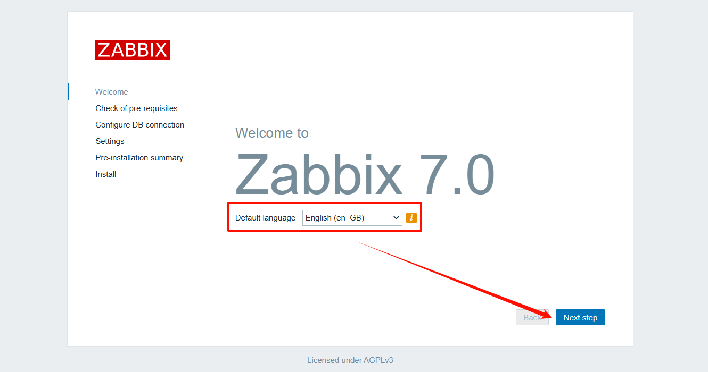

> **<font style="background-color:#FBDE28;">其实上面的默认语言是可以选择中文的，截图中默认使用的是英语！但是后面的 next 一会就下不去了！！！我在实际安装的时候，选择的就是中文！</font>**

<font style="color:rgb(51, 51, 51);">第二步：他会检测 PHP 的参数是否配置正确上面没有配置错误的话一般都是正常的，如果有问题就到 /etc/php.ini 修改这个文件的参数即可。</font>

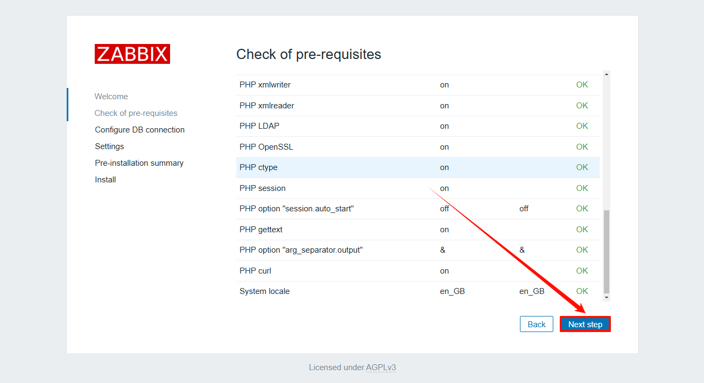

<font style="color:rgb(51, 51, 51);">第三步：输入 zabbix 用户访问数据库的密码，然后下一步</font>

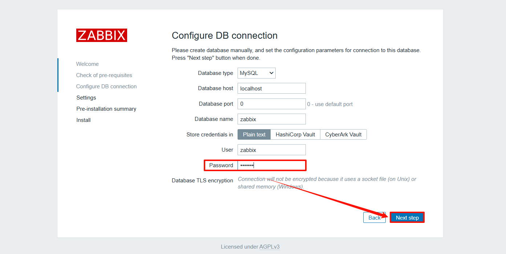

<font style="color:rgb(51, 51, 51);">第四步：设置主机名（自己设置即可），我喜欢暗色，所以主题选了暗色，你们自行选择，然后直接下一步到完成。</font>

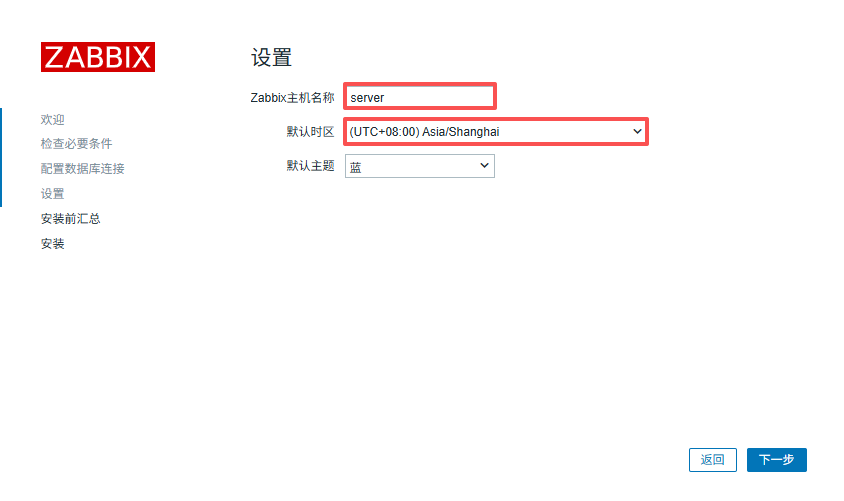

<font style="color:rgb(51, 51, 51);">单击下一步，下一步，出现如下界面，代表安装完成：</font>

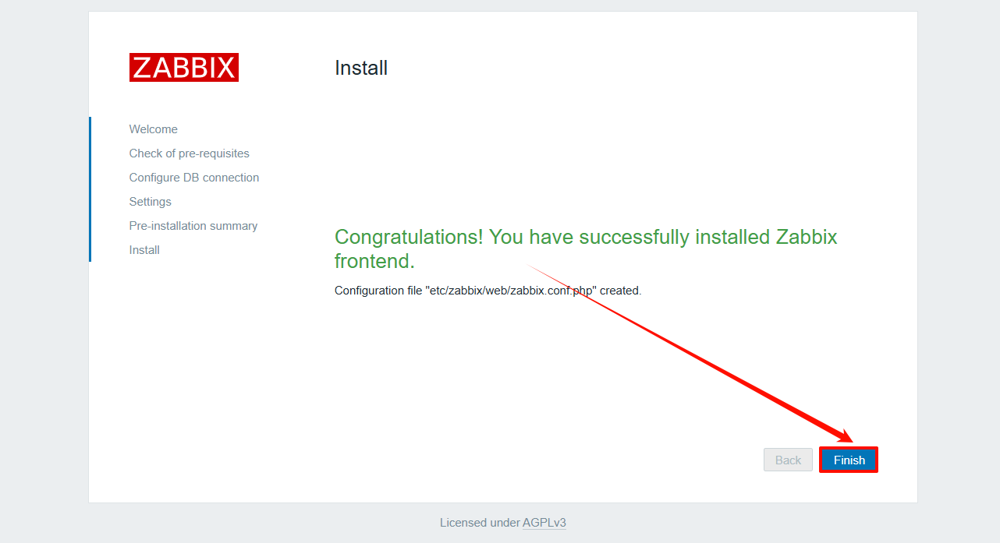

<font style="color:rgb(51, 51, 51);">第五步：登录 Zabbix，默认账号：Admin（注意首字母大写），密码：zabbix</font>

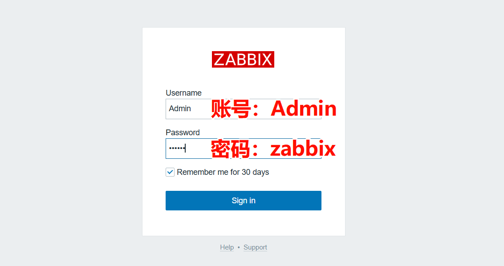

<font style="color:rgb(51, 51, 51);">登录后，如下图所示：</font>

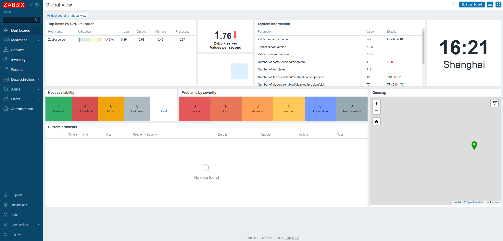

## <font style="color:rgb(51, 51, 51);">解决语言包问题与图表字体乱码问题</font>

> 其实我们目前使用的 Linux 系统是没有语言问题的，但是在上面的 Zabbix 的网页显示中会有乱码问题！

<font style="color:rgb(51, 51, 51);">第一步：安装中文语言包</font>

```shell
sudo yum install glibc-common -y
sudo yum install glibc-langpack-en glibc-langpack-zh -y
```

<font style="color:rgb(51, 51, 51);">第二步：进入用户设置，找到User settings => Profile</font>

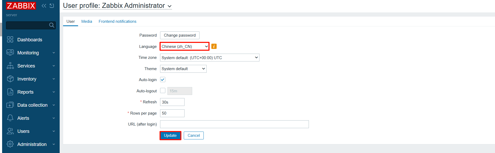

<font style="color:rgb(51, 51, 51);">第三步：监测 => 主机 => 图形设置</font>

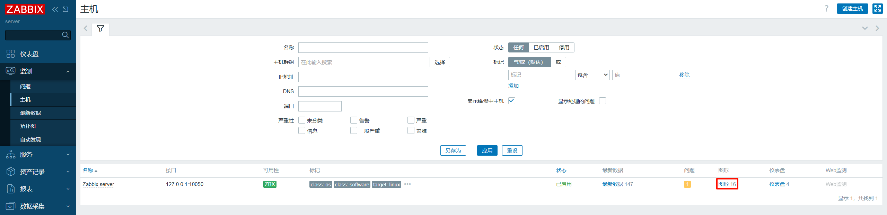

<font style="color:rgb(51, 51, 51);">出现中文乱码</font>

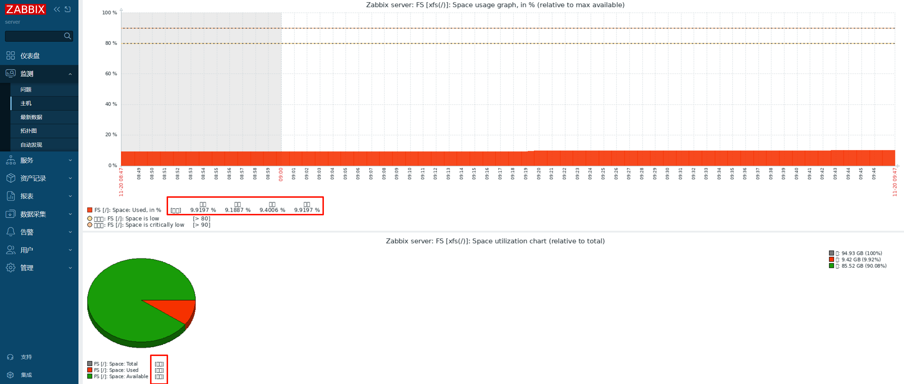

<font style="color:rgb(51, 51, 51);">第四步：修复方案</font>

<font style="color:rgb(51, 51, 51);">注意：选择楷体，其他字体可能导致显示异常，图示是 win11 系统操作方法，win10 类似，自行研究即可</font>

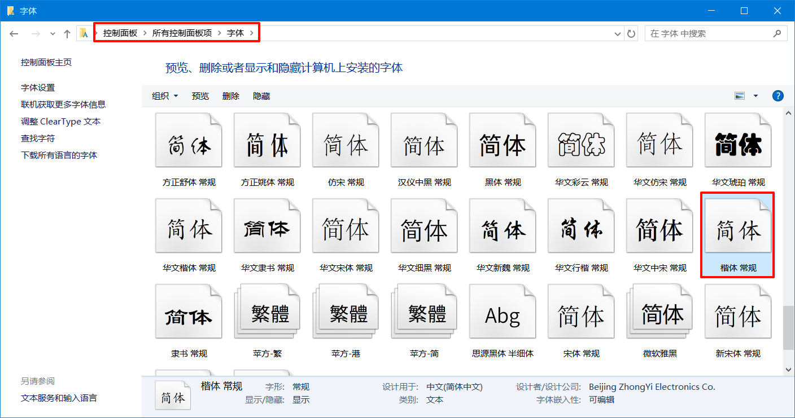

<font style="color:rgb(51, 51, 51);">上传字体于</font><code><font style="color:rgb(51, 51, 51);background-color:rgb(243, 244, 244);">/usr/share/zabbix/assets/fonts/</font></code><font style="color:rgb(51, 51, 51);">中（</font>**<font style="color:rgb(51, 51, 51);background-color:#FBDE28;">或者大家直接将资料中提供的字体上传即可</font>**<font style="color:rgb(51, 51, 51);">）</font>

<font style="color:rgb(51, 51, 51);">打开</font><code><font style="color:rgb(51, 51, 51);background-color:rgb(243, 244, 244);">/usr/share/zabbix/include/defines.inc.php</font></code><font style="color:rgb(51, 51, 51);">文件，修正字体指向配置。</font>

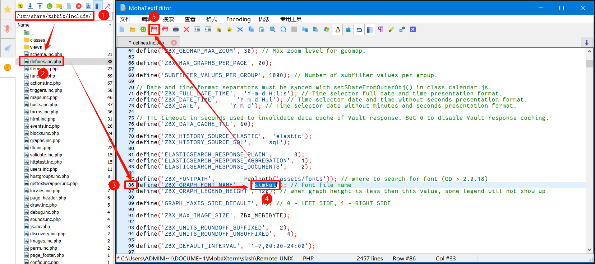

<font style="color:rgb(51, 51, 51);">刷新网页，如下图所示：</font>

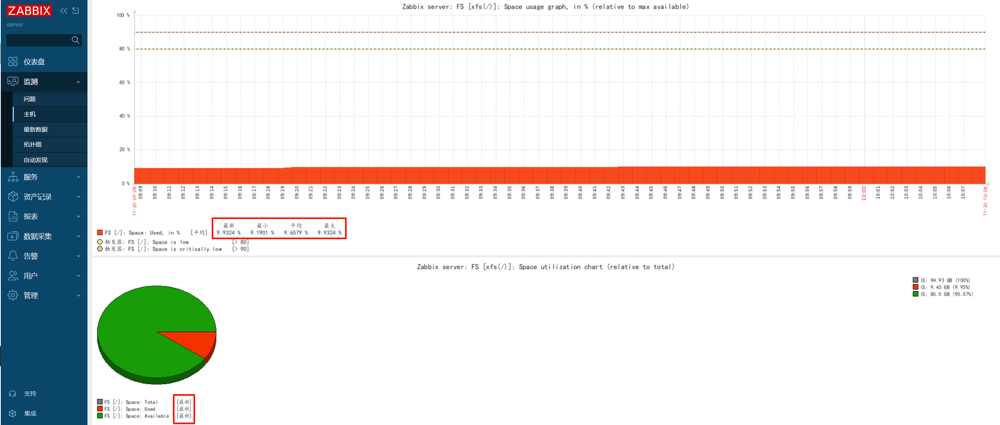

## <font style="color:rgb(51, 51, 51);">输入 IP 直接进入主页，不用加 zabbix 后缀</font>

<font style="color:rgb(51, 51, 51);">假如你希望 </font>[<font style="color:rgb(65, 131, 196);">http://IP 就能访问主页，而不是 http://ip/zabbix 访问主页</font>](http://xn--iphttp-qr3j87j97vj11k//ip/zabbix%E8%87%AA%E5%8A%A8%E9%87%8D%E5%AE%9A%E5%90%91)<font style="color:rgb(51, 51, 51);">，那么如下图所示配置即可：</font>

<code><font style="color:rgb(51, 51, 51);background-color:rgb(243, 244, 244);">vim /etc/httpd/conf/httpd.conf</font></code>

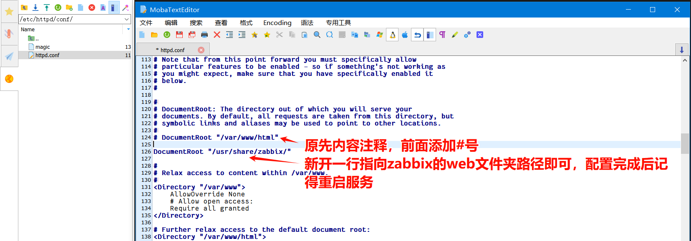

<font style="color:rgb(51, 51, 51);">更改完成后，重启 Apache 软件（httpd 软件）</font>

```shell
# systemctl restart httpd
```

测试：直接输入 IP 去访问 Zabbix 的页面

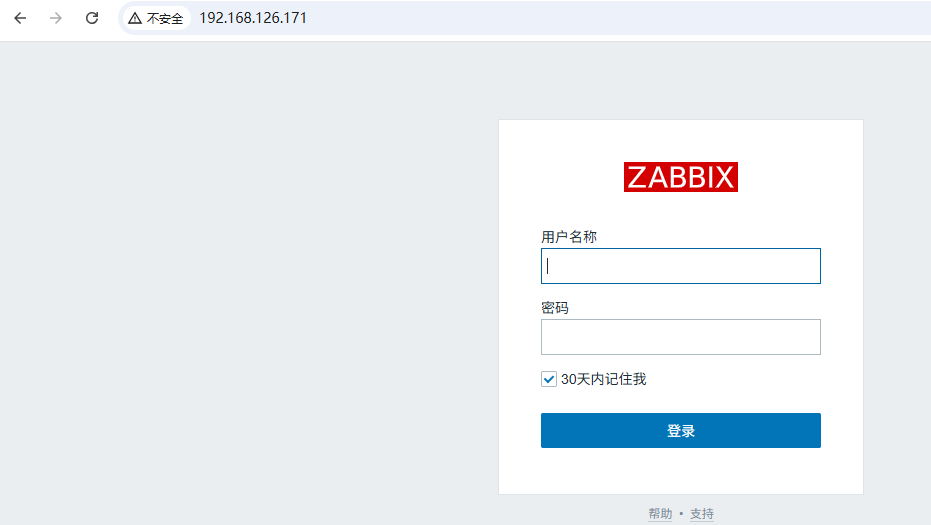

# <font style="color:rgb(51, 51, 51);">四、zabbix 服务器监控本机</font>

<font style="color:rgb(51, 51, 51);">概念：</font>

* **<font style="color:rgb(51, 51, 51);">主机（host）</font>**<font style="color:rgb(51, 51, 51);">：指被监控的一个设备（服务器，交换机等）</font>
* **<font style="color:rgb(51, 51, 51);">主机群组（hostgroup）：</font>**<font style="color:rgb(51, 51, 51);">指被监控的一组主机（主要应用在有特别多主机的情况，方便分组区分)</font>

<font style="color:rgb(51, 51, 51);">zabbix 服务器端默认配置了监控本机，但还需要安装客户端收集工具：zabbix-agent。</font>

## <font style="color:rgb(51, 51, 51);">服务器上安装 zabbix-agent（可忽略）</font>

```shell
# dnf install zabbix-agent
```

> 这里说的服务器，指的就是我们主机名是 server 的机器。
>
> 这里在 server 机器上不需要安装 zabbix-agent 了，因为上面我们在安装 zabbix-server 的时候已经装了！！！

## <font style="color:rgb(51, 51, 51);">启动 zabbix-agent 服务</font>

<font style="color:rgb(51, 51, 51);">请使用 vi 或 vim 打开 agent 端配置文件</font><code><font style="color:rgb(51, 51, 51);background-color:rgb(243, 244, 244);">/etc/zabbix/zabbix_agentd.conf</font></code><font style="color:rgb(51, 51, 51);">修改，修改后的结果如下</font>

```shell
# egrep -vn '^#|^$' /etc/zabbix/zabbix_agentd.conf
13:PidFile=/var/run/zabbix/zabbix_agentd.pid
32:LogFile=/var/log/zabbix/zabbix_agentd.log
43:LogFileSize=0
117:Server=127.0.0.1							# zabbix服务器的IP，agent被动监控(默认模式)
171:ServerActive=127.0.0.1				# zabbix服务器的IP，agent主动监控
182:Hostname=server					   		# zabbix服务器的主机名（需要改成自己的主机名称）
552:Include=/etc/zabbix/zabbix_agentd.d/*.conf
```

**<font style="color:rgb(51, 51, 51);">说明:</font>**

* <font style="color:rgb(51, 51, 51);">默认为相对于 agent 的被动监控，表示 server 找 agent 拿数据，而不是 agent 主动给数据 server</font>
* <font style="color:rgb(51, 51, 51);">主动与被动只是数据传输的方式不同，具体区别我们在最后的章节讨论</font>
* <font style="color:rgb(51, 51, 51);">我这里只修改了第 182 行的主机名，其它参数都为默认值未修改</font>

```shell
# systemctl restart zabbix-agent
# systemctl enable zabbix-agent

# netstat -ntlup |grep :10050
tcp    0    0 0.0.0.0:10050      0.0.0.0:*       LISTEN      65171/zabbix_agentd
tcp6   0    0 :::10050           :::*            LISTEN      65171/zabbix_agentd
```

## <font style="color:rgb(51, 51, 51);">确认本机监控状态</font>

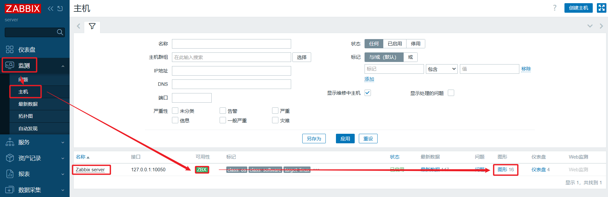

**<font style="color:rgb(51, 51, 51);">监控状态不OK的排错思路:</font>**

* <font style="color:rgb(51, 51, 51);">查看日志</font><code><font style="color:rgb(51, 51, 51);background-color:rgb(243, 244, 244);">cat /var/log/zabbix/zabbix_server.log</font></code>

# <font style="color:rgb(51, 51, 51);">五、监控远程 linux 服务器</font>

<font style="color:rgb(51, 51, 51);">目标：使用 Zabbix 实现远程 linux 服务器监控</font>

## <font style="color:rgb(51, 51, 51);">agent1 上安装 zabbix-agent</font>

```shell
# 安装官方yum仓库
[root@agent1 ~]# rpm -Uvh https://repo.zabbix.com/zabbix/7.0/alma/9/x86_64/zabbix-release-7.0-2.el9.noarch.rpm
[root@agent1 ~]# dnf install zabbix-agent -y

注：如果/etc/yum.repos.d目录存在epel.repo，必须先把epel.repo关闭，然后安装完成后在启用！！！
```

## <font style="color:rgb(51, 51, 51);">配置 agent 端并启动服务</font>

<font style="color:rgb(51, 51, 51);">配置</font><code><font style="color:rgb(51, 51, 51);background-color:rgb(243, 244, 244);">/etc/zabbix/zabbix_agentd.conf</font></code><font style="color:rgb(51, 51, 51);">配置文件，配置结果如下:</font>

```shell
[root@agent1 ~]# egrep -vn '^#|^$' /etc/zabbix_agentd.conf
13:PidFile=/var/run/zabbix/zabbix_agentd.pid
32:LogFile=/var/log/zabbix/zabbix_agentd.log
43:LogFileSize=0
117:Server=192.168.126.171					    # 修改成zabbix监控服务器的IP,agent被动模式
171:ServerActive=192.168.126.171			  # 修改成zabbix监控服务器的IP,agent主动模式
182:Hostname=agent1								    	# 修改为被监控端的主机名
```

```shell
[root@agent1 ~]# systemctl start zabbix-agent
[root@agent1 ~]# systemctl enable zabbix-agent

[root@agent1 ~]# netstat -ntlup | grep :10050
tcp    0   0 0.0.0.0:10050        0.0.0.0:*        LISTEN      7413/zabbix_agentd
tcp6   0   0 :::10050             :::*             LISTEN      7413/zabbix_agentd
```

## <font style="color:rgb(51, 51, 51);">web 管理界面创建监控主机</font>

在 Zabbix Server 端的 web 界面中，添加被监控的主机的信息。

<font style="color:rgb(51, 51, 51);">回到 web 管理界面 --> 点监测 --> 点主机 --> 点创建主机</font>

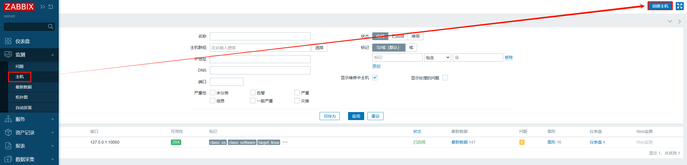

<font style="color:rgb(51, 51, 51);">设置主机名称、主机群组、模板以及接口信息</font>

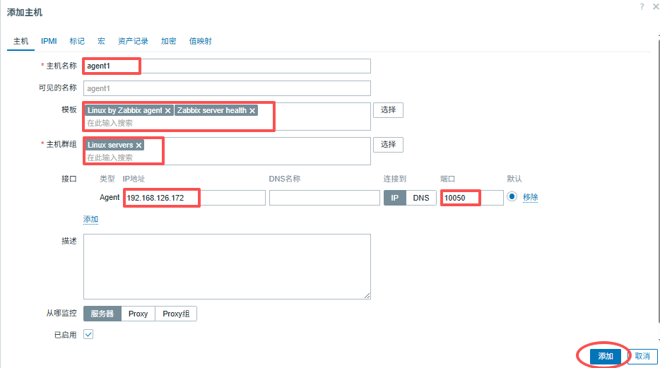

## <font style="color:rgb(51, 51, 51);">确认监控 OK</font>

<font style="color:rgb(51, 51, 51);">刚添加完后可用性的颜色还没变，刷新一下浏览器，稍等一会会变。变为绿色就表示远程主机被 Zabbix 成功监控到！</font>

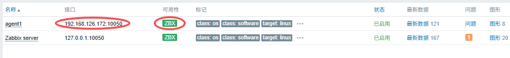

查看监控到的信息：

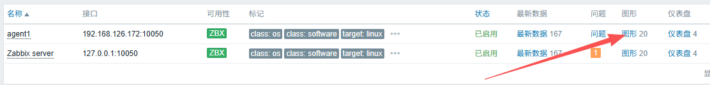

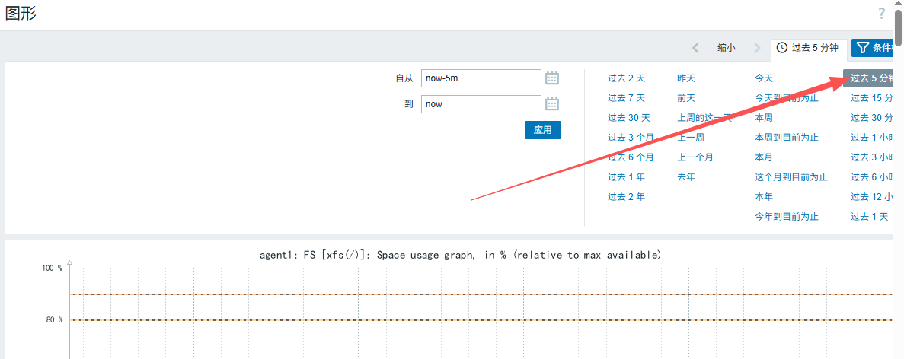

**<font style="color:rgb(51, 51, 51);">监控不 OK 的排错思路：</font>**

* <font style="color:rgb(51, 51, 51);">检查 server 与 agent1 的网络是否 OK，防火墙是否关闭</font>
* <font style="color:rgb(51, 51, 51);">检查 IP 与端口是否写错</font>
* <font style="color:rgb(51, 51, 51);">在 agent 端查看日志</font><code><font style="color:rgb(51, 51, 51);background-color:rgb(243, 244, 244);">cat /var/log/zabbix/zabbix_agentd.log</font></code>
* <font style="color:rgb(51, 51, 51);">在 server 端查看日志</font><code><font style="color:rgb(51, 51, 51);background-color:rgb(243, 244, 244);">cat /var/log/zabbix/zabbix_server.log</font></code>

# <font style="color:rgb(51, 51, 51);">六、模板</font>

## <font style="color:rgb(51, 51, 51);">模板介绍与作用</font>

**<font style="color:rgb(51, 51, 51);">模板(template)</font>**<font style="color:rgb(51, 51, 51);">：是包括监控项，应用集，触发器，图形，聚合图形，自动发现，web 监测等的一组实体。</font>

**<font style="color:rgb(51, 51, 51);">使用模板可以方便应用到主机，更改模板也会将更改应用到所有链接的主机</font>**<font style="color:rgb(51, 51, 51);">。</font>

<font style="color:rgb(51, 51, 51);">server、agent1、agent2：公用一个 Linux by Zabbix Agent，如果更改了这个模板，则所有主机监控项也会随之改变！</font>

<font style="color:rgb(51, 51, 51);">例: 比如我要把监控 nginx 相关的全部做成一个模板，有 100 台服务器需要监控 nginx，我只需要链接模板到这 100 台机器即可。以后需要修改，只需要修改模板，这 100 台就会被同时修改。</font>

<font style="color:rgb(51, 51, 51);">数据采集 => 模板：</font>

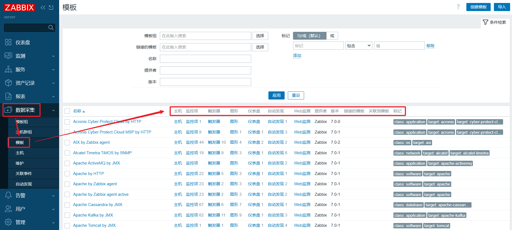

## <font style="color:rgb(51, 51, 51);">为主机添加或删除模板</font>

<font style="color:rgb(51, 51, 51);">zabbix 自带了很多实用的模板，对于一些要求不高的公司来说，直接将模板添加到监控主机都几乎够用了。</font>

<font style="color:rgb(51, 51, 51);">修改被监控的机器 agent1 的主机配置：</font>

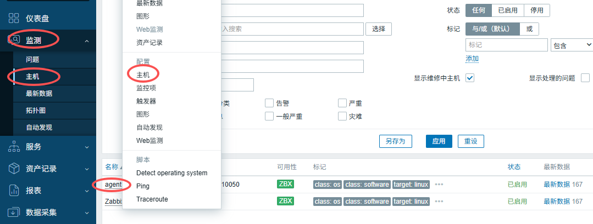

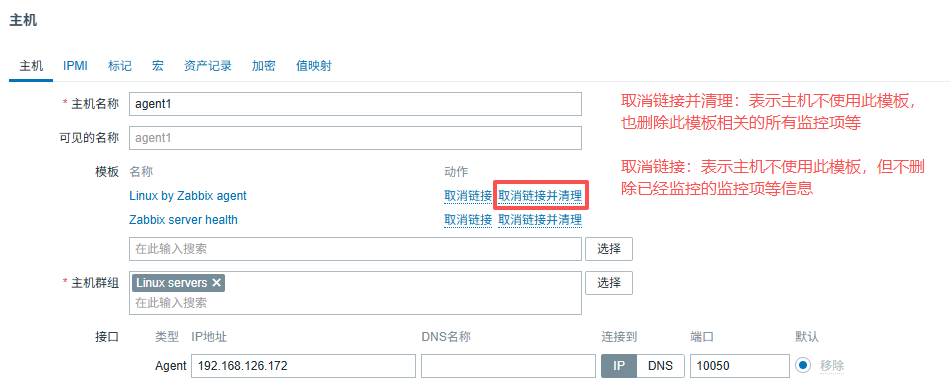

添加新的模板：

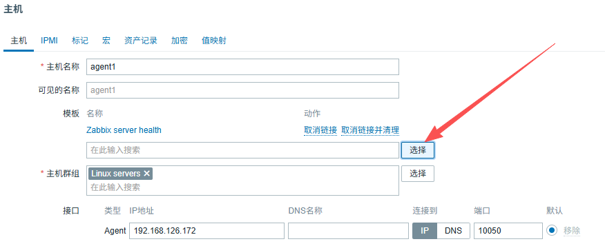

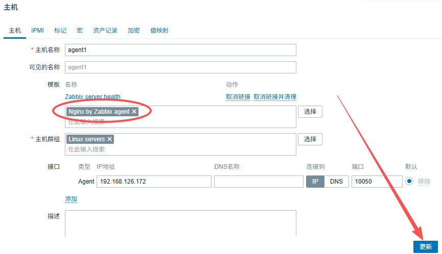

但其实我们的 agent1 机器上并没有安装 Nginx，这里只是测试的换一个模板而已！


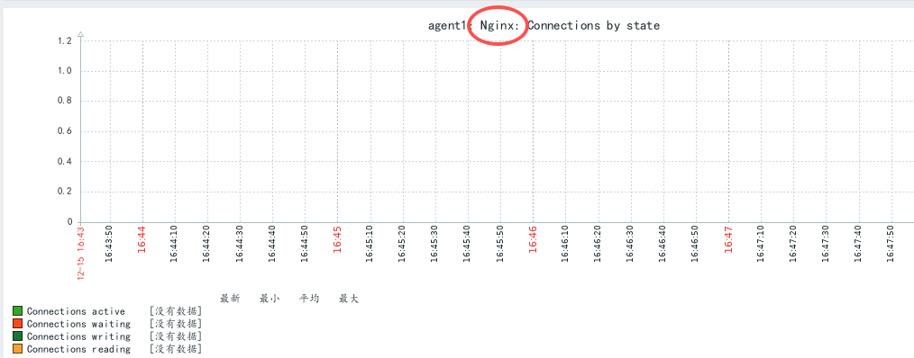

## <font style="color:rgb(51, 51, 51);">创建自定义模板</font>

<font style="color:rgb(51, 51, 51);">数据采集 -> 模板 -> 创建模板：</font>

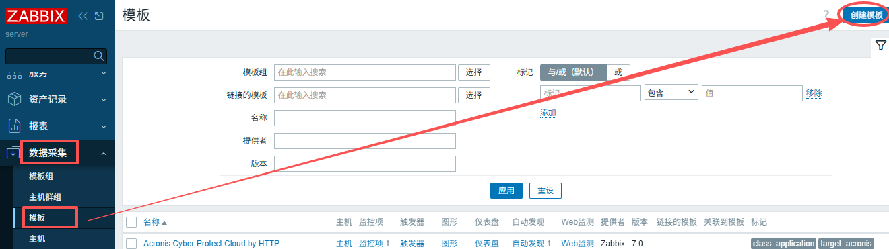

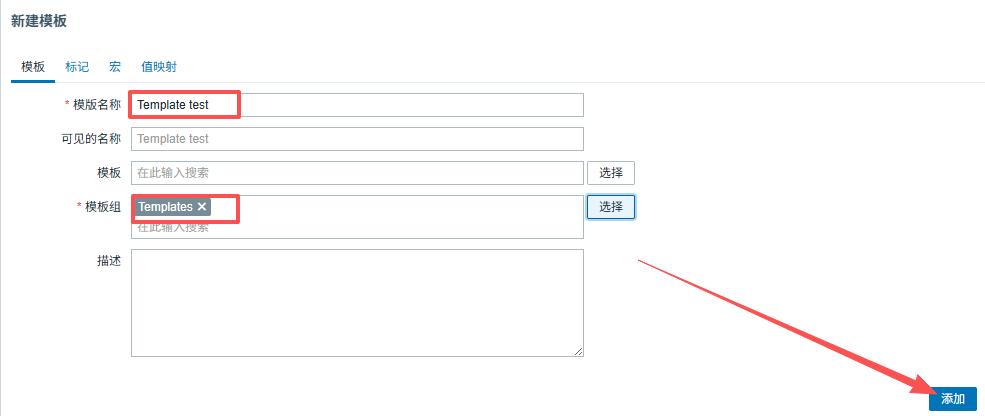

查看自定义的模板是否能够使用：

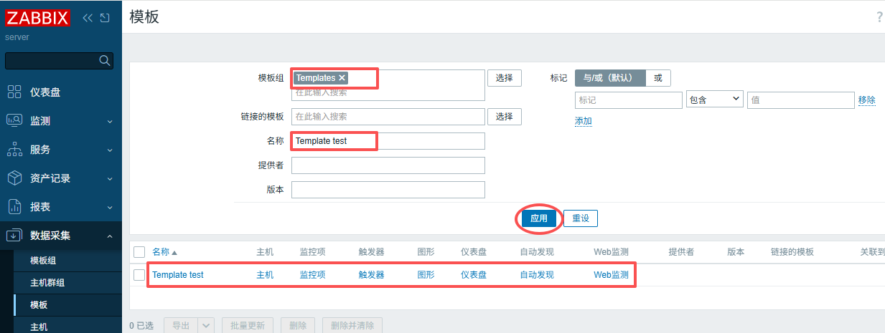

**<font style="color:rgb(51, 51, 51);">练习:</font>**<font style="color:rgb(51, 51, 51);"> 请将 agent1 其它模板都清空，使用刚刚自定义的</font><code><font style="color:rgb(51, 51, 51);background-color:rgb(243, 244, 244);">Template test</font></code><font style="color:rgb(51, 51, 51);">模板。</font>

<font style="color:rgb(51, 51, 51);">操作的最终结果如下:</font>

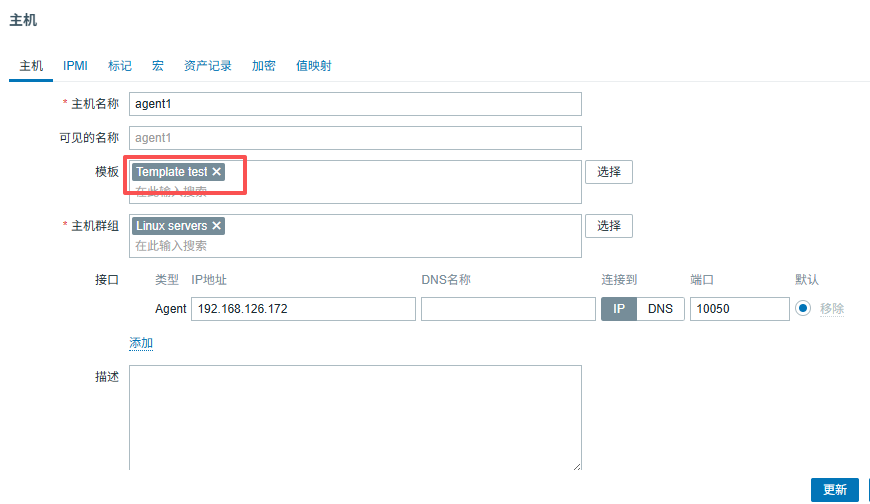

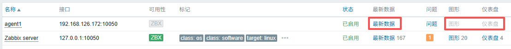

可以看到 agent1 使用自定义的模板后，最新数据、图形、仪表盘等上面都没有数字，那是因为我们自定义的模板其实啥也没有，还没有往模板中定义内容！

# <font style="color:rgb(51, 51, 51);">七、监控项与应用集</font>

**<font style="color:rgb(51, 51, 51);">监控项(item)</font>**<font style="color:rgb(51, 51, 51);">: 是从主机收集的数据信息，代表收集数据或监控的一个</font>**<font style="color:rgb(51, 51, 51);">最小单位</font>**<font style="color:rgb(51, 51, 51);">。</font>

<font style="color:rgb(51, 51, 51);">比如 cpu 1 分钟内平均负载，内存空闲值，磁盘使用率等等都可以做为监控项，可以说监控项有无限种可能。</font>

**<font style="color:rgb(51, 51, 51);">应用集(applications)</font>**<font style="color:rgb(51, 51, 51);">: 代表多个监控项目合成的组。</font>

## <font style="color:rgb(51, 51, 51);">创建监控项的方式（Zabbix 内置的）</font>

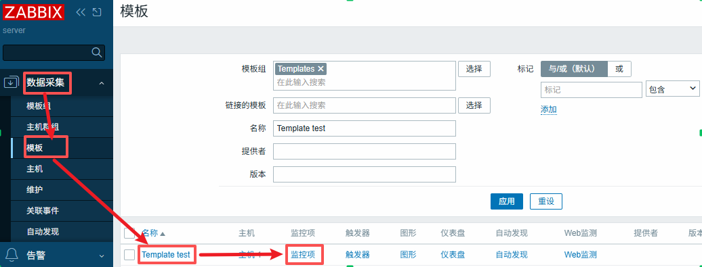

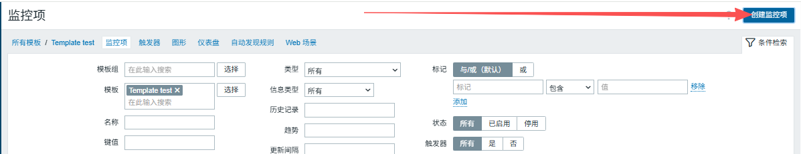

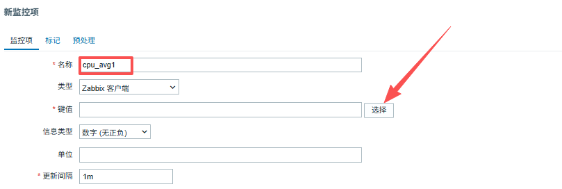

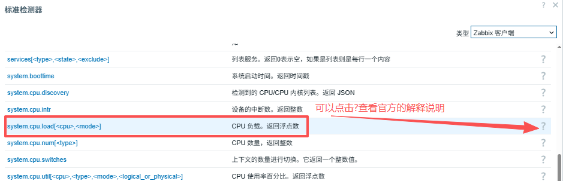

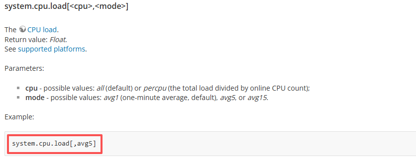

<code><font style="color:rgb(51, 51, 51);background-color:rgb(248, 248, 248);">system.cpu.load[all,avg1]</font></code>

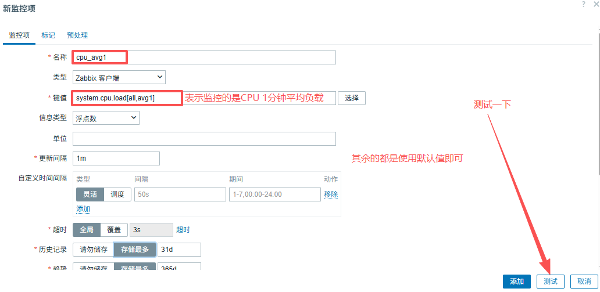

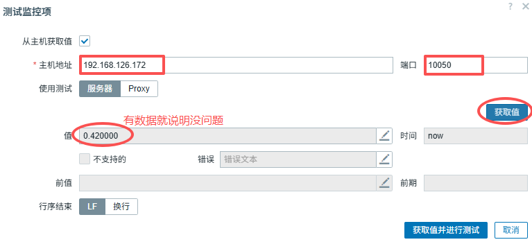

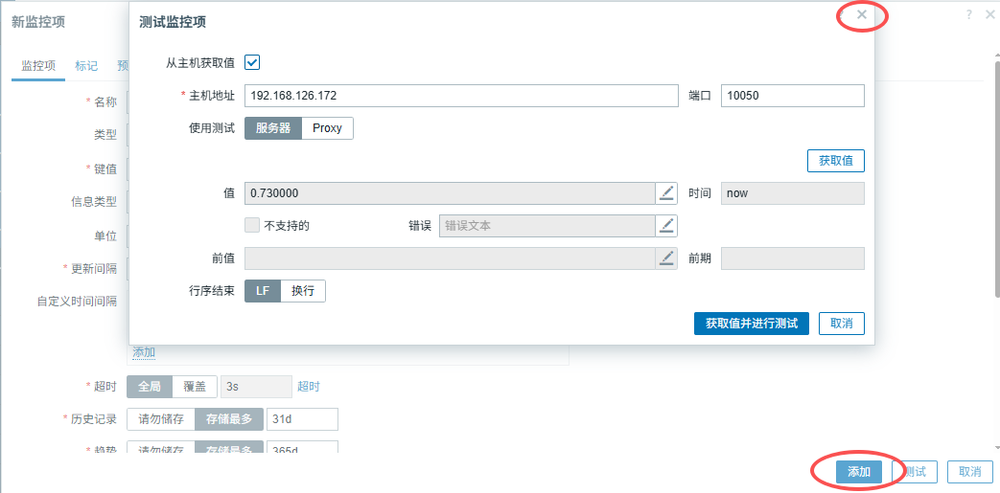

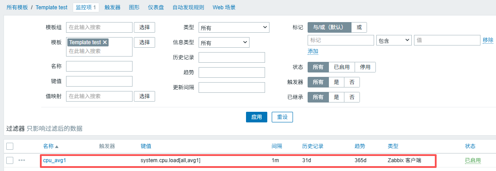

这样我们就在自己定义的模板中添加了一个监控项-CPU1 分钟的平均负载！5 分钟、15 分钟也是一样的操作！

大家可以将 5 分钟、15 分钟的平均负载也添加到监控项中！

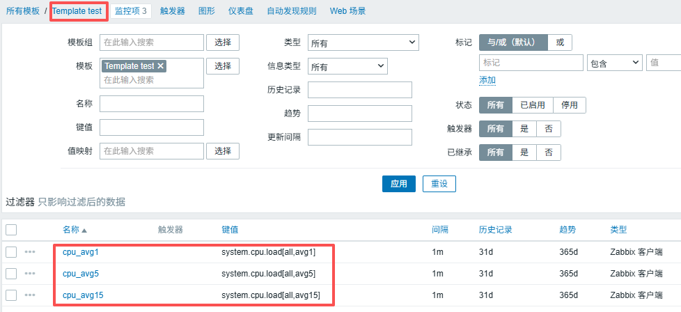

> 说明：Zabbix 中的监控项实在太多了，都是一个个的键值对，不好记，也不好找！
>
> 我们可以使用 AI 大模型生成监控项！

## 基于 AI 大模型扩展监控项说明

目标：基于 AI 大模型生成自定义监控项

监控磁盘中根分区使用率，磁盘 IO，网络进出情况

<font style="color:#117CEE;">https://kimi.moonshot.cn/</font>，输入提示词，越精准越好

Zabbix 版本 + 具体指标 + 期望返回结果

### 案例 1

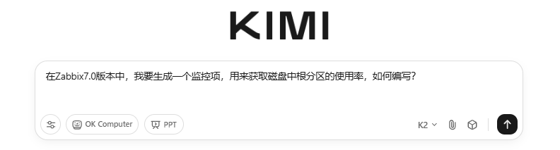

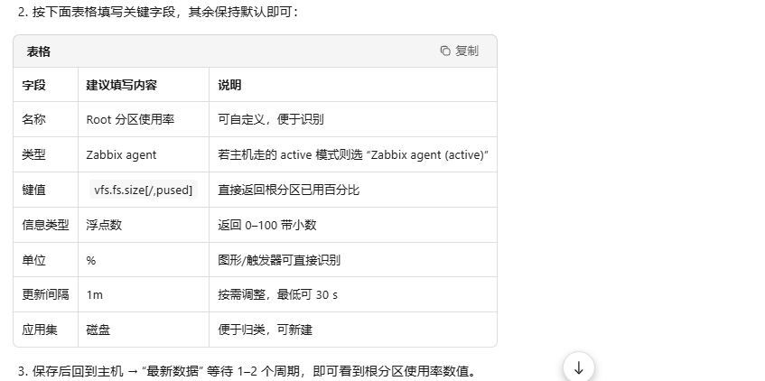

然后我们按照 AI 的提示再创建监控项即可。

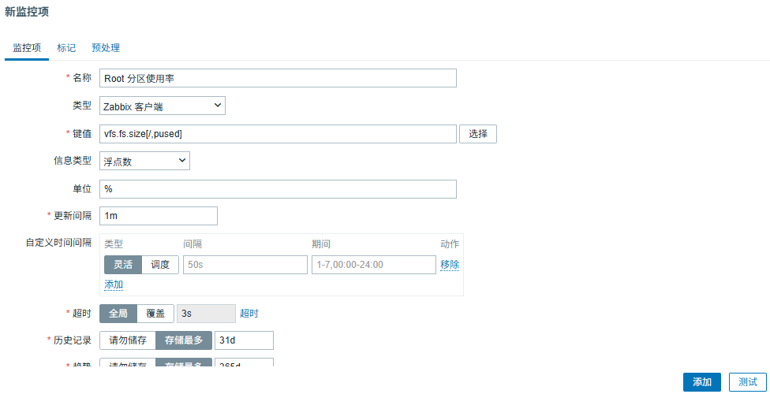

***

### 案例 2

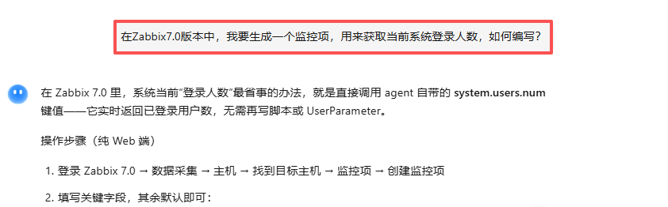

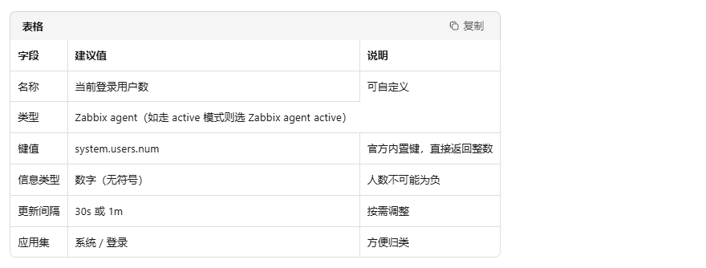

然后我们按照 AI 的提示再创建监控项即可。

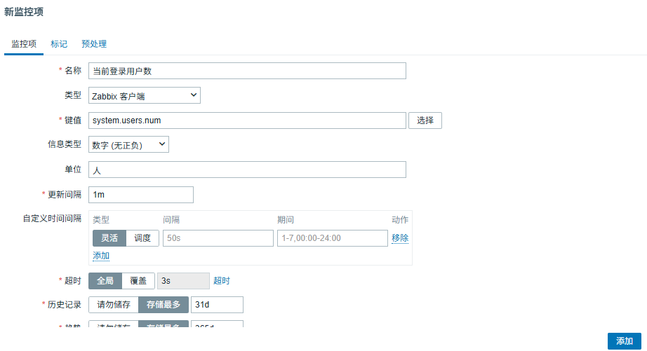

最终我们在自定义的模板中添加了如下监控项：

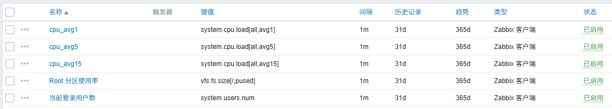

可以查看 agent1 的监控情况，可以点击最新数据进行查看：（我们刚刚添加的监控项设置的都是默认 1min 抓取一次数据！）

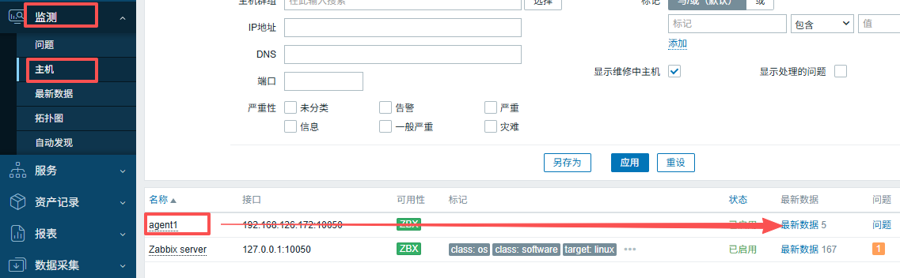

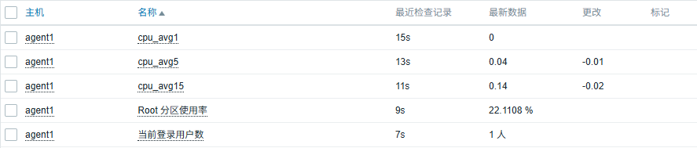

## <font style="color:rgb(51, 51, 51);">创建自定义键值监控项</font>

<font style="color:rgb(51, 51, 51);">以监控登录用户数为例，自带键值中有</font><code><font style="color:rgb(51, 51, 51);background-color:rgb(243, 244, 244);">system.users.num</font></code><font style="color:rgb(51, 51, 51);">这个键值，但我们不使用它，使用自定义的键值来实现。</font>

### <font style="color:rgb(51, 51, 51);">在被监控端agent1上操作</font>

<font style="color:rgb(51, 51, 51);">首先在 agent1 多打开几个终端，模拟多个登录用户，然后使用</font><code><font style="color:rgb(51, 51, 51);background-color:rgb(243, 244, 244);">who | wc -l</font></code><font style="color:rgb(51, 51, 51);">查询</font>

```shell
[root@agent1 ~]# who | wc -l
2						
我这里确认登录用户数为2
```

<font style="color:rgb(51, 51, 51);">然后在 agent1 上，定义 UserParameter</font>

```shell
[root@agent1 ~]# vim /etc/zabbix/zabbix_agentd.conf

350行 UserParameter=loginusers,who | wc -l

说明: loginusers是我自定义的一个键值名称（会在创建监控项时用到), 后面的who | wc -l就是要被监控的命令
如果有多个自定义的键，那就写多个，比如:
UserParameter=loginusers,who | wc -l
UserParameter=meminfo,free -h
```

<font style="color:rgb(51, 51, 51);">重启 zabbix-agent 服务使之生效</font>

```shell
[root@agent1 ~]# systemctl restart zabbix-agent
```

### <font style="color:rgb(51, 51, 51);">在 zabbix 监控端上操作（可选）</font>

<font style="color:rgb(51, 51, 51);">在 zabbix 服务器安装</font><code><font style="color:rgb(51, 51, 51);background-color:rgb(243, 244, 244);">zabbix-get</font></code><font style="color:rgb(51, 51, 51);">工具，可以远程测试能否通过自定义的键值得到数据</font>

```shell
[root@server ~]# yum install zabbix-get -y

[root@server ~]# zabbix_get -s 192.168.126.172 -k loginusers
2					
可以确认得到的值确实为agent1的登录用户数

选项说明:
-s后接agent端的IP
-k后接agent端自定义的键值
```

### <font style="color:rgb(51, 51, 51);">在 web 管理界面创建监控项</font>

<font style="color:rgb(51, 51, 51);">还是在自定义模板里创建</font>

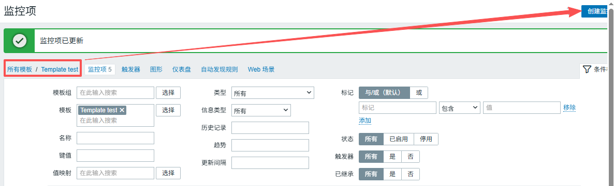

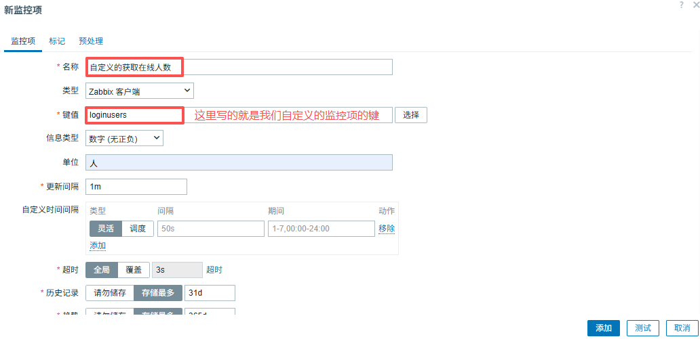

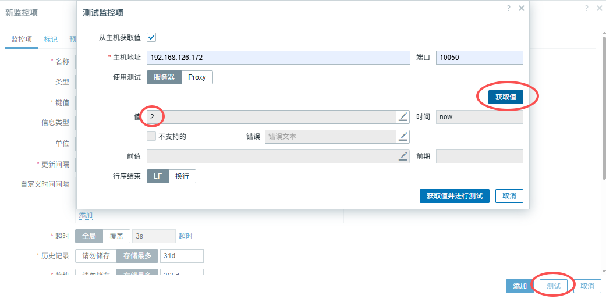

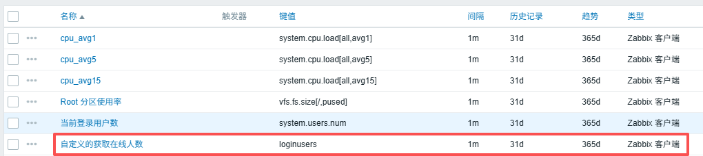

### <font style="color:rgb(51, 51, 51);">确认创建成功</font>

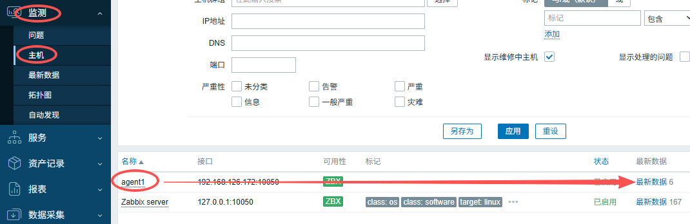

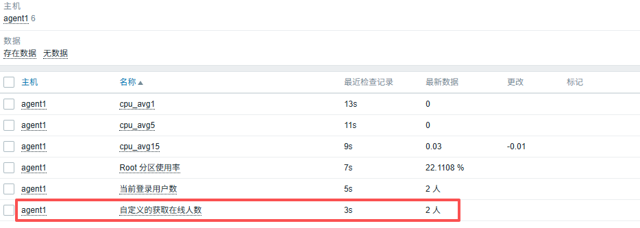

小结：

监控项：其实就是我们平常所说的监控指标。

支持的方式：系统内置的键值、自定义键值，还可以通过 AI 大模型辅助！

# <font style="color:rgb(51, 51, 51);">八、图形与仪表板（聚合图形）</font>

<font style="color:rgb(51, 51, 51);">监控项创建好了, 但是它监控收集的数据在哪里看呢? 答案就是</font>**<font style="color:rgb(51, 51, 51);">图形</font>**

## <font style="color:rgb(51, 51, 51);">创建图形显示监控项数据</font>

### <font style="color:rgb(51, 51, 51);">在模板里创建图形</font>

<font style="color:rgb(51, 51, 51);">数据采集 => 模板：</font>

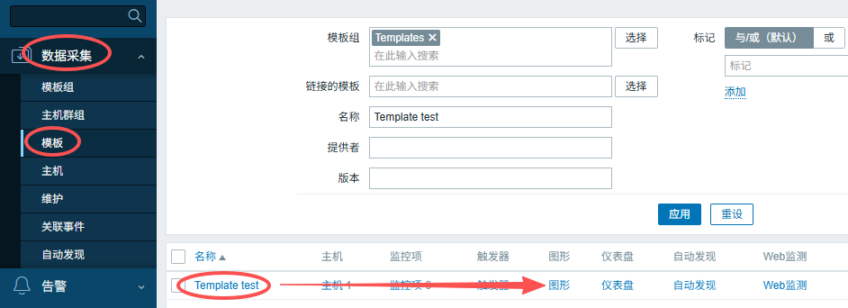


### <font style="color:rgb(51, 51, 51);">配置图形对应监控项</font>


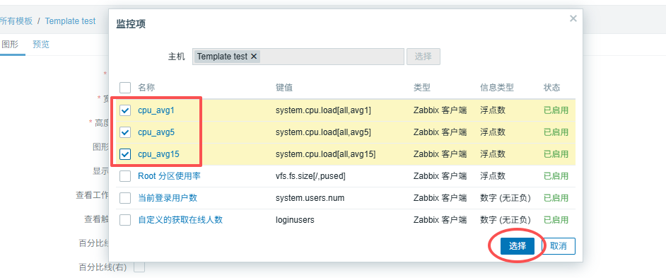

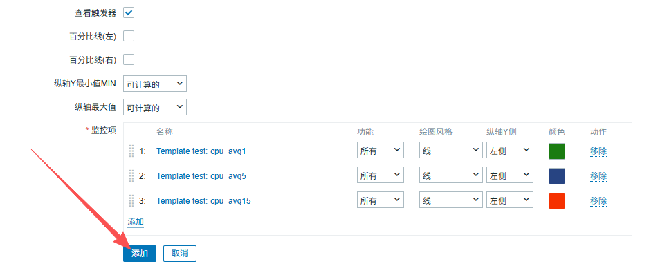

### <font style="color:rgb(51, 51, 51);">验证图形</font>

<font style="color:rgb(51, 51, 51);">监测 => 主机 => 点图形：</font>

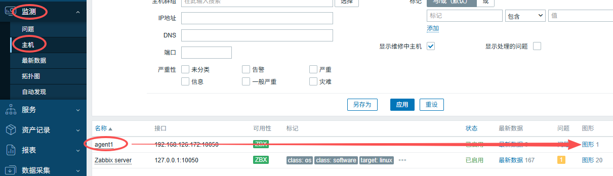

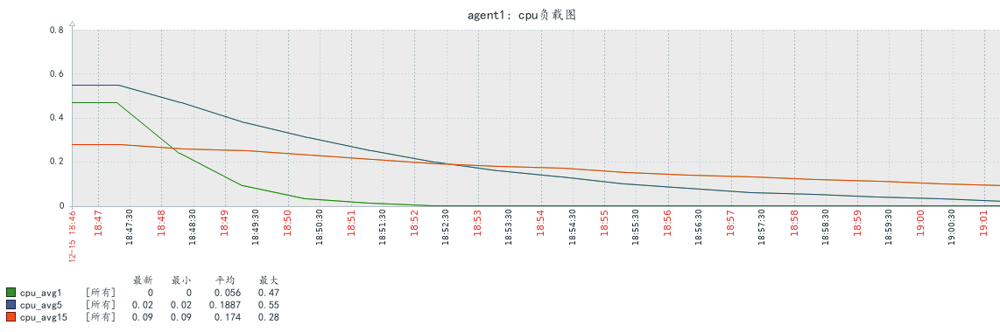

**<font style="color:rgb(51, 51, 51);">练习: </font>**<font style="color:rgb(51, 51, 51);">请将前面自定义的登录用户数这个监控项也做成图形</font>

<font style="color:rgb(51, 51, 51);">最终结果如图: </font>

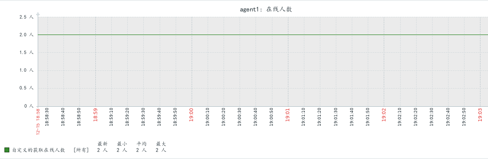

## <font style="color:rgb(51, 51, 51);">仪表板（监控大屏）</font>

**<font style="color:rgb(51, 51, 51);">仪表板：</font>**<font style="color:rgb(51, 51, 51);">就是把多个重要常用的图形整合一起来显示，方便查看。</font>

<font style="color:rgb(51, 51, 51);">假设需要经常查看 agent1 的 cpu 负载与登录用户数这两张图，我们可以将其聚合到一起做成一张聚合图形</font>

### <font style="color:rgb(51, 51, 51);">创建仪表板</font>

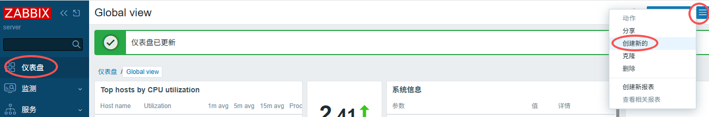

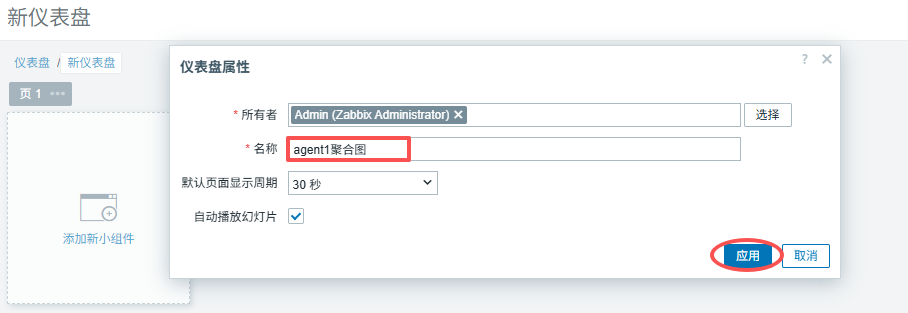

<font style="color:rgb(51, 51, 51);">创建完成后，如下图所示：</font>


### <font style="color:rgb(51, 51, 51);">编辑图形</font>

<font style="color:rgb(51, 51, 51);">添加要监控主机：</font>

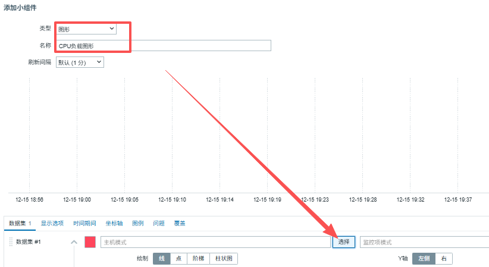

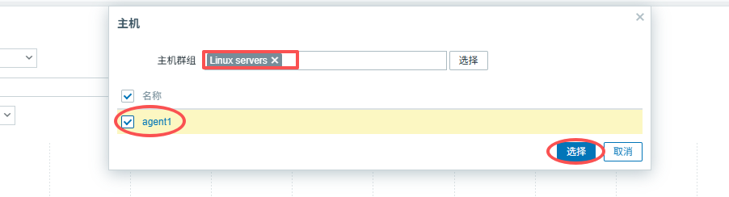

<font style="color:rgb(51, 51, 51);">添加监控项，包括1分钟负载、5分钟负载、15分钟负载</font>

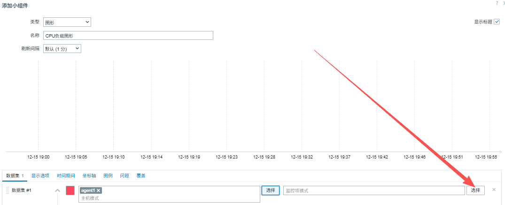

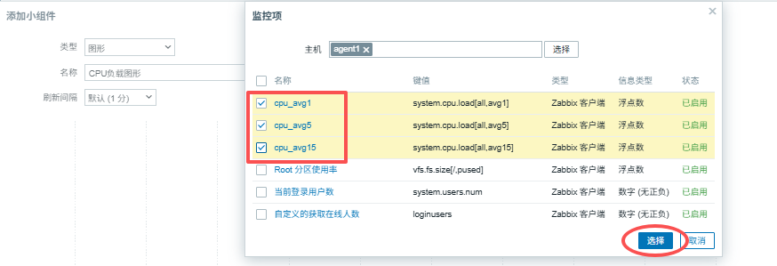

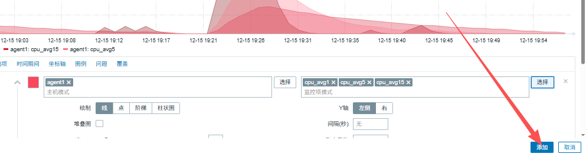

<font style="color:rgb(51, 51, 51);">设置完成后，如下图所示：</font>

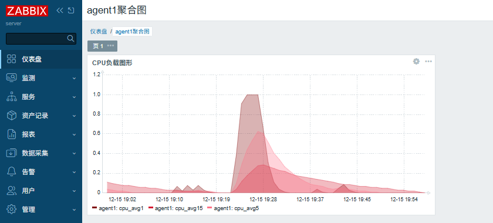

<font style="color:rgb(51, 51, 51);">添加 System 登录用户数</font>

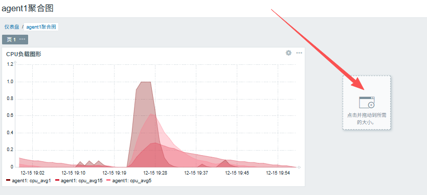

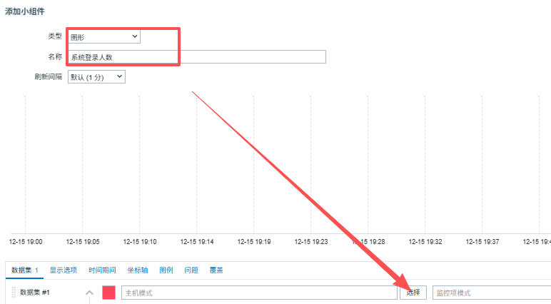


<font style="color:rgb(51, 51, 51);">添加监控项</font>

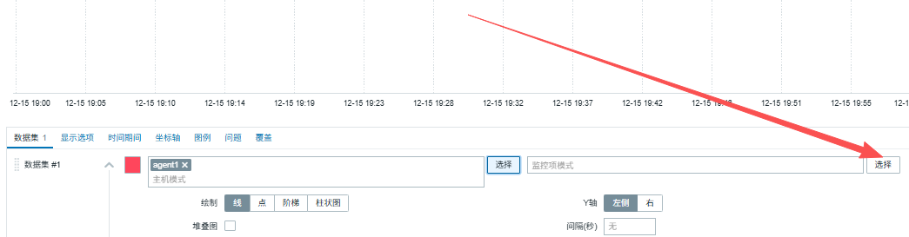

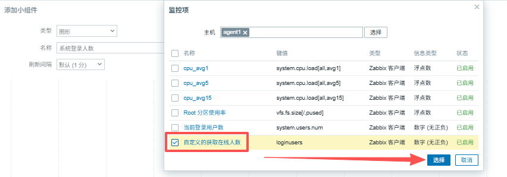

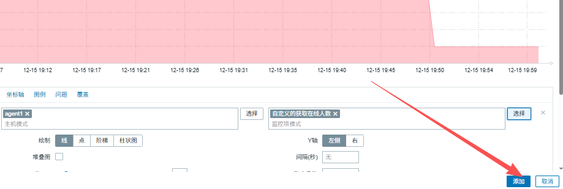

<font style="color:rgb(51, 51, 51);">整合后如下图所示：</font>

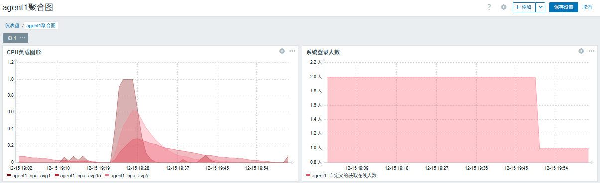

### <font style="color:rgb(51, 51, 51);">单击保存设置</font>


# <font style="color:rgb(51, 51, 51);">九、触发器</font>

<font style="color:rgb(51, 51, 51);">虽然我们可以通过图形查看到监控的数据，但我们不可能一直盯着图形的变化。</font>

<font style="color:rgb(51, 51, 51);">所以需要定义监控项到达一个临界值(阈值)或者满足一个条件，就会发生状态变化的通知。</font>

<font style="color:rgb(51, 51, 51);">定义</font>**<font style="color:rgb(51, 51, 51);">触发器(trigger)</font>**<font style="color:rgb(51, 51, 51);">就是定义这个临界值(阈值)或条件。</font>

<font style="color:rgb(51, 51, 51);">监控项有无限种可能，触发器也一样有无限种可能。如: </font>

* <font style="color:rgb(51, 51, 51);">cpu 负载值大于某个值则通知</font>
* <font style="color:rgb(51, 51, 51);">登录用户数大于某个值则通知</font>
* <font style="color:rgb(51, 51, 51);">内存空闲率小于某个值则通知</font>
* <font style="color:rgb(51, 51, 51);">磁盘使用率大于某个值则通知</font>
* <font style="color:rgb(51, 51, 51);">主机名被修改则通知</font>

<font style="color:rgb(51, 51, 51);">等等，主要还是看需求。</font>

## <font style="color:rgb(51, 51, 51);">需求</font>

<font style="color:rgb(51, 51, 51);">创建登录用户数过多的触发器</font>

## <font style="color:rgb(51, 51, 51);">在模板里创建触发器</font>

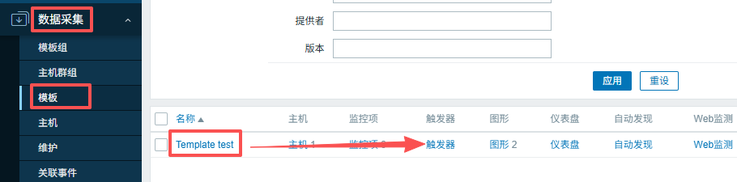

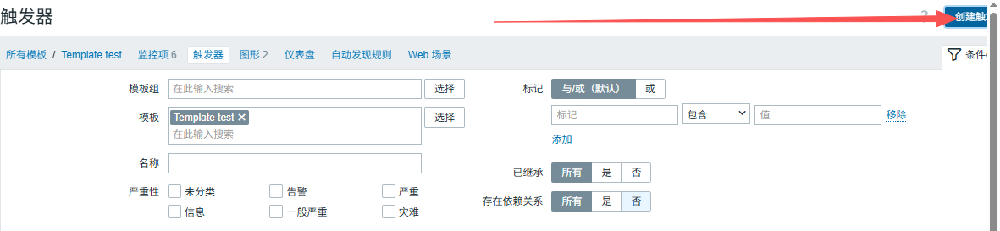

## <font style="color:rgb(51, 51, 51);">配置触发器</font>

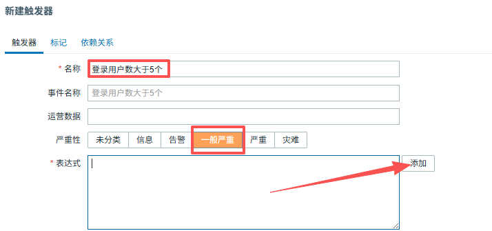

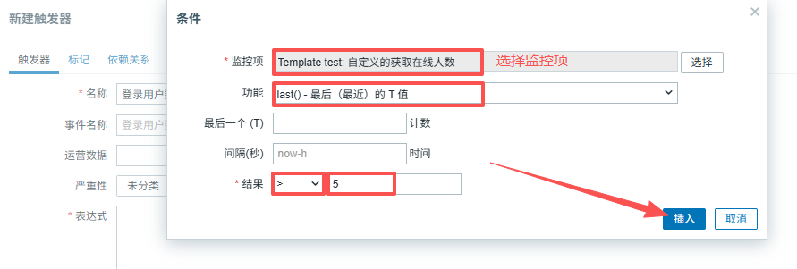

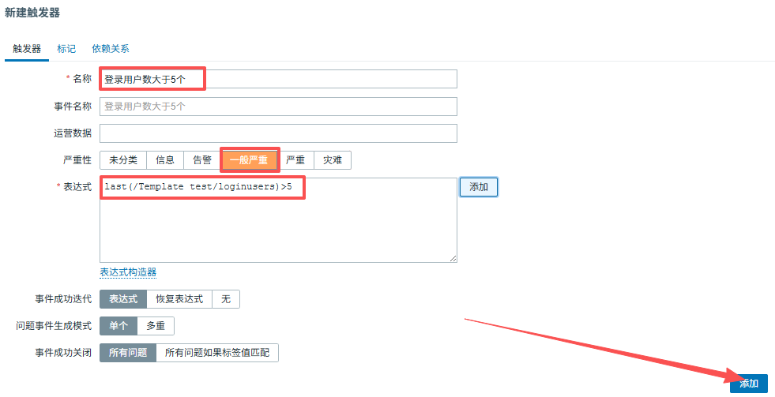

## <font style="color:rgb(51, 51, 51);">验证创建成功</font>

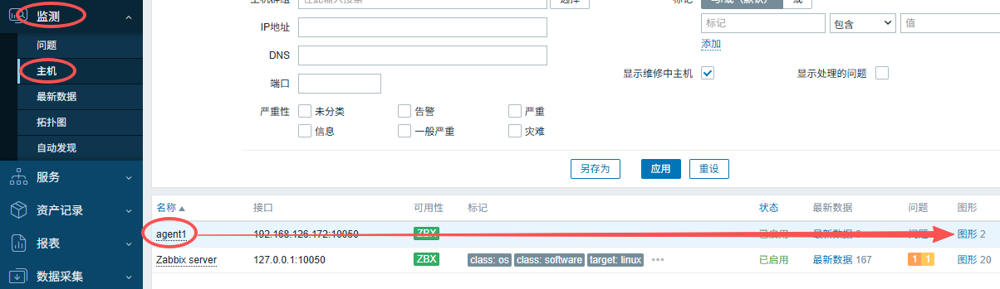

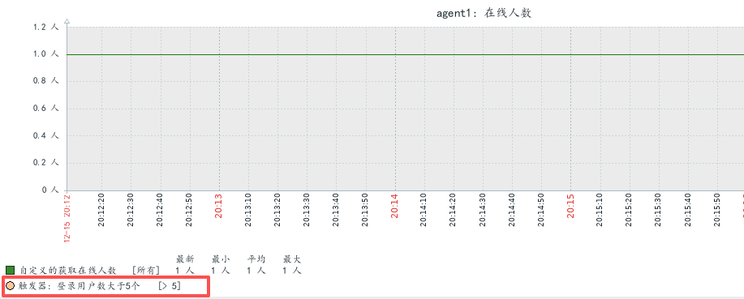

## <font style="color:rgb(51, 51, 51);">验证触发器效果</font>

<font style="color:rgb(51, 51, 51);">先在 agent1 上再多打开几个终端，将登录用户数控制在 5 个以上(操作过程省略)</font>

<font style="color:rgb(51, 51, 51);">然后通过下图查看触发器通知</font>

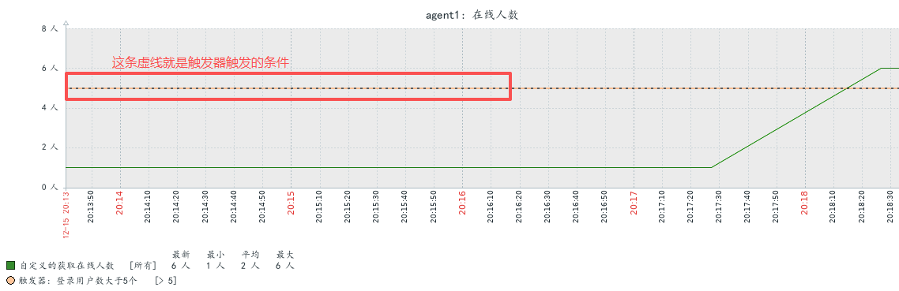

在首页的仪表盘中会不断的闪烁提示：

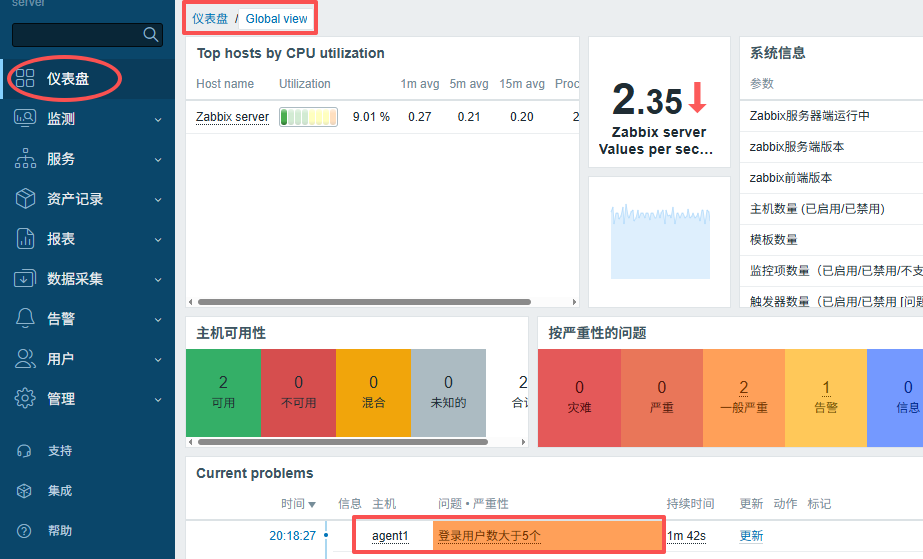

# <font style="color:rgb(51, 51, 51);">十、报警</font>

<font style="color:rgb(51, 51, 51);">触发器的通知信息显示在 web 管理界面，运维工程师仍然没办法 24 小时盯着它。所以我们希望它能自动地通知工程师们，这就是报警。</font>

<font style="color:rgb(51, 51, 51);">zabbix 的报警媒介支持 email、jabber、sms(短信)、微信、电话语音等，新版本中也支持企微、钉钉等告警形式。</font>

## <font style="color:rgb(51, 51, 51);">报警过程原理</font>

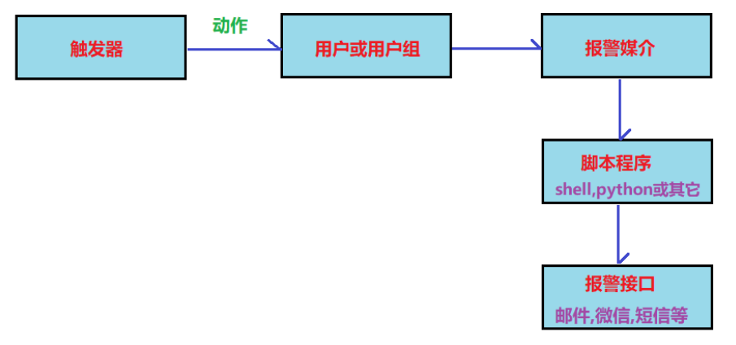

## <font style="color:rgb(51, 51, 51);">报警平台申请与配置</font>

<font style="color:rgb(51, 51, 51);">自己配置报警过程比较复杂，需要配置触发器动作，用户与其报警媒介，最麻烦的是写程序对接邮件、微信、短信、电话等接口。</font>

* <font style="color:rgb(51, 51, 51);">邮件容易被拒，当做垃圾邮件</font>
* <font style="color:rgb(51, 51, 51);">微信需要企业微信号并开发程序对接</font>
* <font style="color:rgb(51, 51, 51);">短信一般都需要付费买运营商相关服务</font>
* <font style="color:rgb(51, 51, 51);">电话语音需要更专业的开发</font>

<font style="color:rgb(51, 51, 51);">以上要求对于没有开发能力和开发支持的运维工程师来说，难度较大。</font>

<font style="color:rgb(51, 51, 51);">所以我们这里选择专业的报警平台就可以帮助实现一体化报警方案。</font>

<font style="color:rgb(51, 51, 51);">如：onealeart，参考：</font>[<font style="color:rgb(65, 131, 196);">http://www.onealert.com/</font>](http://www.onealert.com/)

### 准备<font style="color:rgb(51, 51, 51);">OneAlert</font>账号（之前已做）

第一步：在OneAlert平台注册信息，地址是：<http://www.onealert.com>


第二步：邮箱认证

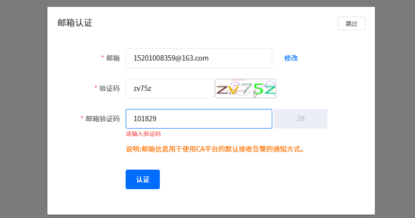

第三步：身份认证

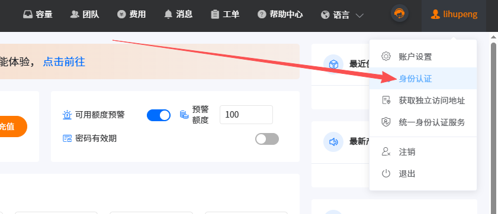


当然，我们也可以绑定自己的微信，这样就可以使用微信告警了！

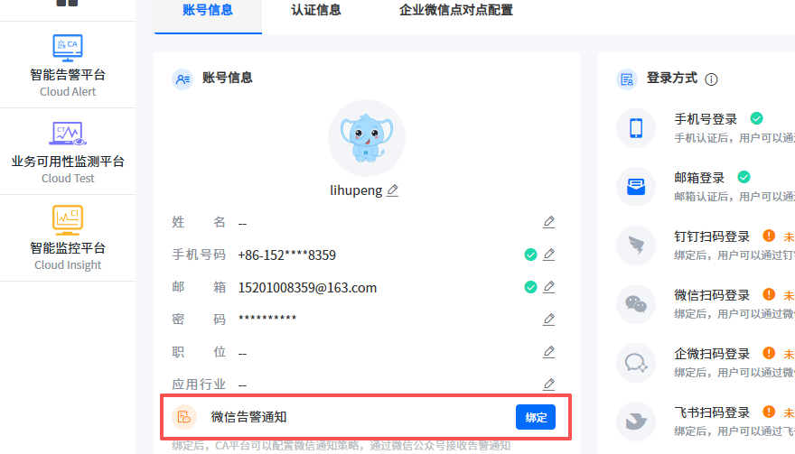

### 设置通知策略（之前已做）

也就是设置告警时的通知策略，比如设置什么时间进行通知、什么级别的信息进行通知、什么方式进行通知等等。


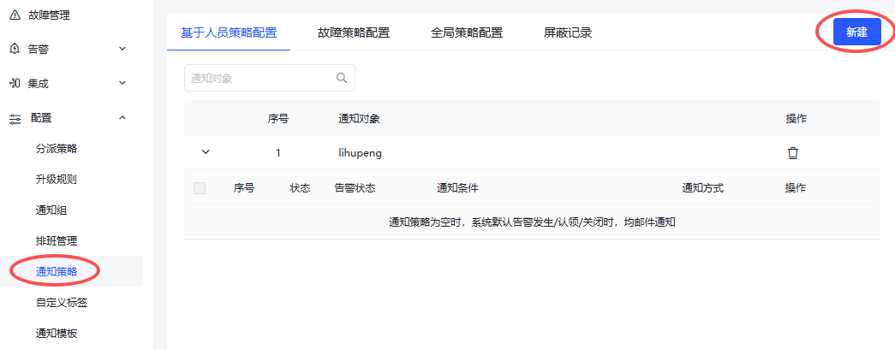


最终结果：

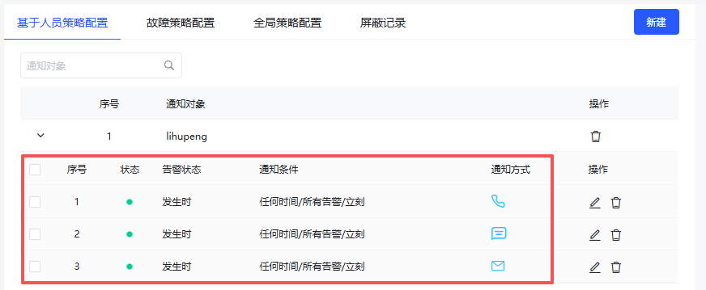

### 设置分发策略（之前已做）

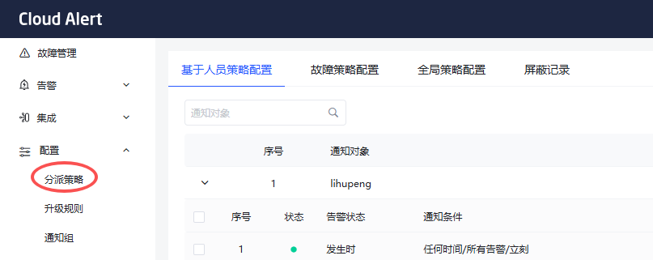


最终结果：


### 绑定监控工具

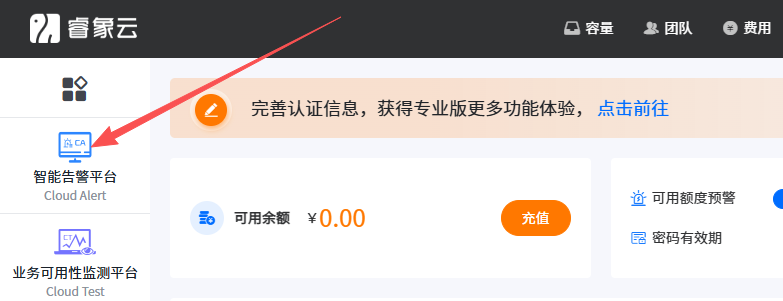

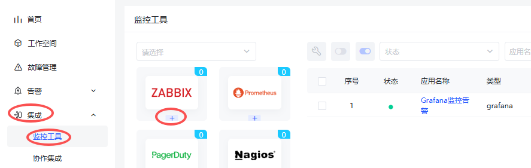


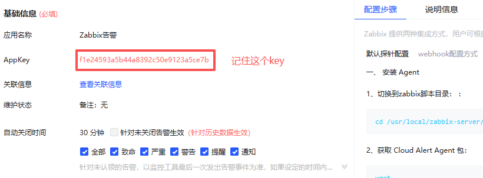

## server 上配置告警

在 Zabbix Server 上配置告警。在 server 服务器上进行操作：

```shell
[root@server ~]# cd /usr/lib/zabbix/alertscripts
[root@server alertscripts]# wget https://download.aiops.com/ca_agent/zabbix/ca_zabbix_release-4.0.4.tar.gz

[root@server alertscripts]# tar -xf ca_zabbix_release-4.0.4.tar.gz
[root@server alertscripts]# cd cloudalert/bin/

[root@server bin]# bash install.sh f1e24593a5b44a8392c50e9123a5ce7b
start to create config file...
Zabbix管理地址: http://192.168.126.171
Zabbix管理员账号: Admin
Zabbix管理员密码: zabbix
......
Create new action success!
Install zabbix agent success!

f1e24593a5b44a8392c50e9123a5ce7b：是上面OneAlert集成Zabbix后生成的key！
```

<font style="color:rgb(51, 51, 51);">补充：如果安装时，秘钥填入错误，也可以对其卸载？</font>

```shell
# cd /usr/lib/zabbix/alertscripts/cloudalert/bin/
# bash uninstall.sh
卸载完之后，重新执行上面的安装操作。
```

## <font style="color:rgb(51, 51, 51);">验证安装</font>

<font style="color:rgb(51, 51, 51);">配置完 onealert 后，我们可以验证下它安装后到底对 zabbix 做了啥。简单来说，它做了三件事:</font>

1. <font style="color:rgb(51, 51, 51);">增加了一个报警动作</font>
2. <font style="color:rgb(51, 51, 51);">增加了一个用户和一个用户组用于报警</font>
3. <font style="color:rgb(51, 51, 51);">增加了一个报警媒介类型</font>

### <font style="color:rgb(51, 51, 51);">验证动作</font>

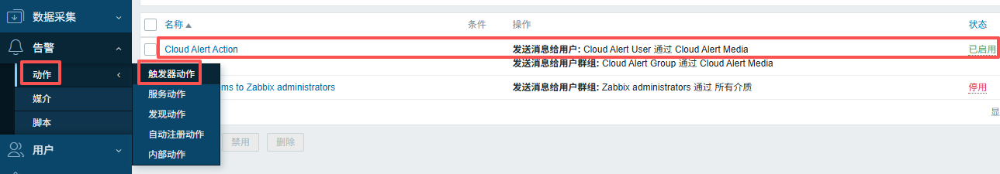

<font style="color:rgb(51, 51, 51);">确认以上信息，合起来表示：当触发器发生状态变化时，通知信息通过此动作发送消息给 cloudalert 用户。</font>

### <font style="color:rgb(51, 51, 51);">验证用户与用户群组</font>

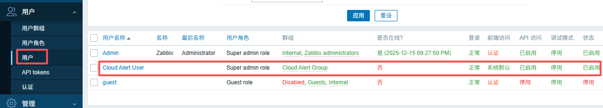

### <font style="color:rgb(51, 51, 51);">验证报警媒介</font>

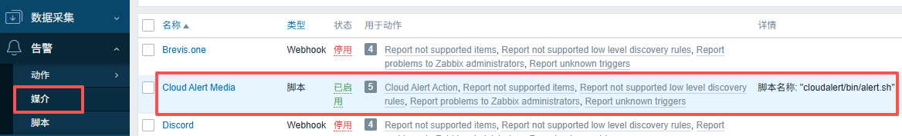

### <font style="color:rgb(51, 51, 51);">验证报警脚本</font>

<font style="color:rgb(51, 51, 51);">以下脚本看不懂没关系，我们只要知道是对接报警平台的 API 接口就 OK 了</font>

```shell
[root@server bin]# cat /usr/lib/zabbix/alertscripts/cloudalert/bin/alert.sh
#!/bin/bash
set -e
CUR_DIR=$(cd `dirname $0`; pwd)
DC_URL="http://api.aiops.com/alert/api/event/zabbix/v3"
if [ ! -s ${CUR_DIR}/funcs ];then
        exit 1
fi
. ${CUR_DIR}/funcs
$(log INFO ALERT "Request: $1")
RESP=$(http_post "$1" "$DC_URL")
$(log INFO ALERT "Response: $RESP")
exit 0
```

<font style="color:rgb(51, 51, 51);">把以上验证的内容再连成一条复习一下:</font>

**<font style="color:rgb(51, 51, 51);">监控项</font>**<font style="color:rgb(51, 51, 51);"> --> </font>**<font style="color:rgb(51, 51, 51);">图形</font>**<font style="color:rgb(51, 51, 51);"> --> </font>**<font style="color:rgb(51, 51, 51);">触发器</font>**<font style="color:rgb(51, 51, 51);"> --> </font>**<font style="color:rgb(51, 51, 51);">动作</font>**<font style="color:rgb(51, 51, 51);"> --> </font>**<font style="color:rgb(51, 51, 51);">用户</font>**<font style="color:rgb(51, 51, 51);"> --> </font>**<font style="color:rgb(51, 51, 51);">报警媒介</font>**<font style="color:rgb(51, 51, 51);"> --> </font>**<font style="color:rgb(51, 51, 51);">报警脚本</font>**<font style="color:rgb(51, 51, 51);"> --> </font>**<font style="color:rgb(51, 51, 51);">报警平台</font>**

## <font style="color:rgb(51, 51, 51);">触发器触发报警</font>

<font style="color:rgb(51, 51, 51);">这里以前面配置过的"</font>**<font style="color:rgb(51, 51, 51);">登录用户数大于 5 个</font>**<font style="color:rgb(51, 51, 51);">"这个触发器来测试报警.</font>

**<font style="color:rgb(51, 51, 51);">注意:</font>**<font style="color:rgb(51, 51, 51);"> 要触发器有状态变化才能报警。</font>

<font style="color:rgb(51, 51, 51);">如果在测试前就已经大于 5 个了是不会报警的，需要先降到 5 以下，再升到 5 以上让其触发。</font>

<font style="color:rgb(51, 51, 51);">多复制几个终端打开，大于 5 个，然后将手机铃声打开，等着报警！</font>

<font style="color:rgb(51, 51, 51);">报警后，在 OneAlert 平台认领告警：</font>

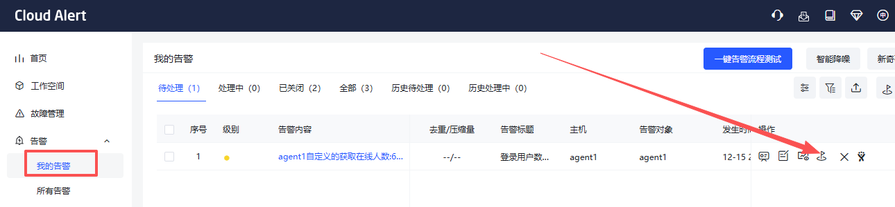

然后关闭告警，并填写解决方案：


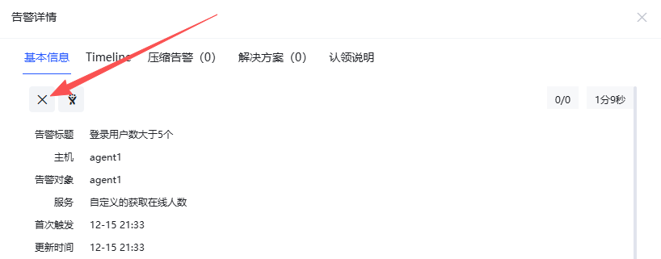


# <font style="color:rgb(51, 51, 51);">十一、自动化批量监控</font>

目前我们使用 Zabbix 监控主机的时候，需要做的事情：

1. 在被监控机器上安装 zabbix-agent 并做配置
2. 在 Zabbix Server 的 web 界面中添加要监控的主机信息
3. 在 web 界面中配置被监控的主机的模板、监控项等等

<font style="color:rgb(51, 51, 51);">我们要监控的服务器数量很大的情况下，如何批量操作:</font>

* <font style="color:rgb(51, 51, 51);">系统使用 cobbler 批量安装</font>
* <font style="color:rgb(51, 51, 51);">zabbix-agent 安装与配置可以使用 cobbler 的 postscript 脚本实现，或者使用 ansible 来实现</font>
* <font style="color:rgb(51, 51, 51);">监控主机元素: 监控项，图形，触发器等，统一使用模板</font>

<font style="color:rgb(51, 51, 51);">因为创建监控主机和添加模板都需要 web 界面操作，如何自动批量做?</font>

<font style="color:rgb(51, 51, 51);">答案: 自动发现或自动注册。</font>

## <font style="color:rgb(51, 51, 51);">需求</font>

<font style="color:rgb(51, 51, 51);">前面早就准备了一台 agent2，一直还没使用，这里就尝试自动发现这台 agent2，并通过动作将其创建为监控主机并添加模板。</font>

## <font style="color:rgb(51, 51, 51);">agent2 上安装 zabbix-agent</font>

```shell
[root@agent2 ~]# rpm -Uvh https://repo.zabbix.com/zabbix/7.0/alma/9/x86_64/zabbix-release-7.0-2.el9.noarch.rpm
[root@agent2 ~]# dnf install zabbix-agent -y

在安装zabbix-agent软件的时候，先将epel源仓库给禁用掉，安装完再启用！
```

## <font style="color:rgb(51, 51, 51);">配置 agent 端并启动服务</font>

<font style="color:rgb(51, 51, 51);">配置</font><code><font style="color:rgb(51, 51, 51);background-color:rgb(243, 244, 244);">/etc/zabbix/zabbix_agentd.conf</font></code><font style="color:rgb(51, 51, 51);">配置文件，配置结果如下：</font>

```shell
[root@agent2 ~]# egrep -vn '^#|^$' /etc/zabbix_agentd.conf
13:PidFile=/var/run/zabbix/zabbix_agentd.pid
32:LogFile=/var/log/zabbix/zabbix_agentd.log
43:LogFileSize=0
115:Server=192.168.126.171							# 修改为Zabbix Server服务器IP地址
169:ServerActive=192.168.126.171		    # 修改为Zabbix Server服务器IP地址
180:Hostname=agent2		    							# 修改为Zabbix Agent所在主机名称（必须和hostname保持一致）
```

```shell
[root@agent2 ~]# systemctl start zabbix-agent
[root@agent2 ~]# systemctl enable zabbix-agent

[root@agent2 ~]# netstat -ntlup | grep :10050
tcp     0  0 0.0.0.0:10050      0.0.0.0:*       LISTEN      20447/zabbix_agentd
tcp6    0  0 :::10050           :::*            LISTEN      20447/zabbix_agentd
```

**<font style="color:rgb(51, 51, 51);">再次说明: 在自动化运维体系里可以使用 cobbler 的 postscript 脚本或 ansible 来批量做以上2步。</font>**

## <font style="color:rgb(51, 51, 51);">配置并启用自动发现规则</font>

在 Zabbix Server 的 Web 页面中配置并启用自动发现机制，这样我们就不需要像之前监控 agent1 一样还得在 Web 页面手动添加 agent1 的信息及模板监控项等信息了！！！

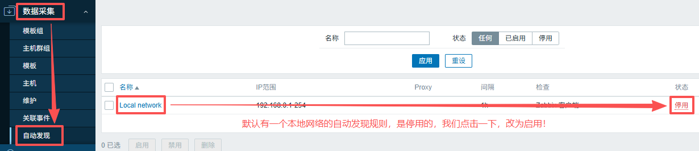

配置自动发现的规则：

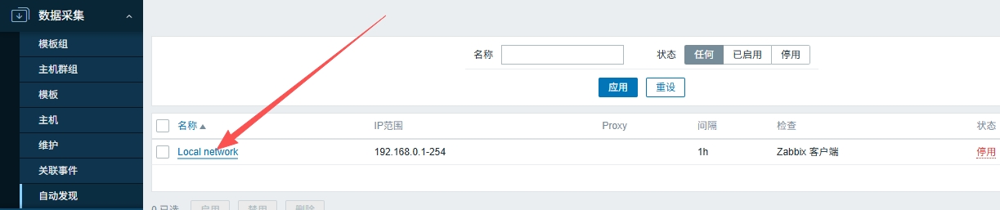

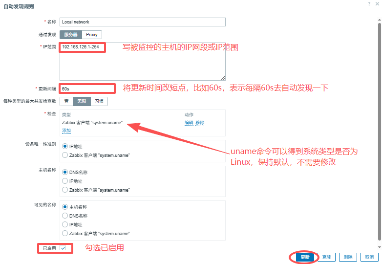


## <font style="color:rgb(51, 51, 51);">确认自动发现到主机</font>

<font style="color:rgb(51, 51, 51);">监测 => 自动发现</font>

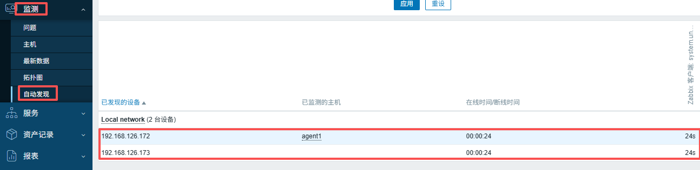

确实自动发现了两台主机。(需要等待 1 分钟才能看到效果，因为我们配置了更新间隔是 60s)

## <font style="color:rgb(51, 51, 51);">配置动作实现自动监控</font>

<font style="color:rgb(51, 51, 51);">告警 => 动作 => 发现动作 => 点击 "Auto discovery. Linux servers."</font>

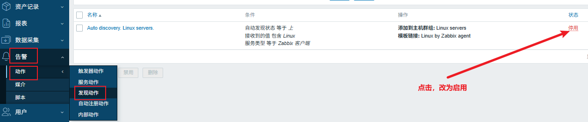

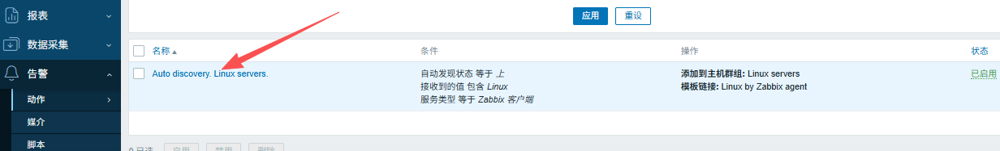

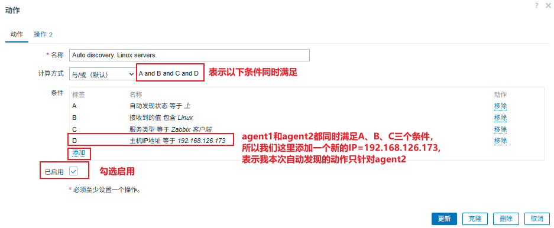

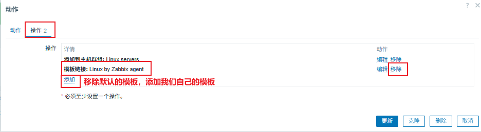

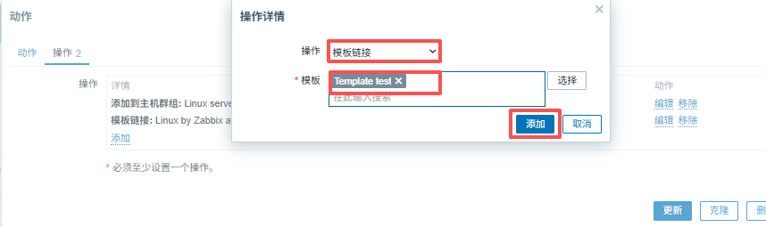

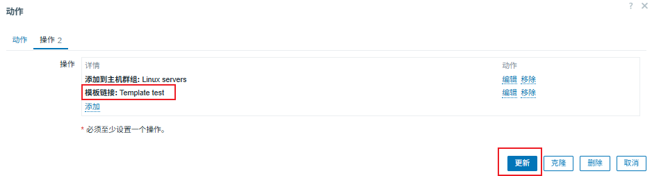

## <font style="color:rgb(51, 51, 51);">确认动作更新并启用</font>

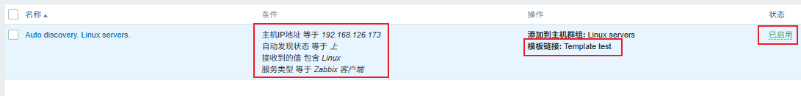

## <font style="color:rgb(51, 51, 51);">验证最终效果</font>

<font style="color:rgb(51, 51, 51);">确认时间同步, 需要耐心等待一段时间。(可能几分钟到十几分钟)</font>

<font style="color:rgb(51, 51, 51);">最终效果如下:</font>

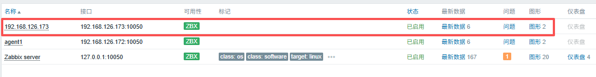

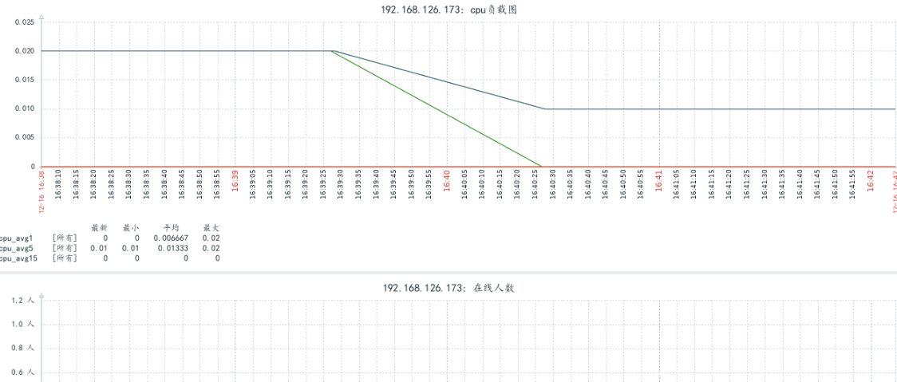

> <font style="color:rgb(51, 51, 51);">我们给自动发现配置完动作和模板后，最后查看结果时，很可能监控的主机没有用我们配置的模板，是因为我们配置模板前，可能已经使用默认的模板了，我们可以将自动监控到的主机给删除，然后让它重新自动发现，就可以使用我们配置好的动作、模板了！删除的操作如下：</font>

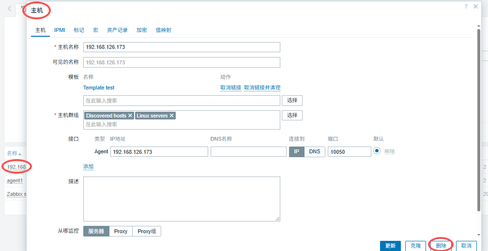

**<font style="color:rgb(51, 51, 51);">问题:</font>**<font style="color:rgb(51, 51, 51);"> agent2 上的"登录用户数"这个监控项的图形上没有数据, 为什么? 如何解决?</font>

<font style="color:rgb(51, 51, 51);">答：因为登录用户数，是我们自己定义的监控项，当时是需要在 zabbix\_agentd.conf 配置文件中添加 key 的！！！现在没有添加，所以没有数据！</font>

## <font style="color:rgb(51, 51, 51);">解决 agent2 上的登录人数问题</font>

在 agent2 服务器上做以下操作：

`vim /etc/zabbix/zabbix_agentd.conf`：

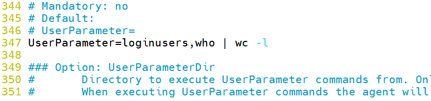

重启服务

```shell
# systemctl restart zabbix-agent
```

然后刷新浏览器，等一会查看：

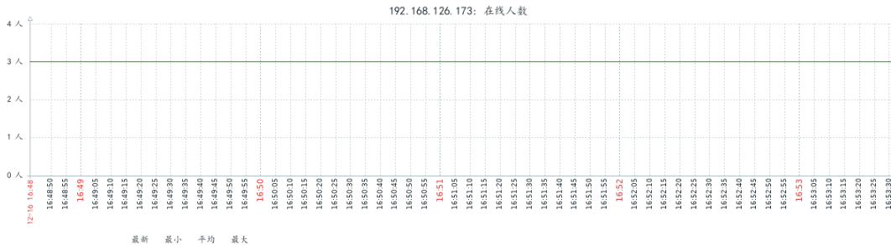

***

小结：

<font style="color:rgb(51, 51, 51);">① 什么是自动发现？所谓的自动发现就是 Zabbix Server 主动发现安装了 Zabbix Agent 节点 => 通过网段</font>

<font style="color:rgb(51, 51, 51);">② 自动发现实施步骤</font>

<font style="color:rgb(51, 51, 51);">第一步：数据采集菜单 => 自动发现 => 设置自动发现网段信息 192.168.126.1-254</font>

<font style="color:rgb(51, 51, 51);">第二步：配置动作 => 告警 => 动作 => 发现动作（找到了这台机器，对它做啥）</font>

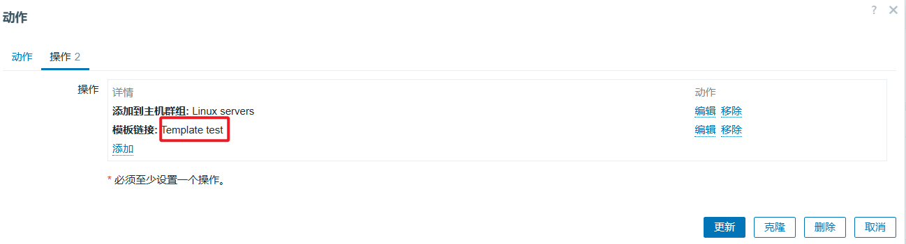

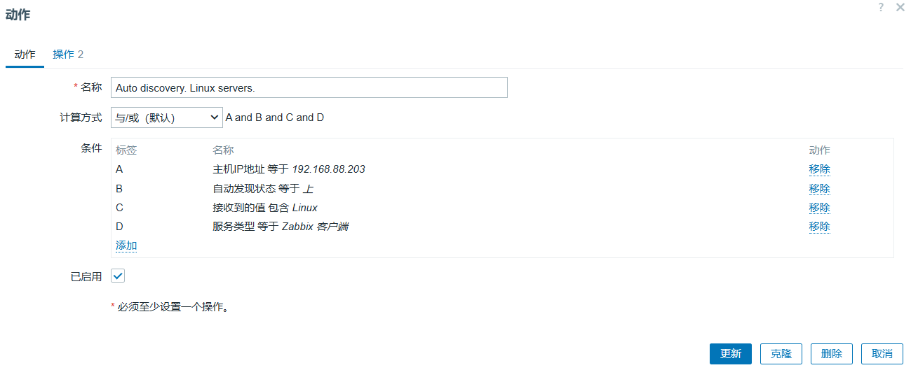

<font style="color:rgb(51, 51, 51);">第三步：返回，监测菜单 => 主机 => 可以发现新主机信息</font>

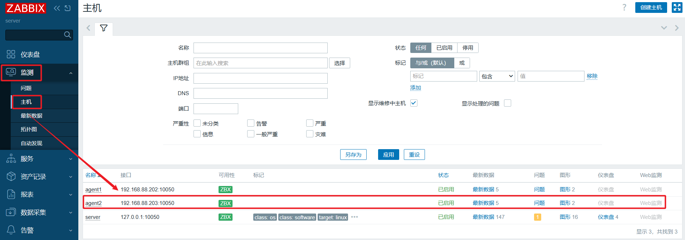

**<font style="color:rgb(51, 51, 51);">自动注册就不再演示了，仅了解即可。</font>**

## <font style="color:rgb(51, 51, 51);">批量操作</font>

<font style="color:rgb(51, 51, 51);">把大量的服务器实现了自动监控后，后续还可能会做一些相关的批量操作，如:</font>

* <font style="color:rgb(51, 51, 51);">批量启用主机</font>
* <font style="color:rgb(51, 51, 51);">批量禁用主机</font>
* <font style="color:rgb(51, 51, 51);">批量删除主机</font>

<font style="color:rgb(51, 51, 51);">数据采集 => 主机，如下图所示：</font>

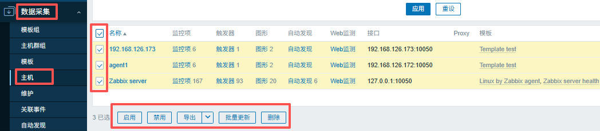

**<font style="color:rgb(51, 51, 51);">说明:</font>**

* <font style="color:rgb(51, 51, 51);">因为我们建议使用模板来管理监控，所以批量更新功能也可以直接更新模板即可</font>
* <font style="color:rgb(51, 51, 51);">导出功能在当前版本经测试只能导出单个主机的配置信息为</font><code><font style="color:rgb(51, 51, 51);background-color:rgb(243, 244, 244);">.yaml/.xml/.json</font></code><font style="color:rgb(51, 51, 51);">格式文件</font>

## <font style="color:rgb(51, 51, 51);">模板导入导出</font>

<font style="color:rgb(51, 51, 51);">辛苦配置好的模板或主机，如果被误删除了怎么办? 或者我想搭建多个 zabbix 服务器，那么又要辛苦再配置一遍？</font>

<font style="color:rgb(51, 51, 51);">解决方法就是把配置的模板或主机导出成</font><code><font style="color:rgb(51, 51, 51);background-color:rgb(243, 244, 244);">.yaml/.xml/.json</font></code><font style="color:rgb(51, 51, 51);">格式文件，主要有两大好处:</font>

* **<font style="color:rgb(51, 51, 51);">备份</font>**<font style="color:rgb(51, 51, 51);">(防止误删除)</font>
* **<font style="color:rgb(51, 51, 51);">迁移</font>**<font style="color:rgb(51, 51, 51);">(导出后, 导入到另一个服务器)</font>

<font style="color:rgb(51, 51, 51);">导出模板：数据采集 => 模板：</font>

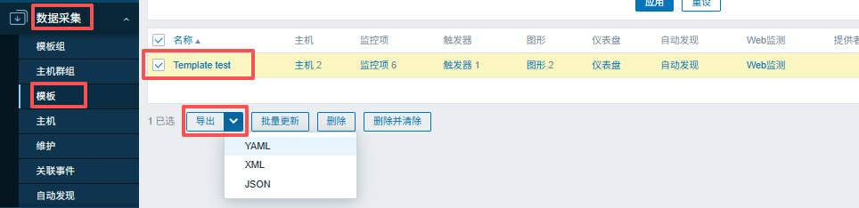

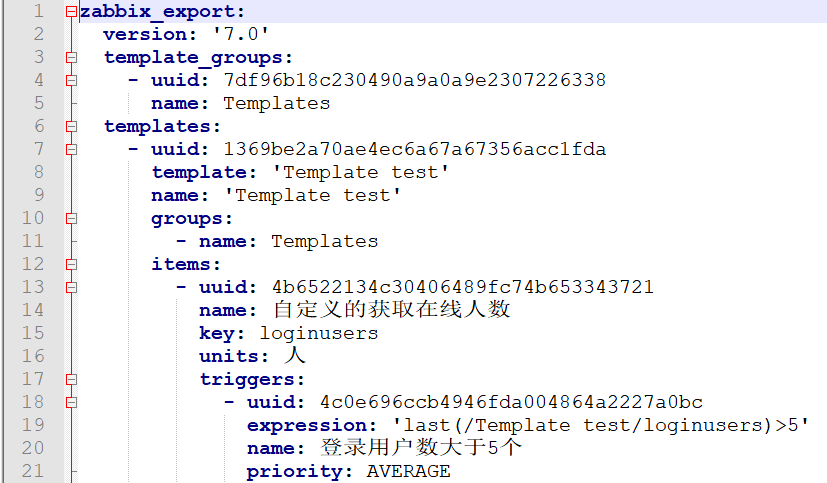

导入模板：（了解即可，我们现在有模板了，而且也不能删除，因为已经有自动发现在用了，删不了）

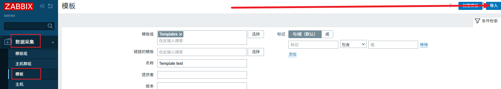

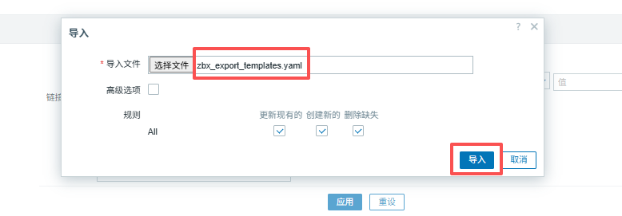

# <font style="color:rgb(51, 51, 51);">十二、zabbix 代理</font>

## <font style="color:rgb(51, 51, 51);">zabbix proxy 应用场景</font>

<font style="color:rgb(51, 51, 51);">参考: </font>[<font style="color:rgb(65, 131, 196);">https://www.zabbix.com/documentation/current/manual/distributed\_monitoring/proxies</font>](https://www.zabbix.com/documentation/current/manual/distributed_monitoring/proxies)

Zabbix Proxy 使用场景：

* 监控远程区域设备
* 监控本地网络不稳定区域
* **当 Zabbix 监控上千设备时，使用它来减轻 Server 的压力**
* 简化分布式监控的维护

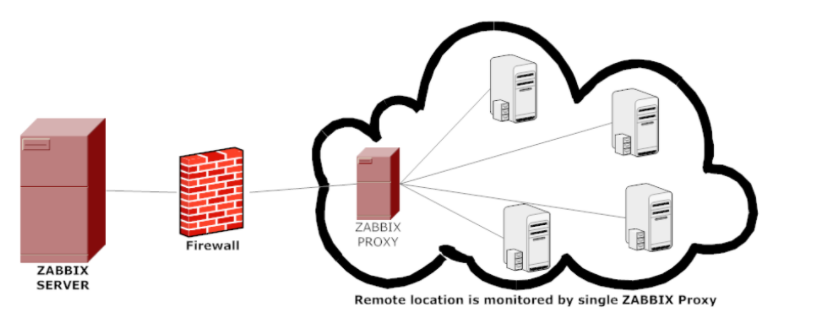

***

**<font style="color:rgb(51, 51, 51);">应用场景1: 跨内外网监控</font>**

<font style="color:rgb(51, 51, 51);">当 zabbix server 与被监控机器不在同一个机房时，跨公网监控会很麻烦，也会带来安全隐患</font>

* <font style="color:rgb(51, 51, 51);">比如有防火墙的情况，需要防火墙开放的端口增多</font>
* <font style="color:rgb(51, 51, 51);">像 mysql 数据库这类应用是不适合直接被公网连接的</font>

**<font style="color:rgb(51, 51, 51);">应用场景2: 分布式监控</font>**

<font style="color:rgb(51, 51, 51);">当监控机主机特别多，甚至分散在不同的地域机房。这个时候 zabbix server 压力很大，所以可以通过增加 zabbix proxy 来代理收集每个机房里的主机信息，再统一给 zabbix server。</font>

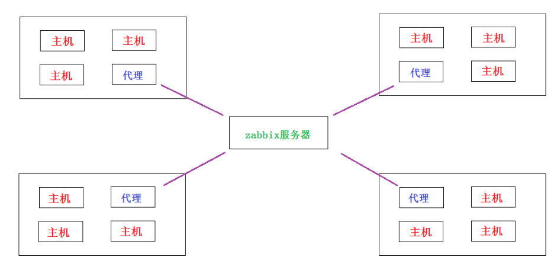

## <font style="color:rgb(51, 51, 51);">zabbix proxy 案例</font>

### 环境准备

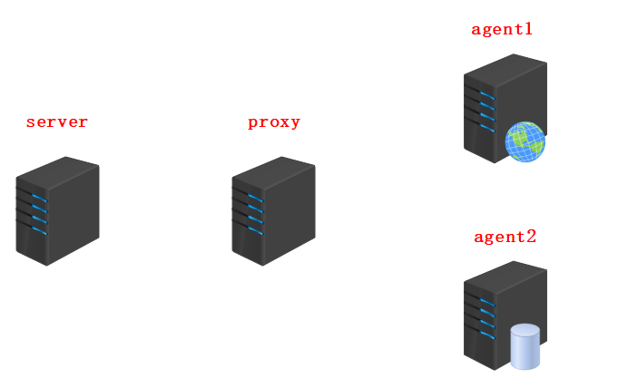

> 以后就是代理从 agent1、agent2 两台机器拉取数据，拉取后存到代理服务器上的数据库中，然后 server 再从代理服务器上拉取数据！

| 编号 | IP | 主机名 | 作用 |
| --- | --- | --- | --- |
| 1 | 192.168.126.171 | server.lhp.cn | 监控服务器 |
| 2 | 192.168.126.172 | agent1.lhp.cn | 被监控服务器 1 |
| 3 | 192.168.126.173 | agent2.lhp.cn | 被监控服务器 2 |
| 4 | 192.168.126.174 | proxy.lhp.cn | 监控代理服务器 |

> <font style="color:rgb(51, 51, 51);">我们只需要准备最后一台监控代理服务器即可，其他的就用之前的。</font>

<font style="color:rgb(51, 51, 51);">第一步：克隆一台最小化服务器，作为 proxy 服务器，修改下 MAC 地址</font>

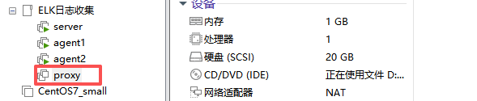

第二步：修改 IP 地址，修改主机名

```shell
# vim /etc/NetworkManager/system-connections/ens33.nmconnection
address1=192.168.126.174/24

# hostnamectl set-hostname proxy.lhp.cn
# su
```

第三步：绑定 hosts 文件

```shell
# vim /etc/hosts
127.0.0.1   localhost localhost.localdomain localhost4 localhost4.localdomain4
::1         localhost localhost.localdomain localhost6 localhost6.localdomain6
192.168.126.171 server server.lhp.cn
192.168.126.172 agent1 agent1.lhp.cn
192.168.126.173 agent2 agent2.lhp.cn
192.168.126.174 proxy proxy.lhp.cn
```

第四步：<font style="color:rgb(51, 51, 51);">确认关闭防火墙、selinux</font>

<font style="color:rgb(51, 51, 51);">第五步：确认时间同步</font>

<font style="color:rgb(51, 51, 51);">第六步：安装必备软件，比如：vim、wget、rsync、net-tools 等</font>

### <font style="color:rgb(51, 51, 51);">在proxy上安装软件包</font>

```shell
[root@proxy ~]# rpm -Uvh https://repo.zabbix.com/zabbix/7.0/centos/9/x86_64/zabbix-release-latest-7.0.el9.noarch.rpm
注意：如果/etc/yum.repos.d目录存在epel.repo文件，必须通过记事本打开，把enabled=1参数设置为enabled=0，然后在安装！
[root@proxy ~]# yum install mariadb-server zabbix-proxy-mysql zabbix-sql-scripts zabbix-selinux-policy zabbix-agent -y
```

### <font style="color:rgb(51, 51, 51);">启动数据库并建库授权</font>

```shell
[root@proxy ~]# systemctl start mariadb
[root@proxy ~]# systemctl enable mariadb

[root@proxy ~]# mysql

MariaDB [(none)]> create database zabbix_proxy default charset utf8;
MariaDB [(none)]> grant all privileges on zabbix_proxy.* to 'zabbix'@'localhost' identified by '123';
MariaDB [(none)]> flush privileges;
MariaDB [(none)]> quit
```

### <font style="color:rgb(51, 51, 51);">导入sql数据</font>

```shell
# cat /usr/share/zabbix-sql-scripts/mysql/proxy.sql | mysql --default-character-set=utf8mb4 -uzabbix -p zabbix_proxy
```

### <font style="color:rgb(51, 51, 51);">修改proxy端配置并启动服务</font>

默认 proxy 会主动推送数据给 server。

```shell
[root@proxy ~]# egrep -vn '^#|^$' /etc/zabbix/zabbix_proxy.conf
32:Server=192.168.126.171						# 修改为zabbix服务器的ip
42:Hostname=proxy							    	# 修改为本代理服务器的主机名
84:LogFile=/var/log/zabbix/zabbix_proxy.log
95:LogFileSize=0
136:PidFile=/var/run/zabbix/zabbix_proxy.pid
146:SocketDir=/var/run/zabbix
173:DBName=zabbix_proxy
188:DBUser=zabbix
197:DBPassword=123								  # 打开注释并修改为连接数据库的密码,和上面授权对应
300:ProxyConfigFrequency=60		 	# proxy多久从server接收一次配置数据(打开注释并修改)
310:DataSenderFrequency=5		 		# proxy多久发送一次收集的数据给server(打开注释并修改)
490:SNMPTrapperFile=/var/log/snmptrap/snmptrap.log
566:Timeout=4
653:LogSlowQueries=3000
759:StatsAllowedIP=127.0.0.1

[root@proxy ~]# systemctl start zabbix-proxy
[root@proxy ~]# systemctl enable zabbix-proxy
```

**<font style="color:rgb(51, 51, 51);">说明:</font>**<code><font style="color:rgb(51, 51, 51);background-color:rgb(243, 244, 244);">ProxyConfigFrequency=60</font></code><font style="color:rgb(51, 51, 51);">和</font><code><font style="color:rgb(51, 51, 51);background-color:rgb(243, 244, 244);">DataSenderFrequency=5</font></code><font style="color:rgb(51, 51, 51);">这两个参数需要配置，否则最终结果会很久都看不到数据。</font>

### <font style="color:rgb(51, 51, 51);">配置agent端</font>

<font style="color:rgb(51, 51, 51);">除了 agent1 和 agent2 之外，server 和 proxy 也可以被监控，也就是说一共 4 台都可以被监控。</font>

<font style="color:rgb(51, 51, 51);">这 4 台都可以被 proxy 监控，也可以被 server 监控。本实验我选择以下方案：</font>

<font style="color:rgb(51, 51, 51);">server 监控自己(默认不变)，proxy、agent1、agent2 都被 proxy 监控，然后将数据给 server。</font>

<font style="color:rgb(51, 51, 51);">所以 </font>**<font style="color:rgb(51, 51, 51);">proxy、agent1、agent2 这 3 台都做如下操作</font>**<font style="color:rgb(51, 51, 51);">：</font>

```shell
# egrep -vn '^#|^$' /etc/zabbix/zabbix_agentd.conf
117:Server=192.168.126.174			 			# 修改为proxy的IP,而不是server的IP
171:ServerActive=192.168.126.174		 	# 修改为proxy的IP,而不是server的IP
182:Hostname=XXX					 						# 主机名分别为proxy,agent1,agent2

347:UserParameter=loginusers,who | wc -l	# 都加上此自定义监控项

# systemctl restart zabbix-agent
```

### <font style="color:rgb(51, 51, 51);">创建 proxy 为被监控主机</font>

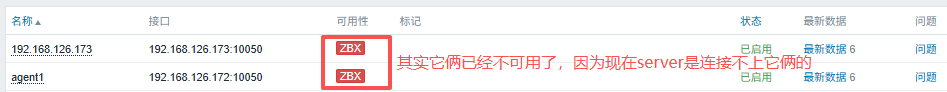

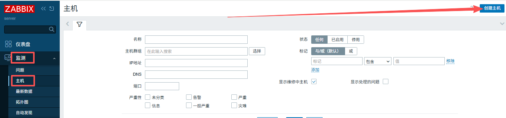

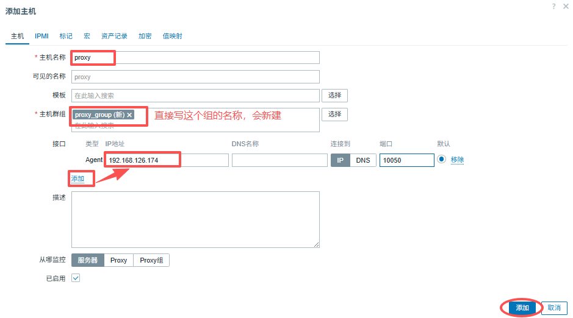

直接添加监控的主机即可，模板不着急添加！

### <font style="color:rgb(51, 51, 51);">为3台被代理机添加模板</font>

<font style="color:rgb(51, 51, 51);">数据采集 => 主机：</font>

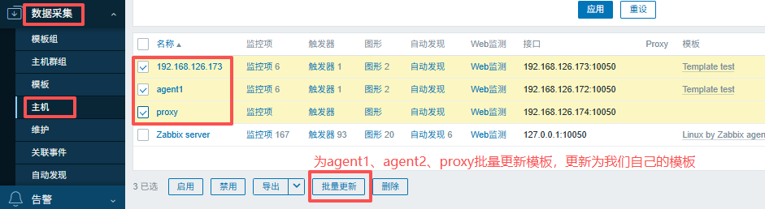

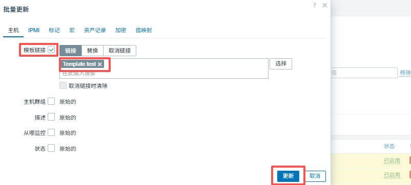

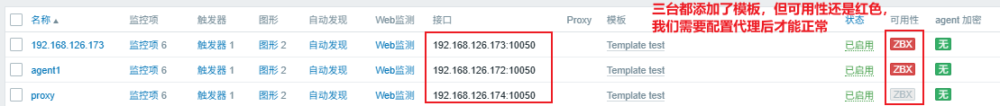

### <font style="color:rgb(51, 51, 51);">创建 proxy 为代理</font>

<font style="color:rgb(51, 51, 51);">管理 => Proxy：</font>

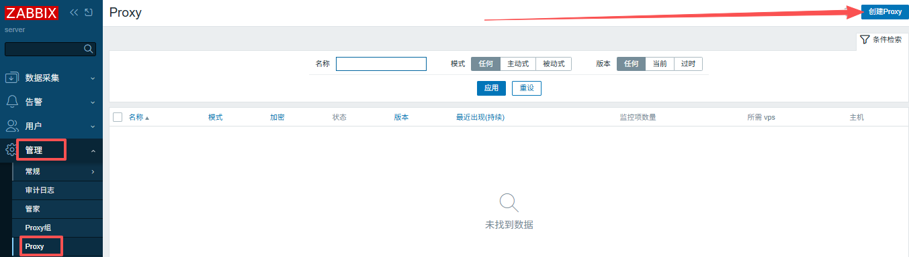

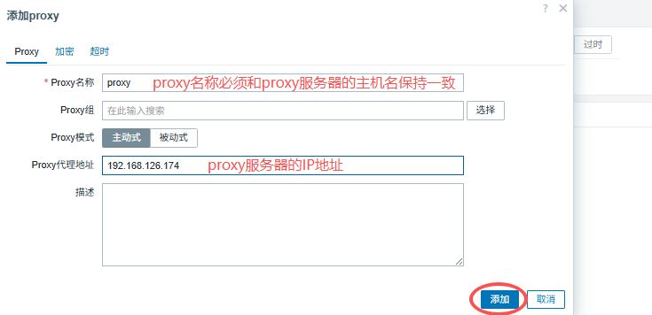

### <font style="color:rgb(51, 51, 51);">批量更新代理</font>

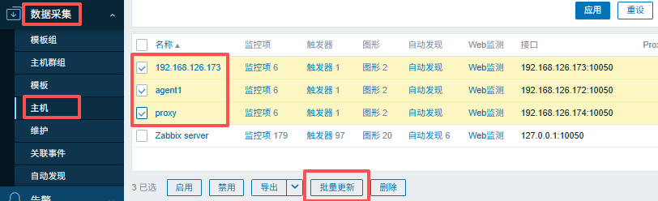

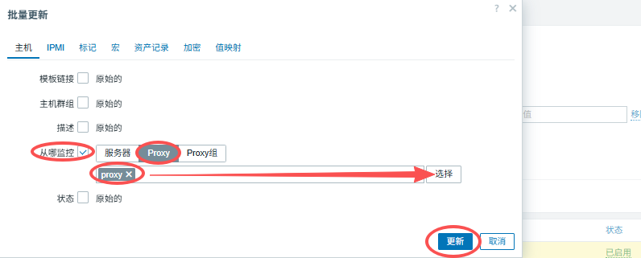

稍等个 1 分钟左右，查看可用性！

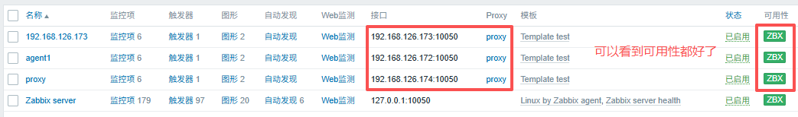

### <font style="color:rgb(51, 51, 51);">验证</font>

<font style="color:rgb(51, 51, 51);">在被代理监控机上(agent1、agent2、proxy)做信息的改变，比如改变登录用户数，然后在 web 管理界面的图形上能查看到相应变化，则表示代理一切 OK。</font>

<font style="color:rgb(51, 51, 51);">过程省略，请自行验证。</font>

### <font style="color:rgb(51, 51, 51);">问题说明</font>

如果在上面搭建完成后，查看监控的效果时，一直是不可用的，那就查看相关的日志，根据日志中的提示找错！

```shell
# cat /var/log/zabbix/zabbix_agentd.log

# cat /var/log/zabbix/zabbix_proxy.log

# cat /var/log/messages
```

总结：

1. agent1、agent2、proxy 这三台机器上安装了 zabbix-agent，就可以收集监控信息
2. proxy 机器作为 Zabbix Server 的代理，从 agent1、agent2、proxy 三台机器上拉取监控信息
3. proxy 机器将拉取到的信息主动发送给 Zabbix Server 服务器，保存在 server 的数据库中
4. Zabbix Server 的 web 界面中我们配置相关要监控的主机，Zabbix Server 就从数据库中取出对应主机的监控信息进行展示！！！

# <font style="color:rgb(51, 51, 51);">十三、主动监控与被动监控</font>

**<font style="color:rgb(51, 51, 51);">一共有 4 种模式:</font>**

1. <font style="color:rgb(51, 51, 51);">agent 主动</font>
2. <font style="color:rgb(51, 51, 51);">agent 被动(默认)</font>
3. <font style="color:rgb(51, 51, 51);">proxy 主动(默认)</font>
4. <font style="color:rgb(51, 51, 51);">proxy 被动</font>

## <font style="color:rgb(51, 51, 51);">agent 被动</font>

<font style="color:rgb(51, 51, 51);">相对于 agent 来说，也就是表示是 server 或 proxy 去找 agent 拿数据（agent 只要等待就可以了）。</font>

```shell
# grep -n ^Server= /etc/zabbix/zabbix_agentd.conf
Server=192.168.126.174						 agent被动模式, IP为server或proxy的IP
```

## <font style="color:rgb(51, 51, 51);">agent 主动</font>

<font style="color:rgb(51, 51, 51);">相对于 agent 来说，也就是表示是 agent 主动把数据传给 server 或 proxy。</font>

```shell
# grep -n ^ServerActive= /etc/zabbix/zabbix_agentd.conf
ServerActive=192.168.126.174			     agent主动模式, IP为server或proxy的IP
```

**<font style="color:rgb(51, 51, 51);">优点:</font>**<font style="color:rgb(51, 51, 51);"> 当 agent 太多的情况下，server 或 proxy 去找这么多 agent 搜集数据，压力负载过大。用 agent 主动模式就可以缓解 server 或 proxy 的压力。</font>

<font style="color:rgb(51, 51, 51);">但用主动模式的问题是：监控项也要转为主动式。</font>

<font style="color:rgb(51, 51, 51);">数据采集 => 模板 => 监控项</font>

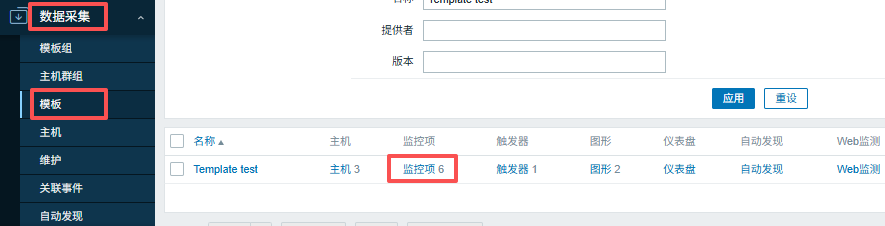

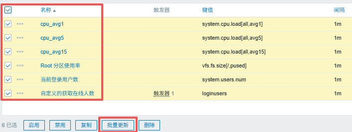

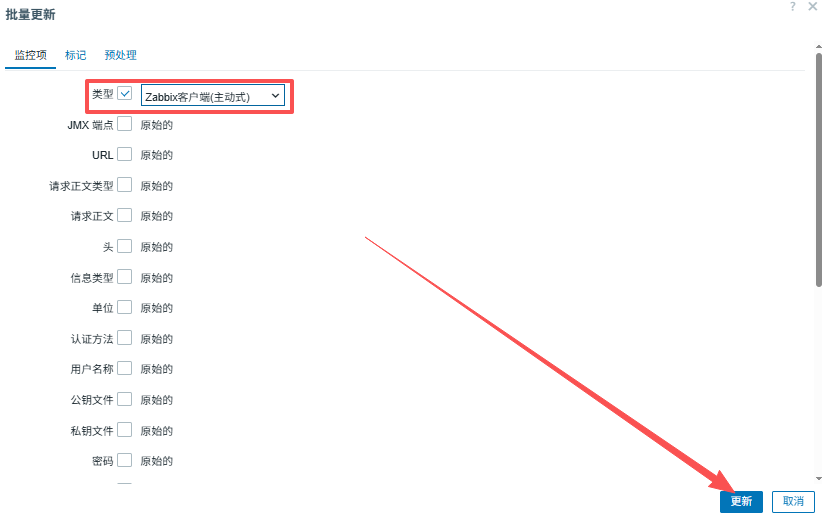

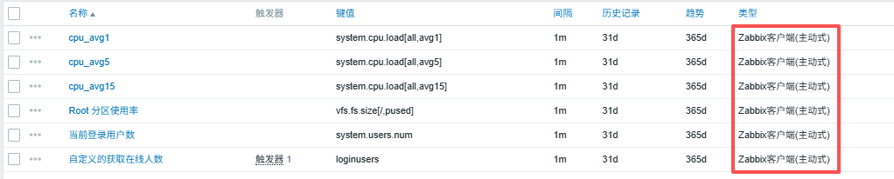

## <font style="color:rgb(51, 51, 51);">proxy 主动与被动</font>

proxy 主动，表示 proxy 主动将拉取到的数据推送给 server。

proxy 被动，表示 proxy 被动等待 server 拉取数据。

<font style="color:rgb(51, 51, 51);">由</font><code><font style="color:rgb(51, 51, 51);background-color:rgb(243, 244, 244);">/etc/zabbix/zabbix_proxy.conf</font></code><font style="color:rgb(51, 51, 51);">里的</font><code><font style="color:rgb(51, 51, 51);background-color:rgb(243, 244, 244);">ProxyMode</font></code><font style="color:rgb(51, 51, 51);">参数决定。</font>

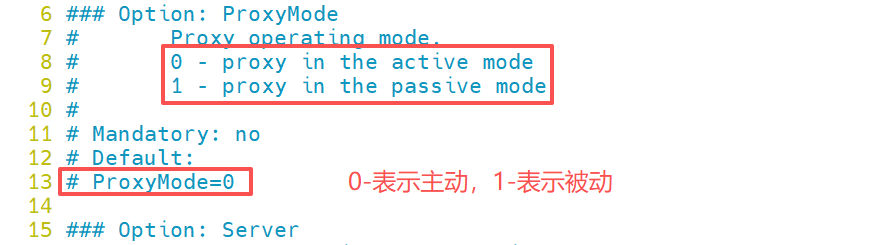

## <font style="color:rgb(51, 51, 51);">结论</font>

<font style="color:rgb(51, 51, 51);">默认情况下 agent 被动监控，监控方向如下图所示:</font>

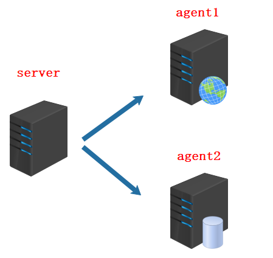

<font style="color:rgb(51, 51, 51);">上图中:</font>

* <font style="color:rgb(51, 51, 51);">由 server 找 agent 拿数据</font>
* <font style="color:rgb(51, 51, 51);">这种情况 server 端压力较大，agent 端压力较小</font>

***

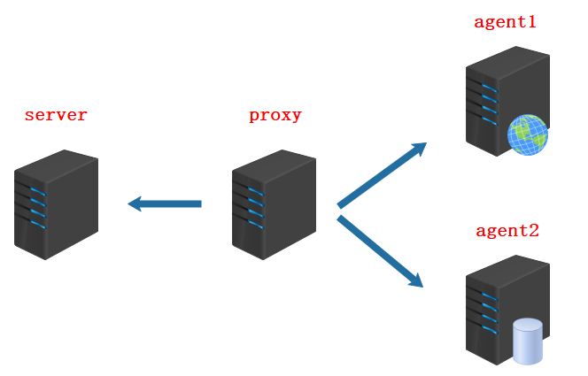

<font style="color:rgb(51, 51, 51);">上图中:</font>

* <font style="color:rgb(51, 51, 51);">proxy 找 agent 拿数据，又主动将 agent 的数据提交给 server</font>
* <font style="color:rgb(51, 51, 51);">proxy 压力最大</font>

***

<font style="color:rgb(51, 51, 51);">个人推荐默认的模式，完全不用修改。</font>

# <font style="color:rgb(51, 51, 51);">十四、web 监测(拓展补充)</font>

<font style="color:rgb(51, 51, 51);">web 监测也是模板的一部分，当然也可以针对某一台主机（数据采集-主机）</font>

<font style="color:rgb(51, 51, 51);">主机里面进行配置：只有这台机器，配置了这个功能</font>

<font style="color:rgb(51, 51, 51);">模板里面进行配置：相当于所有使用了这个模板的机器都配置了这个功能</font>

**<font style="color:rgb(51, 51, 51);">web 监测</font>**<font style="color:rgb(51, 51, 51);">：类似一个 (可以包含多个小监控项)，主要针对 web 服务器做监控场景（httpd、nginx）。</font>

<font style="color:rgb(51, 51, 51);">可以对一个 url 页面进行监测（监测它的状态码、页面匹配的字符串、响应时间、下载速度等）</font>

## <font style="color:rgb(51, 51, 51);">在 agent1 上创建 web 监测</font>

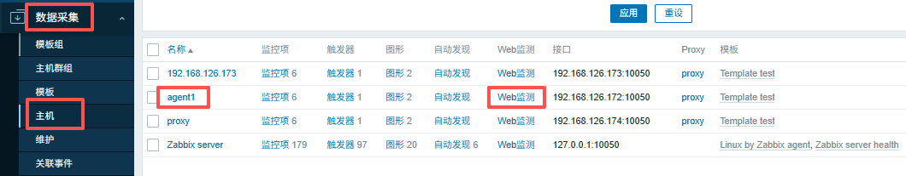

## <font style="color:rgb(51, 51, 51);">创建 web 场景</font>


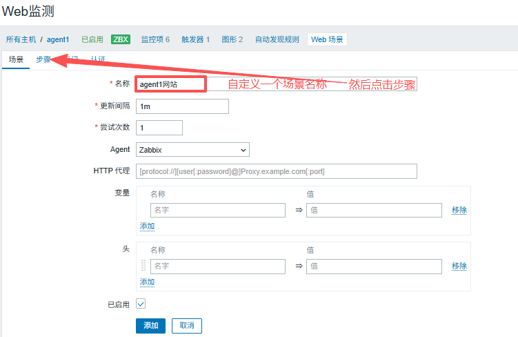

## <font style="color:rgb(51, 51, 51);">添加步骤一</font>


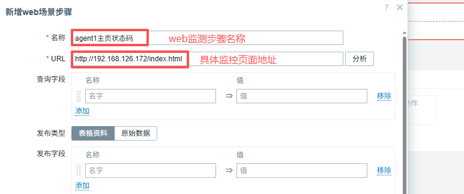

然后往下滚动滚动条：

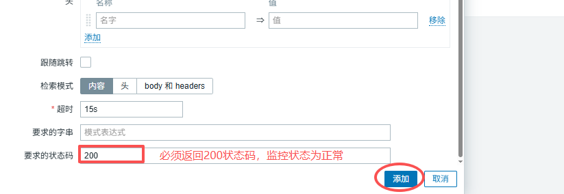


## <font style="color:rgb(51, 51, 51);">添加步骤二</font>


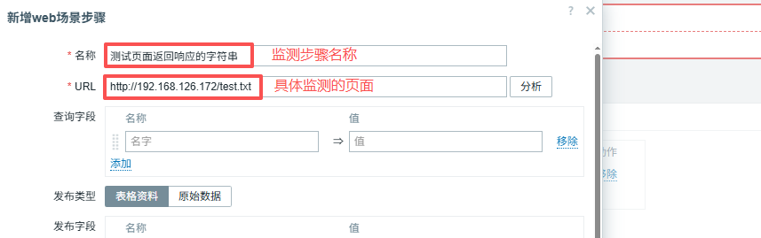

向下滚动滚动条：

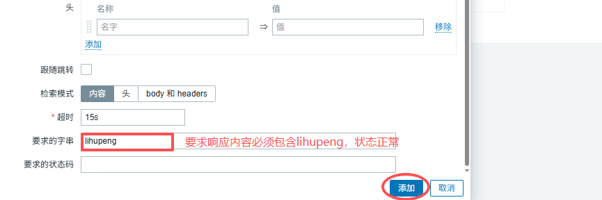

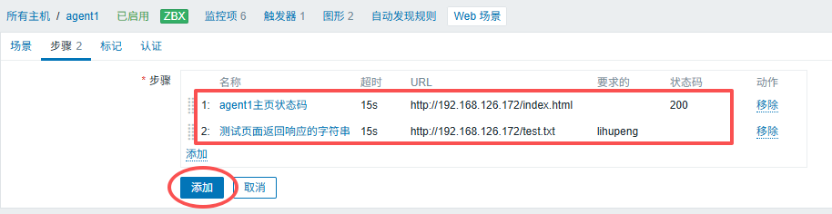

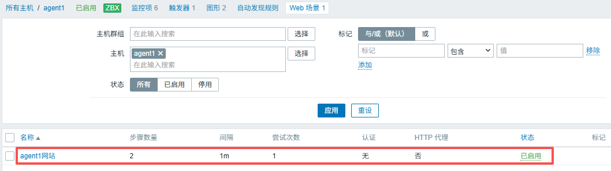

## <font style="color:rgb(51, 51, 51);">验证步骤一</font>

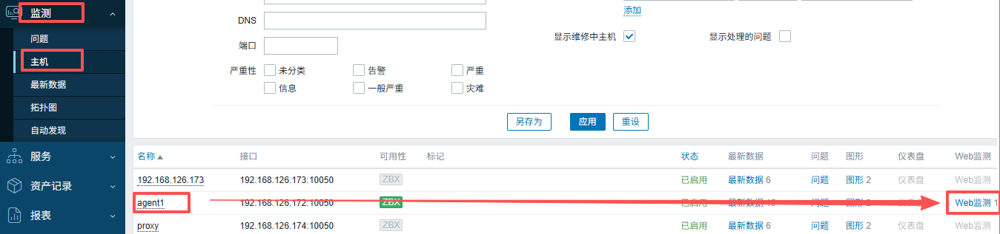

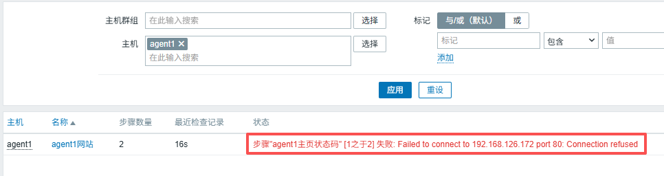

因为现在 agent1 上面就没有 Web 服务器，所以肯定监测会报错！

<font style="color:rgb(51, 51, 51);">去 agent1 上安装 httpd，创建主页，并启动服务</font>

```shell
[root@agent1 ~]# yum install httpd -y
[root@agent1 ~]# echo web1 > /var/www/html/index.html
[root@agent1 ~]# systemctl start httpd
[root@agent1 ~]# systemctl enable httpd
```

<font style="color:rgb(51, 51, 51);">再次验证：稍等一会</font>

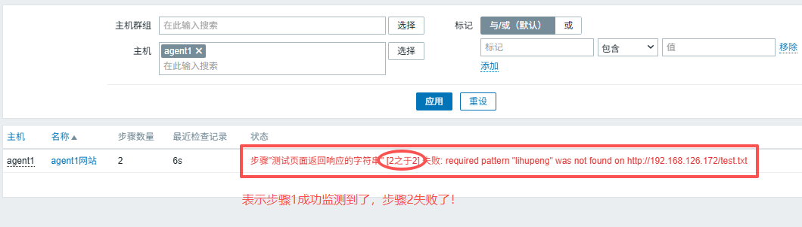

## <font style="color:rgb(51, 51, 51);">验证步骤二</font>

```shell
[root@agent1 ~]# echo "hello lihupeng, I Love You~" > /var/www/html/test.txt
```

<font style="color:rgb(51, 51, 51);">再次验证：稍等一会</font>

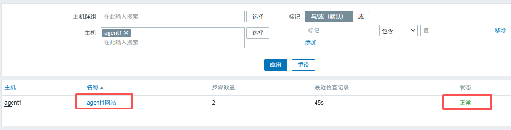

<font style="color:rgb(51, 51, 51);"></font>


> 更新: 2026-06-11 15:13:31  
> 原文: <https://www.yuque.com/u41736172/az9urv/yadpob1iwqadmr8b>