# 03.Docker容器基础

# 学习目标

* 能够说出 Docker 容器和虚拟机的主要区别
* 能够说出 Docker 用到的内核技术
* 能够安装部署 Docker
* 掌握 Docker 镜像的常见操作
* 掌握镜像仓库的搭建与使用
* 掌握常见的容器操作命令
* 能够使用 Docker 运行基础应用
* 能够使用 DockerFile 构建容器镜像（类似 playbook）
* 能够通过 link 连接容器（容器之间可以相互通信）
* Docker 数据可视化（Docker 的 web 管理平台）

# Paas 介绍

云计算 = 公有云 + 私有云 + 混合云 + 容器云

公有云：阿里云、华为云、百度云

私有云：OpenStack（底层）

混合云：公有云 + 私有云，比如 web 服务放在公有云，数据库放在私有云

容器云：Docker/Containerd + K8S

做云的优势：提高资源利用率，将资源打包做成服务给用户使用，资源提供商极少需要与用户交互打交道。我们可以直接购买云服务器，不需要自己建机房购买物理服务器，省心，另外很多云服务器已经将常用内容给提供好了。比如：Redis 集群，阿里云都是直接搭建好的，直接调用即可。

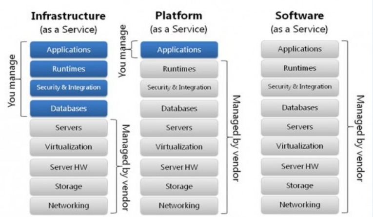

Iaas（基础即服务）=> OpenStack（搭建云平台），阿里云、华为云，物理层、网络层 => 云平台基础层（底层）。简单来说就是厂商提供了平台，我们需要在平台上自己安装操作系统、部署软件、配置等等。

PaaS（系统即服务）=> 基础操作系统构建应用，搭建一个项目，需要一个软件一个软件的配置。简单来说就是厂商提供了操作系统，我们需要在操作系统上部署软件、配置等等。

SaaS（软件即服务）=> 用户不需要一个一个软件配置，提供了一套完整解决方案，只需要登录就可以直接使用。简单来说就是厂商提供了相应的软件，我们直接使用即可，也可以调整一些我们想要的配置。

FC 函数服务 => 主流大模型，如 DeepSeek。

***

由于 hypervisor 虚拟机技术仍然存在一些性能和资源使用效率方面的问题，因此出现了一种称为容器技术（Container）的新型虚拟化技术来帮助解决这些问题。

容器：是 PaaS 的一种实现，相对于虚拟机来说有更好的性能，更高的资源利用率。

# 一、认识容器技术

在生活中，瓶子、罐子、盆、试管、缸等都是用来装东西的容器。


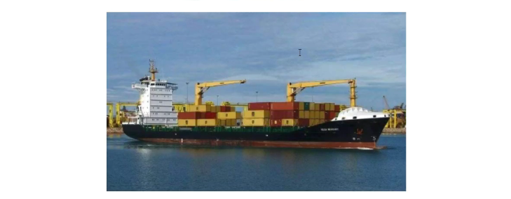

在集装箱没有被使用以前，海上运输货物效率不高（货物大小与形状不一）。有了集装箱后，货物可以统一规格来存放与运输了，极大地提高了效率。

在 IT 技术中：

虚拟化技术可以在宿主机上安装多个不同的操作系统，运行多套不同的应用。但可能就是为了运行一个 nginx，却还要在虚拟机里运行一个完整的操作系统、内核和其它无关程序，这种做法资源利用不高。

**所以我们希望更多的关注应用程序本身，而不再分精力去关注操作系统与无关程序，操作系统内核直接与宿主机共享。**

Linux 容器技术是一种**轻量级**的虚拟化技术。主要特点有：

* 轻量：只打包了需要的 bins/libs（也就是命令和库文件）。与宿主机共享操作系统，直接使用宿主机的内核。
* 部署快：容器的镜像相对虚拟机的镜像小。部署速度非常快，秒级部署。
* 移植性好：Build once，Run anywhere（一次构建，随处部署运行）。
* 资源利用率更高：相对于虚拟机，不需要安装操作系统，所以几乎没有额外的 CPU、内存消耗

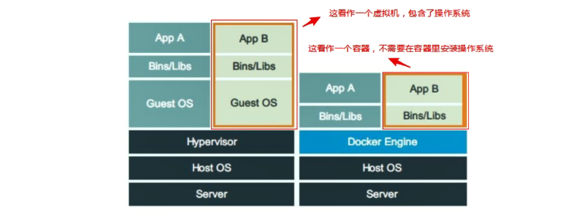

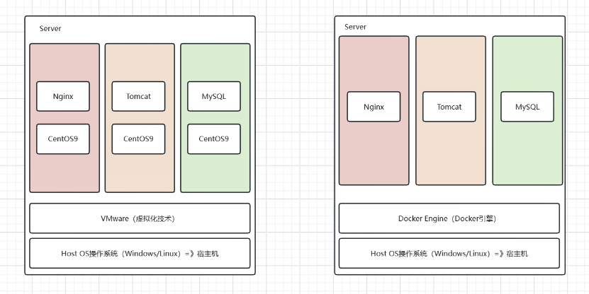

面试题：Docker 容器与传统虚拟化（VM）之间有什么区别？

| 对比点 | Docker 容器 | 虚拟机（VM） |
| --- | --- | --- |
| 操作系统 | 与宿主机共享 OS | 宿主机 OS 上运行虚拟机 OS |
| 存储大小 | 镜像小，便于存储与传输 | 镜像庞大（vmdk、vdi 等） |
| 运行性能 | 几乎无额外性能损失 | 操作系统额外的 CPU、内存消耗 |
| 移植性 | 轻便、灵活，适用于 Linux | 笨重、与虚拟化技术耦合度高 |
| 硬件亲和性 | 面向软件开发者 | 面向硬件运维者 |
| 部署速度 | 快速、秒级 | 较慢，10s 以上 |

Docker 应用场景：部署各种各样应用，让我们实现秒级部署、迁移性比较强、性能几乎无额外损失！

# 二、Docker 介绍

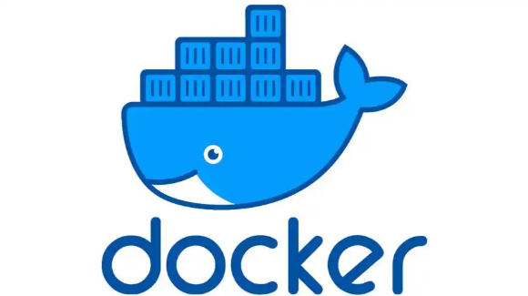

Docker 就是目前最火热的能实现容器技术的软件，使用 go（golang）语言开发。

参考：<font style="color:#117CEE;">https://www.docker.com/</font>

## Docker 版本

**2017 之前版本：**

1.7、1.8、1.9、1.10、1.11、1.12、1.13

**2017 年 3 月 1 日之后**，Docker 的版本命名开始发生变化，同时将 CE 版本和 EE 版本进行分开。

Docker 社区版（CE）：为了开发人员或小团队创建基于容器的应用，与团队成员分享和自动化的开发管道。Docker-ce 提供了简单的安装和快速的安装，以便可以立即开始开发。docker-ce 集成和优化，基础设施。

* 17-03-ce
* 17-06-ce
* 18-03-ce
* 18-06-ce
* 18-09-ce
* 19-03-ce
* 最新版本：28.0.1-ce（这是目前 Docker 社区版的最新版本，提供了更新的特性、性能和修复）

Docker 企业版（EE）：专为企业的发展和 IT 团队建立。docker-ee 为企业提供最安全的容器平台，以应用为中心的平台。

## Docker 用到的内核技术

Docker A => Nginx

Docker B => Tomcat

相对独立，默认不会互相影响？

Docker 容器本质上是宿主机的**进程**，可以把 Docker 容器内部跑的进程看作是宿主机的线程。

Docker 通过 **namespace 实现了资源隔离**，通过 **cgroups 实现了资源限制**。

### NameSpace（了解）

Linux 内核实现 namespace 的一个主要目的就是实现轻量级虚拟化（容器）服务。在同一个 namespace 下的进程可以感知彼此的变化，而对外界的进程一无所知。

Linux 在很早的版本中就实现了部分的 namespace，比如内核 2.4 就实现了 mount namespace。

大多数的 namespace 支持是在内核 2.6 中完成的，比如 IPC、Network、PID 和 UTS。还有个别的 namespace 比较特殊，比如 User，从内核 2.6 就开始实现了，但在内核 3.8 中才宣布完成。

同时，随着 Linux 自身的发展以及容器技术持续发展带来的需求，也会有新的 namespace 被支持，比如在内核 4.6 中就添加了 Cgroup namespace。

Linux 内核提供了 6 种 namespace 隔离的系统调用。（了解）

| namespace | 系统调用参数 | 隔离内容 |
| --- | --- | --- |
| UTS | CLONE\_NEWUTS | 主机名或域名 |
| IPC | CLONE\_NEWIPC | 信号量、消息队列或共享内存 |
| PID | CLONE\_NEWPID | 进程编号 |
| net | CLONE\_NEWNET | 网络设备接口，IP 路由表、防火墙规则等 |
| mount | CLONE\_NEWNS | 挂载点（文件系统） |
| user | CLONE\_NEWUSER | 用户和用户组 |

UTS：每个 namespace 都拥有独立的主机名或域名，可以把每个 namespace 认为一个独立主机。

IPC：每个容器依旧使用 Linux 内核中进程交互的方法，实现进程间通信

PID：每个容器都拥有独立的进程树，而容器是物理机中的一个进程，所以容器中的进程是物理机的线程

Net：每个容器的网络是隔离的

Mount：每个容器的文件系统是独立的

User：每个容器的用户和组 ID 是隔离，每个容器都拥有 root 用户

小结：应用程序运行在一个隔离的空间（namespace）内，每个隔离的空间都拥有独立的 UTS、IPC、PID、Net、Mount、User。

### Control Group（了解）

控制组（Cgroups）是 Linux 内核的一个特性，主要用来对共享资源进行隔离、限制、审计等。

只有能控制分配到容器的资源，才能避免多个容器同时运行对宿主机系统的资源竞争。

控制组可以提供对容器的内存、CPU、磁盘 IO 等资源进行限制和计费管理。

### LXC 与 Docker 的区别

LXC 为 Linux Container 的简写。可以提供轻量级的虚拟化。

Docker 的底层就是使用 LXC 来实现的。Docker 以 LXC 为基础，实现了更多更强的功能。

资源隔离：namespace

资源限制：Cgroups

***

小结：

* Docker 容器属于 type III 虚拟化，属于 PaaS
* 容器是一种轻量级、进程级的虚拟机
* 相比于虚拟机的优势
  * 不需要安装 OS，和宿主机共享
  * 镜像存储空间小
  * 启动速度快（容器为秒级，虚拟机一般需要 10 秒左右）
  * 移植性更好、更轻便
  * 性能更好
* Docker 是一个实现容器的软件，底层使用 LXC
* Docker 主要使用 namespace 命名空间技术实现资源隔离，使用 cgroups 实现资源限制

# 三、Docker 环境准备

## 说明

普及概念

宿主机：简单来说，就是运行了 Docker 程序的这个操作系统就是宿主机。

如果在 Windows 操作系统中运行 Docker，则 Windows 就是一个宿主机

如果在 Linux 操作系统中运行 Docker，则 Linux 就是一个宿主机

***

建议直接在宿主机上跑 Docker（当然也可以在虚拟机里跑 Docker）

不能直接在 Windows 中跑 Docker（因为 namespace、cgroups 都是 Linux 内核的特性，Windows 没有，所以需要在 Windows 跑 Linux 虚拟机，再跑 Docker）

* 要求能访问公网
* 关闭防火墙、SELinux

***

**环境准备：**

第一步：克隆一台最小化安装的机器，并更改 MAC 地址

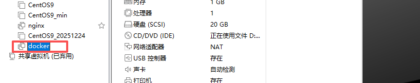

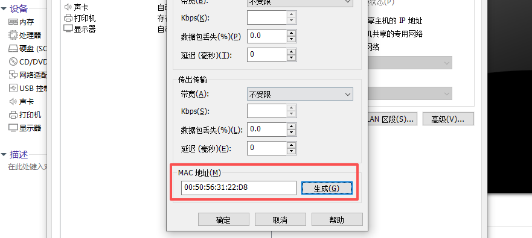

第二步：更改 IP 地址和主机名

```powershell
# vim /etc/NetworkManager/system-connections/ens33.nmconnection
address1=192.168.126.100/24

# hostnamectl set-hostname docker.lhp.cn
# su
```

第三步：关闭防火墙和 SELinux（已关闭）

## docker-ce 的 yum 源下载（任选其一）

我们要安装 Docker 软件，需要有能够下载 Docker 软件的 yum 仓库。

如果能够访问到国外的网络，那就下载国外的 Docker 的 yum 仓库，否则下载国内的 Docker 的 yum 仓库。

**下载 Docker 官方的 ce 版（国外服务器）**

```powershell
docker# wget https://download.docker.com/linux/centos/docker-ce.repo -O /etc/yum.repos.d/docker-ce.repo
```

**<font style="background-color:#FBDE28;">下载 aliyun 的 docker-ce 源（国内服务器）</font>**

```shell
docker# yum -y install wget
docker# wget https://mirrors.aliyun.com/docker-ce/linux/centos/docker-ce.repo -O /etc/yum.repos.d/docker-ce.repo
```

## Docker 安装

我们安装的 Docker 其实是 Docker 的社区版，也就是 docker-ce

第一步：安装 docker-ce

```shell
docker# yum -y install docker-ce
```

ps：要安装 docker-ce 版，不要安装 docker（否则可能安装 1.13 老版本）

第二步：启动服务

```shell
docker# systemctl start docker
docker# systemctl enable docker
docker# systemctl status docker
```

第三步：查看版本信息

```shell
docker# docker -v
或者
docker# docker info
或者
docker# docker version
```

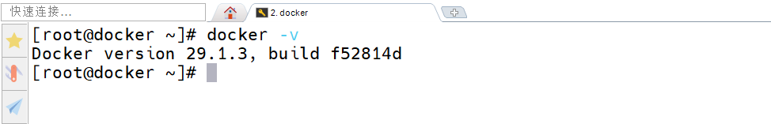

## Docker daemon 管理（可选，建议）

Docker 本身是 C/S 架构，拥有 Docker Client 与 Docker Server 服务器端。

Docker Client 与 Docker Server 抓紧的桥梁：docker daemon。

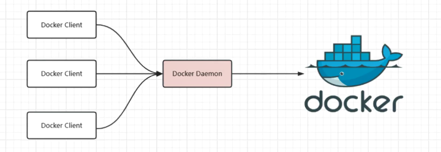

可以将 client 与 server 进行分离，实现远程 docker 连接。为了实现它，就需要对 docker daemon 进行相应的配置。

```shell
# 查看信息
远程客户端主机# docker -H 容器宿主机IP version
```

配置过程

第一步：修改 Docker 配置文件前，请先关闭 Docker 守护进程

```shell
docker# systemctl stop docker

停止docker的时候会有警告：
Warning: Stopping docker.service, but it can still be activated by: docker.socket
意思是我们还需要再停止一下docker.socket

docker# systemctl stop docker.socket
```

第二步：通过 `/etc/docker/daemon.json`文件对 Docker 守护进程文件进行配置

```shell
docker# vim /etc/docker/daemon.json
{
  "hosts": ["tcp://0.0.0.0:2375","unix:///var/run/docker.sock"]
}
```

PS：docker daemon 默认侦听使用的是 unix 格式，侦听文件：unix:///run/docker.sock，添加 tcp://0.0.0.0:2375 可实现远程管理。

第三步：添加 `/etc/docker/daemon.json`后会导致 docker daemon 无法启动，请先修改如下文件内容：

```shell
修改前：
docker# vim /usr/lib/systemd/system/docker.service
[Service]
Type=notify
# the default is not to use systemd for cgroups because the delegate issues still
# exists and systemd currently does not support the cgroup feature set required
# for containers run by docker
ExecStart=/usr/bin/dockerd -H fd:// --containerd=/run/containerd/containerd.sock

修改后：
docker# vim /usr/lib/systemd/system/docker.service
[Service]
Type=notify
# the default is not to use systemd for cgroups because the delegate issues still
# exists and systemd currently does not support the cgroup feature set required
# for containers run by docker
ExecStart=/usr/bin/dockerd
```

第四步：修改完成后，一定要加载此配置文件

```shell
docker# systemctl daemon-reload
```

第五步：重新开启 docker 守护进程

```shell
docker# systemctl start docker
docker# ss -naltp | grep 2375
docker# ls /var/run/docker.sock
```

第六步：实例远程连接方法

```shell
远程客户端主机# docker -H 容器宿主机IP version

比如：
docker# docker -H 192.168.126.100 version
能够看到信息说明没问题
```

注意：客户端远程连接不需要加端口号

特别注意：远程客户端主机远程操作的权限非常大，建议请测试完后还原

小结：docker engine 分为 client 和 server，默认都在本地。（其实我们安装的 docker-ce 就是 docker engine）

# 四、镜像、容器与仓库

镜像（image）：镜像就是打包好的环境与应用。

容器（container）：容器就是运行镜像的实例。镜像看作是静态的，容器是动态的。

仓库（repository）：存放多个镜像的一个仓库。

> 镜像：类似日常生活中的光盘（静态）；容器：基于光盘播放的内容（动态）；仓库：相当于光盘专卖店。

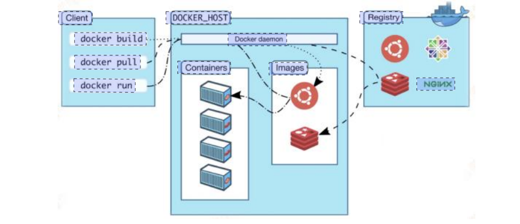

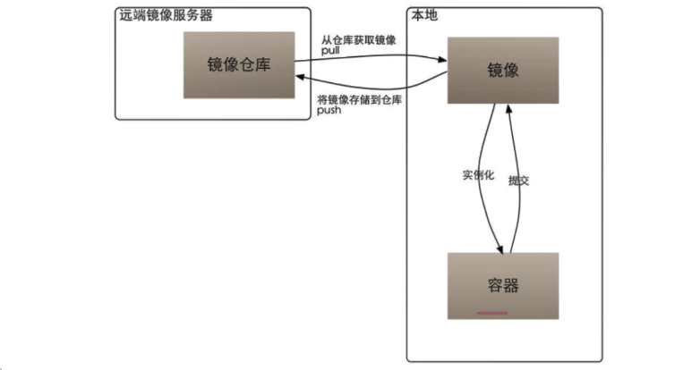

# 五、镜像常见操作

## 仓库

默认 docker 连接官网仓库：[https://hub.docker.com](about:blank)（科学上网）

## 镜像加速器

Docker 近期由于未知原因关闭，给我们带来极大不便。为了解决这个问题，我们设置 Docker 镜像加速器。除此以外，我们还可以通过购买国外的云服务器来解决以上问题。（当然如果我们能够使用科学上网的话，也不需要进行任何配置）

这里以镜像加速器为例：

```shell
docker# vim /etc/docker/daemon.json
{
  "hosts": ["tcp://0.0.0.0:2375","unix:///var/run/docker.sock"],
  "registry-mirrors": [
    "https://docker.1ms.run",
    "https://docker-0.unsee.tech",
    "https://docker.m.daocloud.io"
  ]
}

docker# systemctl daemon-reload
docker# systemctl restart docker

# 验证是否可以通过Docker的镜像地址拉取内容
docker# docker pull hello-world
或者
docker# docker pull docker.1ms.run/hello-world
```

## <font style="color:rgb(51, 51, 51);">镜像分类</font>

* <font style="color:rgb(51, 51, 51);">操作系统类（如 centos、ubuntu）</font>
* <font style="color:rgb(51, 51, 51);">应用程序类</font>

## <font style="color:rgb(51, 51, 51);">查看镜像列表（重点）</font>

<font style="color:rgb(51, 51, 51);">通过 docker images 命令查看当前镜像列表</font>

```shell
docker# docker images
```

也就是可以列出来当前系统中含有的 docker 镜像列表。

## <font style="color:rgb(51, 51, 51);">搜索镜像（重点）</font>

<font style="color:rgb(51, 51, 51);">通过 docker search 查找官方镜像</font>

```shell
docker# docker search centos-stream-9
或
docker# docker search docker.1ms.run/centos-stream-9
NAME                           DESCRIPTION                                     STARS     OFFICIAL
centos                         DEPRECATED; The official build of CentOS.       7757      [OK]
centos/postgresql-10-centos7   PostgreSQL is an advanced Object-Relational …   20
corpusops/centos               centos corpusops baseimage                      0
centos/redis-5-centos8                                                         0
centos/postgresql-96-centos7   PostgreSQL is an advanced Object-Relational …   45
centos/httpd-24-centos8                                                        3
centos/postgresql-10-centos8                                                   0
centos/systemd                 systemd enabled base container.                 115
centos/mysql-80-centos8                                                        0
centos/mongodb-36-centos7      MongoDB NoSQL database server                   12
centos/mysql-56-centos7        MySQL 5.6 SQL database server                   23
centos/nginx-112-centos7       Platform for running nginx 1.12 or building …   16
centos/mariadb-103-centos8                                                     2
centos/postgresql-12-centos8                                                   0
centos/ruby-25-centos7         Platform for building and running Ruby 2.5 a…   3
centos/mariadb-101-centos7     MariaDB 10.1 SQL database server                13
centos/mariadb-102-centos7     MariaDB 10.2 SQL database server                6
centos/mysql-57-centos7        MySQL 5.7 SQL database server                   95
centos/redis-32-centos7        Redis in-memory data structure store, used a…   6
centos/httpd-24-centos7        Platform for running Apache httpd 2.4 or bui…   46
centos/php-56-centos7          Platform for building and running PHP 5.6 ap…   34
centos/nginx-18-centos7        Platform for running nginx 1.8 or building n…   14
centos/redis-5-centos7         Redis in-memory data structure store, used a…   0
centos/nginx-116-centos7       Platform for running nginx 1.16 or building …   3
centos/python-35-centos7       Platform for building and running Python 3.5…   39
```

## <font style="color:rgb(51, 51, 51);">拉取镜像（重点）</font>

<font style="color:rgb(51, 51, 51);">通过 docker pull 拉取(下载)镜像</font>

```shell
此镜像大概200多M，网速要好
docker# docker pull dokken/centos-stream-9
或
docker# docker pull docker.1ms.run/dokken/centos-stream-9   名字为search查找时得到的全名
```

```shell
docker# docker images
IMAGE                                          ID             DISK USAGE   CONTENT SIZE   EXTRA
docker.1ms.run/dokken/centos-stream-9:latest   c51a9dad9828        469MB          121MB
docker.1ms.run/tomcat:latest                   689475f36b76        582MB          157MB
hello-world:latest                             d4aaab6242e0       21.8kB         9.52kB
```

<font style="color:rgb(51, 51, 51);">如果拉取不了只有 3 种方式：</font>

<font style="color:rgb(51, 51, 51);">① 通过科学上网工具</font>

<font style="color:rgb(51, 51, 51);">② 按照笔记构建代理服务器（免费10万次请求）</font>

<font style="color:rgb(51, 51, 51);">③ 购买国外服务器，如日本、新加坡、美国</font>

***

<font style="color:rgb(51, 51, 51);">从网上搜索一些免费的代理，可能不稳定！</font>

```shell
vim /etc/docker/daemon.json
{
  "hosts": ["tcp://0.0.0.0:2375","unix:///var/run/docker.sock"],
  "registry-mirrors": [
	"https://docker.1panel.live",
	"https://docker.fxxk.dedyn.io",
	"https://hub.rat.dev",
	"https://docker.anyhub.us.kg",
	"https://dockerhub.jobcher.com",
	"https://dockerhub.icu",
	"https://mirror.aliyuncs.com",
	"https://mirror.baidubce.com",
	"https://docker.nju.edu.cn",
	"https://docker.mirrors.sjtug.sjtu.edu.cn",
	"https://docker.mirrors.ustc.edu.cn",
	"https://mirror.iscas.ac.cn",
	"https://docker.rainbond.cc",
	"https://atomhub.openatom.cn",
	"https://dockerpull.com"
  ]
}
```

## <font style="color:rgb(51, 51, 51);">删除镜像（重点）</font>

<font style="color:rgb(51, 51, 51);">通过 docker rmi 删除镜像</font>

```shell
docker# docker rmi centos:latest
rmi：两个单词合成，remove移除，image镜像

说明
docker rmi 镜像名称:版本 或者 镜像的ID
```

## <font style="color:rgb(51, 51, 51);">镜像导出</font>

使用 docker save 保存（导出）镜像为一个 tar 文件

```shell
docker# docker save 镜像名称 -o 导出后存储的位置

案例：
docker# docker save docker.1ms.run/dokken/centos-stream-9:latest -o /root/my-centos-stream-9.latest
docker# docker save hello-world:latest -o /root/my-hello-world.latest
docker# docker save docker.1ms.run/tomcat:latest -o /root/my-tomcat.latest
```

## 镜像导入

使用 docker load 导入

测试时，可以将导出的文件 scp 传输到另一台宿主机测试。或者先删除本地的镜像再导入测试

```shell
docker# docker load < /root/dockerimage_centos9.latest
```

案例：

```shell
# 1.导出一个镜像
docker save 镜像名:版本号 -o 保存路径

# 2.删除Docker中的该镜像
docker rmi 镜像ID

# 3.查看目前Docker中的镜像
docker images

# 4.导入之前导出来的镜像
docker load < 镜像文件的路径

# 5.再次查看目前Docker中的镜像
docker images
```

## <font style="color:rgb(51, 51, 51);">镜像重命名</font>

<font style="color:rgb(51, 51, 51);">如果导入后看不到名称，可以使用</font><code><font style="color:rgb(51, 51, 51);background-color:rgb(243, 244, 244);">docker tag</font></code><font style="color:rgb(51, 51, 51);">命令改名称 </font>

```shell
docker# docker images
REPOSITORY          TAG                 IMAGE ID            CREATED           SIZE
<none>              <none>              9f38484d220f        3 months ago      202 MB

docker# docker tag 9f38484d220f docker.io/centos:latest

docker# docker images
REPOSITORY          TAG                 IMAGE ID            CREATED          SIZE
docker.io/centos    latest              9f38484d220f        3 months ago      202 MB

语法：
docker# docker tag 镜像名称:版本 新镜像名称:版本
docker# docker tag 镜像ID 新镜像名称:版本
```

注意：docker tag 并不是把镜像复制一份，而是为其创建了一个链接，这个链接指向了原有镜像文件。

如果删除时，会有什么影响？

第一种情况：如果是通过镜像名称+tag 标签删除，则只删除引用，底层镜像并不会真正删除。

第二种情况：如果是通过镜像 ID 删除，则会清理所有引用关系，然后删除镜像本身。

# <font style="color:rgb(51, 51, 51);">六、镜像仓库</font>

## <font style="color:rgb(51, 51, 51);">官方自建镜像仓库（了解，不需要操作）</font>

<font style="color:rgb(51, 51, 51);">docker hub 为最大的公开仓库，也就是官方仓库：</font>[<font style="color:rgb(65, 131, 196);">https://hub.docker.com/</font>](https://hub.docker.com/)

> <font style="color:rgb(119, 119, 119);">注：需要科学上网才能登录</font>

第一步：没有账号的先上网申请账号

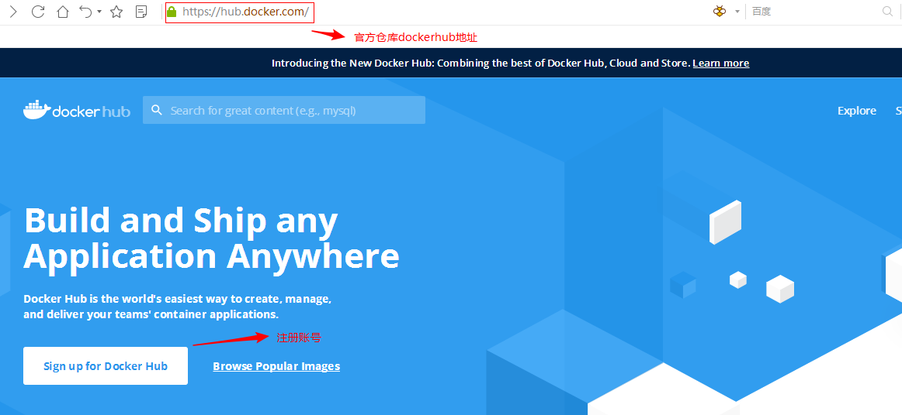

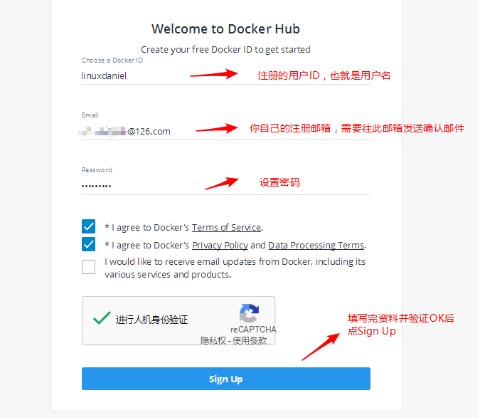

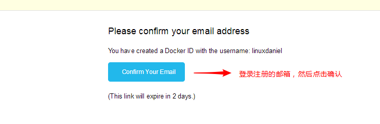

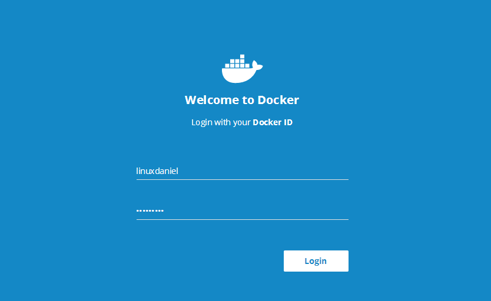

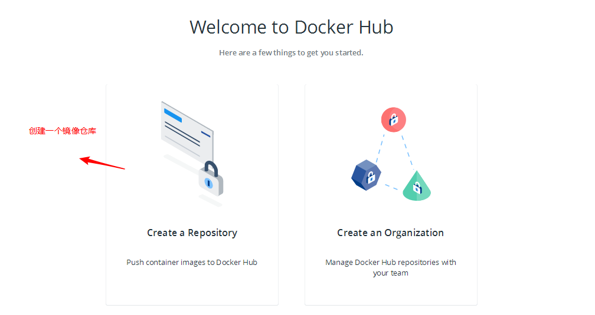

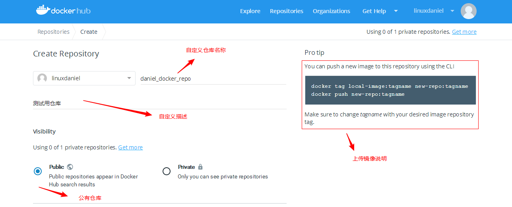

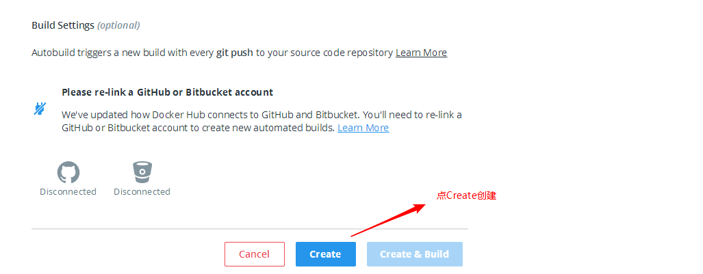

第二步：<font style="color:rgb(51, 51, 51);">回到宿主机登录账号与密码</font>

```shell
docker# docker login
Login with your Docker ID to push and pull images from Docker Hub. If you don't have a Docker ID, head over to https://hub.docker.com to create one.
Username: linuxdaniel
Password: 
Login Succeeded
```

第三步：重命名镜像

<font style="color:rgb(51, 51, 51);">我们从 docker hub上下载的公开镜像是不能直接上传的，要先 tag (打标签，</font>**<font style="color:rgb(51, 51, 51);">类似于重新指定路径并命名</font>**<font style="color:rgb(51, 51, 51);">)</font>

```shell
docker# docker push centos:latest
Error response from daemon: You cannot push a "root" repository. Please rename your repository to docker.io/<user>/<repo> (ex: docker.io/<user>/centos)

docker# docker tag centos:latest linuxdaniel/daniel_docker_repo:V1
```

第四步：<font style="color:rgb(51, 51, 51);">push 镜像到仓库</font>

```shell
docker# docker push linuxdaniel/daniel_docker_repo:V1
```

第五步：<font style="color:rgb(51, 51, 51);">验证</font>

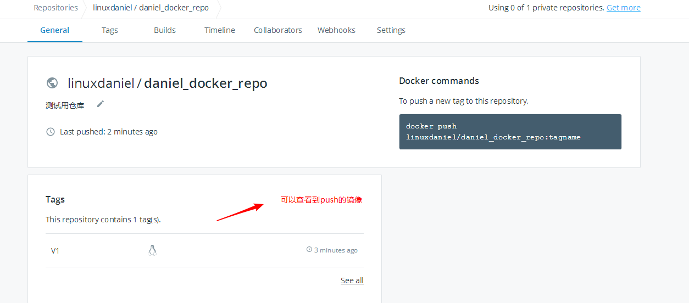

第六步：退出账号

```shell
docker# docker logout
Removing login credentials for https://index.docker.io/v1/
```

## <font style="color:rgb(51, 51, 51);">阿里云镜像仓库（重点）</font>

<font style="color:rgb(51, 51, 51);">登录阿里云账号，主页面上找产品 --> 容器 --> 容器镜像服务 --> 然后使用账号登录</font>

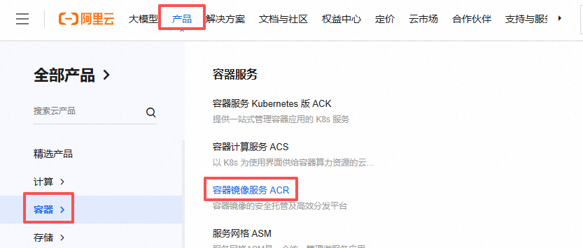


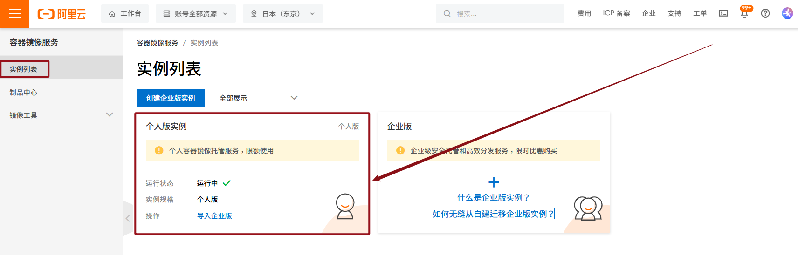

<font style="color:rgb(51, 51, 51);">登录成功后，做下列操作</font>

<font style="color:rgb(51, 51, 51);">第一步：创建命名空间（命令空间和镜像仓库名称合到一起组成镜像的路径名称）</font>

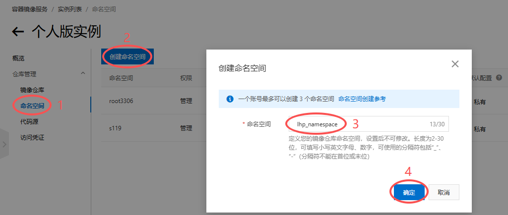

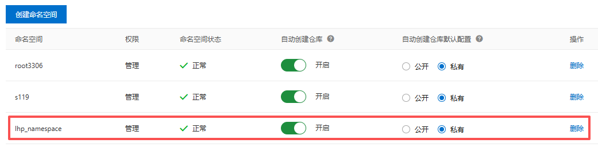

第二步：<font style="color:rgb(51, 51, 51);">创建镜像仓库，指定仓库名称</font>

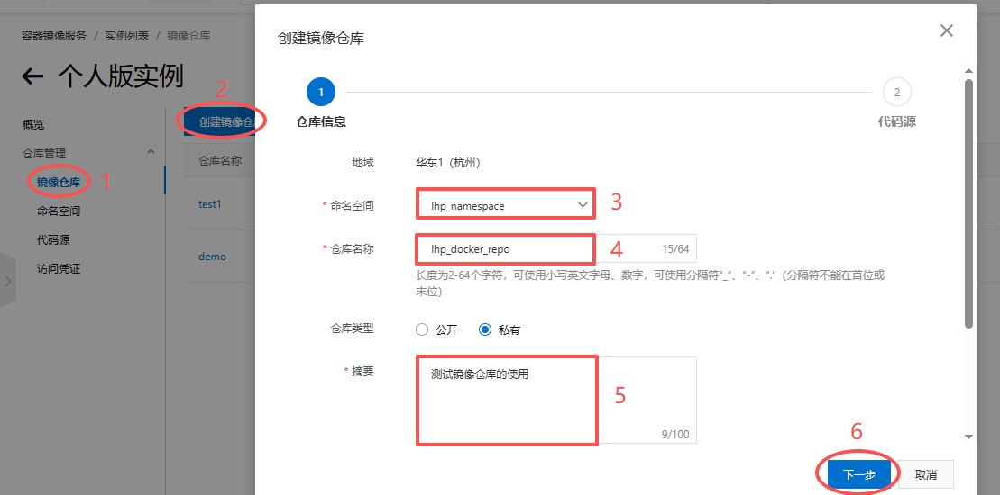

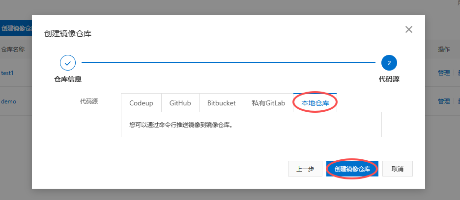

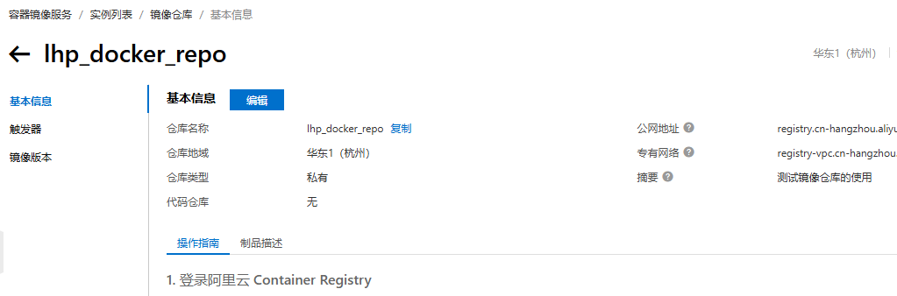

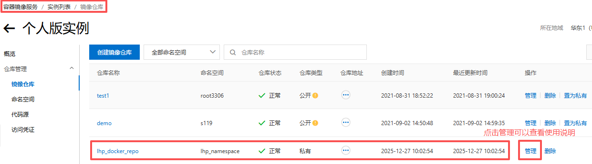

第三步：<font style="color:rgb(51, 51, 51);">登录前操作</font>

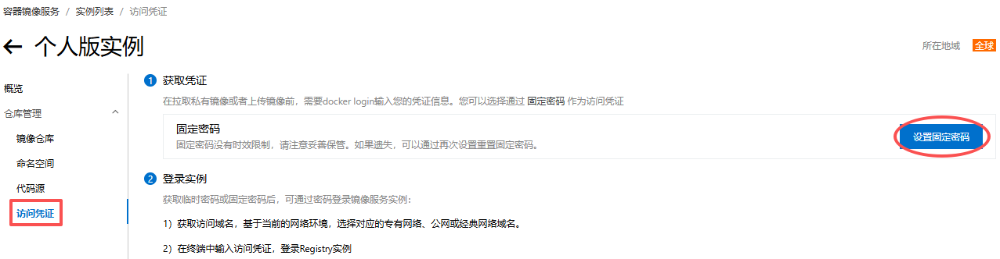

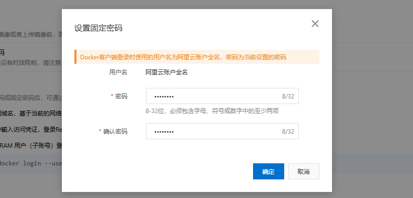

> 密码：root3306

登录镜像仓库的信息：

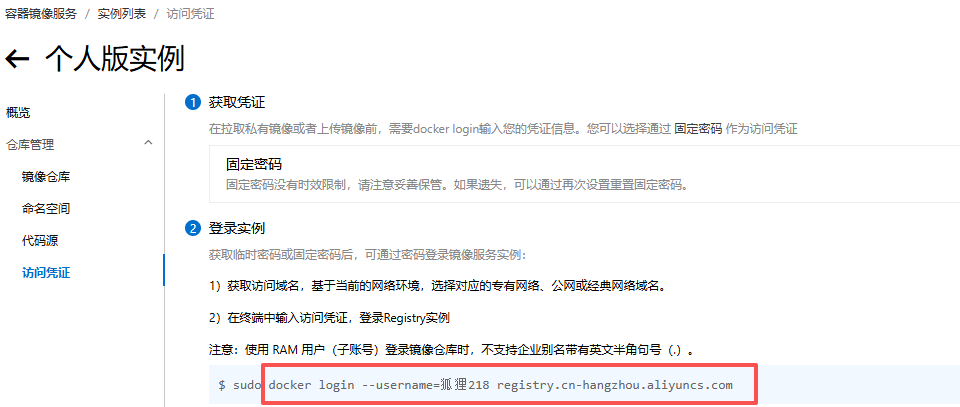

早期 docker login 登录镜像仓库使用阿里云登录密码，最近版本更新后，要求增加一个固定密码，必须按照以上设置，否则无法登录仓库。

第四步：<font style="color:rgb(51, 51, 51);">登录阿里云镜像仓库</font>

```shell
docker# docker login --username=狐狸218 registry.cn-hangzhou.aliyuncs.com
输入访问凭证中的固定密码
```

> 登录的命令及信息看上面的最后一张截图！

第五步：<font style="color:rgb(51, 51, 51);">给本地镜像打 Tag 标签并上传到镜像仓库，如果没有 Tag 无法上传</font>

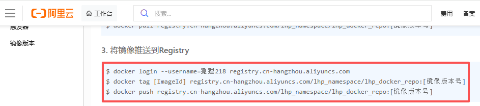

```shell
docker# docker images
docker# docker tag d4aaab6242e0 registry.cn-hangzhou.aliyuncs.com/lhp_namespace/lhp_docker_repo:v1

docker# docker images

docker# docker push registry.cn-hangzhou.aliyuncs.com/lhp_namespace/lhp_docker_repo:v1
```

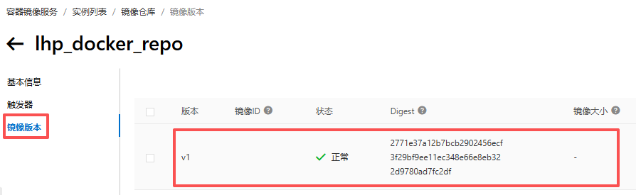

> 这里的打标签和推送，也是看上面创建仓库时，仓库里面的说明！！每个镜像仓库都有这些要求的，得按照人家的要求去打标签。

第六步：删除本地的镜像，然后试试从镜像仓库拉取

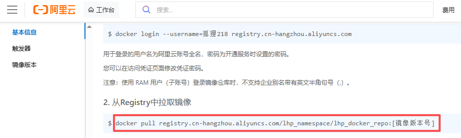

```shell
docker# docker images
docker# docker rmi hello-world:latest
docker# docker rmi registry.cn-hangzhou.aliyuncs.com/lhp_namespace/lhp_docker_repo:v1
docker# docker images

docker# docker pull registry.cn-hangzhou.aliyuncs.com/lhp_namespace/lhp_docker_repo:v1

docker# docker images
```

第六步：退出阿里云镜像仓库

```shell
使用docker logout接地址
docker# docker logout registry.cn-hangzhou.aliyuncs.com
```

<font style="color:rgb(51, 51, 51);">具体参考时，一定要参考自己仓库设置，需要更改参数如下：（每个仓库中都会有如下的说明信息，按照这个去操作！）</font>

> <font style="color:rgb(51, 51, 51);">在实际工作中，好多公司是这样做的：购买一台国外的阿里云服务器，然后将公司需要用到的 docker 镜像都下载下来，然后将这些镜像上传到阿里云的镜像仓库中，之后公司就从阿里云镜像仓库拉取镜像。</font>

## <font style="color:rgb(51, 51, 51);">Harbor 私有镜像仓库（重点）</font>

<font style="color:rgb(51, 51, 51);">我们现在使用 Docker 仓库的方式有：</font>

1. 使用官方 Docker 仓库（需要科学上网）
2. 使用阿里云镜像仓库（收费）
3. 自建私有镜像仓库

<font style="color:rgb(51, 51, 51);">Harbor 是 VMware 公司开源了企业级 Registry 项目，可以帮助用户快速搭建一个企业级的 Docker registry 服务。</font>

<font style="color:rgb(51, 51, 51);">harbor 由 python 语言开发，需要使用</font><code><font style="color:rgb(51, 51, 51);background-color:rgb(243, 244, 244);">docker-compose</font></code><font style="color:rgb(51, 51, 51);">工具进行启动</font>

<font style="color:rgb(51, 51, 51);">说明：docker-compose 是容器编排工具。</font>

### 环境准备

第一步：克隆一台最小化安装的服务器，命名为 harbor，并修改 MAC 地址

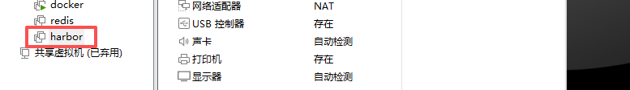

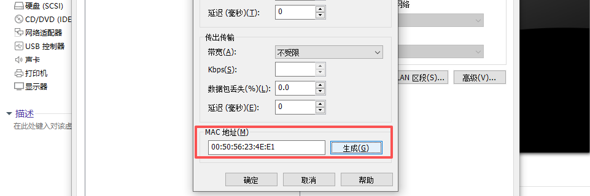

第二步：修改 IP 地址，主机名和 hosts 文件

```shell
harbor# vim /etc/NetworkManager/system-connections/ens33.nmconnection
address1=192.168.126.200/24

harbor# nmcli connection reload
harbor# nmcli connection up ens33

harbor# hostnamectl set-hostname harbor.lhp.cn
harbor# su

harbor# vim /etc/hosts
127.0.0.1   localhost localhost.localdomain localhost4 localhost4.localdomain4
::1         localhost localhost.localdomain localhost6 localhost6.localdomain6
192.168.126.100 docker.lhp.cn
192.168.126.200 harbor.lhp.cn
```

### <font style="color:rgb(51, 51, 51);">安装过程</font>

\*\*第一步：\*\*安装 docker-compose

以下方法任选其一

<font style="color:rgb(51, 51, 51);">安装方法 1：</font>

<font style="color:rgb(51, 51, 51);">安装 python3-pip，然后通过 pip 安装 docker-compose 模块</font>

```shell
harbor# yum install epel-release -y
harbor# yum install python3-pip -y
harbor# pip install -i https://pypi.tuna.tsinghua.edu.cn/simple docker-compose
指定清华源安装速度较快

harbor# docker-compose -v
```

**<font style="color:rgb(51, 51, 51);">安装方法 2（推荐）:</font>**

上传资料中的 docker-compose 安装包

```shell
harbor# mv docker-compose-linux-x86_64 /usr/local/bin/docker-compose
harbor# chmod +x /usr/local/bin/docker-compose
```

\*\*第二步：\*\*在 harbor 服务器上安装 docker-ce 并启动 docker 服务

因为 docker-compose 要依赖于 Docker 容器去运行，所以需要在 harbor 服务器中安装 Docker。

```shell
harbor# wget https://mirrors.aliyun.com/docker-ce/linux/centos/docker-ce.repo -O /etc/yum.repos.d/docker-ce.repo
harbor# yum -y install docker-ce

harbor# systemctl start docker
harbor# systemctl enable docker
```

\*\*第三步：\*\*安装 harbor

<font style="color:rgb(51, 51, 51);">harbor 分为离线包和在线包两种。在线包较小，但需要联网下载。我这里使用离线包</font>

<font style="color:rgb(51, 51, 51);">下载地址：</font>[<font style="color:rgb(65, 131, 196);">https://github.com/goharbor/harbor/releases</font>](https://github.com/goharbor/harbor/releases)

<font style="color:rgb(51, 51, 51);">我这里提供了 </font>**<font style="color:rgb(51, 51, 51);">harbor-offline-installer-v2.12.2.tgz </font>**<font style="color:rgb(51, 51, 51);">给大家拷贝到 harbor 服务器上</font>

```shell
harbor# tar xf harbor-offline-installer-v2.12.2.tgz -C /usr/local/
harbor# cd /usr/local/harbor/
harbor# cp harbor.yml.tmpl harbor.yml
harbor# vim harbor.yml
5 hostname: harbor.lhp.cn						将hostname改成harbor服务器主机名称

7 # http related config
8 http:
9   # port for http, default is 80. If https enabled, this port will redirect to https port
10   port: 80
11
12 # https related config
13 #https:																				关闭https
14   # https port for harbor, default is 443  		关闭https
15   # port: 443																	关闭https
16   # The path of cert and key files for nginx
17   # certificate: /your/certificate/path
18   # private_key: /your/private/key/path
19   # enable strong ssl ciphers (default: false)
20   # strong_ssl_ciphers: false

47 harbor_admin_password: 123				# admin用户的默认密码，我这里改为简单的123


harbor# ./install.sh
......
......
......
✔ ----Harbor has been installed and started successfully.----

Now you should be able to visit the admin portal at http://192.168.126.150.
For more details, please visit https://github.com/goharbor/harbor .
```

**注意：安装的时候有同学报错如下：**

```shell
failed to ingest "f8b636cf29050e782a0b2376de44c593c5cf81231d3a4f96643b33455754e03c/layer.tar": failed to copy: failed to send write: write /var/lib/containerd/io.containerd.content.v1.content/ingest/24a92a745ff890199d698a83db7a024276e3b2ef82cfe942c59572c38022f145/data: no space left on device
```

报错原因：磁盘空间不够，之前我们对 /var 目录设置了分区，是 LVM 的方式管理的，当时只有 2G 大小。需要给他扩容一下。具体做法：

```shell
1. 关闭harbor服务器，添加一块磁盘10G
2. lsblk
3. pvcreate /dev/sdb
4. vgextend cs_bogon /dev/sdb
5. vgdisplay
6. lvextend -l +100%FREE /dev/cs_bogon/var
7. xfs_growfs /dev/cs_bogon/var
8. df -h
```

\*\*第四步：\*\*浏览器访问 [http://192.168.126.200](about:blank)，登录进行配置

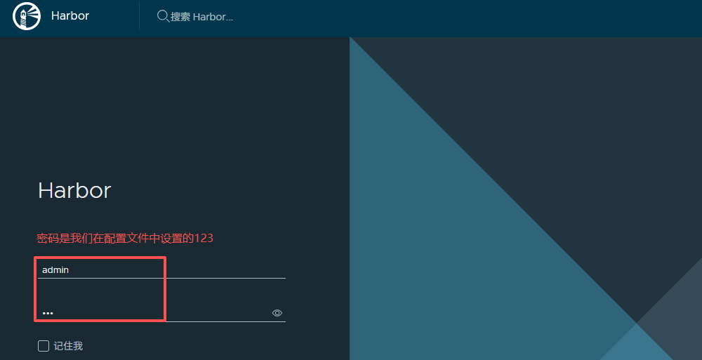

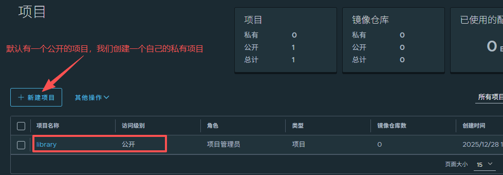

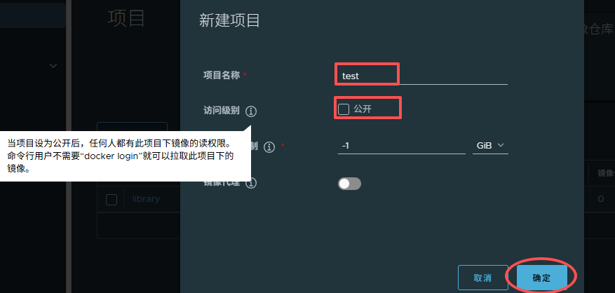

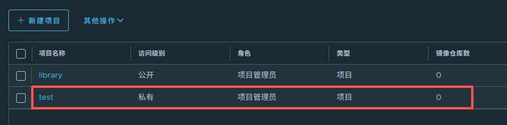

<font style="color:rgb(51, 51, 51);">公开项目：下载镜像不需要 docker login 登录，但上传镜像还是需要 docker login 登录</font>

<font style="color:rgb(51, 51, 51);">私有项目：都需要 docker login 登录才以上传下载</font>

### <font style="color:rgb(51, 51, 51);">镜像上传下载操作</font>

\*\*第一步：\*\*在 docker 宿主机配置非 https 连接

因为 Docker 用 https 通讯，所以还需要做证书，太麻烦。

配置 `"insecure-registries":["harbor 服务器 IP"]` 来使用 http 通讯（在 Docker 服务器去操作）

```shell
docker# vim /etc/docker/daemon.json
{
  ...,		# 这里最后是要有一个逗号的
  "insecure-registries": ["192.168.126.200"]		# 这里写的就是harbor服务器的IP
}

docker# systemctl daemon-reload
docker# systemctl restart docker
```

> **上面的操作要在 Docker 服务器去做**，以后 Docker 服务器就可以通过 http 请求推送镜像到 harbor 服务器仓库了！

\*\*第二步：\*\*在 Docker 宿主机下载一个测试镜像，并修改 tag 为 harborIP/项目名/镜像名:TAG

```shell
docker# docker pull hello-world
docker# docker tag hello-world 192.168.126.200/test/hello-world:v1

打标签：docker tag，上传到哪里，docker tag打标签是有要求的
docker tag 镜像名称或者镜像ID harbor的IP地址/项目名/仓库:版本号
```

参考 Harbor 仓库对我们的提示要求：

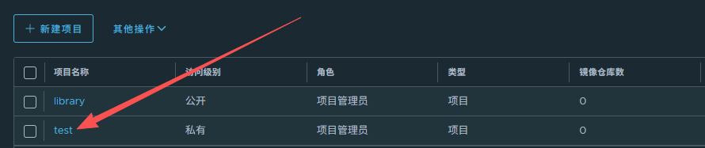

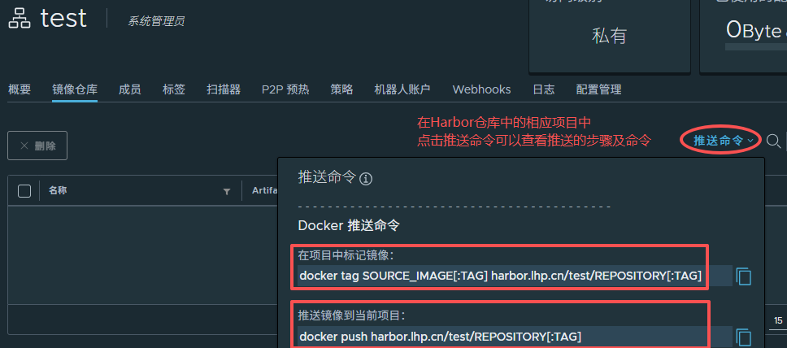

\*\*第三步：\*\*登录 Harbor 服务器，并 push 上传镜像

登录之前，在所有服务器中添加主机与 IP 映射

```shell
vim /etc/hosts
192.168.126.100 docker.lhp.cn
192.168.126.200 harbor.lhp.cn
```

然后使用 docker login 登录 Harbor

```shell
docker# docker login 192.168.126.200
Username: admin
Password:			# 密码为前面修改好的123
Login Succeeded

docker# docker push 192.168.126.200/test/hello-world:v1

如果不用了的话，可以退出登录，暂时先别退出！
docker# docker logout 192.168.126.200
```

\*\*第四步：\*\*访问 Harbor 服务器的 web 页面进行验证

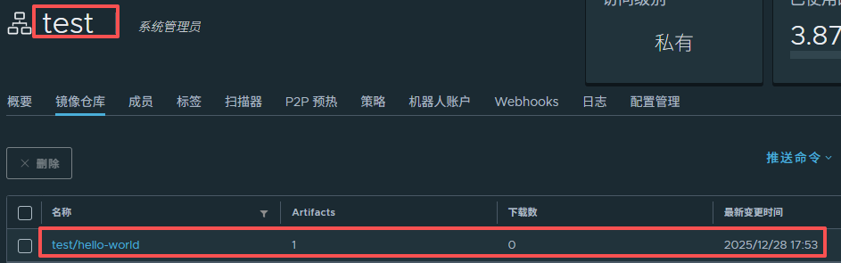

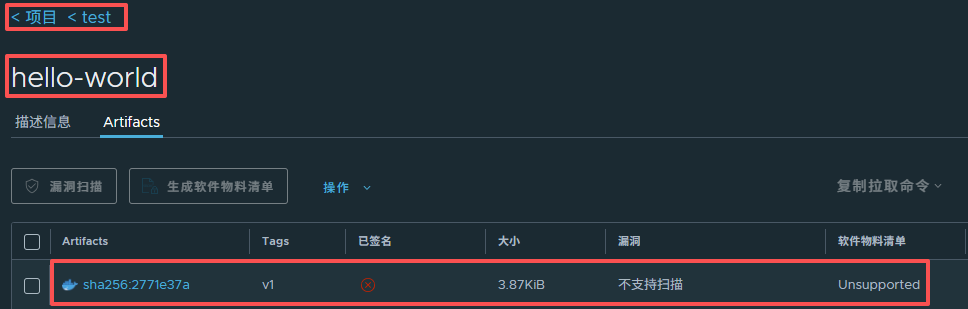

\*\*第五步：\*\*Docker 宿主机想要 pull harbor 服务器中的镜像，可以这样做

```shell
删除本地docker服务器上的镜像，再重新从harbor仓库上下载
docker# docker rmi 192.168.126.200/test/hello-world:v1

拉取私有项目中的镜像需要先登录，再pull（公共项目里的镜像不用登录就可以直接pull，请自行测试）
docker# docker login 192.168.126.200
Username: admin
Password: 123
Login Succeeded

docker# docker pull 192.168.126.200/test/hello-world:v1

然后查看一下目前的镜像
docker# docker images
```

从 harbor 服务器拉取镜像，也可以参考提示：

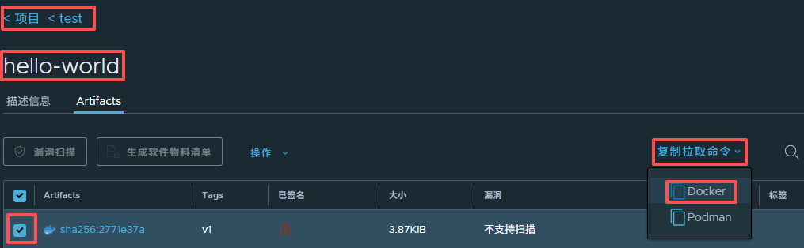

***

小结：远程仓库

* 官方仓库，缺点：网络问题
* 国内云厂商提供的镜像仓库，优点：网速较好，缺点：安全性考虑、付费问题
* 自建仓库，优点：网速好，安全性也好，缺点：自己维护，需要服务器和存储成本

***

Harbor 答疑：

问题 1：为什么要打标签 => docker tag

回答：因为 Docker 默认连接官方镜像仓库，如果不打标签，则拉取与上传都是使用官方仓库。但是由于某些原因，官方镜像仓库无法访问，我们可以使用阿里云或者私有镜像仓库。

问题 2：明明更改了 `/etc/docker/daemon.json`文件，但是没有效果？

回答：没有重启 Docker。

问题 3：明明昨天还可以访问 harbor，今天突然无缘无故就无法访问了？神操作（在 Harbor 服务器上）：`systemctl restart docker`

回答：因为 Harbor 是通过 docker-compose 安装的，docker-compose 是容器编排工具，整个 Harbor，后台有很多个容器同时运行（Nginx 容器、MySQL 容器等等），如果重启 Docker，会导致所有容器全部停止！解决办法如下：

```shell
harbor# cd /usr/local/harbor
harbor# docker compose down
harbor# docker compose up -d

说明：新版本的docker中已经自带了docker-compose功能，直接使用docker compose命令即可（注意中间没有-横岗）
```

# 七、容器常见操作

目标：镜像 => 运行 => 容器

## 查看容器列表

列出所有状态的容器

```shell
docker# docker ps -a
```

## 运行第一个容器

通过 hello-world 这个镜像，运行一个容器（没有定义容器名称，则为随机名称）

```shell
docker# docker run hello-world
```

再次查看容器列表，多了一个容器，但它的状态是 exited，此容器就是运行了一句 Hello from Docker！就退出了。（我这里容器名随机为 <font style="color:rgb(51, 51, 51);">silly\_lovelace</font>）

```shell
docker# docker ps -a
CONTAINER ID        IMAGE               COMMAND             CREATED             STATUS                     PORTS               NAMES
6e3f991b9e8a        hello-world         "/hello"            3 minutes ago       Exited (0) 2 minutes ago                       silly_lovelace
```

问题：为什么容器运行完 hello-world 后就退出了，而不是继续运行？

我们前面把容器比喻为轻量级虚拟机，但是容器实际上只是进程。进程完事了当然就退出了，除非是类似服务那样的守护进程。

综上所述：容器大致可以分为两种类型：

一次性运行：如 hello-world，只运行 1 次就会自动结束（因为运行起来容器后，打印一句话就完事了）

永久性运行：如 Nginx、Tomcat、MySQL 容器，一旦启动后，就会一直运行

## 容器运行命令或脚本

容器运行命令或脚本：也就是我们通过镜像运行一个容器，然后在这个容器中执行一些命令或者脚本。

带守护进程的镜像也可以选择运行方式：① 临时运行 1 次（为了得到某个结果） ② 永久运行（持续不断提供服务）

***

指定使用 centos-stream-9 镜像运行 `echo haha`命令

latest 是默认的 tag 标签，可以省略；如果是其他 tag 就不能省略，否则会默认为 latest。

```shell
docker# docker run docker.1ms.run/dokken/centos-stream-9:latest echo hehe
hehe

通过 centos-stream-9:latest 这个镜像启动一个容器，在容器中运行 echo haha 这个命令，运行完后，容器也就退出了。

docker# docker ps -a
```

Docker 运行一个不间断的脚本，-d 表示后台运行（后台运行表示不输出结果到屏幕）

```shell
docker# docker run -d docker.1ms.run/dokken/centos-stream-9:latest /bin/bash -c "while true; do echo haha; sleep 3; done"

docker# docker ps -a

-d：后台运行
/bin/bash -c "shell命令"
while true; do echo haha; sleep 3; done
```

## 查看容器运行结果

```shell
docker# docker logs 容器ID或者容器名称

docker# docker logs 9a522e22fbda
或者
docker# # docker logs affectionate_jones
```

> 以上方式除了可以正常查看日志外，还可以查看容器中运行的命令的结果（比如查看上面案例中的 while 死循环中输出的内容）。

## 停止容器

```shell
docker# docker stop 容器ID

停止上面的那个死循环的容器
docker# docker ps -a
docker# docker stop 9a522e22fbda
docker# docker ps -a
```

## 启动容器

```shell
docker# docker start 容器ID

启动上面的那个死循环的容器
docker# docker ps -a
docker# docker start 9a522e22fbda
docker# docker ps -a
docker# docker logs 9a522e22fbda
docker# docker stop 9a522e22fbda	(记得停止掉，这是个死循环的，不然电脑风扇一会就转的飞快！！！)
```

## 查看容器的相关信息

```shell
docker# docker inspect 容器ID

docker# docker inspect 9a522e22fbda
```

> inspect 主要用于查看容器信息，一定要记住！
>
> docker logs：查看容器运行时产生的日志信息
>
> docker inspect：查看容器这个容器自身的一些信息，自身基于哪个镜像、网络、版本等等。

## 进入容器并交互式操作

永久运行容器，往往支持直接进入到容器的内部，进行一系列的操作。

```shell
通过镜像创建并运行一个容器，并且进入到容器内部
docker# docker run -it --name=容器名 镜像:tag /bin/bash

说明：
-i：表示交互
-t：表示tty终端
-name：指定容器的名称
/bin/bash：表示进入容器后，执行命令时使用的shell解析器

案例：
1. 创建并运行容器，且进入容器内部
docker# docker run -it --name=c1 docker.1ms.run/dokken/centos-stream-9:latest /bin/bash
2. 查看容器的系统版本
[root@432d62851459 /]# cat /etc/redhat-release
CentOS Stream release 9
3. 查看容器的内核版本
[root@432d62851459 /]# uname -r
5.14.0-592.el9.x86_64
4. 在容器内操作
[root@432d62851459 /]# touch /root/hello.txt
[root@432d62851459 /]# yum -y install tree
5. 退出容器
[root@432d62851459 /]# exit
exit
6. 查看容器状态
docker# docker ps -a
```

> 如果在容器内部输入了 exit，则会导致容器主进程结束，最终容器也会 exited！如果想退出容器的交互，但是不想让容器停止，使用快捷键：ctrl + p + q

1. 使用下面的命令查看到 c1 容器已经成为 exited 状态，-l 表示列出最近的容器

```shell
docker# docker ps -l
CONTAINER ID   IMAGE                                          COMMAND       CREATED         STATUS              PORTS     NAMES
432d62851459   docker.1ms.run/dokken/centos-stream-9:latest   "/bin/bash"   7 minutes ago   Exited(0) 1 minute ago             c1
```

2. 启动容器

```shell
docker# docker start c1			=> 通过容器名启动容器
或者
docker# docker start 容器ID
```

3. 使用 attach 指令连接 up 状态的容器（exited 状态的容器无法 attach）

```shell
docker# docker attach c1		=> 其实也就是说使用attach命令可以再次进入到容器内部
[root@432d62851459 /]# ls /root/
anaconda-ks.cfg  anaconda-post-nochroot.log  anaconda-post.log  hello.txt  original-ks.cfg
```

> 其实我们通过 centos-stream-9 这个镜像启动一个容器后，可以在这个容器中安装我们要用的软件环境等，之后可以将这个容器打包，上传到镜像仓库中，别的同事就可以直接拉取使用，不需要再安装环境什么的。很方便！

4. commit 提交一个新的镜像

```shell
我们可以将一个容器通过提交后，产生一个新的镜像，以后别人拿到这个镜像运行后产生的容器效果和我们的一样。
docker# docker commit 容器ID 镜像名:tag

docker# docker commit 432d62851459 test_image:v1
sha256:660cb6674f3b60638786e194b7660b15793eacac59f6551f8975d1a65536fc1f
```

5. 验证新镜像

```shell
docker# docker images | grep test_image
test_image:v1		660cb6674f3b        616MB          174MB

那么其他人拿到test_image:v1这个镜像后，跑起来成为容器，内部就有hello.txt这个文件以及有tree这个命令！
```

## 容器外指定容器运行命令

可以在宿主机通过 exec 指令传命令到容器中执行，但要求容器为 up 状态

```shell
docker# docker start c1			=> c1是我的容器名
docker# docker exec c1 touch /root/abc.txt
docker# docker exec c1 ls -l /root/abc.txt

也就是说可以通过exec实现不进入容器中，发送命令给容器去执行。

或者使用下面的命令连接到容器（进入容器内部）进行交换式操作
docker# docker exec -it c1 /bin/bash
[root@432d62851459 /]# exit
exit
docker# docker ps -a
可以看到容器c1的状态还是up！
也就是说通过docker attach进入容器内部后，使用exit退出容器后，容器会停止！ 
使用docker exec -it 进入容器内部后，使用exit退出容器，容器不会停止！
```

## 删除容器

```shell
docker# docker rm 容器ID

docker# docker ps -a
docker# docker stop 432d62851459
docker# docker ps -a
docker# docker rm 432d62851459
docker# docker ps -a
```

批量停止、批量删除所有容器：

```shell
1. 查看所有容器的ID，加-q选项后，只查看所有容器的ID
docker# docker ps -aq
9a522e22fbda
97d2827243d2
d025dc429fb2

2. 停止所有容器
docker# docker stop $(docker ps -aq)

3. 删除所有容器
docker# docker rm $(docker ps -aq)

4. 查看容器列表
docker# docker ps -a
```

# <font style="color:rgb(51, 51, 51);">八、容器里跑应用</font>

前面我们熟悉了容器的常见操作，但容器中并没有跑过应用程序。而生产环境是用容器来跑应用程序的。

在宿主机上打开 ip\_forward，因为我们下面要映射容器的端口到宿主机，只有打开 ip\_forward 才能映射成功。

```shell
docker# vim /etc/sysctl.conf
net.ipv4.ip_forward = 1
docker# sysctl -p
```

## <font style="color:rgb(51, 51, 51);">容器中运行 httpd 应用</font>

回顾镜像：

* 系统镜像
* 应用镜像

首先我们通过系统镜像来跑 httpd

准备工作：（可选）

```shell
1. 将所有的容器都停掉
docker# docker stop $(docker ps -aq)
2. 将没有用的镜像给删除
docker# docker rmi 镜像ID
3. 将所有的容器都给删掉
docker# docker rm $(docker ps -aq)
```

### 案例 1：端口映射

利用官方 centos 镜像运行容器跑 httpd 服务，因为官方 centos 镜像里默认没有安装 httpd 服务，所以需要我们自定义安装。

Docker 内部跑 httpd 启动 80 端口，需要与 docker\_host（宿主机）进行端口映射，才能让客户端通过网络来访问。

第一步：运行容器 httpd1；-p 8000:80 的意思是把容器里的 80 端口映射为 docker\_host（宿主机）的 8000 端口

`-p 宿主机端口:容器端口 `

```shell
docker# docker run -it -p 8000:80 --name=httpd1 centos:latest /bin/bash
[root@b0a9623d3920 /]# yum install httpd httpd-devel -y
Failed to get D-Bus connection: Operation not permitted

启动服务.这里用systemctl start httpd启动服务会报错，所以直接使用命令启动
[root@b0a9623d3920 /]# httpd -k start			=> 这个启动httpd也会报个警告，无所谓
[root@b0a9623d3920 /]# ss -an |grep :80
tcp    LISTEN     0      0        :::80                   :::*
```

第二步：<font style="color:rgb(51, 51, 51);">这里如果 exit 退出的话，启动的服务也会关闭。同时按下</font>**<font style="color:rgb(51, 51, 51);"> ctrl+p+q </font>**<font style="color:rgb(51, 51, 51);">三键，可以实现退出容器并保持容器</font>**<font style="color:rgb(51, 51, 51);">后台运行</font>**

```shell
可以查看到容器仍然是UP状态
docker# docker ps -l
CONTAINER ID        IMAGE               COMMAND             CREATED             STATUS              PORTS                  NAMES
b0a9623d3920        centos:latest       "/bin/bash"         1 minutes ago      Up 1 minutes       0.0.0.0:8000->80/tcp   httpd1
```

第三步：<font style="color:rgb(51, 51, 51);">使用另一台机器浏览器访问 </font>**<font style="color:rgb(51, 51, 51);">http://宿主机IP:8000 </font>**<font style="color:rgb(51, 51, 51);">测试</font>

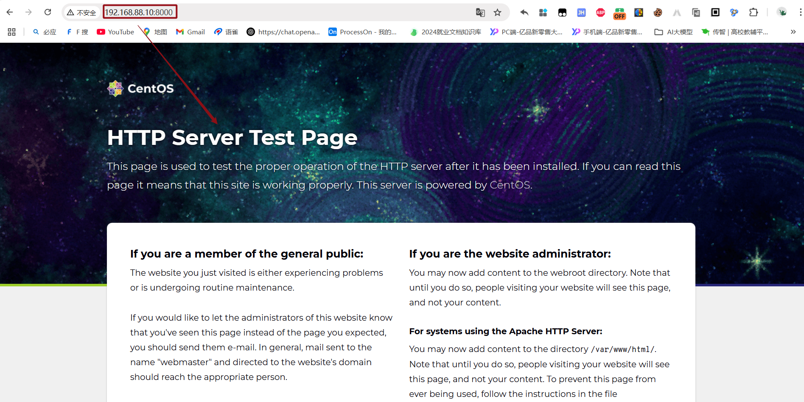

问题：`httpd -k start`是前台运行，为什么不能通过 `systemctl start httpd`后台运行？

```shell
答案：
Docker 的核心设计理念之一：一个容器 = 一个进程，而这个进程必须是前台运行的（Foreground），理由如下：
1. Docker 容器生命周期依赖于主进程
当我们运行一个 docker run 的时候，Docker 会创建一个容器，并运行你指定的主进程（比如：/bin/bash 或 httpd -D FOREGROUND）。
这个主进程一旦退出，容器就会停止运行。

2. 什么是前台和后台进程？
前台运行：进程在当前终端直接运行，不会 fork 到后台
示例：httpd -D FOREGROUND
后台运行（daemon 模式）：程序会 fork 自己到后台运行，然后主进程比如 /bin/bash 就没有任务要运行了，然后主进程退出。
示例：httpd 默认行为
在容器中，如果你用默认的后台方式启动服务，主进程退出 => Docker 认为容器结束 => 容器直接退出
```

### **<font style="color:rgb(51, 51, 51);">案例 2</font>**<font style="color:rgb(51, 51, 51);">：自定义 httpd 并提交为镜像（重点）</font>

centos 镜像里并没有 httpd，所以需要安装。但是如果每次启动一个容器都要安装一遍 httpd 是让人受不了的。所以我们在一个容器里安装一次，把想自定义的操作全都做完，然后将此容器 commit 成一个新的镜像。

以后就用这个新镜像运行容器就可以不用再重复安装环境了！

第一步：运行容器 httpd2，安装 httpd 相关软件并自定义配置

```shell
docker# docker run -it --name=httpd2 centos:latest /bin/bash
[root@82b985aea72c /]# yum install httpd httpd-devel -y

[root@82b985aea72c /]# mkdir /www
[root@82b985aea72c /]# echo "main page" > /www/index.html

修改124行和136行的家目录为/www
[root@82b985aea72c /]# vi /etc/httpd/conf/httpd.conf
[root@82b985aea72c /]# exit
exit
```

第二步：exit 退出后此容器就变为了 Exited 状态

```shell
docker# docker ps -l
CONTAINER ID        IMAGE               COMMAND             CREATED             STATUS                     PORTS               NAMES
82b985aea72c        centos:latest       "/bin/bash"         5 minutes ago      Exited (0) 6 seconds ago                       httpd2 
```

第三步：将搭建好的环境 commit 成新的镜像（此镜像相当于是自定义的，生产环境中可以按需求 push 到镜像仓库）

```shell
docker# docker commit httpd2 httpd_image
docker# docker images
```

第四步：将 commit 提交的镜像启动一个新的容器，并将端口 80 映射到宿主机的 8001

```shell
docker# docker run -d -p 8001:80 --name=httpd3 httpd_image /usr/sbin/httpd -D FOREGROUND
dcaca836b94655364749c064519ad66c8229657262465e7ea8194f2616980b61
docker# lsof -i:8001
COMMAND     PID USER   FD   TYPE DEVICE SIZE/OFF NODE NAME
docker-pr 23130 root    4u  IPv6 183572      0t0  TCP *:vcom-tunnel (LISTEN)

说明：
-d 选项表示在后台运行容器，就不会进入到容器里面了
```

第五步：使用另一台机器浏览器访问 http://宿主机 IP:8001 测试

问题：`/usr/sbin/httpd -D FOREGROUND`能否做成自动传参？

回答：可以，在 dockerfile 构建镜像章节会讨论。

总结：通过此案例，我们可知，将来可以在 centos 镜像的基础上，安装我们所需的各种环境，如 Nginx、Tomcat、Prometheus+Grafana、ELK 环境到容器中，然后打包成镜像，这样以后我们只需要运行镜像就可以快速完成应用的安装部署了！

### 案例 3：Docker 数据卷挂载（重点）

作用：保证 Docker 容器结束后，里面的数据不会随之消失，实现数据持久化存储。

问题：当我们有如下需求：

* 容器内配置文件需要修改
* 容器内数据（如：httpd 的家目录内的数据）需要保存
* 不同容器间数据需要共享（如：两个 httpd 容器家目录数据共享）

当容器删除时，里面的相关改变的数据也会删除，也就是说数据不能持久化保存。

我们可以将服务的配置文件、数据目录、日志目录等与宿主机的目录映射，把数据保持到宿主机上实现数据持久化。

宿主机的目录也可以共享给多个容器使用。

将宿主机的目录（数据卷）挂载到容器中（配置文件也可以挂载）

第一步：在宿主机创建一个目录，并建立一个内容不同的主页

```shell
docker# mkdir -p /docker_www
docker# echo lihupeng > /docker_www/index.html
```

第二步：运行容器 httpd4，将宿主机的 `/docker_www`目录挂载到容器中的 `/www/`目录

```shell
docker# docker run -d -p 8002:80 -v /docker_www/:/www --name=httpd4 httpd_image /usr/sbin/httpd -D FOREGROUND

docker# docker ps -l
CONTAINER ID        IMAGE               COMMAND             CREATED             STATUS              PORTS                  NAMES
484d7432d7ef        httpd_image         "/usr/sbin/httpd -..."          21 seconds ago      Up 20 seconds       0.0.0.0:8002->80/tcp   httpd4
```

第三步：使用另一台机器浏览器访问 http://宿主机 IP:8002 测试（注意：如果访问不到主页，请检查是否关闭了 SELinux）

第四步：尝试修改宿主机 `/docker_www/index.html`的内容，访问的结果也会随着修改而改变

***

默认情况下，Docker 中的数据卷挂载只能实现文件夹映射，但是如果只需要映射某个文件（情况很少），需要提前准备一个文件，然后再和 Docker 容器建立映射关系。

```shell
docker# mkdir -p /httpd_www /test
docker# yum -y install httpd
docker# cp /etc/httpd/conf/httpd.conf /test/httpd.conf

docker# docker run -d --name httpd5 -p 8000:80 \
> -v /httpd_www:/www \
> -v /test/httpd.conf:/etc/httpd/conf/httpd.conf \
> http_image /usr/sbin/httpd -D FOREGROUND
```

***

拓展：

如果我们进入之前使用 centos 镜像创建的容器中，查看当前的日期时间，发现是不对的，差 8 个小时

```shell
docker# docker attach c1
[root@82b985aea72c /]# date
```

默认的 centos 镜像时间与我们相差 8 小时，所以这是时区的差异，可以用如下方式解决：

```shell
docker# docker stop c2
docker# docker rm c2
docker# docker run -it -v /etc/localtime:/etc/localtime --name c2 centos /bin/bash
[root@82b985aea72c /]# date
发现时间正确了！  
```

### 案例 4：官方 httpd 镜像运行容器

参考：<https://hub.docker.com/_/httpd>

第一步：pull 官方 httpd 镜像

```shell
docker# docker search httpd
docker# docker pull httpd:2.4
```

第二步：运行容器

```shell
/data/www目录可以提前创建，也可以不用创建（它会帮我们自动创建）
docker# mkdir -p /data/www
docker# docker run -dit --name=httpd6 -p 8003:80 -v /data/www:/usr/local/apache2/htdocs/ httpd:2.4

说明：上面的命令中，最后什么时候添加 /bin/bash？答：开发调试环境，一般要添加，如果是上线部署，一般很少添加
docker run -it 配合 /bin/bash
docker run -d 可以不用加 /bin/bash

docker# echo "hahaha" > /data/www/index.html
```

第三步：使用另一台机器浏览器访问 http://宿主机 IP:8003 测试

## 容器中运行 MySQL 或 Mariadb 应用

说明：虽然本案例是以 MySQL 为例，但是生产环境，一律禁止使用 Docker 运行数据库！！！

### 案例 1：官方 MySQL 镜像运行容器

第一步：拉取 mysql 镜像

```shell
docker# docker pull mysql:8.0.41
docker# docker images
```

> 可以去 Docker 镜像仓库的官网查看具体的版本号，也就是 tag。https://hub.docker.com。在官网先搜索要用的镜像，然后找镜像的 tag，去看自己想用的版本号。

第二步：启动容器

更多参数和详细说明请参考：[https://hub.docker.com/\_/mysql](about:blank)

```shell
docker# docker run -d -p 3306:3306 --name=mysql1 -v /data/mysql:/var/lib/mysql --restart=always -e MYSQL_ROOT_PASSWORD=123 mysql:8.0.41

启动后查看宿主机的/data/mysql目录，发现已经初始化数据了
docker# ls /data/mysql
auto.cnf  ibdata1  ib_logfile0  ib_logfile1  mysql  performance_schema

说明：
--restart=always 表示重启docker服务后，该容器也会自动重启
-e MYSQL_ROOT_PASSWORD=123 指定MySQL的root用户密码
```

第三步：宿主机安装 mysql 客户端，连接容器中的数据库

```shell
docker# yum -y install mysql
docker# mysql -h 127.0.0.1 -P 3306 -uroot -p123
```

### 案例 2：centos 镜像自定义 Mariadb 环境

第一步：创建容器并运行，在容器中安装 Mariadb

```shell
docker# docker run -it -d -p 3307:3306 -v /data/mysql2:/var/lib/mysql --restart=always --name=mariadb2 centos:latest /bin/bash

说明：如果运行容器的命令中后面有 /bin/bash，那我们就可以通过 docker attach 进入到容器中。如果没有，就需要通过docker -exec 进入到容器中

docker# docker attach mariadb2

[root@7dccf1c72315 /]# yum install mariadb-server -y
[root@7dccf1c72315 /]# mysql_install_db --datadir=/var/lib/mysql/ --user=mysql
[root@7dccf1c72315 /]# mysqld_safe --defaults-file=/etc/my.cnf &
[root@7dccf1c72315 /]# mysql
MariaDB [(none)]> grant all on *.* to 'abc'@'%' identified by '123';
MariaDB [(none)]> flush privileges;
MariaDB [(none)]> quit
[root@7dccf1c72315 /]#
最后按ctrl+p+q退出并保持容器后台运行
```

第二步：找另一台服务器远程连接测试

```shell
docker# mysql -h docker宿主机IP -P 3307 -u abc -p123
```

## <font style="color:rgb(51, 51, 51);">容器中运行 nginx 应用（作业）</font>

<font style="color:rgb(51, 51, 51);">参考：</font>[<font style="color:rgb(65, 131, 196);">https://hub.docker.com/\_/nginx</font>](https://hub.docker.com/_/nginx)

### <font style="color:rgb(51, 51, 51);">案例 1：官方 nginx 镜像运行容器</font>

第一步：<font style="color:rgb(51, 51, 51);">pull 拉取镜像</font>

```shell
docker# docker pull nginx
```

第二步：<font style="color:rgb(51, 51, 51);">准备一个 nginx.conf 配置文件</font>

```shell
docker# mkdir /data/nginx/etc -p
准备下面的配置文件(自己写一个，或者拷贝一个都可以)
docker# ls /data/nginx/etc/nginx.conf
```

第三步：<font style="color:rgb(51, 51, 51);">运行容器，并准备一个主页文件</font>

```shell
docker# docker run -d -p 8004:80 --restart=always --name=nginx1 -v /data/nginx/html:/usr/share/nginx/html -v /data/nginx/etc/nginx.conf:/etc/nginx/nginx.conf -v /data/nginx/log:/var/log/nginx nginx:latest

docker# echo "nginx main page" > /data/nginx/html/index.html
```

第四步：<font style="color:rgb(51, 51, 51);">使用另一台机器浏览器访问 </font>**<font style="color:rgb(51, 51, 51);">http://宿主机IP:8003 </font>**<font style="color:rgb(51, 51, 51);">测试</font>

<font style="color:rgb(51, 51, 51);">第五步：如果想要修改 nginx 配置文件，可以按下面步骤来实现</font>

```shell
按需求先修改配置文件
docker# vim /data/nginx/etc/nginx.conf
再重启容器
docker# docker stop nginx1
docker# docker start nginx1
```

## <font style="color:rgb(51, 51, 51);">容器中运行 tomcat 应用</font>

<font style="color:rgb(51, 51, 51);">参考：</font>[<font style="color:rgb(65, 131, 196);">https://hub.docker.com/\_/tomcat</font>](https://hub.docker.com/_/tomcat)

### <font style="color:rgb(51, 51, 51);">案例 1：官方 tomcat 镜像运行容器</font>

```shell
docker# docker run -d -p 8888:8080 --name=tomcat9 tomcat:9.0
docker# docker ps -a
docker# docker exec -it tomcat9 /bin/bash
ll webapps
rm -rf webapps
mv webapps.dist webapps

上面我们并没有拉取tomcat镜像就直接启动了，是因为这个tomcat镜像很有意思，如果直接启动的话，发现没有该镜像，就会自动去官网下载这个镜像然后启动容器。
```

访问 http://docker宿主机IP:8888 验证

***

tomcat 镜像比较大，可能也不好下载，大家直接使用资料中提供的 Tomcat 的镜像即可。

```shell
先上传tomcat镜像到Docker服务器中
docker# docker load < /root/tomcat9.tar
```

## 扩展：docker cp 命令

作用：实现宿主机与容器之间文件的交换操作（上传文件、下载文件）

**复制宿主机文件到容器**

基本语法：

```shell
docker cp 本地文件 容器名称:容器中对应的文件存储位置

docker cp readme.txt httpd1:/root/

案例：
echo 'hello world' > readme.txt
docker cp readme.txt httpd1:/root/
docker attach httpd1
cat /root/readme.txt
```

***

**下载容器中的文件到本地**

基本语法：

```shell
docker cp 容器名称:容器中对应的文件名称 本地路径

docker cp httpd1:/root/readme.txt /root/

案例：
rm -rf readme.txt
docker cp httpd1:/root/readme.txt .
cat ./readme.txt
```

# 九、使用 dockerfile 构建镜像（重点）

除了使用 `docker commit`把自定义容器提交成镜像外，还可以使用 dockerfile 来构建自定义镜像。

什么是 dockerfile？

dockerfile 把构建镜像的步骤都写出来，然后按照顺序执行实现自动构建镜像。就类似于脚本文件、Ansible 中的 playbook、saltstack 中的 sls 文件等。

## dockerfile 核心命令速查表

安装 docker => 编写 dockerfile => 构建最终镜像

| **<font style="color:rgb(51, 51, 51);">命令</font>** | **<font style="color:rgb(51, 51, 51);">作用</font>** | **<font style="color:rgb(51, 51, 51);">Nginx 典型示例</font>** |
| :--- | :--- | :--- |
| FROM | <font style="color:rgb(51, 51, 51);">指定基础镜像</font> | <code><font style="color:rgb(51, 51, 51);background-color:rgb(243, 244, 244);">FROM nginx:1.25-alpine</font></code><font style="color:rgb(51, 51, 51);">（推荐轻量版）</font> |
| WORKDIR | <font style="color:rgb(51, 51, 51);">设置容器工作目录（非必须，但便于管理）</font> | <code><font style="color:rgb(51, 51, 51);background-color:rgb(243, 244, 244);">WORKDIR /etc/nginx</font></code> |
| COPY | <font style="color:rgb(51, 51, 51);">复制本地文件到容器（覆盖默认配置或添加静态资源）</font> | <code><font style="color:rgb(51, 51, 51);background-color:rgb(243, 244, 244);">COPY nginx.conf /etc/nginx/nginx.conf</font></code> |
| RUN | <font style="color:rgb(51, 51, 51);">执行命令（安装依赖、修改默认行为）</font> | <code><font style="color:rgb(51, 51, 51);background-color:rgb(243, 244, 244);">RUN yum install curl</font></code> |
| EXPOSE | <font style="color:rgb(51, 51, 51);">声明容器监听端口（需配合</font><code><font style="color:rgb(51, 51, 51);background-color:rgb(243, 244, 244);">-p</font></code><font style="color:rgb(51, 51, 51);">映射到宿主机）</font> | <code><font style="color:rgb(51, 51, 51);background-color:rgb(243, 244, 244);">EXPOSE 80 443</font></code> |
| VOLUME | <font style="color:rgb(51, 51, 51);">挂载数据卷（持久化日志或静态文件）</font> | <code><font style="color:rgb(51, 51, 51);background-color:rgb(243, 244, 244);">VOLUME ["/var/log/nginx"]</font></code> |
| CMD | <font style="color:rgb(51, 51, 51);">启动 Nginx（通常不需修改，直接用基础镜像命令）</font> | <code><font style="color:rgb(51, 51, 51);background-color:rgb(243, 244, 244);">CMD ["nginx", "-g", "daemon off;"]</font></code> |

> 设置了 workdir 就表示我们一进入容器中，就处于 workdir 设置的目录中了。

四句口诀：设环境，开端口，定命令，真灵巧。

```shell
定底像 => FROM
装程序 => RUN
拷文件 => COPY
选目录 => WORKDIR
设环境 => ENV
开端口 => EXPOSE
定命令 => CMD
真灵巧 => ENTRYPOINT
```

## <font style="color:rgb(51, 51, 51);">dockerfile 指令</font>

<font style="color:rgb(51, 51, 51);">通过</font><code><font style="color:rgb(51, 51, 51);background-color:rgb(243, 244, 244);">man dockerfile</font></code><font style="color:rgb(51, 51, 51);">可以查看到详细的说明，我这里简单的翻译并列出常用的指令</font>

### <font style="color:rgb(51, 51, 51);">FROM</font>

<font style="color:rgb(51, 51, 51);">FROM 指令用于指定其后构建新镜像所使用的基础镜像。</font>

<font style="color:rgb(51, 51, 51);">FROM 指令必是 Dockerfile 文件中的首条命令。</font>

<font style="color:rgb(51, 51, 51);">FROM 指令指定的基础 image 可以是官方远程仓库中的，也可以位于本地仓库，优先本地仓库。</font>

```shell
格式:FROM <image>:<tag>
例:FROM centos:latest
```

### <font style="color:rgb(51, 51, 51);">RUN</font>

<font style="color:rgb(51, 51, 51);">RUN 指令用于在</font>**<font style="color:rgb(51, 51, 51);">构建</font>**<font style="color:rgb(51, 51, 51);">镜像中执行命令，有以下两种格式:</font>

<font style="color:rgb(51, 51, 51);">① shell 格式</font>

```shell
格式:RUN <命令>
例:RUN echo daniel > /var/www/html/index.html
```

<font style="color:rgb(51, 51, 51);">② exec 格式</font>

```shell
格式:RUN ["可执行文件", "参数1", "参数2"]
例:RUN ["/bin/bash", "-c", "echo daniel > /var/www/html/index.html"]
```

**<font style="color:rgb(51, 51, 51);">注意：</font>**<font style="color:rgb(51, 51, 51);">按优化的角度来讲，当有多条要执行的命令，不要使用多条 RUN，尽量使用 && 符号与 \ 符号连接成一行。因为多条 RUN 命令会让镜像建立多层(总之就是会变得臃肿了</font><font style="color:rgb(51, 51, 51);">)。</font>

```shell
RUN yum install httpd httpd-devel -y
RUN echo daniel > /var/www/html/index.html
可以改成
RUN yum install httpd httpd-devel -y && echo daniel > /var/www/html/index.html
或者改成
RUN yum install httpd httpd-devel -y  \
    && echo daniel > /var/www/html/index.html
```

### <font style="color:rgb(51, 51, 51);">CMD</font>

<font style="color:rgb(51, 51, 51);">CMD 不同于 RUN，CMD 用于指定在容器启动时所要执行的命令，而 RUN 用于指定镜像构建时所要执行的命令。</font>

```shell
格式有三种:
CMD ["executable","param1","param2"]
CMD ["param1","param2"]
CMD command param1 param2
```

<font style="color:rgb(51, 51, 51);">每个 Dockerfile 只能有一条 CMD 命令。如果指定了多条命令，只有最后一条会被执行。</font>

<font style="color:rgb(51, 51, 51);">如果用户启动容器时候指定了运行的命令，则会覆盖掉 CMD 指定的命令。</font>

```shell
什么是启动容器时指定运行的命令?
# docker run -d -p 80:80 镜像名 运行的命令
```

### <font style="color:rgb(51, 51, 51);">EXPOSE</font>

<font style="color:rgb(51, 51, 51);">EXPOSE 指令用于指定容器在运行时监听的端口。</font>

```shell
格式:EXPOSE <port> [<port>...]
例:EXPOSE 80 3306 8080
```

<font style="color:rgb(51, 51, 51);">上述运行的端口还需要使用 docker run 运行容器时通过 -p 参数映射到宿主机的端口。</font>

### <font style="color:rgb(51, 51, 51);">ENV</font>

<font style="color:rgb(51, 51, 51);">ENV 指令用于指定一个环境变量。</font>

```shell
格式:ENV <key> <value> 或者 ENV <key>=<value>
例:ENV JAVA_HOME /usr/local/jdkxxxx/
```

### <font style="color:rgb(51, 51, 51);">ADD</font>

<font style="color:rgb(51, 51, 51);">ADD 指令用于把宿主机上的文件拷贝到镜像中。</font>

```shell
格式:ADD <src> <dest>
<src>可以是一个本地文件或本地压缩文件，还可以是一个url,
如果把<src>写成一个url，那么ADD就类似于wget命令
<dest>路径的填写可以是容器内的绝对路径，也可以是相对于工作目录的相对路径
```

### <font style="color:rgb(51, 51, 51);">COPY</font>

<font style="color:rgb(51, 51, 51);">COPY 指令与 ADD 指令类似，但 COPY 的源文件只能是本地文件（文件或目录）</font>

```shell
格式:COPY <src> <dest>
```

<font style="color:rgb(51, 51, 51);">ADD 与 COPY 最佳实践：</font>

<font style="color:rgb(51, 51, 51);">默认优先使用 COPY</font>

<font style="color:rgb(51, 51, 51);">仅当需要解压本地压缩包时使用</font>

```shell
ADD app.tar.gz /app/
等价于
COPY app.tar.gz /app/ && tar -xzf /app/app.tar.gz -C /app/
```

### <font style="color:rgb(51, 51, 51);">ENTRYPOINT</font>

<font style="color:rgb(51, 51, 51);">ENTRYPOINT 与 CMD 非常类似</font>

<font style="color:rgb(51, 51, 51);">相同点：一个 Dockerfile 只写一条，如果写了多条，那么只有最后一条生效都是容器启动时才运行</font>

<font style="color:rgb(51, 51, 51);">不同点：如果用户启动容器时候指定了运行的命令，ENTRYPOINT 不会被运行的命令覆盖，而 CMD 则会被覆盖</font>

```shell
格式有两种:
ENTRYPOINT ["executable", "param1", "param2"]
ENTRYPOINT command param1 param2
```

### <font style="color:rgb(51, 51, 51);">VOLUME</font>

<font style="color:rgb(51, 51, 51);">VOLUME 指令用于把宿主机里的目录与容器里的目录映射。</font>

<font style="color:rgb(51, 51, 51);">只指定挂载点，docker 宿主机映射的目录为自动生成的。</font>

```shell
格式:VOLUME ["<mountpoint>"]
```

### <font style="color:rgb(51, 51, 51);">USER</font>

<font style="color:rgb(51, 51, 51);">USER 指令设置启动容器的用户(像 hadoop 需要 hadoop 用户操作，oracle 需要 oracle 用户操作)，可以是用户名或 UID。</font>

```shell
USER daemon
USER 1001
```

**<font style="color:rgb(51, 51, 51);">注意</font>**<font style="color:rgb(51, 51, 51);">：如果设置了容器以 daemon 用户去运行，那么 RUN、CMD 和 ENTRYPOINT 都会以这个用户去运行镜像构建完成后，通过docker run 运行容器时，可以通过 -u 参数来覆盖所指定的用户。</font>

### <font style="color:rgb(51, 51, 51);">WORKDIR</font>

<font style="color:rgb(51, 51, 51);">WORKDIR 指令设置工作目录，类似于 cd 命令。不建议使用</font><code><font style="color:rgb(51, 51, 51);background-color:rgb(243, 244, 244);">RUN cd /root</font></code><font style="color:rgb(51, 51, 51);">，建议使用 WORKDIR。</font>

```shell
WORKDIR /root
```

***

使用 dockerfile 构建镜像的步骤：

1. 创建一个文件夹（目录）
2. 在文件夹（目录）中创建 dockerfile 文件（并编写）及其他文件
3. 使用 `docker build`命令构建镜像
4. 使用构建的镜像启动容器

## <font style="color:rgb(51, 51, 51);">案例 1：Dockerfile 构建 httpd 镜像 v1</font>

第一步：<font style="color:rgb(51, 51, 51);">准备一个目录(自定义)</font>

```shell
docker# mkdir /dockerfile
```

第二步：<font style="color:rgb(51, 51, 51);">编写 dockerfile</font>

```shell
docker# cd /dockerfile
docker# vim dockerfile_httpd 
FROM dokken/centos-stream-9

LABEL maintainer="lihupeng <15201008359@163.com>"

RUN yum install httpd httpd-devel -y \
	&& echo "container main page" > /var/www/html/index.html

EXPOSE  80
CMD ["/usr/sbin/httpd","-D","FOREGROUND"]


说明：
LABEL 可以指定作者
RUN 可以指定在运行的命令，可以写多个RUN，每个RUN指定一条命令，但不如写一个RUN里面通过 && 将多条命令连起来。具体原因可以看上面的RUN指令的描述。
```

<font style="color:rgb(51, 51, 51);">第三步：使用</font><code><font style="color:rgb(51, 51, 51);background-color:rgb(243, 244, 244);">docker build</font></code><font style="color:rgb(51, 51, 51);">构建镜像，注意最后有一个点(代表当前目录)</font>

```shell
docker# docker build -f dockerfile_httpd -t my_httpd:v1 .

-f：file，指定构建dockerfile文件
-t：target，目标镜像名称及版本号（tag标签）
.：最后一个点表示基于当前目录作为构建镜像的上下文环境
```

第四步：<font style="color:rgb(51, 51, 51);">验证镜像</font>

```shell
docker# docker images | grep my_httpd
my_httpd            v1                  e316739796ae        1 minutes ago       348 MB
```

第五步：<font style="color:rgb(51, 51, 51);">使用构建好的镜像创建容器</font>

```shell
docker# docker run -d -p 8005:80 my_httpd:v1

docker# docker ps -a | grep my_httpd
c539e6161463        my_httpd:v1         "/usr/sbin/httpd -..."   1 minutes ago       Up 8 minutes        0.0.0.0:8005->80/tcp   boring_goldstine
```

第六步：<font style="color:rgb(51, 51, 51);">客户端访问 http://docker 宿主机 IP:8005 测试</font>

## <font style="color:rgb(51, 51, 51);">案例 2：Dockerfile 构建 httpd 镜像 v2</font>

第一步：<font style="color:rgb(51, 51, 51);">编写 dockerfile</font>

```shell
docker# vim dockerfile_httpd2 
FROM dokken/centos-stream-9

LABEL maintainer="lihupeng <15201008359@163.com>"

RUN yum install httpd httpd-devel -y

VOLUME ["/var/www/html/"]

EXPOSE  80
CMD ["/usr/sbin/httpd","-D","FOREGROUND"]
```

第二步：<font style="color:rgb(51, 51, 51);">使用</font><code><font style="color:rgb(51, 51, 51);background-color:rgb(243, 244, 244);">docker build</font></code><font style="color:rgb(51, 51, 51);">构建镜像</font>

```shell
docker# docker build -f dockerfile_httpd2 -t my_httpd:v2 .
```

<font style="color:rgb(51, 51, 51);">第三步：验证镜像</font>

```shell
docker# docker images | grep my_httpd |grep v2
my_httpd            v2                  3146d5503f39        1 minutes ago         382MB
```

第四步：<font style="color:rgb(51, 51, 51);">使用构建好的镜像创建容器</font>

```shell
将宿主机上的 /data/www2/ 挂载到容器里的 /var/www/html/
docker# docker run -d -p 8006:80 -v /data/www2:/var/www/html my_httpd:v2

docker# echo httpd2 > /data/www2/index.html
```

<font style="color:rgb(51, 51, 51);">思考：我们使用了</font><code><font style="color:rgb(51, 51, 51);background-color:rgb(243, 244, 244);">-v /data/www2:/var/www/html</font></code><font style="color:rgb(51, 51, 51);">挂载了数据卷，那么</font><code><font style="color:rgb(51, 51, 51);background-color:rgb(243, 244, 244);">VOLUME ["/var/www/html/"]</font></code><font style="color:rgb(51, 51, 51);">的作用体现在哪里？</font>

```shell
没有手动-v指定数据卷挂载，则docker会在宿主机/var/lib/docker/volumes/产生一个卷目录挂载到你指定的目录
```

第五步：<font style="color:rgb(51, 51, 51);">客户端访问 http://docker 宿主机 IP:8006 测试</font>

***

如果大家在实际工作中记不住，那么可以使用我们之前安装的 VScode 工具，在工具中写一些注释，那我们写 dockerfile 文件内容的话会有提示！！！

像这种编写一个文本文件的操作，都可以在 VSCode 中编写，进行提示的。（在 VSCode 中编写时，会提示是否安装一个关于 Docker 的扩展工具，我们选择安装即可。）

## <font style="color:rgb(51, 51, 51);">案例 3：Dockerfile 构建 tomcat 镜像</font>

> 在 VSCode 中编写 dockerfile

第一步：<font style="color:rgb(51, 51, 51);">编写新的 dockerfile</font>

```shell
docker# vim dockerfile_tomcat

FROM dokken/centos-stream-9

LABEL maintainer="lihupeng <15201008359@163.com>"

COPY jdk-8u191-linux-x64.tar.gz .
COPY apache-tomcat-9.0.97.tar.gz .

RUN tar xf jdk-8u191-linux-x64.tar.gz -C /usr/local &&  \
    tar xf apache-tomcat-9.0.97.tar.gz -C /usr/local && \
    mv /usr/local/apache-tomcat-9.0.97 /usr/local/tomcat && \
    rm -rf jdk-8u191-linux-x64.tar.gz && \
    rm -rf apache-tomcat-9.0.97.tar.gz && \
    sed -i 1a"export JAVA_HOME=/usr/local/jdk1.8.0_191" /usr/local/tomcat/bin/catalina.sh

EXPOSE 8080
CMD /usr/local/tomcat/bin/catalina.sh run
```

> 注意：基础镜像我们本地有的话，就使用本地的，本地没有才会去远程镜像仓库拉取。

第二步：<font style="color:rgb(51, 51, 51);">使用</font><code><font style="color:rgb(51, 51, 51);background-color:rgb(243, 244, 244);">docker build</font></code><font style="color:rgb(51, 51, 51);">构建镜像</font>

```shell
docker# docker build -f dockerfile_tomcat -t my_tomcat:v1 .
```

> 注意：构建镜像之前，需要提前把我们资料中提供的 Tomcat 和 JDK 的安装包上传到和 dockerfile 在同一个目录中！

第三步：<font style="color:rgb(51, 51, 51);">验证镜像</font>

```shell
docker# docker images | grep tomcat | grep v1
my_tomcat              v2                  b9b1aae7a02f        5 minutes ago       815MB
```

第四步：<font style="color:rgb(51, 51, 51);">使用构建好的镜像创建容器</font>

```shell
docker# docker run -d -p 8082:8080 --ulimit nofile=65536:65536 --name=tomcat1 my_tomcat:v1
或者
docker# docker run -d --name tomcat3 -v /data/tomcat_data:/usr/local/tomcat/webapps/ROOT -p 8082:8080 my_tomcat:v1

说明：
--ulimit nofile=65536:65536 表示允许打开的最大文件句柄数是65535个，后面我们会讲解。
```

第五步：<font style="color:rgb(51, 51, 51);">客户端访问http://docker 宿主机 IP:8082 测试</font>

***

**<font style="color:rgb(51, 51, 51);">改进</font>**

<font style="color:rgb(51, 51, 51);">环境变量可以使用 ENV 来指定</font>

```shell
docker# vim dockerfile_tomcat2

FROM dokken/centos-stream-9

LABEL maintainer="lihupeng <15201008359@163.com>"

ENV JAVA_HOME=/usr/local/jdk1.8.0_191

COPY jdk-8u191-linux-x64.tar.gz .
COPY apache-tomcat-9.0.14.tar.gz .

RUN tar xf jdk-8u191-linux-x64.tar.gz -C /usr/local &&  \
    tar xf apache-tomcat-9.0.14.tar.gz -C /usr/local && \
    mv /usr/local/apache-tomcat-9.0.14 /usr/local/tomcat

EXPOSE  8080
CMD /usr/local/tomcat/bin/catalina.sh run
```

***

**<font style="color:rgb(51, 51, 51);">再次改进</font>**

<font style="color:rgb(51, 51, 51);">需要提前在宿主机上解压 jdk 和 tomcat？（不需要吧？）</font>

```shell
FROM dokken/centos-stream-9

LABEL maintainer="lihupeng <15201008359@163.com>"

ENV JAVA_HOME=/usr/local/jdk1.8.0_191

ADD jdk1.8.0_191 /usr/local/jdk1.8.0_191
ADD tomcat /usr/local/tomcat

EXPOSE 8080
CMD /usr/local/tomcat/bin/catalina.sh run
```

## <font style="color:rgb(51, 51, 51);">案例 4：Dockerfile 构建 mariadb 镜像</font>

> 在 VSCode 中去编写。

第一步：<font style="color:rgb(51, 51, 51);">准备 1 个脚本执行 mysql 的初始化与启动</font>

```shell
docker# vim mariadb.sh

#!/bin/bash

mysql_install_db --datadir=/var/lib/mysql/ --user=mysql
sleep 3
mysqld_safe --defaults-file=/etc/my.cnf &
sleep 3

mysql -e "grant all privileges on *.* to 'root'@'%' identified by '123';"
mysql -e "grant all privileges on *.* to 'abc'@'%' identified by '123';"
mysql -e "flush privileges;"
```

<font style="color:rgb(51, 51, 51);">说明: </font>

* <font style="color:rgb(51, 51, 51);">使用脚本而不直接使用 dockerfile 里的 RUN 指令的原因是：启动 mysql 服务需要使用</font><code><font style="color:rgb(51, 51, 51);background-color:rgb(243, 244, 244);">&</font></code><font style="color:rgb(51, 51, 51);">放到后台，但把后台符号放在 RUN 里会造成 RUN 命令有问题，所以单独使用脚本来做</font>
* <font style="color:rgb(51, 51, 51);">sleep 3 秒是因为初始化和启动服务需要一定的时间，等待 3 秒缓冲一下</font>

<font style="color:rgb(51, 51, 51);">第二步：创建 dockerfile</font>

```shell
docker# vim dockerfile_mariadb
FROM dokken/centos-stream-9

LABEL maintainer="lihupeng <15201008359@163.com>"

RUN yum install mariadb-server mariadb -y

COPY mariadb.sh .
RUN sh mariadb.sh

EXPOSE 3306
CMD mysqld_safe --defaults-file=/etc/my.cnf
```

第三步：使用 dockerfile 构建镜像

```shell
docker# docker build -f dockerfile_mariadb -t my_mariadb:v1 .
```

第四步：<font style="color:rgb(51, 51, 51);">使用 build 的镜像启动容器</font>

```shell
docker# docker run -d -p 3306:3306 --name mariadb3 my_mariadb:v1
```

## Dockerfile 最佳实践（获取一个最小镜像）

要求：此规则最少要记住 4-5 条左右，面试常考内容。

<font style="color:#C75C00;">① 构建层最小化：合并 RUN 指令减少镜像层数（也就是将多条 RUN 指令合成一条去写）</font>

<font style="color:#C75C00;">② 缓存优化：将变化少的指令放在前面</font>

当你改动 Dockerfile 里某一条命令时，从这一层往下的所有层都会重新构建，而前面的没变的层直接用之前的缓存，不再执行一次。

所以，把很少变的命令放在前面，容器变动的命令放在后面，这样一改代码，只有后面的几层会重新 build，前面的不用浪费时间。

不佳写法：

```shell
FROM node:20.11-alpine
WORKDIR /app
COPY . .
RUN npm install
CMD ["node", "app.js"]

注意：这样，每次你哪怕只改动了一行js代码，COPY . . 这一行就会导致缓存失效，npm install 每次都要重新跑，非常慢。
```

好的写法：

```shell
FROM node:20.11-alpine
WORKDIR /app
COPY package*.json ./
RUN npm install
COPY . .
CMD ["node", "app.js"]
```

<font style="color:#C75C00;">③ 最小安装：只安装必要的包和依赖（可以选择那种轻量级的镜像，比如 alpine 的）</font>

<font style="color:#C75C00;">④ 使用特定标签：避免使用 latest 标签（因为 latest 是最新的，往往比较大，可以指定我们使用的镜像版本，比如 httpd:2.4 等）</font>

<font style="color:#C75C00;">⑤ 多阶段构建：分离构建环境和运行环境</font>

单阶段

```shell
FROM python:3.11
WORKDIR /app
COPY . .
RUN pip install --no-cache-dir -r requirements.txt
CMD ["python", "app.py"]

缺点：镜像里可能包含了pip缓存、临时编译文件、.pyc文件、开发工具、测试依赖等，体积大、不安全。
```

多阶段：

```shell
# 第一阶段，只做依赖和编译，只留下真正需要的包，避免开发/测试依赖
FROM python:3.11-slim AS builder
WORKDIR /install
COPY requirements.txt .
RUN pip install --no-cache-dir --prefix=/install/deps -r requirements.txt

# 第二阶段，极简运行环境，只COPY刚才安装好的依赖和你的应用代码，没有pip缓存，没有编译、构建时的中间垃圾文件，极小、极干净
FROM python:3.11-slim
WORKDIR /app
COPY --from=builder /install/deps /usr/local
COPY . .
CMD ["python", "app.py"]
```

<font style="color:#C75C00;">⑥ 非 root 用户：使用最小权限原则</font>

本质上：非 root 用户不是直接减少体积的原因，而是极简、非 root 习惯，常常配套极小的基础镜像，一起用，体积更小。

<font style="color:#C75C00;">⑦ 合理排序：依赖安装在代码复制前</font>

Docker 在构建镜像时，每一条指令都会创建一个镜像层，如果某一层发生变动，这一层后面的所有层都会重新构建，但这一层之前的可以直接用缓存。

不佳写法：

```shell
COPY . .
RUN pip install -r requirements.txt

你只要改一行代码，COPY . . 这一层的缓存就失效了，导致每次都要重新执行 pip install （或 npm install），很慢！
```

推荐写法：

```shell
COPY requirements.txt .
RUN pip install -r requirements.txt
COPY . .

只要你的依赖（requirements.txt）没变，pip install 这一层就用缓存，你改代码，只会影响 COPY . . 这一层，依赖不需要重装，构建速度极快！
```

<font style="color:#C75C00;">⑧ 使用 .dockerignore：排除不需要的文件</font>

如：.git、node\_modules、文档等，加快构建速度、减少镜像体积。

```shell
__pycache__
*.pyc
*.pyo
*.pyd
.git
tests/
.env
Dockerfile
*.log
```

<font style="color:#C75C00;">⑨ 注意安全更新：定期更新基础镜像</font>

关注官方安全公告，及时 rebuild。

# 十、Docker 容器资源限制（记住）

在宿主机中我们可能会启动很多个容器，所以需要避免某些容器占用过多的资源导致别的容器用不了。

## 内存限制

\--memory，-m：限制最大内存（单位：b、k、m、g）

```shell
# 只允许使用512M内存
docker run -m 512m nginx
```

\--memory-swap：限制内存+swap 的总和

```shell
# 内存512M，总共1G（含swap）
docker run -m 512m --memory-swap 1g nginx
```

\--memory-reservation：软限制，超过此值才被回收

```shell
docker run --memory-reservation=256m -m 512m nginx

内存达到512M后，并且如果在512M的基础上再次使用超过256M后进行回收超出的部分
```

## CPU 限制

\--cpus：限制最多可用的 CPU 核数（支持小数）

```shell
# 最多使用0.5核
docker run --cpus=0.5 nginx
```

\--cpu-shares：CPU 权重，默认 1024，值越大优先级越高

\--cpu-shares 并不是直接限定某容器可用的 CPU 数量，而是用于在 CPU 资源竞争时分配“权重”，默认值是 1024，支持设置为更大或更小的正整数。

CPU 空闲时：任何容器（进程）都可以尽可能多地使用可用 CPU，不受 cpu-shares 影响。

CPU 紧张/多容器竞争时：CPU 时间按照各自 cpu-shares 的权重分配，例如：

A 容器分配了 1024

B 容器分配了 512

在 CPU 资源紧张时，A 理论上将获得 2/3 的 CPU 时间，B 获得 1/3

```shell
docker run --cpu-shares=512 nginx
```

\--cpuset-cpus：指定在哪些物理核心上运行

```shell
# 仅用第1和第2号CPU
docker run --cpuset-cpus="1,2" nginx
```

## 磁盘 IO 限制

需要宿主机支持 cgroup blkio。

\--device-read-bps/--device-write-bps：限制每秒读/写速率

```shell
# 限制最大每秒1MB读速率
docker run --device-read-bps /dev/sda:1mb nginx
```

\--device-read-iops/--device-write-iops：限制每秒 IO 次数

```shell
docker run --device-write-iops /dev/sda:100 nginx
```

## 进程/文件句柄数限制

\--ulimit：限制容器内可用的系统资源

```shell
# 最大进程数128，最大打开文件数1024
docker run --ulimit nproc=128 --ulimit nofile=1024:1024 nginx
```

文件句柄数（file descriptor，FD），又叫“打开文件数”或“nofile”，指的是一个进程（或整个系统）同时能打开的最大文件数/网络连接数/管道数等资源。

它不仅仅是“文件”，包括所有类型的 I/O 对象，比如：

* 普通文件
* 目录
* Socket（网络连接）
* 管道（pipe）
* 设备（比如串口）

Linux 下，每打开一个文件、网络连接或管道，都会分配一个唯一的文件描述符。如果超出上限，新文件或网络连接就会打开失败，报错“Too many open files”，服务会异常，严重时业务崩溃。

生产环境怎么设置文件句柄数？

```shell
# 查看系统级别上限
ulimit -n

# 查看全局最大上限
cat /proc/sys/fs/file-max

# 临时提升当前会话（仅当前shell）
ulimit -n 65536

# 永久提升（系统级），编辑/etc/security/limits.conf，添加
* soft nofile 65536
* hard nofile 65536
注：重启或重新登录生效
```

## 组合案例

```shell
docker run -d \
  --name test-nginx \
  -m 256m \
  --cpus=0.5 \
  --cpuset-cpus="0,1" \
  --ulimit nofile=65536:65536 \
  nginx
```

> 上述命令：最大内存 256M、最多 0.5 核、限定 CPU 使用 0 和 1 号核心、最大打开文件数 65536。

## 查看资源限制和实时用量

实时查看资源使用情况

```shell
docker stats
```

查看具体容器资源限制参数

```shell
docker inspect 容器ID/容器名
```

## 超过资源限制会发生什么

内存超限：

* 容器会被直接 kill（OOM），容器内进程会收到 `Out of Memory`错误，部分进程可能被强制终止。
* 具体表现：容器重启或退出（取决于 restart 策略），可用 `docker logs`查看错误。

CPU 超限：

* 容器进程会被限速，不会被 kill，只是运行变慢

IO 限制：

* 达到速率或次数上限后，IO 操作变慢

ulimit 超限：

* 超过进程数或文件句柄数时，容器内新进程无法创建，或者文件无法打开，会报错

## 注意事项

* 没有设置资源限制时，容器可占满主机所有资源（极端情况下会拖垮主机）
* 资源限制参数只影响本容器，其他容器不受影响
* 资源限制可以组合使用
* 磁盘空间限制可以通过卷管理或宿主机 quota 工具实现

# 十一、Docker 的 web 管理平台

我想初学者都被 Docker 的复杂命令搞得晕头转向了，希望有一个图形化的管理平台能轻松管理容器。类似的开源 web 管理平台主要有：DockerUI、Portainer、Shipyard 等。

## DockerUI

第一步：拉取 dockerui 的镜像

```shell
docker# docker pull uifd/ui-for-docker
```

第二步：运行容器

注意：需要将 docker 宿主机的 `/var/run/docker.sock`与容器的 `/var/run/docker.sock`对应，才能管理

```shell
docker# docker run -d --name dockerui -p 9000:9000 -v /var/run/docker.sock:/var/run/docker.sock uifd/ui-for-docker

docker# lsof -i:9000
```

第三步：使用浏览器访问 http://docker 宿主机 IP:9000

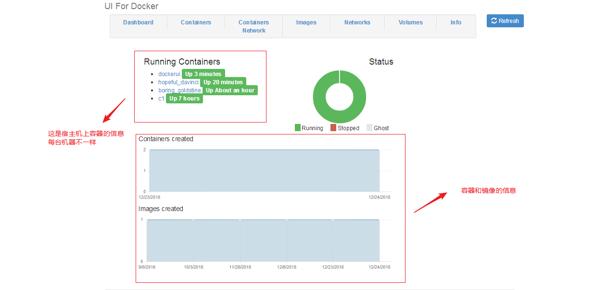

## portainer

第一步：拉取 portainer 镜像

```shell
docker# docker pull portainer/portainer
```

第二步：运行容器

注意：需要将 Docker 宿主机的 `/var/run/docker.sock`与容器的 `/var/run/docker.sock`对应，才能管理

```shell
docker# docker run -d -p 9001:9000 --name=portainer -v /var/run/docker.sock:/var/run/docker.sock portainer/portainer
docker# lsof -i:9001
```

第三步：使用浏览器访问 http://宿主机 IP:9001

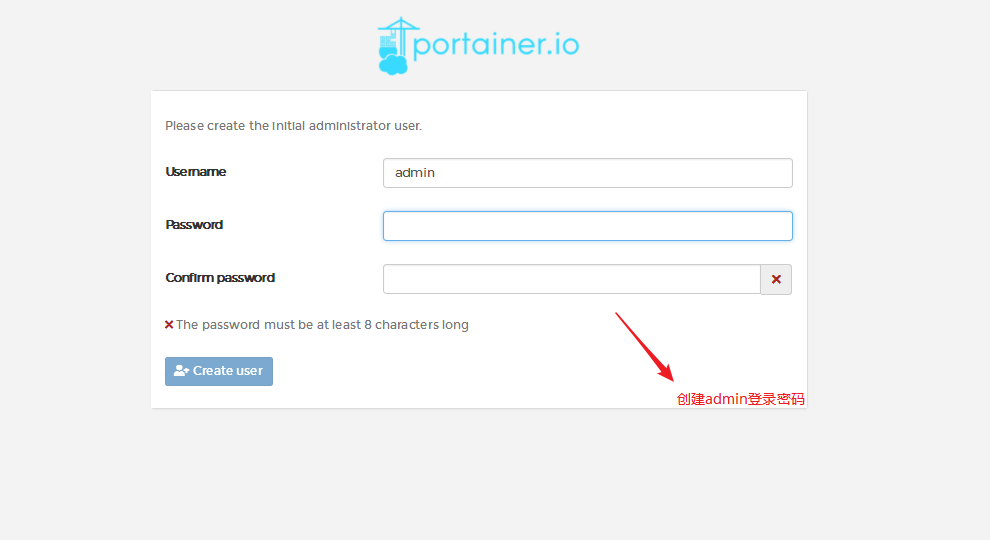

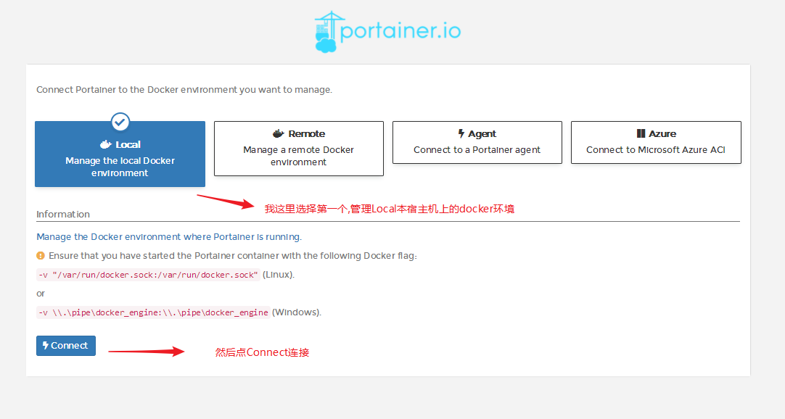

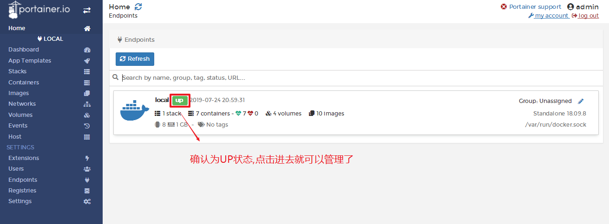


> 更新: 2026-06-13 10:50:45  
> 原文: <https://www.yuque.com/u41736172/az9urv/gkgy2179eyd1ii7n>