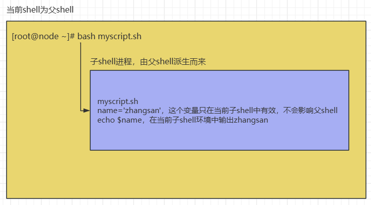
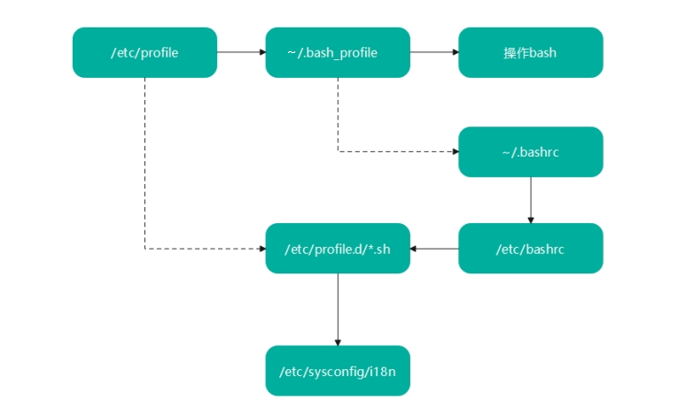
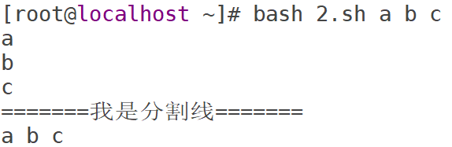
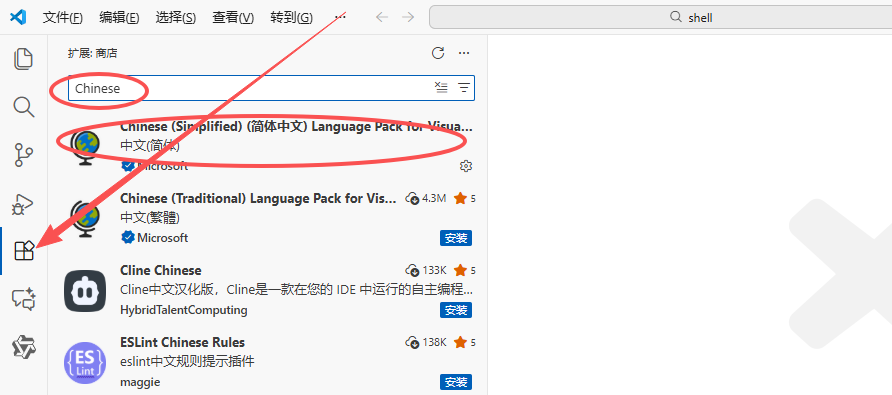
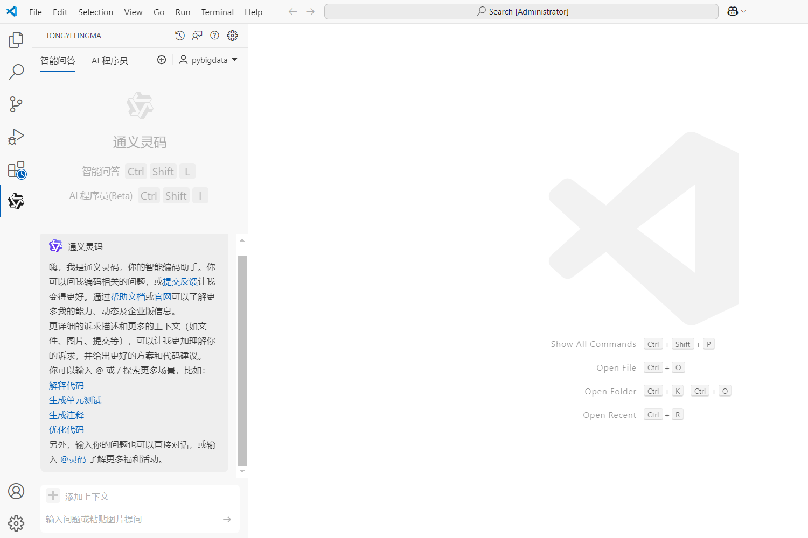
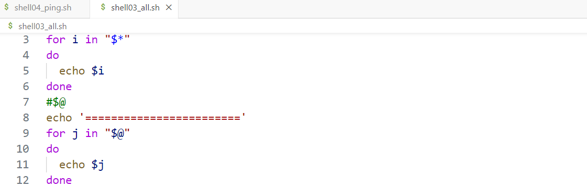

# 01.Shell基础语法

# <font style="color:rgb(51, 51, 51);">一、Shell基础知识</font>

## <font style="color:rgb(51, 51, 51);">Shell概述</font>

<font style="color:rgb(51, 51, 51);">Shell是一个命令解释器，它的作用是</font>**<font style="color:rgb(51, 51, 51);">解释执行用户输入的命令及程序</font>**<font style="color:rgb(51, 51, 51);">，用户每输入一条命令，Shell就解释执行一条。这种从键盘一输入命令，就可以立即得到回应的对话方式，称为</font>**<font style="color:rgb(51, 51, 51);">交互的方式</font>**<font style="color:rgb(51, 51, 51);">。</font>

<font style="color:rgb(51, 51, 51);">Shell存在于操作系统的最外层，负责与用户直接对话，把用户的输入解释给操作系统，并处理各种各样的操作系统的输出结果，然后输出到屏幕返回给用户。输入系统用户名和密码并登录到Linux后的所有操作都是由Shell解释与执行的。</font>


<font style="color:rgb(51, 51, 51);">当命令或程序语句不在命令行下执行，而是通过一个程序文件来执行时，该程序就被称为</font>**<font style="color:rgb(51, 51, 51);">Shell脚本</font>**<font style="color:rgb(51, 51, 51);">。如果在Shell脚本里内置了很多条命令、语句及循环控制，然后将这些命令一次性执行完毕，这种通过文件执行脚本的方式称为</font>**<font style="color:rgb(51, 51, 51);">非交互的方式</font>**<font style="color:rgb(51, 51, 51);">。</font>

<font style="color:rgb(51, 51, 51);">Shell脚本类似于DOS系统下的批处理程序（早期扩展名为.bat），用户可以在Shell脚本中敲入一系列命令及命令语句组合。这些命令、变量和流程控制语句等有机的结合起来，就形成了强大的Shell脚本。</font>

<font style="color:rgb(51, 51, 51);"></font>

**<font style="color:rgb(51, 51, 51);">Shell应用场景：</font>**

<font style="color:rgb(51, 51, 51);">① 简化传统运维流程</font>

<font style="color:rgb(51, 51, 51);">② 编写日常巡检脚本</font>

<font style="color:rgb(51, 51, 51);">③ 软件安装配置流程化</font>

<font style="color:rgb(51, 51, 51);">④ 方便进行日志分析与处理 => 软件日志 => 系统日志</font><code><font style="color:rgb(51, 51, 51);">/var/log</font></code>

<font style="color:rgb(51, 51, 51);"></font>

<font style="color:rgb(51, 51, 51);">案例：入门案例</font>

```shell
# vim message.sh
#!/bin/bash
cd /var/log
cat /dev/null > messages
echo "Log cleaned up."

# /bin/bash message.sh
或者（因为环境变量中配置了/bin目录，所以可以不用写完整的路径）
# bash message.sh
```

<font style="color:rgb(51, 51, 51);">代码解析：</font>

```shell
#!/bin/bash代表声明Shell解析器（代表将来下方代码默认会调用/bin/bash进行解析）
cd切换目录
/dev/null空设备，读取里面的内容，重定向到某个文件，代表对文件进行清空操作
echo输出
```

## <font style="color:rgb(51, 51, 51);">Shell编程中的变量</font>

<font style="color:rgb(51, 51, 51);">作用：在Shell脚本程序中，某个内容需要被重复多次执行。有两种实现方式：</font>

<font style="color:rgb(51, 51, 51);">① 每次执行时，把这块内容重新编写一遍</font>

<font style="color:rgb(51, 51, 51);">② 可以把这块内容定义为一个变量，不需要重复编写，用到只要使用变量的名称即可。</font>

<code><font style="color:rgb(51, 51, 51);">path="/var/log"</font></code>

<code><font style="color:rgb(51, 51, 51);">$path</font></code><font style="color:rgb(51, 51, 51);">可以反复引用</font><code><font style="color:rgb(51, 51, 51);">/var/log</font></code><font style="color:rgb(51, 51, 51);">路径！！！</font>

> <font style="color:rgb(119, 119, 119);">变量是Shell程序编写的最小单元，作用：可以用于简化重复性的操作！！！</font>

<font style="color:rgb(51, 51, 51);">① 变量是存储数据的容器</font>

<font style="color:rgb(51, 51, 51);">② 变量中存储的数据是临时的（shell脚本执行过程中有效，shell脚本结束，变量也会随之失效）</font>

<font style="color:rgb(51, 51, 51);">③ 变量在程序运行过程中是可以发生变化的</font>

<font style="color:rgb(51, 51, 51);"></font>

**<font style="color:rgb(51, 51, 51);">基本语法：</font>**

```shell
变量名=变量的值

使用变量：
$变量名
```

<font style="color:rgb(51, 51, 51);">注意：=日常生活中叫做等号，但是我们脚本中，将其称之为</font>**<font style="color:rgb(51, 51, 51);">赋值运算符</font>**<font style="color:rgb(51, 51, 51);">；执行顺序从右向左执行</font>

<font style="color:rgb(51, 51, 51);">示例代码：</font>

```shell
# name='zhangsan'
# echo $name
Shift + 4 = $
```

> <font style="color:rgb(119, 119, 119);">注意事项：</font>**<font style="color:rgb(119, 119, 119);">=等号两边不能有空格</font>**<font style="color:rgb(119, 119, 119);">。变量名可以自定义，但是要满足一定的命名规则。</font>

<font style="color:rgb(51, 51, 51);">总结：</font>

<font style="color:rgb(51, 51, 51);">变量核心作用？存储数据，如果在shell脚本中，某个数据需要被重复使用就可以使用变量！</font>

<font style="color:rgb(51, 51, 51);">变量有三句话：① 变量是存储数据的容器 ② 变量中存储的数据是临时的 ③ 变量中存储的数据可以发生变化</font>

## <font style="color:rgb(51, 51, 51);">变量的命名规则</font>

<font style="color:rgb(51, 51, 51);">作用：指导我们如何定义变量的名称！！！</font>

<font style="color:rgb(51, 51, 51);">变量名称只能由</font>**<font style="color:rgb(51, 51, 51);">字母、数字或下划线</font>**<font style="color:rgb(51, 51, 51);">组成 => a-zA-Z、0-9、\_</font>

<font style="color:rgb(51, 51, 51);">不能以</font>**<font style="color:rgb(51, 51, 51);">数字</font>**<font style="color:rgb(51, 51, 51);">开头</font>

<font style="color:rgb(51, 51, 51);">严格</font>**<font style="color:rgb(51, 51, 51);">区分大小写</font>**<font style="color:rgb(51, 51, 51);"></font>

<font style="color:rgb(51, 51, 51);">不能使用Shell中保留的关键字 => test、if、for</font>

<font style="color:rgb(51, 51, 51);"></font>

<font style="color:rgb(51, 51, 51);">判断题：</font>

<font style="color:rgb(51, 51, 51);">① </font><code><font style="color:rgb(51, 51, 51);background-color:rgb(243, 244, 244);">$1</font></code><font style="color:rgb(51, 51, 51);"> 是一个合法的Shell变量名，对么？（错误）</font>

<font style="color:rgb(51, 51, 51);">② </font><code><font style="color:rgb(51, 51, 51);background-color:rgb(243, 244, 244);">my_var</font></code><font style="color:rgb(51, 51, 51);"> 是一个合法的Shell变量名，对么？（正确）</font>

<font style="color:rgb(51, 51, 51);">③ </font><code><font style="color:rgb(51, 51, 51);background-color:rgb(243, 244, 244);">2nd_var</font></code><font style="color:rgb(51, 51, 51);"> 是一个合法的Shell变量名，对么？（错误）</font>

<font style="color:rgb(51, 51, 51);">④ </font><code><font style="color:rgb(51, 51, 51);background-color:rgb(243, 244, 244);">MY-VAR</font></code><font style="color:rgb(51, 51, 51);"> 是一个合法的Shell变量名，对么？（错误）</font>

<font style="color:rgb(51, 51, 51);"></font>

<font style="color:rgb(51, 51, 51);">总结：</font>

<font style="color:rgb(51, 51, 51);">变量的命名规则，变量不能随意命名，只能是字母 + 数字 + 下划线组成，不能以数字开头，区分大小写</font>

<font style="color:rgb(51, 51, 51);">建议使用英文单词或者拼音作为变量名称</font>

<font style="color:rgb(51, 51, 51);">name="Tom"</font>

<font style="color:rgb(51, 51, 51);">age=23</font>

<font style="color:rgb(51, 51, 51);">address="郑州市"</font>

## <font style="color:rgb(51, 51, 51);">变量的种类</font>

<font style="color:rgb(51, 51, 51);">变量可以分为两大类：</font>**<font style="color:rgb(51, 51, 51);">局部变量</font>**<font style="color:rgb(51, 51, 51);"> 与 </font>**<font style="color:rgb(51, 51, 51);">环境变量</font>**<font style="color:rgb(51, 51, 51);">（全局变量）</font>

**<font style="color:rgb(51, 51, 51);">局部变量</font>**<font style="color:rgb(51, 51, 51);">，只能在创建它们的Shell函数或Shell脚本中使用。一般由开发者在开发脚本程序时创建。</font>

<code><font style="color:rgb(51, 51, 51);">name="zhangsan"</font></code>

**<font style="color:rgb(51, 51, 51);">环境变量</font>**<font style="color:rgb(51, 51, 51);">，可以在创建它们的Shell及其派生出来的任意子进程Shell中使用，环境变量又可以分为自定义环境变量和bash内置的环境变量。</font>

<code><font style="color:rgb(51, 51, 51);">export 变量名称=变量的值</font></code><font style="color:rgb(51, 51, 51);">，注意事项：环境变量，一般官方建议是全大写，如HOME、PATH、MY\_VAR</font>

<font style="color:rgb(51, 51, 51);">疑问：什么是“当前 shell 及其子shell进程”？</font>

:::warning
**<font style="color:rgb(51, 51, 51);">当前 shell</font>**

:::

* <font style="color:rgb(51, 51, 51);">就是你现在打开的终端窗口里运行的 shell。</font>
* <font style="color:rgb(51, 51, 51);">比如你在命令行输入 </font><code><font style="color:rgb(51, 51, 51);background-color:rgb(243, 244, 244);">echo $HOME</font></code><font style="color:rgb(51, 51, 51);">、</font><code><font style="color:rgb(51, 51, 51);background-color:rgb(243, 244, 244);">ls</font></code><font style="color:rgb(51, 51, 51);">，这些命令都在 </font>**<font style="color:rgb(51, 51, 51);">当前 shell</font>**<font style="color:rgb(51, 51, 51);"> 中执行。</font>

:::warning
**<font style="color:rgb(51, 51, 51);">子进程（subprocess）shell</font>**

:::

* <font style="color:rgb(51, 51, 51);">当你在 shell 中运行一个 </font>**<font style="color:rgb(51, 51, 51);">脚本</font>**<font style="color:rgb(51, 51, 51);"> 或调用一个 </font>**<font style="color:rgb(51, 51, 51);">命令</font>**<font style="color:rgb(51, 51, 51);">，它会创建一个新的 shell 进程，这个就叫“子进程”。</font>
* <font style="color:rgb(51, 51, 51);">比如你运行：这个 </font><code><font style="color:rgb(51, 51, 51);background-color:rgb(243, 244, 244);">bash</font></code><font style="color:rgb(51, 51, 51);"> 就是一个新的子 shell（子进程）。</font>

`bash myscript.sh`

<font style="color:rgb(51, 51, 51);">父子shell效果图：</font>



<font style="color:rgb(51, 51, 51);">小结：</font>

<font style="color:rgb(51, 51, 51);">shell脚本中，变量一共有两种：（局部变量） 和 （环境变量）</font>

<font style="color:rgb(51, 51, 51);">局部变量直接定义即可 => 变量名=变量的值</font>

<font style="color:rgb(51, 51, 51);">环境变量需要通过</font><code><font style="color:rgb(51, 51, 51);">export</font></code><font style="color:rgb(51, 51, 51);">定义 =>  </font><code><font style="color:rgb(51, 51, 51);">export 大写变量=变量的值</font></code>

<font style="color:rgb(51, 51, 51);"></font>

> <font style="color:rgb(119, 119, 119);">面试题：shell中局部变量与环境变量有何区别？</font>

<font style="color:rgb(51, 51, 51);">答：</font>

<font style="color:rgb(51, 51, 51);">局部变量只能在函数或者当前shell环境中有效，无法在其派生shell环境中使用</font>

<font style="color:rgb(51, 51, 51);">环境变量既可以在当前shell环境中使用，也可以在其派生的shell环境中使用</font>

## <font style="color:rgb(51, 51, 51);">环境变量</font>

<font style="color:rgb(51, 51, 51);">环境变量是操作系统用来</font>**<font style="color:rgb(51, 51, 51);">存储系统和用户配置信息的变量</font>**<font style="color:rgb(51, 51, 51);">，Shell 和应用程序通过它来获取重要信息，例如当前用户、命令路径、终端类型等。Shell 通过这些变量确保命令能正确执行。</font>

<font style="color:rgb(51, 51, 51);">Java => 运行环境 => JDK</font>

<font style="color:rgb(51, 51, 51);">Java程序运行过程中，可以通过环境变量自动寻找JDK相关信息，方便程序运行</font>

<font style="color:rgb(51, 51, 51);"></font>

<font style="color:rgb(51, 51, 51);">环境变量的特点：</font>

<font style="color:rgb(51, 51, 51);">① 系统全局性：环境变量对所有进程有效，任何程序（如编辑器、Shell 脚本等）都可以使用这些变量。</font>

<font style="color:rgb(51, 51, 51);">② 临时与永久：在命令行中定义的环境变量只在当前会话中有效，一旦退出，变量就会消失。如果希望永久保存，需要将变量添加到特定的配置文件中。=> </font><code><font style="color:rgb(51, 51, 51);">/etc/profile</font></code>

<font style="color:rgb(51, 51, 51);"></font>

<font style="color:rgb(51, 51, 51);">按照系统规范，所有环境变量的名字均采用</font>**<font style="color:rgb(51, 51, 51);">大写</font>**<font style="color:rgb(51, 51, 51);">形式。在将环境变量应用于用户进程程序之前，都应该用export命令导出定义。</font>

<font style="color:rgb(51, 51, 51);">例如：正确的环境变量定义方法为</font><code><font style="color:rgb(51, 51, 51);background-color:rgb(243, 244, 244);">export MYHOME=/home/zhangsan</font></code>

<font style="color:rgb(51, 51, 51);background-color:rgb(243, 244, 244);"></font>

<font style="color:rgb(51, 51, 51);">有一些环境变量，比如 </font><code><font style="color:rgb(51, 51, 51);background-color:rgb(243, 244, 244);">HOME</font></code><font style="color:rgb(51, 51, 51);">（用户家目录）、</font><code><font style="color:rgb(51, 51, 51);background-color:rgb(243, 244, 244);">PATH</font></code><font style="color:rgb(51, 51, 51);">（环境变量中包含的路径）、</font><code><font style="color:rgb(51, 51, 51);background-color:rgb(243, 244, 244);">SHELL</font></code><font style="color:rgb(51, 51, 51);">（Shell 类型）、</font><code><font style="color:rgb(51, 51, 51);background-color:rgb(243, 244, 244);">USER</font></code><font style="color:rgb(51, 51, 51);">（用户名）、</font><code><font style="color:rgb(51, 51, 51);background-color:rgb(243, 244, 244);">PWD</font></code><font style="color:rgb(51, 51, 51);">（当前工作目录）等，这些变量在用户登录时由系统自动设置。</font>

<font style="color:rgb(51, 51, 51);"></font>

<font style="color:rgb(51, 51, 51);">如果想要设置环境变量，就要在给变量赋值之后或在设置变量时使用export命令，如下图所示：</font>

```shell
export 变量名=变量的值
变量名=变量的值; export 变量名
```

<font style="color:rgb(51, 51, 51);">除了export命令，我们还可以使用</font><code><font style="color:rgb(51, 51, 51);">declare –x</font></code><font style="color:rgb(51, 51, 51);">完成同样的功能。</font>

```shell
declare –x 变量名=变量的值
```

> <font style="color:rgb(119, 119, 119);">注意：以上设置请不要在变量名前面添加$符号</font>

<font style="color:rgb(119, 119, 119);"></font>

**<font style="color:rgb(51, 51, 51);">☆ 临时设置环境变量</font>**<font style="color:rgb(51, 51, 51);">：可以在命令行中直接设置，但退出会话后会丢失。</font>

```shell
export MYHOME=/home/zhangsan
```

<font style="color:rgb(51, 51, 51);">扩展：环境变量不仅可以在当前shell环境中使用，还可以在派生的子shell环境中使用</font>

```shell
# 当前环境
echo $MYHOME

# 派生环境（子Shell环境）
bash -c 'echo $MYHOME'

注：在Shell脚本中，单引号和双引号是有区别的，以上案例只能使用单引号！！！
```

**<font style="color:rgb(51, 51, 51);">☆ 永久设置环境变量</font>**<font style="color:rgb(51, 51, 51);">：如果希望变量在每次登录时都有效，需要将其添加到配置文件中：</font>

```shell
用户级别：~/.bash_profile 或 ~/.bashrc
```

```shell
系统级别：/etc/profile 或 /etc/bashrc
注意：如果在以上文件中添加了环境变量，一定要记得通过source /etc/profile或者source /etc/bashrc重新加载，让环境变量生效
```

<font style="color:rgb(51, 51, 51);">问题：以上文件为什么还要强调</font><code><font style="color:rgb(51, 51, 51);background-color:rgb(243, 244, 244);">用户级别</font></code><font style="color:rgb(51, 51, 51);">与</font><code><font style="color:rgb(51, 51, 51);background-color:rgb(243, 244, 244);">系统级别</font></code><font style="color:rgb(51, 51, 51);">?</font>

<font style="color:rgb(51, 51, 51);">答：</font>

<font style="color:rgb(51, 51, 51);">用户级别的文件，只针对当前登录账号有效。比如你在root账号下进行设置，这个环境变量只针对root账号有效，其他账号，无法读取这个环境变量。</font>

<font style="color:rgb(51, 51, 51);">系统级别的文件，不仅针对当前账号有效，还针对所有系统账号都有效！</font>

<font style="color:rgb(51, 51, 51);">所有环境变量名称通常采用大写字母，且必须使用 </font><code><font style="color:rgb(51, 51, 51);background-color:rgb(243, 244, 244);">export</font></code><font style="color:rgb(51, 51, 51);"> 命令导出，才能让其对子进程有效。</font>

<font style="color:rgb(51, 51, 51);"></font>

<font style="color:rgb(51, 51, 51);">总结：</font>

<font style="color:rgb(51, 51, 51);">在Shell脚本编程中，变量一共分为（环境变量）和（普通变量/局部变量）？</font>

<font style="color:rgb(51, 51, 51);">环境变量在定义时，建议变量名称（全大写）</font>

<font style="color:rgb(51, 51, 51);">配置环境变量时，如果在命名行通过export定义，是临时的还是永久的？临时的</font>

<font style="color:rgb(51, 51, 51);">如果想配置为永久，可以放置在哪些文件？(</font><code><font style="color:rgb(51, 51, 51);background-color:rgb(243, 244, 244);">/etc/profile</font></code><font style="color:rgb(51, 51, 51);">、</font><code><font style="color:rgb(51, 51, 51);background-color:rgb(243, 244, 244);">/etc/bashrc</font></code><font style="color:rgb(51, 51, 51);">、</font><code><font style="color:rgb(51, 51, 51);background-color:rgb(243, 244, 244);">~/.bash_profile</font></code><font style="color:rgb(51, 51, 51);">或</font><code><font style="color:rgb(51, 51, 51);background-color:rgb(243, 244, 244);">~/.bashrc</font></code><font style="color:rgb(51, 51, 51);">)</font>

## <font style="color:rgb(51, 51, 51);">案例：生产环境下JDK环境变量的配置</font>

<font style="color:rgb(51, 51, 51);">JDK作用：解析与运行Java程序，所有Java程序（Tomcat、MyCAT）=> 环境变量中寻找JDK => JDK</font>

<font style="color:rgb(51, 51, 51);">JAVA\_HOME、PATH、CLASSPATH（Java依赖库、依赖包）</font>

<font style="color:rgb(51, 51, 51);"></font>

<font style="color:rgb(51, 51, 51);">回顾rpm命令：离线安装、卸载</font>

<font style="color:rgb(51, 51, 51);">搜索软件</font>

```shell
# rpm  -qa | grep java
-q ：query查询
-a ：all所有
```

<font style="color:rgb(51, 51, 51);">安装软件</font>

```shell
# rpm -ivh xxx.rpm
-i ：install安装
-vh：显示安装进度
```

<font style="color:rgb(51, 51, 51);">卸载软件</font>

```shell
# rpm -e java-1.8.0-openjdk-headless-1.8.0.362.b09-4.el9.x86_64
-e：普通卸载
--nodeps：强制卸载（有风险）
```

<font style="color:rgb(51, 51, 51);">传统配置(一步一步操作)</font>

```shell
# 清理系统自带JDK环境
# rpm -evh java-1.8.0-openjdk-headless-1.8.0.362.b09-4.el9.x86_64 --nodeps

# 上传压缩包到Linux
# 创建工作目录并解压jdk
# mkdir -p /export/server
# tar -xf jdk-8u221-linux-x64.tar.gz -C /export/server

# 配置环境变量
# vim /etc/profile
export JAVA_HOME=/export/server/jdk1.8.0_221
export PATH=$PATH:$JAVA_HOME/bin
export CLASSPATH=.:$JAVA_HOME/lib/dt.jar:$JAVA_HOME/lib/tools.jar

# 让环境变量生效
# source /etc/profile

# 测试JDK的环境变量是否生效了
# java
# javac
# java -version
```

<font style="color:rgb(51, 51, 51);">设置JDK环境变量（Shell脚本方式）</font>

```shell
# vim jdk.sh
#!/bin/bash
#卸载系统自带的JDK
rpm -e java-1.8.0-openjdk-headless-1.8.0.362.b09-4.el9.x86_64 --nodeps
#创建目录
mkdir -p /export/server
#对JDK软件包解压
tar -xf jdk-8u221-linux-x64.tar.gz -C /export/server
#配置JDK环境变量 => 把配置信息 => /etc/profile
echo 'export JAVA_HOME=/export/server/jdk1.8.0_221' >> /etc/profile
echo 'export PATH=$PATH:$JAVA_HOME/bin' >> /etc/profile
echo 'export CLASSPATH=.:$JAVA_HOME/lib/dt.jar:$JAVA_HOME/lib/tools.jar' >> /etc/profile
#刷新/etc/profile文件
source /etc/profile
```

<font style="color:rgb(51, 51, 51);">让以上配置立即生效</font>

```shell
# source jdk.sh
```

> <font style="color:rgb(119, 119, 119);">source不同于bash命令，source命令不仅可以让source /etc/profile在派生子shell中执行，也可以让父shell也一起受到影响。记住：只要脚本中有source命令，则脚本执行也需要通过source!!!</font>

<font style="color:rgb(119, 119, 119);"></font>

<font style="color:rgb(51, 51, 51);">验证JDK是否配置成功</font>

```shell
# java -version
```

> 注意：如果Shell脚本中包含source命令，则脚本的执行必须采用`source 脚本名称.sh`

<font style="color:rgb(51, 51, 51);">扩展：shell脚本在执行过程中，如果遇到报错，代码是否会往下继续执行？</font>

<font style="color:rgb(51, 51, 51);">答：会！！！</font>

## <font style="color:rgb(51, 51, 51);">显示与删除环境变量</font>

```shell
# echo $HOME  		# 用户的家目录
# echo $UID       # 当前用户的UID，相当于id –u
# echo $PWD    	  # 当前工作目录的绝对路径名
# echo $SHELL   	# 当前SHELL
# echo $USER   		# 当前用户
```

<font style="color:rgb(51, 51, 51);">用env（printenv）显示所有环境变量：environment-环境</font>

```shell
# env
```

<font style="color:rgb(51, 51, 51);">显示环境变量</font>

```shell
# echo $USER
root
```

<font style="color:rgb(51, 51, 51);">用unset消除局部变量和环境变量</font>

```shell
# unset USER
# echo $USER
```

> <font style="color:rgb(119, 119, 119);">unset移除变量时，不需要添加$美元符号，直接使用变量名称即可</font>

<font style="color:rgb(119, 119, 119);"></font>

<font style="color:rgb(51, 51, 51);">总结：</font>

<font style="color:rgb(51, 51, 51);">获取变量信息 => （echo $变量名称）=> 还可以通过env指令获取所有环境变量</font>

<font style="color:rgb(51, 51, 51);">移除/消除某个变量 => （unset 变量名称）</font>

## <font style="color:rgb(51, 51, 51);">环境变量初始化与对应文件的生效顺序(了解)</font>

<font style="color:rgb(51, 51, 51);">环境变量一共有4个文件：</font><code><font style="color:rgb(51, 51, 51);">/etc/profile</font></code><font style="color:rgb(51, 51, 51);">、</font><code><font style="color:rgb(51, 51, 51);">/etc/bashrc</font></code><font style="color:rgb(51, 51, 51);">、</font><code><font style="color:rgb(51, 51, 51);">~/.bash_profile</font></code><font style="color:rgb(51, 51, 51);">、</font><code><font style="color:rgb(51, 51, 51);">~/.bashrc</font></code>

<font style="color:rgb(51, 51, 51);">本节目标：理解它们之间的关系（谁先加载谁后加载）</font>

<font style="color:rgb(51, 51, 51);"></font>

<font style="color:rgb(51, 51, 51);">理解的设置。这些文件可统称为系统环境文件。bash检查的环境变量文件的情况取决于系统运行Shell的方式。系统运行Shell的方式一般有3种：</font>

<font style="color:rgb(51, 51, 51);">① 通过系统用户登录后默认运行的Shell（/bin/bash）</font>

<font style="color:rgb(51, 51, 51);">② 非登录交互式运行Shell => 直接输入bash指令</font>

<font style="color:rgb(51, 51, 51);">③ 执行脚本运行非交互式Shell</font>

<font style="color:rgb(51, 51, 51);"></font>

<font style="color:rgb(51, 51, 51);">当用户登录Linux系统时，Shell会作为登录Shell启动。</font>

<font style="color:rgb(51, 51, 51);">此时登录Shell加载环境变量顺序：</font>



<font style="color:rgb(51, 51, 51);">用户登录系统后首先会加载/etc/profile全局环境变量文件，这是Linux系统上默认的Shell主环境变量文件。系统上每个用户登录都会加载这个文件。</font>

<font style="color:rgb(51, 51, 51);">当加载完/etc/profile文件后，才会执行/etc/profile.d 目录下的脚本文件，这个目录下的脚本文件有很多，例如：系统的字符集设置(/etc/sysconfig/i18n) 等。</font>

<font style="color:rgb(51, 51, 51);">之后开始运行$HOME/.bash\_profile (用户环境变量文件)，在这个文件中，又会去找$HOME/.bashrc</font>

<font style="color:rgb(51, 51, 51);">(用户环境变量文件)，如果有，则执行，如果没有，则不执行。在$HOME/.bashrc 文件中又会去 找/etc/bashrc (全局环境变量文件)，如果有，则执行，如果没有，则不执行。</font>

## <font style="color:rgb(51, 51, 51);">案例：Shell设置登陆提示的两种方式(了解)</font>

<font style="color:rgb(51, 51, 51);">第一种方式是在</font><code><font style="color:rgb(51, 51, 51);">/etc/motd</font></code><font style="color:rgb(51, 51, 51);">里增加提示的字符串，如下：</font>

```shell
# vim /etc/motd   # 文件里仅为字符串内容
welcome to use linux shell.
```

<font style="color:rgb(51, 51, 51);">第二种方式是在</font><code><font style="color:rgb(51, 51, 51);">/etc/profile.d/</font></code><font style="color:rgb(51, 51, 51);">下面增加如下脚本：</font>

```shell
# vim /etc/profile.d/myshell.sh  # myshell.sh为此目录下的脚本文件
echo 'welcome to use linux shell.'
```

> <font style="color:rgb(119, 119, 119);">注意事项：若要在登陆后初始化或显示加载内容，则把脚本文件放在/etc/profile.d/下即可（无须加执行权限）</font>
>
> <font style="color:rgb(51, 51, 51);">注：以上操作设置完毕后，都需要重新创建ssh连接，否则无法直接看到效果！</font>

## <font style="color:rgb(51, 51, 51);">单引号与双引号的区别（面试）</font>

<font style="color:rgb(51, 51, 51);">在定义文本（字符串）时，单引号和双引号效果一致的，但是如果定义的文本内容中存在变量时。两者有所不同：</font>

<font style="color:rgb(51, 51, 51);">① 单引号中的变量无法解析，系统会原样输出（把变量当做一个文本信息）</font>

<font style="color:rgb(51, 51, 51);">② 双引号中的变量是可以正常解析的，系统会把变量先翻译为对应的内容，然后进行显示</font>

<font style="color:rgb(51, 51, 51);"></font>

<font style="color:rgb(51, 51, 51);">变量定义时，变量的内容可以用单引号或双引号引起来，也可以不加引号。</font>

```shell
a=192.168.88.100
b='192.168.88.100'
c="192.168.88.100"

echo "a=$a"
echo "b=$b"
echo "c=${c}"
```

<font style="color:rgb(51, 51, 51);">结论：针对字符串类型的数据，是否添加引号，其效果完全一样！</font>

<font style="color:rgb(51, 51, 51);"></font>

```shell
a=192.168.88.200
b='192.168.88.200'
c="192.168.88.200"

a=192.168.88.100-$a
b='192.168.88.100-$b'
c="192.168.88.100-$c"

echo "a=$a"
echo "b=$b"
echo "c=${c}"
```

<font style="color:rgb(51, 51, 51);">结论：</font>

<font style="color:rgb(51, 51, 51);">① 第一种形式，变量$a可以正常解析</font>

<font style="color:rgb(51, 51, 51);">② 第二种形式，单引号中的变量无法正常解析，而是原样输出</font>

<font style="color:rgb(51, 51, 51);">③ 第三种形式，双引号中的变量可以正常解析</font>

> <font style="color:rgb(119, 119, 119);">注：数字内容的变量定义可以不加引号，其他没有特别要求的字符串等定义最好都加上双引号，如果真的需要原样输出就加单引号，定义变量加双引号是最常见的使用场景。</font>

## <font style="color:rgb(51, 51, 51);">把命令执行结果赋值给变量</font>

<font style="color:rgb(51, 51, 51);">把一个命令的结果作为变量的内容赋值的方法 => 变量=数字/字符串，我们还可以把命令的执行结果赋值给变量</font>

<font style="color:rgb(51, 51, 51);">对需要获取命令结果的变量内容赋值的常见方法有两种：</font>

```shell
变量名=`ls`   # ``反撇号
变量名=$(ls)   # $(命令)
```

<font style="color:rgb(51, 51, 51);">案例演示：</font>

```shell
CMD1=`ls`
echo $CMD

CMD2=$(pwd)
echo $CMD2

CMD3=$(date +%F)
echo $CMD3

%F：年-月-日
%Y-%m-%d：年-月-日
```

<font style="color:rgb(51, 51, 51);">小结：</font>

<font style="color:rgb(51, 51, 51);">可以把命令的执行结果赋值给变量： </font>

<font style="color:rgb(51, 51, 51);">变量=</font><font style="color:rgb(51, 51, 51);"><code></font><font style="color:rgb(51, 51, 51);">命令</font><font style="color:rgb(51, 51, 51);"></code></font>

<font style="color:rgb(51, 51, 51);">变量=$(命令)</font>

## <font style="color:rgb(51, 51, 51);">Shell中特殊且重要的内置变量（面试）</font>

<font style="color:rgb(51, 51, 51);">在Shell中存在一些特殊且重要的变量，例如$0、$1、$#，我们称之为特殊位置参数变量。要从命令行、函数或脚本执行等处传递参数时，就需要在Shell脚本中使用位置参数变量。</font>

| **<font style="color:rgb(51, 51, 51);">变量</font>** | **<font style="color:rgb(51, 51, 51);">含义</font>** |
| :--- | :--- |
| <font style="color:rgb(51, 51, 51);">$0</font> | <font style="color:rgb(51, 51, 51);">当前脚本的文件名。</font> |
| <font style="color:rgb(51, 51, 51);">$n（n≥1）</font> | <font style="color:rgb(51, 51, 51);">传递给脚本或函数的参数。n 是一个数字，表示第几个参数。例如，第一个参数是 $1，第二个参数是 $2。</font> |
| <font style="color:rgb(51, 51, 51);">$#</font> | <font style="color:rgb(51, 51, 51);">传递给脚本或函数的参数个数。</font> |
| <font style="color:rgb(51, 51, 51);">$\*</font> | <font style="color:rgb(51, 51, 51);">传递给脚本或函数的所有参数，参数是一个整体，每一个变量参数之间以空格隔开。</font> |
| <font style="color:rgb(51, 51, 51);">$@</font> | <font style="color:rgb(51, 51, 51);">传递给脚本或函数的所有参数。参数是独立的，也是全部输出</font> |
| <font style="color:rgb(51, 51, 51);">$?（重要）</font> | <font style="color:rgb(51, 51, 51);">上个命令的退出状态或函数的返回值，执行成功返回0，没有成功则返回非0</font> |
| <font style="color:rgb(51, 51, 51);">$$</font> | <font style="color:rgb(51, 51, 51);">当前 Shell 进程 ID。对于 Shell 脚本，就是这些脚本所在的进程 ID。</font> |
| <font style="color:rgb(51, 51, 51);">$!</font> | <font style="color:rgb(51, 51, 51);">Shell最后运行的</font><code><font style="color:rgb(51, 51, 51);background-color:rgb(243, 244, 244);">后台进程</font></code><font style="color:rgb(51, 51, 51);">的PID</font> |

<font style="color:rgb(51, 51, 51);">说明：由于暂时没有学到后台运行操作，大家可以通过以下方式实现</font>

```shell
# top &
# echo $!
```

<font style="color:rgb(51, 51, 51);">案例演示：</font>

```shell
# cat 1.sh
#!/bin/bash

echo '$0='$0
echo '$1='$1
echo '$2='$2
echo '$3='$3
echo '$#='$#
echo '$*='$*
echo '$@='$@

echo '${11}'${11}
echo '${12}'${12}

执行操作
# bash 1.sh a b c d
说明：a、b、c、d都是外部传入脚本的参数！
```

> <font style="color:rgb(119, 119, 119);">注意：如果想在Shell中输出一些特殊的符号，如$、#、等等，建议使用反斜杠进行转义，就是把这些符号当做一个普通在字符直接输出（不进行系统层面的解析）</font>

<font style="color:rgb(119, 119, 119);"></font>

<font style="color:rgb(51, 51, 51);">案例演示：</font><code><font style="color:rgb(51, 51, 51);">$*</font></code><font style="color:rgb(51, 51, 51);">与</font><code><font style="color:rgb(51, 51, 51);">$@</font></code><font style="color:rgb(51, 51, 51);">区别</font>

```shell
[root@localhost ~]# cat 2.sh
#!/bin/bash
for i in "$@"
do
  echo $i
done

echo "=======我是分割线======="

for i in "$*"
do
  echo $i
done
```

<font style="color:rgb(51, 51, 51);">运行结果：</font>



<font style="color:rgb(51, 51, 51);">总结：</font><code><font style="color:rgb(51, 51, 51);background-color:rgb(243, 244, 244);">$*和$@有何区别</font></code><font style="color:rgb(51, 51, 51);">？</font>

<font style="color:rgb(51, 51, 51);">相同点：都可以用于接收所有的参数</font>

<font style="color:rgb(51, 51, 51);">不同点：</font>

<font style="color:rgb(51, 51, 51);">$\*是把所有参数当做一个整体，参数之间空格隔开</font>

<font style="color:rgb(51, 51, 51);">$@虽然也可以接收所有参数，但是其每个参数保存时依然是独立的</font>

## <font style="color:rgb(51, 51, 51);">Shell运算符</font>

<font style="color:rgb(51, 51, 51);">算术运算：默认情况下，Shell就只能支持简单的整数运算</font>

<font style="color:rgb(51, 51, 51);">+</font><font style="color:rgb(51, 51, 51);">-</font><font style="color:rgb(51, 51, 51);">\*</font><font style="color:rgb(51, 51, 51);"> / %（取模，求余数）</font>

<font style="color:rgb(51, 51, 51);">+</font>

<font style="color:rgb(51, 51, 51);">-</font>

<font style="color:rgb(51, 51, 51);">\*（Shift + 8）</font>

<font style="color:rgb(51, 51, 51);">/</font>

<font style="color:rgb(51, 51, 51);">% ：求余运算（返回除法运算中的余数，取模运算）</font>

<font style="color:rgb(51, 51, 51);">9 % 4 = 1</font>

***

<font style="color:rgb(51, 51, 51);">Bash Shell 的算术运算有四种使用方式:</font>

```plain
① 使用 $(( 表达式 )) => 新版，推荐表达式两边保留一个空格
② 使用$[ 表达式 ]    => 老版，推荐表达式两边保留一个空格
③ 使用 expr 外部程式，乘法、括号需要加反斜杠转义 => expr 1 \* 2 => 注意：运算符两边必须有空格
④ 使用 let 命令，赋值并运算，支持++、--，++在原有变量基础上+1，--在原有变量值基础上减-1
```

<font style="color:rgb(51, 51, 51);">重点记住：$(( 表达式 )) 以及 let 命令即可</font>

<font style="color:rgb(51, 51, 51);"></font>

<font style="color:rgb(51, 51, 51);">案例：</font>

```shell
echo $(( 1+1 ))
echo $(( 2-1 ))
echo $(( 2*3 ))
echo $(( 4/2 ))
echo $(( 9%4 ))
```

<font style="color:rgb(51, 51, 51);">++ 与 -- 运算符：++就是在变量本身+1，--就是在变量本身-1</font>

```shell
i=1
let i++
echo $i
```

```shell
j=1
let ++j
echo $j
```

<font style="color:rgb(51, 51, 51);">++ 或 -- 对表达式的影响：</font>

```shell
unset i j
i=1;j=1
let x=i++     先赋值，再++或-- => echo $x 1
let y=++j     先++或--，再赋值 => echo $y 2
```

<font style="color:rgb(51, 51, 51);">Shell运算符是否能实现小数运算呢？答：默认不可以，但是可以结合bc命令实现。</font>

```shell
echo 1+1.5 | bc
2.5
```

> <font style="color:rgb(119, 119, 119);">注：CentOS Stream 9中没有bc命令，可以通过</font><code><font style="color:rgb(119, 119, 119);background-color:rgb(243, 244, 244);">dnf install bc -y</font></code>

<font style="color:rgb(119, 119, 119);background-color:rgb(243, 244, 244);"></font>

<font style="color:rgb(51, 51, 51);">总结：</font>

<font style="color:rgb(51, 51, 51);">整数运算 => $(()) 或 $\[]，如果有++或--的情况，建议使用</font><code><font style="color:rgb(51, 51, 51);">let</font></code>

<font style="color:rgb(51, 51, 51);">默认不支持小数运算 => </font><code><font style="color:rgb(51, 51, 51);background-color:rgb(243, 244, 244);">dnf install bc -y</font></code><font style="color:rgb(51, 51, 51);"> => </font><code><font style="color:rgb(51, 51, 51);background-color:rgb(243, 244, 244);">echo 1+1.5 | bc</font></code>

# <font style="color:rgb(51, 51, 51);">二、Shell编程小工具（重点）</font>

## <font style="color:rgb(51, 51, 51);">cut工具（重点）</font>

<font style="color:rgb(51, 51, 51);">作用：cut是</font><code><font style="color:rgb(51, 51, 51);background-color:rgb(243, 244, 244);">列</font></code><font style="color:rgb(51, 51, 51);">截取工具，用于列的截取</font>

<font style="color:rgb(51, 51, 51);">语法：</font>

```shell
# cut 选项 文件名
```

<font style="color:rgb(51, 51, 51);">常见选项：</font>

```shell
-c:	以字符为单位进行分割,截取
-d:	自定义分隔符，默认为制表符\t
-f:	与-d一起使用，指定获取哪些列的信息
```

<font style="color:rgb(51, 51, 51);">举例说明:</font>

```shell
# vim 1.txt
1:zhangsan:nan:23:beijing:8000:2000-05-08
2:lisi:nan:22:shanghai:9000:2001-05-10
3:xiaomei:nv:28:tianjin:7000:2000-09-08

# cut -d: -f1 1.txt 			以:冒号分割，截取第1列内容
# cut -d: -f1,6,7 1.txt 	以:冒号分割，截取第1,6,7列内容

# cut -c4 1.txt 				 截取文件中每行第4个字符
# cut -c1-4 1.txt 			   截取文件中每行的1-4个字符
# cut -c4-10 1.txt 			 截取文件中每行的4-10个字符
# cut -c5- 1.txt 				从第5个字符开始截取后面所有字符
```

<font style="color:rgb(51, 51, 51);">案例：</font>

```shell
# cat article.txt
1:Tom:23:Beijing
2:Jack:24:Zhengzhou
3:Rose:25:Shenzhen

按照冒号分割每行，取第2列
# cut -d: -f2 article.txt
Tom
Jack
Rose

按照冒号分割每行，取第2、3列
# cut -d: -f2,3 article.txt
Tom:23
Jack:24
Rose:25

截取每行中第1个字符
# cut -c1 article.txt
1
2
3

截取每行中第2个字符
# cut -c2 article.txt
:
:
:

截取每行中第1到第2个字符
# cut -c1-2 article.txt
1:
2:
3:

截取每行中第3个字符到行尾
# cut -c3- article.txt
Tom:23:Beijing
Jack:24:Zhengzhou
Rose:25:Shenzhen
```

<font style="color:rgb(51, 51, 51);">效果图：</font>


<font style="color:rgb(51, 51, 51);">案例：提取出当前服务器上所有用户的用户名进行权限管理审查，但只需提取 </font><code><font style="color:rgb(51, 51, 51);background-color:rgb(243, 244, 244);">/etc/passwd</font></code><font style="color:rgb(51, 51, 51);"> 文件中的用户名信息，而不需要其他字段。</font>

<font style="color:rgb(51, 51, 51);">解决方案：通过 </font><code><font style="color:rgb(51, 51, 51);background-color:rgb(243, 244, 244);">cut</font></code><font style="color:rgb(51, 51, 51);"> 命令，使用 </font><code><font style="color:rgb(51, 51, 51);background-color:rgb(243, 244, 244);">:</font></code><font style="color:rgb(51, 51, 51);"> 作为分隔符，仅提取用户名列。</font>

```shell
按照冒号分割，取第1列
# cut -d: -f1 /etc/passwd
```

<font style="color:rgb(51, 51, 51);">小结：</font>

<font style="color:rgb(51, 51, 51);">cut作用？用于截取指定列的信息</font>

<font style="color:rgb(51, 51, 51);">-c：字符</font>

<font style="color:rgb(51, 51, 51);">-d、-f：-d指定分隔符，-f指定截取第几列</font>

## <font style="color:rgb(51, 51, 51);">sort工具（重点）</font>

<font style="color:rgb(51, 51, 51);">作用：sort工具用于排序；它将文件的</font>**<font style="color:rgb(51, 51, 51);">每一行作为一个单位</font>**<font style="color:rgb(51, 51, 51);">，从首字符向后，依次</font>**<font style="color:rgb(51, 51, 51);">按ASCII码值</font>**<font style="color:rgb(51, 51, 51);">进行比较，最后将他们按</font>**<font style="color:rgb(51, 51, 51);">升序</font>**<font style="color:rgb(51, 51, 51);">输出。</font>

<font style="color:rgb(51, 51, 51);">数字：0 1 2</font>

<font style="color:rgb(51, 51, 51);">字母：a b c</font>

<code><font style="color:rgb(51, 51, 51);">sort 文件名称</font></code><font style="color:rgb(51, 51, 51);">：默认升序排列</font>

<code><font style="color:rgb(51, 51, 51);">sort -r 文件名称</font></code><font style="color:rgb(51, 51, 51);">：降序排列</font>

<font style="color:rgb(51, 51, 51);">语法和选项：</font><code><font style="color:rgb(51, 51, 51);background-color:rgb(243, 244, 244);">man sort</font></code>

```shell
-u ：uniq去除重复行
-r ：reverse降序排列，默认是升序
-o :  将排序结果输出到文件中,类似重定向符号>
-n ：以数字排序，默认是按字符排序
--------------------------------------------------
-t ：分隔符
-k ：第N列
-R ：Rand随机排序，每次运行的结果均不同
```

<font style="color:rgb(51, 51, 51);">举例说明：</font>

```shell
# sort -n -t: -k3 1.txt 			按照用户的uid进行升序排列
# sort -nr -t: -k3 1.txt 			按照用户的uid进行降序排列
# sort -n 2.txt 						  按照数字排序
# sort -nu 2.txt 					    按照数字排序并去重
# sort -nr 2.txt 						 	按照数字进行降序排列
# sort -nru 2.txt             按照数字进行降序排列并去重
# sort -n 2.txt -o 3.txt 			按照数字排序并将结果重定向到文件
# sort -R 2.txt               随机排序
# sort -u 2.txt 						  去除重复行
```

<font style="color:rgb(51, 51, 51);">案例：</font>

```shell
# cat nums.txt
5
3
6
2
1

# sort -n nums.txt
1
2
3
5
6

# sort -nr nums.txt
6
5
3
2
1
```

<font style="color:rgb(51, 51, 51);">sort作用？就是用于日常排序操作，默认按照字符升序，可以使用（-n）参数按照数字排序？如果想降序，使用（-r）</font>

## <font style="color:rgb(51, 51, 51);">uniq工具（重点）</font>

作用：uniq用于**去除连续的重复行**

<font style="color:rgb(51, 51, 51);">第一种情况：这种情况使用uniq无法去重，因为两个2不是连续的</font>

<font style="color:rgb(51, 51, 51);">1</font>

<font style="color:rgb(51, 51, 51);">2</font>

<font style="color:rgb(51, 51, 51);">3</font>

<font style="color:rgb(51, 51, 51);">2</font>

<font style="color:rgb(51, 51, 51);">第二种情况：这种情况使用uniq可以去重，因为这两个2是连续的</font>

<font style="color:rgb(51, 51, 51);">1</font>

<font style="color:rgb(51, 51, 51);">2</font>

<font style="color:rgb(51, 51, 51);">2</font>

<font style="color:rgb(51, 51, 51);">3</font>

```shell
常见选项：
-i: 忽略大小写，a和A系统会认为是同一个字符
-c: 在每一行的前面显示该行在文件中出现的次数 => 统计这一行出现频率频次 => 词频统计（需要统计某个内容出现频次）
-d: 只显示重复行

举例说明：
# uniq 2.txt 
# uniq -d 2.txt 
# uniq -dc 2.txt 

重点记住-c即可！！！

# cat 3.txt
1
2
2
3
3
4

# uniq 3.txt
1
2
3
4

# uniq -c 3.txt
      1 1
      2 2
      2 3
      1 4
```

**<font style="color:rgb(51, 51, 51);background-color:#FBDE28;">案例：uniq有时经常需要配合sort命令一起使用，很少单独使用！</font>**

```shell
# cat nums.txt
1
2
3
2
6
6

# uniq -c nums.txt
1 1
1 2
1 3
1 2
2 6
      
# uniq -dc nums.txt
2 6
      
# sort -n nums.txt
1
2
2
3
6
6

# sort -n nums.txt |uniq -c
1 1
2 2
1 3
2 6
```

**<font style="color:rgb(51, 51, 51);">案例：</font>**<font style="color:rgb(51, 51, 51);">在 CentOS Stream 9 的服务器上，运维团队检测到多次失败的登录尝试，怀疑存在潜在的恶意入侵。为了提高服务器的安全性，运维团队需要快速找到频繁失败登录的IP地址，以便采取进一步的安全措施（如阻止IP、加强认证机制等）</font>

<font style="color:rgb(51, 51, 51);">第一步：从日志中提取失败登录的IP地址</font>

<font style="color:rgb(51, 51, 51);">使用 </font><code><font style="color:rgb(51, 51, 51);background-color:rgb(243, 244, 244);">grep</font></code><font style="color:rgb(51, 51, 51);"> 查找失败的登录尝试： 登录失败的相关日志通常包含 "Failed password" 关键字。</font>

```shell
# grep "Failed password" /var/log/secure | cut -d ' ' -f 12
```

<font style="color:rgb(51, 51, 51);">这里的 </font><code><font style="color:rgb(51, 51, 51);background-color:rgb(243, 244, 244);">cut -d ' ' -f 12</font></code><font style="color:rgb(51, 51, 51);"> 表示使用空格作为分隔符，提取日志中第12个字段。这个命令将输出所有失败登录的IP地址。</font>

<font style="color:rgb(51, 51, 51);">第二步：统计重复的IP地址</font>

<font style="color:rgb(51, 51, 51);">使用 </font><code><font style="color:rgb(51, 51, 51);background-color:rgb(243, 244, 244);">uniq -c</font></code><font style="color:rgb(51, 51, 51);"> 来统计每个IP地址的出现次数。</font>

```shell
# grep "Failed password" /var/log/secure | cut -d ' ' -f 11 | sort | uniq -c
```

<font style="color:rgb(51, 51, 51);">第三步：按登录失败次数排序</font>

<font style="color:rgb(51, 51, 51);">为了查看哪些IP地址尝试的次数最多，可以使用 </font><code><font style="color:rgb(51, 51, 51);background-color:rgb(243, 244, 244);">sort -nr</font></code><font style="color:rgb(51, 51, 51);"> 来按次数进行降序排序。</font>

```shell
# grep "Failed password" /var/log/secure | cut -d ' ' -f 12 | sort | uniq -c | sort -nr
```

<font style="color:rgb(51, 51, 51);">效果：</font>

```shell
15  192.168.1.100
 8  203.0.113.55
 4  192.168.1.105
```

<font style="color:rgb(51, 51, 51);">小结：</font>

<font style="color:rgb(51, 51, 51);">普及一个知识点：如果ssh连接登录Linux服务器失败了，则所有错误信息都会写入</font><code><font style="color:rgb(51, 51, 51);">/var/log/secure</font></code><font style="color:rgb(51, 51, 51);">日志文件中！！！</font>

```shell
Apr  6 09:42:33 node1 sshd[200007]: Failed password for root from 192.168.88.101 port 34252 ssh2
Apr  6 09:51:10 node1 sshd[203009]: Failed password for root from 192.168.88.102 port 50784 ssh2
```

<font style="color:rgb(51, 51, 51);">第一步：根据关键词Failed password，把所有登录失败行列举出来</font>

<font style="color:rgb(51, 51, 51);">第二步：通过cut命令，只获取ip这一列</font>

<font style="color:rgb(51, 51, 51);">第三步：使用sort排序，然后uniq -c去重并进行词频统计，获取每个IP登录失败的次数</font>

<font style="color:rgb(51, 51, 51);">第四步：把最终结果使用sort进行倒序排列，把登录失败最多的放前面！！！</font>

## <font style="color:rgb(51, 51, 51);">tee工具</font>

<font style="color:rgb(51, 51, 51);">echo，主要用于输出信息到屏幕（标准输出）上</font>

<font style="color:rgb(51, 51, 51);">></font><font style="color:rgb(51, 51, 51);"> 重定向，主要把前面命令的执行结果写入到文件中</font>

<font style="color:rgb(51, 51, 51);">问题：</font>

```shell
echo "hello world" ：只能输出信息到屏幕
echo "hello world" > hello.txt ：不能输出信息到屏幕，只能把输出信息写入到hello.txt
```

<font style="color:rgb(51, 51, 51);">有一个想法：既想把命令的执行结果输出到屏幕，还想把输出信息重定向到某个文件，可不可以实现？</font>

<font style="color:rgb(51, 51, 51);">tee工具是从标准输入读取并写入到标准输出（即屏幕）和文件，即：双向覆盖重定向（屏幕输出|文本输入）</font>

<font style="color:rgb(51, 51, 51);">应用场景：</font>

<font style="color:rgb(51, 51, 51);">① 实时监控并记录 ：可以在执行系统命令时，同时将结果显示在屏幕上和记录到文件中，用于后续分析。</font>

<font style="color:rgb(51, 51, 51);">② 保存日志文件：在执行长时间运行的命令时，可以实时查看输出并保存为日志，方便追踪问题。</font>

<font style="color:rgb(51, 51, 51);">③ 结合管道使用：在复杂的管道命令中，将中间结果保存到文件中，同时继续传递给下一个命令。</font>

```shell
选项：
-a 双向追加重定向
```

<font style="color:rgb(51, 51, 51);">案例1：查看并保存系统状态</font>

```shell
# top -bn 1 | tee system_status.log

注意：运行top 命令一次，输出系统当前的状态后退出，不会进行持续刷新
```

<font style="color:rgb(51, 51, 51);">案例2：将输出追加到文件中</font>

```shell
# echo "hello world" | tee -a log.txt
```

<font style="color:rgb(51, 51, 51);">总结：</font>

<font style="color:rgb(51, 51, 51);">双向操作：① 打印输出到屏幕 ② 把执行结果覆盖/追加到指定文件中</font>

## <font style="color:rgb(51, 51, 51);">diff工具</font>

<code>**<font style="color:rgb(51, 51, 51);background-color:rgb(243, 244, 244);">diff</font>**</code><font style="color:rgb(51, 51, 51);"> 是 Linux 中用于比较两个文件或目录内容的工具。它逐行比较文件内容，并输出文件之间的差异，帮助用户识别两个文件在何处不同。</font><code><font style="color:rgb(51, 51, 51);background-color:rgb(243, 244, 244);">diff</font></code><font style="color:rgb(51, 51, 51);"> 主要用于文件比较和合并，可以生成补丁文件，以便在需要时将一个文件的修改应用到另一个文件上。</font>

<font style="color:rgb(51, 51, 51);">基本语法：</font>

```shell
diff [选项] 文件1 文件2
```

<font style="color:rgb(51, 51, 51);">默认情况下，</font><code><font style="color:rgb(51, 51, 51);background-color:rgb(243, 244, 244);">diff</font></code><font style="color:rgb(51, 51, 51);"> 的输出格式为 </font>**<font style="color:rgb(51, 51, 51);">正常格式</font>**<font style="color:rgb(51, 51, 51);">，其符号含义如下：</font>

* <code><font style="color:rgb(51, 51, 51);background-color:rgb(243, 244, 244);"><</font></code><font style="color:rgb(51, 51, 51);"> 表示</font>**<font style="color:rgb(51, 51, 51);">文件1</font>**<font style="color:rgb(51, 51, 51);">中的内容</font>
* <code><font style="color:rgb(51, 51, 51);background-color:rgb(243, 244, 244);">></font></code><font style="color:rgb(51, 51, 51);"> 表示</font>**<font style="color:rgb(51, 51, 51);">文件2</font>**<font style="color:rgb(51, 51, 51);">中的内容</font>
* **<font style="color:rgb(51, 51, 51);">c</font>**<font style="color:rgb(51, 51, 51);"> 表示修改（change）</font>
* **<font style="color:rgb(51, 51, 51);">a</font>**<font style="color:rgb(51, 51, 51);"> 表示增加（add）</font>
* **<font style="color:rgb(51, 51, 51);">d</font>**<font style="color:rgb(51, 51, 51);"> 表示删除（delete）</font>

<font style="color:rgb(51, 51, 51);">案例1：比较file1.txt 和 file2.txt文件区别</font>

```shell
# diff file1.txt file2.txt
2c2
备注说明：
2左边文件行号
c（change）修改
2右边文件的行号
```

<font style="color:rgb(51, 51, 51);">案例2：比较dir1 和 dir2目录区别</font>

<code><font style="color:rgb(51, 51, 51);background-color:rgb(243, 244, 244);">diff</font></code><font style="color:rgb(51, 51, 51);"> 也可以用于比较两个目录中的文件差异，默认会递归地比较子目录。</font>

```shell
# diff -r dir1 dir2
选项：-r选项代表递归操作
```

<font style="color:rgb(51, 51, 51);">案例3：生成补丁文件（保证两个文件内容高度一致）</font>

<font style="color:rgb(51, 51, 51);">通过 </font><code><font style="color:rgb(51, 51, 51);background-color:rgb(243, 244, 244);">diff</font></code><font style="color:rgb(51, 51, 51);"> 的统一格式，可以生成补丁文件，之后可以通过 </font><code><font style="color:rgb(51, 51, 51);background-color:rgb(243, 244, 244);">patch</font></code><font style="color:rgb(51, 51, 51);"> 命令应用补丁。</font>

```shell
# diff -u original_file.txt modified_file.txt > changes.patch
```

<font style="color:rgb(51, 51, 51);">生成的 </font><code><font style="color:rgb(51, 51, 51);background-color:rgb(243, 244, 244);">changes.patch</font></code><font style="color:rgb(51, 51, 51);"> 文件包含了所有差异。可以通过 </font><code><font style="color:rgb(51, 51, 51);background-color:rgb(243, 244, 244);">patch</font></code><font style="color:rgb(51, 51, 51);"> 命令将补丁应用到原始文件：</font>

```shell
# patch original_file.txt < changes.patch
选项：-u选项以统一模式显示差异，这种格式在创建补丁时常用
```

<font style="color:rgb(51, 51, 51);">小结：</font>

<font style="color:rgb(51, 51, 51);">diff工具主要用于（文件）和（目录） 差异比较？</font>

<font style="color:rgb(51, 51, 51);">我们还可以借助于diff补丁功能，保证两个文件内容的高度一致！</font>

## <font style="color:rgb(51, 51, 51);">paste工具</font>

<font style="color:rgb(51, 51, 51);">作用：</font><code>**<font style="color:rgb(51, 51, 51);background-color:rgb(243, 244, 244);">paste</font>**</code><font style="color:rgb(51, 51, 51);"> 是 Linux 中用于</font>**<font style="color:rgb(51, 51, 51);">逐行合并文件</font>**<font style="color:rgb(51, 51, 51);">的命令行工具。它能够将多个文件的内容按行拼接，输出到标准输出或另一个文件中。与 </font><code><font style="color:rgb(51, 51, 51);background-color:rgb(243, 244, 244);">cat</font></code><font style="color:rgb(51, 51, 51);"> 不同，</font><code><font style="color:rgb(51, 51, 51);background-color:rgb(243, 244, 244);">paste</font></code><font style="color:rgb(51, 51, 51);"> 是将每个文件中的行拼接在一起，而不是逐文件合并。</font>

<font style="color:rgb(51, 51, 51);">一般用于多日志合并分析</font>

```shell
常用选项：
-d：delimiter，自定义间隔符，默认是tab
-s：串行处理，非并行
```

<font style="color:rgb(51, 51, 51);">准备数据</font>

```shell
vim  file1.txt
a
b
c

vim  file2.txt
1
2
3
```

<font style="color:rgb(51, 51, 51);">案例1：逐行合并</font>

```shell
# paste file1.txt file2.txt
```

<font style="color:rgb(51, 51, 51);">效果</font>

```shell
a	1
b	2
c	3
```

<font style="color:rgb(51, 51, 51);">案例2：使用自定义分隔符</font>

<font style="color:rgb(51, 51, 51);">使用 </font><code><font style="color:rgb(51, 51, 51);background-color:rgb(243, 244, 244);">-d</font></code><font style="color:rgb(51, 51, 51);"> 选项可以指定分隔符，而不是默认的 </font><code><font style="color:rgb(51, 51, 51);background-color:rgb(243, 244, 244);">tab</font></code><font style="color:rgb(51, 51, 51);">。例如，用逗号作为分隔符：</font>

```shell
paste -d ',' file1.txt file2.txt
```

<font style="color:rgb(51, 51, 51);">效果</font>

```shell
a,1
b,2
c,3
```

<font style="color:rgb(51, 51, 51);">案例3：使用 </font><code><font style="color:rgb(51, 51, 51);background-color:rgb(243, 244, 244);">-s</font></code><font style="color:rgb(51, 51, 51);"> 选项可以将文件内容串行拼接，即将文件的所有行拼接为一行</font>

```shell
paste -s file1.txt
```

<font style="color:rgb(51, 51, 51);">效果</font>

```shell
a	b	c
```

<font style="color:rgb(51, 51, 51);">运维场景：在服务器上进行日志分析时，运维人员需要将不同日志文件的内容按行合并，以便比较同一时间段内发生的事件。</font>

<font style="color:rgb(51, 51, 51);">解决方案：使用 </font><code><font style="color:rgb(51, 51, 51);background-color:rgb(243, 244, 244);">paste</font></code><font style="color:rgb(51, 51, 51);"> 工具将多个日志文件按行拼接在一起，方便对比分析。</font>

```shell
paste /var/log/messages /var/log/secure
2025-01-03 10:03:00   ERROR + Failed passwod
```

<font style="color:rgb(51, 51, 51);">小结：</font>

<font style="color:rgb(51, 51, 51);">paste主要作用就是把文件进行（逐行）合并，最好行数一致</font>

<font style="color:rgb(51, 51, 51);">实际生产环境中，通过把一些日志、文件进行逐行合并，方便分析。</font>

## <font style="color:rgb(51, 51, 51);">tr工具（重点）</font>

<font style="color:rgb(51, 51, 51);">tr用于字符转换，替换和删除；主要用于</font>**<font style="color:rgb(51, 51, 51);">删除文件中控制字符</font>**<font style="color:rgb(51, 51, 51);">或进行</font>**<font style="color:rgb(51, 51, 51);">字符转换</font>**<font style="color:rgb(51, 51, 51);"></font>

<font style="color:rgb(51, 51, 51);">主要用于字符删除与替换操作 => cpu 95% => 95，去掉%百分号</font>

<font style="color:rgb(51, 51, 51);">基本语法：</font>

```shell
用法1：命令的执行结果交给tr处理，其中set1用于查询，set2用于转换处理
# commands | tr  'set1'  'set2'
注：'set1'要替换或处理的字符集，'set2'将字符替换为的目标字符集

用法2：tr处理的内容来自文件，记住要使用"<"标准输入
# tr  'set1'  'set2' < filename

用法3：匹配string1进行相应操作，如删除操作
# tr options 'set1' < filename
常用选项：
-s (--squeeze-repeats): 将相邻的重复空白字符压缩成一个空白字符。'hello            world' => 'hello world'
-d (--delete): 删除输入中指定的字符。
```

<font style="color:rgb(51, 51, 51);">常用正则表达式：用少量字符表示某个范围！</font>

| **<font style="color:rgb(51, 51, 51);">字符串</font>** | **<font style="color:rgb(51, 51, 51);">含义</font>** |
| :--- | :--- |
| <font style="color:rgb(51, 51, 51);">a-z</font> | <font style="color:rgb(51, 51, 51);">匹配所有小写字母</font> |
| <font style="color:rgb(51, 51, 51);">A-Z</font> | <font style="color:rgb(51, 51, 51);">匹配所有大写字母</font> |
| <font style="color:rgb(51, 51, 51);">0-9</font> | <font style="color:rgb(51, 51, 51);">匹配所有数字</font> |
| <font style="color:rgb(51, 51, 51);">0-9a-zA-Z</font> | <font style="color:rgb(51, 51, 51);">匹配所有数字与大小写字母</font> |

<font style="color:rgb(51, 51, 51);">案例1：小写转大写</font>

```shell
echo "hello world" | tr 'a-z' 'A-Z'
```

<font style="color:rgb(51, 51, 51);">案例2：删除文本中的数字字符</font>

<font style="color:rgb(51, 51, 51);">-d参数代表删除</font>

```shell
echo "my number is 12345" | tr -d '0-9'
```

<font style="color:rgb(51, 51, 51);">案例3：压缩重复字符</font>

```shell
echo "too    many    spaces" | tr -s ' '
```

<font style="color:rgb(51, 51, 51);">案例4：字符删除和转换结合使用</font>

```shell
echo "linux 1234 commands" | tr -d '0-9' | tr 'a-z' 'A-Z'
```

<font style="color:rgb(51, 51, 51);">tr运维场景：运维人员在处理日志文件时，发现日志中存在大量无关的数字字符（如时间戳中的数字），这些字符使日志难以分析。运维希望通过删除这些数字字符来简化日志内容。</font>

<font style="color:rgb(51, 51, 51);">解决思路：使用 </font><code><font style="color:rgb(51, 51, 51);background-color:rgb(243, 244, 244);">tr</font></code><font style="color:rgb(51, 51, 51);"> 工具删除日志文件中的数字字符</font>

```shell
cat /var/log/messages | tr -d '0-9'
```

<font style="color:rgb(51, 51, 51);">小结：</font>

<font style="color:rgb(51, 51, 51);">tr工具主要可以进行（替换）和（删除）操作</font>

# **<font style="color:rgb(51, 51, 51);">三、Shell中的判断语句</font>**

<font style="color:rgb(51, 51, 51);">判断语句：解决业务逻辑中的判断问题</font>

## <font style="color:rgb(51, 51, 51);">基本语法</font>

```shell
语法格式一：
test  条件表达式

语法格式二：
[ 条件表达式 ]，注意：判断语句两边必须保留一个空格

语法格式三：
[[ 条件表达式 ]]  支持正则表达式，注意：判断语句两边必须保留一个空格

强调：以上判断语句，如果判断为真（返回为0），反之则返回（非0）
```

## <font style="color:rgb(51, 51, 51);">文件存在与否判断（重点）</font>

<font style="color:rgb(51, 51, 51);">面试：你熟悉Shell脚本，如何判断一个文件是否存在？</font>

<font style="color:rgb(51, 51, 51);">答：-e（exists判断是否存在）</font>

```shell
-e	exists，是否存在  不管是文件还是目录，只要存在，条件就成立
-f	file，是否为普通文件
-d	directory，是否为目录
-----------------------------------------------------------------------------------
-S	socket，是否为套接字文件 => MySQL => mysql.sock这个文件就是套接字（客户端连接服务器端桥梁）
-c	character，是否为字符设备
-b	block，是否为块设备文件，如/dev/sda
-L	link，是否为软链接文件（快捷方式）

记住：-e、-f、-d、-L
```

> <font style="color:rgb(119, 119, 119);">character是指直接与硬件设备进行交互的文件，按字符流的方式读写数据。字符设备通常用于访问串行端口、键盘、终端等设备，如/dev/tty终端设备，/dev/null空设备</font>

<font style="color:rgb(51, 51, 51);">三种语法格式：</font>

```shell
test -e file			只要文件存在条件为真
[ -d /shell01/dir1 ]		判断目录是否存在，存在条件为真
[ ! -d /shell01/dir1 ]		判断目录是否存在,不存在条件为真
[[ -f /shell01/1.sh ]]		判断文件是否存在，并且是一个普通的文件

强调判断过程中，如果前面添加了一个！代表取反
```

<font style="color:rgb(51, 51, 51);">-s 判断文件是否有内容（大小），非空文件条件满足</font>

<font style="color:rgb(51, 51, 51);">说明：-s表示非空，！ -s 表示空文件</font>

<font style="color:rgb(51, 51, 51);">说明：1.sh文件里有内容的</font>

```shell
# test -s 1.sh
# echo $?
0

# touch aaa
# cat aaa
# test -s aaa
# echo $?
1

# test ! -s aaa
# echo $?
0

# test ! -s 1.sh
# echo $?
1
```

## <font style="color:rgb(51, 51, 51);">文件权限判断</font>

<font style="color:rgb(51, 51, 51);">readme.txt</font>

```shell
-r	当前用户对其是否可读
-w	当前用户对其是否可写
-x	当前用户对其是否可执行
```

<font style="color:rgb(51, 51, 51);">案例：</font>

<font style="color:rgb(51, 51, 51);">判断是否有读权限</font>

```shell
test -r /etc/passwd
```

<font style="color:rgb(51, 51, 51);">判断是否有写权限</font>

```shell
test -w /tmp/testfile
```

<font style="color:rgb(51, 51, 51);">判断是否有执行权限</font>

```shell
test -x /bin/bash
```

## <font style="color:rgb(51, 51, 51);">两个文件新旧比较</font>

<font style="color:rgb(51, 51, 51);">新旧：指的是文件创建时间</font>

<font style="color:rgb(51, 51, 51);">注意：新旧比较必须使用特定的字符，不能直接使用大于号或小于号</font>

```shell
file1 -nt  file2	比较file1是否比file2新	
file1 -ot  file2 	比较file1是否比file2旧
file1 -ef  file2	比较是否为同一个文件，或者用于判断硬连接，是否指向同一个inode

-nt：new than
-ot：old than
-ef：equal file
```

<font style="color:rgb(51, 51, 51);">案例演示：</font>

```shell
test file1 -nt file2	
[ file1 -ot file2 ]
```

<font style="color:rgb(51, 51, 51);">小结：</font>

<font style="color:rgb(51, 51, 51);">通过新旧比较，了解两个文件的创建信息</font>

## <font style="color:rgb(51, 51, 51);">大小比较符号（重点）</font>

<font style="color:rgb(51, 51, 51);">说明：默认情况下，Shell脚本中，一般不能直接使用如>、<、>=、<=、=等于等符号的，为了解决以上问题，引入了一组符号：</font>

<font style="color:rgb(51, 51, 51);">在 Shell 中，</font><code><font style="color:rgb(51, 51, 51);background-color:rgb(243, 244, 244);">-eq</font></code><font style="color:rgb(51, 51, 51);">、</font><code><font style="color:rgb(51, 51, 51);background-color:rgb(243, 244, 244);">-ne</font></code><font style="color:rgb(51, 51, 51);">、</font><code><font style="color:rgb(51, 51, 51);background-color:rgb(243, 244, 244);">-gt</font></code><font style="color:rgb(51, 51, 51);">、</font><code><font style="color:rgb(51, 51, 51);background-color:rgb(243, 244, 244);">-lt</font></code><font style="color:rgb(51, 51, 51);">、</font><code><font style="color:rgb(51, 51, 51);background-color:rgb(243, 244, 244);">-ge</font></code><font style="color:rgb(51, 51, 51);"> 和 </font><code><font style="color:rgb(51, 51, 51);background-color:rgb(243, 244, 244);">-le</font></code><font style="color:rgb(51, 51, 51);"> 用于数值比较。它们常用于测试两个数字是否相等、不等、大小关系等。下面是这些操作符的详细解释和一些实际案例。</font>

```shell
-eq	(equal)相等
-ne	(not euqal)不等
-gt	 (greater than)大于
-lt	  (litter than)小于
-ge	(greater equal)大于等于
-le	 (litter equal)小于等于
```

<font style="color:rgb(51, 51, 51);">案例：</font>

```shell
a=5
b=5
test $a -eq $b
```

<font style="color:rgb(51, 51, 51);">案例：</font>

```shell
a=8
b=7
test $a -ge $b
```

<font style="color:rgb(51, 51, 51);">小结：</font>

<font style="color:rgb(51, 51, 51);">由于在Shell脚本中，很多数学符号都有特殊含义，如果要进行日常比较，只能使用字母形式的比较符号！</font>

## <font style="color:rgb(51, 51, 51);">字符串之间的判断（重点）</font>

```shell
-z 										   (zero)是否为空字符串  	    字符串长度为0，就成立
-n										   (not zero)是否为非空字符串	只要字符串非空，就是成立

string1 = string2 			 是否相等
string1 != string2 		   不等
```

<font style="color:rgb(51, 51, 51);">案例演示：</font>

```shell
name1="zhangsan"
name2="lisi"
name3=""
name4="zhangsan"

[ -z "$name3" ]
echo $?

[ -z "$name1" ]
echo $?

[ -n "$name1" ]
echo $?

[ -n "$name3" ]
echo $?

[ "$name1" = "$name4" ]
echo $?

[ "$name1" != "$name4" ]
echo $?
```

<font style="color:rgb(51, 51, 51);">小结：</font>

<font style="color:rgb(51, 51, 51);">-z、-n、=、!=，主要用于字符串判断操作</font>

<font style="color:rgb(51, 51, 51);">疑问：-eq 与 = 有何区别？</font>

<font style="color:rgb(51, 51, 51);">答：如果是数字比较，只能使用-eq；如果是字符串比较，可以使用=进行比较</font>

## <font style="color:rgb(51, 51, 51);">逻辑判断符号（重点）</font>

<font style="color:rgb(51, 51, 51);">逻辑判断符号：逻辑与、逻辑或符号</font>

<font style="color:rgb(51, 51, 51);">逻辑与：-a 或 &&，and缩写</font>

<font style="color:rgb(51, 51, 51);">逻辑或：-o 或 ||，or缩写</font>

<font style="color:rgb(51, 51, 51);">逻辑判断符号：</font>

<code><font style="color:rgb(51, 51, 51);">[ 表达式1 -a 表达式2 ]</font></code><font style="color:rgb(51, 51, 51);">，两个条件同时满足，整个大条件为真</font>

<code><font style="color:rgb(51, 51, 51);">[ 表达式1 ] && [ 表达式2 ]</font></code><font style="color:rgb(51, 51, 51);">，两个条件同时满足，整个大条件为真</font>

<font style="color:rgb(51, 51, 51);">故事：女孩子，自身条件比较好，要求男方必须要有车 且 有房，牵手成功</font>

<font style="color:rgb(51, 51, 51);">\[ 有车 -a 有房 ]</font>

<font style="color:rgb(51, 51, 51);"></font>

<code><font style="color:rgb(51, 51, 51);">[ 表达式1 -o 表达式2 ]</font></code><font style="color:rgb(51, 51, 51);">，两个条件满足任意一个，整个大条件为真</font>

<code><font style="color:rgb(51, 51, 51);">[ 表达式1 ] || [ 表达式2 ]</font></code><font style="color:rgb(51, 51, 51);">，两个条件满足任意一个，整个大条件为真</font>

<font style="color:rgb(51, 51, 51);">故事：女孩子，自身条件一般，要求男方必须要有车 或 有房，牵手成功</font>

<font style="color:rgb(51, 51, 51);">\[ 有车 -o 有房 ]</font>

```shell
-a  和 &&  (and 逻辑与) 		两个条件同时满足，整个大条件为真
-o  和 ||	 (or 逻辑或)			两个条件满足任意一个，整个大条件为真
```

<font style="color:rgb(51, 51, 51);">生产应用：代替if...else语句（二选一结构，if后面跟条件，如果条件是真的 ，就执行if代码，反之就执行else代码）</font>

```shell
age=19
if [ $age -ge 18 ]; then
     如果条件成立，就执行下方代码
     echo "已成年，可以上网"
else
      如果条件不成立，就执行else下方代码
      echo "未成年，不可以上网"
fi
```

<font style="color:rgb(51, 51, 51);">简化</font>

```shell
条件表达式 && 如果条件成立，执行此内容 || 如果条件不成立，执行此内容
age=19
[ $age -ge 18 ] && echo "已成年，可以上网" || echo "未成年，不可以上网"


执行原理：
第一步：把条件表达式 && 如果条件成立，执行此内容当做一个整体，先判断
如 [ 1 -eq 2 ] && echo true，如果左边是真的，必须要判断右边（执行右边），因为中间&&，必须两边同时为真，同时执行；如果左边是假的，则右边完全不需要执行了，因为逻辑与，必须两边同时成立，只要有一边为假，最终结果肯定是假的。

第二步：把第一步得到的结果 与 后面的条件组合
true || echo false，由于左边是真的，中间逻辑符号是||，则右边肯定不会执行
false || echo false，由于左边是假的，中间逻辑符号是||，要想获取最终结果必须执行右边表达式，才能获取最终结果
```

<font style="color:rgb(51, 51, 51);">案例演示：</font>

```shell
[ 1 -eq 1 -a 1 -ne 0 ]				整个表达式为真
[ 1 -eq 1 ] && [ 1 -ne 0 ]			

[ 1 -eq 1 -o 1 -ne 1 ]				整个表达式为真
[ 1 -eq 1 ] || [ 1 -ne 1 ]

# [ 1 -eq 0 ] && echo true || echo false
false

# [ 1 -eq 1 ] && echo true || echo false
true

&&:前面的表达式为真
||：前面的表达式为假
```

<font style="color:rgb(51, 51, 51);">小结：</font>

<font style="color:rgb(51, 51, 51);">-a 或 &&：逻辑与，两个条件同时满足，整个大条件为真</font>

<font style="color:rgb(51, 51, 51);">-o 或 || ：逻辑或，两个条件满足任意一个，整个大条件为真</font>

<font style="color:rgb(51, 51, 51);">条件表达式 && 条件为真执行此语句 || 条件为假则执行此语句</font>

# <font style="color:rgb(51, 51, 51);">四、场景案例：Linux运维日常巡检</font>

## <font style="color:rgb(51, 51, 51);">任务场景</font>

<font style="color:rgb(51, 51, 51);">随着企业信息化和云计算技术的快速发展，Linux 系统已成为核心服务器平台。特别是 </font>**<font style="color:rgb(51, 51, 51);">CentOS Stream 9</font>**<font style="color:rgb(51, 51, 51);">，作为一个社区驱动的企业级操作系统，其稳定性和安全性要求较高。系统巡检和健康检查已经成为系统管理的重要组成部分。</font>

<font style="color:rgb(51, 51, 51);">在日常运维中，管理员往往需要定期执行一系列检查操作，例如：</font>

* <font style="color:rgb(51, 51, 51);">检查 CPU、内存、磁盘的使用情况。</font>
* <font style="color:rgb(51, 51, 51);">检查系统负载、活动进程和日志信息。</font>
* <font style="color:rgb(51, 51, 51);">确保防火墙、SELinux 等安全设置的有效性。</font>

<font style="color:rgb(51, 51, 51);">目前，手动执行这些检查任务耗时且容易出错，因此需要一个自动化脚本来定期执行这些任务，并将检查结果保存为日志，以供运维人员查看和分析。</font>

## <font style="color:rgb(51, 51, 51);">任务拆解</font>

<font style="color:rgb(51, 51, 51);">2.1 日志文件路径定义</font>

<font style="color:rgb(51, 51, 51);">2.2 开始检查写入日志</font>

<font style="color:rgb(51, 51, 51);">2.3 系统负载检查 => uptime</font>

<font style="color:rgb(51, 51, 51);">2.4 CPU 使用情况检查 => top(需要自己处理，获取cpu使用率)</font>

<font style="color:rgb(51, 51, 51);">2.5 内存使用情况检查 => free -h</font>

<font style="color:rgb(51, 51, 51);">2.6 磁盘使用情况检查 => df -h</font>

<font style="color:rgb(51, 51, 51);">2.7 活动进程检查 => ps aux</font>

<font style="color:rgb(51, 51, 51);">2.8 最近的系统日志检查 => journalctl -n 10</font>

<font style="color:rgb(51, 51, 51);">2.9 系统更新检查 => dnf check-update</font>

<font style="color:rgb(51, 51, 51);">2.10 SELinux 状态检查 => sestatus</font>

<font style="color:rgb(51, 51, 51);">2.11 防火墙状态检查 => firewall-cmd --state</font>

<font style="color:rgb(51, 51, 51);">2.12 当前挂载的磁盘检查 => lsblk</font>

<font style="color:rgb(51, 51, 51);">2.13 Cron 任务列表检查 => crontab -l</font>

<font style="color:rgb(51, 51, 51);">2.14 系统基本信息检查 => hostname && uname -r</font>

## <font style="color:rgb(51, 51, 51);">任务实施</font>

```shell
#!/bin/bash

# 定义日志文件路径
LOG_FILE="/var/log/centos_stream_9_health_check.log"
current_time=$(date +"%Y-%m-%d %H:%M:%S")

# 写入日志文件
echo "$current_time - Starting daily health check..." >> $LOG_FILE

# 系统负载检查
echo "$current_time - System Load: $(uptime)" >> $LOG_FILE

# CPU 使用情况检查
echo "$current_time - CPU Usage: $(top -bn1 | grep 'Cpu(s)' | cut -d',' -f4 | cut -d' ' -f2 | awk '{print 100 - $1}')" >> $LOG_FILE

# 内存使用情况检查
echo "$current_time - Memory Usage: $(free -h)" >> $LOG_FILE

# 磁盘使用情况检查
echo "$current_time - Disk Usage: $(df -h)" >> $LOG_FILE

# 活动进程检查
echo "$current_time - Top 10 CPU consuming processes: $(ps aux --sort=-%cpu | head -n 10)" >> $LOG_FILE

# 网络连接状态检查
echo "$current_time - Network Connections: $(ss -tunlp)" >> $LOG_FILE

# 最近的系统日志检查
echo "$current_time - Recent System Logs: $(journalctl -n 10)" >> $LOG_FILE

# 系统更新检查
echo "$current_time - System Updates: $(dnf check-update)" >> $LOG_FILE

# SELinux 状态检查
echo "$current_time - SELinux Status: $(sestatus)" >> $LOG_FILE

# 防火墙状态检查
echo "$current_time - Firewall Status: $(firewall-cmd --state)" >> $LOG_FILE

# 当前挂载的磁盘检查
echo "$current_time - Mounted Disks: $(lsblk)" >> $LOG_FILE

# Cron 任务列表检查
echo "$current_time - Cron Jobs: $(crontab -l)" >> $LOG_FILE

# 系统基本信息检查
echo "$current_time - System Info: $(hostname && uname -a)" >> $LOG_FILE

# 写入日志结束
echo "$current_time - Health check completed." >> $LOG_FILE

exit 0


备注：ps aux --sort=-%cpu，-%cpu，代表按照%cpu这列降序排列，-代表降序的意思
```

# <font style="color:rgb(51, 51, 51);">附录：AI大模型辅助运维开发</font>



## <font style="color:rgb(51, 51, 51);">vscode + 通义大模型工具使用</font>

<font style="color:rgb(51, 51, 51);">安装后打开，如下图所示：</font>


<font style="color:rgb(51, 51, 51);">点击左下角扩展模块（积木小图标）</font>


<font style="color:rgb(51, 51, 51);">在搜索框中，输入Tongyi关键词，安装通义灵码插件</font>


<font style="color:rgb(51, 51, 51);">安装完成后，点击Login登录，使用阿里云账号即可登录并免费使用通义灵码工具</font>



<font style="color:rgb(51, 51, 51);">使用通义灵码，辅助运维开发工作</font>



<font style="color:rgb(51, 51, 51);">注意：初学者我们先不要完全依靠大模型帮我们写代码，而是帮助我们提供一些程序设计思路，小提示</font>

<font style="color:rgb(51, 51, 51);">可以试试将上面的日常巡检注释复制进来，然后再写脚本代码，会发现快速很多！</font>


> 更新: 2026-04-10 08:35:45  
> 原文: <https://www.yuque.com/u41736172/az9urv/kpnetm9ex4lp8uff>