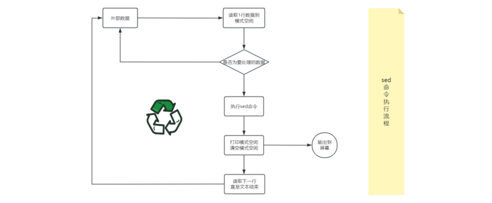
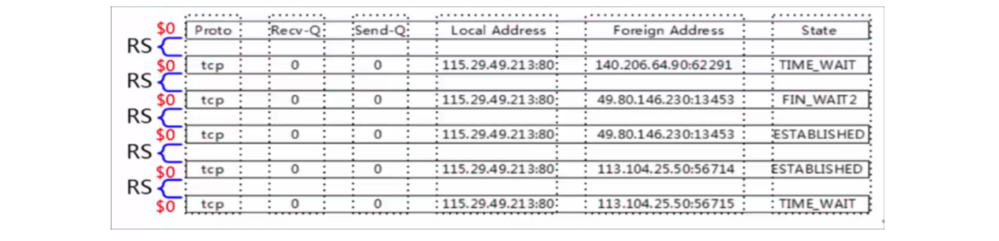
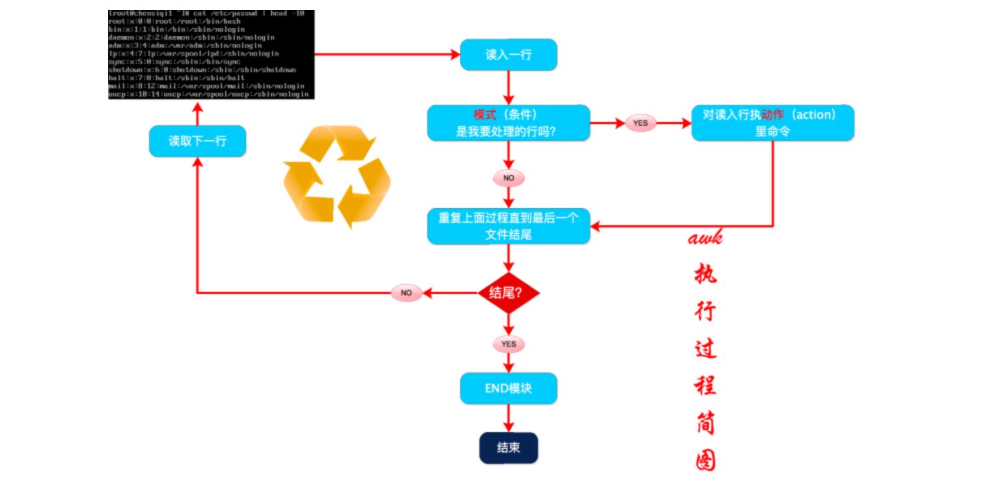
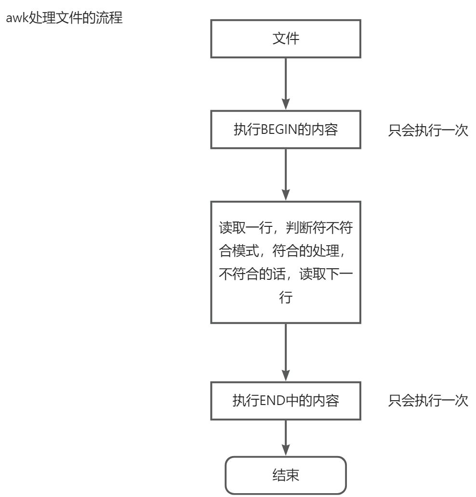
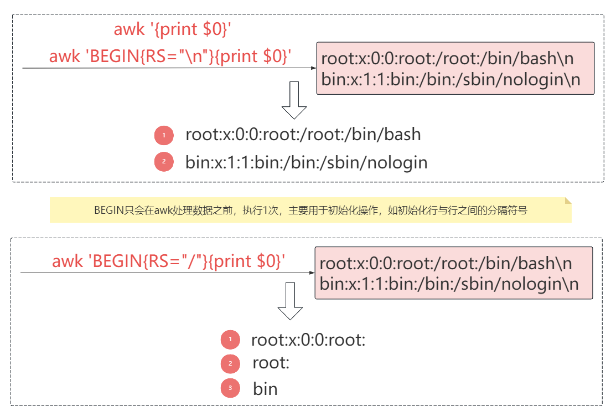
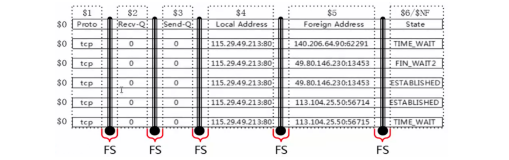
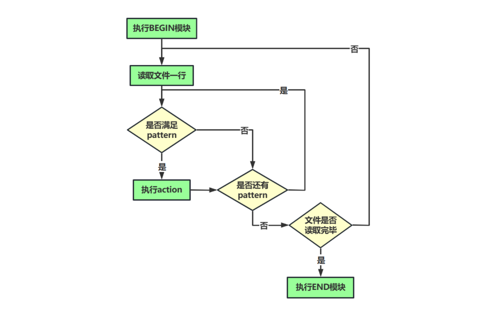

# 04.Shell三剑客

# 一、【了解】Shell三剑客概述

## Shell三剑客

Shell三剑客是指<code><font style="color:rgb(216,57,49);">grep、sed和awk</font></code>这三个在Linux/Unix系统中常用的命令行工具。

**grep**：`grep` 是一个文本搜索工具，用于<font style="color:rgb(216,57,49);">根据给定的模式（正则表达式）在文件或输入流中搜索匹配的行</font>。`grep` 的主要作用是`查找`和`过滤`特定文本。

**sed**：`sed`是一个流编辑器，可以对文本进行<font style="color:rgb(216,57,49);">查找、替换、删除等操作</font>。它可以直接在文本流中编辑，不需要打开文件，非常适合批量处理。

**awk**：`awk` 是一个文本处理工具，适合<font style="color:rgb(216,57,49);">对列进行处理和分析</font>。它不仅<font style="color:rgb(216,57,49);">可以进行查找和替换，还能执行数学计算和数据统计</font>，特别适合处理以列形式组织的数据，如<font style="color:rgb(216,57,49);">日志</font>、CSV 文件等。

> 面试题：grep、sed、awk有何区别？

* **grep**用于\*\*<font style="color:rgb(216,57,49);">查找</font>\*\*特定内容，适合快速<font style="color:rgb(216,57,49);">过滤</font>日志或配置文件。
* **sed** 用于\*\*<font style="color:rgb(216,57,49);">修改</font>**<font style="color:rgb(216,57,49);">和</font>**<font style="color:rgb(216,57,49);">编辑</font>\*\*<font style="color:rgb(216,57,49);">文本</font>，非常适合批量<font style="color:rgb(216,57,49);">替换或删除</font>操作。
* **awk** 更强大，<font style="color:rgb(216,57,49);">适用于</font>\*\*<font style="color:rgb(216,57,49);">列状数据（有行有列二维表格）</font>\*\***的处理**，能够提取<font style="color:rgb(216,57,49);">字段、统计数据或进行数学</font>计算。

在运维工作中，我会根据不同的需求选择合适的工具：当需要简单查找时用 `grep`，批量修改文件时用 `sed`，处理复杂的日志或统计数据时使用 `awk`。

## Shell三剑客适用场景

① 日志处理与搜索：使用 grep 搜索关键词，结合 sed 和 awk 进行进一步处理和分析。

② 配置文件管理：使用 sed 和 awk 进行批量修改、添加或删除配置项。

③ 数据提取与转换：利用 awk 提取、分析和转换结构化文本数据，处理 CSV、JSON 等格式。

④ 监控与报警：使用 grep、sed 和 awk 提取关键信息生成监控报告，监控系统状态和性能。

⑤ 日常运维任务：自动化任务如查找过期文件、清理日志、统计日志大小等。

⑥ 系统管理：使用 sed 和 awk 处理系统状态信息，如用户信息、进程信息、磁盘使用情况等。

面试题：查找30天以前的文件并删除？

答：find...

## Shell三剑客执行说明

默认情况下，grep、sed以及awk在处理数据时默认都是按<code><font style="color:rgb(216,57,49);">行</font></code>处理

# 二、【重点】Shell三剑客之grep指令

## grep基本语法

grep主要作用：过滤来自一个文件或标准输入匹配模式内容（<font style="color:rgb(216,57,49);">查找、过滤</font>）。

除了 grep 外，还有 <font style="color:rgb(216,57,49);">egrep</font>。egrep 是 grep 的扩展，相当于 <code><font style="color:rgb(216,57,49);">grep -E</font></code>。

基本语法：`grep [OPTION]... PATTERN [FILE]...`

记住：都是常见一些选项

| 支持的正则 | 描述 |
| --- | --- |
| <font style="color:rgb(216,57,49);">-E,--extended-regexp</font> | <font style="color:rgb(216,57,49);">模式是扩展正则表达式(ERE) => 字符簇、()、|或</font> |
| -P,--perl-regexp | 模式是Perl正则表达式 => \d、\w、\s |
| -i,--ignore-case | 忽略大小写 |
| <font style="color:rgb(216,57,49);">-w,--word-regexp</font> | <font style="color:rgb(216,57,49);">模式匹配整个单词</font> |
| <font style="color:rgb(216,57,49);">-v，--invert-match</font> | <font style="color:rgb(216,57,49);">打印不匹配的行（取反）</font> |

了解：能记住最好，记不住，作为了解，使用的时候查看文档！

| 输出控制 | 描述 |
| --- | --- |
| -n,--line-number | 打印行号 |
| -o,--only-matching | 只打印匹配的内容 |
| -r,--recursive | 递归目录 |
| -c,--count | 统计匹配行数 |

## grep案例演示

准备数据集

```shell
# vim demo.txt
Hello, this is an example file.
It contains some lines of text.
Let's use grep to search for specific patterns.
```

案例1：在文件中搜索包含单词 "example" 的行

```shell
# grep "example" demo.txt
```

案例2：忽略大小写地搜索匹配模式的行

```shell
在文件中搜索不区分大小写的单词 "hello" 的行
# grep -i "hello" demo.txt
```

案例3：反转匹配，只打印不匹配模式的行

```shell
在文件中搜索不包含"text"的行
# grep -v "text" demo.txt
```

案例4：显示匹配行的行号

```shell
在文件中搜索包含单词 "example" 的行，并显示行号
# grep -n "example" demo.txt
```

案例5：统计匹配的行数

```shell
# grep -c "example" demo.txt
```

案例6：仅匹配整个单词

```shell
在文件中搜索包含单词 "example" 的行，是整个单词，而不是一个单词的一部分
# grep -w "example" demo.txt
```

案例7：递归地搜索目录及其子目录下的文件

```shell
搜索/root/目录下包含内容"Hello, this is an example file."的所有文件
# grep -r "Hello, this is an example file." /root/
```

# 三、【重点】Shell三剑客之sed指令

作用：`sed`命令功能比较全，可以进行增删改查操作 => 运维工作中：**修改操作**相对而言是最多

## sed指令说明

我们都知道，在Linux中一切皆文件，比如配置文件，日志文件，启动文件等等。如果我们相对这些文件进行一些编辑查询等操作时，我们可能会想到一些`vi,vim,cat,more`等命令。

但是这些命令效率不高，这就好比一块空地准备搭建房子，请了10个师傅拿着铁锹挖地基，花了一个月的时间才挖完，而另外一块空地则请了个挖土机，三下五除二就搞定了，这就是效率。

而在Linux中的"挖土机"有三种型号：顶配awk，中配sed，标配grep。使用这些工具，我们能够在达到同样效果的前提下节省大量的重复性工作，提高效率。

sed 是Stream Editor（字符流编辑器）的缩写，简称流编辑器。

什么是流？大家可以想象一下流水线，sed就像一个车间一样，文件中的每行字符都是原料，运到sed车间，然后经过一系列的加工处理，最后从流水线下来就变成货物了。



以前工厂中没有流水线时，生产一件商品需要十几个工种互相配合，这样下来利润太低，后来就有了流水线，生产一件商品虽然还是有十几道工序，但都是机器化生产，工人只是辅助作用，这样利润就大大提高了，产量也大大提高了。

编辑文件也是这样，以前我们修改一个配置文件，需要移动光标到某一行，然后添加点文字，然后又移动光标到另一行，注释点东西......可能修改一个配置文件下来需要花费数十分钟，还有可能改错了配置文件，又得返工。这还是一个配置文件，如果数十个数百个呢？因此当你学会了sed命令，你会发现利用它处理文件中的一系列修改是很有用的。只要想到在大约100多个文件中，处理20个不同的编辑操作可以在几分钟之内完成，你就会知道sed的强大了。

## 软件功能和版本

```java
sed --version   # 查看sed软件版本
```

## 语法格式

```shell
sed [options] [sed -commands] [input -file]
sed  【选项】    【sed命令】     【输入文件】 

核心：记住常用选项以及常用sed命令！！！
```

说明：

① 注意sed软件以及后面选项，sed命令和输入文件，每个元素之间都至少有一个空格。

② 为了避免混淆，笔记中称呼sed为sed软件。sed -commands(sed命令)是sed软件内置的一些命令选项，为了和前面的options（选项）区分，故称为sed命令

③ sed -commands 既可以是单个sed命令，也可以是多个sed命令组合。

④ input -file (输入文件)是可选项，sed还能够从标准输入如管道获取输入。

## 命令执行流程

概括流程：sed软件从文件或管道中读取一行，处理一行，输出一行；再读取一行，再处理一行，再输出一行....

小知识：一次一行的设计使得sed软件性能很高，sed在读取非常庞大的文件时不会出现卡顿的想象。大家都用过vi命令，用vi命令打开几十M或更大的文件，会发现有卡顿现象，这是因为vi命令打开文件是一次性将文件加载到内存，然后再打开，因此卡顿的时间长短就取决于从磁盘到内存的读取速度了。而且如果文件过大的话还会造成内存溢出现象。Sed软件就很好的避免了这种情况，打开速度非常快，执行速度也很快。

***

详细流程：现有一个文件person.txt，共有五行文本，sed命令读入文件person.txt的第一行`"101,Tom,CEO"`,并将这行文本存入模式空间（sed软件在内存中的一个临时缓存，用于存放读取到的内容，比喻为工厂流水线的传送带。）

文件person.txt在模式空间的完整处理流程：

① 判断第1行是否是需要处理的行，如果不是要处理的行就重新从文件读取下一行，如果是要处理的行，则接着往下走。

② 对模式空间的内容执行sed命令，比如a（append追加，在行之后），i（insert插入，在行之前），s（替换）...

③ 将模式空间中经过sed命令处理后的内容输出到屏幕上，然后清空模式空间

④ 读取下一行文本，然后重新执行上面的流程，直到文件结束


sed软件有两个内置的存储空间：

☆ 模式空间（pattern space）：是sed软件从文本读取一行文本然后存入的缓冲区（这个缓冲区是在内存中的），然后使用sed命令操作模式空间的内容。

☆ 保持空间（hold space）：是sed软件另外一个缓冲区，用来存放临时数据，也是在内存中，但是模式空间和保持空间的用途是不一样的。sed可以交换保持空间和模式空间的数据，但是不能在保持空间上执行普通的sed命令，也就是说我们可以在保持空间存储数据。

> 模式空间：临时存放数据，然后通过sed命令进行加工处理，处理完成后，打印到屏幕，然后清空模式空间
>
> 保持空间：存储数据

## sed选项说明

`sed 选项 sed命令 文件`

记住常用的三个选项：

| option\[选项] | 解释说明（带*的为重点） |
| --- | --- |
| <font style="color:rgb(216,57,49);background-color:#FBDE28;">-n</font> | <font style="background-color:#FBDE28;">取消默认的sed软件的输出，常与sed命令的</font><font style="color:rgb(216,57,49);background-color:#FBDE28;">p</font><font style="background-color:#FBDE28;">连用*</font> |
| <font style="color:rgb(216,57,49);background-color:#FBDE28;">-r</font> | <font style="background-color:#FBDE28;">使用扩展正则表达式（grep -E），默认情况sed只识别基本正则表达式\*</font> |
| <font style="color:rgb(216,57,49);background-color:#FBDE28;">-i</font> | <font style="background-color:#FBDE28;">直接修改文件内容，而不是输出到终端，如果不使用-i选项sed软件只是修改在内存中的数据，并不会影响磁盘上的文件\*</font> |

记住几个常用：（标红需要记住）

| sed -commands | 解释说明（带*的为重点） |
| --- | --- |
| <font style="color:rgb(216,57,49);background-color:#FBDE28;">a</font> | <font style="background-color:#FBDE28;">append追加，在指定行后添加一行或多行文本*</font> |
| <font style="color:rgb(216,57,49);background-color:#FBDE28;">c</font> | <font style="background-color:#FBDE28;">change，取代指定的行</font> |
| <font style="color:rgb(216,57,49);background-color:#FBDE28;">d</font> | <font style="background-color:#FBDE28;">delete，删除指定的行\*</font> |
| <font style="color:rgb(216,57,49);background-color:#FBDE28;">i</font> | <font style="background-color:#FBDE28;">insert插入，在指定行前添加一行或多行文本\*</font> |
| <font style="color:rgb(216,57,49);background-color:#FBDE28;">p</font> | <font style="background-color:#FBDE28;">print，打印模式空间内容，通常p会与选项-n一起使用\*</font> |
| q | 退出sed |
| r | 从指定文件读取数据 |
| <font style="color:rgb(216,57,49);background-color:#FBDE28;">s</font> | <font style="background-color:#FBDE28;">取代，s#old#new#g==>这里g是s命令的替代标志，注意和g命令区分。\*</font> |

> 重点记住：增删改查操作 => 增加a、删除d、修改c或s、查询p

| 特殊符号 | 解释说明（带*的为重点） |
| --- | --- |
| ！ | （取反），对指定行以外的所有行应用命令* |
| = | 打印当前行行号 |
| ~ | "first ~ step"表示从first行开始，以步长step递增 |

## sed增加操作（记住a）

数据集准备

```shell
# cat > person.txt<<EOF
101,Tom,CEO
102,Rose,CTO
103,Alex,COO
104,Jack,CFO
105,Jennifer,CIO
EOF

命令说明：使用一条cat命令创建多行文本，文件包含上面的内容，后面的操作都会使用这个文件。
```

增加操作就是往文件指定位置追加或插入指定文本。

这个功能非常有用，比如我们平时往配置文件写入几行文本，最常用的是vi或vim命令，但是这2个命令是一种交互式的命令，还需要我们在vi/vim编辑器界面输入字符串然后保存退出，操作有些繁琐但是还能用。但是当我们学会了Shell脚本后，我们就会发现在脚本中不能正常使用vi或vim命令，为什么呢？

我们学习Shell脚本主要是为了解放我们的双手，执行一个脚本，然后自动往文件中写入数据，不需要我们再动手。因此我们想到了sed软件，它能够帮助我们实现目的。

这里我们需要用到2个sed命令，分别是：

"**a**" : 追加文本到指定行后，记忆方法：a的全拼是**append**，意思是**追加**。

"**i**" ：插入文本到指定行前，记忆方法：i的全拼是**insert**，意思是**插入**。

单行增：

首先我们看一下单行增加的用法，说白了就是在文件中增加一行文本，我们以前学过echo命令可以在文件的末尾追加文本，比较简单，但是我们还有其他的复杂需求，比如在第10行插入一行数字等等，这里就需要sed出马了。我们来看一下面的例子：

```shell
sed '2a 106,Smith,CSO' person.txt
注：
2代表指定对第2行操作，其他的行忽略；
a代表追加的意思，2a即在第2行后追加文本；
2a后面加上空格，然后跟上你想要插入的多行文本即可。这里的每行文本使用"\n"连接就可以写成一行了。
```

> 注意：以上2a也可以调整为2i，代表在第2行的前面添加一行

多行增：

```shell
sed '2a 106,Eric,CSO\n107,Susan,CCO' person.txt
注：\n代表换行符
```

小结：

sed默认操作文件内容是在内存中的模式空间中进行实现，不会影响原文件内容。

增加操作有两种方式（行号 + i，指定行前面添加内容），（行号 + a，指定行后面添加内容）

如果希望增加操作影响原文件，可以添加一个选项`-i`

```shell
# sed -i '5a 106,Susan,CCO' person.txt
# cat person.txt
101,Tom,CEO
102,Rose,CTO
103,Alex,COO
104,Jack,CFO
105,Jennifer,CIO
106,Susan,CCO
```

## sed删除操作（记住d）

删除<font style="color:rgb(216,57,49);">指定行</font>文本。

这个功能也是非常得有用，比如我们想删除文件中的某些行，以前最常用的是vi或vim命令，但现在我们知道了sed命令，就应该使用这个高逼格的命令完成任务了。

这里我们需要用到1个sed命令；

**"d":删除文本，记忆方法：d的全拼是delete，意思是删除。**

因为删除功能比较简单，因此我们结合地址范围一起说明。我们前面学过sed命令可以对一行文本为目标进行处理（在单行前后增加一行或多行文本），接下来我们看一下如何对多行文本为目标操作。

指定执行的地址范围：

```shell
sed软件可以对单行或多行文本进行处理。如果在sed命令前面不指定地址范围，那么默认会匹配所有行。
用法：匹配行{删除命令}
用法：n1[,n2]{sed -commands}
地址用逗号分隔开，n1,n2可以用数字，正则表达式，或者二者的组合表示。
```

| 地址范围 | 含义 |
| --- | --- |
| 10 | 对第10行操作 |
| 10，20 | 对10到20行操作，包括第10，20行 |
| 10，$ | 对10到最后一行（$代表最后一行）操作，包括第10行 |
| /Tom/ | 对匹配Tom的行操作 |
| /Tom/,/Alex/ | 对匹配Tom的行到匹配Alex的行操作 |
| /Tom/,$ | 对匹配Tom的行到最后一行操作 |
| 1,/Alex/ | 对第1行到匹配Alex的行操作 |

案例1：下面用具体的例子演示一下sed删除操作实现

```shell
# sed 'd' person.txt
命令说明：如果在sed命令前面不指定地址范围，那么默认会匹配所有行，然后使用d命令删除功能就会删除这个文件的所有内容
```

案例2：

```shell
# sed '2d' person.txt
命令说明：这个单行删除想必大家能理解，指定删除第2行的文本
```

案例3：

```shell
# sed '2,5d' person.txt
命令说明：'2，5d' 指定删除第2行到第5行的内容，d代表删除操作。
```

案例4：

```shell
# sed '/Jack/d' person.txt
命令说明：在sed软件中，使用正则的格式和awk一样，使用2个"/"包含指定的正则表达式，即"/正则表达式/"。
```

案例5：

```shell
# sed '/Tom/,/Alex/d' person.txt
命令说明：这是正则表达式形式的多行删除，也是以逗号分隔2个地址，最后结果是删除包含"Tom"的行到包含"Alex"的行
```

案例6：

```shell
# sed '3,$ d' person.txt
命令说明：学过正则表达式后我们知道"$"代表行尾，但是在sed中就有一些变化了，"$"在sed中代表文件的最后一行。因此本例子的含义是删除第3行到最后一行的文本，包含第3行和最后一行，因此剩下第1，2行的内容。
```

案例7：

```shell
# sed '$a 106,Tom,CSO' person.txt 
命令说明：为了不造成同学们实验文本改来改去导致不同意，因此我用上面的命令语句只是临时修改内存数据，然后通过管道符号传给sed软件。
```

案例8：

```properties
# 删除第2、4、6行
sed "2d;4d;6d" person.txt
```

小结：

`sed`软件不仅可以添加数据行，也可以删除数据行，删除数据行必须使用（<font style="color:rgb(216,57,49);">d</font>）命令

`sed`删除软件 => （sed '范围d' 文件）=> 默认都是在内存中完成，需要影响原文件，则添加一个<code><font style="color:rgb(216,57,49);">-i</font></code>

`sed`匹配原则，匹配内容 + d，如`3,5d`

## sed修改操作（重点，要记住c和s）

c：change缩写，替换指定行，**以行为单位**

s : <font style="color:rgb(216,57,49);">s/旧的内容/替换后内容/g</font> 或 <font style="color:rgb(216,57,49);">s#旧的内容#替换后内容#g</font>，以关键词为单位

为什么使用#作为标识符，因为如果文件路径的替换，/root、/etc，刚好与边界符号冲突了

***

sed修改操作，我们最常见的操作就是<font style="color:rgb(216,57,49);">改配置文件，改参数</font>等等 首先说一下按行替换，这个功能用的很少，所以大家了解即可。这里用到的sed命令是："c"：用新行取代旧行，记忆方法：c的全拼是change，意思是替换。

```shell
# sed '2c 106,Smith,CSO' person.txt 
命令说明：使用sed命令c将原来第2行内容替换成106,Smith,CSO,整行替换
```

sed中全局替换操作 与 vim编辑器中的全局替换其实是一致的

接下来说的这个功能，有工作经验的同学应该非常的熟悉，因为使用sed软件80%的场景就是使用替换功能。

这里用到的sed命令，选项：

```shell
"s"：单独使用-->将每一行中第一处匹配的字符串进行替换-->sed命令
"g"：每一行进行全部替换-->sed命令s的替换标志之一（全局替换），非sed命令
"-i"：修改文件内容-->sed软件的选项，注意和sed命令i区别
```

sed软件替换模型

```shell
sed -i 's/旧的内容/替换后内容/' 文件内容
sed -i 's/旧的内容/替换后内容/g' 文件内容
sed -i 's#旧的内容#替换后内容#g' 文件内容

路径替换式
s#/home#/root#g

g：global全局替换
sed本身按照进行操作的，如果在1行中有多个要替换的关键词，不加g，则代表只替换满足条件第一个关键词；如果添加g，则代表替换满足条件的所有关键词！
```

观察特点：

1. 两边是引号，引号里面的两边分别为s和g，中间是三个一样的字符/或#作为定界符。字符#能在替换内容包含字符/有助于区别。定界符可以是任意字符如：或|等，但当替换内容包含定界符时，需要转义\：或|。经过长期实践，建议大家使用#作为定界符。
2. 定界符/或#，第一个和第二个之间的就是被替换的内容，第二个和第三个之间的就是替换后的内容。
3. s#旧的内容#替换后的内容#g ，"旧的内容"能用<font style="color:rgb(216,57,49);">正则表达式</font>，但<font style="color:rgb(216,57,49);">替换内容不能用非具体正则表达式，必须是具体的，如\1等等</font>。因为替换内容使用正则的话会让sed软件无所适从，它不知道你要替换什么内容。
4. 默认sed软件是对模式空间（内存中的数据）操作，而<font style="color:rgb(216,57,49);">-i</font>选项会更改磁盘上的文件内容。

案例1：

```shell
# sed 's#Tom#Eric#g' person.txt

命令说明：将需要替换的文本"Tom"放在第一个和第二个"#"之间，将替换后的文本"Eric"放在第二个核第三个"#"之间。结果为第二行的"Tom"替换为"Eric"。
```

案例2：指定行修改配置文件

```shell
# sed '3s#0#9#' person.txt

命令说明：前面学习的例子在sed命令"s"前没有指定地址范围，因此默认是对所有行进行操作。而这个案例要求只将第3行的0换成9，这里就用到了我们前面学过的地址范围知识，在sed命令"s"前加上"3"就代表对第3行进行替换
```

案例3：分组替换() 和 \1的使用功能

```shell
sed软件的()的功能可以记住正则表达式的一部分，其中，\1为第一个记住的模式即第一个小括号中的匹配内容，\2第二个记住的模式，即第二个小括号中的匹配内容，sed最多可以记住9个。
```

案例4：执行命令取出linux中的 ens33/ens160 的IP地址？

```shell
# dnf install net-tools -y
# ifconfig ens33 | sed -n '2p'
        inet 192.168.88.101  netmask 255.255.255.0  broadcast 192.168.88.255
 
# ifconfig ens33 | sed -n '2p' | sed -r 's#.*inet ([0-9.]+).*#\1#g'
192.168.88.101

正则解析：
# .*匹配所有，但是受到inet影响，只能匹配inet前面内容
# inet ([0-9.]+)，这个小括号中的内容，用于匹配IP（只有数字和点号的情况）,放入1号分组
# IP后面内容统一用.*匹配
# \1引用刚才匹配的IP地址，然后替换整个前面一行内容，最后就剩1个IP
# 如果\1报错，则我们可以使用\1来进行表示，如果不想使用\这种转义字符，也可以在sed的后面添加一个-r，代表使用regexp正则表达式
```

命令说明：

net-tools网络工具包，安装后，增加了很多与网络相关工具

```shell
ifconfig ens33查看网卡的信息（如IP地址等等）
ss -naltp |grep 软件名称（查看进程找个的网络端口）
netstat -naltp |grep 软件名称（查看进程找个的网络端口）
```

如果我们单纯想获取服务器的物理IP，除了使用刚才的sed，还可以使用`hostname -I`来获取

```shell
hostname -I
```

这道题是需要把ifconfig ens33执行结果的第2行的IP地址取出来，上面答案的思路是用IP地址来替换第2行的内容。

案例5：

```shell
echo "I am eric teacher." | sed -r 's#^.*am ([a-z]+) tea.*$#\1#g'
eric
```

## sed查询操作（记住-n+p）

这个功能也是非常得有用，比如我们想查看文件中的某些行，以前最常用的是cat或more或less命令等，但这些命令有些缺点，就是不能查看指定的行。而我们用了很久的sed命令就有这个功能了。而且我们前面也说过使用sed比其他命令vim等读取速度更快！

sed命令：

"p"：输出指定内容，但默认会输出2次匹配的结果，因此使用-n选项取消默认输出，记忆方法：p的全拼是print，意思是打印。

案例1：

```shell
# sed '2p' person.txt
疑问：为什么2p会把第2行打印两次
答：sed命令属于流编辑器，针对文件，会一行一行处理。
① 读取文件第1行，写入模式空间，命令是2p，相当于不是我们想要打印输出的内容，输出到屏幕，清空模式空间进入下一行
② 读取文件第2行，写入模式空间，命令是2p，刚好是我们要打印输出的内容，所以对其进行打印输出。把模式空间的内容输出到屏幕，然后清空模式空间进入到下一行。
③ 依次类推，直到读取完这个文件的所有内容

命令说明：选项-n取消默认输出，只输出匹配的文本，大家只需要记住使用命令p必用选项-n。
# sed -n '2p' person.txt
```

面试：给定一个文件，如何打印第8行？

① head命令 + tail命令 => head -8 文件名称 |tail -1

② sed命令 => sed -n '8p' 文件名称

案例2：

```shell
# sed -n '2,3p' person.txt
命令说明：查看文件的第2行到3行，使用地址范围"2，3"。取行就用sed，最简单
```

案例3：

```shell
# sed -n '1~2p' person.txt
注意：起始值~步长
命令说明：打印文件的1，3，5行。～代表步长
```

案例4：

```shell
# sed -n 'p' person.txt
命令说明：不指定地址范围，默认打印全部内容。
```

案例5：

```shell
# sed -n '/CTO/p' person.txt
命令说明：打印含CTO的行
```

案例6：

```shell
# sed -n '/CTO/,/CFO/p' person.txt
命令说明：打印含CTO的行到含CFO的行。
```

案例7：

```shell
# sed -i.bak 's#Tom#Peter#g' person.txt
命令行说明：
在-i参数的后边加上.bak（.任意字符），sed会对文件进行先备份后修改
```

特殊符号=获取行号（了解）

案例8：

```shell
# sed '=' person.txt
命令说明：使用特殊符号"="就可以获取文件的行号，这是特殊用法，记住即可。从上面的命令结果我们也发现了一个不好的地方：行号和行不在一行。 
```

案例9：

```shell
# sed '1,3=' person.txt
命令说明：打印1，2，3行的行号，同时打印输出文件中的内容
```

案例10：取不连续的行

```shell
# sed -n '1p;3p;5p' person.txt
```

小结：

`sed`如果想对行进行打印输出，通常使用`p`命令，取消默认输出，使用选项`-n`

`sed`功能非常强大：支持（增删改查操作）

复习：

基本语法：<font style="color:rgb(216,57,49);">sed软件 选项 命令 文件</font>

<font style="color:rgb(216,57,49);">sed -i ：修改源文件 </font>

sed增删改查，修改最重要

增加：sed -i '<font style="color:rgb(216,57,49);">2a</font> 103,Tom,23' 文件名称

删除：sed -i '<font style="color:rgb(216,57,49);">3d</font>' 文件名称

修改：sed -i '<font style="color:rgb(216,57,49);">75c</font> bind 0.0.0.0' 文件名称

```
  sed -i '<font style="color:rgb(216,57,49);">s#要替换的内容#替换后的内容#g</font>' 文件名称
```

sed -i '85<font style="color:rgb(216,57,49);">s#要替换的内容#替换后的内容#g</font>' 文件名称

查询：sed <font style="color:rgb(216,57,49);">-n</font> '<font style="color:rgb(216,57,49);">5p</font>' 文件名称

# 四、Shell三剑客之awk指令

作用：`awk`可以完成复杂的数据分析，如日志分析等等。

## awk概述

`awk`不仅仅是`Linux`系统中的一个命令，更可以理解为它是一种编程语言，可以用来处理数据和生成报告（excel）。

处理的数据可以是一个或多个文件，可以是来自标准输入，也可以通过管道获取标准输入，`awk`可以在命令行上直接编辑命令进行操作，也可以编写成`awk`程序来进行更为复杂的运用。本章主要讲解`awk`命令的运用。

## awk格式

`awk`指令是由<font style="color:rgb(216,57,49);">模式</font>，<font style="color:rgb(216,57,49);">动作</font>，或者<font style="color:rgb(216,57,49);">模式和动作</font>的组合组成。

模式即`pattern`，可以类似理解成`sed`的模式匹配，可以由<font style="color:rgb(216,57,49);">表达式</font>组成，也可以是两个<font style="color:rgb(216,57,49);">正斜杠之间的正则表达式</font>。比如<code><font style="color:rgb(216,57,49);">NR==1</font></code>，这就是<font style="color:rgb(216,57,49);">模式</font>，可以把他理解为一个<font style="color:rgb(216,57,49);">条件</font>。

动作即<code><font style="color:rgb(216,57,49);">action</font></code>，是由在<font style="color:rgb(216,57,49);">大括号里面的一条或多条语句</font>组成，<font style="color:rgb(216,57,49);">语句之间使用分号隔开</font>。


`awk`处理的内容可以来自标准输入（<），一个或多个文本文件或管道。


`options`即参数，使用最多的参数为<code><font style="color:rgb(216,57,49);">-F</font></code>（<code><font style="color:rgb(216,57,49);">Field</font></code>，用于指定字段与字段之间的分隔符，<font style="color:rgb(216,57,49);">列与列之间的分隔符</font>，默认为<font style="color:rgb(216,57,49);">空格</font>）

`pattern`即模式，也可以理解为<font style="color:rgb(216,57,49);">条件</font>，也叫<font style="color:rgb(216,57,49);">找谁</font>，你找谁？高矮，胖瘦，男女？都是<font style="color:rgb(216,57,49);">条件，即模式</font>。

`action`即动作，可以理解为<font style="color:rgb(216,57,49);">干啥</font>，找到人之后你要做什么。

注意：<code><font style="color:rgb(216,57,49);">awk -F"分隔符" '模式和动作' file</font></code>

> <code>**<font style="color:#AE146E;">-F</font>**</code>**<font style="color:#AE146E;">后面跟是双引号，模式和动作要使用单引号进行包裹！！！</font>**

模式和动作的详细介绍我们放在后面部分，现在大家先对`awk`结构有一个了解。

案例1：基本模式与动作

```shell
# awk -F ":" 'NR>=2 && NR<=6{print NR,$1}' /etc/passwd
2 bin
3 daemon
4 adm
5 lp
6 sync

命令说明：
-F 指定分隔符为冒号，相当于以“：”为菜刀，进行字段的切割。
NR>=2 && NR<=6：这部分表示模式，是一个条件，表示取第2行到第6行。
{print NR,$1}：这部分表示动作，表示要输出NR行号和$1第一列。
$1代表第1列
$2代表第2列
依次类推
```

NR == Number（数字、号码）+ Record（记录、行）== 行号

案例2：只有模式

```shell
# awk -F ":" 'NR>=2 && NR<=6' /etc/passwd
bin:x:1:1:bin:/bin:/sbin/nologin
daemon:x:2:2:daemon:/sbin:/sbin/nologin
adm:x:3:4:adm:/var/adm:/sbin/nologin
lp:x:4:7:lp:/var/spool/lpd:/sbin/nologin
sync:x:5:0:sync:/sbin:/bin/sync

命令说明：
-F指定分隔符为冒号
NR>=2&&NR<=6这部分是条件，表示取第2行到第6行。
但是这里没有动作，这里大家需要了解如果只有条件（模式）没有动作，awk默认输出整行
```

案例3：只有动作

`awk`如果不指定模式，代表获取这个文件的所有行，因为`awk`默认也是按行处理！

```shell
# awk -F ":" '{print NR,$1}' /etc/passwd
1 root
2 bin
3 daemon
4 adm
5 lp
6 sync
7 shutdown
8 halt
9 mail
10 uucp
以下省略....

命令说明：
-F指定分隔符为冒号
这里没有条件，表示对每一行都处理
{print NR,$1}表示动作，显示NR行号与$1第一列
这里要理解没有条件的时候，awk会处理每一行。
```

案例4：多模式与多动作

```shell
# awk -F ":" 'NR==1{print NR,$1}NR==2{print NR,$NF}' /etc/passwd
1 root
2 /sbin/nologin

命令说明：
-F指定分隔符为冒号
这里有多个条件与动作的组合
NR==1表示条件，行号（NR）等于1的条件满足的时候，执行{print NR,$1}动作，输出行号与第一列。
NR==2表示条件，行号（NR）等于2的条件满足的时候，执行{print NR,$NF}动作，输出行号与最后一列（$NF）
```

NR：Number Record，行号信息

NF：Number Field，列号信息，注意：计数情况下，**$NF代表最后一列**

注意：

`Pattern`和`{Action}`需要用单引号引起来，防止Shell作解释。

`Pattern`是可选的。如果不指定，`awk`将处理输入文件中的所有记录。如果指定一个模式，`awk`则只处理匹配指定的模式的记录。

`{Action}`为`awk`命令，可以是单个命令，也可以多个命令。整个`Action`（包括里面的所有命令）都必须放在`{` 和` }`之间。

`Action`必须被`{ }`包裹，没有被`{ }`包裹的就是`Pattern`

`file`表示要处理的目标文件

## awk执行过程

在深入了解`awk`前，我们需要知道`awk`如何处理文件的。

```shell
# mkdir /server/files/ -p
# head /etc/passwd > /server/files/awkfile.txt
# cat /server/files/awkfile.txt 
root:x:0:0:root:/root:/bin/bash
bin:x:1:1:bin:/bin:/sbin/nologin
daemon:x:2:2:daemon:/sbin:/sbin/nologin
adm:x:3:4:adm:/var/adm:/sbin/nologin
lp:x:4:7:lp:/var/spool/lpd:/sbin/nologin
sync:x:5:0:sync:/sbin:/bin/sync
shutdown:x:6:0:shutdown:/sbin:/sbin/shutdown
halt:x:7:0:halt:/sbin:/sbin/halt
mail:x:8:12:mail:/var/spool/mail:/sbin/nologin
uucp:x:10:14:uucp:/var/spool/uucp:/sbin/nologin
```

`awk`执行过程演示：

```shell
# awk 'NR>=2{print $0}' /server/files/awkfile.txt 
bin:x:1:1:bin:/bin:/sbin/nologin
daemon:x:2:2:daemon:/sbin:/sbin/nologin
adm:x:3:4:adm:/var/adm:/sbin/nologin
lp:x:4:7:lp:/var/spool/lpd:/sbin/nologin
sync:x:5:0:sync:/sbin:/bin/sync
shutdown:x:6:0:shutdown:/sbin:/sbin/shutdown
halt:x:7:0:halt:/sbin:/sbin/halt
mail:x:8:12:mail:/var/spool/mail:/sbin/nologin
uucp:x:10:14:uucp:/var/spool/uucp:/sbin/nologin

命令说明：
条件NR>=2,表示行号大于等于2时候，执行{print $0}显示整行。
awk是通过一行一行的处理文件，这条命令中包含模式部分（条件）和动作部分（动作），awk将处理模式（条件）指定的行

$0代表所有列，$1代表第1列，$2代表第2列，... $NF代表最后1列
```

`awk`执行过程解析：

① `awk`读入第一行内容

② 判断是否符合模式中的条件`NR>=2`

如果匹配则执行对应的动作`{print $0}`

如果不匹配条件，继续读取下一行

③ 继续读取下一行

④ 重复过程1-3，直到读取到最后一行（EOF：end of file）



## awk记录（行）

`awk`特别适合处理有行有列的二维结构

记录和字段 接下来我给大家带来两个新概念记录和字段，这里为了方便大家理解可以把记录就当作行即**记录==行**，字段相当于列，**字段==列**。

| 名称 | 含义 |
| --- | --- |
| record | 记录，行 => NR（Number Record）行号 |
| field | 域，区域，字段，列 => NF（Number Field）列号，**$NF代表最后一列** |

数据集：

```shell
# cat /server/files/awkfile.txt
root:x:0:0:root:/root:/bin/bash
bin:x:1:1:bin:/bin:/sbin/nologin
daemon:x:2:2:daemon:/sbin:/sbin/nologin
adm:x:3:4:adm:/var/adm:/sbin/nologin
lp:x:4:7:lp:/var/spool/lpd:/sbin/nologin
sync:x:5:0:sync:/sbin:/bin/sync
shutdown:x:6:0:shutdown:/sbin:/sbin/shutdown
halt:x:7:0:halt:/sbin:/sbin/halt
mail:x:8:12:mail:/var/spool/mail:/sbin/nologin
uucp:x:10:14:uucp:/var/spool/uucp:/sbin/nologin
```

思考：

一共有多少行呢？你如何知道的？通过什么标志？

`awk`对每个要处理的输入数据认为都是具有格式和结构的，而不仅仅是一堆字符串。默认情况下，每一行内容都是一条记录，并以换行符分隔（\n）结束。



`awk`默认情况下每一行都是一个记录（record）

① `RS`即<code><font style="color:rgb(216,57,49);">record separator</font></code>输入输出数据记录分隔符，每一行是怎么没的，表示每个记录输入的时候的分隔符，即行与行之间如何分隔，默认为<code><font style="color:rgb(216,57,49);">\n</font></code>，可以调整为其他字符。

② `NR`即<code><font style="color:rgb(216,57,49);">number of record</font></code>记录（行）号，表示当前正在处理的记录（行）的号码。

③ `ORS`即<code><font style="color:rgb(216,57,49);">output record separator</font></code>输出记录分隔符。

`awk`使用内置变量<code><font style="color:rgb(216,57,49);">RS</font></code>来存放输入<font style="color:rgb(216,57,49);">记录（行与行）分隔符</font>，`RS`表示的是输入的记录分隔符，这个值可以通过<code><font style="color:rgb(216,57,49);">BEGIN</font></code><font style="color:rgb(216,57,49);">模块</font>重新定义修改。



案例1：

```shell
# awk 'BEGIN{RS="/"}{print NR,$0}' /server/files/awkfile.txt 
1 root:x:0:0:root:
2 root:
3 bin
4 bash
bin:x:1:1:bin:
5 bin:
6 sbin
7 nologin
daemon:x:2:2:daemon:
8 sbin:
9 sbin
10 nologin
adm:x:3:4:adm:
11 var
12 adm:
13 sbin
14 nologin
lp:x:4:7:lp:
15 var
16 spool
17 lpd:
18 sbin
19 nologin
sync:x:5:0:sync:
20 sbin:
21 bin
22 sync
shutdown:x:6:0:shutdown:
23 sbin:
24 sbin
25 shutdown
halt:x:7:0:halt:
26 sbin:
27 sbin
28 halt
mail:x:8:12:mail:
29 var
30 spool
31 mail:
32 sbin
33 nologin
uucp:x:10:14:uucp:
34 var
35 spool
36 uucp:
37 sbin
38 nologin

命令说明：
BEGIN：开始模块，在awk开始处理数据之前执行1次
END：结束模块，在awk处理所有行后执行1次

在每行的开始先打印输出NR（记录号行号），并打印出每一行$0（整行）的内容。
我们设置RS（记录分隔符）的值为“／”，表示一行（记录）以“／”结束
在awk眼中，文件是从头到尾一段连续的字符串，恰巧中间有些\n（回车换行符），\n也是字符哦。
```

我们回顾下“行（记录）”到底是什么意思？

行（记录）：默认以`\n`（回车换行）结束。而这个行的结束不就是记录分隔符嘛。

所以在`awk`中，`RS`（记录分隔符）变量表示着行的结束符号（默认是回车换行）

**在工作中，我们可以通过修改**<code>**RS**</code>**变量的值来决定行的结束标志，最终来决定“每行”的内容。**

为了方便人们理解，`awk`默认就把`RS`的值设置为`\n`

注意：

`awk`的`BEGIN`模块，我会在后面（模式-`BEGIN`模块）详细讲解，此处大家仅需要知道在`BEGIN`模块里面我们来定义一些`awk`内置变量即可。

对`$0`的认识

`awk '{print NR,$NF,$0,$1,$2,...}'`

NR：行号，打印行号

NF：NF代表列号，如果前面添加了`$`，则代表最后一列

$0：整行内容

1：按照`-F`分割后，1代表分割后的第1列

2：按照`-F`分割后，2代表分割后的第2列

由以上代码运行可知：`awk`中`$0`表示整行，其实`awk`使用`$0`来表示整条记录。记录分隔符存在`RS`变量中或者说每个记录以`RS`内置变量结束。

另外，`awk`对每一行的记录号都有一个内置变量`NR`来保存，每处理完一条记录，`NR`的值就会自动+1

案例2：NR记录行号

```shell
# awk '{print NR,$0}' /server/files/awkfile.txt 
1 root:x:0:0:root:/root:/bin/bash
2 bin:x:1:1:bin:/bin:/sbin/nologin
3 daemon:x:2:2:daemon:/sbin:/sbin/nologin
4 adm:x:3:4:adm:/var/adm:/sbin/nologin
5 lp:x:4:7:lp:/var/spool/lpd:/sbin/nologin
6 sync:x:5:0:sync:/sbin:/bin/sync
7 shutdown:x:6:0:shutdown:/sbin:/sbin/shutdown
8 halt:x:7:0:halt:/sbin:/sbin/halt
9 mail:x:8:12:mail:/var/spool/mail:/sbin/nologin
10 uucp:x:10:14:uucp:/var/spool/uucp:/sbin/nologin

命令说明：
NR既number of record，当前记录的记录号，刚开始学也可以理解为行号。
$0表示整行或者说整个记录
```

企业面试题：按单词出现频率降序排序（计算文件中每个单词的重复数量）

```shell
# sed -r '1,10s#[^a-zA-Z]+# #g' /etc/passwd |head > /server/files/count.txt 
# cat /server/files/count.txt 
root x root root bin bash
bin x bin bin sbin nologin
daemon x daemon sbin sbin nologin
adm x adm var adm sbin nologin
lp x lp var spool lpd sbin nologin
sync x sync sbin bin sync
shutdown x shutdown sbin sbin shutdown
halt x halt sbin sbin halt
mail x mail var spool mail sbin nologin
uucp x uucp var spool uucp sbin nologin
```

思路：

让所有单词排成一列，这样每个单词都是单独的一行

① 设置RS值为空格

② 将文件里面的所有空格替换为回车换行符“\n”

③ 基于sort + uniq -c实现词频统计

方案一：

```shell
# awk 'BEGIN{RS="[ ]+"}{print $0}' /server/files/count.txt |grep -Ev '^$' |sort |uniq -c |sort -nr
```

效果图：



方案二：

```shell
# cat count.txt | tr " " "\n" | sort | uniq -c | sort -nr
```

小结：

以后遇到词频统计，大致处理流程都是一样的：① 想办法把每个单词单独放一行 ② sort + uniq -c ③ 最后再升序或降序

## awk字段（列）

每条记录都是由多个区域（field）组成的，默认情况下区域之间的分隔符是由空格（即空格或制表符）来分隔，并且将分隔符记录在内置变量`FS`中，每行记录的区域数保存在`awk`的内置变量`NF`中。

a b c d



`FS`即`field separator`，输入字段（列）分隔符。分隔符就是菜刀，把一行字符串切为很多个区域。

`NF`即`number of fileds`，表示一行中列（字段）的个数，可以理解为菜刀切过一行后，切成了多少份。

`OFS`输出字段（列）分隔符

① `awk`使用内置变量`FS`来记录区域分隔符的内容，`FS`可以在命令行上通过`-F`参数来更改，也可以通过`BEGIN`模块来更改。

② 然后通过`n`，`n`是整数，来取被切割后的区域，1取第一个区域，2取第二个区域，`NF`取最后一个区域。

案例1：指定分隔符

```shell
# awk -F ":" 'NR>=2&&NR<=5{print $1,$3}' /server/files/awkfile.txt 
bin 1
daemon 2
adm 3
lp 4

命令说明：
以：（冒号）为分隔符，显示第2行到第5行之间的第一区域和第三区域。
```

案例2：提取字符串中的内容（名字和手机号）

```shell
# echo "I am eric,my qq is 1234567890" >> /server/files/test.txt
# cat /server/files/test.txt 
I am eric,my qq is 1234567890
```

思路：

我们用默认的想法一次使用一把刀，需要配合管道的。如何同时使用两把刀呢？看下面的结果

```shell
# awk -F "[ ,]" '{print $3,$NF}' /server/files/test.txt 
eric 1234567890

命令说明：
通过命令-F参数指定区域分隔符
[ ,]是正则表达式里面的内容，它表示一个整体，“一个”字符，即空格或者逗号（,），合并在一起，-F “[ ,]”就表示以空格或者逗号（,）为区域分隔符
```

小技巧：

在动作`{print $3,$NF}`里面的逗号，表示空格，其实动作中的逗号就是`OFS`的值，我们会在后面说明。刚开始大家把动作中的逗号，都当作空格即可。

## awk分隔符

```shell
# vim /server/files/awkblank.txt 
          inet addr:192.168.197.133  Bcast:192.168.197.255  Mask:255.255.255.0

#默认分隔符时候（按空格进行分割）
# awk '{print $1}' /server/files/awkblank.txt 
inet

说明：如果采用默认分隔符，切割内容，如果左边有一大批空白内容，则默认分隔符会自动忽略此内容。

#指定分隔符时候（人为指定分隔符）
# awk -F "[ :]+" '{print $1}' /server/files/awkblank.txt 

# awk -F "[ :]+" '{print $2}' /server/files/awkblank.txt 
inet

说明：如果采用人为设定分隔符，切割内容，如果左边有一大批空白内容，则人为设定的分隔符会对这块内容进行切割。

命令说明：
awk默认的FS分隔符对于空格序列，一个空格或多个空格tab都认为是一样的，一个整体。
```

> 正常情况下，切割后，数据都是从$1开始
>
> 但是如果一个文件的开头有很多连续的空格，然后才是inet这个字符
>
> 当我们使用默认的分隔符的时候，$1是有内容
>
> 当我们指定其他分隔符（非空格）时候，区域会有所变化，$2才有内容

## awk模式与动作进阶

`awk`模式与动作

接下来就详细介绍下，`awk`的模式都有几种：

☆ 正则表达式作为模式

☆ 比较表达式作为模式 `NR>=2`

☆ 范围模式 `NR>=2 && NR <= 5`

☆ 特殊模式`BEGIN`和`END`

案例1：awk正则表达式匹配整行

sed '/正则表达式/'

awk '/正则表达式/'

awk '$0~/正则表达式/'，<font style="color:rgb(216,57,49);">$0</font>代表整行，<font style="color:rgb(216,57,49);">~</font>波浪线后面跟的就是<font style="color:rgb(216,57,49);">/正则表达式/</font>

```shell
# awk -F ":" '/^root/' awkfile.txt
或
# awk -F ":" '$0~/^root/' awkfile.txt
```

命令解析：

`awk`只用正则表达式的时候是默认匹配整行的即`$0~/root/`和`/root/`是一样的。

案例2：awk正则表达式匹配一行中的某一列

```shell
# awk -F ":" '$5~/shutdown/' awkfile.txt 
```

命令解析：

`$5`表示第五个区域（列）

`~`表示匹配（正则表达式匹配）

`/shutdown/`表示匹配`shutdown`这个字符串

合在一起，`$5~/shutdown/`表示第五个区域（列）匹配正则表达式`/shutdown/`，即第5列包含`shutdown`这个字符串，则显示这一行。

案例3：某个区域中的开头和结尾

知道了如何使用正则表达式匹配操作符之后，我们来看看`awk`正则与`grep`和`sed`不同的地方。

awk正则表达式：

| ^ | 匹配一个字符串的开头 |
| --- | --- |
| $ | 匹配一个字符串的结尾 |

数据集

```shell
# cat > /server/files/reg.txt <<KOF
Zhang Dandan    41117397    :250:100:175
Zhao  Xiaoyu    390320151   :155:90:201
Meng  Feixue    80042789    :250:60:50
Wu    Yujia     70271111    :250:80:75
Liu   Bingbing  41117483    :250:100:175
Wang  Yangming  3515064655  :50:95:135
Guan  Tingting  1986787350  :250:168:200
Li    Xinxin     918391635   :175:75:300
Liao  Feifan     918391635   :250:100:175
KOF
```

说明：

第一列是姓氏

第二列是名字

第一列第二列合起来就是姓名

第三列是对应的ID号码

最后三列是三次捐款数量

练习题1：显示姓Zhang的人的第二次捐款金额及她的名字

```shell
# awk -F "[ :]+" '$1~/^Zhang/{print $2,$(NF-1)}' reg.txt
```

练习题2：显示Xiaoyu的名字和ID号码，并以逗号隔开

```shell
# awk -F "[ :]+" '$2~/^Xiaoyu$/{print $2","$3}' reg.txt

注意：
如果{print $2,$3}，则两者默认是按空格隔开的
如果{print $2","$3}，则两者使用逗号隔开     
```

练习题3：显示所有以41开头的ID号码的人的全名和ID号码

```shell
# awk -F "[ :]+" '$3~/^(41)/{print $1,$2,$3}' reg.txt
```

练习题4：显示所有以一个D或X开头的人名全名

```shell
# awk -F "[ :]+" '$2~/^D|^X/{print $1,$2}' reg.txt
```

练习题5：显示所有ID号码最后一位数字是1或5的人的全名

```shell
# awk -F "[ :]+" '$3~/1$|5$/{print $1,$2}' reg.txt
```

<font style="background-color:#FBDE28;">案例4：取出网卡ens33/ens160的ip地址</font>

VMware16 => ens33

VMware17 => ens160

网卡 => eth0

最简单：hostname -I

```shell
ifconfig ens33 |sed -n '2p' |awk -F"[ ]+" '{print $3}'
或
ifconfig ens160 |sed -n '2p' |awk -F"[ ]+" '{print $3}'
```

案例5：取出常用服务端口号（面试） 思路： linux下面服务与端口信息的对应表格在`/etc/services`里面，所以这道题要处理`/etc/services`文件

```shell
# sed -n '23,30p' /etc/services
tcpmux        1/tcp               # TCP port service multiplexer
tcpmux        1/udp               # TCP port service multiplexer
rje           5/tcp               # Remote Job Entry
rje           5/udp               # Remote Job Entry
echo          7/tcp
echo          7/udp
discard       9/tcp       sink null
discard       9/udp       sink null
```

从23行开始基本上每一行第一列是服务名称，第二列的第一部分是端口号，第二列的第二部分是tcp或udp协议。

```shell
# awk -F "[ /]+" '$1~/^(ssh)$|^(http)$|^(https)$|^(mysql)$|^(ftp)$/{print $1,$2}' /etc/services |sort|uniq
ftp 21
http 80
https 443
mysql 3306
ssh 22

命令解析：
|是或者的意思，正则表达式
sort是将输出结果排序
uniq是去重复但不标记重复个数
uniq -c去重复但标记重复个数
```

## BEGIN模式与END模式



### BEGIN模式

BEGIN模块在awk读取文件之前就执行，一般用来定义我们的内置变量（预定义变量，eg：FS，RS)，可以输出表头（类似excel表格名称）

BEGIN模式之前我们有在示例中提到，自定义变量，给内容变量赋值等，都使用过。需要注意的是BEGIN模式后面要接跟一个action操作块，包含在大括号内。awk必须在输入文件进行任何处理前先执行BEGIN里的动作（action）。我们可以不要任何输入文件，就可以对BEGIN模块进行测试，因为awk需要先执行完BEGIN模式，才对输入文件做处理。BEGIN模式常常被用来修改内置变量ORS，RS，FS，OFS等值。

案例1：可以使用BEGIN设定表头信息

BEGIN模块完整写法：<code><font style="color:rgb(216,57,49);">BEGIN{}</font></code>

```shell
# awk -F: 'BEGIN{print "username","UID"}{print $1,$3}' awkfile.txt 
username UID  #这就是输出的表头信息
root 0
bin 1
daemon 2
adm 3
lp 4
sync 5
shutdown 6
halt 7
mail 8
uucp 10
```

说明：

要在第一行输出一些username和UID，我们应该想到BEGIN{}这个特殊的条件（模式），因为`BEGIN{}`在awk读取文件之前执行的。

所以结果是BEGIN{print "username","UID"}，注意print命令里面双引号吃啥吐啥，原样输出。

然后我们实现了在输出文件内容之前输出“username”和“UID”，下一步输出文件的第一列和第三列即{print $1,$3}

最后结果就是BEGIN{print "username","UID"}{print $1,$3}

案例2：awk还可以指定RS，行与行之间分隔符

```shell
# awk 'BEGIN{RS="/"}{print NR,$0}' /server/files/awkfile.txt 
1 root:x:0:0:root:
2 root:
3 bin
4 bash
bin:x:1:1:bin:
5 bin:
6 sbin
7 nologin
```

案例3：awk变量

直接定义，直接使用即可

awk命令不仅可以进行数据获取分析，还支持数学运算！

awk中<font style="color:rgb(216,57,49);">字母会被认为是变量</font>，如果真的要给一个变量赋值字母（字符串），请使用<font style="color:rgb(216,57,49);">双引号</font>

```shell
# awk 'BEGIN{a=abcd;print a}'
# awk 'BEGIN{abcd=123456;a=abcd;print a}'
123456
# awk 'BEGIN{a="abcd";print a}'
abcd
```

小结：<font style="color:rgb(216,57,49);">① 输出表头 ② 指定RS行与行之间分隔符 ③ awk本身支持数学计算，我们还可以使用BEGIN初始化变量！</font>

<font style="color:rgb(216,57,49);"></font>

### END模式

作用：与BEGIN相呼应，在awk处理文件结束后，会自动触发END模块（只会触发1次）

基本语法：

```shell
awk '动作 END{print xxx}'
```

应用场景说明： awk执行结束，用于实现收尾操作 ① <font style="color:rgb(216,57,49);">数学计算中，输出最终结果</font> ② <font style="color:rgb(216,57,49);">输出最后一行等等</font>

<font style="color:rgb(216,57,49);"></font>

案例1：统计`/etc/servies`文件里的空行数量

思路：

a) 空行通过正则表达式来实现：^$，grep中直接写，sed/awk中使用正则必须使用/正则表达式/

b) 统计数量：wc -l，grep -c，还可以使用awk数学计算

grep方法：

```shell
# grep "^$" /etc/services | wc -l
16

# grep -c "^$" /etc/services
16

说明：
grep命令-c表示count计数统计包含^$的行一共有多少。
```

awk方法：

```shell
awk '/^$/' /etc/services |wc -l
或
awk 'BEGIN{i=0}; /^$/{i=i+1}; END{print i}' /etc/services
或
awk '/^$/{i=i+1}; END{print i}' /etc/services

注意：在awk中，如果进行计算时，需要变量初始化为0，其实不需要通过BEGIN指定，因为默认变量都是0
```

提示：

使用了awk的计数功能，很常用

第一步：统计空行个数

```shell
/^$/表示条件，匹配出空行，然后执行{i++}(i++等于i=i+1)即:/^$/{i=i+1}
```

我们可以通过/^$/{i=i+1;print i}来查看awk执行过程

第二步：

```shell
awk编程思想：
先处理，最后再END模块输出
{print NR,$0}body模块处理，处理完毕后
END{print "end of file"}输出一个结果
```

案例2：awk支持数学运算

awk数学运算，既支持整数运算，也支持小数运算

echo "1 + 1.5" | bc

```shell
echo | awk '{print 1+2}'
echo | awk '{print 1+1.5}'
```

案例3：文件count.txt，内容是1到100（由seq 100生成），请计算文件每行值加起来的结果（计算1+...+100）

思路：

文件每一行都有且只有一个数字，所以我们要让文件的每行内容相加。

回顾一下上一道题我们用的是i++即i=i+1

这里我们需要使用到第二个常用的表达式

i=i+$01、

对比一下，其实只是把上边的1换成了$0

```shell
# awk '{i=i+$0}END{print i}' count.txt 
```

面试题：在awk中，我们可以使用$1取出第1列，$NF取出最后1列，NR==1代表第1行，问awk如何取出最后一行？

```shell
tail -1 /server/files/awkfile.txt
或
awk 'END{print $0}' /server/files/awkfile.txt
```

复习：

基本语法：<font style="color:rgb(216,57,49);">awk -F"分隔符" '模式{动作}' 文件</font>

-F：可以普通字符，如<font style="color:rgb(216,57,49);">逗号、空格、横岗</font>等等；还可以是正则表达式<font style="color:rgb(216,57,49);">-F "\[ ,]+"</font>

模式：

① <font style="color:rgb(216,57,49);">指定行，</font><font style="color:rgb(216,57,49);">NR</font><font style="color:rgb(216,57,49);">==5，NR >= 3 && NR <= 6</font>

② <font style="color:rgb(216,57,49);">条件，$1 >= 18，第1列中，如果值大于等于18，则显示对应的整行内容</font>

③ <font style="color:rgb(216,57,49);">正则表达式 => </font><font style="color:rgb(216,57,49);">/正则表达式/ => '/正则表达式/{xxx}'，如'$1~/0-9/'</font>

动作：

<font style="color:rgb(216,57,49);">{print $1,$2,$NF}，$1第1列，$2第2列，$NF最后1列</font>

<font style="color:rgb(216,57,49);">{print 100-$8}，awk本身支持数学计算</font>

BEGIN/END模块

<font style="color:rgb(216,57,49);">awk 'BEGIN{</font><font style="color:rgb(216,57,49);">RS</font><font style="color:rgb(216,57,49);">="/"}'，把行与行之间分隔符，设置为/左斜杠 </font>

<font style="color:rgb(216,57,49);">awk 'NR==1{print $0}'，输出第一行 </font>

<font style="color:rgb(216,57,49);">awk 'END{print $0}'，输出最后一行，把计算的几个案例写写</font>

注意：BEGIN在awk处理之前执行，END在awk处理之后执行。而且他们都只会执行1次！！！


> 更新: 2026-04-17 08:54:28  
> 原文: <https://www.yuque.com/u41736172/az9urv/ls1rlg0uvtsdgqv8>