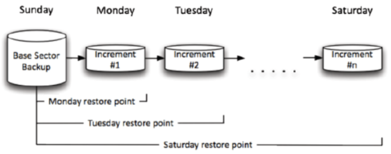
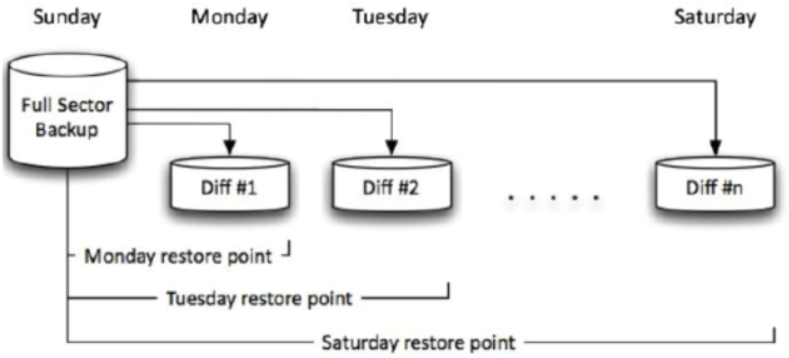
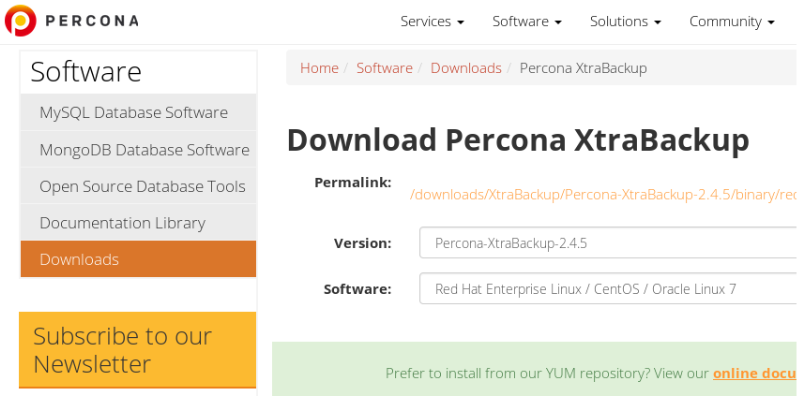

# 05.数据库备份管理

# 一、关于备份

## 备份原因

丢：硬盘坏了等

删：不小心删除了数据

## 备份目标

1. 数据的一致性：备份前后数据保持一致，不能说备份的数据比原始数据多了或者少了

2. 服务的可用性：是否需要停止掉数据库服务才能备份？

## 备份技术

物理备份/冷备份

* 直接复制数据库文件，适用于大型数据库环境，不受存储引擎的限制，但不能恢复到不同的MySQL版本。
* tar,cp,scp
* 拷贝数据，优点快，缺点是服务需要停止。

逻辑备份/热备份

* 备份的是建表、建库、插入等操作所执行SQL语句（DDL DML DCL），适用于中小型数据库。
* mysqldump、mydumper
* 效率相对较低

## 备份模式

* **完全备份：将数据库中所有的数据进行备份，数据量可能会比较大，会比较占用磁盘空间，备份消耗时间会相对比较长。**
* **增量备份**



连续恢复

特点：因每次仅备份自上一次备份（注意是上一次，不是第一次）以来有变化的文件，所以备份体积小，备份速度快，但是恢复的时候，需要按备份时间顺序，逐个备份版本进行恢复，恢复时间长。

* **差异备份**



跳跃恢复

特点：因每次仅备份自上一次完全备份以来有变化的文件，占用空间比增量备份大，比完整备份小，恢复时仅需要恢复第一个完整版本和最后一次的差异版本(包含所有的<u></u>差异)，恢复速度介于完整备份和增量备份之间。

# 二、XtraBackup概述

## 简介


它是开源免费的支持MySQL 数据库热备份的软件，它能对InnoDB和XtraDB存储引擎的数据库非阻塞地备份。

它不暂停服务创建Innodb热备份；为mysql做增量备份；在mysql服务器之间做在线表迁移；使创建replication更加容易；备份mysql而不增加服务器的负载。

percona是一家老牌的mysql技术咨询公司。它不仅提供mysql的技术支持、培训、咨询，还发布了mysql的分支版本--percona Server。并围绕percona Server还发布了一系列的mysql工具。

特点：热备份、物理备份！可以全量备份、可以增量备份、可以差异备份！

## 获得软件包

官方站点：<https://www.percona.com/>

选择版本：



## 安装yum仓库

安装percona公司的xtrabackup软件包的yum仓库

```shell
YUM安装perconna仓库
# yum -y install https://repo.percona.com/yum/percona-release-latest.noarch.rpm

如果无法直接安装，可以尝试先下载，再安装（也可以从我们资料中获取）
# wget https://repo.percona.com/yum/percona-release-latest.noarch.rpm
# yum install -y percona-release-latest.noarch.rpm

# yum repolist 
仓库 id                                 仓库名称
AppStream                               CentOS-9 - AppStream - mirrors.aliyun.com
base                                    CentOS-9 - Base - mirrors.aliyun.com
epel                                    Extra Packages for Enterprise Linux 9 - x86_64
extras-common                           CentOS Stream 9 - Extras packages
percona-release-noarch                  Percona Original release/noarch YUM repository
percona-release-x86_64                  Percona Original release/x86_64 YUM repository
prel-release-noarch                     Percona Release release/noarch YUM repository
```

## 安装XtraBackup命令

```shell
# yum -y install percona-xtrabackup-80
注意：xtrabackup8.0只支持mysql8.0以上的版本，mysql5.7或以下需要使用xtrabackup8.0以下的版本
```

**说明：使用上面的命令安装不了xtrabackup工具了，官方貌似将xtrabackup进行了封装！**

<font style="background-color:#FBDE28;">我们可以用下面的命令安装：</font>

```shell
下载percona-xtrabackup的软件安装包（下载不下来的从老师资料中获取）
# wget https://downloads.percona.com/downloads/Percona-XtraBackup-LATEST/Percona-XtraBackup-8.0.32-26/binary/redhat/9/x86_64/percona-xtrabackup-80-8.0.32-26.1.el9.x86_64.rpm

# ls
percona-xtrabackup-80-8.0.32-26.1.el9.x86_64.rpm

安装percona-xtrabackup软件
# yum -y install percona-xtrabackup-80-8.0.32-26.1.el9.x86_64.rpm
```

# 三、实战案例1

## 需求

使用xtrabackup实现对MySQL8.0数据库的全备、增备、差备、压缩备份！

热备份、物理备份！

## 全备案例

### 全备

说明：可以提前准备两个数据库，分别创建两张表，放一些数据。

```shell
第一步：创建目录，用来存放备份的数据文件
# mkdir -p /data/backup/base

第二步：对MySQL进行全量备份，也就是将MySQL中所有数据库的所有数据进行备份
# xtrabackup --defaults-file=/etc/my.cnf --backup --target-dir=/data/backup/base/ -uroot -pZhangSan@123 -H localhost -P 3306 --no-server-version-check

说明：
--defaults-file：指定MySQL的配置文件
--target-dir：指定备份的数据存放的位置
--no-server-version-check：不检查xtrabackup工具的版本和MySQL数据库的版本是否匹配

第三步：查看备份后的数据文件
# ls /data/backup/base/
backup-my.cnf         mysql               test2                   xtrabackup_info
ib_buffer_pool        mysql.ibd           undo_001                xtrabackup_logfile
ibdata1               performance_schema  undo_002                xtrabackup_tablespaces
localhost-bin.000007  sys                 xtrabackup_binlog_info
localhost-bin.index   test1               xtrabackup_checkpoints
```

### 恢复

```shell
1. 停止MySQL数据库服务
# systemctl stop mysqld

2. 删除MySQL数据库中所有的数据信息
# rm -rf /var/lib/mysql/*

3. 准备备份文件
# xtrabackup --prepare --target-dir=/data/backup/base

4. 开始恢复
# xtrabackup --defaults-file=/etc/my.cnf --copy-back --target-dir=/data/backup/base/

5. 授权（因为我们通过Linux系统中root用户进行恢复的文件，这些文件的拥有者、所属组都是root，所以需要将属主和属组都更改为mysql用户）
# chown -R mysql.mysql /var/lib/mysql

6. 重启数据库并登录数据库，可以看到数据库又恢复回来了
# systemctl restart mysqld
# mysql -uroot -pZhangSan@123
mysql> show databases;
+--------------------+
| Database           |
+--------------------+
| information_schema |
| mysql              |
| performance_schema |
| sys                |
| test1              |
| test2              |
+--------------------+
```

## 增备案例

### 增备1

比如：上面的全备是周日进行的，那么到了周一了，数据又有新变化了，我们进行增量备份！

所以，我们找到上面某个数据库中的某个表，可以增加一条数据后，然后进行增量备份。

```shell
1. 先给数据库中某个表增加一些数据

2. 第一次增量备份（是基于最近一次的备份，也就是上面的全量备份）
# xtrabackup --defaults-file=/etc/my.cnf --backup --target-dir=/data/backup/inc1/  --incremental-basedir=/data/backup/base/ -u root -plhp@123 -H localhost -P 3306 --no-server-version-check

说明：
--target-dir：增量备份存放数据的目录（不能和之前全量备份的放一起！不然就乱了）
--incremental-basedir：基于哪个备份做增量备份

3. 查看备份文件
# ls /data/backup/
base  inc1

# ls /data/backup/inc1/
backup-my.cnf         mysql               test2                   xtrabackup_checkpoints
ib_buffer_pool        mysql.ibd.delta     undo_001.delta          xtrabackup_info
ibdata1.delta         mysql.ibd.meta      undo_001.meta           xtrabackup_logfile
ibdata1.meta          performance_schema  undo_002.delta          xtrabackup_tablespaces
localhost-bin.000009  sys                 undo_002.meta
localhost-bin.index   test1               xtrabackup_binlog_info
```

### 增备2

上面已经进行了一次增量备份，比如今天到了周二了，我们又给数据库某张表中插入一条数据。晚上开始进行增量备份。（是针对上一次的备份进行增量备份，也就是基于上面的增备1进行备份）

```shell
1. 给数据库中某个表增加一些数据

2. 第二次增量备份（基于最近一次的备份，也就是上面的第一次增量备份）
# xtrabackup --defaults-file=/etc/my.cnf --backup --target-dir=/data/backup/inc2/  --incremental-basedir=/data/backup/inc1/ -u root  -plhp@123 -H localhost -P 3306 --no-server-version-check

3. 查看备份文件
# ls /data/backup/
base  inc1  inc2

# ls /data/backup/inc2/
backup-my.cnf         mysql               test2                   xtrabackup_checkpoints
ib_buffer_pool        mysql.ibd.delta     undo_001.delta          xtrabackup_info
ibdata1.delta         mysql.ibd.meta      undo_001.meta           xtrabackup_logfile
ibdata1.meta          performance_schema  undo_002.delta          xtrabackup_tablespaces
localhost-bin.000010  sys                 undo_002.meta
localhost-bin.index   test1               xtrabackup_binlog_info
```

### 整合增量备份数据

我们下面做的其实是将两次增量备份的数据，都整合到全量备份中！供我们后面的恢复数据使用！

```shell
注意最后一次把增量备份整合到完整备份时千万不要加 --apply-log-only
准备完整备份
# xtrabackup --defaults-file=/etc/my.cnf --prepare --apply-log-only --target-dir=/data/backup/base/

将第一次增量备份整合到完整备份中
# xtrabackup --defaults-file=/etc/my.cnf --prepare --apply-log-only --target-dir=/data/backup/base/ --incremental-dir=/data/backup/inc1/

将第二次增量备份整合到完整备份中，注意不要偷懒
# xtrabackup --defaults-file=/etc/my.cnf --prepare --target-dir=/data/backup/base/ --incremental-dir=/data/backup/inc2

这几步  --defaults-file="" 选项可以不用加
```

### 恢复到数据目录

```shell
全库级恢复要先停止数据库并清空数据目录

1. 停止数据库服务
# systemctl stop mysqld

2. 清空数据库数据文件
# rm -rf /var/lib/mysql/*

3. 恢复备份数据到数据库中
# xtrabackup --defaults-file=/etc/my.cnf --copy-back --target-dir=/data/backup/base/

4. 变更数据库文件的属主和属组为mysql
# chown -R mysql.mysql /var/lib/mysql

5. 启动数据库服务
# systemctl start mysqld

6. 登录数据库，查看恢复的数据中是否有周日的、周一的、周二的！
```

## 差异备份案例

### 思路

先将之前所有的备份数据都给删除。`rm -rf /data/backup/*`

差异备份步骤：

1. 进行一次全量备份（周日晚上）
2. 第一次差异备份：基于全量备份做差异备份（周一晚上）
3. 第二次差异备份：基于全量备份做差异备份（周二晚上）
4. 第三次差异备份：基于全量备份做差异备份（周三晚上）

差异备份恢复数据步骤：

1. 准备全量备份的数据
2. 将最后一次差异备份的数据整合到全量备份中
3. 将整合好的全量数据进行恢复（先手动删除，然后再恢复）

具体操作中，其实命令和之前的增量备份差不多，就是基于的备份不一样！！！

### 清除之前的备份数据

```shell
# rm -rf /data/backup/*
```

### 全量备份

```shell
# xtrabackup --defaults-file=/etc/my.cnf --backup --target-dir=/data/backup/base -uroot -pZhangSan@123 -H localhost -P 3306 --no-server-version-check

# ls /data/backup/
base

# ls /data/backup/base/
backup-my.cnf         mysql               test2                   xtrabackup_info
ib_buffer_pool        mysql.ibd           undo_001                xtrabackup_logfile
ibdata1               performance_schema  undo_002                xtrabackup_tablespaces
localhost-bin.000012  sys                 xtrabackup_binlog_info
localhost-bin.index   test1               xtrabackup_checkpoints
```

### 第一次差异备份

```shell
1. 给某个库中某个表随便加点数据

2. 进行第一次差异备份
# xtrabackup --defaults-file=/etc/my.cnf --backup --target-dir=/data/backup/inc1 --incremental-basedir=/data/backup/base -uroot -pZhangSan@123 -H localhost -P 3306 --no-server-version-check
```

### 第二次差异备份

```shell
1. 给某个库中某个表随便加点数据

2. 进行第二次差异备份（还是基于全量备份的）
# xtrabackup --defaults-file=/etc/my.cnf --backup --target-dir=/data/backup/inc2 --incremental-basedir=/data/backup/base -uroot -pZhangSan@123 -H localhost -P 3306 --no-server-version-check
```

### 第三次差异备份

```shell
1. 给某个库中某个表随便加点数据

2. 进行第三次差异备份（还是基于全量备份的）
# xtrabackup --defaults-file=/etc/my.cnf --backup --target-dir=/data/backup/inc3 --incremental-basedir=/data/backup/base -uroot -pZhangSan@123 -H localhost -P 3306 --no-server-version-check
```

### 整合差异备份数据

整合差异备份的数据：其实只需要将最后一次差异备份的数据整合到全量备份中即可！！！

```shell
准备完整备份
# xtrabackup --defaults-file=/etc/my.cnf --prepare --apply-log-only --target-dir=/data/backup/base/

将最后一次的差异备份（第三次差异备份）整合到完整备份中
# xtrabackup --defaults-file=/etc/my.cnf --prepare --target-dir=/data/backup/base/ --incremental-dir=/data/backup/inc3

这几步  --defaults-file="" 选项可以不用加
```

### 恢复到数据目录

删除数据库中数据文件，然后将上面整合好的备份数据恢复到数据库中。

```shell
全库级恢复要先停止数据库并清空数据目录

1. 停止数据库服务
# systemctl stop mysqld

2. 清空数据库数据文件
# rm -rf /var/lib/mysql/*

3. 恢复备份数据到数据库中
# xtrabackup --defaults-file=/etc/my.cnf --copy-back --target-dir=/data/backup/base/

4. 变更数据库文件的属主和属组为mysql
# chown -R mysql.mysql /var/lib/mysql

5. 启动数据库服务
# systemctl start mysqld

6. 登录数据库，查看恢复的数据中是否有周日的、周一的、周二的、周三的！
```

## 压缩备份案例

### 需求

使用xtrabackup工具，将数据库进行全量备份并压缩，这样可以节省空间！但是在恢复数据时，需要先解压缩，然后再恢复。

### 压缩备份

第一步：先将之前备份目录中的内容删除

```shell
# rm -rf /data/backup/*
```

第二步：进行压缩备份

```shell
# xtrabackup --defaults-file=/etc/my.cnf --backup --compress --target-dir=/data/backup/compressed -uroot -pZhangSan@123 -H localhost -P 3306 --no-server-version-check

如果要加速压缩，可以使用--compress-threads选项
--compress-threads=4   使用四个线程同时进行压缩
```

### 恢复数据到目录

第一步：安装解压缩命令，因为使用xtrabackup进行解压的时候，需要用到qpress命令，我们提前安装好

```shell
# yum -y install qpress
```

第二步：将压缩的备份数据进行解压缩

```shell
# xtrabackup --defaults-file=/etc/my.cnf --decompress --target-dir=/data/backup/compressed

说明：
--parallel可与--decompress选项一起使用以同时解压缩多个文件
使用 
--decompress解压备份数据时，解压工具是qpress。解压后的原文件不会被删除，可以使用--remove-original选项清除。
```

第三步：准备备份文件

```shell
# xtrabackup --prepare --target-dir=/data/backup/compressed
```

第四步：停止数据库服务，删除数据库中的数据

```shell
# systemctl stop mysqld
# rm -rf /var/lib/mysql/*
```

第五步：恢复数据到数据库

```shell
# xtrabackup --defaults-file=/etc/my.cnf --copy-back --target-dir=/data/backup/compressed
```

第六步：更改数据库文件的属主和属组

```shell
# chown -R mysql.mysql /var/lib/mysql
```

第七步：启动数据库服务，登录并查看数据是否恢复了

```shell
# systemctl start mysqld
# mysql -uroot -pZhangSan@123
mysql> select * from test1.emp;
```

# 四、实战案例2

使用`mysqldump + binlog`的方式进行数据库的备份与恢复。

## 优势

1 自动记录日志position位置。（show master  status\G;）

2 可用性（备份时不需要停数据库服务），一致性。（锁表机制）

热备份、逻辑备份！

## 语法

```shell
mysqldump  -h 服务器  -u用户名  -p密码   数据库名  > 备份文件.sql

帮助：
mysqldump --help
```

参数说明：

```shell
库的范围
-A, --all-databases	所有库
school	数据库名
school stu_info t1	是指school数据库的表stu_info、t1
-B, --dat abases bbs test mysql	多个数据库
```

```shell
--single-transaction                    #InnoDB 一致性 服务可用性
```

```shell
--master-data=1|2	#该选项将会记录binlog的日志位置与文件名并追加到文件中，或添加注释
```

```shell
高级选项
--opt 								#同时启动各种高级选项
-R, --routines			  #备份存储过程和存储函数
-F, --flush-logs		  #备份之前刷新日志，截断日志。备份之后新binlog。
--triggers						#备份触发器
```

## 备份实战

### 请准备两套root密码

```shell
密码1：ZhangSan@123，配置到当前数据库中。
密码2：LiHuPeng@123，备用
```

### 准备数据库

注意：可以清理掉之前创建的数据库，重新建一个数据库，并创建一张表，插入数据

```shell
mysql> show databases;
+--------------------+
| Database           |
+--------------------+
| information_schema |
| mysql              |
| performance_schema |
| sys                |
+--------------------+

mysql> create database test1;

mysql> use test1;

mysql> create table emp1(id int primary key auto_increment, name varchar(20));
mysql> insert into emp1 values(null, '孙悟空');
mysql> insert into emp1 values(null, '唐僧');
mysql> select * from emp1;
+----+-----------+
| id | name      |
+----+-----------+
|  1 | 孙悟空    |
|  2 | 唐僧      |
+----+-----------+

mysql> create table emp2(id int primary key auto_increment, name varchar(30));
mysql> insert into emp2 values(null, '曹操');
mysql> insert into emp2 values(null, '刘备');
mysql> select * from emp2;
+----+--------+
| id | name   |
+----+--------+
|  1 | 曹操   |
|  2 | 刘备   |
+----+--------+
```

### 执行备份

```shell
创建备份文件存放目录
# mkdir	/backup/

开始备份
# mysqldump -uroot -pZhangSan@123 --all-databases --single-transaction --master-data=2 --flush-logs > /backup/`date +%F-%H`-mysql-all.sql

说明：
master-data=2 注释掉日志记录

上面的备份命令，稍微有些过时（但是也可以使用），目前数据库提示需要用--source-data替换--master-data
WARNING: --master-data is deprecated and will be removed in a future version. Use --source-data instead.

新的备份写法（仅仅替换了--master-data选项，但是作用都一样，就是换了写法）
# mysqldump -uroot -pZhangSan@123 --all-databases --single-transaction --source-data=2 --flush-logs > /backup/`date +%F-%H`-mysql-all.sql
```

### 观察备份细节

```shell
# vim /backup/2023-01-25-14-mysql-all.sql
1095 LOCK TABLES `emp1` WRITE;	将表给锁住，不允许写入，只能读取
1096 /*!40000 ALTER TABLE `emp1` DISABLE KEYS */;
1097 INSERT INTO `emp1` VALUES (1,'孙悟空'),(2,'唐僧');
1098 /*!40000 ALTER TABLE `emp1` ENABLE KEYS */;
1099 UNLOCK TABLES;	解锁，备份完后，表又可以自由读写了

二进制日志截断位置。第24行
24 -- CHANGE MASTER TO MASTER_LOG_FILE='localhost-bin.000023', MASTER_LOG_POS=157;

说明：
mysqldump命令实现热备份的原理，就是在备份每张表时，会将该表进行锁住，不允许写入，只可以读取，然后在备份完之后，又将该表给解锁，就可以正常读写了。
```

### 备份后的，数据变更行为

```shell
在test1数据库的emp1表中插入两条数据，在emp2表中插入两条数据
mysql> insert into emp1 values(null, '沙僧');
mysql> insert into emp1 values(null, '白龙马');
mysql> select * from emp1;
+----+-----------+
| id | name      |
+----+-----------+
|  1 | 孙悟空    |
|  2 | 唐僧      |
|  3 | 沙僧      |
|  4 | 白龙马    |
+----+-----------+
mysql> insert into emp2 values(null, '关羽');
mysql> insert into emp2 values(null, '张飞');
mysql> select * from emp2;
+----+--------+
| id | name   |
+----+--------+
|  1 | 曹操   |
|  2 | 刘备   |
|  3 | 关羽   |
|  4 | 张飞   |
+----+--------+

创建test2数据库，创建一张表，插入一些数据
mysql> create database test2;
mysql> use test2;
mysql> create table student1(id int primary key auto_increment, name varchar(30));
mysql> insert into student1 values(null, '苏明玉');
mysql> insert into student1 values(null, '苏大强');
mysql> select * from student1;
+----+-----------+
| id | name      |
+----+-----------+
|  1 | 苏明玉    |
|  2 | 苏大强    |
+----+-----------+

切断二进制日志（重启数据库）
# systemctl restart mysqld

在test2数据库的表中插入一些数据
mysql> insert into student1 values(null, '苏明成');
mysql> select * from student1;
+----+-----------+
| id | name      |
+----+-----------+
|  1 | 苏明玉    |
|  2 | 苏大强    |
|  3 | 苏明成    |
+----+-----------+

创建test3数据库
然后删除test3数据库
mysql> create database test3;
mysql> drop database test3;
mysql> show databases;
+--------------------+
| Database           |
+--------------------+
| information_schema |
| mysql              |
| performance_schema |
| sys                |
| test1              |
| test2              |
+--------------------+
```

## 恢复实战

### 备份二进制日志文件

```shell
# cp /var/lib/mysql/*bin* ~
```

### 停止数据库

```shell
# systemctl stop mysqld
```

### 清理环境

```shell
# rm -rf /var/lib/mysql/*
```

### 启动数据库

```shell
# systemctl start mysqld

找密码，再改一下密码。请使用密码2
# grep 'password' /var/log/mysqld.log
Kyzw;u2dq<mh

# mysqladmin -uroot -p'at26zkMhx=ed' password 'LiHuPeng@123'
注意：语法要求password后面有空格。
```

说明：之前的xtrabackup恢复数据时，是恢复完才启动的数据库，因为在恢复的时候不需要连接数据库，只需要将数据文件放入`/var/lib/mysql`目录中即可！恢复完数据后，原来的用户、密码等都回来了！

但是现在使用mysqldump可不一样，它恢复数据时，需要连接数据库，所以，我们要启动数据库，而数据库里面什么也没有（之前都删除了），这时候就相当于是重新初始化数据库，那么密码就是随机生成的了，我们需要用随机密码然后改新密码！

### mysql恢复数据

```shell
# mysql -uroot -p'LiHuPeng@123' < /backup/2025-08-09-11-mysql-all.sql

请使用备份时密码？？？  试了 不行啊（应该是执行完上一步操作后，如果重启数据库后，就需要使用原来的密码登录了！！！因为恢复数据库后原来的密码也恢复回来了！）
# mysql -p'ZhangSan@123' -e 'flush privileges'

还是需要使用后来改的密码
# mysql -uroot -pLiHuPeng@123

登陆并验证数据恢复结果。请思考恢复的数据库有几个？
1个
```

说明：

本次恢复，恢复的只是上一次备份的数据，而上一次备份完之后，我们又做了很多数据库相关的操作，这时候数据库坏了！那自备份后做的操作相关的数据怎么恢复呢？？？

这就要使用二进制日志进行恢复了！

而二进制日志文件有很多，而且，每个二进制日志文件中记录了很多操作，我们应该从哪个二进制文件的哪个位置（也就是at xxx）开始恢复呢？

其实在上面的备份文件中的24行中已经记录了当时备份时所在的二进制文件及位置，我们只需要从该文件的该位置开始恢复，就可以将数据补完整！

简单来说，目前我们要恢复所有的数据：备份数据 + 二进制日志数据（备份点后的二进制日志数据）

### 二进制日志恢复

```shell
观察二进制截取记录，记录了当时备份时，截止的二进制日志文件和位置。
# vim /backup/2025-08-09-11-mysql-all.sql
24 -- CHANGE MASTER TO MASTER_LOG_FILE='localhost-bin.000023', MASTER_LOG_POS=157;

# mysqlbinlog localhost-bin.000023 localhost-bin.000024 --start-position=157 | mysql -uroot -pLiHuPeng@123

注意后续有多少日志，要跟多少日志名字。

登录MySQL数据库，查看数据是否完整了！！
```

### 观察数据

请思考数据是否恢复完整。

是完整的。

目前我们是使用mysqldump + binlog的方式实现了数据库的备份，并且如果备份后，还没到下一次备份时间点，但是数据库损坏，我们可以通过binlog实现数据的恢复。

其实上面使用xtrabackup的方式也可能会发生这种情况，当在周一凌晨1点备份后，在周二凌晨1点备份前发生了数据库损坏的问题，这时候，我们就需要通过恢复周一凌晨1点备份的数据，再加上1点备份之后对数据库做的所有操作（使用binlog进行恢复）。和上面的binlog使用是一样的！！！

### 请思考误删除的问题（了解）

如何保留上面操作中删除了的test3数据库：

```shell
# mysqlbinlog  localhost-bin.00004      ......005.....006...... > 1.txt
删除1.txt中不需要的at（比如test3库是误操作）
cat  1.txt | mysql -p'lhp@123'
```

其实就是将二进制日志文件中删除test3数据库的那一段at操作给删除，然后将目前已经恢复好的数据文件全部删除，重新利用备份文件+二进制日志文件进行恢复。这样的话之前误删除的数据库就回来了！

### 关于数据恢复时的多余日志（了解）

方法一：

```shell
原因：每次还原数据库时数据库的二进制日志文件也会做记录，会增加日志的体积。但这些都是还原操作。恢复数据库的日志占用了存储空间。

解决：
1. 在恢复备份数据前关闭二进制日志
mysql> set sql_log_bin=0  

2. 恢复备份数据
mysql> source /backup/*.sql

3. 恢复二进制日志数据

最后观察：二进制日志文件的大小并没有发生变化。做完后，记得再将二进制日志开启了
```

方法二：

在备份文件中，加入关闭二进制日志。

# 五、实战案例3

本次案例是进行MySQL数据库中记录的导出和导入。

比如：我们将某张表中的某些数据导出到外部的一个文本文件中。

## 记录导出

### 注意目录权限

比如：我们将某个表中的一些数据导出到`/backup`目录中，但是MySQL数据库本身是不信任别的目录的，我们是需要告诉MySQL让他信任该目录！

```shell
# vim /etc/my.cnf
使MySQL信任该目录
secure-file-priv=/backup

重启MySQL服务
# systemctl restart mysqld

更改目录的属主和属组为mysql用户
# chown mysql.mysql /backup
```

### SELECT... INTO OUTFILE 导出文本文件

查询你需要的数据，然后导出到文件中。

```shell
mysql> select * from test1.emp1 where id>1 into outfile '/backup/test1.emp1.txt';

查看文件中的数据
# cat /backup/test1.emp1.txt
2       唐僧
3       沙僧
4       白龙马
```

错误提示1：

```shell
mysql> select * from t1 where id1=44  into outfile '/backup/1.sql';
ERROR 1290 (HY000): The MySQL server is running with the --secure-file-priv option so it cannot execute this statement
MYSQL的运行需要安全的文件权限 选项才可保存。

解决：
授权目录
secure-file-priv=/backup
```

错误提示2：

```shell
mysql> select * from t1 where id1=44  into outfile '/abc/1.sql';
ERROR 1 (HY000): Can't create/write to file '/abc/1.sql' (Errcode: 13 - Permission denied)
```

错误提示3：

```shell
语法错误。命令输错了。
mysql> select * from haha.t3 where id>5  outfile '/backup/haha.t3.txt' ;
ERROR 1064 (42000): You have an error in your SQL syntax; check the manual that corresponds to your MySQL server version for the right syntax to use near 'outfile '/backup/haha.t3.txt'' at line 1
```

错误提示4：

```shell
文件已经存在
mysql> select * from haha.t3 where id>5  into  outfile '/backup/haha.t3.txt'
 fields terminated by '---'  ;
ERROR 1086 (HY000): File '/backup/haha.t3.txt' already exists
```

定义字段分隔符

```shell
FIELDS TERMINATED BY '---'	
```

### mysql 命令导出文本文件

```shell
不登录MySQL中，直接通过命令导出
# mysql -uroot -pZhangSan@123 -e "select * from test1.emp1" > /backup/test1.emp1_1.txt

指定导出的文件中使用xml形式表示数据
# mysql -uroot -pZhangSan@123 --xml -e "select * from test1.emp1" > /backup/test1.emp1_2.txt

指定导出的文件中使用html形式表示数据
# mysql -uroot -pZhangSan@123 --html -e "select * from test1.emp1" > /backup/test1.emp1_3.txt
```

## LOAD DATA INFILE 导入文本文件

### 注意目录权限

```shell
# vim /etc/my.cnf
让MySQL信任该目录
secure-file-priv=/backup

mysql用户没有权限
# chown mysql.mysql /backup
```

### 删除之前的数据

```shell
删除表的内容
表的导出和导入只备份表记录，不会备分表结构。因此需要通过mysqldump备份表结构，恢复时先恢复表结构，再导入数据。
# mysql -uroot -pZhangSan@123
mysql> delete from test1.emp1;
mysql> select * from test1.emp1;
Empty set (0.00 sec)
```

### 读取记录备份文件

加载外部的文本文件中数据到数据库表中！

```shell
mysql> load data infile '/backup/test1.emp1.txt' into table test1.emp1;
```

### 测试

```shell
mysql> select * from test1.emp1;
+----+-----------+
| id | name      |
+----+-----------+
|  2 | 唐僧      |
|  3 | 沙僧      |
|  4 | 白龙马    |
+----+-----------+
```

# 六、参考

## percona-xtrabackup24（mysql57）

### 简介


它是开源免费的支持MySQL 数据库热备份的软件，它能对InnoDB和XtraDB存储引擎的数据库非阻塞地备份。

它不暂停服务创建Innodb热备份；为mysql做增量备份；在mysql服务器之间做在线表迁移；使创建replication更加容易；备份mysql而不增加服务器的负载。

percona是一家老牌的mysql技术咨询公司。它不仅提供mysql的技术支持、培训、咨询，还发布了mysql的分支版本--percona Server。并围绕percona Server还发布了一系列的mysql工具。

### 获得软件包

官方站点：<https://www.percona.com/>

选择版本：


### 安装

#### 安装YUM仓库

安装percona需要的mysql包

```shell
mysql官方源
yum install -y  https://repo.mysql.com//mysql80-community-release-el7-3.noarch.rpm

yum工具
yum install -y yum-utils

查看mysql可用版本
yum repolist all | grep mysql

禁用80
yum-config-manager --disable mysql80-community

启用57
yum-config-manager --enable mysql57-community

yum  install mysql-community-libs-compat -y
```

```shell
yum install https://repo.percona.com/yum/percona-release-latest.noarch.rpm
```

#### YUM安装percona-xtrabackup

```shell
安装percona
yum -y install percona-xtrabackup-24.x86_64
```

本地RPM包参考软件资料。

查询安装结果

```shell
rpm -ql percona-xtrabackup-24 
```

### 完全备份流程

```shell
连接数据库，开始备份。
innobackupex --user=root --password='lhp@123' /xtrabackup/full

请注意备份结果是否完成
xtrabackup: Transaction log of lsn (74182721) to (74182730) was copied.
171127 15:04:12 completed OK!

查看备份目录。数据库，配置文件，日志文件
ls /xtrabackup/full/

观看二进制日志位置
cat /xtrabackup/full/2017-08-01_00-00-18/xtrabackup_binlog_info 
```

### 完全恢复流程

```shell
停止数据库
systemctl stop mysqld

清理环境（模拟损坏）
rm -rf /var/lib/mysql/*
rm -rf /var/log/mysqld.log 

生成回滚日志，指定备份点
innobackupex --apply-log /xtrabackup/full/2017-08-01_00-00-18/

恢复文件
innobackupex --copy-back /xtrabackup/full/2017-08-01_00-00-18/

登陆验证
ls /var/lib/mysql
chown -R mysql.mysql /var/lib/mysql
systemctl start mysqld
mysql -uroot -p'lhp@123'
```

### 增量备份流程

#### 准备工作

```shell
使用指定的数据库
create database testdb;
use testdb;
create table test(id int);
insert into test values (1);
mysql> select * from test;
+------+
| id   |
+------+
|    1 |
+------+
1 row in set (0.00 sec)
```

#### 完整备份：周一

```shell
# rm -rf /xtrabackup/*

时间建议靠后设置。
# date 09010000

# innobackupex --user=root --password='lhp@123' /xtrabackup

# ll /xtrabackup/
2017-09-01_00-00-04

请问数据库中的记录是多少？
1
```

#### 增量备份：周二

```shell
更新时间
# date 09020000
	
# mysql -uroot -p'lhp@123' -e  'insert into testdb.test values (2)'

# mysql -uroot -p'lhp@123' -e 'select * from testdb.test'

basedir基于周一的备份。会生成一个今天的。
# innobackupex --user=root --password='lhp@123' --incremental /xtrabackup/ --incremental-basedir=/xtrabackup/2017-09-01_00-00-04
	

# ls /xtrabackup/
2017-09-01_00-00-04  
2017-09-02_00-00-58
```

#### 增量备份：周三

```shell
# date 09030000
# mysql -uroot -p'lhp@123' -e  'insert into testdb.test values (3)'

basedir基于周2的备份。会生成一个今天的。
# innobackupex --user=root --password='lhp@123' --incremental /xtrabackup/  --incremental-basedir=/xtrabackup/2017-09-02_00-00-26
	
# ls  /xtrabackup/
2017-09-01_00-00-04  
2017-09-02_00-00-58
2017-09-03_00-00-36
```

周四、周五、周六等等道理一样。

### 增量恢复流程

```shell
停止数据库
# systemctl stop mysqld

清理环境
# rm -rf /var/lib/mysql/*

周一，回滚合并
# innobackupex --apply-log --redo-only /xtrabackup/2017-09-01_00-00-04

周二
# innobackupex --apply-log --redo-only /xtrabackup/2017-09-01_00-00-04 --incremental-dir=/xtrabackup/2017-09-02_00-00-26

恢复
# innobackupex --copy-back /xtrabackup/2017-09-01_00-00-06  
# chown -R mysql.mysql /var/lib/mysql
# systemctl start mysqld

登陆查询记录。请思考记录是第几天的。
想恢复3，怎么办
# systemctl stop mysqld
# innobackupex --apply-log --redo-only /xtrabackup/2017-09-01_00-00-04 --incremental-dir=/xtrabackup/2017-09-03_00-00-27
# rm -rf /var/lib/mysql/*
# innobackupex --copy-back /xtrabackup/2017-09-01_00-00-04 
# chown -R mysql.mysql /var/lib/mysql
# systemctl start mysqld
# mysql -uroot -p'lhp@123' -e 'select * from testdb.test'

请思考，如何一次性把数据，周一，周二，周三恢复出来？
```

### 差异备份流程

```shell
# rm -rf /xtrabackup/*
```

#### 周一完整备份

```shell
# date 10010000
mysql> create database testdb;
mysql> use testdb;
mysql> create table test2(id int);
mysql> insert into test2 values(1);
mysql> select * from test2;
# innobackupex --user=root --password='lhp@123' /xtrabackup
# ll /xtrabackup/
```

#### 周二差异备份

```shell
# date 10020000
# mysql -uroot -p'lhp@123' -e 'insert into testdb.test2 values(2)'
# innobackupex --user=root --password='lhp@123' --incremental /xtrabackup --incremental-basedir=/xtrabackup/2017-10-01_00-01-12

完全备份目录（周一）
# ll /xtrabackup/
# du -sh /xtrabackup/
```

#### 周三差异备份

```shell
# date 10030000
# mysql -uroot -p'lhp@123' -e 'insert into testdb.test2 values(3)'
# innobackupex --user=root --password='lhp@123' --incremental /xtrabackup --incremental-basedir=/xtrabackup/2017-10-01_00-01-12

完全备份目录（周一）
# ll /xtrabackup/
# du -sh /xtrabackup/
```

#### 周四差异备份

```shell
# date 10040000
# mysql -uroot -p'lhp@123' -e 'insert into testdb.test2 values(4)'
# innobackupex --user=root --password='lhp@123' --incremental /xtrabackup --incremental-basedir=/xtrabackup/2017-10-01_00-01-12

完全备份目录（周一）
# ll /xtrabackup/
# du -sh /xtrabackup/
```

### 差异恢复流程

```shell
停止数据库
# systemctl stop mysqld

清理环境
# rm -rf /var/lib/mysql/*

重演回滚redo log（周一，某次差异）－－> 恢复数据
# innobackupex --apply-log --redo-only /xtrabackup/2017-10-01_00-01-12
# innobackupex --apply-log --redo-only /xtrabackup/2017-10-01_00-01-12 --incremental-dir=/xtrabackup/2017-10-04_00-00-29

# innobackupex --copy-back /xtrabackup/2017-10-01_00-01-12

修改权限
# chown -R mysql.mysql /var/lib/mysql/

启动mysqld
# systemctl start mysqld

通过binlog增量恢复（略）
请思考能否直接还原到周三？
```


> 更新: 2026-02-02 20:09:38  
> 原文: <https://www.yuque.com/u41736172/az9urv/hvttqdgwq79nfg93>