# 06.数据库代理服务和集群管理

# 一、集群概述

MySQL的集群也可以称为MySQL 复制技术。

**集群**：就是有很多台服务器，他们做的是同一样事情，比如MySQL集群，那么就是有许多MySQL服务器，他们都是提供数据服务的。

在实际工作中，仅有一台数据库服务器是顶不住压力的，如果它宕机了，那整个项目就无法运行了。

所以，我们一般会整好几台数据库服务器，他们都可以提供数据服务，也就是数据库集群，这样有一台宕机了也是可以保证项目正常运行的。

如果有多台数据库服务器，那么就需要确保这多台数据库服务器之间数据同步的问题，也就是说数据库集群中的每台数据库服务器，都要保证数据的一致！

## 集群目的

* 负载均衡：解决高并发
* 高可用HA：服务可用性
* 远程灾备：数据有效性

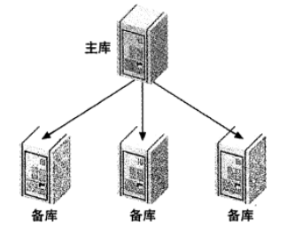

## 类型

* M
* M-S
* M-S-S...
* M-M
* M-M-S-S

## 原理图示（重点）

### 图示1

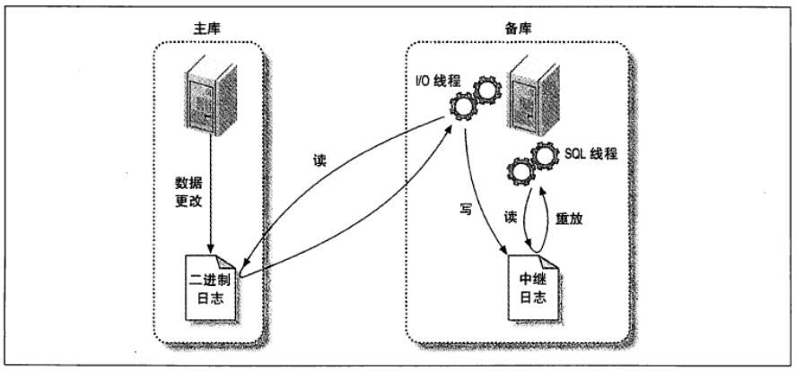

主从复制的原理：

1. 主数据库必须开启二进制日志功能，这样，我们对于主数据库的所有的写操作都会被记录到

二进制日志文件中

2. 从数据库会开启一个IO线程，去读取主数据库中的二进制日志文件，将信息放入到中继日志文件中

3. 从数据库会开启一个sql线程，去读取中继日志中的内容并执行，就实现主从数据库的同步！！！

### 图示2

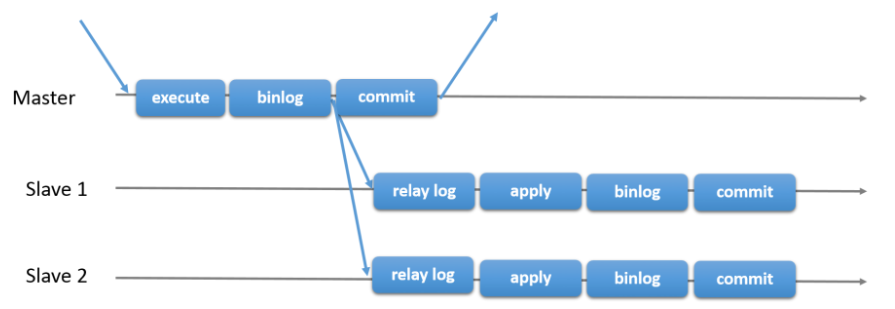

### 概念

1. 在主库上把数据更改（DDL DML DCL）记录到二进制日志（Binary Log）中。

2. 备库I/O线程将主库上的日志复制到自己的中继日志（Relay Log）中。

3. 备库SQL线程读取中继日志中的事件，将其重放到备库数据库之上。

# 二、集群案例

## 环境

### 环境三部曲

1. 全新克隆的Linux服务器-互相通信
2. 全新安装mysql80-分别安装，使用rpm的方式
3. 配置域名解析-更改hosts文件

**克隆5台Linux服务器，规划如下：**

| 编号 | IP地址 | 主机名 | 描述 |
| --- | --- | --- | --- |
| 1 | 192.168.126.181 | master1.lhp.com | MySQL主服务器1 |
| 2 | 192.168.126.182 | master2.lhp.com | MySQL主服务器2 |
| 3 | 192.168.126.183 | slave1.lhp.com | MySQL从服务器1 |
| 4 | 192.168.126.184 | slave2.lhp.com | MySQL从服务器2 |
| 5 | 192.168.126.185 | mycat.lhp.com | mycat代理服务器 |

> 因为这次实验用到的Linux服务器有点多，怕自己电脑会很卡，我们将每台Linux服务器的内存设置为800M。

### 注意

请重新安装多台数据库，不要克隆已经安装了数据库的系统。因为数据库的ID相同。

### master1服务器

第一步：修改IP地址和主机名

```shell
修改IP地址
# nmcli connection modify ens33 ipv4.addresses 192.168.126.181/24
# nmcli connection up ens33

修改主机名
# hostnamectl set-hostname master1.lhp.com
# su
```

第二步：上传MySQL数据库的yum仓库，并安装仓库

```shell
上传的是：mysql80-community-release-el9-1.noarch.rpm

安装MySQL的yum仓库
# yum -y install mysql80-community-release-el9-1.noarch.rpm
```

第三步：安装的MySQL的yum仓库配套的gpg文件过时，需要更新

```shell
# vim /etc/pki/rpm-gpg/RPM-GPG-KEY-mysql-2022
-----BEGIN PGP PUBLIC KEY BLOCK-----
Version: SKS 1.1.6
Comment: Hostname: pgp.mit.edu

mQINBGU2rNoBEACSi5t0nL6/Hj3d0PwsbdnbY+SqLUIZ3uWZQm6tsNhvTnahvPPZBGdl99iW
YTt2KmXp0KeN2s9pmLKkGAbacQP1RqzMFnoHawSMf0qTUVjAvhnI4+qzMDjTNSBq9fa3nHmO
YxownnrRkpiQUM/yD7/JmVENgwWb6akZeGYrXch9jd4XV3t8OD6TGzTedTki0TDNr6YZYhC7
jUm9fK9Zs299pzOXSxRRNGd+3H9gbXizrBu4L/3lUrNf//rM7OvV9Ho7u9YYyAQ3L3+OABK9
FKHNhrpi8Q0cbhvWkD4oCKJ+YZ54XrOG0YTg/YUAs5/3//FATI1sWdtLjJ5pSb0onV3LIbar
RTN8lC4Le/5kd3lcot9J8b3EMXL5p9OGW7wBfmNVRSUI74Vmwt+v9gyp0Hd0keRCUn8lo/1V
0YD9i92KsE+/IqoYTjnya/5kX41jB8vr1ebkHFuJ404+G6ETd0owwxq64jLIcsp/GBZHGU0R
KKAo9DRLH7rpQ7PVlnw8TDNlOtWt5EJlBXFcPL+NgWbqkADAyA/XSNeWlqonvPlYfmasnAHA
pMd9NhPQhC7hJTjCiAwG8UyWpV8Dj07DHFQ5xBbkTnKH2OrJtguPqSNYtTASbsWz09S8ujoT
DXFT17NbFM2dMIiq0a4VQB3SzH13H2io9Cbg/TzJrJGmwgoXgwARAQABtDZNeVNRTCBSZWxl
YXNlIEVuZ2luZWVyaW5nIDxteXNxbC1idWlsZEBvc3Mub3JhY2xlLmNvbT6JAlQEEwEIAD4W
IQS8pDQXw7SF3RKOxtS3s7eIqNN4XAUCZTas2gIbAwUJA8JnAAULCQgHAgYVCgkICwIEFgID
AQIeAQIXgAAKCRC3s7eIqNN4XLzoD/9PlpWtfHlI8eQTHwGsGIwFA+fgipyDElapHw3MO+K9
VOEYRZCZSuBXHJe9kjGEVCGUDrfImvgTuNuqYmVUV+wyhP+w46W/cWVkqZKAW0hNp0TTvu3e
Dwap7gdk80VF24Y2Wo0bbiGkpPiPmB59oybGKaJ756JlKXIL4hTtK3/hjIPFnb64Ewe4YLZy
oJu0fQOyA8gXuBoalHhUQTbRpXI0XI3tpZiQemNbfBfJqXo6LP3/LgChAuOfHIQ8alvnhCwx
hNUSYGIRqx+BEbJw1X99Az8XvGcZ36VOQAZztkW7mEfH9NDPz7MXwoEvduc61xwlMvEsUIaS
fn6SGLFzWPClA98UMSJgF6sKb+JNoNbzKaZ8V5w13msLb/pq7hab72HH99XJbyKNliYj3+KA
3q0YLf+Hgt4Y4EhIJ8x2+g690Np7zJF4KXNFbi1BGloLGm78akY1rQlzpndKSpZq5KWw8FY/
1PEXORezg/BPD3Etp0AVKff4YdrDlOkNB7zoHRfFHAvEuuqti8aMBrbRnRSG0xunMUOEhbYS
/wOOTl0g3bF9NpAkfU1Fun57N96Us2T9gKo9AiOY5DxMe+IrBg4zaydEOovgqNi2wbU0MOBQ
b23Puhj7ZCIXcpILvcx9ygjkONr75w+XQrFDNeux4Znzay3ibXtAPqEykPMZHsZ2sbkCDQRl
NqzaARAAsdvBo8WRqZ5WVVk6lReD8b6Zx83eJUkV254YX9zn5t8KDRjYOySwS75mJIaZLsv0
YQjJk+5rt10tejyCrJIFo9CMvCmjUKtVbgmhfS5+fUDRrYCEZBBSa0Dvn68EBLiHugr+SPXF
6o1hXEUqdMCpB6oVp6X45JVQroCKIH5vsCtw2jU8S2/IjjV0V+E/zitGCiZaoZ1f6NG7ozyF
ep1CSAReZu/sssk0pCLlfCebRd9Rz3QjSrQhWYuJa+eJmiF4oahnpUGktxMD632I9aG+IMfj
tNJNtX32MbO+Se+cCtVc3cxSa/pR+89a3cb9IBA5tFF2Qoekhqo/1mmLi93Xn6uDUhl5tVxT
nB217dBT27tw+p0hjd9hXZRQbrIZUTyh3+8EMfmAjNSIeR+th86xRd9XFRr9EOqrydnALOUr
9cT7TfXWGEkFvn6ljQX7f4RvjJOTbc4jJgVFyu8K+VU6u1NnFJgDiNGsWvnYxAf7gDDbUSXE
uC2anhWvxPvpLGmsspngge4yl+3nv+UqZ9sm6LCebR/7UZ67tYz3p6xzAOVgYsYcxoIUuEZX
jHQtsYfTZZhrjUWBJ09jrMvlKUHLnS437SLbgoXVYZmcqwAWpVNOLZf+fFm4IE5aGBG5Dho2
CZ6ujngW9Zkn98T1d4N0MEwwXa2V6T1ijzcqD7GApZUAEQEAAYkCPAQYAQgAJhYhBLykNBfD
tIXdEo7G1Lezt4io03hcBQJlNqzaAhsMBQkDwmcAAAoJELezt4io03hcXqMP/01aPT3A3Sg7
oTQoHdCxj04ELkzrezNWGM+YwbSKrR2LoXR8zf2tBFzc2/Tl98V0+68f/eCvkvqCuOtq4392
Ps23j9W3r5XG+GDOwDsx0gl0E+Qkw07pwdJctA6efsmnRkjF2YVO0N9MiJA1tc8NbNXpEEHJ
Z7F8Ri5cpQrGUz/AY0eae2b7QefyP4rpUELpMZPjc8Px39Fe1DzRbT+5E19TZbrpbwlSYs1i
CzS5YGFmpCRyZcLKXo3zS6N22+82cnRBSPPipiO6WaQawcVMlQO1SX0giB+3/DryfN9VuIYd
1EWCGQa3O0MVu6o5KVHwPgl9R1P6xPZhurkDpAd0b1s4fFxin+MdxwmG7RslZA9CXRPpzo7/
fCMW8sYOH15DP+YfUckoEreBt+zezBxbIX2CGGWEV9v3UBXadRtwxYQ6sN9bqW4jm1b41vNA
17b6CVH6sVgtU3eN+5Y9an1e5jLD6kFYx+OIeqIIId/TEqwS61csY9aav4j4KLOZFCGNU0FV
ji7NQewSpepTcJwfJDOzmtiDP4vol1ApJGLRwZZZ9PB6wsOgDOoP6sr0YrDI/NNX2RyXXbgl
nQ1yJZVSH3/3eo6knG2qTthUKHCRDNKdy9Qqc1x4WWWtSRjh+zX8AvJK2q1rVLH2/3ilxe9w
cAZUlaj3id3TxquAlud4lWDz
=h5nH
-----END PGP PUBLIC KEY BLOCK-----
```

第四步：仅下载MySQL数据库相关的rpm安装包，先不安装，并且将下载好的安装包复制到家目录中（我们打算将这次下载的MySQL安装包给保留下来，然后分别传递给其他3个数据库服务器使用，不然每次下载太耗时间）

```shell
# yum -y install --downloadonly mysql-community-server

查看下载好的MySQL安装包
# ls /var/cache/dnf/mysql80-community-22d3d3ecd3d92106/packages/
mysql-community-client-8.0.43-1.el9.x86_64.rpm
mysql-community-client-plugins-8.0.43-1.el9.x86_64.rpm
mysql-community-common-8.0.43-1.el9.x86_64.rpm
mysql-community-icu-data-files-8.0.43-1.el9.x86_64.rpm
mysql-community-libs-8.0.43-1.el9.x86_64.rpm
mysql-community-server-8.0.43-1.el9.x86_64.rpm

复制到家目录中
# cp /var/cache/dnf/mysql80-community-22d3d3ecd3d92106/packages/* ~

# ls /root
anaconda-ks.cfg
mysql80-community-release-el9-1.noarch.rpm
mysql-community-client-8.0.43-1.el9.x86_64.rpm
mysql-community-client-plugins-8.0.43-1.el9.x86_64.rpm
mysql-community-common-8.0.43-1.el9.x86_64.rpm
mysql-community-icu-data-files-8.0.43-1.el9.x86_64.rpm
mysql-community-libs-8.0.43-1.el9.x86_64.rpm
mysql-community-server-8.0.43-1.el9.x86_64.rpm
```

第五步：安装MySQL数据库

```shell
在家目录中执行安装命令，这样就会将6个安装包自动安装好，如果我们一个个安装需要知道先后顺序解决依赖关系！
# yum -y install *.rpm
```

第六步：启动MySQL服务并设置为开机自启

```shell
# systemctl start mysqld
# systemctl enable mysqld
```

第七步：查找MySQL随机密码，并改密码

```shell
# grep password /var/log/mysqld.log
2025-08-10T10:10:08.247191Z 6 [Note] [MY-010454] [Server] A temporary password is generated for root@localhost: !89peMkWkhqF

# mysqladmin -uroot -p'!89peMkWkhqF' password 'LiHuPeng@123'
```

第八步：使用新密码登录MySQL

```shell
# mysql -uroot -pLiHuPeng@123
mysql> show databases;
+--------------------+
| Database           |
+--------------------+
| information_schema |
| mysql              |
| performance_schema |
| sys                |
+--------------------+
```

第九步：设置域名解析

```shell
# vim /etc/hosts
192.168.126.181 master1.lhp.com
192.168.126.182 master2.lhp.com
192.168.126.183 slave1.lhp.com
192.168.126.184 slave2.lhp.com
192.168.126.185 mycat.lhp.com
```

### master2服务器

第一步：修改IP地址和主机名

```shell
修改IP地址
# nmcli connection modify ens33 ipv4.addresses 192.168.126.182/24
# nmcli connection up ens33

修改主机名
# hostnamectl set-hostname master2.lhp.com
# su
```

第二步：在master1服务器中使用scp命令，将MySQL安装包发送给master2服务器。这样我们的master2服务器中就有MySQL数据库安装包了，也就不需要安装MySQL的yum仓库再自己下载了！！！

```shell
在master1服务器上操作
# scp *.rpm master2.lhp.com:/root/
The authenticity of host 'master2.lhp.com (192.168.126.182)' can't be established.
ED25519 key fingerprint is SHA256:XVx5COjokgFfMkuii+fjRWfVkgwtsbcXcSWQwQBEPYs.
This key is not known by any other names
Are you sure you want to continue connecting (yes/no/[fingerprint])? yes
Warning: Permanently added 'master2.lhp.com' (ED25519) to the list of known hosts.
root@master2.lhp.com's password:123456
Warning: your password will expire in 0 days.
mysql-community-client-8.0.43-1.el9.x86_64.rpm  100% 3412KB  47.6MB/s   00:00
mysql-community-client-plugins-8.0.43-1.el9.x86 100% 1413KB  88.9MB/s   00:00
mysql-community-common-8.0.43-1.el9.x86_64.rpm  100%  556KB  43.5MB/s   00:00
mysql-community-icu-data-files-8.0.43-1.el9.x86 100% 2348KB  67.1MB/s   00:00
mysql-community-libs-8.0.43-1.el9.x86_64.rpm    100% 1492KB  66.5MB/s   00:00
mysql-community-server-8.0.43-1.el9.x86_64.rpm  100%   50MB  57.8MB/s   00:00

在master2服务器上操作
# ls
anaconda-ks.cfg
mysql-community-client-8.0.43-1.el9.x86_64.rpm
mysql-community-client-plugins-8.0.43-1.el9.x86_64.rpm
mysql-community-common-8.0.43-1.el9.x86_64.rpm
mysql-community-icu-data-files-8.0.43-1.el9.x86_64.rpm
mysql-community-libs-8.0.43-1.el9.x86_64.rpm
mysql-community-server-8.0.43-1.el9.x86_64.rpm
```

第三步：安装MySQL数据库

```shell
# yum -y install *.rpm
```

第四步：启动MySQL服务并设置为开机自启

```shell
# systemctl start mysqld
# systemctl enable mysqld
或者用下面的命令一条就能搞定启动加开启自启
# systemctl enable mysqld --now
```

第五步：查找MySQL随机密码，并改密码

```shell
# grep password /var/log/mysqld.log
2025-08-10T10:10:08.247191Z 6 [Note] [MY-010454] [Server] A temporary password is generated for root@localhost: !89peMkWkhqF

# mysqladmin -uroot -p'!89peMkWkhqF' password 'LiHuPeng@123'
```

第六步：使用新密码登录MySQL

```shell
# mysql -uroot -pLiHuPeng@123
mysql> show databases;
+--------------------+
| Database           |
+--------------------+
| information_schema |
| mysql              |
| performance_schema |
| sys                |
+--------------------+
```

第七步：设置域名解析

```shell
# vim /etc/hosts
192.168.126.181         master1.lhp.com
192.168.126.182         master2.lhp.com
192.168.126.183         slave1.lhp.com
192.168.126.184         slave2.lhp.com
192.168.126.185         mycat.lhp.com

或者可以直接在master1上面使用scp命令将host文件拷贝过来
# scp /etc/hosts master2.lhp.com:/etc/
```

### slave1服务器

第一步：修改IP地址和主机名

```shell
修改IP地址
# nmcli connection modify ens33 ipv4.addresses 192.168.126.183/24
# nmcli connection up ens33

修改主机名
# hostnamectl set-hostname slave1.lhp.com
# su
```

第二步：在master1服务器中使用scp命令，将MySQL安装包发送给master2服务器。这样我们的slave1服务器中就有MySQL数据库安装包了，也就不需要安装MySQL的yum仓库再自己下载了！！！

```shell
在master1服务器上操作
# scp *.rpm slave1.lhp.com:/root/
The authenticity of host 'slave1.lhp.com (192.168.126.183)' can't be established.
ED25519 key fingerprint is SHA256:XVx5COjokgFfMkuii+fjRWfVkgwtsbcXcSWQwQBEPYs.
This key is not known by any other names
Are you sure you want to continue connecting (yes/no/[fingerprint])? yes
Warning: Permanently added 'slave1.lhp.com' (ED25519) to the list of known hosts.
root@slave1.lhp.com's password:123456
Warning: your password will expire in 0 days.
mysql-community-client-8.0.43-1.el9.x86_64.rpm  100% 3412KB  47.6MB/s   00:00
mysql-community-client-plugins-8.0.43-1.el9.x86 100% 1413KB  88.9MB/s   00:00
mysql-community-common-8.0.43-1.el9.x86_64.rpm  100%  556KB  43.5MB/s   00:00
mysql-community-icu-data-files-8.0.43-1.el9.x86 100% 2348KB  67.1MB/s   00:00
mysql-community-libs-8.0.43-1.el9.x86_64.rpm    100% 1492KB  66.5MB/s   00:00
mysql-community-server-8.0.43-1.el9.x86_64.rpm  100%   50MB  57.8MB/s   00:00

在slave1服务器上操作
# ls
anaconda-ks.cfg
mysql-community-client-8.0.43-1.el9.x86_64.rpm
mysql-community-client-plugins-8.0.43-1.el9.x86_64.rpm
mysql-community-common-8.0.43-1.el9.x86_64.rpm
mysql-community-icu-data-files-8.0.43-1.el9.x86_64.rpm
mysql-community-libs-8.0.43-1.el9.x86_64.rpm
mysql-community-server-8.0.43-1.el9.x86_64.rpm
```

第三步：安装MySQL数据库

```shell
# yum -y install *.rpm
```

第四步：启动MySQL服务并设置为开机自启

```shell
# systemctl start mysqld
# systemctl enable mysqld
或者
# systemctl enable mysqld --now
```

第五步：查找MySQL随机密码，并改密码

```shell
# grep password /var/log/mysqld.log
2025-08-10T10:10:08.247191Z 6 [Note] [MY-010454] [Server] A temporary password is generated for root@localhost: !89peMkWkhqF

# mysqladmin -uroot -p'!89peMkWkhqF' password 'LiHuPeng@123'
```

第六步：使用新密码登录MySQL

```shell
# mysql -uroot -pLiHuPeng@123
mysql> show databases;
+--------------------+
| Database           |
+--------------------+
| information_schema |
| mysql              |
| performance_schema |
| sys                |
+--------------------+
```

第七步：设置域名解析

```shell
# vim /etc/hosts
192.168.126.181         master1.lhp.com
192.168.126.182         master2.lhp.com
192.168.126.183         slave1.lhp.com
192.168.126.184         slave2.lhp.com
192.168.126.185         mycat.lhp.com

或者可以直接在master1上面使用scp命令将host文件拷贝过来
# scp /etc/hosts slave1.lhp.com:/etc/
```

### slave2服务器

第一步：修改IP地址和主机名

```shell
修改IP地址
# nmcli connection modify ens33 ipv4.addresses 192.168.126.184/24
# nmcli connection up ens33

修改主机名
# hostnamectl set-hostname slave2.lhp.com
# su
```

第二步：在master1服务器中使用scp命令，将MySQL安装包发送给slave2服务器。这样我们的slave2服务器中就有MySQL数据库安装包了，也就不需要安装MySQL的yum仓库再自己下载了！！！

```shell
在master1服务器上操作
# scp *.rpm slave2.lhp.com:/root/
The authenticity of host 'slave2.lhp.com (192.168.126.184)' can't be established.
ED25519 key fingerprint is SHA256:XVx5COjokgFfMkuii+fjRWfVkgwtsbcXcSWQwQBEPYs.
This key is not known by any other names
Are you sure you want to continue connecting (yes/no/[fingerprint])? yes
Warning: Permanently added 'slave2.lhp.com' (ED25519) to the list of known hosts.
root@slave2.lhp.com's password:123456
Warning: your password will expire in 0 days.
mysql-community-client-8.0.43-1.el9.x86_64.rpm  100% 3412KB  47.6MB/s   00:00
mysql-community-client-plugins-8.0.43-1.el9.x86 100% 1413KB  88.9MB/s   00:00
mysql-community-common-8.0.43-1.el9.x86_64.rpm  100%  556KB  43.5MB/s   00:00
mysql-community-icu-data-files-8.0.43-1.el9.x86 100% 2348KB  67.1MB/s   00:00
mysql-community-libs-8.0.43-1.el9.x86_64.rpm    100% 1492KB  66.5MB/s   00:00
mysql-community-server-8.0.43-1.el9.x86_64.rpm  100%   50MB  57.8MB/s   00:00

在slave2服务器上操作
# ls
anaconda-ks.cfg
mysql-community-client-8.0.43-1.el9.x86_64.rpm
mysql-community-client-plugins-8.0.43-1.el9.x86_64.rpm
mysql-community-common-8.0.43-1.el9.x86_64.rpm
mysql-community-icu-data-files-8.0.43-1.el9.x86_64.rpm
mysql-community-libs-8.0.43-1.el9.x86_64.rpm
mysql-community-server-8.0.43-1.el9.x86_64.rpm
```

第三步：安装MySQL数据库

```shell
# yum -y install *.rpm
```

第四步：启动MySQL服务并<font style="background-color:#FBDE28;">设置为开机自启</font>

```shell
# systemctl start mysqld
# systemctl enable mysqld
```

第五步：查找MySQL随机密码，并改密码

```shell
# grep password /var/log/mysqld.log
2025-08-10T10:10:08.247191Z 6 [Note] [MY-010454] [Server] A temporary password is generated for root@localhost: !89peMkWkhqF

# mysqladmin -uroot -p'!89peMkWkhqF' password 'LiHuPeng@123'
```

第六步：使用新密码登录MySQL

```shell
# mysql -uroot -pLiHuPeng@123
mysql> show databases;
+--------------------+
| Database           |
+--------------------+
| information_schema |
| mysql              |
| performance_schema |
| sys                |
+--------------------+
```

第七步：设置域名解析

```shell
# vim /etc/hosts
192.168.126.181         master1.lhp.com
192.168.126.182         master2.lhp.com
192.168.126.183         slave1.lhp.com
192.168.126.184         slave2.lhp.com
192.168.126.185         mycat.lhp.com

或者可以直接在master1上面使用scp命令将host文件拷贝过来
# scp /etc/hosts slave2.lhp.com:/etc/
```

## 一主一从（M-S）(1)

### 主(master1)

**以下所有操作都在master1服务器中操作。**

**第一步**：部署一台新mysql服务器。准备好域名解析。

**第二步**：准备数据1（验证主从同步使用）

```shell
create database master1db;
create table master1db.master1tab(name char(50));
insert into master1db.master1tab values (1111);
insert into master1db.master1tab values (2222);
```

**第三步**：开启二进制日志

二进制日志中记录了数据库的任何写操作，从服务器就是通过读取主服务器的二进制日志文件来进行数据同步的！（但是，请注意，我们在这里开启二进制日志后，以后就可以记录写操作了，但是上面的添加数据的操作其实并没有记录下来！所以我们第一次同步数据时，是需要将上面的数据给备份一下，传递给从服务器，从服务器恢复这些数据。以后的话就可以通过二进制日志同步了！）

```shell
# vim /etc/my.cnf
log_bin
server-id=1

重启生效
# systemctl restart mysqld
```

**第四步**：创建复制用户（以后从服务器通过IO线程来主服务器读取二进制日志数据，是需要使用一个账号和密码的，所以需要在主服务器中创建一个账号密码给从服务器连接使用）

```shell
创建用户，指定登录用的主机网段
mysql> create user 'rep'@'192.168.126.%' identified by 'LiHuPeng@123';

给用户赋予权限（复制的权限）
mysql> grant replication slave, replication client on *.* to 'rep'@'192.168.126.%';
mysql> flush privileges;
```

**第五步**：备份master数据库的数据（备份的目的是，我们在开启二进制日志之前已经对数据库做了一些操作，我们需要将这些数据备份后，发送给从服务器，从服务器去恢复这些数据，进行第一次同步）

```shell
# mysqldump -uroot -p'LiHuPeng@123' --all-databases --single-transaction --source-data=2 --flush-logs > `date +%F`-mysql-all.sql

发送给从服务器（我们这里使用master2作为从服务器）
# scp -r 2025-08-10-mysql-all.sql master2.lhp.com:/tmp
root@master2.lhp.com's password:123456
Warning: your password will expire in 0 days.
2025-08-10-mysql-all.sql                        100%  203   219.3KB/s   00:00
	
观察二进制日志分割点（也就是当时mysqldump备份时，二进制日志文件记录到157位置了，这样的话，从服务器需要将刚刚主服务器备份的数据进行还原，然后再通过二进制日志同步0002文件的157位置往后的内容）
# vim 2025-08-10-mysql-all.sql
24 -- CHANGE MASTER TO MASTER_LOG_FILE='master1-bin.000002', MASTER_LOG_POS=157;
```

**第六步**：在主服务器准备数据2（目的是看待会从服务器能不能完整的同步好主服务器中所有的数据！下面的操作是在主服务器开启二进制日志后的操作，所以会记录在二进制日志中，从服务器通过二进制日志进行同步！）

```shell
mysql> insert into master1db.master1tab values (3333);
mysql> insert into master1db.master1tab values (4444);
```

### 从(master2)

**以下操作均在master2服务器上操作！我们这里是使用master2作为master1的从服务器！！！**

**说明：我们可以在主服务器中进行读写操作，但是从服务器只能读，千万不能写！因为你写入到从服务器的数据又不会同步到主服务器！属于脏数据！**

**第一步**：测试同步用的账户rep是否可用

```shell
部署数据库应用；预防账户问题。也就是在从服务器中使用主服务器创建的复制用的账户，远程登录主服务器
# mysql -urep -pLiHuPeng@123 -h master1.lhp.com
```

**第二步**：启动从服务器序号

```shell
不用在从设备上开启二进制日志，没有人向master2请求日志。
# vim /etc/my.cnf	
服务器ID是必须设置的
server-id=2

# systemctl restart mysqld
测试从服务器是否修改正确。能否正常登陆到自己的数据库中。
# mysql -uroot -pLiHuPeng@123
```

**第三步**：手动同步数据（也就是同步在主服务器开启二进制日志前的数据）

```shell
关闭从服务器的二进制日志，但其实我们就没有开
mysql> set sql_log_bin=0;

手动恢复mysqldump备份的数据
mysql> source /tmp/2025-08-10-mysql-all.sql

查看目前手工同步过来的数据（确实没有后面插入的两条数据）
mysql> select * from master1db.master1tab;
+------+
| name |
+------+
| 1111 |
| 2222 |
+------+
```

**第四步**：告诉从服务器，它的主服务器是谁，以后从主服务器的哪个二进制文件的哪个位置开始同步

```shell
注意，二进制日志的位置，应该参照主服务器备份时生成的新位置。
mysql> change master to 
master_host='master1.lhp.com', 
master_user='rep', 
master_password='LiHuPeng@123', 
master_log_file='master1-bin.000002', 
master_log_pos=157;
```

**第五步**：启动从设备

```shell
mysql> start slave;
```

**第六步**：查看主从同步状态（IO-YES/SQL-YES）**(面试问了800遍了！！！)**

```shell
mysql> show slave status\G
*************************** 1. row ***************************
               Slave_IO_State: Waiting for master to send event
                  Master_Host: master1
                  Master_User: rep
                  Master_Port: 3306
                Connect_Retry: 60
              Master_Log_File: localhost-bin.000003
          Read_Master_Log_Pos: 154
               Relay_Log_File: localhost-relay-bin.000003
                Relay_Log_Pos: 375
        Relay_Master_Log_File: localhost-bin.000003
             Slave_IO_Running: Yes		这里两个都是Yes，说明主从同步没问题了
            Slave_SQL_Running: Yes
```

**第七步**：查看从服务器的MySQL中数据是否同步了

```shell
mysql> select * from master1db.master1tab;
+------+
| name |
+------+
| 1111 |
| 2222 |
| 3333 |
| 4444 |
+------+
```

**第八步**：返回主服务器（master1）更新数据，在从服务器（master2）观察是否同步。

```shell
master1服务器操作：
mysql> insert into master1db.master1tab values (5555);
mysql> insert into master1db.master1tab values (6666);
mysql> select * from master1db.master1tab;
+------+
| name |
+------+
| 1111 |
| 2222 |
| 3333 |
| 4444 |
| 5555 |
| 6666 |
+------+

master2服务器操作：
mysql> select * from master1db.master1tab;
+------+
| name |
+------+
| 1111 |
| 2222 |
| 3333 |
| 4444 |
| 5555 |
| 6666 |
+------+

可以看到确实主从可以同步！！！
```

## 一主一从（M-S）(2)

### 需求

实验2与上一个实验需求基本相同。master1 作为主mysql，master2 作为从mysql。

不同之处，使用了

```shell
gtid_mode=ON
enforce_gtid_consistency=1
```

该属性会自动记录position位置。不需要手动指定了。

### 环境

因与实验1功能相同

请重置**master2数据库**：(也就是master2中的数据库数据都没了，之前开启的从服务器等信息也没了，很干净！)

```shell
停止MySQL服务器
# systemctl stop mysqld

删除MySQL数据库
# rm -rf /var/lib/mysql/*

启动MySQL数据服务，会重新初始化数据库
# systemctl start mysqld

搜索MySQL生成的随机密码
# grep password /var/log/mysqld.log

修改密码
# mysqladmin -uroot -p'/o7tFkeGkOi4' password 'LiHuPeng@123'
```

### 主(master1)

**第一步**：启动二进制日志，服务器ID，GTID

```shell
# vim /etc/my.cnf
log_bin
server-id=1
gtid_mode=ON
enforce_gtid_consistency=1

# systemctl restart mysqld

登录MySQL试试，看看有没有将配置改错了
# mysql -uroot -pLiHuPeng@123
mysql> show databases;
+--------------------+
| Database           |
+--------------------+
| information_schema |
| master1db          |
| mysql              |
| performance_schema |
| sys                |
+--------------------+
```

**第二步**：授权复制用户rep（略，之前已经做过了）

```shell
创建用户，指定登录用的主机网段
mysql> create user 'rep'@'192.168.126.%' identified by 'LiHuPeng@123';

给用户赋予权限（复制的权限）
mysql> grant replication slave, replication client on *.* to 'rep'@'192.168.126.%';

mysql> flush privileges;
```

**第三步**：备份数据（也就是说，我们打算第一次同步是手动同步，将目前备份的数据传递给从服务器，从服务器进行恢复，之后从服务器再根据主服务器的二进制日志进行同步）

```shell
master-data=2设置为2，已经不需要这个标记了。
# mysqldump -uroot -p'LiHuPeng@123' --all-databases --single-transaction --source-data=2 --flush-logs > `date +%F-%H`-mysql-all.sql

将备份的数据传递给从服务器
# scp 2025-08-10-21-mysql-all.sql master2.lhp.com:/tmp
```

**第四步**：模拟数据变化（本次操作会记录在二进制日志中）

```shell
mysql> insert into master1db.master1tab values (7777);
mysql> select * from master1db.master1tab;
+------+
| name |
+------+
| 1111 |
| 2222 |
| 3333 |
| 4444 |
| 5555 |
| 6666 |
| 7777 |
+------+
```

### 从(master2)

**第一步**：测试rep用户是否可用

```shell
预防账户问题；注意防火墙应该关闭
# mysql -h master1.lhp.com -urep -pLiHuPeng@123
```

**第二步**：启动二进制日志，服务器ID，GTID

```shell
# vim /etc/my.cnf
log_bin
server-id=2
gtid_mode=ON
enforce_gtid_consistency=1

测试配置是否有问题，如果启动失败。请检查配置。
# systemctl restart mysqld
```

**第三步**：手动恢复master1数据

```shell
mysql> set sql_log_bin=0;			临时关闭，等退出终端后本次操作就失效了
mysql> source /tmp/2025-08-10-21-mysql-all.sql
mysql> select * from master1db.master1tab;
+------+
| name |
+------+
| 1111 |
| 2222 |
| 3333 |
| 4444 |
| 5555 |
| 6666 |
+------+
```

**第四步**：设置主服务器

```shell
mysql> change master to 
master_host='master1.lhp.com', 
master_user='rep', 
master_password='LiHuPeng@123', 
master_auto_position=1;

注意，和前一个实验比少了两行，前一个实验的内容如下：
mysql> change master to
master_host='master1',
master_user='rep',
master_password='lhp@123',
master_log_file='localhost-bin.000002',
master_log_pos=154;
```

**第五步**：启动从服务器设备

```shell
mysql> start slave;
```

**第六步**：查看主从同步状态（两个都为YES才正常）

```shell
mysql> show slave status\G
*************************** 1. row ***************************
               Slave_IO_State: Waiting for source to send event
                  Master_Host: master1.lhp.com
                  Master_User: rep
                  Master_Port: 3306
                Connect_Retry: 60
              Master_Log_File: master1-bin.000005
          Read_Master_Log_Pos: 444
               Relay_Log_File: master2-relay-bin.000002
                Relay_Log_Pos: 664
        Relay_Master_Log_File: master1-bin.000005
             Slave_IO_Running: Yes
            Slave_SQL_Running: Yes


            

查看从服务器数据是否已经同步了
mysql> select * from master1db.master1tab;
+------+
| name |
+------+
| 1111 |
| 2222 |
| 3333 |
| 4444 |
| 5555 |
| 6666 |
| 7777 |
+------+
```

**第七步**：返回主服务器（master1）更新数据，在从服务器（master2）观察是否同步

```shell
主服务器操作：
mysql> insert into master1db.master1tab values(8888);
mysql> insert into master1db.master1tab values(9999);
mysql> select * from master1db.master1tab;
+------+
| name |
+------+
| 1111 |
| 2222 |
| 3333 |
| 4444 |
| 5555 |
| 6666 |
| 7777 |
| 8888 |
| 9999 |
+------+

从服务器操作：
mysql> select * from master1db.master1tab;
+------+
| name |
+------+
| 1111 |
| 2222 |
| 3333 |
| 4444 |
| 5555 |
| 6666 |
| 7777 |
| 8888 |
| 9999 |
+------+

没问题，已经同步！
```

## 双主双从（MM-SS）

上面我们做了两个案例，其实本质上就是一个，一主一从的主从复制！

上面的案例对于项目的好处是：主和从都可以进行数据的读取，分担了只有一台服务器的压力；而且主和从的数据是一样的，相当于是冗余存储数据，数据的安全会有保障。

上面的案例对于项目的缺陷是：当主服务器宕机后，主从复制其实就失败了！这时候，项目代码可以去从服务器读取数据，当然了，通过一些中间件工具或者手动的方式也可以切换从服务器为主服务器！这时候就相当于是一台数据库服务器在提供服务器，不是很可靠！

### 前言

避免单一主服务器宕机，集群写入能力缺失，我们可以设置两主两从的结构！

从 1 复制 主1 ，从 2 复制 主 2，主 1 复制 主 2，主 2 复制主 1，也就是 主 1 和主 2 互为主从。

主1主2互为主从，是为了以下情景，主1挂了，主2自动升级为主数据库，当主1恢复后，主1则变成次主数据库。

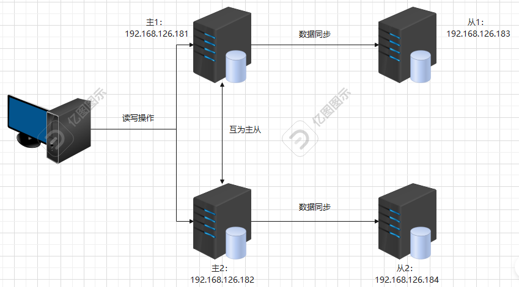

四台服务器，每台服务器上安装了 mysql8 数据库。

### 举例说明

1. 在主1创建了一个mydb2数据库，从1自动“复制”主1生成数据库
2. 因为主2也是主1 的从数据库，所以主2也“复制”主1生成数据库
3. 主2有了数据库，从2自动“复制”主2生成数据库
4. 最后，四台服务器数据库都创建了数据库

### 环境准备

**第一步**：清理四台数据库服务器数据（其实就是重置这4台数据库服务器）

```shell
在4台数据库服务器每台中都做如下操作：
# systemctl stop mysqld								停止mysql服务
# rm -rf /var/lib/mysql/*							删除MySQL中数据库
# systemctl start mysqld							启动MySQL服务，会重新初始化
# grep password /var/log/mysqld.log		搜索随机生成的密码
# mysqladmin -uroot -p'zsomtkqsb6+Y' password 'LiHuPeng@123'				修改默认密码
```

**第二步**：`主1` 中的 my.cnf  添加如下配置

```shell
# bin log 日志
log-bin=/var/lib/mysql/binlog
# 服务id
server-id=1
#主从复制忽略的数据库
binlog-ignore-db=mysql
binlog-ignore-db=information_schema
#开启主从复制的数据库
binlog-do-db=mydb2
# bin log 日志格式
#STATEMENT:记录主库执行的SQL复制到从库; 调用时间函数时会导致主从数据不一致
#ROW:记录主库每一行的变化;效率低
#MIXED:修复一些主从数据不一致情况;本地变量调用还会存在问题;@@hostname
binlog_format=row
#二进制日志自动删除/过期的天数。默认值为0，表示不自动删除
expire_logs_days=7
#跳过主从复制中遇到的所有错误或指定类型的错误
slave_skip_errors=1062
#在作为从数据库时候，有写入操作也要更新二进制日志文件
log-slave-updates
#标识自增长字段每次递增的量，也就是步长
auto-increment-increment=2
#表示自增长从哪个数开始
auto-increment-offset=1
# 增加mysql的连接数
max_connect_errors=1000

# systemctl restart mysqld
```

第三步：`主 2`  中的 my.cnf  添加如下配置

```shell
# bin log 日志
log-bin=/var/lib/mysql/binlog
# # 服务id
server-id=3
# #主从复制忽略的数据库
binlog-ignore-db=mysql
binlog-ignore-db=information_schema
# #开启主从复制的数据库
binlog-do-db=mydb2
# # bin log 日志格式
# #STATEMENT:记录主库执行的SQL复制到从库; 调用时间函数时会导致主从数据不一致
# #ROW:记录主库每一行的变化;效率低
# #MIXED:修复一些主从数据不一致情况;本地变量调用还会存在问题;@@hostname
binlog_format=row
# #二进制日志自动删除/过期的天数。默认值为0，表示不自动删除
expire_logs_days=7
# #跳过主从复制中遇到的所有错误或指定类型的错误
slave_skip_errors=1062
# #在作为从数据库时候，有写入操作也要更新二进制日志文件
log-slave-updates
# #标识自增长字段每次递增的量，也就是步长
auto-increment-increment=2
# #表示自增长从哪个数开始
auto-increment-offset=2
```

主1主2配置的不同地方在：server-id  和 auto-increment-offset 

```shell
# systemctl restart mysqld
```

**第四步**：`从1` my.cnf 添加如下配置

```shell
# 服务id
server-id=2
# #启用中继日志
relay-log=mysql-relay

# systemctl restart mysqld
```

**第五步**：`从2` my.cnf 添加如下配置

```shell
# 服务id
server-id=4
# 启用中继日志
relay-log=mysql-relay

# systemctl restart mysqld
```

**第六步**：创建同步账号并授权

`主1、主2` 数据库：

```shell
创建主主同步账号repl_user
主从同步账号slave_sync_user
mysql> CREATE USER 'repl_user'@'%' IDENTIFIED WITH mysql_native_password BY 'LiHuPeng@123';
Query OK, 0 rows affected (0.03 sec)
 
mysql> CREATE USER 'slave_sync_user'@'%' IDENTIFIED WITH mysql_native_password BY 'LiHuPeng@123';
Query OK, 0 rows affected (0.01 sec)
 
mysql> GRANT REPLICATION SLAVE ON *.* TO 'repl_user'@'%';
Query OK, 0 rows affected (0.00 sec)
 
mysql> GRANT REPLICATION SLAVE ON *.* TO 'slave_sync_user'@'%';
Query OK, 0 rows affected (0.00 sec)

mysql> flush privileges;
```

### 配置主从同步

#### 主1(M) --> 从1(S)

第一步：`主1` mysql 查看2进制日志位置

```shell
show master status;
```

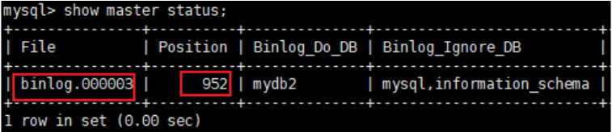

记住 binlog 文件 和 偏移量，后面会用到

第二步：`从1`mysql服务器

```shell
mysql> CHANGE MASTER TO MASTER_HOST='master1.lhp.com', MASTER_USER='slave_sync_user', MASTER_PASSWORD='LiHuPeng@123', MASTER_LOG_FILE='binlog.000001', MASTER_LOG_POS=1275;

mysql> start slave;

mysql> show slave status \G
```

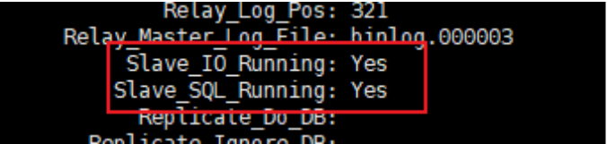

遇到不是两个 Yes （下面截图这种情况）怎么办，别慌，执行下面命令：

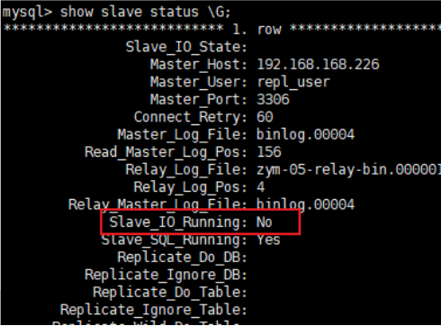

```shell
stop slave;
reset master;
然后再  CHANGE MASTER .....
```

#### 主2(M) --> 从2(S)

第一步：<code>**主2**</code> mysql -作为主服务器

```shell
show master status;
```

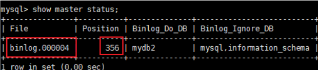

第二步：<code>**从2**</code> mysql -作为从服务器

```shell
mysql> CHANGE MASTER TO MASTER_HOST='master2.lhp.com', MASTER_USER='slave_sync_user', MASTER_PASSWORD='LiHuPeng@123', MASTER_LOG_FILE='binlog.000002', MASTER_LOG_POS=1315;

mysql> start slave;

mysql> show slave status \G
```

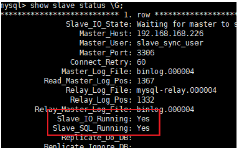

#### 主1(M) --> 主2(S)

第一步：`主1` mysql 下

```shell
show master status;
```

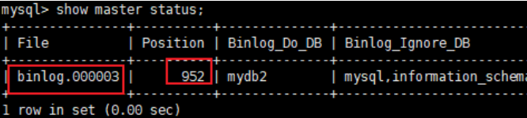

第二步：`主2` mysql 下

```shell
mysql> CHANGE MASTER TO MASTER_HOST='master1.lhp.com', MASTER_USER='repl_user', MASTER_PASSWORD='LiHuPeng@123', MASTER_LOG_FILE='binlog.000001', MASTER_LOG_POS=2975;

mysql> start slave;
```

```shell
show slave status \G
```

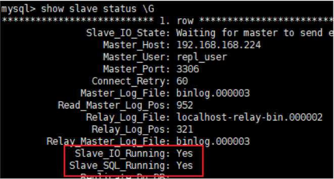

#### 主2(M) --> 主1(S)

第一步：`主2` mysql 下

```shell
show master status;
```

第二步：`主1` mysql 下

```shell
mysql> CHANGE MASTER TO MASTER_HOST='master2.lhp.com', MASTER_USER='repl_user', MASTER_PASSWORD='LiHuPeng@123', MASTER_LOG_FILE='binlog.000004', MASTER_LOG_POS=156;

mysql> start slave;
mysql> show slave status \G
```

### 测试

主1 mysql 下创建数据库 mydb2，创建表 books，插入一条数据：

```shell
create database mydb2;
use mydb2;
create table books(id int primary key auto_increment, name varchar(50));
insert into mydb2.books(name) values("MySQL 8");
查看 主1  主2 从1 从2  是否同步生成数据库、表、数据。
select * from mydb2.books;
```

最好再往主2中写入一些数据，然后看4台服务器中是否数据同步了！

# 三、代理简介

## 名词

DB Proxy，数据库中间件

## 功能

1. 读写分离　M-S-S  M-M-S-S

2. 负载均衡   Galera Cluster

3. 支持数据的分片自动路由与聚合

## 产品

MySQL Proxy          	MySQL官方

Atlas                    	奇虎360

DBProxy                	美团点评

Amoeba                	早期阿里巴巴

cober                    	阿里巴巴

MyCat                   	阿里巴巴

## 图示

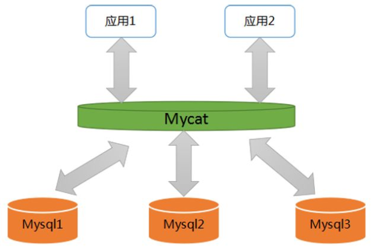

# 四、Mycat 代理实战

## 环境准备

前提：请准备好域名解析

MyCat：10.18.43.163  mycat

M-M-S-S：

* 10.18.43.41 master1
* 10.18.43.170 master2
* 10.18.43.171 slave1
* 10.18.43.172 slave2

## 案例1

### 配置 Java环境

下载jdk图示：

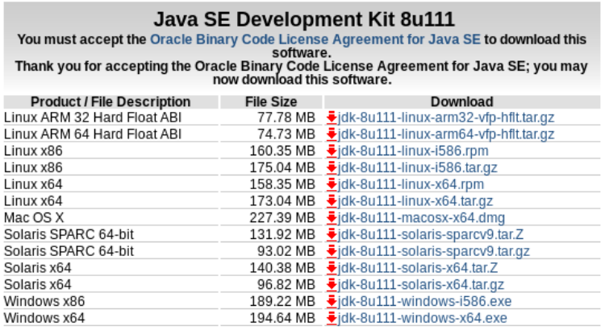

```shell
解压java软件开发工具包
# tar xf jdk-8u91-linux-x64.tar.gz -C /usr/local/

# ln -s /usr/local/jdk1.8.0_91/ /usr/local/java

设置JAVA变量，便于JAVA调用
# vim /etc/profile
JAVA_HOME=/usr/local/java
PATH=$JAVA_HOME/bin:$PATH
export JAVA_HOME PATH

# source /etc/profile

查询到版本。说明jdk安装成功
# java -version
```

### 配置Mycat

#### 下载mycat

官网：<http://www.mycat.org.cn/>


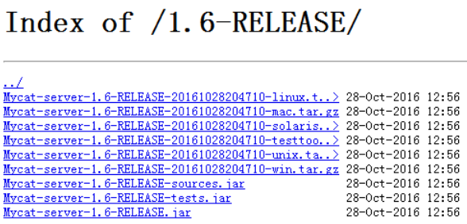

mycat虽然已经推出2.0版本。但是语言繁琐，使用率不高。1.6的版本才是企业常用的版本。

**现在不好下载了，大家使用老师资料中提供的即可！！！**

```shell
# wget http://dl.mycat.io/1.6-RELEASE/Mycat-server-1.6-RELEASE-20161028204710-linux.tar.gz

# tar -xf Mycat-server-1.6.7.1-release-20190627191042-linux.tar.gz -C /usr/local/

# ls /usr/local/mycat/
```

#### 配置mycat前端

```shell
# vim /usr/local/mycat/conf/server.xml
注释掉多余用户,95行-99行
启动mycat管理员
```

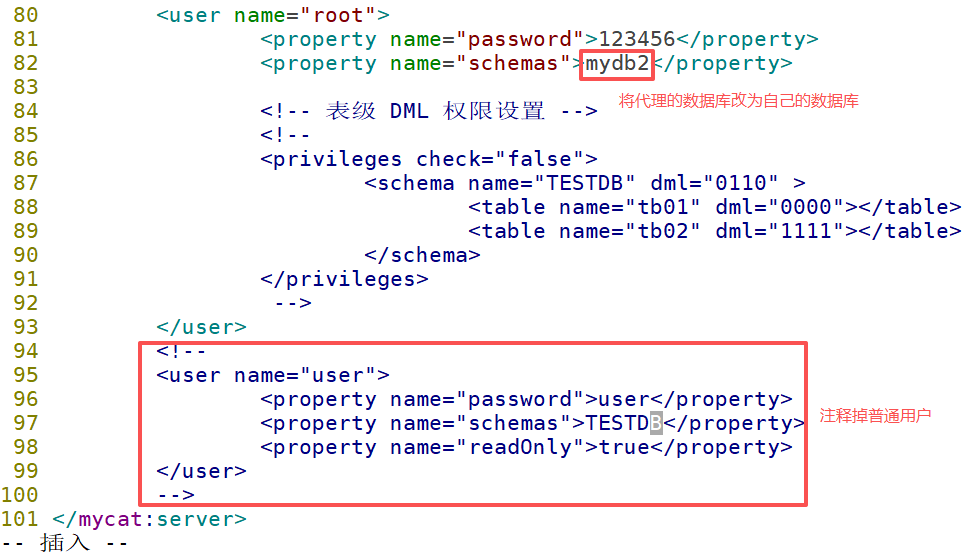

> 注释掉其他用户，然后使用mycat的管理员用户，账号root，密码123456，代理的具体的数据库是mydb2。

#### 配置mycat后端

**第一步**：备份该文件`/usr/local/mycat/conf/schema.xml`

**第二步**：删除`/usr/local/mycat/conf/schema.xml`文件中所有的注释、所有的table标签、dataNode保留一个即可，最终效果如下：

```shell
<?xml version="1.0"?>
<!DOCTYPE mycat:schema SYSTEM "schema.dtd">
<mycat:schema xmlns:mycat="http://io.mycat/">

    <schema name="TESTDB" checkSQLschema="false" sqlMaxLimit="100"></schema>
    <dataNode name="dn1" dataHost="localhost1" database="db1" />
    <dataHost name="localhost1" maxCon="1000" minCon="10" balance="0"
                      writeType="0" dbType="mysql" dbDriver="native" switchType="1"        slaveThreshold="100">
        <heartbeat>select user()</heartbeat>
        <writeHost host="hostM1" url="localhost:3306" user="root" password="123456">
            <readHost host="hostS2" url="192.168.1.200:3306" user="root" password="xxx" />
        </writeHost>
        <writeHost host="hostS1" url="localhost:3316" user="root" password="123456" />
    </dataHost>
</mycat:schema>
```

第三步：修改`/usr/local/mycat/conf/schema.xml`文件，最终效果如下：

```shell
<?xml version="1.0"?>
<!DOCTYPE mycat:schema SYSTEM "schema.dtd">
<mycat:schema xmlns:mycat="http://io.mycat/">
	<schema name="mydb2" checkSQLschema="false" sqlMaxLimit="100" dataNode="dn1"></schema>
	<dataNode name="dn1" dataHost="localhost1" database="mydb2" />
	<dataHost name="localhost1" maxCon="1000" minCon="10" balance="0" writeType="0"
			dbType="mysql" dbDriver="native" switchType="1" slaveThreshold="100">
		<heartbeat>select user()</heartbeat>
		<writeHost host="master1.lhp.com" url="master1.lhp.com:3306" user="mycatproxy"
						   password="LiHuPeng@123">
			<readHost host="slave1.lhp.com" url="slave1.lhp.com:3306" user="mycatproxy" 
				password="LiHuPeng@123" />
			<readHost host="slave2.lhp.com" url="slave2.lhp.com:3306" user="mycatproxy" 
				password="LiHuPeng@123" />
		</writeHost>
		
		<writeHost host="master2.lhp.com" url="master2.lhp.com:3306" user="mycatproxy"
						   password="LiHuPeng@123">
			<readHost host="slave1.lhp.com" url="slave1.lhp.com:3306" user="mycatproxy" 
				password="LiHuPeng@123" />
			<readHost host="slave2.lhp.com" url="slave2.lhp.com:3306" user="mycatproxy" 
				password="LiHuPeng@123" />

		</writeHost>
	</dataHost>
</mycat:schema>
```

```shell
schema name：mycat维护的集群名称。
datanode：后方节点群的名称。
datahost：后方节点群的主机名称。
writehost：写主机
readhost：读主机
倒着看。

在本例中switchType值设置为1，表示自动切换，某些对主从数据一致要求较高的场景，建议使用2判断主从状态后再切换
切换的触发条件为主节点mysql服务崩溃或停止
slaveThreshold 主从的延迟在多少秒以内，则把读请求分发到这个从节点，否则不往这个节点分发，假设生产环境能容忍的主从延时为60秒，则设置此值为60，此例中设置值为100
```

#### 关于属性的介绍

balance 类型

```shell
balance指的负载均衡类型，目前的取值有4种：
balance="0", 不开启读写分离机制，所有读操作都发送到当前可用的writeHost上。
balance="1"，全部的readHost与stand by writeHost参与select语句的负载均衡，
简单的说，当双主双从模式(M1->S1，M2->S2，并且M1与 M2互为主备)，正常情况下，M2,S1,S2都参与select语句的负载均衡。
balance="2"，所有读操作都随机的在writeHost、readhost上分发。
balance="3"，所有读请求随机的分发到wiriterHost对应的readhost执行，writerHost不负担读压力
```

writeType 属性

```shell
备份型
1. writeType="0", 所有写操作发送到配置的第一个 writeHost，
第一个挂了切到还生存的第二个writeHost，
重新启动后已切换后的为准，切换记录在配置文件中:dnindex.properties.

负载型
2. writeType="1"，所有写操作都随机的发送到配置的 writeHost。
```

switchType 模式

```shell
switchType指的是切换的模式，目前的取值也有4种：
1. switchType='-1' 负1表示不自动切换
2. switchType='1' 默认值，表示根据延时自动切换
3. switchType='2' 根据MySQL主从同步的状态决定是否切换,心跳语句为 show slave status
```

slaveThreshold=“100”，此时意味着开启MySQL主从复制状态绑定的读写分离与切换机制

```shell
1.4开始支持MySQL主从复制状态绑定的读写分离机制，让读更加安全可靠，配置如下： MyCAT心跳检查语句配置为 show slave status ，dataHost 上定义两个新属性： switchType=”2” 与 slaveThreshold=”100”，此时意味着开启MySQL主从复制状态绑定的读写分离与切换机制，Mycat心跳机制通过检测 show slave status 中的 “Seconds_Behind_Master”, “Slave_IO_Running”, “Slave_SQL_Running” 三个字段来确定当前主从同步的状态以及Seconds_Behind_Master主从复制时延， 当Seconds_Behind_Master>slaveThreshold时，读写分离筛选器会过滤掉此Slave机器，防止读到很久之前的旧数据，而当主节点宕机后，切换逻辑会检查Slave上的Seconds_Behind_Master是否为0，为0时则表示主从同步，可以安全切换，否则不会切换。
```

### 配置mysql群

M-M-S-S　准备Mycat连接的用户及权限

在`MySQL主服务器1`数据库服务器分别执行下面的语句，创建代理用的用户及密码、还有授权！那么master2、slave1、slave2会自动同步拥有该用户信息的！

```shell
create user 'mycatproxy'@'192.168.126.%' identified by 'LiHuPeng@123';
grant all on *.* to 'mycatproxy'@'192.168.126.%';
flush privileges;
```

### 启动Mycat

:::info
**在mycat服务器上**

:::

mycat1.6和mysql8的版本问题（如果使用的是mycat1.6和mysql5.\*则跳过这个步骤）

```shell
在master1服务器上需要修改用户的加密方式
mysql> ALTER USER 'mycatproxy'@'192.168.126.%' IDENTIFIED WITH mysql_native_password BY 'LiHuPeng@123';
mysql> ALTER USER 'mycatproxy'@'192.168.126.%' IDENTIFIED BY 'LiHuPeng@123' PASSWORD EXPIRE NEVER;
mysql> flush privileges;


下面的操作不需要执行
增加mysql尝试连接的限制
如果我们对于mycat的配置文件配置错误，以后应用连接mycat、mycat又连接MySQL数据库，可能会占满了数据库连接，所以下面的配置是解决这个问题的！ 没有错的情况下就不用配置了！
刷新mysql连接池
# mysqladmin flush-hosts  -uroot  -p'lhp@123'
修改mysql配置文件，在[mysqld]下面添加 max_connect_errors=1000
```

```shell
# /usr/local/mycat/bin/mycat start
Starting Mycat-server...
启动成功，否则就是配置Mycat后端语法错误。

mycat是用Java语言开发的，使用Java语言开发的程序、软件、项目，启动的时候会比较慢！
启动完之后，多等一会，2-3分钟，之后再查看是否启动了！
```

```shell
监测端口是否启动
# netstat  -anpt | grep java
tcp        0      0 127.0.0.1:32000         0.0.0.0:*               LISTEN      3487/java           
tcp6       0      0 :::1984                 :::*                    LISTEN      3487/java           
tcp6       0      0 :::8066                 :::*                    LISTEN      3487/java           
tcp6       0      0 :::59268                :::*                    LISTEN      3487/java           
tcp6       0      0 :::9066                 :::*                    LISTEN      3487/java           
tcp6       0      0 :::44500                :::*                    LISTEN      3487/java           
tcp6       0      0 127.0.0.1:31000         127.0.0.1:32000         ESTABLISHED 3487/java  
```

```shell
检测进程是否启动
# ps aux | grep mycat
[root@localhost ~]# ps aux | grep mycat
root       3485  0.0  0.1  17812   808 ?        Sl   23:36   0:00 /usr/local/mycat/bin/./wrapper-linux-x86-64 /usr/local/mycat/conf/wrapper.conf wrapper.syslog.ident=mycat wrapper.pidfile=/usr/local/mycat/logs/mycat.pid wrapper.daemonize=TRUE wrapper.lockfile=/var/lock/subsys/mycat
root       3487  4.0 35.4 6473184 172568 ?      Sl   23:36   0:03 java -DMYCAT_HOME=. -server -XX:MaxPermSize=64M -XX:+AggressiveOpts -XX:MaxDirectMemorySize=2G -Dcom.sun.management.jmxremote -Dcom.sun.management.jmxremote.port=1984 -Dcom.sun.management.jmxremote.authenticate=false -Dcom.sun.management.jmxremote.ssl=false -Xmx4G -Xms1G -Djava.library.path=lib -classpath lib/wrapper.jar:conf:lib/zookeeper-3.4.6.jar:lib/jline-0.9.94.jar:lib/ehcache-core-2.6.11.jar:lib/log4j-1.2.17.jar:lib/fastjson-1.2.12.jar:lib/curator-client-2.11.0.jar:lib/joda-time-2.9.3.jar:lib/log4j-slf4j-impl-2.5.jar:lib/libwrapper-linux-x86-32.so:lib/netty-3.7.0.Final.jar:lib/druid-1.0.26.jar:lib/log4j-api-2.5.jar:lib/mapdb-1.0.7.jar:lib/slf4j-api-1.6.1.jar:lib/univocity-parsers-2.2.1.jar:lib/hamcrest-core-1.3.jar:lib/Mycat-server-1.6-RELEASE.jar:lib/objenesis-1.2.jar:lib/leveldb-api-0.7.jar:lib/hamcrest-library-1.3.jar:lib/wrapper.jar:lib/commons-lang-2.6.jar:lib/reflectasm-1.03.jar:lib/mongo-java-driver-2.11.4.jar:lib/guava-19.0.jar:lib/curator-recipes-2.11.0.jar:lib/curator-framework-2.11.0.jar:lib/libwrapper-linux-ppc-64.so:lib/log4j-core-2.5.jar:lib/leveldb-0.7.jar:lib/sequoiadb-driver-1.12.jar:lib/mysql-binlog-connector-java-0.4.1.jar:lib/kryo-2.10.jar:lib/jsr305-2.0.3.jar:lib/commons-collections-3.2.1.jar:lib/disruptor-3.3.4.jar:lib/log4j-1.2-api-2.5.jar:lib/velocity-1.7.jar:lib/libwrapper-linux-x86-64.so:lib/dom4j-1.6.1.jar:lib/minlog-1.2.jar:lib/asm-4.0.jar -Dwrapper.key=cECV31vA3vcZHrvr -Dwrapper.port=32000 -Dwrapper.jvm.port.min=31000 -Dwrapper.jvm.port.max=31999 -Dwrapper.pid=3485 -Dwrapper.version=3.2.3 -Dwrapper.native_library=wrapper -Dwrapper.service=TRUE -Dwrapper.cpu.timeout=10 -Dwrapper.jvmid=1 org.tanukisoftware.wrapper.WrapperSimpleApp io.mycat.MycatStartup start
```

```shell
在mycat服务器上安装MySQL数据库的客户端：
# yum install -y mariadb
# mysql -h mycat.lhp.com -uroot -p123456 -P8066
mysql> show databases;
MySQL [(none)]> show databases;
+----------+
| DATABASE |
+----------+
| mydb2 |
+----------+
1 row in set (0.01 sec)
看到的数据库是虚拟的。注意后方mysql群中应该创建该库
```

:::info
**在mysql-master1上创库创表**

:::

```shell
mysql> create database mydb2;
mysql> create table mydb2.t1 (id int);
```

### Mycat使用后方数据库

:::info
**在mycat上**

:::

```shell
mysql> select * from mydb2.t1;
mysql> insert into mydb2.t1 values(3);
```

在mysql集群能查询到数据。实验完成。

## 案例2

多库时如何设置mycat

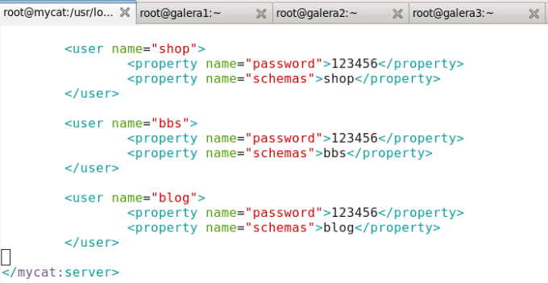

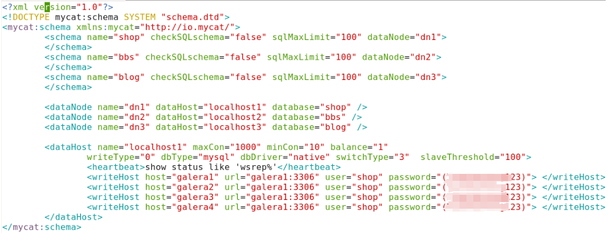


> 更新: 2025-11-13 10:56:57  
> 原文: <https://www.yuque.com/u41736172/az9urv/xgpnkwys5w80ndbs>