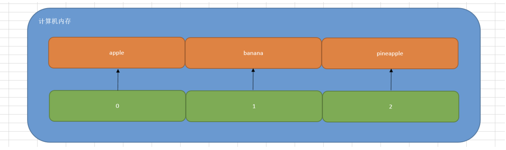
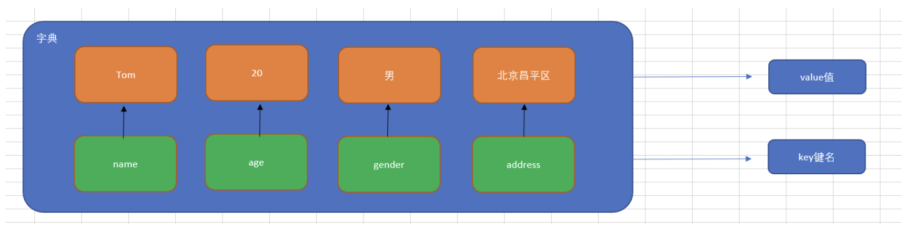
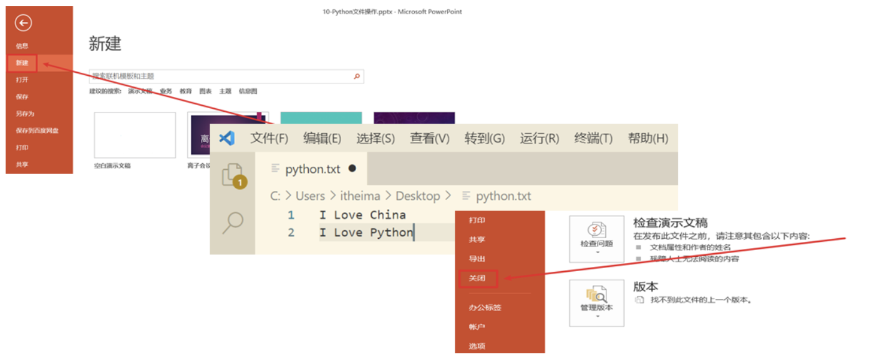

# 02.Python文件操作与Nginx日志读取

# 学习目标

1、回顾 7种数据类型，<font style="color:rgb(216,57,49);">数字类型（整数+</font><font style="color:rgb(216,57,49);">浮点</font><font style="color:rgb(216,57,49);">类型）、</font><font style="color:rgb(216,57,49);">布尔类型</font><font style="color:rgb(216,57,49);">（True、False）、字符串类型、列表类型、</font><font style="color:rgb(216,57,49);">元组</font><font style="color:rgb(216,57,49);">类型、字典类型、集合类型。</font>

2、掌握数据容器定义与使用 => <font style="color:rgb(216,57,49);">字符串、列表、</font><font style="color:rgb(216,57,49);">元组</font><font style="color:rgb(216,57,49);">、字典、集合统称容器类型</font> => 1个变量中同时放入多个值

3、掌握Python文件操作 => <font style="color:rgb(216,57,49);">文件读取、写入数据到文件、日志文件分析（如Nginx访问日志等等）</font>

# 一、列表类型（<font style="color:rgb(216,57,49);">重点</font>）

列表在运维开发中，主要负责<font style="color:rgb(216,57,49);">大批量数据</font>的存储！！！

比如存储所有学生信息，存储所有的商品信息，存储所有的日志文件信息等等

## 为什么需要列表

思考：有一个人的姓名(TOM)怎么书写存储程序？

答：<font style="color:rgb(216,57,49);">变量</font>。

思考：如果一个班级100位学生，每个人的姓名都要存储，应该如何书写程序？声明100个变量吗？

答：No，我们使用<font style="color:rgb(216,57,49);">列表</font>就可以了， 列表一次可以<font style="color:rgb(216,57,49);">存储多个数据</font>。

> 在Python中，我们把这种数据类型称之为<font style="color:rgb(216,57,49);">列表</font>。但是在其他的编程语言中，如Java、Go、C++等语言中被称为<font style="color:rgb(216,57,49);">数组</font>。

## 列表的定义

```python
列表序列名称 = [列表中的元素1, 列表中的元素2, 列表中的元素3, ...]
```

案例演示：定义一个列表，用于保存苹果、香蕉以及菠萝

```python
list1 = ['apple', 'banana', 'pineapple']
# list列表类型支持直接打印
print(list1)
# 打印列表的数据类型
print(type(list1))  # <class 'list'>
```

> 注意：列表可以一次存储多个数据且可以为不同的数据类型

## 列表的相关操作

列表的作用是一次性存储多个数据，程序员可以对这些数据进行的操作有：

<font style="color:rgb(216,57,49);">增、删、改、查</font>。

### 查操作

列表在计算机中的底层存储形式，列表和字符串一样，在计算机内存中都占用<font style="color:rgb(216,57,49);">一段连续的内存地址</font>，我们想访问列表中的每个元素，都可以通过 <font style="color:rgb(216,57,49);">"索引下标"</font> 的方式进行获取。



如果我们想获取列表中的某个元素，非常简单，直接使用索引下标：

```python
list1 = ['apple', 'banana', 'pineapple']
# 获取列表中的banana
print(list1[1])
```

查操作的相关方法：

| **编号** | **函数** | **作用** |
| --- | --- | --- |
| 1 | <font style="color:rgb(216,57,49);">len()</font> | 返回<font style="color:rgb(216,57,49);">列表中元素的个数</font> |
| 2 | <font style="color:rgb(216,57,49);">in</font> | 判断<font style="color:rgb(216,57,49);">指定数据</font>在某个列表序列，如果在返回True，否则返回False |

举个栗子：

```python
# 1、返回列表中元素的个数
list1 = ['apple', 'banana', 'pineapple']
print(len(list1))

# 2、in方法（黑名单系统）
list2 = ['192.168.1.15', '10.1.1.100', '172.35.46.128']
if '10.1.1.100' in list2:
    print('黑名单IP，禁止访问')
else:
    print('正常IP，访问站点信息')
```

### 增操作

| **编号** | **函数** | **作用** |
| --- | --- | --- |
| 1 | <font style="color:rgb(216,57,49);">append()</font> | 增加指定数据到列表中 |

append() ：在列表的尾部追加元素

```python
names = ['孙悟空', '唐僧', '猪八戒']
# 在列表的尾部追加一个元素"沙僧"
names.append('沙僧')
# 打印列表
print(names)
```

> 注意：列表追加数据的时候，直接在原列表里面追加了指定数据，即修改了原列表，故列表为可变类型数据。

### 删操作

| **编号** | **函数** | **作用** |
| --- | --- | --- |
| 1 | <font style="color:rgb(216,57,49);">del</font> | <font style="color:rgb(216,57,49);">根据索引移除指定列表元素</font> |
| 2 | <font style="color:rgb(216,57,49);">remove()</font> | <font style="color:rgb(216,57,49);">移除列表中某个数据的第一个匹配项。</font> |

remove()方法

作用：删除匹配的元素

```python
fruit = ['apple', 'banana', 'pineapple']
fruit.remove('banana')
print(fruit)
```

### 改操作

| **编号** | **函数** | **作用** |
| --- | --- | --- |
| 1 | <font style="color:rgb(216,57,49);">列表\[索引] = 修改后的值</font> | <font style="color:rgb(216,57,49);">修改列表中的某个元素</font> |

### 翻转与排序操作

| **编号** | **函数** | **作用** |
| --- | --- | --- |
| 1 | <font style="color:rgb(216,57,49);">reverse()</font> | <font style="color:rgb(216,57,49);">将数据序列进行倒叙排列(翻转效果)</font> |
| 2 | <font style="color:rgb(216,57,49);">sort()</font> | <font style="color:rgb(216,57,49);">对列表序列进行排序，也可以添加参数reverse=True实现从大到小</font> |

```python
list1 = ['貂蝉', '大乔', '小乔', '八戒']
# 修改列表中的元素
list1[3] = '周瑜'
print(list1)

list2 = [1, 2, 3, 4, 5, 6]
list2.reverse()
print(list2)

list3 = [10, 50, 20, 30, 1]
list3.sort()  # 升序(从小到大)
# 或
# list3.sort(reverse=True)  # 降序(从大到小)
print(list3)
```

小结：

列表.reverse() 作用？列表进行翻转，还可以使用切片实现！

列表.sort()作用？升序排列

## 列表的循环遍历

什么是循环遍历？答：循环遍历就是<font style="color:rgb(216,57,49);">使用while或</font><font style="color:rgb(216,57,49);">for循环</font><font style="color:rgb(216,57,49);">对列表中的每个数据进行打印输出。</font>

for循环（个人比较推荐）：

```python
list1 = ['貂蝉', '大乔', '小乔']
for i in list1:
    print(i)
```

<font style="color:rgb(216,57,49);">容器的遍历都可以使用（for）循环结构。</font>

## 随机点名程序开发

```python
'''
点名程序
1. 定义一组数据（所有点名人员名单）
2. 引入random模块，用于生成随机数 => 相当于列表的索引下标
3. 根据索引下标抽取用户信息
'''
# 导入模块
import random
# 定义一组数据
students = ['Tom', 'Rose', 'Jennifer', 'Jack']
# 获取一个随机数 => 不能超过students对应的索引下标
# 最小值 = 0；最大值 = len(studnets) - 1；产生一个0 ~ 3之间的随机整数
index = random.randint(0, len(students) - 1)
# 打印点到名字的同学
print(students[index])
```

# 二、元组类型

作用：和列表类似，都可以实现<font style="color:rgb(216,57,49);">大批量数据存储</font>，唯一区分，<font style="color:rgb(216,57,49);">元组一旦定义完成后，就不能修改与删除了，可以起到保护数据的目的。</font>

## 为什么需要元组

思考：如果想要存储多个数据，但是这些数据是不能修改的数据，怎么做？

答：列表？列表可以一次性存储多个数据，但是列表中的数据允许更改。

```python
num_list = [10, 20, 30]
num_list[0] = 100
```

那这种情况下，我们想要存储多个数据且数据不允许更改，应该怎么办呢？

答：<font style="color:rgb(216,57,49);">使用元组，元组可以存储多个数据且元组内的数据是不能修改的。</font>

## 元组的定义

元组特点：定义元组使用<font style="color:rgb(216,57,49);">小括号</font>，且使用<font style="color:rgb(216,57,49);">逗号</font>隔开各个数据，数据可以是不同的数据类型。

基本语法：

```python
# 多个数据元组
tuple1 = (10, 20, 30)

# 单个数据元组
tuple2 = (10,)
```

注意：如果定义的元组只有一个数据，那么这个数据后面也要添加逗号，否则数据类型为唯一的这个数据的数据类型。

# 三、字典类型（重点）

列表类型比较适合大批量数据的存储。

作用？<font style="color:rgb(216,57,49);">字典类型比较适合某一事物的存储，比如一个人、一本书、一个产品、一个主机信息等等</font>。

> 我们说的这个事物往往是由多个属性组成，比如一个人（姓名、年龄、家庭住址），一个主机信息（IP、端口、账号、密码）

## 为什么需要字典(dict)

思考1：比如我们要存储一个人的信息，<font style="color:rgb(216,57,49);">姓名：Tom，年龄：20周岁，性别：男，家庭住址：北京市昌平区</font>，如何快速存储。

```python
person = ['Tom', 20, '男', '北京市昌平区']
```

思考2：在日常生活中，<font style="color:rgb(216,57,49);">姓名、年龄以及性别</font>同属于一个人的基本特征。但是如果使用列表对其进行存储，则分散为3个独立元素，这显然不合逻辑。我们有没有办法，将其保存在同一个元素中，<font style="color:rgb(216,57,49);">姓名、年龄以及性别都作为这个元素的3个属性。</font>

<font style="color:rgb(216,57,49);">答：使用Python中的字典</font>

## Python中字典(dict)的概念

特点：

① 符号为 <font style="color:rgb(216,57,49);">大括号</font>（花括号） => <font style="color:rgb(216,57,49);">{}</font>

② 数据为 <font style="color:rgb(216,57,49);">键值对 </font>形式出现 => {key:value}，key：键名，value：值，在同一个字典中，<font style="color:rgb(216,57,49);">key必须是唯一</font>（类似于<font style="color:rgb(216,57,49);">索引下标</font>）

③ 各个键值对之间用逗号隔开



> 在字典中，<font style="color:rgb(216,57,49);">键名</font>除了可以使用<font style="color:rgb(216,57,49);">字符串</font>的形式，还可以使用<font style="color:rgb(216,57,49);">数值</font>的形式来进行表示

定义：

```python
# 有数据字典
dict1 = {'name': 'Tom', 'age': 20, 'gender': '男'}

# 空字典
dict2 = {}

注意：key:value键值对，如果key是一个数字类型则不加引号，但是如果是字符串类型，必须使用单引号或双引号引起来
```

> 在Python代码中，字典中的key必须使用引号引起来

小结：

列表适合大批量数据存储、元组虽然类似列表，一旦定义完成后，就不能修改与删除（保护数据）；

字典比较适合（某一事物）存储

## 字典的增操作（重点）

基本语法：

```python
字典名称[key] = value
注：如果key存在则修改这个key对应的值；如果key不存在则新增此键值对。
```

案例：定义一个空字典，然后添加name、age以及address这样的3个key

```python
# 1、定义一个空字典
person = {}
# 2、向字典中添加数据
person['name'] = '刘备'
person['age'] = 40
person['address'] = '蜀中'
# 3、使用print方法打印person字典
print(person)
```

> 注意：列表、字典为可变类型

## 字典的删操作

<font style="color:rgb(216,57,49);">del 字典名称\[key]</font>：删除指定元素

```python
# 1、定义一个有数据的字典
person = {'name':'王大锤', 'age':28, 'gender':'male', 'address':'北京市海淀区'}
# 2、删除字典中的某个元素（如gender）
del person['gender']
# 3、打印字典
print(person)
```

## 字典的改操作

基本语法：

```python
字典名称[key] = value
注：如果key存在则修改这个key对应的值；如果key不存在则新增此键值对。
```

案例：定义一个字典，里面有name、age以及address，修改address这个key的value值

```python
# 1、定义字典
person = {'name':'孙悟空', 'age': 600, 'address':'花果山'}
# 2、修改字典中的数据（address）
person['address'] = '东土大唐'
# 3、打印字典
print(person)
```

## 字典的查操作

① 查询方法：使用具体的某个key查询数据，如果未找到，则直接报错。

```python
字典序列[key]
```

② 字典的相关查询方法

| **编号** | **函数** | **作用** |
| --- | --- | --- |
| 1 | <font style="color:rgb(216,57,49);">keys()</font> | <font style="color:rgb(216,57,49);">以类列表返回一个字典所有的键</font> |
| 2 | <font style="color:rgb(216,57,49);">values()</font> | <font style="color:rgb(216,57,49);">以类列表返回字典中的所有值</font> |
| 3 | <font style="color:rgb(216,57,49);">items()</font> | <font style="color:rgb(216,57,49);">以类列表返回可遍历的(键, 值) </font><font style="color:rgb(216,57,49);">元组</font><font style="color:rgb(216,57,49);">数据</font> |

注：<font style="color:rgb(216,57,49);">字典相关方法，如keys、values、items不能直接使用，必须结合</font><font style="color:rgb(216,57,49);">for循环</font><font style="color:rgb(216,57,49);">遍历输出！！！</font>

案例1：提取person字典中的所有key

```python
# 1、定义一个字典
person = {'name':'貂蝉', 'age':18, 'mobile':'13765022249'}
# 2、提取字典中的name、age以及mobile属性
print(person.keys())
```

案例2：提取person字典中的所有value值

```python
# 1、定义一个字典
person = {'name':'貂蝉', 'age':18, 'mobile':'13765022249'}
# 2、提取字典中的貂蝉、18以及13765022249号码
print(person.values())
```

案例3：使用items()方法提取数据

```python
# 1、定义一个字典
person = {'name':'貂蝉', 'age':18, 'mobile':'13765022249'}
# 2、调用items方法获取数据，dict_items([('name', '貂蝉'), ('age', 18), ('mobile', '13765022249')])
# print(person.items())
# 3、结合for循环对字典中的数据进行遍历
for key, value in person.items():
    print(f'{key}：{value}')
```

# 四、集合类型

<font style="color:rgb(216,57,49);">set集合</font>，作用：<font style="color:rgb(216,57,49);">无序</font>且天生去重，特点：<font style="color:rgb(216,57,49);">去重</font>

## 什么是集合

集合（set）是一个<font style="color:rgb(216,57,49);">无序</font>、<font style="color:rgb(216,57,49);">不重复</font>的元素序列。

<font style="background-color:rgba(255,246,122,0.8);">① 无序</font>

<font style="background-color:rgba(255,246,122,0.8);">② 天生去重</font>

## 集合的定义

在Python中，我们可以使用一对花括号<font style="color:rgb(216,57,49);">{}</font>或者<font style="color:rgb(216,57,49);">set()</font>方法来定义集合，但是如果你定义的集合是一个<font style="color:rgb(216,57,49);">空集合，则只能使用set()方法</font>。

> 疑问：字典、集合都可以通过{}花括号，如何区分呢？答：如果{}是key:value键值对，就代表是<font style="color:rgb(216,57,49);">字典</font>；如果是具体的值，就是<font style="color:rgb(216,57,49);">集合</font>。

```python
# 定义一个集合
s1 = {10, 20, 30, 40, 50}
print(s1)
print(type(s1))

# 定义一个集合：集合中存在相同的数据
s2 = {'刘备', '曹操', '孙权', '曹操'}
print(s2)
print(type(s1))

# 定义空集合
s3 = {}
s4 = set()
print(type(s3))         # <class 'dict'>
print(type(s4))         # <class 'set'>
```

## 集合操作的相关方法（<font style="color:rgb(216,57,49);">增删查</font>）

疑问：集合操作只有增删查而没有修改方法？

答：集合没有索引下标，也没有key，而且结合本身就是无序的，所以无法精准对集合中的元素进行修改。所以只有增删查方法。

### 集合的增操作

<font style="color:rgb(216,57,49);">add()</font>方法：向集合中<font style="color:rgb(216,57,49);">增加一个元素</font>（单一）

```python
students = set()
students.add('张三')
students.add('李四')
print(students)
```

### 集合的删操作

<font style="color:rgb(216,57,49);">remove()</font>方法：<font style="color:rgb(216,57,49);">删除集合中的指定数据，如果数据不存在则报错</font>

```python
# 1、定义一个集合
products = {'萝卜', '白菜', '水蜜桃', '奥利奥', '西红柿', '凤梨'}
# 2、使用remove方法删除白菜这个元素
products.remove('白菜')
print(products)
```

### 集合中的查操作

<font style="color:rgb(216,57,49);">in</font> ：判断某个元素是否在集合中，如果在，则返回True，否则返回False

```python
# 定义一个set集合
s1 = {'刘帅', '英标', '高源'}
# 判断刘帅是否在s1集合中
if '刘帅' in s1:
    print('刘帅在s1集合中')
else:
    print('刘帅没有出现在s1集合中')
```

### 集合的遍历操作

```python
for i in 集合:
    print(i)
```

## 集合的应用场景

作业检查

```python
# 1. 获取所有同学的信息集合
students = {'赵飞', '李航', '封勇', '张天宇'}
# 2. 获取所有已提交同学信息集合
submitted = {'赵飞', '李航'}
# 3. 求差集
print(students - submitted)  # 没有交作业的同学
```

小结：

只要有去重需求，最简单的解决方法就是使用集合实现数据的存储！！！

# 五、文件的概念

文件操作作用：<font style="color:rgb(216,57,49);">Linux操作系统中一切皆文件！</font>

## 什么是文件

内存中存放的数据在计算机关机后就会消失。要长久保存数据，就要使用硬盘、光盘、U 盘等设备。为了便于数据的管理和检索，引入了“<font style="color:rgb(216,57,49);">文件</font>”的概念。

一篇文章、一段视频、一个可执行程序，都可以被保存为<font style="color:rgb(216,57,49);">一个文件</font>，并赋予一个<font style="color:rgb(216,57,49);">文件名</font>。操作系统以文件为单位管理磁盘中的数据。一般来说，<font style="color:rgb(216,57,49);">文件可分为文本文件、视频文件、音频文件、图像文件、可执行文件等多种类别。</font>


## 文件操作内容？

在日常操作中，我们对文件的主要操作：<font style="color:rgb(216,57,49);">创建文件、打开文件、文件读写、文件备份</font>等等。



## 文件操作的作用

文件操作的作用就是<font style="color:rgb(216,57,49);">把一些内容(数据)存储存放起来</font>，可以让程序下一次执行的时候直接使用，而不必重新制作一份，省时省力。

简单来说：文件的作用就是为了实现数据的持久化存储！

## 文件操作应用场景

Nginx日志文件读取

保存分析结果到文件

# 六、文件的基本操作

## 文件操作三步走

<font style="color:rgb(216,57,49);">① 打开文件</font>

<font style="color:rgb(216,57,49);">② 读写文件</font>

<font style="color:rgb(216,57,49);">③ 关闭文件</font>

## open函数打开文件

在Python，使用open()函数，可以打开一个已经存在的文件，或者创建一个新文件，语法如下：

```python
f = open(name, mode)
注：返回的结果是一个file文件对象（后续会学习，只需要记住，后续方法都是f.方法()）
```

name：是要打开的目标文件名的字符串(可以包含文件所在的具体路径)。

mode：设置打开文件的模式(访问模式)：只读r、写入w、追加a等。

> r模式：代表以只读模式打开一个已存在的文件，后续我们对这个文件只能进行读取操作。如果文件不存在，则直接报错。另外，r模式在打开文件时，会将光标放在文件的第一行（开始位置）。
>
> w模式：代表以只写模式打开一个文件，文件不存在，则自动创建该文件。w模式主要是针对文件写入而定义的模式。但是，要特别注意，w模式在写入时，光标也是置于第一行同时还会清空原有文件内容。
>
> a模式：代表以追加模式打开一个文件，文件不存在，则自动创建该文件。a模式主要也是针对文件写入而定义模式。但是和w模式有所不同，a模式不会清空文件的原有内容，而是在文件的尾部追加内容。

文件路径：<font style="color:rgb(216,57,49);">① 绝对路径 ② 相对路径</font>

① 绝对路径：绝对路径表示绝对概念，一般都是从盘符开始，然后一级一级向下查找（不能越级），直到找到我们要访问的文件即可。

比如访问C盘路径下的Python文件夹下面的python.txt文件，其完整路径：

```python
Windows
C:\Python\python.txt
Linux
/usr/local/nginx/conf/nginx.conf
```

> 绝对路径一般路径固定了，文件就不能进行移动，另外在迁移过程中会比较麻烦。

② 相对路径：相对路径表示相对概念，不需要从盘符开始，首先需要找到一个参考点（就是Python文件本身）

同级关系：我们要访问的文件与Python代码处于同一个目录，平行关系，同级关系的访问可以使用`./文件名称`或者直接写`文件名称`即可

上级关系：如果我们要访问的文件在当前Python代码的上一级目录，则我们可以通过`../`来访问上一级路径（如果是多级，也可以通过../../../去一层一层向上访问

下级关系：如果我们要访问的文件在与Python代码同级的某个文件夹中，则我们可以通过`文件夹名称/`来访问某个目录下的文件

## write函数写入文件

基本语法：

```python
f.write('要写入的内容，要求是一个字符串类型的数据')
```

## close函数关闭文件

```python
f.close()
```

## 文件操作入门案例

```python
# 1、打开文件
f = open('python.txt', 'w')
# 2、写入内容
f.write('人生苦短，我学Python！')
# 3、关闭文件
f.close()
```

> 强调一下：中文乱码问题，默认情况下，计算机常用编码ASCII、GBK、UTF-8

## 解决写入中文乱码问题

```python
# 1、打开文件
f = open('python.txt', 'w', encoding='utf-8')
# 2、写入内容
f.write('人生苦短，我学Python！')
# 3、关闭文件
f.close()
```

## 文件的读取操作

<code><font style="color:rgb(216,57,49);">read(size)</font>``方法</code>：<font style="color:rgb(216,57,49);">主要用于文本类型或者二进制文件（图片、音频、视频...）数据的读取</font>

size表示要<font style="color:rgb(216,57,49);">从文件中读取的数据的长度（单位是字符/字节），如果没有传入size，那么就表示读取文件中所有的数据</font>

read(size)：size按字节读，还是按照字符长度读取，和<font style="color:rgb(216,57,49);">open()中的第二个参数，访问模式mode有关</font>。

<font style="color:rgb(216,57,49);">r</font>以文本方式读取文件：按<font style="color:rgb(216,57,49);">字符长度</font>读取

<font style="color:rgb(216,57,49);">rb</font>以二进制方式读取文件：比如读取图片、音频（3MB = 3 \* 1024 \* 1024字节）、视频，按<font style="color:rgb(216,57,49);">字节大小</font>读取，英文状态下，1个字节 = 1个字符（如a、b、c、1、2、3）

```python
f.read()  # 读取文件的所有内容
f.read(1024)  # 读取1024个字符长度文件内容，字母或数字
```

```python
# 1、打开文件
f = open('python.txt', 'r', encoding='utf-8')
# 2、使用read()方法读取文件所有内容
contents = f.read()
print(contents)
# 3、关闭文件
f.close()
```

适合场景：既可以读取小文件（一次性全部读取过来），也适合中大型文件读取（分长度或者字段，一点一点进行读取）。

***

<code><font style="color:rgb(216,57,49);">readlines()</font>``方法</code>：<font style="color:rgb(216,57,49);">主要用于文本类型数据的读取</font>

readlines可以按照行的方式<font style="color:rgb(216,57,49);">把整个文件中的内容进行一次性读取，并且返回的是一个列表，其中每一行的数据为一个元素。</font>

适合小文件一次性读取

```python
# 1、打开文件
f = open('python.txt', 'r', encoding='utf-8')
# 2、读取文件
lines = f.readlines()
for line in lines:
    print(line, end='')
# 3、关闭文件
f.close()
```

<code><font style="color:rgb(216,57,49);">readline()</font>``方法</code>：<font style="color:rgb(216,57,49);">一次读取一行内容，每运行一次readline()函数，其就会将文件的指针向下移动一行</font>

readline()：没有s，代表一次读取文件的一行，适合大文件读取

```python
f = open('python.txt', r)

while True:
   # 读取一行内容
   content = f.readline()
   # 判断是否读取到内容
   if not content:
       break
   # 如果读取到内容，则输出
   print(content)

# 关闭文件
f.close()
```

小结：

<font style="color:rgb(216,57,49);">read(size) ：适合大文件读取，read(size)适合大文件读取，read()适合小文件读取</font>

<font style="color:rgb(216,57,49);">readlines() ：适合小文件读取</font>

<font style="color:rgb(216,57,49);">readline() ：适合大文件读取</font>

## 扩展：<font style="color:rgb(216,57,49);">with上下文管理器</font> 与 <font style="color:rgb(216,57,49);">for line in f文件对象</font>

为什么要使用with上下文管理器？答：文件操作完成后必须要手工关闭文件，而with上下文管理器会在操作结束后，自动关闭之前已经打开的文件对象，不需要手工操作。

with上下文管理器基本语法：

```python
with open('data.txt', 'r', encoding='utf-8') as f:
    xxx
```

for line in f文件对象作用？文件需要通过read/readline/readlines，但是操作都比较麻烦，python3.8以后版本提供一个新操作方式：

```python
for line in f文件对象:
    print(line)
```

```python
with open('test2.txt', 'r', encoding='utf-8') as f:
    lines = f.readlines()
    for i in lines:
        print(i)

或者

with open('test2.txt', 'r', encoding='utf-8') as f:
    for i in f:
        print(i)
```

# 七、文件和文件夹操作

作用：针对文件或文件夹进行相关操作，如<font style="color:rgb(216,57,49);">删除文件、重命名文件、创建目录、移除目录</font>等等

## os模块

在Python中文件和文件夹的操作要借助os模块里面的相关功能，具体步骤如下：

第一步：导入os模块

```python
import os
```

<font style="color:rgb(31, 35, 41);">第二步：调用os模块中的相关方法</font>

```python
os.函数名()
```

## 与文件操作相关方法

| **编号** | **函数** | **功能** |
| --- | --- | --- |
| 1 | <font style="color:rgb(216,57,49);">os.rename(旧文件名称，新文件名称)</font> | <font style="color:rgb(216,57,49);">对文件进行重命名操作</font> |
| 2 | <font style="color:rgb(216,57,49);">os.remove(要删除文件名称)</font> | <font style="color:rgb(216,57,49);">对文件进行删除操作</font> |

案例：把Python项目目录下的python.txt文件，更名为linux.txt，休眠20s，刷新后，查看效果，然后对这个文件进行删除操作。

```python
# 第一步：导入os模块
import os
# 第三步：引入time模块
import time


# 第二步：使用os.rename方法对python.txt进行重命名
os.rename('python.txt', 'linux.txt')

# 第四步：休眠20s
time.sleep(20)

# 第五步：删除文件（linux.txt)
os.remove('linux.txt')
```

小结：

文件与文件夹操作，必须导入（os）模块？

重命名：os.rename()

删除文件：os.remove()

## 与文件夹操作相关方法

前提：

```python
import os
```

相关方法：

| **编号** | **函数** | **功能** |
| --- | --- | --- |
| 1 | <font style="color:rgb(216,57,49);">os.mkdir(新文件夹名称)</font> | 创建一个指定名称的文件夹 |
| 2 | <font style="color:rgb(216,57,49);">os.getcwd()</font> | current work directory，获取当前所在目录名称（在哪里） |
| 3 | <font style="color:rgb(216,57,49);">os.chdir(切换后目录名称)</font> | change directory，切换目录 |
| 4 | <font style="color:rgb(216,57,49);">os.listdir(目标目录)</font> | 获取指定目录下的文件信息，返回列表 |
| 5 | <font style="color:rgb(216,57,49);">os.rmdir(目标目录)</font> | 用于删除一个指定名称的<font style="color:rgb(216,57,49);">"空"文件夹</font> |

案例1：

```python
# 导入os模块
import os


# 1、使用mkdir方法创建一个images文件夹
if not os.path.exists('images'):
        os.mkdir('images')

if not os.path.exists('images/avatar')
    os.mkdir('images/avatar')

# 2、getcwd = get current work directory
print(os.getcwd())

# 3、os.chdir，ch = change dir = directory切换目录
os.chdir('images/avatar')
print(os.getcwd())

# 切换到上一级目录 => images
os.chdir('../../')
print(os.getcwd())

# 4、使用os.listdir打印当前所在目录下的所有文件，返回列表
print(os.listdir())

# 5、删除空目录
os.rmdir('images/avatar')
```

案例2：准备一个static文件夹以及file1.txt、file2.txt、file3.txt三个文件

① 在程序中，将当前目录切换到static文件夹

② 创建一个新images文件夹以及test文件夹

③ 获取目录下的所有文件

④ 移除test文件夹

```python
# 导入os模块
import os

# ① 在程序中，将当前目录切换到static文件夹
os.chdir('File')
# print(os.getcwd())

# ② 创建一个新images文件夹以及test文件夹
if not os.path.exists('images'):
    os.mkdir('images')

if not os.path.exists('test'):
    os.mkdir('test')

# ③ 获取目录下的所有文件
# print(os.listdir())
for file in os.listdir():
    print(file)

# ④ 移除test文件夹
os.rmdir('test')
```

小结：

| **编号** | **函数** | **功能** |
| --- | --- | --- |
| 1 | os.mkdir(新文件夹名称) | 创建目录 |
| 2 | os.getcwd() | 获取当前工作路径 |
| 3 | os.chdir(切换后目录名称) | 切换目录 |
| 4 | os.listdir(目标目录) | 获取目录下的所有文件 |
| 5 | os.rmdir(目标目录) | 删除空目录 |

## shutil模块实现递归删除

作用：用于删除非空目录

```python
# 导入shutil模块
import shutil

# 递归删除非空目录
shutil.rmtree('要删除文件夹路径')
```

> 递归删除文件夹的原理：理论上，其在删除过程中，如果文件夹非空，则自动切换到文件夹的内部，然后把其内部的文件，一个一个删除，当所有文件删除完毕后，返回到上一级目录，删除文件夹本身。

延伸面试题：你熟悉Python运维开发，介绍一下你以前使用过哪些模块？模块大致功能？

答：<font style="color:rgb(216,57,49);">os系统模块：进程管理、文件操作；random随机数模块：生成一些随机数；shutil模块，递归删除目录；time模块，获取系统时间，休眠等操作 => 将来还可以把运维相关模块融合进来。</font>

# 八、Nginx日志文件分析统计

## 场景说明

Nginx日志：error.log（错误日志）、access.log（访问日志）

在企业级应用中，Nginx日志是系统运行情况的重要数据来源，<font style="color:rgb(216,57,49);">记录了用户访问的详细信息，包括</font><font style="color:rgb(216,57,49);">IP</font><font style="color:rgb(216,57,49);">地址、访问路径、状态码</font>等。企业需要定期分析这些日志，以了解访问来源、使用模式、异常状态（如404或500）及潜在的安全威胁（如频繁访问的恶意IP）。

开发一个Python自动化脚本，读取Nginx日志文件，提取关键信息并生成统计报告，以便用于以下场景：

* 访问分析：<font style="color:rgb(216,57,49);">统计各</font><font style="color:rgb(216,57,49);">IP</font><font style="color:rgb(216,57,49);">地址的访问次数，发现高频访问的用户或潜在攻击者</font>。
* 异常检测：统计HTTP状态码分布，发现404错误（资源缺失）或500错误（服务器异常）。
* 性能优化：通过日志数据，分析系统访问负载，为后续性能调优提供依据。

***

普及响应状态码（HTTP请求，响应时都会返回一个状态码，本质就是一个数字，代表响应状态；<font style="color:rgb(216,57,49);">如200代表正常响应，404代表资源缺失-文件未找到，500代表服务器端异常-可能代码有问题</font>）

## 任务拆解

日志数据解析：<font style="color:rgb(216,57,49);">读取Nginx</font><font style="color:rgb(216,57,49);">日志文件</font><font style="color:rgb(216,57,49);">并提取关键信息（</font><font style="color:rgb(216,57,49);">IP</font><font style="color:rgb(216,57,49);">地址、状态码）。</font>

数据统计：<font style="color:rgb(216,57,49);">统计每个</font><font style="color:rgb(216,57,49);">IP</font><font style="color:rgb(216,57,49);">地址的访问次数和每种状态码的出现频率。</font>

结果输出：<font style="color:rgb(216,57,49);">将统计结果保存到文件并输出到控制台。</font>

## 任务实现

```python
# 初始化统计变量
ip_stats = {}
status_stats = {}

# 读取nginx_access.log文件并解析内容
with open("nginx_access.log", "r") as file:
    for line in file:
        parts = line.split()
        ip = parts[0]  # 提取IP地址
        status = parts[8]  # 提取状态码

        # 统计IP地址出现次数
        if ip not in ip_stats:
            ip_stats[ip] = 1
        else:
            ip_stats[ip] += 1

        # 统计状态码出现次数
        if status not in status_stats:
            status_stats[status] = 1
        else:
            status_stats[status] += 1

# 将统计结果写入本地文件
with open("nginx_summary.txt", "w") as summary:
    summary.write("IP地址统计:\n")
    for ip, count in ip_stats.items():
        summary.write(f"{ip}: {count} 次\n")

    summary.write("\n状态码统计:\n")
    for status, count in status_stats.items():
        summary.write(f"{status}: {count} 次\n")

# 打印结果作为输出
print("IP地址统计:")
for ip, count in ip_stats.items():
    print(f"{ip}: {count} 次")

print("\n状态码统计:")
for status, count in status_stats.items():
    print(f"{status}: {count} 次")
```


> 更新: 2026-03-15 21:56:07  
> 原文: <https://www.yuque.com/u41736172/az9urv/cpog3t35xy0tsxqt>