# 03.Nginx日志分类统计与分析

# 学习目标

1、Python函数定义与使用

2、Python中的模块（os、random、time、datetime、json）的使用

3、Python日志分析与统计（按时间范围筛选处理）

# 一、Python函数定义与使用

函数作用：<font style="color:rgb(216,57,49);">代码重用</font>以及<font style="color:rgb(216,57,49);">模块化编程</font>！

## 为什么需要函数

在Python实际开发中，我们使用函数的目的只有一个目标：“<font style="color:rgb(216,57,49);">让我们的代码可以被重复使用”</font>

函数的作用有两个：

① 代码重用（代码重复使用）

② 模块化编程（模块化编程的核心就是<font style="color:rgb(216,57,49);">函数</font>，一般是<font style="color:rgb(216,57,49);">把一个系统分解为若干个功能，每个功能就是一个函数</font>）

> 在编程领域，编程可以分为两大类：① 模块化编程 ② 面向对象编程

## 什么是函数

所谓的函数就是一个<font style="color:rgb(216,57,49);">被命名的</font>、<font style="color:rgb(216,57,49);">独立的、完成特定功能的代码段</font>（一段连续的代码），并<font style="color:rgb(216,57,49);">可能给调用它的程序一个返回值</font>。

被命名的：在Python中，函数大多数是有名函数（普通函数）。当然Python中也存在没有名字的函数叫做匿名函数。

独立的、完成特定功能的代码段：在实际项目开发中，定义函数前一定要先思考一下，这个函数是为了完成某个操作或某个功能而定义的。（<font style="color:rgb(216,57,49);">函数的功能一定要专一</font>）

返回值：很多函数在执行完毕后，会通过<font style="color:rgb(216,57,49);">return关键字返回一个结果给调用它的位置</font>。

## 函数的定义

基本语法：

```python
def 函数名称([参数1, 参数2, ...]):
    函数体
    ...
    [return 返回值]
```

## 函数的调用

在Python中，函数和变量一样，都是先定义后使用。

```python
# 定义函数
def 函数名称([参数1, 参数2, ...]):
    函数体
    ...
    [return 返回值]

# 调用函数
函数名称(参数1, 参数2, ...)
```

## 函数的return返回值

和函数的参数一样，都是一个可选项。如果没有定义返回值，默认返回None！

```python
'''
return 返回值作用：① 返回一个结果给函数的调用位置 ② 也具有结束函数的功能（类似break关键字）
说明1：如果一个函数没有明确指定return返回值，则打印这个函数默认返回None（空）
说明2：return也具有结束函数的功能

Debug工具说明
step over：一步一步执行，遇到函数，则不进入到函数内部，而是直接返回函数的执行结果
step into：一步一步执行，遇到函数，则进入到函数内部，在一步一步执行，可以让我们了解函数内部代码执行流程
'''
def func1():
    print('hello function!')
    # return None

# 调用函数并打印函数的返回结果
print(func1())  # 打印func1函数的返回结果

# ----------------------------------------

def func2():
    result = 2 + 3
    return result

# 调用函数并通过一个变量接收函数的执行结果
sum = func2()
print(sum)
```

小结：

<font style="color:rgb(216,57,49);">return作用：把函数的执行结果返回函数的调用位置！</font>

<font style="color:rgb(216,57,49);">return不仅可以返回结果，还具有终止函数的功能，类似循环中的break关键词！</font>

<font style="color:rgb(216,57,49);">Python中，如果一个函数没有返回值，默认返回None；除此以外，return可以同时返回多个结果，这个结果是元组类型的数据。</font>

## 函数封装案例

封装一个验证码函数，用于返回4位长度的随机验证。

```python
# 导入模块
import random
# 定义一个函数 => generate_code()
def generate_code():
    # 定义一个字符串，包含0-9a-zA-Z（验证码可能使用的字符）
    str1 = '0123456789abcdefghijklmnopqrstuvwxyzABCDEFGHIJKLMNOPQRSTUVWXYZ'
    # 定义一个空字符串，用于接收每次生成的随机字符
    code = ''
    # 编写循环，循环4次
    for i in range(4):
        # 生成一个随机索引下标
        index = random.randint(0, len(str1) - 1)
        code += str1[index]
    # 当循环结束，code保存了4个字符，使用return返回
    return code

# 调用函数，生成验证码
print(generate_code())
```

## 安装通义灵码

在PyCharm集成开发工具中安装通义灵码，方便我们编写代码！ 比如上面案例中的0-9a-zA-Z等就可以通过AI提示去写！

第一种方式：通过插件市场在线安装，比较慢！

第二种方式：手动去官网下载好通义灵码的安装包，离线安装。演示如下：

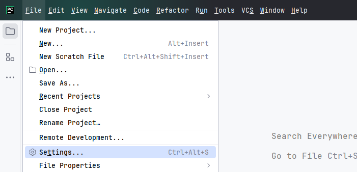

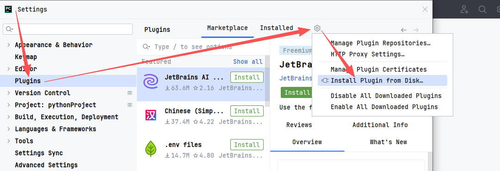

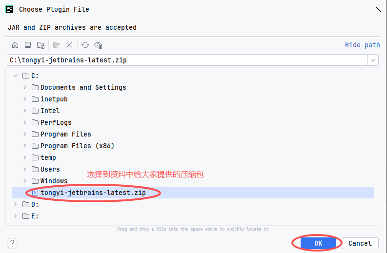

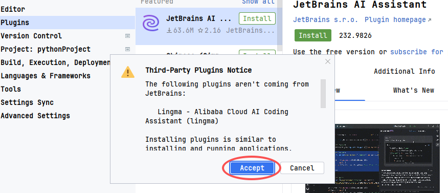

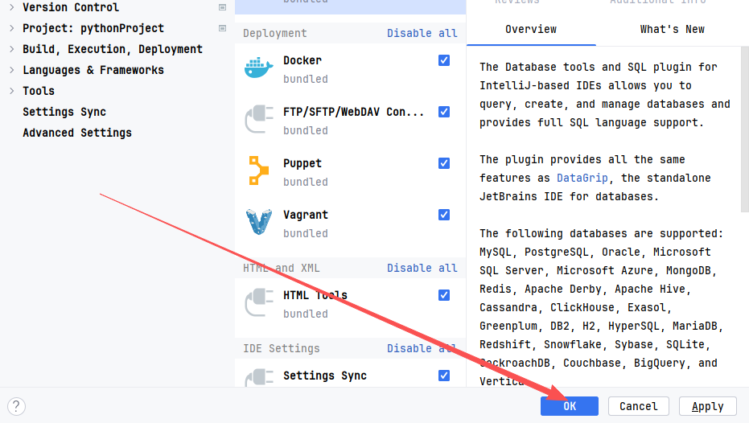

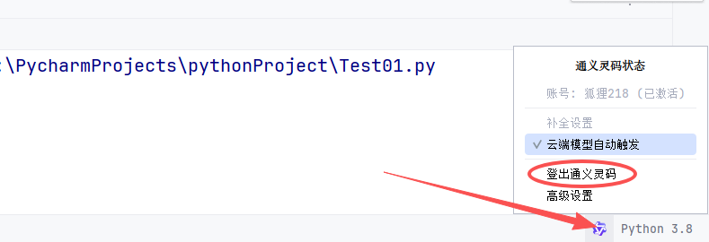


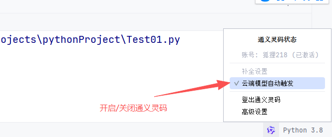

可以手动触发通义灵码补全代码：

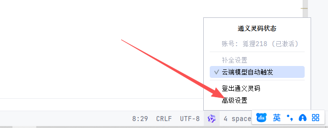

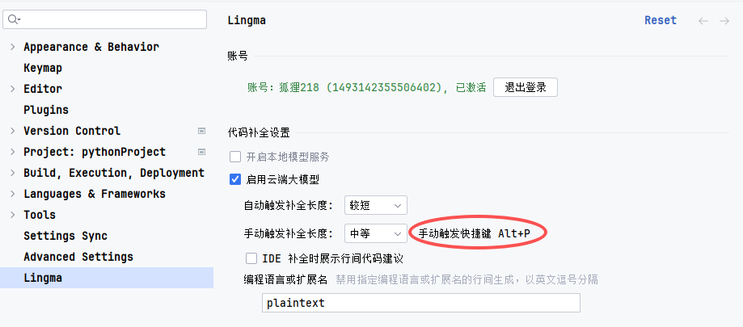

# 二、变量的作用域

作用：<font style="color:rgb(216,57,49);">指导我们变量在哪里可以使用，在哪里不可以使用！</font>

## 什么是变量的作用域

变量作用域指的是变量的作用范围（变量在哪里可用，在哪里不可用），随着函数的出现主要分为两类：<font style="color:rgb(216,57,49);">全局作用域</font>与<font style="color:rgb(216,57,49);">局部作用域</font>。

其实作用域的划分比较简单，在函数内部定义范围就称之为局部作用域，在函数外部（全局）定义范围就是全局作用域。

```python
# 全局作用域
def func():
    # 局部作用域
```

## 局部变量与全局变量

在Python中，定义在函数外部的变量就称之为<font style="color:rgb(216,57,49);">全局变量</font>；定义在函数内部变量就称之为<font style="color:rgb(216,57,49);">局部变量</font>。

```python
# 定义在函数外部的变量（全局变量）
num = 10
# 定义一个函数
def func():
    # 函数体代码
    # 定义在函数内部的变量（局部变量）
    num = 100
```

## 变量作用域的作用范围

全局变量：在整个程序范围内都可以直接使用

```python
str1 = 'hello'
# 定义一个函数
def func():
    # 在函数内部调用全局变量str1
    print(f'在局部作用域中调用str1变量：{str1}')

# 直接调用全局变量str1
print(f'在全局作用域中调用str1变量：{str1}')
# 调用func函数
func()
```

局部变量：在函数的调用过程中，开始定义，函数运行过程中生效，函数执行完毕后，销毁

```python
# 定义一个函数
def func():
    # 在函数内部定义一个局部变量
    num = 10
    print(f'在局部作用域中调用num局部变量：{num}')

# 调用func函数
func()
# 在全局作用域中调用num局部变量
print(f'在全局作用域中调用num局部变量：{num}')
```

运行结果：

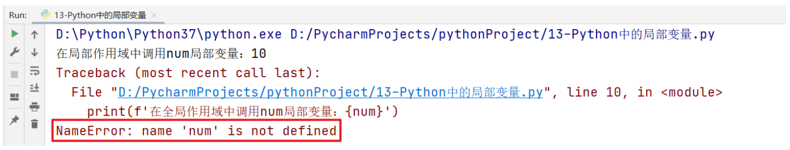

结论：全局变量访问范围较广，既可以全局访问也可以局部访问；但是局部变量只能在局部作用域中访问！

## global关键字的应用场景

思考一个问题：我们能不能在局部作用域中对全局变量进行修改呢？

```python
# 定义全局变量num = 10
num = 10
# 定义一个函数func
def func():
    # 尝试在局部作用域中修改全局变量
    num = 20

# 调用函数func
func()
# 尝试访问全局变量num
print(num)
```

最终结果：弹出10，所以由运行结果可知，在函数体内部理论上是没有办法对全局变量进行修改的，所以一定要进行修改，必须使用`global`关键字。

```python
# 定义全局变量num = 10
num = 10
# 定义一个函数func
def func():
    # 尝试在局部作用域中修改全局变量
    global num
    num = 20

# 调用函数func
func()
# 尝试访问全局变量num
print(num)
```

> 记住：global关键字只是针对可变数据类型的变量进行修改操作（数值、字符串、布尔类型、元组类型），不可变类型可以不加global关键字。

# 三、函数的参数进阶

def func(<font style="color:rgb(216,57,49);">参数1, 参数2, 参数3</font>):

```
...

return 返回值
```

func(<font style="color:rgb(216,57,49);">10, 20, 30</font>)

## 函数的参数

在函数定义与调用时，我们可以根据自己的需求来实现参数的传递。在Python中，函数的参数一共有两种形式：

① <font style="color:rgb(216,57,49);">形参</font> ② <font style="color:rgb(216,57,49);">实参</font>

形参：<font style="color:rgb(216,57,49);">在函数定义时，所编写的参数就称之为</font><font style="color:rgb(216,57,49);">形式参数</font>

实参：<font style="color:rgb(216,57,49);">在函数调用时，所传递的参数就称之为实际参数</font>

```python
def greet(name):  # name就是在函数greet定义时，所编写的参数（形参）
    return name + '，您好'

# 调用函数
name = '老王'
greet(name)  # 在函数调用时，所传递的参数就是实际参数
```

> 注意：虽然我们在函数传递时，喜欢使用相同的名称作为参数名称。但是两者的作用范围是不同的。name = '老王'，代表实参。其是一个全局变量，而greet(name)函数中的name实际是在函数定义时才声明的变量，所以其实一个局部变量。

## 函数的参数类型(传参)

### <font style="color:rgb(216,57,49);">位置参数</font>

理论上，在函数定义时，我们可以为其定义多个参数。但是在函数调用时，我们也应该传递多个参数，正常情况，其要一一对应。

```python
def user_info(name, age, address):
    print(f'我的名字{name}，今年{age}岁了，家里住在{address}')
    
# 调用函数
user_info('Tom', 23, '美国纽约')
```

> 注意事项：<font style="color:rgb(216,57,49);">位置参数强调的是参数传递的位置必须一一对应，不能颠倒</font>

### <font style="color:rgb(216,57,49);">关键词参数</font>（Python特有）

函数调用，通过“<font style="color:rgb(216,57,49);">参数=值</font>”形式加以指定。可以让函数更加清晰、容易使用，同时也清除了参数的顺序需求。

```python
def user_info(name, age, address):
    print(f'我的名字{name}，今年{age}岁了，家里住在{address}')
    
# 调用函数（使用关键词参数）
user_info(name='Tom', age=23, address='美国纽约')
```

## 函数的默认值参数（缺省参数）

默认参数也叫缺省参数，用于<font style="color:rgb(216,57,49);">定义函数时，为参数提供默认值</font>。

优势：<font style="color:rgb(216,57,49);">调用函数时可以不用为其进行传值操作，省略部分参数值的传递</font>（注意：所有位置参数必须出现在默认参数前，包括函数定义和调用）。

```python
def user_info(name, age, gender='男'):
    print(f'我的名字{name}，今年{age}岁了，我的性别为{gender}')


user_info('李林', 25)
user_info('振华', 28)
user_info('婉儿', 18, '女')
```

> 谨记：<font style="color:rgb(216,57,49);">我们在定义缺省参数时，一定要把其写在参数列表的</font>**<font style="color:rgb(216,57,49);">最后侧</font>**

## 不定长参数

不定长参数也叫可变参数。<font style="color:rgb(216,57,49);">用于不确定调用的时候会传递多少个参数(不传参也可以)的场景</font>。此时，可用<font style="color:rgb(216,57,49);">包裹(packing)位置参数</font>，或者<font style="color:rgb(216,57,49);">包裹关键字参数</font>，来进行参数传递，会显得非常方便。

### \*args不定长位置（元组）参数

```python
'''
包裹位置参数：只能接收位置参数，参数的数量可以不固定（如0个、1个、2个甚至多个），只能使用*args参数进行接收。最终返回这个变量args是一个元组类型的数据。
'''
def func1(*args):
    print(args)
    print(type(args))

# 不传参
func1()
# 传递1个参数
func1(10)
# 传递多个参数
func1(10, 20, 30)
```

<font style="color:rgb(216,57,49);">\*args：整体是接收参数，args是变量，只能接收位置参数，接收到的结果是一个元组！</font>

### \*\*kwargs不定长关键字（字典）参数

```python
'''
包裹关键词参数：只能接收关键词参数，参数的数量可以不固定（如0个、1个、2个甚至多个），只能使用**kwargs参数进行接收。最终返回这个变量kwargs是一个字典类型的数据。
kw ：keyword
args：arguments参数
'''
def func2(**kwargs):
    print(kwargs)
    print(type(kwargs))


# 不传参
func2()
# 传递1个参数
func2(a=10)
# 传递多个参数
func2(a=10, b=20, c=30)
```

<font style="color:rgb(216,57,49);">\*\*kwargs：整体是接收参数，kwargs是变量，只能接收关键词参数，接收到的结果是一个字典！</font>

### \*args与\*\*kwargs混合使用场景

作用？既可以接收位置参数，还可以接收关键词参数！

```python
# 注意1：*args只能接收位置参数
# 注意2：**kwargs只能接收关键词参数
# 注意3：混用时，*args必须在左，**kwargs必须在右！
def func(*args, **kwargs):
    # print(args)  # (10,20,30)
    # print(kwargs)  # {num1:40, num2:50}
    sum = 0
    for i in args:
        sum += i
    for v in kwargs.values():
        sum += v
    print(sum)

# 调用func函数
func(10, 20, 30, num1=40, num2=50)
```

# 四、Python模块导入

import os

import random

## 什么是Python模块

Python 模块(Module)，是一个<font style="color:rgb(216,57,49);">Python 文件</font>，以<font style="color:rgb(216,57,49);"> .py </font>结尾，包含了 Python 对象定义和Python语句。模块能定义<font style="color:rgb(216,57,49);">函数，类和变量</font>，模块里也能包含<font style="color:rgb(216,57,49);">可执行的代码</font>。

```python
import os              =>     os.py
import time            =>     time.py
import random          =>     random.py

random.randint(1, 10)
```

## 模块的分类

在Python中，模块通常可以分为两大类：<font style="color:rgb(216,57,49);">内置模块</font>(目前使用的) 和 <font style="color:rgb(216,57,49);">自定义模块</font>

## 模块的导入方式

<font style="color:rgb(216,57,49);">① import导入</font>

☆ import 模块名

☆ import 模块名 as 别名

<font style="color:rgb(216,57,49);">② from导入</font>

☆ from 模块名 import \*

☆ from 模块名 import 功能名

## 使用import导入模块

基本语法：

```python
import 模块名称
或
import 模块名称1, 模块名称2, ...
```

使用模块中封装好的方法：

```python
模块名称.方法()
```

案例：使用import导入math模块

```python
import math

# 求数字9的平方根 = 3
print(math.sqrt(9))
```

案例：使用import导入math与random模块

```python
import math, random

print(math.sqrt(9))
print(random.randint(-100, 100))
```

> 普及：我们在Python代码中，通过import方式导入的实际上都是文件的名称

## 使用as关键字为导入模块定义别名

在有些情况下，如导入的模块名称过长，建议使用as关键字对其重命名操作，以后在调用这个模块时，我们就可以使用别名进行操作。

```python
import time as t

# 调用方式
t.sleep(10)
```

> 在Python中，如果给模块定义别名，命名规则建议使用大驼峰。

## 使用from...import导入模块

提问：已经有了import导入模块，为什么还需要使用from 模块名 import 功能名这样的导入方式？

答：import代表导入某个或多个模块中的所有功能，但是有些情况下，我们只希望使用这个模块下的某些方法，而不需要全部导入。这个时候就建议采用from 模块名 import 功能名

### from 模块名 import \*

这个导入方式代表导入这个模块的所有功能（等价于import 模块名）

```python
from math import *
```

### from 模块名 import 功能名（推荐）

```python
from math import sqrt, floor

说明：
sqrt：代表开平方根，如9开平方根为3
floor：代表向下取整，返回小于或等于该数的最大整数
```

注意：以上两种方式都可以用于导入某个模块中的某些方法，但是在调用具体的方法时，我们只需要`功能名()`即可。

```python
功能名()
```

案例：

```python
# from math import *
# 或
from math import sqrt, floor

# 调用方式
print(sqrt(9))
print(floor(10.88))
```

## 内置魔术变量：**name**

每个 Python 文件都有个内置的魔术变量叫 **name**：

* 如果你**直接运行**这个文件（比如 python my\_file.py），Python 给 **name** 贴上 "<font style="color:rgb(216,57,49);">**main**</font>" 的标签，意思是“<font style="color:rgb(216,57,49);">主角</font>”。
* 如果这个文件被**别的文件导入**（比如 import my\_file），Python 给 **name** 贴上文件名（比如 "<font style="color:rgb(216,57,49);">my\_file</font>"），意思是“<font style="color:rgb(216,57,49);">配角</font>”。

注意：\_\_name\_\_变量随着运行环境的不同（主角 => 直接运行，配角 => 导入到其他文件中运行），其返回结果有所不同。

***

<code><font style="color:rgb(216,57,49);">if __name__ == "__main__":</font></code>  干啥用？

它就像一个开关：

如果没有 `if __name__ == "__main__":`，你直接运行和被导入时，文件里的代码会**全跑一遍**，这可能导致问题：

* 被导入时，可能会不小心跑一些不该跑的代码（比如打印测试信息、启动整个程序）。
* 这会让代码混乱，甚至引发错误或浪费资源。

为了让你的文件<font style="color:rgb(216,57,49);">既能当"主角"跑完整程序</font>，又能<font style="color:rgb(216,57,49);">当"配角"被别人用，而不乱跑不该跑的代码（比如测试代码或启动程序的代码）</font>。

举个例子：

模块一共分为两种：内置模块 和 自定义模块 => 模块本质就是一个Python文件，你编写的Python文件也是一个模块，也可以别的程序所使用。但是自定义模块在命名时要求：① 文件名称只能由字母、数字或者下划线组成 ② 不能以数字开头 ③ 区分大小写 ④ 不能使用Python中内置模块名称，如不能叫os、random、time等等

编写一个自定义模块（配角），名字为my\_script.py

```python
def sum_num(num1, num2):
    result = num1 + num2
    return result
    
def sub_num(num1, num2):
    result = num1 - num2
    return result
    
# 编写模块测试代码
print(sum_num(10, 20))
print(sub_num(20, 10))
```

编写主文件（主角），Python中自定义模块使用.py

```python
# 导入自定义模块
import my_script.py

# 准备调用模块中的方法（还未调用）
```

思考一下，会有什么问题？如何解决？

```python
# 角色：配角（模块）
# 函数1：求和
def sum_num(num1, num2):
    result = num1 + num2
    return result

# 函数2：求差
def sub_num(num1, num2):
    result = num1 - num2
    return result

# 编写测试代码
if __name__ == '__main__':
    a = 10
    b = 20
    print(sum_num(a, b))
    print(sub_num(a, b))
```

除了可以用于自定义模块测试以外，if **name** == '**main**'，还可以用于项目主程序的入口。

一个Python项目都有一个主程序，如<font style="color:rgb(216,57,49);">app.py</font>、<font style="color:rgb(216,57,49);">main.py</font>、<font style="color:rgb(216,57,49);">start.py</font>等等，几乎这些主程序都会有一个入口，代码如下所示：

```python
if __name__ == '__main__':
    调用函数
    运行程序
```

以下是它常见的理由：

<font style="color:rgb(216,57,49);">☆ 区分"主程序"和"模块"</font>

* 程序员希望文件既能当**主程序**（直接跑）又能当**模块**（被导入）。
* if **name** == "**main**": 让主程序的启动代码（比如调用函数、运行程序）只在直接运行时执行。

<font style="color:rgb(216,57,49);">☆ 避免导入时的副作用</font>

* 如果没有这个开关，被导入时，文件里的所有顶层代码（比如 print、循环、启动程序）都会跑。

<font style="color:rgb(216,57,49);">☆ 方便测试与调试</font>

程序员常把<font style="color:rgb(216,57,49);">测试代码或启动代码</font>放 if **name** == "**main**": 里。

这样，开发时可以直接跑文件测试功能；发布后，别人导入模块不会触发测试代码。

<font style="color:rgb(216,57,49);">☆ 编程习惯和规范</font>

* 在 Python 社区，if **name** == "**main**": 是个标准做法，写上它让代码更专业。
* 别人看到这行，马上知道哪些代码是"主程序入口"，哪些是可复用的模块功能。
* 很多教程、模板、框架（像 Flask、Django）都推荐这么写，久而久之成了<font style="color:rgb(216,57,49);">"标配"</font>。

# 五、datetime时间模块

作用（应用场景）：就是用于<font style="color:rgb(216,57,49);">实现时间筛选、比较以及分析操作</font>！

需求：比如我想从nginx访问日志中获取2025-05-09 15:00:00 ~ 2025-05-09 15:30:00（监控告警）

***

<font style="color:rgb(216,57,49);">strptime</font>: "parse" (解析) → 从字符串解析出时间，**字符串 → 时间对象**。

<font style="color:rgb(216,57,49);">strftime</font>: "format" (格式化) → 将时间格式化为字符串，**时间对象 → 字符串**。

## 时间解析与格式化

在日志分析中，时间字段通常是一个字符串格式（如 `22/Nov/2024:10:00:00`）。为了对时间字段进行操作，需要将其转换为 `datetime` 对象。Python 提供了强大的 `datetime` 模块，可以轻松完成时间的解析与格式化。

平常比较熟悉的时间格式：年-月-日 小时:分钟:秒

## 时间解析

* 使用 `datetime.strptime()` 方法解析时间字符串。
* 格式化字符串用于定义时间字段的格式。

案例：

```python
from datetime import datetime

# 示例时间字符串
time_str = "22/Nov/2024:10:00:00"

# 解析时间字符串为 datetime 对象
log_time = datetime.strptime(time_str, "%d/%b/%Y:%H:%M:%S")

# 输出解析后的 datetime 对象
print("解析后的时间:", log_time)

说明：
from datetime import datetime
from 模块 import 函数
from 模块 import class类（里面有很多函数，调用函数，需要通过这个类）
```

解析后的时间: `2024-11-22 10:00:00`

## 时间格式化

* 使用 `datetime.strftime()` 方法将时间对象转换为特定格式的字符串。
* 可用于生成自定义的时间输出格式。

案例：

```python
# 将 datetime 对象转换为字符串
formatted_time = log_time.strftime("%Y-%m-%d %H:%M:%S")
print("格式化后的时间:", formatted_time)
```

格式化后的时间: `2024-11-22 10:00:00`

## 时间范围比较（重点）

在日志分析中，经常需要筛选某个时间范围内的日志记录。通过比较两个 <code><font style="color:rgb(216,57,49);">datetime</font></code>对象，可以轻松实现时间范围过滤。

### 时间范围比较

* 使用 >=`和`<= 运算符比较时间对象。
* 筛选出在指定时间范围内的日志记录。

案例：

```python
# 定义时间范围
start_time = datetime.strptime("22/Nov/2024:10:00:00", "%d/%b/%Y:%H:%M:%S")
end_time = datetime.strptime("22/Nov/2024:10:10:00", "%d/%b/%Y:%H:%M:%S")

# 示例日志时间
log_time = datetime.strptime("22/Nov/2024:10:05:00", "%d/%b/%Y:%H:%M:%S")

# 检查日志时间是否在范围内
if start_time <= log_time <= end_time:
    print("日志时间在范围内")
else:
    print("日志时间不在范围内")
```

注意：Python 2.6及以后的版本提供了基本的日期时间处理能力（如字符串时间格式比较，但是要求格式必须完全一致，否则无法比较），但对于复杂的日期和时间操作，使用`datetime`模块会更为方便和强大。

### 时间范围过滤Nginx日志功能（重点）

案例：2025-01-15 02:00:00 ~ 06:00:00发现Nginx服务异常，先需要我们从Nginx的access.log访问日志中提取这段时间的日志信息，使用Python实现！

实现思路：

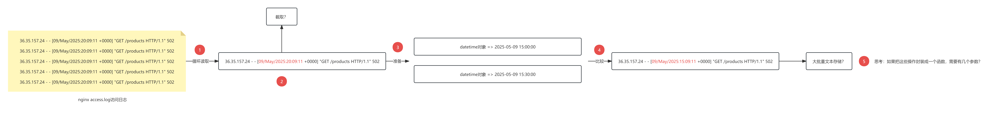

具体代码实现：

```python
from datetime import datetime

# 读取日志文件并按时间范围筛选
def filter_logs_by_time(log_file, start_time, end_time):
    results = []
    with open(log_file, "r") as file:
        for line in file:
            parts = line.split()
            # 提取日志时间字段并解析为 datetime 对象
            log_time = datetime.strptime(parts[3][1:], "%d/%b/%Y:%H:%M:%S")
            # 检查时间是否在范围内
            if start_time <= log_time <= end_time:
                results.append(line.strip())
    return results

# 示例使用
if __name__ == "__main__":
    # 定义时间范围
    start_time = datetime.strptime("22/Nov/2024:10:00:00", "%d/%b/%Y:%H:%M:%S")
    end_time = datetime.strptime("22/Nov/2024:10:10:00", "%d/%b/%Y:%H:%M:%S")
    
    # 日志文件路径
    log_file = "nginx_access.log"
    
    # 筛选日志
    filtered_logs = filter_logs_by_time(log_file, start_time, end_time)
    print("指定时间范围内的日志记录:")
    for log in filtered_logs:
        print(log)
```

# 六、数据存储与导出

xml、json

作用：<font style="color:rgb(216,57,49);">JSON是把一种通用的数据传输格式，我们经常需要数据转换为JSON格式传递给开发使用。</font>

## JSON概述

* JSON（JavaScript Object Notation）是一种轻量级的数据交换格式，常用于存储和传输结构化数据。
* JSON文件以<font style="color:rgb(216,57,49);">键值对</font>的形式存储数据，支持多种数据类型：字符串、数字、布尔值、数组和对象。

结构类似字典：json\_str = {"id":"001", "name":"房佳庆"}

> JSON数据格式,本质是一个字符串，类似Python中字典（不是字典），<font style="color:rgb(216,57,49);">JSON对引号特别敏感，要求内部的引号只能使用双引号</font>，如果使用单引号，会造成语法错误以及无法解析等问题！！！

## Python处理JSON数据

Python 提供了内置的 <code><font style="color:rgb(216,57,49);">json</font></code>模块，支持对 JSON 数据的解析与生成。

## 核心方法

* `json.dump(obj, file)`：将 Python 对象（列表、字典、列表 + 字典）存储为 JSON 文件。
* `json.loads(file)`：从 JSON 文件中加载数据为 Python 对象（列表、字典、列表 + 字典）。

<font style="color:rgb(216,57,49);">口诀：Python 倾倒用 dump，</font><font style="color:rgb(216,57,49);">JSON</font><font style="color:rgb(216,57,49);"> 加载用 load；文件去掉 s，字符串加上 s。</font>

案例1：将一个字典对象 `data` 转换为 JSON 格式，并写入名为 `data.json` 的文件中

```python
import json

# 一个字典对象
data = {
    "name": "Alice",
    "age": 25,
    "city": "New York"
}

# 将数据写入 JSON 文件
with open('data.json', 'w') as file:
    json.dump(data, file)

print("数据已写入文件 data.json")
```

> 其实我们也可以试试将一个简单列表或者列表中放的是一个个的字典，这两种类型的数据给导出到json文件中。
>
> 在PyCharm中，我们打开json文件后，可以使用 ctrl + alt + L 对文件中的数据进行格式化！
>
> 另外我们往json文件中输入的是中文的话，默认会进行一个编码，但是其实是可以正常读取使用的！如果不想让把中文进行编码，可以使用 json.dump(list1, file, **ensure\_ascii=False**)

案例2：从之前写入的 `data.json` 文件中读取 JSON 数据，并将其转换回 Python 字典对象 `data`，然后打印出来

```python
import json

# 从 JSON 文件中读取数据
with open('data.json', 'r') as file:
    data = json.load(file)

print("从文件读取的数据:", data)
```

小结：

Python对象到文件，可以使用json模块中？（json.dump(数据，文件对象)）

加载JSON文件到Python对象，可以使用json模块中？（json.load(文件对象)）

# 七、综合案例：Python实现日志分析与统计

**背景**: 你是一名运维工程师，负责维护一个运行 Nginx 的 Web 服务器。近期用户反馈网站在某些时间段内（2025-05-09 15:00:00 ~ 2025-05-09 15:30:00）访问缓慢或报错。你需要从 Nginx 访问日志中筛选出特定时间范围内日志数据，并将结果保存为 JSON 文件，供开发团队分析问题或生成报警报告。

**目标**:

☆ 筛选 Nginx 日志中指定时间范围内的日志。

☆ 将筛选结果保存为格式化的 JSON 文件。

☆ 加载 JSON 文件内容，打印关键信息（如 IP、时间、请求方法、请求路径、相应状态码）以便快速查看。

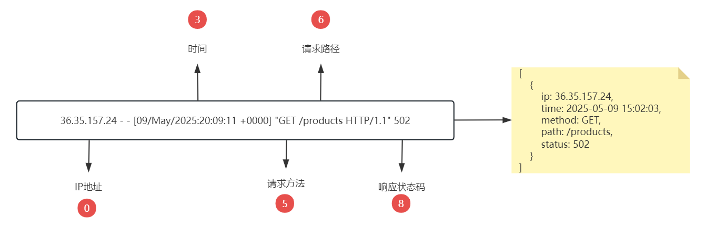

## 前置知识点

* **保存数据到JSON文件**： 使用`json.dump()`方法将筛选后的数据存储到文件中。先数据,变更为`[{}, {}, {}]`
* **从JSON文件加载数据**： 使用`json.load()`方法从JSON文件中读取数据并还原为Python对象。

## 从Nginx日志筛选并存储为JSON文件

① 从Nginx日志文件中筛选特定时间范围内的记录。

② 将筛选结果存储到JSON文件中。

③ 从JSON文件加载数据并解析。

```python
# 导入模块
from datetime import datetime
from json import dump, load

# 定义日志筛选函数
def filter_log_by_time(log_file, start_time, end_time):
    # 定义一个变量，用于保存所有符合要求的日志信息
    result = []  # [{}, {}, {}]
    with open(log_file, 'r', encoding='utf-8') as file:
        for line in file:
            parts = line.split(' ')
            log_time = datetime.strptime(parts[3][1:], '%d/%b/%Y:%H:%M:%S')
            if  start_time <= log_time <= end_time:
                result.append({
                    'ip':parts[0],
                    'time':parts[3][1:],
                    'method':parts[5][1:],
                    'path':parts[6],
                    'status':parts[8]
                })
    # 文件处理结束，返回最终result列表
    return result

# 定义信息存储函数，把python对象转换为json存储
def save_data_to_json(data, json_file):
    with open(json_file, 'w') as file:
        dump(data, file)
    print(f'恭喜您，数据已经保存在{json_file}文件中')

# 定义json读取函数，把json数据转换为python对象
def load_data_from_json(json_file):
    with open(json_file, 'r') as file:
        data = load(file)
    return data

# 定义一个程序入口
if __name__ == '__main__':
    # 定义日志文件路径
    log_file = './nginx_access.log'
    # 定义起始时间 与 结束时间
    start_time = datetime.strptime('09/May/2025:15:00:00', '%d/%b/%Y:%H:%M:%S')
    end_time = datetime.strptime('09/May/2025:15:30:00', '%d/%b/%Y:%H:%M:%S')

    filter_logs = filter_log_by_time(log_file, start_time, end_time)

    # 把筛选得到的日志数据存储在json文件中
    save_data_to_json(filter_logs, './data.json')

    # 读取json文件中的数据到python对象（列表）
    log_data = load_data_from_json('./data.json')
    for log in log_data:
        print(log)
```


> 更新: 2025-12-09 10:14:52  
> 原文: <https://www.yuque.com/u41736172/az9urv/kxiork2pyergryqe>