# 04.系统资源监控与数据采集（重点）

# 一、psutil模块（重点）

psutil模块作用：<font style="color:rgb(216,57,49);">协助我们完成CPU使用率、内存、磁盘信息、网络等等相关数据的采集！</font>

## 模块介绍

`psutil` 是一个跨平台的 Python 库，用于检索系统的运行信息，包括 CPU 使用情况、内存状态、磁盘信息、网络统计、进程信息等，非常适合运维和系统监控应用。下面是 `psutil` 的一些常见用法和应用示例。

## 安装 `psutil`

前置操作：

第一步：启动 VMware 中的 node1 服务器（192.168.126.171）

第二步：在PyCharm中创建一个新项目，所有配置保持默认，不需要调整

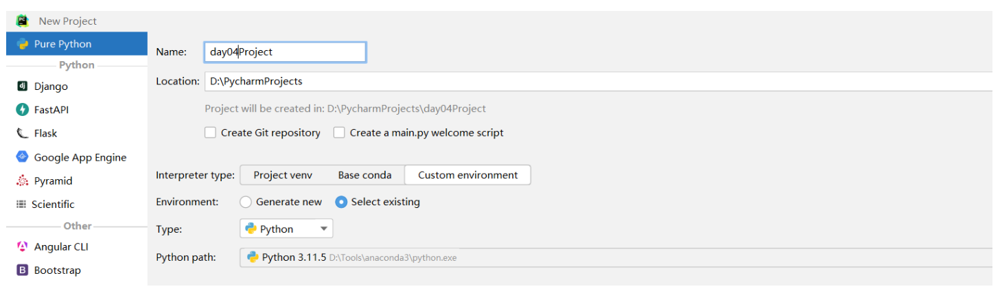

第三步：在项目中，找到File菜单->Settings设置->Project关键词菜单->Python Interpreter解析器


选择On SSH：配置远程解析器

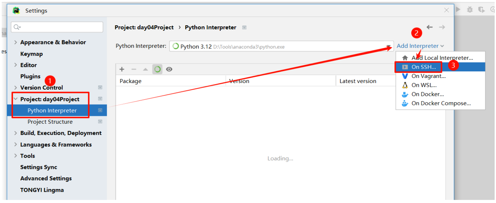

填入Linux服务器信息：

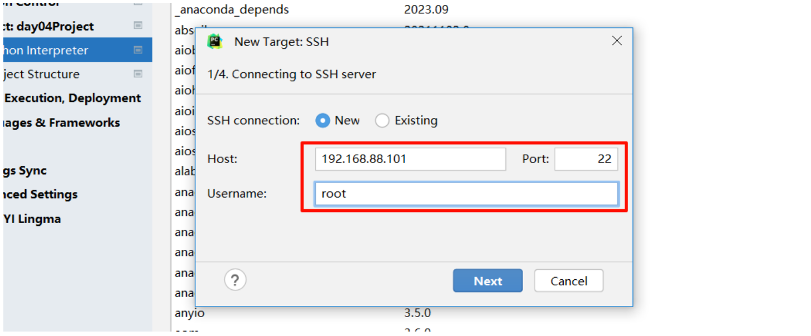

确认指纹，单击OK，然后输入Linux服务器的密码，如下图所示：

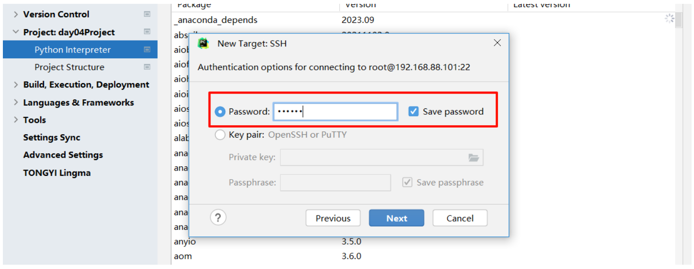

设置系统解析器：

<font style="color:rgb(216,57,49);">在Linux服务器的/root目录创建一个pythonProject文件夹</font>

```python
mkdir -p /root/pythonProject
```

然后更改解析器信息（注意：<font style="color:rgb(216,57,49);">必须选择系统解析器</font>）：

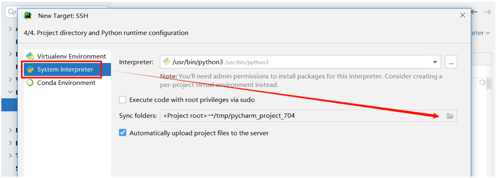

更改源码上传位注意更改源码上传位置:

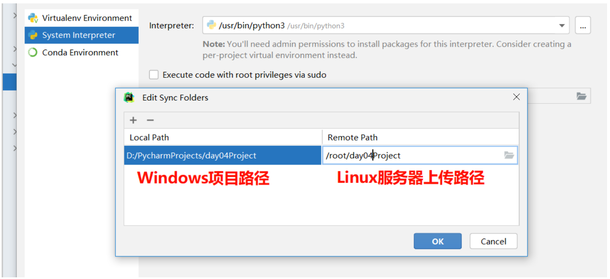

进入到Linux服务器，可以通过以下命令安装 `psutil`：

```python
dnf install python3-pip -y    # pip是Python的包管理工具
pip install psutil -i https://pypi.tuna.tsinghua.edu.cn/simple

注：
pip install 软件包名称，安装软件
-i 指定镜像源，说白了就是从哪里下载软件
https://pypi.tuna.tsinghua.edu.cn/simple清华镜像源
```

## 官方文档

官方地址：https://github.com/giampaolo/psutil

## 获取CPU使用情况

获取CPU使用率

```python
import psutil

# 获取 CPU 总使用率，1 秒间隔
cpu_usage = psutil.cpu_percent(interval=1)
print("CPU usage:", cpu_usage, "%")
```

> 上面的代码是在Windows中的PyCharm工具上编写并运行的，第一行代码会报错，而且后面的代码没有提示。但其实不影响运行。是因为目前我们Windows中并没有psutil模块，所以它会报错。
>
> 而且运行完后会发现在Linux的/root/pythonProject目录中已经有了我们写的代码文件，PyCharm会将我们写的代码文件同步到Linux系统中！

常见运行报错解决方案：

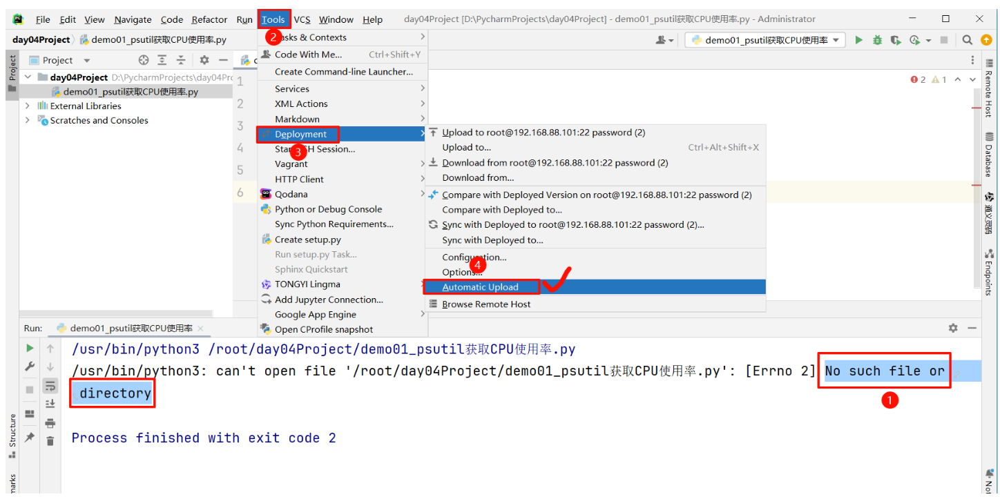

总结：上面的案例，常见问题：

1. 没有在PyCharm中配置好远程Linux服务器的Python解析器，必须是系统解析器！！！
2. 没有在Linux中创建用来同步Python代码的目录，并且要在PyCharm中配置正确
3. 没有将PyCharm中的代码文件上传到Linux中（自动上传的）

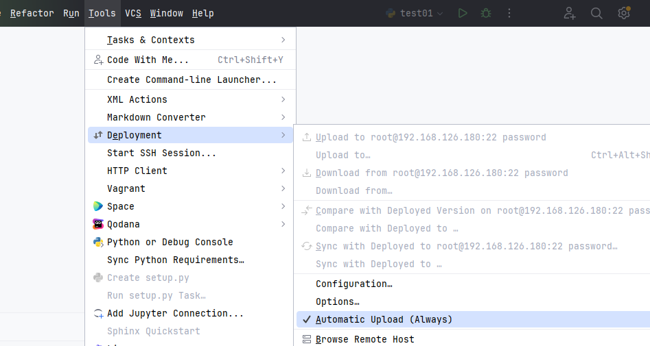

**<font style="background-color:#FBDE28;">接下来的学习中，大家要把PyCharm中的通义灵码给打开，因为东西太多了，不好记的那么详细！！！</font>**

获取每个核心的 CPU 使用率

\[第一个核心使用率，第二个核心使用率，第三个核心使用率，第四个核心使用]

```python
import psutil

# 获取每个核心的CPU使用率
for i in range(psutil.cpu_count()):
    print("CPU usage of core", i, ":", psutil.cpu_percent(interval=1, percpu=True)[i], "%")
```

## 获取内存使用情况

字节Bytes => /1024 KB千字节 => /1024 MB兆字节 => /1024 GB

```python
import psutil

# 获取物理内存信息
memory_info = psutil.virtual_memory()
print("Total memory:", memory_info.total // (1024 ** 2), "MB")
print("Used memory:", memory_info.used // (1024 ** 2), "MB")
print("Memory usage:", memory_info.percent, "%")
```

获取交换内存信息

```python
import psutil

# 获取交换内存信息
swap_info = psutil.swap_memory()
print("Total swap:", swap_info.total // (1024 ** 2), "MB")
print("Used swap:", swap_info.used // (1024 ** 2), "MB")
print("Swap usage:", swap_info.percent, "%")
```

> Linux操作系统必须有两个分区：/根分区 + swap分区
>
> 安装操作系统时，默认会分配一定的磁盘空间（物理内存1-2倍，小于8G情况，物理内存2倍，大于等于8G，就是1倍）作为临时内存使用；当系统内存资源不足时，系统会自动调用swap分区充当内存使用。
>
> 另外，在系统中关于大小的情况总是或多或少的差一些，是因为我们平时是按照1024这个单位换算的，但是厂家是按照1000进行换算的！！

## 获取磁盘使用情况

```python
import psutil

# 获取磁盘分区
partitions = psutil.disk_partitions()
for partition in partitions:
    print(f"Device: {partition.device}, Mountpoint: {partition.mountpoint}, Filesystem: {partition.fstype}")

# 获取指定分区的使用情况
disk_usage = psutil.disk_usage('/')
print("Total disk space:", disk_usage.total // (1024 ** 3), "GB")
print("Used disk space:", disk_usage.used // (1024 ** 3), "GB")
print("Disk usage:", disk_usage.percent, "%")
```

获取磁盘IO：

I：Input

O：Output

磁盘IO指的是系统对磁盘设备进行数据读写的过程，主要包括：

* **读取操作**：从磁盘中读取数据到内存。
* **写入操作**：将数据从内存写入到磁盘。

磁盘IO性能通常受磁盘硬件、文件系统类型、RAID配置和磁盘缓存的影响。 常见指标：

* **IOPS（Input/Output Operations Per Second）：每秒处理的IO操作数量。**
* **吞吐量：磁盘每秒处理的数据量（如MB/s或GB/s）。**
* 比如：一块SSD的读写速度标称为 3.5 GB/s，表示它每秒可以读取或写入3.5GB的数据。

计算磁盘的IOPS：

```python
import psutil
import time

# 第一次采样
disk_io_1 = psutil.disk_io_counters()
time.sleep(1)  # 等待1秒
# 第二次采样
disk_io_2 = psutil.disk_io_counters()

# 计算吞吐量 (MB/s)
read_bytes_diff = disk_io_2.read_bytes - disk_io_1.read_bytes
write_bytes_diff = disk_io_2.write_bytes - disk_io_1.write_bytes
read_mb_s = read_bytes_diff / (1024 * 1024)  # 转换为MB/s
write_mb_s = write_bytes_diff / (1024 * 1024)  # 转换为MB/s

# 计算IOPS
read_iops = disk_io_2.read_count - disk_io_1.read_count
write_iops = disk_io_2.write_count - disk_io_1.write_count

print(f"读取吞吐量: {read_mb_s:.2f} MB/s")
print(f"写入吞吐量: {write_mb_s:.2f} MB/s")
print(f"读取IOPS: {read_iops}")
print(f"写入IOPS: {write_iops}")

---------------------------------------------------------------------------
psutil.disk_io_counters() 返回一个对象，包含以下关键属性（指标）： 
read_bytes：从磁盘读取的总字节数。
write_bytes：写入磁盘的总字节数。
read_count：读取操作的次数（可用于计算IOPS）。
write_count：写入操作的次数。
```

运行结果：

```python
读取吞吐量: 15.75 MB/s
写入吞吐量: 8.20 MB/s
读取IOPS: 1200
写入IOPS: 600

说明：目前我们的Linux服务器并没有什么读写操作，所以上面代码运行的结果应该都是0，是正常情况！
```

理论值参考：

<font style="color:rgb(216,57,49);">吞吐量</font><font style="color:rgb(216,57,49);">：</font><font style="color:rgb(216,57,49);">HDD</font><font style="color:rgb(216,57,49);">（顺序读写约100-200 </font><font style="color:rgb(216,57,49);">MB</font><font style="color:rgb(216,57,49);">/s），</font><font style="color:rgb(216,57,49);">SATA</font><font style="color:rgb(216,57,49);">SSD</font><font style="color:rgb(216,57,49);">（500-550 MB/s）或</font><font style="color:rgb(216,57,49);">NVMe</font><font style="color:rgb(216,57,49);"> SSD（3-7 </font><font style="color:rgb(216,57,49);">GB</font><font style="color:rgb(216,57,49);">/s）</font>

<font style="color:rgb(216,57,49);">IOPS：HDD（100-200 IOPS），SATASSD（1万-10万IOPS）或NVMe SSD（10万-100万IOPS）</font>

## 获取网络信息

获取网络I/O统计

<font style="color:rgb(216,57,49);">网络</font><font style="color:rgb(216,57,49);">IO</font>指的是系统通过<font style="color:rgb(216,57,49);">网络接口进行数据收发的过程</font>，主要包括：

* **接收操作**：从网络中接收数据包。
* **发送操作**：通过网络发送数据包。
* **带宽**：单位时间内网络传输的数据量（如Mbps或Gbps）。
* **延迟**：网络数据包从源到目标的时间。
* **吞吐量**：实际传输的数据量，通常小于带宽上限。

***

普及一个概念：千兆带宽1Gb/s（<font style="color:rgb(216,57,49);">注意这里b是小写的</font>！！！）

Gb/s：表示 Gigabit per second（千兆比特每秒），1 Gb = 10亿比特（10^9 bits）。

GB/s：表示 Gigabyte per second（吉字节每秒），1 GB = 10亿字节（10^9 Bytes）。

关键区别：1 Byte（字节） = 8 bits（比特），所以 1 GB/s = 8 Gb/s。

所以千兆带宽的理论传输速度约为125MB/s，百兆带宽理论传输速度约为12.5MB/s

```python
import psutil

# 获取网络流量统计
net_io = psutil.net_io_counters()
print("Bytes sent:", net_io.bytes_sent)
print("Bytes received:", net_io.bytes_recv)

-----------------------------------------------
psutil.net_io_counters() 返回一个命名元组，包含系统所有网络接口（如Wi-Fi、以太网）的累计网络IO统计数据
主要指标： 
bytes_sent：系统发送的总字节数（上传流量）。
bytes_recv：系统接收的总字节数（下载流量）。
其他指标包括： 
packets_sent：发送的数据包数。
packets_recv：接收的数据包数。
errin/errout：接收/发送的错误数。
dropin/dropout：接收/发送丢弃的数据包数。
```

获取网络IO吞吐量：

```python
import psutil
import time

# 第一次采样
net_io_1 = psutil.net_io_counters()
time.sleep(1)  # 等待1秒
# 第二次采样
net_io_2 = psutil.net_io_counters()

# 计算吞吐量 (MB/s)
bytes_sent_diff = net_io_2.bytes_sent - net_io_1.bytes_sent
bytes_recv_diff = net_io_2.bytes_recv - net_io_1.bytes_recv
send_mb_s = bytes_sent_diff / (1024 * 1024)  # 转换为MB/s
recv_mb_s = bytes_recv_diff / (1024 * 1024)  # 转换为MB/s

print(f"发送吞吐量: {send_mb_s:.2f} MB/s")
print(f"接收吞吐量: {recv_mb_s:.2f} MB/s")
```

获取网路接口（网卡，如lo网卡、ens33/ens160/eth0）地址信息

```python
import psutil

net_if_addrs = psutil.net_if_addrs()
for interface_name, interface_addresses in net_if_addrs.items():
    print(f"接口名称: {interface_name}")
    print(f"接口地址: {interface_addresses[0].address}")
```

> ens33/ens160/eth0：物理网卡，lo（local）回环网卡 => 虚拟网卡，主要用于网络测试工作。

小结：

网络信息采集通常采集两个方面：（网络IO，使用net\_io\_counters）与 （网卡信息，使用net\_if\_addrs）

## 说明

简单介绍一下，什么是面向过程，什么是面向对象

在Python中创建一个类，写上属性和方法

通过类创建一个对象，调用该对象的属性和方法

```python
# 类是对一类型事物的抽象，属于抽象的概念
# 对象是实实在在存在的事物
# 通过一个类可以创建多个对象，类就相当于是对象的模板
# 属性：事物自身具备的特点
# 方法：事物自身具备的行为
# 对象.属性    对象.方法()
class Student:
    def __init__(self, name, age):
        self.name = name
        self.age = age

    def show(self):
        print(self.name, self.age)
    def run(self):
        print('跑步')

if __name__ == '__main__':
    stu = Student('张三', 18)
    print(stu.name)
    print(stu.age)
    stu.show()
    stu.run()
```

## psutil运维场景:获取cpu使用率

监控CPU使用率，超过80%(阈值)就发给邮件给运维，前置知识点：https://docs.python.org/3.9/library/smtplib.html

```python
import psutil    # 第三方模块
import smtplib    # 自带的模块
from email.mime.text import MIMEText
from email.header import Header

# 设置邮箱地址和授权码
from_addr = '你的邮箱'
to_addr = '目标邮箱'
auth_code = '你的邮箱授权码'

# 获取 CPU 使用率
cpu_percent = psutil.cpu_percent(interval=1)

# 判断 CPU 使用率是否超过阈值
if cpu_percent > 80:
    # 构造邮件内容
    subject = '警报：高 CPU 使用率'
    message = 'CPU 使用率超过 80%：当前使用率为 {}%'.format(cpu_percent)

    # 使用 MIMEText 创建邮件对象，指定编码为 UTF-8
    msg = MIMEText(message, 'plain', 'utf-8')
    msg['Subject'] = Header(subject, 'utf-8')
    msg['From'] = from_addr  # 用于显示的发件人
    msg['To'] = to_addr      # 用于显示的收件人

    # 建立 SMTP 连接
    server = smtplib.SMTP('smtp.163.com')
    server.login(from_addr, auth_code)

    # 发送邮件
    server.sendmail(from_addr, to_addr, msg.as_string())
    server.quit()
```

小结：

整个案例一共使用了3个模块：检查系统CPU信息（psutil）、发送邮件（email）

另外特别注意：<font style="color:rgb(216,57,49);">邮件发送时，使用的密码并不是邮件密码，而是邮件授权码！！！</font>

网易邮箱（163邮箱）获取授权码：

第一步：登录163邮箱

第二步：开通smtp服务


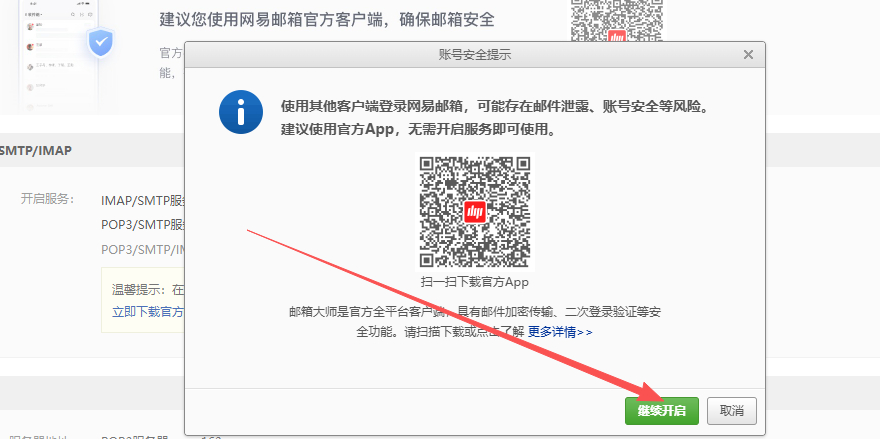


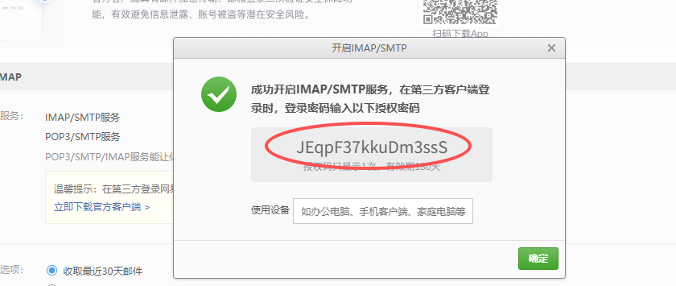

# 二、paramiko模块

目标：<font style="color:rgb(216,57,49);">paramiko主要用于实现（远程登录）、（文件上传）与（下载功能）</font>

## 模块介绍

paramiko模块支持以<font style="color:rgb(216,57,49);">加密和认证</font>的方式连接远程服务器。可以实现远程文件的上传，下载或通过ssh远程执行命令。

Linux上写shell脚本远程ssh操作处理密码有两种方法:

* ssh-keygen实现免密操作，这样远程连接不用输入密码 `ssh 192.168.126.172 touch /tmp/123`
* expect自动应答处理密码

```python
#!/bin/bash

# 删除 .ssh/known_hosts 中的旧记录，以便每次登录都需要确认
sed -i /^192.168.126.172/d /root/.ssh/known_hosts

# 使用 expect 自动化 SSH 登录
expect <<EOF
    spawn ssh 192.168.126.172        		# 执行 SSH 登录
    expect "(yes/no)?"                      # 等待出现 yes/no 确认提示
    send "yes\n"                            # 发送 yes 确认
    expect "password:"                    	# 等待输入密码提示
    send "123\n"                            # 输入密码
    expect "]"                              # 等待登录成功提示符
    send "touch /tmp/123\n"        			# 登录成功后执行命令
    send "exit\n"                           # 退出 SSH

expect eof
EOF
```

## 安装paramiko

```python
# pip install paramiko -i https://pypi.tuna.tsinghua.edu.cn/simple
```

## 使用paramiko实现远程登录

```python
import paramiko

ssh = paramiko.SSHClient()  # 创建一个客户端连接实例
ssh.set_missing_host_key_policy(paramiko.AutoAddPolicy)  # 加了这一句,如果第一次ssh连接要你输入yes,也不用输入了
ssh.connect(hostname="192.168.126.172", port=22, username="root", password="123456")  # 指定连接的ip,port,username,password

stdin,stdout,stderr = ssh.exec_command("touch /tmp/file.txt")   # 执行一个命令,有标准输入,输出和错误输出

cor_res = stdout.read()  # 标准输出赋值
err_res = stderr.read()  # 错误输出赋值

print(cor_res.decode())        # 网络传输是二进制需要decode(我们没有讨论socket编程，所以就直接这样做)
print(err_res.decode())        # 不管正确的还是错误的输出,都打印出来

ssh.close() # 关闭此连接实例
```

在 `paramiko` 中，`ssh.set_missing_host_key_policy(paramiko.AutoAddPolicy())` 用于指定在首次连接到一个新主机时的处理策略。

作用

自动接受未知主机：在首次连接到一个新的主机（即 `known_hosts` 文件中没有记录的主机）时，通常会提示确认连接，要求输入 `yes` 或 `no`。

避免手动确认：使用 `AutoAddPolicy` 后，`paramiko` 会自动将未知主机的主机密钥添加到 `known_hosts` 文件中，而不提示用户手动确认。

把以上内容封装为函数：

```python
# 1. 导入模块
import paramiko

# 2. 封装函数
def ssh_exec(hostname, password, cmd, port=22, username='root'):
    # 创建SSHClient对象
    ssh = paramiko.SSHClient()
    # 允许连接不在know_hosts文件中的主机
    ssh.set_missing_host_key_policy(paramiko.AutoAddPolicy())
    # 连接服务器
    ssh.connect(hostname=hostname, port=port, username=username, password=password)
    # 执行命令，获取返回结果 => 标准输入 + 标准输出1 + 标准错误2
    stdin, stdout, stderr = ssh.exec_command(cmd)
    # 返回最终的结果
    print(stdout.read().decode())
    print(stderr.read().decode())
    # 关闭SSH连接
    ssh.close()

# 3. 调用函数
# ssh_exec('192.168.126.172', '123456', 'ls /')
while True:
    cmd = input('[root@node2 ~]# ')
    ssh_exec('192.168.126.172', '123456', cmd)
```

> 这不就是简易版的MX软件吗？？？

## 使用paramiko免密远程登录操作

node1服务器生成秘钥，发送公钥给node2服务器，然后才能使用paramiko实现免密登录！

```python
# ssh-keygen
# ssh-copy-id root@192.168.126.172
```

```python
import paramiko

ssh = paramiko.SSHClient()                        # 创建一个客户端连接实例
private_key = paramiko.RSAKey.from_private_key_file("/root/.ssh/id_rsa")        # 提前先做好ssh等效性(也就是免密登陆)
ssh.set_missing_host_key_policy(paramiko.AutoAddPolicy)  # 加了这一句,如果第一次ssh连接要你输入yes,也不用输入了
ssh.connect(hostname="192.168.126.172",port=22,username="root",pkey=private_key)        # 把password=123456换成pkey=private_key
stdin,stdout,stderr = ssh.exec_command("touch /tmp/paramiko.txt")
cor_res = stdout.read()
err_res = stderr.read()

print(cor_res.decode())
print(err_res.decode())

ssh.close()
```

> 总结：Python中使用paramiko实现免密登录步骤：
>
> 第一步：先在服务器中配置好免密登录
>
> 第二步：写Python代码，登录到远程服务器，就可以不用输入对方的密码了！
>
> 其实，我们写的Python代码相当于是在A服务器执行的，而A服务器已经配置好对B服务器的免密了！所以不需要输入密码了！

## 使用paramiko实现文件上传下载

基于账号密码操作

```python
import paramiko
trans = paramiko.Transport(("192.168.126.172",22))  # 参数比较特殊，要求必须是一个文本类型

trans.connect(username="root",password="123456")

sftp = paramiko.SFTPClient.from_transport(trans)

sftp.get("/etc/fstab","/tmp/fstab1") # 把对方机器的/etc/fstab下载到本地为/tmp/fstab(注意不能只写/tmp,必须要命名)
sftp.put("/etc/inittab","/tmp/inittab1") # 本地的上传,也一样要命令

trans.close()
```

基于免密操作

node1：

```python
# ssh-keygen
# ssh-copy-i-root 192.168.126.172
```

编写执行代码

```python
import paramiko

trans = paramiko.Transport(("192.168.126.172",22))

private_key = paramiko.RSAKey.from_private_key_file("/root/.ssh/id_rsa")
trans.connect(username="root",pkey=private_key) # 提前使用ssh-keygen做好免密登录

sftp = paramiko.SFTPClient.from_transport(trans)

sftp.get("/etc/fstab","/tmp/fstab2")
sftp.put("/etc/inittab","/tmp/inittab2") 

trans.close()
```

小结：

paramiko作用？实现（远程登录）、（(上传)、（下载）、执行远程命令（模拟MobaXterm软件）等功能

paramiko既支持密码登录，还支持（免密）登录

# 三、subprocess模块

作用？<font style="color:rgb(216,57,49);">允许我们通过Python代码执行Linux命令（Python调用Linux系统命令），实现一些脚本自动化操作！</font>

## 模块介绍

`subprocess` 是 Python 标准库中的一个模块，用于在程序中执行系统命令或脚本。它在运维场景中非常有用，可以实现任务的自动化和系统操作的编程化。

## subprocess.run() 函数

`subprocess.run()` 是 `subprocess` 这个函数返回一个 `CompletedProcess` 对象，其中包含了执行结果的各种信息，如返回码、标准输出和标准错误等。

> 1> 文件，2> 文件, &> 文件
>
> 1 = 标准输出（stdout）
>
> 2 = 标准错误（stderr）
>
> & = 1 + 2（既包含标准输出也包含标准错误）

`subprocess.run()` 的基本用法如下：systemctl start mysqld => \['systemctl', 'start', 'mysqld']

```python
import subprocess
import os

# 判断当前操作系统
if os.name == 'nt':  # Windows
    command = ['cmd', '/c', 'dir']
else:  # Linux/Unix/macOS
    command = ['ls', '-l']

result = subprocess.run(command, capture_output=True, text=True)
print(result.stdout)  # 输出命令执行结果
print(result.returncode)  # 输出命令返回值

为什么subprocess.run(['ls', '-l'])？
第1个好处：可以保证数据安全，避免恶意操作（命令注入）
第2个好处：加快Shell命令执行，Shell在底层需要把完整命令拆解然后在执行，如果subprocess.run直接拆解了命令，避免解析
```

在上面的例子中，我们执行了 `ls -l` 命令，并通过 `capture_output=True` 参数将标准输出捕获到变量 `result.stdout` 中。同时，`text=True` 参数确保输出以字符串形式而不是字节流形式返回。这样，我们就可以直接对输出进行字符串操作了。

## 自动化部署与配置

Nginx Web Server软件 => Apache Web Server软件（<font style="color:rgb(216,57,49);">httpd</font>）=> 80端口 => Web应用

```python
import subprocess

# 安装软件包，这里执行命令我们并没有捕获返回的结果，那么命令执行过程中的输出内容会直接打印在终端。如果捕获结果的话可以赋值给左边的变量
subprocess.run(["yum", "install", "-y", "httpd"])

# 启动服务
subprocess.run(["systemctl", "start", "httpd"])

# 检查服务状态
result = subprocess.run(["systemctl", "status", "httpd"], capture_output=True, text=True)
print(result.stdout)
```

> 说明：在使用subprocess执行一个命令的时候，如果我们没有捕获执行的结果，那么执行命令过程中的输出内容就会直接输出到终端中；如果捕获了执行的结果，那可以赋值给左边的一个变量，然后打印变量的结果、状态码等内容。

## 执行Shell脚本

提前在Linux服务器中编写一个脚本：/root/script.sh

```python
#!/bin/bash
#1.目前所使用仓库都属于基础仓库
#2.安装epel扩展库
dnf install epel-release -y
#3.安装sl软件
dnf install sl -y
#4.启动sl软件
sl
```

在Python中编写如下代码：

```python
# 1. 导入模块
import subprocess
# 2. 基于run()方法触发Shell脚本
result = subprocess.run(['bash', '/root/script.sh'], capture_output=True, text=True)
# 3. 打印结果
print(result.stdout)
```

## 系统资源监控

```python
import subprocess

# 获取磁盘使用情况
result = subprocess.run(["df", "-h"], capture_output=True, text=True)
print("磁盘使用情况:")
print(result.stdout)

# 获取内存使用情况
result = subprocess.run(["free", "-m"], capture_output=True, text=True)
print("内存使用情况:")
print(result.stdout)
```

小结：

subprocess模块作用？答：<font style="color:rgb(216,57,49);">执行系统命令</font>

subprocess在以下场景中使用（<font style="color:rgb(216,57,49);">自动化部署</font>）、（<font style="color:rgb(216,57,49);">执行Shell脚本</font>）、（<font style="color:rgb(216,57,49);">系统资源监控</font>）

# 四、Python定时采集

## 异常处理（补充）

错误：表示代码写的有问题，无法正确运行

异常：表示代码写的基本没问题，可以正常运行，但是在一些异常输入的情况下，会有问题。也就是代码不够健壮！

在Python中使用 try...expect 来处理异常。语法格式：

```python
try:
    正常代码
expect:
    异常后执行的代码
```

案例：

```python
num = int(input("请输入数字："))
result = 10 / num
print(f"结果是：{result}")

如果输入的数字是0，就会报错：
Traceback (most recent call last):
  File "/root/pythonProject/19.Python中异常的处理.py", line 2, in <module>
    result = 10 / num
ZeroDivisionError: division by zero


解决办法：
try:
    # 正常执行的代码
    num = int(input("请输入数字："))
    result = 10 / num
    print(f"结果是：{result}")
except:
    # 发生异常后执行的代码
    print("除数为0了，请输入正确的数字！")
```

> 说明：except后面没有跟处理具体什么异常，那就是可以处理所有的异常；也可以跟一个具体的异常信息，那就只能处理该异常，其他异常不处理！

## 定时采集意义

在运维开发中，<font style="color:rgb(216,57,49);">定时采集</font>是常见的需求，例如：

* 持续监控<font style="color:rgb(216,57,49);">系统资源使用情况</font>（CPU、内存、磁盘等）。
* 定期记录<font style="color:rgb(216,57,49);">关键日志信息</font>。
* 定时<font style="color:rgb(216,57,49);">备份和检测系统状态</font>。

Python提供了简单的`time.sleep()`方法，结合循环实现间隔性采集任务。

## 定时采集任务基础

* 使用 while True 死循环保证任务持续执行。
* 调用 time.sleep(interval) 设置间隔时间（单位：秒）。

```python
import time

# 定时任务示例
try:
    print("开始定时采集任务，按Ctrl+C停止...")
    while True:
        # 模拟采集数据
        print("正在采集数据...")
        # 等待5秒
        time.sleep(5)
except KeyboardInterrupt:    # 如果程序直接手动终止，会抛KeyboardInterrupt异常，这里就可以捕获处理异常
    print("\n定时任务已停止")
```

## 基于psutil定时采集系统资源

Python提供了`psutil`模块，可以轻松获取系统资源使用信息：

* **CPU使用率**：<code>psutil.``<font style="color:rgb(216,57,49);">cpu_percent</font>``()</code>
* **内存\*\*\*\*使用率**：<code>psutil.``<font style="color:rgb(216,57,49);">virtual_memory</font>``().percent</code>
* **磁盘使用率**：<code>psutil.``<font style="color:rgb(216,57,49);">disk_usage</font>``("/").percent</code>

前置概念：`try...except`异常捕获，提前感知Python异常，预处理，避免报错终止程序执行

datetime扩展：`datetime.now()`可以用于获取当前系统时间

```python
import psutil
import time
from datetime import datetime

# 采集系统资源信息
try:
    print("开始定时采集系统资源，按Ctrl+C停止...")
    while True:
        # 获取当前时间
        current_time = datetime.now().strftime("%Y-%m-%d %H:%M:%S")
        # 获取资源信息
        cpu_usage = psutil.cpu_percent(interval=1)
        memory_usage = psutil.virtual_memory().percent
        disk_usage = psutil.disk_usage("/").percent
        # 打印采集结果
        print(f"{current_time} | CPU: {cpu_usage}% | 内存: {memory_usage}% | 磁盘: {disk_usage}%")
        # 等待5秒
        time.sleep(5)
except KeyboardInterrupt:
    print("\n采集任务已停止")
```

小结：

定时采集就是使用while True + （time.sleep()）方法实现？

try...except作用？答：异常处理

datetime模块通过（datetime.now()）方法可以获取当前系统时间？

> <font style="background-color:#FBDE28;">补充：在Linux中安装 stress-ng 软件包，可以进行压测！</font>
>
> <font style="background-color:#FBDE28;">yum -y install stress-ng # 安装压测工具</font>
>
> <font style="background-color:#FBDE28;">stress-ng --cpu 2 --timeout 10s # 执行压测，启动CPU的2个核心的负载，压测持续时间10秒</font>

# 五、CSV数据存储

## CSV数据存储

CSV（Comma-Separated Values）是一种简单的表格数据存储格式，适合以下场景：

* 存储结构化数据（如时间戳、CPU、内存使用率等）。 =><font style="color:rgb(216,57,49);"> 有行有列</font>二维表格
* 易于用Excel或数据分析工具（如Pandas）打开和处理。

## Python中的CSV模块

* `import csv`：导入csv模块。
* <code>**csv.writer**</code>：创建一个csv对象。
* <code><font style="color:rgb(216,57,49);">csv对象.writerow</font></code>：向CSV文件中写入一行。

案例：

```python
# 1. 导入模块
import csv
# 2. 新建CSV文件 => 初始化表头 => 写入数据行
with open('test.csv', 'w', newline='', encoding='utf-8-sig') as file:
    # 3. 初始化CSV对象
    writer = csv.writer(file)
    # 4. 写入表头信息
    writer.writerow(['系统时间', 'CPU使用率（%）', '内存使用率（%）', '磁盘使用率（%）'])
    # 5. 写入数据行
    writer.writerow(['2025-01-20 16:24:30', 80, 60, 75])
```

> 注意：运行完程序后，生成的csv文件是放在了Linux服务器中的代码文件旁边了！！！ 因为本质上我们目前写的Python代码都是在Linux服务器上运行的！

## CSV文件存储实现

需求：把定时采集到的数据，时间、CPU使用率、内存使用率、磁盘使用率信息写入到CSV文件

**第一步：初始&#x5316;****CSV****&#x6587;件**

* 在文件的第一行写入表头，用于说明每列的意义。

**第二步：追加数据行**

* 使用`a`模式打开CSV文件，逐行写入数据。

案例：

```python
import psutil
import csv
import time
from datetime import datetime

# 定义CSV文件路径
OUTPUT_FILE = "system_resource_usage.csv"

# 初始化CSV文件
with open(OUTPUT_FILE, "w", newline="", encoding='utf-8-sig') as file:
    writer = csv.writer(file)
    # 写入表头
    writer.writerow(["Timestamp", "CPU Usage (%)", "Memory Usage (%)", "Disk Usage (%)"])

# 定时采集系统资源并写入CSV文件
try:
    print("开始定时采集系统资源并保存到CSV文件，按Ctrl+C停止...")
    while True:
        # 获取当前时间
        current_time = datetime.now().strftime("%Y-%m-%d %H:%M:%S")
        # 获取资源信息
        cpu_usage = psutil.cpu_percent(interval=1)
        memory_usage = psutil.virtual_memory().percent
        disk_usage = psutil.disk_usage("/").percent
        # 写入CSV文件
        with open(OUTPUT_FILE, "a", newline="") as file:
            writer = csv.writer(file)
            writer.writerow([current_time, cpu_usage, memory_usage, disk_usage])
        # 打印采集结果
        print(f"{current_time} | CPU: {cpu_usage}% | 内存: {memory_usage}% | 磁盘: {disk_usage}%")
        # 等待5秒
        time.sleep(5)
except KeyboardInterrupt:
    print(f"\n采集任务已停止，数据已保存到 {OUTPUT_FILE}")
```

# 六、requests模块

作用：requests模块主要用于<font style="color:rgb(216,57,49);">实现http请求（get请求、post请求）</font>，工作中主要用于<font style="color:rgb(216,57,49);">爬虫</font>、<font style="color:rgb(216,57,49);">接口调用以及企微告警</font>！

## 模块介绍

`requests` 是一个非常流行的 Python 库，提供了简洁的 HTTP 请求处理方式。

HTTP请求：GET 请求以及 POST 请求

获取数据一般使用 GET 请求

发送数据一般使用 POST 请求，比如登录等等

## 安装 `requests` 库

在命令行中输入以下命令安装 `requests`：

```python
pip install requests -i https://pypi.tuna.tsinghua.edu.cn/simple
```

## 发送get请求

GET 请求用于从服务器获取数据，通常用于获取网页内容或 API 数据。

```python
import requests

# 1. 准备url地址
url = "http://www.baidu.com"

# 2. 发送请求 获取响应 ： requests.get(url) 调用完 get方法之后 会返回一个response响应对象
response = requests.get(url)

# 打印响应的内容（html字符串内容）
print(response.text)
```

百度那边做了反爬虫，所以我们通过代码获取到的信息会相对较少！

常见错误：这是因为url地址没有写完整，必须是http或者https开头的！

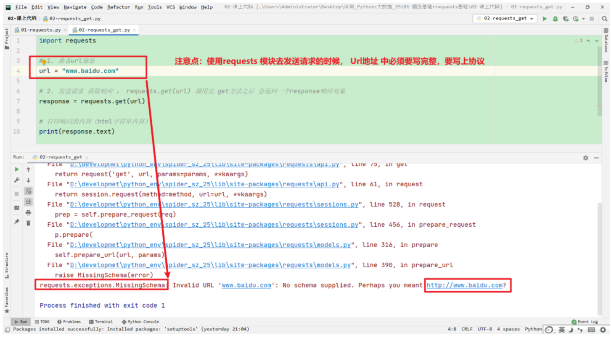

## response 响应对象的属性和方法

### response.text

获取响应的字符串内容

```python
import requests

# 1. 准备url地址
url = "http://www.baidu.com"

# 2. 发送请求 获取响应 ： requests.get(url) 调用完 get方法之后 会返回一个response响应对象
response = requests.get(url)

# 打印响应的内容（html字符串内容）
# 使用 response.text 获取到的就是响应的html字符串内容
# 数据在互联网 进行传输的时候，都是使用的 bytes类型， response.text 拿到字符串内容的# 时候也是对数据进行 解码，解码的时候 使用的编码格式 是推测出来的
# 查看 使用response.text 解码的时候，使用的编码格式
print(response.encoding)
# print(response.text)
# 解决使用 response.text 乱码的问题，我们可以，在调用 text 属性之前，指定解码的编码方式
response.encoding = "utf-8"

print(response.text)

print(type(response.text))
```

### response.content

获取响应的是<font style="color:rgb(216,57,49);">字节流（bytes类型）</font>的数据， 如果想要拿到<font style="color:rgb(216,57,49);">字符串类型</font>的数据可以使用以下方式：

```python
response.content.decode()  
```

```python
# 1. 导入rquests模块
import requests

# 2. 定义一个url地址
url = 'http://www.baidu.com'

# 3. 发送get请求
response = requests.get(url)

# 4. 获取响应结果
print(response.content)  # 字节流数据
print(type(response.content))  # <class 'bytes'>
print(response.content.decode('utf-8'))  # decode，对字节流数据进行解码
```

问题：requests模块发起请求后，如果结果保存在response中，则response.text与response.content有何区别？

答：<font style="color:rgb(216,57,49);">response.text返回字符串，需要通过response.encoding解决中文乱码</font>

<font style="color:rgb(216,57,49);"> response.content返回字节流，需要通过decode进行解码才能查看文本信息</font>

## requests 携带 headers

默认使使用requests模块去发送请求的时候，使用的<font style="color:#DF2A3F;">User-Agent</font>不是一个正常的浏览器的UA，服务器会监测到，监测到之后，就会返回一些假数据 或者是不完整的数据，

如果我们想要获取到完整的数据，就可以在发送请求的时候，携带上一个正常的浏览器的User-Agent。

目的：就是为了让我们的爬取程序伪装的更像是一个正常的浏览器在请求对方的服务器，进而拿到正确的数据。

语法：

```python
requests.get(url, headers={})

字典中的键值对，就是我们直接从浏览器中复制过来的请求头中的字段，
```

```python
# 1. 导入模块
import requests

# 2. 定义url
url = "http://www.baidu.com"

# 3. 定义请求头
headers = {
    "User-Agent": "Mozilla/5.0 (Windows NT 10.0; Win64; x64) AppleWebKit/537.36 (KHTML, like Gecko) Chrome/136.0.0.0 Safari/537.36"
}

# 4. 发送请求
response = requests.get(url, headers=headers)

# 5. 打印返回结果
print(response.status_code)  # 响应状态码200、404
print(response.text)  # 获取响应内容
```

## requests 携带参数

```python
https://www.baidu.com/s?ie=utf-8&f=8&rsv_bp=1&rsv_idx=1&tn=baidu&wd=%E6%B8%85%E5%8D%8E%E5%A4%A7%E5%AD%A6&fenlei=256&oq=%25E9%25BB%2591%25E9%25A9%25AC%25E7%25A8%258B%25E5%25BA%258F%25E5%2591%2598&rsv_pq=a13e7a4100073429&rsv_t=7a15AIQdJPFaqFU9uUB39cnQ%2BLdFihlrp5aYWuGY%2FDJ%2FEgfbleZ1QysIbPU&rqlang=cn&rsv_enter=1&rsv_dl=tb&rsv_sug3=15&rsv_sug1=11&rsv_sug7=100&rsv_btype=t&inputT=3028&rsv_sug4=3028
```

查询字符串参数：query\_string

格式： 以 <font style="color:rgb(216,57,49);">？</font> 开始，？ 后面 <font style="color:rgb(216,57,49);">key</font>=<font style="color:rgb(216,57,49);">value </font>如果有多个参数，每个参数之间使用 <font style="color:rgb(216,57,49);">&</font> 符号进行连接。

在使用requests模块的时候想要去携带查询字符串参数如何去操作：

第一种方式： 直接对url地址去发送请求即可

```python
https://www.baidu.com/s?wd=%E6%B8%85%E5%8D%8E%E5%A4%A7%E5%AD%A6
```

```python
import requests

# 1. 准备url地址
url = "https://www.baidu.com/s?wd=京东商城"
# 准备请求头的字典
headers = {
    "User-Agent": "Mozilla/5.0 (Windows NT 10.0; Win64; x64) AppleWebKit/537.36 (KHTML, like Gecko) Chrome/91.0.4472.164 Safari/537.36"
}

# 2. 发送请求 获取响应
response = requests.get(url, headers=headers)

# 3. 将响应的内容 保存到一个html文件中
with open('jd.html', 'w', encoding='utf-8') as f:
    f.write(response.content.decode())
```

经验：查询字符串参数，必传参数 和 非必传参数 ，怎么去判断 必传 和非必传参数呢？ 试

第二种方式： 使用 get方法中提供的一参数，params

```python
requests.get(url, params={})

构造请求 参数的字典，只需要将 等号左边的内容 作为字典key，等号右边的内容作为value
{"wd": "京东商城"}
```

```python
import requests

# 1. 准备url地址  url地址中如果有查询字符串参数，在使用params参数携带参数的时候，
# requests模块会自动的将 url地址中缺少的 ？ 给补充上
url = "https://www.baidu.com/s"
# 准备参数的字典
params = {
    "wd": "京东商城"
}
# 准备请求头的字典
headers = {
    "User-Agent": "Mozilla/5.0 (Windows NT 10.0; Win64; x64) AppleWebKit/537.36 (KHTML, like Gecko) Chrome/91.0.4472.164 Safari/537.36"
}

# 2. 发送请求 获取响应
response = requests.get(url,params=params, headers=headers)

# 3. 将响应的内容 保存到一个html文件中
with open('jd.html', 'w', encoding='utf-8') as f:
    f.write(response.content.decode())

# 获取响应的url地址
print(response.url)
```

## 发送post请求

在 HTTP 协议中，`GET` 和 `POST` 是两种最常用的请求方法，用于客户端与服务器之间的通信。它们的主要区别在于数据传递的方式和使用场景。

案例：

```python
import requests

url = "https://httpbin.org/post"
data = {"username": "admin", "password": "123456"}

response = requests.post(url, json=data)

print("状态码:", response.status_code)
print("响应内容:", response.json())
```

URL地址：

请求数据：

> data 是一个 Python 字典，包含了需要提交的键值对数据。 使用 json=data 参数指定将数据以 JSON 格式发送。

发送请求：

> requests.post(url, json=data) 将数据作为 JSON 负载发送到服务器。

响应处理：

> response.status\_code：打印响应状态码（如200表示成功）。 response.json()：将响应内容解析为 Python 字典。

## GET与POST区别对比

记住3条以上即可

| 特性 | **GET** | **POST** |
| --- | --- | --- |
| **数据传输方式** | 数据<font style="color:rgb(216,57,49);">通过 </font><font style="color:rgb(216,57,49);">URL</font><font style="color:rgb(216,57,49);"> 参数</font>（Query String）传递。 | 数据通过<font style="color:rgb(216,57,49);">请求体</font>（Request Body）传递。 |
| **数据大小限制** | <font style="color:rgb(216,57,49);">有限制</font>（具体取决于浏览器和服务器）。 | 理论上<font style="color:rgb(216,57,49);">无大小限制</font>（受服务器配置影响）。 |
| **请求用途** | 通常用于<font style="color:rgb(216,57,49);">获取数据</font>（无副作用）。 | 通常用于<font style="color:rgb(216,57,49);">提交数据</font>（可能更改服务器状态）。 |
| **安全性** | <font style="color:rgb(216,57,49);">数据直接暴露在 </font><font style="color:rgb(216,57,49);">URL</font><font style="color:rgb(216,57,49);"> 中，安全性较低。</font> | <font style="color:rgb(216,57,49);">数据存储在请求体中，相对更安全。</font> |
| **缓存** | 浏览器<font style="color:rgb(216,57,49);">会缓存 GET 请求的结果</font>。 | 默认<font style="color:rgb(216,57,49);">不会缓存 POST 请求</font>。 |
| **可见性** | <font style="color:rgb(216,57,49);">数据在 </font><font style="color:rgb(216,57,49);">URL</font><font style="color:rgb(216,57,49);"> 中可见</font>，适合发送非敏感数据。 | <font style="color:rgb(216,57,49);">数据不可见</font>，适合发送敏感数据（如密码）。 |
| **使用场景** | <font style="color:rgb(216,57,49);">数据查询、静态页面加载</font>。 | <font style="color:rgb(216,57,49);">数据提交、文件上传、登录操作</font>等。 |

在之前的系统资源检测中，我们如果发现某些资源超过了阈值，通过发送告警邮件来通知运维工程师。但是发送邮箱时效性不是很好，可能运维人员没有及时关注到邮箱！！！

在企业中，我们上班都会用到企业微信，微信我们关注的就会比较及时，那我们可以将告警信息及时发送到企业微信中就好了，是可以的！

我们需要做的具体步骤：

1. 下载一个企业微信并且安装好
2. 创建一个企业微信群，并且在群里添加一个群机器人，名字任意
3. 通过编写Python代码，让群机器人在群里发送消息！ 也就是一旦告警，就给群里发消息！

企微接口文档地址：https://developer.work.weixin.qq.com/document/path/91770

## 企业微信案例

### 获取 webhook 地址

**前提：下载好手机端的企业微信和电脑端的企业微信。**

下面是手机端企业微信的登录、创建以及获取 webhook 的步骤：


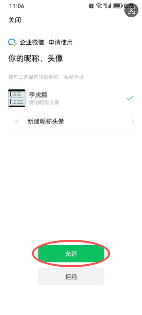

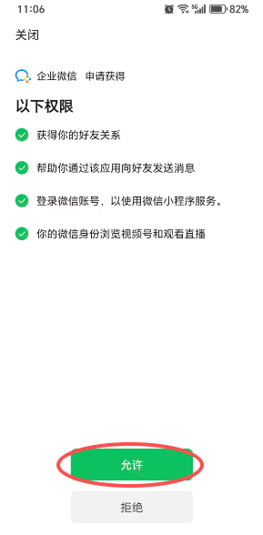

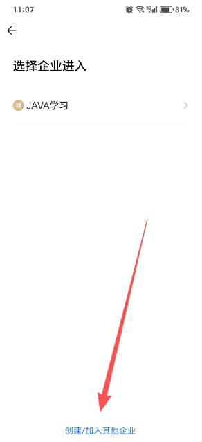

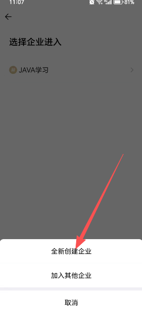

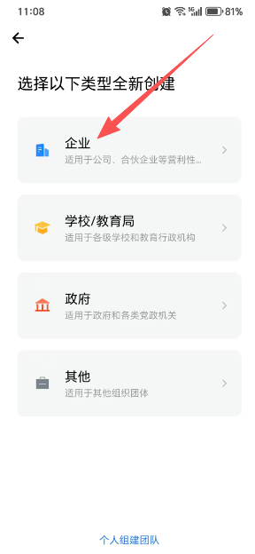


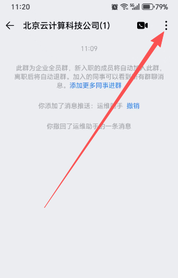


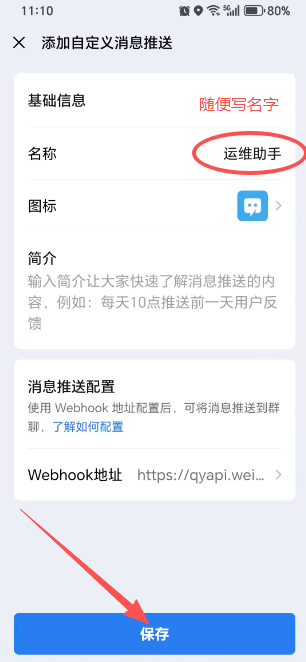

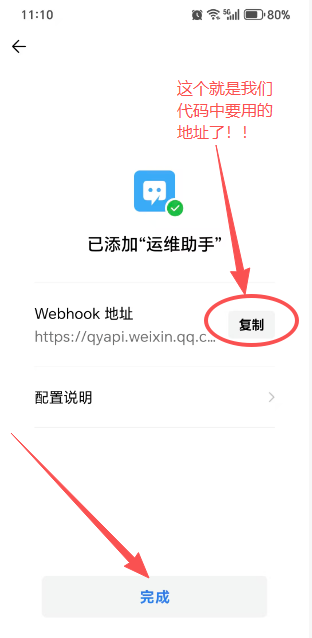

### 案例1-发送文本消息

发送普通文本消息：

```python
import requests
# 企业微信机器人 Webhook URL
WEBHOOK_URL = "https://qyapi.weixin.qq.com/cgi-bin/webhook/send?key=aa1ec80c-221b-4d96-a2cd-ceffca46eba9"


headers = {"Content-Type": "application/json"}
message = "企业微信告警测试！！！"
data = {
    "msgtype": "text",
    "text": {
            "content": message
    }
}
try:
    response = requests.post(WEBHOOK_URL, json=data, headers=headers)
    if response.status_code == 200:
        print("企业微信告警发送成功")
    else:
        print(f"企业微信告警发送失败，状态码: {response.status_code}")
except Exception as e:
    print(f"发送企业微信告警失败: {e}")
```

> 我们可以将上面代码案例封装为一个函数，函数的作用就是发送消息给企微，参数是消息内容！

### 案例2-发送图文消息

发送图文消息：

```python
import requests
# 企业微信机器人 Webhook URL
WEBHOOK_URL = "https://qyapi.weixin.qq.com/cgi-bin/webhook/send?key=aa1ec80c-221b-4d96-a2cd-ceffca46eba9"

headers = {"Content-Type": "application/json"}
message = "企业微信告警测试！！！"
data = {
    "msgtype": "news",
    "news": {
       "articles" : [
           {
               "title" : "中秋节礼品领取",
               "description" : "今年中秋节公司有豪礼相送",
               "url" : "www.jd.com", # 点击图文后跳转的路径
               # 图片的地址
               "picurl" : "https://res.mail.qq.com/node/ww/wwopenmng/images/independent/doc/test_pic_msg1.png"
           }
        ]
    }
}
try:
    response = requests.post(WEBHOOK_URL, json=data, headers=headers)
    if response.status_code == 200:
        print("企业微信告警发送成功")
    else:
        print(f"企业微信告警发送失败，状态码: {response.status_code}")
except Exception as e:
    print(f"发送企业微信告警失败: {e}")
```

> 我们可以将上面代码封装为一个函数，功能就是发送图文信息给企业微信群，参数是：标题、描述信息、点击图片跳转的地址、图片的地址。

### 案例3-发送文本消息并@成员

发送普通文本消息，并@指定人或者所有人：

```python
import requests
# 企业微信机器人 Webhook URL
WEBHOOK_URL = "https://qyapi.weixin.qq.com/cgi-bin/webhook/send?key=aa1ec80c-221b-4d96-a2cd-ceffca46eba9"

headers = {"Content-Type": "application/json"}
message = "企业微信告警测试！！！"

# mentioned_list表示要@的人是哪些人
data = {
    "msgtype": "text",
    "text": {
        "content": "广州今日天气：29度，大部分多云，降雨概率：60%",
        "mentioned_list":["wangqing","@all"],
        "mentioned_mobile_list":["13800001111","@all"]
    }
}
try:
    response = requests.post(WEBHOOK_URL, json=data, headers=headers)
    if response.status_code == 200:
        print("企业微信告警发送成功")
    else:
        print(f"企业微信告警发送失败，状态码: {response.status_code}")
except Exception as e:
    print(f"发送企业微信告警失败: {e}")
```

> **<font style="background-color:#FBDE28;">注意：如果企业微信群中有中文昵称的成员，我们要@的话，需要@中文名字对应的拼音！</font>**
>
> **<font style="background-color:#FBDE28;">比如：要@张三，需要写为：@zhangsan</font>**

# 七、阈值检测与企微报警

## 任务背景

在生产环境中，资源使用率（如CPU、内存、磁盘）过高会导致性能问题甚至系统崩溃。为了确保系统的稳定运行，需要设置资源使用率的阈值（如CPU使用率 > 80%），并在超出阈值时触发报警，同时记录报警信息到日志文件以便后续排查。

## 任务拆解

* 定时<font style="color:rgb(216,57,49);">监控系统资源</font>（CPU、内存、磁盘）的使用率。
* 判断资源使用是否超过设定的阈值（如CPU > 80%，内存 > 90%，磁盘 > 85%）。
* 超过阈值时，<font style="color:rgb(216,57,49);">触发报警</font>并将报警信息<font style="color:rgb(216,57,49);">记录到日志文件</font>。

## 任务实现

企微接口文档地址：https://developer.work.weixin.qq.com/document/path/91770

```python
# 导入相关模块
import psutil
import time
import requests
from datetime import datetime

LOG_FILE = 'resource_alert.log'

# 定义阈值 以及 企业告警链接地址
CPU_THRESHOLD = 80
MEMORY_THRESHOLD = 90
DISK_THRESHOLD = 85

WEBHOOK_URL = 'https://qyapi.weixin.qq.com/cgi-bin/webhook/send?key=aa1ec80c-221b-4d96-a2cd-ceffca46eba9'

# 日志记录函数
def log_alert(resource_type, usage, threshold):
    # 获取当前时间 => 记录大概什么时间发生了本次故障
    current_time = datetime.now().strftime('%Y-%m-%d %H:%M:%S')
    # 本次资源采集涉及到CPU、内存、磁盘等信息，需要在日志文件中对其进行区分以及记录
    # [2025-05-14 11:04:05] CPU使用率过高，超过了阈值80%，当前使用率为90%
    message = f'[{current_time}] {resource_type}使用率过高，超过了阈值{threshold}%, 当前使用率为{usage}%'
    # 打开文件并写入日志到文件中
    with open(LOG_FILE, 'a', encoding='utf-8') as file:
        file.write(message + '\n')
    print(message)
# 接口开发
def send_wechat_alert(message):
    # 定义header头信息
    headers = {'Content-Type': 'application/json'}
    # 定义传输数据（要求是一个字典）
    data = {
        "msgtype": "text",
        "text": {
            "content": message
        }
    }
    try:
        response = requests.post(url=WEBHOOK_URL, headers=headers, json=data)
        if response.status_code == 200:
            print('资源使用率告警已被触发，已通过企业微信发送给运维人员！')
        else:
            print('资源使用率告警已被触发，但通过企业微信发送给运维人员失败！')
    except Exception as e:
        print(f'企业微信接口调用失败，错误信息为：{e}')


def check_resource_usage():
    # 获取CPU使用率
    cpu_usage = psutil.cpu_percent(interval=1)
    if cpu_usage > CPU_THRESHOLD:
        log_alert('CPU', cpu_usage, CPU_THRESHOLD)
        send_wechat_alert(f'CPU使用率过高，超过了阈值{CPU_THRESHOLD}%, 当前使用率为{cpu_usage}%')
    # 获取内存使用率
    memory_usage = psutil.virtual_memory().percent
    if memory_usage > MEMORY_THRESHOLD:
        log_alert('内存', memory_usage, MEMORY_THRESHOLD)
        send_wechat_alert(f'内存使用率过高，超过了阈值{MEMORY_THRESHOLD}%, 当前使用率为{memory_usage}%')
    # 获取磁盘使用率
    disk_usage = psutil.disk_usage('/').percent
    if disk_usage > DISK_THRESHOLD:
        log_alert('磁盘', disk_usage, DISK_THRESHOLD)
        send_wechat_alert(f'磁盘使用率过高，超过了阈值{DISK_THRESHOLD}%, 当前使用率为{disk_usage}%')
    # 打印出当前资源使用率
    print(f'CPU使用率为{cpu_usage}%，内存使用率为{memory_usage}%，磁盘使用率为{disk_usage}%')

if __name__ == '__main__':
    try:
        print('正在采集资源使用率数据...')
        while True:
            check_resource_usage()
            time.sleep(5)
    except KeyboardInterrupt:
        print('本次数据采集已结束！')
```


> 更新: 2025-12-11 14:13:33  
> 原文: <https://www.yuque.com/u41736172/az9urv/guyck1lorgllo33y>