# 01.Containerd容器运行时

# 一、【了解】Containerd 发展历史

**为什么要学它？**

* \*\*核心地位：\*\*Containerd 处于容器技术栈的基础层面，负责容器的生命周期管理，包括容器的创建、启动、停止、销毁等操作。
* **技术基石**：它是理解更高级容器编排工具（如 Kubernetes）的基础，了解 Containerd 有助于你更好地理解 Kubernetes 是如何与底层容器进行交互的。

## Containerd 的前世今生

> 云计算背景
>
> 2006年，亚马逊公司宣布推出AWS（Amazon Web Service）平台。次年又推出了在线存储服务S3（Simple Storage Service）和弹性计算云EC2（Elastic Compute Cloud）等服务。但当年亚马逊并没有谷歌和IBM的影响力，并未引起业界震动。后来随着云计算的爆发，亚马逊在商业模式上的积累，奠定了AWS的高速发展和领军地位。
>
> 2006年，谷歌推出了“Google 101计划”，并正式提出“云”的概念和理论。该计划基于谷歌员工比希利亚的设想，初衷是设置一门课程，着重引导学生们进行“云”系统的程序开发;
>
> 2007年10月，谷歌、IBM联合了美国6所知名大学帮助学生在大型分布式计算系统上进行开发，当时的IBM发言人就指出这种所谓的“大型分布式计算系统”就是云计算，明确提出“云计算”这一新概念。
>
> 2008年10月，微软公司的Windows Azure Platform公共云计算平台发布，开始了微软公司的云计算之路。
>
> 2010年7月，美国太空总署联合Rackspace、AMD、Intel、戴尔等厂商共同宣布“OpenStack”开源计划。成立了**OpenStack开源云平台**。

\*\*【初次邀约】\*\*2013年Docker公司在推出docker产品后,由于其对全球技术产生了一定的影响力，Google公司明显感觉到自己的江湖地位受到了威胁，希望Docker公司能够与自己联合打造一款开源的容器运行时作为Docker核心依赖，但Docker公司拒绝了。

**【成立开发容器倡议社区】**接着Google公司联合RedHat、IBM等公司说服Docker公司把其容器核心技术**libcontainer**捐给中立社区\*\*(OCI,Open Container Intiative)**，并更名为**runC\*\*。

**【成立云原生基金会】2015年，**为了进一步遏制Docker在未来技术市场影响力，避免在容器市场上Docker一家独大，Google公司带领导RedHat、IBM等成立了<font style="color:rgb(216,57,49);">CNCF(Cloud Native Computing Fundation)基金会</font>，即**云原生**计算基金会。

\*\*【甩出秘密武器】\*\*CNCF的目标很明确，既然在容器应用领域无法与Docker相抗衡，那就做Google更有经验的技术市场------大规模容器编排应用场景，Google公司把自己内部使用的Borg系统开源------Kubernetes，也就是我们今天所说的云原生技术生态。

> 容器编排是一项能够完成容器部署、调度、伸缩以及健康监控等（全生命周期）任务的自动化管理技术。

> Borg
>
> Borg 是《星际迷航》虚构的一个宇宙种族——博格人。每个博格人没有什么自主意识，整体受一个Borg Queen控制，集群拥有高度智慧和战斗能力。
>
> 受电影启发，谷歌内部用Borg命名公司的集群管理系统。

2015年Docker公司推出了Docker Swarm，意在一统Docker生态，让Docker既可以实现容器应用管理，也可以实现大规模容器编排，经过近1年左右时间的市场验证后，发现在容器编排方面无法独立抗衡Kubernetes，所以Docker公司于2017年正式宣布原生支持Kubernetes。

至此，Docker在大规模容器编排应用市场败下阵来。但是Docker依然不甘心失败，把Docker核心依赖Containerd捐给了CNCF，以此说明Docker依旧是一个PaaS平台（目的是为了**在容器生态中占有一席之地**）。

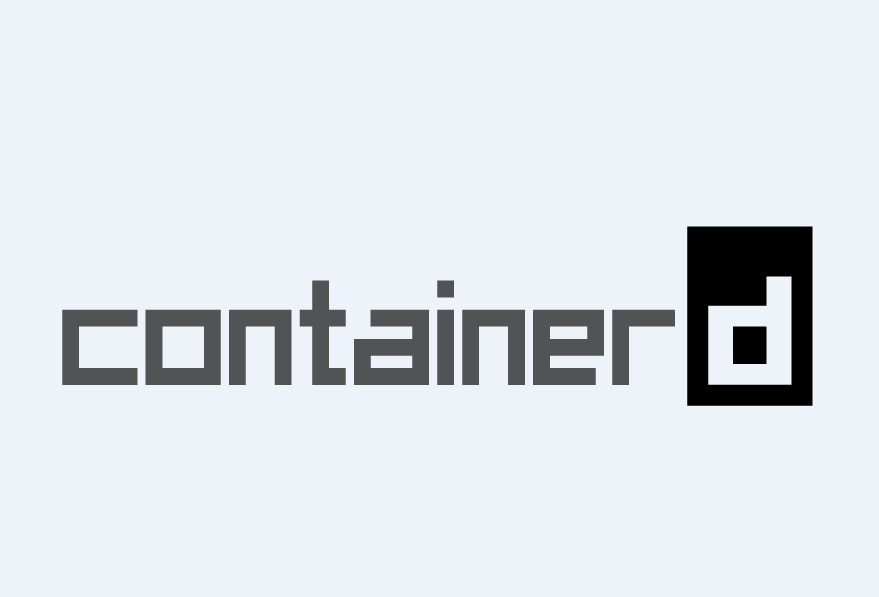

2020年CNCF基金会宣布Kubernetes 1.20版本将不再仅支持Docker容器管理工具，所以接下来Kubernetes容器运行时的主角是Containerd。涵盖整个**容器运行时**管理的所有需求。

> K8s 1.24 版本切换成了 Containerd。
>
> 补充：运行时(Runtime)，在计算机中，是指程序的运行阶段、运行所依赖的环境、在运行过程中可能出现的各种情况。

# 二、【掌握】Containerd 安装

## 环境准备

第一步：克隆一台最小化安装的机器，名字为 containerd，并修改 MAC 地址

第二步：修改 IP 地址、主机名

```shell
# vim /etc/NetworkManager/system-connections/ens33.nmconnection
address1=192.168.126.111/24

# nmcli connection reload
# nmcli connection up ens33

# hostnamectl set-hostname containerd.lhp.cn
# su
```

## dnf 安装

### 获取阿里源

在 CentOS Stream 9 系统中，我们可以从阿里云获取适用于该系统的 Docker DNF 源，该源包含了 Containerd 软件的相关信息，便于后续安装。

```shell
# 先查看当前的镜像源
dnf repolist -v

# 如果不是阿里源，再执行以下命令，从阿里云下载 Docker DNF 源配置文件到系统指定目录
# ce 表示 Community Edition，社区版
dnf install -y wget

# -O 输出到指定文件
wget -O /etc/yum.repos.d/docker-ce.repo https://mirrors.aliyun.com/docker-ce/linux/centos/docker-ce.repo
```

再次使用 dnf repolist -v 命令，查看输出中是否包含新添加的阿里云 Docker 源信息。

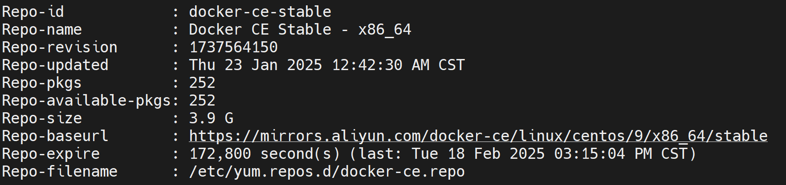

### dnf命令行安装

通过上一步获取到 Containerd 软件信息后，使用 dnf 命令进行安装。

**注意：一定要指定版本，不同的版本在部分功能上是有区别的！**

```shell
# 安装 containerd.io 软件
dnf -y install containerd.io-1.7.25-3.1.el9
或
dnf -y install containerd-1.7.25-3.1.el9

平时我们通过yum或者dnf安装软件一般都不指定版本，默认安装的就是最新的，如果指定版本的话，格式：
yum -y install 软件包名-版本号
dnf -y install 软件包名-版本号
```

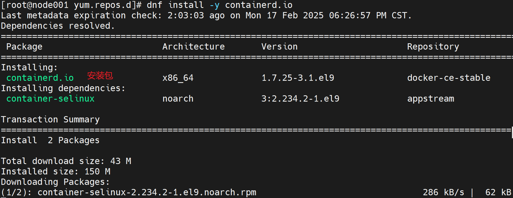

如果已经安装的有了，则是下面的提示：

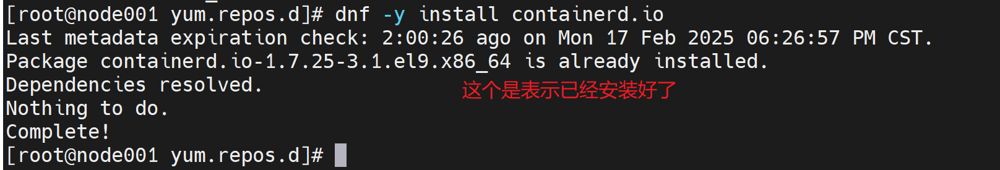

### 启动服务

下载完成后，查看 dnf 源中 containerd 软件的相关信息。

```shell
# 使用 dnf list 命令列出所有软件包，并通过 grep 过滤出包含 containerd 的软件包信息
dnf list installed | grep containerd


rpm -qa | grep xxxx
```

正常情况下，会显示类似如下信息：

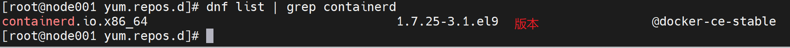

执行以下系统命令

```shell
# 设置containerd服务启动及开机自启动
systemctl enable containerd

# 启动命令
systemctl start containerd

# 查看containerd服务启动状态
systemctl status containerd
```

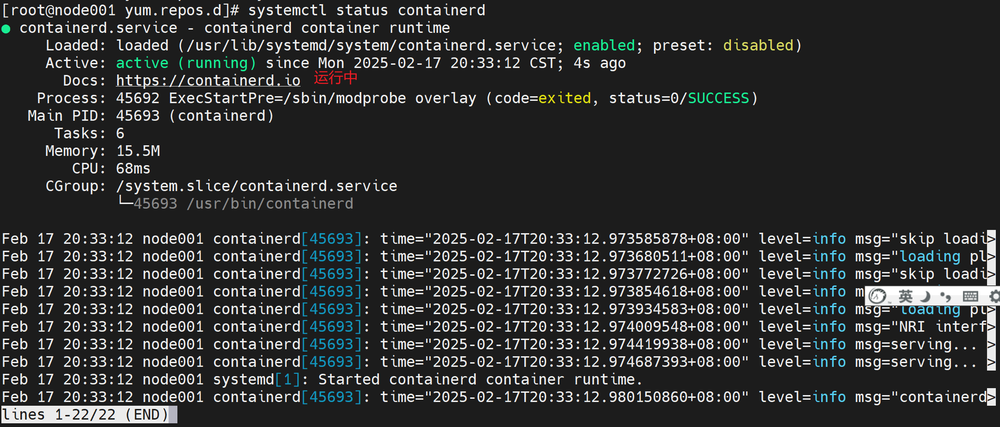

思考

1、我们提到过，service后面的enabled表示服务自启动；那么preset后面显示disabled，表示什么？ 	【preset - 预设】

### 验证测试

```shell
# 安装Containerd时ctr命令亦可使用，ctr命令主要用于管理容器及容器镜像等。
# 使用ctr命令查看Containerd客户端及服务端相关信息。
ctr version
```

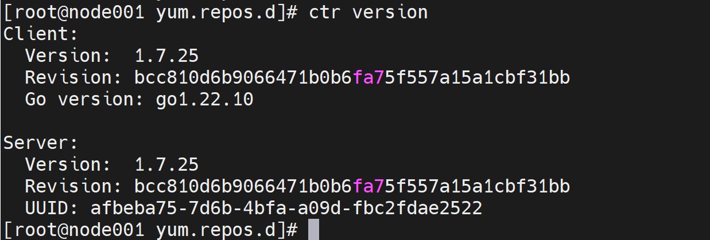

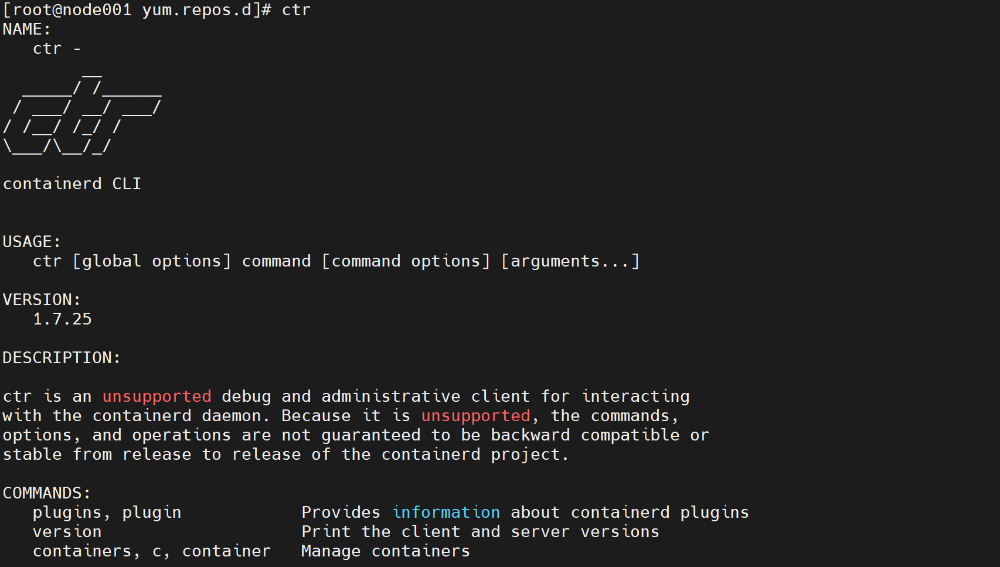

## 总结

1、dnf安装方式Containerd的执行方法为：dnf install -y \_\_\_\_\_\_;

2、mkdir 和 mkdir -p的区别

3、cp 命令 cp /root/\* 中的 \*表示什么？

4、怎么把 /usr/local/bin 加入到永久环境变量？

```shell
# 打开家目录下的文件
vi ~/.bashrc

# 在 export PATH 后面另起一行，补上路径
export PATH=$PATH:/usr/local/bin

# 更新，使生效
source ~/.bashrc

重启电脑 reboot
```

5、less 和 more 的区别

# 三、【掌握】Containerd 镜像管理

## 帮助手册

不同环境下 Docker、Containerd 及 Kubernetes 管理镜像的命令工具解析：

* Docker 使用 docker images 命令管理镜像。
* 在单机环境下，Containerd 使用 ctr images 命令管理镜像，其中 ctr 是 Containerd 本身自带的命令行接口（CLI）工具。
* 在 Kubernetes（K8s）集群中，若使用 Containerd 作为容器运行时，可使用 crictl images 命令管理镜像，crictl 是 Kubernetes 社区开发的用于与容器运行时交互的专用命令行接口（CLI）工具。

### ctr

```shell
# 获取命令帮助
ctr --help
```

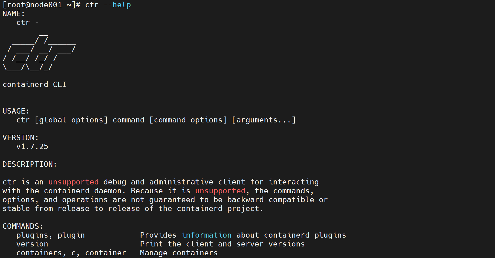

### ctr images

```shell
# 获取命令帮助
ctr images
```

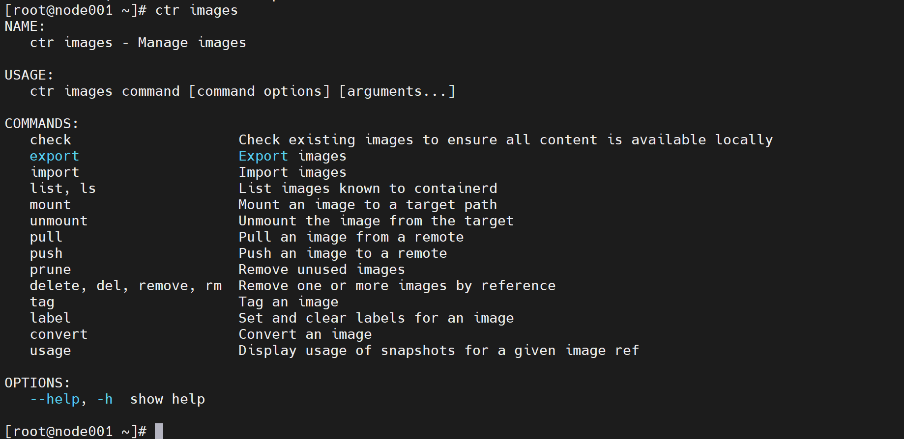

## 镜像相关操作

在执行命令之前，我们先把虚拟机打一个快照，保存一下。

【打开vmware】->【虚拟机】->【快照】->【拍摄快照】

### 查看镜像

```shell
ctr images list
或者
ctr images ls
或者
ctr i ls
```

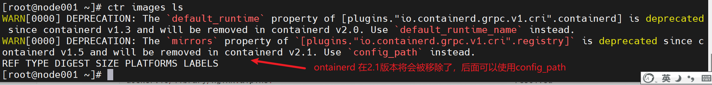

### 拉取镜像

containerd 支持 oci 标准的镜像，所以可以直接使用 docker 官方或 dockerfile 构建的镜像

由于直接访问 Docker 本身的镜像网络受阻，我们从国内的阿里云镜像进行访问。操作步骤为

1、通过账号，或者APP扫码的方式，登录 阿里云 官网；

2、找到【容器镜像服务】菜单；

3、点击【制品中心】，搜索相应的软件镜像；

4、复制镜像的仓库地址；


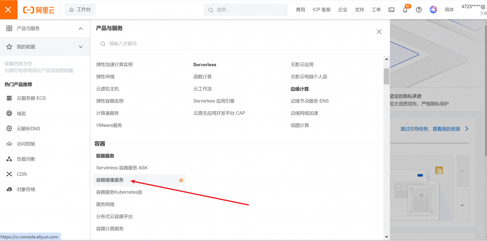

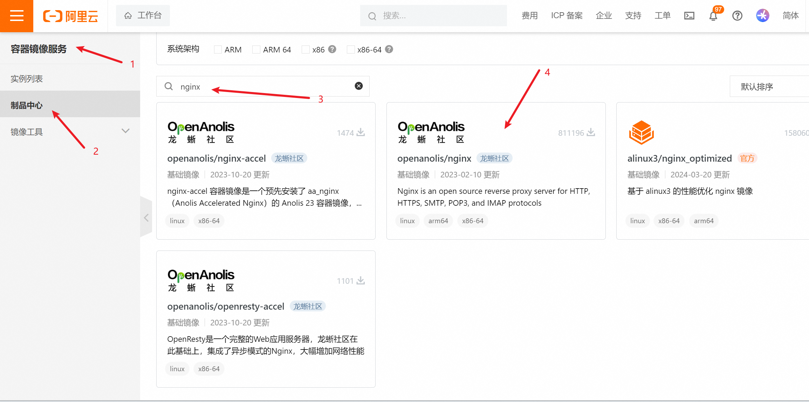

```shell
# 从龙蜥社区进行下载安装
ctr images pull --all-platforms registry.openanolis.cn/openanolis/nginx:1.14.1-8.6
```

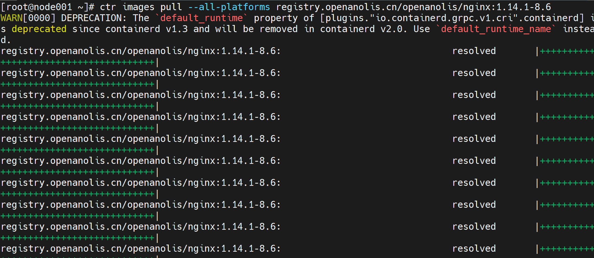

```shell
查看已下载容器镜像
ctr images ls
ctr i ls
```

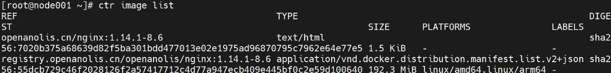

```shell
# 指定平台下载容器镜像
ctr images pull --platform linux/amd64 registry.openanolis.cn/openanolis/nginx:1.14.1-8.6
```

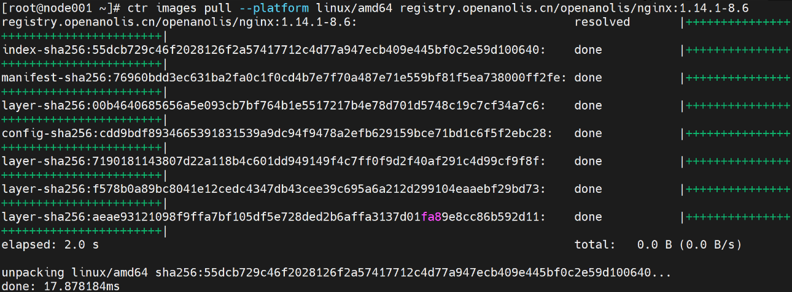

### 镜像挂载

```shell
# 把已下载的容器镜像挂载至当前文件系统
ctr images mount registry.openanolis.cn/openanolis/nginx:1.14.1-8.6 /mnt
```

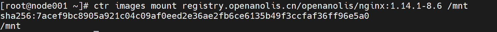

```shell
# 查看挂载的内容
ls /mnt
```

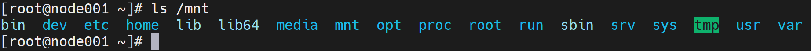

### 镜像卸载

```shell
# 卸载，注意，需要离开 /mnt 目录进行操作
ctr i unmount /mnt
```

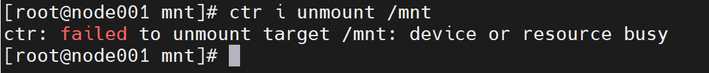

### 镜像导出

```shell
# 回到家目录
cd

# 把容器镜像导出 --all-platforms 表示导出所有平台镜像
# 注意，如果你拉取的时候，没有加 --all-platforms 参数，那么导出的时候，也不要加它
ctr i export --all-platforms  nginx.img  registry.openanolis.cn/openanolis/nginx:1.14.1-8.6

# 查看镜像
ll -hrt
# 复习一下，ll命令里的参数
	- h 表示human，用人能看懂的方式，展示文件大小
	- r 表示reverse逆序，所以是倒序
	- t 表示time时间，即合起来，按时间倒排，那么，最近修改的文件，将最靠近屏幕下方
```

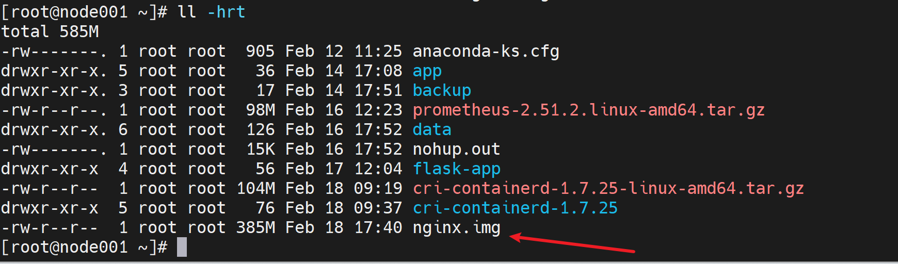

### 镜像删除

```shell
# 删除指定容器镜像
ctr image rm registry.openanolis.cn/openanolis/nginx:1.14.1-8.6
```

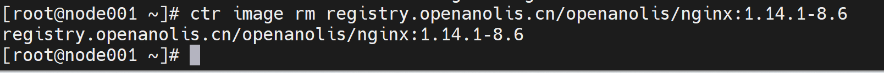

```shell
# 再次查看容器镜像
ctr images ls
```

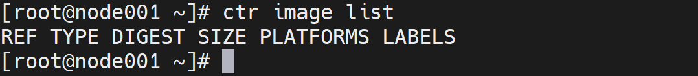

### 镜像导入

```shell
# 导入容器镜像
ctr images import nginx.img
ctr i import nginx.img
```

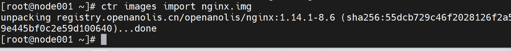

```shell
# 查看镜像列表
ctr image list
```

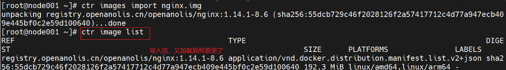

### 修改镜像标签(常用)

```shell
# 把docker.io/library/nginx:alpine 修改为 nginx:alpine
ctr images tag registry.openanolis.cn/openanolis/nginx:1.14.1-8.6 nginx:1.14.1-8.6
```

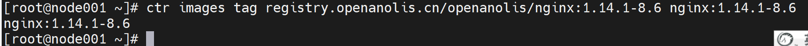

```shell
# 查看修改后的容器镜像
ctr images ls
```

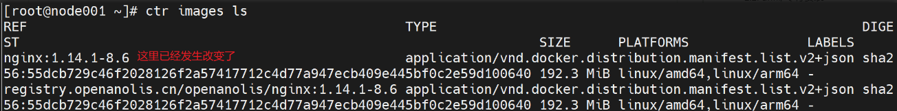

```shell
# 修改后对容器镜像做检查比对
ctr image check
```

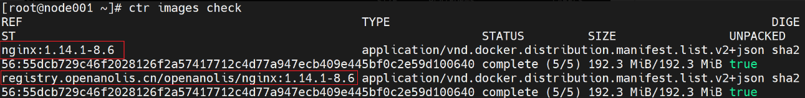

## 总结

1、ctr image/images 有区别吗？

2、熟悉以下命令的含义：

* ctr image list,ls
* ctr image pull/push
* ctr image mount/unmout
* ctr image export/import
* ctr image remove,delete,del,rm
* ctr image tag

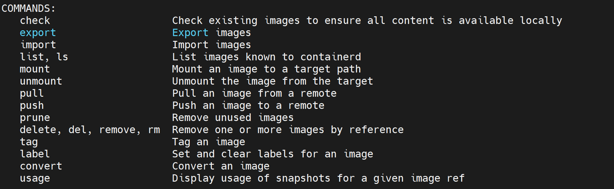

# 四、【掌握】Containerd 容器管理

## 帮助手册

\*\*镜像（Image）：\*\*镜像是一个只读的模板，它包含了运行应用程序所需的所有文件、依赖项、环境变量和配置信息等。类似于软件安装包；

\*\*容器（Container）：\*\*容器是镜像的运行时实例。当使用镜像创建一个容器时，会在镜像的基础上添加一个可写的层，用于存储容器运行过程中产生的数据和状态。只有当任务启动后，才会开始占用系统资源。

\*\*任务（Task）：\*\*任务是容器内具体的执行单元，它代表了容器内正在运行的进程。

命令 `ctr --help` 和命令 ctr 是等价的。

```shell
ctr --help
ctr
```

### ctr container

```shell
ctr container --help
NAME:
   ctr containers - Manage containers

USAGE:
   ctr containers command [command options] [arguments...]

COMMANDS:
   create                   Create container
   delete, del, remove, rm  Delete one or more existing containers
   info                     Get info about a container
   list, ls                 List containers
   label                    Set and clear labels for a container
   checkpoint               Checkpoint a container
   restore                  Restore a container from checkpoint

OPTIONS:
   --help, -h  show help
```

### ctr task

```shell
ctr tasks --help
```

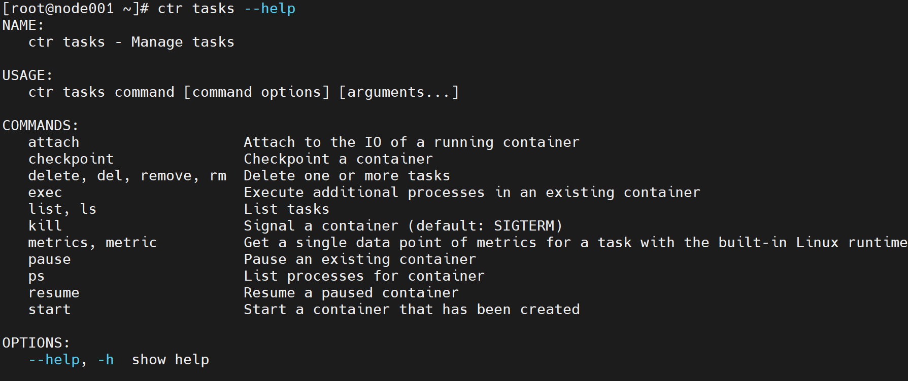

### ctr run

使用 ctr run 命令可以创建一个静态容器并使其运行。一步到位运行容器。

```shell
ctr run --help
NAME:
   ctr run - run a container

USAGE:
   ctr run [command options] [flags] Image|RootFS ID [COMMAND] [ARG...]
   
OPTIONS:
   --rm                                    remove the container after running
   --null-io                               send all IO to /dev/null
   --log-uri value                         log uri
   --detach, -d                            detach from the task after it has started execution
   --fifo-dir value                        directory used for storing IO FIFOs
   --cgroup value                          cgroup path (To disable use of cgroup, set to "" explicitly)
   --platform value                        run image for specific platform
   --cni                                   enable cni networking for the container
   --runc-binary value                     specify runc-compatible binary
   --runc-root value                       specify runc-compatible root
   --runc-systemd-cgroup                   start runc with systemd cgroup manager
   --uidmap container-uid:host-uid:length  run inside a user namespace with the specified UID mapping range; specified with the format container-uid:host-uid:length
   --gidmap container-gid:host-gid:length  run inside a user namespace with the specified GID mapping range; specified with the format container-gid:host-gid:length
   --remap-labels                          provide the user namespace ID remapping to the snapshotter via label options; requires snapshotter support
   --cpus value                            set the CFS cpu quota (default: 0)
   --cpu-shares value                      set the cpu shares (default: 1024)
   --snapshotter value                     snapshotter name. Empty value stands for the default value. [$CONTAINERD_SNAPSHOTTER]
   --snapshotter-label value               labels added to the new snapshot for this container.
   --config value, -c value                path to the runtime-specific spec config file
   --cwd value                             specify the working directory of the process
   --env value                             specify additional container environment variables (e.g. FOO=bar)
   --env-file value                        specify additional container environment variables in a file(e.g. FOO=bar, one per line)
   --label value                           specify additional labels (e.g. foo=bar)
   --mount value                           specify additional container mount (e.g. type=bind,src=/tmp,dst=/host,options=rbind:ro)
   --net-host                              enable host networking for the container
   --privileged                            run privileged container
   --read-only                             set the containers filesystem as readonly
   --runtime value                         runtime name (default: "io.containerd.runc.v2")
   --runtime-config-path value             optional runtime config path
   --tty, -t                               allocate a TTY for the container
   --with-ns value                         specify existing Linux namespaces to join at container runtime (format '<nstype>:<path>')
   --pid-file value                        file path to write the task's pid
   --gpus value                            add gpus to the container
   --allow-new-privs                       turn off OCI spec's NoNewPrivileges feature flag
   --memory-limit value                    memory limit (in bytes) for the container (default: 0)
   --device value                          file path to a device to add to the container; or a path to a directory tree of devices to add to the container
   --cap-add value                         add Linux capabilities (Set capabilities with 'CAP_' prefix)
   --cap-drop value                        drop Linux capabilities (Set capabilities with 'CAP_' prefix)
   --seccomp                               enable the default seccomp profile
   --seccomp-profile value                 file path to custom seccomp profile. seccomp must be set to true, before using seccomp-profile
   --apparmor-default-profile value        enable AppArmor with the default profile with the specified name, e.g. "cri-containerd.apparmor.d"
   --apparmor-profile value                enable AppArmor with an existing custom profile
   --rdt-class value                       name of the RDT class to associate the container with. Specifies a Class of Service (CLOS) for cache and memory bandwidth management.
   --rootfs                                use custom rootfs that is not managed by containerd snapshotter
   --no-pivot                              disable use of pivot-root (linux only)
   --cpu-quota value                       Limit CPU CFS quota (default: -1)
   --cpu-period value                      Limit CPU CFS period (default: 0)
   --rootfs-propagation value              set the propagation of the container rootfs
```

## ctr container

容器是一种轻量级的虚拟化技术。它将应用程序及其依赖项打包在一个独立的环境中，提供了隔离的运行空间。

在 Containerd 中，通过镜像创建了容器后，容器是静止的也就是不会运行的，我们通过 task 任务去运行容器。

### 查看容器

container 表示静态容器，

* 可以用 c 缩写代表 container；
* 可以用 ls 缩写代表 list；

```shell
# 注意，以下几个命令是等价的 
ctr container list
ctr container ls
ctr c list
ctr c ls
```

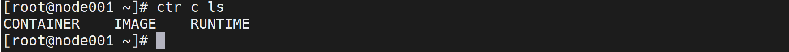

这种单词缩写的形式，将来在 K8s 中也会遇到。通过 --help 也可以查看。

### 创建容器

```shell
# ctr c create 镜像名 容器ID
ctr c create registry.openanolis.cn/openanolis/nginx:1.14.1-8.6 nginx1

# 查看容器
ctr c ls
```

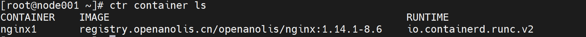

使用 `ctr container create`命令创建容器后，<font style="color:rgb(216,57,49);">容器并没有处于运行状态，其只是一个静态的容器</font>。

【说明】 这个 container 对象只是包含了运行一个容器所需的资源及配置的数据结构，例如：

namespaces、rootfs、容器的配置等都已经初始化成功了，只是用户进程(本案例为 nginx)还没有启动。 需要使用 `ctr tasks`命令才能获取一个动态容器。

我们在计算机中，线程的创建和运行也是类似的两个阶段。

### 查看容器详细信息

```shell
# 查看容器详细信息
ctr c info nginx1
```

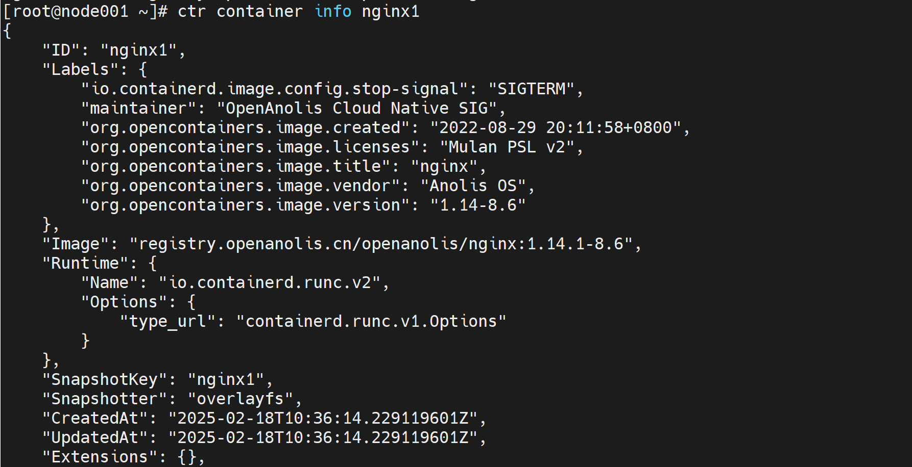

### 删除容器

```shell
ctr container rm 容器ID
```

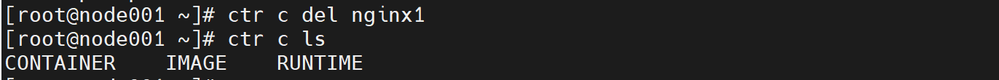

## ctr task

任务（Task）是容器的运行时实例，它代表了容器内正在执行的进程。

### 查看任务

```shell
# 查看容器所在宿主机进程，是以宿主机进程的方式存在的。
# 可以用t缩写代表task
ctr task ls
ctr t ls
```

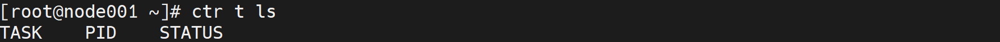

### 启动任务(重要)

```shell
# 启动容器，-d表示daemon，即守护，后台的意思
# 注意，如果不加 -d，会卡住终端
ctr t start -d nginx1

# 查看容器的进程(都是物理机的进程)
ctr t ps nginx1

# 物理机查看到相应的进程
ps -ef | grep 3395
```

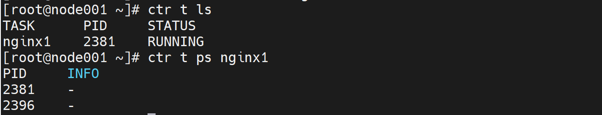

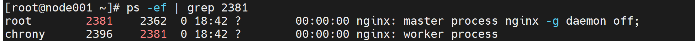

说明：为什么会看到两个？

涉及到父子进程的概念。

第一列：表示进程用户，如root；

第二列：表示进程号，即Process ID；

第三列：<font style="color:rgb(216,57,49);">该进程的父进程，即Parent Process ID</font>，这里表示2381是2362创建出来的；

第四列：表示CPU使用率；

### 停止任务

```shell
# 使用kill命令停止容器中运行的进程，即为停止容器
ctr tasks kill nginx1

# 查看容器停止后状态，STATUS为STOPPED
ctr tasks ls
```

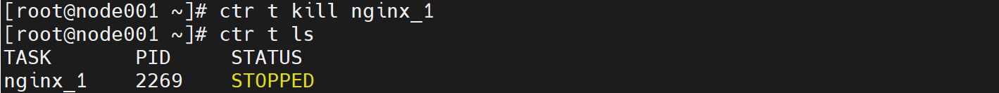

### 删除任务

```shell
ctr t rm nginx1
ctr t del nginx1
```

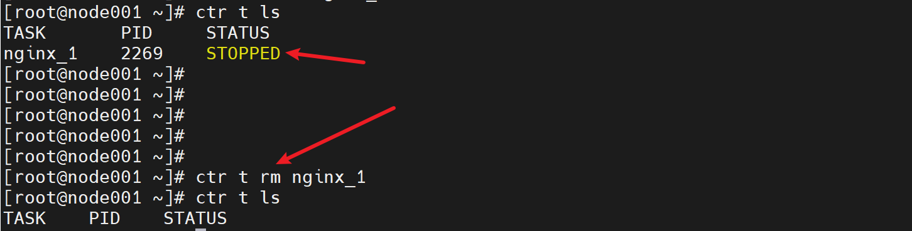

### 暂停任务

```shell
# 暂停容器
ctr tasks pause nginx1
```

### 恢复任务

```shell
# 使用resume命令恢复容器
ctr tasks resume nginx1

# 再次查看容器状态，看到其状态为PAUSED，表示停止。
ctr tasks ls
```

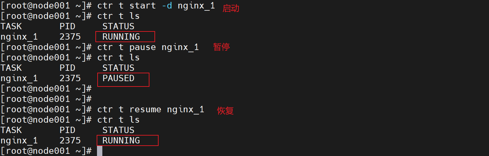

### 进入容器<font style="color:rgb(216,57,49);">(重要)</font>

```shell
# 为exec进程设定一个id，可以随意输入，只要保证唯一即可，也可使用$RANDOM变量。
# -t 是 --tty 的简写，其作用是为执行的命令分配一个伪终端（TTY）
ctr t exec --exec-id 1  -t  nginx1 /bin/sh
```

```shell
# 进入sh之后，执行 ip a 操作
sh-4.4# ip a 查看网卡信息
1: lo: <LOOPBACK,UP,LOWER_UP> mtu 65536 qdisc noqueue state UNKNOWN group default qlen 1000
    link/loopback 00:00:00:00:00:00 brd 00:00:00:00:00:00
    inet 127.0.0.1/8 scope host lo
       valid_lft forever preferred_lft forever
    inet6 ::1/128 scope host
       valid_lft forever preferred_lft forever

# 继续执行 curl 127.0.0.1 操作，访问本地提供的web服务
sh-4.4# curl 127.0.0.1 
```

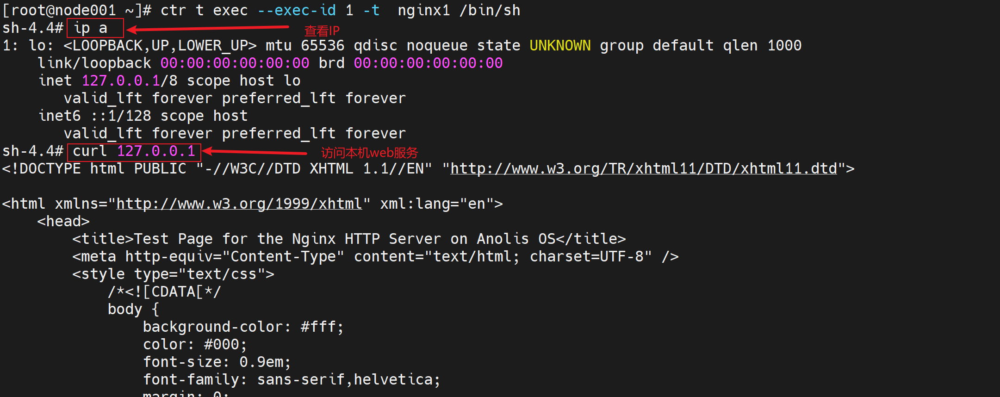

## ctr run

> 上面的案例中，我们可以通过镜像去创建出一个静态的容器；然后通过启动容器变为一个任务！
>
> 其实也可以直接通过镜像创建一个容器并启动起来的！

运行一个动态容器

```shell
# -d 代表dameon，后台运行
# --net-host 代表容器的IP就是宿主机的IP(相当于docker里的host类型网络)

# 镜像必须已经拉取下来了
# --net-host 是一个完整的参数
ctr run -d --net-host registry.openanolis.cn/openanolis/nginx:1.14.1-8.6  nginx_3

# 可以看到创建了一个容器
ctr c ls

# 可以看到启动了容器有了一个任务
ctr t ls
```

进入到容器中

```shell
ctr t exec --exec-id 10 -t nginx_3 /bin/bash

# 为容器中运行的网站添加网站文件
echo "Hello Nginx" > /usr/share/nginx/html/index.html
exit
```

在宿主机上访问网站，大家改成自己的虚拟机IP

curl 192.168.126.111

## 总结

1、ctr container和ctr task搭配，可以创建\_\_\_\_\_\_，并启动一个\_\_\_\_\_\_；

2、ctr run 一步到位，从镜像直接拉起容器和任务；

3、如何进入容器？

* 方式一：ctr t exec --exec-id ID号 -t 容器名 /bin/bash
* 方式二：ctr t exec --exec-id ID号 -t 容器名 /bin/sh

# 五、【掌握】Containerd 命名空间管理

## 帮助手册

Containerd 中 namespace 的作用为隔离运行的容器，可以实现运行多个容器。

```shell
# 查看命令帮助
ctr namespace --help
NAME:
   ctr namespaces - manage namespaces

USAGE:
   ctr namespaces command [command options] [arguments...]

COMMANDS:
   create, c   create a new namespace
   list, ls    list namespaces
   remove, rm  remove one or more namespaces
   label       set and clear labels for a namespace

OPTIONS:
   --help, -h  show help
```

## 查看命名空间

```shell
# 列出已有namespace
ctr namespaces ls
ctr namespace ls
ctr ns ls
```

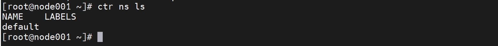

## 创建命名空间

```shell
ctr namespace create lhp
# 或者
ctr ns create lhp
```

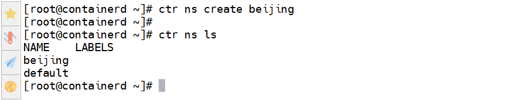

## 删除命名空间

```shell
ctr ns rm lhp
```

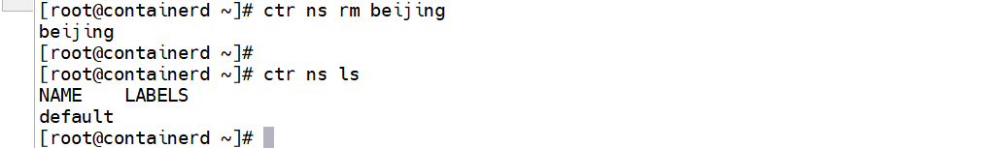

## 查看命名空间中的进程

```shell
ctr -n shanghai tasks ls
```


## 在指定命名空间中下载容器镜像

```shell
ctr -n lhp i pull registry.openanolis.cn/openanolis/nginx:1.14.1-8.6
```

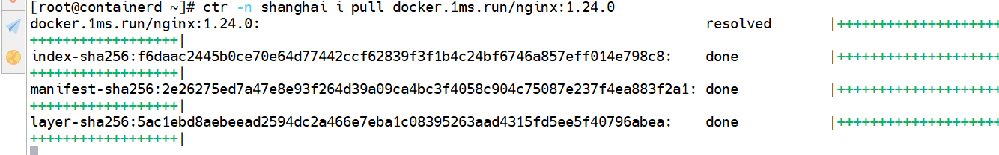

```shell
# 查看指定命名空间下的镜像
ctr -n lhp i ls
```

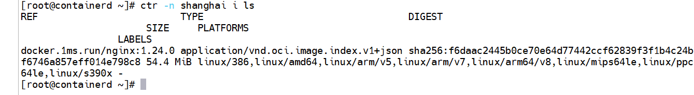

> 其实我们可以给指定的命名空间中下载镜像，也可以给指定的命名空间中导入镜像，也可以修改指定命名空间中镜像的 tag；也可以在指定命名空间中创建容器等。默认，我们没有指定命名空间时，使用的命名空间是 default。
>
> 另外，我们在某个命令空间下有某个镜像的话，如果在别的命名空间中从阿里云那边拉取这个镜像时，会直接从已有的命名空间拿过来这个镜像，特别快，就不需要从阿里云那边拉取下载了！

## 总结

命名空间是为了对运行的容器进行\_\_\_\_\_;

# 六、【扩展】Containerd 使用 Harbor 镜像仓库

## Harbor 准备

> harbor 分为离线包和在线包两种。在线包较小，但需要连网下载。我这里使用离线包
>
> 下载地址: https://github.com/goharbor/harbor/releases
>
> 我这里提供了 \*\*harbor-offline-installer-v2.12.2.tgz ，\*\*大家拷贝到 harbor 服务器上

<font style="background-color:#FBDE28;">准备一台机器 </font><font style="color:rgb(216,57,49);background-color:#FBDE28;">192.168.126.119</font><font style="background-color:#FBDE28;">，单独专门用来安装 harbor 仓库。</font>

1、如果你安装过 Harbor，找到对应的目录（docker-compose.yml 所在的目录）

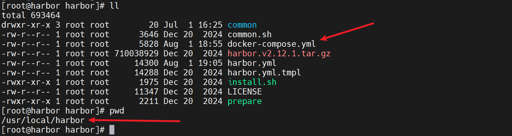

使用下面命令启动一下就可以

```shell
docker-compose up
```

<font style="background-color:#FBDE28;">2、如果你是第一次安装，按照下面操作（</font>**<font style="background-color:#FBDE28;">我们再搭建一次，虽然前面搭建过！</font>**<font style="background-color:#FBDE28;">）</font>

```shell
# 安装 Docker 官方仓库
[root@harbor ~]# wget https://mirrors.aliyun.com/docker-ce/linux/centos/docker-ce.repo -O /etc/yum.repos.d/docker-ce.repo

# 安装 Docker 社区版
[root@harbor ~]# dnf install docker-ce -y
[root@harbor ~]# systemctl start docker
[root@harbor ~]# systemctl enable docker

# 注意，要先自行拷贝到家目录，再解压 Harbor
[root@harbor ~]# tar xf harbor-offline-installer-v2.12.1.tgz -C /usr/local/
[root@harbor ~]# cd /usr/local/harbor/
[root@harbor ~]# cp harbor.yml.tmpl harbor.yml
[root@harbor ~]# vim harbor.yml
  5 hostname: harbor.lhp.cn          将hostname改成harbor服务器主机名称
  
  7 # http related config
  8 http:
  9   # port for http, default is 80. If https enabled, this port will redirect to https port
 10   port: 80
 11
 12 # https related config
 13 #https:                                    关闭https
 14   # https port for harbor, default is 443  关闭https
 15   # port: 443                             关闭https
 16   # The path of cert and key files for nginx
 17   # certificate: /your/certificate/path
 18   # private_key: /your/private/key/path
 19   # enable strong ssl ciphers (default: false)
 20   # strong_ssl_ciphers: false

 47 harbor_admin_password: 123            admin用户的默认密码，我这里改为简单的123
 
 
 [root@harbor harbor]# ./install.sh
......
......
......
✔ ----Harbor has been installed and started successfully.----

Now you should be able to visit the admin portal at http://192.168.88.20.
For more details, please visit https://github.com/goharbor/harbor .
```

**<font style="background-color:#FBDE28;">安装的时候报错了：</font>**

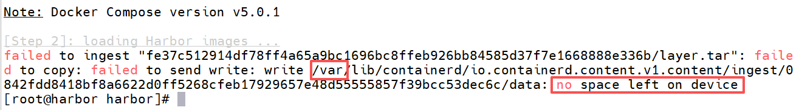

是因为我们当时最小化的系统给 /var 这个分区设置的大小是 2G，不够 harbor 仓库使用！使用 LVM 逻辑卷管理的方式给 /var 分区增加空间后，再次执行安装命令即可。

```shell
1. 关闭harbor的机器
2. 添加一块硬盘10G
3. lsblk
4. pvcreate /dev/sdb
5. vgextend cs_bogon /dev/sdb
6. vgdisplay
7. lvextend -l +100%FREE /dev/cs_bogon/var
8. xfs_growfs /dev/cs_bogon/var
9. df -h
```

<http://192.168.126.119/>

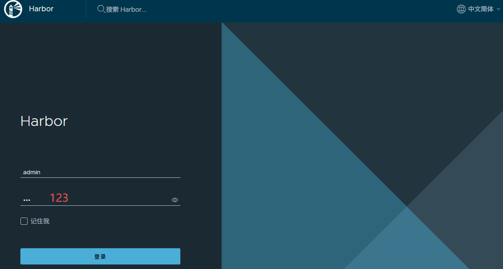

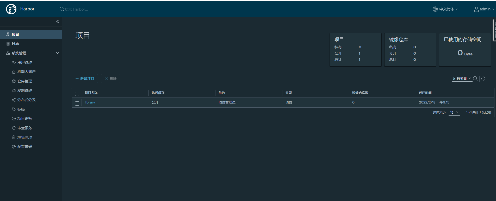

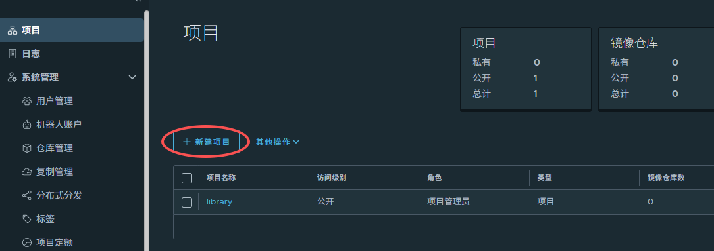

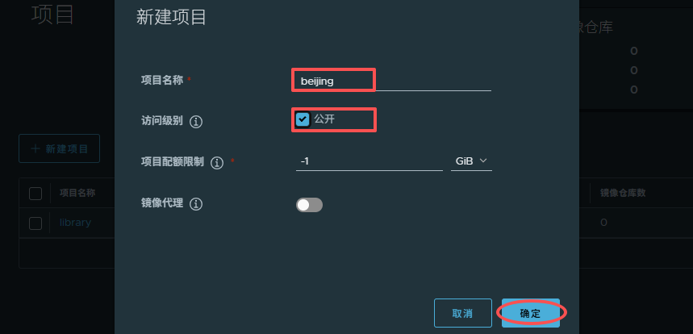

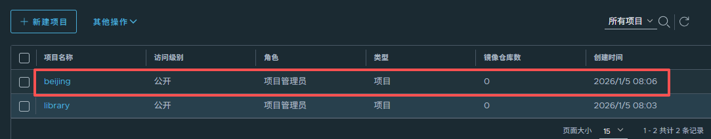

## 配置 Containerd

### Harbor 主机名解析

在**安装 containerd 的主机**上，添加此配置信息。

```shell
# vim /etc/hosts
127.0.0.1   localhost localhost.localdomain localhost4 localhost4.localdomain4
::1         localhost localhost.localdomain localhost6 localhost6.localdomain6

# 添加以下映射，注意，IP地址改成自己的Harbor对应的主机IP，不能直接抄,域名不能抄
192.168.126.119 harbor.lhp.cn
```

说明：

192.168.126.119 是 harbor 的 IP，大家改成自己的

harbor.lhp.cn 这里设置的域名，也可以改成你自己设定的

### 修改 Containerd 配置

> 说明：config\_path 是 containerd 1.5 版本后，新加的功能，意思是从指定目录下，自动去加载对应镜像的配置文件。

在**安装 containerd 的主机**上，依次执行：

第一步：添加 config.toml 中的 \[plugins.cri.registry] 选项

```shell
# 生成配置文件
[root@container ~]# containerd config default > /etc/containerd/config.toml

# 此配置文件已提前替换过，仅修改本地容器镜像仓库地址即可。
[root@container ~]# vim /etc/containerd/config.toml

# config_path 改成以下的内容
[root@container ~]# sed -i 's/config_path = ""/config_path = "\/etc\/containerd\/certs.d\/"/g' /etc/containerd/config.toml

# 最后效果是下面这样
[plugins.cri.registry]
  config_path = "/etc/containerd/certs.d"
```

第二步：在 /etc/containerd/ 目录下，创建一个 certs.d 目录

```shell
[root@container ~]# cd /etc/containerd
[root@container containerd]# mkdir -p certs.d/harbor.lhp.cn  # 域名改成自己配置的harbor服务器的域名
[root@container containerd]# touch /etc/containerd/certs.d/harbor.lhp.cn/hosts.toml 
```

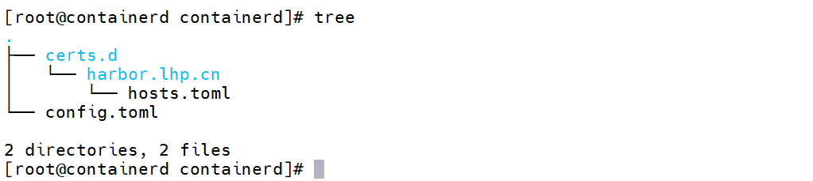

第三步：执行以下命令

```shell
[root@container containerd]# vi /etc/containerd/certs.d/harbor.lhp.cn/hosts.toml

# ------- 粘贴进去以下内容，保存退出 ---------------
server = "http://harbor.lhp.cn"		# 域名改成自己配置的Harbor服务器的域名

[host."http://harbor.lhp.cn"]			# 域名改成自己配置的Harbor服务器的域名
  capabilities = ["pull", "resolve"]
```

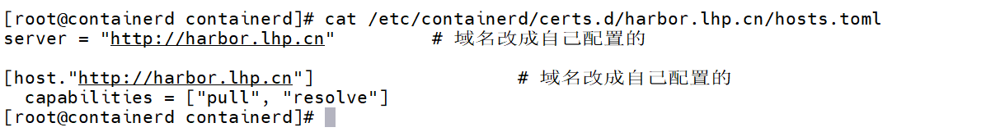

第四步：重启 containerd，以便于重新加载配置文件

```shell
[root@container containerd]# systemctl restart containerd
```

### ctr 上传镜像

上传到 Harbor 的 library 公有项目中。

```shell
# 重新生成新的tag
ctr images tag nginx:1.14.1-8.6 harbor.lhp.cn/library/nginx:1.14.1-8.6
# 或者
ctr images tag registry.openanolis.cn/openanolis/nginx:1.14.1-8.6  harbor.lhp.cn/library/nginx:1.14.1-8.6

# 如果之前拉取过，这两个本地应该都有
```

```shell
# 查看已生成容器镜像
ctr images ls
```

```shell
# 推送容器镜像至Harbor，
ctr images push --platform linux/amd64 --plain-http -u admin:123 harbor.lhp.cn/library/nginx:1.14.1-8.6

其实建议当时拉取到时候平台指定的是什么，推送的时候还得是什么。比如之前是Linux的平台，那就还用Linux的平台；之前是全平台，那就还用全平台。
```

说明：

1、推镜像的时候，要先 tag 再 push；

2、因为我们 harbor 是 http 协议，不是 https 协议，所以<font style="color:rgb(216,57,49);">一定要加上 --plain-http</font>；

3、--user admin:123 是指定 harbor 的用户名与密码。密码改成自己的；

回到 Harbor 查看

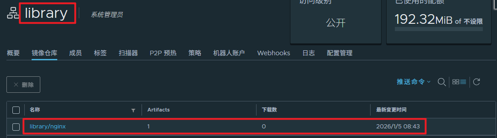

***

将 Containerd 本地中的 Nginx 镜像，打标签，然后推送到 Harbor 中的 beijing 项目中。

```shell
ctr i tag nginx:1.14.1-8.6 harbor.lhp.cn/beijing/nginx:1.14.1-8.6

ctr i ls

ctr i push --platform linux/amd64 --plain-http -u admin:123 harbor.lhp.cn/beijing/nginx:1.14.1-8.6
```

效果：

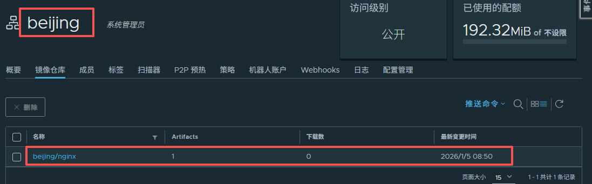

### ctr 下载镜像

在 Harbor 仓库中我们目前有两个公开的项目 library 和 beijing。

公开的项目表示：下载镜像不需要登录，但是上传镜像时需要登录的；

私有的项目表示：下载镜像和上传镜像都需要登录。

```shell
# 先把本地的删掉一下
[root@containerd ~]# ctr i rm harbor.lhp.cn/library/nginx:1.14.1-8.6

# 查看已下载容器镜像
[root@containerd ~]# ctr images ls

# 下载容器镜像，pull表示拉取
# --plain-http 指的是通过 http 协议，即不走443端口，而是走80端口
[root@containerd ~]# ctr images pull --plain-http harbor.lhp.cn/library/nginx:1.14.1-8.6

# 查看已下载容器镜像
[root@containerd ~]# ctr images ls
```

# 七、【课下作业】二进制安装

Containerd 有两种安装包：

* 第一种是containerd-xxx，这种包用于单机测试没问题，不包含runC，需要提前安装。
* 第二种是cri-containerd-cni-xxxx，包含runc和k8s里的所需要的相关文件。k8s集群里需要用到此包。虽然包含runC，但是依赖系统中的seccomp（安全计算模式，是一种限制容器调用系统资源的模式。）

## 安装 containerd

### 获取安装包

[https://github.com/](about:blank)


也可以直接使用资料中提供的。

1 搜索containerd

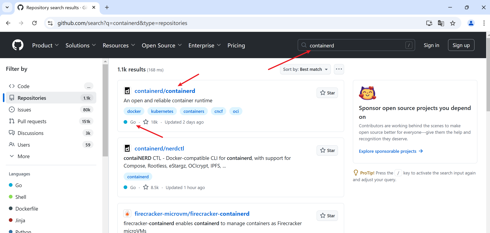

2 点进Release

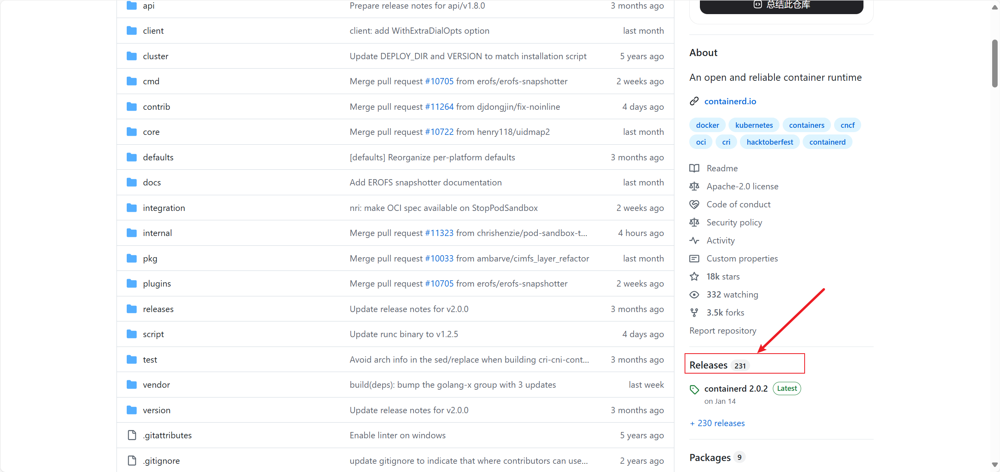

3 找到1.7.25版本

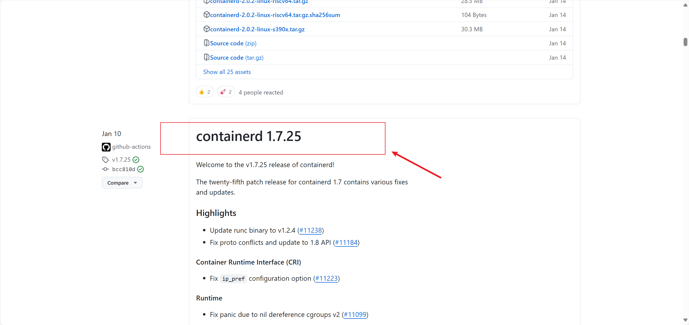

4 找到Assets，展开

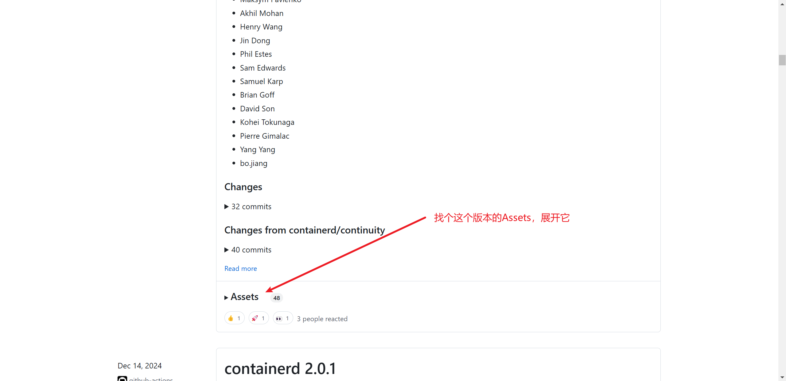

5 找到指定的资源版本，右键复制资源链接。那个带sha256sum的是它对应的哈希值，用作验签的。

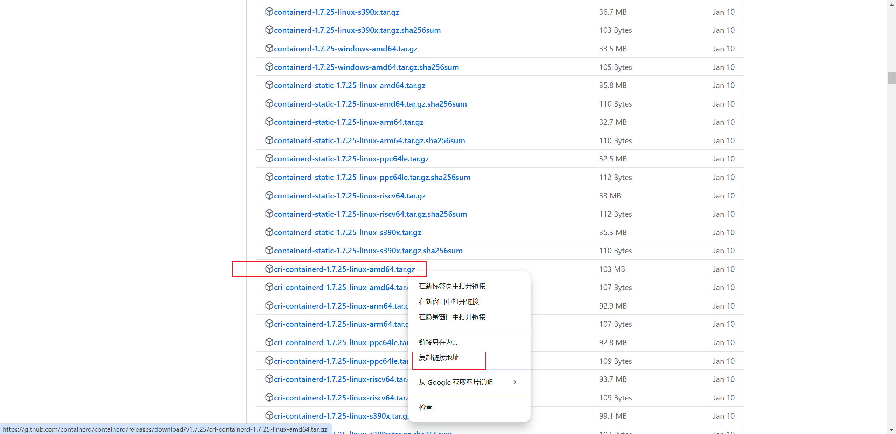

6 使用wget，在Linux虚拟机中的家目录，下载

```shell
# 回到家目录，下载Containerd安装包。如果wget网速太慢，老师也准备了相应的包，在课件里
cd
wget https://github.com/containerd/containerd/releases/download/v1.7.25/cri-containerd-1.7.25-linux-amd64.tar.gz
```

```shell
# 有少部分小伙伴提示没有`wget`命令，那么需要执行以下命令，安装一下：
dnf install -y wget
```

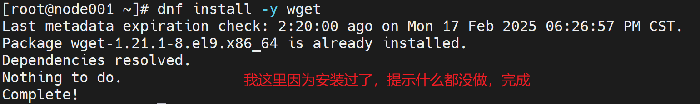

### 解压 containerd

解压软件包

```shell
mkdir cri-containerd-1.7.25

# -C是指定目录
tar -C ./cri-containerd-1.7.25 -zxf cri-containerd-1.7.25-linux-amd64.tar.gz
```

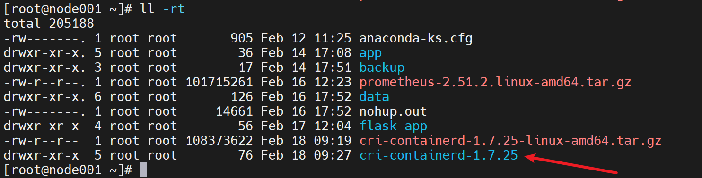

```shell
cd ./cri-containerd-1.7.25
ll -R

# etc目录主要是一些服务管理配置文件  config
# opt(Optional software，额外的软件)目录包含gce配置和cni网卡配置
# usr(Unix System Resources，Unix系统资源)目录包含containerd运行时文件，包含runc
```

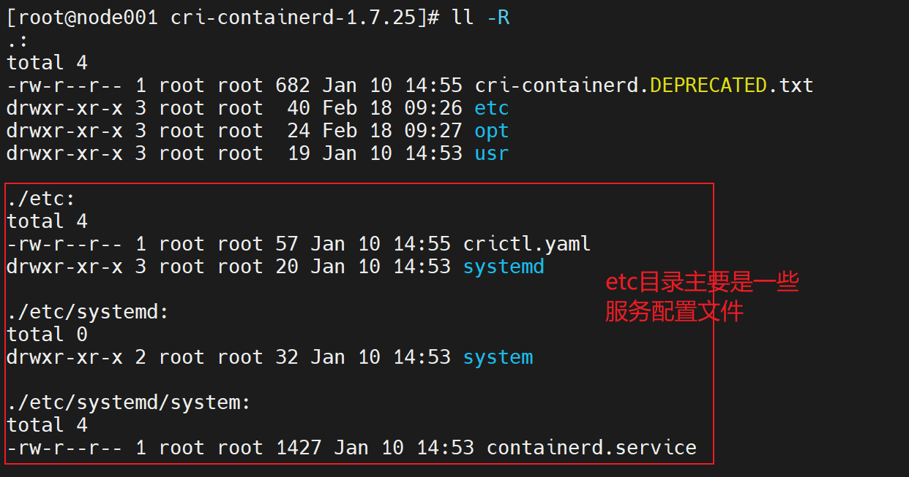

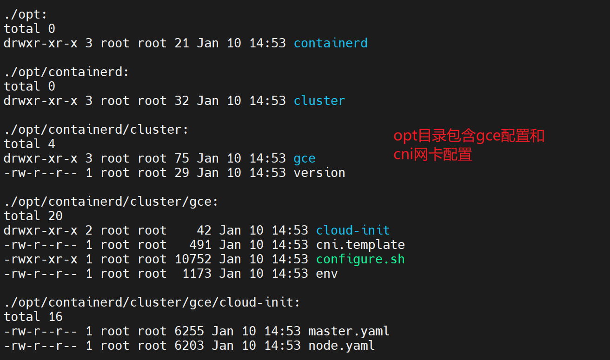

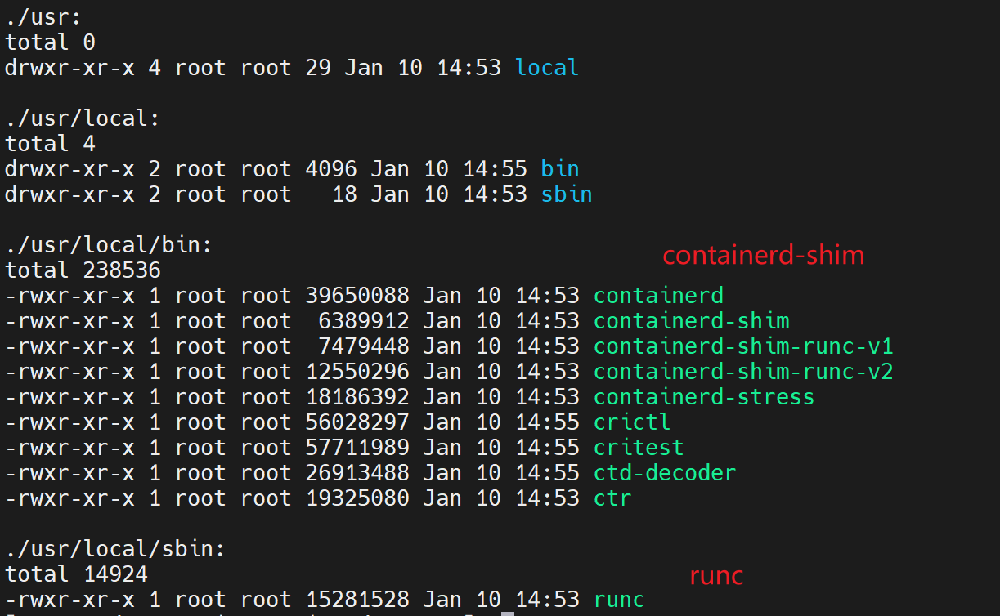

使用 tree 命令进行查看

```shell
dnf install -y tree
```

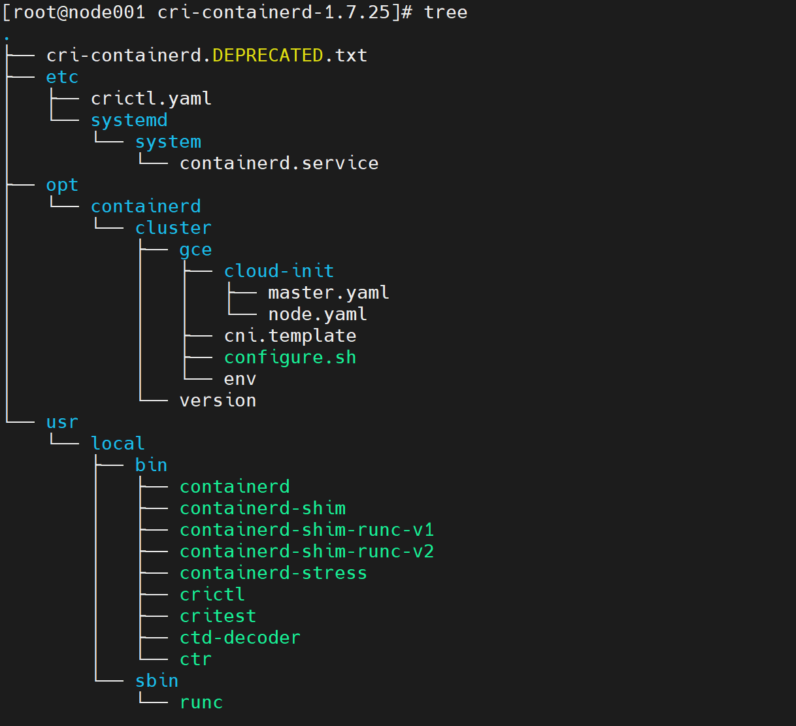

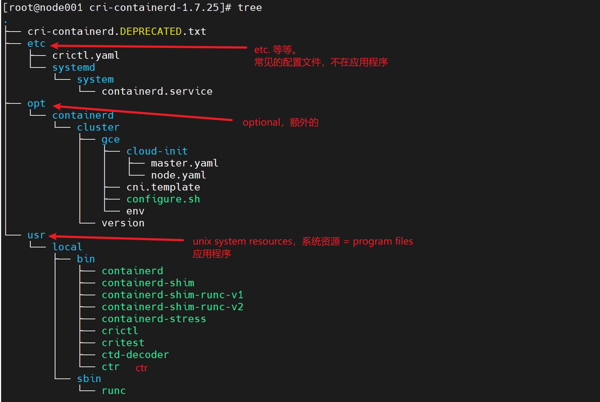

### 复制 containerd 运行时文件

```shell
# 查看宿主机/usr/local/bin目录，里面没有任何内容。
ls /usr/local/bin/
```

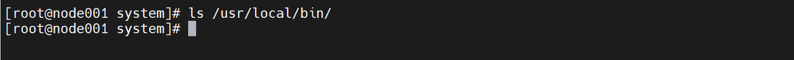

```shell
# 查看解压后usr/local/bin目录，里面包含containerd运行时文件
ls /root/cri-containerd-1.7.25/usr/local/bin
```

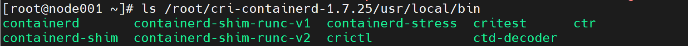

```shell
# 复制containerd文件至/usr/local/bin目录中，本次可仅复制containerd一个文件也可复制全部文件。
cp /root/cri-containerd-1.7.25/usr/local/bin/* /usr/local/bin/
ls /usr/local/bin/
```

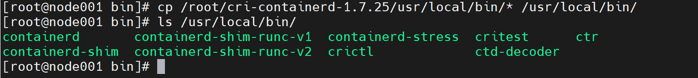

### 添加 containerd.service 文件至系统

查看 containerd.service 安装位置

```shell
# 查看containerd.service文件，了解containerd文件安装位置
cat /root/cri-containerd-1.7.25/etc/systemd/system/containerd.service
```

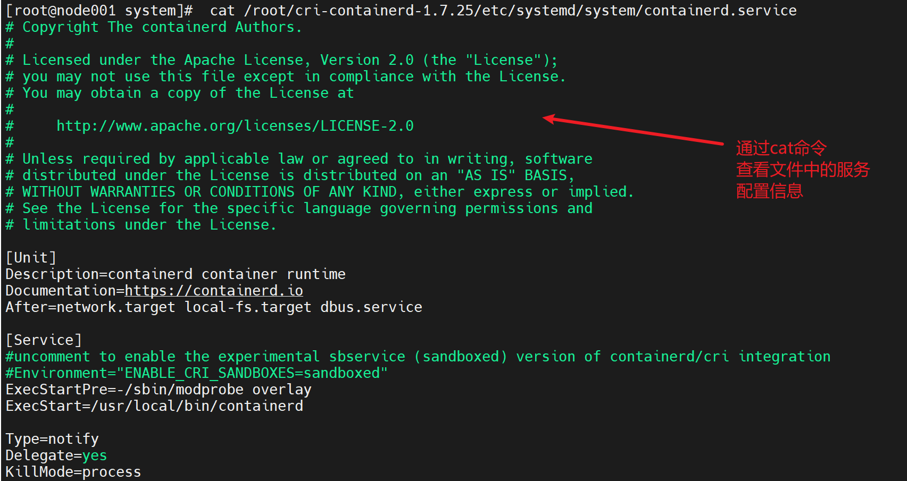

```shell
# 复制containerd服务管理配置文件至/usr/lib/systemd/system/目录中
cp /root/cri-containerd-1.7.25/etc/systemd/system/containerd.service /usr/lib/systemd/system/containerd.service

# 查看复制后结果
ls /usr/lib/systemd/system/containerd.service
```

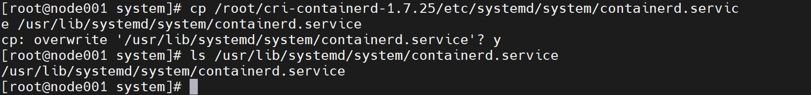

```shell
# 查看帮助
containerd --help
```

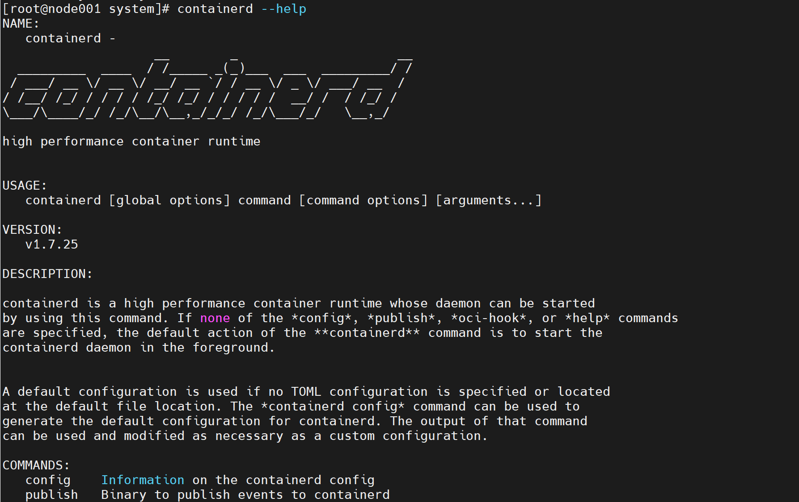

### 生成 containerd 模块配置文件

1 生成默认模块配置文件

Containerd 的默认配置文件为 /etc/containerd/config.toml，可以使用containerd config default > /etc/containerd/config.toml命令创建一份模块配置文件

```shell
# 创建配置文件目录
mkdir /etc/containerd

# 生成配置文件
containerd config default > /etc/containerd/config.toml

# 查看配置文件
cat /etc/containerd/config.toml
```

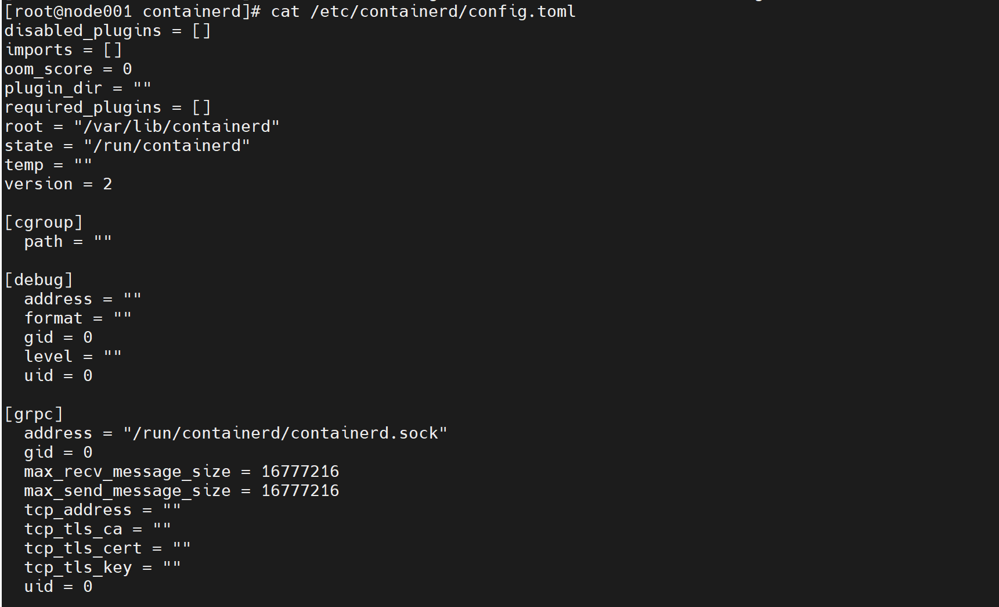

2 替换默认配置文件（可选）

但上述配置文件后期改动的地方较多，这里直接换成可单机使用也可k8s环境使用的配置文件并配置好镜像加速器。

```shell
vim /etc/containerd/config.toml

# 把下面的内容粘贴进去
root = "/var/lib/containerd"
state = "/run/containerd"
oom_score = -999

[grpc]
  address = "/run/containerd/containerd.sock"
  uid = 0
  gid = 0
  max_recv_message_size = 16777216
  max_send_message_size = 16777216

[debug]
  address = ""
  uid = 0
  gid = 0
  level = ""

[metrics]
  address = ""
  grpc_histogram = false

[cgroup]
  path = ""

[plugins]
  [plugins.cgroups]
    no_prometheus = false
  [plugins.cri]
    stream_server_address = "127.0.0.1"
    stream_server_port = "0"
    enable_selinux = false
    sandbox_image = "easzlab/pause-amd64:3.2"
    stats_collect_period = 10
    systemd_cgroup = false
    enable_tls_streaming = false
    max_container_log_line_size = 16384
    [plugins.cri.containerd]
      snapshotter = "overlayfs"
      no_pivot = false
      [plugins.cri.containerd.untrusted_workload_runtime]
        runtime_type = ""
        runtime_engine = ""
        runtime_root = ""
    [plugins.cri.cni]
      bin_dir = "/opt/kube/bin"
      conf_dir = "/etc/cni/net.d"
      conf_template = "/etc/cni/net.d/10-default.conf"
    [plugins.cri.x509_key_pair_streaming]
      tls_cert_file = ""
      tls_key_file = ""
  [plugins.diff-service]
    default = ["walking"]
  [plugins.linux]
    shim = "containerd-shim"
    runtime = "runc"
    runtime_root = ""
    no_shim = false
    shim_debug = false
  [plugins.opt]
    path = "/opt/containerd"
  [plugins.restart]
    interval = "10s"
  [plugins.scheduler]
    pause_threshold = 0.02
    deletion_threshold = 0
    mutation_threshold = 100
    schedule_delay = "0s"
    startup_delay = "100ms"
```

### 启动 containerd 服务

```shell
# 设置开机自启动
systemctl enable containerd

# 启动服务
systemctl start containerd

# 查看服务状态
systemctl status containerd
```

### 验证可用性

```shell
ctr version
```

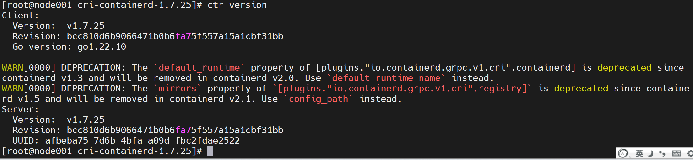

图上的信息，是提示有些属性，将会在后续版本中不建议使用并最终移除。

Deprecated是开发和运维中常遇到的一个词语，中文意思是 不赞成的，抵制的。 软件版本不断迭代优化，有些功能或语法将会在新版本中舍弃，为此，软件开发者会通知使用人员，用Deprecated标注的地方，表示：

1、这些语法或功能还能用；

2、但不建议再使用了；

3、在指定的后续版本中将会被removed，到时候软件如果报错，请提前适配。

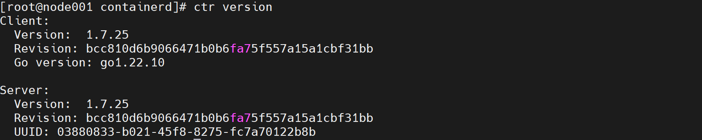

## 安装 runC

由于二进制包中提供的 runC 默认需要系统中安装 seccomp（Security Compute，安全计算）支持，若系统未安装则需要单独安装，且不同版本 runC 对 seccomp 版本要求 **不一致**，所以建议单独下载 runC 二进制包进行安装，其内置了对 seccomp 的支持。

### 获取 runC

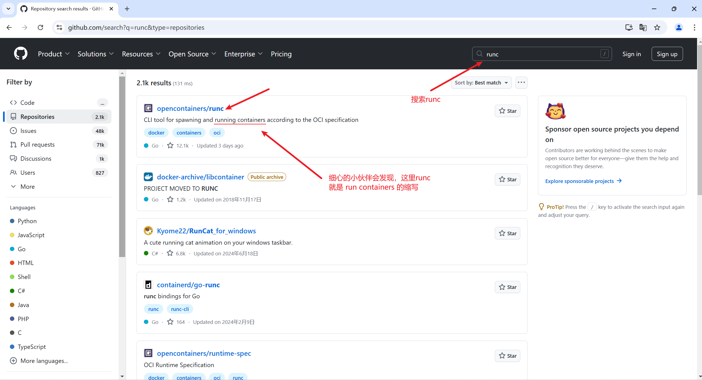

这里可以发现，runc，就是run containers的缩写，中文意思是，运行容器。对应上了我们之前在【前言】部分介绍的内容。

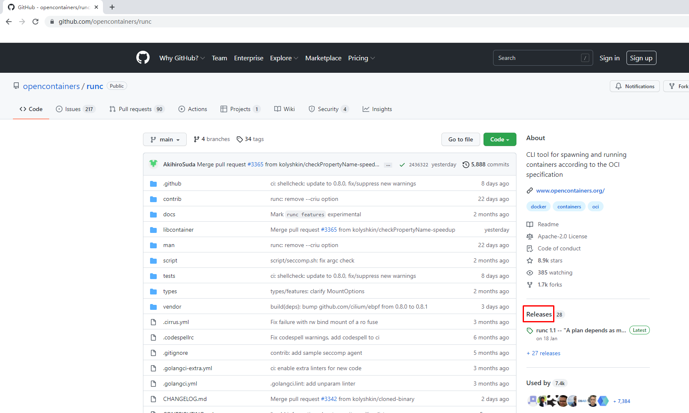

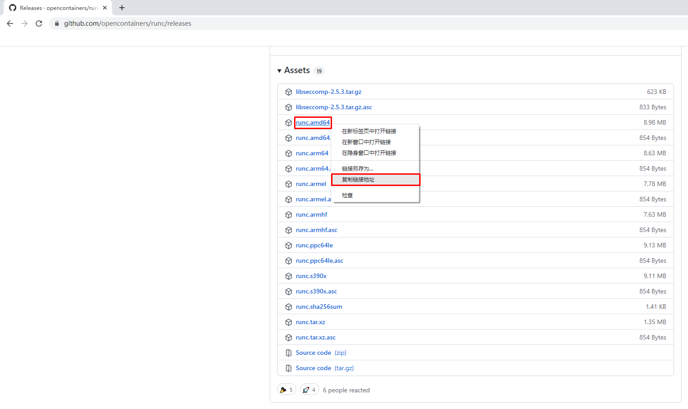

```shell
# 回到家目录
cd

# 使用wget下载
wget https://github.com/opencontainers/runc/releases/download/v1.2.5/runc.amd64
```

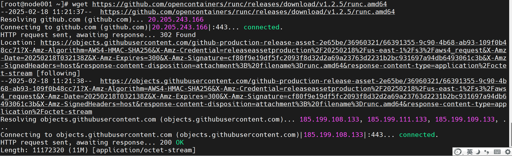

连不上的小伙伴，也可以在讲义资料里获取

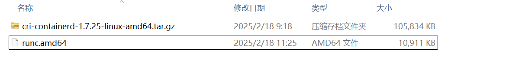

### 复制 runC

```shell
# 查看已下载文件 
ls run*
```

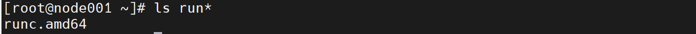

```shell
# 安装runC
mv runc.amd64 /usr/sbin/runc

# 为runC添加可执行权限
chmod +x /usr/sbin/runc

# 常见的两个权限配置
# -rw-r--r-- 644 
# drwxr-xr-x 755
```

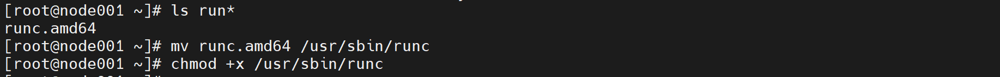

### 验证可用性

```shell
# 使用runc命令验证是否安装成功
runc -V
```

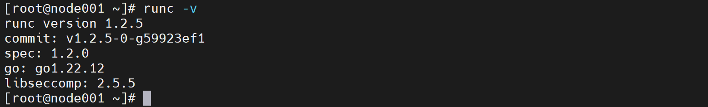

## 总结

1、从github上获取Containerd软件包的时候，流程是什么？

1、搜索相应软件；

2、点击\_\_\_\_\_\_模块；

3、找到指定的版本；

4、展开\_\_\_\_\_\_模块；

5、右键点击指定的版本，复制链接；

6、执行\_\_\_\_\_\_命令，下载链接文件；

2、containerd包含三个目录，分别是\_\_\_\_\_\_、******、******;

3、对于像ctr这种新的命令，如何查看帮助手册？ 执行 ctr --\_\_\_\_\_\_


> 更新: 2026-01-14 09:22:11  
> 原文: <https://www.yuque.com/u41736172/az9urv/gv1lbpntoipzd0cg>