# 02.Kubernetes集群安装部署实战

# 一、【了解】应用部署方式演变

## 传统应用部署方式

传统企业早期采用<font style="color:rgb(216,57,49);">物理机</font>部署业务系统，面临硬件成本高、部署周期长的问题。

优点：简单；

缺点：不能为应用程序定义资源使用边界，程序之间容易互相影响；

## 虚拟化部署方式

可以在一台物理机上运行多个虚拟机，每个虚拟机都是独立的一个环境。

优点：程序环境不会相互产生影响，提供了一定程度的安全性

缺点：增加了操作系统，浪费了部分资源

## 容器化部署方式

与虚拟化类似，但是共享了操作系统。

优点：

* 可以保证每个容器拥有自己的<font style="color:rgb(216,57,49);">文件系统、CPU、内存、进程空间</font>等
* 运行应用程序所需要的资源都被容器包装，并和底层基础架构解耦
* 容器化的应用程序可以跨云服务商、跨 Linux 操作系统发行版进行部署

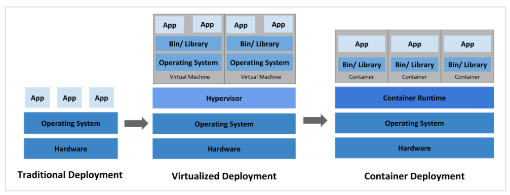

容器化部署方式给带来很多的便利，但是也会出现一些问题，比如说：

* 一个容器故障停机了，怎么样让另外一个容器立刻启动去替补停机的容器
* 当并发访问量变大的时候，怎么横向扩展容器数量

这些容器管理的问题统称为**容器编排**问题，为了解决这些容器编排问题，就产生了一些容器编排的软件：

* **Swarm**：Docker 自己的容器编排工具
* **Mesos**：Apache 的一个资源统一管控的工具，需要和 Marathon 结合使用
* **Kubernetes**：Google 开源的的容器编排工具

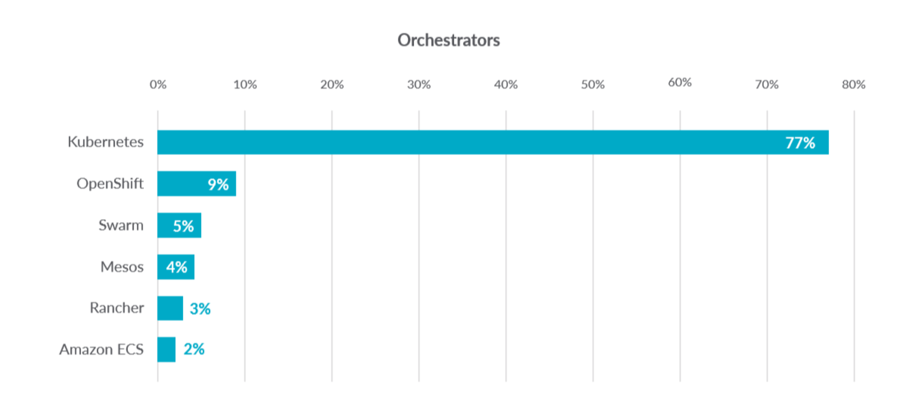

## 总结

1、回顾软件应用程序部署方式的演变，可以发现容器化发展的必然性；

2、学习和掌握 Kubernetes，有助于适应当前容器市场的技术发展；

# 二、【了解】认识 Kubernetes

## 什么是 Kubernetes


希腊语：舵手、飞行员

官方网址 [https://kubernetes.io/](about:blank)

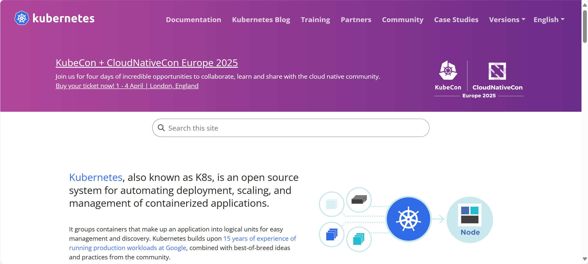

中文社区 [http://docs.kubernetes.org.cn/](about:blank)

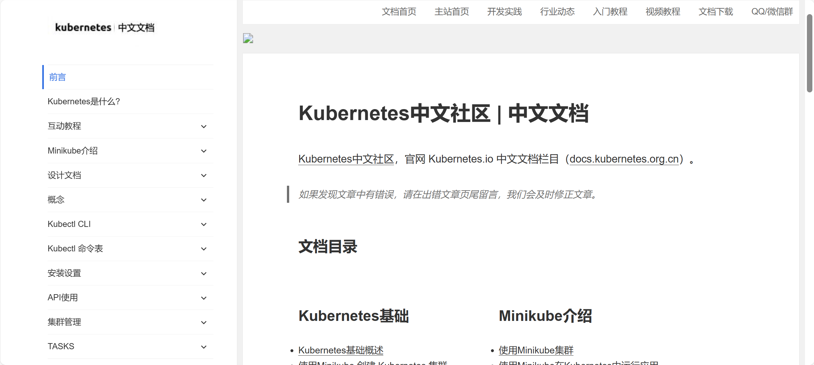

## Kubernetes 优势

Kubernetes 的本质是**一组服务器集群**，它可以在集群的每个节点（node）上运行特定的程序，来对节点中的容器进行管理。从而实现自动化。主要提供了如下的主要功能：

* **自我修复**：一旦某一个容器崩溃，能够在 1 秒钟左右迅速启动新的容器；
* **弹性伸缩**：可以根据需要，自动对集群中正在运行的容器数量进行调整；
* **服务发现**：服务可以通过自动发现的形式找到它所依赖的服务；
* **负载均衡**：如果一个服务起动了多个容器，能够自动实现请求的负载均衡；
* **版本回退**：如果发现新发布的程序版本有问题，可以立即回退到原来的版本；
* **存储编排**：可以根据容器自身的需求自动创建存储卷；

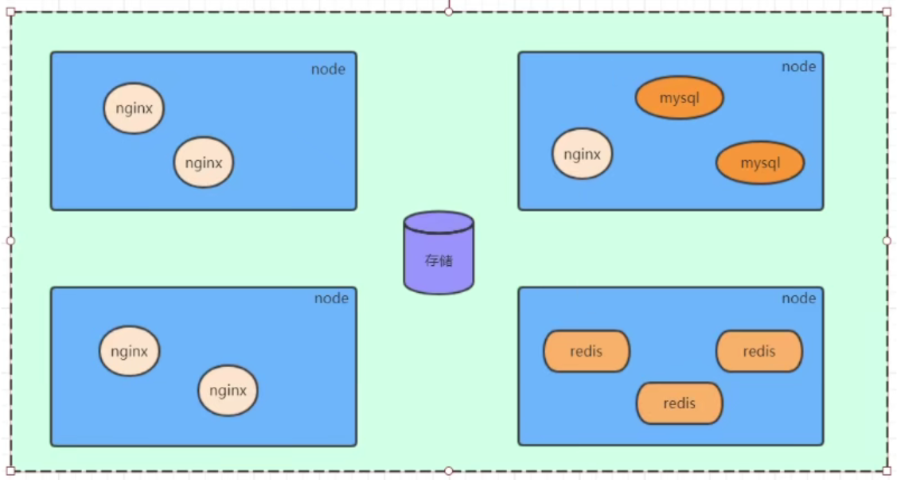

小结

1、Kubernetes 能够实现自我\_\_\_\_、弹性\_\_\_\_、负载\_\_\_\_、版本\_\_\_\_;

## Kubernetes 架构

kubernetes 是具有中心节点的架构，也就是说有 master 管理节点。

一个 kubernetes 集群主要是由\*\*控制节点(master)、工作节点(work node)\*\*组成。

每个节点上都会安装不同的组件。

### 节点组件介绍

| **节点类型** | **组件** | **说明** |
| :---: | :---: | --- |
| Master | API Server | **API 服务**作为集群的统一入口，处理 API 请求，提供认证、授权、API 注册和发现等机制； |
| | Controller Manager | **控制器管理者**负责维护集群的状态，比如程序部署安排、故障检测、自动扩展、滚动更新等； |
| | Scheduler | 负责集群资源**调度**，按照预定的调度策略将 Pod 调度到相应的 node 节点上； |
| | etcd | 负责存储集群中各种**资源对象**的信息。<br/>+ 数据存储作用：存储集群的关键配置和状态信息。<br/>+ 原理：分布式键值存储的工作机制。 |
| Worker | kubelet | **管理功能**：负责维护容器的生命周期，即通过控制 docker，来创建、更新、销毁容器； |
| | kube-proxy | **代理功能**：负责提供集群内部的服务发现和负载均衡； |
| | Container Runtime | 运行容器的底层引擎，如 Docker、Containerd（K8s >= 1.24）。 |

### 组件间调用关系

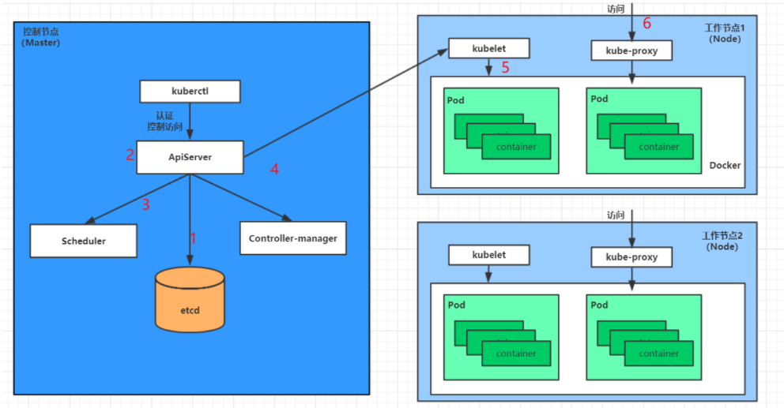

下面，以部署一个 nginx 服务来说明 kubernetes 系统各个组件调用关系：

1. kubernetes 集群启动之后，master 和 node 都会将自身的信息存储到 etcd 数据库中；

2. 一个 Nginx 服务的【安装】请求，会首先被发送到 master 节点的 apiServer 组件；

3. apiServer 组件会调用 scheduler 组件来决定到底将服务安装到哪个 node 节点上；

4. apiServer 调用 controller-manager 去调度 Node 节点安装 nginx 服务

5. kubelet 接收到指令后，会通知 docker，然后由 docker 来启动一个 nginx 的 pod（pod 是 kubernetes 的最小操作单元，容器必须跑在 pod 中）

至此，一个 nginx 服务就运行了。

6. 如果需要外部来访问 Nginx，就需要通过 kube-proxy 来对 pod 产生访问的代理。这样，外界用户就可以访问集群中的 nginx 服务了。

### Add-ons（附件）介绍

除了上面介绍的，Kubernetes 集群中还有各类附加组件（Add - ons）。

这些附加组件并非集群运行的必需部分，没有它们，并不影响实际使用，但是其可以与主体程序很好的结合使用。

Add-ons(附件)举例

* coredns/kube-dns：负责为整个集群提供 DNS 服务；
* Ingress Controller：为服务提供集群外部访问 www.baidu.com => Pod => 容器；
* Heapster/Metries-server：提供集群资源监控（监控容器可以使用 Prometheus）；
* Dashboard：可视化管理：通过 Web 界面管理集群；
* Federation：提供跨可用区的集群；
* Fluentd-elasticsearch：提供集群日志采集、存储与查询；
* Prometheus 和 Grafana：Prometheus 是一个开源的系统监控和警报工具包；Grafana 是一个开源的可视化工具，它可以与 Prometheus 集成；
* Elasticsearch、Logstash 和 Kibana（ELK Stack）：Elasticsearch 用于存储大量的日志和监控数据；Logstash 可以收集各个 Pod 的日志和监控数据；Kibana 是一个可视化工具，用于在 Elasticsearch中查询和展示数据；

总结：

1、Kubernetes 由\_\_\_\_节点组件和\_\_\_\_节点组件组成；

2、kubelet 是属于\_\_\_\_节点上的组件；

3、Add-ons 属于\_\_\_\_组件，没有它们，并不\_\_\_\_\_\_；

## 集群部署方式

### 常见部署方式概述

目前部署 Kubernetes 集群方式主要有三种形式。

### Minikube

单机简化安装（主要用于简单的测试）；

### Kubeadm && Kubeasz（重点）

Kubeadm 是 Kubernetes 官方提供的用于快速搭建 Kubernetes 集群的工具，提供 kubeadm init 和 kubeadm join，用于快速部署Kubernetes 集群。

官方地址：[https://kubernetes.io/docs/reference/setup-tools/kubeadm/kubeadm/](about:blank)

Kubeasz 是一个基于 Ansible 开发的开源工具集，用于在国内复杂网络环境下高效部署和管理 Kubernetes 集群，尤其适合生产环境。支持<font style="color:rgb(216,57,49);">多主集群</font> 。

官方地址：[https://github.com/easzlab/kubeasz](about:blank)

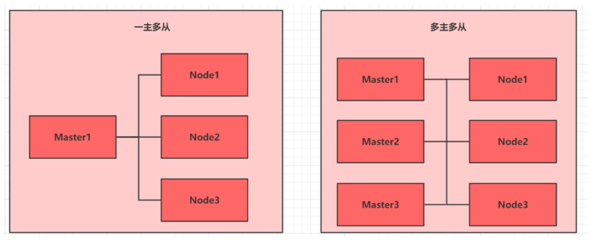

### 二进制包

从 github 下载发行版的二进制包，手动部署每个组件，组成 Kubernetes 集群。

### 各部署方式优缺点对比

Kubeadm 降低部署门槛，但屏蔽了很多细节，遇到问题很难排查。

二进制包部署相对比较麻烦，但更容易可控，感兴趣的同学可以参考网上的相关文档。

### 总结

1、\_\_\_\_\_\_和\_\_\_\_\_\_是常用的集群部署工具；前者由官方进行维护；后者在国内访问方便；

# 三、【实践】kubeadm 部署 Kubernetes 集群

## 准备环境

### 硬件资源规划

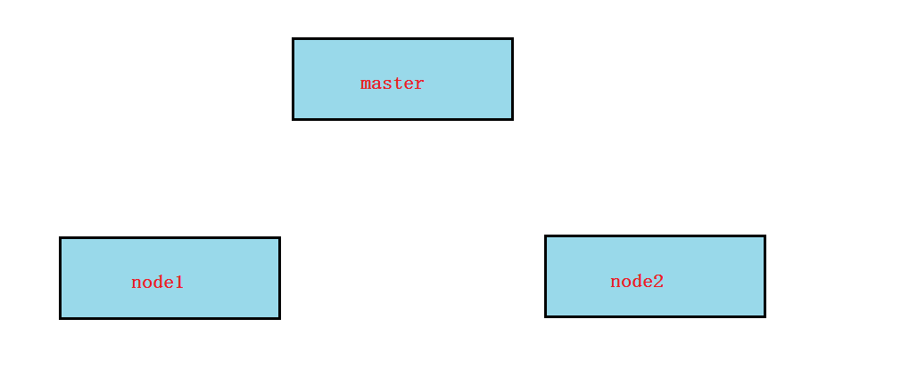

三台 2 核 + 2G 内存的 CentOS Stream 9，单网卡（最小环境）

| 编号 | IP | 角色 |
| --- | :--- | :--- |
| 1 | 192.168.126.135 | master（单管理节点) |
| 2 | 192.168.126.136 | node1 |
| 3 | 192.168.126.137 | node2 |

### 软件资源规划

1 克隆三台最小化安装的机器，并且修改 MAC 地址、CPU 改为 2 核、内存改为 2G，名称分别是：master、node1、node2

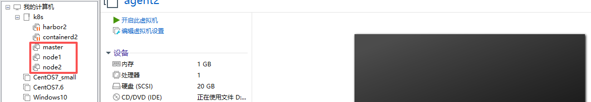

2 修改三台机器的 IP 地址、主机名

```shell
# vim /etc/NetworkManager/system-connections/ens33.nmconnection
address1=192.168.126.135/24

# hostnamectl set-hostname master
# su

其他两台机器也分别改 ip 地址和主机名！
# hostnamectl set-hostname node1
# su

# hostnamectl set-hostname node2
# su
```

3 修改三台服务器的 hosts 文件，都改为如下内容：

```shell
# vim /etc/hosts
127.0.0.1   localhost localhost.localdomain localhost4 localhost4.localdomain4
::1         localhost localhost.localdomain localhost6 localhost6.localdomain6
192.168.126.135 master
192.168.126.136 node1
192.168.126.137 node2
```

4 三台服务器都关闭 selinux，关闭 firewalld，安装 iptables 服务，并保存为空规则

```shell
# SELinux 已关闭
# firewalld 已关闭

# 安装 iptables 和 iptables-services，清空 iptables 规则并保存
dnf install iptables iptables-services -y
iptables -F
iptables -X
iptables -Z
iptables -P INPUT ACCEPT 
iptables -P FORWARD ACCEPT 
iptables -P OUTPUT ACCEPT

# 保存规则
service iptables save

# 所有节点时间同步（已同步）

# 加载 br_netfilter 和 overlay 内核模块
modprobe br_netfilter
modprobe overlay
cat <<EOF | tee /etc/sysctl.d/k8s.conf > /dev/null
net.bridge.bridge-nf-call-iptables  = 1
net.bridge.bridge-nf-call-ip6tables = 1
net.ipv4.ip_forward                 = 1
EOF
echo "br_netfilter" | tee /etc/modules-load.d/k8s.conf

# 生效命令
sysctl --system

# 关闭交换区（因为初始化master节点的时候要求禁用交换分区，并且关闭交换分区后重启才会生效）
sed -i 's/.*swap.*/#&/g' /etc/fstab

# 重启
reboot
```

5 在三台服务器中准备 yum 源

```shell
# 安装 wget vim net-tools telnet epel-release
dnf install -y wget vim net-tools telnet epel-release tree

# 如果不是阿里源，再执行以下命令，从阿里云下载 Docker DNF 源配置文件到系统指定目录
# ce 表示 Community Edition，社区版
wget -O /etc/yum.repos.d/docker-ce.repo https://mirrors.aliyun.com/docker-ce/linux/centos/docker-ce.repo

# 添加 k8s 源
cat << EOF > /etc/yum.repos.d/kubernetes.repo
[kubernetes-tencent]
name=Kubernetes Tencent Mirror
baseurl=https://mirrors.cloud.tencent.com/kubernetes_new/core:/stable:/v1.30/rpm/
enabled=1
gpgcheck=0

[kubernetes-aliyun]
name=Kubernetes Aliyun Mirror
baseurl=https://mirrors.aliyun.com/kubernetes/yum/repos/kubernetes-el7-x86_64/
enabled=1
gpgcheck=0
repo_gpgcheck=0
gpgkey=https://mirrors.aliyun.com/kubernetes/yum/doc/yum-key.gpg https://mirrors.aliyun.com/kubernetes/yum/doc/rpm-package-key.gpg
EOF
```

## 安装软件

### 安装 Containerd

在**三台服务器**中都执行以下操作

1 安装 Containerd

```shell
# 从阿里源拉取 containerd.io
dnf -y install containerd.io-1.7.25-3.1.el9
# 或
dnf -y install containerd-1.7.25-3.1.el9
```

> Kubernetes 底层使用 Containerd 作为容器运行时。

2 配置 Containerd

```shell
# 生成配置文件
containerd config default > /etc/containerd/config.toml

# 修改 SystemdCgroup 参数为 true，表示 containerd 使用 systemd 作为 cgroup 驱动程序。
sed -ri 's#SystemdCgroup = false#SystemdCgroup = true#' /etc/containerd/config.toml

# 修改sandbox沙箱镜像，registry.k8s.io 在某些网络环境下可能访问不稳定或受到限制，
# 而阿里云的镜像仓库 registry.aliyuncs.com 在国内网络环境下通常具有更好的访问速度和稳定性。
sed -ri 's#registry.k8s.io\/pause:3.8#registry.aliyuncs.com\/google_containers\/pause:3.9#' /etc/containerd/config.toml


# 新增镜像源
sed -i 's/config_path = ""/config_path = "\/etc\/containerd\/certs.d\/"/g' /etc/containerd/config.toml
```

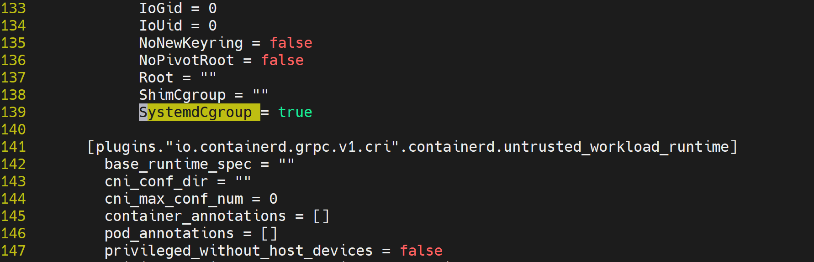

3 关联 containerd 镜像源目录

```shell
mkdir -p /etc/containerd/certs.d/docker.io
cat > /etc/containerd/certs.d/docker.io/hosts.toml << 'EOF'
server = "https://docker.io" # 源镜像地址

[host."https://docker.1ms.run"] # 毫秒-镜像加速地址
  capabilities = ["pull","resolve"]

[host."https://docker.m.daocloud.io"] # 道客-镜像加速地址
  capabilities = ["pull","resolve"]

[host."https://dockerproxy.com"] # 镜像加速地址
  capabilities = ["pull", "resolve"]

[host."https://docker.mirrors.sjtug.sjtu.edu.cn"] # 上海交大-镜像加速地址
  capabilities = ["pull","resolve"]

[host."https://docker.mirrors.ustc.edu.cn"] # 中科大-镜像加速地址
  capabilities = ["pull","resolve"]

[host."https://docker.nju.edu.cn"] # 南京大学-镜像加速地址
  capabilities = ["pull","resolve"]

[host."https://registry.docker-cn.com"]
  capabilities = ["pull","resolve","push"]

[host."https://cf-workers-docker-io-38g.pages.dev"]
  capabilities = ["pull","resolve","push"]
EOF

# 重启生效
systemctl enable containerd
systemctl restart containerd

# 验证测试
systemctl status containerd
```

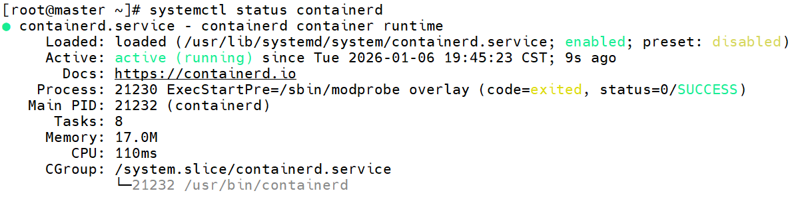

4 补充一下 Docker 镜像源（这一步可以不用做，我们 Kubernetes 底层用的是 Containerd）

```shell
# 修改docker源
mkdir -p /etc/docker
cat << EOF > /etc/docker/daemon.json
{
  "exec-opts": ["native.cgroupdriver=systemd"],
  "registry-mirrors": [
      "https://docker.1ms.run",
      "https://cf-workers-docker-io-38g.pages.dev",
      "https://registry.docker-cn.com",
      "https://docker.m.daocloud.io",
      "https://dockerproxy.com",
      "https://docker.mirrors.ustc.edu.cn",
      "https://docker.nju.edu.cn"
  ]
}

EOF

# 重启生效
systemctl daemon-reload
```

### 安装 kubeadm、kubelet、kubectl

\*\*所有节点执行以下操作，\*\*安装 kubeadm、kubectl 和 kubelet（这里所有节点指的是三台服务器）

```shell
# 所有节点，安装 kubeadm、kubectl 和 kubelet
dnf install -y kubelet kubeadm kubectl

dnf list installed | grep -E 'kubeadm|kubectl|kubelet'

# 启动并设置 kubelet 开机自启
# 注意: 不是start启动，因为最后要在master节点上统一初始化，一旦启动，端口占用，就起不来了
systemctl enable kubelet
```

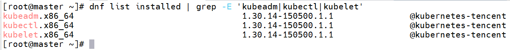

> 注意我们安装的 kubeadm、kubectl、kubelet 的版本，其实可以看出来，我们安装的 Kubernetes 是 1.30 版本的。
>
> 上面我们安装的 Containerd 是 1.7.25 版本的。
>
> 大家不要随意变换版本，Kubernetes 和 Containerd 的版本需要匹配起来！！！

在后续初始化之前，记得打一个【快照】。

## 初始化 master 节点

**1 在 master 节点上操作(其它节点不操作)**

```shell
kubeadm init \
  --apiserver-advertise-address=192.168.126.135 \  # 这里的地址，改成自己master节点的IP地址
  --image-repository registry.aliyuncs.com/google_containers \
  --pod-network-cidr=10.244.0.0/16 \  # 这里就这么写，是对应上后面flannel网络插件的默认值
  --control-plane-endpoint=master  # 这里的主机名，就是master节点的主机名
```

**<font style="background-color:#FBDE28;">或者写成一行（我们用这种去执行）</font>**

```shell
kubeadm init --apiserver-advertise-address=192.168.126.135 --image-repository registry.aliyuncs.com/google_containers --pod-network-cidr=10.244.0.0/16 --control-plane-endpoint=master
```

如果执行成功，会产生如下日志：

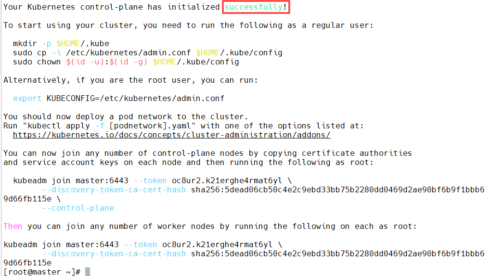

```shell
# 重点注意: 请将最后这个命令保存下来，后面node节点加入集群需要使用。每个人的token不一样，不要复制笔记的。
kubeadm join master:6443 --token oc8ur2.k21erghe4rmat6yl \	# 这里每个人都不一样，不要复制笔记的
        --discovery-token-ca-cert-hash sha256:5dead06cb50c4e2c9ebd33bb75b2280dd0469d2ae90bf6b9f1bbb69d66fb115e
```

如果你忘了复制，也没关系，执行以下命令，重新生成一个（本次我们已经复制了，就不需要执行下面的命令了！）

```shell
[root@master ~]# kubeadm token create --print-join-command
```

如果初始化 init 不成功，解决方法：（也就是前面的初始化 master 节点不成功）

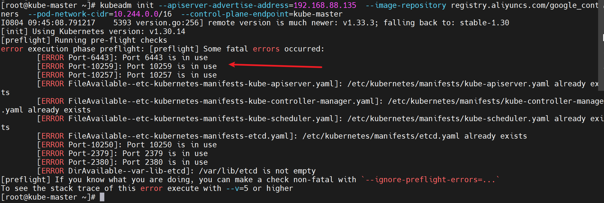

解决办法：

```shell
# 在 master 节点上，解决配置或环境问题后，重置一下环境，然后再重新初始化master节点
[root@master ~]# kubeadm reset 
```

**2 按照指导内容，在 master 节点上，继续执行命令**

```shell
[root@master ~]# mkdir -p $HOME/.kube
[root@master ~]# sudo cp -i /etc/kubernetes/admin.conf $HOME/.kube/config
[root@master ~]# sudo chown $(id -u):$(id -g) $HOME/.kube/config
```

**3 验证 master 节点**

```shell
# 在master节点上，执行操作
[root@master ~]# kubectl get node
```

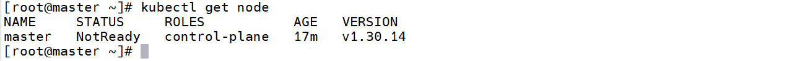

> 上面的状态是 NotReady 是因为我们还没有安装网络插件。

## 安装 flannel 网络插件

**在 master 节点上操作**，将 pod 网络部署到集群

```shell
# 方法一：用给大家提供的离线文件
kubectl apply -f kube-flannel-kubeadm-cn.yml

# 方法二：使用 apply 命令，会创建相应的 namespace 和 pod
kubectl apply -f https://github.com/flannel-io/flannel/releases/latest/download/kube-flannel.yml

# 方法三：如果 apply 一直提示拉取不下来，可以换成先拉取，再 apply（我用的这种方式）
wget https://github.com/flannel-io/flannel/releases/latest/download/kube-flannel.yml
kubectl apply -f kube-flannel.yml
```

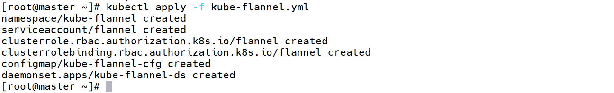

验证 flannel 的 pod 是否起来

```shell
kubectl get pod -A	# -A 表示 All
```

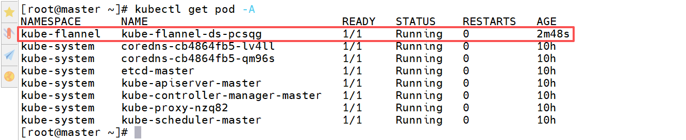

> 集群有几个节点，就会生成几个 flannel 容器。<font style="color:rgb(216,57,49);">如果有的同学显示的只有一个，这是正常的，因为目前只有 master 节点</font>。
>
> 有的同学可能在 Flannel 容器的 STATUS 状态那里显示的是 Init:ErrImagePull，表示 Flannel 需要的镜像没有拉取下来！解决办法：第一种方式：将 kube-flannel.yml 中的 image 镜像地址换成国内的地址！！！参考资料中的 kube-flannel-kubeadm-cn.yml 文件！
>
> 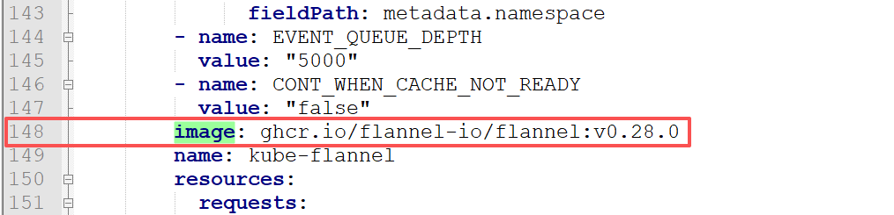
>
> 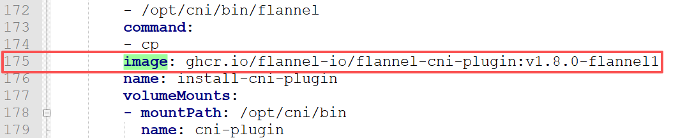
>
> 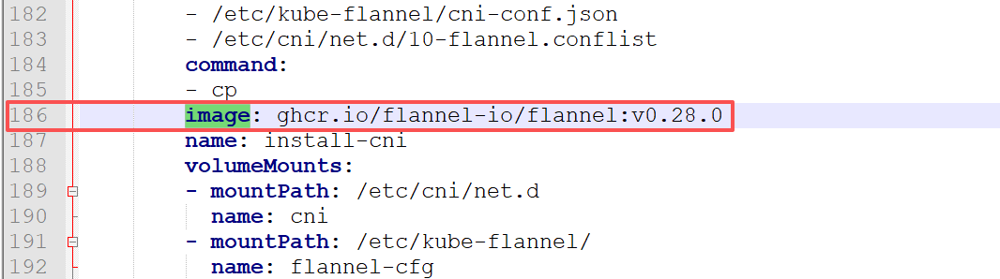
>
> 第二种方式：开启科学上网！

## 加入 node 节点

> 注意：
>
> **先加入 node 节点，还是先安装 flannel 网络插件，这个顺序不影响；**
>
> 因为如果不安装网络插件的话，加入 node 节点，会显示未就绪(Not Ready)；
>
> 所以只要保证两个都执行即可。

**在**\*\*<font style="color:rgb(216,57,49);">两个 node 节点</font>\*\***上**，都分别执行

```shell
# 重置一下，再加入
kubeadm reset

# 加入
kubeadm join master:6443 --token oc8ur2.k21erghe4rmat6yl \	# 这里每个人都不一样，不要复制笔记的
        --discovery-token-ca-cert-hash sha256:5dead06cb50c4e2c9ebd33bb75b2280dd0469d2ae90bf6b9f1bbb69d66fb115e

# 大家换成一行去执行
kubeadm join master:6443 --token oc8ur2.k21erghe4rmat6yl --discovery-token-ca-cert-hash sha256:5dead06cb50c4e2c9ebd33bb75b2280dd0469d2ae90bf6b9f1bbb69d66fb115e
```

> 上面的命令其实就是我们之前初始化完 master 节点后，在最后生成的命令！！！
>
> 命令的意思就是让两个 node 节点加入到 master 节点中，组成一个集群。

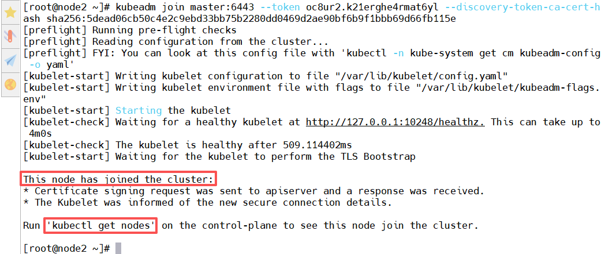

```shell
# 假如，你忘记了加入的命令，在 master 上面执行
kubeadm token create --print-join-command
# 重新生成一下
```

## 验证集群

```shell
# 在 master 节点上，执行操作，验证节点状态
kubectl get node

kubectl get pod -A
```

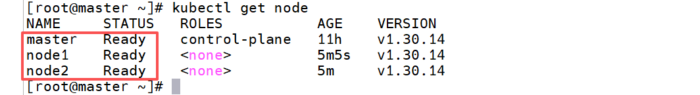

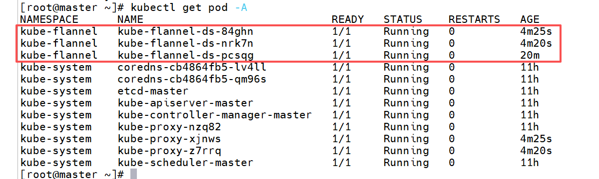

> 如果上图中，某个 pod 比如某个 flannel 的状态不是 Running，那么我们该怎么调错呢？输入以下命令进行调错：
>
> `kubectl describe pod -n kube-flannel kube-flannel-ds-84ghn`可以查看到关于该 pod 的详细信息
>
> 命令解释：`kubectl describe pod -n 命名空间 pod名称`
>
> 具体解决上面 kube-flannel 的状态不是 Running 的做法：
>
> 1 根据之前创建 flannel 的配置文件，将之前创建的内容都给删除
>
> `kubectl delete -f kube-flannel.yml`
>
> 2 删除后再次查看 pod 的情况
>
> `kubectl get pod -A`
>
> 3 如果还有状态不是 Running 的 kube-flannel 的 pod，那就需要强制的、一个个的、删除这几个 pod 了
>
> `kubectl delete pod -n kube-flannel pod的名称 --force`
>
> 4 删除完之后，没有 kube-flannel 的 pod 后，我们再次执行之前的安装 flannel 网络插件的命令即可
>
> `kubectl apply -f kube-flannel.yml`
>
> 5 执行完后，然后再次验证集群
>
> 往往上面的 Flannel 的 pod 状态不对，就是因为相关的镜像拉取不下来。大家把镜像加速的地址给配置正确了，然后挑一个网速好的时间段应该是可以正常拉取的。（或者开启一个科学上网工具；其实也可以将 kube-flannel.yml 中涉及到 3 个 image 镜像的地址都添加成国内的地址，然后删除旧内容，重新 applay 也可以。）

# 四、常见错误汇总

## 加入 node 节点报错

```shell
# 解决办法：先重置一下kubeadm，再次join
kubeadm reset

# 在 master 或 node 节点上执行这个操作，相当于把对应节点之前的 kubeadm init 或 kubeadm join 操作移除
```

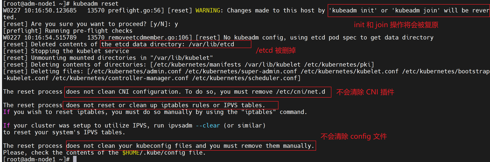

对应的节点将会恢复成未就绪

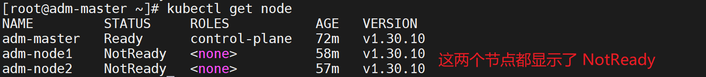

## 服务未开机自启

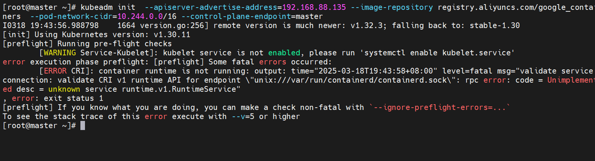

1、【WARNING部分的提示】需要在每个机器上，执行 systemctl enable kubelet。

2、【ERROR】提示的containerd报错，需要从新配置一下 containerd。找到讲义的 containerd 安装部分，进行【配置containerd】、【关联镜像源目录】、【服务重启】；

## Swap 交换分区报错

```shell
journalctl -u kubelet
```

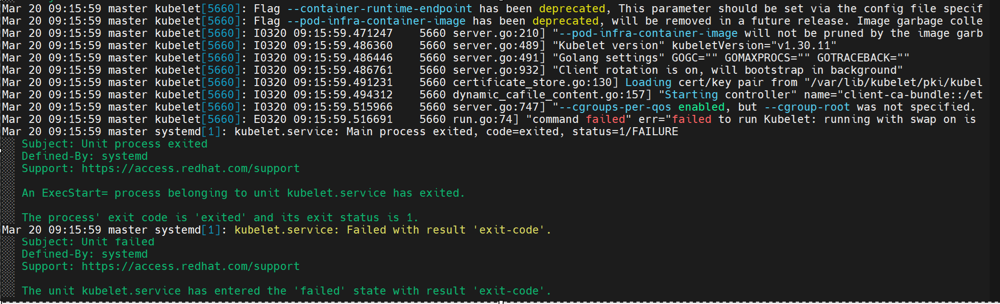

需要关闭后，reboot 机器。大部分同学报错，是因为没有 reboot 重启。

## 初始化失败，再次初始化，报错

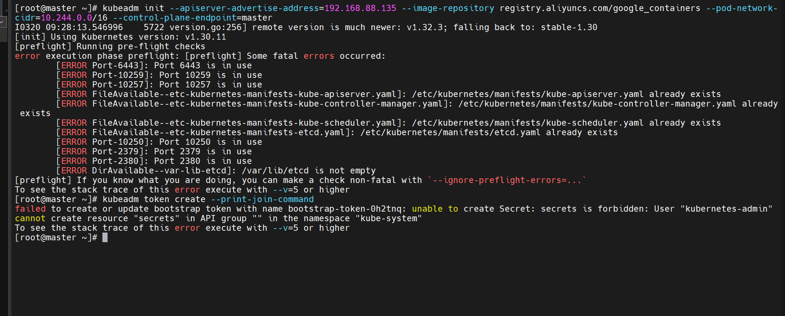

```shell
# 执行以下
kubeadm reset

# 完成之后，重新 init
```

## kubeadm init 找不到

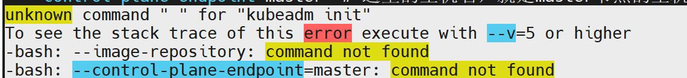

```shell
# 合并成一行
kubeadm init --apiserver-advertise-address=192.168.126.135 --image-repository registry.aliyuncs.com/google_containers --pod-network-cidr=10.244.0.0/16 --control-plane-endpoint=master  # 写成自己的完整主机名
```

## hostname 查看，不对

使用 hostname 命令查看主机名，发现是 master.lhp.cn，不是 master

修改主机名为 master。

## 提示 8080 端口不通

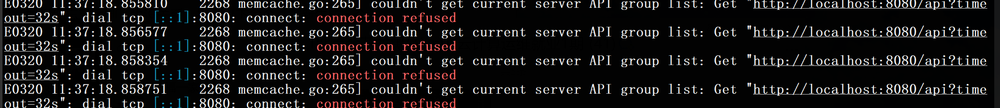

是没有创建配置文件导致的，认证不通过。执行以下命令：

```shell
[root@master ~] mkdir -p $HOME/.kube
[root@master ~] sudo cp -i /etc/kubernetes/admin.conf $HOME/.kube/config
[root@master ~] sudo chown $(id -u):$(id -g) $HOME/.kube/config
```

## Pod 启动崩溃

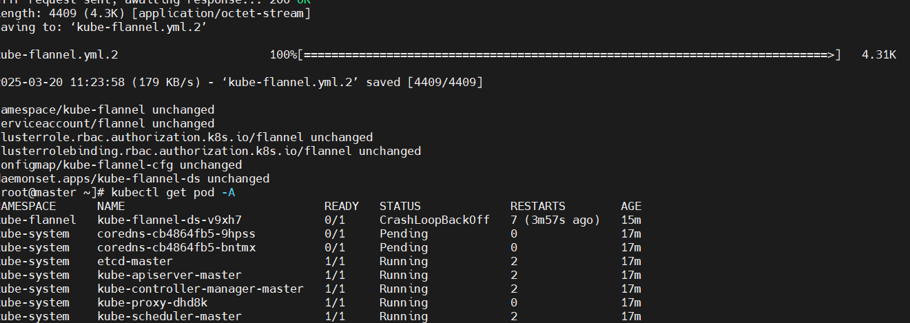

```shell
# 执行以下命令，删掉
kubectl delete -f kube-flanel.yml

# 再重新 apply 一下
kubectl apply -f kube-flannel.yml
```

## init / join 等待了很久，还没成功

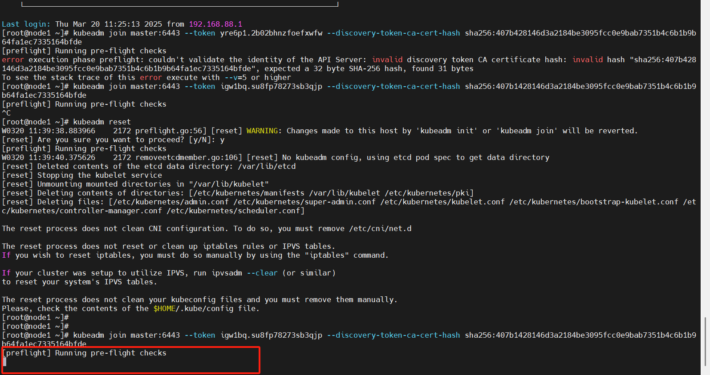

请检查 /etc/hosts，要保证域名解析存在

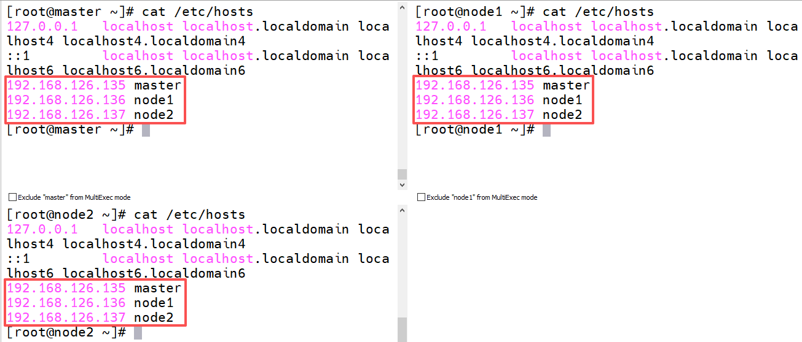

或者防火墙没关。

## 国外镜像拉不下来，容器启动失败

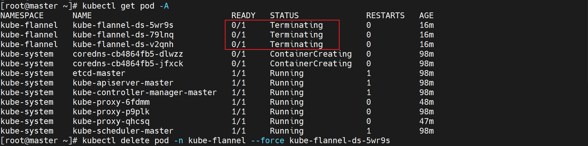

```shell
【解决办法】
# 1、首先，删除 flannel 资源, kubectl delete -f 文件名
kubectl  delete -f kube-flannel-kubeadm-cn.yml

# 2、其次，强制删除剩下的终止中的三个容器
kubectl delete pod -n kube-flannel kube-flannel-ds-5wr9s --force
kubectl delete pod -n kube-flannel kube-flannel-ds-79lnq --force
kubectl delete pod -n kube-flannel kube-flannel-ds-v2qnh --force

# 3、重新 apply，再次验证
kubectl apply -f kube-flannel-kubeadm-cn.yml
```

# 五、扩展

## 【扩展】三种源

巩固一下，我们在最近课程学习中，所遇到的三个源

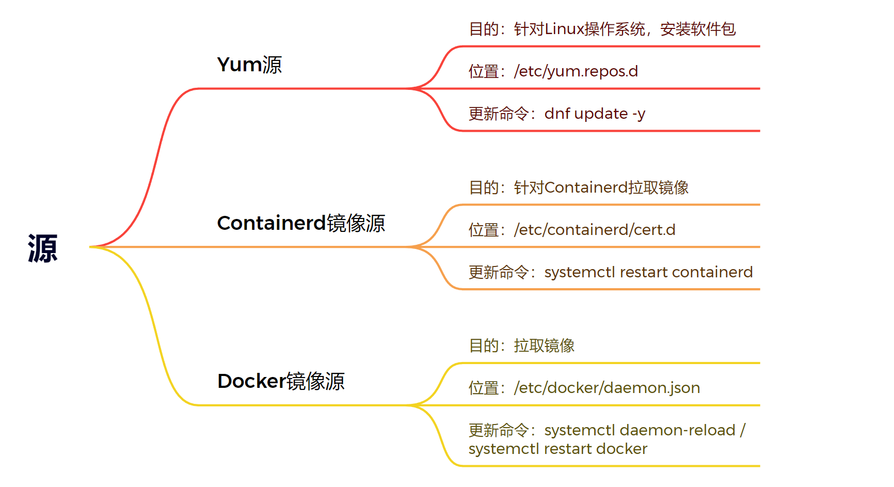

## 【扩展】安装步骤优化

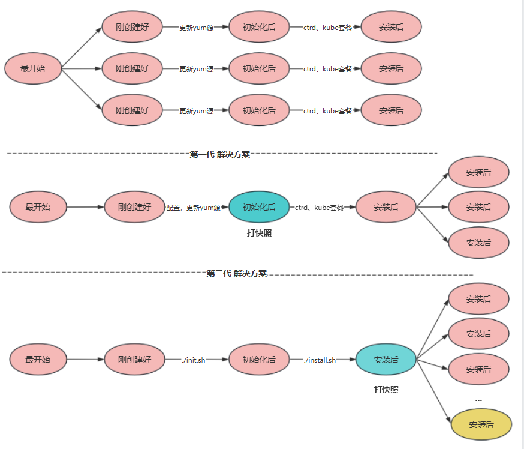


> 更新: 2026-01-14 15:47:16  
> 原文: <https://www.yuque.com/u41736172/az9urv/vckwofq5gtssrkbp>