# 04.Kubernetes资源管理与Pod进阶

# 一、【掌握】Pod 调度策略

## Pod 创建流程(重点)

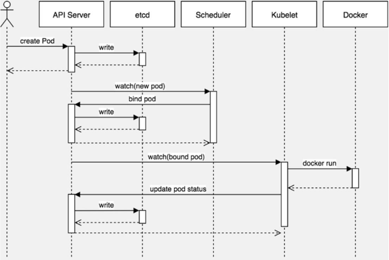

**step.1 用户提交 Pod 定义**

kubectl 向 k8s api server 发起一个create pod 请求(即我们使用 Kubectl 敲一个 create pod 命令)

**step.2 API Server 接收请求**

k8s api server 接收到 pod 创建请求后，不会去直接创建 pod；而是生成一个包含创建信息的 yaml。

api server 将刚才的 yaml 信息写入 etcd 数据库。到此为止，仅仅是在 etcd 中添加了一条记录， 还没有任何的实质性进展。

**step.3 调度器选择节点**

scheduler 通过其 watcher 监测到 k8s api sever 创建新 pod 对象请求

首先判断：pod.spec.nodeName == null?

若为 null，表示这个 Pod 请求是新来的，需要创建；因此先进行调度计算，<font style="color:rgb(216,57,49);">找到最“合适”的 node。</font>

然后将信息在 etcd 数据库中更新分配结果：pod.spec.Node = nodeA (设置一个具体的节点)

ps：同样上述操作的各种信息也要写到 etcd 数据库中。

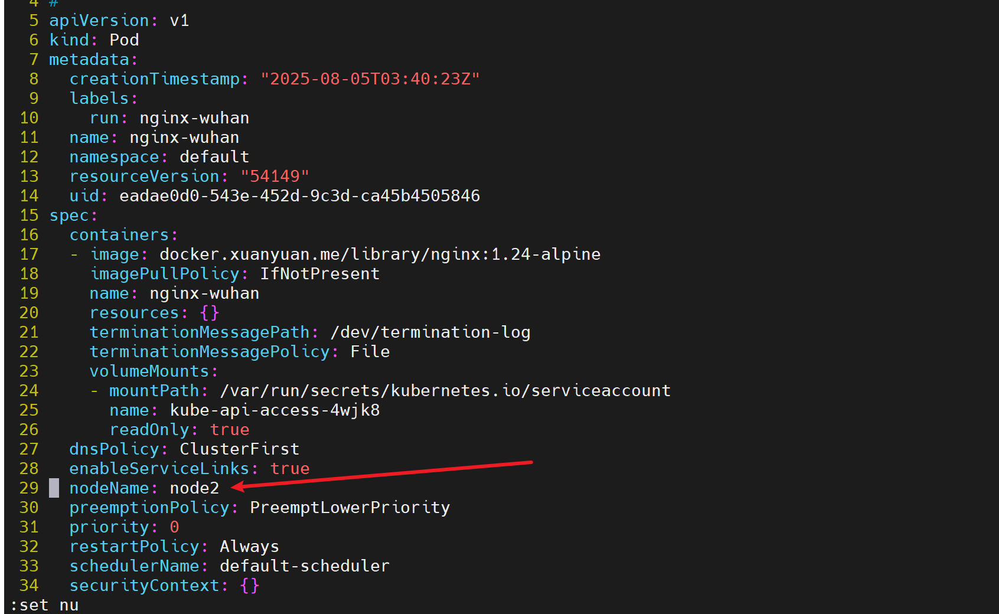

**step.4 节点上的 kubelet 创建 Pod**

kubelet 通过监测 etcd 数据库(即不停地看 etcd 中的记录)，发现 k8s api server 中有了个新的 Pod 创建请求； 如果这条记录中的Node 与自己的编号相同(即这个 pod 由 scheduler 分配给自己了)，则调用 node 中的**运行时(Runtime)**，创建 container。

## 调度约束方法

在默认情况下，一个 Pod 在哪个 Node 节点上运行，是由 Scheduler 组件采用相应的算法计算出来的，这个过程是不受人工控制的。

但是在实际使用中，这可能并不满足企业的需求，因为很多情况下，我们想控制某些 Pod 到达某些节点上，那么应该怎么做呢？这就要求了解 kubernetes 对 Pod 的调度规则，kubernetes 提供了四大种调度方式：

* \*\*自动调度：\*\*运行在哪个节点上完全由 Scheduler 经过一系列的算法计算得出
* \*\*定向调度（针对 Pod）：\*\*NodeName、NodeSelector
* \*\*亲和性调度（针对 Pod）：\*\*NodeAffinity、PodAffinity、PodAntiAffinity
* \*\*污点（针对 Node） / 容忍（针对 Pod）调度：\*\*Node Taints、Pod Toleration

### 定向调度

我们为了实现容器主机资源平衡使用，可以使用约束把 pod 调度到指定的 node 节点。

应用场景举例：

当应用对硬件有特定要求，如需要<font style="color:rgb(216,57,49);"> GPU 支持</font>的应用，可将节点标记为有 GPU 的标签，然后通过节点选择器将相关 Pod 调度到这些节点上。

* NodeName 用于将 pod 调度到指定的 node 名称上
* NodeSelector 用于将 pod 调度到\*\*匹配 Label \*\*的一类 node 上

#### 案例 1：NodeName

第一步：编写 YAML 文件

```yaml
[root@master ~]# vim pod-nodename.yml
apiVersion: v1
kind: Pod
metadata:
  name: pod-nodename
spec:
  nodeName: node1                       # 通过nodeName调度到node1节点
  containers:
  - name: nginx
    image: docker.1ms.run/nginx:1.24.0
```

> 注意：上面的 yaml 中并没有指定命名空间，所以会将 pod 创建在 k8s 的默认命名空间中，默认的是命名空间名称是 default。

第二步：应用 YAML 文件创建 pod

```shell
[root@master ~]# kubectl apply -f pod-nodename.yml
pod/pod-nodename created
```

第三步：查看 pod 的信息，可以看到 pod 确实分布在了 node1 节点上了

```shell
[root@master ~]# kubectl get pod -o wide
NAME           READY   STATUS    RESTARTS   AGE   IP            NODE    NOMINATED NODE   READINESS GATES
pod-nodename   1/1     Running   0          58s   10.244.1.16   node1   <none>           <none>
```

***

接下来我们将上面的 yaml 文件中 NodeName 改为一个不存在的节点，我们看是否能够正常创建 pod！

第一步：根据 yaml 文件删除之前创建的 pod

```shell
[root@master ~]# kubectl delete -f pod-nodename.yml
pod "pod-nodename" deleted
```

第二步：编写 YAML 文件

```yaml
[root@master ~]# vim pod-nodename.yml
apiVersion: v1
kind: Pod
metadata:
  name: pod-nodename
spec:
  nodeName: node666                       # 通过nodeName调度到node666节点
  containers:
  - name: nginx
    image: docker.1ms.run/nginx:1.24.0
```

第三步：应用 YAML 文件创建 pod

```shell
[root@master ~]# kubectl apply -f pod-nodename.yml
pod/pod-nodename created
```

第四步：查看 pod 信息，可以看到确实要将 pod 分布在 node666 节点上。但是这个节点根本不存在，所以目前状态是 Pending（待定的）。然后过一会，这个 pod 信息就看不到了，因为不存在 node666，无法创建 pod！

```shell
[root@master ~]# kubectl get pod -o wide
NAME           READY   STATUS    RESTARTS   AGE   IP       NODE      NOMINATED NODE   READINESS GATES
pod-nodename   0/1     Pending   0          26s   <none>   node666   <none>           <none>

[root@master ~]# kubectl get pod -o wide
No resources found in default namespace.
```

#### **案例 2**：NodeSelector

第一步：为 node2 打标签

```shell
[root@master ~]# kubectl label node node2 business=game
node/node2 labeled
```

第二步：编写 YAML 文件

```yaml
[root@master ~]# vim pod-nodeselector.yml
apiVersion: v1
kind: Pod
metadata:
  name: pod-nodeselect
spec:
  nodeSelector:                         # nodeSelector节点选择器
    business: game                      # 指定调度到标签为business=game的节点
  containers:
  - name: nginx
    image: docker.1ms.run/nginx:1.24.0
```

第三步：应用 YAML 文件创建 pod

```shell
[root@master ~]# kubectl apply -f pod-nodeselector.yml
pod/pod-nodeselect created
```

第四步：查看 pod 信息

```shell
[root@master ~]# kubectl get pod -o wide
NAME             READY   STATUS    RESTARTS   AGE   IP            NODE    NOMINATED NODE   READINESS GATES
pod-nodeselect   1/1     Running   0          21s   10.244.2.12   node2   <none>           <none>
```

***

接下来，我们修改 yaml 配置文件，改一个不存在的节点标签，观察定向调度会失败！无法创建 pod。

第一步：根据 yaml 删除 pod 信息

```shell
[root@master ~]# kubectl delete -f pod-nodeselector.yml
pod "pod-nodeselect" deleted
```

第二步：修改 yaml 配置文件

```yaml
[root@master ~]# vim pod-nodeselector.yml
apiVersion: v1
kind: Pod
metadata:
  name: pod-nodeselect
spec:
  nodeSelector:                         # nodeSelector节点选择器
    business: haha                      # 指定调度到标签为business=game的节点
  containers:
  - name: nginx
    image: docker.1ms.run/nginx:1.24.0
```

第三步：应用配置文件创建 pod

```shell
[root@master ~]# kubectl apply -f pod-nodeselector.yml
pod/pod-nodeselect created
```

第四步：查看 pod 信息

```shell
[root@master ~]# kubectl get pod
NAME             READY   STATUS    RESTARTS   AGE
pod-nodeselect   0/1     Pending   0          18s
```

第五步：删除 pod 信息

```shell
[root@master ~]# kubectl delete -f pod-nodeselector.yml
pod "pod-nodeselect" deleted
```

#### 问题总结

\*\*问题 1：查看 pod，发现一直是 \*\*\*\*<font style="color:rgb(216,57,49);">pending </font>\*\***状态**

如果是调度到了不存在的节点，pending 是正常的（要么是节点不存在，要么是节点没启动）

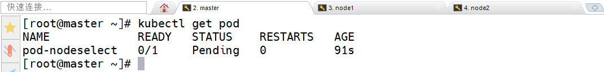

**问题 2：查看 node，发现一直是 not ready 状态**

好多小伙伴没把自己的集群起起来

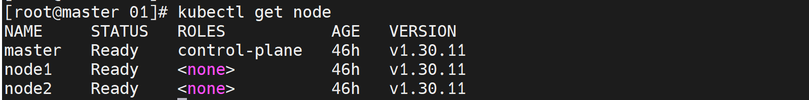

### 亲和性调度

> 上一节，介绍了两种定向调度的方式，使用起来非常方便，但是也有一定的问题。
>
> 那就是<font style="color:rgb(216,57,49);">如果没有满足条件的 Node，那么 Pod 将不会被运行</font>，即使在集群中还有可用 Node 列表也不行。
>
> 这就限制了它的使用场景。

基于上面的问题，kubernetes 还提供了一种亲和性调度（Affinity）。它在 NodeSelector 的基础之上的进行了扩展，可以通过配置的形式，实现优先选择满足条件的 Node 进行调度，如果没有，也可以调度到不满足条件的节点上，使调度更加灵活。

Affinity 主要分为三类：

* **nodeAffinity（node 亲和性）**: 以 node 为目标，解决 pod 可以调度到哪些 node 的问题
* **podAffinity（pod 亲和性）**: 以 pod 为目标，解决 pod 可以和哪些已存在的 pod 部署在同一个拓扑域中的问题
* \*\*podAntiAffinity（pod 反亲和性） \*\*: 以 pod 为目标，解决 pod 不能和哪些已存在 pod 部署在同一个拓扑域中的问题

关于亲和性与反亲和性使用场景的说明：

**亲和性**：如果两个应用频繁交互，那就有必要利用<font style="color:rgb(216,57,49);">亲和性让两个应用的尽可能的靠近</font>，这样可以减少因网络通信而带来的性能损耗。

**反亲和性**：当应用<font style="color:rgb(216,57,49);">采用多副本</font>部署时，有必要采用反亲和性让各个应用实例打散分布在各个 node 上，这样可以提高服务的高可用性。

#### **NodeAffinity**

首先来看一下 NodeAffinity 的可配置项：

```yaml
pod.spec.affinity.nodeAffinity
  # 硬亲和性
  requiredDuringSchedulingIgnoredDuringExecution  Node节点必须满足指定的所有规则才可以，相当于硬限制
    nodeSelectorTerms  节点选择列表
      matchFields   按节点字段列出的节点选择器要求列表
      matchExpressions   按节点标签列出的节点选择器要求列表(推荐写法)
        key    键
        values 值
        operator 关系符 支持Exists, DoesNotExist, In, NotIn, Gt, Lt
        
  # 软亲和性      
  preferredDuringSchedulingIgnoredDuringExecution 优先调度到满足指定的规则的Node，相当于软限制 (倾向)
    preference   一个节点选择器项，与相应的权重相关联
      matchFields   按节点字段列出的节点选择器要求列表
      matchExpressions   按节点标签列出的节点选择器要求列表(推荐写法)
        key    键
        values 值
        operator 关系符 支持In, NotIn, Exists, DoesNotExist, Gt, Lt
	weight 倾向权重，在范围1-100。
```

补充说明：

preferred 表明这是一个优先选择；

DuringScheduling 说明该规则只在调度 Pod 到节点时考虑；

IgnoredDuringExecution 意味着在 Pod 已经运行后，即使节点的状态或标签发生变化不再满足该规则，也不会影响 Pod 继续在该节点运行。

```yaml
关系符的使用说明

- matchExpressions:
  - key: nodeenv              # 匹配存在标签的key为nodeenv的节点
    operator: Exists
  - key: nodeenv              # 匹配标签的key为nodeenv,且value是"xxx"或"yyy"的节点
    operator: In
    values: ["xxx","yyy"]
  - key: nodeenv              # 匹配标签的key为nodeenv,且value大于"xxx"的节点
    operator: Gt
    values: "xxx"
```

\*\*案例 1：\*\*演示一下 requiredDuringSchedulingIgnoredDuringExecution（**节点硬亲和性**）

第一步：创建配置文件 pod-nodeaffinity-required.yaml

```yaml
apiVersion: v1
kind: Pod
metadata:
  name: pod-nodeaffinity-required
spec:
  containers:
  - name: nginx
    image: docker.1ms.run/nginx:1.24.0
  affinity:  # 亲和性设置
    nodeAffinity: #设置node亲和性
      requiredDuringSchedulingIgnoredDuringExecution: # 硬亲和性
        nodeSelectorTerms:
        - matchExpressions: # 匹配env的值在["xxx","yyy"]中的标签
          - key: nodeenv
            operator: In
            values: ["xxx","yyy"]
```

第二步：根据配置文件创建 pod

```shell
[root@master ~]# kubectl apply -f pod-nodeaffinity-required.yaml
pod/pod-nodeaffinity-required created
```

第三步：查看 pod 信息，可以发现是 Pending 状态，因为目前就没有节点符合上面的标签表达式，所以调度是失败的！

```shell
[root@master ~]# kubectl get pod
NAME                        READY   STATUS    RESTARTS   AGE
pod-nodeaffinity-required   0/1     Pending   0          18s
```

第四步：查看 pod 详细信息

```shell
[root@master ~]# kubectl describe pod pod-nodeaffinity-required | tail -10
    ConfigMapOptional:       <nil>
    DownwardAPI:             true
QoS Class:                   BestEffort
Node-Selectors:              <none>
Tolerations:                 node.kubernetes.io/not-ready:NoExecute op=Exists for 300s
                             node.kubernetes.io/unreachable:NoExecute op=Exists for 300s
Events:
  Type     Reason            Age   From               Message
  ----     ------            ----  ----               -------
  Warning  FailedScheduling  95s   default-scheduler  0/3 nodes are available: 1 node(s) had untolerated taint {node-role.kubernetes.io/control-plane: }, 2 node(s) didn't match Pod's node affinity/selector. preemption: 0/3 nodes are available: 3 Preemption is not helpful for scheduling.
```

第五步：删除 pod 信息

```shell
[root@master ~]# kubectl delete -f pod-nodeaffinity-required.yaml
pod "pod-nodeaffinity-required" deleted
```

***

第六步：给 node1 节点打标签，使其符合 yaml 配置文件中硬亲和性调度的规则

```shell
[root@master ~]# kubectl label node node1 nodeenv=xxx
node/node1 labeled
```

第七步：根据配置文件创建 pod

```shell
[root@master ~]# kubectl apply -f pod-nodeaffinity-required.yaml
pod/pod-nodeaffinity-required created
```

第八步：查看 pod 信息，可以发现确实将 pod 调度到了 node1 节点上了

```shell
[root@master ~]# kubectl get pod -o wide
NAME                        READY   STATUS    RESTARTS   AGE   IP            NODE    NOMINATED NODE   READINESS GATES
pod-nodeaffinity-required   1/1     Running   0          30s   10.244.1.17   node1   <none>           <none>
```

第九步：删除 pod

```shell
[root@master ~]# kubectl delete -f pod-nodeaffinity-required.yaml
pod "pod-nodeaffinity-required" deleted
```

> 总结：节点硬亲和性，表示 pod 被调度到的节点必须要满足指定的条件！如果没有满足条件的节点，那么调度就会失败！pod 将处于 Pending 状态。

**案例 2**：**演示节点软亲和性** preferredDuringSchedulingIgnoredDuringExecution。

第一步：创建 pod-nodeaffinity-preferred.yaml 文件

```yaml
apiVersion: v1
kind: Pod
metadata:
  name: pod-nodeaffinity-preferred
spec:
  containers:
  - name: nginx
    image: docker.1ms.run/nginx:1.24.0
  affinity:  #亲和性设置
    nodeAffinity: #设置node亲和性
      preferredDuringSchedulingIgnoredDuringExecution: # 软亲和性
      - weight: 1
        preference:
          matchExpressions: # 匹配env的值在["xxx","yyy"]中的标签(当前环境中有)
          - key: nodeenv
            operator: In
            values: ["xxx","yyy"]
```

第二步：删除 node1 节点上的 nodeenv=xxx 标签

```shell
[root@master ~]# kubectl label node node1 nodeenv-
node/node1 unlabeled
```

第三步：应用 yaml 创建 pod（目前我们的 node 没有符合 yaml 调度规则的，但因为是软亲和，所以最终还是可以调度的）

```shell
[root@master ~]# kubectl apply -f pod-nodeaffinity-preferred.yaml
pod/pod-nodeaffinity-preferred created
```

第四步：查看 pod 信息

```shell
[root@master ~]# kubectl get pod
NAME                         READY   STATUS    RESTARTS   AGE
pod-nodeaffinity-preferred   1/1     Running   0          20s
```

第五步：删除 pod

```shell
[root@master ~]# kubectl delete -f pod-nodeaffinity-preferred.yaml
pod "pod-nodeaffinity-preferred" deleted
```

#### **PodAffinity**

PodAffinity 主要实现以运行的 Pod 为参照，实现让新创建的 Pod 跟参照 Pod 在一个区域的功能。

首先来看一下 PodAffinity 的可配置项：

```yaml
pod.spec.affinity.podAffinity
  requiredDuringSchedulingIgnoredDuringExecution  硬限制
  # required During Scheduling 调度期间强制， Ignored During Execution 运行期间忽略
    namespaces       指定参照pod的namespace
    topologyKey      指定调度作用域
    labelSelector    标签选择器
      matchExpressions  按节点标签列出的节点选择器要求列表(推荐)
        key    键
        values 值
        operator 关系符 支持In, NotIn, Exists, DoesNotExist.
      matchLabels    指多个matchExpressions映射的内容

  preferredDuringSchedulingIgnoredDuringExecution 软限制
    podAffinityTerm  选项
      namespaces      
      topologyKey
      labelSelector
        matchExpressions  
          key    键
          values 值
          operator
        matchLabels 
    weight 倾向权重，在范围1-100
```

PodAffinity 中，topologyKey 用于指定调度时作用域，例如：

1 如果指定为 <font style="color:rgb(216,57,49);">kubernetes.io/hostname</font>，那就是以 Node 节点为区分范围

作用机制：调度器会尽量把新的 Pod 调度到特定 Pod 的同一个 Node 上；

示例场景：在微服务架构里，若两个微服务之间通信频繁，可以减少网络开销。

2 如果指定为 <font style="color:rgb(216,57,49);">beta.kubernetes.io/os</font>，则以 Node 节点的操作系统类型来区分

作用机制：调度器会尽量把新 Pod 调度到和已有<font style="color:rgb(216,57,49);">特定 Pod 操作系统类型相同的 Node 上</font>；

示例场景：如果有一些应用只能在特定操作系统（如 Linux）上运行，可确保 Pod 都调度到相应 Node 上。

***

**案例**：演示下 <font style="color:rgb(216,57,49);">required</font>DuringSchedulingIgnoredDuringExecution（**Pod 硬亲和**）

第一步：创建一个<font style="color:rgb(216,57,49);">参照 Pod</font>，pod-podaffinity-target.yaml

```yaml
apiVersion: v1
kind: Pod
metadata:
  name: pod-podaffinity-target
  labels:					#设置标签
    podenv: pro 
spec:
  containers:
  - name: nginx
    image: docker.1ms.run/nginx:1.24.0
  nodeName: node1          # 将目标pod名确指定到node1上,大家改成自己的节点
```

> 注意：通过上面的配置文件创建 pod 后，给 pod 打了一个标签 podenv = pro。该 pod 是作为后面我们创建另一个 pod 的参考点。

第二步：根据 yaml 文件创建 pod（创建在了默认命名空间 default 中，因为 yaml 中没有指定命名空间）

```shell
[root@master ~]# kubectl apply -f pod-podaffinity-target.yaml
pod/pod-podaffinity-target created
```

第三步：查看 pod 信息

```shell
[root@master ~]# kubectl get pod
NAME                     READY   STATUS    RESTARTS   AGE
pod-podaffinity-target   1/1     Running   0          45s
```

第四步：创建 pod-podaffinity-required.yaml，内容如下：

```yaml
apiVersion: v1
kind: Pod
metadata:
  name: pod-podaffinity-required
spec:
  containers:
  - name: nginx
    image: docker.1ms.run/nginx:1.24.0
  affinity:  #亲和性设置
    podAffinity: #设置pod亲和性
      requiredDuringSchedulingIgnoredDuringExecution: # 硬限制
      - labelSelector:
          matchExpressions: # 匹配env的值在["xxx","yyy"]中的标签
          - key: podenv
            operator: In
            values: ["xxx","yyy"]
        topologyKey: kubernetes.io/hostname
```

> 上面的配置属于 pod 硬亲和性的配置，看条件，了解到新创建的 pod 必须要和已有 pod 中标签是 podenv 等于 xxx 或者 yyy 的在一个节点上！
>
> 但是很显然，目前我们没有这样的 pod（标签是 podenv 等于 xxx 或者 yyy 的），所以本次创建新 pod 肯定会调度失败！

第五步：根据上面的配置文件创建 pod

```shell
[root@master ~]# kubectl apply -f pod-podaffinity-required.yaml
pod/pod-podaffinity-required created
```

第六步：查看 pod 信息

```shell
[root@master ~]# kubectl get pod
NAME                       READY   STATUS    RESTARTS   AGE
pod-podaffinity-required   0/1     Pending   0          17s
pod-podaffinity-target     1/1     Running   0          4m59s
```

第七步：删除上面失败的 pod

```shell
[root@master ~]# kubectl delete -f pod-podaffinity-required.yaml
pod "pod-podaffinity-required" deleted
```

第八步：修改上面的 pod-podaffinity-required.yaml 配置文件为：

```yaml
apiVersion: v1
kind: Pod
metadata:
  name: pod-podaffinity-required
spec:
  containers:
  - name: nginx
    image: docker.1ms.run/nginx:1.24.0
  affinity:  #亲和性设置
    podAffinity: #设置pod亲和性
      requiredDuringSchedulingIgnoredDuringExecution: # 硬限制
      - labelSelector:
          matchExpressions: # 匹配env的值在["xxx","yyy"]中的标签
          - key: podenv
            operator: In
            values: ["pro","yyy"]
        topologyKey: kubernetes.io/hostname
```

> 也就是说，新创建的 pod 要与拥有标签 podenv 等于 pro 或者 yyy 的 pod 在同一台节点上。那么，目前我们是满足这种条件的！
>
> 所以本次调度会成功的！

第九步：根据 yaml 文件创建 pod

```shell
[root@master ~]# kubectl apply -f pod-podaffinity-required.yaml
pod/pod-podaffinity-required created
```

第十步：查看 pod 信息，可以看到成功调度创建出了新的 pod！而且和上面参考的 pod 应该是在同一个节点上！

```shell
[root@master ~]# kubectl get pod
NAME                       READY   STATUS    RESTARTS   AGE
pod-podaffinity-required   1/1     Running   0          23s
pod-podaffinity-target     1/1     Running   0          9m6s
```

第十一步：删除 pod

```shell
[root@master ~]# kubectl delete -f pod-podaffinity-required.yaml
pod "pod-podaffinity-required" deleted

[root@master ~]# kubectl delete -f pod-podaffinity-target.yaml
pod "pod-podaffinity-target" deleted
```

关于 PodAffinity 的 <font style="color:rgb(216,57,49);">preferred</font>DuringSchedulingIgnoredDuringExecution（也就是 pod 的软亲和性），这里不再演示。和上面的 node 的软亲和性类似的含义！

#### **PodAntiAffinity**

PodAntiAffinity 主要实现以运行的 Pod 为参照，让新创建的 Pod 跟参照 Pod 不在一个区域中的功能。

它的配置方式和选项跟 PodAffinty 是一样的，这里不再做详细解释，直接做一个测试案例。

第一步：还是使用上面的参考 pod 作为本次参考的 pod，继续通过上面的 pod-podaffinity-target.yaml 配置文件创建 pod 作为参考。

```shell
# 创建pod
[root@master ~]# kubectl apply -f pod-podaffinity-target.yaml
pod/pod-podaffinity-target created

# 查看pod
[root@master ~]# kubectl get pod
NAME                     READY   STATUS    RESTARTS   AGE
pod-podaffinity-target   1/1     Running   0          5s

# 查看pod并且带上pod的标签
[root@master ~]# kubectl get pod -L podenv
NAME                     READY   STATUS    RESTARTS   AGE   PODENV
pod-podaffinity-target   1/1     Running   0          36s   pro

# 查看pod详细信息
[root@master ~]# kubectl get pod -o wide
NAME                     READY   STATUS    RESTARTS   AGE     IP            NODE    NOMINATED NODE   READINESS GATES
pod-podaffinity-target   1/1     Running   0          5m14s   10.244.1.21   node1   <none>           <none>
```

> 而且我们通过 yaml 文件创建 pod 的时候，给 pod 打了一个标签 podenv=pro

第二步：创建 pod-podantiaffinity-required.yaml，内容如下：（测试 pod 反亲和性）

```yaml
apiVersion: v1
kind: Pod
metadata:
  name: pod-podantiaffinity-required
spec:
  containers:
  - name: nginx
    image: docker.1ms.run/nginx:1.24.0
  affinity:  #亲和性设置
    podAntiAffinity: #设置pod反亲和性
      requiredDuringSchedulingIgnoredDuringExecution: # 硬限制
      - labelSelector:
          matchExpressions: # 匹配podenv的值在["pro"]中的标签
          - key: podenv
            operator: In
            values: ["pro"]
        topologyKey: kubernetes.io/hostname
```

> 上面的配置文件意思是：新创建的 pod 不能和拥有标签 podenv=pro 的 pod 在一个节点中！！！
>
> 参考用的 pod 在 node1 节点上，那我们预测，本次新创建的 pod 应该在 node2 节点上！

第三步：根据 pod-podantiaffinity-required.yaml 创建 pod

```shell
[root@master ~]# kubectl apply -f pod-podantiaffinity-required.yaml
pod/pod-podantiaffinity-required created
```

第四步：查看 pod 信息，没问题，符合预期！

```shell
[root@master ~]# kubectl get pod -o wide
NAME                           READY   STATUS    RESTARTS   AGE    IP            NODE    NOMINATED NODE   READINESS GATES
pod-podaffinity-target         1/1     Running   0          7m7s   10.244.1.21   node1   <none>           <none>
pod-podantiaffinity-required   1/1     Running   0          23s    10.244.2.13   node2   <none>           <none>
```

亲和性调度既有硬亲和性，也有软亲和性，相对弹性。

在实际工作中，单独搭建的云环境集群，往往操作系统和节点特性都是统一的，因为节点之前差异（标签）比较小。

#### 问题总结

**问题 1：资源没找到**

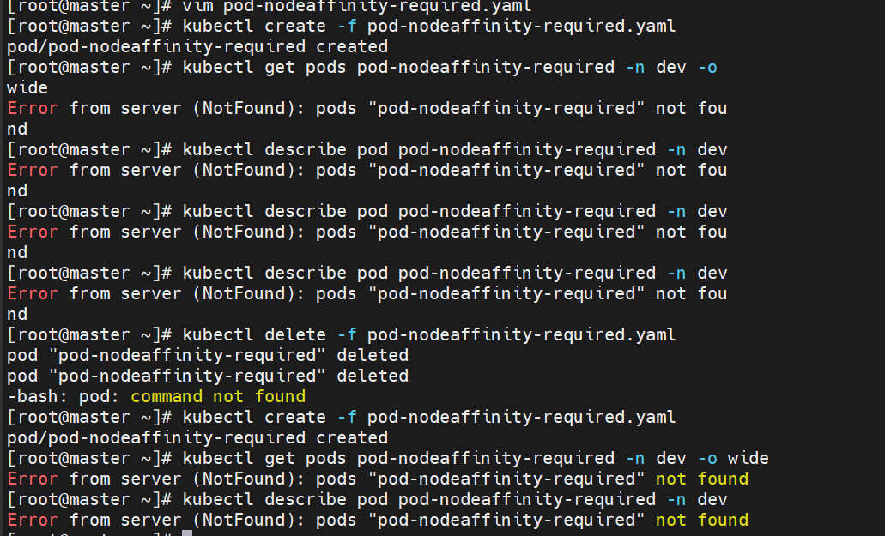

```shell
# 执行 -A 查看所有的 pod
kubectl get pod -A 
```

因为我们上面的 yaml 中都没有写命名空间，所以创建的 pod 都是在 k8s 默认的命名空间 default 中！所以查看 pod 的时候不写命名空间默认就可以查询！

**问题 2：标签查看不到值**

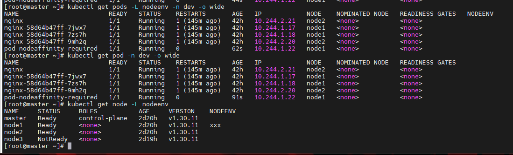

pod 中的标签，和 node 中的标签，是不一样的。

### 污点和容忍

#### **污点（Taints）**

前面的调度方式都是站在 Pod 的角度上，通过在 Pod 上添加属性，来确定 Pod 是否要调度到指定的 Node 上，其实我们也可以站在Node 的角度上，通过在 Node 上添加**污点**属性，来决定是否允许 Pod 调度过来。

Node 被设置上污点之后就和 Pod 之间存在了一种相斥的关系，进而拒绝 Pod 调度进来，甚至可以将已经存在的 Pod 驱逐出去。

污点的格式为：key=value:effect

key 和 value 是污点的标签

effect 描述污点的作用，支持如下三个选项：

* \*\*PreferNoSchedule：\*\*kubernetes 将尽量避免把 Pod 调度到具有该污点的 Node 上，除非没有其他节点可调度
* \*\*NoSchedule：\*\*kubernetes 将不会把 Pod 调度到具有该污点的 Node 上，但不会影响当前 Node 上已存在的 Pod
* \*\*NoExecute：\*\*kubernetes 将不会把 Pod 调度到具有该污点的 Node 上，同时也会将 Node 上已存在的 Pod 驱离

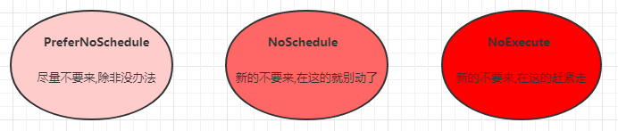

使用 kubectl 设置和去除污点的命令示例如下：

```shell
# 设置污点
kubectl taint nodes node1 key=value:effect

# 去除指定的一类污点
kubectl taint nodes node1 key:effect-

# 去除key下面的所有污点
kubectl taint nodes node1 key-
```

***

案例：接下来，演示下污点的效果：

1. 准备节点 node1（为了演示效果更加明显，暂时停止 node2 节点）
2. 为 node1 节点设置一个污点：<font style="color:rgb(216,57,49);">tag=beijing:PreferNoSchedule</font>；然后创建 pod1( pod1 可以正常创建 )
3. 修改为 node1 节点设置一个污点：<font style="color:rgb(216,57,49);">tag=beijing:NoSchedule</font>；然后创建 pod2( pod1 正常 pod2 失败 )
4. 修改为 node1 节点设置一个污点：tag=<font style="color:rgb(216,57,49);">beijing</font>:NoExecute；然后创建 pod3 ( 3 个 pod 都失败 )

```shell
# 1. 挂起node2服务器，然后查看集群状态(等30秒左右)
[root@master ~]# kubectl get nodes
NAME     STATUS     ROLES           AGE     VERSION
master   Ready      control-plane   4d16h   v1.30.14
node1    Ready      <none>          4d5h    v1.30.14
node2    NotReady   <none>          4d5h    v1.30.14

# 2. 给node1节点设置污点(PreferNoSchedule)
[root@master ~]# kubectl taint nodes node1 tag=beijing:PreferNoSchedule
node/node1 tainted

# 3. 简单实用命令行方式创建一个pod，工作中我们用的都是yaml文件
[root@master ~]# kubectl run taint1 --image=docker.1ms.run/nginx:1.24.0
pod/taint1 created

# 4. 查看pod信息，还是正常创建pod了，因为没有别的节点可调度，只能使用node1了。
[root@master ~]# kubectl get pod -o wide
NAME                           READY   STATUS    RESTARTS   AGE    IP            NODE    NOMINATED NODE   READINESS GATES
pod-podaffinity-target         1/1     Running   0          150m   10.244.1.21   node1   <none>           <none>
pod-podantiaffinity-required   1/1     Running   0          143m   10.244.2.13   node2   <none>           <none>
taint1                         1/1     Running   0          36s    10.244.1.22   node1   <none>           <none>

# 5. 取消node1上面的污点
[root@master ~]# kubectl taint nodes node1 tag:PreferNoSchedule-
node/node1 untainted

# 6. 给node1上面设置污点(NoSchedule)
[root@master ~]# kubectl taint nodes node1 tag=beijing:NoSchedule
node/node1 tainted

# 7. 简单实用命令行方式创建一个pod2，工作中我们用的都是yaml文件
[root@master ~]# kubectl run taint2 --image=docker.1ms.run/nginx:1.24.0
pod/taint2 created

# 8. 查看pod信息，符合预期，pod2不能创建，pod1还在正常状态
[root@master ~]# kubectl get pod
NAME                           READY   STATUS        RESTARTS   AGE
taint1                         1/1     Running       0          6m33s
taint2                         0/1     Pending       0          17s

# 9. 取消node1上面的污点
[root@master ~]# kubectl taint nodes node1 tag:NoSchedule-
node/node1 untainted

# 10. 给node1上面设置污点(NoExecute)
[root@master ~]# kubectl taint nodes node1 tag=beijing:NoExecute
node/node1 tainted

# 11. 简单实用命令行方式创建一个pod3，工作中我们用的都是yaml文件
[root@master ~]# kubectl run taint3 --image=docker.1ms.run/nginx:1.24.0
pod/taint3 created

# 12. 查看pod信息，符合预期，pod1、pod2都从node1中驱逐出去了，pod3处于Pending状态
[root@master ~]# kubectl get pod
NAME                           READY   STATUS        RESTARTS   AGE
taint3                         0/1     Pending       0          18s

# 13. 删除node1上面的污点
[root@master ~]# kubectl taint nodes node1 tag:NoExecute-
node/node1 untainted

# 14. 删除pod3
[root@master ~]# kubectl delete pod taint3
pod "taint3" deleted
```

***

<font style="background-color:#FBDE28;">思考题：</font>为什么我们在使用 k8s 集群时，所有创建的 pod 都自动分配给 node1/node2 节点，但是从来没有分配到 master 节点呢？

回答：使用 kubeadm/kubeasz 搭建的集群，默认就会给 master 节点添加一个污点标记（NoSchedule），所以 pod 就不会调度到 master 节点上。

```shell
[root@master ~]# kubectl describe node master | grep -in -C 3 taint
15-                    node.alpha.kubernetes.io/ttl: 0
16-                    volumes.kubernetes.io/controller-managed-attach-detach: true
17-CreationTimestamp:  Tue, 06 Jan 2026 21:41:38 +0800
18:Taints:             node-role.kubernetes.io/control-plane:NoSchedule
19-Unschedulable:      false
20-Lease:
21-  HolderIdentity:  master
```

#### **容忍（Toleration）**

上面介绍了污点的作用，我们可以在 node 上添加污点用于拒绝 pod 调度上来，但是如果就是想将一个 pod 调度到一个有污点的node 上去，这时候应该怎么做呢？这就要使用到**容忍**。

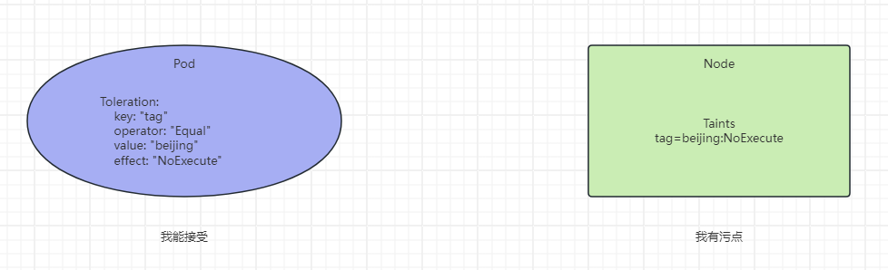

污点就是拒绝，容忍就是忽略，Node 通过污点拒绝 pod 调度上去，Pod 通过容忍忽略拒绝

下面先通过一个案例看下效果：

1. 给 node1 节点上打上 NoExecute 的污点，表示拒绝 pod 调度上去
2. 通过 yaml 文件创建一个 pod，发现状态是 Pending
3. 修改 yaml 文件，给 pod 添加容忍，然后应用文件，状态由 Pending 变为 Running

第一步：给 node1 节点打上污点（NoExecute）

```shell
[root@master ~]# kubectl taint nodes node1 tag=beijing:NoExecute
node/node1 tainted

# 查看node1的污点信息
[root@master ~]# kubectl describe nodes node1 | grep -in -C 3 'taint'
13-                    node.alpha.kubernetes.io/ttl: 0
14-                    volumes.kubernetes.io/controller-managed-attach-detach: true
15-CreationTimestamp:  Wed, 07 Jan 2026 08:40:21 +0800
16:Taints:             tag=beijing:NoExecute
17-Unschedulable:      false
18-Lease:
19-  HolderIdentity:  node1
```

第二步：编写 pod-toleration.yaml 文件

```yaml
apiVersion: v1
kind: Pod
metadata:
  name: pod-toleration
spec:
  containers:
  - name: nginx
    image: docker.1ms.run/nginx:1.24.0
```

第三步：通过 yaml 文件创建 pod

```shell
[root@master ~]# kubectl apply -f pod-toleration.yaml
pod/pod-toleration created
```

第四步：查看 pod 的状态，Pending 状态很正常，因为现在 node1 上面有 NoExecute 污点，无法调度 pod 上去

```shell
[root@master ~]# kubectl get pod
NAME             READY   STATUS    RESTARTS   AGE
pod-toleration   0/1     Pending   0          19s
```

第五步：修改 pod-toleration.yaml 文件，表示 pod 可以容忍有污点 NoExecute 的节点

```shell
apiVersion: v1
kind: Pod
metadata:
  name: pod-toleration
spec:
  containers:
  - name: nginx
    image: docker.1ms.run/nginx:1.24.0
  tolerations:            # 添加容忍
  - key: "tag"        	  # 要容忍的污点的key
    operator: "Equal" 	  # 操作符
    value: "beijing"    	# 容忍的污点的value
    effect: "NoExecute"   # 添加容忍的规则，这里必须和标记的污点规则相同
```

第六步：再次应用 pod-toleration.yaml 文件

```shell
[root@master ~]# kubectl apply -f pod-toleration.yaml
pod/pod-toleration configured
```

第七步：观察 pod 的状态，由 Pending 状态变为了 Running 状态

```shell
[root@master ~]# kubectl get pod
NAME             READY   STATUS    RESTARTS   AGE
pod-toleration   1/1     Running   0          3m7s
```

第八步：删除 pod、删除 node1 上面的污点

```shell
[root@master ~]# kubectl delete -f pod-toleration.yaml
pod "pod-toleration" deleted

[root@master ~]# kubectl taint nodes node1 tag:NoExecute-
node/node1 untainted
```

***

小提示

添加容忍，也就是修改 pod，也可以使用以下命令，在线修改

<code><font style="color:rgb(216,57,49);">kubectl edit pod pod名字</font></code>

下面看一下容忍的详细配置:

```shell
[root@master ~]# kubectl explain pod.spec.tolerations
......
FIELDS:
   key       # 对应着要容忍的污点的键，空意味着匹配所有的键
   value     # 对应着要容忍的污点的值
   operator  # key-value的运算符，支持Equal和Exists（默认）
   effect    # 对应污点的effect，空意味着匹配所有影响
   tolerationSeconds   # 容忍时间, 当effect为NoExecute时生效，表示pod在Node上的停留时间
```

***

将我们上面挂起的 node2 节点给启动起来吧，启动起来后状态会变为 Ready

```shell
[root@master ~]# kubectl get nodes
NAME     STATUS   ROLES           AGE     VERSION
master   Ready    control-plane   4d18h   v1.30.14
node1    Ready    <none>          4d7h    v1.30.14
node2    Ready    <none>          4d7h    v1.30.14
```

> k8s 是从 1.24 版本开始，容器运行时由 Docker 变为了 Containerd。

## 总结

1、**Pod创建流程（面试）**

1、用户向\_\_\_\_\_\_发送请求；API Server 丰富Yaml文件，记录到\_\_\_\_数据库；

2、Scheduler 负责查看 \*\*NodeName节点 \*\*字段是否为空，如果为空，按照指定的调度算法进行分配；

3、Kubelet 负责查看创建请求，并按照 Node 节点认领创建任务，下发给运行时 Containerd，进行创建；

2、调度策略，除了**自动调度**

1、定向调度 - NodeName NodeSelector

2、亲和性调度 - NodeAffinity PodAffinity PodAntiAffinity

3、污点（Taints）和容忍（Toleration）

3、容忍是针对 Pod 的，污点是针对 Node 的；

# 二、【熟悉】Pod 的生命周期

常见 pod 运行场景：

* 有些 pod(比如跑 httpd 服务),正常情况下会一直运行中，但如果手动删除它，此 pod 会终止
* 也有些 pod(比如执行计算任务)，任务计算完后就会自动终止

上面两种场景中，pod 从<font style="color:rgb(216,57,49);">创建到终止</font>的过程就是 pod 的生命周期。

## Pod 生命周期详解

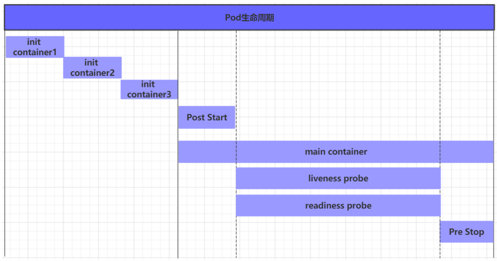

### 容器启动

1. pod 中的容器在创建前，有初始化容器（init container）来进行初始化环境
2. 初化完后，主容器（main container）开始启动
3. 主容器启动后，有一个 \*\*post start \*\*的操作（启动后的触发型操作，或者叫启动后钩子）
4. post start 后，就开始做健康检查
   1. 第一个健康检查叫存活状态检查（liveness probe），用来检查主容器存活状态的
   2. 第二个健康检查叫准备就绪检查（readiness probe），用来检查主容器是否启动就绪

### 容器终止

1. 可以在容器终止前设置 \*\*pre stop \*\*操作（终止前的触发型操作，或者叫终止前钩子）
2. 当出现特殊情况不能正常销毁 pod 时，大概等待 30 秒会强制终止
3. 终止容器后还可能会重启容器（视容器重启策略而定）。

### 重启策略

* Always：表示容器挂了总是重启，这是默认策略
* OnFailures：表示<font style="color:rgb(216,57,49);">容器异常退出（退出状态码非0）时</font>才重启（容器执行完任务，正常退出是不会重启的）
* Never：表示容器永不重启，即使是挂了也不重启
* 对于 Always 这种策略，容器只要挂了，就会立即重启，这样是很耗费资源的。所以 Always 重启策略是这么做的：第一次容器挂了立即重启，如果再挂了就要延时 10s 重启，第三次挂了就等 20s 重启...... 依次类推

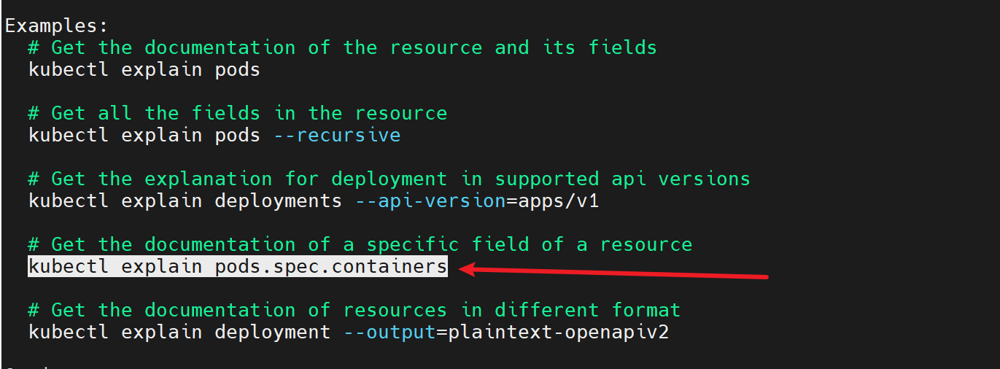

```shell
# 查看资源的某个具体字段
kubectl explain pods.spec.restartPolicy
```

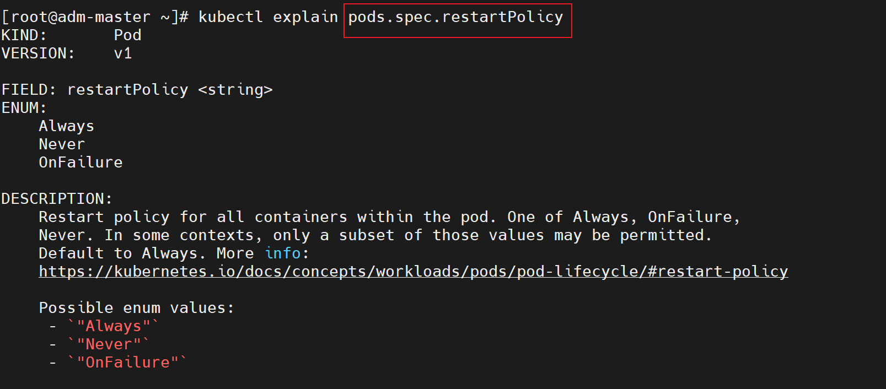

## HealthCheck 健康检查(重点)

当 Pod 启动时，容器可能会因为某种错误（服务未启动或端口不正确）而无法访问等。

kubelet（1.16+）拥有三个检测器，它们分别对应不同的触发器（根据触发器的结构执行进一步的动作）

### 三种探针

| **<font style="color:rgba(0, 0, 0, 0.9);">探针类型</font>** | **<font style="color:rgba(0, 0, 0, 0.9);">触发时机</font>** | **<font style="color:rgba(0, 0, 0, 0.9);">典型应用场景</font>** | **<font style="color:rgba(0, 0, 0, 0.9);">失败后果</font>** |
| :---: | :---: | :---: | :---: |
| <font style="color:rgba(0, 0, 0, 0.9);">startup Probe 启动探针</font> | <font style="color:rgba(0, 0, 0, 0.9);">容器启动阶段</font> | <font style="color:rgba(0, 0, 0, 0.9);">慢启动应用（如 Java 服务）</font> | <font style="color:rgba(0, 0, 0, 0.9);">阻止后续探针执行</font> |
| <font style="color:rgba(0, 0, 0, 0.9);">liveness Probe 存活探针</font> | <font style="color:rgba(0, 0, 0, 0.9);">运行周期内持续检查</font> | <font style="color:rgba(0, 0, 0, 0.9);">确保崩溃应用重启</font> | <font style="color:rgba(0, 0, 0, 0.9);">杀死并重启容器</font> |
| <font style="color:rgba(0, 0, 0, 0.9);">readiness Probe 就绪探针</font> | <font style="color:rgba(0, 0, 0, 0.9);">接收流量前及运行中定期检查</font> | <font style="color:rgba(0, 0, 0, 0.9);">服务预热/过载保护</font> | <font style="color:rgba(0, 0, 0, 0.9);">从 Service 端点移除</font> |

应用场景

\*\*startup Probe：\*\*保护慢初始化应用（比如 Java 服务），直到其完成启动再启用其他探针；

\*\*livenessProbe：\*\*适用于那些可能会因为各种原因（如程序死锁、资源耗尽等）而陷入非健康状态的容器，通过定期检测并重启容器来保证应用的可用性；

\*\*readinessProbe：\*\*常用于需要一定时间进行初始化的容器，确保在容器完全准备好处理请求之前（比如数据库连接），不会将流量导向该容器，避免客户端请求失败；

### 三种探测方式

| **方式** | **说明** |
| --- | --- |
| **Exec** | **执行(Execute)命令** |
| HTTPGet | http 请求某一个 URL 路径 |
| TCP | tcp 连接某一个端口 |

**补充知识**

涉及到计算机网络中的七层模型/四层模型

1、HTTP 是属于**应用层协议**；

2、TCP 是属于**传输层协议**。

> 应用层
>
> 表示层 应用层（整合） HTTP、FTP、SNMP
>
> 会话层
>
> **传输层 传输层 TCP**
>
> \*\*网络层 网络层 IP \*\*
>
> 链路层 物理链路层（整合）
>
> 物理层

### 案例1：liveness-exec

第一步：准备 YAML 文件

```yaml
[root@master ~]# vim pod-liveness-exec.yml
apiVersion: v1
kind: Pod
metadata:
  name: liveness-exec
  namespace: default
spec:
  containers:
  - name: liveness
    # BusyBox 是一个集成了一百多个最常用 Linux 命令和工具的软件包
    # 它把众多的 UNIX 工具集合到一个很小的可执行文件中，因此体积非常小巧。
    # 由于其包含了常见的 Linux 命令，在调试 Kubernetes 容器时非常有用。
    image: docker.1ms.run/busybox:1.37.0
    imagePullPolicy: IfNotPresent
    args:
    - /bin/sh
    - -c
    - touch /tmp/healthy; sleep 30; rm -rf /tmp/healthy; sleep 600
    livenessProbe:
      exec:
        command:
        - cat
        - /tmp/healthy
      initialDelaySeconds: 5 		# pod启动延迟5秒后探测
      periodSeconds: 5 		# 每5秒探测1次
```

第二步：应用 YAML 文件

```shell
[root@master ~]# kubectl apply -f pod-liveness-exec.yml
pod/liveness-exec created
```

第三步：查看 pod 的详细信息

```shell
[root@master ~]# kubectl describe pod | tail
  Type     Reason     Age                From               Message
  ----     ------     ----               ----               -------
  Normal   Scheduled  95s                default-scheduler  Successfully assigned default/liveness-exec to node2
  Normal   Pulling    95s                kubelet            Pulling image "docker.1ms.run/busybox:1.37.0"
  Normal   Pulled     88s                kubelet            Successfully pulled image "docker.1ms.run/busybox:1.37.0" in 7.058s (7.058s including waiting). Image size: 2224358 bytes.
  Warning  Unhealthy  45s (x3 over 55s)  kubelet            Liveness probe failed: cat: can't open '/tmp/healthy': No such file or directory
  Normal   Killing    45s                kubelet            Container liveness failed liveness probe, will be restarted
  Normal   Created    15s (x2 over 88s)  kubelet            Created container: liveness
  Normal   Started    15s (x2 over 88s)  kubelet            Started container liveness
  Normal   Pulled     15s                kubelet            Container image "docker.1ms.run/busybox:1.37.0" already present on machine
```

第四步：查看 pod 的信息，可以看到 pod 已经被重启过很多次了（因为存活探针检测不到对应的文件，所以就会重启 pod，重启后就回到原来的状态）

```shell
[root@master ~]# kubectl get pod liveness-exec -o wide
NAME            READY   STATUS    RESTARTS      AGE     IP            NODE    NOMINATED NODE   READINESS GATES
liveness-exec   1/1     Running   3 (45s ago)   4m36s   10.244.2.14   node2   <none>           <none>

# 看到重启3次,慢慢地重启间隔时间会越来越长（回退算法）
```

第五步：删除 pod

```shell
[root@master ~]# kubectl delete -f pod-liveness-exec.yml
pod "liveness-exec" deleted
```

### 案例2：liveness-httpget

第一步：编写 YMAL 文件

```yaml
[root@master ~]# vim pod-liveness-httpget.yml
apiVersion: v1
kind: Pod
metadata:
  name: liveness-httpget
spec:
  containers:
  - name: liveness
    image: docker.1ms.run/nginx:1.24.0
    imagePullPolicy: IfNotPresent
    ports:			# 指定容器端口，这一段不写也行，端口由镜像决定 
    - name: http		# 自定义名称，不需要与下面的port: http对应
      containerPort: 80	# 类似dockerfile里的expose 80
    livenessProbe:
      httpGet:                       # 使用httpGet方式
        port: 80                     # http协议,也可以直接写80端口
        path: /index.html            # 探测 nginx.conf 里 root 目录下的index.html（URI）
      initialDelaySeconds: 5         # 延迟5秒开始探测
      periodSeconds: 5               # 每隔5s钟探测一次
```

第二步：应用 YAML 文件

```shell
[root@master ~]# kubectl apply -f pod-liveness-httpget.yml
pod/liveness-httpget created
```

第三步：验证查看

```shell
[root@master ~]# kubectl get pod
NAME               READY   STATUS    RESTARTS   AGE
liveness-httpget   1/1     Running   0          21s
```

第四步：移动 Nginx 里的主页文件

```shell
[root@master ~]# kubectl exec -it liveness-httpget -- mv /usr/share/nginx/html/index.html /usr/share/nginx/html/index2.html
```

第五步：查看 pod 的详细信息

```shell
[root@master ~]# kubectl describe pod liveness-httpget | tail
                             node.kubernetes.io/unreachable:NoExecute op=Exists for 300s
Events:
  Type     Reason     Age                  From               Message
  ----     ------     ----                 ----               -------
  Normal   Scheduled  2m19s                default-scheduler  Successfully assigned default/liveness-httpget to node1
  Normal   Pulled     14s (x2 over 2m19s)  kubelet            Container image "docker.1ms.run/nginx:1.24.0" already present on machine
  Normal   Created    14s (x2 over 2m19s)  kubelet            Created container: liveness
  Normal   Started    14s (x2 over 2m18s)  kubelet            Started container liveness
  Warning  Unhealthy  14s (x3 over 24s)    kubelet            Liveness probe failed: HTTP probe failed with statuscode: 404
  Normal   Killing    14s                  kubelet            Container liveness failed liveness probe, will be restarted
```

```shell
[root@master ~]# kubectl get pod
NAME               READY   STATUS    RESTARTS      AGE
liveness-httpget   1/1     Running   1 (68s ago)   3m13s

只restart过一次，如果你再移动一次 index.html，会再次出发重启，次数就 +1
```

第六步：删除 pod

```shell
[root@master ~]# kubectl delete -f pod-liveness-httpget.yml
pod "liveness-httpget" deleted
```

> 其实可以总结，存活探针就是在每隔多长时间后，发出相应的动作去检测 pod 是否正常，如果不正常的话就会重启！重启后就回到 pod 最初正常的状态了。

### 案例3：liveness-tcp

第一步：编写 YAML 文件

```yaml
[root@master ~]# vim pod-liveness-tcp.yml
apiVersion: v1
kind: Pod
metadata:
  name: liveness-tcp
spec:
  containers:
  - name: liveness
    image: docker.1ms.run/nginx:1.24.0
    imagePullPolicy: IfNotPresent
    ports:
    - name: http
      containerPort: 80
    livenessProbe:
      tcpSocket:                        # 使用tcp连接方式
        port: 80                        # 连接80端口进行探测
      initialDelaySeconds: 5
      periodSeconds: 10
```

第二步：应用 YAML 文件创建 pod

```shell
[root@master ~]# kubectl apply -f pod-liveness-tcp.yml
pod/liveness-tcp created
```

第三步：查看验证，可以看到重启次数是 0，一切正常

```shell
[root@master ~]# kubectl get pod
NAME           READY   STATUS    RESTARTS   AGE
liveness-tcp   1/1     Running   0          33s
```

第四步：交互关闭 Nginx

```shell
[root@master ~]# kubectl exec -it liveness-tcp -- /usr/sbin/nginx -s stop
2026/01/11 11:37:30 [notice] 31#31: signal process started
```

第五步：再次验证查看，可以看到 pod 确实重启了，重启次数变为 1

```shell
[root@master ~]# kubectl get pod
NAME           READY   STATUS    RESTARTS     AGE
liveness-tcp   1/1     Running   1 (6s ago)   79s
```

第六步：删除 pod

```shell
[root@master ~]# kubectl delete -f pod-liveness-tcp.yml
pod "liveness-tcp" deleted
```

***

**总结**

1、Liveness 探测失败后，会\_\_\_\_；

2、重启后重新初始化了，容器里的数据会丢失；

### 案例4：readiness

第一步：编写 YAML 文件

```yaml
[root@master ~]# vim pod-readiness-httpget.yml
apiVersion: v1
kind: Pod
metadata:
  name: readiness-httpget
spec:
  containers:
  - name: readiness
    image: docker.1ms.run/nginx:1.24.0
    imagePullPolicy: IfNotPresent
    ports:
    - name: http
      containerPort: 80
    readinessProbe:                     # 这里由liveness换成了readiness
      httpGet:
        port: http
        path: /index.html
      initialDelaySeconds: 5
      periodSeconds: 10
```

```yaml
大驼峰和小驼峰和下划线的命名规则

【下划线】写法(Python风格)
	def fun_http_get():
		total_count = 0

【驼峰命名】写法(Java风格)
	public funHttpGet(int totalCount) {
		People person1 = new People();
	}
```

第二步：应用 YAML 文件

```shell
[root@master ~]# kubectl apply -f pod-readiness-httpget.yml
pod/readiness-httpget created
```

第三步：验证查看

```shell
[root@master ~]# kubectl get pod
NAME                READY   STATUS             RESTARTS   AGE
readiness-httpget   1/1     Running            0          10s
```

第四步：交互移走 Nginx 主页

```shell
[root@master ~]# kubectl exec -it readiness-httpget -- mv /usr/share/nginx/html/index.html /usr/share/nginx/html/index2.html
```

第五步：再次验证

```shell
[root@master ~]# kubectl get pod
NAME                READY   STATUS    RESTARTS   AGE
readiness-httpget   0/1     Running   0          2m49s

# READY状态为0/1
```

第六步：交互创建 nginx 主页文件再验证

```shell
[root@master ~]# kubectl exec -it readiness-httpget -- mv /usr/share/nginx/html/index2.html /usr/share/nginx/html/index.html
```

```shell
[root@master ~]# kubectl get pod
NAME                READY   STATUS             RESTARTS   AGE
readiness-httpget   1/1     Running            0          3m10s

# READY状态又为1/1了
```

也就是说就绪探针，如果检测到 pod 不正常，不会触发重启，只是将状态改为 notReady，等 pod 正常后，状态就是 Running。describe 展示的 Message 不会刷新。

### 案例5：readiness+liveness 综合

第一步：编写 YAML 文件

```yaml
[root@master ~]# vim pod-readiness-liveness.yml
apiVersion: v1
kind: Pod
metadata:
  name: readiness-liveness-httpget
spec:
  containers:
  - name: readiness-liveness
    image: docker.1ms.run/nginx:1.24.0
    imagePullPolicy: IfNotPresent
    ports:
    - name: http
      containerPort: 80
    livenessProbe:
      httpGet:
        port: http
        path: /index.html
      initialDelaySeconds: 10	# 时间我们适当拉大，为10s
      periodSeconds: 10
    readinessProbe:
      httpGet:
        port: http
        path: /index.html
      initialDelaySeconds: 10
      periodSeconds: 10
```

第二步：应用 YAML 文件

```shell
[root@master ~]# kubectl apply -f pod-readiness-liveness.yml
pod/readiness-liveness-httpget created
```

第三步：验证

```shell
[root@master ~]# kubectl get pod
```

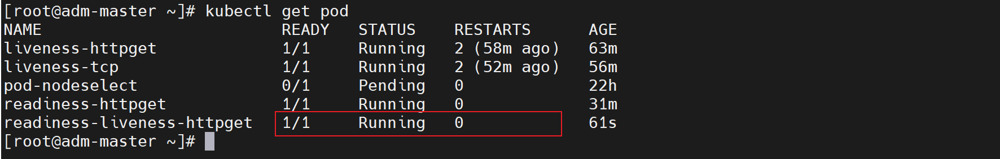

第四步：交互移走 Nginx 主页

```shell
[root@master ~]# kubectl exec -it readiness-liveness-httpget -- mv /usr/share/nginx/html/index.html /usr/share/nginx/html/index2.html
```

第五步：再次验证

```shell
[root@master ~]# kubectl get pod
NAME                READY   STATUS    RESTARTS   AGE
readiness-httpget   0/1     Running   1          2m49s

# READY状态为0/1，等个几秒钟，就会变为正常

[root@master ~]# kubectl get pod
NAME                READY   STATUS    RESTARTS   AGE
readiness-httpget   1/1     Running   1          2m49s
```

如果查看详细信息的话，也能够看出来，存活探针和就绪探针同时存在时，都会生效，但是最终存活探针检测到 pod 不正常，会重启！

## 钩子

钩子：也就是在容器启动后或者停止前会自动做一些事情。我们可以把在容器启动后和停止前要做的操作交给钩子！

### 启动后 post-start

第一步：编写 YAML 文件

```yaml
[root@master ~]# vim pod-poststart.yml
apiVersion: v1
kind: Pod
metadata:
  name: poststart
spec:
  containers:
  - name: poststart
    image: docker.1ms.run/nginx:1.24.0
    imagePullPolicy: IfNotPresent
    lifecycle:                                       # 生命周期事件
      postStart:
        exec:
          command: ["mkdir","-p","/usr/share/nginx/html/haha"]
```

第二步：应用 YMAL 文件

```shell
[root@master ~]# kubectl apply -f pod-poststart.yml
```

第三步：验证

```shell
[root@master ~]# kubectl get pods
NAME                         READY   STATUS             RESTARTS   AGE
poststart                    1/1     Running            0          25s
```

```shell
[root@master ~]# kubectl exec -it poststart -- ls /usr/share/nginx/html
# 有创建此目录
```

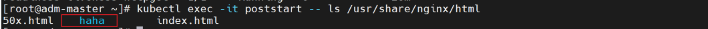

### 停止前 pre-stop

容器终止前自动执行一些操作。

第一步：编写 YAML 文件

```yaml
[root@master ~]# vim prestop.yml
apiVersion: v1
kind: Pod
metadata:
  name: prestop
spec:
  containers:
  - name: prestop
    image: docker.1ms.run/nginx:1.24.0
    imagePullPolicy: IfNotPresent
    lifecycle:                                       # 生命周期事件
      preStop:                                       # preStop
        exec:
          command: ["/bin/sh","-c","sleep 6000"]     # 容器终止前sleep 6000秒
```

大驼峰写法：ReadinessProbeHttpGet

小驼峰写法：readinessProbeHttpGet

第二步：应用 YAML 文件创建 pod

```shell
[root@master ~]# kubectl apply -f prestop.yml
pod/prestop created
```

第三步：删除 pod 验证

```shell
[root@master ~]# kubectl delete -f prestop.yml
# 会在这一步等待一定的时间(大概30s-60s左右)才能删除,说明验证成功
```

**结论:** 当出现特殊情况不能正常销毁 pod 时，大概等待 30 秒会强制终止

## 总结

1、initContainer 初始化容器【了解】

kubectl <font style="color:rgb(216,57,49);">explain </font>pod 查询Yaml参数

2、mainContainer 主容器

1、Post-Start

2、健康检查 Health Check | 探针 Probe【重点】

1、LivenessProbe 失败时，会重启

2、ReadinessProbe 失败时，会标记NotReady

3、StartupProbe

3、Pre-Stop

3、Probe 的探测方式

1、Exec 运行

2、HTTP-Get

3、TCP

# 三、补充：故障排查

## pod 故障排除

| 状态 | 描述 |
| :--- | :--- |
| <font style="color:rgb(216,57,49);">Pending</font><br/><font style="color:rgb(216,57,49);">待定、挂起</font> | pod 创建已经提交到 Kubernetes。但是，因为某种原因而不能顺利创建。例如下载镜像慢，调度不成功。 |
| Running<br/>运行 | pod 已经绑定到一个节点，并且已经创建了所有容器。至少有一个容器正在运行中，或正在启动或重新启动。 |
| Completed<br/>完成 | Pod 中的所有容器都已成功终止。 |
| Failed<br/>失败 | Pod 的所有容器均已终止，且至少有一个容器已在故障中终止。也就是说，容器要么**以非零状态**退出，要么被系统终止。 |
| Unknown<br/>未知 | 由于某种原因 apiserver 无法获得 Pod 的状态，通常是由于 Master 与 Pod 所在主机 kubelet 通信时出错。 |
| <font style="color:rgb(216,57,49);">CrashLoopBackOff</font><br/><font style="color:rgb(216,57,49);">循环重启挂断</font> | 多见于 CMD 语句错误或者找不到 container 入口语句导致了快速退出，可以用 kubectl logs 查看日志进行排错 |

在早期编程当中，采用二进制编程，同时为了节省内存，使用 0/1 作标记；

因此，在 C 语言编程中，使用 return 0; 表示函数正常退出。因此，非零状态，我们通常认为失败或产生异常了。

## 命令帮助

```shell
kubectl apply -f 文件名
kubectl delete -f 文件名

kubectl describe pod pod名
# kubectl describe pod poststart

# 查看日志
kubectl logs pod  [-c CONTAINER]
# kubectl logs -n dev nginx-58d64b47ff-2j4zx
# kubectl logs -n dev nginx-58d64b47ff-2j4zx -f 不挂断

kubectl exec POD [-c CONTAINER] -- COMMAND [args...]
# kubectl exec -n default poststart -- cat /etc/hosts
```


> 更新: 2026-01-19 14:45:39  
> 原文: <https://www.yuque.com/u41736172/az9urv/mg9dibwf4vtlce6y>