# 05.Controller控制器与Service服务

Controller 控制器就是用来管理和维护 pod 的；

Service 服务：在集群外部访问 pod 的话，可以通过访问 service 来访问到相应的 pod。

# 一、Controller 控制器

## 为什么需要 Controller 控制器

Pod

最基本的运行单元，就是容器的壳子。

但 Pod 是一次性资源：如果它崩溃或被删除，不会自动重建。

所以需要一种机制来保证 Pod 持续存在、数量正确。

***

在 K8S 中，Controller 用于管理和维护 Pod。比如：

* 创建、删除和调度Pod；
* 应用部署升级、版本回退、故障修复；
* 任务执行与调度。

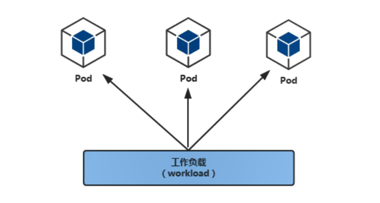

## Controller 控制器分类

控制器主要分为：

1、ReplicationController(相当于 ReplicaSet 的老版本，现在建议使用 Deployments 加 ReplicaSet 替代 RC)

这是早期 Kubernetes 中提供的机制，它有两个核心功能：① 保证集群中 始终运行 N 个副本的 Pod  ② 当某个 Pod 崩溃/删除后，RC 会自动拉起新的 Pod

2、**<font style="color:#DF2A3F;">ReplicaSet</font>**<font style="color:#DF2A3F;"> </font>副本集，控制 pod 扩容、裁减

这是 RC 的增强版本：支持更强大的标签选择器(LabelSelector)，支持被 Deployment 控制

3、**<font style="color:#DF2A3F;">Deployment</font>**<font style="color:#DF2A3F;"> </font>控制 pod 升级、回退

这是目前推荐使用的"控制器之王"：本质上就是 Deployment 控制 ReplicaSet，ReplicaSet 控制 Pod

4、**<font style="color:#DF2A3F;">StatefulSet</font>**<font style="color:#DF2A3F;"> </font>部署有状态的 pod 应用

5、DaemonSet 保证 Pod 运行在所有集群节点(包括master)，适合 filebeat、node\_exporter

6、Jobs 一次性

7、Cronjob 周期性

> 红色标记的是我们要掌握的

```shell
常见的使用场景
Replicaset：通常不直接用于管理应用，而是作为Deployment等更高层次控制器的底层实现，用于管理 Pod的副本数量.

Deployments：广泛应用于各种无状态应用的部署和更新，支持滚动升级、回滚等功能，方便版本管理和维护。例如，部署web应用、微服务等。
StatefulSet：为每个Pod分配一个唯一的标识符和稳定的网络域名，并且可以挂载独立的存储卷。适用于需要保持状态的应用，如数据库、消息队列等。比如部署MysQL集群、Zookeeper集群等。

Daemonset：部署一些需要在每个节点上都运行的组件或工具，如日志收集工具filebeat、监控代理node_exporter等，以便收集节点信息或下发任务。

cronjob：常用于定时任务，如定时数据同步、定时报表生成等
```

# 二、Deployment & ReplicaSet

**Deployment 控制器的功能：**

* Deployment 集成了上线部署、滚动升级、创建副本、回滚等功能。
* Deployment 里包含并使用了 ReplicaSet

**ReplicaSet 控制器的功能：**

* 支持新的基于集合的 selector(以前的 rc 里没有这种功能)
* 通过改变 Pod 副本数量实现 Pod 的扩容和缩容

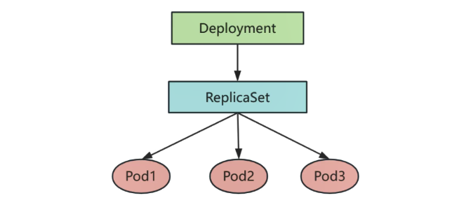

**Deployment 用于部署无状态应用：**

无状态应用的特点:

* 所有 pod 无差别
* 所有 pod 中容器运行同一个 image
* 所有 pod 可以运行在集群中任意 node 上
* 所有 pod 无启动顺序先后之分
* 随意 pod 数量扩容或缩容
* 例如简单运行一个静态 web 程序

## 生命周期管理

### 创建 Deployment

<font style="color:#DF2A3F;">方法一：命令式创建</font>

第一步：创建一个名为 nginx1 的 deployment

```shell
[root@master ~]# kubectl create deployment nginx1 --image=docker.1ms.run/nginx:1.24.0 --replicas=3 --dry-run=client
deployment.apps/nginx1 created (dry run)
```

说明：

* \--dry-run=client 表示仅在客户端模拟创建，不将资源实际提交到 kubernetes 集群，可用于预览配置（**测试使用，并没有真正创建 pod**）
* \--replicas=3 表示创建 3 个副本

```shell
[root@master ~]# kubectl create deployment nginx1 --image=docker.1ms.run/nginx:1.24.0 --replicas=3
deployment.apps/nginx1 created
```

第二步：验证

```shell
[root@master ~]# kubectl get deployment
NAME     READY   UP-TO-DATE   AVAILABLE   AGE
nginx1   3/3     3            3           16s

或者

[root@master ~]# kubectl get deploy
NAME     READY   UP-TO-DATE   AVAILABLE   AGE
nginx1   3/3     3            3           36s
```

```shell
[root@master ~]# kubectl get pod -o wide
NAME                     READY   STATUS    RESTARTS   AGE   IP            NODE    NOMINATED NODE   READINESS GATES
nginx1-7d69f4597-4f2sb   1/1     Running   0          57s   10.244.1.28   node1   <none>           <none>
nginx1-7d69f4597-rlkt8   1/1     Running   0          57s   10.244.1.27   node1   <none>           <none>
nginx1-7d69f4597-xzhns   1/1     Running   0          57s   10.244.2.16   node2   <none>           <none>
```

第三步：描述 deployment 和 pod 相关信息（如果报错的话，就通过这种方式查看）

```shell
[root@master ~]# kubectl describe deployment nginx1

[root@master ~]# kubectl describe pod nginx1-7d69f4597-4f2sb
```

***

**<font style="color:#DF2A3F;">方式二：yaml 文件创建</font>**

第一步：准备 yaml 文件

```yaml
# 通过k8s yaml创建一个deployment，名称为nginx2，副本数量为3，拉取镜像为docker.1ms.run/nginx:1.24.0，暴露端口80
# vim nginx2-deployment.yml
apiVersion: apps/v1
kind: Deployment
metadata:
  name: nginx2		# deployment名称
spec:
  replicas: 3			# 副本集，deployment中使用了replicaset
  selector:
    matchLabels:	# 匹配的pod标签
      app: nginx	# 确定哪些pod归当前这个deployment(以及其背后的replicaset)管理和控制
  template:				# 代表pod的配置模板
    metadata:
      labels:
        app: nginx	# pod的标签
    spec:
      containers:
        - name: nginx
          image: docker.1ms.run/nginx:1.24.0
          imagePullPolicy: IfNotPresent
          ports:
            - containerPort: 80
            
说明：
app: nginx 标签(标记)
deloyment控制器用于管理pod，理论上一个控制器可以管理一堆pod，但是具体哪些pod我可以管理呢?
答:使用label标签获取要管理的pod
第11行,app: nginx属于控制器，用于获取要管理的pod
第15行,app: nginx属于pod,用于给每个生成的pod一个label标签
```

问题：这个 yaml 文件怎么来的？

回答：

① 从 k8s 官方文档获取（提供了参考模板）=> [https://kubernetes.io/zh-cn/docs/home/](about:blank)

② 使用 k8s yaml 可视化生成工具 => [https://k8syaml.com](about:blank)

③ 使用 VSCode 在线生成 k8s 的 yaml 文件，但是需要在 VSCode 中提前安装以下插件：（注意，现在还不是用 AI）

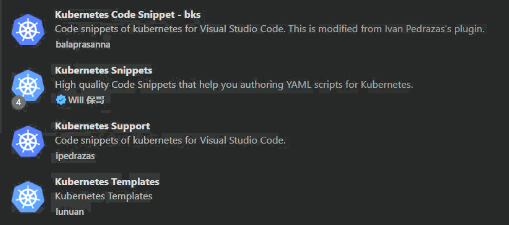

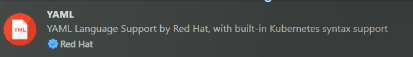

④ 通过 VSCode 中的 AI 大模型帮我们生成（写上注释帮我们生成）

第二步：应用 yaml 文件创建 deployment

```yaml
[root@master ~]# kubectl apply -f nginx2-deployment.yml
deployment.apps/nginx2 created
```

第三步：查看 Deployment

```yaml
[root@master ~]# kubectl get deploy
NAME     READY   UP-TO-DATE   AVAILABLE   AGE
nginx1   3/3     3            3           3m52s
nginx2   3/3     3            3           12s

[root@master ~]# kubectl get pod
NAME                      READY   STATUS    RESTARTS   AGE
nginx1-7d69f4597-4f2sb    1/1     Running   0          4m7s
nginx1-7d69f4597-rlkt8    1/1     Running   0          4m7s
nginx1-7d69f4597-xzhns    1/1     Running   0          4m7s
nginx2-788d75b68c-56kkb   1/1     Running   0          28s
nginx2-788d75b68c-78lxb   1/1     Running   0          28s
nginx2-788d75b68c-tb7nn   1/1     Running   0          28s

[root@master ~]# kubectl get pod -o wide
NAME                      READY   STATUS    RESTARTS   AGE     IP            NODE    NOMINATED NODE   READINESS GATES
nginx1-7d69f4597-4f2sb    1/1     Running   0          4m27s   10.244.1.28   node1   <none>           <none>
nginx1-7d69f4597-rlkt8    1/1     Running   0          4m27s   10.244.1.27   node1   <none>           <none>
nginx1-7d69f4597-xzhns    1/1     Running   0          4m27s   10.244.2.16   node2   <none>           <none>
nginx2-788d75b68c-56kkb   1/1     Running   0          48s     10.244.2.18   node2   <none>           <none>
nginx2-788d75b68c-78lxb   1/1     Running   0          48s     10.244.1.29   node1   <none>           <none>
nginx2-788d75b68c-tb7nn   1/1     Running   0          48s     10.244.2.17   node2   <none>           <none>
```

> 因为 yaml 中没有指定命名空间，所以用的都是 default 默认的命名空间。

### 访问 Deployment 中的 Pod

第一步：查看 pod 的 ip 地址

```yaml
[root@master ~]# kubectl get pod -o wide | grep nginx2
nginx2-788d75b68c-56kkb   1/1     Running   0          81s   10.244.2.18   node2   <none>           <none>
nginx2-788d75b68c-78lxb   1/1     Running   0          81s   10.244.1.29   node1   <none>           <none>
nginx2-788d75b68c-tb7nn   1/1     Running   0          81s   10.244.2.17   node2   <none>           <none>

# 可以看到对应的IP
```

第二步：在任意集群节点上都可以访问 nginx2 的 3 个 Pod

```yaml
[root@master ~]# curl http://10.244.2.18
<!DOCTYPE html>
<html>
<head>
<title>Welcome to nginx!</title>
<style>
html { color-scheme: light dark; }
body { width: 35em; margin: 0 auto;
font-family: Tahoma, Verdana, Arial, sans-serif; }
</style>
</head>
<body>
<h1>Welcome to nginx!</h1>
<p>If you see this page, the nginx web server is successfully installed and
working. Further configuration is required.</p>

<p>For online documentation and support please refer to
<a href="http://nginx.org/">nginx.org</a>.<br/>
Commercial support is available at
<a href="http://nginx.com/">nginx.com</a>.</p>

<p><em>Thank you for using nginx.</em></p>
</body>
</html>

结果是任意集群节点都可以访问这两个pod，但集群外部是不能访问的
```

```yaml
# 进入到容器内部
[root@master ~]# kubectl exec -it nginx2-788d75b68c-56kkb -- /bin/sh

注意：
-- 是分隔符，告诉kubectl，后面的操作不再是给kubectl的，而是给容器里要执行的命令的
之前容器大多数都是使用/bin/bash，为什么k8s中的pod大部分要使用/bin/sh?
答：如果是完整镜像，通常都是使用/bin/bash，但是不具备通用性(有一些精简镜像，可能开没有封装/bin/bash);但是/bin/sh几乎所有的镜像都可以使用。

# 修改容器中nginx的首页
echo helloworld > /usr/share/nginx/html/index.html

# 退出容器
exit

# 再次在集群节点内访问pod
[root@master ~]# curl http://10.244.2.18
helloworld
```

### 删除 Deployment 中的 pod

注意：是删除 Deployment 中的 pod，不是删除自主式创建的 pod。

第一步：删除 nginx2 的 pod

```yaml
# 查看pod
[root@master ~]# kubectl get pod | grep nginx2
nginx2-788d75b68c-56kkb   1/1     Running   0          5m58s
nginx2-788d75b68c-78lxb   1/1     Running   0          5m58s
nginx2-788d75b68c-tb7nn   1/1     Running   0          5m58s

# 删除某个pod
[root@master ~]# kubectl delete pod nginx2-788d75b68c-56kkb
pod "nginx2-788d75b68c-56kkb" deleted
```

第二步：再次查看，发现又重新启动了一个 pod（节点可能由 node2 转为 node1，IP 地址也变化了）

```yaml
[root@master ~]# kubectl get pod -o wide | grep nginx2
nginx2-788d75b68c-78lxb   1/1     Running   0        7m23s   10.244.1.29   node1   <none>           <none>
nginx2-788d75b68c-tb7nn   1/1     Running   0        7m23s   10.244.2.17   node2   <none>           <none>
nginx2-788d75b68c-wmwb5   1/1     Running   0        56s     10.244.2.19   node2   <none>           <none>
```

也就是说 pod 的 IP 不是固定的，比如把整个集群关闭再启动，pod 也会自动启动，但是 IP 地址还是变化了。

> 如果我们通过命令行直接创建的 pod，那么 pod 删除就删除了；
>
> 如果通过 Deployment 控制器创建的 pod，那么如果一个 pod 被删除，Deployment 会立即创建一个一样的 pod，要保证副本数正确。

\[ 引子 ]

既然 pod 的 IP 地址不是固定的，所以需要一个固定的访问 endpoint 给用户，那么这种方式就是 Service。

### 删除 Deployment

第一步：通过命令的方式删除

```yaml
kubectl delete deployment 名字
```

如果使用 `kubectl delete deployment nginx2`命令删除 deployment，那么里面的 pod 也会被自动删除。

第二步：也可以通过 yaml 文件的方式删除

```yaml
[root@master ~]# kubectl delete -f nginx2-deployment.yml
deployment.apps "nginx2" deleted

根据文件删除，其实就是将当时根据文件创建出来的东西都给删除掉！
```

> 最后，我们将上面的名字是 nginx1 的 deployment 也给删除吧：
>
> `kubectl delete deployment nginx1`

### 问题总结

所有的 pod 都是 Pending 状态：1. 可能是 pod 镜像没有拉取下来 2. 可能是 node 节点调度不成功，比如没有合适的 node 节点。

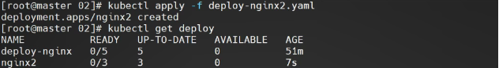

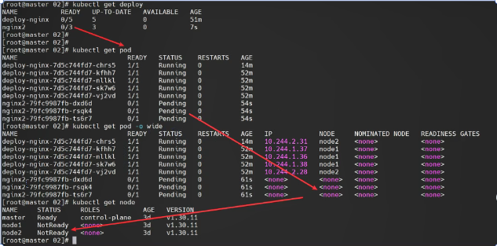

拉起 node 节点就可以了。

## 版本控制【重点】

Deployment 通过更新 Pod 模板来实现版本升级。

1、当修改 Deployment 中定义的 Pod 模板（如更新容器镜像版本）时，

2、Deployment 会创建一个新的 ReplicaSet 来管理新版本的 Pod，

3、同时逐步减少旧的 ReplicaSet 中的 Pod 数量

这个过程通常采用滚动更新的方式，以确保服务的连续性。

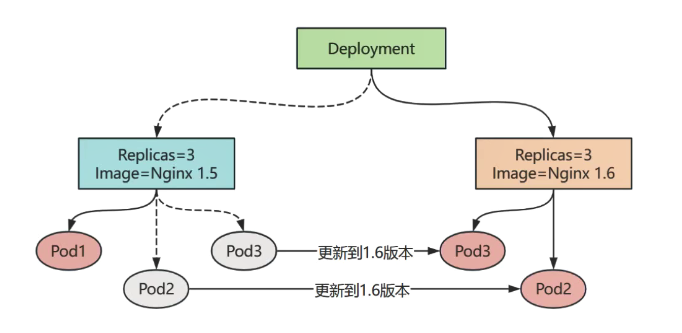

### 升级

```shell
# 查看帮助
kubectl set image --help

# 具体语法
kubectl set image deployment nginx2 nginx=nginx:1.16-alpine
```

第一步：根据之前的 nginx2-deployment.yml 文件创建资源

```shell
[root@master ~]# kubectl apply -f nginx2-deployment.yml
deployment.apps/nginx2 created

[root@master ~]# kubectl get pod
NAME                      READY   STATUS    RESTARTS   AGE
nginx2-788d75b68c-qxwfw   1/1     Running   0          14s
nginx2-788d75b68c-sdrpq   1/1     Running   0          14s
nginx2-788d75b68c-t82lr   1/1     Running   0          14s
```

第二步：升级前验证 Nginx 版本

```shell
[root@master ~]# kubectl describe pod nginx2-788d75b68c-qxwfw | grep -i image
    Image:          docker.1ms.run/nginx:1.24.0
    Image ID:       docker.1ms.run/nginx@sha256:f6daac2445b0ce70e64d77442ccf62839f3f1b4c24bf6746a857eff014e798c8
  Normal  Pulled     54s   kubelet            Container image "docker.1ms.run/nginx:1.24.0" already present on machine
```

```shell
[root@master ~]# kubectl exec nginx2-788d75b68c-qxwfw -- nginx -v
nginx version: nginx/1.24.0
```

第三步：升级为 1.27 版本

```shell
[root@master ~]# kubectl set image deployment nginx2 nginx=docker.1ms.run/nginx:1.27.0 --record
Flag --record has been deprecated, --record will be removed in the future
deployment.apps/nginx2 image updated

加上--record会记录升级的版本信息到数据库中
```

说明：

* deployment nginx2 代表名为 nginx2 的 deployment
* nginx=docker.1ms.run/nginx:1.27.0 前面的 nginx 为容器名

容器名怎么查看

```shell
kubectl describe pod pod名

kubectl edit deployment deployment名

kubectl get deployment deployment名 -o yaml
```

第四步：验证更新的结果

```shell
# 查看deploy的实时滚动更新情况，如果已完成，将会直接提示成功展开
[root@master ~]# kubectl rollout status deployment nginx2
Waiting for deployment "nginx2" rollout to finish: 1 out of 3 new replicas have been updated...
Waiting for deployment "nginx2" rollout to finish: 1 out of 3 new replicas have been updated...
Waiting for deployment "nginx2" rollout to finish: 1 out of 3 new replicas have been updated...
Waiting for deployment "nginx2" rollout to finish: 2 out of 3 new replicas have been updated...
Waiting for deployment "nginx2" rollout to finish: 2 out of 3 new replicas have been updated...
Waiting for deployment "nginx2" rollout to finish: 2 out of 3 new replicas have been updated...
Waiting for deployment "nginx2" rollout to finish: 1 old replicas are pending termination...
Waiting for deployment "nginx2" rollout to finish: 1 old replicas are pending termination...
deployment "nginx2" successfully rolled out

确实可以看到deployment是滚动更新的.

# 查看pod运行情况
[root@master ~]# kubectl get pod
NAME                      READY   STATUS    RESTARTS   AGE
nginx2-687f855566-gqz8h   1/1     Running   0          2m19s
nginx2-687f855566-pzbhv   1/1     Running   0          38s
nginx2-687f855566-qncp6   1/1     Running   0          88s

# 查看镜像版本
[root@master ~]# kubectl describe pod nginx2-687f855566-gqz8h | grep -i image
    Image:          docker.1ms.run/nginx:1.27.0
    Image ID:       docker.1ms.run/nginx@sha256:98f8ec75657d21b924fe4f69b6b9bff2f6550ea48838af479d8894a852000e40
  Normal  Pulling    2m55s  kubelet            Pulling image "docker.1ms.run/nginx:1.27.0"
  Normal  Pulled     2m5s   kubelet            Successfully pulled image "docker.1ms.run/nginx:1.27.0" in 50.04s (50.04s including waiting). Image size: 70985469 bytes.


# 查看Nginx版本
[root@master ~]# kubectl exec nginx2-687f855566-gqz8h -- nginx -v
nginx version: nginx/1.27.0
```

练习：

大家可以将 nginx 给升级到 1.28.0 版本，这次升级的时候，加上 --record，这样就会记录升级的信息到数据库。便于后期的回退！

```shell
# 升级nginx到1.28.0版本
[root@master ~]# kubectl set image deployment nginx2 nginx=docker.1ms.run/nginx:1.28.0 --record
Flag --record has been deprecated, --record will be removed in the future
deployment.apps/nginx2 image updated

# 查看deploy的实时滚动更新情况，如果已完成，将会直接提示成功展开
[root@master ~]# kubectl rollout status deployment nginx2

# 查看pod信息
[root@master ~]# kubectl get pod
NAME                      READY   STATUS    RESTARTS   AGE
nginx2-5488cc7479-b2h7c   1/1     Running   0          2m8s
nginx2-5488cc7479-cm9ms   1/1     Running   0          23s
nginx2-5488cc7479-q4xws   1/1     Running   0          72s

# 查看镜像版本
[root@master ~]# kubectl describe pod nginx2-5488cc7479-b2h7c | grep Image
    Image:          docker.1ms.run/nginx:1.28.0
    Image ID:       docker.1ms.run/nginx@sha256:552e7481ca93ffccd046aa658dbbed22caefbc09c66fa7cd247cbb90b8a5c609
  Normal  Pulled     104s   kubelet            Successfully pulled image "docker.1ms.run/nginx:1.28.0" in 54.517s (54.517s including waiting). Image size: 72407705 bytes.

# 查看Nginx版本
[root@master ~]# kubectl exec nginx2-5488cc7479-b2h7c -- nginx -v
nginx version: nginx/1.28.0
```

### 回退

回退：就是指升级之后发现不是很好用，想回到之前的版本。

```shell
# 查看帮助
kubectl rollout undo --help

# 具体用法
kubectl rollout undo deployment nginx2 --to-revision=3

如果之前升级的时候使用了--record，那么就会记录一个版本号，--to-revision=3表示回退到3号版本
```

第一步：查看版本历史信息

```shell
[root@master ~]# kubectl rollout history deployment nginx2
deployment.apps/nginx2
REVISION  CHANGE-CAUSE
1         <none>
2         kubectl set image deployment nginx2 nginx=docker.1ms.run/nginx:1.27.0 --record=true
3         kubectl set image deployment nginx2 nginx=docker.1ms.run/nginx:1.28.0 --record=true


第1个版本为none，其它升级时加了 --record 就会有记录，否则也为none
目前我们的版本在3号，可以回退到2号和1号
```

第二步：查看要回退的版本（还需要执行才是真的回退版本）

```shell
# 查看指定版本号的信息，仅仅是查看，还不回退呢
[root@master ~]# kubectl rollout history deployment nginx2 --revision=1
deployment.apps/nginx2 with revision #1
Pod Template:
  Labels:       app=nginx
        pod-template-hash=788d75b68c
  Containers:
   nginx:
    Image:      docker.1ms.run/nginx:1.24.0
    Port:       80/TCP
    Host Port:  0/TCP
    Environment:        <none>
    Mounts:     <none>
  Volumes:      <none>
  Node-Selectors:       <none>
  Tolerations:  <none>
```

第三步：执行回退

```shell
# 回退到版本号是1的阶段
[root@master ~]# kubectl rollout undo deployment nginx2 --to-revision=1
deployment.apps/nginx2 rolled back
```

第四步：验证

```shell
# 回到了指定版本后，但revision的ID变了，原来的ID消失，刷新成新的ID
[root@master ~]# kubectl rollout history deployment nginx2
deployment.apps/nginx2
REVISION  CHANGE-CAUSE
2         kubectl set image deployment nginx2 nginx=docker.1ms.run/nginx:1.27.0 --record=true
3         kubectl set image deployment nginx2 nginx=docker.1ms.run/nginx:1.28.0 --record=true
4         <none>

可以看到回退完成后，最新的编号就是4号，之前的1号会消失。
```

```shell
# 查看pod
[root@master ~]# kubectl get pods
NAME                      READY   STATUS    RESTARTS   AGE
nginx2-788d75b68c-2962s   1/1     Running   0          100s
nginx2-788d75b68c-b29jw   1/1     Running   0          102s
nginx2-788d75b68c-dcsft   1/1     Running   0          101s

# 查看pod的image信息
[root@master ~]# kubectl describe pod nginx2-788d75b68c-2962s | grep -i image
    Image:          docker.1ms.run/nginx:1.24.0
    Image ID:       docker.1ms.run/nginx@sha256:f6daac2445b0ce70e64d77442ccf62839f3f1b4c24bf6746a857eff014e798c8
  Normal  Pulled     2m2s  kubelet            Container image "docker.1ms.run/nginx:1.24.0" already present on machine
```

```shell
# 执行容器中的查看版本命令
[root@master ~]# kubectl exec nginx2-788d75b68c-2962s -- nginx -v
nginx version: nginx/1.24.0
```

### 问题总结

命令创建的 deployment，没有 deployment 文件，怎么删除？

直接删除 deployment 就可以了。`kubectl delete deployment deployment名字`

## ReplicaSet 副本管理【重点】

### 扩容

当我们 Deployment 管理的 pod 节点不够用时，我们可以扩容 pod 节点，Deployment 通过 ReplicaSet 进行扩容！

```shell
# 查看帮助
kubectl scale -h

# 具体用法
方式一： kubectl scale deployment nginx2 --replicas=2
方式二： kubectl edit deploy 编辑replicas，保存退出
```

背景介绍

1 scale 比较简单直接，便于脚本自动化

2 edit 方式需要打开、编辑、再保存。操作步骤较多，但是好处是，可以同时修改其他参数

第一步：扩容为 4 个副本

```shell
# 先查看下目前的pod有几个
[root@master ~]# kubectl get pod
NAME                      READY   STATUS    RESTARTS   AGE
nginx2-788d75b68c-2962s   1/1     Running   0          13m
nginx2-788d75b68c-b29jw   1/1     Running   0          13m
nginx2-788d75b68c-dcsft   1/1     Running   0          13m

# 扩容pod副本为4个
[root@master ~]# kubectl scale deployment nginx2 --replicas=4
deployment.apps/nginx2 scaled
```

第二步：查看

```shell
[root@master ~]# kubectl get pods -o wide
NAME                      READY   STATUS    RESTARTS   AGE   IP            NODE    NOMINATED NODE   READINESS GATES
nginx2-788d75b68c-2962s   1/1     Running   0          14m   10.244.2.27   node2   <none>           <none>
nginx2-788d75b68c-b29jw   1/1     Running   0          14m   10.244.2.26   node2   <none>           <none>
nginx2-788d75b68c-b74j8   1/1     Running   0          13s   10.244.1.40   node1   <none>           <none>
nginx2-788d75b68c-dcsft   1/1     Running   0          14m   10.244.1.39   node1   <none>           <none>
```

第三步：继续扩容

```shell
[root@master ~]# kubectl scale deployment nginx2 --replicas=6
deployment.apps/nginx2 scaled

[root@master ~]# kubectl get pods -o wide
NAME                      READY   STATUS    RESTARTS   AGE   IP            NODE    NOMINATED NODE   READINESS GATES
nginx2-788d75b68c-2962s   1/1     Running   0          15m   10.244.2.27   node2   <none>           <none>
nginx2-788d75b68c-2v2cc   1/1     Running   0          13s   10.244.1.41   node1   <none>           <none>
nginx2-788d75b68c-2zqxb   1/1     Running   0          13s   10.244.2.28   node2   <none>           <none>
nginx2-788d75b68c-b29jw   1/1     Running   0          15m   10.244.2.26   node2   <none>           <none>
nginx2-788d75b68c-b74j8   1/1     Running   0          72s   10.244.1.40   node1   <none>           <none>
nginx2-788d75b68c-dcsft   1/1     Running   0          15m   10.244.1.39   node1   <none>           <none>
```

### 裁剪

裁剪就是当我们的副本过多后，我们可以去掉几个。其实和扩容道理一样！用法也一样！

```shell
# 缩减为1个
[root@master ~]# kubectl scale deployment nginx2 --replicas=1
deployment.apps/nginx2 scaled

# 查看验证
[root@master ~]# kubectl get pod -o wide
NAME                      READY   STATUS    RESTARTS   AGE   IP            NODE    NOMINATED NODE   READINESS GATES
nginx2-788d75b68c-b29jw   1/1     Running   0          19m   10.244.2.26   node2   <none>           <none>

# 再次扩容为3个，使用编辑在线的yaml文件方式
[root@master ~]# kubectl edit deployment nginx2
deployment.apps/nginx2 edited

# 查看验证
[root@master ~]# kubectl get pod -o wide
NAME                      READY   STATUS    RESTARTS   AGE   IP            NODE    NOMINATED NODE   READINESS GATES
nginx2-788d75b68c-b29jw   1/1     Running   0          20m   10.244.2.26   node2   <none>           <none>
nginx2-788d75b68c-hdnkn   1/1     Running   0          29s   10.244.2.29   node2   <none>           <none>
nginx2-788d75b68c-qtwpj   1/1     Running   0          29s   10.244.1.42   node1   <none>           <none>
```

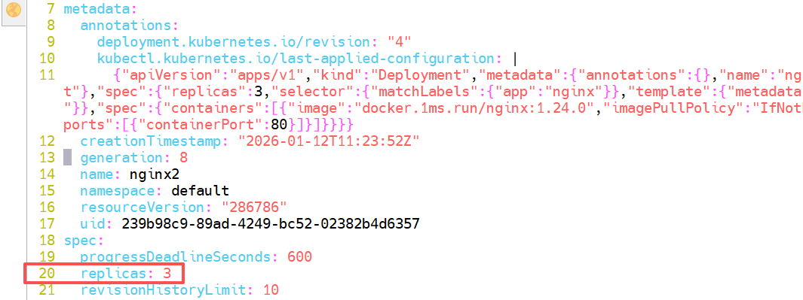

### 多副本滚动更新

第一步：先扩容多个副本

```shell
[root@master ~]# kubectl scale deployment nginx2 --replicas=10
deployment.apps/nginx2 scaled
```

第二步：验证

```shell
[root@master ~]# kubectl get pods
NAME                      READY   STATUS    RESTARTS   AGE
nginx2-788d75b68c-25tcp   1/1     Running   0          9s
nginx2-788d75b68c-4w86h   1/1     Running   0          9s
nginx2-788d75b68c-84tdj   1/1     Running   0          9s
nginx2-788d75b68c-8m7tp   1/1     Running   0          9s
nginx2-788d75b68c-b29jw   1/1     Running   0          39m
nginx2-788d75b68c-fws6l   1/1     Running   0          9s
nginx2-788d75b68c-hdnkn   1/1     Running   0          18m
nginx2-788d75b68c-qtwpj   1/1     Running   0          18m
nginx2-788d75b68c-rtpjk   1/1     Running   0          9s
nginx2-788d75b68c-zj9wz   1/1     Running   0          9s
```

第三步：滚动更新

```shell
[root@master ~]# kubectl set image deployment nginx2 nginx=docker.1ms.run/nginx:1.28.0 --record
Flag --record has been deprecated, --record will be removed in the future
deployment.apps/nginx2 image updated
```

第四步：验证，确实可以看到滚动更新的效果，pod 在一点点的更新到新版本

```shell
[root@master ~]# kubectl rollout status deployment nginx2
Waiting for deployment "nginx2" rollout to finish: 5 out of 10 new replicas have been updated...
Waiting for deployment "nginx2" rollout to finish: 5 out of 10 new replicas have been updated...
Waiting for deployment "nginx2" rollout to finish: 6 out of 10 new replicas have been updated...
Waiting for deployment "nginx2" rollout to finish: 6 out of 10 new replicas have been updated...
Waiting for deployment "nginx2" rollout to finish: 6 out of 10 new replicas have been updated...
Waiting for deployment "nginx2" rollout to finish: 6 out of 10 new replicas have been updated...
Waiting for deployment "nginx2" rollout to finish: 7 out of 10 new replicas have been updated...
Waiting for deployment "nginx2" rollout to finish: 7 out of 10 new replicas have been updated...
Waiting for deployment "nginx2" rollout to finish: 7 out of 10 new replicas have been updated...
Waiting for deployment "nginx2" rollout to finish: 8 out of 10 new replicas have been updated...
Waiting for deployment "nginx2" rollout to finish: 8 out of 10 new replicas have been updated...
Waiting for deployment "nginx2" rollout to finish: 8 out of 10 new replicas have been updated...
Waiting for deployment "nginx2" rollout to finish: 8 out of 10 new replicas have been updated...
Waiting for deployment "nginx2" rollout to finish: 8 out of 10 new replicas have been updated...
Waiting for deployment "nginx2" rollout to finish: 8 out of 10 new replicas have been updated...
Waiting for deployment "nginx2" rollout to finish: 9 out of 10 new replicas have been updated...
Waiting for deployment "nginx2" rollout to finish: 3 old replicas are pending termination...
Waiting for deployment "nginx2" rollout to finish: 3 old replicas are pending termination...
Waiting for deployment "nginx2" rollout to finish: 3 old replicas are pending termination...
Waiting for deployment "nginx2" rollout to finish: 2 old replicas are pending termination...
Waiting for deployment "nginx2" rollout to finish: 2 old replicas are pending termination...
Waiting for deployment "nginx2" rollout to finish: 2 old replicas are pending termination...
Waiting for deployment "nginx2" rollout to finish: 1 old replicas are pending termination...
Waiting for deployment "nginx2" rollout to finish: 1 old replicas are pending termination...
Waiting for deployment "nginx2" rollout to finish: 8 of 10 updated replicas are available...
Waiting for deployment "nginx2" rollout to finish: 9 of 10 updated replicas are available...
deployment "nginx2" successfully rolled out
```

## 总结扩展

1、Deployment 中文意思是？

2、【重要】创建 Deployment

kubectl create deploy	命令行

kubectl apply -f 		yaml 文件

3、【重要】pod 版本

升级	kubectl set image

回退	kubectl rollout undo

查看历史	kubectl rollout history

4、【重要】副本

kubectl scale

5、自主学习的关键命令

kubectl --help

kubectl rollout --help

kubectl set image --help

# 三、其他控制器

## DaemonSet

* DaemonSet 能够让所有（或者特定）的节点运行同一个 pod
* 当节点加入到 K8S 集群中，pod 会被（DaemonSet）调度到该节点上运行，当节点从 K8S 集群中被移除，被 DaemonSet 调度的 pod 会被移除
* 如果删除 DaemonSet，所有跟这个 DaemonSet 相关的 pods 都会被删除
* 如果一个 DaemonSet 的 Pod 被杀死、停止、或者崩溃，那么 DaemonSet 将会重新创建一个新的副本在这台计算节点上
* DaemonSet 一般应用于日志收集、监控采集、分布式存储守护进程等

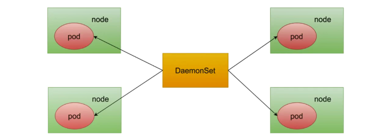

比如：我们之前学习的监控，需要在每台服务器上安装 node\_exporter，那么就适合使用 DaemonSet 来做，确保每台服务器上都只有一个 node\_exporter。

第一步：编写 yaml 文件，nginx-daemonset.yml

```yaml
apiVersion: apps/v1
kind: DaemonSet
metadata:
  name: nginx-daemonset
spec:
  selector:
    matchLabels:
      app: nginx-test
  template:
    metadata:
      labels:
        app: nginx-test
    spec:
      tolerations:																	# tolerations代表容忍
      - key: node-role.kubernetes.io/control-plane	# 能够容忍的污点key
        effect: NoSchedule													# 能容忍的污点effect
      containers:
      - name: nginx
        image: docker.1ms.run/nginx:1.24.0
        resources:	# resources资源限制是为了防止master节点的资源被占太多（根据实际情况配置）
          limits:
            memory: 100Mi
          requests:
            cpu: 100m
            memory: 100Mi
```

> 其实上面配置的容忍，是想要容忍 k8s 中的 master 节点的。因为 master 节点就有这个污点 key 是 node-role.kubernetes.io/control-plane，effect 是 NoSchedule。
>
> 所以这里配置了容忍的话，pod 就可以往 master 节点上调度啦。这样才符合 daemonset 的特点，他要确保每个节点上都要有一个 pod。所以我们上面也没配置副本，但是一会肯定会有 3 个 pod，每个节点一个。

第二步：应用 yaml 文件

```yaml
[root@master ~]# kubectl apply -f nginx-daemonset.yml
daemonset.apps/nginx-daemonset created
```

第三步：验证

```shell
[root@master ~]# kubectl get daemonset
NAME              DESIRED   CURRENT   READY   UP-TO-DATE   AVAILABLE   NODE SELECTOR   AGE
nginx-daemonset   3         3         3       3            3           <none>          3m51s

可以看到有3个pod，因为我们k8s集群有3个节点
```

```shell
[root@master ~]# kubectl get pod -o wide
NAME                    READY   STATUS    RESTARTS   AGE     IP            NODE     NOMINATED NODE   READINESS GATES
nginx-daemonset-4xqn8   1/1     Evicted   0          74s     10.244.1.55   master   <none>           <none>
nginx-daemonset-h55dd   1/1     Running   0          4m18s   10.244.1.57   node1    <none>           <none>
nginx-daemonset-zjlmv   1/1     Running   0          4m18s   10.244.2.43   node2    <none>           <none>

可以看到每个k8s集群的节点上都有一个pod！这正是daemonset的特点！
```

> 大家一定要将 /var 目录的磁盘容量扩容，因为我们之前最小化安装的时候给 /var 做的是 2G 大小的 LVM！不扩容的话这里可能会报错！在 master 节点上可能调度不了 pod 了！因为 /var 分区空间不足导致的。
>
> 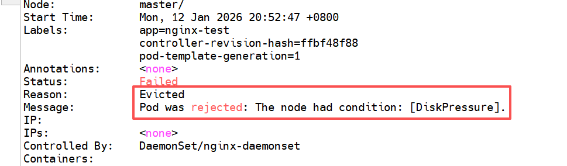

## Job

* 对于 ReplicaSet 而言，它希望 pod 保持预期数目、持久运行下去，除非用户明确删除，否则这些对象一直存在，它们针对的是耐久性任务，如 web 服务等
* 对于非耐久性任务，比如压缩文件，任务完成后，pod 需要结束运行，不需要 pod 继续保持在系统中，这个时候就要用到 Job。
* Job 负责批量处理短暂的一次性任务（short lived one-off tasks），即仅执行一次的任务，它保证批处理任务的一个或多个 Pod 成功结束。

**案例 1：计算圆周率 2000 位**

CKA 考试原题：创建一个名为 pi 的 Job，使用镜像 perl:5.32，执行命令 `perl -Mbignum=bpi -wle 'print bpi(2000)'`

第一步：编写 yaml 文件 job.yml

```yaml
apiVersion: batch/v1
kind: Job
metadata:
  name: pi									# job名字
spec:
  template:
    metadata:
      name: pi							# pod名字
    spec:
      containers:
      - name: pi						# 容器名字
        image: docker.1ms.run/library/perl:5.32		# 此镜像有点大，稍微耗时
        command: ['perl', '-Mbignum=bpi', '-wle', 'print bpi(2000)']
      restartPolicy: Never	# 执行完后不再重启
```

```yaml
# 如果拉取镜像特别慢，因为这个镜像确实挺大的，我们可以先拉取到本地
# 1. 查看本地有哪些镜像的命名空间（我们用的Containerd作为运行时）
ctr ns ls

# 2. 拉取镜像到指定的命名空间，比如 k8s.io
ctr -n k8s.io i pull docker.1ms.run/library/perl:5.32

# 3. 拉下来后，就可以把上面的yaml中的image改成
# image: docker.1ms.run/library/perl:5.32
```

第二步：应用 yaml 文件创建 job 控制器

```shell
[root@master ~]# kubectl apply -f job.yml
job.batch/pi created
```

第三步：验证

```shell
# 查看Job控制器，可以看到pod就一个
[root@master ~]# kubectl get jobs
NAME   STATUS    COMPLETIONS   DURATION   AGE
pi     Running   0/1           13s        13s
```

```shell
[root@master ~]# kubectl get pod
NAME                    READY   STATUS      RESTARTS        AGE
pi-s4xz2                0/1     Completed   0               71s

# Completed状态，不再是Ready状态了。表示pod已经执行完成了。
```

```shell
# 可以通过日志查看计算结果
[root@master ~]# kubectl logs pi-s4xz2
3.1415926535897932384626433832795028841971693993751058209749445923078164062862089986280348253421170679821480865132823066470938446095505822317253594081284811174502841027019385211055596446229489549303819644288109756659334461284756482337867831652712019091456485669234603486104543266482133936072602491412737245870066063155881748815209209628292540917153643678925903600113305305488204665213841469519415116094330572703657595919530921861173819326117931051185480744623799627495673518857527248912279381830119491298336733624406566430860213949463952247371907021798609437027705392171762931767523846748184676694051320005681271452635608277857713427577896091736371787214684409012249534301465495853710507922796892589235420199561121290219608640344181598136297747713099605187072113499999983729780499510597317328160963185950244594553469083026425223082533446850352619311881710100031378387528865875332083814206171776691473035982534904287554687311595628638823537875937519577818577805321712268066130019278766111959092164201989380952572010654858632788659361533818279682303019520353018529689957736225994138912497217752834791315155748572424541506959508295331168617278558890750983817546374649393192550604009277016711390098488240128583616035637076601047101819429555961989467678374494482553797747268471040475346462080466842590694912933136770289891521047521620569660240580381501935112533824300355876402474964732639141992726042699227967823547816360093417216412199245863150302861829745557067498385054945885869269956909272107975093029553211653449872027559602364806654991198818347977535663698074265425278625518184175746728909777727938000816470600161452491921732172147723501414419735685481613611573525521334757418494684385233239073941433345477624168625189835694855620992192221842725502542568876717904946016534668049886272327917860857843838279679766814541009538837863609506800642251252051173929848960841284886269456042419652850222106611863067442786220391949450471237137869609563643719172874677646575739624138908658326459958133904780275901
```

***

**案例 2：创建固定次数 job 控制器**

第一步：编写 yaml 文件 job2.yml

```yaml
apiVersion: batch/v1
kind: Job
metadata:
  name: busybox-job									# job名字
spec:
  completions: 10			# 执行job的次数
  parallelism: 3			# 执行job的并发数
  template:
    metadata:
      name: busybox-job-pod							# pod名字
    spec:
      containers:
      - name: busybox						# 容器名字
        image: docker.1ms.run/busybox
        command: ["echo", "hello"]
      restartPolicy: Never	# 执行完后不再重启
```

> busybox 镜像就是专门用来执行 shell 命令的一个镜像，用来测试使用。

completions：10，意味着这个 Job 总共需要 10 个 pod 成功运行完成，Job 才算执行结束。

parallelism：3，表示同一时间只能有 3 个 pod 运行。

因此，这里表示，每次 3 个 Pod，总共运行 10 次，即完成任务。

第二步：应用 yaml 文件创建 job

```shell
[root@master ~]# kubectl apply -f job2.yml
job.batch/busybox-job created
```

第三步：验证

```shell
[root@master ~]# kubectl get jobs
NAME          STATUS     COMPLETIONS   DURATION   AGE
busybox-job   Running    3/10          13s        13s
```

```shell
[root@master ~]# kubectl get pods
NAME                    READY   STATUS      RESTARTS        AGE
busybox-job-5qrvr       0/1     Completed   0               28s
busybox-job-7kpph       0/1     Completed   0               17s
busybox-job-94xl5       0/1     Completed   0               28s
busybox-job-cbbmd       0/1     Completed   0               16s
busybox-job-gdx4z       0/1     Completed   0               28s
busybox-job-jc4bx       0/1     Completed   0               18s
busybox-job-jf267       0/1     Completed   0               12s
busybox-job-m7fpk       0/1     Completed   0               12s
busybox-job-n5j85       0/1     Completed   0               10s
busybox-job-q2tjt       0/1     Completed   0               13s

状态都是Complete，表示已经完成任务了！ Job管理的pod节点都是运行完就结束了！

# 随便查看一个pod的日志，可以看到就是打印个hello
[root@master ~]# kubectl logs busybox-job-5qrvr
hello
```

问题：如果 completions：10，而 parallelism：15，那么会创建多少个 Pod 呢？

还是会创建 10 个 pod，只不过这 10 个 pod 可以同时执行！因为并发是 15。

## CronJob

类似于 Linux 系统的 crontab，在指定的时间、周期运行相关的任务。

第一步：编写 yaml 文件

```yaml
[root@master ~]# vim cronjob.yml
apiVersion: batch/v1
kind: CronJob
metadata:
  name: cronjob1
spec:
  schedule: "* * * * *"
  jobTemplate:
    spec:
      template:
        spec:
          containers:
          - name: hello
            image: docker.1ms.run/busybox
            args: ['/bin/sh', '-c', 'date; echo Hello from the Kubernetes cluster']
          restartPolicy: OnFailure
```

第二步：应用 yaml 文件创建 cronjob

```shell
[root@master ~]# kubectl apply -f cronjob.yml
cronjob.batch/cronjob1 created
```

第三步：查看验证

```shell
[root@master ~]# kubectl get cronjob
NAME       SCHEDULE    TIMEZONE   SUSPEND   ACTIVE   LAST SCHEDULE   AGE
cronjob1   * * * * *   <none>     False     0        <none>          8s
```

```shell
[root@master ~]# kubectl get pods
NAME                      READY   STATUS      RESTARTS      AGE
cronjob1-29471256-69ptr   0/1     Completed   0             71s
cronjob1-29471257-47c75   0/1     Completed   0             11s

# 查看AGE时间，每分钟整点执行一次，执行完后pod的状态就变为了Completed，然后等下次到点执行时又会创建一个pod。
```

## 总结

Controller 控制器进阶

1、DaemonSet 会在每个 \_\_\_\_\_ 上部署 Pod

Tolerations 容忍调度

适合节点信息采集，节点下发任务

2、Job 一次性执行任务，执行完成则 \_\_\_

完成数

并发数

3、CronJob 类似于 Linux 当中的 CronTab

周期性地执行任务

# 四、Service 服务

## 功能作用

* 通过 service 为 pod 客户端提供访问 pod 方法，即客户端访问 pod 入口
* 通过标签动态感知 pod IP 地址变化等
* 防止 pod 失联
* 定义访问 pod 访问策略
* 通过 label-selector 相关联
* 通过 Service 实现 Pod 的负载均衡(TCP/UDP 4 层)
* 底层实现主要通过 iptables 和 IPVS 二种网络模式

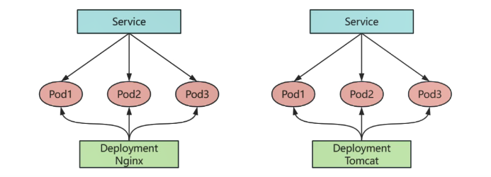

## 底层原理

底层流量转发与负载均衡实现均可以通过 iptables 或 ipvs 实现

```shell
[root@master ~]# kubectl -n kube-system get configmap kube-proxy -o yaml | grep mode
    mode: ""
出现以上情况，代表使用默认转发规则 => iptables
```

### iptables 实现

iptables 是 Linux 内核中用于配置防火墙规则的工具，主要功能：

* 包过滤
* 地址转换

应用：

在 Kubernetes 早期，iptables 用于实现服务(Service)的负载均衡和流量转发。

当创建一个 Service 时，Kubernetes 会在节点上创建一系列 iptables 规则，将发往 Service IP 的流量转发到后端的 Pod 上。

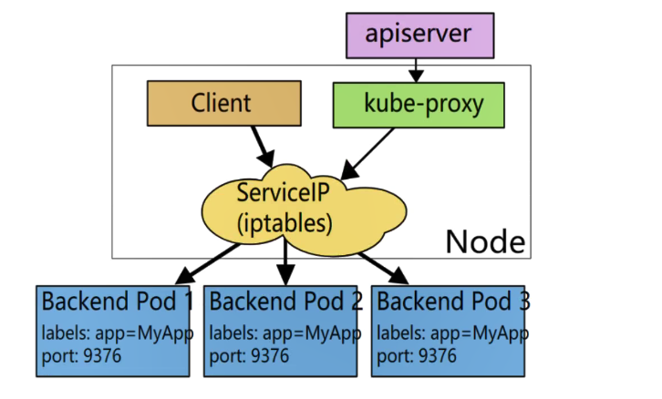

缺点：如果 iptables 中的规则设置的比较复杂的话，转换速度会很慢。

### ipvs 实现

ipvs（ip virtual server），是 Linux 内核中的一个模块，它实现了基于 IP 的负载均衡功能。主要功能：负载均衡。

应用：

iptables 的规则管理相对复杂，规则数量过多时会影响匹配效率。

Kubernetes 引入了 ipvs 作为替代方案，使用 ipvs 作为服务的负载均衡模式。

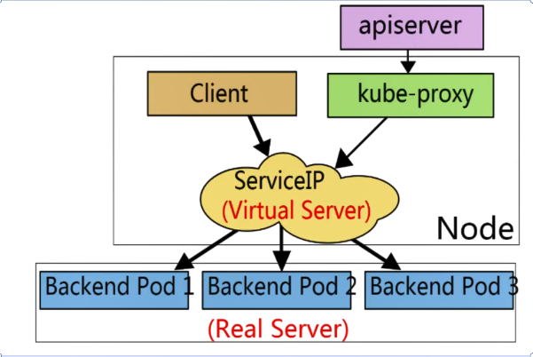

***

对比：

iptables：

* 灵活，功能强大(可以在数据包不同阶段对包进行操作)
* 侧重于数据包过滤和防火墙功能
* 规则遍历匹配和更新，呈线性时延
* 基于用户态规则的匹配模式

ipvs：

* 工作在内核态，有更好的性能
* 专注于负载均衡
* 调度算法丰富：
  * RR(RoundRobin，轮询算法)
  * WRR(Weighted Round Robin，加权轮询算法)
  * LC(Least Connections，最少连接算法)
  * WLC(Weighted Least Connections，加权最少连接算法) 有效连接数=连接数/权重
  * IP Hash(IP 哈希算法) 相同的用户/请求，可以分派到相同节点

## 具体类型

Service 类型分为：

* ClusterIP \[70%]

默认，分配一个集群内部可以访问的虚拟 IP

* NodePort \[20%]

在每个 Node 上分配一个端口作为外部访问入口

* LoadBalancer

工作在特定的 Cloud Provider 上，例 Google Cloud ，AWS ，OpenStack 的负载均衡器

* ExternalName（特殊）

表示把集群外部的服务引入到集群内部中来，即实现了集群内部 pod 和集群外部的服务进行通信

举例：k8s 集群上部署的是无状态应用，他们要访问集群外部的数据库集群，就需要用到 ExternalName。

### ClusterIP 类型

ClusterIP 根据是否生成 ClusterIP 又可以分为普通 Service 和 Headless Service 两类：

* 普通Service：

为 Kubernetes 的 Service 分配一个集群内部可访问的固定虚拟 IP(Cluster IP)，实现集群内的访问。

核心：会生成一个虚拟 IP 地址，通过这个 IP 可以实现集群内部访问 Pod！

* Headless Service：

该服务不会分配 Cluster IP，也不通过 kube-proxy 做反向代理和负载均衡。而是通过 DNS 返回每个 Pod 的真实 IP 列表，DNS会将 headless service 的后端直接解析为 pod ip 列表。

K8s 不会分配 Service IP，但会在 DNS 中注册每个 Pod 的域名记录。

```shell
nslookup db-headless.default.svc.cluster.local
10.244.1.10 # mysql-0
10.244.1.11 # mysql-1
10.244.1.12 # mysql-2

所以：
你可以直接连接 mysql-0
或者连接 mysql-1 / mysql-2
没有 kube-proxy 转发，客户端要自己决定怎么用哪个pod
```

Headless Service 场景：

用 Headless Service 后，每个 Pod 都有固定 DNS 名称，不会因为重启而变化，非常适合：

* MySQL 主从
* Kafka 节点间通信
* zookeeper 节点身份标识

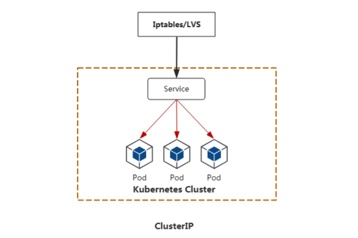

#### 创建 ClusterIP

**方式一：命令方式创建**

第一步：查看当前的 service

```shell
[root@master ~]# kubectl get services
NAME         TYPE        CLUSTER-IP   EXTERNAL-IP   PORT(S)   AGE
kubernetes   ClusterIP   10.96.0.1    <none>        443/TCP   6d18h

或者
[root@master ~]# kubectl get svc
NAME         TYPE        CLUSTER-IP   EXTERNAL-IP   PORT(S)   AGE
kubernetes   ClusterIP   10.96.0.1    <none>        443/TCP   6d18h

# 默认只有k8s本身自己的service
```

第二步：编写创建 deployment 的 yaml 文件

```yaml
# vim nginx1-deployment.yml
apiVersion: apps/v1
kind: Deployment
metadata:
  name: nginx1		# deployment名称
spec:
  replicas: 3			# 副本集，deployment中使用了replicaset
  selector:
    matchLabels:	# 匹配的pod标签
      app: nginx-cluster	# 确定哪些pod归当前这个deployment(以及其背后的replicaset)管理和控制
  template:				# 代表pod的配置模板
    metadata:
      labels:
        app: nginx-cluster	# pod的标签
    spec:
      containers:
        - name: nginx
          image: docker.1ms.run/nginx:1.24.0
          imagePullPolicy: IfNotPresent
          ports:
            - containerPort: 80
```

> 大家将目前 k8s 集群中所有的 pod 都给删除掉，通过文件的方式删除 `kubectl delete -f xxx.yml`

第三步：应用 yaml 文件创建 deployment

```shell
[root@master ~]# kubectl apply -f nginx1-deployment.yml
deployment.apps/nginx1 created

# 查看deployment信息
[root@master ~]# kubectl get deploy
NAME     READY   UP-TO-DATE   AVAILABLE   AGE
nginx1   3/3     3            3           49s

# 查看pod信息
[root@master ~]# kubectl get pod -o wide
NAME                     READY   STATUS    RESTARTS   AGE     IP             NODE    NOMINATED NODE   READINESS GATES
nginx1-ccf9c8476-dwxs4   1/1     Running   0          4m45s   10.244.1.215   node1   <none>           <none>
nginx1-ccf9c8476-mqbdm   1/1     Running   0          4m45s   10.244.1.216   node1   <none>           <none>
nginx1-ccf9c8476-nxxn6   1/1     Running   0          4m45s   10.244.2.197   node2   <none>           <none>
```

第二步：将名为 nginx1 的 deployment 映射端口

```shell
# 其实就是创建一个service，service的端口是80，映射到pod容器的80端口
[root@master ~]# kubectl expose deployment nginx1 --port 80 --target-port=80 --type=ClusterIP
service/nginx1 exposed

--port 表示service服务要开放的端口
--target-port 表示容器里当时绑定的端口
```

说明：

默认是 --type=ClusterIP，也可以使用 --type=NodePort

第三步：验证

```shell
[root@master ~]# kubectl get svc
NAME         TYPE        CLUSTER-IP      EXTERNAL-IP   PORT(S)   AGE
kubernetes   ClusterIP   10.96.0.1       <none>        443/TCP   6d18h
nginx1       ClusterIP   10.96.170.148   <none>        80/TCP    2m4s
```

```shell
# endpoints指的就是我们以后访问service，那么service会将请求转发到哪些pod上
[root@master ~]# kubectl get endpoints
NAME         ENDPOINTS                                         AGE
kubernetes   192.168.126.135:6443                              6d18h
nginx1       10.244.1.215:80,10.244.1.216:80,10.244.2.197:80   2m43s
```

endpoint 是 k8s 集群中的一个资源对象，存储在 etcd 中，用来记录一个 service 对应的所有 pod 的访问地址。service 配置selector，endpoint，controller 才会自动创建对应的 endpoint 对象；否则，不会生成 endpoint 对象。

第四步：在集群内部任意节点访问 service，集群外部不可以。

```shell
# curl http://service的ip:80
[root@master ~]# curl http://10.96.170.148:80
<!DOCTYPE html>
<html>
<head>
<title>Welcome to nginx!</title>
<style>
html { color-scheme: light dark; }
body { width: 35em; margin: 0 auto;
font-family: Tahoma, Verdana, Arial, sans-serif; }
</style>
</head>
<body>
<h1>Welcome to nginx!</h1>
<p>If you see this page, the nginx web server is successfully installed and
working. Further configuration is required.</p>

<p>For online documentation and support please refer to
<a href="http://nginx.org/">nginx.org</a>.<br/>
Commercial support is available at
<a href="http://nginx.com/">nginx.com</a>.</p>

<p><em>Thank you for using nginx.</em></p>
</body>
</html>
```

> 其实我们现在访问 service，service 又将请求转发给后面的 pod，而且用的负载均衡的方式进行转发到 pod。

第五步：分别进入到 3 个 pod 中，修改他们的首页，然后再次访问 service 测试是否有负载均衡

```shell
# 1. 查看pod信息
[root@master ~]# kubectl get pod
NAME                     READY   STATUS    RESTARTS   AGE
nginx1-ccf9c8476-dwxs4   1/1     Running   0          12m
nginx1-ccf9c8476-mqbdm   1/1     Running   0          12m
nginx1-ccf9c8476-nxxn6   1/1     Running   0          12m

# 2. 进入到第1个pod，修改首页
[root@master ~]# kubectl exec -it nginx1-ccf9c8476-dwxs4 /bin/sh
kubectl exec [POD] [COMMAND] is DEPRECATED and will be removed in a future version. Use kubectl exec [POD] -- [COMMAND] instead.
# echo web01 > /usr/share/nginx/html/index.html
# exit

# 3. 进入到第2个pod，修改首页
[root@master ~]# kubectl exec -it nginx1-ccf9c8476-mqbdm /bin/sh
kubectl exec [POD] [COMMAND] is DEPRECATED and will be removed in a future version. Use kubectl exec [POD] -- [COMMAND] instead.
# echo web02 > /usr/share/nginx/html/index.html
# exit

# 4. 进入到第3个pod，修改首页
[root@master ~]# kubectl exec -it nginx1-ccf9c8476-nxxn6 /bin/sh
kubectl exec [POD] [COMMAND] is DEPRECATED and will be removed in a future version. Use kubectl exec [POD] -- [COMMAND] instead.
# echo web03 > /usr/share/nginx/html/index.html
# exit

# 5. 访问service测试负载均衡
[root@master ~]# curl http://10.96.170.148
web02
[root@master ~]# curl http://10.96.170.148
web01
[root@master ~]# curl http://10.96.170.148
web03
```

第六步：删除 service

```yaml
[root@master ~]# kubectl get svc
NAME         TYPE        CLUSTER-IP      EXTERNAL-IP   PORT(S)   AGE
kubernetes   ClusterIP   10.96.0.1       <none>        443/TCP   6d19h
nginx1       ClusterIP   10.96.170.148   <none>        80/TCP    25m

[root@master ~]# kubectl delete svc nginx1
service "nginx1" deleted

[root@master ~]# kubectl get svc
NAME         TYPE        CLUSTER-IP   EXTERNAL-IP   PORT(S)   AGE
kubernetes   ClusterIP   10.96.0.1    <none>        443/TCP   6d19h
```

***

**方式二：通过 yaml 文件创建 service**

第一步：接着使用上面案例中的 3 个 nginx 的 pod

第二步：编写 ClusterIP 类型的 service 的 yaml 文件

```yaml
# vim nginx_service.yml
apiVersion: v1
kind: Service
metadata:
  name: my-service
spec:
  type: ClusterIP			# ClusterIP类型，默认就是它
  ports:							# 指定service的端口及容器端口
  - port: 80					# service的端口
    protocol: TCP
    targetPort: 80		# pod中的端口
  selector:
    app: nginx-cluster	# 可以通过Kubectl get pod -l app=nginx-cluster查看哪些pod使用此标签
```

> app: nginx-cluster 就表示我们这个 service 代理的是含有标签 app=nginx-cluster 的 pod。

第三步：应用 yaml 创建 service

```yaml
[root@master ~]# kubectl apply -f nginx_service.yml
service/my-service created
```

第四步：验证查看

```yaml
[root@master ~]# kubectl get svc
NAME         TYPE        CLUSTER-IP      EXTERNAL-IP   PORT(S)   AGE
kubernetes   ClusterIP   10.96.0.1       <none>        443/TCP   6d19h
my-service   ClusterIP   10.111.15.110   <none>        80/TCP    24s
```

第五步：集群内部访问 service 进行测试，可以看到有负载均衡效果！

```yaml
[root@master ~]# curl http://10.111.15.110:80
web03
[root@master ~]# curl http://10.111.15.110:80
web03
[root@master ~]# curl http://10.111.15.110:80
web02
[root@master ~]# curl http://10.111.15.110:80
web02
```

#### sessionAffinity

设置 sessionAffinity，可以让客户端的请求在一定条件下始终被发送到同一个 Pod ，以满足一些对会话状态有要求的应用场景。

设置 sessionAffinity 为 ClientIp (类似 nginx 的 ip\_hash 算法，lvs 的 source hash 算法)

```yaml
[root@master ~]# kubectl patch svc my-service -p '{"spec":{"sessionAffinity":"ClientIP"}}'
service/my-service patched
```

> patch 就是打补丁，给目前的 service 加点东西。

测试：接着在上面的案例中进行测试，发现每次访问都是相同的 pod

```yaml
[root@master ~]# curl http://10.111.15.110:80
web03
[root@master ~]# curl http://10.111.15.110:80
web03
[root@master ~]# curl http://10.111.15.110:80
web03
[root@master ~]# curl http://10.111.15.110:80
web03
[root@master ~]# curl http://10.111.15.110:80
web03
```

如果要取消上面的同一个客户端的请求转发到同一个 pod 中，设置 sessionAffinity 为 None 即可。

```yaml
[root@master ~]# kubectl patch svc my-service -p '{"spec":{"sessionAffinity":"None"}}'
service/my-service patched
```

测试：多次访问，又回到轮询负载均衡的效果了

```yaml
[root@master ~]# curl http://10.111.15.110:80
web03
[root@master ~]# curl http://10.111.15.110:80
web01
[root@master ~]# curl http://10.111.15.110:80
web03
[root@master ~]# curl http://10.111.15.110:80
web01
[root@master ~]# curl http://10.111.15.110:80
web03
[root@master ~]# curl http://10.111.15.110:80
web02
```

#### iptables 与 ipvs

kubeadm 安装 k8s 集群，k8s 采用默认的 iptables 调度模式，如果要修改为 ipvs 模式，则可以用下面的方式修改：

第一步：修改 kube-proxy 的配置文件

```shell
[root@master ~]# kubectl edit configmap kube-proxy -n kube-system
configmap/kube-proxy edited
 40     ipvs:
 41       excludeCIDRs: null
 42       minSyncPeriod: 0s
 43       scheduler: ""											# 可以在这里修改ipvs的算法，默认为rr轮询算法
 44       strictARP: false
 45       syncPeriod: 0s
 46       tcpFinTimeout: 0s
 47       tcpTimeout: 0s
 48       udpTimeout: 0s
 49     kind: KubeProxyConfiguration
 50     logging:
 51       flushFrequency: 0
 52       options:
 53         json:
 54           infoBufferSize: "0"
 55         text:
 56           infoBufferSize: "0"
 57       verbosity: 0
 58     metricsBindAddress: ""
 59     mode: "ipvs"												# 默认""号里为空，加上ipvs
 60     nftables:
 61       masqueradeAll: false
```

第二步：查看 kube-system 的 namespace 中的 kube-proxy 有关的 pod

```shell
[root@master ~]# kubectl get pods -n kube-system | grep kube-proxy
kube-proxy-nzq82                 1/1     Running   3 (6h7m ago)   6d19h
kube-proxy-xjnws                 1/1     Running   3 (6h7m ago)   6d8h
kube-proxy-z7rrq                 1/1     Running   6 (6h7m ago)   6d8h
```

第三步：验证 kube-proxy-xxx 的 pod 中的信息

```shell
[root@master ~]# kubectl logs -n kube-system kube-proxy-nzq82
I0113 03:16:07.207562       1 server_linux.go:69] "Using iptables proxy"
I0113 03:16:08.054908       1 server.go:1062] "Successfully retrieved node IP(s)" IPs=["192.168.126.135"]
I0113 03:16:08.060546       1 conntrack.go:119] "Set sysctl" entry="net/netfilter/nf_conntrack_max" value=131072
I0113 03:16:08.060647       1 conntrack.go:59] "Setting nf_conntrack_max" nfConntrackMax=131072
I0113 03:16:08.060723       1 conntrack.go:119] "Set sysctl" entry="net/netfilter/nf_conntrack_tcp_timeout_established" value=86400
....
```

> 可以看到还是使用原来的 iptables 规则，因为 pod 并没有重启，没有用上最新改后的 ipvs 的规则。

第四步：删除 kube-proxy-xxx 的所有 pod，让它重新拉取新的 kube-proxy-xxx 的 pod（随便查看一个 kube-proxy-xxx 的 pod 的详细信息，可以看到他们用的 pod 控制器是 daemonset，它会确保每个节点上必须有一个 pod。所以我们删除 pod 后，会重新拉取一个 pod 的。而且重新拉取的新的 pod 会使用最新的 ipvs 的规则！）

```shell
[root@master ~]# kubectl delete pod kube-proxy-nzq82 -n kube-system
pod "kube-proxy-nzq82" deleted
[root@master ~]#
[root@master ~]# kubectl delete pod kube-proxy-xjnws -n kube-system
pod "kube-proxy-xjnws" deleted
[root@master ~]#
[root@master ~]# kubectl delete pod kube-proxy-z7rrq -n kube-system
pod "kube-proxy-z7rrq" deleted

# 再次查看pod信息，又拉起了3个pod
[root@master ~]# kubectl get pods -n kube-system | grep kube-proxy
kube-proxy-q5tjb                 1/1     Running   0               2m2s
kube-proxy-qzfzq                 1/1     Running   0               92s
kube-proxy-rf88g                 1/1     Running   0               105s
```

第五步：随便查看一个 kube-proxy-xxx 的日志信息，看规则是否改变

```shell
[root@master ~]# kubectl logs kube-proxy-q5tjb -n kube-system
I0113 09:28:59.240212       1 server.go:1062] "Successfully retrieved node IP(s)" IPs=["192.168.126.135"]
I0113 09:28:59.242087       1 conntrack.go:59] "Setting nf_conntrack_max" nfConntrackMax=131072
I0113 09:28:59.520539       1 server.go:659] "kube-proxy running in dual-stack mode" primary ipFamily="IPv4"
I0113 09:29:00.166413       1 server_linux.go:233] "Using ipvs Proxier"
I0113 09:29:00.172479       1 server_linux.go:511] "Detect-local-mode set to ClusterCIDR, but no cluster CIDR for family" ipFamily="IPv6"
```

第六步：安装 ipvsadm 查看调度规则（因为现在我们 k8s 集群中使用的是 ipvs 调度规则，我们通过安装 ipvsadm 可以管理查看这些规则，就和之前学习的 LVS 是一样的！）

```shell
[root@master ~]# dnf -y install ipvsadm

[root@master ~]# kubectl get svc
NAME         TYPE        CLUSTER-IP      EXTERNAL-IP   PORT(S)   AGE
kubernetes   ClusterIP   10.96.0.1       <none>        443/TCP   6d19h
my-service   ClusterIP   10.111.15.110   <none>        80/TCP    37m

# 可以在调度规则中看到具体信息，我们访问到service后转发到哪里、使用什么算法等
[root@master ~]# ipvsadm -Ln
IP Virtual Server version 1.2.1 (size=4096)
Prot LocalAddress:Port Scheduler Flags
  -> RemoteAddress:Port           Forward Weight ActiveConn InActConn
TCP  10.96.0.1:443 rr
  -> 192.168.126.135:6443         Masq    1      0          0
TCP  10.96.0.10:53 rr
  -> 10.244.0.14:53               Masq    1      0          0
  -> 10.244.0.16:53               Masq    1      0          0
TCP  10.96.0.10:9153 rr
  -> 10.244.0.14:9153             Masq    1      0          0
  -> 10.244.0.16:9153             Masq    1      0          0
TCP  10.111.15.110:80 rr
  -> 10.244.1.215:80              Masq    1      0          0
  -> 10.244.1.216:80              Masq    1      0          0
  -> 10.244.2.197:80              Masq    1      0          0
UDP  10.96.0.10:53 rr
  -> 10.244.0.14:53               Masq    1      0          0
  -> 10.244.0.16:53               Masq    1      0          0
```

第七步：再次访问验证负载均衡

```shell
[root@master ~]# curl http://10.111.15.110:80
web03
[root@master ~]# curl http://10.111.15.110:80
web02
[root@master ~]# curl http://10.111.15.110:80
web01
```

#### headless service

应用场景：主要是结合 StatefulSet 有状态控制器一起使用，比如部署 MySQL 主从、搭建 Kafka 集群等等。

普通的 ClusterIP service 是 service name 解析为 Cluster ip，然后 Cluster ip 对应到后面的 pod ip。

而无头 service 是指 service name 直接解析为后面的 pod ip。

第一步：编写 yaml 文件

```yaml
# vim headless-service.yml
apiVersion: v1
kind: Service
metadata:
  name: headless-service
spec:
  clusterIP: None			# None就代表是无头service
  type: ClusterIP			# ClusterIP类型，默认就是它
  ports:							# 指定service的端口及容器端口
  - port: 80					# service的端口
    protocol: TCP
    targetPort: 80		# pod中的端口
  selector:
    app: nginx-cluster	# 可以通过Kubectl get pod -l app=nginx-cluster查看哪些pod使用此标签
```

第二步：应用 yaml 文件创建无头 service 服务

```shell
# 1. 删除之前的service服务
[root@master ~]# kubectl get svc
NAME         TYPE        CLUSTER-IP      EXTERNAL-IP   PORT(S)   AGE
kubernetes   ClusterIP   10.96.0.1       <none>        443/TCP   6d20h
my-service   ClusterIP   10.111.15.110   <none>        80/TCP    81m

[root@master ~]# kubectl delete svc my-service
service "my-service" deleted
[root@master ~]# kubectl get svc

# 2. 创建无头service服务
[root@master ~]# kubectl apply -f headless-service.yml
service/headless-service created
```

第三步：验证

```shell
[root@master ~]# kubectl get svc
NAME               TYPE        CLUSTER-IP   EXTERNAL-IP   PORT(S)   AGE
headless-service   ClusterIP   None         <none>        80/TCP    54s
kubernetes         ClusterIP   10.96.0.1    <none>        443/TCP   6d21h

可以看到headless-service没有Cluster IP，用None表示
```

***

思考：没有 IP 地址，该怎么访问呢？

**DNS**

DNS 服务监视 kubernetes API，为每一个 service 创建 DNS 记录用于域名解析

headless service 需要 DNS 来解决访问问题。

DNS 记录格式为：<pod-name>.<service-name>.<namespace>.svc.cluster.local

第一步：查看 kube-dns 服务的 IP

```shell
[root@master ~]# kubectl get svc -n kube-system
NAME       TYPE        CLUSTER-IP   EXTERNAL-IP   PORT(S)                  AGE
kube-dns   ClusterIP   10.96.0.10   <none>        53/UDP,53/TCP,9153/TCP   6d21

# 查看到coreDNS的服务地址是 10.96.0.10
```

第二步：通过 DNS 服务地址查找无头服务的 DNS 解析

```shell
# 如果提示找不到dig(Domain Information Groper，域名信息搜索器)命令，则执行
[root@master ~]# dnf -y install bind-utils
```

dig（全名：Domain Information Groper）是一个强大的 DNS 查询工具，比 nslookup 提供更多详细信息，常用于 DNS 故障排查。查看 Kubernetes 内部服务的 DNS（例如 headless service）

```shell
[root@master ~]# dig -t A headless-service.default.svc.cluster.local. @10.96.0.10

; <<>> DiG 9.16.23-RH <<>> -t A headless-service.default.svc.cluster.local. @10.96.0.10
;; global options: +cmd
;; Got answer:
;; WARNING: .local is reserved for Multicast DNS
;; You are currently testing what happens when an mDNS query is leaked to DNS
;; ->>HEADER<<- opcode: QUERY, status: NOERROR, id: 2201
;; flags: qr aa rd; QUERY: 1, ANSWER: 3, AUTHORITY: 0, ADDITIONAL: 1
;; WARNING: recursion requested but not available

;; OPT PSEUDOSECTION:
; EDNS: version: 0, flags:; udp: 4096
; COOKIE: 2c6e2ddb0eebaf91 (echoed)
;; QUESTION SECTION:
;headless-service.default.svc.cluster.local. IN A

;; ANSWER SECTION:
headless-service.default.svc.cluster.local. 30 IN A 10.244.1.216		=> 确实找到了3个pod的IP
headless-service.default.svc.cluster.local. 30 IN A 10.244.1.215
headless-service.default.svc.cluster.local. 30 IN A 10.244.2.197

;; Query time: 529 msec
;; SERVER: 10.96.0.10#53(10.96.0.10)
;; WHEN: Tue Jan 13 19:08:03 CST 2026
;; MSG SIZE  rcvd: 257

说明：
dig -t A 表示获取域名对应的ip地址


# 查看pod信息
[root@master ~]# kubectl get pod -o wide
NAME                     READY   STATUS    RESTARTS   AGE    IP             NODE    NOMINATED NODE   READINESS GATES
nginx1-ccf9c8476-dwxs4   1/1     Running   0          159m   10.244.1.215   node1   <none>           <none>
nginx1-ccf9c8476-mqbdm   1/1     Running   0          159m   10.244.1.216   node1   <none>           <none>
nginx1-ccf9c8476-nxxn6   1/1     Running   0          159m   10.244.2.197   node2   <none>           <none>
```

第三步：访问测试

```shell
# 我们访问：http://pod名称.headless服务名.命名空间名.svc.cluster.local 但是不行！ 是因为 headless service是要结合后面学习的StatefulSet来使用的！ 目前我们的pod是Deployment控制器在管理！！！
[root@master ~]# curl http://nginx1-ccf9c8476-dwxs4.headless-service.default.svc.cluster.local
curl: (6) Could not resolve host: nginx1-ccf9c8476-dwxs4.headless-service.default.svc.cluster.local
```

后续使用：使用 StatefuSet + Headless Service

### NodePort 类型

应用场景：

本地和线上联调，定位 Bug 的时候（因为在本地无法复现），几乎 95%以上，都会用到 NodePort 集群外访问：用户 => 域名 => 负载均衡器（后端服务器）=> NodeIP:port（service ip）=> Pod IP : 端口

也就是说通过 NodePort 这种 service 类型，我们可以实现在集群节点外部访问集群中的 pod 应用。

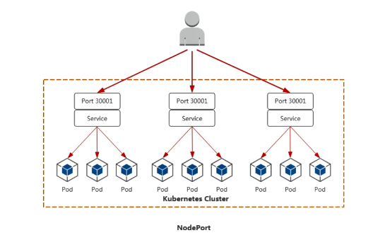

***

将 nginx1 这个 service 的 type 由 ClusterIP 改为 NodePort

第一步：编写 yaml 文件

```shell
# 删除之前案例中没用的资源
[root@master ~]# kubectl delete svc headless-service
service "headless-service" deleted

[root@master ~]# vim nodeport-service.yml
apiVersion: v1
kind: Service
metadata:
  name: my-service
spec:
  type: NodePort			# 这里由ClusterIP改为NodePort后保存退出，注意大小写
  ports:							# 指定service的端口及容器端口
  - port: 80					# service的端口
    protocol: TCP
    targetPort: 80		# pod中的端口
  selector:
    app: nginx-cluster	# 可以通过Kubectl get pod -l app=nginx-cluster查看哪些pod使用此标签
```

第二步：应用 yaml 文件

```shell
[root@master ~]# kubectl apply -f nodeport-service.yml
service/my-service created
```

第三步：查看信息

```shell
[root@master ~]# kubectl get svc
NAME         TYPE        CLUSTER-IP      EXTERNAL-IP   PORT(S)        AGE
kubernetes   ClusterIP   10.96.0.1       <none>        443/TCP        6d22h
my-service   NodePort    10.104.37.112   <none>        80:30382/TCP   23s

80表示service的端口号，30382表示node节点的端口号，
之后我们访问node节点的30382，就会映射到service的80端口，然后service的80又会映射到pod的80端口。
```

第四步：在集群外部使用 http://集群节点 IP:30382 来访问了

```shell
[root@master ~]# curl http://192.168.126.135:30382/
web01
[root@master ~]# curl http://192.168.126.135:30382/
web03
[root@master ~]# curl http://192.168.126.135:30382/
web02
```


### LoadBalancer

集群外访问：用户 => 域名 => 云服务提供端提供 LB => NodeIP:Port(service IP) => Pod IP : 端口

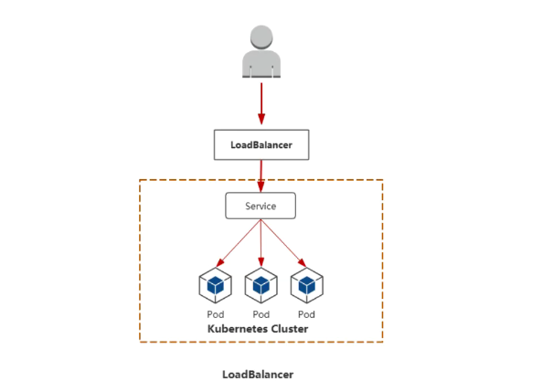

应用场景：阿里云、华为云、腾讯云等云平台，使用较多 =>阿里云 ACK

这种一般都是在服务器是云平台的时候我们使用。

### ExternalName

ClusterIP、NodePort、LoadBalancer，大多数把外部流量引入到 K8S 平台内部，实现 Pod 反向代理操作。

ExternalName 不同，<font style="color:#DF2A3F;">它相当于在 K8S 平台内部，引用外部的链接或地址信息</font>。

第一步：编写 yaml 文件

```yaml
[root@master ~]# vim external-service.yml
apiVersion: v1
kind: Service
metadata:
  name: external-service
spec:
  type: ExternalName
  externalName: www.baidu.com		# 对应的外部域名为www.baidu.com
```

第二步：应用 yaml 文件

```shell
[root@master ~]# kubectl apply -f external-service.yml
service/external-service created

[root@master ~]# kubectl get svc
NAME               TYPE           CLUSTER-IP      EXTERNAL-IP     PORT(S)        AGE
external-service   ExternalName   <none>          www.baidu.com   <none>         12s
kubernetes         ClusterIP      10.96.0.1       <none>          443/TCP        6d22h
my-service         NodePort       10.104.37.112   <none>          80:30382/TCP   54m
```

第三步：查看 external-service 的 DNS 解析

```shell
[root@master ~]# dig -t A external-service.default.svc.cluster.local. @10.96.0.10

; <<>> DiG 9.16.23-RH <<>> -t A external-service.default.svc.cluster.local. @10.96.0.10
;; global options: +cmd
;; Got answer:
;; WARNING: .local is reserved for Multicast DNS
;; You are currently testing what happens when an mDNS query is leaked to DNS
;; ->>HEADER<<- opcode: QUERY, status: NOERROR, id: 26459
;; flags: qr aa rd; QUERY: 1, ANSWER: 4, AUTHORITY: 0, ADDITIONAL: 1
;; WARNING: recursion requested but not available

;; OPT PSEUDOSECTION:
; EDNS: version: 0, flags:; udp: 4096
; COOKIE: 2a927eb9b635a50c (echoed)
;; QUESTION SECTION:
;external-service.default.svc.cluster.local. IN A

;; ANSWER SECTION:
external-service.default.svc.cluster.local. 30 IN CNAME www.baidu.com.
www.baidu.com.          30      IN      CNAME   www.a.shifen.com.
www.a.shifen.com.       30      IN      A       220.181.111.1
www.a.shifen.com.       30      IN      A       220.181.111.232

;; Query time: 529 msec
;; SERVER: 10.96.0.10#53(10.96.0.10)
;; WHEN: Tue Jan 13 20:40:36 CST 2026
;; MSG SIZE  rcvd: 259


[root@master ~]# ping www.baidu.com
PING www.a.shifen.com (220.181.111.232) 56(84) 比特的数据。
64 比特，来自 220.181.111.232 (220.181.111.232): icmp_seq=1 ttl=128 时间=31.8 毫秒
64 比特，来自 220.181.111.232 (220.181.111.232): icmp_seq=2 ttl=128 时间=3.85 毫秒
64 比特，来自 220.181.111.232 (220.181.111.232): icmp_seq=3 ttl=128 时间=39.7 毫秒

# 从上面结果来看，是把外部域名做了一个别名过来
# CNAME即规范名称（Canonical Name），是DNS中的一种记录类型
```

结论：

* 这就是把集群外部的服务引入到集群内部中来，实现了集群内部 pod 和集群外部的服务进行通信
* ExternalName 类型的服务适用于外部服务使用域名的方式，缺点是不能指定端口
* 还有一点要注意：<font style="color:#DF2A3F;">集群内的 Pod 会继承 Node 上的 DNS 解析规则。所以只要 Node 可以访问的服务，Pod 中也可以访问到，这就实现了集群内服务访问集群外服务。</font>

## 总结

1、Service 服务，它主要为 Pod 提供统一的访问入口

iptables：包过滤、防火墙规则

ipvs：负载均衡

2、Service 类型

ClusterIP：集群 IP，提供了集群 \_\_\_ 部的访问【掌握】

NodePort：提供了集群 \_\_\_ 部的访问【掌握】

LoadBalancer：Cloud Provider 提供的一种 service 类型【了解即可】

ExternalName：把外部的域名映射到集群内部，从而实现 \_\_\_ 部访问 \_\_\_ 部【了解即可】


> 更新: 2026-01-20 15:45:00  
> 原文: <https://www.yuque.com/u41736172/az9urv/fo2g8wu45moqrrry>