# 06.Ingress工具与Traefik工具

# 一、Ingress 控制器

## 概念介绍

官方手册：<https://kubernetes.io/zh-cn/docs/concepts/services-networking/ingress/>

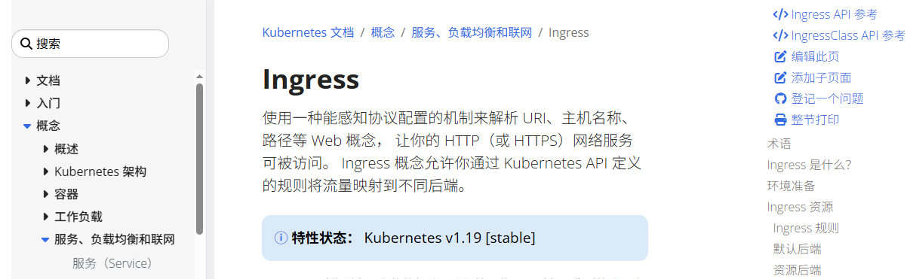

总结：Ingress 就是一种转发规则，把用户的请求，通过 Ingress 配置好的规则转发到后端的 pod 服务。类似 Nginx 中的 location 标签。

注意：Ingress 默认只是一套转发规则，需要用户自定义（类似产品说明书），本身并没有实现请求转发等操作。

如果想对 Ingress 规则具体实现转发等操作，需要使用 k8s 中的 Ingress Controller。

Ingress Controller 可以为外网用户访问 k8s 集群内部 Pod 提供代理服务。

* 提供全局访问代理
* 访问流程：用户 => ingress controller（支持 http、https 协议） => service => pod

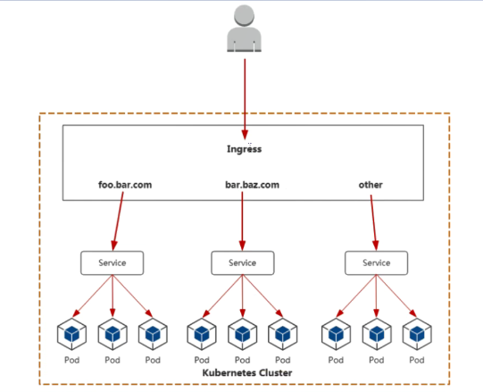

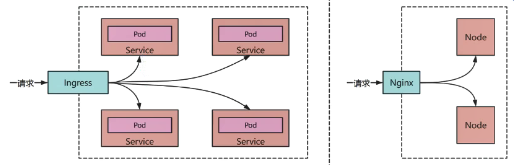

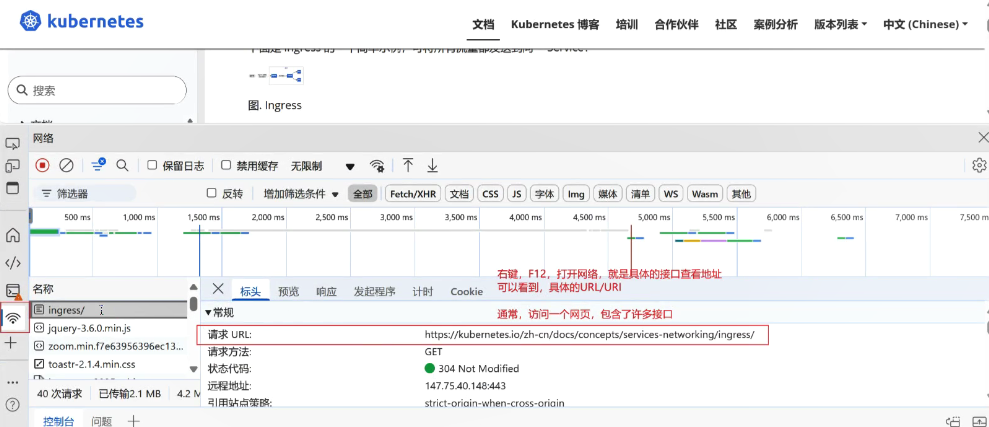

## 具体分类

Ingress 控制器有很多种。

### Kubernetes Ingress Controller

官方手册：<http://github.com/kubernetes/ingress-nginx>

实现：Go/Lua（nginx 是用 C 写的）

开源许可证：Apache 2.0

Kubernetes 的“官方”控制器（之所以称为官方，是想把它区别于 NGINX 公司的控制器)。

这是社区开发的控制器，它基于 nginx Web 服务器，并补充了一组用于实现额外功能的 Lua 插件。

由于 NGINX 十分流行，再加上把它用作控制器时所需的修改较少，它对于 K8s 普通工程师来说，可能是最简单和最直接的选择。

### NGINX Ingress Controller

官方手册：<http://github.com/nginxinc/kubernetes-ingress>

实现：Go

开源许可证：Apache 2.0

这是 NGINX 公司开发的官方产品，它也有一个基于 NGINX Plus 的商业版。NGINX 的控制器具有很高的稳定性、持续的向后兼容性，且没有任何第三方模块。

由于消除了 Lua 代码，和官方控制器相比，它保证了较高的速度，但也因此受到较大限制。相较之下，它的付费版本有更广泛的附加功能，如实时指标、JWT 验证、主动健康检查等。

NGINX Ingress 重要的优势是对 TCP/UDP 流量的全面支持，最主要缺点是缺乏流量分配功能。

### Traefik

官方手册：<http://github.com/containous/traefik>

实现：Go

开源许可证：MIT

【流量 Traffik】

最初，这个代理是为微服务请求（niushop 就是一套代码，不需要切分。微服务是尽可能把大项目拆分为若干个服务，比如 user 用户服务、goods 商品服务、order 订单服务，然后通过 gateway 再集成在一起）及其动态环境的路由而创建的，因此具有许多有用的功能：

* 连续更新配置(不重新启动)
* 支持多种负载均衡算法
* Web UI
* 指标导出
* 对各种服务的支持协议
* REST API
* Canary(金丝雀)版本

支持开箱即用的 Let's Encrypt 是它的另一个不错的功能，但它的主要缺点也很明显，就是为了控制器的高可用性，你必须安装并连接其 Key-value store。

在 2019 年 9 月发布的 Traefik v2.0 中，虽然它增加许多不错的新功能，如带有 SNI 的 TCP/SSL、金丝雀部署、流量镜像 /shadowing 和经过改进的 Web UI，但一些功能(如 WAF 支持)还在策划讨论中。

与新版本同期推出的还有一个名叫 Maesh 的服务网格，它建在 Traefik 之上。

金丝雀（Canary）版本的来历

20 世纪初，英国矿工在下矿时，会携带金丝雀，由于金丝雀对一氧化碳浓度更为敏感，一旦金丝雀鸣叫不安，就会立即避险，减少伤亡。

1896年，英国一工程师认为，煤矿爆炸的原因是一氧化碳聚集造成的。由于一氧化碳无色无味，如何快速发现一氧化碳泄露极为重要。

他考虑到乌类比人类更敏感，采用下面的装置，装置的一侧是个通风窗，一旦金丝雀鸣叫不安，立即关闭通风窗，打开上面的氧气罐，供给金丝雀呼吸，并立即逃离煤矿。

软件工程中，采用了金丝雀思想，先小范围发布版本，一旦发现 Bug，立即修复；

> 金丝雀部署，其实就是可以利用 Traefik 将 20% 的流量转发到新版本上，80% 的流量还是转发到旧版本处理；如果新版本没问题，再将 40% 的流量转发到新版本看是否有问题等等，最终将整个 100% 的流量都给了新版本处理。实现一个逐步替换的过程。

### HAProxy Ingress

Nginx（七层）、HAProxy、LVS（四层）

官方手册：http://github.com/jcmoraisjr/haproxy-ingress

官方：https://www.haproxy.org/

实现：Go（HAProxy 是用 C 写的）

开源许可证：Apache 2.0

### Istio Ingress

链接：[http://istio.io/docs/tasks/traffic-management/ingress](http://http://istio.io/docs/tasks/traffic-management/ingress)

实现：Go

许可证：Apache 2.0

Istio 是  IBM、Google 和 Lyft 的联合开发项目，它是一个全面的服务网格解决方案----仅可以管理所有传入的外部流量(作为 Ingress控制器)，还可以控制集群内部的所有流量。

Istio 将 Envoy 用作每种服务的辅助代理。从本质上讲，它是一个可以执行几乎所有操作的大型处理器，其中心思想是最大程度的控制、可扩展性、安全性和透明性。

通过 Istio Ingress，你可以对流量路由、服务之间的访问授权、均衡、监控、金丝雀发布等进行优化。

### 其他

后面的控制器，作为了解即可。

Kong Ingress

官方手册：<http://github.com/Kong/kubernetes-ingress-controller>

实现：Go

开源许可证：Apache 2.0

Kong Ingress 由 Kong Inc(Incorporated ，股份有限制的)开发，有两个版本：商业版和免费版。它基于 NGINX 构建，并增加了扩展其功能的 Lua 模块。

# 二、Kubernetes Ingress Controller

Kubernetes Ingress Controller = Nginx + Lua + Ingress Controller

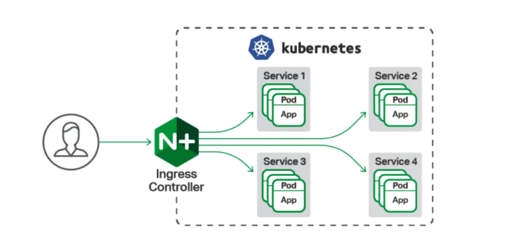

其实我们就可以将 Ingress Controller 理解为我们之前学习的负载均衡服务器，所有客户端的请求都会到达负载均衡服务器，然后负载均衡服务器负责将请求根据一定的策略转发给后端的服务！

## 安装部署

> 建议：由于本次课程会涉及到两种 Ingress Controller，为了避免产生冲突以及混淆，建议安装 Ingress Controller 之
>
> 前，对 master 节点、node1 节点、node2 节点拍摄一个快照。

项目地址：<https://github.com/kubernetes/ingress-nginx>

安装文档地址：<https://github.com/kubernetes/ingress-nginx/blob/nginx-0.30.0/docs/deploy/index.md>

**第一步：查看 readme 文档**

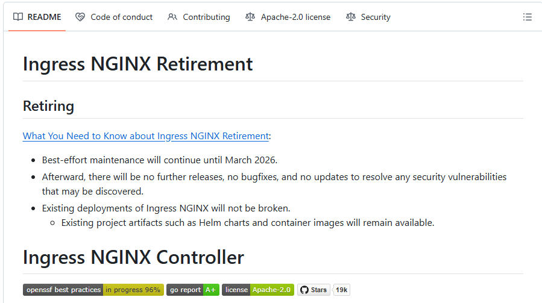

**第二步：编写 Ingress Controller 的 yaml 文件，下载不下来看资料中提供的**

```shell
[root@master ~]# wget https://raw.githubusercontent.com/kubernetes/ingress-nginx/controller-v1.12.0/deploy/static/provider/cloud/deploy.yaml -O ingress-nginx.yaml
```

**第三步：修改镜像拉取位置**

我们学习 Docker 和 K8s，大部分遇到的问题，都是镜像拉取不到导致的失败。

因此，把 registry.k8s.io 镜像，替换成 registry.cn-hangzhou.aliyuncs.com 镜像

这里，总共两个镜像：

kube-webhook-certgen:v1.5.0

/ingress-nginx/controller:v1.12.0

修改他们的镜像源：

```shell
# sed 统一替换，总共修改了三处
[root@master ~]# sed -i 's|registry.k8s.io/ingress-nginx/kube-webhook-certgen:v1.5.0.*|registry.cn-hangzhou.aliyuncs.com/google_containers/kube-webhook-certgen:v1.5.0|g' ingress-nginx.yaml

[root@master ~]# sed -i 's|registry.k8s.io/ingress-nginx/controller:v1.12.0.*|registry.cn-hangzhou.aliyuncs.com/google_containers/nginx-ingress-controller:v1.12.0|g' ingress-nginx.yaml
```

> **<font style="color:#DF2A3F;">资料中给大家提供的文件是已经替换好的！！！不需要再次替换了。</font>**

**第四步：修改配置**

423 行左右的位置，添加 hostNetwork: true

hostNetwork: true 的补充说明：

此参数为 true 表示 pod 使用主机网络，也就是 pod 的 ip 就是 node 的 ip。

若不添加，后续使用 `域名:nodeport`访问；

添加之后，直接使用域名访问。

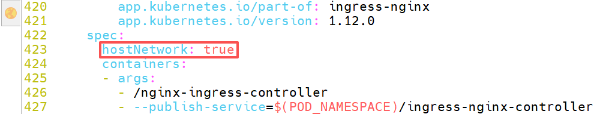

> **其实可以直接用资料中的，资料中的文件已经是改后的！**

第五步：为了加快拉取速度，我们先把镜像拉取到本地（我们使用的 Containerd 作为运行时）

```shell
# 拉取nginx-ingress-controller
[root@master ~]# ctr -n k8s.io i pull registry.cn-hangzhou.aliyuncs.com/google_containers/nginx-ingress-controller:v1.12.0

# 拉取kube-webhook-certgen
[root@master ~]# ctr -n k8s.io i pull registry.cn-hangzhou.aliyuncs.com/google_containers/kube-webhook-certgen:v1.5.0

# 查看拉取列表，思考 -E 表示什么
[root@master ~]# ctr -n k8s.io i ls | grep -E 'ingress|webhook'
```

第六步：应用配置文件

```shell
[root@master ~]# kubectl apply -f ingress-nginx.yaml
namespace/ingress-nginx created
serviceaccount/ingress-nginx created
serviceaccount/ingress-nginx-admission created
role.rbac.authorization.k8s.io/ingress-nginx created
role.rbac.authorization.k8s.io/ingress-nginx-admission created
clusterrole.rbac.authorization.k8s.io/ingress-nginx created
clusterrole.rbac.authorization.k8s.io/ingress-nginx-admission created
rolebinding.rbac.authorization.k8s.io/ingress-nginx created
rolebinding.rbac.authorization.k8s.io/ingress-nginx-admission created
clusterrolebinding.rbac.authorization.k8s.io/ingress-nginx created
clusterrolebinding.rbac.authorization.k8s.io/ingress-nginx-admission created
configmap/ingress-nginx-controller created
service/ingress-nginx-controller created
service/ingress-nginx-controller-admission created
deployment.apps/ingress-nginx-controller created
job.batch/ingress-nginx-admission-create created
job.batch/ingress-nginx-admission-patch created
ingressclass.networking.k8s.io/nginx created
validatingwebhookconfiguration.admissionregistration.k8s.io/ingress-nginx-admission created
```

```shell
# 获取ingress-nginx这个命名空间中所有的内容
[root@master ~]# kubectl get all -n ingress-nginx
NAME                                            READY   STATUS              RESTARTS   AGE
pod/ingress-nginx-admission-create-4rp7t        0/1     Completed           0          81s
pod/ingress-nginx-admission-patch-s965j         0/1     Completed           2          81s
pod/ingress-nginx-controller-5c55879b96-sm24m   0/1     ContainerCreating   0          81s

NAME                                         TYPE           CLUSTER-IP      EXTERNAL-IP   PORT(S)                      AGE
service/ingress-nginx-controller             LoadBalancer   10.104.103.82   <pending>     80:31012/TCP,443:30369/TCP   83s
service/ingress-nginx-controller-admission   ClusterIP      10.98.216.86    <none>        443/TCP                      82s

NAME                                       READY   UP-TO-DATE   AVAILABLE   AGE
deployment.apps/ingress-nginx-controller   0/1     1            0           82s

NAME                                                  DESIRED   CURRENT   READY   AGE
replicaset.apps/ingress-nginx-controller-5c55879b96   1         1         0       81s

NAME                                       STATUS     COMPLETIONS   DURATION   AGE
job.batch/ingress-nginx-admission-create   Complete   1/1           46s        82s
job.batch/ingress-nginx-admission-patch    Complete   1/1           54s        81s
```

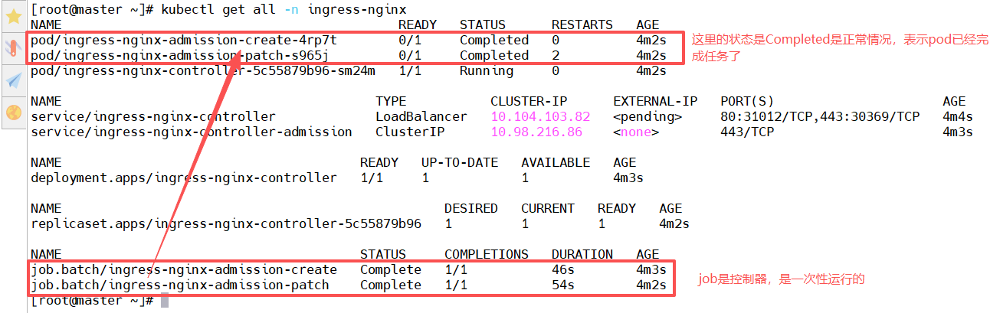

## Ingress Controller 工作原理

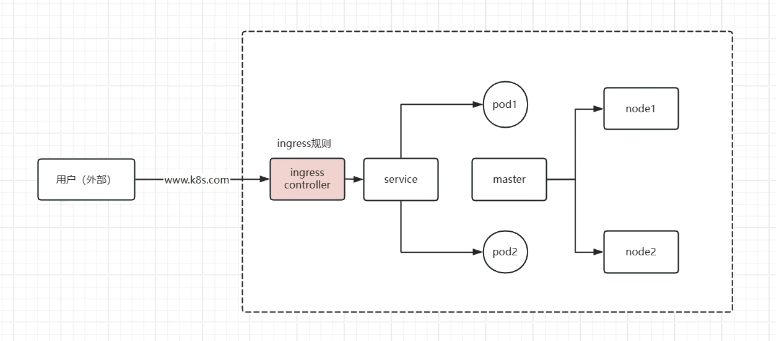

1. 外部用户通过域名发送请求
2. 请求到达 ingress controller，ingress controller 中配置了很多 ingress 规则，用来判断请求该转发到哪个 service
3. 请求到达相应的 service
4. service 再将请求转发到 pod 中
5. 其实 ingress controller 就相当于我们之前学习的 Nginx 负载均衡器或者 LVS 负载均衡器！

**再次明确：**

k8s 是由 master 管理节点和 node 工作节点组成的，我们目前是 1 个 master 节点、2 个 node 节点组成的 k8s 集群；

在一个 node 节点中可以运行很多个 pod；

每个 pod 中又可以运行 1 个或多个容器；但是我们一个 pod 中一般都只运行一个容器；

在外部是无法直接访问到 pod 中容器中的应用的，外部可以通过 service 来访问，而 service 的类型有：ClusterIP-只能集群内部访问、NodePort-可以供集群外部访问。但是以后我们的 **pod 特别特别多**！使用 NodePort 是可以解决外部访问的问题，但是它是通过访问：http://node 节点 IP:端口号 的方式去访问，那需要用多少端口号呀！！！ 这是个问题。

所以我们使用 ingress controller，它更方便一些。可以通过域名访问，可以支持 https、http 协议。

目前我们已经安装好了 Ingress Controller，只需要再学习他的 ingress 规则即可！

## 【案例】Ingress-HTTP

总体思路流程：

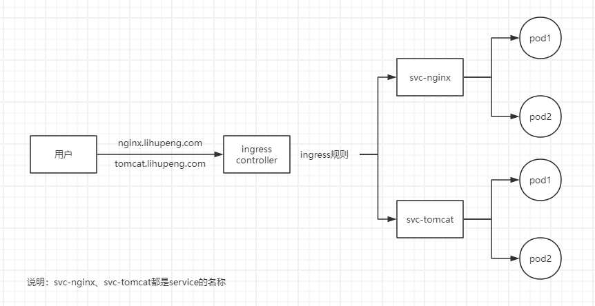

> 我们本次案例先使用 http 协议

```shell
# 准备一个namespace
[root@master ~]# kubectl create ns dev
namespace/dev created

[root@master ~]# kubectl get ns
NAME              STATUS   AGE
default           Active   133m
dev               Active   26s
ingress-nginx     Active   24m
kube-flannel      Active   113m
kube-node-lease   Active   133m
kube-public       Active   133m
kube-system       Active   133m
```

### 创建 Nginx 和 Tomcat 服务

> 在进行本次操作实验前，可以先将 k8s 集群中没用的东西都给删除，比如：service、deployment、pod 等等。

第一步：编写 yaml 文件，创建 Nginx 服务

```yaml
[root@master ~]# vim deploy-svc-nginx.yaml
apiVersion: apps/v1
kind: Deployment
metadata:
  name: deploy-nginx
  namespace: dev
spec:
  replicas: 2			# 这里起了两个副本
  selector:
    matchLabels:
      app: nginx
  template:
    metadata:
      labels:
        app: nginx
    spec:
      containers:
        - name: ctr1
          image: docker.1ms.run/nginx:1.24.0
          imagePullPolicy: IfNotPresent
          
---
apiVersion: v1
kind: Service
metadata:
  name: svc-nginx
  namespace: dev
  labels:
    app: nginx
spec:
  ports:
  - port: 80					# 服务端口
    targetPort: 80		# 容器端口
  selector:
    app: nginx
```

> 在一个 yaml 文件中是可以创建多个资源的，上面就是创建了 deployment 和 service。

第二步：应用 yaml 文件

```shell
[root@master ~]# kubectl apply -f deploy-svc-nginx.yaml
deployment.apps/deploy-nginx created
service/svc-nginx created
```

第三步：查看信息

```shell
[root@master ~]# kubectl get pod -n dev
NAME                            READY   STATUS    RESTARTS   AGE
deploy-nginx-6f448d5758-7gnln   1/1     Running   0          106s
deploy-nginx-6f448d5758-dj7sd   1/1     Running   0          106s

[root@master ~]# kubectl get deploy -n dev
NAME           READY   UP-TO-DATE   AVAILABLE   AGE
deploy-nginx   2/2     2            2           99s

[root@master ~]# kubectl get svc -n dev
NAME        TYPE        CLUSTER-IP      EXTERNAL-IP   PORT(S)   AGE
svc-nginx   ClusterIP   10.107.38.175   <none>        80/TCP    2m5s
```

第四步：编写 yaml 文件，创建 Tomcat 服务

```yaml
[root@master ~]# vim deploy-svc-tomcat.yaml
apiVersion: apps/v1
kind: Deployment
metadata:
  name: deploy-tomcat
  namespace: dev
spec:
  replicas: 2			# 这里起了两个副本
  selector:
    matchLabels:
      app: tomcat
  template:
    metadata:
      labels:
        app: tomcat
    spec:
      containers:
        - name: ctr1
          image: docker.1ms.run/tomcat:8.5-jre10-slim
          imagePullPolicy: IfNotPresent
          ports:
          - containerPort: 8080
          
---
apiVersion: v1
kind: Service
metadata:
  name: svc-tomcat
  namespace: dev
  labels:
    app: tomcat
spec:
  ports:
  - port: 8080					# 服务端口
    targetPort: 8080		# 容器端口
  selector:
    app: tomcat
```

> tomcat 的镜像也比较大，可以提前使用 ctr 命令下载好，使用 ctr 下载的时候下载到 k8s.io 命名空间。
>
> 也可以使用资料中提供的！！

第五步：应用 yaml 文件

```shell
[root@master ~]# kubectl apply -f deploy-svc-tomcat.yaml
deployment.apps/deploy-tomcat created
service/svc-tomcat created
```

第六步：查看信息

```shell
[root@master ~]# kubectl get pod -n dev
NAME                             READY   STATUS              RESTARTS   AGE
deploy-nginx-6f448d5758-7gnln    1/1     Running             0          33m
deploy-nginx-6f448d5758-dj7sd    1/1     Running             0          33m
deploy-tomcat-58997d9bd6-c2cn2   0/1     ContainerCreating   0          20s
deploy-tomcat-58997d9bd6-dc44f   0/1     ContainerCreating   0          20s

[root@master ~]# kubectl get deploy -n dev
NAME            READY   UP-TO-DATE   AVAILABLE   AGE
deploy-nginx    2/2     2            2           33m
deploy-tomcat   0/2     2            0           34s

[root@master ~]# kubectl get svc -n dev
NAME         TYPE        CLUSTER-IP      EXTERNAL-IP   PORT(S)    AGE
svc-nginx    ClusterIP   10.107.38.175   <none>        80/TCP     33m
svc-tomcat   ClusterIP   10.97.73.18     <none>        8080/TCP   47s
```

### 创建 Ingress（说明书）

第一步：编写 yaml 文件

```yaml
[root@master ~]# vim ingress-nginx-tomcat.yaml
apiVersion: networking.k8s.io/v1
kind: Ingress			# 类型是Ingress
metadata:
  name: ing-nginx-tomcat			# 自定义Ingress名称
  namespace: dev
spec:
  # 关联到class类型，用kubectl get ingressClass -n ingress-nginx查询
  ingressClassName: nginx
  rules:
  - host: nginx.lihupeng.com			# 自定义域名
    http:
      paths:
      - path: "/"
        pathType: Prefix
        backend:
          service:
            name: svc-nginx				# 对应上面创建的service的名称
            port:
              number: 80					# 后端服务的端口号
  - host: tomcat.lihupeng.com			# 自定义域名
    http:
      paths:
      - path: "/"
        pathType: Prefix
        backend:
          service:
            name: svc-tomcat				# 对应上面创建的service的名称
            port:
              number: 8080					# 后端服务的端口号
```

第二步：应用 yaml 文件创建 Ingress

```shell
[root@master ~]# kubectl apply -f ingress-nginx-tomcat.yaml
ingress.networking.k8s.io/ing-nginx-tomcat created
```

第三步：查看 Ingress 信息

```shell
[root@master ~]# kubectl get ingress -n dev
NAME               CLASS   HOSTS                                    ADDRESS   PORTS   AGE
ing-nginx-tomcat   nginx   nginx.lihupeng.com,tomcat.lihupeng.com             80      74s
```

```shell
# 查看Ingress的详细信息，确实可以看到发送不同的域名到达Ingress后，会转发到不同的service
[root@master ~]# kubectl describe ingress ing-nginx-tomcat -n dev
Name:             ing-nginx-tomcat
Labels:           <none>
Namespace:        dev
Address:
Ingress Class:    nginx
Default backend:  <default>
Rules:
  Host                 Path  Backends
  ----                 ----  --------
  nginx.lihupeng.com
                       /   svc-nginx:80 (10.244.1.3:80,10.244.2.3:80)
  tomcat.lihupeng.com
                       /   svc-tomcat:8080 (10.244.1.4:8080,10.244.2.4:8080)
Annotations:           <none>
Events:
  Type    Reason  Age    From                      Message
  ----    ------  ----   ----                      -------
  Normal  Sync    2m29s  nginx-ingress-controller  Scheduled for sync
```

### 客户端访问测试

第一步：确认 nginx-ingress-controller 的 pod ip，可以看到 IP 是 192.168.126.137

```shell
[root@master ~]# kubectl get pods -o wide -n ingress-nginx
NAME                                        READY   STATUS      RESTARTS   AGE    IP                NODE    NOMINATED NODE   READINESS GATES
ingress-nginx-admission-create-4rp7t        0/1     Completed   0          149m   10.244.2.2        node1   <none>           <none>
ingress-nginx-admission-patch-s965j         0/1     Completed   2          149m   10.244.1.2        node2   <none>           <none>
ingress-nginx-controller-5c55879b96-sm24m   1/1     Running     0          149m   192.168.126.137   node2   <none>           <none>
```

第二步：在集群之外任一主机中（**我这里为 Windows 的 hosts 文件**）添加域名与 IP 地址解析（模拟公网 DNS）

```shell
192.168.126.137 nginx.lihupeng.com
192.168.126.137 tomcat.lihupeng.com
```

第三步：访问及结果演示

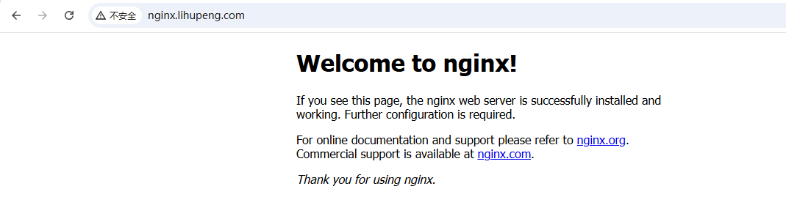

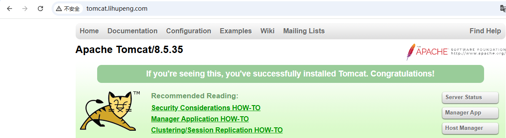

> 注意：我们在 Ingress 的规则中定义的是通过域名来转发到相应的服务中！所以大家不要用 IP 访问！！！IP 访问会报错！

## 【案例】Ingress-HTTPS

引子：

上面介绍了 Ingress + HTTP 方式的访问案例，在实际工作中，主要还是用 HTTPS。在这里，我们来简单配置一下，看一下 HTTPS 安全加固后，是否可以正常访问。

HTTPS 相对于 HTTP 有何区别？

* 端口不同，HTTP(80)、HTTPS(443)
* HTTP 传输(明文)，HTTPS 传输(加密)
* HTTP(不需要配置证书，直接就可以使用)，HTTPS(需要配置 SSL 证书 => 自己生成，浏览器不认可，购买第三方平台证书，如阿里云、腾讯云、华为云，1980/年，通过国外社区、Github 获取免费证书，免费，缺点：每3个月重新申请一次)

### 创建自签证书

```shell
[root@master ~]# mkdir ingress-https
[root@master ~]# cd ingress-https/
[root@master ingress-https]# openssl genrsa -out nginx.key 3072
[root@master ingress-https]# openssl req -new -x509 -key nginx.key -out nginx.pem -days 365
You are about to be asked to enter information that will be incorporated
into your certificate request.
What you are about to enter is what is called a Distinguished Name or a DN.
There are quite a few fields but you can leave some blank
For some fields there will be a default value,
If you enter '.', the field will be left blank.
-----
Country Name (2 letter code) [XX]:CN
State or Province Name (full name) []:beijing
Locality Name (eg, city) [Default City]:beijing
Organization Name (eg, company) [Default Company Ltd]:yunjisuan
Organizational Unit Name (eg, section) []:yunwei
Common Name (eg, your name or your server's hostname) []:lihupeng
Email Address []:15201008359@163.com

[root@master ingress-https]# ls
nginx.key  nginx.pem
```

openssl 命令详解：genrsa 用于生成密钥，-out 用于生成指定输出私钥名称，其中生成的密钥长度为 2048

### 将证书创建成 Secret

k8s => ConfigMap、Secret

作用类似：都是用于保存信息，如配置、密码等等。

ConfigMap：保存的是配置信息

Secret：保存敏感、重要信息，如：密码、证书等等，不希望被 pod 所直接使用

```shell
[root@master ingress-https]# kubectl create secret tls nginx-tls-secret --cert=nginx.pem --key=nginx.key -n ingress-nginx
secret/nginx-tls-secret created

[root@master ingress-https]# kubectl get secrets -n ingress-nginx | grep nginx-tls-secret
nginx-tls-secret          kubernetes.io/tls   2      8s
```

### 应用 yaml 文件

第一步：创建 yaml 文件

```yaml
[root@master ~]# vim ingress-https-aio.yml
apiVersion: apps/v1
kind: Deployment
metadata:
  name: deploy-nginx2
  namespace: dev
spec:
  replicas: 2			# 这里起了两个副本
  selector:
    matchLabels:
      app: nginx2
  template:
    metadata:
      labels:
        app: nginx2
    spec:
      containers:
        - name: ctr1
          image: docker.1ms.run/nginx:1.24.0
          imagePullPolicy: IfNotPresent
          ports:
          - name: http
            containerPort: 80
          - name: https
            containerPort: 443
---
apiVersion: v1
kind: Service
metadata:
  name: svc-nginx2
  namespace: dev
  labels:
    app: nginx2
spec:
  ports:
  - name: http
    port: 80					# 服务端口
    targetPort: 80		# 容器端口
  - name: https
    port: 443
    targetPort: 443
  selector:
    app: nginx2
---
apiVersion: networking.k8s.io/v1
kind: Ingress			# 类型是Ingress
metadata:
  name: ing-nginx2			# 自定义Ingress名称
  namespace: dev
spec:
  # 关联到class类型，用kubectl get ingressClass -n ingress-nginx查询
  ingressClassName: nginx
  tls:
  - hosts:
    - nginx2.lihupeng.com					# 域名
    secretName: nginx-tls-secret	# 调用前面创建的secret	
  rules:
  - host: nginx2.lihupeng.com			# 自定义域名
    http:
      paths:
      - path: "/"
        pathType: Prefix
        backend:
          service:
            name: svc-nginx2				# 对应上面创建的service的名称
            port:
              number: 80						# 后端服务的端口号
```

第二步：应用 yaml 文件

```shell
[root@master ~]# kubectl apply -f ingress-https-aio.yml
deployment.apps/deploy-nginx2 created
service/svc-nginx2 created
ingress.networking.k8s.io/ing-nginx2 created
```

第三步：查看信息

```shell
[root@master ~]# kubectl get pod -n dev
NAME                             READY   STATUS    RESTARTS   AGE
deploy-nginx-6f448d5758-7gnln    1/1     Running   0          151m
deploy-nginx-6f448d5758-dj7sd    1/1     Running   0          151m
deploy-nginx2-54bd677d95-8t2dh   1/1     Running   0          64s
deploy-nginx2-54bd677d95-q77jn   1/1     Running   0          64s
deploy-tomcat-58997d9bd6-c2cn2   1/1     Running   0          118m
deploy-tomcat-58997d9bd6-dc44f   1/1     Running   0          118m

[root@master ~]# kubectl get deploy -n dev
NAME            READY   UP-TO-DATE   AVAILABLE   AGE
deploy-nginx    2/2     2            2           151m
deploy-nginx2   2/2     2            2           87s
deploy-tomcat   2/2     2            2           118m

[root@master ~]# kubectl get svc -n dev
NAME         TYPE        CLUSTER-IP      EXTERNAL-IP   PORT(S)          AGE
svc-nginx    ClusterIP   10.107.38.175   <none>        80/TCP           152m
svc-nginx2   ClusterIP   10.107.69.102   <none>        80/TCP,443/TCP   108s
svc-tomcat   ClusterIP   10.97.73.18     <none>        8080/TCP         119m

[root@master ~]# kubectl get ingress -n dev
NAME               CLASS   HOSTS                                    ADDRESS   PORTS     AGE
ing-nginx-tomcat   nginx   nginx.lihupeng.com,tomcat.lihupeng.com             80        95m
ing-nginx2         nginx   nginx2.lihupeng.com                                80, 443   2m8s
```

### 客户端访问测试

修改 Windows 的 hosts 文件如下：

```shell
192.168.126.137 nginx.lihupeng.com
192.168.126.137 tomcat.lihupeng.com
192.168.126.137 nginx2.lihupeng.com
```

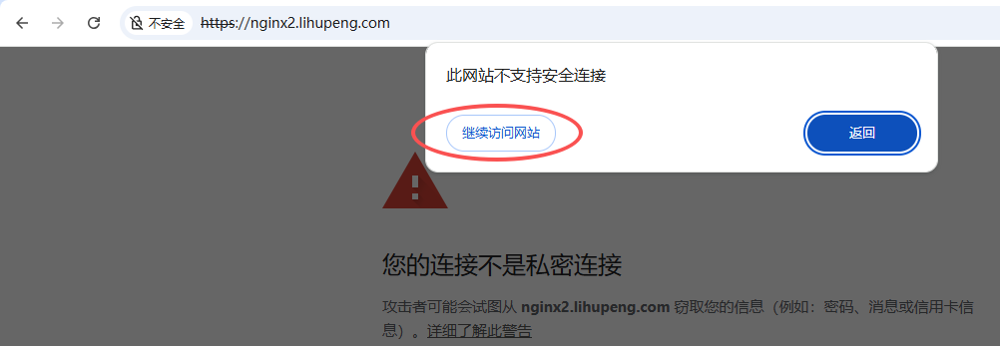

因为我们的这个安全证书是自己签的，不是阿里云、百度云等上面签的，所以会有这种提示！

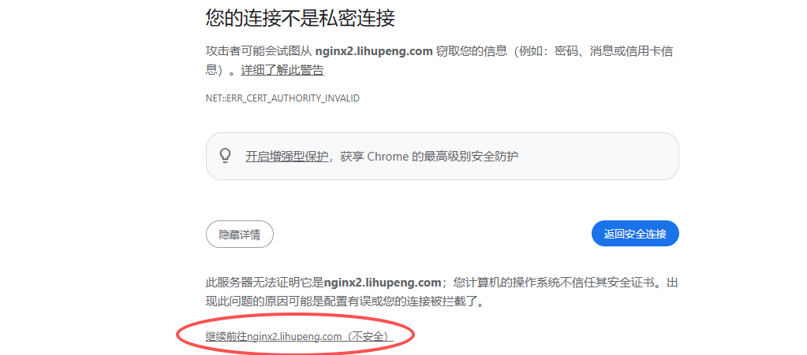

可以看到确实可以了：

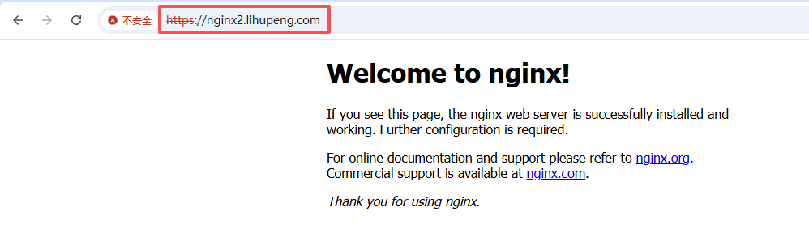

> 以后我们买了真正的安全证书配上就没有这种提示信息了！

## 【案例】Ingress + NodePort（不推荐）

引子：

上面都是 ClusterIP 类型的 Service，那么其他类型的，比如 NodePort 类型的 Service，也可以实现通过 Ingress 访问吗？

第一步：创建 yaml 文件

```yaml
[root@master ~]# vim ingress-nodeport.yml
apiVersion: apps/v1
kind: Deployment
metadata:
  name: deploy-nginx3
  namespace: dev
spec:
  replicas: 2			# 这里起了两个副本
  selector:
    matchLabels:
      app: nginx3
  template:
    metadata:
      labels:
        app: nginx3
    spec:
      containers:
        - name: ctr1
          image: docker.1ms.run/nginx:1.24.0
          imagePullPolicy: IfNotPresent
---
apiVersion: v1
kind: Service
metadata:
  name: svc-nginx3
  namespace: dev
  labels:
    app: nginx3
spec:
  type: NodePort
  ports:
  - port: 80
    targetPort: 80
  selector:
    app: nginx3
---
apiVersion: networking.k8s.io/v1
kind: Ingress			# 类型是Ingress
metadata:
  name: ing-nginx3			# 自定义Ingress名称
  namespace: dev
spec:
  # 关联到class类型，用kubectl get ingressClass -n ingress-nginx查询
  ingressClassName: nginx
  rules:
  - host: nginx3.lihupeng.com			# 自定义域名
    http:
      paths:
      - path: "/"
        pathType: Prefix
        backend:
          service:
            name: svc-nginx3				# 对应上面创建的service的名称
            port:
              number: 80					# 后端服务的端口号
```

第二步：应用 yaml 文件

```shell
[root@master ~]# kubectl apply -f ingress-nodeport.yml
deployment.apps/deploy-nginx3 created
service/svc-nginx3 created
ingress.networking.k8s.io/ing-nginx3 created
```

第三步：查看信息

```shell
[root@master ~]# kubectl get pod -n dev
NAME                             READY   STATUS    RESTARTS   AGE
deploy-nginx-6f448d5758-7gnln    1/1     Running   0          3h26m
deploy-nginx-6f448d5758-dj7sd    1/1     Running   0          3h26m
deploy-nginx2-54bd677d95-8t2dh   1/1     Running   0          56m
deploy-nginx2-54bd677d95-q77jn   1/1     Running   0          56m
deploy-nginx3-599ff6477-vlx6f    1/1     Running   0          35s
deploy-nginx3-599ff6477-w8xm6    1/1     Running   0          35s
deploy-tomcat-58997d9bd6-c2cn2   1/1     Running   0          173m
deploy-tomcat-58997d9bd6-dc44f   1/1     Running   0          173m

[root@master ~]# kubectl get svc -n dev
NAME         TYPE        CLUSTER-IP      EXTERNAL-IP   PORT(S)          AGE
svc-nginx    ClusterIP   10.107.38.175   <none>        80/TCP           3h29m
svc-nginx2   ClusterIP   10.107.69.102   <none>        80/TCP,443/TCP   58m
svc-nginx3   NodePort    10.97.93.125    <none>        80:30680/TCP     16s
svc-tomcat   ClusterIP   10.97.73.18     <none>        8080/TCP         175m

[root@master ~]# kubectl get ingress -n dev
NAME               CLASS   HOSTS                                    ADDRESS   PORTS     AGE
ing-nginx-tomcat   nginx   nginx.lihupeng.com,tomcat.lihupeng.com             80        152m
ing-nginx2         nginx   nginx2.lihupeng.com                                80, 443   59m
ing-nginx3         nginx   nginx3.lihupeng.com                                80        46s
```

其实我们可以通过 Windows 的浏览器直接访问 node 节点的指定端口，因为我们给 service 的类型是 NodePort，如下：

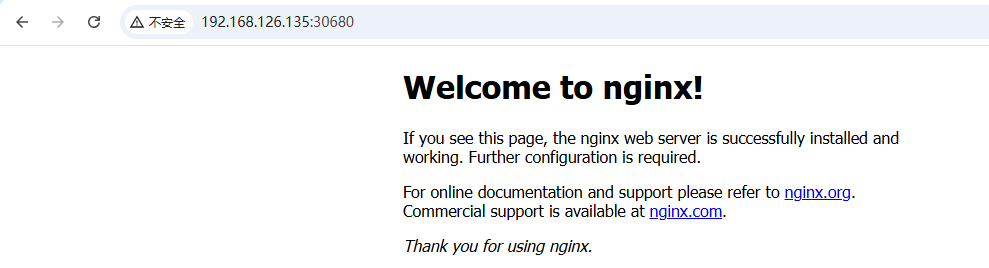

但这样就没走 Ingress。

第四步：在 Windows 中配置 hosts 文件，然后通过域名访问

```shell
192.168.126.137 nginx.lihupeng.com
192.168.126.137 tomcat.lihupeng.com
192.168.126.137 nginx2.lihupeng.com
192.168.126.137 nginx3.lihupeng.com
```

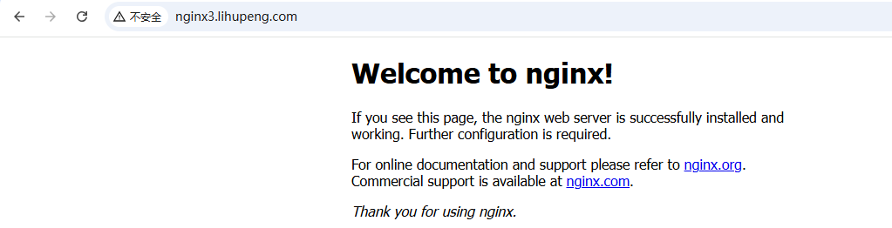

可以看到也可以访问！也就是说我们使用 Ingress 后，service 的类型是 ClusterIP 或者 NodePort 都可以的！

但是我们在实际工作中不推荐这种 Ingress + NodePort 的写法。还是推荐使用 Ingress + ClusterIP 的写法！

# 三、Traefik

## 概念介绍

参考：<https://traefik.cn/>

是一个为了让部署微服务更加便捷而诞生的现代 HTTP 反向代理、负载均衡工具。它支持多种后台（Docker、Swarm、Kubernetes、Marathon、Mesos、Consul、Etcd、zookeeper、BoltDB、RestAPI、file...）来自动化、动态的应用它的配置文件设置。

## 常规部署（部署 traefik ingress controller）

> 在实际工作中，我们只会选择一个 Ingress Controller 去使用，所以将我们 k8s 集群中的三台服务器都给还原快照，还原到搭建 Kubenetest Ingress Controller 之前。然后我们再来搭建 Traefik 的 Ingress Controller。

```shell
[root@master ~]# mkdir traefik && cd traefik/
```

准备 namespace：

```shell
[root@master traefik]# kubectl create ns dev

[root@master traefik]# kubectl get ns
NAME              STATUS   AGE
default           Active   20h
dev               Active   30m
kube-flannel      Active   20h
kube-node-lease   Active   20h
kube-public       Active   20h
kube-system       Active   20h
```

### traefik 部署口诀

traefik 核心遵循一个口诀：“三权一配置，一入一规则”

三权：要给 traefik 配置三个权限，从而实现 k8s 平台资源使用

一配置：有一个配置信息，配置 traefik 信息、启动功能模块

一入：定义监控端口信息（如 80、443 端口），接收对应的流量信息

一规则：Ingress，定义转发规则，请求过来了，应该转发到哪个 service 服务上

| **<font style="color:rgb(132, 134, 145);">类型</font>**<font style="color:rgb(132, 134, 145);">‌</font> | <font style="color:rgb(132, 134, 145);">‌</font>**<font style="color:rgb(132, 134, 145);">名称</font>**<font style="color:rgb(132, 134, 145);">‌</font> | <font style="color:rgb(132, 134, 145);">‌</font>**<font style="color:rgb(132, 134, 145);">作用说明</font>**<font style="color:rgb(132, 134, 145);">‌</font> |
| :--- | :--- | :--- |
| <font style="color:rgb(51, 51, 51);">权限一</font> | <font style="color:rgb(51, 51, 51);">ServiceAccount</font> | <font style="color:rgb(51, 51, 51);">给 Traefik 一个“身份”，让它合法地在集群中运行。</font> |
| <font style="color:rgb(51, 51, 51);">权限二</font> | <font style="color:rgb(51, 51, 51);">ClusterRole</font> | <font style="color:rgb(51, 51, 51);">规定这个身份能做什么，比如能读取哪些资源（如 Ingress、Service、Pod 等）。</font> |
| <font style="color:rgb(51, 51, 51);">权限三</font> | <font style="color:rgb(51, 51, 51);">ClusterRoleBinding</font> | <font style="color:rgb(51, 51, 51);">把权限与身份绑定起来，权限才能真正生效。</font> |
| <font style="color:rgb(51, 51, 51);">配置</font> | <font style="color:rgb(51, 51, 51);">ConfigMap</font> | <font style="color:rgb(51, 51, 51);">Traefik 的“说明书”：监听端口、启用模块（Dashboard、Middlewares 等）。</font> |
| <font style="color:rgb(51, 51, 51);">入口</font> | <font style="color:rgb(51, 51, 51);">entryPoints（在 ConfigMap 中）</font> | <font style="color:rgb(51, 51, 51);">定义 Traefik 监听哪些端口，比如 web: 80, websecure: 443。</font> |
| <font style="color:rgb(51, 51, 51);">一条规则</font> | <font style="color:rgb(51, 51, 51);">Ingress / IngressRoute</font> | <font style="color:rgb(51, 51, 51);">定义请求转发规则，比如“访问 abc.com 的请求转发到 svc-abc 的 8080 端口”。</font> |

traefik 具体配置过程：

| <font style="color:rgb(132, 134, 145);">‌</font>**<font style="color:rgb(132, 134, 145);">阶段</font>**<font style="color:rgb(132, 134, 145);">‌</font> | <font style="color:rgb(132, 134, 145);">‌</font>**<font style="color:rgb(132, 134, 145);">步骤</font>**<font style="color:rgb(132, 134, 145);">‌</font> | <font style="color:rgb(132, 134, 145);">‌</font>**<font style="color:rgb(132, 134, 145);">简述</font>**<font style="color:rgb(132, 134, 145);">‌</font> |
| :--- | :--- | :--- |
| <font style="color:rgb(51, 51, 51);">准备</font> | <font style="color:rgb(51, 51, 51);">配置 ConfigMap</font> | <font style="color:rgb(51, 51, 51);">告诉 Traefik 你监听哪些端口，要不要开启 Dashboard？</font> |
| <font style="color:rgb(51, 51, 51);">授权</font> | <font style="color:rgb(51, 51, 51);">创建 ServiceAccount</font> | <font style="color:rgb(51, 51, 51);">给 Traefik 一个“工作身份”</font> |
| <font style="color:rgb(51, 51, 51);">授权</font> | <font style="color:rgb(51, 51, 51);">定义 ClusterRole</font> | <font style="color:rgb(51, 51, 51);">告诉它可访问哪些资源（Ingress、Endpoints、Service 等）</font> |
| <font style="color:rgb(51, 51, 51);">授权</font> | <font style="color:rgb(51, 51, 51);">创建 ClusterRoleBinding</font> | <font style="color:rgb(51, 51, 51);">权限赋值给身份，真正授权</font> |
| <font style="color:rgb(51, 51, 51);">部署</font> | <font style="color:rgb(51, 51, 51);">DaemonSet + Service</font> | <font style="color:rgb(51, 51, 51);">部署 Traefik 实例，并开放端口给外部访问</font> |
| <font style="color:rgb(51, 51, 51);">使用</font> | <font style="color:rgb(51, 51, 51);">编写 Ingress 或 IngressRoute</font> | <font style="color:rgb(51, 51, 51);">配置访问规则，比如 demo.com 对应后端哪一组服务</font> |
| <font style="color:rgb(51, 51, 51);">验证</font> | <font style="color:rgb(51, 51, 51);">curl / 浏览器访问</font> | <font style="color:rgb(51, 51, 51);">看看是不是能够成功路由到你的后端应用</font> |

### 编排 ConfigMap

第一步：编写 ConfigMap 的 yaml 文件

```yaml
[root@master traefik]# vim traefik-config.yaml
apiVersion: v1
kind: ConfigMap
metadata:
  name: traefik-config
  namespace: dev
data:
  traefik.toml: |
    defaultEntryPoints = ["http","https"]
    defaultEntryPoints = ["http","https"]
    debug = false	  # 关闭调试模式，生产环境一般不开启调试，避免性能损耗和信息泄露
    logLevel = "INFO"
    
    # 不验证后端服务的证书，当使用 HTTPS 后端服务时，如果设置为 true 可能存在安全风险
    # 此设置主要用于测试或内部环境，在生产环境中建议设置为 false
    InsecureSkipVerify = true
    
    # 配置 Traefik 的入口点
    [entryPoints]
      [entryPoints.http]
      address = ":80"
      # 开启 HTTP 响应压缩功能，可减少数据传输量
      compress = true
      [entryPoints.https]
      address = ":443"
        [entryPoints.https.tls]

    [web]
      # traefix也带了一个web页面，可以访问8080端口
      address = ":8080"
      
    [kubernetes]
    [metrics]
      # 配置使用 Prometheus 进行指标收集
      [metrics.prometheus]
      # 定义 Prometheus 指标桶的边界，用于对请求响应时间等指标进行分桶统计
      buckets=[0.1, 0.3, 1.2, 5.0]
      entryPoint = "traefik"
    [ping]
    entryPoint = "http"
```

第二步：应用 yaml 文件

```shell
[root@master traefik]# kubectl apply -f traefik-config.yaml
configmap/traefik-config created
```

第三步：查看信息

```shell
[root@master traefik]# kubectl get configmap -n dev
NAME               DATA   AGE
kube-root-ca.crt   1      70m
traefik-config     1      29s
```

### 编排 ServiceAccount

大家还记得 Service 资源类型吗？Account 顾名思义，账户。

ServiceAccount 是 Kubernetes 集群中的另一种资源对象。

它为 Pod 内的进程提供了一个身份标识，类似于操作系统中的用户账户。

每个 ServiceAccount 都有一个关联的令牌（Token），Pod 可以使用这个令牌与 Kubernetes API 服务器进行交互。

第一步：编写 ServiceAccount 的 yaml 文件

```yaml
[root@master traefik]# vim traefik-serviceAccount.yaml
apiVersion: v1
kind: ServiceAccount
metadata:
  name: traefik-ingress-controller
  namespace: dev
```

第二步：应用 yaml 文件

```shell
[root@master traefik]# kubectl apply -f traefik-serviceAccount.yaml
serviceaccount/traefik-ingress-controller created
```

第三步：查看信息

```shell
[root@master traefik]# kubectl get ServiceAccount -n dev
NAME                         SECRETS   AGE
default                      0         5h52m
traefik-ingress-controller   0         23s
```

### 编排 RBAC

RBAC 是 Role-Based Access Control 的缩写，即基于角色的访问控制。

在这里作为了解，不是本章节的重点。

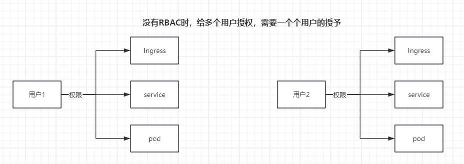

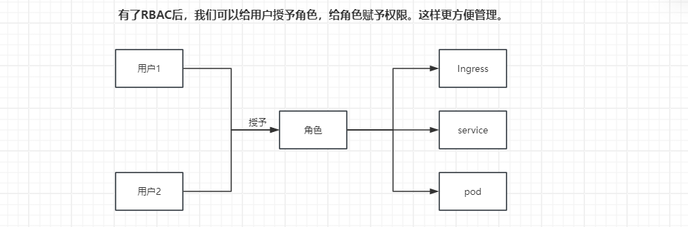

第一步：编写 yaml 文件

```yaml
[root@master traefik]# vim traefik-rbac.yaml
apiVersion: rbac.authorization.k8s.io/v1
kind: ClusterRole
metadata:
  name: traefik-ingress-controller
  namespace: dev
rules:
  - apiGroups:
      - ""
    resources:
      - services
      - endpoints
      - secrets
    verbs:
      - get
      - list
      - watch
  - apiGroups:
      - extensions
    resources:
      - ingresses
    verbs:
      - get
      - list
      - watch
  - apiGroups:
    - extensions
    resources:
    - ingresses/status
    verbs:
    - update
---
kind: ClusterRoleBinding
apiVersion: rbac.authorization.k8s.io/v1
metadata:
  name: traefik-ingress-controller
roleRef:
  apiGroup: rbac.authorization.k8s.io
  kind: ClusterRole
  name: traefik-ingress-controller   # 绑定的是上面定义的角色名
subjects:
- kind: ServiceAccount
  name: traefik-ingress-controller
  namespace: dev
```

第二步：应用 yaml 文件

```shell
[root@master traefik]# kubectl apply -f traefik-rbac.yaml
clusterrole.rbac.authorization.k8s.io/traefik-ingress-controller created
clusterrolebinding.rbac.authorization.k8s.io/traefik-ingress-controller created
```

### 编排 DaemonSet & Service

第一步：编写 yaml 文件

```yaml
[root@master traefik]# vim traefik-daemonSet-service.yaml
kind: DaemonSet
apiVersion: apps/v1
metadata:
  name: traefik-ingress-controller-v2
  namespace: dev
spec:
  selector:
    matchLabels: 		# 管理具有指定标签的 pod
      name: traefik-ingress-lb-v2
  template:
    metadata:	
      labels:			# 每个节点上保证创建有带这种标签的 pod
        k8s-app: traefik-ingress-lb
        name: traefik-ingress-lb-v2
    spec:
      serviceAccountName: traefik-ingress-controller
      terminationGracePeriodSeconds: 60
      containers:
      - image: docker.1ms.run/traefik:2.1.6
        name: traefik-ingress-lb-v2
        ports:
        - name: http
          containerPort: 80
          hostPort: 80		# 在对应主机上开放了 80 端口，和容器 80 映射
        - name: admin
          containerPort: 8080
          hostPort: 8080	# 在对应主机上开放了 8080 端口，和容器 8080 映射
        securityContext:
          capabilities:
            drop:
            - ALL
            add:
            - NET_BIND_SERVICE
        args:
        - --api
        - --api.insecure=true
        - --providers.kubernetesingress=true
        - --log.level=INFO
      volumes:
      - configMap:				# 挂载了 ConfigMap，后面会学到
          name: traefik-config
        name: config

---
kind: Service
apiVersion: v1
metadata:
  name: svc-traefik
  namespace: dev
spec:
  selector:
    k8s-app: traefik-ingress-lb-v2
  ports:
    - protocol: TCP
      port: 80
      name: web
    - protocol: TCP
      port: 8080
      name: admin
```

先手动拉取一下镜像，加快容器启动速度

```shell
[root@master traefik]# ctr -n k8s.io i pull docker.1ms.run/traefik:2.1.6
```

第二步：应用 yaml 文件

```shell
[root@master traefik]# kubectl apply -f traefik-daemonSet-service.yaml
daemonset.apps/traefik-ingress-controller-v2 created
service/svc-traefik created
```

第三步：查看信息

```shell
[root@master traefik]# kubectl get pod -n dev
NAME                                  READY   STATUS    RESTARTS   AGE
traefik-ingress-controller-v2-4qvcv   1/1     Running   0          2m53s
traefik-ingress-controller-v2-ctw8p   1/1     Running   0          2m53s

可以看到有2个pod。我们上面没有设置pod的个数，为什么会有2个pod？？？
这是因为我们使用的是DaemonSet控制器，这个控制器会保证在每个k8s集群的节点上都运行一个pod，除非这个节点上有污点没法调度运行！所以目前我们看到的2个pod，1个在node1上、1个在node2上。

[root@master traefik]# kubectl get pod -n dev -o wide
NAME                                  READY   STATUS    RESTARTS   AGE     IP           NODE    NOMINATED NODE   READINESS GATES
traefik-ingress-controller-v2-4qvcv   1/1     Running   0          4m41s   10.244.2.2   node1   <none>           <none>
traefik-ingress-controller-v2-ctw8p   1/1     Running   0          4m41s   10.244.1.3   node2   <none>           <none>
```

### 编排 Ingress

```yaml
[root@master traefik]# vim traefik-ingress.yaml
apiVersion: networking.k8s.io/v1
kind: Ingress											# 类型是Ingress
metadata:
  name: ing-traefik								# 自定义Ingress名称
  namespace: dev
spec:
  rules:
    - host: traefik.lihupeng.com	# 自定义域名
      http:
        paths:
          - path: "/"
            pathType: Prefix
            backend:
              service:
                name: svc-traefik   # 对应上面创建的service名称
                port:
                  number: 80				# 后端服务的端口号，需替换为实际端口号
```

```shell
[root@master traefik]# kubectl apply -f traefik-ingress.yaml
ingress.networking.k8s.io/ing-traefik created
```

```shell
[root@master traefik]# kubectl get ingress -n dev
NAME          CLASS    HOSTS                  ADDRESS   PORTS   AGE
ing-traefik   <none>   traefik.lihupeng.com             80      3m2s
```

### 说明

在前面的操作中，我们每次编写完 yaml 文件，都会应用它，然后查看信息。其实可以将所有的 yaml 文件编辑完后，一次性应用所有的文件！

```shell
# 应用当前所在目录中所有的yaml文件
[root@master traefik]# kubectl apply -f .
```

### 客户端访问测试

修改 Windows 中 hosts 文件

```shell
192.168.126.137 nginx.lihupeng.com
192.168.126.137 tomcat.lihupeng.com
192.168.126.137 nginx2.lihupeng.com
192.168.126.137 nginx3.lihupeng.com
192.168.126.137 traefik.lihupeng.com		=> 这里的IP只能写node1或node2的IP，因为node1和node2上才有traefik。
```

访问地址是：<http://traefik.lihupeng.com:8080>

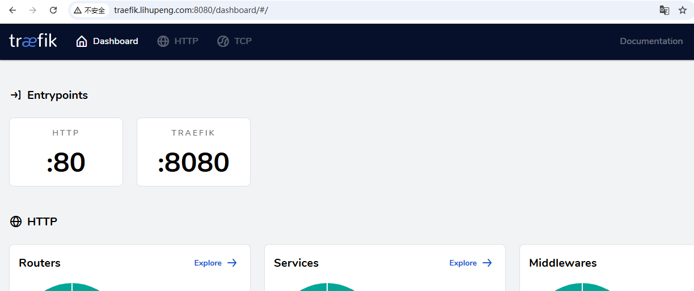

> 到此为止，我们只是将 traefik 的 Ingress Controller 给部署好了而已，下面的案例才是要达到访问 traefik 的 Ingress，然后将请求转发给 Service，Service 再将请求转发给 Pod！

## 【案例】基于 Ingress 转发请求到 svc-nginx 服务

第一步：编写 yaml 文件

```yaml
[root@master traefik]# vim traefik-deploy-nginx.yaml
kind: Deployment
apiVersion: apps/v1
metadata:
  name: nginx
  namespace: dev

spec:
  replicas: 1
  selector:
    matchLabels:
      app: nginx
  template:
    metadata:
      labels:
        app: nginx
    spec:
      containers:
      - name: nginx
        image: docker.1ms.run/nginx:1.24.0
        ports:
        - containerPort: 8089  # 容器内部监听的端口
          name: web
        volumeMounts:
        - name: nginx-config-volume
          mountPath: /etc/nginx/conf.d
      volumes:
      - name: nginx-config-volume
        configMap:
          name: nginx-config

---
apiVersion: v1
kind: ConfigMap
metadata:
  name: nginx-config
  namespace: dev
data:
  default.conf: |
    server {
        listen 8089;  # Nginx 监听的端口
        server_name _;

        location / {
            root   /usr/share/nginx/html;
            index  index.html index.htm;
        }
    }
---
apiVersion: v1
kind: Service
metadata:
  name: svc-nginx
  namespace: dev

spec:
  ports:
    - port: 80
      targetPort: 8089

  selector:
    app: nginx
```

第二步：应用 yaml 文件

```shell
[root@master traefik]# kubectl apply -f traefik-deploy-nginx.yaml
deployment.apps/nginx created
configmap/nginx-config created
service/svc-nginx created
```

第三步：查看信息

```shell
[root@master traefik]# kubectl get pod -n dev
NAME                                  READY   STATUS    RESTARTS   AGE
nginx-7cb6f7cfc8-fcb2l                1/1     Running   0          59s
traefik-ingress-controller-v2-4qvcv   1/1     Running   0          145m
traefik-ingress-controller-v2-ctw8p   1/1     Running   0          145m

[root@master traefik]# kubectl get deploy -n dev
NAME    READY   UP-TO-DATE   AVAILABLE   AGE
nginx   1/1     1            1           49s

[root@master traefik]# kubectl get svc -n dev
NAME          TYPE        CLUSTER-IP      EXTERNAL-IP   PORT(S)           AGE
svc-nginx     ClusterIP   10.98.216.86    <none>        80/TCP            75s
svc-traefik   ClusterIP   10.104.103.82   <none>        80/TCP,8080/TCP   145m
```

第四步：删除之前的 Ingress 信息

```yaml
[root@master traefik]# kubectl delete -f traefik-ingress.yaml
ingress.networking.k8s.io "ing-traefik" deleted
```

第五步：修改 yaml 文件，配置请求访问 Ingress 后的转发规则

```yaml
[root@master traefik]# vim traefik-ingress.yaml
apiVersion: networking.k8s.io/v1
kind: Ingress											# 类型是Ingress
metadata:
  name: ing-traefik								# 自定义Ingress名称
  namespace: dev
spec:
  rules:
    - host: traefik.lihupeng.com	# 自定义域名
      http:
        paths:
          - path: "/"
            pathType: Prefix
            backend:
              service:
                name: svc-nginx	  # 对应上面创建的service名称
                port:
                  number: 80			# 后端服务的端口号，需替换为实际端口号
```

第六步：应用文件

```shell
[root@master traefik]# kubectl apply -f traefik-ingress.yaml
ingress.networking.k8s.io/ing-traefik created
```

第七步：查看信息

```shell
[root@master traefik]# kubectl get ingress -n dev
NAME          CLASS    HOSTS                  ADDRESS   PORTS   AGE
ing-traefik   <none>   traefik.lihupeng.com             80      22s

[root@master traefik]# kubectl describe ingress ing-traefik -n dev
Name:             ing-traefik
Labels:           <none>
Namespace:        dev
Address:
Ingress Class:    <none>
Default backend:  <default>
Rules:
  Host                  Path  Backends
  ----                  ----  --------
  traefik.lihupeng.com
                        /   svc-nginx:80 (10.244.2.3:8089)
Annotations:            <none>
Events:                 <none>
```

第八步：Windows 浏览器访问


问题出现的原因：

<font style="color:rgb(51, 51, 51);">Kubernetes 从 v1.22 开始彻底移除了旧版 Ingress API（extensions/v1beta1）。</font>

<font style="color:rgb(51, 51, 51);">老版本 Traefik（如 v2.1.6）根本无法兼容新的Kubernetes 版本。</font>

<font style="color:rgb(51, 51, 51);">新版 Traefik（如 v2.10.4）默认支持 Kubernetes Ingress networking.k8s.io/v1 API。</font>

<font style="color:rgb(51, 51, 51);">解决方案：必须升级 Traefik 到最新版本（至少 v2.10.x 以上），调整镜像版本以及 RBAC 权限规则。</font>

<font style="color:rgb(51, 51, 51);">第一步：下载 traefik 的镜像</font>

```shell
[root@master traefik]# ctr -n k8s.io i pull docker.1ms.run/traefik:2.10.4
```

第二步：修改 traefik-daemonSet-service.yaml 文件中**镜像的版本**

```yaml
kind: DaemonSet
apiVersion: apps/v1
metadata:
  name: traefik-ingress-controller-v2
  namespace: dev
spec:
  selector:
    matchLabels: 		# 管理具有指定标签的 pod
      name: traefik-ingress-lb-v2
  template:
    metadata:	
      labels:			# 每个节点上保证创建有带这种标签的 pod
        k8s-app: traefik-ingress-lb
        name: traefik-ingress-lb-v2
    spec:
      serviceAccountName: traefik-ingress-controller
      terminationGracePeriodSeconds: 60
      containers:
      - image: docker.1ms.run/traefik:2.10.4
        name: traefik-ingress-lb-v2
        ports:
        - name: http
          containerPort: 80
          hostPort: 80		# 在对应主机上开放了 80 端口，和容器 80 映射
        - name: admin
          containerPort: 8080
          hostPort: 8080	# 在对应主机上开放了 8080 端口，和容器 8080 映射
        securityContext:
          capabilities:
            drop:
            - ALL
            add:
            - NET_BIND_SERVICE
        args:
        - --api
        - --api.insecure=true
        - --providers.kubernetesingress=true
        - --log.level=INFO
      volumes:
      - configMap:				# 挂载了 ConfigMap，后面会学到
          name: traefik-config
        name: config

---
kind: Service
apiVersion: v1
metadata:
  name: svc-traefik
  namespace: dev
spec:
  selector:
    k8s-app: traefik-ingress-lb-v2
  ports:
    - protocol: TCP
      port: 80
      name: web
    - protocol: TCP
      port: 8080
      name: admin
```

第三步：重新应用上面的文件

```shell
[root@master traefik]# kubectl apply -f traefik-daemonSet-service.yaml
daemonset.apps/traefik-ingress-controller-v2 configured
service/svc-traefik unchanged
```

第四步：修改 traefik-rbac.yaml 文件（**整个文件都修改为如下内容！！！其实可以先根据这个文件，将之前的资源内容删除，然后改完后再重新应用！因为本次修改的内容过多，好多资源名字也重新定义了！直接应用的话之前的内容还在！**）

```yaml
apiVersion: rbac.authorization.k8s.io/v1
kind: ClusterRole
metadata:
  name: traefik-role
rules:
  - apiGroups: [""]
    resources: ["services", "endpoints", "secrets"]
    verbs: ["get", "list", "watch"]
  - apiGroups: ["networking.k8s.io"]
    resources: ["ingresses", "ingressclasses"]
    verbs: ["get", "list", "watch"]
  - apiGroups: ["networking.k8s.io"]
    resources: ["ingresses/status"]
    verbs: ["update"]
---
kind: ClusterRoleBinding
apiVersion: rbac.authorization.k8s.io/v1
metadata:
  name: traefik-role-binding
roleRef:
  apiGroup: rbac.authorization.k8s.io
  kind: ClusterRole
  name: traefik-role   # 绑定的是上面定义的角色名
subjects:
- kind: ServiceAccount
  name: traefik-ingress-controller
  namespace: dev
```

第五步：重新应用上面的 yaml

```shell
[root@master traefik]# kubectl apply -f traefik-rbac.yaml
clusterrole.rbac.authorization.k8s.io/traefik-role created
clusterrolebinding.rbac.authorization.k8s.io/traefik-role-binding created
```

第六步：使用 Windows 中浏览器访问测试，没问题了！

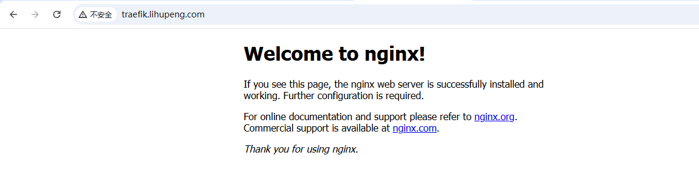

第七步：traefik 新旧版本的 web 管理界面对比：

使用旧版本的 traefik 时，它的管理页面是这样的：

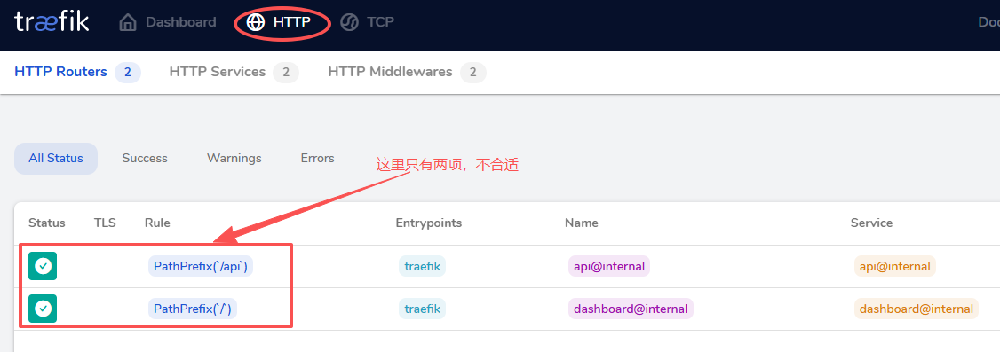

使用新版本的 traefik 时，它的管理页面是这样的：

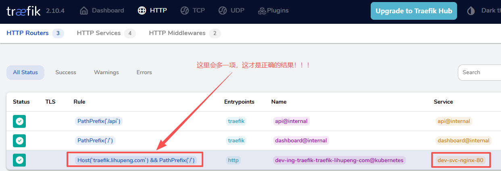

> 我们之前通过 yaml 文件创建资源的时候，为了促使它快速的能够拉取镜像跑起来，一般提前先使用 ctr 拉取镜像。但是最好还是知道该 pod 会调度到哪个节点后，去那个相应的节点中使用 ctr 命令拉取相应的镜像到 k8s.io 命名空间中！！！

## 总结

1、在 Ingress 文件中，不同的 Path 配置，可以转发到不同的 Service 去处理，从而调用不同的 Pod

2、以前 Service 都是通过不同的 IP + Port 访问的；有了 Ingress 以后，可以通过 API 的形式，访问不同的 Service，解决了端口号不好记和不够用的问题

3、上面搭建 traefik 的 Ingress Controller 还是比较麻烦的，在实际工作中里面的文件我们都可以直接使用，只需要将涉及到的域名和对应的 service 名等给改对了即可！

Ingress 的作用：

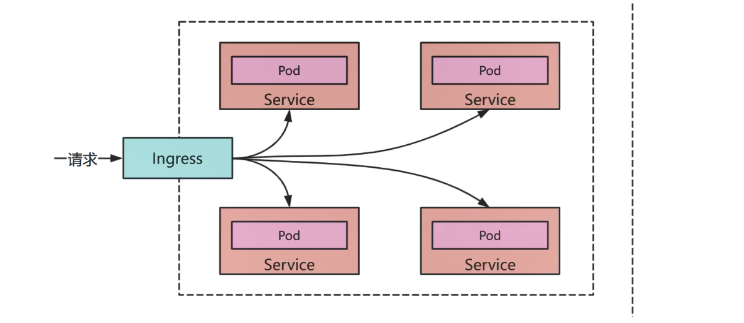


> 更新: 2026-01-21 11:28:11  
> 原文: <https://www.yuque.com/u41736172/az9urv/gtd8bxzgerag5zrt>