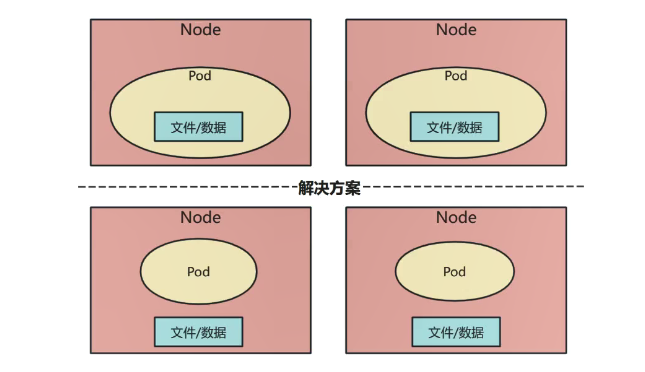
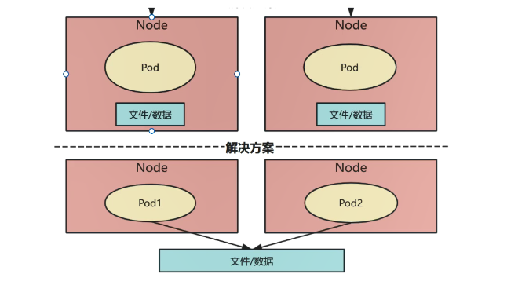
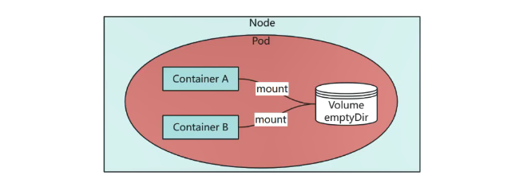
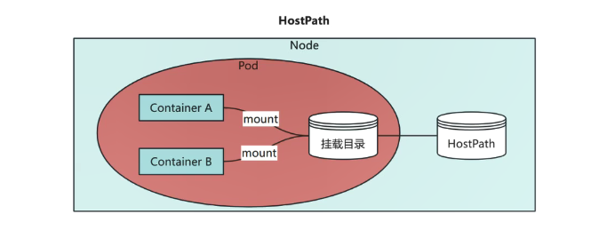
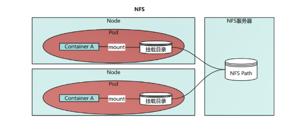
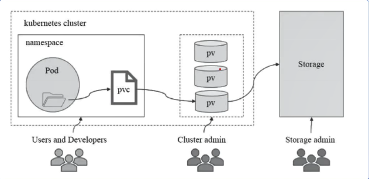

# 08.存储卷-PV-PVC-动态供给

我们学习过很多控制器，通过控制器可以对 Pod 进行控制。但是如果 Pod 停止后，它里面的数据也就丢失了！我们要想将 Pod 中的数据持久化的保存下来，就需要使用存储卷！

# 一、【了解】存储卷

## 背景介绍

问题一：

Pod 有生命周期，生命周期结束后 Pod 里的数据会消失（如配置文件、业务数据等）。

解决方案：

我们需要将数据与 Pod 分离，将数据放在专门的存储卷上。



***

问题二：

Pod 在 k8s 集群的节点中是可以调度的，如果 Pod 挂了被调度到另一个节点，那么数据和 Pod 的联系会中断。

解决方案：

所以我们需要与集群节点分离的存储系统才能实现数据持久化。



简单来说：Volume 提供了在容器上挂载外部存储的能力。

## 相关分类

Kubernetes 支持的存储卷类型非常丰富，使用下面的命令查看：

```shell
[root@master ~]# kubectl explain pod.spec.volumes
```

或者参考：<https://kubernetes.io/docs/concepts/storage/>

Kubernetes 常见的存储卷列表如下：

* configMap
* **emptyDir**：用于临时存储，Pod 删除则数据清除
* **secret**：加密数据信息
* **hostPath**：将宿主机目录挂载到 Pod，实现数据持久化
* fc（fibre channel）
* flexVolume
* flocker
* gcePersistentDisk
* gitRepo（deprecated）
* glusterfs
* iscsi
* local
* **nfs**：挂载 NFS 网络文件系统，多 Pod 可共享数据
* persistentVolumeClaim
* projected
* portworxVolume
* quobyte
* rbd
* scaleIO
* storageos
* vsphereVolume

我们将上面的存储卷列表进行简单的分类：

* 本地存储卷
* emptyDir pod 删除，数据也会被清除，用于数据的临时存储
* hostPath 将宿主机目录挂载到 Pod，实现数据持久化
* 网络存储卷
* NAS 类 nfs 等
* SAN 类 iscsi、FC 等
* 分布式存储 glusterfs、cephfs、rbd、cinder 等
* 云存储 aws、azurefile 等

# 二、本地存储卷

本地存储卷指的是利用宿主机的本地磁盘来提供存储服务，其优势在于性能较好。

不过也存在单点故障的风险，并且难以在不同节点间实现数据共享。

## emptyDir

### 相关概念

emptyDir 是临时存储卷，Pod 创建时，Kubernetes 在宿主机分配初始为空的目录。

应用场景：实现 Pod 内容器之间数据共享

特点：随着 Pod 被删除，该卷也会被删除



### 案例

第一步：创建 yaml 文件

```yaml
[root@master ~]# vim volume-emptydir.yml
apiVersion: v1
kind: Pod
metadata:
  name: volume-emptydir
spec:
  containers:
    - name: write  # 容器一，负责写
      image: docker.1ms.run/centos:centos6.7
      imagePullPolicy: IfNotPresent
      command: ["bash","-c","echo haha > /data/1.txt ; dd if=/dev/zero of=/data/file1 bs=1M count=1000; sleep 6000"]
      volumeMounts:
        - name: data
          mountPath: /data
    - name: read  # 容器二，负责读
      image: docker.1ms.run/centos:centos6.7
      imagePullPolicy: IfNotPresent
      command: ["bash","-c","cat /data/1.txt; sleep 6000"]
      volumeMounts:
        - name: data
          mountPath: /data
  volumes:
    - name: data
      emptyDir: {}
```

> 补充说明：
>
> `dd if=/dev/zero of=/data/file1 bs=1M count=1000`
>
> dd：这是一个用于复制和转换文件的命令
>
> if=/dev/zero：if 表示输入文件，/dev/zero 是一个特殊的设备文件，它会持续输出空字符
>
> of=/data/file1：of 表示输出文件，也就是把输入的数据复制到 /data/file1 文件中
>
> bs=1M：bs 表示 batch size，这里设定为 1MB，意味着每次读写 1MB 的数据
>
> coun=1000：count 表示复制的块数，这里是 1000 块
>
> 总和起来，这个子命令的作用是创建一个大小 wield1GB（1MB \* 1000）的文件 /data/file1，文件内容全是空字符

为了方便后面快速创建 Pod，我们先把镜像拉倒本地

```shell
# 拉取镜像
[root@master ~]# ctr -n k8s.io i pull docker.1ms.run/centos:centos6.7

# 应用yaml文件
[root@master ~]# kubectl apply -f volume-emptydir.yml
pod/volume-emptydir created
```

第二步：查看 pod 信息

```shell
# 查看pod信息
[root@master ~]# kubectl get pod
NAME              READY   STATUS    RESTARTS   AGE
volume-emptydir   2/2     Running   0          2m29s

# 查看pod详细信息
[root@master ~]# kubectl describe pod volume-emptydir | tail
  Type    Reason     Age    From               Message
  ----    ------     ----   ----               -------
  Normal  Scheduled  3m2s   default-scheduler  Successfully assigned default/volume-emptydir to node1
  Normal  Pulling    3m1s   kubelet            Pulling image "docker.1ms.run/centos:centos6.7"
  Normal  Pulled     2m13s  kubelet            Successfully pulled image "docker.1ms.run/centos:centos6.7" in 47.609s (47.609s including waiting). Image size: 67817472 bytes.
  Normal  Created    2m13s  kubelet            Created container: write
  Normal  Started    2m13s  kubelet            Started container write
  Normal  Pulled     2m13s  kubelet            Container image "docker.1ms.run/centos:centos6.7" already present on machine
  Normal  Created    2m13s  kubelet            Created container: read
  Normal  Started    2m12s  kubelet            Started container read
```

第三步：验证数据共享

write 容器写的数据，可以在 read 容器中进行读取。（也就是 emptyDir 可以实现在一个 Pod 中的多个容器之间数据的共享）

```shell
# 查看pod
[root@master ~]# kubectl get pod
NAME              READY   STATUS    RESTARTS   AGE
volume-emptydir   2/2     Running   0          21m

# 查看指定pod中指定的容器的日志信息  kubectl logs pod名称 容器名称
[root@master ~]# kubectl logs volume-emptydir write
1000+0 records in
1000+0 records out
1048576000 bytes (1.0 GB) copied, 14.181 s, 73.9 MB/s

# 查看指定pod中指定的容器的日志信息
[root@master ~]# kubectl logs volume-emptydir read
haha
```

第四步：验证删除

```shell
# 1. 查看pod信息，可以看到该pod是被调度在了node1服务器
[root@master ~]# kubectl get pod -o wide
NAME              READY   STATUS    RESTARTS   AGE   IP            NODE    NOMINATED NODE   READINESS GATES
volume-emptydir   2/2     Running   0          25m   10.244.2.79   node1   <none>           <none>

# 2. 查看node1服务器的磁盘的使用情况，上面pod中的写容器生成了一个1G的文件，如果我们删除pod后，node1的/var分区 已用 会发生变化！
[root@node1 ~]# df -h
文件系统                   容量  已用  可用 已用% 挂载点
devtmpfs                   4.0M     0  4.0M    0% /dev
tmpfs                      966M     0  966M    0% /dev/shm
tmpfs                      387M  6.4M  380M    2% /run
/dev/mapper/cs_bogon-root   14G  3.6G   11G   26% /
/dev/sda1                  960M  214M  747M   23% /boot
/dev/mapper/cs_bogon-home  960M   40M  921M    5% /home
/dev/mapper/cs_bogon-var    22G  4.2G   18G   19% /var

# 3. 删除pod
[root@master ~]# kubectl delete -f volume-emptydir.yml
pod "volume-emptydir" deleted

# 4. 再次查看node1服务器的磁盘使用情况
[root@node1 ~]# df -h
文件系统                   容量  已用  可用 已用% 挂载点
devtmpfs                   4.0M     0  4.0M    0% /dev
tmpfs                      966M     0  966M    0% /dev/shm
tmpfs                      387M  6.1M  381M    2% /run
/dev/mapper/cs_bogon-root   14G  3.6G   11G   26% /
/dev/sda1                  960M  214M  747M   23% /boot
/dev/mapper/cs_bogon-home  960M   40M  921M    5% /home
/dev/mapper/cs_bogon-var    22G  3.2G   19G   15% /var
```

## hostPath

### 相关概念

hostPath 存储卷将宿主机上的目录或文件直接映射到 Pod 中，使得 Pod 可以直接访问宿主机的文件系统。

应用场景：pod 内与节点目录映射（pod 中容器想访问节点上数据）

例如监控，只有监控访问到节点主机文件才能知道节点主机状态

缺点：如果节点挂掉，控制器在另一个节点拉起容器，数据就会变成另一台节点主机的了（无法实现数据共享）



### 案例

第一步：创建 yaml 文件

```yaml
[root@master ~]# vim volume-hostpath.yml
apiVersion: v1
kind: Pod
metadata:
  name: volume-hostpath
spec:
  containers:
    - name: busybox
      image: docker.1ms.run/busybox
      imagePullPolicy: IfNotPresent
      command: ["/bin/sh","-c","echo haha > /data/1.txt ; sleep 600"]
      volumeMounts:
        - name: data
          mountPath: /data
  volumes:
    - name: data
      hostPath:
        path: /opt  # 注意，此目录在宿主机必须存在，否则挂载不成功
        type: Directory
```

第二步：应用 yaml 文件

```shell
[root@master ~]# kubectl apply -f volume-hostpath.yml
pod/volume-hostpath created
```

第三步：查看信息

```shell
# 可以看到pod被调度到了node1服务器上
[root@master ~]# kubectl get pod -o wide
NAME              READY   STATUS    RESTARTS   AGE   IP            NODE    NOMINATED NODE   READINESS GATES
volume-hostpath   1/1     Running   0          20s   10.244.2.80   node1   <none>           <none>
```

查看 node1 服务器上的 /opt 目录内容，这个目录是和 pod 中容器数据目录挂载到一起了！

```shell
[root@node1 ~]# ls /opt/
1.txt  cni  containerd

[root@node1 ~]# cat /opt/1.txt
haha
```

第四步：进入 pod 容器中，然后查看信息。可以看到确实 Pod 容器中的 /data 目录和宿主机的 /opt 目录中的内容一模一样！！！

```powershell
[root@master ~]# kubectl exec -it volume-hostpath -- /bin/sh
/ # ls /data
1.txt       cni         containerd

/ # cat /data/1.txt
haha
```

第五步：删除 pod，然后观察节点上（宿主机）的数据是否还存在！！！可以看到数据还在，也就是说 hostPath 能够保证 Pod 删除后，在宿主机保留下来容器中的数据。

```powershell
[root@master ~]# kubectl delete -f volume-hostpath.yml
pod "volume-hostpath" deleted

[root@node1 ~]# ls /opt/
1.txt  cni  containerd

[root@node1 ~]# cat /opt/1.txt
haha
```

> 但是注意：如果再次启动 pod ，那么 pod 很有可能调度到别的节点上，那么新 pod 是无法共享使用到之前 pod 中的数据的，因为 Pod 换节点了！！！

# 三、网络存储卷

## NFS

NFS（Network File System）即网络文件系统，是一种分布式文件系统协议。它允许用户通过网络访问远程服务器上的文件，就像访问本地文件一样方便。

NFS 的工作原理是将服务器端的文件系统共享出来，客户端通过网络挂载该共享目录到本地，进行读写。

NAS（Network-Attached Storage）即网络附属存储，是一种基于文件级别的网络存储架构。



## 案例-安装 NFS 服务器

第一步：克隆一台最小化安装的服务器，修改 MAC 地址、IP 地址、主机名

IP：192.168.126.200，主机名：nfs.lhp.cn

第二步：安装 nfs 服务器

```powershell
[root@nfs ~]# dnf -y install nfs-utils
```

第三步：编写配置文件

```powershell
[root@nfs ~]# mkdir -p /data/nfs
[root@nfs ~]# vim /etc/exports
/data/nfs *(rw,no_root_squash,sync)
```

第四步：启动 NFS

```powershell
[root@nfs ~]# systemctl start nfs-server
[root@nfs ~]# systemctl enable nfs-server
```

第五步：在所有 k8s 节点（master、node1、node2），安装 NFS 客户端相关软件包

```powershell
# dnf -y install rpcbind nfs-utils
```

第六步：测试，在每个 k8s 节点上都执行以下命令

```powershell
# showmount -e 192.168.126.200
Export list for 192.168.126.200:
/data/nfs *			# *代表任何客户端都可以挂载使用这个共享目录
```

最终结果显示，每个节点上，都可以查看挂载。

## 案例-NFS-Pod 挂载

第一步：在 master 节点上，创建 yaml 文件

```yaml
[root@master ~]# vim volume-nfs.yml
apiVersion: apps/v1
kind: Deployment
metadata:
  name: volume-nfs
spec:
  replicas: 2
  selector:
    matchLabels:
      app: volume-nfs
  template:
    metadata:
      labels:
        app: volume-nfs
    spec:
      containers:
      - name: nginx
        image: docker.1ms.run/nginx:1.24.0
        imagePullPolicy: IfNotPresent
        volumeMounts:
        - name: documentroot
          mountPath: /usr/share/nginx/html
      volumes:
      - name: documentroot
        nfs:
          server: 192.168.126.200
          path: /data/nfs
```

第二步：应用 yaml

```shell
[root@master ~]# kubectl apply -f volume-nfs.yml
deployment.apps/volume-nfs created
```

第三步：查看信息

```shell
[root@master ~]# kubectl get deploy
NAME         READY   UP-TO-DATE   AVAILABLE   AGE
volume-nfs   2/2     2            2           23s

[root@master ~]# kubectl get pod
NAME                          READY   STATUS    RESTARTS   AGE
volume-nfs-6c548c59d5-krqgf   1/1     Running   0          34s
volume-nfs-6c548c59d5-ppf56   1/1     Running   0          34s
```

第四步：在 NFS 服务器的共享目录中创建文件

```shell
[root@nfs ~]# echo "hello nfs..." > /data/nfs/index.html
```

第五步：测试在两个 pod 中是否可以使用 NFS 中共享的文件

```shell
[root@master ~]# kubectl get pod -o wide
NAME                          READY   STATUS    RESTARTS   AGE   IP            NODE    NOMINATED NODE   READINESS GATES
volume-nfs-6c548c59d5-krqgf   1/1     Running   0          28m   10.244.2.81   node1   <none>           <none>
volume-nfs-6c548c59d5-ppf56   1/1     Running   0          28m   10.244.1.60   node2   <none>           <none>

# 可以看到访问Pod中的Nginx，确实获取到的是NFS中共享的文件！！！
[root@master ~]# curl http://10.244.2.81
hello nfs...

[root@master ~]# curl http://10.244.1.60
hello nfs...

# 可以看到查看容器中指定目录中的文件内容，发现就是NFS共享的内容！
[root@master ~]# kubectl exec -it volume-nfs-6c548c59d5-krqgf -- cat /usr/share/nginx/html/index.html
hello nfs...
[root@master ~]# kubectl exec -it volume-nfs-6c548c59d5-ppf56 -- cat /usr/share/nginx/html/index.html
hello nfs...
```

第六步：删除资源

```shell
[root@master ~]# kubectl delete -f volume-nfs.yml
deployment.apps "volume-nfs" deleted
```

# 四、PV 与 PVC

## 概念介绍

Kubernetes 存储卷类型丰富多样，每种类型都需编写对应的接口和参数，这无疑增加了维护和管理的难度。

PersistentVolume（PV）是已配置好的一段存储，其可以是任意类型的存储卷。简单来说，就是将网络存储资源进行共享，并配置定义为 PV。

PersistentVolumeClaim（PVC）则是用户 Pod 对 PV 的使用申请。用户无需关注存储卷的具体实现细节，只需明确自身的使用需求即可。

## 相互关系

PV 与 PVC 之间的相互关系是：

* PV 提供存储资源（生产者）
* PVC 使用存储资源（消费者）
* 使用 PVC 绑定 PV



也就是说使用 PV 和 PVC 之后，我们 K8S 集群中的 pod 要将数据保留下来，那就通过 PVC 去找 PV 申请空间大小，PV 后面连接真正提供存储的东西，PV 后面连接的可以是 NFS 的文件系统、ceph 分布式文件系统等。

## 案例-NFS 类型 PV 与 PVC

第一步：编写 yaml 文件，**创建 PV**

```yaml
[root@master ~]# vim pv-nfs.yml
apiVersion: v1
kind: PersistentVolume  		# 类型为PersistentVolume(pv)
metadata:
  name: pv-nfs  						# 名称
spec:
  capacity:
    storage: 1Gi  					# 大小
  accessModes:
    - ReadWriteMany  				# 访问模式
  nfs:
    path: /data/nfs  				# nfs共享目录
    server: 192.168.126.200	# nfs-server的地址
```

Capacity（存储能力）：一般来说，一个 PV 对象都要指定一个存储能力，通过 PV 的 capacity 属性来设置的，目前只支持存储空间的设置，就是我们这里的 storage=1Gi，不过未来可能会加入 IOPS、吞吐量等指标的配置。

访问模式有 3 种 参考：<https://kubernetes.io/docs/concepts/storage/persistent-volumes/#access-modes>

* ReadWriteOnce 单节点读写挂载
* ReadOnlyMany 多节点只读挂载
* ReadWriteMany 多节点读写挂载

第二步：应用 yaml 文件

```shell
[root@master ~]# kubectl apply -f pv-nfs.yml
persistentvolume/pv-nfs created
```

第三步：查看信息

```shell
[root@master ~]# kubectl get pv
NAME     CAPACITY   ACCESS MODES   RECLAIM POLICY   STATUS      CLAIM   STORAGECLASS   VOLUMEATTRIBUTESCLASS   REASON   AGE
pv-nfs   1Gi        RWX            Retain           Available                          <unset>
```

说明:

RWX 为 ReadWriteMany 的简写

Retain 是回收策略

Retain 表示需要不使用了需要手动回收

参考：<https://kubernetes.io/docs/concepts/storage/persistent-volumes/#reclaim-policy>

我这里指定的 PV  的回收策略为 Retain，目前 PV 支持的策略有三种:

Retain（保留）- 保留数据，需要管理员手工清理数据

Recycle（回收）- 清除 PV  中的数据，效果相当于执行 rm-rf /thevoluem/\*

Delete（删除）- 与 PV 相连的后端存储完成 volume 的删除操作，当然这常见于云服务商的存储服务，比如 ASW EBS。

不过需要注意的是，目前只有 NFS 和 HostPath 两种类型支持回收策略。当然一般来说还是设置为 Retain 这种策略保险一点。

第四步：编写\*\*创建 PVC \*\*的 yaml

```yaml
[root@master ~]# vim pvc-nfs.yml
apiVersion: v1
kind: PersistentVolumeClaim  	# 类型为PersistentVolumeClaim(pvc)
metadata:
  name: pvc-nfs  							# pvc的名称
spec:
  accessModes:
    - ReadWriteMany  					# 访问模式
  resources:
    requests:
      storage: 1Gi  					# 申请资源大小(PV > PVC)
```

第五步：应用 yaml

```shell
[root@master ~]# kubectl apply -f pvc-nfs.yml
persistentvolumeclaim/pvc-nfs created
```

第六步：查看信息

```shell
[root@master ~]# kubectl get pvc
NAME      STATUS   VOLUME   CAPACITY   ACCESS MODES   STORAGECLASS   VOLUMEATTRIBUTESCLASS   AGE
pvc-nfs   Bound    pv-nfs   1Gi        RWX                           <unset>                 27s
```

<font style="color:rgb(51, 51, 51);">注意‌：</font><code><font style="color:rgb(51, 51, 51);">STATUS</font></code><font style="color:rgb(51, 51, 51);">必须为‌ </font>**<font style="color:rgb(51, 51, 51);">Bound </font>**<font style="color:rgb(51, 51, 51);">‌状态（Bound 状态表示 PVC 与 PV 绑定成功）。</font>

<font style="color:rgb(51, 51, 51);">【关键字段解析】：</font>

* <font style="color:rgb(51, 51, 51);">‌STATUS‌：PVC 的状态，</font><code><font style="color:rgb(51, 51, 51);">Bound</font></code><font style="color:rgb(51, 51, 51);">表示该 PVC 已成功绑定到一个持久卷（PV）。</font>
* <font style="color:rgb(51, 51, 51);">‌VOLUME‌：绑定的 PV 的名称，即</font><code><font style="color:rgb(51, 51, 51);">pv-nfs</font></code><font style="color:rgb(51, 51, 51);">。</font>
* <font style="color:rgb(51, 51, 51);">‌CAPACITY‌：PVC 请求的存储容量，这里是‌ 1Gi‌。</font>
* <font style="color:rgb(51, 51, 51);">‌ACCESS MODES‌：访问模式，</font><code><font style="color:rgb(51, 51, 51);">RWX</font></code><font style="color:rgb(51, 51, 51);">表示可被多个节点以读写方式挂载。</font>
* <font style="color:rgb(51, 51, 51);">‌STORAGECLASS‌：使用的存储类，此处为空，可能使用默认存储类或未指定。</font>
* <font style="color:rgb(51, 51, 51);">‌VOLUMEATTRIBUTESCLASS‌：卷属性类，</font><code><font style="color:rgb(51, 51, 51);"><unset></font></code><font style="color:rgb(51, 51, 51);">表示未设置。</font>

<font style="color:rgb(51, 51, 51);">第七步：编写 yaml 文件，</font>**<font style="color:rgb(51, 51, 51);">创建 Deployment</font>**

```yaml
[root@master ~]# vim deploy-nginx-nfs.yml
apiVersion: apps/v1
kind: Deployment
metadata:
  name: deploy-nginx-nfs
spec:
  replicas: 2
  selector:
    matchLabels:
      app: nginx
  template:
    metadata:
      labels:
        app: nginx
    spec:
      containers:
      - name: nginx
        image: docker.1ms.run/nginx:1.24.0
        imagePullPolicy: IfNotPresent
        volumeMounts:
        - name: www
          mountPath: /usr/share/nginx/html
      volumes:
      - name: www
        persistentVolumeClaim:
          claimName: pvc-nfs
```

第八步：应用 yaml 文件

```shell
[root@master ~]# kubectl apply -f deploy-nginx-nfs.yml
deployment.apps/deploy-nginx-nfs created
```

第九步：查看信息

```shell
[root@master ~]# kubectl get deploy
NAME               READY   UP-TO-DATE   AVAILABLE   AGE
deploy-nginx-nfs   2/2     2            2           17s

[root@master ~]# kubectl get pod
NAME                                READY   STATUS    RESTARTS   AGE
deploy-nginx-nfs-7986d5c96d-mgfs9   1/1     Running   0          21s
deploy-nginx-nfs-7986d5c96d-rbcz7   1/1     Running   0          21s
```

第十步：往 NFS 服务中共享目录写入文件内容

```shell
[root@nfs ~]# vim /data/nfs/index.html
hello pv pvc.....
```

第十一步：查看上面的两个 pod 中的容器中是否有 NFS 中共享的内容

```shell
[root@master ~]# kubectl get pod
NAME                                READY   STATUS    RESTARTS   AGE
deploy-nginx-nfs-7986d5c96d-mgfs9   1/1     Running   0          4m22s
deploy-nginx-nfs-7986d5c96d-rbcz7   1/1     Running   0          4m22s

[root@master ~]# kubectl exec -it deploy-nginx-nfs-7986d5c96d-mgfs9 -- cat /usr/share/nginx/html/index.html
hello pv pvc.....

[root@master ~]# kubectl exec -it deploy-nginx-nfs-7986d5c96d-rbcz7 -- cat /usr/share/nginx/html/index.html
hello pv pvc.....
```

第十二步：删除资源

```shell
```

# 五、存储的动态供给

## 概念介绍

每次使用存储要先创建 pv，再创建 pvc，真累！所以我们可以实现使用存储的动态供给特性。

* 静态存储需要用户申请 PVC 时保证容量和读写类型与预置 PV 的容量及读写类型完全匹配，而动态存储则无需如此。
* 管理员无需预先创建大量的 PV 作为存储资源

Kubernetes 从 1.4 版起引入了一个新的资源对象 **StorageClass**，可用于将存储资源定义为具有显著特性的类(Class)而不是具体的PV。

**用户通过 PVC 直接向意向的类别发出申请**，匹配由管理员事先创建的 PV，**或者由其按需为用户动态创建 PV，这样就免去了需要先创建 PV 的过程。**

你可以理解为：

StorageClass 决定了用哪种存储系统、什么性能、什么回收策略、怎么自动分配卷等。

用户只需要声明"我要一个 10G 的存储，类型叫 xxx”，K8s 就会自动找 StorageClass，帮你自动创建 PV 并绑定 PVC，无需手动写PV。

PV 对存储系统的支持可通过其插件来实现，目前，Kubernetes 支持如下类型的插件。

官方地址 : <https://kubernetes.io/docs/concepts/storage/storage-classes/>

## 案例

### 相关准备

保证 NFS 服务器正常

```shell
# 在k8s节点上执行命令
# showmount -e 192.168.126.200
Export list for 192.168.126.200:
/data/nfs *				# *表示任何客户端都可以挂载使用这个共享目录
```

***

后面步骤中用到的 yaml 文件，基本都是从这个官方地址下载的：

<https://github.com/kubernetes-sigs/nfs-subdir-external-provisioner/tree/master/deploy>

### 创建 StorageClass

Kubernetes 中的 StorageClass 用于定义存储的类型和属性。

Kubernetes 会根据该 StorageClass 的配置调用相应的供给器来创建持久卷。（persistent volume）

```yaml
# 创建yaml文件
[root@master ~]# vim nfs-storageclass.yaml
apiVersion: storage.k8s.io/v1
kind: StorageClass
metadata:
  name: nfs-storage
provisioner: k8s-sigs.io/nfs-subdir-external-provisioner  # 指定供应商
parameters:
  archiveOnDelete: "false"  															# false表示删除pvc时不保留数据
```

```shell
# 应用yaml文件
[root@master ~]# kubectl apply -f nfs-storageclass.yaml
storageclass.storage.k8s.io/nfs-storage created
```

```shell
# 查看信息
[root@master ~]# kubectl get storageclass
NAME          PROVISIONER                                   RECLAIMPOLICY   VOLUMEBINDINGMODE   ALLOWVOLUMEEXPANSION   AGE
nfs-storage   k8s-sigs.io/nfs-subdir-external-provisioner   Delete          Immediate           false                  16s

# 或者
[root@master ~]# kubectl get sc
NAME          PROVISIONER                                   RECLAIMPOLICY   VOLUMEBINDINGMODE   ALLOWVOLUMEEXPANSION   AGE
nfs-storage   k8s-sigs.io/nfs-subdir-external-provisioner   Delete          Immediate           false                  50s
```

### 创建 RBAC

```yaml
# ServiceAccount用于为Pod提供身份验证信息
# NFS动态供给器需要一个ServiceAccount来与Kubernetes API进行交互，执行创建和管理持久卷等操作

# 创建yaml文件
[root@master ~]# vim nfs-rbac.yaml
apiVersion: v1
kind: ServiceAccount
metadata:
  name: nfs-client-provisioner
  # replace with namespace where provisioner is deployed
  namespace: default
---
kind: ClusterRole
apiVersion: rbac.authorization.k8s.io/v1
metadata:
  name: nfs-client-provisioner-runner
rules:
  - apiGroups: [""]
    resources: ["nodes"]
    verbs: ["get", "list", "watch"]
  - apiGroups: [""]
    resources: ["persistentvolumes"]
    verbs: ["get", "list", "watch", "create", "delete"]
  - apiGroups: [""]
    resources: ["persistentvolumeclaims"]
    verbs: ["get", "list", "watch", "update"]
  - apiGroups: ["storage.k8s.io"]
    resources: ["storageclasses"]
    verbs: ["get", "list", "watch"]
  - apiGroups: [""]
    resources: ["events"]
    verbs: ["create", "update", "patch"]
---
kind: ClusterRoleBinding
apiVersion: rbac.authorization.k8s.io/v1
metadata:
  name: run-nfs-client-provisioner
subjects:
  - kind: ServiceAccount
    name: nfs-client-provisioner
    # replace with namespace where provisioner is deployed
    namespace: default
roleRef:
  kind: ClusterRole
  name: nfs-client-provisioner-runner
  apiGroup: rbac.authorization.k8s.io
---
kind: Role
apiVersion: rbac.authorization.k8s.io/v1
metadata:
  name: leader-locking-nfs-client-provisioner
  # replace with namespace where provisioner is deployed
  namespace: default
rules:
  - apiGroups: [""]
    resources: ["endpoints"]
    verbs: ["get", "list", "watch", "create", "update", "patch"]
---
kind: RoleBinding
apiVersion: rbac.authorization.k8s.io/v1
metadata:
  name: leader-locking-nfs-client-provisioner
  # replace with namespace where provisioner is deployed
  namespace: default
subjects:
  - kind: ServiceAccount
    name: nfs-client-provisioner
    # replace with namespace where provisioner is deployed
    namespace: default
roleRef:
  kind: Role
  name: leader-locking-nfs-client-provisioner
  apiGroup: rbac.authorization.k8s.io
```

```powershell
# 应用yaml文件
[root@master ~]# kubectl apply -f nfs-rbac.yaml
serviceaccount/nfs-client-provisioner unchanged
clusterrole.rbac.authorization.k8s.io/nfs-client-provisioner-runner unchanged
clusterrolebinding.rbac.authorization.k8s.io/run-nfs-client-provisioner created
role.rbac.authorization.k8s.io/leader-locking-nfs-client-provisioner unchanged
rolebinding.rbac.authorization.k8s.io/leader-locking-nfs-client-provisioner configured
```

### 创建 Deployment

<font style="color:rgb(51, 51, 51);">创建 NFS 动态供给器的 Deployment，可以保证 NFS 动态供给器持续稳定运行。‌</font>\ <font style="color:rgb(51, 51, 51);">‌这里用到的镜像（软件）版本是 nfs-subdir-external-provisioner:v4.0.0</font>

```yaml
# 创建yaml文件
[root@master ~]# vim nfs-deployment.yaml
apiVersion: apps/v1
kind: Deployment
metadata:
  name: nfs-client-provisioner
  labels:
    app: nfs-client-provisioner
  # replace with namespace where provisioner is deployed
  namespace: default
spec:
  replicas: 1
  strategy:
    type: Recreate
  selector:
    matchLabels:
      app: nfs-client-provisioner
  template:
    metadata:
      labels:
        app: nfs-client-provisioner
    spec:
      serviceAccountName: nfs-client-provisioner
      containers:
        - name: nfs-client-provisioner
          image: docker.1ms.run/eipwork/nfs-subdir-external-provisioner:v4.0.2
          volumeMounts:
            - name: nfs-client-root
              mountPath: /persistentvolumes			# 将NFS共享目录挂载到容器的路径
          env:
            - name: PROVISIONER_NAME		# 指定供给器的名称
              value: k8s-sigs.io/nfs-subdir-external-provisioner
            - name: NFS_SERVER
              value: 192.168.126.200		# 替换为你的NFS服务器的IP
            - name: NFS_PATH
              value: /data/nfs					# 替换为你的NFS共享目录
      volumes:
        - name: nfs-client-root
          nfs:
            server: 192.168.126.200			# 替换为你的NFS服务器的IP
            path: /data/nfs							# 替换为你的NFS共享目录
```

```powershell
# 应用yaml文件
[root@master ~]# kubectl apply -f nfs-deployment.yaml
deployment.apps/nfs-client-provisioner created
```

***

上面的 yaml 都是从官方下载的，接下来要写的 yaml 主要就是我们自己的了。

### 创建 PVC

```yaml
# 创建yaml文件
[root@master ~]# vim nfs-pvc.yaml
apiVersion: v1
kind: PersistentVolumeClaim
metadata:
  name: nfs-pvc
spec:
  accessModes:
  - ReadWriteMany
  storageClassName: nfs-storage			# 这个名字必须是上面创建StorageClass起的名字
  resources:
    requests:
      storage: 1Gi
```

```powershell
# 应用yaml文件
[root@master ~]# kubectl apply -f nfs-pvc.yaml
persistentvolumeclaim/nfs-pvc created
```

```powershell
# 查看信息
[root@master ~]# kubectl get pvc
NAME      STATUS   VOLUME                                     CAPACITY   ACCESS MODES   STORAGECLASS   VOLUMEATTRIBUTESCLASS   AGE
nfs-pvc   Bound    pvc-5c12da92-d522-4685-88a7-0f92d9399457   1Gi        RWX            nfs-storage    <unset>                 45s
```

### 创建 pod

```yaml
[root@master ~]# vim nfs-pod.yaml
apiVersion: v1
kind: Pod
metadata:
  name: nfs-pod
spec:
  containers:
  - name: nginx
    image: docker.1ms.run/nginx:1.24.0
    volumeMounts:
    - name: nfs-volume
      mountPath: /usr/share/nginx/html
  volumes:
  - name: nfs-volume
    persistentVolumeClaim:
      claimName: nfs-pvc
```

```powershell
[root@master ~]# kubectl apply -f nfs-pod.yaml
pod/nfs-pod created
```

### 创建文件

查看 NFS 共享目录

```powershell
[root@nfs ~]# ls /data/nfs/
default-nfs-pvc-pvc-5c12da92-d522-4685-88a7-0f92d9399457  index.html

default-nfs-pvc-pvc-5c12da92-d522-4685-88a7-0f92d9399457就是动态供给创建的一个目录，这个目录就是共享的目录
```

在 NFS 共享目录创建首页文件

```powershell
[root@nfs ~]# echo helloworld > /data/nfs/default-nfs-pvc-pvc-5c12da92-d522-4685-88a7-0f92d9399457/index.html
```

### 访问测试

```powershell
[root@master ~]# kubectl get pod -o wide
NAME                                      READY   STATUS    RESTARTS   AGE     IP            NODE    NOMINATED NODE   READINESS GATES
nfs-client-provisioner-5454c9fb84-sg6kv   1/1     Running   0          20m     10.244.2.83   node1   <none>           <none>
nfs-pod                                   1/1     Running   0          5m57s   10.244.2.84   node1   <none>           <none>

# 访问Pod容器，能够看到NFS共享的文件内容！
[root@master ~]# curl http://10.244.2.84
helloworld
```


> 更新: 2026-01-26 14:19:55  
> 原文: <https://www.yuque.com/u41736172/az9urv/iu7yg2w9hfmg3lav>