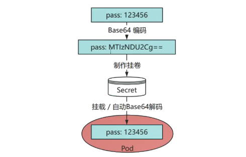
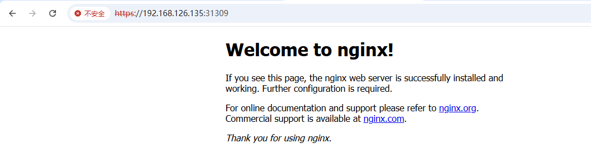
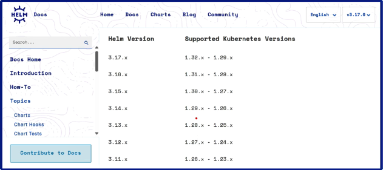
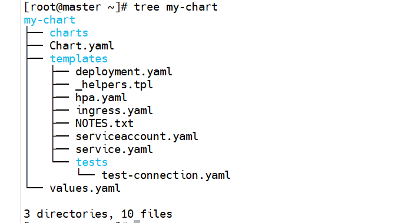
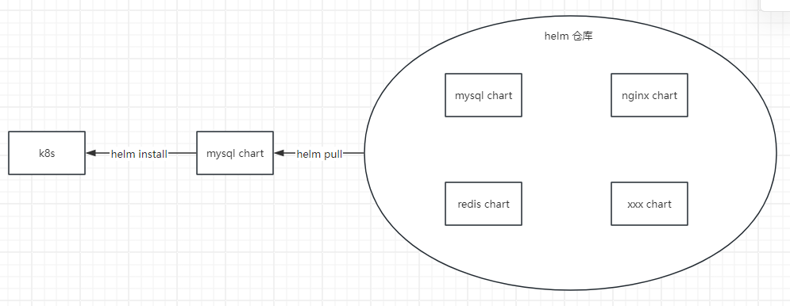
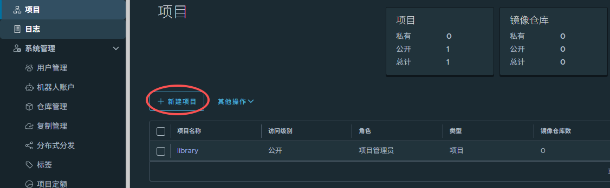
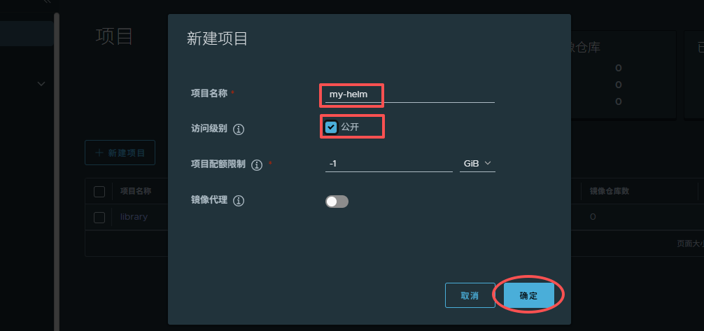
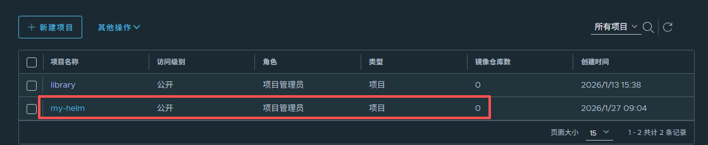

# 09.K8S配置与Helm包管理工具

# 一、ConfigMap

## 什么是 ConfigMap

ConfigMap 是 Kubernetes 用来管理"非敏感配置信息”的对象，可以把各种配置参数（如：配置信息、环境变量、配置文件内容等）集中存储，然后注入到 Pod 内部，实现配置和代码解耦。

常用于：存储数据库地址、端口、业务参数、配置信息等明文数据。

作用：

集中管理应用配置，不用把配置写死在镜像里，方便不同环境动态调整。

支持多种注入方式，可作为环境变量注入到容器，也可以作为文件直接挂载到容器目录。

支持热更新（文件挂载方式），修改 ConfigMap 后，Pod 内挂载的文件会自动同步更新（几十秒内）

常用场景：

* 多环境切换（如测试/生产不同数据库地址）
* 微服务参数集中管理
* Nginx、SpringBoot、前端等配置文件挂载

## ConfigMap 创建方式

**方式一：命令行直接创建**

基本语法：`kubectl create configmap my-cm --from-literal=key=value`

```shell
[root@master ~]# kubectl create configmap cm1 --from-literal=host=127.0.0.1 --from-literal=port=3306
configmap/cm1 created

[root@master ~]# kubectl get cm
NAME               DATA   AGE
cm1                2      5s
kube-root-ca.crt   1      10d

[root@master ~]# kubectl describe cm cm1
Name:         cm1
Namespace:    default
Labels:       <none>
Annotations:  <none>

Data
====
host:
----
127.0.0.1
port:
----
3306

BinaryData
====

Events:  <none>
```

**方式二：通过 yaml 清单创建**

编写 cm2.yaml

```yaml
apiVersion: v1
kind: ConfigMap
metadata:
  name: cm2
data:
  DB_HOST: 127.0.0.1
  DB_PORT: "3306"
```

应用文件

```shell
[root@master ~]# kubectl apply -f cm2.yaml
configmap/cm2 created

[root@master ~]# kubectl get cm
NAME               DATA   AGE
cm1                2      4m24s
cm2                2      16s
kube-root-ca.crt   1      10d

[root@master ~]# kubectl describe cm cm2
Name:         cm2
Namespace:    default
Labels:       <none>
Annotations:  <none>

Data
====
DB_HOST:
----
127.0.0.1
DB_PORT:
----
3306

BinaryData
====

Events:  <none>
```

***

挂载到 Pod：也就是让某个 Pod 利用上我们创建的 ConfigMap 中的配置信息

编辑 pod-cm2.yaml

```yaml
apiVersion: v1
kind: Pod
metadata:
  name: pod-cm2
spec:
  containers:
  - name: busybox
    image: docker.1ms.run/busybox
    command: [ "sh", "-c", "env; sleep 3600" ]
    envFrom:
    - configMapRef:
        name: cm2
```

> 上面是通过环境变量的方式让 Pod 引用 ConfigMap 中的配置信息

应用文件

```shell
[root@master ~]# kubectl apply -f pod-cm2.yaml
pod/pod-cm2 created

[root@master ~]# kubectl get pod
NAME                                      READY   STATUS    RESTARTS   AGE
pod-cm2                                   1/1     Running   0          52s

# 可以看到我们在ConfigMap中配置的键值对数据，就被容器引用了并作为容器内部的环境变量了！！！
[root@master ~]# kubectl exec -it pod-cm2 -- env
PATH=/usr/local/sbin:/usr/local/bin:/usr/sbin:/usr/bin:/sbin:/bin
HOSTNAME=pod-cm2
DB_HOST=127.0.0.1
DB_PORT=3306
KUBERNETES_PORT_443_TCP=tcp://10.96.0.1:443
KUBERNETES_PORT_443_TCP_PROTO=tcp
KUBERNETES_PORT_443_TCP_PORT=443
KUBERNETES_PORT_443_TCP_ADDR=10.96.0.1
KUBERNETES_SERVICE_HOST=10.96.0.1
KUBERNETES_SERVICE_PORT=443
KUBERNETES_SERVICE_PORT_HTTPS=443
KUBERNETES_PORT=tcp://10.96.0.1:443
TERM=xterm
HOME=/root
```

## 案例-Nginx ConfigMap

> 其实 ConfigMap 中可以存放传统的键值对的信息；也可以存放一个配置文件信息，比如 Nginx 的配置文件信息。

第一步：编写 nginx-configmap.yaml 文件

```yaml
apiVersion: v1
kind: ConfigMap
metadata:
  name: nginx-config
data:
  default.conf: |
    server {
      listen 80;
      server_name localhost;
      
      location / {
        root /usr/share/nginx/html;
        index index.html;
      }
    }
```

> 注意：default.conf: |，这个 | 竖线代表后面的内容是一个多行文本。

第二步：编写 nginx-deploy.yaml 文件

```yaml
apiVersion: apps/v1
kind: Deployment
metadata:
  name: nginx-deployment
spec:
  replicas: 1
  selector:
    matchLabels:
      app: nginx
  template:
    metadata:
      labels:
        app: nginx
    spec:
      containers:
        - name: nginx
          image: docker.1ms.run/nginx:1.24.0
          imagePullPolicy: IfNotPresent
          ports:
            - containerPort: 80
          volumeMounts:
            - name: nginx-conf
              mountPath: /etc/nginx/conf.d/default.conf
              subPath: default.conf			# 指定只覆盖default.conf文件
      volumes:
        - name: nginx-conf
          configMap:
            name: nginx-config					# 使用上面定义的ConfigMap
            
注意：subPath代表只覆盖指定文件default.conf，/etc/nginx/conf.d/其他文件不进行覆盖
```

第三步：应用 yaml 文件，并查看信息

```shell
[root@master ~]# kubectl apply -f nginx-configmap.yaml
configmap/nginx-config created

[root@master ~]# kubectl apply -f nginx-deploy.yaml
deployment.apps/nginx-deployment created

[root@master ~]# kubectl get cm
NAME               DATA   AGE
kube-root-ca.crt   1      10d
nginx-config       1      28s

[root@master ~]# kubectl describe cm nginx-config
Name:         nginx-config
Namespace:    default
Labels:       <none>
Annotations:  <none>

Data
====
default.conf:
----
server {
  listen 80;
  server_name localhost;

  location / {
    root /usr/share/nginx/html;
    index index.html;
  }
}


BinaryData
====

Events:  <none>

[root@master ~]# kubectl get deploy
NAME               READY   UP-TO-DATE   AVAILABLE   AGE
nginx-deployment   1/1     1            1           24s

[root@master ~]# kubectl get pod
NAME                                READY   STATUS    RESTARTS   AGE
nginx-deployment-7cf746db76-tstzf   1/1     Running   0          60s
```

第四步：验证容器内 `/etc/nginx/conf.d/default.conf`内容是否和 ConfigMap 保持一致

```shell
[root@master ~]# kubectl exec -it nginx-deployment-7cf746db76-tstzf -- cat /etc/nginx/conf.d/default.conf
server {
  listen 80;
  server_name localhost;

  location / {
    root /usr/share/nginx/html;
    index index.html;
  }
}
```

这种写法支持热更新，修改 ConfigMap 后，Pod 文件会自动同步更新（几十秒内生效，无需重建 Pod）。

适合所有自定义 Nginx 配置（反向代理、静态、HTTPS 都一样）。

# 二、Secret

## 什么是 Secret

Secret 与 ConfigMap 类似，主要的区别是：Secret 存储的是密文，而 ConfigMap 存储的是明文。

所以 ConfigMap 可以用于配置文件管理，而 Secret 可用于密码、密钥、token 等敏感数据的配置管理。

## Secret 的 4 种类型

| **<font style="color:rgb(132, 134, 145);">类型</font>**<font style="color:rgb(132, 134, 145);">‌</font> | <font style="color:rgb(132, 134, 145);">‌</font>**<font style="color:rgb(132, 134, 145);">说明</font>**<font style="color:rgb(132, 134, 145);">‌</font> |
| :--- | :--- |
| <font style="color:rgb(51, 51, 51);">‌</font><font style="color:rgb(51, 51, 51);">Opaque（音，欧佩克）</font><font style="color:rgb(51, 51, 51);">‌</font> | <font style="color:rgb(51, 51, 51);">Base64编码格式的Secret，用于存储密码、密钥、信息、证书等，类型标识符为generic。</font> |
| <font style="color:rgb(51, 51, 51);">‌</font><font style="color:rgb(51, 51, 51);">Service Account</font><font style="color:rgb(51, 51, 51);">‌</font> | <font style="color:rgb(51, 51, 51);">用于访问Kubernetes API，由Kubernetes自动创建，并自动挂载到Pod的</font><code><font style="color:rgb(51, 51, 51);">/run/secrets/kubernetes.io/serviceaccount</font></code><font style="color:rgb(51, 51, 51);">目录中。</font> |
| <font style="color:rgb(51, 51, 51);">‌</font><font style="color:rgb(51, 51, 51);">kubernetes.io/dockerconfigjson</font><font style="color:rgb(51, 51, 51);">‌</font> | <font style="color:rgb(51, 51, 51);">用于存储私有Docker registry的认证信息，类型标识为docker-registry。</font> |
| <font style="color:rgb(51, 51, 51);">‌</font><font style="color:rgb(51, 51, 51);">kubernetes.io/tls</font><font style="color:rgb(51, 51, 51);">‌</font> | <font style="color:rgb(51, 51, 51);">用于为SSL通信模式存储证书和私钥文件，命令式创建类型标识为TLS。</font> |

## 创建步骤

本步骤将使用 Opaque 类型创建用于存储 MySQL 密码的 Secret。

Secret 是 Kubernetes 中用于存储敏感信息（如密码、令牌等）的资源对象。

Opaque 类型是一种通用的 Secret 类型，适合存储任意格式的键值对。

## Base64 编码

在 Kubernetes 中，Opaque 类型的 Secret 要求密码等敏感信息以 Base64 编码的形式存储。

这样可以在一定程度上保护数据的安全性。下面我们将对明文密码进行 Base64 编码。

下面，我们使用 Opaque 类型来创建 MySQL 密码 Secret。

```shell
# opaque类型密码需要进行Base64编码，将明文密码进行Base64编码
# 假设密码为123，得到的编码为MTIz
[root@master ~]# echo -n 123 | base64
MTIz
```

## 编写 yaml 文件

编写创建 Secret 的 yaml 文件：

```yaml
[root@master ~]# vim secret-mysql.yml
apiVersion: v1
kind: Secret
metadata:
  name: secret-mysql
data:
  password: MTIz
```

应用 yaml 文件：

```shell
[root@master ~]# kubectl apply -f secret-mysql.yml
secret/secret-mysql created
```

查看信息：

```shell
[root@master ~]# kubectl get secret
NAME           TYPE     DATA   AGE
secret-mysql   Opaque   1      15s

[root@master ~]# kubectl describe secret secret-mysql
Name:         secret-mysql
Namespace:    default
Labels:       <none>
Annotations:  <none>

Type:  Opaque

Data
====
password:  3 bytes
```

## 使用方式

### 方式一：设置 env

第一步：编写 pod 的 yaml 文件，并使用 Secret

```yaml
[root@master ~]# vim pod-mysql-secret.yml
apiVersion: v1
kind: Pod
metadata:
  name: pod-mysql-secret1
spec:
  containers:
    - name: mysql
      image: docker.1ms.run/mysql:8.0
      env:
        - name: MYSQL_ROOT_PASSWORD
          valueFrom:
            secretKeyRef:
              name: secret-mysql  # 对应创建的 Secret 名字
              key: password
```

可以提前拉取镜像：

```yaml
[root@master ~]# ctr -n k8s.io i pull docker.1ms.run/mysql:8.0
```

第二步：应用 yaml 文件，并查看信息

```powershell
[root@master ~]# kubectl apply -f pod-mysql-secret.yml
pod/pod-mysql-secret1 created

[root@master ~]# kubectl get pod
NAME                READY   STATUS    RESTARTS   AGE
pod-mysql-secret1   1/1     Running   0          2m54s
```

第三步：验证传入 pod 的变量效果

```powershell
[root@master ~]# kubectl exec pod-mysql-secret1 -- env
PATH=/usr/local/sbin:/usr/local/bin:/usr/sbin:/usr/bin:/sbin:/bin
HOSTNAME=pod-mysql-secret1
GOSU_VERSION=1.19
MYSQL_MAJOR=8.0
MYSQL_VERSION=8.0.45-1.el9
MYSQL_SHELL_VERSION=8.0.45-1.el9
MYSQL_ROOT_PASSWORD=123
KUBERNETES_PORT_443_TCP=tcp://10.96.0.1:443
KUBERNETES_PORT_443_TCP_PROTO=tcp
KUBERNETES_PORT_443_TCP_PORT=443
KUBERNETES_PORT_443_TCP_ADDR=10.96.0.1
KUBERNETES_SERVICE_HOST=10.96.0.1
KUBERNETES_SERVICE_PORT=443
KUBERNETES_SERVICE_PORT_HTTPS=443
KUBERNETES_PORT=tcp://10.96.0.1:443
HOME=/root


# 进入容器中，登录MySQL，密码就是123
[root@master ~]# kubectl exec -it pod-mysql-secret1 -- /bin/sh
sh-5.1# mysql -uroot -p123
mysql: [Warning] Using a password on the command line interface can be insecure.
Welcome to the MySQL monitor.  Commands end with ; or \g.
Your MySQL connection id is 8
Server version: 8.0.45 MySQL Community Server - GPL

Copyright (c) 2000, 2026, Oracle and/or its affiliates.

Oracle is a registered trademark of Oracle Corporation and/or its
affiliates. Other names may be trademarks of their respective
owners.

Type 'help;' or '\h' for help. Type '\c' to clear the current input statement.

mysql>
```

### 方式二：挂载 Volume

第一步：编写创建 pod 的 yaml 文件，使用 Secret

```yaml
[root@master ~]# vim pod-mysql-secret2.yml
apiVersion: v1
kind: Pod
metadata:
  name: pod-mysql-secret2
spec:
  containers:
  - name: busybox
    image: docker.1ms.run/busybox
    args:
    - /bin/sh
    - -c
    - sleep 100000
    volumeMounts:
    - name: vol-secret  # 定义挂载的卷，对应下面定义的卷名
      mountPath: "/tmp/passwd/task"  # 挂载目录（支持热更新）
      readOnly: true  # 只读
  volumes:
  - name: vol-secret  # 定义卷名
    secret:  # 使用secret
      secretName: secret-mysql  # 对应创建好的secret名
```

第二步：应用 yaml 文件并查看信息

```shell
[root@master ~]# kubectl apply -f pod-mysql-secret2.yml
pod/pod-mysql-secret2 created

[root@master ~]# kubectl get pod
NAME                READY   STATUS    RESTARTS   AGE
pod-mysql-secret2   1/1     Running   0          26s
```

第三步：验证

```shell
[root@master ~]# kubectl exec pod-mysql-secret2 -- cat /tmp/passwd/task/password
123				# 在容器内部被解码了
```

第四步：热更新测试

```shell
# 重新编码一个密码
[root@master ~]# echo -n haha123 | base64
aGFoYTEyMw==

# 在线修改Secret中的password的值
[root@master ~]# kubectl edit secret secret-mysql
apiVersion: v1
data:
  password: aGFoYTEyMw==
kind: Secret
metadata:
  annotations:
    kubectl.kubernetes.io/last-applied-configuration: |
      {"apiVersion":"v1","data":{"password":"MTIz"},"kind":"Secret","metadata":{"annotations":{},"name":"secret-mysql","namespace":"default"}}
  creationTimestamp: "2026-01-25T09:55:43Z"
  name: secret-mysql
  namespace: default
  resourceVersion: "6801"
  uid: 012f5503-bd6d-4a2a-a2ec-e771a9174d0b
type: Opaque
```

```shell
# 可以看到更改了Secret后，Pod中使用的密码也跟着改了，是热更新的！（需要等一会查看）
[root@master ~]# kubectl exec pod-mysql-secret2 -- cat /tmp/passwd/task/password
haha123
```



## 案例-Nginx HTTPS

### 准备 TLS 证书和私钥

```shell
[root@master ~]# openssl req -x509 -nodes -days 365 -newkey rsa:2048 -keyout server.key -out server.crt -subj "/CN=CN"
.+.+......+........+.......+...........+++++++++++++++++++++++++++++++++++++++*...+....+...+...+++++++++++++++++++++++++++++++++++++++*..+.........+.........+.+......+.....+.+.........+......+...............+.........+.....+...+.+..+.............+.....+.+...+......+.....+.........+.+.....+......+...+...+...+......+.+...+.........+..+....+......+........+...+.......+.....+...+............+......+.+......+..+..........+............+...+..+....+.....+..........+.........+..+..........+...+.....+.......+......+...+......+.....+......+.........+...+......+.+......++++++
....+........+.............+.....+....+..+.+++++++++++++++++++++++++++++++++++++++*...+......+...................+...+............+........+...+....+..+...+............+...+......+++++++++++++++++++++++++++++++++++++++*....+......+...+..+.........+.+......+.....+............+................+..+...................+......+.....+.......+...+..+.+.........+..+...+.+..+...+.+...+...+.....+.......+...........+......+...+.+....................+......+.............+..+.............+...............+......+.........+...+..+.......+......+..+..........+..+.+.........+.....+.+...+.........+.....+.+..+.........+....+.....+....+...........+.+.........+......+.....+.+...+..+...+....+..+......+.......+..+.+........+.......+..+...+....+...+........+....+...+........+....+.........+...........+......+..................+.+.....+....+...........+.+.....+.......+.....+...+...++++++
-----
[root@master ~]# ls server.*
server.crt  server.key
```

### 创建 Secret 卷

也就是将上面创建好的证书保存到 Secret 中，以后在 k8s 集群中使用，更安全一些。

```shell
[root@master ~]# kubectl create secret tls server-cert-secret --cert=server.crt --key=server.key
secret/server-cert-secret created
```

查看创建的证书

```shell
[root@master ~]# kubectl get secret
NAME                 TYPE                DATA   AGE
server-cert-secret   kubernetes.io/tls   2      82s
```

```shell
[root@master ~]# kubectl get secret server-cert-secret -o yaml
apiVersion: v1
data:
  tls.crt: LS0tLS1CRUdJTiBDRVJUSUZJQ0FURS0tLS0tCk1JSUMrekNDQWVPZ0F3SUJBZ0lVVEFwWGVWOGloaVJ6ajBVTEI1OE1ZOUFoM2dNd0RRWUpLb1pJaHZjTkFRRUwKQlFBd0RURUxNQWtHQTFVRUF3d0NRMDR3SGhjTk1qWXdNVEkxTVRNMU9ERXlXaGNOTWpjd01USTFNVE0xT0RFeQpXakFOTVFzd0NRWURWUVFEREFKRFRqQ0NBU0l3RFFZSktvWklodmNOQVFFQkJRQURnZ0VQQURDQ0FRb0NnZ0VCCkFNSDNTSjVRaEtsLzZqdm4vc1U2MjFyaTljSVcvZWxPN2FzclN2OGN5ZXlFOVBsa2FNUlF4RTV3SGo0MEQ5SmsKM0JxdlB0cWZiWklYYzZzUHROb2UzK0JaeFAxdWJHVWZlazZaTER2RmJkeUdxVXBWR0c0MnZZMFE0WC82UWZRNgpRbkNnUlpiT2gzWG9JSmRCbGtnR1VrREJlcFY1OThxRlhpdVk1NVVobTA5TStPLzNqTTFwdk9kaUFwbkFsb0xmCkN5Tlo4SE40Q1dXcmV2VDI0ay90S29VOEJCQVppdFlsREZkNFJYUnk0TXJCMVlBR3gxZDdhT0FyV2hVU1NXYUIKYnhNYkpBZkRHUEJpUkxOMUpZODU3Z0d5eVo2QVdFVGtXRU4vY3VaZ25pZFVXS3dxS2ZYOHBUV2NEUHhndXNhWQoyR2VEZFM4djJYeGVtcFp6Wkc5dEZFTUNBd0VBQWFOVE1GRXdIUVlEVlIwT0JCWUVGREZsd3ZqS1RlV0RlaWZzCk43Z1dzV0Zid2o5ZU1COEdBMVVkSXdRWU1CYUFGREZsd3ZqS1RlV0RlaWZzTjdnV3NXRmJ3ajllTUE4R0ExVWQKRXdFQi93UUZNQU1CQWY4d0RRWUpLb1pJaHZjTkFRRUxCUUFEZ2dFQkFIZlFpTkZISkpJK2VWbEs2bitUL2lFLwpsSEtOOTBUVzJuVnFWTkRPc2dkRUlIRkVVY2VLK3lBRnlaNDM2eG4yWU9kSEQ1WktQT1lhd2NQckplRytxOUNRCnFUcFFnSkpFNzFCMExIcmlmZmVVVlZ4QWRGSWUvVzF5c0ZuMWJEYi8vd1hWOE9CYzhKZGlRalRuWFZUMHVsMFkKTmpEN3kzd2REcTJxRlMydU9DN3o3a29NV3lVTkF2RXJvT1RGdm0yMmtwQ1p1MUZqV0UxQXQ3UCt5UTlQbUFGMQoxOWJTN25wZDNoU29YdGxkVGtQa1RZK1ZPL1Y0NDh1dk1wWjhWT0ZIdDUyaDZXaUxrNWUxZmxiOEdBK3F5VkkyCktQZlhzWkRNZVpOcnk5SXZzT0d2NDIrWm54VEk4ck5mRlkzdEl6cUJaRlh1d3lrZWZobVNXREc5UWdYMGFidz0KLS0tLS1FTkQgQ0VSVElGSUNBVEUtLS0tLQo=
  tls.key: LS0tLS1CRUdJTiBQUklWQVRFIEtFWS0tLS0tCk1JSUV2Z0lCQURBTkJna3Foa2lHOXcwQkFRRUZBQVNDQktnd2dnU2tBZ0VBQW9JQkFRREI5MGllVUlTcGYrbzcKNS83Rk90dGE0dlhDRnYzcFR1MnJLMHIvSE1uc2hQVDVaR2pFVU1ST2NCNCtOQS9TWk53YXJ6N2FuMjJTRjNPcgpEN1RhSHQvZ1djVDlibXhsSDNwT21Tdzd4VzNjaHFsS1ZSaHVOcjJORU9GLytrSDBPa0p3b0VXV3pvZDE2Q0NYClFaWklCbEpBd1hxVmVmZktoVjRybU9lVkladFBUUGp2OTR6TmFiem5ZZ0tad0phQzN3c2pXZkJ6ZUFsbHEzcjAKOXVKUDdTcUZQQVFRR1lyV0pReFhlRVYwY3VES3dkV0FCc2RYZTJqZ0sxb1ZFa2xtZ1c4VEd5UUh3eGp3WWtTegpkU1dQT2U0QnNzbWVnRmhFNUZoRGYzTG1ZSjRuVkZpc0tpbjEvS1UxbkF6OFlMckdtTmhuZzNVdkw5bDhYcHFXCmMyUnZiUlJEQWdNQkFBRUNnZ0VBVU92SEpwRkYvMmNIeEUxaDYwdkdSdkVvQVh6UkdweGNxRXdzQWltekRsTmIKMW8zdTdYUWFxZlM1a1U3c0NPVWVOSjNIRmJOc3BZWFdNbGdmcGQ0Nm5XRW1QMnJwbXZpYWNKOFRwcTRUeXV4OQpSUzhpUFp6bDBLdnB3QmdhbXZjUlQrWjFrZGlCQ0E0N1JvOU0wS2llZVRpZTJTeWsxWjkxYmEvaGNjU3ZCRkpKCkdub2h6K2pMb2FJaDkxVlczeEZYWmxVWmVRYmZXUThMZ0FQbWtZNFoxMStlcm03cXlSRjFnMTRBc0J4VWhlSlcKUzBGajl4YUxERXVJTFRYL0RrSDhQQm96citnbnRsMnFTSGpCUDc0L3NjRW9MbmdTekx2ZEJ0ZkZGTER2bjZIYwpvVDhTc3hTRTZJVUQzeFdxYzAvZDBFK084MlFmYy9hYnN4Mng0WldtaFFLQmdRRGd2ZDRLMlNxVVVXNm01YlQvClJmU3pxUit0SUZHV0k0N01ZTytpRGl4UjU3L1RZYVZiVHYxZlh3TmYyRzJtNlNNcWRSQlJZbTNubTBOQnhpdEQKK05yaHVMZ05WS0g1YU5zZ1hQaUNrcTJCQXphQW1rWWNCUFBqS1o1LzJrL2VGaU4vLzQrbFo4Ty8rbWxKYmVRYgpGcjhvMWE4R2dDRlFkS2JPNzFPdUpRSlVKd0tCZ1FEYzhaNW1RekM0WnlnQmVNc0IxbE83aWU4aXVlUjRUanFWCkVwenprYlB1U0JJdEsza2ZaQTlaaE96OHFRVldVd1JmWndxL21rRWk0YmZrNnJPNlZzTWcxdEExSzdlNDNRRWYKV0phb3drU3B4MjFzQmhmUWNnRzNQV0trZWplSjJGVnk1R0hRelZyMEl3bWpQNWtZdEdJK3JFVzBSQTRaOGkvaApQeUpUQzF0RWhRS0JnUURla2lxOGc2WHZqVllRWTUyRTBqc3RVbWpVaEJWSW81NWdPZ0FZZGdEZWZLMDFJcGNvCmZtbmZjYkZkMG5HRnc0M1lGbWM2c2tnMS8wWDBkZFdUVTNreDRrWWtyWlJiOU1ST29NUmNTL2NZdFozY2J1elEKQXZlbUdTbW5aUVdENUZqMEFweTRLck5xQlEwUWM0eGNaNEtaWmtZWUlmemNPU3FaOWRyaHREVkNNUUtCZ1FETwpRVkRacmtmQkhhdWZGQ0NQYW9Gb1JXL1VQeTBsa2dIbVFDWDh5enZwYWFadVBITXA5c0xOa3VXWlNFQVBRaGlHCjV5NkZoMzdmRFZBYWgyK1l1SDRZSGZEb2NoTmtwQXYwTTBNUjc2a2h4V1pFdmJ0bGY4aFNReC9lNDZrTktjTTcKS2pDV045NThvbWpRMlFJV3FlNDlDNTFXbDJHQ256QkxXaUMwM1prcDhRS0JnQkNrWERmQlpLcmU5aUEyVDl3bQpRNmNSelBFMmlYenR6dlMybndkQi9BVWdDYUVQdzd5M0Z1azRZUmZEWWtzUy83VlRNU0wvS0tPY2V0Q2NPc3pNCkFIdjhMRjVKalVPVk9OSm9jSmRabTA1TjFNS3hQQm8wRDRwdlBoUERXUWtidzE1K3loMVl5eWhKeGZ2Vk1HSVgKd3FyOFdQajBKMURpMWdTU1FtL0hlRjBMCi0tLS0tRU5EIFBSSVZBVEUgS0VZLS0tLS0K
kind: Secret
metadata:
  creationTimestamp: "2026-01-26T00:19:24Z"
  name: server-cert-secret
  namespace: default
  resourceVersion: "65872"
  uid: f0d8a95a-1dfd-448e-b1c1-cfbabaf98773
type: kubernetes.io/tls
```

### 创建 ConfigMap 卷

我们把敏感数据放在 Secret 中了，将非敏感数据放在 ConfigMap 中。

```shell
[root@master ~]# vim nginx-default-configmap.yaml
server {
    listen 443 ssl;
    server_name lhp-secret.com;
    ssl_certificate /etc/nginx/ssl/tls.crt;
    ssl_certificate_key /etc/nginx/ssl/tls.key;
    location / {
        root /usr/share/nginx/html;
        index index.html;
    }
}
```

应用 yaml 文件

```shell
[root@master ~]# kubectl create configmap nginx-config --from-file=nginx-default-configmap.yaml
configmap/nginx-config created
```

### 创建 Nginx 服务

```yaml
[root@master ~]# vim deploy-svc-nginx-with-conf.yaml
apiVersion: apps/v1
kind: Deployment
metadata:
  name: nginx-deployment-with-conf
spec:
  replicas: 1
  selector:
    matchLabels:
      app: nginx-with-conf
  template:
    metadata:
      labels:
        app: nginx-with-conf
    spec:
      containers:
        - name: nginx
          image: docker.1ms.run/nginx:1.24.0
          imagePullPolicy: IfNotPresent
          ports:
            - containerPort: 443
          volumeMounts:
            - name: tls-volume								# 挂载Secret
              mountPath: /etc/nginx/ssl
              readOnly: true
            - name: nginx-config-volume				# 挂载ConfigMap
              mountPath: /etc/nginx/conf.d/default.conf
              subPath: nginx-default-configmap.yaml
      volumes:
      - name: tls-volume					# 引用Secret
        secret:
          secretName: server-cert-secret
      - name: nginx-config-volume
        configMap:
          name: nginx-config
          
---
apiVersion: v1
kind: Service
metadata:
  name: nginx-service-with-conf
spec:
  selector:
    app: nginx-with-conf
  ports:
    - protocol: TCP
      port: 443
      targetPort: 443
  type: LoadBalancer
```

subPath 的作用是：把 volume（比如 configmap、secret、pvc 等）里的某个“文件”，挂载到容器里你指定的位置，而不是整个目录覆盖。

如果不写：/etc/nginx/conf.d 目录里会出现一个文件 nginx-default-configmap.yaml，但原来目录里的其他文件（比如 default.conf）都被“隐藏”掉（因为 volume 挂载是覆盖的）。

应用 yaml 文件

```powershell
[root@master ~]# kubectl apply -f deploy-svc-nginx-with-conf.yaml
deployment.apps/nginx-deployment-with-conf created
service/nginx-service-with-conf created
```

查看信息

```powershell
[root@master ~]# kubectl get deploy
NAME                         READY   UP-TO-DATE   AVAILABLE   AGE
nginx-deployment-with-conf   1/1     1            1           32s

# 可以发现其实Service类型是LoadBalancer的类似于NodePort！
[root@master ~]# kubectl get svc
NAME                      TYPE           CLUSTER-IP      EXTERNAL-IP   PORT(S)         AGE
kubernetes                ClusterIP      10.96.0.1       <none>        443/TCP         11d
nginx-service-with-conf   LoadBalancer   10.106.172.11   <pending>     443:31309/TCP   42s

[root@master ~]# kubectl get pod
NAME                                          READY   STATUS    RESTARTS   AGE
nginx-deployment-with-conf-7958974845-h548w   1/1     Running   0          88s
```

### 验证 HTTPS 访问

在集群节点外，使用 https 访问任一集群节点，端口号使用 31309



> 因为我们是自签的证书，所以提示不安全也正常。

# 三、Helm

## 背景介绍

在 Kubernetes 环境中，部署和管理应用程序时，常常会面临一系列复杂的挑战。

Yaml 文件堆积如山

一个复杂的应用通常依赖多个 Kubernetes 资源对象，而每个对象都需要通过 YAML 文件来定义。比如：

* Deployment：用于定义应用程序的 Pod 副本数量、容器镜像版本等参数
* Service：负责为 Pod 提供稳定的网络入口，使外部客户端能够访问应用服务
* ConfigMap：专门用于存储应用程序的配置信息
* Secret：加密敏感配置信息，比如口令、证书、令牌

随着应用复杂度的增加，可能就会涉及上百个 YAML 文件。如何管理，成了一项艰巨的任务。

更新/回退容易漏改

当需要对应用进行更新时，往往需要同时修改多个 YAML 文件。稍有疏忽，漏改、乱序等问题时常发生。

同样，在应用出现问题需要回滚时，由于涉及众多 YAML 文件，要准确还原到之前的正确状态，难度极大。

Helm 的解决方案

Helm 作为 Kubernetes 的**包管理器**，正是为了解决上述这些问题而诞生的。

它允许将这些众多的 YAML 文件作为一个整体进行管理，这个整体被称为 Helm Chart。

更新应用时，只需在 Helm Chart 中对相关参数进行修改，Helm 就能自动、准确地更新。

## 概念介绍

官方地址：<https://helm.sh/>

Helm（舵柄；舵轮）是 Kubernetes 的包管理工具，类似 Linux 系统里的 yum、apt。它能把打包好的 YAML 文件轻松部署到Kubernetes 上。

* 发布使用方便
* 对应用发布者来说，Helm 可打包应用，管理依赖与版本，再发布到软件仓库。
* 对使用者而言，不用懂 Kubernetes 的 YAML 语法，也无需编写部署文件，用 Helm 下载并安装即可。
* 支持版本控制
* Helm 还具备在 Kubernetes 上部署、删除、升级和回滾应用的强大功能

Helm 所包含的组件有

1. Helm 客户端：提供命令行工具，用于在终端执行如 helm install 部署、helm upgrade 升级等操作。
2. Chart：是 Helm 管理应用部署的基本单元，由一组描述 Kubernetes 资源的 YAML 文件组成。
3. Chart 仓库：类似软件应用商店，用于存储和分发 Chart，包括公共仓库（如 Artifact Hub）和私有仓库。
4. 模板引擎 Template：内置在 Helm 中，支持使用 Go 模板语法，能根据参数动态生成 K8s 资源文件。
5. 发布管理 Release：Helm 用“发布（Release）”管理 Chart 部署实例，每个发布有唯一名称，可记录版本、配置参数等信息。

注意：

Helm 的版本一定要和 K8s 的对应起来，不能随便使用！！！

我们所部署的 K8s 集群版本是 1.30.14。查看对应的 Helm 版本，是 3.17。



## 安装部署

下载地址：https://github.com/kubernetes/helm/releases

如果下载不下来，使用我们提供的资料。

```shell
# 下载版本
[root@master ~]# curl -LO https://get.helm.sh/helm-v3.17.0-linux-amd64.tar.gz

# 解压
[root@master ~]# tar xf helm-v3.17.0-linux-amd64.tar.gz

# 移动到可执行文件下
[root@master ~]# mv ./linux-amd64/helm /usr/local/bin/helm

# 验证版本
[root@master ~]# helm version
version.BuildInfo{Version:"v3.17.0", GitCommit:"301108edc7ac2a8ba79e4ebf5701b0b6ce6a31e4", GitTreeState:"clean", GoVersion:"go1.23.4"}
```

# 四、Helm 基本操作

## 帮助手册

```shell
[root@master ~]# helm --help
The Kubernetes package manager

Common actions for Helm:

- helm search:    search for charts
- helm pull:      download a chart to your local directory to view
- helm install:   upload the chart to Kubernetes
- helm list:      list releases of charts

Environment variables:
... 以下省略
```

## Chart 生命周期

### 创建 Chart

```shell
# 创建一个chart
[root@master ~]# helm create my-chart
Creating my-chart

[root@master ~]# ls
my-chart
```



使用 Helm 创建好 my-chart 后，其实就多个 my-chart 这个文件夹，里面有一堆内容。

**文件、目录介绍：**

charts：目录里存放了这个 chart 依赖的所有子 chart

Chart.yaml：用于描述这个 Chart 的基本信息，包括名字、描述信息及版本等

values.yaml：用于存储 templates 目录中模板文件中用到的变量的值

templates：目录里面存放所有的 yaml 模板文件，例如：deployment、service、ingress 等

NOTES.txt：用于介绍 Chart 的帮助信息，helm install 部署后展示给用户

\_helpers.tpl：放置模板的地方，可以在整个 chart 中重复使用

**总结：**

**Chart.yaml：记录“谁、干啥、哪个版本”**

charts/ 目录：有依赖就放这，没依赖就空着

templates/ 目录：资源模板都放这，能参数化

**values.yaml：默认参数都在这，环境变量、镜像、端口随你配**

### 打包 Chart

我们修改一下 Nginx 镜像

```shell
[root@master ~]# vim ./my-chart/values.yaml
将第10、14行改为如下内容，保存退出
10  repository: docker.1ms.run/nginx
14  tag: "1.24.0"
```

重新打包

```shell
[root@master ~]# helm package my-chart
Successfully packaged chart and saved it to: /root/my-chart-0.1.0.tgz
```

### 部署 Chart

部署 Chart 有两种方式：

```shell
# 方式一：用刚才修改好的my-chart，进行部署
[root@master ~]# helm install my-chart-demo my-chart/
NAME: my-chart-demo
LAST DEPLOYED: Mon Jan 26 12:01:47 2026
NAMESPACE: default
STATUS: deployed
REVISION: 1
NOTES:
1. Get the application URL by running these commands:
  export POD_NAME=$(kubectl get pods --namespace default -l "app.kubernetes.io/name=my-chart,app.kubernetes.io/instance=my-chart-demo" -o jsonpath="{.items[0].metadata.name}")
  export CONTAINER_PORT=$(kubectl get pod --namespace default $POD_NAME -o jsonpath="{.spec.containers[0].ports[0].containerPort}")
  echo "Visit http://127.0.0.1:8080 to use your application"
  kubectl --namespace default port-forward $POD_NAME 8080:$CONTAINER_PORT

# 方式二：用刚才打包好的chart，进行部署
[root@master ~]# helm install my-chart-demo-gz ./my-chart-0.1.0.tgz


说明：
helm install 其实就是将我们改好的chart运行在k8s中；直白点来说，就是将chart中的各种yaml文件应用到k8s中。
helm install 名称 chart文件夹或者chart压缩包，这里的名称是在k8s中部署好Chart后的service的名字、deployment的名字。
```

> 方式一种的 my-chart-demo 其实就是 deployment 的名称

查看 pod 信息：

```shell
[root@master ~]# kubectl get pod
NAME                                          READY   STATUS    RESTARTS   AGE
my-chart-demo-6c77d6cfc5-8z2x9                1/1     Running   0          3m14s
```

```shell
[root@master ~]# kubectl describe pod my-chart-demo-6c77d6cfc5-8z2x9 | tail
Tolerations:                 node.kubernetes.io/not-ready:NoExecute op=Exists for 300s
                             node.kubernetes.io/unreachable:NoExecute op=Exists for 300s
Events:
  Type     Reason     Age    From               Message
  ----     ------     ----   ----               -------
  Normal   Scheduled  4m30s  default-scheduler  Successfully assigned default/my-chart-demo-6c77d6cfc5-8z2x9 to node2
  Normal   Pulled     4m29s  kubelet            Container image "docker.1ms.run/nginx:1.24.0" already present on machine
  Normal   Created    4m29s  kubelet            Created container: my-chart
  Normal   Started    4m29s  kubelet            Started container my-chart
```

一个 chart 包是可以多次安装到同一个集群中的，每次安装都会产生一个 release，相互独立。

```shell
[root@master ~]# helm install my-chart-demo2 my-chart-0.1.0.tgz
NAME: my-chart-demo2
LAST DEPLOYED: Mon Jan 26 12:09:22 2026
NAMESPACE: default
STATUS: deployed
REVISION: 1
NOTES:
1. Get the application URL by running these commands:
  export POD_NAME=$(kubectl get pods --namespace default -l "app.kubernetes.io/name=my-chart,app.kubernetes.io/instance=my-chart-demo2" -o jsonpath="{.items[0].metadata.name}")
  export CONTAINER_PORT=$(kubectl get pod --namespace default $POD_NAME -o jsonpath="{.spec.containers[0].ports[0].containerPort}")
  echo "Visit http://127.0.0.1:8080 to use your application"
  kubectl --namespace default port-forward $POD_NAME 8080:$CONTAINER_PORT

[root@master ~]# kubectl get deployment
NAME                         READY   UP-TO-DATE   AVAILABLE   AGE
my-chart-demo                1/1     1            1           8m28s
my-chart-demo2               1/1     1            1           53s

[root@master ~]# kubectl get pod
NAME                                          READY   STATUS    RESTARTS   AGE
my-chart-demo-6c77d6cfc5-8z2x9                1/1     Running   0          8m44s
my-chart-demo2-6cfb545dd7-b76th               1/1     Running   0          70s
```

### 查看部署

```shell
[root@master ~]# helm list
NAME            NAMESPACE       REVISION        UPDATED                                 STATUS          CHART         APP VERSION
my-chart-demo   default         1               2026-01-26 12:01:47.158812735 +0800 CST deployed        my-chart-0.1.01.16.0
my-chart-demo2  default         1               2026-01-26 12:09:22.470149502 +0800 CST deployed        my-chart-0.1.01.16.0
```

问题：

helm list 中，查看的 APP VERSION，这个版本号是 1.16.0，是哪里定义的呢？

我们不是修改了 Nginx 的镜像 tag 标签了吗？

提示：

```shell
[root@master ~]# grep -rn '1.16.0' ./my-chart
./my-chart/Chart.yaml:24:appVersion: "1.16.0"
```

也就是说在 my-chart 中的 Chart.yaml 中定义了一些描述信息，在这块定义了 1.16.0 这个版本号！（就是个描述信息，我们可以将其改为已经使用的镜像版本 1.24.0）

### 删除 Chart

如果需要删除这个 release，也很简单，只需要使用 helm uninstall 或者 helm delete 命令即可：

```shell
[root@master ~]# helm uninstall my-chart-demo
release "my-chart-demo" uninstalled
```

uninstall 命令会从 Kubernetes 中删除 release，也会删除与 release 相关的历史记录。

```shell
[root@master ~]# helm ls
NAME            NAMESPACE       REVISION        UPDATED                                 STATUS          CHART               APP VERSION
my-chart-demo2  default         1               2026-01-26 12:09:22.470149502 +0800 CST deployed        my-chart-0.1.0      1.16.0
```

在删除的时候使用 --keep-history 参数，则会保留 release 的历史记录，该 release 的状态就是 UNINSTALLED

```shell
[root@master ~]# helm uninstall my-chart-demo2 --keep-history
release "my-chart-demo2" uninstalled
```

```shell
# 显示结果为uninstalled
[root@master test]# helm ls -a
NAME            NAMESPACE       REVISION        UPDATED                                 STATUS          CHART           APP VERSION
my-chart-demo2  default         1               2026-01-26 12:09:22.470149502 +0800 CST uninstalled     my-chart-0.1.0  1.16.0
```

## Chart 升级回退

当新版本的 chart 包发布的时候，或者当你要更改 release 的配置的时候，你可以使用 helm upgrade 命令来操作。升级需要一个现有的 release，并根据提供的信息对其进行升级。

### 升级 Chart

修改 values.yaml 中的 image.tag 为"1.28.0"，然后执行升级。

```shell
[root@master ~]# vim my-chart/values.yaml
14行   tag: "1.28.0"

# 只是把install换成了upgrage
[root@master ~]# helm upgrade my-chart-demo my-chart
```

> 注意：升级之前，需要先将 chart 给跑起来，然后才能升级！也就是升级的是目前正在运行的一个旧的 Chart。

查看 Pod

```shell
[root@master ~]# kubectl get pod
NAME                                          READY   STATUS    RESTARTS      AGE
my-chart-demo-6b76cc5f55-qgrtf                1/1     Running   0             28s

[root@master ~]# kubectl describe pod my-chart-demo-6b76cc5f55-qgrtf | grep -i image
    Image:          docker.1ms.run/nginx:1.28.0
    Image ID:       docker.1ms.run/nginx@sha256:552e7481ca93ffccd046aa658dbbed22caefbc09c66fa7cd247cbb90b8a5c609
  Normal   Pulled     3m28s                  kubelet            Container image "docker.1ms.run/nginx:1.28.0" already present on machine
```

查看 Release

```shell
[root@master ~]# helm list
NAME            NAMESPACE       REVISION        UPDATED                                 STATUS          CHART         APP VERSION
my-chart-demo   default         2               2026-01-26 20:53:58.154844874 +0800 CST deployed        my-chart-0.1.01.16.0
```

> 可以看到现在是 2 号版本。

### 回退 Chart

```shell
[root@master ~]# helm rollback my-chart-demo 1
Rollback was a success! Happy Helming!
```

查看 pod 信息

```shell
[root@master ~]# kubectl get pod
NAME                                          READY   STATUS    RESTARTS      AGE
my-chart-demo-6c77d6cfc5-9ncr9                1/1     Running   0             48s

# 可以看到确实版本回退了
[root@master ~]# kubectl describe pod my-chart-demo-6c77d6cfc5-9ncr9 | grep -i image
    Image:          docker.1ms.run/nginx:1.24.0
    Image ID:       docker.1ms.run/nginx@sha256:f6daac2445b0ce70e64d77442ccf62839f3f1b4c24bf6746a857eff014e798c8
  Normal  Pulled     79s   kubelet            Container image "docker.1ms.run/nginx:1.24.0" already present on machine
```

查看 release 信息

```shell
[root@master ~]# helm list
NAME            NAMESPACE       REVISION        UPDATED                                 STATUS          CHART           APP VERSION
my-chart-demo   default         3               2026-01-26 21:01:30.77295713 +0800 CST  deployed        my-chart-0.1.0  1.16.0
```

# 五、Helm 仓库

helm install chart => 使用本地仓库

helm pull chart => 使用远程仓库



## 仓库管理

### 查看仓库

```shell
[root@master ~]# helm repo list
Error: no repositories to show
```

### 添加仓库

```shell
# 微软源
[root@master ~]# helm repo add stable-azure http://mirror.azure.cn/kubernetes/charts/
"stable-azure" has been added to your repositories

# 阿里源
[root@master ~]# helm repo add stable https://kubernetes.oss-cn-hangzhou.aliyuncs.com/charts
"stable" has been added to your repositories
```

添加完，更新一下仓库

```shell
[root@master ~]# helm repo update
Hang tight while we grab the latest from your chart repositories...
...Successfully got an update from the "stable" chart repository
...Successfully got an update from the "stable-azure" chart repository
Update Complete. ⎈Happy Helming!⎈
```

再次查看仓库

```shell
[root@master ~]# helm repo list
NAME            URL
stable-azure    http://mirror.azure.cn/kubernetes/charts/
stable          https://kubernetes.oss-cn-hangzhou.aliyuncs.com/charts
```

### 删除仓库

可用 helm repo remove stable 删除仓库

```shell
[root@master ~]# helm repo remove stable
"stable" has been removed from your repositories

[root@master ~]# helm repo remove stable-azure
"stable-azure" has been removed from your repositories

# 然后我们再将阿里、微软的两个仓库都添加上
[root@master ~]# helm repo add stable https://kubernetes.oss-cn-hangzhou.aliyuncs.com/charts
"stable" has been added to your repositories

[root@master ~]# helm repo list
NAME    URL
stable  https://kubernetes.oss-cn-hangzhou.aliyuncs.com/charts
```

## 仓库与 Chart 交互

### 搜索仓库 Chart

使用 helm search repo 关键字可以查看相关 Chart

```shell
# 这样搜索，加载出来的信息特别多。它其实是将仓库中所有稳定的Chart都给检索出来
[root@master ~]# helm search repo stable
NAME                            CHART VERSION   APP VERSION     DESCRIPTION
stable/acs-engine-autoscaler    2.1.3           2.1.1           Scales worker nodes within agent pools
stable/aerospike                0.1.7           v3.14.1.2       A Helm chart for Aerospike in Kubernetes
stable/anchore-engine           0.1.3           0.1.6           Anchore container analysis and policy evaluatio...
stable/artifactory              7.0.3           5.8.4           Universal Repository Manager supporting all maj...
.......省略
```

我们具体搜索相应的服务，以 Nginx 服务为例

```shell
[root@master ~]# helm search repo nginx
NAME                    CHART VERSION   APP VERSION     DESCRIPTION
stable/nginx-ingress    0.9.5           0.10.2          An nginx Ingress controller that uses ConfigMap...
stable/nginx-lego       0.3.1                           Chart for nginx-ingress-controller and kube-lego
stable/gcloud-endpoints 0.1.0                           Develop, deploy, protect and monitor your APIs ...

[root@master ~]# helm search repo tomcat
No results found

[root@master ~]# helm search repo redis
NAME            CHART VERSION   APP VERSION     DESCRIPTION
stable/redis    1.1.15          4.0.8           Open source, advanced key-value store. It is of...
stable/redis-ha 2.0.1                           Highly available Redis cluster with multiple se...
stable/sensu    0.2.0                           Sensu monitoring framework backed by the Redis ...
```

### 拉取 Chart

```shell
[root@master ~]# helm search repo mysql
NAME                            CHART VERSION   APP VERSION     DESCRIPTION
stable/mysql                    0.3.5                           Fast, reliable, scalable, and easy to use open-...
stable/percona                  0.3.0                           free, fully compatible, enhanced, open source d...
stable/percona-xtradb-cluster   0.0.2           5.7.19          free, fully compatible, enhanced, open source d...
stable/gcloud-sqlproxy          0.2.3                           Google Cloud SQL Proxy
stable/mariadb                  2.1.6           10.1.31         Fast, reliable, scalable, and easy to use open-...
```

```shell
# 默认下载最新版
[root@master ~]# helm pull stable/mysql

# 查看所有版本信息
[root@master ~]# helm search repo stable-azure/mysql --versions

# 指定下载某一个版本
[root@master ~]# helm pull stable-azure/mysql --version 1.6.9
```

下载到本地后，进行解压

```shell
[root@master ~]# tar -xf mysql-1.6.9.tgz
[root@master ~]# tree mysql
mysql
├── Chart.yaml
├── README.md
├── templates
│   ├── configurationFiles-configmap.yaml
│   ├── deployment.yaml
│   ├── _helpers.tpl
│   ├── initializationFiles-configmap.yaml
│   ├── NOTES.txt
│   ├── pvc.yaml
│   ├── secrets.yaml
│   ├── serviceaccount.yaml
│   ├── servicemonitor.yaml
│   ├── svc.yaml
│   └── tests
│       ├── test-configmap.yaml
│       └── test.yaml
└── values.yaml

2 directories, 15 files
```

```shell
# 可以看看values.yaml，我们用的话主要就是改values.yaml文件
[root@master ~]# vim mysql/values.yaml
## mysql image version
## ref: https://hub.docker.com/r/library/mysql/tags/
##
image: "mysql"
imageTag: "5.7.30"

strategy:
  type: Recreate

busybox:
  image: "busybox"
  tag: "1.32"'
......
```

### 查看 Chart

```shell
[root@master ~]# helm show --help
```

```shell
# 使用helm show chart 命令来了解Chart包的一些特性
[root@master ~]# helm show chart my-chart-0.1.0.tgz
apiVersion: v2
appVersion: 1.16.0
description: A Helm chart for Kubernetes
name: my-chart
type: application
version: 0.1.0

[root@master ~]# helm show chart mysql-1.6.9.tgz
apiVersion: v1
appVersion: 5.7.30
deprecated: true
description: DEPRECATED - Fast, reliable, scalable, and easy to use open-source relational
  database system.
home: https://www.mysql.com/
icon: https://www.mysql.com/common/logos/logo-mysql-170x115.png
keywords:
- mysql
- database
- sql
name: mysql
sources:
- https://github.com/kubernetes/charts
- https://github.com/docker-library/mysql
version: 1.6.9
```

如果想要了解更多信息，可以用 helm show all 命令

```shell
[root@master ~]# helm show all my-chart-0.1.0.tgz
```

打印的信息比较多，这里略去展示。

# 六、Helm 进阶

## 需求

发布 Chart 到 Harbor 仓库。（Harbor 仓库不仅可以存储我们的镜像，还可以存储 Chart）

准备一台服务器，用来安装 Harbor 仓库。服务器 IP：192.168.126.222，主机名：harbor.lhp.cn。（可以参考我们之前学习搭建 Harbor 的文档）

## 创建 Harbor 仓库







## 注册 Harbor 仓库

默认情况下 Helm 是无法直接连接到我们的 Harbor 仓库的，需要注册一下才能连接。

```shell
# helm registry login --insecure harbor.lhp.cn -u admin --password-stdin
或者
# helm registry login --insecure harbor.lhp.cn -u admin -p 123

说明：
harbor.lhp.cn是Harbor服务器的域名，需要在master机器上的hosts中配置。如果没有配置，需要将域名换成Harbor服务器的IP地址。

具体操作：
[root@master ~]# vim /etc/hosts
127.0.0.1   localhost localhost.localdomain localhost4 localhost4.localdomain4
::1         localhost localhost.localdomain localhost6 localhost6.localdomain6
192.168.126.135 master
192.168.126.136 node1
192.168.126.137 node2
192.168.126.119 harbor.lhp.cn

[root@master ~]# helm registry login --insecure harbor.lhp.cn -u admin -p 123
WARNING: Using --password via the CLI is insecure. Use --password-stdin.
Login Succeeded
```

## 推送 Chart

```shell
[root@master ~]# helm push --plain-http my-chart-0.1.0.tgz oci://harbor.lhp.cn/my-helm
Pushed: harbor.lhp.cn/my-helm/my-chart:0.1.0
Digest: sha256:c30f194e9929824ac4d89ef5adfbeb26a495a1c967537c2dcee5603fe74a6b47
```

## 拉取 Chart

```shell
[root@master ~]# helm pull --plain-http oci://harbor.lhp.cn/my-helm/my-chart
Pulled: harbor.lhp.cn/my-helm/my-chart:0.1.0
Digest: sha256:c30f194e9929824ac4d89ef5adfbeb26a495a1c967537c2dcee5603fe74a6b47

[root@master ~]# ls
my-chart-0.1.0.tgz

说明：
不写 --plain-http 表示通过https协议去访问，写了 --plain-http 表示通过http协议去访问！
```


> 更新: 2026-01-27 15:08:45  
> 原文: <https://www.yuque.com/u41736172/az9urv/bk0cvy5gnc5sc9hg>