# 03.Nginx单机环境部署

# <font style="color:rgb(51, 51, 51);">学习目标</font>

* <font style="color:rgb(51, 51, 51);">能够描述Web项目（B/S）运行流程</font>
* <font style="color:rgb(51, 51, 51);">能够了解PV、DAU、QPS等参数</font>
* <font style="color:rgb(51, 51, 51);">能够理解LNMP的关系</font>
  * <font style="color:rgb(51, 51, 51);">能够部署配置MySQL生产环境</font>
  * <font style="color:rgb(51, 51, 51);">能够部署配置Nginx生产环境（重点）</font>
  * <font style="color:rgb(51, 51, 51);">能够部署配置PHP生产环境（重点）</font>
* <font style="color:rgb(51, 51, 51);">能够理解PHP-FPM和Nginx关联关系</font>
* <font style="color:rgb(51, 51, 51);">能够配置Nginx关联到PHP-FPM</font>

# <font style="color:rgb(51, 51, 51);">一、运维十年演变发展史</font>

## <font style="color:rgb(51, 51, 51);"> 项目开发流程</font>

<font style="color:rgb(51, 51, 51);">公司老板和产品经理根据市场调查，决定开发的一整套互联网产品。</font>

<font style="color:rgb(51, 51, 51);">电商+用户论坛（BBS）+互动社区（增加用户粘性）等等</font>

> <font style="color:rgb(119, 119, 119);">产品决策（老板+产品+UI设计）=> 代码开发（程序开发人员\[前端开发\[客户端页面或者APP]和后端开发\[java php python node ruby]）=> 测试工作（测试人员）=> 部署上线（运维人员）（sa、dev 开发ops运维=devops=>7（运维）:3（开发））</font>

<font style="color:rgb(51, 51, 51);">项目周期：技术人员在项目开发周期大概1-3个月（中小），大型项目开发周期大概6个月-1年左右。</font>

<font style="color:rgb(51, 51, 51);">1产品 + 1UI + 1前端 + 3个后端 + 1个测试 +3 运维团队（网络 + 运维 + 数据库） => 10万</font>

<font style="color:rgb(51, 51, 51);">10 \* 3 = 30万</font>

<font style="color:rgb(51, 51, 51);">10 \* 6 = 60万</font>

<font style="color:rgb(51, 51, 51);">10 \* 12 = 120万</font>

## <font style="color:rgb(51, 51, 51);">企业架构分布式集群解决方案</font>

<font style="color:rgb(51, 51, 51);">单机：所有软件、应用程序部署在一台机器上。</font>

**<font style="color:rgb(51, 51, 51);">集群</font>**<font style="color:rgb(51, 51, 51);">：多台服务器在一起做同样的事 。=> MySQL主从架构、MySQL高可用架构 => MySQL集群</font>

**<font style="color:rgb(51, 51, 51);">分布式</font>**<font style="color:rgb(51, 51, 51);">：多台服务器在一起做不同的事 。=> LNMP（Nginx服务器 + MySQL服务器 + PHP服务器）=> 分布式架构</font>

<font style="color:rgb(51, 51, 51);">咋理解集群与分布式？讲个故事：</font>

<font style="color:rgb(51, 51, 51);">小饭店原来只有一个厨师，切菜洗菜备料炒菜全干。后来客人多了，厨房一个厨师忙不过来，又请了个厨师，两个厨师都能炒一样的菜，这两个厨师的关系是集群。为了让厨师专心炒菜，把菜做到极致，又请了个配菜师负责切菜，备菜，备料，厨师和配菜师的关系是分布式，一个配菜师也忙不过来了，又请了个配菜师，两个配菜师关系是集群。</font>

<font style="color:rgb(51, 51, 51);">最终的架构图示</font>

<font style="color:rgb(51, 51, 51);">实现负载均衡LB、高可用HA、数据库主从复制M-S、读写分离R-W、缓存中间件\[Memcached、Redis]、nosql\[MongoDB]...</font>

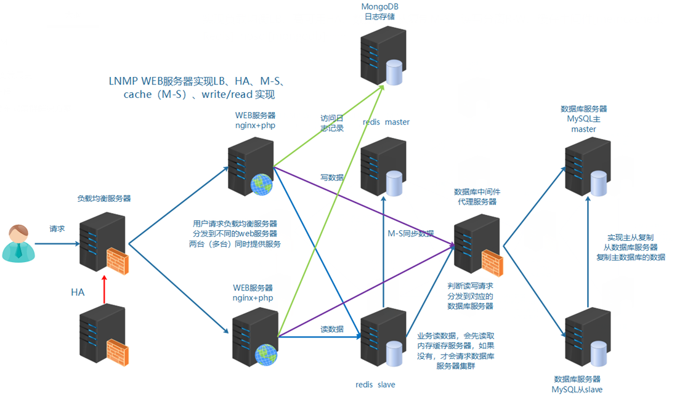

## <font style="color:rgb(51, 51, 51);">业务背景</font>

<font style="color:rgb(51, 51, 51);">年份：2014-2016（互联网蓬勃发展）</font>

<font style="color:rgb(51, 51, 51);">发布产品类型：在线电商平台（NiuShop = PHP语言 => web 项目 => Discuz、NiuShop、WordPress、Facebook）</font>

<font style="color:rgb(51, 51, 51);">用户数量： 500左右（20% ~ 70%）</font>

<font style="color:rgb(51, 51, 51);">PV ： 1000-3000</font>

<font style="color:rgb(51, 51, 51);">DAU： 100-300（日活，每天的独立访客数量）</font>

<font style="color:rgb(51, 51, 51);">业务流量统计平台：百度统计、CNZZ（在你的代码中，添加一段代码）</font>

<font style="color:rgb(51, 51, 51);">参数解析：</font>

```yaml
网站访问量统计指标：
PV（Page View）：页面访问量，即页面浏览量或点击量，用户每次刷新一次即被计算一次
UV（Unique Visitor）：独立访客，统计1天内访问某站点的用户数
DAU(Daily Active User)，日活跃用户数量。常用于反映网站、互联网应用或网络游戏的运营情况

服务器性能统计指标：
吞吐量：应用系统每秒钟最大能接受的用户访问量或者每秒钟最大能处理的请求数
QPS（Query Per Second）：每秒钟处理完请求的次数，注意这里是处理完。具体是指发出请求到服务器处理完成功返回结果。可以理解在Server中有个Counter，每处理一个请求加1，1秒后Counter=QPS
TPS（Transactions Per Second）：每秒钟处理完的事务次数，一般TPS是对整个系统来讲的。一个应用系统1s能完成多少事务处理，一个事务在分布式处理中，可能会对应多个请求，对于衡量单个接口服务的处理能力，用QPS比较多
并发量：系统能同时处理的请求数
RT：响应时间，处理一次请求所需要的平均处理时间

计算公式：
QPS = 并发量 / 平均响应时间
并发量 = QPS * 平均响应时间
```

<font style="color:rgb(51, 51, 51);">举个栗子：</font>

<font style="color:rgb(51, 51, 51);">假设服务并发量为1500，RT为150ms，那么该服务的QPS ：</font>

<font style="color:rgb(51, 51, 51);">10000 = 1500（并发数） / 0.15 （RT） </font>

<font style="color:rgb(51, 51, 51);">假如通过压测一台机器的QPS为500，那么该服务需要20+台这样的机器。</font>

# <font style="color:rgb(51, 51, 51);">二、服务器准备</font>

可以重新克隆一台最小化安装的机器。

## <font style="color:rgb(51, 51, 51);"> 操作系统</font>

<font style="color:rgb(51, 51, 51);">CentOS Stream 9（最小化安装）=> CentOS7.6~CentOS7.9</font>

## <font style="color:rgb(51, 51, 51);">修改主机名和hosts</font>

修改 IP 地址为：192.168.126.174

```shell
# hostnamectl set-hostname web01.lhp.cn
# su

# cat /etc/hosts
127.0.0.1   localhost localhost.localdomain localhost4 localhost4.localdomain4
::1         localhost localhost.localdomain localhost6 localhost6.localdomain6
192.168.126.174   web01 web01.lhp.cn
```

## <font style="color:rgb(51, 51, 51);">关闭防火墙与SELinux</font>

<font style="color:rgb(51, 51, 51);">扩展：CentOS Stream 9 => systemctl</font>

<font style="color:rgb(51, 51, 51);">服务管理：启动/停止/重启/查看状态</font>

```shell
# systemctl start/stop/restart/status 服务名称
```

<font style="color:rgb(51, 51, 51);">开机启动项管理：</font>

```shell
# systemctl enable  服务名称	=>  开机启动
# systemctl disable 服务名称	=>  开机不启动
```

<font style="color:rgb(51, 51, 51);">关闭防火墙与SELinux：</font>

```shell
# systemctl stop firewalld
# systemctl disable firewalld
# setenforce 0
# sed -i '/SELINUX=enforcing/cSELINUX=disabled' /etc/selinux/config
等价于
# vim /etc/selinux/config
SELINUX=disabled
```

## <font style="color:rgb(51, 51, 51);">配置 yum 源</font>

<font style="color:rgb(51, 51, 51);">yum/dnf => 系统 /etc/yum.repos.d 目录，找到镜像仓库配置文件 => 请求远程仓库</font>

<font style="color:rgb(51, 51, 51);">配置方案：阿里镜像站、腾讯镜像站、华为镜像站、清华镜像站</font>

## <font style="color:rgb(51, 51, 51);">设置网络</font>

```shell
ls /etc/NetworkManager/system-connections/
sudo vi /etc/NetworkManager/system-connections/ens33.nmconnection
-------------------------------  设置开始 -----------------------------------------
[ipv4]
method=manual
addresses=192.168.126.174/24
gateway=192.168.126.2
dns=8.8.8.8;

[ipv6]
method=ignore
-------------------------------  设置结束 -----------------------------------------
sudo systemctl restart NetworkManager
nmcli device show ens33
```

<font style="color:rgb(51, 51, 51);">如果不想重启整个 </font><code><font style="color:rgb(51, 51, 51);background-color:rgb(243, 244, 244);">NetworkManager</font></code><font style="color:rgb(51, 51, 51);"> 服务，可以只重新激活特定的网络连接：</font>

```shell
sudo nmcli connection down <连接名称>
sudo nmcli connection up <连接名称>

sudo nmcli connection down ens33
sudo nmcli connection up ens33
```

<font style="color:rgb(51, 51, 51);">如果想重启所有网络接口，可以使用以下命令：</font>

```shell
sudo nmcli networking off
sudo nmcli networking on
```

<font style="color:rgb(51, 51, 51);">当然，你也可以使用传统方式，如：</font><code><font style="color:rgb(51, 51, 51);background-color:rgb(243, 244, 244);">ifup</font></code><font style="color:rgb(51, 51, 51);">，</font><code><font style="color:rgb(51, 51, 51);background-color:rgb(243, 244, 244);">ifdown</font></code><font style="color:rgb(51, 51, 51);">等等</font>

## <font style="color:rgb(51, 51, 51);">chrony 时间同步</font>

<font style="color:rgb(51, 51, 51);">centos 镜像源有很多种，centos-base.repo 基础源，epel-release 扩展源</font>

<font style="color:rgb(51, 51, 51);">ntpdate 手工同步操作 => 人为实现时间同步</font>

```shell
# dnf install epel-release -y
# dnf install ntpsec -y
# ntpdate cn.ntp.org.cn
-----------------------------------------
# yum install chrony -y
自行配置chrony时间同步
```

# <font style="color:rgb(51, 51, 51);">三、LNMP 环境搭建</font>

<font style="color:rgb(51, 51, 51);">LNMP = Linux + Nginx + MySQL + PHP（独立软件，占用 9000）</font>

<font style="color:rgb(51, 51, 51);">LNMT = 中州养老 => Linux + Nginx + MySQL + Tomcat（端口号：8080）</font>

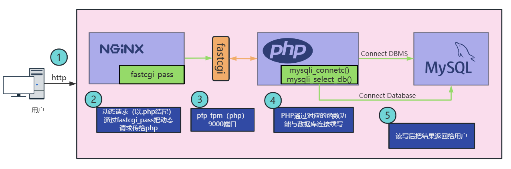

<font style="color:rgb(51, 51, 51);">Nginx：接收用户请求，请求处理后返回结果给用户。</font>

<font style="color:rgb(51, 51, 51);">注意：Nginx 本身只能处理静态文件（.htm/.html、css、javascript），无法处理动态文件（.php、.py、.java），动态文件 Nginx 会通过反向代理（请求转发，就是把用户请求转发到后端服务器）。</font>

<font style="color:rgb(51, 51, 51);">PHP 程序（底层进程：PHP-FPM）：专门用于处理 .php 动态文件，处理完成之后，把结果以静态形式返回给 Nginx。</font>

<font style="color:rgb(51, 51, 51);">MySQL：负责整个项目中数据的存储（用户数据、产品数据、订单数据、发货数据等等）</font>

## <font style="color:rgb(51, 51, 51);"> 前期准备</font>

| **<font style="color:rgb(51, 51, 51);">编号</font>** | **<font style="color:rgb(51, 51, 51);">主机名称</font>** | **<font style="color:rgb(51, 51, 51);">IP地址</font>** | **<font style="color:rgb(51, 51, 51);">角色</font>** |
| :--- | :--- | :--- | :--- |
| <font style="color:rgb(51, 51, 51);">1</font> | <font style="color:rgb(51, 51, 51);">web01.lhp.cn</font> | <font style="color:rgb(51, 51, 51);">192.168.126.174</font> | <font style="color:rgb(51, 51, 51);">Web01</font> |

**<font style="color:rgb(51, 51, 51);">我们上面已经准备好机器了。</font>**

## <font style="color:rgb(51, 51, 51);">商城项目简单介绍</font>

本次 LNMP 学习中，我们去部署一个商城项目。

<font style="color:rgb(51, 51, 51);">NiuShop 商城系统：</font>[<font style="color:rgb(65, 131, 196);">https://gitee.com/niushop-team/niushop\_b2c\_v5/tree/master</font>](https://gitee.com/niushop-team/niushop_b2c_v5/tree/master)

<font style="color:rgb(51, 51, 51);">软件版本要求：PHP7.4+、MySQL5.6~MySQL8.0、Nginx（版本没有严格要求）、Redis（支持，版本没有严格要求）</font>

## <font style="color:rgb(51, 51, 51);">MySQL 软件安装</font>

<font style="color:rgb(51, 51, 51);">瑞典AB公司，MySQL默认编码=>latin1 => Sun公司 =>甲骨文（Oracle），Oracle MySQL。</font>

<font style="color:rgb(51, 51, 51);">yum安装：默认安装并不是mysql，实际使用的是mariadb。</font>

<font style="color:rgb(51, 51, 51);">mariadb => 基于mysql的衍生版，开源免费。</font>

<font style="color:rgb(51, 51, 51);">安装 MySQL 还可以可以使用二进制软件包（glibc包，类似Windows中的绿色软件）或者编译安装（配置+编译+安装）实现。</font>

<font style="color:rgb(51, 51, 51);">官网：</font>[<font style="color:rgb(65, 131, 196);">www.mysql.com</font>](https://www.mysql.com)

### <font style="color:rgb(51, 51, 51);">常见的 Web 架构</font>

<font style="color:rgb(51, 51, 51);">ASP ： IIS服务器软件</font>

<font style="color:rgb(51, 51, 51);">PHP ： LAMP/LNMP => A（Apache）、N（Nginx）</font>

<font style="color:rgb(51, 51, 51);">JSP ： Nginx + Tomcat</font>

### <font style="color:rgb(51, 51, 51);">MySQL 软件安装</font>

<font style="color:rgb(51, 51, 51);">NiuShop 商城系统要求：PHP7.4 + MySQL5.6~MySQL8.0 + Nginx（版本没有严格要求）+ Redis（支持，版本没有严格）</font>

<font style="color:rgb(51, 51, 51);">第一步：软件包下载</font>

```shell
mysql-5.7.31-linux-glibc2.12-x86_64.tar.gz
说明：通用linux下的二进制包，已编译好，只需放到相应的安装目录里即可，也就是一个绿色软件，解压基本就能用
```

<font style="color:rgb(51, 51, 51);">第二步：默认选项</font>

```shell
默认安装路径：/usr/local/mysql           mysql安装目录
默认数据目录：/usr/local/mysql/data			 mysql数据目录
默认端口：3306
默认socket文件存放路径：/tmp/mysql.sock	 套接字文件，负责客户端与服务器端进行网络连接
```

<font style="color:rgb(51, 51, 51);">B/S => Browser（浏览器）/ Server（服务器）</font>

<font style="color:rgb(51, 51, 51);">C/S => Client（客户端）/ Server（服务器）</font>

> <font style="color:rgb(119, 119, 119);">MySQL客户端（mysql）、MySQL Server服务器端（mysqld）</font>

<font style="color:rgb(51, 51, 51);">第三步：安装步骤</font>

<font style="color:rgb(51, 51, 51);">参考官网文档：</font>[<font style="color:rgb(65, 131, 196);">MySQL-glibc安装手册</font>](https://dev.mysql.com/doc/refman/5.6/en/binary-installation.html)

***

<font style="color:rgb(51, 51, 51);">需求：</font>

1. <font style="color:rgb(51, 51, 51);">MySQL的安装目录为：/usr/local/mysql</font>
2. <font style="color:rgb(51, 51, 51);">MySQL的数据目录为: /usr/local/mysql/data</font>

<font style="color:rgb(51, 51, 51);">前期规划：</font>

| **<font style="color:rgb(51, 51, 51);">安装目录</font>** | **<font style="color:rgb(51, 51, 51);">数据目录</font>** | **<font style="color:rgb(51, 51, 51);">默认端口</font>** | **<font style="color:rgb(51, 51, 51);">套接字（关键）</font>** |
| :--- | :--- | :--- | :--- |
| <font style="color:rgb(51, 51, 51);">/usr/local/mysql</font> | <font style="color:rgb(51, 51, 51);">/usr/local/mysql/data</font> | <font style="color:rgb(51, 51, 51);">3306</font> | <font style="color:rgb(51, 51, 51);">/tmp/mysql.sock</font> |

<font style="color:rgb(51, 51, 51);">问题：如果我们 MySQL 的套接字没有放置在 /tmp 目录下，会有什么影响？（扩展）</font>

<font style="color:rgb(51, 51, 51);">答：mysql 客户端无法直接连接到 mysqld 服务器端，必须手工指定 -S 选项（mysql -S xxx.sock），指定套接字的位置或者可以在 my.cnf 文件中，添加一个选项</font>

```shell
# vim my.cnf
[mysqld]
针对服务器端的相关配置（安装目录、数据目录、端口、套接字以及日志信息等等）

[mysql]
socket=/usr/local/mysql/mysql.sock
```

> <font style="color:rgb(119, 119, 119);">除了套接字问题，还需要注意的就是 my.cnf 配置文件，其加载顺序：① 安装目录 ② /etc 目录，如果安装目录与 /etc 都有 my.cnf，则 /etc 目录下的 my.cnf 会覆盖安装目录中的配置文件。</font>

<font style="color:rgb(51, 51, 51);">第一步：上传 MySQL 软件包（5.7.31版本）到 Web01 服务器端</font>

<font style="color:rgb(51, 51, 51);">第二步：解压 MySQL 软件包，然后移动到 /usr/local 目录下，起名为 mysql</font>

```shell
# rm -rf /usr/local/mysql
# tar -xf mysql-5.7.31-linux-glibc2.12-x86_64.tar.gz
# mv mysql-5.7.31-linux-glibc2.12-x86_64 /usr/local/mysql
```

<font style="color:rgb(51, 51, 51);">第三步：创建一个特定的 mysql 账号，用于启动与运行 mysql 软件</font>

```shell
# useradd -r -s /sbin/nologin mysql
```

<font style="color:rgb(51, 51, 51);">第四步：进入 /usr/local/mysql 目录，创建 mysql-files 文件夹（和 MySQL8.0 区别的地方）</font>

```shell
# cd /usr/local/mysql
# mkdir mysql-files
```

<font style="color:rgb(51, 51, 51);">第五步：更改 mysql-files 文件夹权限（拥有者与所属组以及文件夹权限750）</font>

```shell
# chown mysql.mysql mysql-files
# chmod 750 mysql-files
```

<font style="color:rgb(51, 51, 51);">第六步：删除默认配置文件 my.cnf，然后初始化 MySQL</font>

```shell
# rm -rf /etc/my.cnf
# bin/mysqld --initialize --user=mysql --basedir=/usr/local/mysql &> /tmp/mysql_temp_pass.txt
[Note] A temporary password is generated for root@localhost: q7+1jT_>yzpA

根据需要决定是否开启SSL加密传输（8.0的会自动开启SSL）
# bin/mysql_ssl_rsa_setup --datadir=/usr/local/mysql/data

# 创建my.cnf
# vim /etc/my.cnf
[mysqld]
basedir=/usr/local/mysql
datadir=/usr/local/mysql/data
socket=/tmp/mysql.sock
port=3306
log-error=/usr/local/mysql/data/mysql.err
log-bin=/usr/local/mysql/data/binlog
server-id=10
character_set_server=utf8mb4
gtid-mode=on
log-slave-updates=1
enforce-gtid-consistency
sql_mode=NO_ENGINE_SUBSTITUTION,STRICT_TRANS_TABLES
```

<font style="color:rgb(51, 51, 51);">第七步：MySQL 服务配置</font>

```shell
# vim /usr/lib/systemd/system/mysqld.service
[Unit]
Description=MySQL Server
After=network.target
After=syslog.target

[Service]
User=mysql
Group=mysql
ExecStart=/usr/local/mysql/bin/mysqld --defaults-file=/etc/my.cnf
LimitNOFILE = 5000
PrivateTmp=false

[Install]
WantedBy=multi-user.target
```

<font style="color:rgb(51, 51, 51);">启动mysql</font>

```shell
# chown -R mysql.mysql /usr/local/mysql
# systemctl start mysqld
```

<font style="color:rgb(51, 51, 51);">添加环境变量，进入 mysql，更改 mysql 的默认密码</font>

```shell
# echo 'export PATH=$PATH:/usr/local/mysql/bin' >> /etc/profile
# source /etc/profile

# MySQL5.7客户端连接服务端需要用到libncurses.so.5，而我们系统没有，系统有的是6版本，所以来个软链接用一下
# ln -s /lib64/libncurses.so.6 /lib64/libncurses.so.5
# ln -s /lib64/libtinfo.so.6 /lib64/libtinfo.so.5
# mysql -uroot -p
密码在/tmp/mysql_temp_pass.txt文件中

mysql> set password='123456';
mysql> flush privileges;
```

<font style="color:rgb(51, 51, 51);">第八步：进行数据库的安全初始化（可选）</font>

```shell
# mysql_secure_installation
```

<font style="color:rgb(51, 51, 51);">第九步：配置 mysql 服务随开机自动启动</font>

```shell
# systemctl enable mysqld
```

***

**扩展：编写 MySQL 安装脚本（可以将系统还原，然后上传 MySQL 安装包，执行下面的操作）**

```shell
# vim mysql.sh
#!/bin/bash
yum install libaio -y
tar -xf mysql-5.7.31-linux-glibc2.12-x86_64.tar.gz
mv mysql-5.7.31-linux-glibc2.12-x86_64 /usr/local/mysql
useradd -r -s /sbin/nologin mysql
rm -rf /etc/my.cnf
cd /usr/local/mysql
mkdir mysql-files
chown mysql:mysql mysql-files
chmod 750 mysql-files
bin/mysqld --initialize --user=mysql --basedir=/usr/local/mysql &> /root/password.txt
cat > /etc/my.cnf <<EOF
[mysqld]
basedir=/usr/local/mysql
datadir=/usr/local/mysql/data
socket=/tmp/mysql.sock
port=3306
log-error=/usr/local/mysql/data/mysql.err
log-bin=/usr/local/mysql/data/binlog
server-id=10
character_set_server=utf8mb4
gtid-mode=on
log-slave-updates=1
enforce-gtid-consistency
sql_mode=NO_ENGINE_SUBSTITUTION,STRICT_TRANS_TABLES
EOF

bin/mysql_ssl_rsa_setup --datadir=/usr/local/mysql/data

cat <<EOF | tee /etc/systemd/system/mysqld.service
[Unit]
Description=MySQL Server
After=network.target
After=syslog.target

[Service]
User=mysql
Group=mysql
ExecStart=/usr/local/mysql/bin/mysqld --defaults-file=/etc/my.cnf
LimitNOFILE = 5000
PrivateTmp=false

[Install]
WantedBy=multi-user.target
EOF

systemctl daemon-reload

echo 'export PATH=$PATH:/usr/local/mysql/bin' >> /etc/profile
source /etc/profile

ln -s /lib64/libncurses.so.6 /lib64/libncurses.so.5
ln -s /lib64/libtinfo.so.6 /lib64/libtinfo.so.5

pass=$(cat /root/password.txt | grep password | awk '{print $NF}')

systemctl start mysqld
systemctl enable mysqld

mysql --connect-expired-password -uroot -p$pass <<EOF
set password='123456';
exit;
EOF

echo 'mysql安装成功，密码是123456'

# 执行脚本
# source mysql.sh
```

<font style="color:rgb(51, 51, 51);">启动数据库</font>

```shell
[root@web01 mysql]# systemctl start mysqld

[root@web01 mysql]# ss -naltp|grep mysqld
LISTEN     0      80          :::3306                    :::*                   users:(("mysqld",pid=15921,fd=10))
```

<font style="color:rgb(51, 51, 51);">后续配置(</font>**<font style="color:rgb(51, 51, 51);">任选其一，目的是为了改密码</font>**<font style="color:rgb(51, 51, 51);">)</font>

```shell
1）更改数据库管理员root密码
[root@web01 mysql]# mysqladmin -u root -p'随机密码' password '123456'
Warning: Using a password on the command line interface can be insecure.

2）安全初始化数据库
[root@web01 mysql]# mysql_secure_installation
...
Enter current password for root (enter for none): 输入当前密码
OK, successfully used password, moving on...
...
Change the root password? [Y/n] n	是否更改管理员root密码
...
Remove anonymous users? [Y/n] y		是否移除匿名用户
 ... Success!
...

Disallow root login remotely? [Y/n] n 	是否禁止root从远程登录;生产禁止，测试允许
...
Remove test database and access to it? [Y/n] y 是否移除test库
...
Reload privilege tables now? [Y/n] y	是否刷新权限表
 ... Success!
```

<font style="color:rgb(51, 51, 51);">测试登录</font>

```shell
[root@web01 mysql]# mysql -u root -p  
Enter password: 
...
mysql> show databases;
+--------------------+
| Database           |
+--------------------+
| information_schema |
| mysql              |
| performance_schema |
+--------------------+
3 rows in set (0.00 sec)
```

其实也可以将上面修改密码的操作也写到上面的安装脚本中！

## <font style="color:rgb(51, 51, 51);">Nginx 软件安装</font>

### <font style="color:rgb(51, 51, 51);">Nginx 概述</font>

<font style="color:rgb(51, 51, 51);">Nginx (engine x) 是一个高性能的 HTTP 和反向代理 web 服务器，同时也提供了 IMAP/POP3/SMTP 等邮件服务。Nginx 是由伊戈尔·赛索耶夫为俄罗斯访问量第二的 Rambler.ru 站点（俄文：Рамблер）开发的，第一个公开版本 0.1.0 发布于 2004 年 10 月 4 日 => F5 公司，负载均衡器（硬件）</font>

<font style="color:rgb(51, 51, 51);">Nginx 是一款轻量级的 Web 服务器/反向代理服务器及电子邮件（IMAP/POP3）代理服务器，在 BSD-like 协议下发行。其特点是占有内存少，并发能力强，事实上 nginx 的并发能力确实在同类型的网页服务器中表现较好，中国大陆使用 nginx 网站用户有：百度、京东、新浪、网易、腾讯、淘宝等。</font>

```shell
通过下面方式可以查看该域名对应的服务器使用的是哪款web服务器
# curl -I 域名地址
Server:Nginx

比如：curl -I http://www.jd.com等
```

### <font style="color:rgb(51, 51, 51);">常见用法</font>

```shell
1) web服务器软件 httpd(apache)
   同类型web服务器软件：apache nginx(俄罗斯) iis(微软) lighttpd(德国)
2) 提供了IMAP/POP3/SMTP服务
3) 充当反向代理服务器，实现负载均衡功能。LB=>Load Blance
```

### <font style="color:rgb(51, 51, 51);">Nginx 特点</font>

<font style="color:rgb(51, 51, 51);">① 高可靠：稳定性 master 进程 管理调度请求分发到哪一个 worker => worker 进程 响应请求 一 master多 worker</font>

<font style="color:rgb(51, 51, 51);">② 热部署 ：（1）平滑升级（不停机升级） （2）可以快速重载配置（不重启 Nginx 服务，就可以重新加载配置文件）</font>

<font style="color:rgb(51, 51, 51);">③ 高并发：可以同时响应更多的请求 事件 epoll模型</font>

<font style="color:rgb(51, 51, 51);">④ 响应快：尤其在处理静态文件上，响应速度很快 sendfile</font>

<font style="color:rgb(51, 51, 51);">⑤ 低消耗：cpu 和内存 1w 个请求 内存 2~3MB</font>

<font style="color:rgb(51, 51, 51);">⑥ 分布式支持：反向代理 七层负载均衡（应用层），新版本也支持四层负载均衡</font>

### <font style="color:rgb(51, 51, 51);">常见安装方式</font>

<font style="color:rgb(51, 51, 51);">常见安装方式：</font>

<font style="color:rgb(51, 51, 51);">① yum 安装配置，需使用 Nginx 官方源或者 EPEL 源（优点：安装简单，操作方便；缺点：版本相对固定，定制型差）</font>

<font style="color:rgb(51, 51, 51);">② 源码编译（优点：定制性比较强，可以选择开启或关闭某些功能，本身比较稳定；缺点：安装比较复杂 => 安装时间长）</font>

### <font style="color:rgb(51, 51, 51);">编译安装 Nginx</font>

<font style="color:rgb(51, 51, 51);">软件的编译安装过程：编译安装三步走（配置 + 编译 + 安装）</font>

<font style="color:rgb(51, 51, 51);">yum/glibc（二进制软件包），相当于别人已经对源代码进行编译打包，生成可执行文件，根据这个可执行文件就可以实现软件安装。</font>

<font style="color:rgb(51, 51, 51);">源码编译安装，获取别人开发好的源代码（没有打包）=> ① 基础配置（软件未来安装路径，选择要安装的功能等）② 编译（把配置好的源代码进行编译打包，生成一个可执行的二进制文件）③ 安装（把生成的可执行的二进制文件进行安装操作）</font>

<font style="color:rgb(51, 51, 51);">① 配置软件 </font><code><font style="color:rgb(51, 51, 51);">./configure</font></code>

<font style="color:rgb(51, 51, 51);">② 编译，生成可执行的软件包 </font><code><font style="color:rgb(51, 51, 51);">make</font></code>

<font style="color:rgb(51, 51, 51);">③ 安装 </font><code><font style="color:rgb(51, 51, 51);">make install</font></code>

***

<font style="color:rgb(51, 51, 51);">第一步：安装依赖库</font>

```shell
[root@web01 ~] # dnf -y install pcre-devel zlib-devel openssl-devel

openssl-devel：表示让Nginx可以支持https协议

http与https区别
http：端口是80，传输过程没有通过ssl进行加密，明文传输，有安全隐思。早期浏览器默认使用http协议，新版本不推荐使用http协议，内部项目可以采用http。

https：端口是443，需要配置ssl证书(免费，3个月要续订一次;收费，1-3年续订一次，大概1000左右一年)，加密传输，数据传输过程中都会通过ssl进行加密，相对于http更加安全。
```

<font style="color:rgb(51, 51, 51);">第二步：创建账号</font>

```shell
[root@web01 ~] # useradd -r -s /sbin/nologin www
```

<font style="color:rgb(51, 51, 51);">第三步：配置/编译与安装（提前上传 Nginx 的源码包）</font>

```shell
# tar xvf nginx-1.24.0.tar.gz

# cd nginx-1.24.0
# ./configure --prefix=/usr/local/nginx --user=www --group=www --with-http_ssl_module --with-http_stub_status_module --with-http_realip_module

# make && make install
```

<font style="color:rgb(51, 51, 51);">编译参数说明</font>

| **<font style="color:rgb(51, 51, 51);">参数</font>** | **<font style="color:rgb(51, 51, 51);">作用</font>** |
| :--- | :--- |
| <font style="color:rgb(51, 51, 51);">--prefix</font> | <font style="color:rgb(51, 51, 51);">编译安装到的软件目录</font> |
| <font style="color:rgb(51, 51, 51);">--user</font> | <font style="color:rgb(51, 51, 51);">worker 进程运行用户</font> |
| <font style="color:rgb(51, 51, 51);">--group</font> | <font style="color:rgb(51, 51, 51);">worker 进程运行用户组</font> |
| <font style="color:rgb(51, 51, 51);">--with-http\_ssl\_module</font> | <font style="color:rgb(51, 51, 51);">支持 https 需要 </font>**<font style="color:rgb(51, 51, 51);">pcel-devel </font>**<font style="color:rgb(51, 51, 51);">依赖</font> |
| <font style="color:rgb(51, 51, 51);">--with-http\_stub\_status\_module</font> | <font style="color:rgb(51, 51, 51);">基本状态信息显示 查看请求数、连接数等</font> |
| <font style="color:rgb(51, 51, 51);">--with-http\_realip\_module</font> | <font style="color:rgb(51, 51, 51);">定义客户端地址和端口为 header 头信息 常用于反向代理后的真实 IP 获取</font> |

### <font style="color:rgb(51, 51, 51);">Nginx目录介绍</font>

| **<font style="color:rgb(51, 51, 51);">目录</font>** | **<font style="color:rgb(51, 51, 51);">作用</font>** |
| :--- | :--- |
| <font style="color:rgb(51, 51, 51);">conf</font> | <font style="color:rgb(51, 51, 51);">配置文件(nginx.conf)</font> |
| <font style="color:rgb(51, 51, 51);">html</font> | <font style="color:rgb(51, 51, 51);">网站默认目录(存放前端源代码)</font> |
| <font style="color:rgb(51, 51, 51);">logs</font> | <font style="color:rgb(51, 51, 51);">日志(access.log、error.log)</font> |
| <font style="color:rgb(51, 51, 51);">sbin</font> | <font style="color:rgb(51, 51, 51);">可执行文件 \[软件的启动 停止 重启 重载等]</font> |

<font style="color:rgb(51, 51, 51);">Nginx 比较特殊：既支持重后操作，也支持重载操作！</font>

<font style="color:rgb(51, 51, 51);">重启：停服，重新启动</font>

<font style="color:rgb(51, 51, 51);">重载：不停服，重新加载配置文件</font>

### <font style="color:rgb(51, 51, 51);">软件操作参数</font>

| **<font style="color:rgb(51, 51, 51);">参数</font>** | **<font style="color:rgb(51, 51, 51);">作用</font>** |
| :--- | :--- |
| <font style="color:rgb(51, 51, 51);">-V</font> | <font style="color:rgb(51, 51, 51);">显示 Nginx 版本号以及配置选项</font> |
| <font style="color:rgb(51, 51, 51);">-s signal</font> | <font style="color:rgb(51, 51, 51);">stop关闭 quit优雅的关闭 reopen重开日志 reload重载</font> |

常用命令：

```shell
# 启动Nginx
# cd /usr/local/nginx
# sbin/nginx -c conf/nginx.conf

# 强制关闭：如果有正在处理的http请求，也会立即被中断
# sbin/nginx -s stop

# 优雅关闭：如果有正在处理的http请求，先处理完成后，再关闭
# sbin/nginx -s quit

# 不停服重载：如果在Nginx运行期间，修改了Nginx.conf配置文件
# sbin/nginx -s reload
```

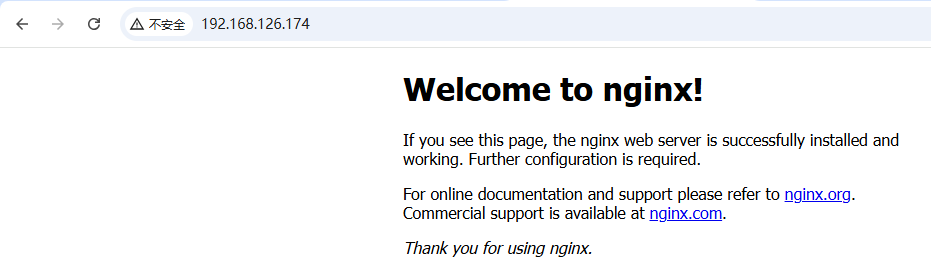

### <font style="color:rgb(51, 51, 51);">Nginx 服务配置</font>

<font style="color:rgb(51, 51, 51);">CentOS Stream 9配置：</font>

```shell
# 注意：一定要提前把Nginx停止掉
# sbin/nginx -s stop

# Nginx服务配置到该文件中
# vim /usr/lib/systemd/system/nginx.service
[Unit]
Description=Nginx Web Server
After=network.target
  
[Service]
Type=forking
ExecStart=/usr/local/nginx/sbin/nginx -c /usr/local/nginx/conf/nginx.conf
ExecReload=/usr/local/nginx/sbin/nginx -s reload
ExecStop=/usr/local/nginx/sbin/nginx -s quit
PrivateTmp=true
  
[Install]
WantedBy=multi-user.target

扩展：
Type=forking，forking代表后台运行

# 重新加载后台进程
# systemctl daemon-reload

之后我们就可以使用如下命令启动和停止Nginx等操作了
# systemctl start nginx
# systemctl enable nginx
# systemctl stop nginx
# systemctl reload nginx
# systemctl restart nginx
```

> **注意：原生方式和系统命令管理的方式不能混合使用！！！**

## <font style="color:rgb(51, 51, 51);">PHP 软件安装</font>

### <font style="color:rgb(51, 51, 51);">PHP 概述</font>

<font style="color:rgb(51, 51, 51);"></font>**<font style="color:rgb(51, 51, 51);">PHP</font>**<font style="color:rgb(51, 51, 51);">（外文名:PHP: Hypertext Preprocessor，中文名：“超文本预处理器”）是一种通用开源脚本语言，主要应用于Web领域。</font>

<font style="color:rgb(51, 51, 51);">PHP 是将程序嵌入到 HTML（标准通用标记语言下的一个应用）文档中去执行，执行效率比完全生成HTML 标记的 CGI 要高许多</font>

<font style="color:rgb(51, 51, 51);">PHP 还可以执行编译后代码，编译可以达到加密和优化代码运行，使代码运行更快。（新特性）</font>

<font style="color:rgb(51, 51, 51);">总结：PHP 就是一种超文本预处理语言，主要应用于 Web 开发领域。</font>

### <font style="color:rgb(51, 51, 51);">PHP-FPM</font>

<font style="color:rgb(51, 51, 51);">PHP-FPM：PHP-FPM 是 PHPFastCGI 进程管理器的缩写，是一个用于管理 PHP 进程的工具。它可以通过 FastCGI 协议与 Web 服务器(如 Nginx、Apache 等)进行通信，提供更高效的PHP请求处理能力。PHP-FPM可以管理多个PHP进程，根据实际负载情况动态调整进程数，从而提高PHP 应用的性能和稳定性。</font>

<font style="color:rgb(51, 51, 51);">Apache：Apache + PHP，容易崩溃，效率低，处理大并发请求的能力较弱</font>

<font style="color:rgb(51, 51, 51);">Nginx ： Nginx + PHP，PHP-FPM 进程管理器，支持大并发请求的处理，高效稳定，处理能力强</font>

### <font style="color:rgb(51, 51, 51);">编译安装 PHP</font>

<font style="color:rgb(51, 51, 51);">第一步：安装依赖库</font>

```shell
[root@web01 ~]# dnf -y install libxml2-devel libjpeg-devel libpng-devel libwebp-devel freetype-devel curl-devel openssl-devel sqlite sqlite-devel libtool pcre-devel gd-devel libsodium
```

**<font style="color:rgb(51, 51, 51);">安装 oniguruma 库</font>**<font style="color:rgb(51, 51, 51);">（如果下载不了，直接上传资料中的压缩包到 Linux 中即可）</font>

```shell
# sudo curl -LO https://github.com/kkos/oniguruma/releases/download/v6.9.8/onig-6.9.8.tar.gz
# sudo tar -zxvf onig-6.9.8.tar.gz
# cd onig-6.9.8
# ./configure && make && make install

注：oniguruma 库，这是 PHP 在启用多字节正则表达式支持时的必需库

设置ONIG_CFLAGS 和 ONIG_LIBS 环境变量（这些都是临时环境变量，重启系统就失效了！）
# export ONIG_CFLAGS="-I/usr/include"
# export ONIG_LIBS="-L/usr/lib -lonig"
```

**<font style="color:rgb(51, 51, 51);">安装 libsodium 库</font>**<font style="color:rgb(51, 51, 51);">（如果下载不了，直接上传资料中的压缩包到 Linux 中即可）</font>

```shell
# wget https://download.libsodium.org/libsodium/releases/libsodium-1.0.20.tar.gz
# tar -xzvf libsodium-1.0.20.tar.gz
# cd libsodium-1.0.20

# 编译并安装
# ./configure && make && make install

# 更新库缓存
# sudo ldconfig

设置LIBSODIUM_CFLAGS和LIBSODIUM_LIBS环境变量
# export LIBSODIUM_CFLAGS="-I/usr/local/include"
# export LIBSODIUM_LIBS="-L/usr/local/lib -lsodium"
# export LD_LIBRARY_PATH=/usr/local/lib:$LD_LIBRARY_PATH
```

<font style="color:rgb(51, 51, 51);">第二步：解压压缩包（提前上传 PHP 安装包）</font>

```shell
[root@web01 ~]# cd
[root@web01 ~]# tar -zxf php-7.4.33.tar.gz
[root@web01 ~]# cd php-7.4.33
```

<font style="color:rgb(51, 51, 51);">第三步：编译安装 PHP => php\_fpm（PHP 扩展，PHP 连接 MySQL，需要 MySQL 扩展）</font>

```shell
[root@web01 php-7.4.33]# ./configure --prefix=/usr/local/php --with-config-file-path=/usr/local/php/etc --enable-fpm --with-fpm-user=www --with-fpm-group=www --with-mysqli=mysqlnd --with-pdo-mysql=mysqlnd --with-iconv --with-freetype --with-jpeg --with-zlib --enable-gd --with-external-gd --with-xpm --with-webp --enable-xml --disable-rpath --enable-bcmath --enable-shmop --enable-sysvsem --with-curl --enable-mbregex --enable-mbstring --enable-ftp --with-openssl=/usr/local/openssl --with-mhash --enable-sockets --enable-soap --without-pear --with-gettext  --enable-pcntl --with-sodium --enable-fileinfo

[root@web01 php-7.4.33]# make -j$(nproc) && make install
make默认单核编译，可以通过make -j数字（核心数）
$(nproc) 会自动返回当前系统的 CPU 核心数，从而加速编译过程。
```

***

**<font style="color:rgb(51, 51, 51);background-color:#FBDE28;">如果</font>**<font style="color:rgb(51, 51, 51);">编译过程中提示 openssl 报错，原因：由于 openssl 版本过高导致的，可以考虑卸载 openssl，自定义安装 openssl-1.1.1w 版本</font>

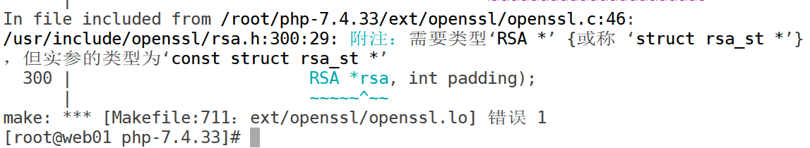

```shell
# 卸载openssl-devel
# sudo dnf -y remove openssl-devel

会安装很多内容，但是有些内容是下载不下来，不影响最后的结果的！有可能下面的内容就不需要安装！试试！
# sudo dnf -y install make gcc perl-core zlib-devel

# 如果下载不下来，资料中已经提供了
# wget https://github.com/openssl/openssl/releases/download/OpenSSL_1_1_1w/openssl-1.1.1w.tar.gz
# tar -xf openssl-1.1.1w.tar.gz
# cd openssl-1.1.1w
# ./config --prefix=/usr/local/openssl --shared
# make && make install

# export PKG_CONFIG_PATH=/usr/local/openssl/lib/pkgconfig:$PKG_CONFIG_PATH
# export LD_LIBRARY_PATH=/usr/local/openssl/lib:$LD_LIBRARY_PATH
# export OPENSSL_CFLAGS="-I/usr/local/openssl/include"
# export OPENSSL_LIBS="-L/usr/local/openssl/lib -lssl -lcrypto"

# export LDFLAGS="-L/usr/local/openssl/lib -lssl -lcrypto"
# export LIBS="-lssl -lcrypto"
```

**<font style="color:rgb(51, 51, 51);background-color:#FBDE28;">然后再对PHP进行重新的配置、编译及安装！！！</font>**

**<font style="color:rgb(51, 51, 51);background-color:#FBDE28;">最终安装完的效果如下，另外记住画线的目录路径。后面我们会用到。</font>**

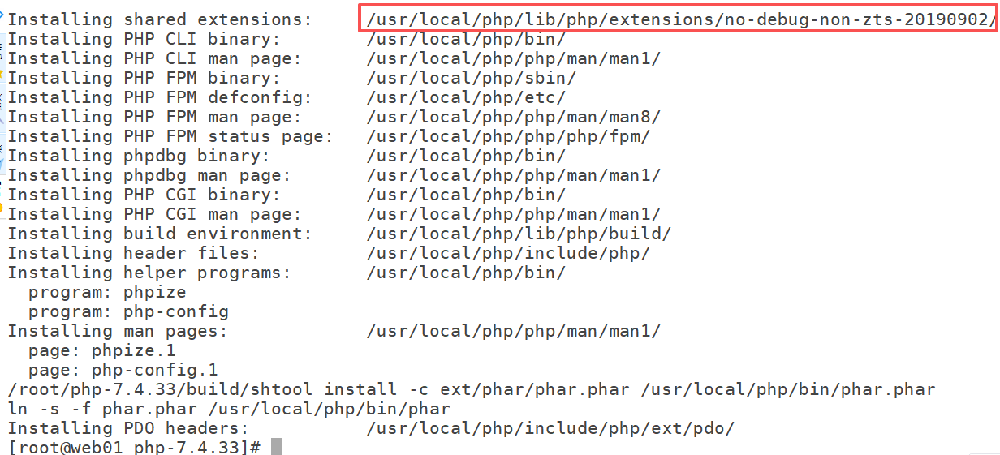

### <font style="color:rgb(51, 51, 51);">PHP 相关配置</font>

<font style="color:rgb(51, 51, 51);">使用 php-fpm 进行管理 php 服务，有三个配置文件：</font>

<font style="color:rgb(51, 51, 51);">① </font><code><font style="color:rgb(51, 51, 51);">php.ini</font></code><font style="color:rgb(51, 51, 51);">#默认php配置文件（/root/php-7.4.33）</font>

<font style="color:rgb(51, 51, 51);">② </font><code><font style="color:rgb(51, 51, 51);">php-fpm.conf</font></code><font style="color:rgb(51, 51, 51);">#php-fpm.conf是 </font><code><font style="color:rgb(51, 51, 51);background-color:rgb(243, 244, 244);">php-fpm</font></code><font style="color:rgb(51, 51, 51);"> 进程服务的配置文件 （默认已存在）</font>

<font style="color:rgb(51, 51, 51);">③ </font><code><font style="color:rgb(51, 51, 51);">www.conf</font></code><font style="color:rgb(51, 51, 51);">#www.conf这是 </font><code><font style="color:rgb(51, 51, 51);background-color:rgb(243, 244, 244);">php-fpm</font></code><font style="color:rgb(51, 51, 51);"> 进程服务的扩展配置文件（默认以存在）</font>

```shell
cp /root/php-7.4.33/php.ini-development /usr/local/php/etc/php.ini
cp /usr/local/php/etc/php-fpm.conf.default /usr/local/php/etc/php-fpm.conf
cp /usr/local/php/etc/php-fpm.d/www.conf.default /usr/local/php/etc/php-fpm.d/www.conf
```

<font style="color:rgb(51, 51, 51);">注意：</font>

<font style="color:rgb(51, 51, 51);">development 配置项多一些 显示语法错误等等信息 适合于部署开发环境和测试环境</font>

<font style="color:rgb(51, 51, 51);">production 默认开启项少 生产环境是不要出现错误、不暴露服务器目录结构</font>

### <font style="color:rgb(51, 51, 51);">添加启动服务</font>

```shell
# vim /usr/local/php/etc/php-fpm.conf
------------- 修改如下 -------------
13 [global]
14 ; Pid file
15 ; Note: the default prefix is /usr/local/php/var
16 ; Default Value: none

17 pid = run/php-fpm.pid
99 daemonize = yes
注意事项：17、99行前面都有一个分号；必须要去除，因为在php-fpm.conf文件中，分号；代表注释！！！
---------------------------------------


# vim /usr/lib/systemd/system/php-fpm.service
[Unit]
Description=PHP FastCGI Process Manager
After=network.target

[Service]
Type=forking
PIDFile=/usr/local/php/var/run/php-fpm.pid
ExecStart=/usr/local/php/sbin/php-fpm --fpm-config /usr/local/php/etc/php-fpm.conf
ExecReload=/bin/kill -USR2 $MAINPID
ExecStop=/bin/kill -QUIT $MAINPID
TimeoutStartSec=180
LimitNOFILE=65535
LimitNPROC=500
PrivateTmp=true
User=www
Group=www

[Install]
WantedBy=multi-user.target
```

<font style="color:rgb(51, 51, 51);">启动前，权限配置说明：</font>

```shell
touch /usr/local/php/var/log/php-fpm.log
chmod 664 /usr/local/php/var/log/php-fpm.log
chown -R www.www /usr/local/php

systemctl daemon-reload
systemctl start php-fpm

注意：php-fpm在计算机中默认会占用9000端口！！！
```

启动 php 时会报错 => 查看 `/var/log/messages`日志

```shell
# tail -100 /var/log/messages
Nov 26 20:30:10 localhost systemd[1]: sysstat-collect.service: Deactivated successfully.
Nov 26 20:30:10 localhost systemd[1]: Finished system activity accounting tool.
Nov 26 20:39:29 localhost systemd[1]: Reloading.
Nov 26 20:39:29 localhost systemd-rc-local-generator: /etc/rc.d/rc.local is not marked executable, skipping.
Nov 26 20:39:34 localhost systemd[1]: Starting PHP FastCGI Process Manager...
Nov 26 20:39:34 localhost php-fpm[216116]: /usr/local/php/sbin/php-fpm: error while loading shared libraries: libssl.so.1.1: cannot open shared object file: No such file or directory
Nov 26 20:39:34 localhost systemd[1]: php-fpm.service: Control process exited, code=exited, status=127/n/a
Nov 26 20:39:34 localhost systemd[1]: php-fpm.service: Failed with result 'exit-code'.
Nov 26 20:39:34 localhost systemd[1]: Failed to start PHP FastCGI Process Manager.

解决方案：
# sudo ln -s /usr/local/openssl/lib/libssl.so.1.1 /usr/lib64/
# sudo ln -s /usr/local/openssl/lib/libcrypto.so.1.1 /usr/lib64/
```

然后再次启动 PHP

```shell
# systemctl start php-fpm
# systemctl enable php-fpm
```

### <font style="color:rgb(51, 51, 51);">添加环境变量</font>

<font style="color:rgb(51, 51, 51);">方便php、phpize、phpconfig查找使用</font>

```shell
# echo 'export PATH=$PATH:/usr/local/php/bin' >> /etc/profile
# source /etc/profile
```

### 问题

通过源码编译安装的 Nginx，它的静态页面应该保存在 Nginx 安装目录下的 html 目录中，如果我们往 html 目录中放一个 test.html 和 test.php，启动 Nginx 后，通过浏览器分别访问这两个文件。

发现，可以正常访问 test.html，但是访问不了 test.php。这是因为 Nginx 自身只能处理静态网页，处理不了 php 的这种动态网页，处理 php 的动态网页需要将请求转发给 php 服务去处理！

```shell
[root@web01 ~]# echo "hello test.html" > /usr/local/nginx/html/test.html
[root@web01 ~]# echo -e "<?php\n\tphpinfo();\n?>" > /usr/local/nginx/html/test.php

[root@web01 ~]# systemctl start nginx
```


当我们访问 test.php 时会变为下载！


## <font style="color:rgb(51, 51, 51);">Nginx+PHP 配置</font>

### 配置操作

<font style="color:rgb(51, 51, 51);">写入文件</font><code><font style="color:rgb(51, 51, 51);background-color:rgb(243, 244, 244);">vim /usr/local/nginx/html/demo.php</font></code>

```php
<?php
  phpinfo();
?>
```

<font style="color:rgb(51, 51, 51);">nginx 和 php 进行关联，告诉 nginx，php 在哪里：</font>

<code><font style="color:rgb(51, 51, 51);">vim /usr/local/nginx/conf/nginx.conf</font></code><font style="color:rgb(51, 51, 51);">，提升 root：</font>

```php
# 也就是说将 location / 模块中的 root html; 拿到外面来！所有的location模块都可以使用
root html;
location / {
	index index.html index.htm index.php;
}
```

<font style="color:rgb(51, 51, 51);">设置 nginx+php 关联，$document\_root 就是加载 root 目录：</font>

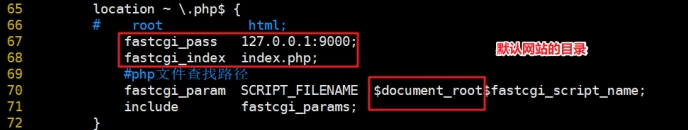

<font style="color:rgb(51, 51, 51);">让 Nginx 可以转发 PHP 代码到 PHP-FPM</font>

<font style="color:rgb(51, 51, 51);">要想让 Nginx 可以转发 PHP 代码到 PHP 解析器（PHP-FPM），必须在 nginx.conf 文件中进行配置，把所有后缀名为 .php 的文件转发到当前计算机的 9000 端口。（PHP-FPM 占用 9000 端口）</font>

<font style="color:rgb(51, 51, 51);">第一步：进入 /usr/local/nginx 目录，然后把 conf/nginx.conf 文件进行备份</font>

```php
# cd /usr/local/nginx
# cp conf/nginx.conf conf/nginx.conf.bak
```

<font style="color:rgb(51, 51, 51);">第二步：使用 grep 过滤 conf/nginx.conf 文件，只显示非注释内容</font>

```shell
# grep -Ev '#|^$' conf/nginx.conf
worker_processes  1;
events {
    worker_connections  1024;
}
http {
    include       mime.types;
    default_type  application/octet-stream;
    sendfile        on;
    keepalive_timeout  65;
    server {
        listen       80;
        server_name  localhost;
        location / {
            root   html;
            index  index.html index.htm;
        }
        error_page   500 502 503 504  /50x.html;
        location = /50x.html {
            root   html;
        }
    }
}
```

<font style="color:rgb(51, 51, 51);">第三步：去除http模块中的root选项（项目目录），只在server模块中保留一个即可</font>

```shell
# vim conf/nginx.conf
worker_processes  1;
events {
    worker_connections  1024;
}
http {
    include       mime.types;
    default_type  application/octet-stream;
    sendfile      on;
    keepalive_timeout  65;
    server {
        listen       80;
        server_name  localhost;
        root html;			# 整个server只保留一个root选项，表示网页代码放在html目录中，而且从location模块中提出来后，下面的多个location模块都可以使用这个目录
        location / {
            index  index.html index.htm index.php;
        }
        error_page   500 502 503 504  /50x.html;
        location = /50x.html {
        }
    }
}
```

<font style="color:rgb(51, 51, 51);">第四步：添加 PHP 支持，让 Nginx 可以识别 .php 文件，然后转发给 9000 端口</font>

```shell
# vim conf/nginx.conf
worker_processes  1;
events {
    worker_connections  1024;
}
http {
    include       mime.types;
    default_type  application/octet-stream;
    sendfile        on;
    keepalive_timeout  65;
    server {
        listen       80;
        server_name  localhost;
        root html;					# 整个server只保留一个root选项
        location / {
            index  index.html index.htm index.php;
        }
        ------------------ 华丽的分割线 --------------------
        location ~ \.php$ {
        	fastcgi_pass   127.0.0.1:9000;
        	fastcgi_index  index.php;
        	fastcgi_param  SCRIPT_FILENAME  $document_root$fastcgi_script_name;
        	include        fastcgi_params;
        }
        ------------------ 华丽的分割线 --------------------
        error_page   500 502 503 504  /50x.html;
        location = /50x.html {
        }
    }
}


注意：
$document_root：指代我们的项目目录，这里就是root html指定html文件夹！
$fastcgi_script_name：指代url地址中请求的.php文件
```

<font style="color:rgb(51, 51, 51);">设置完成后，重启 Nginx 软件（重载 reload）</font>

```shell
# systemctl reload nginx
```

<font style="color:rgb(51, 51, 51);">第五步：编写php测试文件，查看是否可以运行</font>

```shell
# vim /usr/local/nginx/html/demo.php
<?php
	phpinfo();
?>
```

<font style="color:rgb(51, 51, 51);">访问 </font>[<font style="color:rgb(65, 131, 196);">http://192.168.126.174/demo.php</font>](http://192.168.88.101/demo.php)<font style="color:rgb(51, 51, 51);">，显示 PHP 信息界面：</font>

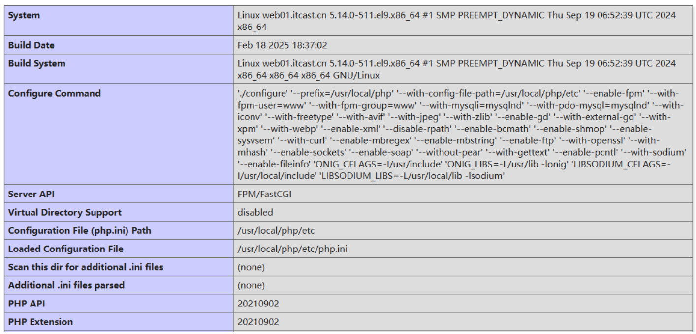

<font style="color:rgb(51, 51, 51);">到此，LNMP 环境就全部搭建完毕了。</font>

***

说明：大家很可能会将 Nginx 的配置文件 nginx.conf 改错，可以使用以下方式检测 nginx.conf 是否有问题：

```shell
[root@web01 nginx]# sbin/nginx -t
nginx: the configuration file /usr/local/nginx/conf/nginx.conf syntax is ok
nginx: configuration file /usr/local/nginx/conf/nginx.conf test is successful
```

### nginx 最终配置文件

```properties
worker_processes  1;
events {
    worker_connections  1024;
}
http {
    include       mime.types;
    default_type  application/octet-stream;
    sendfile        on;
    keepalive_timeout  65;
    server {
        listen       80;
        server_name  localhost;

        root   html;
        location / {
            index  index.html index.htm index.php;
        }

        location ~ \.php$ {
            fastcgi_pass   127.0.0.1:9000;
            fastcgi_index  index.php;
            fastcgi_param  SCRIPT_FILENAME  $document_root$fastcgi_script_name;
            include        fastcgi_params;
        }
        error_page   500 502 503 504  /50x.html;
        location = /50x.html {
        }
    }
}
```

# 四、WordPress 博客系统部署

## WordPress 介绍

WordPress 是一款使用 PHP 语言和 MySQL 数据库开发的个人博客系统，也是一款逐步演化成内容管理系统的软件。

## 官网地址

https://wordpress.org/download


## 安装 WordPress

第一步：下载源代码，或者直接从提供的资料中获取 `wordpress-6.7.1.tar.gz`

第二步：上传源代码到 Linux 服务器，然后对其进行解压缩，源码解压到 `/user/local/nginx/html`目录中

```shell
# tar -xf wordpress-6.7.1.tar.gz

删除Nginx的html目录中之前我们写的index.html和index.php
# rm -rf /usr/local/nginx/html/index.html
# rm -rf /usr/local/nginx/html/index.php

# mv wordpress/* /usr/local/nginx/html/
```

第三步：确认所有服务正常启动（NMP）

```shell
# systemctl restart nginx
# systemctl restart mysqld
# systemctl restart php-fpm
```

第四步：在 MySQL 中创建一个 wordpress 数据库，编码格式为 utf-8

```shell
# mysql -uroot -p
mysql> create database wordpress default charset=utf8;
```

第五步：过浏览器访问，输入 index.php，执行安装操作

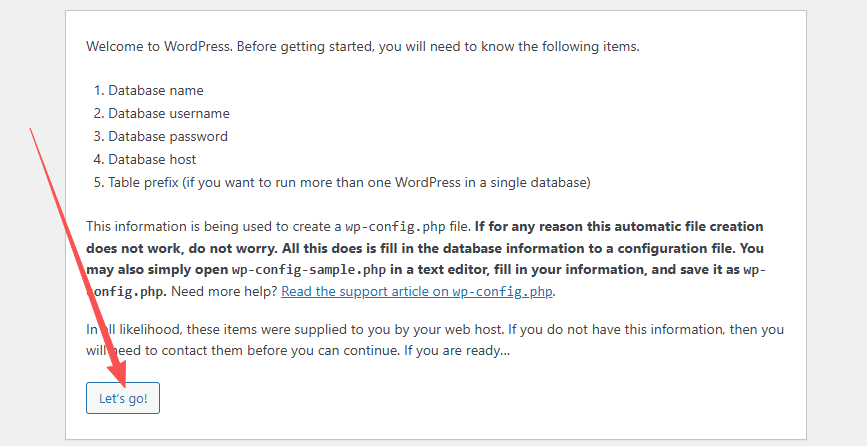

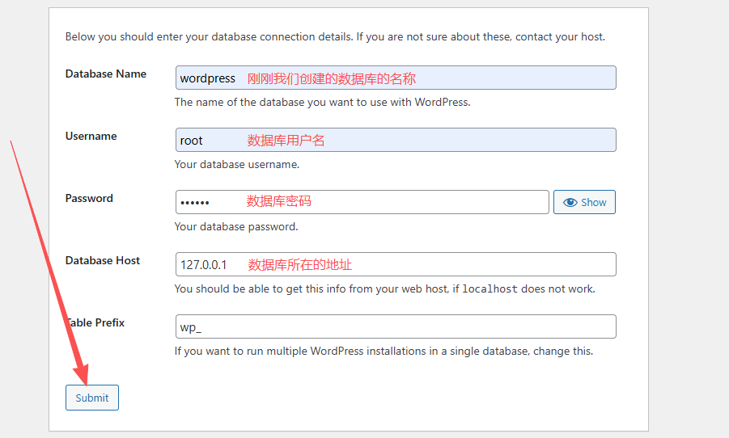

第六步：在 `/usr/local/nginx/html`目录中创建 `wp-config.php`文件并粘贴内容如下：

```shell
# vim /usr/local/nginx/html/wp-config.php
<?php
/**
 * The base configuration for WordPress
 *
 * The wp-config.php creation script uses this file during the installation.
 * You don't have to use the website, you can copy this file to "wp-config.php"
 * and fill in the values.
 *
 * This file contains the following configurations:
 *
 * * Database settings
 * * Secret keys
 * * Database table prefix
 * * ABSPATH
 *
 * @link https://developer.wordpress.org/advanced-administration/wordpress/wp-config/
 *
 * @package WordPress
 */

// ** Database settings - You can get this info from your web host ** //
/** The name of the database for WordPress */
define( 'DB_NAME', 'wordpress' );

/** Database username */
define( 'DB_USER', 'root' );

/** Database password */
define( 'DB_PASSWORD', '123456' );

/** Database hostname */
define( 'DB_HOST', '127.0.0.1' );

/** Database charset to use in creating database tables. */
define( 'DB_CHARSET', 'utf8mb4' );

/** The database collate type. Don't change this if in doubt. */
define( 'DB_COLLATE', '' );

/**#@+
 * Authentication unique keys and salts.
 *
 * Change these to different unique phrases! You can generate these using
 * the {@link https://api.wordpress.org/secret-key/1.1/salt/ WordPress.org secret-key service}.
 *
 * You can change these at any point in time to invalidate all existing cookies.
 * This will force all users to have to log in again.
 *
 * @since 2.6.0
 */
define( 'AUTH_KEY',         '#NHM~+n]#QUGyMbCdFYNto=$Cy[$(+t?;3}FgwcSVoGwBqXEB6)*<-m.HxZ(3*Xp' );
define( 'SECURE_AUTH_KEY',  'S^rO`N30MzWWr0sGR!4<A4Fgqx8(:fkImR.@xOIL;4K10;J{]pi{>l2*pFRBq+EB' );
define( 'LOGGED_IN_KEY',    'tiAE#5D/w!C)wL!<O`!0jKVL0v)fNHz96X&<ML)q>aFDKzr&>tl@gZJ1ZDIj06~p' );
define( 'NONCE_KEY',        'Njo7MW`i/&|~@|<Z.^Q7+&pLB}p#(%z*VEHE3tvBw}Iy1!%uevEC$^hJlz&>n?s!' );
define( 'AUTH_SALT',        'O2D>GFiu0LY0x7eW3wc[qLp`C`z,nK&w5#>M y%k|SBEe*js-YmU4<lds5M-7AX*' );
define( 'SECURE_AUTH_SALT', '5[%6v06~6A[==:`QD($/aw9,<~RQ.e_=J<S6`Yi/iF.DQBQ5lJMLvYOe^V?{`eGl' );
define( 'LOGGED_IN_SALT',   '/u87LR&?1=V:^r90d57:Za&Co9`1j?H&zD%fe #UM=zN|ms^ZB ^%5!OgfCMf-_s' );
define( 'NONCE_SALT',       'vV-iB,7o<3$Z2>@>+l 4=piK~XS+$0`@gj}`;-M|k-wLD!L|,01-WIxx&IjH7~uG' );

/**#@-*/

/**
 * WordPress database table prefix.
 *
 * You can have multiple installations in one database if you give each
 * a unique prefix. Only numbers, letters, and underscores please!
 *
 * At the installation time, database tables are created with the specified prefix.
 * Changing this value after WordPress is installed will make your site think
 * it has not been installed.
 *
 * @link https://developer.wordpress.org/advanced-administration/wordpress/wp-config/#table-prefix
 */
$table_prefix = 'wp_';

/**
 * For developers: WordPress debugging mode.
 *
 * Change this to true to enable the display of notices during development.
 * It is strongly recommended that plugin and theme developers use WP_DEBUG
 * in their development environments.
 *
 * For information on other constants that can be used for debugging,
 * visit the documentation.
 *
 * @link https://developer.wordpress.org/advanced-administration/debug/debug-wordpress/
 */
define( 'WP_DEBUG', false );

/* Add any custom values between this line and the "stop editing" line. */


/* That's all, stop editing! Happy publishing. */

/** Absolute path to the WordPress directory. */
if ( ! defined( 'ABSPATH' ) ) {
	define( 'ABSPATH', __DIR__ . '/' );
}

/** Sets up WordPress vars and included files. */
require_once ABSPATH . 'wp-settings.php';
```

第七步：接着安装 WordPress 博客系统

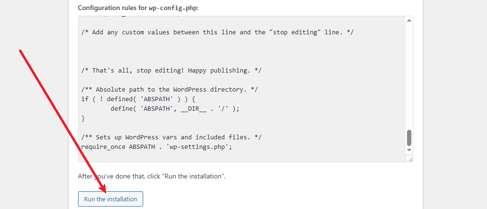

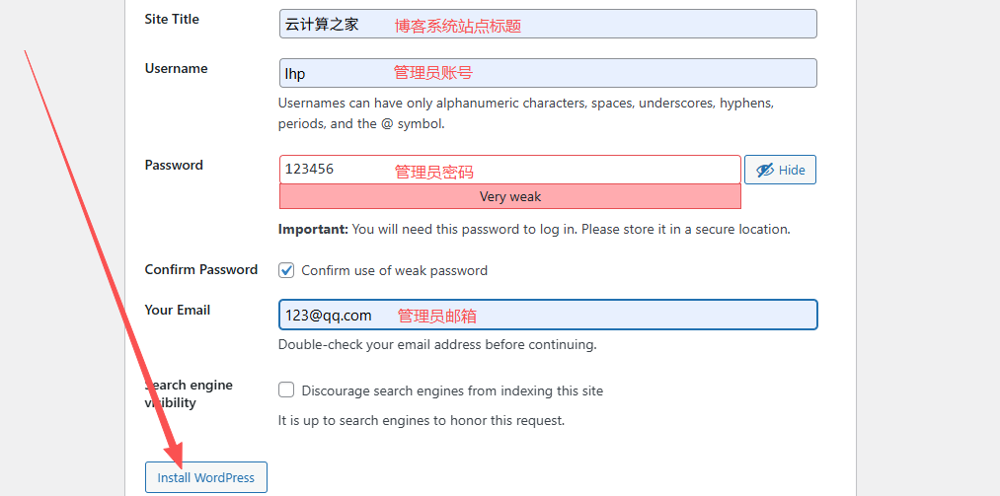


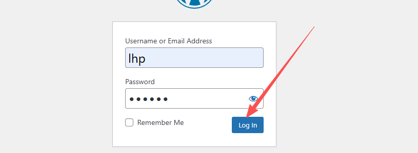

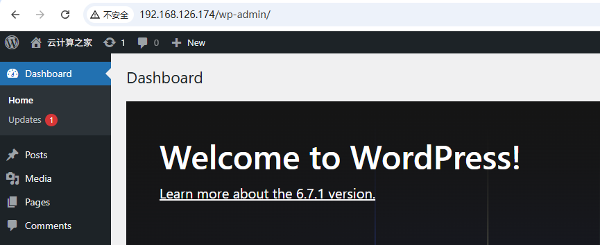

上面的就是后台管理系统的界面。<http://192.168.126.174/wp-admin/>

如果要访问前台系统：<http://192.168.126.174/>

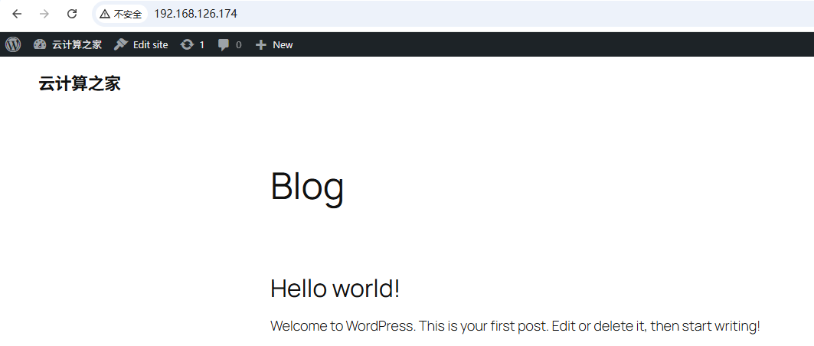

特殊说明：如果访问前台系统，出现 403 Forbidden，403 代表响应状态码，服务器端返回给测览器。403 表示没有访问权限，文件本身已经存在。但是由于权限不足导致 403。如果是访问首页返回 403，基本都是由于 Nginx 没有配置 index.php

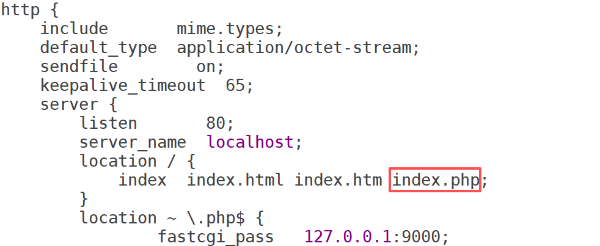


> 更新: 2026-05-21 08:35:51  
> 原文: <https://www.yuque.com/u41736172/az9urv/ntvrmfbrka5hy46r>