# 04.Nginx详解

# <font style="color:rgb(51, 51, 51);">一、重装和升级</font>

作用：Nginx 重装与 Nginx 平滑升级(不停服升级)

***

<font style="color:rgb(51, 51, 51);">在实际业务场景中，需要使用软件新版本的功能、特性。就需要对原有软件进行升级或者重装操作。</font>

<font style="color:rgb(51, 51, 51);">旧 stable 稳定版  1.24</font>

<font style="color:rgb(51, 51, 51);">stable 稳定版  1.26</font>

<font style="color:rgb(51, 51, 51);">mainline 主线版本   最新的 1.27</font>

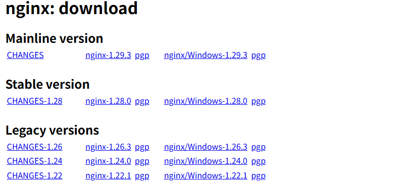

官网地址：<https://nginx.org/>

## 信号参数

kill 命令的作用是传输信号给进程

> kill 不仅仅可以杀死进程，其底层核心是给进程传递一个信号！因为 kill -9 与 kill -15 使用较多，给大家带来错觉！

```shell
-TERM，-INT	(快速退出，当前的请求不执行完成就退出)
-QUIT				(优雅退出，执行完当前的请求后退出)
-HUP				(重新加载配置文件，用新的配置文件启动新worker进程，并优雅的关闭旧的worker进程)
-USR1				(重新打开日志文件)
-USR2				(平滑的升级nginx二进制文件，拉起一个新的主进程旧主进程不停止)
-WINCH			(优雅的关闭worker进程)


重点:
平滑升级
kill -USR2 pid
关闭master下面的所有work(子进程)
kill -WINCH pid
优雅的退出master
kill -QUIT pid
```

> 使用 kill -l 可以查看 kill 命令可以传递的所有信号

## <font style="color:rgb(51, 51, 51);">重新安装（了解）</font>

<font style="color:rgb(51, 51, 51);">① 停止掉服务，删除编译安装的软件包和源码包</font>

<font style="color:rgb(51, 51, 51);">② 重新解压编译安装即可</font>

<font style="color:rgb(51, 51, 51);">注意：如果有需要，请备份配置文件和网站目录里的资源文件</font>

<font style="color:rgb(51, 51, 51);">适合：开发或者测试环境，停机升级(停服升级)</font>

## <font style="color:rgb(51, 51, 51);">平滑升级（重点）</font>

虽然通过上面的方式可以实现 Nginx 的升级，但是如果直接把旧版本的服务停止掉，会影响线上业务的使用。那我们该如何进行升级呢?

答：可以采用平滑升级(不停服升级)，大致可以分为以下三个步骤

```shell
1. 旧的先不停掉
2. 新的又可以起来
3. 旧的和新的同时提供服务，旧的请求完成之后，就停掉旧进程
-USR2 	平滑启动一个新的进程(平滑升级)
-WINOH 	优雅的关闭子进程（Nginx分为master主进程和worker子进程）
-QUIT 	优雅关闭旧的nginx的主进程

启动Nginx后，会产生两个进程，一个主进程master，一个是子进程worker！
```

图解：


第一步：编译安装新软件

注意：systemctl 管理的 nginx 软件，没办法使用平滑升级，**<font style="background-color:#FBDE28;">只有原生启动的 Nginx 才可以使用平滑升级</font>**

```shell
# systemctl stop nginx
# cd /usr/local/nginx
# sbin/nginx

# sbin/nginx -V
nginx version: nginx/1.24.0
built by gcc 11.5.0 20240719 (Red Hat 11.5.0-7) (GCC)
built with OpenSSL 3.5.1 1 Jul 2025
TLS SNI support enabled
configure arguments: --prefix=/usr/local/nginx --user=www --group=www --with-http_ssl_module --with-http_stub_status_module --with-http_realip_module

# ps aux | grep nginx
root        1459  0.0  0.2  11632  2344 ?        Ss   18:51   0:00 nginx: master process sbin/nginx
www         1460  0.0  0.5  15884  5288 ?        S    18:51   0:00 nginx: worker process
root        1467  0.0  0.2   6644  2304 pts/0    S+   18:51   0:00 grep --color=auto nginx
master是Nginx的主进程负责接收请求和转发请求，worker是Nginx的子进程，负责处理请求


# 然后我们平滑升级Nginx，目前的Nginx是1.24版本，我们升级到1.26版本
# 上传Nginx安装包到Linux中
# tar -xf nginx-1.26.2.tar.gz
# cd nginx-1.26.2/
# ./configure --prefix=/usr/local/nginx --user=www --group=www --with-http_ssl_module --with-http_stub_status_module --with-http_realip_module


上面的配置会报错，解决方法如下，然后再次进行配置，就可以配置了
# yum -y install openssl-devel

# make && make install
```

第二步：查看新旧 Nginx 的版本信息（新版本的 Nginx 安装到了和旧版本一样的位置）

```shell
# cd /usr/local/nginx/

# ll sbin/
总用量 8348
-rwxr-xr-x 1 root root 4281888 11月 27 19:04 nginx				# 新版本的Nginx
-rwxr-xr-x 1 root root 4260744 11月 26 18:16 nginx.old		# 旧版本的Nginx

# sbin/nginx.old -V
nginx version: nginx/1.24.0
built by gcc 11.5.0 20240719 (Red Hat 11.5.0-7) (GCC)
built with OpenSSL 3.5.1 1 Jul 2025
TLS SNI support enabled
configure arguments: --prefix=/usr/local/nginx --user=www --group=www --with-http_ssl_module --with-http_stub_status_module --with-http_realip_module

# sbin/nginx -V
nginx version: nginx/1.26.2
built by gcc 11.5.0 20240719 (Red Hat 11.5.0-14) (GCC)
built with OpenSSL 3.5.1 1 Jul 2025
TLS SNI support enabled
configure arguments: --prefix=/usr/local/nginx --user=www --group=www --with-http_ssl_module --with-http_stub_status_module --with-http_realip_module
```

第三步：新旧版本同时运行（重点）

平滑升级：

```shell
# kill -USR2 旧的主进程号

# 现在看到的master和worker都是旧Nginx的
# ps -ef | grep nginx
root        1459       1  0 18:51 ?        00:00:00 nginx: master process sbin/nginx
www         1460    1459  0 18:51 ?        00:00:00 nginx: worker process
root        9735     902  0 20:37 pts/0    00:00:00 grep --color=auto nginx

平滑升级，升级完后，旧的和新的都会运行，从此之后，再收到的请求就由新版本的Nginx来处理，旧版本的Nginx处理完现有的请求后就没它的事情了！
# kill -USR2 1459

# ps -ef | grep nginx
root        1459       1  0 18:51 ?        00:00:00 nginx: master process sbin/nginx
www         1460    1459  0 18:51 ?        00:00:00 nginx: worker process
root        9737    1459  0 20:38 ?        00:00:00 nginx: master process sbin/nginx
www         9738    9737  0 20:38 ?        00:00:00 nginx: worker process
root        9740     902  0 20:38 pts/0    00:00:00 grep --color=auto nginx
```

第四步：查看旧的主进程号，然后使用 kill -WINCH 优雅的关闭旧的子进程，再关闭旧的主进程

```shell
# kill -WINCH 旧的主进程号
# kill -QUIT 旧的主进程号

-WINCH：代表关闭主进程下面的所有worker进程
-QUIT：代表优雅的退出master进程

具体操作：
# ps -ef | grep nginx
root        1459       1  0 18:51 ?			00:00:00 nginx: master process sbin/nginx
www         1460    1459  0 18:51 ?     00:00:00 nginx: worker process
root        9737    1459  0 20:38 ?     00:00:00 nginx: master process sbin/nginx
www         9738    9737  0 20:38 ?     00:00:00 nginx: worker process

# 注意PID一定写的是旧的nginx的主进程的PID
# kill -WINCH 1459
# ps -ef | grep nginx
root        1459       1  0 18:51 ?     00:00:00 nginx: master process sbin/nginx
root        9737    1459  0 20:38 ?     00:00:00 nginx: master process sbin/nginx
www         9738    9737  0 20:38 ?     00:00:00 nginx: worker process

# kill -QUIT 1459
# ps -ef | grep nginx
root        9737       1  0 20:38 ?     00:00:00 nginx: master process sbin/nginx
www         9738    9737  0 20:38 ?     00:00:00 nginx: worker process
可以看到已经没有旧的主进程和子进程了！

# curl -I http://localhost
HTTP/1.1 200 OK
Server: nginx/1.26.2		# 可以看到目前使用的确实是新版本的Nginx了
Date: Thu, 27 Nov 2025 12:51:04 GMT
Content-Type: text/html; charset=UTF-8
Connection: keep-alive
X-Powered-By: PHP/7.4.33
Link: <http://192.168.126.174/index.php?rest_route=/>; rel="https://api.w.org/"
```

> 通过 Nginx 的平滑升级的方式，我们确实实现了没有停止旧 Nginx 服务的情况下，安装了新的 Nginx，并且新 Nginx 正常跑起来后，旧的 Nginx 才给停止掉的！

***

小结:

工作中经常需要对旧版本程序进行升级操作，如 MySQL、Nginx 等等，但是 Nginx 本身有两种升级方式。

重装升级：需要停服，然后删原目录，重新编译安装!

平滑升级：不需要停服，直接在原有基础上进行升级!

`kill -USR2`平滑升级

`kill -WINCH`移除当前进程的所有子进程(worker 进程)

`kill -QUIT`代表优雅的关闭 master 主进程

# 二、企业级服务配置

## nginx.conf 配置文件

nginx.conf 存储位置有两种情况：① dnf/yum 安装的，则通常在`/etc/nginx/nginx.conf`目录下 ② 自定义安装，大多数都是位于 Nginx 软件安装目录

编译的 Nginx 默认的配置文件位置：`/usr/local/nginx/conf/nginx.conf`

使用 grep 删除注释与空行：`grep -Ev '#|^$' conf/nginx.conf > conf/nginx.conf`

```shell
# cd /usr/local/nginx
# grep -Ev '#|^$' conf/nginx.conf
```


说明：

**worker\_processes**：它的值越大，能够并发处理的请求就越多，这个值最高可以和 CPU 的核心数保持一致，比如 2 核心 CPU，那值最高就是 2，4 核心的 CPU，那值最高就是 4。

**error\_log**：表示错误日志的存放位置

**pid**：Linux 中每个进程都是一个文件，这里表示 Nginx 进程所在的文件位置

**worker\_connections**：表示每个 worker\_process 能够处理的并发请求数，如果 worker\_processes 的值是 4，那么表示能够并发处理的请求可以达到 4096 个。

**http**：每个 nginx.conf 只能有一个 http 模块，http 模块中可以有多个 server 模块，每个 server 模块中可以有多个 location 模块。

**include**：表示 Nginx 中处理的数据类型

**default\_type**：表示默认的数据类型，上图中默认是二进制流数据类型，表示文件、字符串等都能处理。

**keepalive\_time**：超时时间，表示本次连接 65 秒都没有任何动作，就会关闭该连接

**server**：每个项目就对应一个 server 模块（其实也就是类似于 httpd 服务器中学习的虚拟主机的概念）

**listen**：表示监听的端口

**server\_name**：服务器名称，表示域名地址，以后如果申请了域名，那么域名就写在这里

**location**：一个 server 中可以有多个 location，表示匹配请求的 url 地址，上图中 / 表示匹配所有请求，`location = /50x.html`表示匹配 url 路径是 /50x.html 的请求

重点：学会配置 server 区块

```nginx
server {
    listen       80;
    server_name  localhost;
    root				 html;
    location / {
        index  index.html index.htm index.php;
    }
    location ~ \.php$ {
            fastcgi_pass   127.0.0.1:9000;
            fastcgi_index  index.php;
            fastcgi_param  SCRIPT_FILENAME  $document_root$fastcgi_script_name;
            include        fastcgi_params;
    }
    error_page   500 502 503 504  /50x.html;
    location = /50x.html {
    }
}

listen：监听端口，默认为80
server_name：很重要，可以绑定域名(更多一些)、可以绑定IP，localhost本机虚拟域名，底层IP地址就是127.0.0.1
root html：代表Nginx项目目录，从安装目录开始算起
location：url匹配规则，location = /50x.html精准匹配，location ~ \.php$正则匹配，location / 代表如果刚才那些匹配规则都没有匹配上，则默认匹配location / 
error_page 500 502 503 504 /50x.html：如果服务器端响应500、502、503、504，则自动跳转到/50x.html这个错误页面
fastcgi_pass：请求转化给后面的地址
fastcgi_index：动态请求中的默认首页
fastcgi_param：参数设计，SCRIPT_FILENAME代表脚本名称。$document_root代表root指定的项目目录，$fastcgi_script_name请求的文件名称。
```

## server 区块配置（虚拟主机）

### 基于域名虚拟主机（重要）

在实际生产业务环境中，一台 web 服务器，需要使用多个网站部署。搭建 vhost 虚拟机主机实现不同域名，解析绑定到不同的目录。

www.shop.com => /usr/local/nginx/html/shop

www.devops.com => /usr/local/nginx/html/devops

案例：添加一个 www.devops.com 域名，解析到 `/usr/local/nginx/html/devops`项目目录

第一步：编辑 nginx.conf 文件，添加虚拟主机

```nginx
# vim /usr/local/nginx/conf/nginx.conf
# 添加虚拟主机
server {
    # 监听端口
    listen 80;
    # 配置域名
    server_name www.devops.com;
    # 配置目录
    root html/devops;
    # 配置url匹配规则
    location / {
        # 默认索引页
        index index.html index.htm;
    }
}


# 检测配置文件是否有问题
# /usr/local/nginx/sbin/nginx -t
nginx: the configuration file /usr/local/nginx/conf/nginx.conf syntax is ok
nginx: configuration file /usr/local/nginx/conf/nginx.conf test is successful
```

第二步：在 Windows 电脑中，解析 hosts 域名，设置 IP 与域名映射，强制让 DNS 把 www.devops.com 指向虚拟机 IP

① Windows+R，然后输入 drivers 回车，如下图所示


② 进入 etc，找到 hosts 文件，然后进行修改，在文件中添加以下内容（注意：IP 地址要改为对应的 Linux 服务器的）

```shell
192.168.126.174 www.devops.com
```

第三步：在 `/usr/local/nginx/html`目录下创建 devops 文件夹，然后在其目录下创建 index.html 文件

```shell
# cd /usr/local/nginx/html
# mkdir devops
# vim devops/index.html
<html>
  <head>
    <title>devops</title>
  </head>
  <body>
    this is web page!
  </body>
</html>
```

第四步：重载 Nginx

```shell
# systemctl reload nginx
或者如果Nginx目录是未启动状态，那就重启Nginx
# systemctl restart nginx
```

第五步：访问测试 http://www.devops.com


### 基于 IP 虚拟机主机

多个 IP 访问同一台服务器主机，不同的 IP 解析到不同的 vhost 虚拟主机中

核心：ens33 网卡绑定多个 IP 地址（选做一个临时绑定 IP 或者配置文件绑定 IP）

第一步：使用 ifconfig 为 ens33 临时绑定一个虚拟网卡 IP

```shell
# ifconfig ens33:1 192.168.126.200
```

> ifconfig ens33:1 down 可以实现对其进行删除，然后 systemctl restart NetworkManager 重启网络

运行结果：

```shell
# ifconfig
ens33: flags=4163<UP,BROADCAST,RUNNING,MULTICAST>  mtu 1500
        inet 192.168.126.174  netmask 255.255.255.0  broadcast 192.168.126.255
        inet6 fe80::20c:29ff:fe87:8649  prefixlen 64  scopeid 0x20<link>
        ether 00:0c:29:87:86:49  txqueuelen 1000  (Ethernet)
        RX packets 3025  bytes 264172 (257.9 KiB)
        RX errors 0  dropped 0  overruns 0  frame 0
        TX packets 859  bytes 91615 (89.4 KiB)
        TX errors 0  dropped 1 overruns 0  carrier 0  collisions 0

ens33:1: flags=4163<UP,BROADCAST,RUNNING,MULTICAST>  mtu 1500
        inet 192.168.126.200  netmask 255.255.255.0  broadcast 192.168.126.255
        ether 00:0c:29:87:86:49  txqueuelen 1000  (Ethernet)
```

可以在 Windows 中 ping 一下，这两个 IP 都是可以 ping 通的，其实都是指向同一台 Linux 服务器的

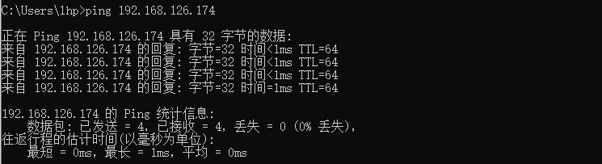

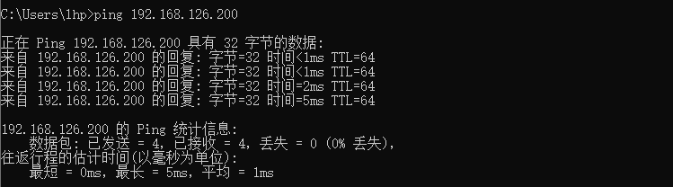

第二步：建立一个虚拟主机，绑定虚拟网卡 IP

```shell
# cd /usr/local/nginx
# vim conf/nginx.conf
删除之前配置的基于域名的虚拟主机，添加如下内容
server {
  listen 80;
  server_name 192.168.126.200;
  root html/devops;
  location / {
    index index.html index.htm;
  }
}
```

第三步：重启 Nginx 服务器或者重载

```shell
# systemctl restart nginx
或者如果Nginx目前是启动状态的话，重载也可以
# systemctl reload nginx
```

第四步：访问测试


因为我今天用的机器就是昨天用过的，所以目前直接访问 174，会看到博客系统的内容（也就是 html 目录中的内容）

***

\*\*问题：\*\*如果在 nginx.conf 配置文件中，只绑定了 192.168.126.200 这个 IP，没有绑定 192.168.126.174 这个 IP，那么浏览器中访问 192.168.126.174 时会转向哪里？

\*\*答：\*\*如果 IP 地址与配置文件中的 server 区块相匹配（也就是有对应的 server\_name），则直接显示匹配的信息。如果 IP 地址与配置文件中的 server 区块都不匹配，则会默认指向第一个 server 区块！

\*\*比如：\*\*上面的 Nginx 配置文件中我们的虚拟主机一个是 localhost、一个是 192.168.126.200。就没有配置与 192.168.126.174 对应的区块，那就会匹配第一个配置好的 server 区块！

***

补充：CentOS Stream 9 网卡添加 IP 与移除 IP

nmcli => nm，network manager => cli，client

up/down => up 开启/down 关闭

```powershell
可以使用上面的ifconfig命令，也可以使用下面的方式

# 添加IP
nmcli connection modify ens33 +ipv4.addresses 192.168.126.200/24
nmcli connection up ens33

# 查看IP
nmcli device show ens33

# 移除IP，下面的命令表示保留192.168.126.174，移除192.168.126.200
nmcli connection modify ens33 ipv4.addresses 192.168.126.174/24
nmcli connection down ens33 && nmcli connection up ens33
```

### 基于端口虚拟主机

优势：默认不占用 80 端口，能够稍微隐秘一些

第一步：编辑 nginx.conf 配置文件

```nginx
# vim /usr/local/nginx/conf/nginx.conf
修改上面的配置：
server {
    listen 8080;
    server_name 192.168.126.200;
    root html/devops;
    location / {
      index index.html index.htm;
    }
}
```

第二步：重载 Nginx

```nginx
# systemctl reload nginx
```

第三步：访问测试


## Nginx 问题说明

大家不要将 sbin/nginx 原生管理方式与 systemctl 管理方式混用。

默认情况，sbin/nginx 原生管理不能使用 systemctl 方式进行管理；反之亦然。两者必须明确选择一种。

第一种方式：sbin/nginx

```shell
# cd /usr/local/nginx

# 启动Nginx
# sbin/nginx

# 重载Nginx
# sbin/nginx -s reload

# 停止Nginx
# sbin/nginx -s stop
或者
# sbin/nginx -s quit
```

第二种方式：systemctl

```shell
# systemctl start nginx
# systemctl reload nginx
# systemctl stop nginx
```

> 不论哪种方式，重载的前提是 Nginx 目前处于启动状态。

# 三、Nginx 默认官方模块

## GZIP 压缩（优化手段）

### 概述

压缩文件大小变小了，传输更快了。目前市场上大部分浏览器是支持 GZIP 的。IE6 以下支持不好，会出现乱码情况。

<font style="color:#117CEE;">http://nginx.org/en/docs/http/ngx\_http\_gzip\_module.html</font>

```shell
gzip on;
gzip_min_length 1k;
gzip_buffers 4 16k;
gzip_http_version 1.1;
gzip_comp_level 5;
gzip_types text/plain text/css text/javascript application/x-javascript image/jpeg image/gif image/png image/x-ms-bmp;
gzip_vary on;
gzip_disable "MSIE [1-6]\.";

第1行:开启Gzip
第2行:不压缩临界值，大于1K的才压缩，一般不用改
第3行:gzip buffers number,size，压缩文件时使用的缓存空间的大小，默认128
第4行:用了反向代理的话，末端通信是HTTP/1.0，默认是HTTP/1.1
第5行:压缩级别，1-10，数字越小压缩的越好，时间也越长
第6行:进行压缩的文件类型，建议js|css|图片,注:javascript有两种写法，最好都写上
第7行:跟squid等缓存服务有关，on的话会在Header里增加"Vary:Accept-Encoding"
第8行:IE6对Gzip不怎么友好，不给它Gzip了

gzip_vary off;是 Nginx 配置中的一条指令，它用于控制是否在响应头中设置 Vary:Accept-Encoding 头部，具体来说:
gzip_vary on;:启用时，Nginx 会在响应头中加入 vary:Accept-Encoding，表示不同的客户端可能会根据是否支持 gzip 压缩来收到不同的响应内容，这有助于缓存服务器(如CDN)缓存压缩和未压缩的内容。
gzip_vary off;:禁用时，Nginx 不会在响应头中加入 vary:Accept-Encoding，这意味着缓存服务器不会区分压缩与未压缩的内容。这样做通常会减少缓存的复杂性，但可能会导致某些情况缓存不一致。
```

### 案例--未使用 GZIP 压缩

**未使用 gzip 压缩前：**

第一步：修改 nginx.conf 配置文件如下：

```shell
worker_processes  1;
events {
    worker_connections  1024;
}
http {
    include       mime.types;
    default_type  application/octet-stream;
    sendfile        on;
    keepalive_timeout  65;
    server {
        listen       80;
        server_name  localhost;
        root				 html
        location / {
            index  index.html index.htm index.php;
        }
        location ~ \.php$ {
                fastcgi_pass   127.0.0.1:9000;
                fastcgi_index  index.php;
                fastcgi_param  SCRIPT_FILENAME  $document_root$fastcgi_script_name                            ;
                include        fastcgi_params;
        }
        error_page   500 502 503 504  /50x.html;
        location = /50x.html {
        }
    }
    server {
      listen 80;
      server_name www.devops.com;
      root html/devops;
      location / {
        index index.html index.htm;
      }
    }
}
```

第二步：在 html/devops 目录下放置一张图片 fox.bmp，并编写 index.html

```shell
# vim /usr/local/nginx/html/devops/index.html
<html>
  <head>
    <title>devops</title>  
  </head>
  <body>
    
  </body>
</html>
```

第三步：重新启动 Nginx 访问测试

```shell
# systemctl restart nginx
```

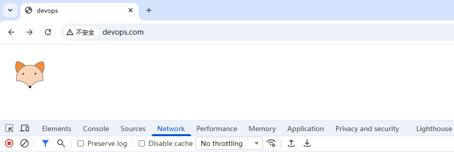

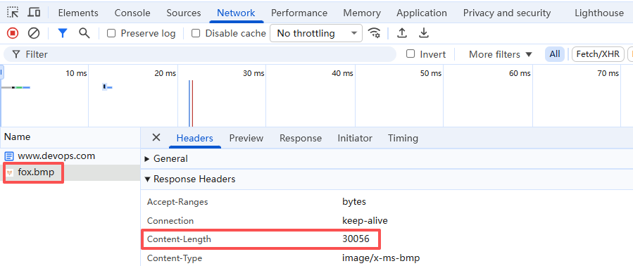

### 案例--使用 GZIP 压缩之后

**使用 gzip 压缩之后：**

第一步：修改 nginx.conf 配置文件，改为下图所示：

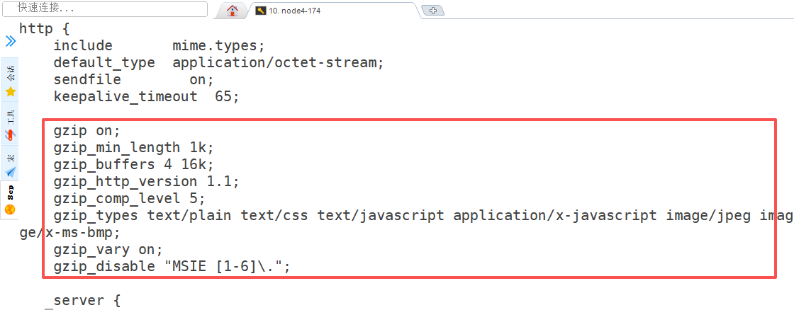

第二步：重启 Nginx 服务器，访问测试，这次还是访问上面的地址，**<font style="background-color:#FBDE28;">一定要 ctrl+F5 强制刷新访问</font>**！否则浏览器会有之前的缓存！

```shell
# systemctl restart nginx
```

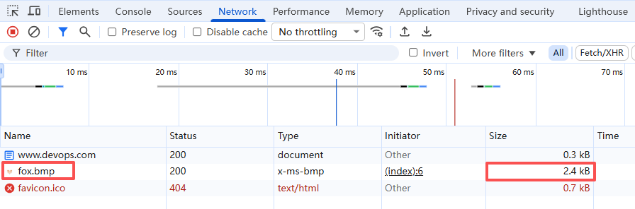

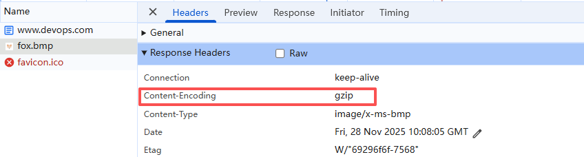

可以看到，确实经过 gzip 压缩后，传输的图片文件变小了！

## 客户端缓存（优化手段）

告知浏览器获取的信息是在某个区间时间段是有效的，基本格式：

```shell
expires 30s;	# 表示把数据缓存30秒
expires 30m;	# 表示把数据缓存30分
expires 10h;	# 表示把数据缓存10小时
expires 3d;	# 表示把数据缓存3天
```

案例：缓存\*\*<font style="color:#C99103;">图片/js/css</font>\*\* 文件，缓存时间为 1 天

```shell
location ~ \.(jpg|jpeg|gif|png|bmp|js|css)$ {
    expires 1d;
}
```

> 在 nginx.conf 配置文件中的 server\_name 是 www.devops.com 的区块中添加上面的内容。

```shell
server {
  listen 80;
  server_name www.devops.com;
  root html/devops;
  location / {
    index index.html index.htm;
  }
  location ~ \.(jpg|jpeg|gif|png|bmp|js|css)$ {
    expires 1d;
  }
}
```

重启服务器：

```shell
# systemctl restart nginx
```

访问测试：

第一次访问：

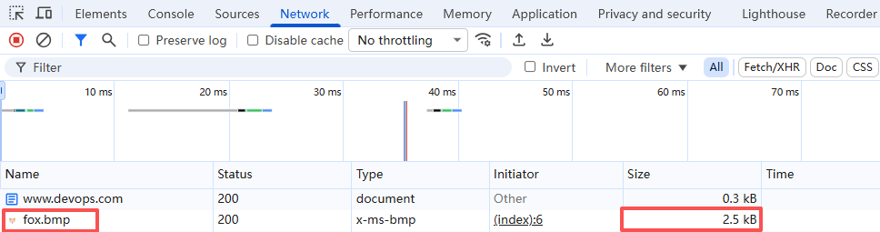

第二次访问：

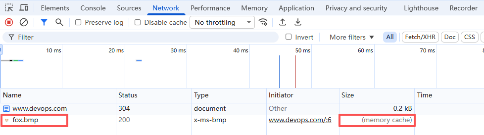

## 正向代理与反向代理

**正向代理：**


特点：知道自己使用了代理，需要填写代理服务器的 IP 等相关链接信息

场景：常见于代理客户端上网等操作（翻墙）

***

**反向代理：**


特点：用户是无感知的，不知道使用了代理服务器。反向代理服务器是和真实访问的服务器是在一起的，有关联的。

作用:

① 可以根据实际业务需求，分发代理页面到不同的解释器

② 可以隐藏真实服务器的路径

③ 反向代理常用于转发请求或者负载均衡操作

***

小结：

代理一共有两种：(正向代理) + (反向代理)

正向代理用户可以感知到，比较典型应用(科学上网)

反向代理用户无感知，比较典型的应用(请求转发，更多应用在于负载均衡技术)

## 基于 IP 的访问控制（安全限制）

基于 ngx\_http\_access\_module 模块，默认可使用

语法：

```shell
deny	ip		禁止IP访问
allow ip		匀速IP访问
```

<font style="color:#117CEE;">https://nginx.org/en/docs/http/ngx\_http\_access\_module.html</font>

默认是允许所有 IP 访问。

案例：

```shell
location / {
    deny	192.168.1.1;
    allow	192.168.1.0/24;
    allow 10.1.1.0/16;
    allow 2001:0db8::/32;
    deny 	all;
}
```

疑问：192.168.1.1 这个 IP，也满足下方 allow 192.168.1.0/24; 那到底最终是允许还是不允许访问呢?

答：不允许访问，默认从上往下执行，一旦匹配到某个规则，则自动触发。触发以后，就不会继续往下匹配！！！

\*\*案例 1：\*\*修改 nginx.conf 配置文件，表示禁止所有人访问

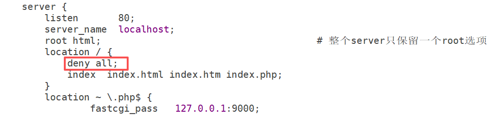

重启 Nginx，然后测试：

```shell
# systemctl restart nginx
```

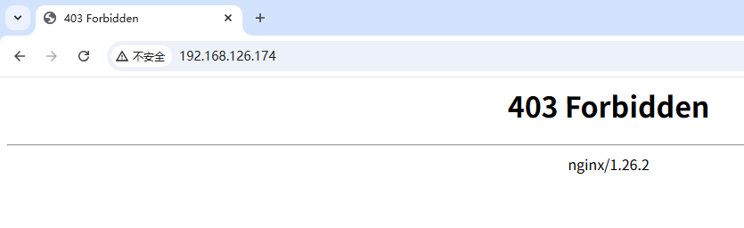

> 提示：403，表示禁止访问

\*\*案例 2：\*\*修改 nginx.conf 配置文件，表示允许 192.168.126.0/24 网段的 IP 访问，禁止其他 IP 访问。

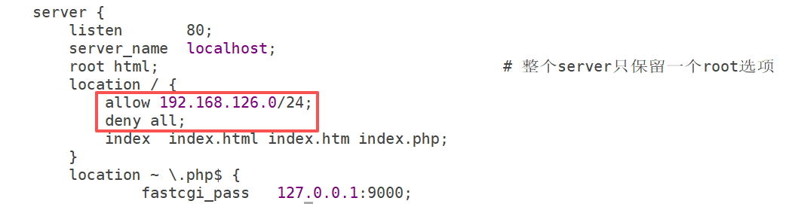

重启 Nginx，然后测试：

```shell
# systemctl restart nginx
```


> 上面写了多条基于 IP 访问的规则，从上往下执行，如果匹配到某个规则后，就不会继续往下匹配了！！！

## 基于用户的访问控制（安全限制）

基于 ngx\_http\_auth\_basic\_module 模块，默认可用

语法：

加密文本：由 htpasswd 命令实现

htpasswd 命令是 httpd 里的一个工具，如果没有，可以使用 `yum -y install httpd-tools`安装

```shell
创建密码文件：htpasswd -c 生成到的路径 用户名
-c 创建新文件，如果再次添加用户去掉-c参数，否则会被删除覆盖原来的
auth_basic "welcom to oracle!"
auth_basic_user_file /usr/local/nginx/conf/passwd.db;
```

\*\*第一步：\*\*生成 passwd 密钥文件

切换到 conf 目录

```shell
# cd /usr/local/nginx/conf
```

生成密钥文件

```shell
# htpasswd -c ./passwd.db devops
New password:123456
Re-type new password:123456
Adding password for user devops

# ls
fastcgi.conf            koi-utf             nginx.conf          scgi_params           win-utf
fastcgi.conf.default    koi-win             nginx.conf.bak      scgi_params.default
fastcgi_params          mime.types          nginx.conf.default  uwsgi_params
fastcgi_params.default  mime.types.default  passwd.db           uwsgi_params.default
```

第二步：在 nginx.conf 中配置密钥文件

```shell
server {
  listen 80;
  server_name www.devops.com;
  root html/devops;
  location / {
    auth_basic "welcome to www.devops.com";
    auth_basic_user_file /usr/local/nginx/conf/passwd.db;
    index index.html index.htm;
  }
  location ~ \.(jpg|jpeg|gif|png|bmp|js|css)$ {
    expires 1d;
  }
}
```

配置完成后，重启 Nginx

```shell
# systemctl restart nginx
```

第三步：打开浏览器，访问 http://www.devops.com 域名，运行效果：


然后输入用户名 devops，密码 123456


**如果本次账号与密码输入不正确，则会提示：401，未授权！（输入错误几次，然后取消就会提示下面的）**

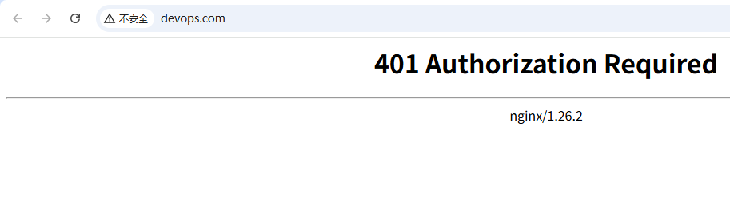

***

**响应状态码**

200：正常响应

401：授权失败，比如账号、密码输入错误

403：权限不足，比如目录下找不到首页文件，权限不足都可能会引起 403

404：文件/资源未找到

500：服务器端异常，比如服务器端报错、数据库无法连接

502：gateway 网关错误，比如 nginx 转发请求到后端服务器，后端服务器异常，无法响应

## 目录结构显示（了解）

作用：仅用于开发、测试环境，主要用于调试代码。

应用：如果项目配置完毕后，一个目录下没有首页，则会显示 403 Forbidden。这个时候我们可以使用`autoindex on`，显示所在目录下的所有文件列表。

基本语法：

```shell
autoindex on;
```

修改上面的 nginx.conf 配置文件如下：

```shell
server {
  listen 80;
  server_name www.devops.com;
  root html/devops;
  location / {
    # auth_basic "welcome to www.devops.com";
    # auth_basic_user_file /usr/local/nginx/conf/passwd.db;
    autoindex on; # 会显示所在目录下的文件列表信息
    index index; 	# 项目目录就没有页面是叫index这个名称的
  }
  location ~ \.(jpg|jpeg|gif|png|bmp|js|css)$ {
    expires 1d;
  }
}
```

重启服务器：

```shell
# systemctl restart nginx
```

打开浏览器，访问如下图所示：

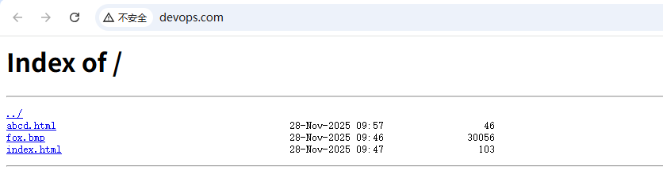

# 四、日志管理

作用：了解 Nginx 日志管理，尤其是错误日志以及访问日志。

错误日志：方便 Nginx 排错

访问日志：主要用于进行访问信息分析，可以结合 Python、GoAccess、ELK 日志分析

***

Nginx 里默认会有两种日志:

access.log 访问日志，查看统计用户的访问信息与流量

error.log 错误日志，错误信息以及重写信息

<http://nginx.org/en/docs/http/ngx_http_log_module.html>

自定义安装默认路径：`/usr/local/nginx/logs`

yum 安装默认的日志目录：`/var/logs/nginx`

## access.log 访问日志

```shell
# cat /usr/local/nginx/logs/access.log
```

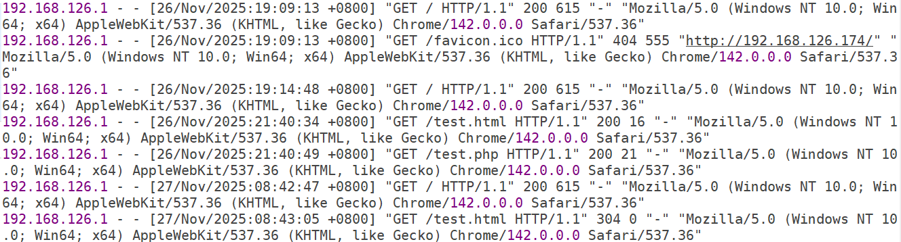

## 日志参数详解

我们之前对 nginx.conf 进行了备份，可以打开备份看看日志的格式：

```shell
# vim /usr/local/nginx/conf/nginx.conf.bak
...
http {
    ...
    #log_format  main  '$remote_addr - $remote_user [$time_local] "$request" '
    #                  '$status $body_bytes_sent "$http_referer" '
    #                  '"$http_user_agent" "$http_x_forwarded_for"';
    #access_log  logs/access.log  main;
    ...
}

log_format main：表示设置日志的格式，及日志格式的名称是main
access_log logs/access.log  main; 表示设置访问日志的存放路径及使用名字是main的这个日志格式
```

| 参数 | 含义 |
| --- | --- |
| **$remote\_addr** | **客户端的 IP 地址** |
| $remote\_user | 用户记录远程客户端的用户名称（一般为"-"） |
| $time\_local | 用户记录访问时间和时区 |
| **$request** | **用户记录请求的 url 及请求方式** |
| $status | 响应状态码，比如：200 成功、404 页面找不到等 |
| $body\_bytes\_sent | 给客户端发送的文件主体内容字节数 |
| **$http\_user\_agent** | **用户所使用的代理（一般为服务器的厂商，比如：谷歌、火狐等）** |
| **$http\_x\_forwarded\_for** | **可以记录客户端 IP，通过代理服务器来记录客户端的 IP 地址，有负载均衡时记录** |
| $http\_referer | 可以记录用户是从哪个链接访问过来的 |

如果没有使用负载均衡 `$remote_addr` 就是客户端真实的 IP 地址，如果使用了负载均衡 `$http_x_forwarded_for` 就是客户端真实的 IP 地址。

可以在 nginx.conf 配置文件中试一下，修改配置文件如下：

```shell
# vim /usr/local/nginx/conf/nginx.conf
```

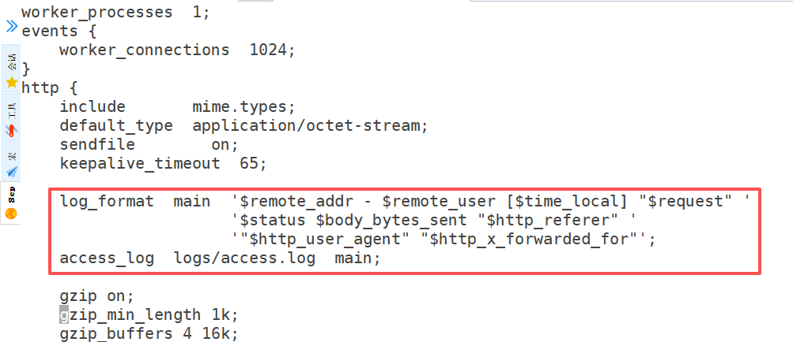

重启 Nginx 服务器：

```shell
# systemctl restart nginx
```

浏览器访问测试：

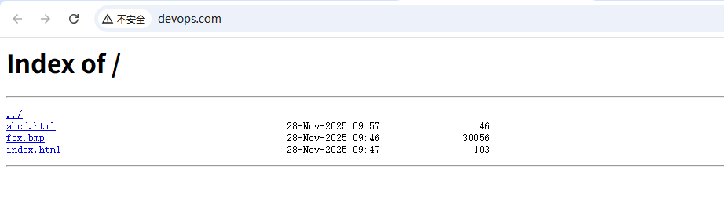

然后查看访问日志：

```shell
# tail -3 /usr/local/nginx/logs/access.log
192.168.126.1 - - [28/Nov/2025:20:17:56 +0800] "GET / HTTP/1.1" 401 581 "-" "Mozilla/5.0 (Windows NT 10.0; Win64; x64) AppleWebKit/537.36 (KHTML, like Gecko) Chrome/142.0.0.0 Safari/537.36"
192.168.126.1 - - [28/Nov/2025:20:26:57 +0800] "GET / HTTP/1.1" 200 207 "-" "Mozilla/5.0 (Windows NT 10.0; Win64; x64) AppleWebKit/537.36 (KHTML, like Gecko) Chrome/142.0.0.0 Safari/537.36"
192.168.126.1 - - [28/Nov/2025:20:54:06 +0800] "GET / HTTP/1.1" 200 207 "-" "Mozilla/5.0 (Windows NT 10.0; Win64; x64) AppleWebKit/537.36 (KHTML, like Gecko) Chrome/142.0.0.0 Safari/537.36" "-"
```

## 错误日志

作用：用于 Nginx 排错。

error.log，默认记录配置启动错误信息和访问请求错误信息。

```shell
# cat /usr/local/nginx/logs/error.log
```

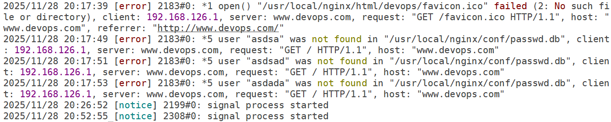

配置 error.log：

```shell
# vim /usr/local/nginx/conf/nginx.conf
可以配置：
# error_log	logs/error.log;
# error_log	logs/error.log notice;
# error_log	logs/error.log info;
```

在配置 nginx.conf 的时候，有一项是指定错误日志的，默认情况下你不指定也没有关系，因为 nginx 很少有错误日志记录的。但有时出现问题时，是有必要记录一下错误日志的，方便我们排查问题。

error\_log 级别分为 debug，info，notice，warn，error，crit 默认为 notice，该级别在日志名后边定义，格式如下：

| 日志级别（由小到大） | 含义 |
| --- | --- |
| debug | 调试模式，记录的日志最多 |
| info | 信息 |
| **notice** | **提示，默认 notice，大于等于 notice 级别的日志都会被记录** |
| warn | 警告 |
| error | 错误 |
| crit | 严重、致命，记录的日志最少 |

crit 记录的日志最少，而 debug 记录的日志最多。如果你的 nginx 遇到一些问题，比如 502 比较频繁出现，但是看默认的 error\_log 并没有看到有意义的信息，那么就可以调一下错误日志的级别，当你调成error 级别时，错误日志记录的内容会更加丰富。

小结:

错误日志的作用：用来查看错误信息，通过提示的错误信息，排除错误。

## 日志轮转（重点）

作用：利用 shell 脚本对日志进行切割，把大的访问日志切割为一个一个小日志，方便后期存储以及查看分析

```shell
编写日志轮转的脚本
# vim logrotate.sh
#!/bin/bash
date_info=$(date +%F-%H-%M)
mv /usr/local/nginx/logs/access.log /usr/local/nginx/logs/access-$date_info.log
/usr/local/nginx/sbin/nginx -s reload 或者用 systemctl reload nginx（取决于目前你用的哪种方式启动的Nginx！）

编写计划任务
# crontab -e
* */6 * * * /bin/sh /root/logrotate.sh &> /dev/null

执行脚本，可以先试一下
# bash /root/logrotate.sh
```

说明：为什么备份日志文件以后，要重载 Nginx 呢？`/usr/local/nginx/sbin/nginx -s reload`

答：因为每次重载，系统会判断是否有 access.log 文件，如果没有就会生成一个，如果有就不会生成了。

上面我们日志分割是将 access.log 重命名了，所以就不存在这个日志文件了，需要重载一下 Nginx 才会生成新的日志文件！

## 扩展：GoAccess 轻量级日志分析

作用：针对 Apache/Nginx 访问日志进行分析，优点：轻量级、开源、带图形化界面！

什么是 GoAccess ?

GoAccess 是一款开源的且具有交互视图界面的、实时 Web 日志分析工具，通过你的 Web 浏览器或者 Linux 系统下的终端程序即可访问。

能为系统管理员提供快速且有价值的 HTTP 统计，并以在线可视化服务器的方式呈现。

安装 GoAccess：

```shell
# yum -y install goaccess
```

运行 GoAccess 分析 access.log 日志

```shell
# cd /usr/local/nginx/
```

注意：GoAccess 分析的结果往往是一个 html 网页，如果想直接预览，建议直接把内容放置于 Nginx 访问目录

**① 离线分析（分析过去一段时间访问信息）**

```shell
# goaccess -f logs/access.log --log-format=COMBINED > /usr/local/nginx/html/report.html

-f：指定日志文件
--log-format：分析的文件格式
COMBINED 代表组合日志格式（XLF/ELF）Apache | Nginx
COMMON代表通用日志格式（CLF）Apache
```

浏览器访问的结果：

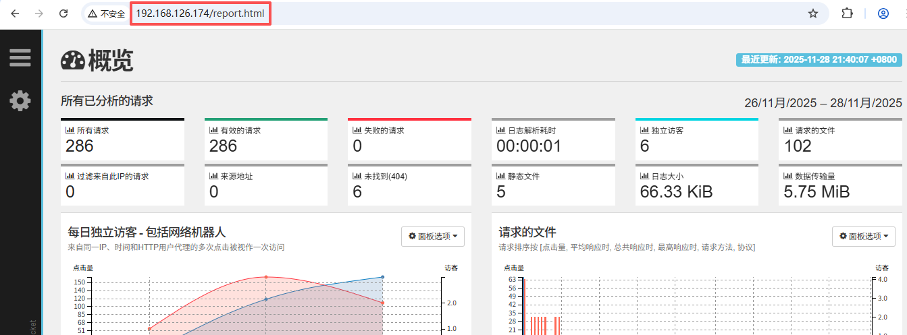

**② 实时分析（分析过去所有以及当前访问信息）**

```shell
# goaccess logs/access.log --log-format=COMBINED -o /usr/local/nginx/html/report.html --real-time-html
```

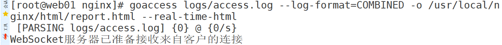

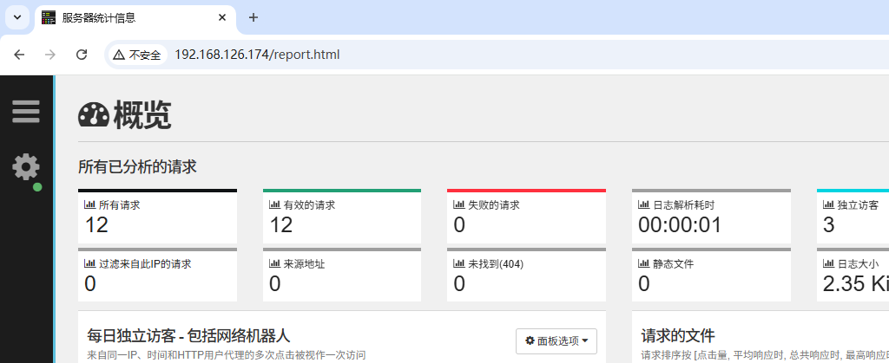

更多参考：<font style="color:#117CEE;">https://www.goaccess.cc/?mod=man</font>

Prometheus 负责监控分析系统层面、应用层面的运行信息，不分析日志。

后面我们还会学习 ELK 专业的工具去分析日志。

# 五、location 区块

作用：location 区块用于 url 规则匹配，既支持精准匹配，也支持正则匹配。

<https://nginx.org/en/docs/http/ngx_http_core_module.html#location>

## location 的作用

location 指令的作用是根据用户请求的 uri 来执行不同的操作，也就是根据用户请求的网站 url 进行匹配，匹配指定的请求 uri（请求 uri 不包含查询字符串，如：http://localhost:8080/test?id=10，请求 uri 是 /test）

举例：http://www.devops.com/test?id=10

http:// => http 协议，https 协议（https 相比于 http 多了一个 s，安全证书，有了证书配置以后，传输就采用加密传输）

url：整体称之为 url => www.devops.com/test?id=10

uri：域名后面的路径，一般就称为 uri => /test

?id=10：代表参数

## location 基本语法

```shell
location [ = | ~ | ~* | ^~] uri { ... }
指令			匹配标识				匹配的uri  匹配uri之后要执行的配置段
```

**① = 精确匹配**

代表 uri 必须完全等于匹配规则才会触发

```shell
location = / {
    # 规则
}

注意：以上匹配操作只能匹配首页
```

> 则匹配到 http://www.example.com/ 这种请求

案例：修改 nginx.conf 配置文件如下，并访问测试（注意，要重载 Nginx，然后再访问测试）

```shell
server {
  listen 80;
  server_name www.devops.com;
  root html/devops;
  location = / {
      return 500; # 简单用一下return，表示返回一个状态码给前端
  }
}

上面的return 500，就表示当请求的uri是 / 时，前端会收到500的状态码！
```

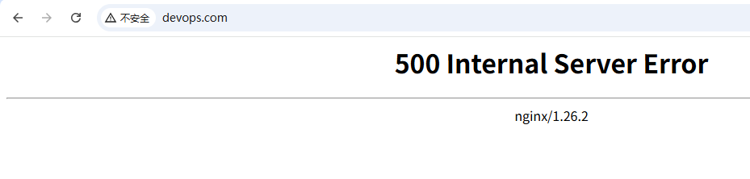

**② ~ 大小写敏感匹配**

```shell
location ~ /Example {
    # 配置段
}
```

> 请求示例
>
> http://www.example.com/Example/	【成功】
>
> http://www.example.com/example/	【失败】

案例：修改 nginx.conf 配置文件如下，并访问测试（注意，要重载 Nginx，然后再访问测试）

```shell
server {
  listen 80;
  server_name www.devops.com;
  root html/devops;
  location ~ /news {
      return 500; # 简单用一下return，表示返回一个状态码给前端
  }
}

上面的return 500，就表示当请求的uri是 /news 时（而且区分大小写），前端会收到500的状态码！
```

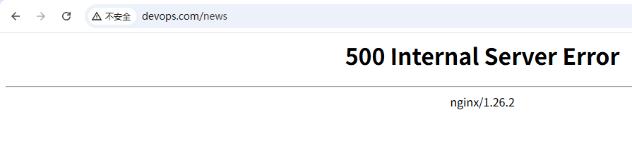

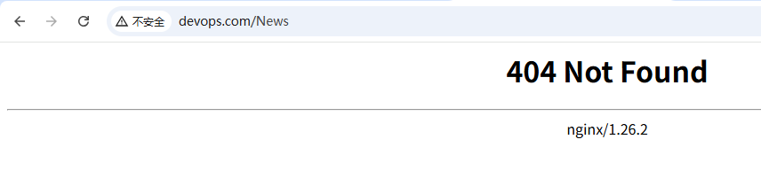

**③ ~* 大小写忽略*\*

```shell
location ~* /Example {
    # 配置段
}
```

> 请求示例
>
> http://www.example.com/Example/	【成功】
>
> http://www.example.com/example/	【成功】

案例：修改 nginx.conf 配置文件如下，并访问测试（注意，要重载 Nginx，然后再访问测试）

```shell
server {
  listen 80;
  server_name www.devops.com;
  root html/devops;
  location ~* /news {
      return 500; # 简单用一下return，表示返回一个状态码给前端
  }
}

上面的return 500，就表示当请求的uri是 /news 时（不区分大小写），前端会收到500的状态码！
```

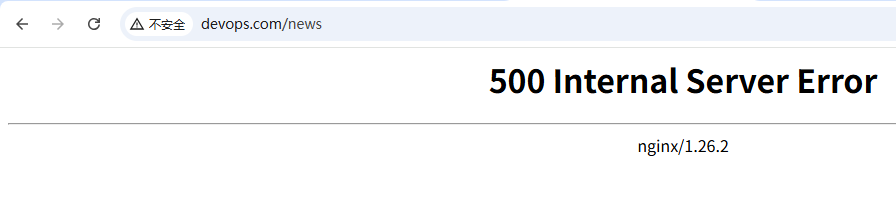

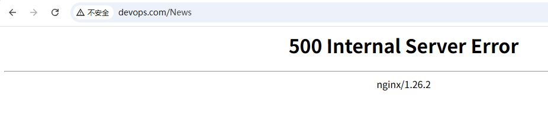

**④ ^~ 只匹配以 uri 开头的（区分大小写）**

```shell
location ^~ /img/ {
    # 配置段
}
```

请求示例：

以 /img/ 开头的请求都会匹配上

http://www.example.com/img/a.png	【成功】

http://www.example.com/img/b.mp4	【成功】

http://www.example.com/bimg/b.mp4	【失败】

http://www.example.com/Img/b.mp4	【失败】（说明 ^~ 也是区分大小写的）

案例：

```shell
server {
  listen 80;
  server_name www.devops.com;
  root html/devops;
  location ^~ /img/ {
      return 500; # 简单用一下return，表示返回一个状态码给前端
  }
}

上面的return 500，就表示当请求的uri是以 /img/ 开头时（区分大小写），前端会收到500的状态码！
```

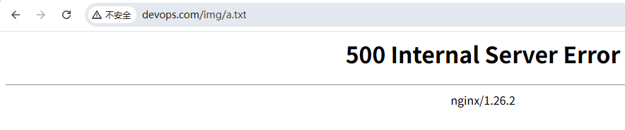


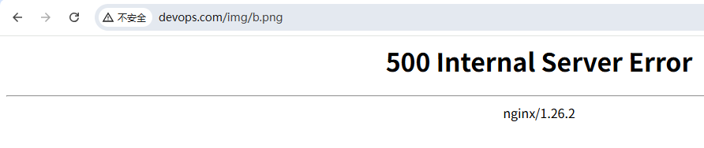

## location 优先级

优先级：location 如果有多个规则，则其也有优先级概念

```shell
优先级顺序：
1. 优先级最高
location = / {
    # 配置段
}

2. 优先匹配
loction ^~ /images/ {
    # 配置段
}

3. 区分大小写以及不区分大小写匹配网站资源
location ~* \.(gif|jpg|jpeg|png) {
    # 配置段
}

3. 根据资源目录进行匹配
location /documents/ {
    # 配置段
}

4. 当所有匹配对着都不满足时，匹配默认的location /
location / {
    # 配置段
}
```

> 注意：在一个 server 区块中，往往会有多个 location 匹配规则，只要匹配了其中一个，就不会继续匹配其他的规则了，如果所有的规则都不匹配，就会执行 location / 这个规则！

## server 优先级说明

```shell
server {
    listen 80;
    server_name localhost;
    root html;
    location / {
        index index.html index.htm;
    }
}
server {
    listen 80;
    server_name www.devops.com;
    root html/devops;
    location / {
        index index.html index.htm;
    }
}
```

观察上面的配置，有两个 server 块，server 块是根据 server\_name 来匹配请求的！！！

请求能匹配到某个 server 块后，就不会匹配其他的 server 块了！

如果请求匹配不到某个 server 块，那么就会默认使用第一个 server 块（也就是默认认为匹配到第一个 server 块！）

比如：

请求 url：http://www.devops.com，会匹配执行第二个 server 块

请求 url：http://192.168.126.174，第一个 server 块不匹配，第二个 server 块也不匹配，那么只能走第一个 server 块了！

> server 匹配到之后，然后再看该请求符合 server 中的哪个 location 规则！

# 六、URL 重写

## return

返回服务器的状态码，基本语法：

```shell
return 服务器响应状态码

200 OK，请求成功，正常响应
301 Moved Permanently，永久重定向，常用于重写规则
302 Found，临时重定向，常用于重写规则
304 Not Modified，请求资源内容没有改变，常用于缓存
404 Not Found，代表请求资源不存在，文件或路径不存在
500 Internal Server Error，服务器遇到了不知道如何处理的情况，常见于代码异常
502 Bad Gateway，错误网关，常出现在反向代理中，如果反向代理的服务器出现异常或者服务中断，会出现该报错
503 Service Unavailable，服务器没有准备好处理请求。常见于服务器因维护或重载而停机
```

请求状态码：

<font style="color:#117CEE;">https://developer.mozilla.org/zh-CN/docs/Web/HTTP/Status</font>

永久重定向：一般用于域名变更，访问旧的域名时会重定向到新的域名

旧的域名：www.old.com

新的域名：www.new.com

简单测试：关键是记住上面的响应状态码表示什么含义！！！

```shell
server {
    listen 80;
    server_name localhost;
    root html;
    location = /301 {
        return 301;
    }
    location = /302 {
        return 302;
    }
    location / {
        index index.html index.htm;
    }
}
```

## rewrite

基本语法：

```shell
rewrite 匹配内容 替代内容 flag标记
```

flag 标记说明：

| 标记 | 作用 |
| --- | --- |
| last | 本条规则匹配完成之后，继续向下匹配新的 location URL 规则 |
| break | 本条规则匹配完成即终止，不再匹配后面的任何规则 |
| redirect | 返回 302 临时重定向，浏览器地址栏会显示跳转后的 url 地址 |
| permanent | 返回 301 永久重定向，浏览器地址栏会显示跳转后的 url 地址 |

> 注：多条 rewrite，从上到下匹配，匹配到之后就不再匹配其他 rewrite 规则。

另外还要特别注意：

last 与 break，进行重定向时，其客户端 URL 地址不会改变。

redirect 与 permanent，进行重定向时，其客户端 URL 地址会发生改变。

官方文档地址: [<font style="color:#117CEE;">http://nginx.org/en/docs/http/ngx</font>](http://nginx.org/en/docs/http/ngx)<font style="color:#117CEE;">\_http\_rewrite\_module.html#rewrite</font>

### 案例一：资源重定向

要求：使用商城项目，把访问的 index.html，重定向到 index.php，实现伪静态。也可以实现隐藏真实页面的效果。

```shell
# vim /usr/local/nginx/conf/nginx.conf
location / {
    index index.html index.htm;
    rewrite /index.html /index.php last;
}
```

简单演示：

```shell
server {
    listen 80;
    server_name localhost;
    root html;
    location / {
        index index.html index.htm;
        rewrite /abcde.html /abcde.php last;
    }
}

在html目录下，编写一个abcde.html页面和abcde.php页面

重载Nginx，然后浏览器访问http://192.168.126.174/abcde.html，会发现显示的是/abcde.php网页中的内容！
```

### 案例二：域名重定向

要求：公司的域名升级了，需要把所有请求重定向到新域名

```shell
# vim /usr/local/nginx/conf/nginx.conf
server {
    listen 80;
    server_name www.devops.com;
    root html;
    rewrite / http://www.baidu.com permanent;
}
```

> 注意：永久重定向，适合域名更换的场景。而且一旦某个域名 301 重定向到其他页面，则老域名就会被搜索引擎所屏蔽。

### 案例三：防盗链原理和实现

作用：就是防止我们站点中资源被别人所使用！=> 主要针对资源文件，如：图片、音乐、视频等。

问题描述：

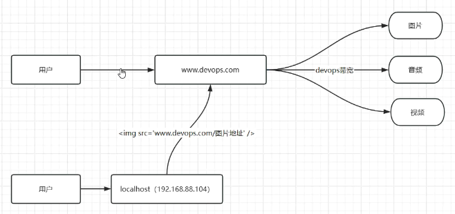

解决办法：可以在 www.devops.com 这边使用防盗链，判断每次过来的请求是不是从别的域名转过来的，如果是的话，就不给它返回资源。

需求：web2 服务器经常链接 web1 服务器上的资源文件，用户经常访问 web2 服务器的图片，以为 web2 拥有很多资源，但是实际这种操作耗费了 web1 的大量流量。

解决方案:

① 图片加水印

② 通过判断 referer 来源，确定是否返回对应的资源文件

基本语法：

```shell
location / {
    valid_referers 绑定域名;
    if($invalid_referer){
        return 404;
    }
}
```

案例：图片防盗链

需求：

准备两个站点及域名：www.devops.com（我们公司）、192.168.126.174（竞争对手），竞争对手盗用我们公司的图片！

第一步：准备 nginx.conf 配置文件

```shell
server {
    listen 80;
    server_name localhost;
    root html;
    location / {
        index index.html index.htm;
    }
}
server {
    listen 80;
    server_name www.devops.com;
    root html/devops;
    location / {
        index index.html index.htm;
    }
}
```

第二步：删除 html 目录中的全部内容，然后在 html 目录中新建 devops 目录

```shell
# rm -rf /usr/local/nginx/html/*
# mkdir /usr/local/nginx/html/devops/

# cd /usr/local/nginx
```

第三步：上传两张图片到 devops 目录中，并在 devops 目录中编写 my.html 网页（我们公司）

```shell
# ls html/devops
default.png  landscape.png

# vim html/devops/my.html
<html>
  <head>
    <title>我们公司</title>
  </head>
  <body>
    
  </body>
</html>
```

第四步：在 html 目录中编写 other.html 网页（竞争公司）

```shell
# vim html/other.html
<html>
  <head>
    <title>竞争公司</title>
  </head>
  <body>
    
  </body>
</html>
```

> 竞争公司在盗用我们公司的图片

第五步：启动 Nginx，访问测试

```shell
# systemctl restart nginx
```

访问我们公司：


访问竞争对手：可以看到竞争公司盗图成功！


第六步：在我们公司的 Nginx 中添加防盗链

```shell
# vim conf/nginx.conf
在server_name是www.devops.com的块中添加：
location ~* \.(gif|jpg|jpeg|png|bmp)$ {
    valid_referers none blocked devops.com *.devops.com;
    if ($invalid_referer) {
        return 403;
        # 或返回默认图片
        # rewrite ^/ /default.png break;
    }
}

参数说明：
none：允许缺失的"Referer"头访问
blocked：允许"Referer"头部没有值的访问
rewrite ^/ /default.png break; 重写路径为default.png，并且终止后续匹配，直接返回。
```

> \*.devops.com 代表泛域名，可以匹配任何标记开头的域名，比如：www.devops.com、bbs.devops.com

第七步：重载 Nginx，并访问测试，看盗图是否还成功！

```shell
# systemctl reload nginx
```

我们公司，可以正常访问：


竞争对手公司，盗图失败：


# 七、第三方模块

## fancyindex

nginx 本身官方没有的功能，一些开源开发者定制开发了，把代码公布出来，可以通过加载第三方模块的方式，使用新的功能。

第三方模块网址：https://docs.nginx.com/nginx/admin-guide/dynamic-modules/dynamic-modules/#nginx-plus-certified-modules

fancyindex 模块的作用就类似于之前我们学习的 autoindex on 的功能。表示列表展示出目录中的文件信息。只不过是该模块的功能更强大一些。

编译安装第三方模块：

```shell
上传两个第三方模块的安装包
# tar -xf ngx-fancyindex-0.5.2.tar.gz
# tar -xf echo-nginx-module-0.63.tar.gz

# cd /root/nginx-1.26.2/
# ./configure --prefix=/usr/local/nginx --user=www --group=www --with-http_ssl_module --with-http_stub_status_module --with-http_realip_module --add-module=/root/ngx-fancyindex-0.5.2/ --add-module=/root/echo-nginx-module-0.63

# make && make install && make upgrade
```

使用 fancyindex 模块，修改配置文件即可：

```shell
# cd /usr/local/nginx/
# vim conf/nginx.conf
server {
    listen 80;
    server_name localhost;
    root html;
    location / {
        fancyindex on;								# 使用fancyindex模块
        fancyindex_exact_size off;		# 
        index index;
    }
}
```

重启 Nginx，然后访问测试：

```shell
# systemctl restart nginx
```

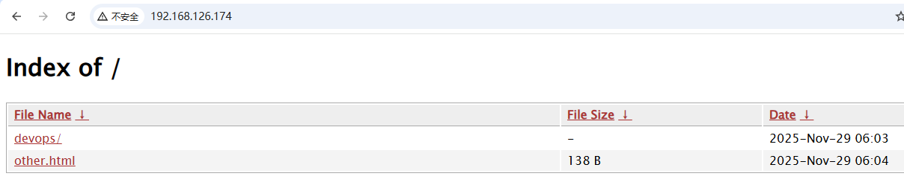

## echo

作用：echo 模块常用来进行调试使用，比如：输出打印 Nginx 默认系统变量等。

```shell
# vim conf/nginx.conf
server {
    listen 80;
    server_name localhost;
    root html;
    location / {
        default_type text/plain; # 表示文本类型
        echo $document_root;
    }
}

# systemctl restart nginx
```

测试效果：

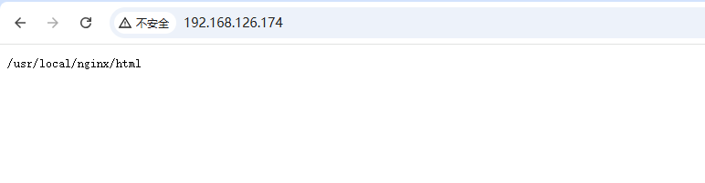

也就是说 Nginx 中 `$document_root` 其实就是获取到该 server 模块的项目的目录。

# 八、Nginx 安全管理

## 反向代理

实现隐藏真实服务的操作，起到一定安全作用（负载均衡章节讲解）

Nginx 可以隐藏后端真实服务器(保护数据)。

## 隐藏版本号

前置知识点：curl 命令

```shell
# curl http://192.168.126.174，发起http请求，得到响应内容
/usr/local/nginx/html

或者

# curl -I http://192.168.126.174，发起http请求，不获取响应内容，而获取响应信息
HTTP/1.1 200 OK
Server: nginx/1.26.2
Date: Sat, 29 Nov 2025 06:58:10 GMT
Content-Type: text/plain
Connection: keep-alive
```

由上图可知，Server: nginx/1.26.2 显示了服务器是 Nginx，并且版本为 1.26.2。每个版本都不是完美的，都可以存在漏洞，黑客可能会根据你的版本信息，攻击该版本出现的漏洞。

所以，我们最好将服务器的版本进行隐藏。

```shell
直接在http区块加入server_tokens off
http {
    server_tokens off;
    ...
}

# systemctl reload nginx

# curl -I http://192.168.126.174
HTTP/1.1 200 OK
Server: nginx			=>  可以看到已经不显示Nginx的版本号了！
Date: Sat, 29 Nov 2025 07:01:41 GMT
Content-Type: text/plain
Connection: keep-alive
```

# 九、Nginx 发行版本

作用：普及一些 Nginx 发行版本，方便以后进行选择！

## Nginx 社区免费版

https://nginx.org/

## Nginx+商业版（Nginx Plus）

https://www.nginx.com

## 淘宝的 Tengine

http://tengine.taobao.org/

tengine 是 alibaba 公司，在 Nginx 的基础上，开发定制，更加服务自己业务的服务器软件。后来进行了开源。

```shell
# tar xvf tengine-3.1.0.tar.gz
# cd tengine-3.1.0
# ./configure --prefix=/usr/local/tengine
# make && make install
```

## OpenResty

openresty 在 Nginx 的基础上，结合 lua 脚本实现高并发等 web 平台。

WAF nginx + lua + redis 实现应用型防火墙。

章亦春

http://openresty.org/cn/

安装步骤：

```shell
# tar xvf openresty-1.25.3.2.tar.gz
# cd openresty-1.25.3.2
# ./configure --prefix=/usr/local/openresty
# make && make install
```

# 十、Prometheus 监控 Nginx

作用：Prometheus 实现 Nginx 应用监控。

## 启动 Prometheus

启动 Prometheus 对应的三台机器。将我们之前搭建好的那三台 Prometheus 相关的机器还原回去！然后检测是否正常。

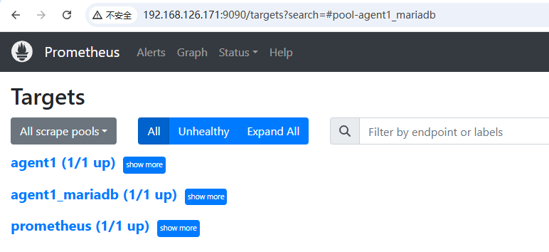

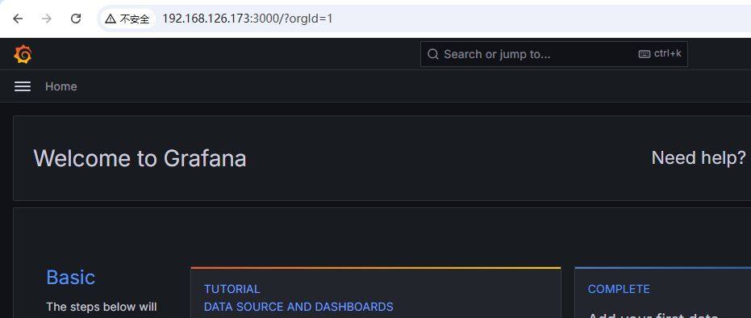

## 配置 Nginx

`vim /usr/local/nginx/conf/nginx.conf`

> 之前我们改过 nginx 的配置文件中的许多内容！为了避免其他问题，大家可以将下面的内容直接覆盖到你自己的 nginx 配置文件中！

```shell
worker_processes  1;
events {
    worker_connections  1024;
}
http {
    include       mime.types;
    default_type  application/octet-stream;
    sendfile        on;
    keepalive_timeout  65;
    server {
        listen       80;
        server_name  localhost;
        root   html;
        location / {
            index  index.html index.htm;
        }

        # 配置Nginx的自动监控，Nginx本身自带了一些监控
        location = /stub_status {
            stub_status on;	# 开启Nginx的状态监控
            access_log off; # 监控产生的信息不记录到日志中
        }

        location ~ \.php$ {
          	fastcgi_pass   127.0.0.1:9000;
          	fastcgi_index  index.php;
          	fastcgi_param  SCRIPT_FILENAME  $document_root$fastcgi_script_name;
          	include        fastcgi_params;
        }
        
        error_page   500 502 503 504  /50x.html;
        location = /50x.html {
            root   html;
        }
    }
}
```

重启/重载 Nginx：

```shell
# systemctl restart nginx
```

浏览器访问 Nginx，检测 Nginx 的监控是否打开：

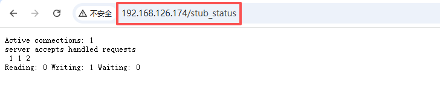

## 安装 nginx\_exporter

系统采集：node\_exporter

MySQL 采集：mysqld\_exporter

Nginx 采集：nginx\_exporter，使用资料中提供的 nginx\_exporter 即可。

```shell
# mkdir /usr/local/nginx-exporter
# tar -xf nginx-prometheus-exporter_1.4.1_linux_amd64.tar.gz -C /usr/local/nginx-exporter/
# nohup /usr/local/nginx-exporter/nginx-prometheus-exporter --nginx.scrape-uri=http://192.168.126.174/stub_status &

# netstat -tnlp | grep 9113
tcp6       0      0 :::9113                 :::*                    LISTEN      5608/nginx-promethe
```

浏览器中访问 nginx-exporter，测试是否能够抓取数据：<http://192.168.126.174:9113/metrics>

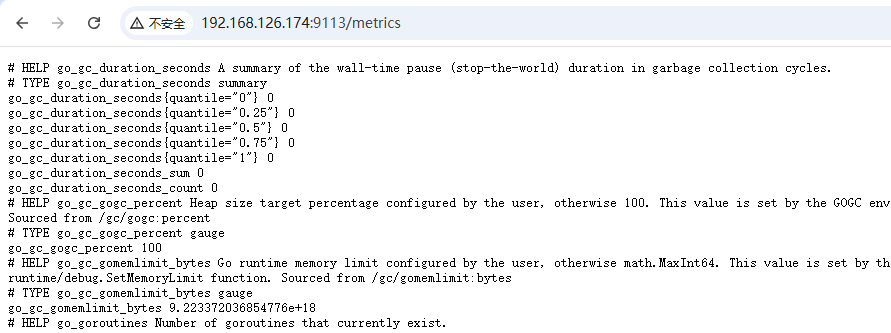

## 在 Prometheus 中拉取 Nginx 数据

第一步：停止 Prometheus 服务

```shell
# pkill prometheus
```

第二步：编写 Prometheus 的配置文件，拉取 Nginx 的数据

```shell
# vim /usr/local/prometheus/prometheus.yml
  - job_name: "nginx"
    static_configs:
      - targets: ["192.168.126.174:9113"]
```

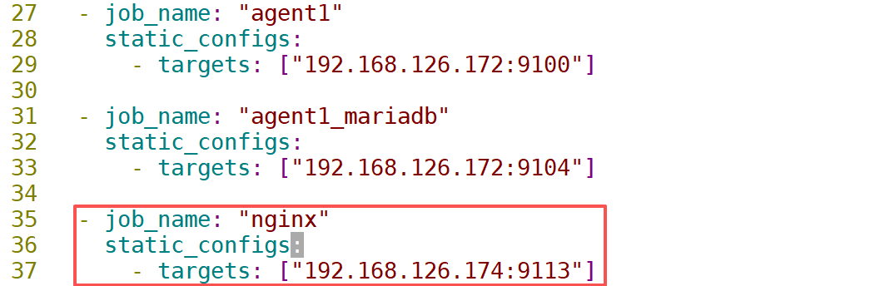

第三步：启动 Prometheus

```shell
# nohup /usr/local/prometheus/prometheus --config.file="/usr/local/prometheus/prometheus.yml" &

# netstat -tnlp | grep 9090
tcp6       0      0 :::9090                 :::*                    LISTEN      1968/prometheus
```

第四步：访问 Prometheus 可视化界面，查看信息

[http://192.168.126.171:9090/](http://192.168.126.171:9090/targets?search=)

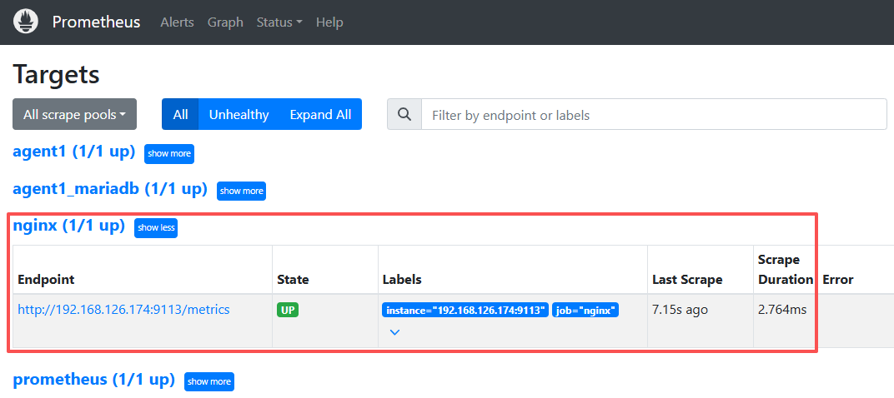

## Grafana 显示 Nginx 监控信息

模板 ID：12708

第一步：访问 Grafana 页面，[http://192.168.126.173:3000](http://192.168.126.173:3000/?orgId=1)

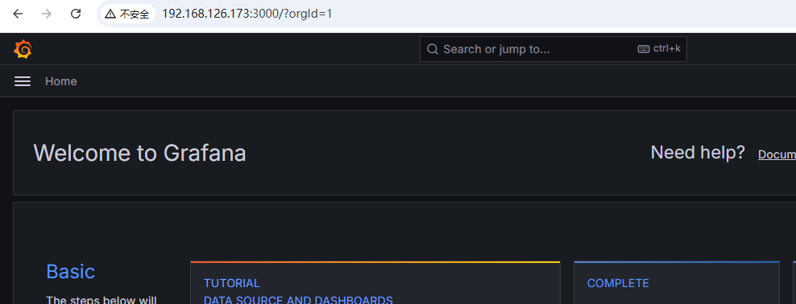

第二步：打开仪表盘

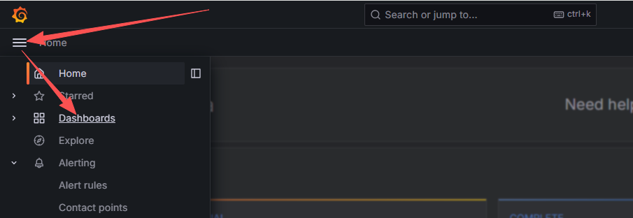

第三步：导入监控 Nginx 的模板视图

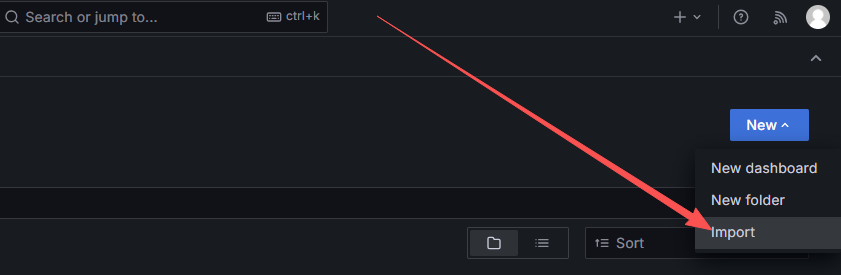

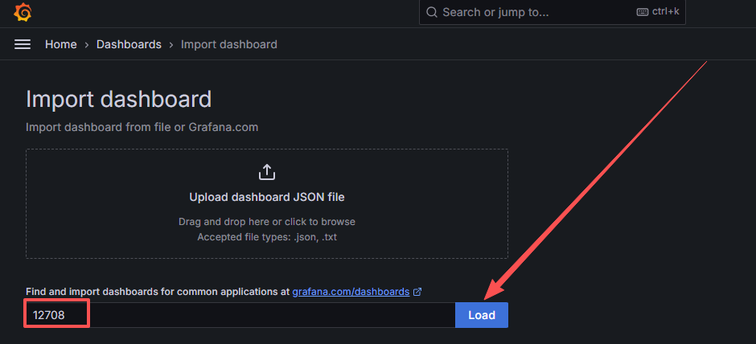

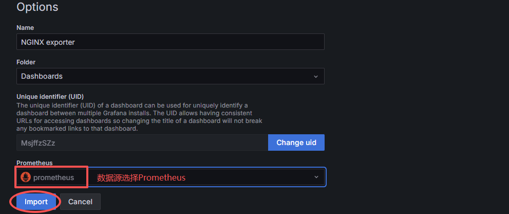

第四步：最终的效果：

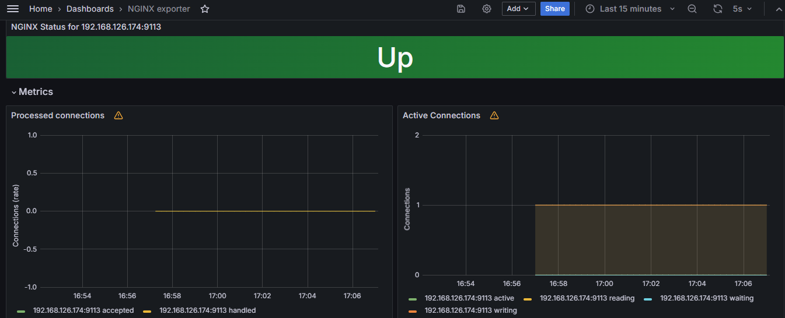

## 小结

Prometheus 不仅可以实现系统监控，还可以实现应用监控。

应用监控包括：MySQL、Nginx 等等。

需要记住的：面试的时候从图形中找出至少 3 个指标作为背诵内容！

***

学生常见问题说明：

后台服务：jobs，杀死进程：kill%数字编号

启动exporter端口是多少？为什么启动都使用 nohup 命令，是因为需要把日志写入到当前目录下的nohup.out 文件，包含报错信息，还包含启动信息，如端口 9113

查看一个软件运行端口或者这个软件端口是多少？① netstat -naltp(需要额外安装 net-tools 工具) ②ss -naltp(自带)

① 忘记基础命令

② 每个软件都有端口 => 192.168.126.173:3000

账号、密码

node1：安装了 Prometheus，端口 9100，配置看 Status-Targets

node2：agent1 服务器，安装了 mariadb 端口 3306，账号、密码；node\_exporter，端口多少node3：grafana，端口 3000，账号、密码

node4：nginx，采集 nginx 指标信息 => 9113，如果没有去 nohup.out 查看

等等等等。


> 更新: 2026-05-22 09:42:55  
> 原文: <https://www.yuque.com/u41736172/az9urv/xem6x9uzru5eff8t>