# 06.Keepalived高可用架构设计（双机热备）

# 学习目标

* 能够描述高可用 HA 的作用
* 能够理解 VIP(虚拟IP) 的漂移
* 能够描述 keepalived 作用
* 能够理解主 master 和备 backup 服务器关系
* 能够实现主备服务器高可用配置(重点)
* 能够实现模拟业务宕机服务切换(FailOver、扩展：VIP 脑裂)

# 一、背景描述及其方案设计

## 业务背景描述

时间：2016.6-2017.9

发布产品类型：互联网动态站点 商城

用户数量：2000-4000(用户量猛增了4倍)

PV：8000-50000(24小时访问次数总和)

DAU：1500(每日活跃用户数)

随着用户量增多，总的页面数量一直在持续增加，可以预料到的是，WEB 服务器，压力会越来越大。虽然单台 WEB 服务器，完全可以完成工作任务。但是如果一旦宕机，用户就完全失去服务了，用户体验特别不好，这就是造成了所谓的单点故障。

解决方案:

需要备用一台服务器进行使用，如果出现岩机，切换为备用服务器。

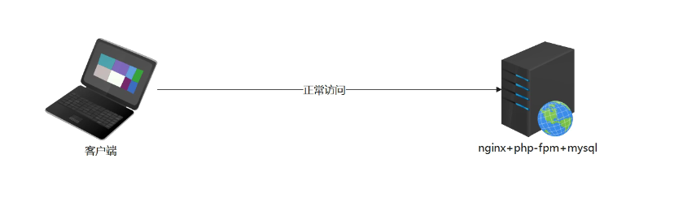

## <font style="color:rgb(51, 51, 51);">模拟运维设计方案</font>

<font style="color:rgb(51, 51, 51);">在之前架构中，先将数据库服务器单独迁移</font>

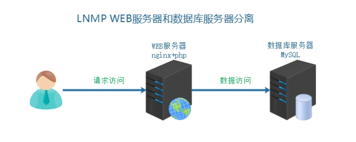

<font style="color:rgb(51, 51, 51);">针对 web 服务器单点故障，升级为主备服务器架构</font>

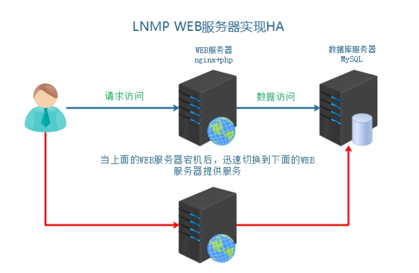

实现：当主服务器出现故障后，备用服务器能够顶上来提供服务，而且在主备切换的过程中用户是无感知的！

# 二、数据库服务器的迁移

## 克隆虚拟机

| 角色 | IP | 主机名 | 功能 | 备注 |
| --- | --- | --- | --- | --- |
| web01 | 192.168.126.174 | web01.lhp.cn | master | 主服务器（node4） |
| web02 | 192.168.126.175 | web02.lhp.cn | backup | 备服务器（node5） |
| mysql01 | 192.168.126.176 | mysql01.lhp.cn | 数据节点 | node6 |

node4 节点上目前部署的就是我们的 NiuShop 商城项目。

**将 node4 节点克隆一份出来，作为 node5 节点。**

将最小安装的系统克隆一份，作为 node6 节点，然后再安装数据库准备数据。

**具体操作步骤：**

第一步：关机 node4，克隆一份，名称为 node5

第二步：对 node5 进行快照，可以添加描述为：系统中有宝塔、NiuShop 商城

第三步：对最小化的模板机进行克隆，名称为 node6

## node5 机器的操作（web02）

\*\*第一步：\*\*修改 node5 的 IP 地址

```shell
# vim /etc/NetworkManager/system-connections/ens33.nmconnection
address1=192.168.126.175/24

# nmcli connection reload
# nmcli connection up ens33
```

\*\*第二步：\*\*修改主机名

```shell
# hostnamectl set-hostname web02.lhp.cn
# su

注意：修改node4机器的主机名为 web01.lhp.cn
```

\*\*第三步：\*\*关机，调整 node5 机器的 MAC 地址（否则就跟 node4 节点的 MAC 地址一样的，我们克隆的）

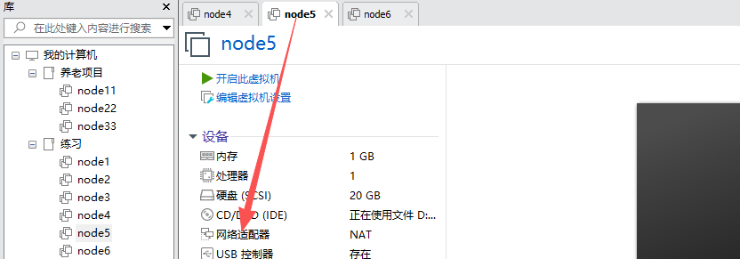

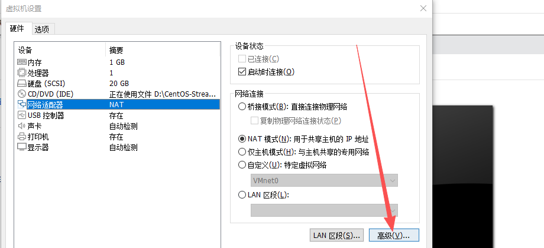

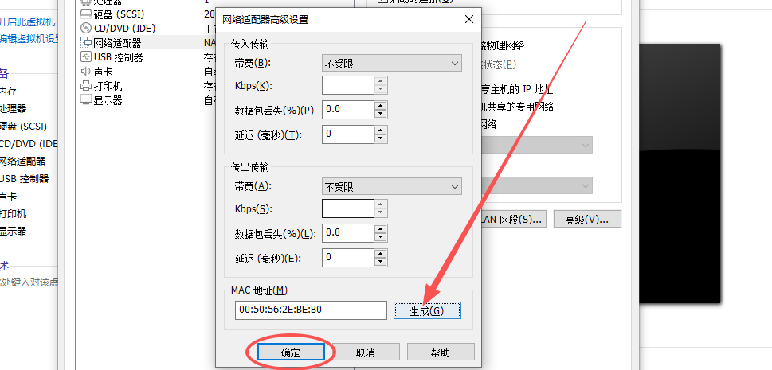

\*\*第四步：\*\*修改 node4、node5 的 hosts 文件

```shell
# vim /etc/hosts
127.0.0.1   localhost localhost.localdomain localhost4 localhost4.localdomain4
::1         localhost localhost.localdomain localhost6 localhost6.localdomain6
192.168.126.174 web01 web01.lhp.cn
192.168.126.175 web02 web02.lhp.cn
192.168.126.176 mysql01 mysql01.lhp.cn
```

\*\*第五步：\*\*node4、node5 这两台机器，这两台机器中的内容其实是一模一样的，都有宝塔面板、都有 NiuShop 商城，然后分别访问两台机器的宝塔系统是否正常。

```shell
node4# bt default
==================================================================
BT-Panel default info!
==================================================================
获取外网IP失败，请使用服务器公网IP+端口访问面板
外网面板地址:     https://服务器公网IP:12760/aa9b4501
内网面板地址:     https://192.168.126.174:12760/aa9b4501
username: nidzypcq
password: ********
Warning:
If you cannot access the panel,
release the following port (8888|888|80|443|20|21) in the security group
注意：初始密码仅在首次登录面板前能正确获取，其它时间请通过 bt 5 命令修改密码
==================================================================

node5# bt default
==================================================================
BT-Panel default info!
==================================================================
外网ipv4面板地址: https://124.127.145.62:12760/aa9b4501
内网面板地址:     https://192.168.126.175:12760/aa9b4501
username: nidzypcq
password: ********
Warning:
If you cannot access the panel,
release the following port (8888|888|80|443|20|21) in the security group
注意：初始密码仅在首次登录面板前能正确获取，其它时间请通过 bt 5 命令修改密码
==================================================================
```

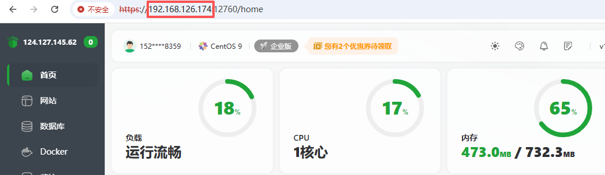

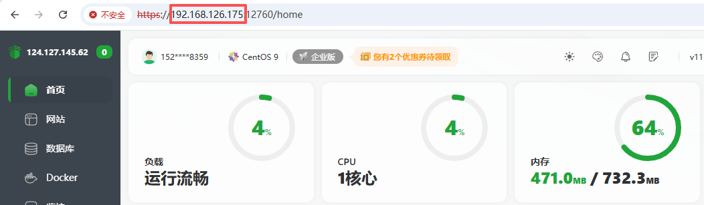

\*\*第六步：\*\*修改 Windows 中的 hosts 文件，依次修改 www.shop.com 的域名对应的 IP 分别为 192.168.126.174 和 192.168.126.175，然后每次修改完，浏览器访问测试，看两台 web 服务器上的商城项目都能正常不。

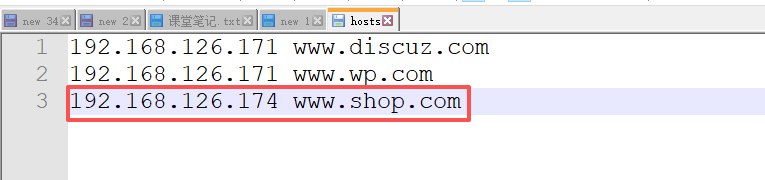


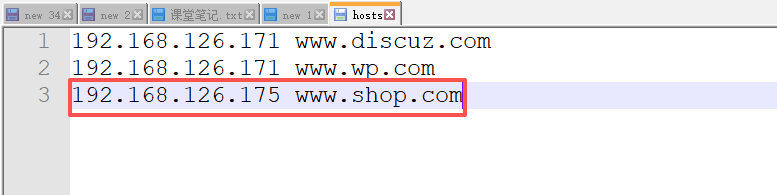


小结：

目前 node4 是 web01 服务器，node5 是 web02 服务器，两台服务器中的内容都一样！！！

web01 作为主服务器，web02 作为备服务器。

## node6 机器的操作（mysql01）

第一步：修改 IP 地址

```shell
# vim /etc/NetworkManager/system-connections/ens33.nmconnection
address1=192.168.126.176/24

# nmcli connection reload
# nmcli connection up ens33
```

第二步：更改主机名

```shell
# hostnamectl set-hostname mysql01.lhp.cn
# su
```

第三步：修改 hosts 文件

```shell
# vim /etc/hosts
127.0.0.1   localhost localhost.localdomain localhost4 localhost4.localdomain4
::1         localhost localhost.localdomain localhost6 localhost6.localdomain6
192.168.126.174 web01 web01.lhp.cn
192.168.126.175 web02 web02.lhp.cn
192.168.126.176 mysql01 mysql01.lhp.cn
```

第四步：关机，然后修改 MAC 地址


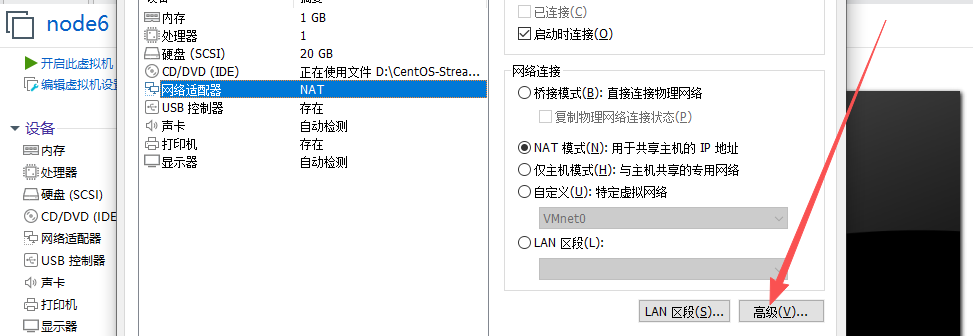

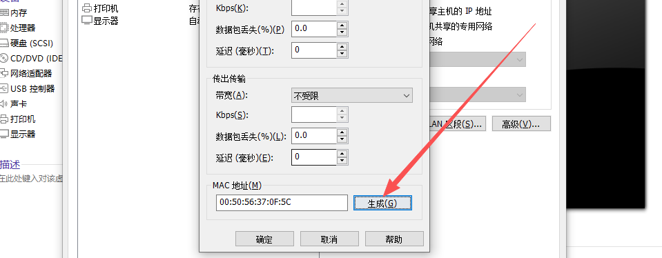

最后，将 MX 客户端的标签名重命名为如下：

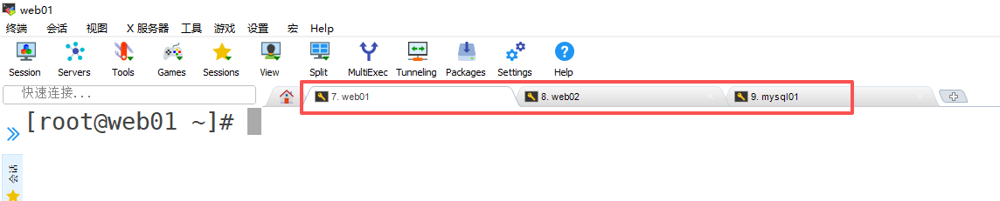

## MySQL5.7 数据库准备

编写脚本，安装 MySQL 数据库：

```shell
# vim mysql.sh
#!/bin/bash
yum install libaio -y
tar -xf mysql-5.7.31-linux-glibc2.12-x86_64.tar.gz
mv mysql-5.7.31-linux-glibc2.12-x86_64 /usr/local/mysql
useradd -r -s /sbin/nologin mysql
rm -rf /etc/my.cnf
cd /usr/local/mysql
mkdir mysql-files
chown mysql:mysql mysql-files
chmod 750 mysql-files
bin/mysqld --initialize --user=mysql --basedir=/usr/local/mysql &> /root/password.txt
cat > /etc/my.cnf <<EOF
[mysqld]
basedir=/usr/local/mysql
datadir=/usr/local/mysql/data
socket=/tmp/mysql.sock
port=3306
log-error=/usr/local/mysql/data/mysql.err
log-bin=/usr/local/mysql/data/binlog
server-id=10
character_set_server=utf8mb4
gtid-mode=on
log-slave-updates=1
enforce-gtid-consistency
sql_mode=NO_ENGINE_SUBSTITUTION,STRICT_TRANS_TABLES
EOF
bin/mysql_ssl_rsa_setup --datadir=/usr/local/mysql/data

cat <<EOF | sudo tee /etc/systemd/system/mysqld.service
[Unit]
Description=MySQL Server
After=network.target
After=syslog.target

[Service]
User=mysql
Group=mysql
ExecStart=/usr/local/mysql/bin/mysqld --defaults-file=/etc/my.cnf
LimitNOFILE = 5000
PrivateTmp=false

[Install]
WantedBy=multi-user.target
EOF

echo "正在刷新后台服务，然后启动mysqld..."

sudo systemctl daemon-reload
systemctl start mysqld
systemctl enable mysqld

sleep 5

echo 'export PATH=$PATH:/usr/local/mysql/bin' >> /etc/profile
source /etc/profile

ln -s /lib64/libncurses.so.6 /lib64/libncurses.so.5
ln -s /lib64/libtinfo.so.6 /lib64/libtinfo.so.5

echo "正在重置MySQL管理员密码..."
temp_password=`cat /root/password.txt | grep 'password' | cut -d' ' -f11`
echo "随机密码是：$temp_password"
mysqladmin -S /tmp/mysql.sock -uroot password '123456' -p$temp_password

echo "MySQL安装成功，软件安装路径：/usr/local/mysql，数据库初始密码：123456"

执行脚本
# source mysql.sh
```

> 安装之前需要将 MySQL 安装包上传，脚本文件要和压缩包在一个目录中！

安装后进行测试，使用新密码登录 MySQL。

> 如果安装完数据库，但是数据库一直报错说账号或密码不正确，那是因为你肯定在该系统上之前安装过 MySQL 数据库，它不是一个纯净的系统，重复安装就会报错！ 而且上面的脚本也不能重复执行，重复执行也会报这个错！

***

面试题：你用 shell 做过哪些功能？

答：日常巡检、软件自动化安装、日志分析等等。

## MySQL 数据迁移

第一步：web01 源数据库服务器导出数据

```shell
# mysqldump -uroot --databases niushop > ~/niushop.sql -p

数据库的密码从宝塔面板中获取，因为数据库之前就是通过宝塔安装的
```

第二步：mysql01 导入数据到新数据库服务器

```shell
下面命令在 web01 和 mysql01 服务器执行
# yum -y install rsync
下面命令在web01服务器执行
# rsync -av ~/niushop.sql root@192.168.126.176:/root/
```

第三步：在 mysql01.lhp.cn 主机创建数据库

```shell
mysql> create database niushop;
mysql> use niushop;
mysql> source /root/niushop.sql

或者
# mysql -uroot < /root/niushop.sql -p

查看是否导入数据
# mysql -uroot -p123456
mysql> use niushop;
mysql> show tables;
```

第四步：在 mysql01.lhp.cn 主机中创建授权用户允许远程连接（不要直接使用 root 账号）

```shell
mysql> create user 'niushop'@'%' identified with mysql_native_password by '123';
mysql> grant all on niushop.* to 'niushop'@'%';
mysql> flush privileges;
```

第五步：更改 web01、web02 主机的 `/www/wwwroot/www.shop.com/niushop/config/database.php`文件

```shell
'hostname'=>'192.168.126.176',
'database'=>'niushop',
'username'=>'niushop',
'password'=>'123',
```

第六步：访问页面，查看业务恢复情况

访问路径：http://www.shop.com，访问之前要改 Windows 中的 hosts 文件，分别改成 174 和 175 进行测试。


> 注意：如果在最终访问前台系统的时候，没出现预期效果，那我们是不确定哪里报错的。所以可以访问一下后台，后台报错的话会详细一些！比如是数据库连接方面的问题的话，就会提示数据库相关的报错信息！

## 拍摄快照

目前 node4、node5、node6 都一切正常！

将它们拍摄快照！

# 三、HA 高可用服务搭建

## HA Cluster 高可用集群

HA 是 High Available 缩写。

HA Cluster 是指高可用性集群，是**保证业务连续性的有效解决方案**，一般有两个或两个以上的节点，且分为活动节点及备用节点。

## 为什么要引入 HA 高可用

我们之前使用 LNMP 架构属于单点服务器，一台服务器完成所有工作。

但是单点往往是系统高可用最大的风险和敌人，应该尽量在系统设计的过程中避免单点。

方法论上，高可用保证的原则是“集群化”，或者叫“冗余”：只有一个单点，挂了服务会受影响；如果有冗余备份，挂了还有其他 backup 能够顶上。

保证系统高可用，架构设计的核心准则是：冗余。有了冗余之后，还不够，每次出现故障都需要人工介入恢复，但是这样势必会增加系统的不可用服务时间。所以最好的解决办法就是通过“FailOver 自动故障转移”来实现系统的高可用。

实现高可用的核心点：冗余(多台服务器)中，当 master 发生故障时，backup 可以自动切换 FailOver：故障自动切换。

备份服务器:

冷备：服务器不启用(域名不解析)，使用的时候再开启，需要手动切换

热备：服务器在等待状态(监控主服务器状态)，一旦主宕机，备就接管，自动切换实现热备，引入 VIP 的切换

实现热备，引入 VIP（虚拟 IP）的切换。

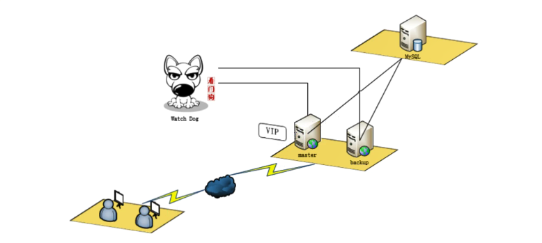

## Keepalived 软件概述

Keepalived 软件起初是专为 LVS 负载均衡软件设计的，用来管理并监控 LVS 集群系统中各个服务节点的状态，后来又加入了可以实现高可用的 VRRP 功能。因此，Keepalived 除了能够管理 LVS 软件外，还可以作为其他服务(例如：Nginx、HAproxy、MySQL 等)的高可用解决方案软件。

## Keepalived 组成和原理

Keepalived 软件主要是通过 VRRP 协议实现高可用功能的（故障切换方式）。VRRP 是 Virtual Router Redundance Protocol（虚拟路由器冗余协议）的缩写，VRRP 出现的目的就是为了解决静态路由单点故障问题的，它能够保证当个别节点宕机时，整个网络可以不间断地运行。（FailOver+VIP 漂移）

使用 Keepalived 进行 VIP（虚拟的 IP 地址），所有服务器共享一个虚拟的 VIP 的实现。

虚拟路由冗余协议，可以认为是实现路由器高可用的协议，即将 N 台提供相同功能的路由器组成一个路由器组，这个组里面有一个 master 和多个 backup，master 上面有一个对外提供服务的 vip (该路由器所在局域网内其他机器的默认路由为该 vip)，master 会发组播，当 backup 收不到 vrrp 包时就认为 master 宕掉了，这时就需要根据 VRRP 的优先级来选举一个 backup 当 master。这样的话就可以保证路由器的高可用了。

> VRRP 早期就是针对单个路由器上网不可靠而生成的。单个路由器上网的话，如果这个路由器宕机，就没法上网了，所以准备多个备用的路由器，一旦主路由器宕机，可以切换到备用路由器继续提供上网功能。

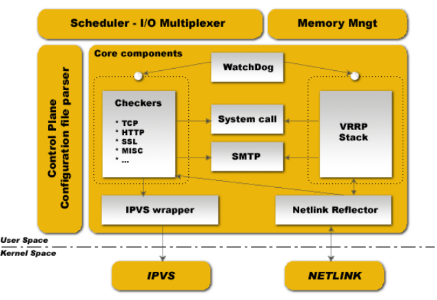

Keepalived 的功能体系结构，大致分两层：用户空间(user space)和内核空间(kernel space)

用户空间：大部分内容可以在 keepalived.conf 配置文件中进行配置

内核空间：大部分是系统底层自动发生的，不需要用户参与

keepalived 本身有两层作用：① 高可用效果  ② keepalived +lvs(高可用+负载均衡)

ipvs：主要用于实现 LVS 负载均衡器，把用户的请求平均分发给后端服务器(减压目的)

netlink：高级路由，可以借助于 vrrp 协议，生成 vip、转移 vip 等等

watchdog：看门狗，当 keepalived 启动后，看门狗自动检测服务器状态(web01、web02)=>核心

checkers：检查器=>用于检测服务器中服务的状态（如 Nginx、MySQL、LVS）

vrrp stack：当检查器检测到服务器出现故障时，则 vip 发生漂移

***

内核空间：主要包括 IPVS（IP 虚拟服务器，用于实现网络服务的负载均衡）和 NETLINK（提供高级路由及其他相关的网络功能）两个部分。

用户空间：

```shell
WatchDog：负载监控checkers和VRRP进程的状况
VRRP Stack：负载均衡器之间的失败切换FailOver，如果只用一个负载均衡器，则VRRP不是必须的。
Checkers：负责真实服务器的健康检查healthchecking，是keepalived最主要的功能。换言之，可以没有VRRP Stack，但健康检查healthchecking是一定要有的。
IPVS wrapper：用户发送设定的规则到内核ipvs代码
Netlink Reflector：用来设定vrrp的vip地址等。
```

<font style="color:rgb(51, 51, 51);">keepalived 主要使用三个模块，分别是 core、check 和 vrrp。</font>

<font style="color:rgb(51, 51, 51);">core 模块为 keepalived 的核心，负责主进程的启动、维护以及全局配置文件的加载和解析。</font>

<font style="color:rgb(51, 51, 51);">check 负责健康检查，包括常见的各种检查方式。</font>

<font style="color:rgb(51, 51, 51);">vrrp 模块是来实现 VRRP 协议的。</font>

## <font style="color:rgb(51, 51, 51);">安装 Keepalived 软件</font>

官方地址：<font style="color:#117CEE;">https://www.keepalived.org/</font>

keepalived 可以使用通过 yum 方式或者源码编译的方式实现。

在目前案列实现中，通过 yum 安装的版本即可

使用 yum 方式安装

master 和 backup 都需要进行安装，所以给 web01 和 web02 进行安装 keepalived

```shell
# yum -y install keepalived
```

配置文件：

```shell
# /etc/keepalived/keepalived.conf
```

日志文件：

```shell
# /var/log/messages
```

注意事项：启动之前，一定要配置一下 `/etc/keepalived/keepalived.conf`：

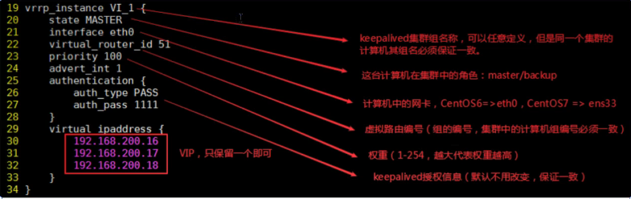

> 上面 priority 是权重，权重越高，越容易成为主服务器。
>
> advert\_int 1 表示每隔 1 秒通讯一次，查看服务器是否正常。

详细配置：

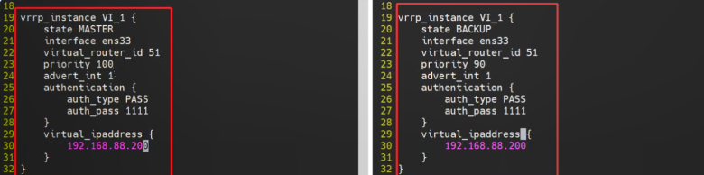

Keepalived 发送的组播（主要向自己组内的其他主机发送通告）

设置 VIP 注意事项：

```shell
1. 用户可以访问VIP，VIP所在的机器没有限制外网访问
2. VIP是没有被占用的
```

以下实现，VIP 选择同网段的。

Keepalived 的配置文件具体修改：

```shell
打开配置文件，然后删除35行往后的，35行往后的都是与负载均衡有关的，目前用不上。
# vim /etc/keepalived/keepalived.conf

最终，修改之后，web01服务器上Keepalived的配置如下：
! Configuration File for keepalived

global_defs {
   notification_email {
     acassen@firewall.loc
     failover@firewall.loc
     sysadmin@firewall.loc
   }
   notification_email_from Alexandre.Cassen@firewall.loc
   smtp_server 192.168.200.1
   smtp_connect_timeout 30
   router_id LVS_DEVEL
   vrrp_skip_check_adv_addr
   vrrp_strict
   vrrp_garp_interval 0
   vrrp_gna_interval 0
}

vrrp_instance VI_1 {
    state MASTER
    interface ens33
    virtual_router_id 51
    priority 100
    advert_int 1
    authentication {
        auth_type PASS
        auth_pass 1111
    }
    virtual_ipaddress {
        192.168.126.200
    }
}


最终，修改之后，web02服务器上Keepalived的配置如下：
! Configuration File for keepalived

global_defs {
   notification_email {
     acassen@firewall.loc
     failover@firewall.loc
     sysadmin@firewall.loc
   }
   notification_email_from Alexandre.Cassen@firewall.loc
   smtp_server 192.168.200.1
   smtp_connect_timeout 30
   router_id LVS_DEVEL
   vrrp_skip_check_adv_addr
   vrrp_strict
   vrrp_garp_interval 0
   vrrp_gna_interval 0
}

vrrp_instance VI_1 {
    state BACKUP
    interface ens33
    virtual_router_id 51
    priority 90
    advert_int 1
    authentication {
        auth_type PASS
        auth_pass 1111
    }
    virtual_ipaddress {
        192.168.126.200
    }
}
```

## 启动 Keepalived

通过 yum 方式安装的 Keepalived，直接使用 systemctl 命令进行管理，如果是通过源码包安装的可以使用 Keepalived -D 参数启动。

```shell
# web01和web02都要操作：
# systemctl stop firewalld
# systemctl start keepalived
# systemctl enable keepalived
```

查看主备服务器的网卡信息（不要使用 ifconfig）

master 的网卡信息：

```shell
可以看到在master服务器上的网卡信息中，ens33中就含有了VIP！
# ip a
```

backup 的网卡信息：

```shell
# ip a
```

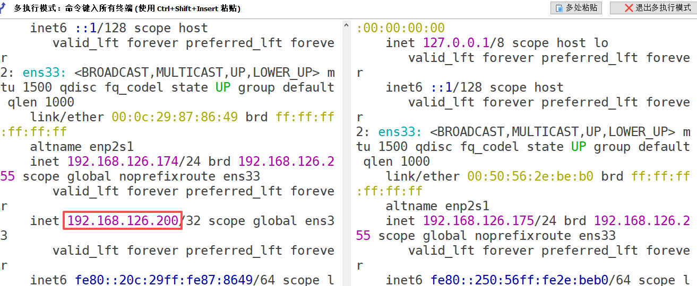

通过 Keepalived 的主备模式，实现默认 VIP 绑定到了 master 服务器

测试：关掉 web01 服务器，查看 web02 服务器的网卡信息，发现 VIP 已经出现在 web02 服务器上了！

***

master 服务器宕机了（关机、断电、网线断了），VIP 会自动切换到 backup。

常见问题说明:

问题1：keepalived 启动了，但是没有产生 vip

答：大部分情况都是因为网卡名称写错了，最好在配置前使用 `ip a` 确认物理网卡名称：eth0 或 ens33或 ens160

问题2：keepalived 启动了，但是两台机器上都有 vip(脑裂)

答：在同一个 HA Cluster 组中有两个 VIP，每台机器都认为自己是主服务器，核心原因在于网络通信异常，意识不到对方的存在。

① 网络故障	②防火墙没关，vrrp 协议默认无法通过防火墙。`firewall-cmd --add-protocol=vrrp`，详细参考文档下方 vip 脑裂解决方案。

问题3：脑裂有什么危害?

答：如果一个组中有两个 vip，就会出现资源争抢情况。（可能造成数据丢失、混乱等情况，用户体验也不好，比如上次请求在 web01，这次请求又在 web02，可能这次请求还要用到上次的东西就有问题了）

明朝那些事      体制内公务员，正处  3000w   爸爸

问题4：抢占模式

案例：启动上面关掉的 web01 服务器，发现 VIP 又回到 web01 服务器上了！！！

默认state 是 master 和 backup 模式，优先 master，如果一旦 master 恢复，就会把 VIP 重新切换master 上，本来没有问题，但是对于用户的友好性不好。如果 master 恢复，不争抢作为备机更好。

可以通过把两台服务器的 state 状态，都调整为 backup，就不存在恢复争抢的问题

master 节点：设置节点状态为 backup

```shell
vrrp_instance VI_1 {
    state BACKUP
    interface ens33
    virtual_router_id 51
    priority 100
    nopreempt
    advert_int 1
    authentication {
        auth_type PASS
        auth_pass 1111
    }
    virtual_ipaddress {
        192.168.126.200
    }
}

nopreempt 就表示不争抢
```

backup 节点：设置节点状态为 backup

```shell
vrrp_instance VI_1 {
    state BACKUP
    interface ens33
    virtual_router_id 51
    priority 90
    nopreempt
    advert_int 1
    authentication {
        auth_type PASS
        auth_pass 1111
    }
    virtual_ipaddress {
        192.168.126.200
    }
}

nopreempt 就表示不争抢
```

**根据上面的操作，设置 web01 和 web02 为不争抢的模式，设置完重启 Keepalived 即可！**

## 让 Keepalived 与 NiuShop 产生联系

第一步：更改 Windows 中域名劫持（hosts 文件）

```shell
192.168.126.200 www.shop.com
```

第二步：注释掉 Keepalived 配置文件中的 `vrrp_strict`，如果不注释，VIP 无法 ping 通

特别注意：1.3 以后版本要注释 `vrrp_strict`，否则虚拟 IP 无法 ping 通。

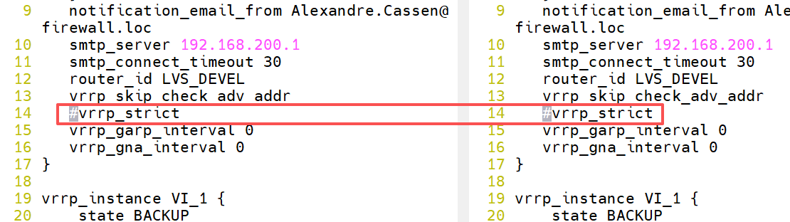

第三步：重启 Keepalived

```shell
# systemctl restart keepalived
```

第四步：查看目前的 VIP

```shell
# ip a
```

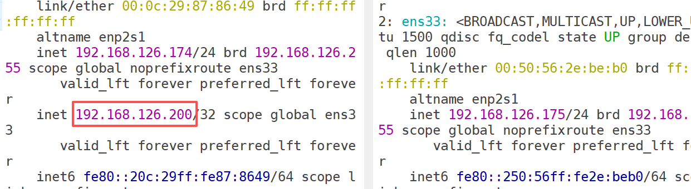

第五步：Windows 中 ping 商城的域名


**这样的话，我们通过域名访问商城系统，走的是 VIP，如果 web01 服务器挂掉的话，VIP 会漂移到 web02 服务器，还能继续提供商城服务，而且用户是无感知的！！！**

第六步：通过域名访问商城项目：


通过看商品的 VIP，发现 VIP 在 web01 服务器，也就是目前 web01 在提供服务。

关掉 web01 服务器，再次访问商城项目，发现还是可以用的，VIP 漂移到了 web02 服务器。


# 四、实现 Nginx 服务 HA

说明：

目前我们貌似是通过 Keepalived 实现了高可用：

如果 web01 服务器宕机，或者 web01 服务器的网络断了，那么 VIP 就会漂移到 web02 服务器中web02 服务器就会正常提供服务！

但是如果是这样的情况呢？

1. web01 服务器和 web02 服务器都正常启动，而且网络也通畅
2. 目前 VIP 在 web01 服务器上
3. 但是 web01 服务器上的 nginx 服务器软件挂掉了，这就导致用户还是访问 web01 服务，但是 web01 却提供不了服务！！！而且这种情况 VIP 是不会漂移的，因为 web02 知道 web01 还在存活！
4. 其实也就是说目前我们在 web01 和 web02 服务器中都安装、配置好了 Keepalived，但是这个 Keepalived 目前只能是检测服务器宕机或者网络不通的情况会发生 VIP 的偏移，而不会检测服务器中的 Nginx 服务是否正常！！！

**实现 Nginx 服务的 HA**

作用：到目前位置，VIP 漂移只能针对硬件故障。如果是服务问题，如 Nginx 宕掉了，VIP 也应该发生漂移，否则项目无法使用。=>开发一个脚本，通过这个脚本，监控系统故障以及 Nginx 服务故障，只要有一种发生，则 VIP 漂移。

## 解析域名到 VIP

在 Windows 的 hosts 文件中，把 192.168.126.200 绑定到 www.shop.com 域名。

以后就可以通过 www.shop.com 访问电商平台。

把 Keepalived 的配置文件修改如下：

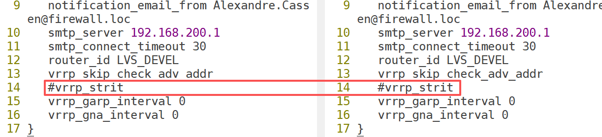

## 模拟宕机实现服务切换

真实业务环境下，可能是服务器整机没有宕机，Nginx 服务 down 了，监控 Nginx 服务，如果 Nginx 服务 down 了，就关闭该台服务器的 Keepalived。（这样另一台服务器的 Keepalived 收不到已关闭 Keepalived 的服务器的信息，就会得到 VIP！）

**以下操作两台 web 服务器都要操作！**

① 在两台 web 服务器中配置服务检测脚本

在多台服务器的 Keepalived 的配置文件目录，建力一个检测 Nginx 服务的脚本，作用在于当检测到 Nginx 服务宕机，就关闭 Keepalived。

```shell
# vim /etc/keepalived/check_nginx.sh
#!/bin/bash
nginx_status=`ps -C nginx --no-header | wc -l`
if [ $nginx_status -eq 0 ]; then
	systemctl stop keepalived
fi
```

注：CentOS9 版本中，使用 systemctl stop keepalived 停止 Keepalived 服务。

② 给两台 web 服务器中的脚本赋予执行权限

脚本需要实际测试一下，是否可以实现 Nginx 宕机关闭 Keepalived

```shell
# chmod +x /etc/keepalived/check_nginx.sh

测试的过程：
1. 关闭Nginx服务
因为目前我们web服务器上的Nginx是通过宝塔一键安装的，可以使用systemctl命令管理Nginx服务，
也可以直接通过原生的命令去管理：
nginx -s stop	=> 停止nginx
nginx => 启动nginx
nginx -s restart => 重启nginx

2. 执行上面的脚本，观察Keepalived是否会关闭，进而观察VIP是否会漂移！
```

③ 在两台 web 服务器中配置 Keepalived 定时触发检测 Nginx 存活的脚本模块

```shell
vrrp_script 名称[方便调用的] {
    script		脚本的路径
    interval	检测时间间隔
    weight		降低的权重值
}
```

具体操作：在Keepalived的配置文件中定义一个脚本模块

```shell
# vim /etc/keepalived/keepalived.conf
vrrp_script check_nginx {
    script /etc/keepalived/check_nginx.sh	# 脚本的路径
    interval 3	# 检测间隔时间
}

上面配置中 vrrp_script check_nginx，check_nginx是名称，可以任意
```

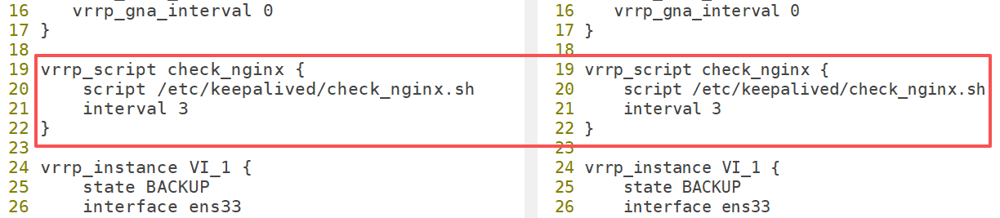

在 vrrp\_instance 里进行调用：

```shell
vrrp_instance VI_1 {
    track_script {
        check_nginx
    }
}
```

当 Nginx 服务不可用之后，关闭 Keepalived，VIP 进行漂移。

> Tip：priority 权重，在多备情况下，会根据权重选择成为 master 的 BACKUP

最终配置代码：

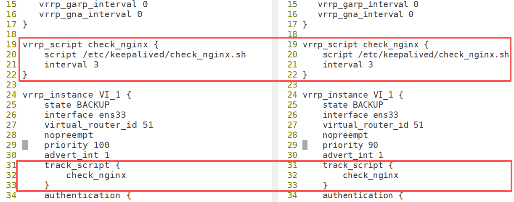

> 做好上面的配置后，以后必须先启动 Nginx，然后再去启动 Keepalived！否则先启动 Keepalived，那么 3 秒后检测到 Nginx 未启动，就会将 Keepalived 关闭！

④ 测试

```shell
1. 重启两台服务器的Nginx
systemctl restart nginx

2. 重启两台服务器的Keepalived
systemctl restart keepalived

3. 查看VIP
ip a
看到在web01服务器中有VIP

4. 浏览器访问，发现正常

5. web01服务器停止Nginx服务
systemctl stop nginx

6. 再次查看VIP
ip a
看到web02服务器中有VIP

7. 浏览器访问，发现正常
```

常见问题说明:

当 Nginx 宕机后，keepalived 怎么重启都没有 VIP 了?

答：并不是 keepalived 配置出现了问题，keepalived 本身肯定是正常工作的。原因在于咱们 keepalived的配置文件中，每隔 3s 会进行一次检测，一旦发现 Nginx 服务器没有启动，则让 vip 发生漂移。

如果某台甚至某几台 nginx 出现故障，则这几台机器即使重后 keepalived 也没有 vip，keepalived 启动后，开始检测 nginx 是否存活的，发现未存活，则漂移 vip。

解决方案：① 停止所有 keepalived ② 启动所有 nginx ③ 重启 keepalived

## Keepalived 选举原理

Keepalived 的选举机制主要依赖于优先级（Priority）和 VRRP 报文的交互。以下是核心流程:

**① 优先级（Priority）**

每个 VRRP 实例(VRID，虚拟路由器 ID)在 Keepalived 配置文件中都会配置一个优先级值(范围0-255，默认为100)。

<font style="color:#DF2A3F;">优先级最高的节点将成为 Master，其他节点为 Backup</font>

如果多个节点的<font style="color:#DF2A3F;">优先级相同，则比较真实 IP 地址，IP 地址值较大的节点优先成为 Master</font>

**② VRRP 通告报文（Advertisement）**

Master 节点会定期（通常每秒）向组播地址(224.0.0.18)发送 VRRP 通告报文(AdvertisementPacket)，包含以下关键信息：

* 虚拟路由器 ID(VRID)
* 优先级(Priority)
* 虚拟 IP 地址(VIP)
* Master 节点的真实 IP 地址

Backup 节点通过监听这些通告报文来判断 Master 的状态。如果 Backup 节点在一定时间内(通常是3倍通告间隔+偏移时间)未收到 Master 的通告报文，则认为 Master 故障，触发选举。

**③ 选举过程**

初始选举：

所有节点启动时，进入 Backup 状态，并监听 VRRP 通告报文，如果在一段时间内未收到任何通告报文，节点会发送自己的通告报文，声明自己为 Master。

如果收到其他节点的通告报文，则比较优先级：

* <font style="color:#DF2A3F;">若收到报文的优先级高于自身，保持 Backup 状态，</font>
* <font style="color:#DF2A3F;">若收到报文的优先级低于或等于自身，且自身优先级最高，则发送通告报文，尝试成为 Master 。</font>

故障切换：

* <font style="color:#DF2A3F;">当 Master 节点故障(停止发送通告报文)，Backup 节点会在超时后进行选举</font>
* <font style="color:#DF2A3F;">优先级最高的 Backup 节点会接管 VIP，成为新的 Master，并开始发送通告报文</font>
* <font style="color:#DF2A3F;">如果配置了抢占模式(Preempt)，原 Master 恢复后会重新比较优先级，可能重新夺回 Master 角色。</font>

# 五、Keepalived 的配置补充

## 非抢占模式

作用：就是不争抢 VIP，避免用户请求 HTTP，从而影响客户体验

第一步：在 vrrp\_instance 块下两个节点各增加了 nopreempt 指令，表示不争抢 vip

```shell
vrrp_instance VI_1 {
    virtual_router_id 51
    nopreempt
    priority 100
}
```

第二步：节点的 state 都设置为 BACKUP

```shell
vrrp_instance VI_1 {
    state BACKUP
}
```

两个 keepalived 节点都启动后，默认都是 BACKUP 状态，双方在发送组播信息后，会根据优先级来选举一个 master 出来。由于两者都配置了 nopreempt，所以 master 从故障中恢复后，不会抢占 vip。这样会避免 VIP 切换可能造成的服务延迟。

非抢占模式，就是为了用户体验更加。服务恢复服务之后，不要抢占 VIP。

## VIP 脑裂

脑裂（split-brain）：指在一个高可用（HA）系统中，当联系着的两个节点断开联系时，本来为一个整体的系统，分裂为两个独立节点，这时两个节点开始争抢共享资源，结果会导致系统混乱，数据损坏。（MASTER-BACKUP，两台机器上同时拥有 VIP）

主要原因：网络通信故障 或 防火墙规则未设定 vrrp 通过防火墙

测试：开启两台 web 服务器的防火墙，测试是否有脑裂，也就是两台 web 服务器都会有 VIP！

```shell
# systemctl start firewalld
# systemctl restart nginx
# systemctl restart keepalived
# ip a
# 浏览器访问的话，貌似也能正常访问，但是之后如果有具体的业务要做，肯定是有问题的，因为有可能这一次请求去web01服务器，下一次请求就会web02服务器了！而两次请求有关联关系的话就会报错！
```

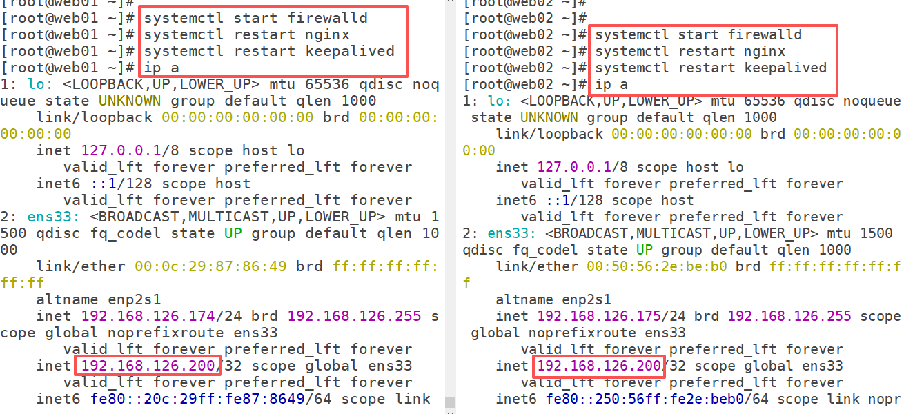

查看日志：看不出个什么

```shell
# tail -f /var/log/messages
```

使用 tcpdump 抓取 vrrp 数据包：

```shell
# yum -y install tcpdump
# tcpdump -i ens33 vrrp -n		表示抓取ens33网卡中vrrp协议相关的信息
18:22:54.508816 IP 192.168.126.174 > 224.0.0.18: VRRPv2, Advertisement, vrid 51, prio 100, authtype simple, intvl 1s, length 20
18:22:54.554106 IP 192.168.126.175 > 224.0.0.18: VRRPv2, Advertisement, vrid 51, prio 90, authtype simple, intvl 1s, length 20
18:22:55.511291 IP 192.168.126.174 > 224.0.0.18: VRRPv2, Advertisement, vrid 51, prio 100, authtype simple, intvl 1s, length 20
18:22:55.557047 IP 192.168.126.175 > 224.0.0.18: VRRPv2, Advertisement, vrid 51, prio 90, authtype simple, intvl 1s, length 20
18:22:56.512697 IP 192.168.126.174 > 224.0.0.18: VRRPv2, Advertisement, vrid 51, prio 100, authtype simple, intvl 1s, length 20
我们知道只有master服务器会向组播地址发送报文信息，每隔1秒钟。 但是从上面的结果看192.168.126.174向组播地址发送消息，而192.168.126.175也向组播地址发送消息，也就意味着他俩都认为自己是master。也就是产生了脑裂！

-i：指定网卡
-n：以数字形式显示IP地址
```

VIP 所在主机 => 发送 vrrp 数据包 => 组播地址 => 224.0.0.18

防火墙配置：

```shell
允许VRRP协议
# firewall-cmd --add-rich-rule='rule protocol value="vrrp" accept' --permanent

添加组播地址
# firewall-cmd --add-rich-rule='rule family="ipv4" destination address="224.0.0.18" accept' --permanent

允许Keepalived服务
# firewall-cmd --add-service=high-availability --permanent

重新加载防火墙
# firewall-cmd --reload

firewall-cmd 命令说明
--permanent：永久有效
--add-rich-rule：添加防火墙规则
rule family="ipv4" destination address="224.0.0.18" accept：针对组播地址224.0.0.18
--add-service：根据名称设置防火墙规则，high-availability防火墙预订服务名，是包括Keepalived在内的所有高可用软件统称
--add-port：根据端口号设置防火墙规则
firewall-cmd --reload：刷新防火墙，让规则立即生效
```

我们目前的脑裂是由于我们上面将两台 web 服务器的防火墙开启导致的！

所以，在两台 web 服务器中配置上面的防火墙策略后，**<font style="background-color:#FBDE28;">重启 Keepalived</font>**，脑裂应该就消失了！如果再抓包的话就只能看到一个 master 在向组播地址发送报文信息。

***

小结:

什么是脑裂?

答：在一个集群中，可能出现两个 VIP（tcpdump 抓包，发现两个甚至多个节点共同向组播地址发送通告报文）

产生脑裂根本原因?

答：集群中的各个节点可能由于网络通信故障导致连接不上主节点

脑裂影响?

答：因为有两个 VIP，所有请求会出现争抢情况，严重可能会造成数据损坏!

解决方案：恢复网络通（防火墙规则设定问题），重启 Keepalived。

## 单播模式

广播 > 组播 > 单播

广播：类似屏幕广播，把信息发送广播地址（本网段的.255）

组播：范围略小于广播，只有同组节点才能收到组播信息（keepalived 默认情况 => 224.0.0.18）

单播：范围最小，仅局限于点对点传输信息（master => backup）=> 物理服务器（不会受到任何影响，组播地址是可以正常使用的）=> 云服务器 => ECS01、ECS02，阿里云平台禁用组播地址 => 只能使用单播模式

***

一方面，keepalived 在组播模式下所有的信息都会向 224.0.0.18 的组播地址发送，产生众多的无用信息，并且会产生干扰和冲突。另一方面，在某些特定环境（云服务器）禁止了组播方式，造成没办法获取到MASTER 的数据包信息。

所以需要将其组播的模式改为单播。这是一种安全的方法，避免局域网内有大量的 keepalived 造成虚拟路由 ip 的冲突(VIP 脑裂)。单播模式需要关闭 vrrp strict 这个选项。单播需要在 VIP 实例配置段加入单播的源地址和目标地址单播模式的配置，是需要在 keepalived1.2.10(含) 以上版本。

```shell
vrrp_Uinstance VI_1 {
    unicast_src_ip 192.168.126.174			# 本机IP地址
    unicast_peer {
        192.168.126.175									# 对端IP地址，支持多台机器
    }
}

注意：
针对于 web01 unicast_src_ip 就是192.168.126.174	unicast_peer 192.168.126.175
针对于 web02 unicast_src_ip 就是192.168.126.175	unicast_peer 192.168.126.174
```

第一步：需要使用高一点版本的 Keepalived（1.2.11）=> 目前不需要，因为 yum 仓库更新，版本直接升级为 2.2.8 版本

```shell
# rpm -qa | grep keepalived
keepalived-2.2.8-6.el9.x86_64
```

第二步：修改 Keepalived 配置文件

```shell
web01服务器：
vrrp_instance VI_1 {
    unicast_src_ip 192.168.126.174			# 本机IP地址
    unicast_peer {
        192.168.126.175									# 对端IP地址，支持多台机器
    }
}

web02服务器：
vrrp_instance VI_1 {
    unicast_src_ip 192.168.126.175			# 本机IP地址
    unicast_peer {
        192.168.126.174 								# 对端IP地址，支持多台机器
    }
}
```

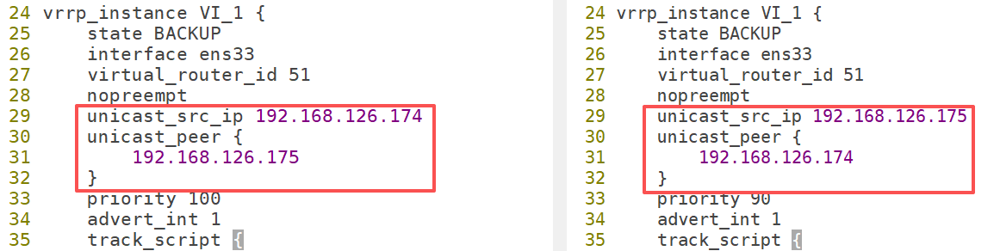

第三步：重启 Keepalived，测试

```shell
# systemctl restart keepalived

查看网卡信息，发现没问题
# ip a

也可以使用抓包工具，发现master不是向组播地址发送报文了，点对点的发送了
# tcpdump -i ens33 vrrp -n
19:28:09.260806 IP 192.168.126.174 > 192.168.126.175: VRRPv2, Advertisement, vrid 51, prio 100, authtype simple, intvl 1s, length 20
19:28:10.263207 IP 192.168.126.174 > 192.168.126.175: VRRPv2, Advertisement, vrid 51, prio 100, authtype simple, intvl 1s, length 20
19:28:11.263492 IP 192.168.126.174 > 192.168.126.175: VRRPv2, Advertisement, vrid 51, prio 100, authtype simple, intvl 1s, length 20
19:28:12.264144 IP 192.168.126.174 > 192.168.126.175: VRRPv2, Advertisement, vrid 51, prio 100, authtype simple, intvl 1s, length 20
```


> 更新: 2026-05-26 10:44:47  
> 原文: <https://www.yuque.com/u41736172/az9urv/yoc2tl2iiop0k0x9>