# 07.Nginx负载均衡解决方案

# 学习目标

* 能够描述负载均衡的作用
* 能够了解负载均衡常见实现方式
* 能够使用 Nginx 实现负载均衡
* 能够为开源的 Nginx 软件安装健康检查模块
* 能够描述 Nginx 的常见负载均衡算法（掌握 3 种常见的负载均衡算法）

# <font style="color:rgb(51, 51, 51);">一、背景描述及其方案设计</font>

## <font style="color:rgb(51, 51, 51);">业务背景描述</font>

时间：2018.6.-2020.9

发布产品类型：互联网动态站点 商城

用户数量： 4000-8000（用户量猛增）

PV：300000-500000（24 小时访问次数总和）

DAU：3000（每日活跃用户数）

随着业务量骤增，之前单点服务器，已经不能够满足业务使用需要。如果主服务器宕机，备服务器提供服务，因为流量太大，备也宕机。需要多台服务器，同时提供服务。

> 也就是说我们之前学习的 Keepalived，即使商城项目中有两个 web 服务器，都搭建好了 Keepalived，但同时提供服务的只有一台 web 服务器，如果由于流量过大导致 web01 服务器宕机，切换到备服务器提供服务，备服务器也是扛不住流量压力的，也会宕机的！！！

## <font style="color:rgb(51, 51, 51);">模拟运维场景</font>

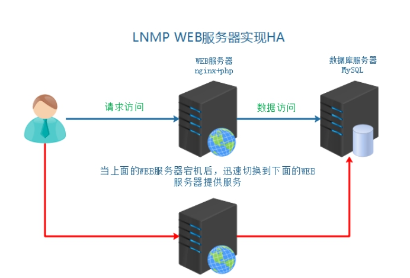

上述架构服务器，只能解决服务器硬件故障的问题，已经不能够满足上面提到的流量过大的这种业务需求，怎么办呢?

答：负载均衡技术

# 二、引入负载均衡技术

## 负载均衡技术

负载均衡技术（Load Balance）是一种概念，其原理就是把用户请求进行平均分发，分发给后端真实服务器。

简单来说：就是分发流量、请求到不同的服务器。使流量平均分配（理想的状态的）

负载均衡作用：流量分发，服务器容灾（借助健康检查模块）

① 流量分发 请求平均 降低单例压力

② 安全 隐藏后端真实服务

③ 屏蔽非法请求（七层负载均衡）=> 通过 http/https 协议，实现请求转发，属于应用层协议，第 7 层

http://www.devops.com/images/1.jpg => \*.jpg 图片（location） => 调度后端的图片服务器

## 负载均衡业务架构图

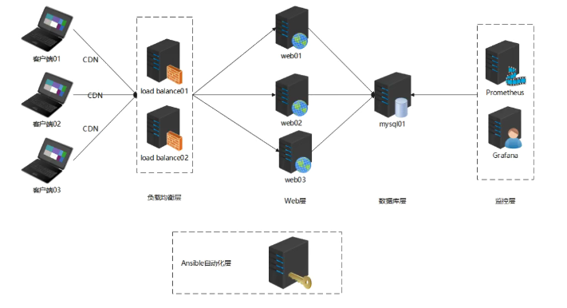

## <font style="color:rgb(51, 51, 51);">负载均衡分类</font>

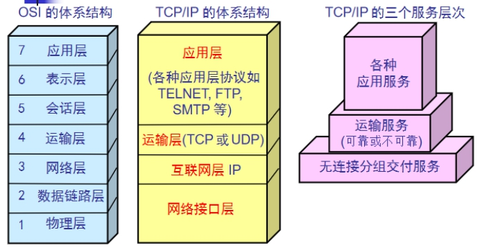

**<font style="color:rgb(51, 51, 51);">1）二层负载均衡（mac）</font>**

<font style="color:rgb(51, 51, 51);">根据 OSI 模型分的二层进行负载，一般是用虚拟 mac 地址方式，外部对虚拟 MAC 地址请求，负载均衡接收后，再分配后端实际的MAC地址响应 </font>

**<font style="color:rgb(51, 51, 51);">2）三层负载均衡（ip） </font>**

<font style="color:rgb(51, 51, 51);">一般采用虚拟 IP 地址方式，外部对虚拟的 ip 地址请求，负载均衡接收后，再分配后端实际的 IP 地址响应</font>

**<font style="color:rgb(51, 51, 51);">3）四层负载均衡（tcp）</font>**<font style="color:rgb(51, 51, 51);"> 网络运输层面的负载均衡</font>

<font style="color:rgb(51, 51, 51);">在三层负载均衡的基础上，用 ip+port 接收请求，再转发到对应的机器</font>

**<font style="color:rgb(51, 51, 51);">4）七层负载均衡（http/https）</font>**<font style="color:rgb(51, 51, 51);"> 智能型负载均衡</font>

<font style="color:rgb(51, 51, 51);">根据虚拟的 url 或 IP，主机接收请求，再转向（反向代理）相应的处理服务器</font>

```shell
www.shop.com/index.php => location \.php$ {proxy_pass xxx}
www.shop.com/images/avatar.png => location \.(jpg|jpeg|png|gif)$ {proxy_pass yyy}
```

面试过程中：四层与七层负载均衡区别?

① 底层实现 => 四层负载均衡基于网络层与传输层，也就是 IP+Port 实现请求转发；七层负载基于应用层，通过 URL 地址请求转发

② 性能不同 => 四层相当于转发器，效率更高；七层需要通过 URL 判断才能实现转发，需要做额外的处理

③ 安全性不同 => 七层需要对用户 URL 请求进行判断，判断过程可以屏蔽异常请求，相对而言更加安全

## 常见负载均衡实现方式

① 硬件级别 F5 BIG-IP 性能好 价格高 几万到几十万不等

② 软件级别 性价比高

**LVS**：Linux下分发软件 四层 ip+port NAT Ivs 内核支持 IPVS配置调度（性能最好）

**Nginx**：upstream功能分发 七层应用层分发 http 等等 也可以基于四层（新版本）（性能次之）

HAProxy：既支持四层也支持七层的负载均衡，性能介于 LVS 和 Nginx 之间

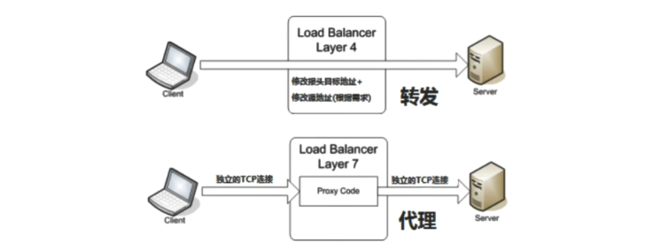

# 三、服务器基本环境部署

## 克隆复制虚拟机（LB）

| 角色 | IP | 主机名 | 功能 | 备注 |
| --- | --- | --- | --- | --- |
| web01（移除 Keepalived） | 192.168.126.174 | web01.lhp.cn | master | 主 |
| web02（移除 Keepalived） | 192.168.126.175 | web02.lhp.cn | backup | 备 |
| mysql | 192.168.126.176 | mysql01.lhp.cn | 数据节点 | |
| lb01 + Keepalived | 192.168.126.177 | lb01.lhp.cn | 负载均衡 | 主 |
| lb02 + Keepalived | 192.168.126.178 | lb02.lhp.cn | 负载均衡 | 备 |

## web01 与 web02 的操作

web01 与 web02 我们做成了负载均衡，它俩是同时都可以提供服务的，负载均衡就有高可用的特性，所以 web01 和 web02 上的 Keepalived 就可以去掉了！

```shell
在web01和web02上做如下操作：
# systemctl stop keepalived
# yum -y remove keepalived
```

## lb01 服务器的操作

> lb01 和 lb02 服务器上的内容都是一样的，所以我们把 lb01 都准备好之后克隆一份作为 lb02。

第一步：克隆一台最小化安装的机器，并修改其 Mac 地址


第二步：修改 IP、主机名与 hosts 文件

```shell
# vim /etc/NetworkManager/system-connections/ens33.nmconnection
address1=192.168.126.177/24

# hostnamectl set-hostname lb01.lhp.cn
# su

# vim /etc/hosts
127.0.0.1   localhost localhost.localdomain localhost4 localhost4.localdomain4
::1         localhost localhost.localdomain localhost6 localhost6.localdomain6
192.168.126.174 web01.lhp.cn
192.168.126.175 web02.lhp.cn
192.168.126.176 mysql01.lhp.cn
192.168.126.177 lb01.lhp.cn
192.168.126.178 lb01.lhp.cn
```

第三步：关闭防火墙、SELinux

```shell
# systemctl stop firewalld
# systemctl disable firewalld

# setenforce 0
# vim /etc/selinux/config
22行 SELINUX=disabled
```

第四步：安装常用命令工具及时间同步（已做）

## 劫持域名

修改 Windows 中的 hosts 文件

```shell
192.168.126.177 www.shop.com
```

> 也就是说，浏览器发请求访问商城项目，到达的是负载均衡服务器，然后负载均衡服务器再将请求转发到对应的 web01、web02 等后端服务！

# 四、Nginx 负载均衡实现

## 在 lb01 中安装 Nginx

先上传 Nginx 的安装包，从资料中找。

```python
# yum -y install pcre-devel zlib-devel openssl-devel
# tar -xf nginx-1.26.2.tar.gz
# cd nginx-1.26.2
# useradd -r -s /sbin/nologin www
# ./configure --prefix=/usr/local/nginx --user=www --group=www --with-http_ssl_module --with-http_stub_status_module --with-http_realip_module
# make && make install
# cd /usr/local/nginx

# sbin/nginx
或者
# sbin/nginx -c /usr/local/nginx/conf/nginx.conf

nginx -c：-c相当于-config代表指定配置文件路径
```

打开浏览器，使用<font style="color:#117CEE;"> www.shop.com</font> 对 lb01 发起访问，如下图所示：


将 Nginx 作为系统的服务：

```python
# 注意：一定要提前把Nginx停止掉
# sbin/nginx -s stop

# Nginx服务配置到该文件中
# vim /usr/lib/systemd/system/nginx.service
[Unit]
Description=Nginx Web Server
After=network.target
  
[Service]
Type=forking
ExecStart=/usr/local/nginx/sbin/nginx -c /usr/local/nginx/conf/nginx.conf
ExecReload=/usr/local/nginx/sbin/nginx -s reload
ExecStop=/usr/local/nginx/sbin/nginx -s quit
PrivateTmp=true
  
[Install]
WantedBy=multi-user.target

扩展：
Type=forking，forking代表后台运行

# 重新加载后台进程
# systemctl daemon-reload

之后我们就可以使用如下命令启动和停止Nginx等操作了
# systemctl start nginx
# systemctl enable nginx
# systemctl stop nginx
# systemctl reload nginx
# systemctl restart nginx
```

## 负载均衡配置详解（重点）

第一步：备份配置文件 nginx.conf，然后删除注释与空行，最后得到一个清爽的配置文件

```python
# cd /usr/local/nginx
# cp conf/nginx.conf conf/nginx.conf.bak
# grep -Ev '#|^$' conf/nginx.conf
把以上命令得到的内容拷贝到nginx.conf文件中，就是比较干净清爽的一个文件了
# vim conf/nginx.conf
worker_processes  1;
events {
    worker_connections  1024;
}
http {
    include       mime.types;
    default_type  application/octet-stream;
    sendfile        on;
    keepalive_timeout  65;
    server {
        listen       80;
        server_name  localhost;
        location / {
            root   html;
            index  index.html index.htm;
        }
        error_page   500 502 503 504  /50x.html;
        location = /50x.html {
            root   html;
        }
    }
}
```

第二步：配置 Nginx 负载均衡

```python
# vim conf/nginx.conf
worker_processes  1;
events {
    worker_connections  1024;
}
http {
    include       mime.types;
    default_type  application/octet-stream;
    sendfile        on;
    keepalive_timeout  65;

    # 配置Nginx代理的web服务的地址  shop是名称，可以任意
    upstream shop {
        server 192.168.126.174:80;
        server 192.168.126.175:80;
    }

    server {
        listen       80;
        server_name  www.shop.com;
        location / {
            # 转发请求到上面定义好的web服务 shop对应的就是上面配置的名称
            proxy_pass http://shop;
            # 转发请求时设置好请求头信息
            proxy_set_header HOST $host;
        }
        error_page   500 502 503 504  /50x.html;
        location = /50x.html {
            root   html;
        }
    }
}
```

第三步：检查配置文件是否正确，并重新加载 Nginx

```python
# sbin/nginx -t
# systemctl reload nginx
```

第四步：浏览器访问测试


> 其实我们目前就已经实现了负载均衡：
>
> 浏览器发送请求到负载均衡的服务器，负载均衡再将请求转发到后面的 web01 和 web02 两台服务器，默认是轮询的策略！
>
> 但问题是，我们现在访问浏览器能够看到效果，我们怎么才能验证确实是用到了负载均衡呢？因为 web01 和 web02 上的内容都一样，也不清楚每次访问得到的结果到底是 web01 给我的还是 web02 给我的？

测试负载均衡：

```python
web01服务器上的操作：
# cd /www/wwwroot/www.shop.com/niushop/
# echo "web01" > demo.html

web02服务器上的操作：
# cd /www/wwwroot/www.shop.com/niushop/
# echo "web02" > demo.html
```

然后刷新浏览器访问测试：


可以看到 web01 与 web02 是交替处理请求的！

目前我们其实使用的是 Nginx 作为七层负载均衡！使用的是 http 协议进行转发请求。

默认 Nginx 负载均衡使用的是轮询算法！！！

## 目前遇到的问题

我们的项目是通过宝塔面板部署的，LNMP 整个都是。

通过查看宝塔中的 Nginx 的日志，可以看到在 Nginx 的访问日志中，记录的都是 192.168.126.177 这个 IP 过来访问 web 服务器，这个其实不好！我们应该记录的是真实的客户端的 IP 地址，而不是负载均衡服务器的地址！

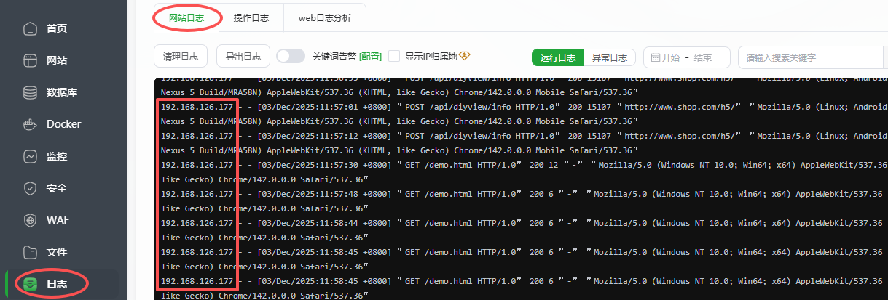

解决办法：

第一步：修改 lb01 服务器 nginx.conf 文件

```python
# vim conf/nginx.conf
worker_processes  1;
events {
    worker_connections  1024;
}
http {
    include       mime.types;
    default_type  application/octet-stream;
    sendfile        on;
    keepalive_timeout  65;

    # 配置Nginx代理的web服务的地址  shop是名称，可以任意
    upstream shop {
        server 192.168.126.174:80;
        server 192.168.126.175:80;
    }

    server {
        listen       80;
        server_name  www.shop.com;
        location / {
            # 转发请求到上面定义好的web服务 shop对应的就是上面配置的名称
            proxy_pass http://shop;
            # 转发请求时设置好请求头信息
            proxy_set_header HOST $host;
            proxy_set_header X-Real-IP $remote_addr;
            proxy_set_header X-Forwarded-For $proxy_add_x_forwarded_for;
        }
        error_page   500 502 503 504  /50x.html;
        location = /50x.html {
            root   html;
        }
    }
}

# sbin/nginx -t

# systemctl reload nginx
```

第二步：在 web01 和 web02 服务器上，打开配置文件，定制日志显示格式

如果是我们自己安装的 Nginx 的话，需要按照如下操作。**（这里目前不需要操作）**

```python
# cd /usr/local/nginx
# vim conf/nginx.conf
http {
    ...
    log_format  main  '$remote_addr - $remote_user [$time_local] "$request" '
                      '$status $body_bytes_sent "$http_referer" '
                      '"$http_user_agent" "$http_x_forwarded_for"';
    access_log logs/access.log main;
    ...
}

# sbin/nginx -s reload
```

**<font style="background-color:#FBDE28;">宝塔配置：目前 web 服务器上的 Nginx 不是我们自己装的，需要安装下面方式配置：</font>**

**<font style="background-color:#FBDE28;">注意：web01 和 web02 都要这么操作：</font>**

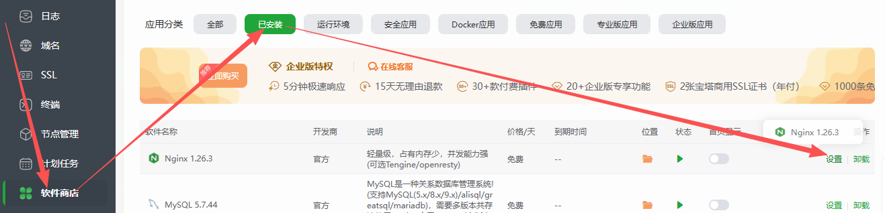

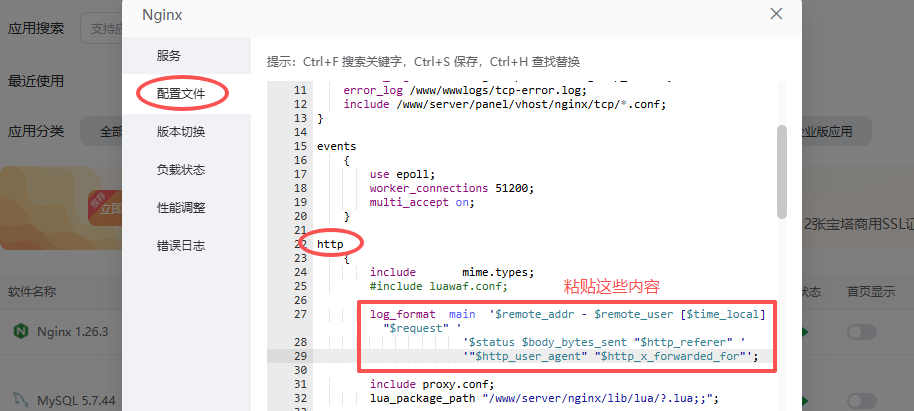

粘贴的内容如下：

```python
log_format  main  '$remote_addr - $remote_user [$time_local] "$request" '
                      '$status $body_bytes_sent "$http_referer" '
                      '"$http_user_agent" "$http_x_forwarded_for"';

"$http_x_forwarded_for": 其实就表示记录真实的客户端IP
```

`vim /www/server/panel/vhost/nginx/www.shop.com.conf`做如下修改：

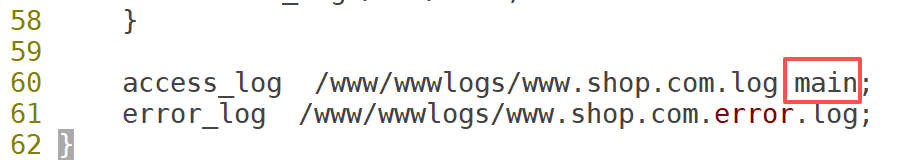

`nginx -s reload`

第三步：多刷新几次浏览器访问

第四步：再次查看 Nginx 的访问日志

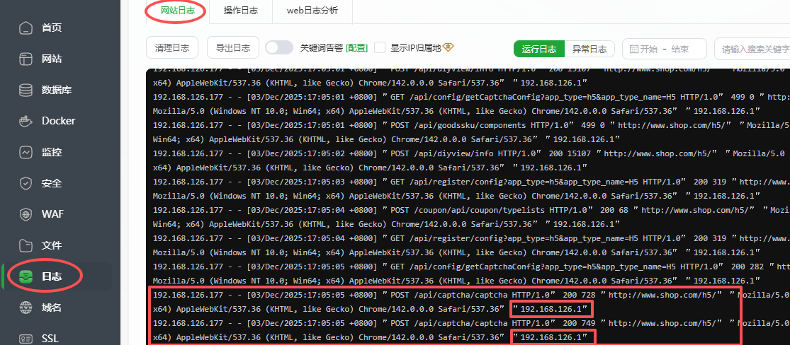

可以看到，在 web 服务器的 Nginx 的访问日志中，已经记录了真实客户端的 IP 地址（192.168.126.1），当然，也记录了负载均衡服务器的 IP 地址（192.168.126.177）。

## 负载均衡常见错误汇总

常见错误1：请求已经转发了，但是一会正常一会不正常

答：默认情况下，负载均衡采用的是轮询算法，Web01 一次，Web02 一次，如果其中某台 Web 服务器有异常，则会出现以上问题。异常包括（Web01 或 Web02 没有安装宝塔，也没有 Nginx 软件），大部分都是 Nginx 没有启动。

常见问题2：打开 www.shop.com 时，提示 SQLxxx 错误

答：出现以上问题的原因在于某台 web 服务器的 sql 连接异常（database.php 配置异常）或者 node6 数据库服务器没有打开

常见问题3：找不到文件夹 niushop，主要原因可能是你的虚拟机里根本没有安装宝塔或者做了还原，自己又不记得。

常见问题4：宝塔不记得如何登录，也不记得账号密码是多少了!

答：安装了软件、账号、密码、地址信息一定要用一个小本本记下来。或者 `bt default`查看，忘记密码还可以使用 `bt 5`修改密码。

常见问题 5：web01 和 web02 都正常，但是访问时总是 web01 或者总是 web02，不切换（可能并没有问题，而是因为浏览器缓存造成的）

F12 => 开发工具中，停用缓存，按 ctrl + F5 强制刷新浏览器。

## 分发请求关键字

backup 关键字：其他的没有 backup 标识的服务器都无响应，才分发到 backup 服务器。

```python
# vim conf/nginx.conf
http {
    ...
    upstream shop {
        server 192.168.126.174:80 backup;
        server 192.168.126.175:80;
    }
    ...
}
```

down 关键字：任何时候，请求都不分发给配置了 down 关键字的服务器

```python
# vim conf/nginx.conf
http {
    ...
    upstream shop {
        server 192.168.126.174:80;
        server 192.168.126.175:80 down;
    }
    ...
}
```

用的最多的还是 backup，关键时刻起到热备作用！

遇到问题：在浏览器中输入<http://www.shop.com> 经常变更为 https，导致服务无法访问，应该如何解决?

其实在 Linux 操作系统中，也有内置浏览器 curl 命令，主要作用，就是模拟 http 发送 get 或者 post 请求，实现浏览器功能

lb01 服务器：

```python
# vim /etc/hosts
192.168.126.177 www.shop.com
```

在 lb01 服务器上模拟访问 demo.html，也可以看到负载均衡的效果！

```python
# curl http://www.shop.com/demo.html
```

## 负载均衡的 3 种调度算法（请求规则）

Nginx 官方默认 3 种负载均衡的算法：

① Round-Robin RR 轮询（默认）：一次一个的来（理论上的，实际实验可能会有间隔）=> 服务器配置相同（类似）

② Weight 权重：权重高多分发一些，服务器硬件更好的设置权重更高一些 => 服务器配置有差异（好的多分摊一些）

```python
# vim conf/nginx.conf
http {
    ...
    upstream shop {
        server 192.168.126.174:80 weight=4;
        server 192.168.126.175:80 weight=6;
    }
    ...
}
```

③ IP\_HASH：代表把同一个 IP 来源的请求分发到同一个后端服务器 => 没有 redis 出现之前，使用 Nginx，大部分都使用 IP\_HASH 算法

222.89.34.56 => 哈希返回一个值 => 5 => 5 % 2 = 1（分配到 web02 服务器），以后只要这个 IP 过来始终分配到 web02 服务器。

举个例子：比如登录操作（账号、密码、验证码）

普及一个概念：验证码 => session 技术 => 在服务器端生成一个文件，然后保存了验证码上的文字。当用户登录时，手工输入验证码，输入完验证码需要与 session 文件中保存的文字相匹配。

如果采用 rr 轮询，一次 web01，一次 web02

首次打开登录页面 => 生成一个验证码 => web01 服务器上生成当我们输入完验证码以后，单击登录 =>又发送了一次请求，这次请求可能定位到 web02，因为你采用 rr 轮询算法。这会 web02 上面没有session 文件，最终导致验证失败。

```python
# vim conf/nginx.conf
http {
    ...
    upstream shop {
        ip_hash;
        server 192.168.126.174:80;
        server 192.168.126.175:80;
    }
    ...
}
```

> 大家可以设置负载均衡策略为轮询，默认就是，然后浏览器访问后台管理系统，进行登录，看是否有账号密码、验证码都输入正确了，但是登录不进去的情况！

## Session 共享解决方案（调度算法）

① http 协议，http 协议是一个无状态协议，无法记录用户的浏览轨迹

② cookie 技术，可以把用户的信息记录在浏览器的缓存中(缓存存在过期时间)

③ session 技术，可以把用户的浏览轨迹保存在服务器端(默认为 /tmp 目录)

> 验证码也是 Session 文件，其产生的验证码会保存在这个文件中

模拟负载均衡与 Session 共享问题:

第一步：配置负载均衡(默认算法使用轮询算法)

第二步：使用账号密码登录功能，登录后台管理界面(admin，123456)

我们发现了一个问题，无论我们怎么输入这个验证码，始终提示验证失败，主要原因：由于使用轮询算法，所以生成验证码时，相当于一次请求，验证验证码时也是一次请求。两次请求所在的服务器不同，所以最终验证总是失败。

解决办法：想办法让同一个 IP 的请求，分发到同一个 Web 服务器。

第三步：使用 IP HASH 算法，问题解决。

```python
# vim conf/nginx.conf
http {
    ...
    upstream shop {
        ip_hash;
        server 192.168.126.174:80;
        server 192.168.126.175:80;
    }
    ...
}
```

> 注：其实 Session 共享的解决方案，非常多，不仅仅只有 IP\_HASH 一种算法，还可以基于 MySQL 或Redis 实现 Session 共享。

## Nginx 健康检查模块

默认情况下，我们使用的 Nginx 属于开源 Nginx，默认不支持健康检查。

如果没有健康检查的话，请求到达 Nginx 负载均衡后，Nginx 会将请求转发到 Web01 服务器，下一次会将请求转发到 Web02 服务器。但是如果 Web01 服务器挂了呢？或者报错了呢？Nginx 负载均衡器不管，还是当做是正常的再转发！

如果有了健康检查模块，那么 Nginx 负载均衡如果看到某个 web 服务器挂的话，后面就不会将请求转发给该服务器！

安装健康检查模块：

```python
上传健康检查的安装包，然后解压（资料中有）
# cd /root/nginx-1.26.2
# ./configure --prefix=/usr/local/nginx --user=www --group=www --with-http_ssl_module --with-http_stub_status_module --with-http_realip_module --add-module=/root/nginx_upstream_check_module-0.4.0
# make && make install && make upgrade
```

配置：

```python
http {
    upstream shop {
        ip_hash;
        server 192.168.126.174:80;
        server 192.168.126.175:80;

        # 健康检查（加下面的三句话即可！！！其他的还用之前的配置即可）
        check interval=3000 rise=2 fall=3 timeout=1000 type=http;
        check_http_send "GET / HTTP/1.0\r\n\r\n";
        check_http_expect_alive http_2xx http_3xx;
    }

    server {
        listen 80;
        location / {
            proxy_pass http://shop;
        }
    }
}


参数说明：
1. check interval=3000
含义：检查间隔时间
单位：毫秒
解释：每隔3000毫秒进行一次健康检查。这表示Nginx会每隔3秒向后端服务器发送一次健康检查请求，以确认服务器是否正常运行。

2. rise=2
含义：连续成功检查的次数
解释：当连续2次健康检查成功时，Nginx认为后端服务器是正常的。例如，如果第一次检查失败，但接下来两次检查都成功，那么Nginx会将该服务器标记为“正常”，并开始将流量转发到该服务器。

3. fall=3
含义：连续失败检查的次数
解释：当连续3次健康检查失败时，Nginx认为后端服务器是失败的，例如，如果连续三次检查都失败，那么Nginx会将该服务器标记为“失败”，并停止将流量转发到该服务器，直到后续检查成功。

4. timeout=1000
含义“超时时间”
单位：毫秒（ms）
解释：每次健康检查的超时时间为1000毫秒。如果在1秒内没有收到响应，这次检查将被视为失败。这有助于快速识别无响应的服务器，避免流量被发送到不可用的服务器。

5. type=http
含义：检查的类型
解释：指定健康检查的类型为HTTP。这意味着Nginx会通过http协议向后端服务器发送一个http请求，并根据返回的http状态码来判断服务器是否正常。通常，如果返回的状态码在200-299之间，认为服务器是正常的。

6. check_http_send "GET / HTTP/1.0\r\n\r\n";
表示Nginx负载均衡器会给后端发送get请求，访问 / 路径，检测后端是否正常

7. check_http_expect_alive http_2xx http_3xx;
表示Nginx负载均衡器期望后端返回的检测到的响应状态码是2xx或者是3xx
```

```python
# systemctl restart nginx

在Nginx负载均衡服务器测试（lb01）
# curl http://www.shop.com/demo.html
web01
# curl http://www.shop.com/demo.html
web02
# curl http://www.shop.com/demo.html
web01
# curl http://www.shop.com/demo.html
web02

web02服务器中的Nginx给停掉
web02# nginx -s stop

然后接着在Nginx负载均衡服务器测试（lb01）
# curl http://www.shop.com/demo.html
web01
# curl http://www.shop.com/demo.html
web01
# curl http://www.shop.com/demo.html
web01

web02服务器中的Nginx给启动起来
# nginx

然后接着在Nginx负载均衡服务器测试（lb01）
# curl http://www.shop.com/demo.html
web01
# curl http://www.shop.com/demo.html
web02
# curl http://www.shop.com/demo.html
web01
# curl http://www.shop.com/demo.html
web02
```

> 上面的测试还是最好是用浏览器测试！

也就是说有了 Nginx 负载均衡的健康检查后，它发现后端的某个服务器挂掉了，就不会再往挂掉的服务器转发请求了，但是一旦挂掉的服务器又启动后，它还是会给正常转发请求的！

> 其实我们不在 Nginx 负载均衡服务器中配置健康检查，然后将 web02 服务器停掉，测试的话，Nginx 负载均衡也不会将请求转到到 web02 服务器。这是因为 nginx 的高版本中也添加了简单的健康检查功能。

## Nginx 负载均衡高可用

目前我们只有一台负载均衡服务器，请求都会先到达该负载均衡服务器，然后负载均衡服务器将请求转发到后端服务器中！如果这台负载均衡服务器挂掉的话，那整个项目也就不能访问了！！！

所以我们搭建 Nginx 负载均衡的高可用，通过 Keepalived 去保证 Nginx 负载均衡的高可用！

第一步：关闭 lb01 服务器，克隆 lb01 服务器作为 lb02 服务器

第二步：修改 lb02 服务器的 MAC 地址


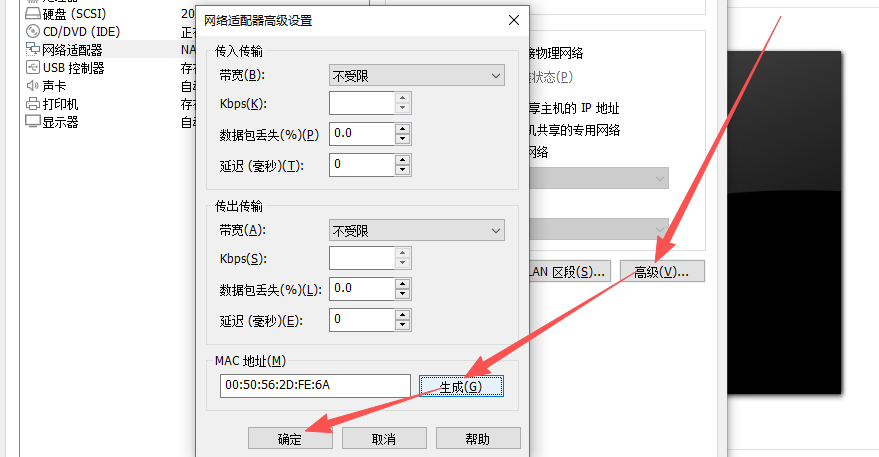

第三步：打开 lb01 服务器，lb02 服务器

第四步：修改 lb02 服务器的 IP 地址和主机名

```python
# vim /etc/NetworkManager/system-connections/ens33.nmconnection
address1=192.168.126.178/24

# hostnamectl set-hostname lb02.lhp.cn
# su
```

第五步：同时使用 MX 操作 lb01 和 lb02 服务器，进行 Keepalived 的安装及配置

```python
# yum -y install keepalived
# vim /etc/keepalived/keepalived.conf
! Configuration File for keepalived

global_defs {
   notification_email {
     acassen@firewall.loc
     failover@firewall.loc
     sysadmin@firewall.loc
   }
   notification_email_from Alexandre.Cassen@firewall.loc
   smtp_server 192.168.200.1
   smtp_connect_timeout 30
   router_id LVS_DEVEL
   vrrp_skip_check_adv_addr
   #vrrp_strict
   vrrp_garp_interval 0
   vrrp_gna_interval 0
}

vrrp_instance VI_1 {
    state BACKUP
    interface ens33
    virtual_router_id 51
    priority 100	# 另一台是90
    nopreempt
    advert_int 1
    authentication {
        auth_type PASS
        auth_pass 1111
    }
    virtual_ipaddress {
        192.168.126.200
    }
}

# systemctl restart keepalived

# ip a

# systemctl start nginx
```

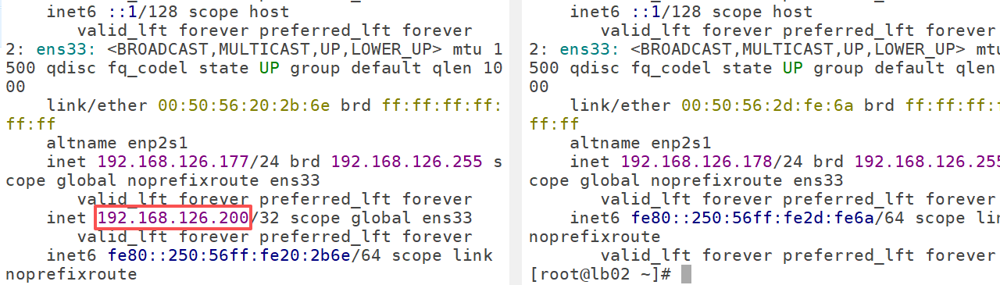

> 两台 Keepalived 的服务器的 state 都是 BACKUP，是为了防止争抢！

第六步：修改 Windows 的 hosts 文件：将域名对应的 IP 改为 VIP

```python
192.168.126.200 www.shop.com
```

第七步：浏览器访问测试，一切正常。目前 VIP 是在 lb01 服务器中了。


第八步：关闭 lb01 服务器中的 Keepalived，查看 VIP 是否到 lb02 服务器，再次浏览器访问，看是否还能正常提供服务！

VIP 确实到 lb02 了，而且项目还是可以正常提供服务！

补充作业：上面的 Keepalived 实现高可用并没有去写脚本判断 Nginx 的存活情况，按照我们上个文档，如果 nginx 挂掉的话，当前负载均衡的服务器就失效了，应该将 VIP 切换到另一台负载均衡服务器！

自己根据昨天的文档去实现！


> 更新: 2026-05-28 08:40:20  
> 原文: <https://www.yuque.com/u41736172/az9urv/gp4mbit2uldqp5f7>