# 08.LVS四层负载均衡

# 学习目标

* 能够了解 LVS 的基本工作方式
* 能够安装配置 LVS 实现负载均衡
* 能够了解 LVS-NAT 的配置方式
* 能够了解 LVS-DR 的配置方式
* 了解 LVS 的十种调度算法

# 一、LVS 概述

## 什么是 LVS

LVS 是 Linux Virtual Server 的简称，也就是 Linux 虚拟服务器。这是一个由章文嵩博士发起的一个开源项目，它的官方网是 http://www.linuxvirtualserver.org 现在 LVS 已经是 Linux 内核标准的一部分。

使用 LVS 可以达到的技术目标是：通过 LVS 达到的负载均衡技术和 Linux 操作系统实现一个高性能高可用的 Linux 服务器集群，它具有良好的可靠性、可扩展性和可操作性。从而以低廉的成本实现最优的性能。

LVS 是一个实现负载均衡集群的开源软件项目，LVS 架构从逻辑上可分为调度层、Server 集群层和共享存储。

记住一句话：<font style="background-color:#FBDE28;">LVS 就是一个四层负载均衡器，性能最强。（在 LVS、Nginx、HAProxy 中）</font>

## LVS 工作原理

Linux 底层有防火墙（四表五链）以及 IPVS 两个核心：

① iptables（firewalld）：四表五链 => 防火墙规则设定，应用场景：安全防护（五链也可以实现请求转发）

② <font style="background-color:#FBDE28;">ipvs：基于内核使用五链，主要用于请求转发，应用场景：负载均衡</font>

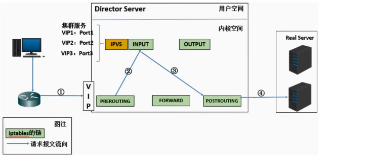

上图中的五链是指：IPVS、INPUT、OUTPUT、PREROUTING、FORWARD、POSTROUTING。

```python
第一步：当用户向负载均衡调度器(Director Server)发起请求，调度器将请求发往至内核空间
第二步：PREROUTING 链首先会接收到用户请求，判断目标IP确定是本机IP，将数据包发往INPUT链
第三步：IPVS是工作在INPUT链上的，当用户请求到达INPUT时，IPVS会将用户请求和自己已定义好的集群服务进行比对
第四步：POSTROUTING链接收数据包后发现目标IP地址刚好是自己的后端服务器，那么此时通过选路，将数据包最终发送
```

## LVS 的组成

LVS 由 2 部分程序组成，包括<font style="background-color:#FBDE28;"> ipvs 和 ipvsadm</font>

① ipvs（ip virtual server）：一段代码工作在内核空间，叫 ipvs，是真正生效实现调度的代码（类似 Nginx 中的 proxy\_pass）

② ipvsadm：另外一段是工作在用户空间，叫 ipvsadm，负责为 ipvs 内核框架编写规则，定义谁是集群服务，而谁是后端真实的服务器（Real Server），类似 Nginx 中的 upstream。

<font style="background-color:#FBDE28;">LVS 组成 = ipvs（内核，负载均衡调度代码）+ ipvsadm（ipvs 管理器，负责提供集群/Real Server 后端服务器等信息）</font>

## LVS 相关术语

负载均衡(1台)+Web 服务器(2台)

DS：Director Server。指的是前端负载均衡器节点(负载均衡服务器)

RS：Real Server。后端真实的工作服务器(Web01、Web02 服务器)

VIP：向外部直接面向用户请求，作为用户请求的目标的 IP 地址(负载均衡的 VIP 地址，提供给用户)

DIP：Director Server IP，主要用于和内部主机通讯的 IP 地址(负载与 Web 服务器交互的内部IP)

RIP：Real Server IP，后端服务器的 IP 地址。

CIP：Client IP，访问客户端的 IP 地址。

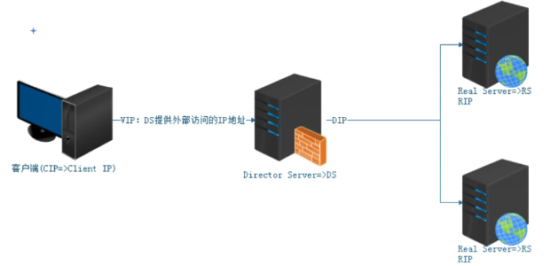

## LVS 三种工作模式

① NAT 模式（重点 => 使用量次之）

② DR 模式（重点 => 使用量最多）

③ Tun 模式（了解）=> IP 隧道模式

## VMWare 中虚拟机网络模式

| 网络模式 | 通信用的网卡 | IP 是多少 | 能否上外网 |
| --- | --- | --- | --- |
| 仅主机模式 | VMNet1 网卡 | 在一个局域网内 | 不能 |
| NAT 模式 | VMNet8 网卡 | 在一个局域网内 | 可以上外网 |
| 桥接模式 | 真实上网的网卡 | 和物理机的真实 IP 是同一个网段 | 可以上外网 |

# 二、LVS/NAT 原理和特点

## NAT 工作原理图

普及一点网络知识：数据包

:::warning
**头部（Header）**

:::

* 作用：类似信封上的地址和标记，告诉网络设备如何处理这个数据包
* 内容：
  * 源 IP 地址：发送方的 IP（如：192.168.1.100）
  * 目标 IP 地址：接收方的 IP（如：192.168.126.150）
  * 源端口：发送方的端口（如：5000）
  * 目标端口：接收方的端口（如：80）
  * 协议类型：指明是 TCP、UDP 或 ICMP 等协议

:::warning
**有效载荷（Payload）**

:::

* 作用：实际传递的数据内容，类似信件里的文字
* 示例：
  * 如果是网页请求，可能是 `GET /index.html HTTP/1.1`
  * 如果是下载文件，可能是文件内容的分片

:::warning
**尾部（Footer）**

:::

* 作用：校验数据完整性（如：CRC 校验码），确保传输过程中未被破坏。

***

重点理解 NAT 方式的实现原理和数据包的改变

宏观：

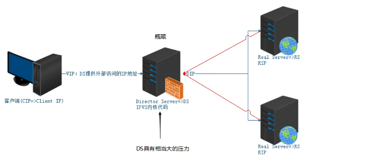

微观：

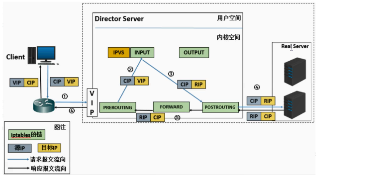

客户端发送请求给服务端，首先会到达负载均衡服务器 DS，这时候数据包中源 IP 是 CIP、目标 IP 是 VIP，DS 收到请求后先到达 PREROUTING 链，PREROUTING 将请求继续转给 INPUT 链，INPUT 链会结合 IPVS 进行判断看目前数据包中的 VIP 是否是我们本机，是的话，将 VIP 替换为 RIP，然后接着转给 POSTROUTING 链，然后请求再到达真实的服务器，服务器处理完之后响应数据给 DS，这时候数据包中源IP 是 RIP、目标 IP 是 CIP，POSTROUTING 链将请求转给 FORWARD 链，FORWARD 链接着将请求转给 PREROUTING 链，PREROUTING 链将请求响应给客户端，将源 IP 变为 VIP、目标 IP 变为 CIP。

讲个故事:

Client(客户)，需求：盖个房子=>找专业公司

Director Server(恒大)

合同：客户端:目标端

恒大本身不具备建筑能力，有办法，后面有很多小包工队。包工队(A=>Web01)、包工队(B=>Web02)

Client 找到 Director Server(CIP:VIP)=>恒大判断合同目标方是否为自己，如果是，把合同转发给内部审核调整，审核完成后，调整一下合同的目标方，找一下下面小包工队承接这个业务，但是对外，客户不能知道。内部调整后，把任务转发给包工队B，包工队B拿到合同后，干活。任务结束后，不能把结束直接转给客户端。要直接转回给恒大，确认合同，稍作修改，把承办方变更为恒大(VIP)，然后把最终结果交回给Client客户端。

## NAT 模式的特性

* <font style="background-color:#FBDE28;">RS 应该使用私有地址，RS 的网关必须指向 DIP</font>
* <font style="background-color:#FBDE28;">DIP 和 RIP 必须在同一个网段内</font>
* <font style="background-color:#FBDE28;">请求和响应报文都需要经过 Director Server，高负载场景中，Director Server 易成为性能瓶颈</font>
* <font style="background-color:#FBDE28;">支持端口映射</font>
* <font style="background-color:#FBDE28;">RS 可以使用任意操作系统</font>
* <font style="background-color:#FBDE28;">缺陷：对 Director Server 压力会比较大，请求和响应都需经过 director server</font>

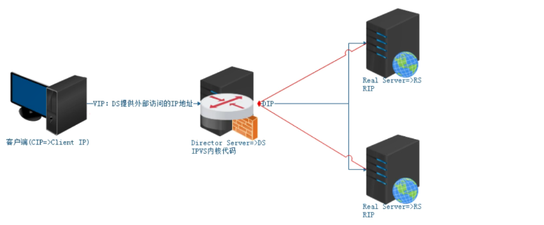

正常情况下：如果要搭建 LVS 的 NAT 模式

Web01、Web02、DS 服务器，物理网卡应该使用仅主机模式（仅限内部通信，工作中这3台机器，都是内网环境）

DS 服务器还有另外一张网卡，连接外网（可以是 NAT 模式），域名解析，就指向这个 IP 地址

但是：因为 Web01、Web02 都已经搭建完成后，所以本次操作，给直接 DS 服务器添加一张 NAT 或者桥接网卡即可，就相当于外网环境。本次课程中使用的 VIP 网卡采用桥接模式（为了和内网的区分开）

> 其实 DS 服务器中需要两张网卡，一张网卡是仅主机模式，也就是不能上网，用来和 web01 与 web02 进行局域网通信的；一张网卡是 NAT 模式或者桥接模式，可以上网，用于和外界进行通信的！但是目前我们已经安装的服务器都是 NAT 模式的网卡，就不换了！新加一张网卡使用桥接模式作为和外网通信的网卡！
>
> web01 和 web02 服务器在工作中应该也使用仅主机模式，在局域网通信的。但是目前我们的网络是 NAT 模式，可以上外网，就暂时不改动了。

# 三、LVS-NAT 模式实践

## 环境规划

| 角色 | 作用 | IP |
| --- | --- | --- |
| NAT（DS 服务器） | 负载均衡调度服务器 DS | 192.168.39.\*（对外访问的 VIP）<br/>192.168.126.222（DIP） |
| web01 | 真实服务器 web 服务器 RS | 192.168.126.174（RIP） |
| web02 | 真实服务器 web 服务器 RS | 192.168.126.175（RIP） |

准备工作：

第一步：将 web01 和 web02 服务器中的 nginx 都启动起来

第二步：查看 web01 和 web02 服务器中的 `/www/wwwroot/www.shop.com/niushop/demo.html`文件是否存在，不存在就创建一个，内容分为是 web01 和 web02.

第三步：给 web01 和 web02 服务器拍摄一个快照！（因为我们目前是准备做 LVS 的 NAT 模式，后面还要做 LVS 的 DR 模式，需要恢复快照）

***

## LVS 服务器搭建

克隆一台最小化安装的机器，作为 DS 服务器，也就是 LVS 负载均衡服务器。

给 DS 服务器增加一张网卡，命名为 ens37 桥接模式，自动或手工获取 IP 均可，例子中 IP 获取为 192.168.39.\*

> 理论上，NAT 模式对应的 DS 服务器应该有两张网卡，一张绑定 VIP，一张绑定 DIP，VIP 是对外提供服务的，所以需要使用公网 IP 地址（虚拟机要求网络使用 NAT 模式）。DIP 属于内网 IP 地址（局域网IP，使用虚拟机其实就是仅主机模式)

第一步：克隆一台机器，作为 DS 服务器，也就是 LVS 负载均衡服务器


第二步：给 lvs 服务器添加一张网卡，并设置网络模式为桥接模式

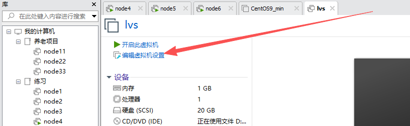

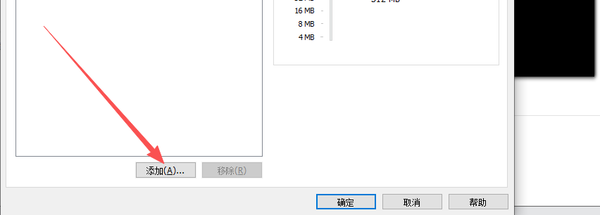

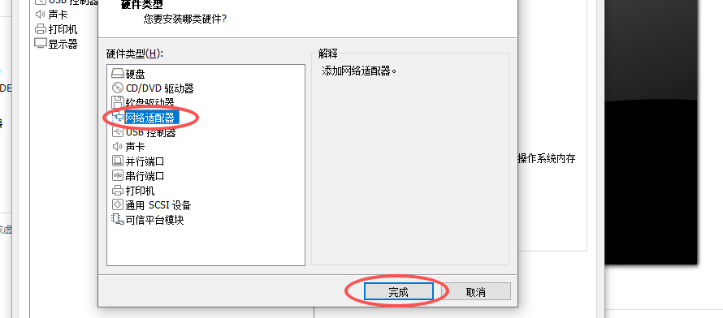

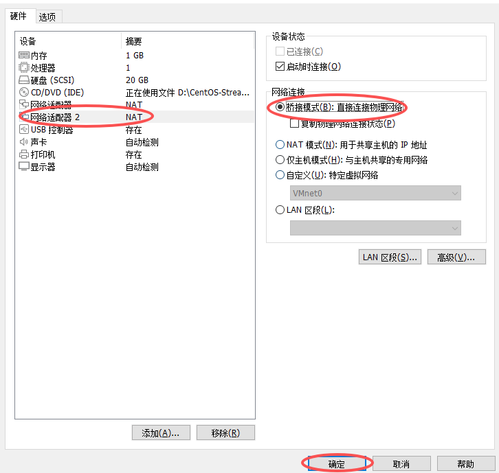

**<font style="background-color:#FBDE28;">桥接模式说明：</font>**

**<font style="background-color:#FBDE28;">如果我们虚拟机中的网络是使用桥接模式，那么该虚拟机就是和主机用的是同一个网段的 IP 地址了！那么给虚拟机设置 IP 的时候，就需要写和主机同一个网段内的 IP，并且这个 IP 不能是教室的同学已经使用的。而且桥接的话，我们要确保虚拟机软件要设置桥接到主机的真实的、能上网的那张网卡中！！！</font>**

**<font style="background-color:#FBDE28;">设置虚拟机软件桥接到主机（物理机）的能上网的网卡中：</font>**

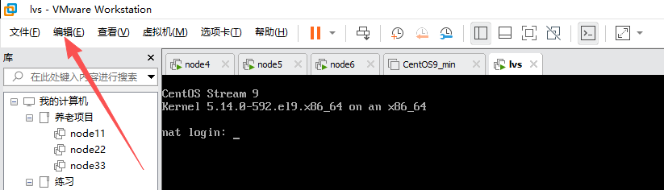

然后点击“虚拟机网络编辑器”

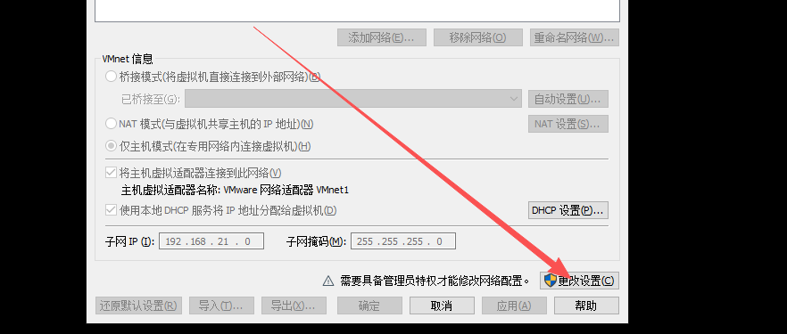

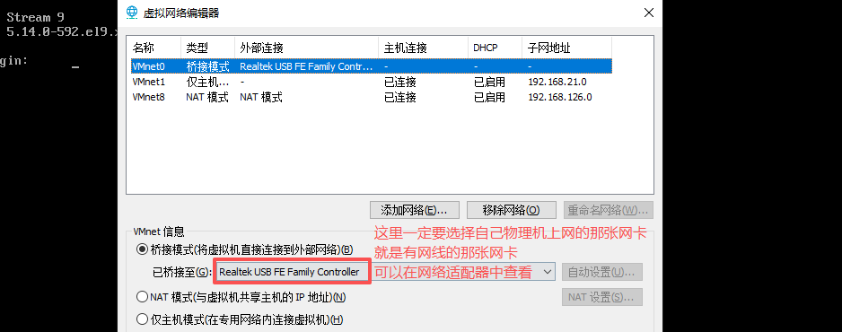

第三步：修改 lvs 服务器中之前网卡的 MAC 地址，然后开机

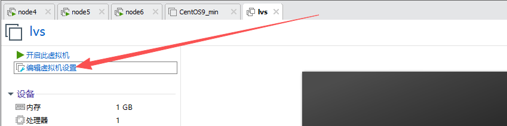

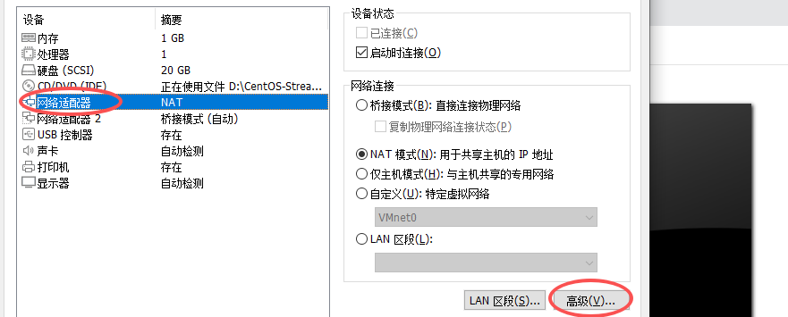

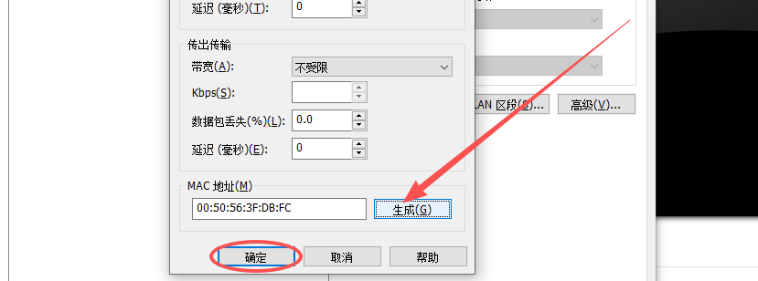

第四步：修改 IP 地址

> 有些同学用的是 VMware17，那么旧网卡是 ens160，新添加的网卡是 ens224

```python
查看目前的网卡信息,会发现新添加的网卡是ens37
# ip a

修改ens33网卡的IP地址，ens33网卡我们认为是内网通信用的网卡，也就是该网卡和后面的web服务器进行通信
# vim /etc/NetworkManager/system-connections/ens33.nmconnection
address1=192.168.126.222/24
# nmcli connection reload
# nmcli connection up ens33

使用MX连接LVS服务器

复制一份ens33网卡的配置文件改名为ens37的（因为新添加的网卡是没有配置文件的）
注意：网卡的名字不是随便起的，你的新网卡通过 ip a 查到的是什么名字就是什么
# cd /etc/NetworkManager/system-connections/
# cp ens33.nmconnection ens37.nmconnection
# ls
ens33.nmconnection  ens37.nmconnection
修改新网卡的IP，新网卡使用的是桥接模式，要使用和宿主机一样的真实IP地址，需要用一个教室没有人用过的IP！！！ 网关查看Windows的网关！
# vim ens37.nmconnection
[connection]
id=ens37
type=ethernet
# 这里删除了一行UUID！！！！
autoconnect-priority=-999
interface-name=ens37
timestamp=1760322701

[ethernet]

[ipv4]
address1=203.203.203.250/24
dns=114.114.114.114;8.8.8.8;
gateway=203.203.203.1
method=manual

[ipv6]
addr-gen-mode=eui64
method=auto

[proxy]

# nmcli connection reload
# nmcli connection up ens37

将新网卡添加到开机启动项中，以后开机就会自动启动
# nmcli connection modify ens37 connection.autoconnect yes

# ip a
```

> 新添加的网卡是没有网络配置文件的！

最初的效果：

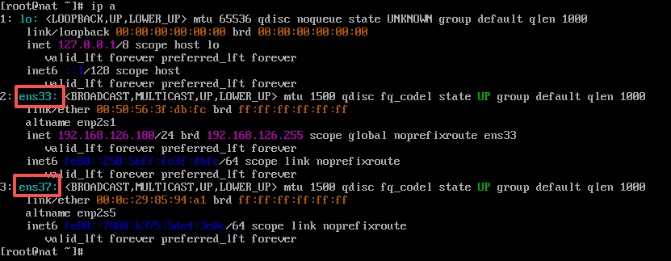

最终的效果：

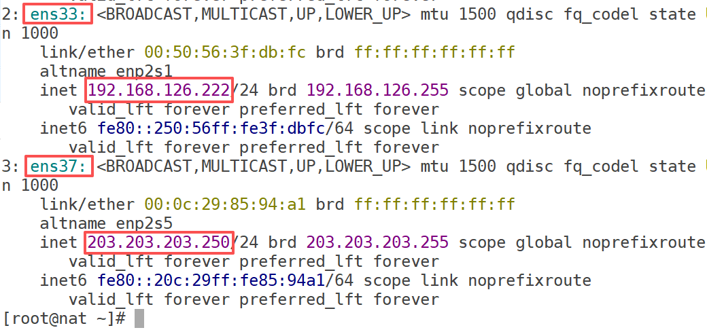

第五步：修改主机名

```python
# hostnamectl set-hostname nat.lhp.cn
# su
```

第六步：检查网络是否畅通

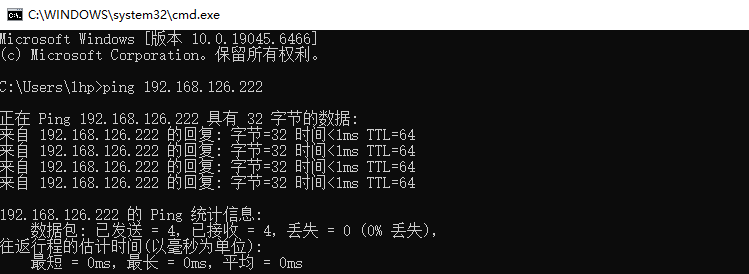

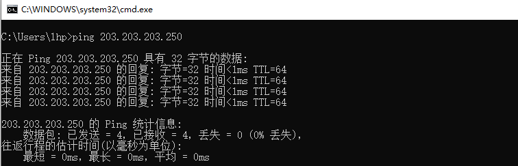

## LVS-NAT 模式负载均衡搭建

以下操作均在 LVS 服务器上操作。

第一步：安装 ipvsadm 工具，基于 ipvsadm 工具编写负载均衡调度代码

```python
# yum -y install ipvsadm
```

第二步：在 DS 调度服务器（LVS 服务器）上，使用 ipvsadm 编写负载均衡代码

```shell
1. 定义一个虚拟服务（负载均衡）
# ipvsadm -A -t 203.203.203.250:80 -s rr

选项说明：
-A 定义一个虚拟服务
-t 定义虚拟服务地址及端口号
-s 定义调度算法，rr代表轮询算法

2. 添加RealServer（web01、web02），并指定工作模式为NAT
# ipvsadm -a -t 203.203.203.250:80 -r 192.168.126.174:80 -m
# ipvsadm -a -t 203.203.203.250:80 -r 192.168.126.175:80 -m

选项说明：
-a 添加真实的后端服务器
-t 指定服务器地址及端口号（NAT模式支持端口映射，可以是非80端口）
-m NAT模式
-g DR模式

黄色的就是VIP的地址信息，绿色的就是真实的后端服务器的IP信息
```

> 上面说的虚拟服务，其实核心就是指的 DS 服务器的 VIP 地址！！！是与外界通信用的，外界的客户端就是访问的 VIP 地址！然后 DS 服务器再利用 NAT 模式进行负载均衡，将请求转发给后面真实的服务器！
>
> **如果上面的命令写错了，直接 **<code>**ipvsadm -C**</code>**，然后重新操作即可！！！**

常见错误汇总：

问题 1：Zero port specified for non-persistent service

解决方案：未设置端口号

问题 2：Memory allocation problem

解决方案：信息输入的不正确

第三步：查看调度规则

```shell
# ipvsadm -L -n
```

第四步：在 NAT 模式的 DS 服务器上开启 ip\_forward 转发功能

```shell
# vim /etc/sysctl.conf
net.ipv4.ip_forward=1

# sysctl -p
```

> sysctl.conf 代表内核配置文件！

## RS 服务器操作（web01/web02）

唯一需要做的一件事：就是把 web01/web02 的默认网关指向 DIP

```shell
# yum -y install net-tools
# route del default
# route add default gw 192.168.126.222
# route -n
```

如果想删除，可以使用（可选）

```shell
# route del default gw 192.168.126.222
```

## 修改 Windows 中 hosts 文件

劫持 www.shop.com 域名

```shell
203.203.203.250 www.shop.com
```

## 测试

通过浏览器访问 www.shop.com/demo.html，查看是否有负载均衡的效果！


通过 Windows 测试看不到明显的效果，按照上图所示，如果我们将 web01 服务器中的 Nginx 停掉后，就是 web02 来处理请求的！所以不是很明显！

其实也可以在随便一台 Linux 中，修改 hosts 文件为：`203.203.203.250 www.shop.com`然后通过 `curl http://www.shop.com/demo.html`测试更明显！

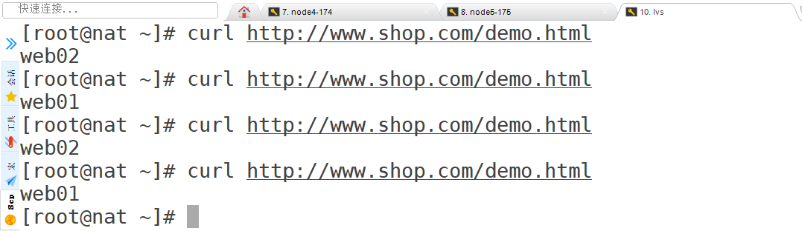

## LVS-NAT 模式负载均衡修改

查看目前 LVS 服务器中的负载均衡信息：

```shell
# ipvsadm -Ln
```

第一步：修改 DS 服务器（删除之前的负载均衡相关代码的所有配置）

```shell
# ipvsadm -C
```

第二步：修改负载均衡转发的后端服务器信息（其实就是删除之前配置的转发到后端服务器的信息）

```shell
可以不执行这一步操作！！！
# ipvsadm -d -t 203.203.203.250:80 -r 192.168.126.174
# ipvsadm -d -t 203.203.203.250:80 -r 192.168.126.175
```

第三步：更改调度算法（其实就是重新配置之前配置的负载均衡相关的内容）

```shell
# ipvsadm -A -t 203.203.203.250:80 -s wrr
# ipvsadm -a -t 203.203.203.250:80 -r 192.168.126.174:80 -m -w 8
# ipvsadm -a -t 203.203.203.250:80 -r 192.168.126.175:80 -m -w 2
```

> wrr 表示加权轮询算法

简单测试，可以发现确实 web01 服务器处理的概率要更大一些！

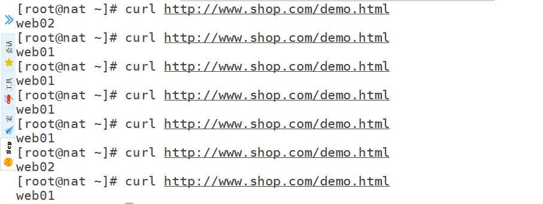

# 四、LVS/DR 原理和特点

作用：LVS/DR 负载均衡效率是最高的，而且解决了 NAT 模式的缺陷！

宏观：

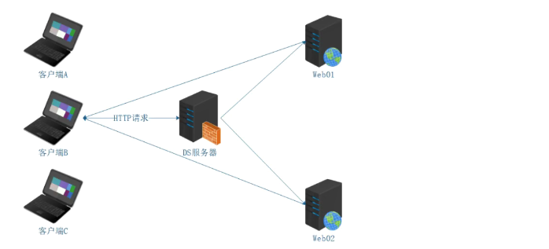

> 如果使用的是 LVS 中的 NAT 模式的话，请求到达 DS 服务器后，将请求转发到后端服务器中，后端服务器处理完请求后，会将响应结果再给了 DS 服务器，然后 DS 服务器再将结果给了客户端！
>
> 这也就意味着 DS 服务器会比较繁忙！请求和响应的时候都需要走他！

## DR 工作原理图

注意：重点理解请求报文的目标 MAC 地址设定为挑选出来的 RS 的 MAC 地址（ARP 协议 => 广播，询问谁是 VIP 机器，如果某台服务器响应了，则告知客户端该台服务器的 MAC 地址）

微观：

NAT 模式：通过改变目标 IP 实现负载均衡

DR 模式：通过改变目标 IP（找到对应的计算机）+ 目标 MAC 地址调整实现负载均衡

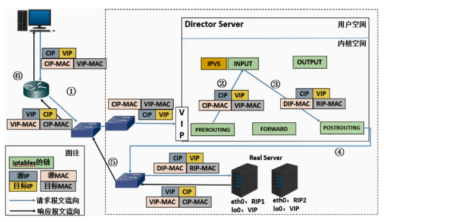

从上面 2 张图中我们需要清楚的 DR 模式相关的内容：

1. LVS 的 DR 模式，数据包中不仅需要有源和目标的 IP 地址，还需要源和目标的 MAC 地址
2. 客户端发送请求给 DS 服务器，DS 服务器转发请求给 web 服务器，web 服务器处理完请求后就直接响应结果给客户端了
3. 客户端发送请求给 DS 服务器时，源 IP 比如是 10.1.1.1，目标 VIP 比如是 192.168.126.200，源 MAC 地址比如是：1a:22:33:fc，目标 MAC 地址比如是：22:33:ab:3c；那么真实服务器直接响应给客户端时，上面的源 IP 目标 IP，源 MAC 目标 MAC 必须是调个顺序就可以的！！！
4. 但达不到要求呀，客户端发送请求时，目标 VIP 是 DS 服务器的一个 IP 呀！而真实服务器处理完请求后响应客户端时，源 IP 必须也得是 DS 服务器的这个 IP！！！
5. 这也就意味着：两台 web 服务器上面也必须得有和 DS 服务器一样的 VIP！
6. 那么客户端发请求时，我们要求只能 DS 服务器响应，两台 web 服务器是不能响应的！
7. 上图中，**发送请求时的源 IP 和目标 IP** 与**收到响应时的源 IP 与目标 IP 是对调的**！而**发送请求时的源 MAC 地址和目标 MAC 地址**与**收到响应时的源 MAC 地址和目标 MAC 地址不是对调的**！MAC 地址是每台电脑唯一的，而 IP 地址可以不唯一！上面的 DS、web01、web02 上的 VIP 是一样的，但是 MAC 都不一样！

疑问点：MAC 地址发生改变，难道客户端不知道吗？

```shell
TCP/IP协议工作原理：在网络通信中，IP地址负责逻辑寻址，而MAC地址负责实际的物理传输。客户端在解析IP地址时，只关心目的IP不变即可，而MAC地址的变化不影响整个TCP/IP数据包的完整性。

现实网络环境：即使在通常情况下，网络设备可能因为网络路径选择或跳转而导致MAC地址变化（比如路由器转发时）。因此，设计上TCP/IP协议对此有容忍。
```

```shell
(a)当用户清求到达Director server，此时请求的数据报文会先到内核空间的PREROUTING链，此时报文的源IP为CIP，目标IP为VIP
(b)PREROUTING检查发现数据包的目标IP是本机，将数据包送至INPUT链
(c)IPVS比对数据包请求的服务是否为集群服务，若是，将请求报文中的源MAC地址修改为DIP的MAC地址，将目标MAC地址修改RIP的MAC地址，然后将数据包发至POSTROUTING链，此时的源IP和目的IP均未修改，仅修改了源MAC地址为DIP的MAC地址，目标MAC地址为RIP的MAC地址
(d)由于DS和RS在同一个网络中，所以是通过二层来传输。POSTROUTING链检查目标MAC地址为RIP的MAC地址，那么此时数据包将会发至Real server。
(e)RS发现请求报文的MAC地址是自己的MAC地址，就接收此报文。处理完成之后，将响应报文通过lo接口传送给ethe/ens33网卡然后向外发出。此时的源IP地址为VIP，目标IP为CIP
(f)响应报文最终送达至客户端
```

在普及一个网络小知识点：ARP协议(ARP广播)

ARP 全称是 Address Resolution Protocol，中文译作“地址解析协议”。它是一个计算机网络协议，用于把 IP 地址和物理地址(MAC地址)相互映射。在现代网络中，ARP是关键的一部分。让我们用一个简单的比喻来解释它。

举个例子：

在一个公司里，每个员工都有一个桌子(物理位置)，而每个桌子上都有一个名字牌(IP地址)。但是，如果你想给某个员工送文件(数据包)，只知道名字牌还不够，你需要知道他们的办公桌位置(MAC 地址)才能把文件送到。

ARP 的工作过程就像：

* 喊人：
  * 你只知道某位员工的名字牌(IP 地址)，但不知道他们的办公桌在哪(MAC地址)。
  * 你大声在办公室里问:“谁能告诉我，名字牌为 IP 地址 192.168.1.5 的员工在哪个桌子上坐着?"
* 响应：
  * 听到你问题的人，如果是那位员工，他会说:“哦，那是我，我的桌子号(MAC地址)是 00-14-22-01-23-45。”这样你就知道他在哪里了。
* 传输：
  * 拿到正确的桌子号后，你就可以精准地把文件送到这位员工的桌子上(完成数据包的发送)。

***

在 LVS 的 DR(Direct Routing)模式中，ARP(Address Resolution Protocol)起着关键作用，涉及 IP 地址到物理地址(MAC地址)的映射。在这种负载均衡模式中，正确处理 ARP 是确保负载均衡器和真实服务器之间通信的基础。

**VIP 的唯一性问题：**

在 DR 模式下，多个真实服务器(Real Servers)被配置有相同的VIP(虚拟 IP)，它们需要接收从 Director Server 传来的流量。但如果每个服务器都对网络上的 ARP 请求进行回复，会造成 IP 地址冲突。

**ARP 响应机制：**

由于 VIP 是在多个服务器上共享的，所以在没有控制的情况下，每个服务器可能会回复同样的 ARP 请求 。这会导致网络中的终端设备(比如客户端)难以确定哪个 MAC 地址对应于 VIP，造成通信混乱。

**为了在 LVS DR 模式下正确处理 ARP，避免 IP 冲突和通信错误,通常会采取以下措施：**

**ARP 抑制：**

在所有真实服务器上采用 ARP 忽略(ARPSuppression)技术，即配置这些服务器不会响应来自外部网络的ARP 请求。这样，只有 LVS Director 来对外提供 VIP 的 ARP 回复。

**配置 LVS Director：**

LVS Director 响应客户端和网络设备的 ARP 请求，为 VIP 提供统一回复。这样，所有流量都会首先到达LVS Director，它再根据负载均衡算法将流量路由到合适的真实服务器。

**回环接口绑定：**

真实服务器将 VIP 绑定到它们的回环接口上（也就是 lo 网卡上），但不对外广播，从而确保自身不会发送 ARP 响应，解决了多点响应引起的冲突。

## LVS-DR 模式的特性

* <font style="background-color:#FBDE28;">特点 1：保证前端路由将目标地址为 VIP 报文统统发给 Director Server，而不是 RS </font>
* <font style="background-color:#FBDE28;">RS 可以使用私有地址；也可以是公网地址，如果使用公网地址，此时可以通过互联网对 RIP 进行直接访问</font>
* <font style="background-color:#FBDE28;">RS 跟 Director Server 必须在同一个物理网络中所有的请求报文经由 Director Server，但响应报文必须不能经过 Director Server</font>
* <font style="background-color:#FBDE28;">不支持地址转换，也不支持端口映射</font>
* <font style="background-color:#FBDE28;">RS 可以是大多数常见的操作系统</font>
* <font style="background-color:#FBDE28;">RS 的网关绝不允许指向 DIP(因为我们不允许他经过 director)</font>
* <font style="background-color:#FBDE28;">RS 上的 lo 接口配置 VIP 的 IP 地址</font>
* <font style="background-color:#FBDE28;">缺陷：RS 和 DS 必须在同一机房中</font>

## 特点 1 的解决方案

* 在前端路由器做静态地址路由绑定，将对于 VIP 的地址仅路由到 Director Server
* 存在问题：用户未必有路由操作权限，因为有可能是运营商提供的，所以这个方法未必实用
* arptables：在 arp 的层次上实现在 ARP 解析时做防火墙规则，过滤 RS 响应 ARP 请求。这是由 iptables提供的
* 修改 RS 上内核参数(arp\_ignore 和 arp\_announce)将 RS 上的 VIP 配置在 lo 接口的别名上，并限制其不能响应对 VIP 地址解析请求。

# 五、LVS-DR 模式实践

## 环境规划

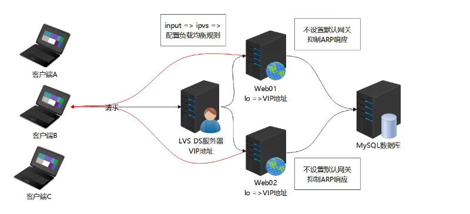

| 角色 | 作用 | IP |
| --- | --- | --- |
| dr | 负载均衡调度服务器 DS | 192.168.126.179（DIP）<br/>192.168.126.200（VIP） |
| web01 | 真实服务器 web 服务器 RS1 | 192.168.126.174（RIP）<br/>192.168.126.200（VIP） |
| web02 | 真实服务器 web 服务器 RS2 | 192.168.126.175（RIP）<br/>192.168.126.200（VIP） |

> DS 服务器有两个 IP，不需要额外添加一张网卡，它是直接绑在物理网卡上的。

第一步：将 web01 和 web02 服务器还原，还原到做上面的 LVS 的 NAT 模式之前。关掉上面的 LVS 服务器（一会重新克隆）

第二步：克隆一台精简版的服务器，作为负载均衡服务器，LVS-DR 模式，并启动

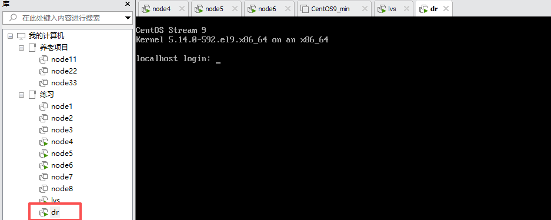

第三步：修改 IP 地址及主机名

```python
# vim /etc/NetworkManager/system-connections/ens33.nmconnection
address1=192.168.126.179/24

# hostnamectl set-hostname dr.lhp.cn
# su
```

第四步：修改 hosts 文件

```python
# vim /etc/hosts
127.0.0.1   localhost localhost.localdomain localhost4 localhost4.localdomain4
::1         localhost localhost.localdomain localhost6 localhost6.localdomain6
192.168.126.179 dr dr.lhp.cn
192.168.126.174 web01 web01.lhp.cn
192.168.126.175 web02 web02.lhp.cn
```

## DS 服务器操作

第一步：安装 ipvsadm 工具

```python
# yum -y install ipvsadm
```

第二步：在 ens33 网卡上，挂载一个 VIP 地址（192.168.126.200）

```python
# ifconfig ens33:0 192.168.126.200 broadcast 192.168.126.200 netmask 255.255.255.255 up
```

添加主机路由：

```python
# route add -host 192.168.126.200 dev ens33:0

也就是说所有访问192.168.126.200的请求都走ens33:0接口

查看路由情况
# route -n
Kernel IP routing table
Destination     Gateway         Genmask         Flags Metric Ref    Use Iface
0.0.0.0         192.168.126.2   0.0.0.0         UG    100    0        0 ens33
192.168.126.0   0.0.0.0         255.255.255.0   U     100    0        0 ens33
192.168.126.200 0.0.0.0         255.255.255.255 UH    0      0        0 ens33
```

第三步：创建 IPVS 调度规则

```python
清理目前的IPVS调度规则，如果有的话
# ipvsadm -C

# ipvsadm -A -t 192.168.126.200:80 -s rr
# ipvsadm -a -t 192.168.126.200:80 -r 192.168.126.174 -g
# ipvsadm -a -t 192.168.126.200:80 -r 192.168.126.175 -g

-m：NAT模式
-g：DR模式

测试完成后，可以通过
# ipvsadm -Ln --stats
```

## RS 服务器操作（web01/web02）

在 web01 和 web02 服务器上均要操作！

第一步：抑制 RS 服务器上的 lo 网卡的 VIP 响应 ARP 广播

```python
# echo 1 > /proc/sys/net/ipv4/conf/lo/arp_ignore
# echo 2 > /proc/sys/net/ipv4/conf/lo/arp_announce
# echo 1 > /proc/sys/net/ipv4/conf/all/arp_ignore
# echo 2 > /proc/sys/net/ipv4/conf/all/arp_announce
```

如果想永久设置：

```python
# vim /etc/sysctl.conf
net.ipv4.conf.all.arp_ignore=1
net.ipv4.conf.lo.arp_ignore=1
net.ipv4.conf.all.arp_announce=2
net.ipv4.conf.lo.arp_announce=2

# sysctl -p
```

第二步：在 RS 服务器上挂载 VIP（注意：这个 VIP 要挂载在 lo 回环网卡上）

```python
# ifconfig lo:0 192.168.126.200 broadcast 192.168.126.200 netmask 255.255.255.255 up
```

添加主机路由：

```python
# route add -host 192.168.126.200 dev lo:0
```

第三步：关闭防火墙

```python
# systemctl stop firewalld
# systemctl disable firewalld
```

## 修改 Windows 中的 hosts 文件

```python
192.168.126.200 www.shop.com
```

**通过浏览器测试，也可以通过随便一台 Linux（****<font style="background-color:#FBDE28;">注意，千万不要是 web01、web02、DS 服务器！！！</font>****），修改 /etc/hosts 文件为 192.168.126.200 www.shop.com，进行测试**

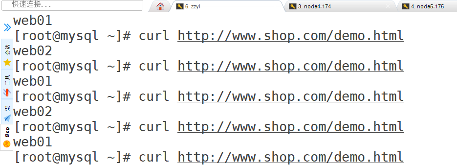

## 答疑解惑

`ifconfig ens33:0 192.168.126.200 broadcast 192.168.126.200 netmask 255.255.255.255 up`，广播为什么是自己？

```python
广播地址和VIP设置为相同的地址通常用于防止在局域网内产生不必要的广播活动，因为这个地址只用于对点对点通信。配置广播地址为192.168.126.200意味着在逻辑上将这个地址的作用范围限制在自己，不对外发起ARP广播。这与设置netmask为255.255.255.255（主机路由）结合使用时，常用于确保只有精确的流量（即针对此IP的数据包）才被处理，而不会对整个子网进行响应。
```

`route add -host 192.168.126.200 dev ens33:0`作用？

```python
将一个静态路由添加到系统的路由表中，指定任何要访问192.168.126.200的流量都通过ens33:0接口处理。
这确保任何本地进程（如应用或服务）发出的对于192.168.126.200的请求都用这个接口，而不是可能得其他配置。
```

如何抑制 ARP 响应？

```python
# echo 1 > /proc/sys/net/ipv4/conf/lo/arp_ignore
# echo 2 > /proc/sys/net/ipv4/conf/lo/arp_announce
# echo 1 > /proc/sys/net/ipv4/conf/all/arp_ignore
# echo 2 > /proc/sys/net/ipv4/conf/all/arp_announce

# ifconfig lo:0 192.168.126.200 broadcast 192.168.126.200 netmask 255.255.255.255 up
```

为什么 Windows 可以通过 www.shop.com 域名实现请求转发，而自己访问自己不行？

答：DR 模式的本质 LVS 只转发来自外部主机的请求流量，不处理本机自己发出的流量。

```python
你在LVS服务器上执行：
curl http://www.shop.com/demo.html
解析 /etc/hosts 得到 VIP：192.168.126.200
系统看到这个IP是本地地址，就直接走本地路由，不会再交给LVS处理！而且LVS是基于内核hook的PREROUTING链工作，本地发出的包根本不会经过PREROUTING链！所以，LVS无法给自己发出的请求做负载均衡！可能一直是无响应，连接超时！
```

# 六、LVS/Tun 原理和特点（了解）

作用：LVS/Tun 跨区域负载均衡，跨区负载均衡缺点，完全依赖外部网络（公网）访问，所以效率略低！

## Tun 工作原理图

在原有的 IP 报文外再次封装多一层 IP 首部，内部 IP 首部（源地址为 CIP，目标 IP 为 VIP），外层 IP 首部（源地址为 DIP，目标 IP 为 RIP）

NAT：更改目标的 IP

DR：更改目标的 MAC（使用 MAC 地址转发）

Tun：二次封装（可以理解为跨区域的 DR 模式，每个机器都有 VIP，DS 只处理请求，不处理响应）

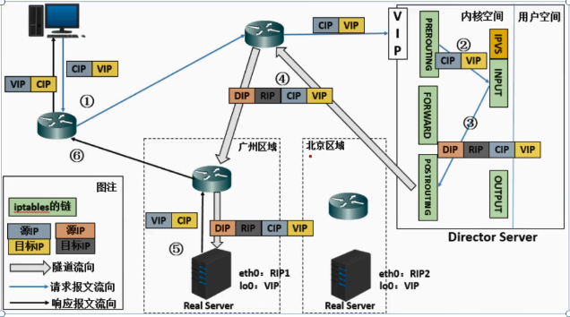

```python
(a)当用户请求到达Director server，此时请求的数据报文会先到内核空间的PREROUTING链，此时报文的源IP为CIP，日标IP为VIP

(b)PREROUTING检查发现数据包的目标IP显本机，将数据包送至INPUT链

(c)IPVS比对数据包请求的服务是否为集群服务，若是，在请求报文的首部再次封装一层IP报文，封装源IP为DIP，目标IP为RIP。然后发至POSTROUTING链。此时源IP为DIP，目标IP为RIP

(d)POSTROUTING销根据最新封装的IP报文，将数据包发至RS(因为在外层封装多了一层IP首部，所以可以理解为此时通过隧道传输)。此时源IP为DIP，日标IP为RIP

(e)RS接收到报文后发现是自己的IP地址，就将报文接收下来，拆除掉最外层的IP后，会发现里面还有一层IP首部,而日日标是自己的10接口VIP，那么此时RS开始处理此请求，处理完成之后，通过10接口送给ethe网卡，然后向外传递。此时的源IP地址为VIP，目标IP为CIP

(f)响应报文最终送达至客户端
```

## LVS-Tun 模型的特性

* RIP、VIP、DIP 全是公网地址
* RS 的网关不会也不可能指向 DIP，RS 处理完成之后直接返回结果给客户端
* 所有的请求报文经由 Director Server，但响应报文必须不能经过 Director Server
* 不支持端口映射 80=>80
* RS 的系统必须支持隧道

# 七、LVS 的十种调度算法

## Fixed Scheduling Method 静态调度

:::warning
**RR 轮询（常用）**

:::

调度器通过“轮叫”调度算法将外部请求按顺序轮流分配到集群中的真实服务器上，它均等地对待每一台服务器，而不管服务器上实际的连接数和系统负载。

web01 1 1

web02 1 1

```python
ipvsadm -A -t 192.168.126.200:80 -s rr
```

适合场景：每台 Web 服务器性能相当。

:::warning
**WRR 加权轮询（常用）=> weight**

:::

调度器通过"加权轮叫"调度算法根据真实服务器的不同处理能力来调度访问请求 。这样可以保证处理能力强的服务器处理更多的访问流量。调度器 可以自动问询真实服务器的负载情况，并动态地调整其权值。

web01 weight=8

web02 weight=2

```python
ipvsadm -A -t 192.168.126.200:80 -s wrr
ipvsadm -a -t 192.168.126.200:80 -r 192.168.126.174:80 -g -w 4
ipvsadm -a -t 192.168.126.200:80 -r 192.168.126.175:80 -g -w 1
```

适合场景：服务器性能不一，有的配置高一些，有的配置低一些。

:::warning
**DH 目标地址 hash => 应用场景 => 缓存服务器 => 提高缓存命中率（用的较少）**

:::

同一个服务地址（目标地址，是对目标资源做 hash 算法，不仅有 IP 还有资源路径）总是固定交给同一台后端服务器处理。

举个例子：假设你是一个仓库管理员，每天处理送往“同一个收件人地址”的包裹。你把所有寄往“北京市朝阳区”的包裹都放进1号货车，寄往“上海市浦东新区”的放进2号货车。不管今天谁来寄，只看“目标地址”，每次都进相同的车。

```python
ipvsadm -A -t 192.168.126.200:80 -s dh
```

:::warning
**SH 源地址 hash => 类似 ip\_hash => 解决 session 共享问题（基于算法、基于 NoSQL）**

:::

算法正好与目标地址散列调度算法相反，它根据请求的源IP地址，作为散列键(Hash Key)从静态分配的散列表找出对应的服务器，若该服务器是 可用的且未超载，将请求发送到该服务器，否则返回空。它采用的散列函数与目标地址散列调度算法的相同。除了将请求的目标IP地址换成请求的源IP地址外，它的算法流程与目标地址散列调度算法的基本相似。在实际应用中，源地址散列调度和目标地址散列调度可以结合使用在防火墙集群中，它们可以保证整个系统的唯一出入口。

客户端 IP 为 192.168.126.201 => web01，下次这个 IP 再发送请求，依然会转发到 web01

客户端 IP 为 192.168.126.202 => web02，下次这个 IP 再发送请求，依然会转发到 web02

```python
ipvsadm -A -t 192.168.126.200:80 -s sh
```

## Dynamic Scheduling Method 动态调度

动态调度算法除了参考算法本身之外，还需要考虑后端服务器的性能。

LC 算法会跟踪每个后端服务器的活跃连接数(active connections)，并将新连接分配给活跃连接数最少的服务器。活跃连接数是指当前正在处理的连接数量，通常由 LVS 的连接表维护。

:::warning
**LC 最少连接（常用）**

:::

调度器通过”最少连接"调度算法动态地将网络请求调度到已建立的链接数最少的服务器上。如果集群系统的真实服务器具有相近的系统性能，采用"最小连接"调度算法可以较好地均衡负载。

核心：只考虑每台服务器的活跃连接数，选择活跃连接数最少的服务器分配新连接。不考虑服务器性能差异(权重默认相等或不使用权重)。

假设有一个 LVS 负载均衡器，管理3台后端服务器，处理客户端的 HTTP 请求：

* 服务器 A： 高性能，权重=4
* 服务器 B： 中等性能，权重=2
* 服务器 C：低性能，权重=1

当前活跃连接数如下：

* 服务器 A：10个活跃连接
* 服务器 B：8个活跃连接
* 服务器 C：5个活跃连接

LC 不考虑权重，直接比较活跃连接数，选择最小的服务器。

* 活跃连接数最少的是服务器C(5个连接)
* 因此，新连接分配给服务器C。
* 分配后，服务器C的活跃连接数变为5+1=6。

问题：LC 没有考虑服务器性能差异。服务器C虽然连接数最少，但权重只有1(低性能)，可能无法高效处理更多连接，而服务器A(高性能，权重=4)可能仍有余力。

```python
ipvsadm -A -t 192.168.126.200:80 -s lc
```

:::warning
**WLC 加权最少连接（常用）**

:::

在 LC 的基础上引入权重，通过计算归一化连接数（活跃连接数/权重），选择归一化连接数最小的服务器。权重反应服务器的处理能力，高权重的服务器能处理更多连接。

计算公式：

```python
归一化连接数 = 活跃连接数 / 权重
```

如果权重为0，服务器被视为不可用，跳过分配。比较所有服务器的归一化连接数,选择值最小的服务器。

如果有多台服务器的归一化连接数相等，可以随机选择或根据其他规则(如服务器ID顺序)决定。

举个例子：

假设有3台后端服务器：

* 服务器A：活跃连接数=10，权重=4
* 服务器B：活跃连接数=8，权重=2
* 服务器C：活跃连接数=5，权重=1

计算归一化连接数：

* 服务器A：10/4=2.5
* 服务器B：8/2=4.0
* 服务器C：5/1=5.0

结果：服务器 A 的归一化连接数最小（2.5），新连接分配给服务器 A。

```python
ipvsadm -A -t 192.168.126.200:80 -s wlc
ipvsadm -a -t 192.168.126.200:80 -r 192.168.126.174:80 -g -w 8
ipvsadm -a -t 192.168.126.200:80 -r 192.168.126.175:80 -g -w 2
```

:::warning
**SED 最少期望延迟 => 特殊的 WLC 算法**

:::

SED 算法假设连接的处理时间与服务器的当前负载和处理能力有关。它通过计算每个服务器的期望延迟(基于活跃连接数和权重)，将新连接分配给预计处理最快的服务器。核心思想是：高性能服务器(高权重)可以处理更多连接，因此可能有更短的延迟。

SED算法通过以下公式估算每台服务器的期望延迟

```python
期望延迟 = （活跃连接数 +　1）/ 权重

这里的“+1”表示假设新连接分配到该服务器后的连接数。权重越大，期望延迟越小，反映高性能服务器能更快处理连接。作用：更精确地估算服务器处理新连接的能力，优先选择能更快响应的服务器，而不是仅看当前负载。
```

比较所有服务器的期望延迟，选择值最小的服务器

如果多台服务器的期望廷迟相等，可以随机选择或按其他次要规则(如服务器ID顺序)决定。

举个例子：

假设有 3 台后端服务器，当前状态如下：

* 服务器A：活跃连接数=10，权重=4
* 服务器B：活跃连接数=8，权重=2
* 服务器C：活跃连接数=5，权重=1

期望延迟 = (活跃连接数 + 1) / 权重

* 服务器 A：(10 + 1) / 4 = 11 / 4 = 2.75
* 服务器 B：(8 + 1) / 2 = 9 / 2 = 4.5
* 服务器 C：(5 + 1) / 1 = 6 / 1 = 6.0

结果：选择服务器 A（期望延迟 2.75 最小）

```python
ipvsadm -A -t 192.168.126.200:80 -s sed
```

:::warning
**NQ 永不排队**

:::

优先分配空闲服务器，避免 SED 的复杂计算。

将新连接优先分配给没有活跃连接的服务器（即活跃连接数为 0 的服务器），避免请求排队。

* 如果存在空闲服务器(活跃连接数=0)，直接分配给该服务器。
* 如果没有空闲服务器，则退化为 Round Robin(RR，轮询)算法，按顺序分配。
* 不考虑权重或复杂计算(如 WLC 的归一化连接数或 SED 的期望延迟)

适用场景：适合轻负载场景或希望快速分配到空闲服务器的系统，减少延迟。

举个例子：

优先选择活跃连接数 = 0 的服务器；否则用 RR。

* A：10，B：8，C：5（无空闲服务器，活跃连接数均 > 0）
* 退化为 RR：假设上次分配给了服务器 B，下一个按顺序分配给服务器 C（或按 RR 循环）

```python
ipvsadm -A -t 192.168.126.200:80 -s nq
```

:::warning
**LBLC 基于本地的最少连接 => 针对缓存服务器**

:::

将来自同一客户端(或目标地址)的连接尽可能分配到同一台后端服务器(本地性)，同时在多个候选服务器中选择活跃连接数最少的服务器(最少连接)。

* 本地性：通过哈希(如基于客户端IP或目标IP)将相同来源的连接映射到同一服务器，减少缓存丢失(cachemiss)，提高缓存命中率。
* 最少连接：在满足本地性条件的候选服务器中，选择活跃连接数最少的服务器。
* 适用于有状态服务(如需要缓存的应用，例如 Web 服务或数据库查询)。

适用场景：适合需要缓存一致性(如 Web 缓存、数据库查询)且服务器性能相近的场景。

举个例子：

* 假设哈希(192.168.1.100)映射到候选子集{A，B}
* 比较 A 和 B 的活跃连接数：
  * A：10
  * B：8
* 选择活跃连接数最少的服务器：服务器 B（8 < 10）

结果：分配给服务器 B

特点：

* 优先本地性（同一客户端倾向于同一服务器）
* 在候选服务器中选择连接数最少的，类似 LC 但受哈希约束

```python
ipvsadm -A -t 192.168.126.200:80 -s lblc
```

:::warning
**LBLCR 带复制的基于本地的最少连接 => 针对缓存服务器**

:::

本地性：通过哈希（如基于目标 IP）将同一目标（destination IP）的请求映射到一组服务器（server set），提高缓存命中率。

最少连接：在目标的服务器组中，选择活跃连接数最少的服务器

动态复制：当服务器组过载时，添加新的低负载服务器；当负载降低时，移除一部分负载服务器，控制复制程度。

特点：

* 维护一个从目标 IP 到服务器组的映射(ServerSet\[dest\_ip])，例如{A,B}。
* 当目标(如热门网站)请求激增，动态扩展服务器组，添加低负载服务器。
* 定期检查服务器组，若长时间未修改，移除最忙服务器，避免过度复制。

适用场景：缓存集群（如 web 缓存），需要高缓存命中率，同时应对热门目标的动态负载。

举个例子：

假设 LVS 管理一个 web 缓存集群，有 3 台后端服务器：

* 服务器状态：
  * 服务器 A：活跃连接数 = 10，权重 = 4
  * 服务器 B：活跃连接数 = 8，权重 = 2
  * 服务器 C：活跃连接数 = 0，权重 = 3（空闲）
* 目标 IP：192.168.1.100（例如，客户端请求访问某个热门网站）
* 哈希映射：假设 hash（192.168.1.100） => ServerSet\[192.168.1.100] = {A, B}（初始服务器组）
* 过载阈值：假设服务器活跃连接数超过权重视为过载（例如，A：10 > 4，B：8 > 2）
* 清理时间：假设服务器组未修改超过时间 T = 60 秒，移除最忙服务器

由于{A，B}过载，LBLCR 从全局服务器{A，B，C}中选择活跃连接数最少的服务器。

全局比较：

* A：10 个连接
* B：8 个连接
* C：0 个连接

选择服务器 C（0 个连接最少）。

将服务器 C 添加到 ServerSet\[192.168.1.100] = {A, B, C}。

更新服务器组的最后修改时间：ServerSet\[192.168.1.100].lastmod = Now。

```python
ipvsadm -A -t 192.168.126.200:80 -s lblcr
```


> 更新: 2026-05-28 15:13:05  
> 原文: <https://www.yuque.com/u41736172/az9urv/rc3t265ct2irqbpu>