# 09.Redis缓存架构设计

# 学习目标

* 能够描述 Redis 作用及其业务适用场景
* 能够安装配置启动 Redis
* 能够使用命合行客户端简单操作 Redis
* 能够实现操作基本数据类型
* 能够理解描述 Redis 数据持久化机制
* 能够操作安装 php 的 redis 扩展
* 能够操作实现 Redis7 主从模式(Redis 新版集群以及哨兵模式)

# <font style="color:rgb(51, 51, 51);">一、背景描述及其方案设计</font>

## <font style="color:rgb(51, 51, 51);">业务背景描述</font>

<font style="color:rgb(51, 51, 51);">时间：2021.9.-2022.6</font>

<font style="color:rgb(51, 51, 51);">发布产品类型：互联网动态站点 商城</font>

<font style="color:rgb(51, 51, 51);">用户数量： 25000（用户量猛增）</font>

<font style="color:rgb(51, 51, 51);">PV ： 1000000-5000000（24小时访问次数总和）</font>

<font style="color:rgb(51, 51, 51);">DAU： 12000（每日活跃用户数）</font>

## <font style="color:rgb(51, 51, 51);">模拟运维设计方案</font>

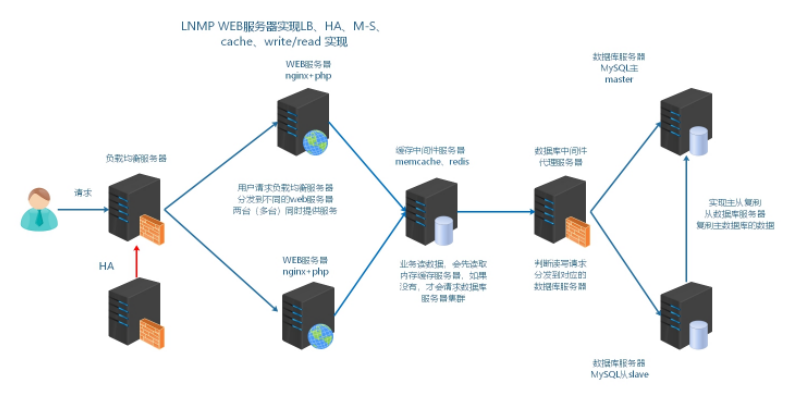

<font style="color:rgb(51, 51, 51);">根据以上业务需求，准备加入 Redis 缓存中间件服务器，可以使用到 redis 更加丰富的功能</font>

<font style="color:rgb(51, 51, 51);">在商城业务中实现：</font>

<font style="color:rgb(51, 51, 51);">① 主从、哨兵、集群</font>

<font style="color:rgb(51, 51, 51);">② session 存储到 redis</font>

<font style="color:rgb(51, 51, 51);">③ 防刷、防攻击平台开发：openresty（nginx+lua）动态限制 IP 访问 waf（web application firewalld）</font>

# <font style="color:rgb(51, 51, 51);">二、Redis 概述</font>

## <font style="color:rgb(51, 51, 51);">什么是 Redis</font>


<font style="color:rgb(51, 51, 51);">Nosql 非关系数据库 key => value 键值对</font>

<font style="color:rgb(51, 51, 51);">Redis 是 </font>**<font style="color:rgb(51, 51, 51);">R</font>**<font style="color:rgb(51, 51, 51);">emote </font>**<font style="color:rgb(51, 51, 51);">D</font>**<font style="color:rgb(51, 51, 51);">ictionary </font>**<font style="color:rgb(51, 51, 51);">S</font>**<font style="color:rgb(51, 51, 51);">erver (远程数据服务)的缩写</font>

<font style="color:rgb(51, 51, 51);">由意大利人 antirez(Salvatore Sanfilippo 萨尔瓦托桑菲利波) 开发的一款 内存高速缓存数据库</font>

<font style="color:rgb(51, 51, 51);">该软件使用 C 语言编写，它的数据模型为 key-value</font>

<font style="color:rgb(51, 51, 51);">它支持丰富的数据结构，比如 </font>**<font style="color:rgb(51, 51, 51);">string list（双向链表） hash（哈希） set（集合） sorted set（zset 有序集合）</font>**

<font style="color:rgb(51, 51, 51);">可持久化（保存数据到磁盘中），保证了数据安全</font>

## <font style="color:rgb(51, 51, 51);">业务使用场合</font>

**<font style="color:rgb(51, 51, 51);">① \[Sorted Set] </font>**<font style="color:rgb(51, 51, 51);">排行榜应用，取 top n 操作，例如 sina 微博热门话题（取最热的前10个话题）</font>

**<font style="color:rgb(51, 51, 51);">② \[List] </font>**<font style="color:rgb(51, 51, 51);">获得最新N个数据 或 某个分类的最新数据</font>

**<font style="color:rgb(51, 51, 51);">③ \[String] </font>**<font style="color:rgb(51, 51, 51);">计数器应用</font>

**<font style="color:rgb(51, 51, 51);">④ \[Set] </font>**<font style="color:rgb(51, 51, 51);">sns(social network site)获得共同好友</font>

**<font style="color:rgb(51, 51, 51);">⑤ \[Set] </font>**<font style="color:rgb(51, 51, 51);">防攻击系统(ip 判断)黑白名单等等</font>

# <font style="color:rgb(51, 51, 51);">三、安装与配置Redis</font>

<font style="color:rgb(51, 51, 51);">官方网址：</font>[<font style="color:rgb(65, 131, 196);">https://redis.io/</font>](https://redis.io/)

<font style="color:rgb(51, 51, 51);">github: </font>[<font style="color:rgb(65, 131, 196);">https://github.com/antirez/redis</font>](https://github.com/antirez/redis)

<font style="color:rgb(65, 131, 196);"></font>

<font style="color:rgb(65, 131, 196);">redis-xxxx.tar.gz</font>

<font style="color:rgb(65, 131, 196);">redis-xxx.rpm</font>

<font style="color:rgb(65, 131, 196);">可以使用 yum 命令仅下载软件，不安装</font>

```properties
yum -y install 软件包名 --downloadonly

默认会将软件下载到 /var/cache/yum/xxx
```

## 环境准备

<font style="color:rgb(51, 51, 51);">准备 Redis 服务器，更改 Mac 地址，更改 IP 以及主机名称，在 hosts 绑定 IP 与主机，时间同步，安装必备软件。</font>

<font style="color:rgb(51, 51, 51);">第一步：克隆一台最小化安装的服务器</font>

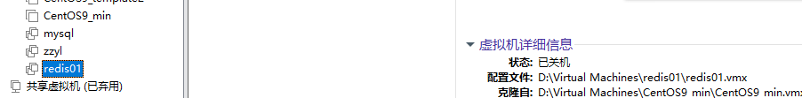

第二步：修改 MAC 地址

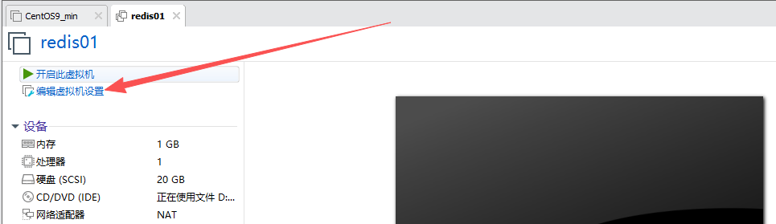

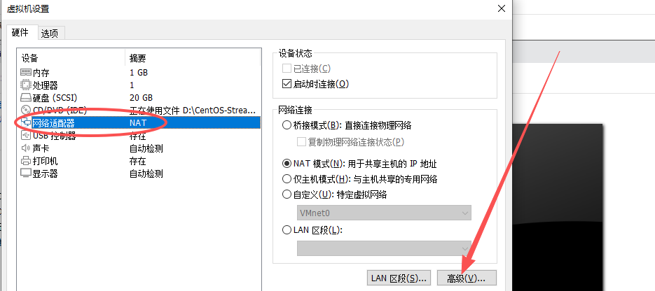

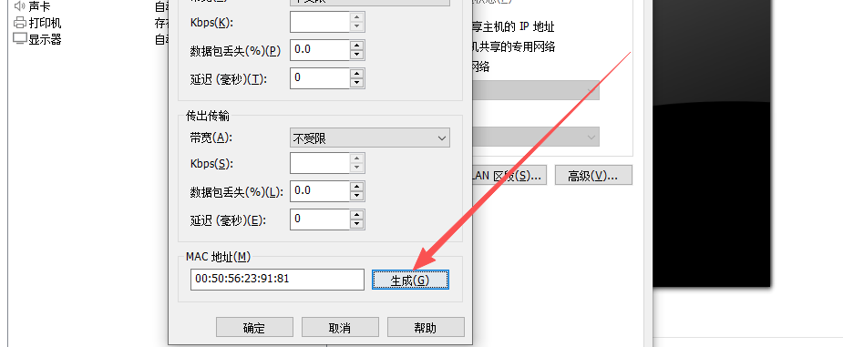

第三步：修改其他信息

```python
# vim /etc/NetworkManager/system-connections/ens33.nmconnection
address1=192.168.126.201/24

# nmcli connection reload
# nmcli connection up ens33

# hostnamectl set-hostname redis01.lhp.cn
# su

# vim /etc/hosts
127.0.0.1   localhost localhost.localdomain localhost4 localhost4.localdomain4
::1         localhost localhost.localdomain localhost6 localhost6.localdomain6
192.168.126.201 redis01 redis01.lhp.cn
```

## <font style="color:rgb(51, 51, 51);">安装方式</font>

<font style="color:rgb(51, 51, 51);">可以通过 yum 方式在线安装，也可以通过源码编译方式安装</font>

<font style="color:rgb(51, 51, 51);">这里，采用源码编译方式安装：</font>

```python
第一步：找到对应的安装包资源，使用wget命令下载，这里安装的7.4.0版本。
安装包资源地址：https://download.redis.io/releases/

第二步：上传Redis到Linux系统中

wget https://download.redis.io/releases/redis-7.4.0.tar.gz

也可以使用资料中提供的安装包。

第二步：配置=>编译=>安装
tar -zxvf redis-7.4.0.tar.gz
cd redis-7.4.0
make
make PREFIX=/usr/local/redis install
```

<font style="color:rgb(51, 51, 51);"> 安装成功后，Redis 的可执行文件将被安装到 </font><code><font style="color:rgb(51, 51, 51);background-color:rgb(243, 244, 244);">/usr/local/redis</font></code>

## <font style="color:rgb(51, 51, 51);">修改配置</font>

```shell
# mkdir -p /usr/local/redis/conf
# cd /root/redis-7.4.0
# cp redis.conf /usr/local/redis/conf/

# 修改配置
# vim /usr/local/redis/conf/redis.conf
88行： bind 127.0.0.1 -::1  --> bind 0.0.0.0
310行：daemonize no  --> daemonize yes

# 添加redis到环境变量
# vim /etc/profile
export PATH="$PATH:/usr/local/redis/bin"
# source /etc/profile

# 过量使用内存设置为0！在低内存环境下，后台保存可能失败
# vim /etc/sysctl.conf
vm.overcommit_memory = 1
# sysctl -p

说明：
vm.overcommit_memory
这个参数是 Linux 系统在分配内存时的一种策略控制，直接关系到 Redis 这样的应用能不能顺利启动、正常运行。
默认值为0：系统会根据当前内存使用情况、总内存和交换空间的比例，"评估"是否允许分配内存。如果它“觉得”你分配太多内存了，就拒绝了，哪怕物理内存其实还够，Redis 启动时会尝试中请大量内存，比如它的最大内存限制值(maxmemory)，即使暂时还没用到。这时 Linux 系统”评估"你内存不够，就会阻止 Redis 启动，报错。

参数值设为1：系统不管三七二十一，你说要分配内存，它就答应。哪怕内存其实根本不够，它也会先允许你申请下来。如果设置为 1，系统允许进程分配“看起来够但实际上不够”的内存。如果很多程序都这么做，等真正用内存时可能会爆掉系统(内存溢出或00M)，但 Redis 一般是你可控的服务，设置maxmemory限制总量就没事.
Redis 推荐设置 vm.overcommit_memory = 1，就是为了避免系统“瞎担心内存不够”导致 Redis 启动失败。
```

配置文件最终结果：

```shell
# grep -Ev '#|^$' /usr/local/redis/conf/redis.conf
bind 0.0.0.0
protected-mode yes
port 6379
tcp-backlog 511
timeout 0
tcp-keepalive 300
daemonize yes
pidfile /var/run/redis_6379.pid
loglevel notice
logfile ""
databases 16
always-show-logo no
set-proc-title yes
proc-title-template "{title} {listen-addr} {server-mode}"
locale-collate ""
stop-writes-on-bgsave-error yes
rdbcompression yes
rdbchecksum yes
dbfilename dump.rdb
rdb-del-sync-files no
dir ./
replica-serve-stale-data yes
replica-read-only yes
repl-diskless-sync yes
repl-diskless-sync-delay 5
repl-diskless-sync-max-replicas 0
repl-diskless-load disabled
repl-disable-tcp-nodelay no
replica-priority 100
acllog-max-len 128
lazyfree-lazy-eviction no
lazyfree-lazy-expire no
lazyfree-lazy-server-del no
replica-lazy-flush no
lazyfree-lazy-user-del no
lazyfree-lazy-user-flush no
oom-score-adj no
oom-score-adj-values 0 200 800
disable-thp yes
appendonly no
appendfilename "appendonly.aof"
appenddirname "appendonlydir"
appendfsync everysec
no-appendfsync-on-rewrite no
auto-aof-rewrite-percentage 100
auto-aof-rewrite-min-size 64mb
aof-load-truncated yes
aof-use-rdb-preamble yes
aof-timestamp-enabled no

slowlog-log-slower-than 10000
slowlog-max-len 128
latency-monitor-threshold 0
notify-keyspace-events ""
hash-max-listpack-entries 512
hash-max-listpack-value 64
list-max-listpack-size -2
list-compress-depth 0
set-max-intset-entries 512
set-max-listpack-entries 128
set-max-listpack-value 64
zset-max-listpack-entries 128
zset-max-listpack-value 64
hll-sparse-max-bytes 3000
stream-node-max-bytes 4096
stream-node-max-entries 100
activerehashing yes
client-output-buffer-limit normal 0 0 0
client-output-buffer-limit replica 256mb 64mb 60
client-output-buffer-limit pubsub 32mb 8mb 60
hz 10
dynamic-hz yes
aof-rewrite-incremental-fsync yes
rdb-save-incremental-fsync yes
jemalloc-bg-thread yes
```

## <font style="color:rgb(51, 51, 51);">启动Redis</font>

<font style="color:rgb(51, 51, 51);">手工实现服务验证</font>

```shell
# 查看版本
# redis-cli -v

# 启动redis
# redis-server /usr/local/redis/conf/redis.conf

# 查看服务进程
# ps -ef | grep redis
```

<font style="color:rgb(51, 51, 51);">封装 redis.service 脚本</font>

```shell
# vim /etc/systemd/system/redis.service
[Unit]
Description=redis-server
After=network.target
 
[Service]
Type=forking
ExecStart=/usr/local/redis/bin/redis-server /usr/local/redis/conf/redis.conf
PrivateTmp=true
 
[Install]
WantedBy=multi-user.target

配置完成以后，就可以通过systemctl命令启动redis
# systemctl start redis
```

## <font style="color:rgb(51, 51, 51);">6379 端口</font>


<font style="color:rgb(51, 51, 51);">Alessia Merz（阿莱西亚-梅尔兹）</font>

```shell
# netstat -tnlp
Active Internet connections (only servers)
Proto Recv-Q Send-Q Local Address           Foreign Address         State       PID/Program name
tcp        0      0 0.0.0.0:22              0.0.0.0:*               LISTEN      836/sshd: /usr/sbin
tcp        0      0 0.0.0.0:6379            0.0.0.0:*               LISTEN      6784/redis-server 0
tcp6       0      0 :::21                   :::*                    LISTEN      873/vsftpd
tcp6       0      0 :::22                   :::*                    LISTEN      836/sshd: /usr/sbin
```

## <font style="color:rgb(51, 51, 51);">命令行客户端简单使用</font>

<font style="color:rgb(51, 51, 51);">redis 属于 c/s 架构软件，telnet 可以连接 redis，没有本身 redis-cli 更加好用。</font>

**<font style="color:rgb(51, 51, 51);">① 简单的数据操作</font>**

<font style="color:rgb(51, 51, 51);">string 类型：字符串类型、文本类型，用于保存文本信息</font>

```shell
# redis-cli
127.0.0.1:6379> set name devops
OK
127.0.0.1:6379> get name
"devops"
```

**<font style="color:rgb(51, 51, 51);">② 查看操作语法帮助</font>**

```shell
127.0.0.1:6379> help
127.0.0.1:6379> help set
```

**<font style="color:rgb(51, 51, 51);">③ 系统状态信息</font>**

```shell
127.0.0.1:6379> info 
```

**<font style="color:rgb(51, 51, 51);">④ 退出redis</font>**

```shell
127.0.0.1:6379> quit 
```

# <font style="color:rgb(51, 51, 51);">四、数据结构类型操作</font>

## <font style="color:rgb(51, 51, 51);">key（键名）</font>

<font style="color:rgb(51, 51, 51);">内存：NoSQL 数据库，存储形式，键值对，类似身份证（不能重复，必须唯一）</font>

<font style="color:rgb(51, 51, 51);">key 的命名规则不同于一般语言，键盘上除了空格、\n 换行符外其他的大部分字符都可以使用。</font>

<font style="color:rgb(51, 51, 51);">但是像"my key"和"mykey\n"这样包含空格和换行的 key 是不允许的。</font>

<font style="color:rgb(51, 51, 51);">我们在使用的时候可以自己定义一个key的格式，但是要特别注意：</font>

<font style="color:rgb(51, 51, 51);">key 不要太长。占内存，查询慢。</font>

<font style="color:rgb(51, 51, 51);">key 不要太短。像 u:1000:pwd:123456 就不如 user:1000:password:123456 可读性好</font>

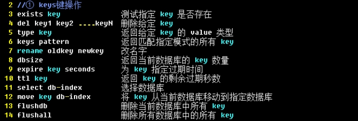

<font style="color:rgb(51, 51, 51);">默认在 redis 配置文件 redis.conf 中，提供了 16 库，查看配置文件：</font>

```shell
# databases 16
# 数据库的编号都是从0开始，0-15，最大值为16-1
```

<font style="color:rgb(51, 51, 51);">☆ 判断 key 是否存在</font>

```shell
127.0.0.1:6379> exists key
存在1，不存在0
```

<font style="color:rgb(51, 51, 51);">☆ 删除 key</font>

```shell
127.0.0.1:6379> del key
```

<font style="color:rgb(51, 51, 51);">☆ 获取 type 类型</font>

```shell
127.0.0.1:6379> type key
```

<font style="color:rgb(51, 51, 51);">☆ 显示所有 key</font>

```shell
127.0.0.1:6379> keys *
```

<font style="color:rgb(51, 51, 51);">☆ 设置过期时间（单位 s）</font>

```shell
127.0.0.1:6379> expire name 8
```

<font style="color:rgb(51, 51, 51);">☆ 查看剩余时间</font>

```shell
127.0.0.1:6379> ttl name
```

<font style="color:rgb(51, 51, 51);">☆ 查看当前库 key 数量</font>

```shell
127.0.0.1:6379> dbsize
```

<font style="color:rgb(51, 51, 51);">☆ 切换数据库（共16个库，index = number -1）</font>

```shell
127.0.0.1:6379> select 0-15
```

<font style="color:rgb(51, 51, 51);">☆ flushdb 清空当前库（删除所有 key，慎重！！！）</font>

```shell
127.0.0.1:6379> flushdb
```

<font style="color:rgb(51, 51, 51);">☆ 清空所有库（删除所有数据库的所有 key，慎重！！！）</font>

```shell
127.0.0.1:6379> flushall
```

## <font style="color:rgb(51, 51, 51);">string</font>

<font style="color:rgb(51, 51, 51);">string 是 redis 最基本的类型</font>

<font style="color:rgb(51, 51, 51);">redis 的 string 可以包含任何数据。包括 jpg 图片 base64 或者序列化的对象</font>

<font style="color:rgb(51, 51, 51);">单个 value 值最大上限是 512MB</font>

<font style="color:rgb(51, 51, 51);">如果只用 string 类型，redis 就可以被看作加上持久化特性的 memcached</font>

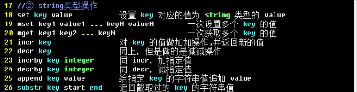

<font style="color:rgb(51, 51, 51);">☆ 设置 string</font>

```shell
127.0.0.1:6379> set name zhangsan
```

<font style="color:rgb(51, 51, 51);">☆ 批量设置 string</font>

```shell
127.0.0.1:6379> mset name lisi age 18 address beijing
```

<font style="color:rgb(51, 51, 51);">☆ 批量获取</font>

```shell
127.0.0.1:6379> mget name age address
```

<font style="color:rgb(51, 51, 51);">☆ 增加与减少（+1与-1）=> 计数器（防 DDos 攻击）</font>

```shell
127.0.0.1:6379> incr age
127.0.0.1:6379> decr age

127.0.0.1:6379> incrby age 2
127.0.0.1:6379> decrby age 3

increment 增加
decrement 减少
```

<font style="color:rgb(51, 51, 51);">☆ 追加</font>

```shell
127.0.0.1:6379> append name 123
```

<font style="color:rgb(51, 51, 51);">☆ 截取</font>

```shell
127.0.0.1:6379> substr name start end

start：从哪里开始截取，默认从0第一个字符开始
end  ：到哪里截取结束，必须要添加结束字符的索引号


sub  string
```

<font style="color:rgb(51, 51, 51);">小结：</font>

<font style="color:rgb(51, 51, 51);">string 字符串类型是 redis 中最常用数据类型，其可以保存任何数据！！！</font>

<font style="color:rgb(51, 51, 51);">单个 value 值最大上限是 512MB</font>

## <font style="color:rgb(51, 51, 51);">list</font>

<font style="color:rgb(51, 51, 51);">key value(value1,value2,value3)</font>

<font style="color:rgb(51, 51, 51);">list 类型其实就是一个双向链表。通过 push，pop 操作从链表的头部或者尾部添加删除元素</font>

<font style="color:rgb(51, 51, 51);">这使得 list 既可以用作栈，也可以用作队列</font>

<font style="color:rgb(51, 51, 51);">同一端进出，先进后出，后进先出 ==> 栈</font>

<font style="color:rgb(51, 51, 51);">一端进，另外一端出，先进先出 ==> 队列</font>

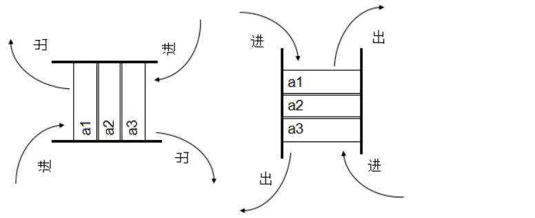

<font style="color:rgb(51, 51, 51);">首部（左 left） 尾部（右right）</font>

<font style="color:rgb(51, 51, 51);">需求：显示最近登录的几个用户，模拟队列</font>

<font style="color:rgb(51, 51, 51);">设计实现：</font>

<font style="color:rgb(51, 51, 51);">① 登录一个用户，把用户名称或者id存储在list中</font>

<font style="color:rgb(51, 51, 51);">② 从左侧取第一个元素</font>

<font style="color:rgb(51, 51, 51);">特点：同一端进，同一端出（大部分以左为主）</font>

<font style="color:rgb(51, 51, 51);">用户：xiaohua xiaoming xiaobaitu</font>

<font style="color:rgb(51, 51, 51);">key 名称：lastlogin</font>


<font style="color:rgb(51, 51, 51);">案例：获取最后登录的用户</font>

```shell
127.0.0.1:6379> lpush lastlogin xiaohua
127.0.0.1:6379> lpush lastlogin xiaoming
127.0.0.1:6379> lpush lastlogin xiaobaitu
```

<font style="color:rgb(51, 51, 51);">栈操作：获取最后登录的用户</font>

```shell
127.0.0.1:6379> lrange lastlogin 0 0
```

<font style="color:rgb(51, 51, 51);">小结：栈可以用于模拟获取最后登录用户</font>

<font style="color:rgb(51, 51, 51);">队列可以用于模拟秒杀功能实现 =>电商平台 =>秒杀(5个产品，打骨折价格)，100个用户报名，最终到底谁获取这个商品呢? </font>

<font style="color:rgb(51, 51, 51);">生产环境下，秒杀功能，都要结合 redis，秒杀开始时，把点击的用户放入 redis 里面，秒杀结束，从 redis 队列中取出前 5个用户 id，这就是秒杀功能实现 。</font>

## <font style="color:rgb(51, 51, 51);">set</font>

<font style="color:rgb(51, 51, 51);">作用：求交集、并集、差集！！！</font>

<font style="color:rgb(51, 51, 51);">redis 的 set 是 string 类型的无序集合。集合里不允许有重复的元素</font>

<font style="color:rgb(51, 51, 51);">set 元素最大可以包含(2的32次方-1)个元素。</font>

<font style="color:rgb(51, 51, 51);">关于 set 集合类型除了基本的添加删除操作，其他常用的操作还包含集合的取并集(union)，交集(intersection)，差集(difference)。通过这些操作可以很容易的实现 sns 中的好友推荐功能。</font>

<font style="color:rgb(51, 51, 51);">共同好友</font>

<font style="color:rgb(51, 51, 51);">好友推荐</font>

<font style="color:rgb(51, 51, 51);">TIP:MySQL连表文氏图</font>

[<font style="color:rgb(65, 131, 196);">https://www.cnblogs.com/sunjie9606/p/4167190.html</font>](https://www.cnblogs.com/sunjie9606/p/4167190.html)

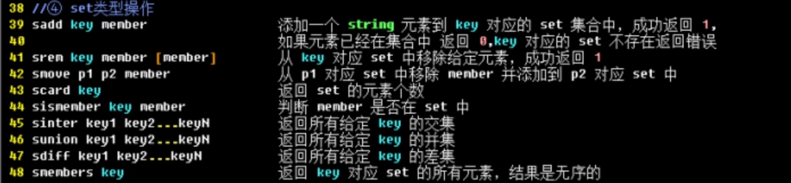

<font style="color:rgb(51, 51, 51);">案例1：实现朋友圈的存储和共同好友的计算</font>

<font style="color:rgb(51, 51, 51);">设计：</font>

<font style="color:rgb(51, 51, 51);">key value</font>

<font style="color:rgb(51, 51, 51);">xiaomingFR xiaohong xiaoqiang xiaogang xiaobai xiaohei</font>

<font style="color:rgb(51, 51, 51);">xiaohongFR xiaoming xiaolv xiaolan xiaobai xiaohei</font>

<font style="color:rgb(51, 51, 51);">第一步：使用sadd添加xiaomingFR与xiaohongFR</font>

```shell
127.0.0.1:6379> sadd xiaomingFR xiaohong xiaoqiang xiaogang xiaobai xiaohei
127.0.0.1:6379> sadd xiaohongFR xiaoming xiaolv xiaolan xiaobai xiaohei
```

<font style="color:rgb(51, 51, 51);">第二步：求交集(共同好友)</font>

```shell
127.0.0.1:6379> sinter xiaomingFR xiaohongFR
```

<font style="color:rgb(51, 51, 51);">第三步：求并集(所有好友)</font>

```shell
127.0.0.1:6379> sunion xiaomingFR xiaohongFR
```

<font style="color:rgb(51, 51, 51);">第四步：求差集(互相推荐好友)</font>

```shell
127.0.0.1:6379> sdiff xiaomingFR xiaohongFR
```

<font style="color:rgb(51, 51, 51);">案例2：使用 set 实现制作 ip 黑名单(白名单)</font>

```shell
127.0.0.1:6379> sadd ips 10.1.1.11 10.1.1.12
127.0.0.1:6379> sismember ips 10.1.1.11
127.0.0.1:6379> sismember ips 10.1.1.100
```

<font style="color:rgb(51, 51, 51);">小结：</font>

<font style="color:rgb(51, 51, 51);">set：无序且天生去重数据集合，理解为 string 类型的元素的集合</font>

<font style="color:rgb(51, 51, 51);">核心：求交集、并集、差集</font>

## <font style="color:rgb(51, 51, 51);">zset</font>

<font style="color:rgb(51, 51, 51);">和 set 一样，zset 也是 string 类型元素的集合 => 有序集合，元素不允许重复</font>

<font style="color:rgb(51, 51, 51);">不同的是每个元素都会关联一个权。</font>

<font style="color:rgb(51, 51, 51);">通过权值可以有序的获取集合中的元素，可以通过 score 值进行排序</font>

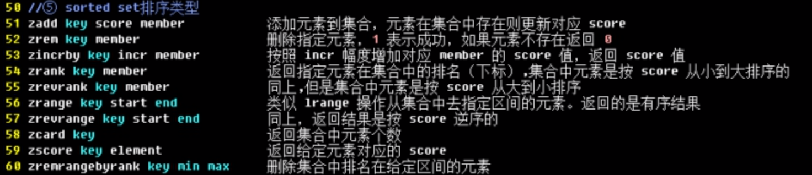

<font style="color:rgb(51, 51, 51);">需求：实现手机 APP 市场的软件排名</font>

<font style="color:rgb(51, 51, 51);">key : hotTop</font>

<font style="color:rgb(51, 51, 51);">id score name</font>

<font style="color:rgb(51, 51, 51);">1 2 qq</font>

<font style="color:rgb(51, 51, 51);">2 3 wechat</font>

<font style="color:rgb(51, 51, 51);">3 5 alipay</font>

<font style="color:rgb(51, 51, 51);">4 7 taobao</font>

<font style="color:rgb(51, 51, 51);">5 10 mi</font>

<font style="color:rgb(51, 51, 51);">6 8 jd</font>

<font style="color:rgb(51, 51, 51);">第一步：插入数据</font>

```shell
127.0.0.1:6379> zadd  hotTop  2 qq 3 wechat 5 alipay 7 taobao 10 mi 8 jd 
```

<font style="color:rgb(51, 51, 51);">第二步：排序，从小到大，qq => wechat => alipay => taobao => jd => mi</font>

```shell
127.0.0.1:6379> zrange hotTop 0 5
```

<font style="color:rgb(51, 51, 51);">第三步：排序，从大到小</font>

```shell
127.0.0.1:6379> zrevrange hotTop 0 5  			reverse 反转
```

<font style="color:rgb(51, 51, 51);">扩展：获取某个软件的score值</font>

```shell
127.0.0.1:6379> zscore hotTop  jd
127.0.0.1:6379> zscore hotTop  taobao
```

<font style="color:rgb(51, 51, 51);">扩展：更新某个软件的 score 值</font>

```shell
127.0.0.1:6379> zincrby hotTop -2 jd
127.0.0.1:6379> zrange hotTop 0 5
```

<font style="color:rgb(51, 51, 51);">小结：</font>

<font style="color:rgb(51, 51, 51);">和 set 一样，sorted set 也是集合的一种；不同点在于 sorted set 是有序集合，set 是无序集合。</font>

<font style="color:rgb(51, 51, 51);">Sorted set 集合类型要求每个元素都有一个权重值(分值)，依靠这个分值就可以实现排序等操作。</font>

## <font style="color:rgb(51, 51, 51);">hash（哈希）</font>

<font style="color:rgb(51, 51, 51);">作用：redis不仅可以做缓存，还可以做数据库。除了可以使用string，还可以使用hash结构，比string压缩效率和使用效率更高。</font>

<font style="color:rgb(51, 51, 51);">hash存储数据和关系型数据库（mysql），存储的一条数据的结构极为相似</font>

<font style="color:rgb(51, 51, 51);">key：value（field：value）</font>

<font style="color:rgb(51, 51, 51);">insert into table(id,name,sex,address) values (null,'王维','男',18,'北京市昌平区')</font>

<font style="color:rgb(51, 51, 51);">id:1</font>

<font style="color:rgb(51, 51, 51);">name:'王维'</font>

<font style="color:rgb(51, 51, 51);">sex:'男'</font>

<font style="color:rgb(51, 51, 51);">age:18</font>

<font style="color:rgb(51, 51, 51);">address:'北京市昌平区'</font>


<font style="color:rgb(51, 51, 51);">☆ 设置hash数据</font>

```shell
127.0.0.1:6379> hmset devops username zhangsan age 18 email zhangsan@qq.com
```

<font style="color:rgb(51, 51, 51);">☆ 获取的指定的field字段信息</font>

```shell
127.0.0.1:6379> hget devops username
```

```shell
127.0.0.1:6379> hmget devops username age email
```

<font style="color:rgb(51, 51, 51);">☆ 更新devops的age字段信息</font>

```shell
127.0.0.1:6379> hincrby devops age 1
```

<font style="color:rgb(51, 51, 51);">☆ 获取某个key的所有field信息</font>

```shell
127.0.0.1:6379> hkeys devops
```

<font style="color:rgb(51, 51, 51);">☆ 获取某个key的所有field的所有value信息</font>

```shell
127.0.0.1:6379> hvals devops
```

<font style="color:rgb(51, 51, 51);">☆ 删除指定的field字段</font>

```shell
127.0.0.1:6379> hdel devops age
```

<font style="color:rgb(51, 51, 51);">☆ 获取devops的key数量</font>

```shell
127.0.0.1:6379> hlen devops
```

<font style="color:rgb(51, 51, 51);">☆ 查询指定field是否存在</font>

```shell
127.0.0.1:6379> hexists devops name
```

<font style="color:rgb(51, 51, 51);">小结：redis既可以作为缓存使用，也可以作为NoSQL数据库使用</font>

<font style="color:rgb(51, 51, 51);">存储数据时，如果数据与数据之间关联度不太大 => string</font>

<font style="color:rgb(51, 51, 51);">存储数据时，如果数据与数据之间关联度还比较大=> hash</font>

<font style="color:rgb(51, 51, 51);">相对而言，hash拥有更高的压缩比！！！</font>

# <font style="color:rgb(51, 51, 51);">五、数据持久化操作（重点）</font>

<font style="color:rgb(51, 51, 51);">目标：能够说出什么是持久化？RDB 持久化和 AOF 持久化区别即可！</font>

## <font style="color:rgb(51, 51, 51);">什么是数据持久化</font>

<font style="color:rgb(51, 51, 51);">数据持久化（数据在服务或者软件重启之后不丢失）</font>

<font style="color:rgb(51, 51, 51);">如果数据只存在内存中，肯定会丢失，实现持久化，就需要把数据存储到磁盘中（hdd ssd）</font>

<font style="color:rgb(51, 51, 51);">Redis持久化：</font>[<font style="color:rgb(65, 131, 196);">https://redis.io/docs/latest/operate/oss\_and\_stack/management/persistence/</font>](https://redis.io/docs/latest/operate/oss_and_stack/management/persistence/)

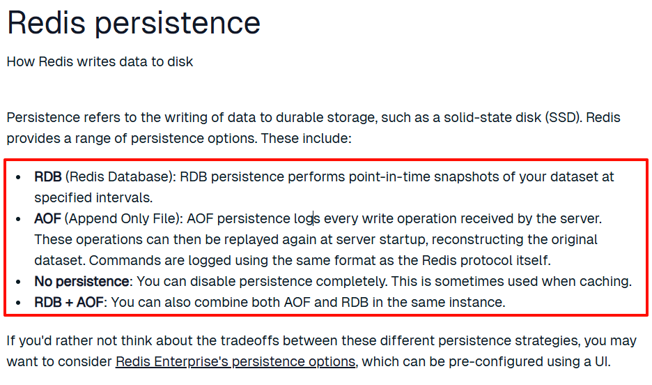

## <font style="color:rgb(51, 51, 51);">snappshoting(快照)=>RDB持久化</font>

<font style="color:rgb(51, 51, 51);">默认 snappshoting 是开启的，而且有一个"拍照"的频率</font>

### <font style="color:rgb(51, 51, 51);">RDB自动备份</font>

<font style="color:rgb(51, 51, 51);">前提：触发条件，只有满足触发条件，才会自动备份！</font>

<font style="color:rgb(51, 51, 51);">通过查看配置文件可以看到：</font>

```shell
老版本的redis
save 900 1					=>  15分钟内最少有1个key改变
save 300 100	     	=>  5分钟内最少有100个key改变
save 60	 10000			=>  1分钟内最少有10000个key改变

新版本的redis
save 900 1 300 100 60 10000
save 秒数 redis事务型操作（增删改）次数

暂时设置如下：
446行：save 10 2
```

<font style="color:rgb(51, 51, 51);">快照文件：</font>

```shell
在redis的配置文件中可以看到该配置，指定了RDB产生的快照文件名称：
dbfilename dump.rdb
```

<font style="color:rgb(51, 51, 51);">从 Redis6 版本开始，引入了一个 dir 参数 => 代表默认保存路径，之前版本默认安装路径 => /usr/local/redis</font>

```shell
dir ./相对路径，redis在哪里启动，默认就会保存dump.rdb文件到哪里？

# cd /usr/local/redis
# bin/redis-server conf/redis.conf
dump.rdb

127.0.0.1:6379> config get dir，可以查看默认保存路径
建议直接更改配置文件的第516行

dir /usr/local/redis/

修改完之后要重启redis
# systemctl restart redis
```

***

<font style="color:rgb(51, 51, 51);">文件名称并不是固定的，可以改变的，如dump\_port.rdb，设置完成后，一定要记得重启redis</font>

```shell
# pkill redis-server
# cd /usr/local/redis
# bin/redis-server config/redis.conf
127.0.0.1:6379> config get dir

# 表示立即保存数据（否则就需要等待满足上面触发redis保存的条件自动保存）
127.0.0.1:6379> bgsave
```

background save

<font style="color:rgb(51, 51, 51);">测试 RDB 持久化</font>

```shell
# cd /usr/local/redis
# vim conf/redis.conf
446行 save 10 2
517行 dir /usr/local/redis/

# systemctl restart redis
```

<font style="color:rgb(51, 51, 51);">在 10s 内，进行 2 个 key 的改变，查看备份效果：</font>

```shell
# redis-cli
127.0.0.1:6379> set num1 1
127.0.0.1:6379> set num2 2
接下来等待10s，等待生成RDB文件
-------------------------------------
127.0.0.1:6379> bgsave

上部分：自动触发RDB备份
下部分：bgsave相当于手动触发RDB备份
```

<font style="color:rgb(51, 51, 51);">测试结果：查看 dump.rdb 文件大小的变化</font>

> <font style="color:rgb(119, 119, 119);">RDB可能会遇到的一个缺点：必须要满足10s内有2个key发生改变才能拍照，如果10s只有1个key发生改变，RDB会更新么？如果11s的时候刚好Redis宕机，则丢失一小部分数据从上次拍照到当前时间的数据会丢失！</font>
>
> <font style="color:rgb(119, 119, 119);">非常小概率事件！！！</font>

### <font style="color:rgb(51, 51, 51);">手工快照备份</font>

```shell
127.0.0.1:6379> save或bgsave
```

<font style="color:rgb(51, 51, 51);">save：使用 </font><code><font style="color:rgb(51, 51, 51);background-color:rgb(243, 244, 244);">save</font></code><font style="color:rgb(51, 51, 51);"> 的时候，在主程序中执行会 </font>**<font style="color:rgb(51, 51, 51);">阻塞</font>**<font style="color:rgb(51, 51, 51);"> 当前 </font><code><font style="color:rgb(51, 51, 51);background-color:rgb(243, 244, 244);">Redis</font></code><font style="color:rgb(51, 51, 51);"> 服务器，直到持久化工作完成。执行 </font><code><font style="color:rgb(51, 51, 51);background-color:rgb(243, 244, 244);">save</font></code><font style="color:rgb(51, 51, 51);"> 命令期间， </font><code><font style="color:rgb(51, 51, 51);background-color:rgb(243, 244, 244);">Redis</font></code><font style="color:rgb(51, 51, 51);"> 不能处理其他命令，</font>**<font style="color:rgb(51, 51, 51);">线上禁止使用</font>**<font style="color:rgb(51, 51, 51);">。否则，你是自己走，还是送你走。严重一点，可以吃上国家饭了。</font>


<font style="color:rgb(51, 51, 51);">bgsave：</font><code><font style="color:rgb(51, 51, 51);background-color:rgb(243, 244, 244);">Redis</font></code><font style="color:rgb(51, 51, 51);"> 会在后台异步对所有数据进行快照操作， </font>**<font style="color:rgb(51, 51, 51);">不阻塞</font>**<font style="color:rgb(51, 51, 51);"> 快照同时还可以响应客户端请求。该触发方式会 </font><code><font style="color:rgb(51, 51, 51);background-color:rgb(243, 244, 244);">fork</font></code><font style="color:rgb(51, 51, 51);"> 一个子进程，由子进程复制持久化过程。这个操作是子进程在后台完成的，这就允许父进程同时还可以修改数据。</font>

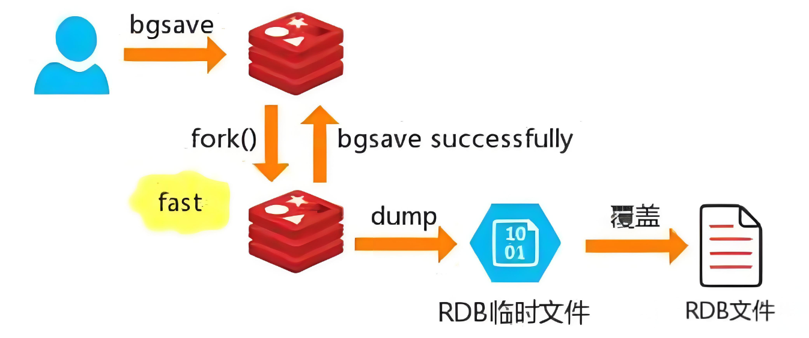

### <font style="color:rgb(51, 51, 51);">扩展：lastsave</font>

```shell
127.0.0.1:6379> lastsave
```

<font style="color:rgb(51, 51, 51);">可以通过 lastsave 命令获取最后一次成功的执行快照时间。</font>

<font style="color:rgb(51, 51, 51);">运行效果：</font>

```shell
127.0.0.1:6379> lastsave
(integer) 1765267482
```

<font style="color:rgb(51, 51, 51);">获取一个看不懂的时间戳，需要转换一下</font>

```shell
# date -d @[redis内获取的时间戳]
```

<font style="color:rgb(51, 51, 51);">案例：</font>

```shell
# date -d @1765267482
2025年 12月 09日 星期二 16:04:42 CST
```

### <font style="color:rgb(51, 51, 51);">RDB优劣势</font>

**<font style="color:rgb(51, 51, 51);">优点：</font>**

<font style="color:rgb(51, 51, 51);">RDB 是 Redis 数据的一个非常紧凑的单文件时间点表示。RDB 文件非常适合备份。例如，您可能想要对最近 24 小时内的 RDB 文件进行每小时存档，并保存30天内每天的RDB快照。这允许您在发生灾难时轻松地恢复数据集的不同版本。</font>

<font style="color:rgb(51, 51, 51);">a) 适合大规模数据恢复</font>

<font style="color:rgb(51, 51, 51);">b) 按照业务定时备份</font>

<font style="color:rgb(51, 51, 51);">c) 对数据的完整性和一致性要求不高</font>

<font style="color:rgb(51, 51, 51);">d) RDB 文件在内存中加载速度要比 AOF 快很多。</font>

**<font style="color:rgb(51, 51, 51);">缺点：</font>**

<font style="color:rgb(51, 51, 51);">a) 需要在一定间隔时间做一次备份，所以如果 Redis 意外 down 掉的话，就会丢失从当前至最近一次快照期间，还未来得及保存的数据。丢失最新数据的准备。</font>

<font style="color:rgb(51, 51, 51);">b) 内存数据的全量同步，如果数据量太大会导致I/O严重影响服务器性能。例如：1天修改1000次，同步一下数据。同步一次，数据量会太大。</font>

<font style="color:rgb(51, 51, 51);">c) 为了使用子进程持久化到磁盘上，RDB 经常需要 fork()。如果数据集很大，fork() 可能很耗时，如果数据集很大，CPU 性能不太好，可能会导致 Redis 停止为客户端服务几毫秒甚至一秒钟。AOF 也需要fork()，但不太频繁，你可以调整重写日志的频率，而无需权衡持久性。</font>

### <font style="color:rgb(51, 51, 51);">修复dump.rdb文件</font>

说明：正常情况下，使用 RDB 方式进行数据备份后，会放在我们之前在配置文件中指定的位置，名字为 xxx.dump。之后停掉 redis，当我们再次启动 redis 的时候，redis 就会根据配置文件中配置的 xxx.dump 的路径去找 xxx.dump 文件进行数据的恢复！

但是，有时候，我们将 redis 的备份文件 dump.rdb 从指定的位置移动到另一个位置，然后再移动回来，可能通过该备份文件就恢复不了数据了，这个备份文件就被损坏了！

**怎样修复 dump.rdb 文件？**

```shell
# redis-check-rdb [dump.rdb文件名称]
```

修复完 dump.rdb 文件后，将文件移动到配置文件指定的备份路径，然后启动 redis，看是否恢复成功！

### <font style="color:rgb(51, 51, 51);">哪些情况可以触发RDB快照</font>

<font style="color:rgb(51, 51, 51);">a) 配置文件默认的快照配置</font><code><font style="color:rgb(51, 51, 51);background-color:rgb(243, 244, 244);">save 900 1 300 100 60 10000</font></code>

<font style="color:rgb(51, 51, 51);">b) 手动 save/bgsave 命令，推荐使用 bgsave</font>

<font style="color:rgb(51, 51, 51);">c) 执行 </font><code><font style="color:rgb(51, 51, 51);background-color:rgb(243, 244, 244);">flushall</font></code><font style="color:rgb(51, 51, 51);"> 清空数据库并执行持久化操作。会生成一个空的 rdb 文件，无意义。</font>

<font style="color:rgb(51, 51, 51);">d) 执行 shutdown 且没有设置开启 AOF 持久化。</font>

<font style="color:rgb(51, 51, 51);">e) 主从复制中，从节点执行全量复制时，主节点会自动执行 bgsave 生成 RDB 文件。</font>

### <font style="color:rgb(51, 51, 51);">禁用RDB快照</font>

<font style="color:rgb(51, 51, 51);">方式一：</font>

```shell
# bin/redis-cli config set save ""
```

<font style="color:rgb(51, 51, 51);">方式二：</font>

<font style="color:rgb(51, 51, 51);">在配置文件手动添加： </font><code><font style="color:rgb(51, 51, 51);background-color:rgb(243, 244, 244);">save ""</font></code>

```shell
# vim /usr/local/redis/conf/redis.conf
save ""
```

### <font style="color:rgb(51, 51, 51);">配置文件 redis.conf中snappshoting模块（RDB）</font>

<font style="color:rgb(51, 51, 51);">a) stop-writes-on-bgsave-error</font>

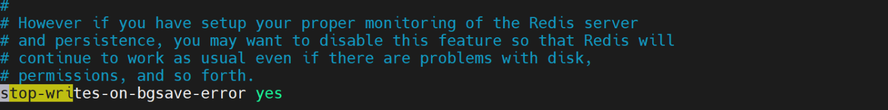

<font style="color:rgb(51, 51, 51);">默认：yes</font>

<font style="color:rgb(51, 51, 51);">如果配置成 no，表示你不在乎数据不一致或者有其他的手段发现和控制这种不一致，那么在快照写入失败时，也能确保 redis 继续接受新的写请求。</font>

<font style="color:rgb(51, 51, 51);">b) rdbcompression</font>

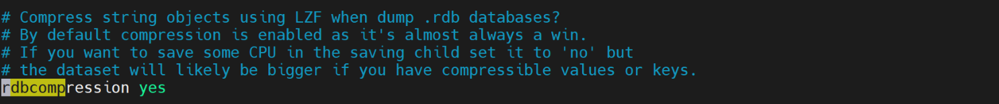

<font style="color:rgb(51, 51, 51);">默认：yes</font>

<font style="color:rgb(51, 51, 51);">对于存储到磁盘中的快照，可以设置是否进行压缩存储。如果是的话，redis 会采用 LZF 算法进行压缩。如果你不想消耗 CPU 来进行压缩的话，可以设置为关闭此功能。</font>

<font style="color:rgb(51, 51, 51);">c) rdbchecksum</font>

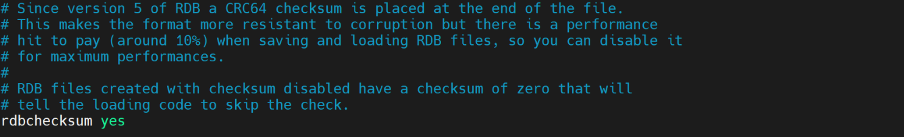

<font style="color:rgb(51, 51, 51);">默认：yes</font>

<font style="color:rgb(51, 51, 51);">在存储快照后，还可以让 redis 使用 CRC64 算法来进行数据校验，但是这样做会增加大约10%的性能消耗，如果希望获取到最大的性能提升，可以关闭此功能。</font>

<font style="color:rgb(51, 51, 51);">d) rdb-del-sync-files</font>

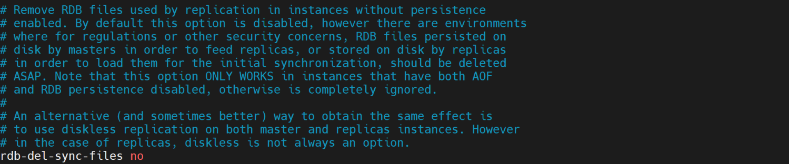

<font style="color:rgb(51, 51, 51);">默认：no</font>

<font style="color:rgb(51, 51, 51);">在没有持久性的情况下删除复制中使用的RDB文件。默认情况下no，此选项是禁用的。</font>

### <font style="color:rgb(51, 51, 51);">小结</font>


**<font style="color:rgb(51, 51, 51);">优势：</font>**

<font style="color:rgb(51, 51, 51);">RDB是一个非常紧凑的文件</font>

<font style="color:rgb(51, 51, 51);">RDB在保存RDB文件时父进程唯一需要做的就是fork出一个子进程，接下来的工作全部由子进程来做，父进程不需要再做其他IO操作，所以RDB持久化方式可以最大化redis的性能。与AOF相比，在恢复大的数据集的时候，RDB方式会更快一些。</font>

**<font style="color:rgb(51, 51, 51);">缺点：</font>**

<font style="color:rgb(51, 51, 51);">数据丢失风险大</font>

<font style="color:rgb(51, 51, 51);">RDB 需要经常fork子进程来保存数据集到硬盘上，当数据集比较大的时候，fork的过程是非常耗时的，可能会导致Redis在一些毫秒级不能响应客户端请求。</font>

## <font style="color:rgb(51, 51, 51);">append only file(aof)</font>

<font style="color:rgb(51, 51, 51);">相同点：RDB 和 AOF 都是 Redis 持久化的一种方式。</font>

<font style="color:rgb(51, 51, 51);">不同点：RDB 采用快照持久化(全量备份)、AOF(Append only file)把用户对 Redis 的 DML 操作(事务型操作)追加到 AOF 文件中</font>

### <font style="color:rgb(51, 51, 51);">AOF介绍</font>

**<font style="color:rgb(51, 51, 51);">AOF (Append Only File) :</font>**<code>**<font style="color:rgb(51, 51, 51);background-color:rgb(243, 244, 244);">AOF</font>**</code><font style="color:rgb(51, 51, 51);"> 持久化记录服务器接收到的每个写操作。这些操作可以在服务器启动时重播，重建原始数据集。命令使用与Redis协议本身相同的格式记录。</font>

**<font style="color:rgb(51, 51, 51);">通俗易懂：</font>**<font style="color:rgb(51, 51, 51);">以日志的形式记录着每个</font>**<font style="color:rgb(51, 51, 51);">写</font>**<font style="color:rgb(51, 51, 51);">操作，将 </font><code>**<font style="color:rgb(51, 51, 51);background-color:rgb(243, 244, 244);">Redis</font>**</code><font style="color:rgb(51, 51, 51);"> 执行过的所有</font>**<font style="color:rgb(51, 51, 51);">写</font>**<font style="color:rgb(51, 51, 51);">指令全都记录下来（读操作不记录），只许追加文件但不可以改写文件。Redis启动之初会读取该文件重新构建数据。换言之，Redis重启的话就根据日志文件的内容将</font>**<font style="color:rgb(51, 51, 51);">写</font>**<font style="color:rgb(51, 51, 51);">指令从前到后执行一次以完成数据的恢复工作（类似relay log中继日志效果）。</font>

### <font style="color:rgb(51, 51, 51);">工作流程</font>

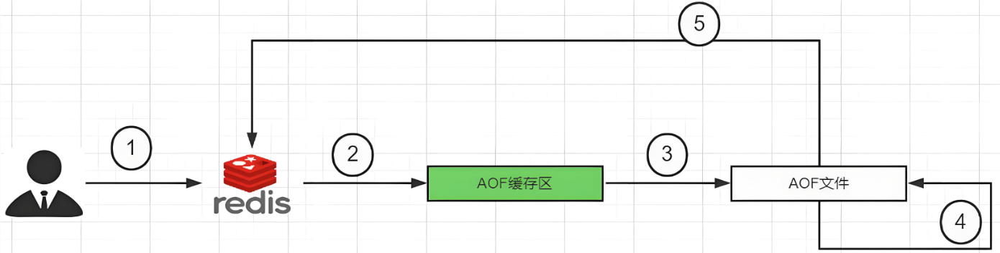

| **<font style="color:rgb(51, 51, 51);">步骤</font>** | **<font style="color:rgb(51, 51, 51);">详解</font>** |
| :--- | :--- |
| <font style="color:rgb(51, 51, 51);">①</font> | <code><font style="color:rgb(51, 51, 51);background-color:rgb(243, 244, 244);">Client</font></code><font style="color:rgb(51, 51, 51);">作为命令的来源，会有多个源头以及源源不断的请求命令。</font> |
| <font style="color:rgb(51, 51, 51);">②</font> | <font style="color:rgb(51, 51, 51);">在这些命令到达 </font><code><font style="color:rgb(51, 51, 51);background-color:rgb(243, 244, 244);">Redis Server</font></code><font style="color:rgb(51, 51, 51);">以后并不是直接写入AOF文件，会将其这些命令先放入AOF缓存中进行保存。这里的AOF缓冲区实际上是内存中的一片区域，存在的目的是当这些命令达到一定量以后再写入磁盘，避免频繁的磁盘IO操作。</font> |
| <font style="color:rgb(51, 51, 51);">③</font> | <font style="color:rgb(51, 51, 51);">AOF缓冲会根据AOF缓冲区 </font>**<font style="color:rgb(51, 51, 51);">同步文件的三种写回策略</font>**<font style="color:rgb(51, 51, 51);"> 将命令写入磁盘上的AOF文件。</font> |
| <font style="color:rgb(51, 51, 51);">④</font> | <font style="color:rgb(51, 51, 51);">随着写入AOF内容的增加为避免文件膨胀，会根据规则进行命令的合并( </font>**<font style="color:rgb(51, 51, 51);">又称AOF重写</font>**<font style="color:rgb(51, 51, 51);"> )，从而起到AOF文件压缩的目的。</font> |
| <font style="color:rgb(51, 51, 51);">⑤</font> | <font style="color:rgb(51, 51, 51);">当 </font><code><font style="color:rgb(51, 51, 51);background-color:rgb(243, 244, 244);">Redis Server</font></code><font style="color:rgb(51, 51, 51);">服务器重启的时候会从AOF文件载入数据。</font> |

### <font style="color:rgb(51, 51, 51);">AOF缓冲区三种写回策略</font>


<font style="color:rgb(51, 51, 51);">三种写回策略小结：</font>

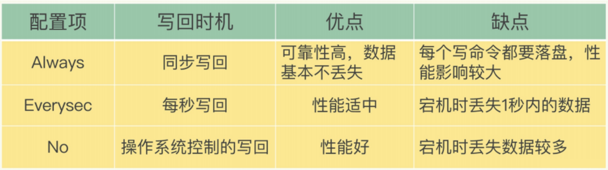

### <font style="color:rgb(51, 51, 51);">AOF持久化配置</font>

<font style="color:rgb(51, 51, 51);">第一步：开启 aof</font>

**<font style="color:rgb(51, 51, 51);">默认情况下</font>**<font style="color:rgb(51, 51, 51);">，</font><code>**<font style="color:rgb(51, 51, 51);background-color:rgb(243, 244, 244);">Redis</font>**</code><font style="color:rgb(51, 51, 51);"> 时没有开启AOF（Append Only File）的，</font>**<font style="color:rgb(51, 51, 51);">开启AOF功能需要配置：</font>**<code><font style="color:rgb(51, 51, 51);background-color:rgb(243, 244, 244);">appendonly yes</font></code>

```shell
1399行：appendonly yes
```

<font style="color:rgb(51, 51, 51);">第二步：在redis.conf配置文件中，设置备份频率：</font>

```shell
1458行：appendfsync everysec
```

**<font style="color:rgb(51, 51, 51);">Redis 6或之前版本：</font>**<code><font style="color:rgb(51, 51, 51);background-color:rgb(243, 244, 244);">AOF</font></code><font style="color:rgb(51, 51, 51);"> 保存文件的位置和 </font><code><font style="color:rgb(51, 51, 51);background-color:rgb(243, 244, 244);">RDB</font></code><font style="color:rgb(51, 51, 51);"> 保存文件的位置一样，都是通过 </font><code><font style="color:rgb(51, 51, 51);background-color:rgb(243, 244, 244);">redis.conf</font></code><font style="color:rgb(51, 51, 51);"> 配置文件中的 </font><code><font style="color:rgb(51, 51, 51);background-color:rgb(243, 244, 244);">dir</font></code><font style="color:rgb(51, 51, 51);"> 配置的。</font>

**<font style="color:rgb(51, 51, 51);">Redis 7：</font>**<code><font style="color:rgb(51, 51, 51);background-color:rgb(243, 244, 244);">redis.conf</font></code><font style="color:rgb(51, 51, 51);"> 配置文件中除了要设置dir以外，还新增加了一属性 </font><code><font style="color:rgb(51, 51, 51);background-color:rgb(243, 244, 244);">appenddirname</font></code><font style="color:rgb(51, 51, 51);"> 。</font>

<font style="color:rgb(51, 51, 51);">AOF保存文件的位置：dir + appenddirname</font>

```shell
# vim redis.conf
517行：dir /usr/local/redis/
1426行：appendfilename "appendonly.aof"
1432行：appenddirname "appendonlydir"

# 记得重启redis
# pkill redis-server
# bin/redis-server conf/redis.conf
# ll /usr/local/redis/appendonlydir
总用量 8
-rw-r--r-- 1 root root 88 12月  9 18:14 appendonly.aof.1.base.rdb
-rw-r--r-- 1 root root  0 12月  9 18:14 appendonly.aof.1.incr.aof
-rw-r--r-- 1 root root 88 12月  9 18:14 appendonly.aof.manifest
```

<font style="color:rgb(51, 51, 51);">第三步：写入测试数据</font>

```shell
127.0.0.1:6379> set name devops
127.0.0.1:6379> set age 18
127.0.0.1:6379> set address beijing
```

<font style="color:rgb(51, 51, 51);">第四步：查看测试结果</font>

```shell
# ll /usr/local/redis/appendonlydir
总用量 12
-rw-r--r-- 1 root root  88 12月  9 18:14 appendonly.aof.1.base.rdb
-rw-r--r-- 1 root root 123 12月  9 18:15 appendonly.aof.1.incr.aof
-rw-r--r-- 1 root root  88 12月  9 18:14 appendonly.aof.manifest
# cat appendonlydir/appendonly.aof.1.incr.aof
*2
$6
SELECT
$1
0
*3
$3
set
$4
name
$3
devops
*3
$3
set
$3
age
$2
18
*3
$3
set
$7
address
$6
beijing
```

### <font style="color:rgb(51, 51, 51);">AOF生成文件说明</font>

<font style="color:rgb(51, 51, 51);">Redis 6或之前版本：AOF保存文件名称有且只有一个</font>

<font style="color:rgb(51, 51, 51);">Redis 7：采用了 Redis 7.0 Multi Part AOF 的设计，</font><code><font style="color:rgb(51, 51, 51);background-color:rgb(243, 244, 244);">AOF</font></code><font style="color:rgb(51, 51, 51);">保存文件名称从1到3。分别是：</font>**<font style="color:rgb(51, 51, 51);">base基础文件</font>**<font style="color:rgb(51, 51, 51);"> ， </font>**<font style="color:rgb(51, 51, 51);">incr增量文件</font>**<font style="color:rgb(51, 51, 51);"> ，</font>**<font style="color:rgb(51, 51, 51);">manifest清单文件</font>**<font style="color:rgb(51, 51, 51);"> 。</font>

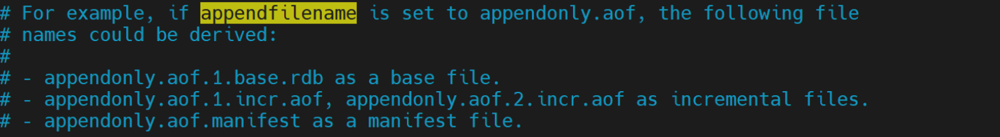

<font style="color:rgb(51, 51, 51);">MP-AOF实现：</font><font style="color:rgb(51, 51, 51);">顾名思义， </font><code>**<font style="color:rgb(51, 51, 51);background-color:rgb(243, 244, 244);">MP-AOF</font>**</code><font style="color:rgb(51, 51, 51);"> 就是将原来的单个 </font><code>**<font style="color:rgb(51, 51, 51);background-color:rgb(243, 244, 244);">AOF</font>**</code><font style="color:rgb(51, 51, 51);"> 文件拆分成多个AOF文件。在 </font><code>**<font style="color:rgb(51, 51, 51);background-color:rgb(243, 244, 244);">MP-AOF</font>**</code><font style="color:rgb(51, 51, 51);"> 中，我们将 </font><code>**<font style="color:rgb(51, 51, 51);background-color:rgb(243, 244, 244);">AOF</font>**</code><font style="color:rgb(51, 51, 51);"> 分为三种类型：</font>

* **<font style="color:rgb(51, 51, 51);">BASE：</font>**<font style="color:rgb(51, 51, 51);"> 表示基础的 </font><code>**<font style="color:rgb(51, 51, 51);background-color:rgb(243, 244, 244);">AOF</font>**</code><font style="color:rgb(51, 51, 51);"> ，一般由子进程通过重写产生，该文件最多只有一个。</font>
* **<font style="color:rgb(51, 51, 51);">INCR：</font>**<font style="color:rgb(51, 51, 51);"> 表是增量的 </font><code>**<font style="color:rgb(51, 51, 51);background-color:rgb(243, 244, 244);">AOF</font>**</code><font style="color:rgb(51, 51, 51);"> ，一般由 </font><code>**<font style="color:rgb(51, 51, 51);background-color:rgb(243, 244, 244);">AOFRW</font>**</code><font style="color:rgb(51, 51, 51);"> 开始执行的时候被创建，该文件可能存在多个。</font>
* **<font style="color:rgb(51, 51, 51);">HISTORY：</font>**<font style="color:rgb(51, 51, 51);"> 表是历史的 </font><code>**<font style="color:rgb(51, 51, 51);background-color:rgb(243, 244, 244);">AOF</font>**</code><font style="color:rgb(51, 51, 51);"> ，由 </font><code>**<font style="color:rgb(51, 51, 51);background-color:rgb(243, 244, 244);">BASE</font>**</code><font style="color:rgb(51, 51, 51);"> 和 </font><code>**<font style="color:rgb(51, 51, 51);background-color:rgb(243, 244, 244);">INCR</font>**</code><font style="color:rgb(51, 51, 51);"> 的 </font><code>**<font style="color:rgb(51, 51, 51);background-color:rgb(243, 244, 244);">AOF</font>**</code><font style="color:rgb(51, 51, 51);"> 变化而来，每次 </font><code>**<font style="color:rgb(51, 51, 51);background-color:rgb(243, 244, 244);">AOFRW</font>**</code><font style="color:rgb(51, 51, 51);"> 成功完成时，本次 </font><code>**<font style="color:rgb(51, 51, 51);background-color:rgb(243, 244, 244);">AOFRW</font>**</code><font style="color:rgb(51, 51, 51);"> 之前对应的 </font><code>**<font style="color:rgb(51, 51, 51);background-color:rgb(243, 244, 244);">BASE</font>**</code><font style="color:rgb(51, 51, 51);"> 和 </font><code>**<font style="color:rgb(51, 51, 51);background-color:rgb(243, 244, 244);">INCR</font>**</code><font style="color:rgb(51, 51, 51);"> 的 </font><code>**<font style="color:rgb(51, 51, 51);background-color:rgb(243, 244, 244);">AOF</font>**</code><font style="color:rgb(51, 51, 51);"> 都将变成 </font><code>**<font style="color:rgb(51, 51, 51);background-color:rgb(243, 244, 244);">HISTORY</font>**</code><font style="color:rgb(51, 51, 51);"> ， </font><code>**<font style="color:rgb(51, 51, 51);background-color:rgb(243, 244, 244);">HISTORY</font>**</code><font style="color:rgb(51, 51, 51);"> 类型的 </font><code>**<font style="color:rgb(51, 51, 51);background-color:rgb(243, 244, 244);">AOF</font>**</code><font style="color:rgb(51, 51, 51);"> 会被 </font><code>**<font style="color:rgb(51, 51, 51);background-color:rgb(243, 244, 244);">Redis</font>**</code><font style="color:rgb(51, 51, 51);"> 自动删除。</font>

<font style="color:rgb(51, 51, 51);">为了管理这些 </font><code>**<font style="color:rgb(51, 51, 51);background-color:rgb(243, 244, 244);">AOF</font>**</code><font style="color:rgb(51, 51, 51);"> 文件，引入了 </font><code>**<font style="color:rgb(51, 51, 51);background-color:rgb(243, 244, 244);">manifest（清单）</font>**</code><font style="color:rgb(51, 51, 51);"> 文件类跟踪、管理这些 </font><code>**<font style="color:rgb(51, 51, 51);background-color:rgb(243, 244, 244);">AOF</font>**</code><font style="color:rgb(51, 51, 51);"> 。同时，为了便于 </font><code>**<font style="color:rgb(51, 51, 51);background-color:rgb(243, 244, 244);">AOF</font>**</code><font style="color:rgb(51, 51, 51);"> 备份和拷贝，我们将所有的 </font><code>**<font style="color:rgb(51, 51, 51);background-color:rgb(243, 244, 244);">AOF</font>**</code><font style="color:rgb(51, 51, 51);"> 文件和 </font><code>**<font style="color:rgb(51, 51, 51);background-color:rgb(243, 244, 244);">manifest</font>**</code><font style="color:rgb(51, 51, 51);"> 文件放入一个单独的文件目录中，目录名由 </font><code>**<font style="color:rgb(51, 51, 51);background-color:rgb(243, 244, 244);">appenddirname</font>**</code><font style="color:rgb(51, 51, 51);"> 配置决定。</font>

### <font style="color:rgb(51, 51, 51);">正常恢复</font>

<font style="color:rgb(51, 51, 51);">方式一：</font>

<font style="color:rgb(51, 51, 51);">提前在 </font><code>**<font style="color:rgb(51, 51, 51);background-color:rgb(243, 244, 244);">Redis</font>**</code><font style="color:rgb(51, 51, 51);"> 中 </font><code>**<font style="color:rgb(51, 51, 51);background-color:rgb(243, 244, 244);">set</font>**</code><font style="color:rgb(51, 51, 51);"> 值。</font>

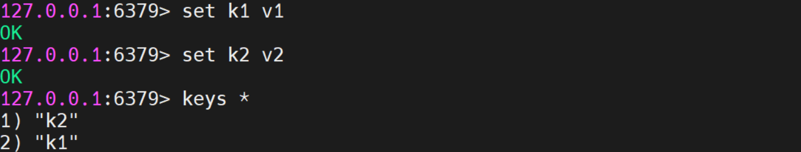

<font style="color:rgb(51, 51, 51);">此时发现 </font><code>**<font style="color:rgb(51, 51, 51);background-color:rgb(243, 244, 244);">AOF</font>**</code><font style="color:rgb(51, 51, 51);"> 文件已经生成：</font>


<font style="color:rgb(51, 51, 51);">重启Redis服务，重新登陆，发现数据还在。</font>

<font style="color:rgb(51, 51, 51);">方式二：</font>

<font style="color:rgb(51, 51, 51);">将 </font><code>**<font style="color:rgb(51, 51, 51);background-color:rgb(243, 244, 244);">appendonlydir</font>**</code><font style="color:rgb(51, 51, 51);"> 备份一下</font>

```shell
# cd /usr/local/redis
# cp -r appendonlydir appendonlydir.bak
```

<font style="color:rgb(51, 51, 51);">执行 </font><code>**<font style="color:rgb(51, 51, 51);background-color:rgb(243, 244, 244);">flushdb</font>**</code><font style="color:rgb(51, 51, 51);"> 清库，然后再查询数据为空，再执行 </font><code>**<font style="color:rgb(51, 51, 51);background-color:rgb(243, 244, 244);">shutdown</font>**</code>

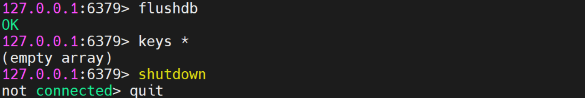

<font style="color:rgb(51, 51, 51);">此时，重启 </font><code>**<font style="color:rgb(51, 51, 51);background-color:rgb(243, 244, 244);">Redis</font>**</code><font style="color:rgb(51, 51, 51);"> ，在登陆进入后，执行 </font><code>**<font style="color:rgb(51, 51, 51);background-color:rgb(243, 244, 244);">keys *</font>**</code><font style="color:rgb(51, 51, 51);"> 发现还是空。</font>

<font style="color:rgb(51, 51, 51);">说明：</font><code>**<font style="color:rgb(51, 51, 51);background-color:rgb(243, 244, 244);">flushdb</font>**</code><font style="color:rgb(51, 51, 51);"> 命令属于写操作，执行后更新了 </font><code>**<font style="color:rgb(51, 51, 51);background-color:rgb(243, 244, 244);">AOF</font>**</code><font style="color:rgb(51, 51, 51);"> 文件。将新生成的 aof 的目录删除，备份的还原。</font>

```shell
# rm -rf appendonlydir
# mv appendonlydir.bak appendonlydir
```

<font style="color:rgb(51, 51, 51);">重启 </font><code>**<font style="color:rgb(51, 51, 51);background-color:rgb(243, 244, 244);">Redis</font>**</code><font style="color:rgb(51, 51, 51);"> ，重新登录后，发现数据已恢复！</font>

<font style="color:rgb(51, 51, 51);"></font>

<font style="color:rgb(51, 51, 51);">其实我们这样做最好：</font>

```properties
1. 往redis中set几条数据

2. 将AOF目录复制一份放到家目录中

3. 清空数据，然后停止redis服务

4. 删除redis的rdb文件、AOF文件

5. 将家目录中的AOF目录给复制回来

6. 启动redis，看是否恢复了数据
```

### <font style="color:rgb(51, 51, 51);">异常恢复</font>

<font style="color:rgb(51, 51, 51);">故意在正常的 </font><code>**<font style="color:rgb(51, 51, 51);background-color:rgb(243, 244, 244);">AOF文件</font>**</code><font style="color:rgb(51, 51, 51);"> 乱写，模拟网络闪断文件写入的 </font><code>**<font style="color:rgb(51, 51, 51);background-color:rgb(243, 244, 244);">error</font>**</code><font style="color:rgb(51, 51, 51);"> 。由于正常的 </font><code>**<font style="color:rgb(51, 51, 51);background-color:rgb(243, 244, 244);">AOF文件</font>**</code><font style="color:rgb(51, 51, 51);"> 写入的文件是 </font><code><font style="color:rgb(51, 51, 51);background-color:rgb(243, 244, 244);">appendonly.aof.1.incr.aof</font></code><font style="color:rgb(51, 51, 51);"> ，所以我们只修改该文件即可。</font>

```shell
# vim appendonly.aof.1.incr.aof
比如在最后一行添加 abc$123
```

<font style="color:rgb(51, 51, 51);">随便写入一些内容，保存并退出。</font>

<font style="color:rgb(51, 51, 51);">再次重新使用 redis 的客户端登陆的时候出现如下报错：拒绝连接。</font>

<font style="color:rgb(51, 51, 51);">由此可知，当 </font><code>**<font style="color:rgb(51, 51, 51);background-color:rgb(243, 244, 244);">AOF文件</font>**</code><font style="color:rgb(51, 51, 51);"> 错误的时候， </font><code>**<font style="color:rgb(51, 51, 51);background-color:rgb(243, 244, 244);">Redis</font>**</code><font style="color:rgb(51, 51, 51);"> 启动的时候是失败的。</font>

**<font style="color:rgb(51, 51, 51);">修复措施：</font>**

<font style="color:rgb(51, 51, 51);">使用如下命令</font>

```shell
# AOF文件修复命令。切记，一定要加上 “--fix” 
# redis-check-aof --fix appendonly.aof.1.incr.aof
```

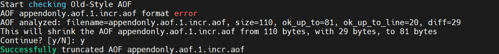

<font style="color:rgb(51, 51, 51);">出现如上图，则修复 </font><code>**<font style="color:rgb(51, 51, 51);background-color:rgb(243, 244, 244);">AOF文件</font>**</code><font style="color:rgb(51, 51, 51);"> 成功！</font><font style="color:rgb(51, 51, 51);">查看 </font><code><font style="color:rgb(51, 51, 51);background-color:rgb(243, 244, 244);">appendonly.aof.1.incr.aof</font></code><font style="color:rgb(51, 51, 51);"> 文件，发现错误语法的内容已删除。</font>

<font style="color:rgb(51, 51, 51);">重新启动 </font><code>**<font style="color:rgb(51, 51, 51);background-color:rgb(243, 244, 244);">Redis</font>**</code><font style="color:rgb(51, 51, 51);"> ，一切正常。</font>

### <font style="color:rgb(51, 51, 51);">AOF重写机制</font>

<font style="color:rgb(51, 51, 51);">AOF 一共生成3个文件，base 基础文件，incr 增量文件，manifest 清单文件（记录本次备份都有哪些文件）</font>

<font style="color:rgb(51, 51, 51);">AOF 实际经常操作的只有一个 incr 增量文件，随着时间增长越来越大，为了解决这个问题，我们可以使用AOF 重写来减小文件大小。</font>

***

<font style="color:rgb(51, 51, 51);">由于 </font><code>**<font style="color:rgb(51, 51, 51);background-color:rgb(243, 244, 244);">AOF</font>**</code><font style="color:rgb(51, 51, 51);"> 持久化是 </font><code>**<font style="color:rgb(51, 51, 51);background-color:rgb(243, 244, 244);">Redis</font>**</code><font style="color:rgb(51, 51, 51);"> 不断将写命令记录到 </font><code>**<font style="color:rgb(51, 51, 51);background-color:rgb(243, 244, 244);">AOF文件</font>**</code><font style="color:rgb(51, 51, 51);"> 中，随着 </font><code>**<font style="color:rgb(51, 51, 51);background-color:rgb(243, 244, 244);">Redis</font>**</code><font style="color:rgb(51, 51, 51);"> 不断的进行，</font><code>**<font style="color:rgb(51, 51, 51);background-color:rgb(243, 244, 244);">AOF</font>**</code><font style="color:rgb(51, 51, 51);"> 的文件会越来越大，文件越大，占用服务器内存越大以及 </font><code>**<font style="color:rgb(51, 51, 51);background-color:rgb(243, 244, 244);">AOF</font>**</code><font style="color:rgb(51, 51, 51);"> 恢复要求时间越长。</font><font style="color:rgb(51, 51, 51);">为了解决这个问题， </font><code>**<font style="color:rgb(51, 51, 51);background-color:rgb(243, 244, 244);">Redis</font>**</code>**<font style="color:rgb(51, 51, 51);">新增了重写机制</font>**<font style="color:rgb(51, 51, 51);">，当 </font><code>**<font style="color:rgb(51, 51, 51);background-color:rgb(243, 244, 244);">AOF文件</font>**</code><font style="color:rgb(51, 51, 51);"> 的大小超过所设定的峰值时， </font><code>**<font style="color:rgb(51, 51, 51);background-color:rgb(243, 244, 244);">Redis</font>**</code><font style="color:rgb(51, 51, 51);"> 就会 </font>**<font style="color:rgb(51, 51, 51);">自动</font>**<font style="color:rgb(51, 51, 51);"> 启动 </font><code>**<font style="color:rgb(51, 51, 51);background-color:rgb(243, 244, 244);">AOF文件</font>**</code><font style="color:rgb(51, 51, 51);"> 的内容压缩，只保留可以恢复数据的最小指令集或者可以手动使用命令 </font><code>**<font style="color:rgb(51, 51, 51);background-color:rgb(243, 244, 244);">bgrewriteaof</font>**</code><font style="color:rgb(51, 51, 51);">。</font>

<font style="color:rgb(51, 51, 51);">触发机制：打开 </font><code>**<font style="color:rgb(51, 51, 51);background-color:rgb(243, 244, 244);">Redis</font>**</code><font style="color:rgb(51, 51, 51);"> 的配置文件 </font><code>**<font style="color:rgb(51, 51, 51);background-color:rgb(243, 244, 244);">redis.conf</font>**</code>

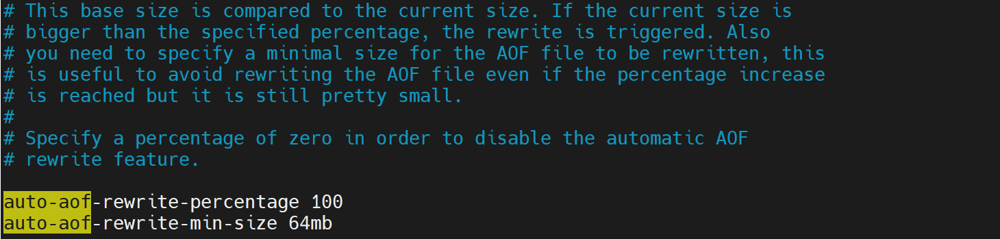

<font style="color:rgb(51, 51, 51);">参数解析：</font>

<font style="color:rgb(51, 51, 51);">① 假设 auto-aof-rewrite-min-size 设置为 64mb，auto-aof-rewrite-percentage 设置为 100。当 AOF文件首次达到 64mb 时，Redis 会进行第一次重写。</font>

<font style="color:rgb(51, 51, 51);">② 假设新生成的 AOF 文件大小为 64mb。之后，当 AOF 文件再次增长到 128mb（即 64mb 的 200%）时，由于当前 AOF 大小超过了上次重写后的 100%（64mb \* 1 +64mb=128mb），并且也超过了 min-size 的 64mb，此时就会触发第二次重写。</font>

**<font style="color:rgb(51, 51, 51);">自动触发：</font>**<font style="color:rgb(51, 51, 51);">除了第一次外</font>**<font style="color:rgb(51, 51, 51);">，</font>**<font style="color:rgb(51, 51, 51);">之后要触发必须同时满足上面两个条件，才会触发重写机制。官网默认 </font><code>**<font style="color:rgb(51, 51, 51);background-color:rgb(243, 244, 244);">AOF文件</font>**</code><font style="color:rgb(51, 51, 51);"> 是 </font>**<font style="color:rgb(51, 51, 51);">64M</font>**<font style="color:rgb(51, 51, 51);"> ，可以手动修改大小。</font>

**<font style="color:rgb(51, 51, 51);">手动触发：</font>**<font style="color:rgb(51, 51, 51);">客户端向服务端发送如下命令 </font><code>**<font style="color:rgb(51, 51, 51);background-color:rgb(243, 244, 244);">bgrewriteaof</font>**</code><font style="color:rgb(51, 51, 51);"> 即可手动触发。</font>

#### <font style="color:rgb(51, 51, 51);">自动触发机制</font>

<font style="color:rgb(51, 51, 51);">① 开启 AOF 功能</font>

```shell
appendonly yes
```

<font style="color:rgb(51, 51, 51);">② 修改 </font><code>**<font style="color:rgb(51, 51, 51);background-color:rgb(243, 244, 244);">AOF文件</font>**</code><font style="color:rgb(51, 51, 51);"> 峰值的大小为 </font><code>**<font style="color:rgb(51, 51, 51);background-color:rgb(243, 244, 244);">1kb</font>**</code><font style="color:rgb(51, 51, 51);"> ，便于测试。</font>

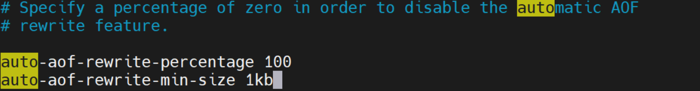

<font style="color:rgb(51, 51, 51);">③ 关闭 </font><code>**<font style="color:rgb(51, 51, 51);background-color:rgb(243, 244, 244);">RDB</font>**</code><font style="color:rgb(51, 51, 51);"> 和 </font><code>**<font style="color:rgb(51, 51, 51);background-color:rgb(243, 244, 244);">AOF</font>**</code><font style="color:rgb(51, 51, 51);"> 混合</font>

<font style="color:rgb(51, 51, 51);">默认：yes；修改为：no</font>

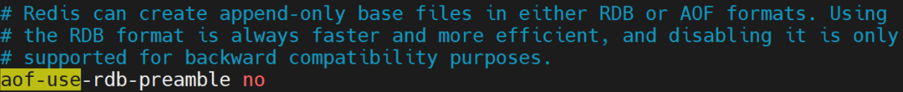

<font style="color:rgb(51, 51, 51);">④ 删除之前所有的 </font><code>**<font style="color:rgb(51, 51, 51);background-color:rgb(243, 244, 244);">RDB</font>**</code><font style="color:rgb(51, 51, 51);"> 和 </font><code>**<font style="color:rgb(51, 51, 51);background-color:rgb(243, 244, 244);">AOF</font>**</code><font style="color:rgb(51, 51, 51);"> 文件，防止受外界因素影响。</font>

<font style="color:rgb(51, 51, 51);">⑤ 重启 </font><code>**<font style="color:rgb(51, 51, 51);background-color:rgb(243, 244, 244);">Redis</font>**</code><font style="color:rgb(51, 51, 51);"> 服务，执行 </font><code>**<font style="color:rgb(51, 51, 51);background-color:rgb(243, 244, 244);">set k1 v1</font>**</code><font style="color:rgb(51, 51, 51);"> ，检查 </font><code>**<font style="color:rgb(51, 51, 51);background-color:rgb(243, 244, 244);">AOF文件</font>**</code><font style="color:rgb(51, 51, 51);"> 是否正常。</font>

<font style="color:rgb(51, 51, 51);">⑥ 查看三大配置</font>

```shell
# 几种文件类型的前缀，后跟相关序列和类型的附加信息
appendfilename "appendonly.aof"

# Redis 7新增加的目录配置
appenddirname "appendonlydir"

# aof相关文件
# 1、基本文件
appendonly.aof.1.base.rdb

# 2、增量文件
appendonly.aof.1.incr.aof
appendonly.aof.2.incr.aof

# 3、清单文件
appendonly.aof.manifest
```

<font style="color:rgb(51, 51, 51);">⑦ 不停的 </font><code>**<font style="color:rgb(51, 51, 51);background-color:rgb(243, 244, 244);">set k1</font>**</code><font style="color:rgb(51, 51, 51);"> ，让 </font><code>**<font style="color:rgb(51, 51, 51);background-color:rgb(243, 244, 244);">AOF文件</font>**</code><font style="color:rgb(51, 51, 51);"> 变大（我们对 redis 进行的每一次写操作都会记录在 AOF 中），一直增大到 </font><code>**<font style="color:rgb(51, 51, 51);background-color:rgb(243, 244, 244);">1024kb</font>**</code><font style="color:rgb(51, 51, 51);"> 。查看发现， </font><code>**<font style="color:rgb(51, 51, 51);background-color:rgb(243, 244, 244);">base文件</font>**</code><font style="color:rgb(51, 51, 51);"> 增大， </font><code>**<font style="color:rgb(51, 51, 51);background-color:rgb(243, 244, 244);">base文件</font>**</code><font style="color:rgb(51, 51, 51);"> 和 </font><code>**<font style="color:rgb(51, 51, 51);background-color:rgb(243, 244, 244);">incr文件</font>**</code><font style="color:rgb(51, 51, 51);"> 名称修改为变为 </font><code>**<font style="color:rgb(51, 51, 51);background-color:rgb(243, 244, 244);">2</font>**</code><font style="color:rgb(51, 51, 51);"> 。此时，自动重写机制已触发。</font>

> <font style="color:rgb(119, 119, 119);">注：查看 base文件内容 发现，不管我们之前怎么给 </font><code><font style="color:rgb(119, 119, 119);background-color:rgb(243, 244, 244);">k1</font></code><font style="color:rgb(119, 119, 119);"> 赋值，最终都 </font><code><font style="color:rgb(119, 119, 119);background-color:rgb(243, 244, 244);">base文件</font></code><font style="color:rgb(119, 119, 119);"> 中只会保存 最后一次 赋值命令。</font>

#### <font style="color:rgb(51, 51, 51);">手工触发机制</font>

<font style="color:rgb(51, 51, 51);">① 提前给k1赋一个其他的值</font>

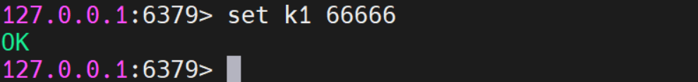

<font style="color:rgb(51, 51, 51);">② 使用命令：</font><code>**<font style="color:rgb(51, 51, 51);background-color:rgb(243, 244, 244);">bgrewriteaof</font>**</code>

```shell
bgrewriteaof
```

<font style="color:rgb(51, 51, 51);">此时发现， </font><code>**<font style="color:rgb(51, 51, 51);background-color:rgb(243, 244, 244);">base文件</font>**</code><font style="color:rgb(51, 51, 51);"> 改大小变， </font><code>**<font style="color:rgb(51, 51, 51);background-color:rgb(243, 244, 244);">incr文件</font>**</code><font style="color:rgb(51, 51, 51);"> 大小归0。说明重写机制已手动触发。</font>

***

<font style="color:rgb(51, 51, 51);">AOF 文件重写并不是对原文件进行重新整理，而是直接读取服务器现有的键值对，然后用一条命令去代替之前记录的这个键值对的多条命令，生成一个新的文件后替换原来的 </font><code>**<font style="color:rgb(51, 51, 51);background-color:rgb(243, 244, 244);">AOF文件</font>**</code><font style="color:rgb(51, 51, 51);"> 。</font>

**<font style="color:rgb(51, 51, 51);">AOF 重写触发机制：</font>**<font style="color:rgb(51, 51, 51);"> 通过 </font><code>**<font style="color:rgb(51, 51, 51);background-color:rgb(243, 244, 244);">redis.conf</font>**</code><font style="color:rgb(51, 51, 51);"> 配置文件中的 </font><code>**<font style="color:rgb(51, 51, 51);background-color:rgb(243, 244, 244);">auto-aof-rewrite-percentage：默认值为100</font>**</code><font style="color:rgb(51, 51, 51);"> ，以及 </font><code>**<font style="color:rgb(51, 51, 51);background-color:rgb(243, 244, 244);">auto-aof-rewrite-min-size：默认值为64mb</font>**</code><font style="color:rgb(51, 51, 51);"> 。也就是说，默认 </font><code>**<font style="color:rgb(51, 51, 51);background-color:rgb(243, 244, 244);">Redis</font>**</code><font style="color:rgb(51, 51, 51);"> 会记录上一次重写时的 </font><code>**<font style="color:rgb(51, 51, 51);background-color:rgb(243, 244, 244);">AOF文件</font>**</code><font style="color:rgb(51, 51, 51);"> 大小，默认配置是当 </font><code>**<font style="color:rgb(51, 51, 51);background-color:rgb(243, 244, 244);">AOF文件</font>**</code><font style="color:rgb(51, 51, 51);"> 大小是上次 </font><code>**<font style="color:rgb(51, 51, 51);background-color:rgb(243, 244, 244);">rewrite（重写）</font>**</code><font style="color:rgb(51, 51, 51);"> 后大小的 </font><code>**<font style="color:rgb(51, 51, 51);background-color:rgb(243, 244, 244);">1</font>**</code><font style="color:rgb(51, 51, 51);"> 倍且文件大于 </font><code>**<font style="color:rgb(51, 51, 51);background-color:rgb(243, 244, 244);">64MB</font>**</code><font style="color:rgb(51, 51, 51);"> 时触发。</font>

#### <font style="color:rgb(51, 51, 51);">重写原理</font>

<font style="color:rgb(51, 51, 51);">① 在重写开始前， </font><code>**<font style="color:rgb(51, 51, 51);background-color:rgb(243, 244, 244);">Redis</font>**</code><font style="color:rgb(51, 51, 51);"> 会创建一个 </font><code>**<font style="color:rgb(51, 51, 51);background-color:rgb(243, 244, 244);">重写子进程</font>**</code><font style="color:rgb(51, 51, 51);"> ，这个子进程 </font>**<font style="color:rgb(51, 51, 51);">不会</font>**<font style="color:rgb(51, 51, 51);"> 读取现有的 </font><code>**<font style="color:rgb(51, 51, 51);background-color:rgb(243, 244, 244);">AOF文件</font>**</code><font style="color:rgb(51, 51, 51);"> ，而是读取当前服务器上数据库内容，并将其包含的指令进行分析压缩并写入到一个临时文件中。</font>

<font style="color:rgb(51, 51, 51);">② 与此同时，主进程会将新接收到的 </font>**<font style="color:rgb(51, 51, 51);">写指令</font>**<font style="color:rgb(51, 51, 51);"> 一边累积到内存缓冲区中，一边继续写入到原有的 </font><code>**<font style="color:rgb(51, 51, 51);background-color:rgb(243, 244, 244);">AOF文件</font>**</code><font style="color:rgb(51, 51, 51);"> 中，这样做是保证原有的 </font><code>**<font style="color:rgb(51, 51, 51);background-color:rgb(243, 244, 244);">AOF文件</font>**</code><font style="color:rgb(51, 51, 51);"> 的可用性，避免在重写过程中出现意外。</font>

<font style="color:rgb(51, 51, 51);">③ 当 </font><code>**<font style="color:rgb(51, 51, 51);background-color:rgb(243, 244, 244);">重写子进程</font>**</code><font style="color:rgb(51, 51, 51);"> 完成重写工作后，它会给父进程发一个信号，父进程收到信号后就会将内存中缓存的写指令 </font>**<font style="color:rgb(51, 51, 51);">追加</font>**<font style="color:rgb(51, 51, 51);"> 到新 </font><code>**<font style="color:rgb(51, 51, 51);background-color:rgb(243, 244, 244);">AOF文件</font>**</code><font style="color:rgb(51, 51, 51);"> 中。</font>

<font style="color:rgb(51, 51, 51);">④当追加结束后， </font><code>**<font style="color:rgb(51, 51, 51);background-color:rgb(243, 244, 244);">Redis</font>**</code><font style="color:rgb(51, 51, 51);"> 就会用 </font><code>**<font style="color:rgb(51, 51, 51);background-color:rgb(243, 244, 244);">新AOF文件</font>**</code><font style="color:rgb(51, 51, 51);"> 来 </font>**<font style="color:rgb(51, 51, 51);">替换</font>**<code>**<font style="color:rgb(51, 51, 51);background-color:rgb(243, 244, 244);">旧AOF文件</font>**</code><font style="color:rgb(51, 51, 51);">，之后再有新的写指令，就都会追加到 </font><code>**<font style="color:rgb(51, 51, 51);background-color:rgb(243, 244, 244);">新AOF文件</font>**</code><font style="color:rgb(51, 51, 51);"> 中。</font>

<font style="color:rgb(51, 51, 51);">⑤ 重写 </font><code>**<font style="color:rgb(51, 51, 51);background-color:rgb(243, 244, 244);">AOF文件</font>**</code><font style="color:rgb(51, 51, 51);"> 的操作，并没有读取 </font><code>**<font style="color:rgb(51, 51, 51);background-color:rgb(243, 244, 244);">旧AOF文件</font>**</code><font style="color:rgb(51, 51, 51);"> ，而是将整个内存中的数据库内容用命令的方式重写了一个 </font><code>**<font style="color:rgb(51, 51, 51);background-color:rgb(243, 244, 244);">新AOF文件</font>**</code><font style="color:rgb(51, 51, 51);"> ，这点和快照有点类似。</font>

### <font style="color:rgb(51, 51, 51);">小结</font>

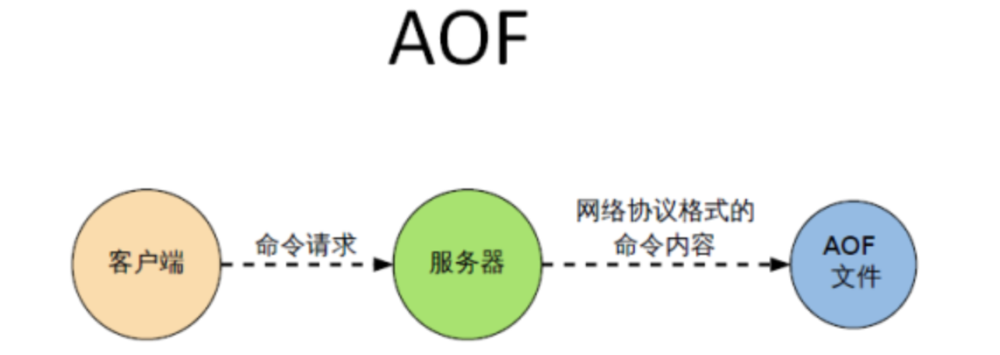

**<font style="color:rgb(51, 51, 51);">优势：</font>**

<font style="color:rgb(51, 51, 51);">AOF 文件是一个只进行追加的日志文件</font>

<font style="color:rgb(51, 51, 51);">Redis 可以在 AOF 文件体积变得过大时，自动地在后台对 AOF 进行重写</font>

<font style="color:rgb(51, 51, 51);">AOF 文件有序地保存了对数据库执行的所有写入操作，这些写入操作以 Redis 协议的格式保存，因此 AOF文件的内容非常容易被人读懂，对文件进行分析也很轻松</font>

**<font style="color:rgb(51, 51, 51);">缺点：</font>**

<font style="color:rgb(51, 51, 51);">对于相同的数据集来说，AOF 文文件的体积通常要大于 RDB 文件的体积。</font>

<font style="color:rgb(51, 51, 51);">根据所使用的 fsync 策略，AOF 的速度可能会慢于 RDB</font>

## <font style="color:rgb(51, 51, 51);">扩展：No persistence（了解）</font>

**<font style="color:rgb(51, 51, 51);">No persistence :</font>**<font style="color:rgb(51, 51, 51);"> 完全禁用持久性。这有时用于缓存，属于纯净模式。</font>

<font style="color:rgb(51, 51, 51);">需要同时禁用 RDB 和 AOF</font>

**<font style="color:rgb(51, 51, 51);">注：</font>**<code>**<font style="color:rgb(51, 51, 51);background-color:rgb(243, 244, 244);">RDB</font>**</code><font style="color:rgb(51, 51, 51);"> 和 </font><code>**<font style="color:rgb(51, 51, 51);background-color:rgb(243, 244, 244);">AOF</font>**</code><font style="color:rgb(51, 51, 51);"> 禁用，只是单纯的禁用自动触发。不会禁用手动触发，手动输入命令，仍然可以触发 </font><code>**<font style="color:rgb(51, 51, 51);background-color:rgb(243, 244, 244);">RDB</font>**</code><font style="color:rgb(51, 51, 51);"> 和 </font><code>**<font style="color:rgb(51, 51, 51);background-color:rgb(243, 244, 244);">AOF</font>**</code>

### <font style="color:rgb(51, 51, 51);">禁用RDB</font>

<font style="color:rgb(51, 51, 51);">配置文件： </font><code>**<font style="color:rgb(51, 51, 51);background-color:rgb(243, 244, 244);">save ""</font>**</code><font style="color:rgb(51, 51, 51);">禁用 </font><code>**<font style="color:rgb(51, 51, 51);background-color:rgb(243, 244, 244);">RDB</font>**</code><font style="color:rgb(51, 51, 51);"> 模式下，仍然可以手动输入命令 </font><code>**<font style="color:rgb(51, 51, 51);background-color:rgb(243, 244, 244);">save</font>**</code><font style="color:rgb(51, 51, 51);"> 和 </font><code>**<font style="color:rgb(51, 51, 51);background-color:rgb(243, 244, 244);">bgsave</font>**</code><font style="color:rgb(51, 51, 51);"> 来生成 </font><code>**<font style="color:rgb(51, 51, 51);background-color:rgb(243, 244, 244);">RDB</font>**</code><font style="color:rgb(51, 51, 51);"> 文件。</font>

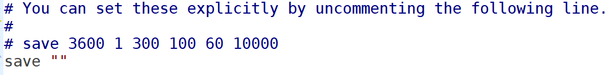

### **<font style="color:rgb(51, 51, 51);">禁用AOF</font>**

<font style="color:rgb(51, 51, 51);">配置文件： </font><code>**<font style="color:rgb(51, 51, 51);background-color:rgb(243, 244, 244);">appendonly no</font>**</code>

<font style="color:rgb(51, 51, 51);">禁用 </font><code>**<font style="color:rgb(51, 51, 51);background-color:rgb(243, 244, 244);">AOF</font>**</code><font style="color:rgb(51, 51, 51);"> 模式下，仍然可以手动输入命令 </font><code>**<font style="color:rgb(51, 51, 51);background-color:rgb(243, 244, 244);">bgrewriteaof</font>**</code><font style="color:rgb(51, 51, 51);"> 来生成 </font><code>**<font style="color:rgb(51, 51, 51);background-color:rgb(243, 244, 244);">AOF</font>**</code><font style="color:rgb(51, 51, 51);"> 文件。</font>

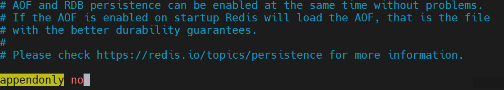

## <font style="color:rgb(51, 51, 51);">扩展：RDB + AOF（生产环境）</font>

**<font style="color:rgb(51, 51, 51);">RDB + AOF :</font>**<font style="color:rgb(51, 51, 51);"> 在同一个实例中同时使用 </font><code>**<font style="color:rgb(51, 51, 51);background-color:rgb(243, 244, 244);">AOF</font>**</code><font style="color:rgb(51, 51, 51);"> 和 </font><code>**<font style="color:rgb(51, 51, 51);background-color:rgb(243, 244, 244);">RDB</font>**</code>

### <font style="color:rgb(51, 51, 51);">共存优先级</font>

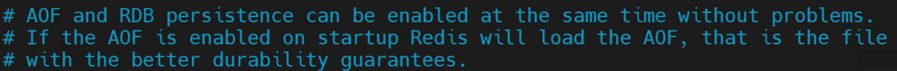

<code>**<font style="color:rgb(51, 51, 51);background-color:rgb(243, 244, 244);">AOF</font>**</code><font style="color:rgb(51, 51, 51);"> 和 </font><code>**<font style="color:rgb(51, 51, 51);background-color:rgb(243, 244, 244);">RDB</font>**</code><font style="color:rgb(51, 51, 51);"> 持久化可以同时启用，不会有问题。如果启动时启用了 </font><code>**<font style="color:rgb(51, 51, 51);background-color:rgb(243, 244, 244);">AOF</font>**</code><font style="color:rgb(51, 51, 51);"> ， </font><code>**<font style="color:rgb(51, 51, 51);background-color:rgb(243, 244, 244);">Redis</font>**</code><font style="color:rgb(51, 51, 51);"> 将加载 </font><code>**<font style="color:rgb(51, 51, 51);background-color:rgb(243, 244, 244);">AOF</font>**</code><font style="color:rgb(51, 51, 51);"> ，即文件具有更好的持久性保证。则 </font><code>**<font style="color:rgb(51, 51, 51);background-color:rgb(243, 244, 244);">AOF</font>**</code><font style="color:rgb(51, 51, 51);"> 的优先级高于 </font><code>**<font style="color:rgb(51, 51, 51);background-color:rgb(243, 244, 244);">RDB</font>**</code>

### <font style="color:rgb(51, 51, 51);">数据恢复顺序及加载流程</font>

<font style="color:rgb(51, 51, 51);">同时开启 </font><code>**<font style="color:rgb(51, 51, 51);background-color:rgb(243, 244, 244);">RDB</font>**</code><font style="color:rgb(51, 51, 51);"> 和 </font><code>**<font style="color:rgb(51, 51, 51);background-color:rgb(243, 244, 244);">AOF</font>**</code><font style="color:rgb(51, 51, 51);"> 时， </font><code>**<font style="color:rgb(51, 51, 51);background-color:rgb(243, 244, 244);">Redis</font>**</code><font style="color:rgb(51, 51, 51);"> 默认优先加载 </font><code>**<font style="color:rgb(51, 51, 51);background-color:rgb(243, 244, 244);">AOF</font>**</code><font style="color:rgb(51, 51, 51);"> ，则不去加载 </font><code>**<font style="color:rgb(51, 51, 51);background-color:rgb(243, 244, 244);">RDB</font>**</code><font style="color:rgb(51, 51, 51);"> （可以说和 </font><code>**<font style="color:rgb(51, 51, 51);background-color:rgb(243, 244, 244);">RDB</font>**</code><font style="color:rgb(51, 51, 51);"> 毫无关系）。如果 </font><code>**<font style="color:rgb(51, 51, 51);background-color:rgb(243, 244, 244);">AOF</font>**</code><font style="color:rgb(51, 51, 51);"> 文件不存在，再去加载 </font><code>**<font style="color:rgb(51, 51, 51);background-color:rgb(243, 244, 244);">RDB</font>**</code>

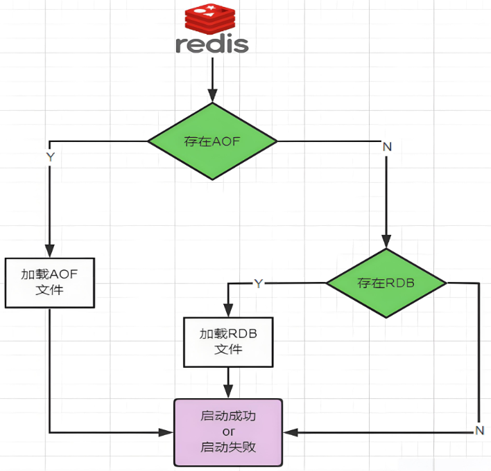

### <font style="color:rgb(51, 51, 51);">开启RDB和AOF混合模式</font>

<font style="color:rgb(51, 51, 51);">结合了 </font><code>**<font style="color:rgb(51, 51, 51);background-color:rgb(243, 244, 244);">RDB</font>**</code><font style="color:rgb(51, 51, 51);"> 和 </font><code>**<font style="color:rgb(51, 51, 51);background-color:rgb(243, 244, 244);">AOF</font>**</code><font style="color:rgb(51, 51, 51);"> 的优点，既能快速加载又能避免丢失过多的数据。江湖人称“ </font>**<font style="color:rgb(51, 51, 51);">鸳鸯锅</font>**<font style="color:rgb(51, 51, 51);"> ”</font>

<font style="color:rgb(51, 51, 51);">配置文件中 </font><code>**<font style="color:rgb(51, 51, 51);background-color:rgb(243, 244, 244);">aof-use-rdb-preamble</font>**</code><font style="color:rgb(51, 51, 51);"> 的默认值为 </font><code>**<font style="color:rgb(51, 51, 51);background-color:rgb(243, 244, 244);">yes</font>**</code><font style="color:rgb(51, 51, 51);"> 。 </font><code>**<font style="color:rgb(51, 51, 51);background-color:rgb(243, 244, 244);">yes</font>**</code><font style="color:rgb(51, 51, 51);"> 表示开启，设置为 </font><code>**<font style="color:rgb(51, 51, 51);background-color:rgb(243, 244, 244);">no</font>**</code><font style="color:rgb(51, 51, 51);"> 表示禁用。</font>

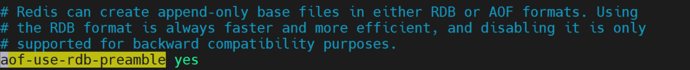

<code><font style="color:rgb(51, 51, 51);background-color:rgb(243, 244, 244);">RDB+AOF</font></code><font style="color:rgb(51, 51, 51);"> 的混合方式</font><code>**<font style="color:rgb(51, 51, 51);background-color:rgb(243, 244, 244);">RDB</font>**</code><font style="color:rgb(51, 51, 51);"> 镜像做全量持久化，</font><code>**<font style="color:rgb(51, 51, 51);background-color:rgb(243, 244, 244);">AOF</font>**</code><font style="color:rgb(51, 51, 51);"> 做增量持久化。先使用 </font><code>**<font style="color:rgb(51, 51, 51);background-color:rgb(243, 244, 244);">RDB</font>**</code><font style="color:rgb(51, 51, 51);"> 进行快照存储，然后使用 </font><code>**<font style="color:rgb(51, 51, 51);background-color:rgb(243, 244, 244);">AOF</font>**</code><font style="color:rgb(51, 51, 51);"> 持久化记录所有的写操作。当重写策略满足或手动触发重写的时候，将最新的数据存储为新的 </font><code>**<font style="color:rgb(51, 51, 51);background-color:rgb(243, 244, 244);">RDB</font>**</code><font style="color:rgb(51, 51, 51);"> 记录。这样的话，重启服务的时候会从 </font><code>**<font style="color:rgb(51, 51, 51);background-color:rgb(243, 244, 244);">RDB</font>**</code><font style="color:rgb(51, 51, 51);"> 和 </font><code>**<font style="color:rgb(51, 51, 51);background-color:rgb(243, 244, 244);">AOF</font>**</code><font style="color:rgb(51, 51, 51);"> 两部分恢复数据，既保证了数据完整性，又提高了恢复数据的性能。</font>

<font style="color:rgb(51, 51, 51);">简单来说：混合持久化方式产生的文件一部分是 </font><code>**<font style="color:rgb(51, 51, 51);background-color:rgb(243, 244, 244);">RDB</font>**</code><font style="color:rgb(51, 51, 51);"> 格式，一部分是 </font><code>**<font style="color:rgb(51, 51, 51);background-color:rgb(243, 244, 244);">AOF</font>**</code><font style="color:rgb(51, 51, 51);"> 格式。即 </font><code>**<font style="color:rgb(51, 51, 51);background-color:rgb(243, 244, 244);">AOF</font>**</code><font style="color:rgb(51, 51, 51);"> 包括了 </font><code>**<font style="color:rgb(51, 51, 51);background-color:rgb(243, 244, 244);">RDB</font>**</code><font style="color:rgb(51, 51, 51);"> 头部 + </font><code>**<font style="color:rgb(51, 51, 51);background-color:rgb(243, 244, 244);">AOF</font>**</code><font style="color:rgb(51, 51, 51);"> 混写。</font>

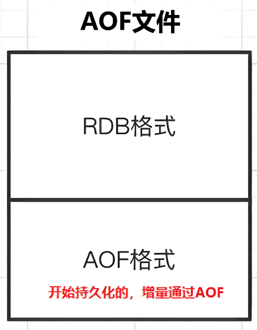

## <font style="color:rgb(51, 51, 51);">总结</font>

<font style="color:rgb(51, 51, 51);">掌握：学会开启与恢复RDB、学会开启与恢复AOF即可！！！</font>

***

<font style="color:rgb(51, 51, 51);">rdb 适用于一般的数据持久化使用，效率高，数据迁移方便</font>

<font style="color:rgb(51, 51, 51);">aof 适合于增量备份、数据实时性备份要求更高的情况</font>

<font style="color:rgb(51, 51, 51);">rdb和aof同时开启，redis听谁的？</font>

<font style="color:rgb(51, 51, 51);">答：</font>

<font style="color:rgb(51, 51, 51);">① 听aof的，rdb与aof同时开启默认加载AOF的配置文件</font>

<font style="color:rgb(51, 51, 51);">② 相同数据集，aof文件要远大于rdb文件，恢复速度慢于rdb</font>

<font style="color:rgb(51, 51, 51);">③ aof运行效率慢于rdb，但是同步策略效率好，异步效率和rdb相同</font>

<font style="color:rgb(51, 51, 51);">概括：生产环境都是混合模式居多，RDB负责全量备份，AOF适合增量备份。RDB恢复数据快，文件小。</font>

<font style="color:rgb(51, 51, 51);">如果只能选一个：一般场景用RDB，实时要求高场景用AOF。</font>

# <font style="color:rgb(51, 51, 51);">六、Redis实际案列</font>

## <font style="color:rgb(51, 51, 51);">主从模式	</font>

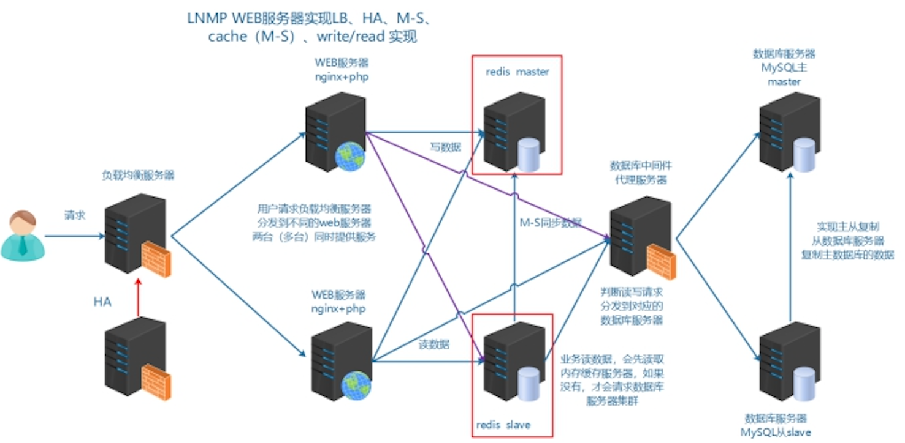

## 环境准备

| **<font style="color:rgb(51, 51, 51);">编号</font>** | **<font style="color:rgb(51, 51, 51);">主机名</font>** | **<font style="color:rgb(51, 51, 51);">IP</font>** | **<font style="color:rgb(51, 51, 51);">Redis版本</font>** | **<font style="color:rgb(51, 51, 51);">角色</font>** |
| :--- | :--- | :--- | :--- | :--- |
| <font style="color:rgb(51, 51, 51);">1</font> | <font style="color:rgb(51, 51, 51);">redis01.lhp.cn</font> | <font style="color:rgb(51, 51, 51);">192.168.126.201</font> | <font style="color:rgb(51, 51, 51);">redis-7.4.0</font> | <font style="color:rgb(51, 51, 51);">master</font> |
| <font style="color:rgb(51, 51, 51);">2</font> | <font style="color:rgb(51, 51, 51);">redis02.lhp.cn</font> | <font style="color:rgb(51, 51, 51);">192.168.126.202</font> | <font style="color:rgb(51, 51, 51);">redis-7.4.0</font> | <font style="color:rgb(51, 51, 51);">slave</font> |

<font style="color:rgb(51, 51, 51);">准备 redis02，需要提前安装Redis（如果是 VMware 也可以直接对 redis01 进行克隆）</font>

<font style="color:rgb(51, 51, 51);">第一步：关掉 redis01 服务器，然后克隆出来一份，名字是 redis02</font>

> <font style="color:rgb(51, 51, 51);">如果是重新安装 redis02 上的 redis 服务，使用下面步骤：</font>

```python
# tar -xf redis-7.4.0.tar.gz
# cd redis-7.4.0
# make
# make PREFIX=/usr/local/redis install
# mkdir /usr/local/redis/conf -p
# cp redis.conf /usr/local/redis/conf

# vim /usr/local/redis/conf/redis.conf
bind 0.0.0.0
daemonize yes

# vim /etc/sysctl.conf
vm.overcommit_memory = 1

# sysctl -p
```

<font style="color:rgb(51, 51, 51);">第二步：修改 redis02 的 MAC 地址并开机</font>

<font style="color:rgb(51, 51, 51);">第三步：修改 redis02 的 IP 地址，主机名称</font>

第四步：操作两台 redis 服务器，删除 redis 中的所有数据

```python
# systemctl start redis
# redis-cli
127.0.0.1:6379> flushall
127.0.0.1:6379> exit
```

第五步：给两台 redis 服务器拍摄快照！

(把密码给去掉了！！！)

## 搭建主从

<font style="color:rgb(51, 51, 51);">第一步：配置 master 服务器</font>

```python
# vim /usr/local/redis/conf/redis.conf
```

<font style="color:rgb(51, 51, 51);">开启监听，在网络中与其他服务器进行网络交互的网卡，默认ens33。bind的ip指的是其他的主机需要和这个主机通讯的ip：</font>

```python
88行：bind 0.0.0.0         # 允许所有IP连接
112行：protected-mode no   # 关闭redis安全保护机制，允许主从、哨兵、集群中各节点之间的相互访问，没有安全限制
```

<font style="color:rgb(51, 51, 51);">第二步：配置 slave 服务器</font>

```python
# vim /usr/local/redis/conf/redis.conf
```

<font style="color:rgb(51, 51, 51);">主从配置：设置 master redis 信息</font>

```python
redis5/6/7 版本：
541行：replicaof 192.168.126.201 6379
```

<font style="color:rgb(51, 51, 51);">第三步：重启两台 redis 服务器中的 redis 服务，查看是否成功</font>

```python
# systemctl restart redis
# redis-cli
127.0.0.1:6379> info replication
```

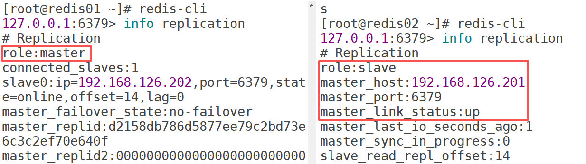

<font style="color:rgb(51, 51, 51);">第四步：测试 redis 主从，主写从读</font>

```python
127.0.0.1:6379 master> set title qinghua
127.0.0.1:6379 slave> keys *
127.0.0.1:6379 slave> get title
```

<font style="color:rgb(51, 51, 51);">注：slave 不允许写操作，因为从服务器 redis 配置文件里进行了 replica-read-only 设置，也是符合业务的使用需求。</font>

```python
replica-read-only yes
```

到此，redis 主从复制搭建完毕！

## <font style="color:rgb(51, 51, 51);">安全限制</font>

<font style="color:rgb(51, 51, 51);">目前 redis 已经完成相关配置，缺少安全配置，如 IP 限制，密码限制。</font>

**<font style="color:rgb(51, 51, 51);">IP 限制登录</font>**

<font style="color:rgb(51, 51, 51);">① master 打开配置 IP 限制</font>

<font style="color:rgb(51, 51, 51);">注意如果有防火墙，先关闭防火墙或者开启端口放行。</font>

<font style="color:rgb(51, 51, 51);">bind ip 监听绑定网卡的 IP</font>

```python
# vim /usr/local/redis/conf/redis.conf
bind 127.0.0.1 本机的网卡IP地址

bind 127.0.0.1代表只能接收本机连接请求
bind 192.168.126.171代表只能由192.168.126.0/24网段的IP来访问
bind 0.0.0.0适合公网环境，没有限制任意主机均可访问，但是如果是公网环境必须要添加密码，禁止裸奔！
```

<font style="color:rgb(51, 51, 51);">重启redis服务 </font><code><font style="color:rgb(51, 51, 51);">systemctl restart redis</font></code>

<font style="color:rgb(51, 51, 51);">② slave 服务器进行远程连接测试</font>

```python
# redis-cli -h 远程IP地址
如果设置了密码也可以通过-a指定密码，密码会保留终端
```

<font style="color:rgb(51, 51, 51);">③ master 进行密码限制</font>

```python
1051行 # requirepass 密码

设置密码
requirepass 123456

# systemctl restart redis
```

<font style="color:rgb(51, 51, 51);">重启 redis 服务，在 slave 服务器测试密码是否可用</font>

```python
127.0.0.1:6379> set name devops
(error) NOAUTH Authentication required.
127.0.0.1:6379> auth 密码
```

**<font style="color:rgb(51, 51, 51);">注意：如果开启了密码限制，搭建主从需要在 </font>****<font style="color:rgb(51, 51, 51);background-color:#FBDE28;">slave</font>****<font style="color:rgb(51, 51, 51);"> 配置中填写 master 密码</font>**

```python
# vim /usr/local/redis/conf/redis.conf
548行：masterauth 密码

设置如下：
masterauth 123456

设置完后重启从服务器的redis
# systemctl restart redis
```

## redis 日志设置

默认情况下，Redis 没有独立日志，信息是直接写入 `/var/log/messages`。我们可以在配置文件中通过logfile 设置 Redis 日志，配置如下：

```python
# mkdir /var/log/redis -p
356行 logfile "/var/log/redis/redis-server.log"
```

> 可以在两台 redis 服务器中都设置一下 redis 的日志。

## <font style="color:rgb(51, 51, 51);">PHP Redis 扩展</font>

<font style="color:rgb(51, 51, 51);">项目：LNMP（PHP） => .so扩展文件 => Redis</font>

**<font style="color:rgb(51, 51, 51);background-color:#FBDE28;">源码</font>**<font style="color:rgb(51, 51, 51);background-color:#FBDE28;">安装 LNMP，要参考下面的代码，手工编译安装 redis.so 扩展（</font>**<font style="color:rgb(51, 51, 51);background-color:#FBDE28;">注意，我们不需要执行下面操作，我们用的是宝塔安装的 LNMP 环境</font>**<font style="color:rgb(51, 51, 51);background-color:#FBDE28;">）</font>

<font style="color:rgb(51, 51, 51);">第一步：安装 redis.so 扩展</font>

[<font style="color:rgb(65, 131, 196);">https://github.com/phpredis/phpredis/releases</font>](https://github.com/phpredis/phpredis/releases)

<font style="color:rgb(51, 51, 51);">参考教程：</font>[<font style="color:rgb(65, 131, 196);">https://www.runoob.com/redis/redis-php.html</font>](https://www.runoob.com/redis/redis-php.html)

```python
# tar xvf redis-5.3.7.tgz
# cd redis-5.3.7
# phpize						=>  PHP扩展都需要使用phpize生成./configure
# ./configure && make && make install
```

<font style="color:rgb(51, 51, 51);">第二步：配置 php.ini</font>

```python
# vim /usr/local/php/etc/php.ini
extension=redis.so
```

<font style="color:rgb(51, 51, 51);">第三步：重启 php-fpm</font>

```python
# systemctl restart php-fpm
```

<font style="color:rgb(51, 51, 51);">第四步：测试 php redis 是否安装成功</font>

```python
# vim /www/wwwroot/www.shop.com/niushop/demo.php
<?php
	phpinfo();
?>
```

***

<font style="color:rgb(51, 51, 51);">聊聊宝塔是如何安装扩展的：在 node4（web01） 和 node5（web02） 上进行操作</font>

<font style="color:rgb(51, 51, 51);">第一步：登录宝塔，进入软件商店</font>

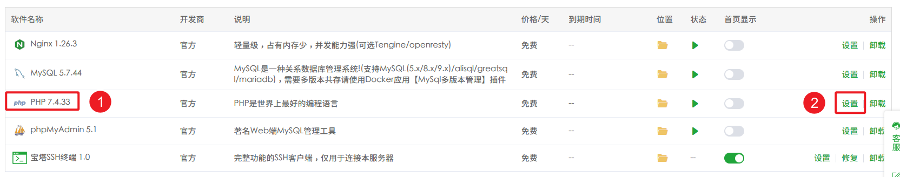

<font style="color:rgb(51, 51, 51);">第二步：选择安装扩展，找到 redis，单击安装</font>

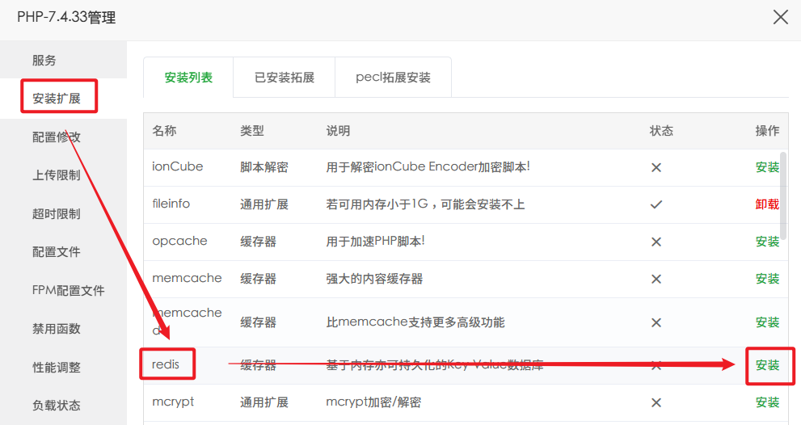

<font style="color:rgb(51, 51, 51);">第三步：等待 redis 安装结束，编写一个 demo.php 程序，查看语言是否支持 redis 扩展</font>

```python
vim /www/wwwroot/www.shop.com/niushop/demo.php
写入如下内容：
<?php
  phpinfo();
?>
```

<font style="color:rgb(51, 51, 51);">第四步：改一下 Windows 中的 hosts 文件，让 </font>[<font style="color:rgb(65, 131, 196);">www.shop.com</font>](https://www.shop.com)<font style="color:rgb(51, 51, 51);"> 指向 192.168.126.174（不走负载均衡，直接访问 web01）</font>

```python
192.168.126.174 www.shop.com
```

<font style="color:rgb(51, 51, 51);">访问如下地址，查看 Redis 扩展是否生效</font>

[<font style="color:rgb(65, 131, 196);">http://www.shop.com/demo.php</font>](http://www.shop.com/demo.php)

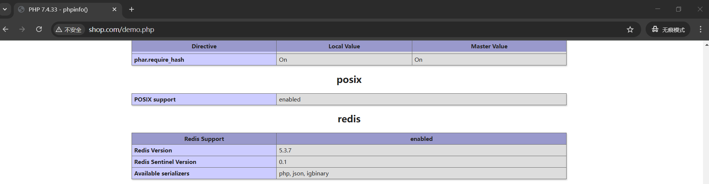

## <font style="color:rgb(51, 51, 51);">redis 应用场景：NiuShop 数据缓存与 session 入 redis</font>

<font style="color:rgb(51, 51, 51);">扩展：Redis 可视化软件 => Another-Redis-Desktop-Manager 软件</font>

<font style="color:rgb(51, 51, 51);">双击安装即可</font>

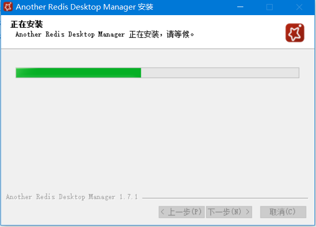

<font style="color:rgb(51, 51, 51);">使用 Another-Redis-Desktop-Manager 连接 Redis 服务器（126.201）</font>

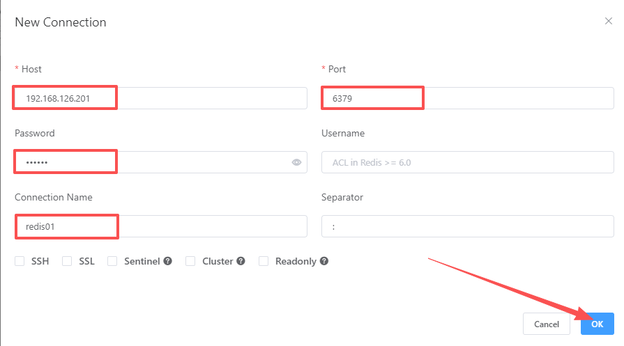

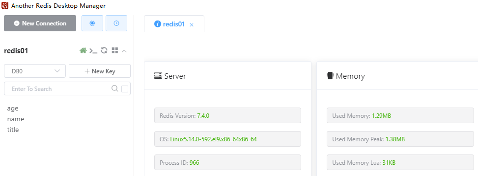

***

<font style="color:rgb(51, 51, 51);">缓存设计：减少 Web 对 MySQL 的访问，减轻数据库压力</font>

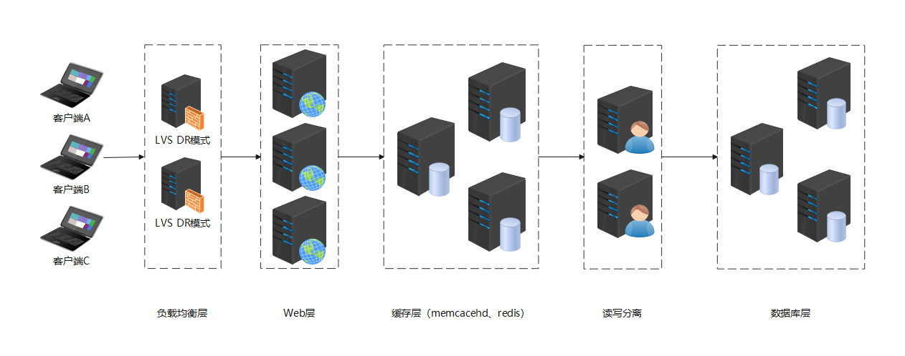

<font style="color:rgb(51, 51, 51);">与之前 session 存储到 file 文件的方式不同，将 session 存储到 redis 中，可以实现 session 的共享以及单点登录(sso)的操作。</font>

[<font style="color:rgb(65, 131, 196);">www.baidu.com</font>](https://www.baidu.com)

<font style="color:rgb(51, 51, 51);">pan.baidu.com</font>

<font style="color:rgb(51, 51, 51);">image.baidu.com</font>

<font style="color:rgb(51, 51, 51);">music.baidu.com</font>

***

<font style="color:rgb(51, 51, 51);">① 更改缓存保存方式（两台 web 服务器都操作）</font>

<code><font style="color:rgb(51, 51, 51);background-color:rgb(243, 244, 244);">vim /www/wwwroot/www.shop.com/niushop/config/cache.php</font></code>

```python
return [
    // 默认缓存驱动
    'default' => Env::get('cache.driver', 'redis'),    // 修改这里！！！

    // 缓存连接方式配置
    'stores'  => [
        'file' => [
            // 驱动方式
            'type'       => 'File',
            // 缓存保存目录
            'path'       => '',
            // 缓存前缀
            'prefix'     => '',
            // 缓存有效期 0表示永久缓存
            'expire'     => 0,
            // 缓存标签前缀
            'tag_prefix' => 'tag:',
            // 序列化机制 例如 ['serialize', 'unserialize']
            'serialize'  => [],
        ],
        // redis缓存
        'redis'   =>  [
            // 驱动方式
            'type'   => 'redis',
            // 服务器地址
            'host'       => '192.168.126.201',			//修改这里！！！
            // redis密码
            'password'  => '123',					//修改这里！！！
            // 缓存有效期 0表示永久缓存
            'expire'     => 604800,
        ],
        // 更多的缓存连接
    ],
];
```

<font style="color:rgb(51, 51, 51);">② 更改 Session 存储位置（两台 web 服务器都操作）</font>

[<font style="color:rgb(65, 131, 196);">https://doc.thinkphp.cn/v6\_1/Session.html</font>](https://doc.thinkphp.cn/v6_1/Session.html)

<code><font style="color:rgb(51, 51, 51);background-color:rgb(243, 244, 244);">vim /www/wwwroot/www.shop.com/niushop/config/session.php</font></code>

<font style="color:rgb(51, 51, 51);">web01 session 文件</font>

<font style="color:rgb(51, 51, 51);">web02 session 文件</font>

<font style="color:rgb(51, 51, 51);">web01/web02 => session => redis</font>

```python
<?php
// +----------------------------------------------------------------------
// | 会话设置
// +----------------------------------------------------------------------

return [
    // session name
    'name'           => 'PHPSESSID',
    // SESSION_ID的提交变量,解决flash上传跨域
    'var_session_id' => '',
    // 驱动方式 支持file cache
    'type'           => 'cache',		// 修改这里
    // 存储连接标识 当type使用cache的时候有效
    'store'          => 'redis',        // 修改这里
    // 过期时间
    'expire'         => 1440*1000,
    // 前缀
    'prefix'         => 'think',      	// 修改这里
];
```

③ 开启 node6（mysql01）服务器

④ 浏览器访问测试，发现 redis 中存储了很多内容，这些内容其实就是项目中经常访问的数据放入缓存了，以及 session 中的信息放入了缓存中。

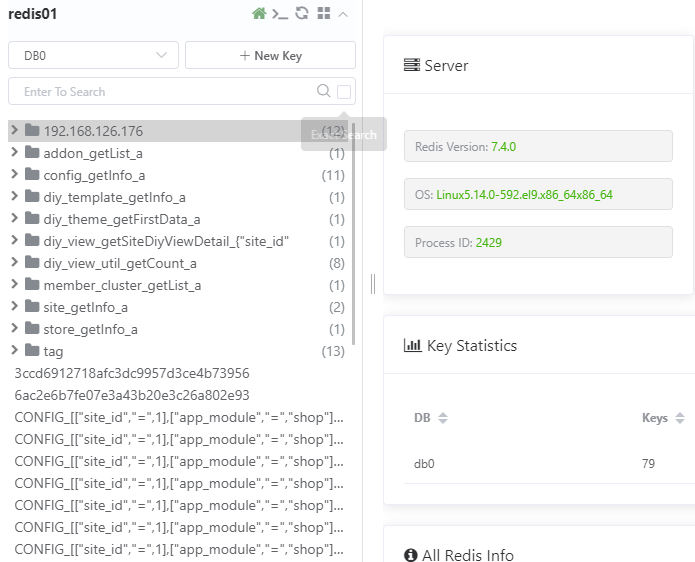

## <font style="color:rgb(51, 51, 51);">nginx+lua+redis 实现访问攻击黑名单 WAF（扩展）</font>

<font style="color:rgb(51, 51, 51);">WAF：（Web Application Firewalld），根据 nginx 访问流量判断是否为恶意攻击，如果 1s 内超过 100个请求，就认为这是恶意攻击。</font>

<font style="color:rgb(51, 51, 51);">① redis01，安装 openresty（nginx + lua）和之前安装一致</font>

```python
#!/bin/bash
dnf -y install pcre-devel zlib-devel openssl-devel
tar -zxf openresty-1.25.3.2.tar.gz
cd openresty-1.25.3.2
./configure && make && make install
```

<font style="color:rgb(51, 51, 51);">② 编写 lua 脚本</font>

[<font style="color:rgb(65, 131, 196);">https://blog.csdn.net/fenglvming/article/details/51996406</font>](https://blog.csdn.net/fenglvming/article/details/51996406)

```python
# mkdir -p /usr/local/lua
# vim /usr/local/lua/access_limit.lua
-- access_by_lua_file '/usr/local/lua/access_limit.lua'
local function close_redis(red)
    if not red then
        return
    end
    --释放连接(连接池实现)
    local pool_max_idle_time = 10000 --毫秒
    local pool_size = 100 --连接池大小
    local ok, err = red:set_keepalive(pool_max_idle_time, pool_size)
 
    if not ok then
        ngx_log(ngx_ERR, "set redis keepalive error : ", err)
    end
end
 
local redis = require "resty.redis"
local red = redis:new()
red:set_timeout(1000)
local ip = "192.168.126.201" -- redis ip
local port = 6379 -- redis port
local ok, err = red:connect(ip,port)
red:auth("123") -- redis auth password
if not ok then
    return close_redis(red)
end
 
local clientIP = ngx.req.get_headers()["X-Real-IP"]
if clientIP == nil then
   clientIP = ngx.req.get_headers()["x_forwarded_for"]
end
if clientIP == nil then
   clientIP = ngx.var.remote_addr
end
 
local incrKey = "user:"..clientIP..":freq"
local blockKey = "user:"..clientIP..":block"
 
local is_block,err = red:get(blockKey) -- check if ip is blocked
if tonumber(is_block) == 1 then
   ngx.exit(ngx.HTTP_FORBIDDEN) -- return 403
   return close_redis(red)
end
 
res, err = red:incr(incrKey)
 
if res == 1 then
   res, err = red:expire(incrKey,1)
end
 
if res > 100 then	-- block 频率，测试环境可以考虑设置为3或5
    res, err = red:set(blockKey,1)
    res, err = red:expire(blockKey,600)    -- 设置ip屏蔽的时间，600秒
end
 
close_redis(red)
```

<font style="color:rgb(51, 51, 51);">在 Nginx 中添加 Lua 脚本：</font>

```python
# vim /usr/local/openresty/nginx/conf/nginx.conf

# user  nobody;
worker_processes  1;

#error_log  logs/error.log;
#error_log  logs/error.log  notice;
#error_log  logs/error.log  info;

#pid        logs/nginx.pid;


events {
    worker_connections  1024;
}


http {
    include       mime.types;
    default_type  application/octet-stream;

    #log_format  main  '$remote_addr - $remote_user [$time_local] "$request" '
    #                  '$status $body_bytes_sent "$http_referer" '
    #                  '"$http_user_agent" "$http_x_forwarded_for"';

    #access_log  logs/access.log  main;

    sendfile        on;
    #tcp_nopush     on;

    #keepalive_timeout  0;
    keepalive_timeout  65;

    #gzip  on;

    server {
        listen       80;
        server_name  localhost;

        #charset koi8-r;

        #access_log  logs/host.access.log  main;
        root html;
        location / {
            index  index.html index.htm;
            # 整个文件就是将root目录提出去了，然后这里引入了我们自己的lua脚本
            access_by_lua_file /usr/local/lua/access_limit.lua;
        }

        #error_page  404              /404.html;

        # redirect server error pages to the static page /50x.html
        #
        error_page   500 502 503 504  /50x.html;
        location = /50x.html {
        }

        # proxy the PHP scripts to Apache listening on 127.0.0.1:80
        #
        #location ~ \.php$ {
        #    proxy_pass   http://127.0.0.1;
        #}

        # pass the PHP scripts to FastCGI server listening on 127.0.0.1:9000
        #
        #location ~ \.php$ {
        #    root           html;
        #    fastcgi_pass   127.0.0.1:9000;
        #    fastcgi_index  index.php;
        #    fastcgi_param  SCRIPT_FILENAME  /scripts$fastcgi_script_name;
        #    include        fastcgi_params;
        #}

        # deny access to .htaccess files, if Apache's document root
        # concurs with nginx's one
        #
        #location ~ /\.ht {
        #    deny  all;
        #}
    }


    # another virtual host using mix of IP-, name-, and port-based configuration
    #
    #server {
    #    listen       8000;
    #    listen       somename:8080;
    #    server_name  somename  alias  another.alias;

    #    location / {
    #        root   html;
    #        index  index.html index.htm;
    #    }
    #}


    # HTTPS server
    #
    #server {
    #    listen       443 ssl;
    #    server_name  localhost;

    #    ssl_certificate      cert.pem;
    #    ssl_certificate_key  cert.key;

    #    ssl_session_cache    shared:SSL:1m;
    #    ssl_session_timeout  5m;

    #    ssl_ciphers  HIGH:!aNULL:!MD5;
    #    ssl_prefer_server_ciphers  on;

    #    location / {
    #        root   html;
    #        index  index.html index.htm;
    #    }
    #}

}

# 启动openresty
# cd /usr/local/openresty
# bin/openresty
```

<font style="color:rgb(51, 51, 51);">③ 测试验证黑名单效果</font>

<font style="color:rgb(51, 51, 51);">先正常访问，是可以访问的；</font>

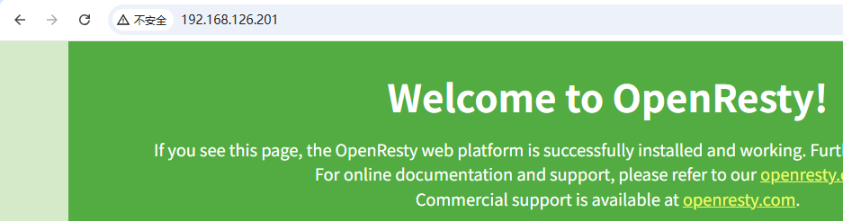

<font style="color:rgb(51, 51, 51);">然后再猛按 F5，发现就报错 403 了（根据脚本中的配置，我们设置了 1 秒访问次数大于 3 次就会被屏蔽），已经被禁止访问了，根据上面我们写的 lua 脚本，该 IP 会被屏蔽 10 分钟。</font>

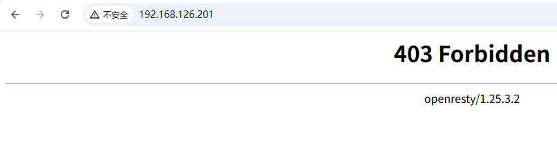

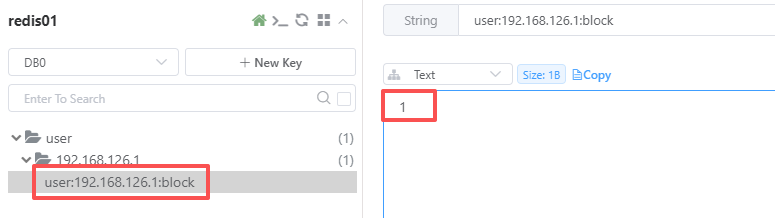

***

openresty = nginx + lua 模块，但是 openresty 本质还是 Nginx，所以管理命令和 Nginx 是一样的。

```python
# 启动openresty
# cd /usr/local/openresty
# bin/openresty

# 强制关闭openresty
# bin/openresty -s stop

# 优雅关闭openresty
# bin/openresty -s quit

# 重载配置文件
# bin/openresty -s reload
```


> 更新: 2026-06-02 08:51:15  
> 原文: <https://www.yuque.com/u41736172/az9urv/hwmsvplxsxuviyiv>