# 10.Redis哨兵与集群架构设计

# <font style="color:rgb(51, 51, 51);">一、Redis哨兵概述</font>

**<font style="color:rgb(51, 51, 51);">主从切换技术的方法是：当主服务器宕机后，需要手动把一台从服务器切换为主服务器，这就需要人工干预，费时费力，还会造成一段时间内服务不可用。</font>**<font style="color:rgb(51, 51, 51);">这不是一种推荐的方式，更多时候，我们优先考虑</font>**<font style="color:rgb(51, 51, 51);">哨兵模式</font>**<font style="color:rgb(51, 51, 51);">。</font>

<font style="color:rgb(51, 51, 51);">哨兵的作用：就是</font>**<font style="color:rgb(51, 51, 51);">当主服务器宕机后</font>**<font style="color:rgb(51, 51, 51);">，</font>**<font style="color:rgb(51, 51, 51);">自动</font>**<font style="color:rgb(51, 51, 51);">把</font>**<font style="color:rgb(51, 51, 51);">从服务器升级为主服务器</font>**<font style="color:rgb(51, 51, 51);">的过程。（健康检查、故障切换）</font>

> <font style="color:rgb(51, 51, 51);">其实我们在上个文档中搭建的 redis 的主从中，当 master 服务器宕机后，我们需要手动切换，将从服务器切换为主服务器，让应用程序操作新的主服务器。</font>

## <font style="color:rgb(51, 51, 51);">什么是哨兵</font>

<font style="color:rgb(51, 51, 51);">哨兵模式是一种特殊的模式，首先Redis提供了哨兵的命令，</font>**<font style="color:rgb(51, 51, 51);">哨兵是一个独立的进程</font>**<font style="color:rgb(51, 51, 51);">，作为进程，它会独立运行。其原理是</font>**<font style="color:rgb(51, 51, 51);">哨兵通过发送命令，等待Redis服务器响应，从而监控运行的多个Redis实例。</font>**

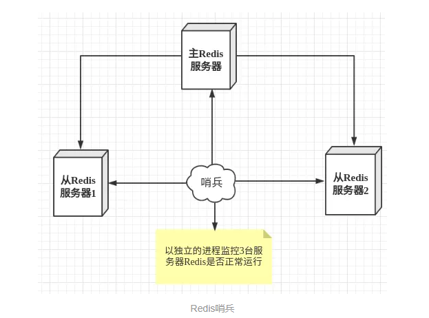

## <font style="color:rgb(51, 51, 51);">哨兵的作用</font>

<font style="color:rgb(51, 51, 51);">这里的哨兵有两个作用</font>

* <font style="color:rgb(51, 51, 51);">健康检查：通过发送命令，让Redis服务器返回监控其运行状态，包括主服务器和从服务器。</font>
* <font style="color:rgb(51, 51, 51);">故障切换：当哨兵监测到master宕机，会自动将slave切换成master，然后通过</font>**<font style="color:rgb(51, 51, 51);">发布订阅模式</font>**<font style="color:rgb(51, 51, 51);">通知其他的从服务器，修改配置文件，让它们切换主机。</font>

<font style="color:rgb(51, 51, 51);">然而一个哨兵进程对Redis服务器进行监控，可能会出现问题，为此，我们可以使用多个哨兵进行监控。各个哨兵之间还会进行监控，这样就形成了多哨兵模式。</font>

<font style="color:rgb(51, 51, 51);">用文字描述一下</font>**<font style="color:rgb(51, 51, 51);">故障切换（failover）</font>**<font style="color:rgb(51, 51, 51);">的过程。假设主服务器宕机，哨兵1先检测到这个结果，系统并不会马上进行failover过程，仅仅是哨兵1主观的认为主服务器不可用，这个现象成为</font>**<font style="color:rgb(51, 51, 51);">主观下线</font>**<font style="color:rgb(51, 51, 51);">。当后面的哨兵也检测到主服务器不可用，并且数量达到一定值时，那么哨兵之间就会进行一次投票，投票的结果由一个哨兵发起，进行failover操作。切换成功后，就会通过发布订阅模式，让各个哨兵把自己监控的从服务器实现切换主机，这个过程称为</font>**<font style="color:rgb(51, 51, 51);">客观下线</font>**<font style="color:rgb(51, 51, 51);">。这样对于客户端而言，一切都是透明的。</font>

## <font style="color:rgb(51, 51, 51);">前期准备</font>

<font style="color:rgb(51, 51, 51);">配置3个哨兵和1主2从的Redis服务器来演示这个过程。（哨兵一般都是奇数的，而且有多个比较保险）</font>

| **<font style="color:rgb(51, 51, 51);">服务类型</font>** | **<font style="color:rgb(51, 51, 51);">是否是主服务器</font>** | **<font style="color:rgb(51, 51, 51);">IP地址</font>** | **<font style="color:rgb(51, 51, 51);">端口</font>** |
| :--- | :--- | :--- | :--- |
| <font style="color:rgb(51, 51, 51);">Redis</font> | <font style="color:rgb(51, 51, 51);">是</font> | <font style="color:rgb(51, 51, 51);">192.168.126.201</font> | <font style="color:rgb(51, 51, 51);">6379</font> |
| <font style="color:rgb(51, 51, 51);">Redis</font> | <font style="color:rgb(51, 51, 51);">否</font> | <font style="color:rgb(51, 51, 51);">192.168.126.202</font> | <font style="color:rgb(51, 51, 51);">6379</font> |
| <font style="color:rgb(51, 51, 51);">Redis</font> | <font style="color:rgb(51, 51, 51);">否</font> | <font style="color:rgb(51, 51, 51);">192.168.126.203</font> | <font style="color:rgb(51, 51, 51);">6379</font> |
| <font style="color:rgb(51, 51, 51);">Sentinel</font> | <font style="color:rgb(51, 51, 51);">-</font> | <font style="color:rgb(51, 51, 51);">192.168.126.201</font> | <font style="color:rgb(51, 51, 51);">26379</font> |
| <font style="color:rgb(51, 51, 51);">Sentinel</font> | <font style="color:rgb(51, 51, 51);">-</font> | <font style="color:rgb(51, 51, 51);">192.168.126.202</font> | <font style="color:rgb(51, 51, 51);">26379</font> |
| <font style="color:rgb(51, 51, 51);">Sentinel</font> | <font style="color:rgb(51, 51, 51);">-</font> | <font style="color:rgb(51, 51, 51);">192.168.126.203</font> | <font style="color:rgb(51, 51, 51);">26379</font> |

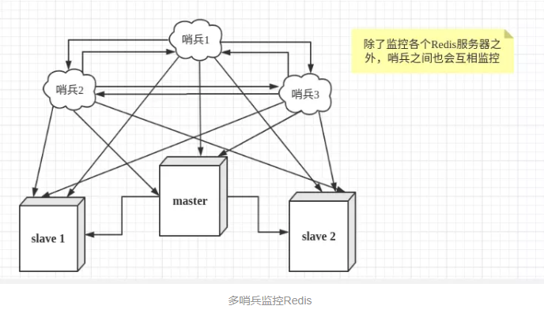

> <font style="color:rgb(119, 119, 119);">特别注意：使用Redis哨兵模式，最少需要3个节点（一主多从结构）</font>

# <font style="color:rgb(51, 51, 51);">二、Redis主从复制搭建</font>

搭建哨兵前，需要先搭建好一主多从，我们是一主两从。redis01 是主，redis02、redis03 是从。

总体思路：先搭建好一主一从，然后将从克隆一份，作为另一个从！

三台 redis 服务器都设置了密码，为 123。

## <font style="color:rgb(51, 51, 51);">Redis主从配置</font>

第一步：恢复 redis01 和 redis02 服务器的快照，恢复到刚刚安装好 redis，并且清空数据的状态！

第二步：修改 redis01 和 redis02 的配置文件

```python
# vim /usr/local/redis/conf/redis.conf
88行：bind 0.0.0.0
112行：protected-mode no
```

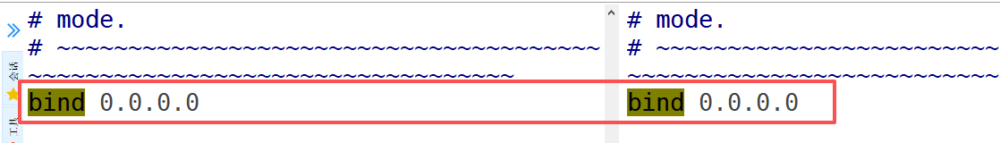

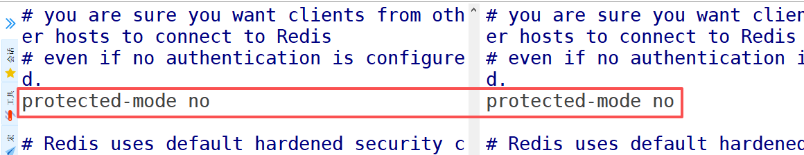

第三步：redis01 和 redis02 服务器均设置 redis 的密码

```python
# vim /usr/local/redis/conf/redis.conf
1052行：requirepass 123
```

<font style="color:rgb(51, 51, 51);">第四步：redis02 服务器设置访问 master 的密码（redis01 服务器是 master、redis02 服务器是 slave）</font>

```python
# vim /usr/local/redis/conf/redis.conf
548行：masterauth 123
```

<font style="color:rgb(51, 51, 51);">第五步：redis02 服务器设置 master 服务器的 IP 地址及端口号</font>

```python
# vim /usr/local/redis/conf/redis.conf
541行：replicaof 192.168.126.201 6379
```

<font style="color:rgb(51, 51, 51);">第六步：重启两台 redis 服务器</font>

```python
# systemctl restart redis
```

<font style="color:rgb(51, 51, 51);">第七步：分别查看 redis01 和 redis02 服务器的状态</font>

```python
redis01服务器：
# redis-cli
127.0.0.1:6379> auth 123
127.0.0.1:6379> info replication
```

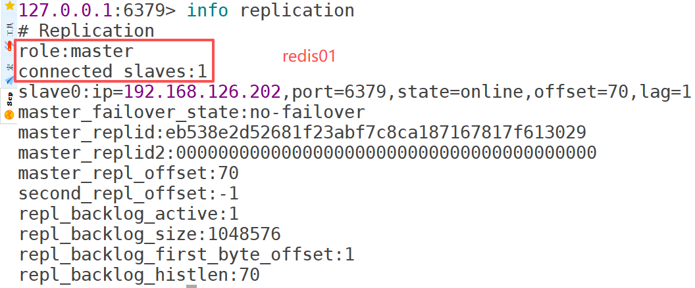

```python
redis02服务器：
# redis-cli
127.0.0.1:6379> info replication
```

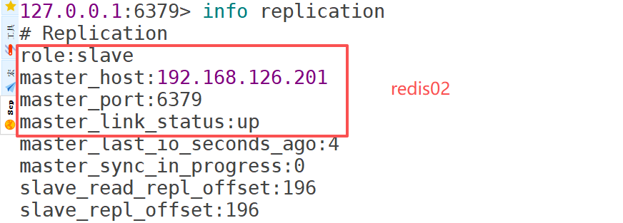

第八步：设置两台 redis 服务器均为开机自启

```python
# systemctl enable redis
```

第九步：关闭 redis02 服务器，将 redis02 服务器克隆出来一份，作为 redis03

第十步：修改 redis03 的 MAC 地址

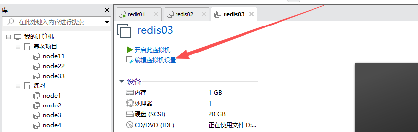

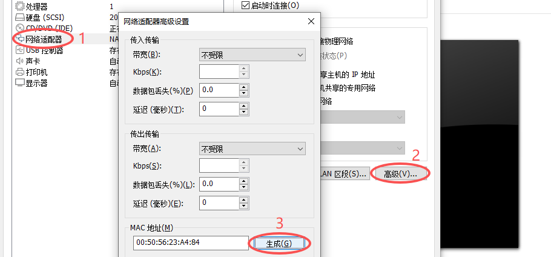

第十一步：启动 redis03 服务器，修改其 IP 地址、主机名，然后重启。启动 redis02 服务器！

```python
# vim /etc/NetworkManager/system-connections/ens33.nmconnection
address1=192.168.126.203/24

# nmcli connection reload
# nmcli connection up ens33

# hostnamectl set-hostname redis03.lhp.cn
# su

# reboot
```

第十二步：检查 redis01、redis02、redis03 的主从复制的状态

```python
# systemctl enable redis
# redis-cli
127.0.0.1:6379> info replication
```

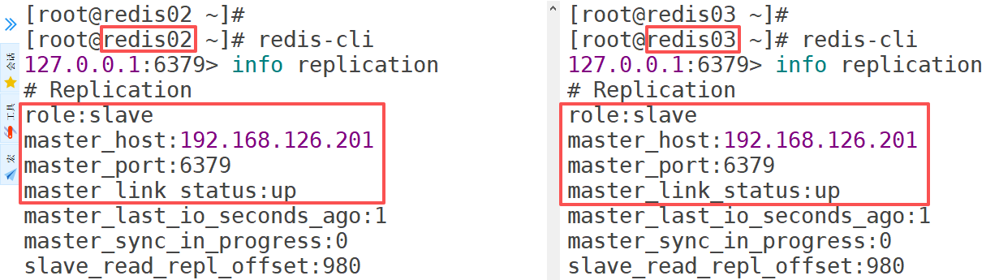

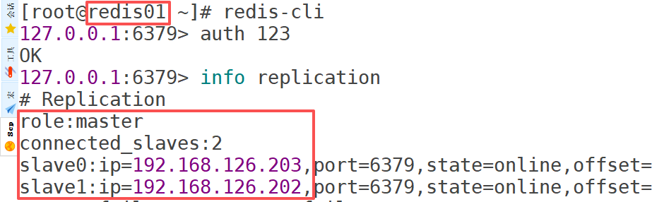

第十三步：给 redis01 服务器也设置访问 master 服务器的密码（因为如果 redis01 宕机后，下次再启动它，它就会作为从，所以需要设置访问主服务器的密码）

```python
# vim /usr/local/redis/conf/redis.conf
548行：masterauth 123

# systemctl restart redis
```

第十四步：给三台 redis 服务器拍摄快照！

**<font style="background-color:#FBDE28;">也可以按照下面的做法搭建一主两从，流程也都差不多！</font>**

<font style="color:rgb(51, 51, 51);">① 安装redis</font>

```python
第一步：找到对应的安装包资源，使用wget命令下载，这里安装的7.4.0版本。
安装包资源地址：https://download.redis.io/releases/

第二步：上传Redis到Linux系统中
# dnf install wget -y
# wget https://download.redis.io/releases/redis-7.4.0.tar.gz

第二步：配置=>编译=>安装
# tar -zxvf redis-7.4.0.tar.gz
# cd redis-7.4.0
# make
# make PREFIX=/usr/local/redis install
```

<font style="color:rgb(51, 51, 51);">② redis01/redis02/redis03修改配置</font>

```python
# sudo mkdir -p /usr/local/redis/conf
# sudo cp redis.conf /usr/local/redis/conf/

# 修改配置
# sudo vim /usr/local/redis/conf/redis.conf
88行： bind 127.0.0.1 -::1  --> bind 0.0.0.0
1050行： # requirepass foobared --> requirepass 123
310行： daemonize no  --> daemonize yes

# 过量使用内存设置为0！在低内存环境下，后台保存可能失败
# sudo vim /etc/sysctl.conf
vm.overcommit_memory = 1

# sysctl -p
```

<font style="color:rgb(51, 51, 51);">③ 启动 redis</font>

```python
# 将redis制作为系统服务
# sudo vim /etc/systemd/system/redis.service
[Unit]
Description=redis-server
After=network.target
 
[Service]
Type=forking
ExecStart=/usr/local/redis/bin/redis-server /usr/local/redis/conf/redis.conf
PrivateTmp=true
 
[Install]
WantedBy=multi-user.target

# systemctl start redis

# 添加redis到环境变量
# sudo vim /etc/profile
export PATH="$PATH:/usr/local/redis/bin"

# source /etc/profile

# 过量使用内存设置为0！在低内存环境下，后台保存可能失败
# sudo vim /etc/sysctl.conf
vm.overcommit_memory = 1

# sysctl -p
```

<font style="color:rgb(51, 51, 51);">我们可以看到，redis 现在的角色是一个master 启动的服务。</font>

<font style="color:rgb(51, 51, 51);">master主节点设置：</font>

```python
bind 0.0.0.0           			      # 允许所有IP连接
protected-mode no         # 禁用保护模式（确保访问受防火墙控制）
requirepass 123                 # 设置从服务器连接需要使用密码
masterauth 123                 # 连接主节点时需要使用的主节点密码

protected-mode：默认代表只允许127.0.0.1访问，集群、哨兵等模式必须关闭此参数
```

## <font style="color:rgb(51, 51, 51);">配置 slave（上面已做，忽略）</font>

<font style="color:rgb(51, 51, 51);">和上面配置 master 一样，我们需要修改端口号和pid 文件，在修改完之后，我们有两种方法配置从服务。</font>

<font style="color:rgb(51, 51, 51);">① 在配置文件中配置从服务</font>

```python
################################# REPLICATION #################################

# Master-Replica replication. Use replicaof to make a Redis instance a copy of
# another Redis server. A few things to understand ASAP about Redis replication.
#
#   +------------------+      +---------------+
#   |      Master      | ---> |    Replica    |
#   | (receive writes) |      |  (exact copy) |
#   +------------------+      +---------------+
#
# 1) Redis replication is asynchronous, but you can configure a master to
#    stop accepting writes if it appears to be not connected with at least
#    a given number of replicas.
# 2) Redis replicas are able to perform a partial resynchronization with the
#    master if the replication link is lost for a relatively small amount of
#    time. You may want to configure the replication backlog size (see the next
#    sections of this file) with a sensible value depending on your needs.
# 3) Replication is automatic and does not need user intervention. After a
#    network partition replicas automatically try to reconnect to masters
#    and resynchronize with them.
#
# replicaof <masterip> <masterport>
replicaof 192.168.126.201 6379
```

<font style="color:rgb(51, 51, 51);">我们可以在配置文件中直接修改 </font>**<font style="color:rgb(51, 51, 51);">slaveof</font>**<font style="color:rgb(51, 51, 51);"> 属性，我们直接配置主服务器的IP地址和端口号，如果这里主服务器有配置密码。</font>

<font style="color:rgb(51, 51, 51);">可以通过配置 </font>**<font style="color:rgb(51, 51, 51);">masterauth</font>**<font style="color:rgb(51, 51, 51);"> 来设置连接密码：</font>

```python
# If the master is password protected (using the "requirepass" configuration
# directive below) it is possible to tell the slave to authenticate before
# starting the replication synchronization process, otherwise the master will
# refuse the slave request.
#
# masterauth <master-password>
masterauth 123
```

<font style="color:rgb(51, 51, 51);">② 启动 redis 服务：</font>

```python
# sudo vim /etc/systemd/system/redis.service
[Unit]
Description=redis-server
After=network.target
 
[Service]
Type=forking
ExecStart=/usr/local/redis/bin/redis-server /usr/local/redis/conf/redis.conf
PrivateTmp=true
 
[Install]
WantedBy=multi-user.target

# systemctl start redis

# 添加redis到环境变量
# sudo vim /etc/profile
export PATH="$PATH:/usr/local/redis/bin"

# source /etc/profile

# 过量使用内存设置为0！在低内存环境下，后台保存可能失败
# sudo vim  /etc/sysctl.conf
vm.overcommit_memory = 1

# sysctl -p
```

<font style="color:rgb(51, 51, 51);">使用 info 命令，查看一下 slave 主机的状态：</font>

```python
# Replication
role:slave
master_host:127.0.0.1
master_port:6379
master_link_status:up
master_last_io_seconds_ago:1
master_sync_in_progress:0
slave_repl_offset:71
slave_priority:100
slave_read_only:1
connected_slaves:0
master_repl_offset:0
repl_backlog_active:0
repl_backlog_size:1048576
repl_backlog_first_byte_offset:0
repl_backlog_histlen:0
```

<font style="color:rgb(51, 51, 51);">我们可以看到，现在的 redis 是一个从服务的角色，连接着6379的服务。接下来我们再来看一下目前master 的状态：</font>

```python
# Replication
role:master
connected_slaves:2
slave0:ip=192.168.88.112,port=6379,state=online,offset=785,lag=0
slave1:ip=192.168.88.113,port=6379,state=online,offset=785,lag=0
master_repl_offset:785
repl_backlog_active:1
repl_backlog_size:1048576
repl_backlog_first_byte_offset:2
repl_backlog_histlen:784
```

<font style="color:rgb(51, 51, 51);">我们如果需要设置读写分离，只需要在主服务器中设置：</font>

```python
# Note: read only slaves are not designed to be exposed to untrusted clients
# on the internet. It's just a protection layer against misuse of the instance.
# Still a read only slave exports by default all the administrative commands
# such as CONFIG, DEBUG, and so forth. To a limited extent you can improve
# security of read only slaves using 'rename-command' to shadow all the
# administrative / dangerous commands.
slave-read-only yes
```

## <font style="color:rgb(51, 51, 51);">常见问题！！！</font>

```python
Redis01/Redis02/Redis03 => redis.conf

bind 0.0.0.0
...
protected-mode no	=>  哨兵必须配置protected-mode，外部网络连接redis服务
```

## <font style="color:rgb(51, 51, 51);">核心代码归纳</font>

**<font style="color:rgb(51, 51, 51);">master：</font>**

```python
wget https://download.redis.io/releases/redis-7.4.0.tar.gz

tar -zxvf redis-7.4.0.tar.gz
cd redis-7.4.0
make
make PREFIX=/usr/local/redis install

mkdir /usr/local/redis/conf -p
cp redis.conf /usr/local/redis/conf
bind 0.0.0.0           			  # 允许所有IP连接
daemonize yes				# 允许后台运行
protected-mode no     # 关闭安全模式
requirepass 123             # 设置从服务器连接需要使用密码
masterauth 123             # 连接主节点时需要使用的主节点密码

#过量使用内存设置为0！在低内存环境下，后台保存可能失败
sudo vim  /etc/sysctl.conf
vm.overcommit_memory = 1
sysctl -p
```

<font style="color:rgb(51, 51, 51);">slave：</font>

```python
wget https://download.redis.io/releases/redis-7.4.0.tar.gz

tar -zxvf redis-7.4.0.tar.gz
cd redis-7.4.0
make
make PREFIX=/usr/local/redis install

mkdir /usr/local/redis/conf -p
cp redis.conf /usr/local/redis/conf
bind 0.0.0.0           			  	# 允许所有IP连接
daemonize yes						# 允许后台运行
protected-mode no     				# 关闭安全模式
replicaof 192.168.126.201 6379       # 配置连接master主服务器
requirepass 123             		# 设置从服务器连接需要使用密码
masterauth 123            			# 连接主节点时需要使用的主节点密码

#过量使用内存设置为0！在低内存环境下，后台保存可能失败
sudo vim  /etc/sysctl.conf
vm.overcommit_memory = 1
sysctl -p
```

# <font style="color:rgb(51, 51, 51);">三、Sentinel哨兵</font>

## <font style="color:rgb(51, 51, 51);">配置Sentinel端口</font>

<font style="color:rgb(51, 51, 51);">在 sentinel.conf 配置文件中， 我们可以找到 port 属性，这里是用来设置 sentinel 的端口，一般情况下，至少会需要三个哨兵对 redis 进行监控。</font>

<font style="color:rgb(51, 51, 51);">在三台 redis 服务器中均做如下操作：</font>

```python
# cd /root/redis-7.4.0
# cp sentinel.conf /usr/local/redis/conf/
# vim /usr/local/redis/conf/sentinel.conf
protected-mode no
port 26379
daemonize no

说明：daemonize no仅用于测试环境，生产环境下需要设置为daemonize yes，代表后台运行。
```

## <font style="color:rgb(51, 51, 51);">配置主服务器的IP和端口</font>

<font style="color:rgb(51, 51, 51);">redis01/redis02/redis03 都要配置：</font>

[<font style="color:rgb(65, 131, 196);">https://redis.io/docs/latest/operate/oss\_and\_stack/management/sentinel/</font>](https://redis.io/docs/latest/operate/oss_and_stack/management/sentinel/)

```python
# vim /usr/local/redis/conf/sentinel.conf
# sentinel monitor <master-name> <ip> <redis-port> <quorum>
#
# Tells Sentinel to monitor this master, and to consider it in O_DOWN
# (Objectively Down) state only if at least <quorum> sentinels agree.
#
# Note that whatever is the ODOWN quorum, a Sentinel will require to
# be elected by the majority of the known Sentinels in order to
# start a failover, so no failover can be performed in minority.
#
# Slaves are auto-discovered, so you don't need to specify slaves in
# any way. Sentinel itself will rewrite this configuration file adding
# the slaves using additional configuration options.
# Also note that the configuration file is rewritten when a
# slave is promoted to master.
#
# Note: master name should not include special characters or spaces.
# The valid charset is A-z 0-9 and the three characters ".-_".
92行：sentinel monitor mymaster 192.168.126.201 6379 2
93行：sentinel auth-pass mymaster 123

注：2权值/阈值，代表至少需要2个哨兵确认才能客观下线。
原理：首先某个哨兵发现master主节点无法连接（无法响应），则会标记为主观下线，如果超过2台哨兵确认master节点故障，则标记为客观下线，并触发故障转移。
----------------------------------------------
高可用：在一个集群中（最少2台及以上节点），某个节点出现故障，集群依然可以对外提供相关服务（可用）
故障转移：failover，当主节点宕机，从节点升级为主节点
高可用往往包含健康检查以及故障转移等特性
```

## <font style="color:rgb(51, 51, 51);">启动所有的Sentinel</font>

一台一台的去启动 Sentinel 哨兵。

```python
# redis-sentinel /usr/local/redis/conf/sentinel.conf
```

可以观察一下终端中打印出来的日志信息。

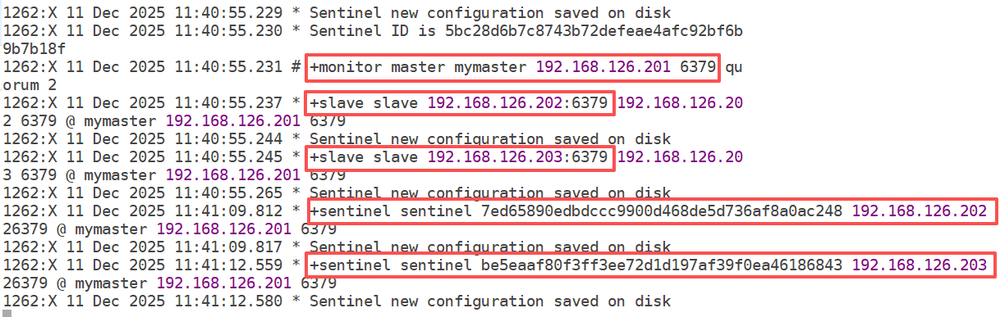

Redis 和 Sentinel 是不同的，两者互相独立。Redis 启动后的进程是 redis-server，Sentinel 启动后的进程是 redis-sentinel。

三个哨兵会互相检测对方的存在，也会检测三台 redis 的存活情况，如果有 1 台哨兵认为 master 挂了，则会标记 master 为主观下线，当 2 台哨兵都认为 master 挂了，就标记 master 为客观下线，这时候就需要从生效的从服务器中选出一个作为新的 master。

**<font style="background-color:#FBDE28;">将三台 redis 服务器都拍摄快照，表示 Sentinel 搭建完毕！</font>**

## <font style="color:rgb(51, 51, 51);">手工关闭master</font>

<font style="color:rgb(51, 51, 51);">我们手动关闭 master 之后，sentinel 在监听 master 确实是断线了之后，将会开始计算权值，然后重新分配主服务器。</font>

<font style="color:rgb(51, 51, 51);">第一步：新开一个 MX 客户端，关闭 redis01 服务器中的 redis 服务</font>

```python
# pkill redis-server
# netstat -tnlp | grep 6379
```

第二步：观察 redis01 服务器中的 Sentinel 监听到的日志信息（其实 3 台 redis 服务器中的 Sentinel 都监听到 master 挂了）

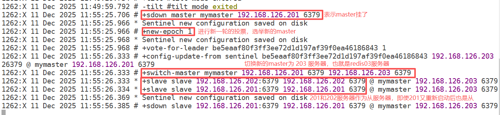

第三步：观察 redis03 的主从复制状态

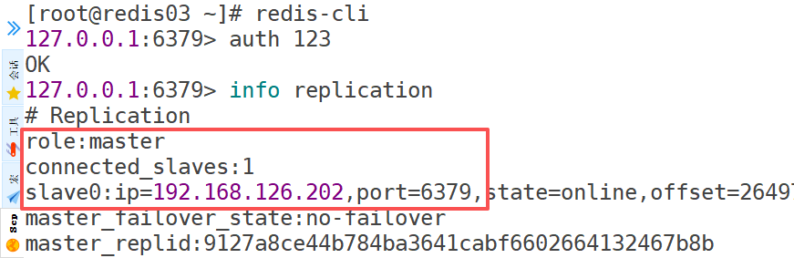

第四步：观察 redis02 的主从复制状态

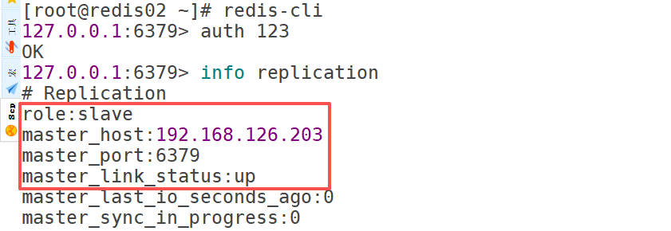

第五步：观察 redis02 的 redis.conf 配置文件

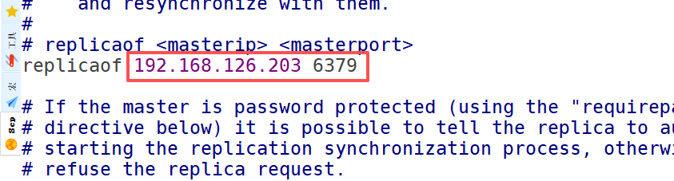

可以看到 redis.conf 配置文件被修改了，改成新的 master 的信息了！

第六步：观察 redis02 的 sentinel.conf 配置文件

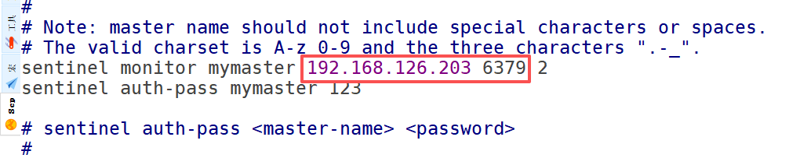

可以看到 sentinel.conf 配置文件被修改了，改成新的要监听的 master 服务器的信息了！

而且在 sentinel.conf 配置文件的最后还多了以下内容：

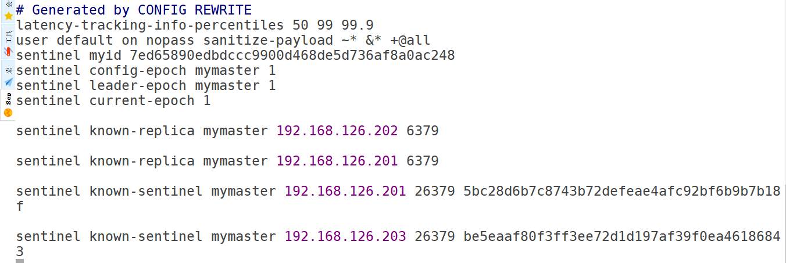

## <font style="color:rgb(51, 51, 51);">重连master</font>

<font style="color:rgb(51, 51, 51);">大家可能会好奇，如果 master 重连之后，会不会抢回属于他的位置，答案是否定的，就比如你被一个小弟抢了你老大的位置，他肯给回你这个位置吗。因此当挂掉的 master 回来之后，他也只能当个小弟。 </font>

## <font style="color:rgb(51, 51, 51);">Sentinel工作原理（记住）</font>

<font style="color:rgb(51, 51, 51);">① master 状态监测</font>

<font style="color:rgb(51, 51, 51);">② 如果某个哨兵发现 master 异常，先主观下线，超过节点阈值为2（代表至少2个哨兵发现 master 异常），则标记为客观下线。就会进行 master-slave 转换，将其中一个 slave 作为 master，将之前的master 作为 slave </font>

<font style="color:rgb(51, 51, 51);">③ master-slave 切换后，master\_redis.conf、slave\_redis.conf 和 sentinel.conf 的内容都会发生改变，即 master\_redis.conf 中会多一行 slaveof 的配置，sentinel.conf 的监控目标会随之调换</font>

<font style="color:rgb(51, 51, 51);">哨兵模式：就是在主从架构的基础上，增加了一个 failover 故障切换功能，可以在秒级实现故障转移。从而实现 redis 高可用架构。</font>

## <font style="color:rgb(51, 51, 51);">第二次启动哨兵</font>

如果把 3 台 redis 服务器的哨兵都停止掉，然后重新启动 3 台机器的哨兵，那么打印的日志会相对来说较少。但是不影响效果的！

可以尝试：

1. 停止 3 台 redis 服务器的哨兵
2. 启动 redis01 中的 redis 服务（之前 redis01 是作为 master 的，后来它停止了）
3. 启动 3 台 redis 服务器中的哨兵
4. 观察每个哨兵的日志

***

<font style="color:rgb(51, 51, 51);">目标：掌握Redis集群配置 + 区分Redis哨兵与集群区别？</font>

<font style="color:rgb(51, 51, 51);">相同点：都是基于主从模式</font>

<font style="color:rgb(51, 51, 51);">哨兵：针对主从高可用架构，发现master主节点故障，哨兵实现自动切换（10-30s）=> 1主1从或1主多从</font>

<font style="color:rgb(51, 51, 51);">集群：针对主从高可用架构，发现master主节点故障，不需要切换，因为在整个集群中，多主多从，某个节点出现故障，不影响整个集群使用，所以切换速度特别快。</font>

# <font style="color:rgb(51, 51, 51);">四、Redis集群概述</font>

## <font style="color:rgb(51, 51, 51);">什么是Redis集群</font>

<font style="color:rgb(51, 51, 51);">2018 年十月 Redis 发布了稳定版本的 5.0 版本，推出了各种新特性，其中一点是放弃 Ruby 的集群方式，改为 使用 C语言编写的 redis-cli 的方式，使集群的构建方式复杂度大大降低。关于集群的更新可以在 Redis5 的版本说明中看到，如下：</font>

> <font style="color:rgb(119, 119, 119);">The cluster manager was ported from Ruby (redis-trib.rb) to C code inside redis-cli. check </font><code><font style="color:rgb(119, 119, 119);background-color:rgb(243, 244, 244);">redis-cli --cluster help</font></code><font style="color:rgb(119, 119, 119);"> for more info.</font>

<font style="color:rgb(51, 51, 51);">可以查看 Redis 官网查看集群搭建方式，连接如下</font>

[<font style="color:rgb(65, 131, 196);">https://redis.io/topics/cluster-tutorial</font>](https://redis.io/topics/cluster-tutorial)

<font style="color:rgb(51, 51, 51);">以下步骤是在一台 Linux 服务器上搭建有6个节点的 Redis 集群。</font>

<font style="color:rgb(51, 51, 51);">注：实际运维工作中，大概需要3台机器，每台机器2个节点。但是详细规划主从关系，尽量不要把一组主从放在同一台服务器中。这样的话一旦该服务器宕机，那么一对主从就都没了，数据缺失！</font>

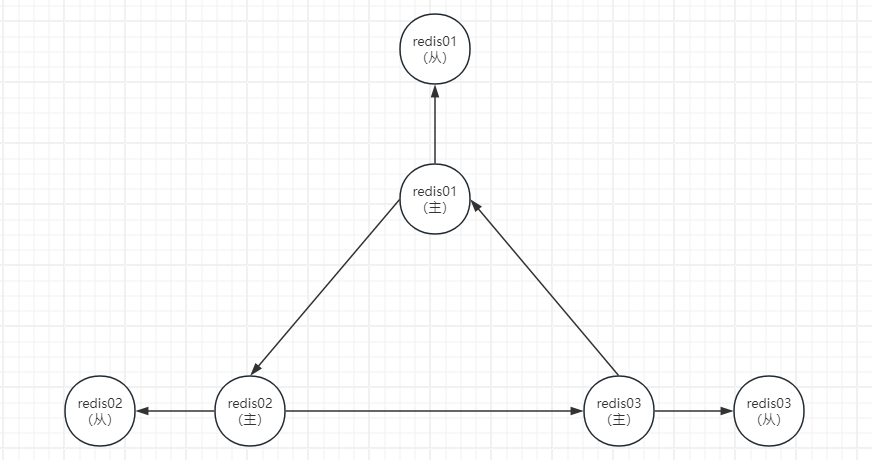

## <font style="color:rgb(51, 51, 51);">环境规划</font>

<font style="color:rgb(51, 51, 51);">IP地址：192.168.126.201 ~ 192.168.126.203</font>

<font style="color:rgb(51, 51, 51);">主机名称：redis01.lhp.cn/redis02.lhp.cn/redis03.lhp.cn</font>

## <font style="color:rgb(51, 51, 51);">下载源码并解压编译</font>

```python
dnf install wget -y
wget https://download.redis.io/releases/redis-7.4.0.tar.gz
tar xzf redis-7.4.0.tar.gz
cd redis-7.4.0
make
make PREFIX=/usr/local/redis install
```

其实我们也不用重新安装 3 台 redis，只需要将之前的 redis 服务器恢复快照即可，恢复到刚刚安装好 redis 的状态！

将 redis01、redis02、redis03 服务器恢复到刚刚安装好 redis 的状态！

redis03 服务器当时是从 redis02 克隆过来的，貌似克隆过来当时没做快照，所以，可以直接将 redis03 服务器删除，重新从已经恢复了快照的 redis02 克隆一台作为 redis03。

然后改好 redis03 的 IP、主机名、MAC 地址，另外再拍个快照。

**总之，最后达到 3 台 redis 服务器中都安装了 redis，并且还未做其他的配置操作！**

## 清理 redis 集群环境

redis01、redis02、redis03 均操作：

```python
# systemctl stop redis
# cd /usr/local/redis
# rm -rf conf/*
# rm -rf dump.rdb
# rm -rf appendonlydir
```

问题：如果没有拍摄快照怎么办？

答：手工清理哨兵环境

```python
# systemctl stop redis
# cd /usr/local/redis
# rm -rf conf/*
# rm -rf dump.rdb
# rm -rf appendonlydir

如果哨兵是后台运行，还可以使用pkill删除
# pkill redis-sentinel
```

# <font style="color:rgb(51, 51, 51);">五、Redis集群配置（单节点，了解，略）</font>

## <font style="color:rgb(51, 51, 51);">创建配置文件</font>

<font style="color:rgb(51, 51, 51);">注：6个配置文件不能在同一个目录，此处我们定义如下：</font>

```python
# mkdir -p /redis/conf/700{1..6}
/redis/conf/7001/redis.conf
/redis/conf/7002/redis.conf
/redis/conf/7003/redis.conf
/redis/conf/7004/redis.conf
/redis/conf/7005/redis.conf
/redis/conf/7006/redis.conf
```

## <font style="color:rgb(51, 51, 51);">配置文件内容</font>

```python
port 7001 #端口
cluster-enabled yes #启用集群模式
cluster-config-file nodes_7001.conf
cluster-node-timeout 5000 #超时时间
appendonly yes
daemonize yes #后台运行
protected-mode no #非保护模式
pidfile /var/run/redis_7001.pid
```

<font style="color:rgb(51, 51, 51);">注：其中 port 和 pidfile 需要随着文件夹的不同递增，一键配合脚本</font>

```python
#!/bin/bash
for i in $(seq 7001 7006)
do
cat > /redis/conf/$i/redis.conf <<EOF
port $i
cluster-enabled yes
cluster-config-file nodes_$i.conf
cluster-node-timeout 5000
appendonly yes
daemonize yes
protected-mode no
pidfile /var/run/redis_$i.pid
EOF
done
```

## <font style="color:rgb(51, 51, 51);">启动节点</font>

```python
#!/bin/bash
for i in $(seq 7001 7006)
do
    /usr/local/redis/bin/redis-server /redis/conf/$i/redis.conf
done
```

## <font style="color:rgb(51, 51, 51);">启动集群</font>

```python
/usr/local/redis/bin/redis-cli --cluster create 127.0.0.1:7001 127.0.0.1:7002 127.0.0.1:7003 127.0.0.1:7004 127.0.0.1:7005 127.0.0.1:7006 --cluster-replicas 1
```

<font style="color:rgb(51, 51, 51);">至此，Reids7 集群搭建完成。</font>

<font style="color:rgb(51, 51, 51);">测试：</font>

```python
# /usr/local/redis/bin/redis-cli -c -p 7001
注：一定要添加-c选项，否则redis-cli默认启动是不以集群方式启动
```

## <font style="color:rgb(51, 51, 51);">关闭集群</font>

<font style="color:rgb(51, 51, 51);">方法一：</font>

```python
/usr/local/redis/bin/redis-cli -p 7001 shutdown
/usr/local/redis/bin/redis-cli -p 7002 shutdown
/usr/local/redis/bin/redis-cli -p 7003 shutdown
/usr/local/redis/bin/redis-cli -p 7004 shutdown
/usr/local/redis/bin/redis-cli -p 7005 shutdown
/usr/local/redis/bin/redis-cli -p 7006 shutdown
```

<font style="color:rgb(51, 51, 51);">方法二：</font>

```python
echo 7001 7002 7003 7004 7005 7006 | xargs -n1 -I{} /usr/local/redis/bin/redis-cli -p {} shutdown

-n  ：表示每次执行命令时传递的参数个数
-n1：表示每次只传递 1 个参数 给后续命令
-I   ：用于指定一个占位符（通常用 {}），后续命令中可以通过占位符引用输入参数
```

**<font style="color:rgb(51, 51, 51);">示例：</font>**<font style="color:rgb(51, 51, 51);">输入数据为 </font><code><font style="color:rgb(51, 51, 51);background-color:rgb(243, 244, 244);">1 2 3 4</font></code><font style="color:rgb(51, 51, 51);">，执行 </font><code><font style="color:rgb(51, 51, 51);background-color:rgb(243, 244, 244);">echo</font></code><font style="color:rgb(51, 51, 51);"> 命令：</font>

```python
echo "1 2 3 4" | xargs -n1 echo "Number:"
Number: 1
Number: 2
Number: 3
Number: 4
```

<font style="color:rgb(51, 51, 51);">不加 </font><code><font style="color:rgb(51, 51, 51);background-color:rgb(243, 244, 244);">-n1</font></code><font style="color:rgb(51, 51, 51);"> 时，默认所有参数一次性传递：</font>

```python
echo "1 2 3 4" | xargs echo "Numbers:"
Numbers: 1 2 3 4
```

# <font style="color:rgb(51, 51, 51);">六、Redis集群配置（多节点）</font>

## <font style="color:rgb(51, 51, 51);">Redis集群实现</font>

<font style="color:rgb(51, 51, 51);">第一步：环境规划（3主3从，对外提供服务的一共是3个节点）</font>

<font style="color:rgb(51, 51, 51);">前提：Redis 集群往往在搭建环境时必须要提前设计，而且 Redis 集群要求，在创建集群之前，任何 redis 中都不能有数据！！！</font>

| **<font style="color:rgb(51, 51, 51);">编号</font>** | **<font style="color:rgb(51, 51, 51);">主机名称</font>** | **<font style="color:rgb(51, 51, 51);">IP地址</font>** | **<font style="color:rgb(51, 51, 51);">角色</font>** |
| :--- | :--- | :--- | :--- |
| <font style="color:rgb(51, 51, 51);">1</font> | <font style="color:rgb(51, 51, 51);">redis01.lhp.cn</font> | <font style="color:rgb(51, 51, 51);">192.168.126.201</font> | <font style="color:rgb(51, 51, 51);">redis7001</font> |
| <font style="color:rgb(51, 51, 51);">2</font> | <font style="color:rgb(51, 51, 51);">redis01.lhp.cn</font> | <font style="color:rgb(51, 51, 51);">192.168.126.201</font> | <font style="color:rgb(51, 51, 51);">redis7002</font> |
| <font style="color:rgb(51, 51, 51);">3</font> | <font style="color:rgb(51, 51, 51);">redis02.lhp.cn</font> | <font style="color:rgb(51, 51, 51);">192.168.126.202</font> | <font style="color:rgb(51, 51, 51);">redis7003</font> |
| <font style="color:rgb(51, 51, 51);">4</font> | <font style="color:rgb(51, 51, 51);">redis02.lhp.cn</font> | <font style="color:rgb(51, 51, 51);">192.168.126.202</font> | <font style="color:rgb(51, 51, 51);">redis7004</font> |
| <font style="color:rgb(51, 51, 51);">5</font> | <font style="color:rgb(51, 51, 51);">redis03.lhp.cn</font> | <font style="color:rgb(51, 51, 51);">192.168.126.203</font> | <font style="color:rgb(51, 51, 51);">redis7005</font> |
| <font style="color:rgb(51, 51, 51);">6</font> | <font style="color:rgb(51, 51, 51);">redis03.lhp.cn</font> | <font style="color:rgb(51, 51, 51);">192.168.126.203</font> | <font style="color:rgb(51, 51, 51);">redis7006</font> |

> <font style="color:rgb(119, 119, 119);">设置之前，把 Redis01、Redis02、Redis03 机器上的所有 Redis 全部停止，删除所有配置文件redis.conf、sentinel.conf</font>

<font style="color:rgb(51, 51, 51);">第二步：在 /usr/local/redis/conf 目录中创建 redis7001.conf ... redis7006.conf</font>

<font style="color:rgb(51, 51, 51);">redis01  => redis7001.conf/redis7002.conf</font>

<font style="color:rgb(51, 51, 51);">redis02  => redis7003.conf/redis7004.conf</font>

<font style="color:rgb(51, 51, 51);">redis03  => redis7005.conf/redis7006.conf</font>

**<font style="color:rgb(51, 51, 51);">redis01 服务器：</font>**

```python
# vim /usr/local/redis/conf/redis7001.conf
port 7001
cluster-enabled yes
cluster-config-file nodes_7001.conf
cluster-node-timeout 5000
appendonly yes
daemonize yes
protected-mode no
pidfile /var/run/redis_7001.pid

# vim /usr/local/redis/conf/redis7002.conf
port 7002
cluster-enabled yes
cluster-config-file nodes_7002.conf
cluster-node-timeout 5000
appendonly yes
daemonize yes
protected-mode no
pidfile /var/run/redis_7002.pid
```

**<font style="color:rgb(51, 51, 51);">redis02 服务器：</font>**

```python
# vim /usr/local/redis/conf/redis7003.conf
port 7003
cluster-enabled yes
cluster-config-file nodes_7003.conf
cluster-node-timeout 5000
appendonly yes
daemonize yes
protected-mode no
pidfile /var/run/redis_7003.pid

# vim /usr/local/redis/conf/redis7004.conf
port 7004
cluster-enabled yes
cluster-config-file nodes_7004.conf
cluster-node-timeout 5000
appendonly yes
daemonize yes
protected-mode no
pidfile /var/run/redis_7004.pid
```

**redis03 服务器：**

```python
# vim /usr/local/redis/conf/redis7005.conf
port 7005
cluster-enabled yes
cluster-config-file nodes_7005.conf
cluster-node-timeout 5000
appendonly yes
daemonize yes
protected-mode no
pidfile /var/run/redis_7005.pid

# vim /usr/local/redis/conf/redis7006.conf
port 7006
cluster-enabled yes
cluster-config-file nodes_7006.conf
cluster-node-timeout 5000
appendonly yes
daemonize yes
protected-mode no
pidfile /var/run/redis_7006.pid
```

<font style="color:rgb(51, 51, 51);">第三步：配置完成后，启动 redis 6 个节点</font>

```python
redis01服务器：
# cd /usr/local/redis
# bin/redis-server conf/redis7001.conf
# bin/redis-server conf/redis7002.conf

redis02服务器
# cd /usr/local/redis
# bin/redis-server conf/redis7003.conf
# bin/redis-server conf/redis7004.conf

redis03服务器
# cd /usr/local/redis
# bin/redis-server conf/redis7005.conf
# bin/redis-server conf/redis7006.conf
```

<font style="color:rgb(51, 51, 51);">第四步：创建集群（集群最少需要3个主节点）我们将每台机器上的 redis 主从实例进行</font>**<font style="color:rgb(51, 51, 51);">交叉存放</font>**

| redis01 | redis02 | redis03 |
| --- | --- | --- |
| 1 主 7001 | 1 从 7003 | |
| | 2 主 7004 | 2 从 7005 |
| 3 从 7002 | | 3 主 7006 |

```python
在随便哪台redis服务器中执行下面的命令：
# cd /usr/local/redis
# bin/redis-cli --cluster create 192.168.126.201:7001 192.168.126.202:7004 192.168.126.203:7006 192.168.126.202:7003 192.168.126.203:7005 192.168.126.201:7002 --cluster-replicas 1

参数说明：
--cluster create创建集群，后面跟redis及端口号
--cluster-replicas 1，每个主节点默认都有1个从节点
集群模式不需要提前搭建主从架构，而是在创建集群时，系统会自动配置主从，不需要人工干预
bin/redis-cli --cluster create  ①主节点 ②主节点 ③主节点  ①从节点 ②从节点 ③从节点

执行完命令后打印的效果：
>>> Performing hash slots allocation on 6 nodes...
Master[0] -> Slots 0 - 5460
Master[1] -> Slots 5461 - 10922
Master[2] -> Slots 10923 - 16383
Adding replica 192.168.126.202:7003 to 192.168.126.201:7001
Adding replica 192.168.126.203:7005 to 192.168.126.202:7004
Adding replica 192.168.126.201:7002 to 192.168.126.203:7006
M: 410d4b4c8a45498c5f215948c61f177e74252ba4 192.168.126.201:7001
   slots:[0-5460] (5461 slots) master
M: 06e0d73ece11be895c291023c0fbe110b1d20c59 192.168.126.202:7004
   slots:[5461-10922] (5462 slots) master
M: c90c98222c864cd384795753c7288a3abc57f46f 192.168.126.203:7006
   slots:[10923-16383] (5461 slots) master
S: 41cf87c85f45fff589d902ebabe870780001be75 192.168.126.202:7003
   replicates 410d4b4c8a45498c5f215948c61f177e74252ba4
S: 82c6068419c7cd873498a0a9355b41245f94d929 192.168.126.203:7005
   replicates 06e0d73ece11be895c291023c0fbe110b1d20c59
S: a7b7ca6db38b160c9888bca0e9f32ad38096fb45 192.168.126.201:7002
   replicates c90c98222c864cd384795753c7288a3abc57f46f
Can I set the above configuration? (type 'yes' to accept): yes
>>> Nodes configuration updated
>>> Assign a different config epoch to each node
>>> Sending CLUSTER MEET messages to join the cluster
Waiting for the cluster to join
.
>>> Performing Cluster Check (using node 192.168.126.201:7001)
M: 410d4b4c8a45498c5f215948c61f177e74252ba4 192.168.126.201:7001
   slots:[0-5460] (5461 slots) master
   1 additional replica(s)
M: 06e0d73ece11be895c291023c0fbe110b1d20c59 192.168.126.202:7004
   slots:[5461-10922] (5462 slots) master
   1 additional replica(s)
S: 41cf87c85f45fff589d902ebabe870780001be75 192.168.126.202:7003
   slots: (0 slots) slave
   replicates 410d4b4c8a45498c5f215948c61f177e74252ba4
S: 82c6068419c7cd873498a0a9355b41245f94d929 192.168.126.203:7005
   slots: (0 slots) slave
   replicates 06e0d73ece11be895c291023c0fbe110b1d20c59
S: a7b7ca6db38b160c9888bca0e9f32ad38096fb45 192.168.126.201:7002
   slots: (0 slots) slave
   replicates c90c98222c864cd384795753c7288a3abc57f46f
M: c90c98222c864cd384795753c7288a3abc57f46f 192.168.126.203:7006
   slots:[10923-16383] (5461 slots) master
   1 additional replica(s)
[OK] All nodes agree about slots configuration.
>>> Check for open slots...
>>> Check slots coverage...
[OK] All 16384 slots covered.
```

***

<font style="color:rgb(51, 51, 51);">常见问题说明：</font>

<font style="color:rgb(51, 51, 51);">常见问题：Redis 集群要求 Redis 中不能有数据，包括 appendonlydir、dump.rdb、nodes\_700X.conf</font>

<font style="color:rgb(51, 51, 51);">解决方案：哪个节点报错，就清除哪个节点（以7001为例）</font>

```python
ps -ef | grep redis-server

找到7001对应的进程
kill -9 进程号

rm -rf appendonlydir
rm -rf dump.rdb
rm -rf node_7001.conf

清除完成后，重启Redis
bin/redis-server conf/redis7001.conf
```

## <font style="color:rgb(51, 51, 51);">测试集群</font>

```python
# bin/redis-cli -c -h 主节点IP地址 -p 7001
选项说明：
-c代表已集群的方式进行连接

比如：
# bin/redis-cli -c -h 192.168.126.201 -p 7001
192.168.126.201:7001> set name zhangsan
-> Redirected to slot [5798] located at 192.168.126.202:7004
OK
192.168.126.202:7004> set age 18
-> Redirected to slot [741] located at 192.168.126.201:7001
OK
192.168.126.201:7001> get name
-> Redirected to slot [5798] located at 192.168.126.202:7004
"zhangsan"
192.168.126.202:7004> get age
-> Redirected to slot [741] located at 192.168.126.201:7001
"18"
192.168.126.201:7001> exit

然后登录到一台从服务器中：发现也是可以获取到数据的！！！
# bin/redis-cli -c -h 192.168.126.201 -p 7002
192.168.126.201:7002> get name
-> Redirected to slot [5798] located at 192.168.126.202:7004
"zhangsan"
192.168.126.202:7004> get age
-> Redirected to slot [741] located at 192.168.126.201:7001
"18"
```

> 其实也可以做如下测试，发现也是没问题的：
>
> 1. 停止 redis03 服务器，发现整个集群还是可以正常工作的！
> 2. 启动 redis03 服务器，并且启动 redis03 服务器中的两个 redis，发现这两个 redis 会以从服务器的身份正常加入到集群中！

## <font style="color:rgb(51, 51, 51);">关闭集群</font>

```python
# cd /usr/local/redis
# bin/redis-cli -c -h 192.168.126.201 -p 7001 shutdown
# bin/redis-cli -c -h 192.168.126.201 -p 7002 shutdown

# cd /usr/local/redis
# bin/redis-cli -c -h 192.168.126.202 -p 7003 shutdown
# bin/redis-cli -c -h 192.168.126.202 -p 7004 shutdown

# cd /usr/local/redis
# bin/redis-cli -c -h 192.168.126.203 -p 7005 shutdown
# bin/redis-cli -c -h 192.168.126.203 -p 7006 shutdown
```

## <font style="color:rgb(51, 51, 51);">集群重启</font>

<font style="color:rgb(51, 51, 51);">重启步骤非常简单，只需要把每台服务器的各个节点依次启动即可。</font>

```python
# cd /usr/local/redis
# bin/redis-server conf/7001.conf
# bin/redis-server conf/7002.conf

# cd /usr/local/redis
# bin/redis-server conf/7003.conf
# bin/redis-server conf/7004.conf

# cd /usr/local/redis
# bin/redis-server conf/7005.conf
# bin/redis-server conf/7006.conf
```

## 代码端绑定 redis 集群（了解）

配置好了 redis 集群，Java/Python/PHP 代码，如何实现绑定 redis 集群？

Java

```java
import redis,clients.jedis.HostAndPort;
import redis.clients.jedis.JedisCluster;
import java.util.HashSet;
import java.util.set;

public class RedisclusterExample{
    public static void main(string[] args){
        Set<HostAndPort> nodes =new Hashset<>();
        nodes.add(new HostAndPort("192.168.126.201",7001));
        nodes.add(new HostAndport("192.168.126.201",7002));
        nodes.add(new HostAndPort("192.168.126.202",7003));
        nodes.add(new HostAndPort("192.168.126.202",7004));
        nodes.add(new HostAndPort("192.168.126.203",7005));
        nodes.add(new HostAndPort("192.168.126.203",7006));

        //构造 ediscluster 客户端
        Jediscluster jedisCluster = new Jediscluster(nodes);
        //写入和读取示例
        jediscluster.set("key1","Hello Redis cluster");
        string value = jediscluster.get("key1");
        
        System.out.println("key1=" + value);
    }
}
```

SpringBoot 框架，通过 yaml 进行配置，application.yml

```yaml
spring:
  redis:
    cluster:
      nodes:
        - 192.168.126.201:7001
        - 192.168.126.201:7002
        - 192.168.126.202:7003
        - 192.168.126.202:7004
        - 192.168.126.203:7005
        - 192.168.126.203:7006
    timeout: 5000
```

Python

```python
pip install redis-py-cluster

-----------------------------------------------

from redis.cluster import RedisCluster

# redis 节点列表（可用任意一部分节点，会自动发现集群拓扑）
startup_nodes = [
    {"host":"192.168.126.201", "port":7001},
    {"host":"192.168.126.202", "port":7004},
    {"host":"192.168.126.203", "port":7006}
]

# 创建RedisCluster实例
rc = RedisCluster(startup_nodes=startup_nodes, decode_responses=True)

# 测试写入与读取
rc.set('key3', 'Hello from Python Redis Cluster')
print(rc.get('key3'))
```

PHP：

```php
$redis = new RedisCluster(
    NULL,
    [
        '192.168.126.201:7001',
        '192.168.126.202:7004',
        '192.168.126.203:7006'
    ]
);

$redis->set('key5', 'Hello from PHP phpredis cluster');
echo $redis->get('key5');
```

# <font style="color:rgb(51, 51, 51);">七、集群原理（面试）</font>

## <font style="color:rgb(51, 51, 51);">16384个哈希槽</font>

<font style="color:rgb(51, 51, 51);">redis cluster 在设计的时候，就考虑到了去中心化，去中间件，也就是说，集群中的每个节点都是平等的关系，都是对等的，每个节点都保存各自的数据和整个集群的状态。每个节点都和其他所有节点连接，而且这些连接保持活跃，这样就保证了我们只需要连接集群中的任意一个节点，就可以获取到其他节点的数据。</font>

<font style="color:rgb(51, 51, 51);">Redis 集群没有并使用传统的一致性哈希来分配数据，而是采用另外一种叫做</font><code><font style="color:rgb(51, 51, 51);background-color:rgb(243, 244, 244);">哈希槽 (hash slot)</font></code><font style="color:rgb(51, 51, 51);">的方式来分配的。redis cluster 默认分配了 16384 个slot，当我们 set 一个 key 时，会用</font><code><font style="color:rgb(51, 51, 51);background-color:rgb(243, 244, 244);">CRC16</font></code><font style="color:rgb(51, 51, 51);">算法来取模得到所属的</font><code><font style="color:rgb(51, 51, 51);background-color:rgb(243, 244, 244);">slot</font></code><font style="color:rgb(51, 51, 51);">，然后将这个 key 分到哈希槽区间的节点上，具体算法就是：</font><code><font style="color:rgb(51, 51, 51);background-color:rgb(243, 244, 244);">CRC16(key) % 16384。所以我们在测试的时候看到 set 和 get 的时候，直接跳转到了7000 端口的节点。</font></code>

<font style="color:rgb(51, 51, 51);">Redis 兼具高可用及故障切换能力：Redis 集群会把数据存在一个 master 节点，然后在这个 master 和其对应的 slave 之间进行数据同步。当读取数据时，也根据一致性哈希算法到对应的 master 节点获取数据。只有当一个master 挂掉之后，才会启动一个对应的 slave 节点，充当 master 。</font>

<font style="color:rgb(51, 51, 51);">需要注意的是：必须要</font><code><font style="color:rgb(51, 51, 51);background-color:rgb(243, 244, 244);">3个或以上</font></code><font style="color:rgb(51, 51, 51);">的主节点，否则在创建集群时会失败，并且</font>**<font style="color:rgb(51, 51, 51);">当存活的主节点数小于总节点数的一半时，整个集群就无法提供服务了。</font>**

<font style="color:rgb(51, 51, 51);">3主 3从 = 正常</font>

<font style="color:rgb(51, 51, 51);">1主 3从 = 1 < (1+3)/2 = 2 集群失效</font>

<font style="color:rgb(51, 51, 51);">3主 2从 = 3 < 5 / 2 = 2.5 不成立，集群依然可以正常对外提供服务</font>

***

<font style="color:rgb(51, 51, 51);">简单理解：Redis 集群就是一个大仓库，这个仓库中为了方便数据存储，拆分为 16384 slot 哈希槽。</font>

<font style="color:rgb(51, 51, 51);">因为写只和 master 主节点相关，所以 16384 要被 3 个 master 拆分</font>

<font style="color:rgb(51, 51, 51);">Master\[0] -> Slots 0 - 5460</font>

<font style="color:rgb(51, 51, 51);">Master\[1] -> Slots 5461 - 10922</font>

<font style="color:rgb(51, 51, 51);">Master\[2] -> Slots 10923 - 16383</font>

<font style="color:rgb(51, 51, 51);">问题：为什么要分槽？写入一条记录如 name:zhangsan，写入到哪个槽中？</font>

<font style="color:rgb(51, 51, 51);">答：分槽目的是为了实现数据最大程度使用，也可以避免数据写入混乱。</font>

<font style="color:rgb(51, 51, 51);">写入一条记录如 name:zhangsan，写入到哪个槽中？</font>

<font style="color:rgb(51, 51, 51);">在 Redis 设计过程中，引入了一个 crc16 函数，用于针对 key 求解，结果返回一个数字 => crc16(name) = 5000</font>

<font style="color:rgb(51, 51, 51);">具体数据写入到哪里 => 哈希求余 => crc16(name) % 16384 = 5000 % 16384 = 1666（存放槽位置）</font>

问题：哈希槽一共有16384个，如果存储 16385 个 key 会不够么?

答：Redis 集群將数据分布到 16384 个哈希槽中，并且每个哈希槽并不是专门为某个键留出一个空间，而是作为一个逻辑单元，存储多个键。每个键通过 CRC16 算法和取模操作(CRC16(key) % 16384 )被映射到某个哈希槽。一个哈希槽可以存放该哈希槽下的所有键值对。

换句话说，多个键会被分配到同一个哈希槽中，这完全取决于这些键的哈希值和哈希槽的数量。每个哈希槽并没有固定的容量限制，只要 Redis 集群的内存容量足够，哈希槽就可以存储多个键 。

此外，哈希槽的概念主要是用于决定数据存储位置和数据分片。Redis 集群通过将不同的哈希槽分配给不同的节点来实现数据的分布式存储。在这种机制下，每个哈希槽可以容纳多个键值对，而不会因为哈希槽数量有限而影响到能存储的数据量。


> 更新: 2026-06-03 13:39:37  
> 原文: <https://www.yuque.com/u41736172/az9urv/ppczco9q1igu4das>