# 12.MySQL数据库的高可用

# 一、场景说明
<font style="color:#000000;">最早期高可用架构都是基于 </font><font style="color:rgb(216,57,49);">MHA </font><font style="color:#000000;">设计的，主要针对 </font><font style="color:rgb(216,57,49);">MySQL5.5 ~ MySQL5.7</font><font style="color:#000000;">，但是由于 MHA 官网很久没有更新，导致没有办法针对 </font><font style="color:rgb(216,57,49);">MySQL8 +</font><font style="color:#000000;"> MHA 实现高可用。</font>

<font style="color:#000000;">MySQL8.0 以后版本，引入了 MGR（组复制），实际上：MySQL5.7 也支持 MGR 组复制，提供了MySQL 高可用架构解决方案。</font>

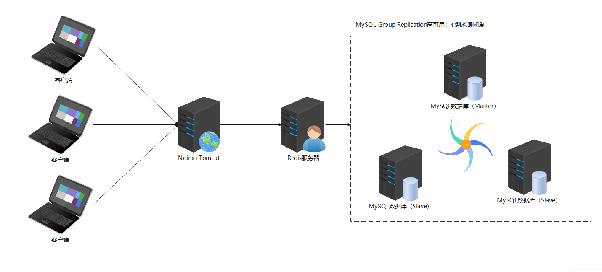

**MySQL 高可用的意思是：比如我们搭建一个 1 主 2 从的 MySQL 集群架构，当主宕机后，自动的在 2 个从服务器中找一个作为主服务器，正常提供服务，实现秒级的故障切换。**

# 二、MGR 概述
## MGR 介绍
Mysql5.7.17 推出了一个<font style="color:rgb(216,57,49);">高可用与高扩展</font>的解决方案 Mysql Group Replication(简称 MGR)，将原有的 <font style="color:rgb(216,57,49);">gtid 复制</font>功能进行了增强，支持单主模式和多主模式。组复制在数据库层面上做到了只要集群中大多数主机可用，则服务可用，也就是说3台服务器的集群，允许其中1台宕机。

## MGR 特点
① <font style="color:rgb(216,57,49);">高一致性</font>，基于<font style="color:rgb(216,57,49);">原生复制</font>及 <font style="color:rgb(216,57,49);">paxos 协议</font> 组复制技术 ，并以插件的方式提供，提供一致数据安全保证；

② <font style="color:rgb(216,57,49);">高容错性</font>，只要不是大多数节点坏掉就可以继续工作，有自动检测机制，当不同节点产生资源争用冲突时，不会出现错误，按照<font style="color:rgb(216,57,49);">先到者优先</font>原则进行处理，并且内置了<font style="color:rgb(216,57,49);">自动化脑裂防护机制</font>；

③ <font style="color:rgb(216,57,49);">高扩展性</font>，节点的新增和移除都是自动的，<font style="color:rgb(216,57,49);">新节点加入后，会自动从其他节点上同步状态</font>，<font style="color:rgb(216,57,49);">直到 新节点和其他节点保持一致</font>，如果某节点被移除了，<font style="color:rgb(216,57,49);">其他节点自动更新组信息，自动维护新的组信息</font>；

④ <font style="color:rgb(216,57,49);">高灵活性</font>，有单主模式和多主模式，<font style="color:rgb(216,57,49);">单主模式下，会自动选主，所有更新操作都在主上进行</font>；多主模式下，所有 server 都可以同时处理更新操作。

MGR 是 MySQL 数据库未来发展的一个重要方向。

小结：<font style="color:rgb(216,57,49);">高一致性，高容错性，高扩展性，高灵活性</font>

## <font style="color:#000000;">MGR 结构需求</font>
<font style="color:#000000;">1）</font><font style="color:rgb(216,57,49);">引擎必须为 innodb</font><font style="color:#000000;">，因为</font><font style="color:rgb(216,57,49);">需事务支持在 commit 时对各节点进行冲突检查</font>

<font style="color:#000000;">2）</font><font style="color:rgb(216,57,49);">每个表必须有主键</font><font style="color:#000000;">，在进行</font><font style="color:rgb(216,57,49);">事务冲突检测时需要利用主键值对比</font>

<font style="color:#000000;">3）</font><font style="color:rgb(216,57,49);">必须开启 binlog 且为 row 格式</font>

<font style="color:#000000;">4）开启 </font><font style="color:rgb(216,57,49);">GTID</font><font style="color:#000000;">，且</font><font style="color:rgb(216,57,49);">主从状态信息存于表中</font><font style="color:#000000;">（--master-info-repository=TABLE 、--relay-log-info-repository=TABLE），--log-slave-updates 打开</font>

<font style="color:#000000;">5）</font><font style="color:rgb(216,57,49);">一致性检测设置</font><font style="color:#000000;">--transaction-write-set-extraction=XXHASH64</font>

## <font style="color:#000000;">MGR 使用限制</font>
<font style="color:#000000;">1）和普通复制 binlog 校验不能共存，需设置--binlog-checksum=none</font>

<font style="color:#000000;">2）不支持 gap lock（间隙锁），隔离级别需设置为 read_committed</font>

<font style="color:#000000;">3）不支持对表进行锁操作（lock /unlock table）,不会发送到其他节点执行 ,影响需要对表进行加锁操作的情况，列入 mysqldump 全表备份恢复操作</font>

<font style="color:#000000;">4）不支持 serializable（序列化）隔离级别</font>

<font style="color:#000000;">5）</font><font style="color:rgb(216,57,49);">DDL 语句不支持原子性，不能检测冲突，执行后需自行校验是否一致</font><font style="color:#000000;">；</font><font style="color:rgb(216,57,49);">不支持外键：多主不支持，单主模式不存在此问题</font><font style="color:#000000;">；</font><font style="color:rgb(216,57,49);">最多支持 9 个节点：超过 9 台 server 无法加入组</font>

# 三、MySQL 高可用搭建（MGR）
## 环境准备
| 编号 | IP | 主机名 | 角色 |
| --- | --- | --- | --- |
| 1 | 192.168.19.101 | mysql01.lhp.cn | master |
| 2 | 192.168.19.102 | mysql02.lhp.cn | slave01 |
| 3 | 192.168.19.103 | mysql03.lhp.cn | slave02 |


关闭防火墙和 SELINUX、设置 IP 与主机映射、时间同步，安装必备工具 vim、wget、rsync

```properties
systemctl stop firewalld
systemctl disable firewalld

setenforce 0
vim /etc/selinux/config

vim /etc/hosts
尾部追加如下内容
192.168.19.101 mysql01 mysql01.lhp.cn
192.168.19.102 mysql02 mysql02.lhp.cn
192.168.19.103 mysql03 mysql03.lhp.cn

时间同步参考之前讲义文档

dnf install vim wget rsync -y

然后修改主机名等等
```

## mysql01 服务器的操作
上传 MySQL 安装包，然后编写如下脚本：vim master.sh

```properties
#!/bin/bash
#1.安装依赖软件
echo "正在安装依赖软件..."
yum -y install libaio &> /dev/null
if [ $? -ne 0 ];then
    echo "libaio安装失败"
    exit 1
fi
#2.判断是否有压缩包，如果有，则执行解压缩操作
echo "正在判断是否有压缩包，如果有进行解压缩操作..."
if [ -f mysql-8.0.40-linux-glibc2.17-x86_64.tar.xz ]; then
    tar -xf mysql-8.0.40-linux-glibc2.17-x86_64.tar.xz
    ls -l mysql-8.0.40-linux-glibc2.17-x86_64
fi
#3.判断系统中是否安装过mariadb软件，如果有对其进行卸载操作
echo "正在判断系统中是否安装过mariadb软件，如果有对其进行卸载操作..."
rpm -qa | grep mariadb | xargs -r dnf remove -y
[ -f /etc/my.cnf ] && rm -rf /etc/my.cnf
#4.创建mysql系统账号
id mysql &> /dev/null
[ $? -ne 0 ] && useradd -r -s /sbin/nologin mysql
#5.创建/export/server目录，然后移动mysql压缩包解压后的文件到/export/server目录下
rm -rf /export/server
mkdir -p /export/server
mv mysql-8.0.40-linux-glibc2.17-x86_64 /export/server/mysql
#6.进入mysql目录，对其进行初始化操作
echo "正在进入mysql目录，对其进行初始化操作..."
cd /export/server/mysql
bin/mysqld --initialize --user=mysql --basedir=/export/server/mysql --datadir=/export/server/mysql/data 2>&1 | tee /tmp/mysqld.log | grep password | awk '{print $NF}' > /tmp/mysql_temp_password.txt
#7.设置ssl加密传输连接
bin/mysql_ssl_rsa_setup --datadir=/export/server/mysql/data &> /dev/null
#8.设置my.cnf与mysqld.service文件
echo "正在设置my.cnf与mysqld.service文件..."
cat > /etc/my.cnf <<EOF
[mysqld]
port=3306
basedir=/export/server/mysql
datadir=/export/server/mysql/data
socket=/tmp/mysql.sock
character_set_server=utf8
collation-server=utf8_unicode_ci
EOF

cat > /etc/systemd/system/mysqld.service <<EOF
[Unit]
Description=MySQL Server
After=network.target

[Service]
User=mysql
Group=mysql
Type=forking

# MySQL 执行命令及路径
ExecStart=/export/server/mysql/bin/mysqld --daemonize --pid-file=/export/server/mysql/data/mysqld.pid
ExecStop=/export/server/mysql/bin/mysqladmin --defaults-file=/export/server/mysql/my.cnf shutdown

# Ensure MySQL has sufficient time to start up
TimeoutSec=600

# PID 文件路径
PIDFile=/export/server/mysql/data/mysqld.pid

# Enable these options to auto-restart the service if it crashes
Restart=on-failure
RestartSec=5

[Install]
WantedBy=multi-user.target
EOF
#9.刷新后台服务，然后启动mysqld
echo "正在刷新后台服务，然后启动mysqld..."
systemctl daemon-reload
systemctl start mysqld
systemctl enable mysqld
#10.重置mysql管理员密码为123456
echo "正在重置mysql管理员密码..."
cd /export/server/mysql
temp_password=`cat /tmp/mysql_temp_password.txt`
bin/mysqladmin -uroot password '123456' -p$temp_password
#11.把mysql的bin目录添加到环境变量中
echo 'export PATH=$PATH:/export/server/mysql/bin' >> /etc/profile
source /etc/profile
#12.解决mysql客户端首次无法登录问题
[ ! -f /lib64/libncurses.so.5 ] && ln -s /lib64/libncurses.so.6 /lib64/libncurses.so.5
[ ! -f /lib64/libtinfo.so.5 ] && ln -s /lib64/libtinfo.so.6 /lib64/libtinfo.so.5
#13.弹出提示，MySQL安装成功
echo "MySQL安装成功，软件安装路径：/export/server/mysql，数据库初始密码：123456！"
```

```properties
source master.sh
```

## mysql02、mysql03 服务器的操作
上传 MySQL 安装包到 mysql02/mysql03 节点，然后编写脚本：vim slave.sh

```properties
#!/bin/bash
#1.安装依赖软件
echo "正在安装依赖软件..."
yum -y install libaio &> /dev/null
if [ $? -ne 0 ];then
    echo "libaio安装失败"
    exit 1
fi
#2.判断是否有压缩包，如果有，则执行解压缩操作
echo "正在判断是否有压缩包，如果有进行解压缩操作..."
if [ -f mysql-8.0.40-linux-glibc2.17-x86_64.tar.xz ]; then
    tar -xf mysql-8.0.40-linux-glibc2.17-x86_64.tar.xz
    ls -l mysql-8.0.40-linux-glibc2.17-x86_64
fi
#3.判断系统中是否安装过mariadb软件，如果有对其进行卸载操作
echo "正在判断系统中是否安装过mariadb软件，如果有对其进行卸载操作..."
rpm -qa | grep mariadb | xargs -r dnf remove -y
[ -f /etc/my.cnf ] && rm -rf /etc/my.cnf
#4.创建mysql系统账号
id mysql &> /dev/null
[ $? -ne 0 ] && useradd -r -s /sbin/nologin mysql
#5.创建/export/server目录，然后移动mysql压缩包解压后的文件到/export/server目录下
rm -rf /export/server
mkdir -p /export/server
mv mysql-8.0.40-linux-glibc2.17-x86_64 /export/server/mysql
#6.进入mysql目录，对其进行初始化操作
echo "正在进入mysql目录，从服务器无需进行初始化操作..."
cd /export/server/mysql
#7.设置ssl加密传输连接
bin/mysql_ssl_rsa_setup --datadir=/export/server/mysql/data &> /dev/null
#8.设置my.cnf与mysqld.service文件
echo "正在设置my.cnf与mysqld.service文件..."
cat > /etc/my.cnf <<EOF
[mysqld]
port=3306
basedir=/export/server/mysql
datadir=/export/server/mysql/data
socket=/tmp/mysql.sock
character_set_server=utf8
collation-server=utf8_unicode_ci
EOF

cat > /etc/systemd/system/mysqld.service <<EOF
[Unit]
Description=MySQL Server
After=network.target

[Service]
User=mysql
Group=mysql
Type=forking

# MySQL 执行命令及路径
ExecStart=/export/server/mysql/bin/mysqld --daemonize --pid-file=/export/server/mysql/data/mysqld.pid
ExecStop=/export/server/mysql/bin/mysqladmin --defaults-file=/export/server/mysql/my.cnf shutdown

# Ensure MySQL has sufficient time to start up
TimeoutSec=600

# PID 文件路径
PIDFile=/export/server/mysql/data/mysqld.pid

# Enable these options to auto-restart the service if it crashes
Restart=on-failure
RestartSec=5

[Install]
WantedBy=multi-user.target
EOF
#9.刷新后台服务，然后启动mysqld
echo "正在刷新后台服务，暂不启动mysqld..."
systemctl daemon-reload
systemctl enable mysqld
#10.把mysql的bin目录添加到环境变量中
echo 'export PATH=$PATH:/export/server/mysql/bin' >> /etc/profile
source /etc/profile
#11.解决mysql客户端首次无法登录问题
[ ! -f /lib64/libncurses.so.5 ] && ln -s /lib64/libncurses.so.6 /lib64/libncurses.so.5
[ ! -f /lib64/libtinfo.so.5 ] && ln -s /lib64/libtinfo.so.6 /lib64/libtinfo.so.5
#13.弹出提示，MySQL安装成功
echo "MySQL安装成功，软件安装路径：/export/server/mysql，数据库暂未初始化，数据库暂未启动！"
```

```properties
source slave.sh
```

## mysql01 服务器的操作
```properties
systemctl stop mysqld
rm -rf /export/server/mysql/data/auto.cnf
rsync -av /export/server/mysql/data mysql02:/export/server/mysql/
rsync -av /export/server/mysql/data mysql03:/export/server/mysql/
```

## MGR 配置实战
第一步：mysql01 主服务器配置

```properties
vim /etc/my.cnf
[mysqld]
basedir=/export/server/mysql
datadir=/export/server/mysql/data
socket=/tmp/mysql.sock
port=3306
log-error=/export/server/mysql/master.err
character_set_server=utf8mb4
collation-server=utf8mb4_unicode_ci

# Group Replication
server_id = 101  # 服务 ID
gtid_mode = ON  # 全局事务
enforce_gtid_consistency = ON # 强制 GTID 的一致性
master_info_repository = TABLE # 将 master.info 元数据保存在系统表中
relay_log_info_repository = TABLE # 将 relay.info 元数据保存在系统表中
binlog_checksum = NONE  # 禁用二进制日志事件校验
log_slave_updates = ON  # 级联复制
log_bin = binlog  # 开启二进制日志记录
binlog_format = ROW  # 以行的格式记录

transaction_write_set_extraction = XXHASH64 # 使用哈希算法将其编码为散列
loose-group_replication_group_name = 'ce9be252-2b71-11e6-b8f4-00212844f856' # 加入的组名
loose-group_replication_start_on_boot = off # 不自动启用组复制集群
loose-group_replication_local_address = '192.168.19.101:33061' # 以本机端口 33061 接受来自组中成员的传入连接
loose-group_replication_group_seeds = '192.168.19.101:33061, 192.168.19.102:33062, 192.168.19.103:33063' # 组中成员访问表
loose-group_replication_bootstrap_group = off # 不启用引导组

plugin-load-add=mysql_clone.so
clone=FORCE_PLUS_PERMANENT  #启动时加载插件并防止它在运行时被删除
```

> 注意：group_replication_group_name 组名称主要是通过 <font style="color:rgb(216,57,49);">uuidgen </font>命令生成
>

重启 MySQL 服务

```properties
touch /export/server/mysql/master.err
chown -R mysql.mysql /export/server/mysql

systemctl restart mysqld
```

创建复制账号

```properties
mysql -uroot -p
Enter password: 123456

mysql> set SQL_LOG_BIN=0; # 停掉日志记录
mysql> create user repl@'%' identified with 'mysql_native_password' by '123';
mysql> grant replication slave,replication client, BACKUP_ADMIN on *.* to repl@'%';
mysql> flush privileges;
mysql> set SQL_LOG_BIN=1;  # 开启日志记录
mysql> change master to master_user='repl',master_password='123' for channel
'group_replication_recovery';  # 构建 group replication 集群
```

安装 group replication 插件

安装插件

```properties
mysql> install PLUGIN group_replication SONAME 'group_replication.so';
```

查看 group replication 组件

```properties
mysql> show plugins;
```

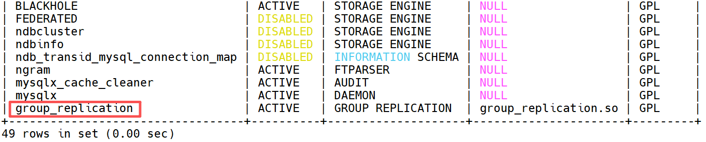

启动服务器 mysql01 上 MySQL 的 <font style="color:rgb(216,57,49);">group replication</font>

```properties
mysql> set global group_replication_bootstrap_group=ON;
mysql> start group_replication;
mysql> set global group_replication_bootstrap_group=OFF;
mysql> select * from performance_schema.replication_group_members;  # 查看状态
```

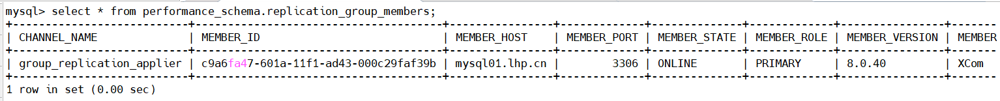

注意：<font style="color:rgb(216,57,49);">在集群没有搭建完成之前，不要往任何数据库中插入数据，否则会导致三端数据不统一，集群容易出现故障！</font>

第二步：mysql02 从服务器配置

<font style="color:#000000;">修改 /etc/my.cnf 配置文件，方法和之前相同 vim /etc/my.cnf</font>

```properties
vim /etc/my.cnf
[mysqld]
basedir=/export/server/mysql
datadir=/export/server/mysql/data
socket=/tmp/mysql.sock
port=3306
log-error=/export/server/mysql/slave.err
character_set_server=utf8mb4
collation-server=utf8mb4_unicode_ci

# Group Replication
server_id = 102  # 注意服务 ID 不一样
gtid_mode = ON
enforce_gtid_consistency = ON
master_info_repository = TABLE
relay_log_info_repository = TABLE
binlog_checksum = NONE
log_slave_updates = ON
log_bin = binlog
binlog_format= ROW

transaction_write_set_extraction = XXHASH64
loose-group_replication_group_name = 'ce9be252-2b71-11e6-b8f4-00212844f856'
loose-group_replication_start_on_boot = off
loose-group_replication_local_address = '192.168.19.102:33062'
loose-group_replication_group_seeds = '192.168.19.101:33061,192.168.19.102:33062,192.168.19.103:33063'
loose-group_replication_bootstrap_group = off

plugin-load-add=mysql_clone.so
clone=FORCE_PLUS_PERMANENT  #启动时加载插件并防止它在运行时被删除
```

重启 MySQL

```properties
touch /export/server/mysql/slave.err
chown -R mysql.mysql /export/server/mysql
systemctl restart mysqld
```

安装 group replication 插件

```properties
mysql> install PLUGIN group_replication SONAME 'group_replication.so';
```

把实例添加到之前的复制组

```properties
mysql -u root -p
Enter password: 123456

mysql> set SQL_LOG_BIN=0; # 停掉日志记录
mysql> create user repl@'%' identified with 'mysql_native_password' by '123';
mysql> grant replication slave,replication client, BACKUP_ADMIN on *.* to repl@'%';
mysql> flush privileges;
mysql> set SQL_LOG_BIN=1;  # 开启日志记录

mysql> reset master;
mysql> -- 设置想要加入组信息
mysql> change master to master_user='repl',master_password='123' for channel 'group_replication_recovery'; 
mysql> start group_replication;
```

返回 mysql01 主服务器，查看复制组状态

```properties
mysql> select * from performance_schema.replication_group_members;
```

注意：<font style="color:rgb(216,57,49);">在集群没有搭建完成之前，不要往任何数据库中插入数据，否则会导致三端数据不统一，集群容易出现故障！</font>

第三步：mysql03 从服务器配置

<font style="color:#000000;">修改 /etc/my.cnf 配置文件，方法和之前相同 vim /etc/my.cnf</font>

```properties
vim /etc/my.cnf
[mysqld]
basedir=/export/server/mysql
datadir=/export/server/mysql/data
socket=/tmp/mysql.sock
port=3306
log-error=/export/server/mysql/slave.err
character_set_server=utf8mb4
collation-server=utf8mb4_unicode_ci

# Group Replication
server_id = 103 #注意服务 ID 不一样
gtid_mode = ON
enforce_gtid_consistency = ON
master_info_repository = TABLE
relay_log_info_repository = TABLE
binlog_checksum = NONE
log_slave_updates = ON
log_bin = binlog
binlog_format= ROW
transaction_write_set_extraction = XXHASH64
loose-group_replication_group_name = 'ce9be252-2b71-11e6-b8f4-00212844f856'
loose-group_replication_start_on_boot = off
loose-group_replication_local_address = '192.168.19.103:33063'
loose-group_replication_group_seeds = '192.168.19.101:33061,192.168.19.102:33062,192.168.19.103:33063'
loose-group_replication_bootstrap_group = off

plugin-load-add=mysql_clone.so
clone=FORCE_PLUS_PERMANENT  #启动时加载插件并防止它在运行时被删除
```

进入 mysql，安装 group replication 插件

```properties
touch /export/server/mysql/slave.err
chown -R mysql.mysql /export/server/mysql

systemctl start mysqld
mysql -uroot -p
Enter password: 123456

mysql> install PLUGIN group_replication SONAME 'group_replication.so';
```

把实例添加到之前的复制组

```properties
mysql> set SQL_LOG_BIN=0; #停掉日志记录
mysql> create user repl@'%' identified with 'mysql_native_password' by '123';
mysql> grant replication slave,replication client, BACKUP_ADMIN on *.* to repl@'%';
mysql> flush privileges;
mysql> set SQL_LOG_BIN=1;  # 开启日志记录

mysql> reset master;
mysql> -- 设置想要加入组信息
mysql> change master to master_user='repl',master_password='123' for channel 'group_replication_recovery'; 
mysql> start group_replication;
```

在 mysql01 上查看复制组状态

```properties
mysql> select * from performance_schema.replication_group_members;
```

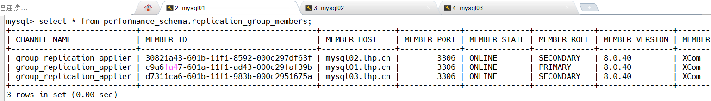

如果以上状态为 ONLINE，则搭建完毕。如果以上状态为 RECORYING，则代表两端数据无法同步到一致状态。解决方案：参考常见问题中问题2进行解决。

建议：<font style="color:rgb(216,57,49);">当 MGR 高可用集群搭建完毕后，需要给每一个节点创建快照，因为下面的操作，如果数据不统一等等问题，可能会导致集群出现故障。</font>

第四步：测试 MySQL

<font style="color:#000000;">回到 master，登录 mysql，执行如下指令：</font>

```properties
mysql> create database test;
mysql> use test;
mysql> create table t1 (id int primary key,name varchar(20)); #注意创建主键
mysql> insert into t1 values (1,'jack');
mysql> select * from t1;
mysql> show binlog events;
```

返回 mysql02 或 mysql03，查看数据库发现 test 库和 t1 表已经完成同步操作

```properties
mysql> show databases;
```

第五步：测试高可用效果

查看哪个节点是主节点，然后使用 systemctl stop mysqld 终止主节点，在查看集群变化

```properties
mysql> select * from performance_schema.replication_group_members;
+---------------------------+--------------------------------------+----------------+-------------+--------------+-------------+----------------+-------
| CHANNEL_NAME              | MEMBER_ID                            | MEMBER_HOST    | MEMBER_PORT | MEMBER_STATE | MEMBER_ROLE | MEMBER_VERSION | MEMBER
+---------------------------+--------------------------------------+----------------+-------------+--------------+-------------+----------------+-------
| group_replication_applier | 30821a43-601b-11f1-8592-000c297df63f | mysql02.lhp.cn |        3306 | ONLINE       | SECONDARY   | 8.0.40         | XCom
| group_replication_applier | c9a6fa47-601a-11f1-ad43-000c29faf39b | mysql01.lhp.cn |        3306 | ONLINE       | PRIMARY     | 8.0.40         | XCom
| group_replication_applier | d7311ca6-601b-11f1-983b-000c2951675a | mysql03.lhp.cn |        3306 | ONLINE       | SECONDARY   | 8.0.40         | XCom
+---------------------------+--------------------------------------+----------------+-------------+--------------+-------------+----------------+-------
3 rows in set (0.00 sec)


# 终止master主节点
systemctl stop mysqld

# 进入mysql02、mysql03查看集群变化，发现mysql02、mysql03中又选出一个新的主节点
select * from performance_schema.replication_group_members;
```

以上单 master 节点的集群就搭建完毕!

## 主节点挂掉后的操作
MySQL 主服务器挂掉后，我们需要做如下操作，即可将其以从服务器的身份加入到 MGR 复制组中继续提供服务！

```properties
在挂掉的主服务器做如下操作：
systemctl start mysqld

mysql -uroot -p123456

设置允许的捐赠者（Donor）IP：也就是设置去哪台服务器克隆数据
SET GLOBAL clone_valid_donor_list = '192.168.19.102:3306';

克隆目前的集群中，任意一个节点的数据，到当前的MySQL服务器中，使得数据同步。这句话执行完之后，会自动重启当前的MySQL服务！
CLONE INSTANCE FROM 'repl'@'192.168.19.102':3306 IDENTIFIED BY '123';
执行完上述克隆命令后，会报错如下，但是无所谓，自己重启MySQL即可
ERROR 3707 (HY000): Restart server failed (mysqld is not managed by supervisor process).

systemctl restart mysqld

mysql -uroot -p123456

start group_replication;		启动组复制，也就是加入到目前的组中

查看组复制的状态：发现正常了！！！！
select * from performance_schema.replication_group_members;
```

## 常见问题说明
### 问题1：MEMBER_STATE 列值为 RECORYING
某同学错误截图：

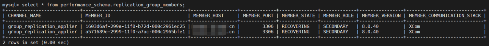

正常设置完成后，两端数据要求完全一样的，但是如果数据没有同步，然后 <font style="color:rgb(216,57,49);">MEMBER_STATE 列值为 RECORYING</font>。

以上情况，往往是数据正在同步，需要等待一段时间，如5分钟左右，再次观察服务状态，如果依然为 <font style="color:rgb(216,57,49);">RECORYING</font>，则代表出现异常。

遇到问题以后，首先要进行问题排查 => 查看错误日志！！！

```properties
查看错误日志，如果有则查看错误文档
log-error=/export/server/mysql/slave.err
如果没有专门的错误日志，我们可以通过/var/log/messages查看解决
tail -100 /var/log/messages
错误日志如下：
Feb 15 17:39:14 node2 mysqld[43267]: 2025-02-15T09:39:14.087853Z 24 [System] [MY-010597] [Repl] 'CHANGE REPLICATION SOURCE TO FOR CHANNEL 'group_replication_recovery' executed'. Previous state source_host='node1.lhp.cn', source_port= 3306, source_log_file='', source_log_pos= 4, source_bind=''. New state source_host='node1.lhp.cn', source_port= 3306, source_log_file='', source_log_pos= 4, source_bind=''.
Feb 15 17:39:14 node2 mysqld[43267]: 2025-02-15T09:39:14.099349Z 80 [Warning] [MY-010897] [Repl] Storing MySQL user name or password information in the connection metadata repository is not secure and is therefore not recommended. Please consider using the USER and PASSWORD connection options for START REPLICA; see the 'START REPLICA Syntax' in the MySQL Manual for more information.
Feb 15 17:39:14 node2 mysqld[43267]: 2025-02-15T09:39:14.127878Z 24 [ERROR] [MY-011582] [Repl] Plugin group_replication reported: 'There was an error when connecting to the donor server. Please check that group_replication_recovery channel credentials and all MEMBER_HOST column values of performance_schema.replication_group_members table are correct and DNS resolvable.'
Feb 15 17:39:14 node2 mysqld[43267]: 2025-02-15T09:39:14.127924Z 24 [ERROR] [MY-011583] [Repl] Plugin group_replication reported: 'For details please check performance_schema.replication_connection_status table and error log messages of Replica I/O for channel group_replication_recovery.'
Feb 15 17:39:14 node2 mysqld[43267]: 2025-02-15T09:39:14.128465Z 24 [ERROR] [MY-011574] [Repl] Plugin group_replication reported: 'Maximum number of retries when trying to connect to a donor reached. Aborting group replication incremental recovery.'
Feb 15 17:39:14 node2 mysqld[43267]: 2025-02-15T09:39:14.128527Z 24 [ERROR] [MY-011620] [Repl] Plugin group_replication reported: 'Fatal error during the incremental recovery process of Group Replication. The server will leave the group.'
Feb 15 17:39:14 node2 mysqld[43267]: 2025-02-15T09:39:14.128578Z 24 [Warning] [MY-011645] [Repl] Plugin group_replication reported: 'Skipping leave operation: concurrent attempt to leave the group is on-going.'
Feb 15 17:39:14 node2 mysqld[43267]: 2025-02-15T09:39:14.128593Z 24 [ERROR] [MY-011712] [Repl] Plugin group_replication reported: 'The server was automatically set into read only mode after an error was detected.'
```

发现问题，主机名称无法解析

解决方案：

```properties
vim /etc/hosts
192.168.19.101 mysql01 mysql01.lhp.cn
192.168.19.102 mysql02 mysql02.lhp.cn
192.168.19.103 mysql03 mysql03.lhp.cn
```

重启报错的 mysql 节点，然后重新配置组复制集群

```properties
systemctl restart mysqld
```

重新配置 MGR 集群：

mysql01（master）：重新开启引导节点

```properties
mysql> reset master;
mysql> change master to master_user='repl',master_password='123' for channel
'group_replication_recovery';   # 构建 group replication 集群
mysql> set global group_replication_bootstrap_group=ON;
mysql> start group_replication;
mysql> set global group_replication_bootstrap_group=OFF;
mysql> select * from performance_schema.replication_group_members;  # 查看状态

命令说明：
reset master：重置集群连接的master主节点，在下方需要通过change master to重置主节点连接！！！
set global group_replication_bootstrap_group=ON：开启组复制功能，允许其他节点连接，不用一直开启，只要集群中有一个主节点，则这个参数就可以关闭了
set global group_replication_bootstrap_group=OFF：开启组复制功能
```

切换 mysql02（slave01）

```properties
mysql> reset master;
mysql> -- 设置想要加入组信息
mysql> change master to master_user='repl',master_password='123' for channel 'group_replication_recovery'; 
mysql> start group_replication;
```

如果以上方案无法解决，可能是 master 与 slave 节点之间数据目录不一致（数据不一致），具体请参考问题2解决方案。

### 问题2：slave 节点运行一段时间自动消失了
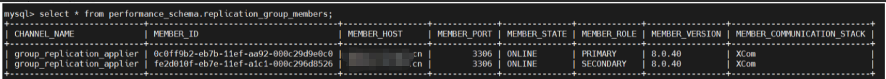

运行一段时间后

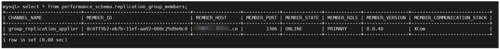

排查故障，查看错误日志 => 主节点报错看主节点日志；从节点报错看从节点日志

主节点日志：/export/server/mysql/master.err

从节点日志：/export/server/mysql/slave.err

```properties
Feb 15 18:43:25 node2 mysqld[49606]: 2025-02-15T10:43:25.184117Z 15 [ERROR] [MY-010584] [Repl] Replica SQL for channel 'group_replication_applier': Worker 1 failed executing transaction 'ce9be252-2b71-11e6-b8f4-00212844f856:4'; Error executing row event: 'Unknown database 'test'', Error_code: MY-001049
```

发现两端数据不一致导致的问题 => master 节点相对于 slave01 多了一个 test 数据库！！！

解决方案：

master 主服务器：mysqldump 或者 xtabackup 导出完整备份（全备），先停止 mysqld，还可以通过 rsync 重新同步数据，保证从节点与主节点数据保持一致即可。

```properties
mysqldump -uroot --all-databases > all.sql -p
rsync -av all.sql node2:/root/
```

slave 从服务器：

```properties
mysql> stop group_replication;
mysql> set global super_read_only=0;
mysql> reset master;
mysql> reset slave all;
mysql> set sql_log_bin=0;
mysql> source /root/all.sql
mysql> set sql_log_bin=1;
mysql> -- 设置想要加入组信息
mysql> change master to master_user='repl',master_password='123' for channel 'group_replication_recovery'; 
mysql> start group_replication;
```

切换回主节点，查看同步状态

```properties
mysql> select * from performance_schema.replication_group_members;  #查看状态
```

到此解决了数据不一致问题！！！

### 问题3：服务器重启集群失效 或者 从节点无法启动 group_replication
slave01:

```properties
mysql> start group_replication;
```

很多同学在尝试启动 group_replication 的时候，发现无法启动，直接报错。这种情况解决思路，先看从节点错误日志，看看具体什么错误，如果没有明显错误。可以判断 master 节点可能没有启动或者主节点没有正常工作。

```properties
mysql> select * from performance_schema.replication_group_members;
```

<font style="color:rgb(216,57,49);">整个 MGR 集群，必须保证 master 节点先启动，且状态为 ONLINE，从节点才能正常加入主节点。常见错误截图如下：</font>

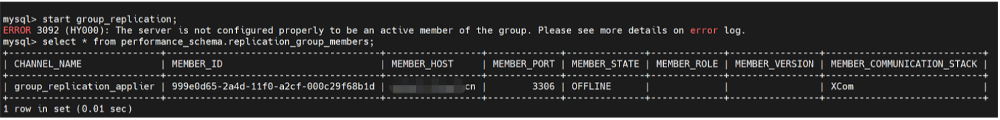

主节点异常，可以考虑重新配置主节点

```properties
mysql> reset master;
mysql> change master to master_user='repl',master_password='123' for channel
'group_replication_recovery';   # 构建 group replication 集群
mysql> set global group_replication_bootstrap_group=ON;
mysql> start group_replication;
mysql> set global group_replication_bootstrap_group=OFF;
mysql> select * from performance_schema.replication_group_members;  # 查看状态
```

然后分别启动从节点 => node2、node3

```properties
mysql> start group_replication;
```

### 问题4：从节点报错无法启动，然后报数据目录拷贝自其他服务器
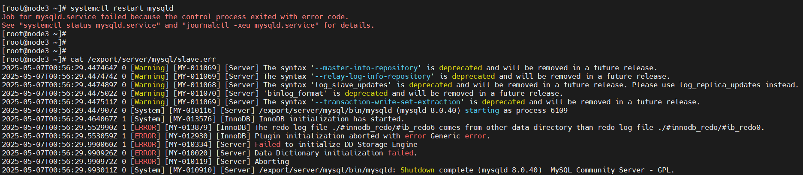

出现以上问题，往往代表，你的这个节点的数据目录来自于其他服务器，因为 redo log 文件，往往是放置于 master 主节点，从节点一般在 mysqld 启动后才会产生，而不是一开始就有这些文件。

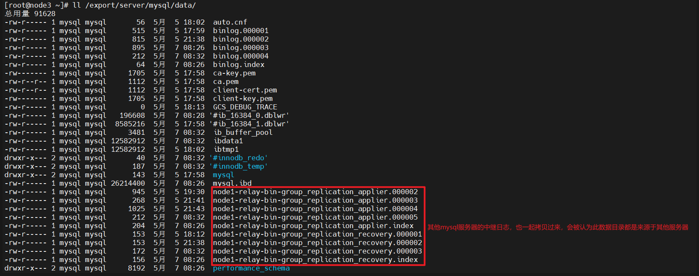

这代表之前大家在同步数据时，可能 master 并没有停止，或者拷贝后，没有及时清空 master 节点的一些标记（如relaylog 日志），这些都相当于是其他服务器的标记，本机无法使用，所以会报错。

解决方案：删除上方红色框框对应的 relaylog 日志文件，然后重启 mysqld（也可以考虑先重新同步 rsync，然后在删除红色框框对应的文件）


### 问题总结：MGR 本身很简单，错误就两种情况
第一种情况：<font style="color:rgb(216,57,49);">MGR 群组中 master 节点没有启动或者主节点异常，导致其他从节点无法加入到 MGR 群组</font>。常见场景就是查看集群状态，只有一个节点显示。还有一种情况，大家特别喜欢重启 mysqld 服务。主从、MGR 都属于 mysql 服务，<font style="color:rgb(216,57,49);">mysqld 一旦停止/重启，往往主从、MGR 也会随之停止服务，这个时候就查看不到任何节点信息了，需要手工重启服务。</font>

有错误，一定要看错误日志 => 

master：cat /export/server/mysql/master.err

slave：cat /export/server/mysql/slave.err

第二种情况：<font style="color:rgb(216,57,49);">100% 数据不一致，三个节点，有一个节点出现故障。剩余两个节点组成主从架构，如果往主服务器写入数据了，则从服务器会随之同步数据</font>。但是故障节点即使重启了，其数据也会和前面两个节点数据不一致，常见场景：MEMBER_STATE 列值为 RECORYING、slave 节点运行一段时间自动消失了、从节点报错无法启动，大部分都是数据不一致造成的。

找到问题节点，先排查错误 => cat /export/server/mysql/slave.err => 问题号：1236（就是100%数据不一致）

停止从节点的 mysqld 服务

```properties
systemctl stop mysqld
rm -rf /export/server/mysql/data
```

返回主节点：

```properties
rsync -av /export/server/mysql/data 异常节点号:/export/server/mysql/
记得删除auto.cnf文件、relaylog日志文件
rm -rf /export/server/mysql/data/auto.cnf
rm -rf /export/server/mysql/data/node1-relay-bin-*
重启mysqld
systemctl start mysqld
```

如果从节点异常，重置从节点

```properties
stop group_replication;
reset master;
set sql_log_bin=0;
change master to master_user='repl',master_password='123' for channel 'group_replication_recovery';
start group_replication;
set sql_log_bin=1;
```

 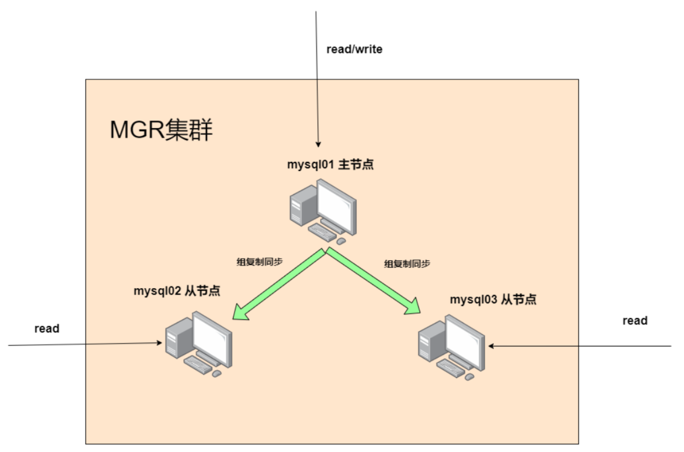


> 更新: 2026-06-08 09:35:23  
> 原文: <https://www.yuque.com/u41736172/az9urv/ntqhhrsdk6i5cenx>