# 13.MySQL读写分离之MyCAT

# <font style="color:rgb(51, 51, 51);">一、MySQL 读写分离</font>

## <font style="color:rgb(51, 51, 51);">业务背景描述</font>

<font style="color:rgb(51, 51, 51);">时间：2016.6-2017.9</font>

<font style="color:rgb(51, 51, 51);">发布产品类型：互联网动态站点 商城</font>

<font style="color:rgb(51, 51, 51);">用户数量： 2000-4000（用户量猛增了4倍）</font>

<font style="color:rgb(51, 51, 51);">PV ： 8000-50000（24小时访问次数总和）</font>

<font style="color:rgb(51, 51, 51);">DAU： 1500（每日活跃用户数）</font>

<font style="color:rgb(51, 51, 51);">之前是单台MySQL提供服务，使用多台MySQL数据库服务器，降低单台压力，实现集群架构的稳定性和高可用性 数据的一致性 完整性 replication</font>

<font style="color:rgb(51, 51, 51);">通过业务比对和分析发现，随着用户活跃增多，读取数据的请求变多，故着重解决读取数据的压力</font>

## <font style="color:rgb(51, 51, 51);">模拟运维设计方案</font>

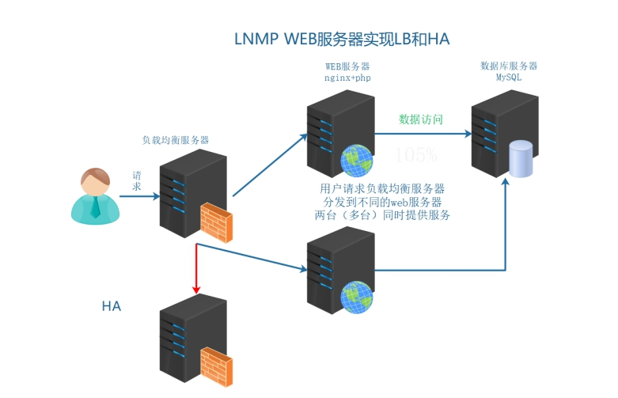

<font style="color:rgb(51, 51, 51);">根据以上业务需求，在之前业务架构的基础上实现数据的读写分离。</font>

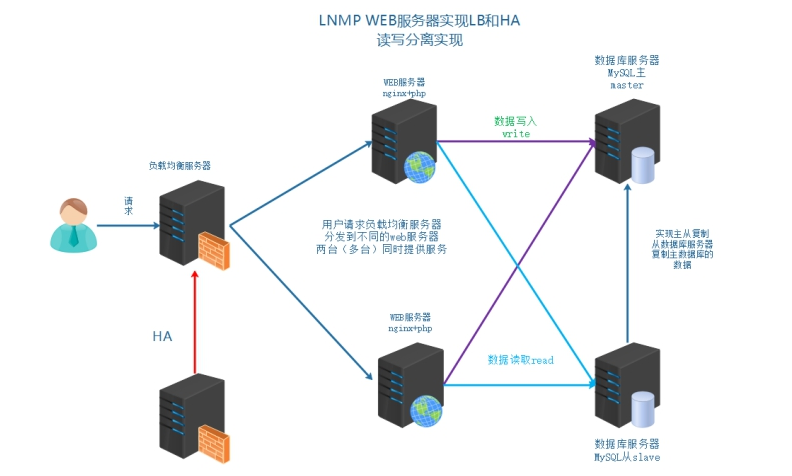

<font style="color:rgb(51, 51, 51);">说明：</font>

<font style="color:rgb(51, 51, 51);">实现MySQL主从架构 => 解决单点故障问题</font>

<font style="color:rgb(51, 51, 51);">引入MyCAT不仅可以实现高可用，MyCAT软件还能实现读写分离技术（master既可以承担写操作也可以承担一部分读操作，slave从服务器可以承担部分读操作）</font>

# <font style="color:rgb(51, 51, 51);">二、MySQL 读写分离介绍</font>

## <font style="color:rgb(51, 51, 51);">什么是读写分离</font>

<font style="color:rgb(51, 51, 51);">读写分离：读写操作，分发不同的服务器，读分发到对应的服务器（slave），写分发到对应的服务器（master）</font>

<font style="color:rgb(51, 51, 51);">master（主节点）、slave（从节点）（Primary、Secondary）</font>

<font style="color:rgb(51, 51, 51);">写操作 => 只能在 master 节点执行（主从架构中，只有主节点能实现写入）</font>

<font style="color:rgb(51, 51, 51);">读操作 => 既可以在 master 主节点，也可以在 slave 从节点</font>

> <font style="color:rgb(119, 119, 119);">在生产环境中，一般可以配置一主多从架构。主节点只负责承担写入操作，从节点专门负责读操作。</font>

## <font style="color:rgb(51, 51, 51);">读写分离的目的</font>

<font style="color:rgb(51, 51, 51);">读写分离 将读写业务分配到不同的服务器上，让服务器做特定的操作，不需要不断的切换工作模式，使工作效率提高</font>

<font style="color:rgb(51, 51, 51);">写主服务器，读从服务器</font>

<font style="color:rgb(51, 51, 51);">同时降低主服务器的压力，在正常业务下，也是读比较多的情况，写相对读少一些。</font>

<font style="color:rgb(51, 51, 51);">大约比例在写3/7读</font>

<font style="color:rgb(51, 51, 51);">读写分离：</font>

<font style="color:rgb(51, 51, 51);">①M-S下，读写必须分离，如果不分离，业务不可用出问题</font>

<font style="color:rgb(51, 51, 51);">②M-M 在此架构中，可以随意读写操作，特定的操作交由特定的服务器操作，工作效率更高</font>

## <font style="color:rgb(51, 51, 51);">读写分离的实现基础和原理</font>

<font style="color:rgb(51, 51, 51);">实现基础：通过主从复制机制实现数据的一致性、完整性</font>

<font style="color:rgb(51, 51, 51);">mysql 的读写分离的基本原理是：</font>

<font style="color:rgb(51, 51, 51);">SQL 语句：根据 sql 语句判断是读操作还是写入操作</font>

**<font style="color:rgb(51, 51, 51);">让 master（主数据库）来响应事务性操作（insert，update，delete，create，drop）</font>**

**<font style="color:rgb(51, 51, 51);">让 slave（从数据库）来响应 select 非事务性操作</font>**

<font style="color:rgb(51, 51, 51);">然后再采用主从复制来把 master 上的事务性操作同步到 slave 数据库中</font>

<font style="color:rgb(51, 51, 51);">没有主从复制，就无法实现业务上的读写分离</font>

## <font style="color:rgb(51, 51, 51);">读写分离常见的实现方式</font>

**<font style="color:rgb(51, 51, 51);">① 业务代码的读写分离</font>**<font style="color:rgb(51, 51, 51);">（了解）</font>

<font style="color:rgb(51, 51, 51);">需要在业务代码中，判断数据操作是读还是写，读连接从数据服务器操作，写连接主数据库服务器操作 mysql01/mysql02</font>

<font style="color:rgb(51, 51, 51);">以当前 LNMP 为例，就需要使用 PHP 代码实现读写分离</font>

<font style="color:rgb(51, 51, 51);">在 ThinkPHP6.0 代码端对数据库的操作进行判断：</font>

<font style="color:rgb(51, 51, 51);">增加：</font>

```properties
mysql> insert  into  数据表  values  (字段值,字段值,...);
```

<font style="color:rgb(51, 51, 51);">删除：</font>

```properties
mysql> delete  from 数据表 where 字段=字段值;
mysql> delete  from 数据表  where 字段  in (字段值1,字段值2...);
mysql> delete  from  数据表;
```

<font style="color:rgb(51, 51, 51);">修改：</font>

```properties
mysql> update  数据表  set  字段=字段的值  where  字段=字段值;
mysql> update  数据表  set  字段=字段的值;
```

<font style="color:rgb(51, 51, 51);">查询：</font>

```properties
mysql> select  */字段列表  from 数据表;
```

<font style="color:rgb(51, 51, 51);">如果 insert/update/delete 操作，自动连接 master 主数据库。</font>

<font style="color:rgb(51, 51, 51);">如果 select 操作，自动连接 slave 从数据库。</font>

**<font style="color:rgb(51, 51, 51);">② 中间件代理方式的读写分离</font>**

<font style="color:rgb(51, 51, 51);">在业务代码中，数据库的操作，不直接连接数据库，而是先请求到中间件服务器（代理）</font>

<font style="color:rgb(51, 51, 51);">由代理服务器，判断是读操作去从数据服务器，写操作去主数据服务器</font>

| **<font style="color:rgb(51, 51, 51);">名称</font>** | **<font style="color:rgb(51, 51, 51);">描述</font>** |
| :--- | :--- |
| <font style="color:rgb(51, 51, 51);">MySQL Proxy</font> | <font style="color:rgb(51, 51, 51);">MySQL官方 测试版 不再维护</font> |
| <font style="color:rgb(51, 51, 51);">Atlas</font> | <font style="color:rgb(51, 51, 51);">奇虎360 基于MySQL Proxy</font>[<font style="color:rgb(65, 131, 196);">https://github.com/Qihoo360/Atlas/blob/master/README\_ZH.md</font>](https://github.com/Qihoo360/Atlas/blob/master/README_ZH.md) |
| <font style="color:rgb(51, 51, 51);">DBProxy</font> | <font style="color:rgb(51, 51, 51);">美团点评</font> |
| <font style="color:rgb(51, 51, 51);">Amoeba</font> | <font style="color:rgb(51, 51, 51);">早期阿里巴巴</font> |
| <font style="color:rgb(51, 51, 51);">cobar</font> | <font style="color:rgb(51, 51, 51);">阿里巴巴</font> |
| <font style="color:rgb(51, 51, 51);">MyCat</font> | <font style="color:rgb(51, 51, 51);">基于阿里开源的Cobar</font> |
| <font style="color:rgb(51, 51, 51);">kingshard</font> | <font style="color:rgb(51, 51, 51);">go语言开发</font>[<font style="color:rgb(65, 131, 196);">https://github.com/flike/kingshard</font>](https://github.com/flike/kingshard) |

<font style="color:rgb(51, 51, 51);">也就是如下图所示架构</font>

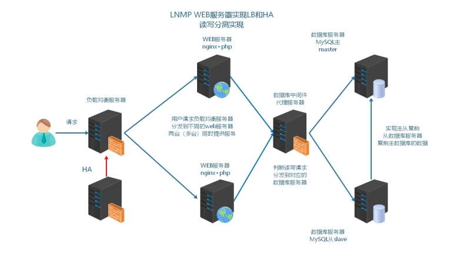

<font style="color:rgb(51, 51, 51);">问：如何选择？</font>

<font style="color:rgb(51, 51, 51);">① 业务上实现更加方便，成本低一下，如果使用的开发框架不支持分布式数据库的部署模式，</font>

<font style="color:rgb(51, 51, 51);">业务的 SQL 需要修改，改代码（程序猿）</font>

<font style="color:rgb(51, 51, 51);">② 中间件代理服务器 更加适合管理更多的数据库服务器集群，查看到服务器是否可用，不只可以实现读写分离，使用中间件实现分库、分表的操作（运维）</font>

# <font style="color:rgb(51, 51, 51);">三、MySQL 读写分离的具体实现</font>

前提：

MyCat2 本身不能低于 6GB（是用 JAVA 语言开发的，比较占用内存）

MySQL5 配合 MyCat 比较消耗资源，两台 MySQL 服务器内存不得低于 4GB，否则配置完成后会报错！！

MySQL8 配合 MyCat 比较消耗资源，两台 MySQL 服务器内存不得低于 6GB，否则配置完成后会报错！！

**本次由于电脑资源的影响，我们搭建的是基于 MySQL5 的主从复制及读写分离！对于 MySQL8 的读写分离，MyCat 的搭建配置与 MySQL5 的都一样！**

## 环境准备

克隆两台最小化安装的服务器，然后修改 IP、主机名、hosts 文件等等。改完后，拍摄快照。

| 编号 | IP 地址 | 主机名 | 角色 |
| --- | --- | --- | --- |
| 1 | 192.168.19.111 | master.lhp.cn | MySQL 主服务器 |
| 2 | 192.168.19.112 | slave.lhp.cn | MySQL 从服务器 |

我这里的电脑内存资源有限，这两台 MySQL 服务器的内存均设置为了 2G，核心数设置为 2 个。

## master 服务器的操作

先上传 MySQL5 的安装包到 master 服务器。

```properties
# vim master.sh
#!/bin/bash
yum install libaio -y
tar -xf mysql-5.7.31-linux-glibc2.12-x86_64.tar.gz
mv mysql-5.7.31-linux-glibc2.12-x86_64 /usr/local/mysql
useradd -r -s /sbin/nologin mysql
rm -rf /etc/my.cnf
cd /usr/local/mysql
mkdir mysql-files
chown mysql:mysql mysql-files
chmod 750 mysql-files
bin/mysqld --initialize --user=mysql --basedir=/usr/local/mysql &> /root/password.txt
cat > /etc/my.cnf <<EOF
[mysqld]
basedir=/usr/local/mysql
datadir=/usr/local/mysql/data
socket=/tmp/mysql.sock
port=3306
log-error=/usr/local/mysql/data/mysql.err
log-bin=/usr/local/mysql/data/binlog
server-id=10
character_set_server=utf8mb4
gtid-mode=on
log-slave-updates=1
enforce-gtid-consistency
sql_mode=NO_ENGINE_SUBSTITUTION,STRICT_TRANS_TABLES
EOF
bin/mysql_ssl_rsa_setup --datadir=/usr/local/mysql/data

cat <<EOF | sudo tee /etc/systemd/system/mysqld.service
[Unit]
Description=MySQL Server
After=network.target
After=syslog.target

[Service]
User=mysql
Group=mysql
ExecStart=/usr/local/mysql/bin/mysqld --defaults-file=/etc/my.cnf
LimitNOFILE = 5000
PrivateTmp=false

[Install]
WantedBy=multi-user.target
EOF

echo "正在刷新后台服务，然后启动mysqld..."

sudo systemctl daemon-reload
systemctl start mysqld
systemctl enable mysqld

sleep 5

echo 'export PATH=$PATH:/usr/local/mysql/bin' >> /etc/profile
source /etc/profile

ln -s /lib64/libncurses.so.6 /lib64/libncurses.so.5
ln -s /lib64/libtinfo.so.6 /lib64/libtinfo.so.5

echo "正在重置MySQL管理员密码..."
temp_password=`cat /root/password.txt | grep 'password' | cut -d' ' -f11`
echo "随机密码是：$temp_password"
mysqladmin -S /tmp/mysql.sock -uroot password '123456' -p$temp_password

echo "MySQL安装成功，软件安装路径：/usr/local/mysql，数据库初始密码：123456"

执行脚本
# source master.sh
```

## slave 服务器的操作

先上传 MySQL5 的安装包到 slave 服务器。

```properties
# vim slave.sh
#!/bin/bash
yum install libaio -y
tar -xf mysql-5.7.31-linux-glibc2.12-x86_64.tar.gz
mv mysql-5.7.31-linux-glibc2.12-x86_64 /usr/local/mysql
useradd -r -s /sbin/nologin mysql
rm -rf /etc/my.cnf
cd /usr/local/mysql
mkdir mysql-files
chown mysql:mysql mysql-files
chmod 750 mysql-files

# 不进行初始化操作
# bin/mysqld --initialize --user=mysql --basedir=/usr/local/mysql &> /root/password.txt

cat > /etc/my.cnf <<EOF
[mysqld]
basedir=/usr/local/mysql
datadir=/usr/local/mysql/data
socket=/tmp/mysql.sock
port=3306
log-error=/usr/local/mysql/data/mysql.err
log-bin=/usr/local/mysql/data/binlog
server-id=20
character_set_server=utf8mb4
gtid-mode=on
log-slave-updates=1
enforce-gtid-consistency
sql_mode=NO_ENGINE_SUBSTITUTION,STRICT_TRANS_TABLES
EOF
bin/mysql_ssl_rsa_setup --datadir=/usr/local/mysql/data

cat <<EOF | sudo tee /etc/systemd/system/mysqld.service
[Unit]
Description=MySQL Server
After=network.target
After=syslog.target

[Service]
User=mysql
Group=mysql
ExecStart=/usr/local/mysql/bin/mysqld --defaults-file=/etc/my.cnf
LimitNOFILE = 5000
PrivateTmp=false

[Install]
WantedBy=multi-user.target
EOF

echo "正在刷新后台服务，然后启动mysqld..."

sudo systemctl daemon-reload
systemctl enable mysqld

sleep 5

echo 'export PATH=$PATH:/usr/local/mysql/bin' >> /etc/profile
source /etc/profile

ln -s /lib64/libncurses.so.6 /lib64/libncurses.so.5
ln -s /lib64/libtinfo.so.6 /lib64/libtinfo.so.5

echo "MySQL安装成功，软件安装路径：/usr/local/mysql"

执行脚本
# source slave.sh
```

## 主从配置

在 master 服务器中执行如下操作：

```properties
[root@master ~]# systemctl stop mysqld
[root@master ~]# rm -rf /usr/local/mysql/data/auto.cnf
[root@master ~]# rsync -av /usr/local/mysql/data root@192.168.19.112:/usr/local/mysql/
[root@master ~]# systemctl start mysqld
[root@master ~]# mysql -uroot -p123456
mysql> create user 'slave'@'%' identified with mysql_native_password by '123';
mysql> grant replication slave, replication client on *.* to 'slave'@'%';
```

在 slave 服务器中执行如下操作：

```properties
[root@slave ~]# chown -R mysql.mysql /usr/local/mysql
[root@slave ~]# systemctl start mysqld
[root@slave ~]# mysql -uroot -p123456
mysql> CHANGE MASTER TO 
  MASTER_HOST='192.168.19.111',
  MASTER_PORT=3306,
  MASTER_USER='slave',
  MASTER_PASSWORD='123',
  MASTER_AUTO_POSITION=1;
mysql> start slave;
mysql> show slave status\G
```

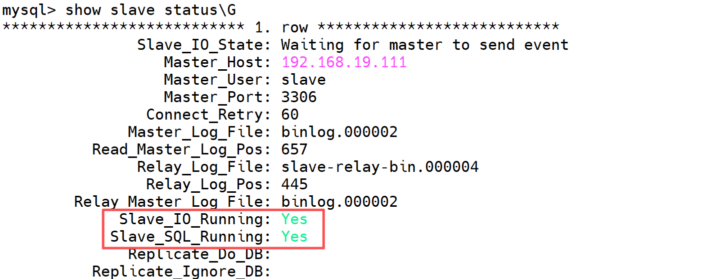

## <font style="color:rgb(51, 51, 51);">代码层级的读写分离（了解）</font>

<font style="color:rgb(51, 51, 51);">筛选：insert/update/delete 操作，把这样的 SQL 传输到主服务器。</font>

<font style="color:rgb(51, 51, 51);">筛选：select 操作，把这样的 SQL 传输到从服务器。</font>

<font style="color:rgb(51, 51, 51);">NiuShop 底层采用 ThinkPHP 框架，寻找官网手册：</font>[<font style="color:rgb(65, 131, 196);">https://doc.thinkphp.cn/v6\_1/fenbushishujuku.html</font>](https://doc.thinkphp.cn/v6_1/fenbushishujuku.html)

```properties
vim database.php

retun [
	'type'=>'mysql',
	'hostname'=>'主IP,从IP',        ==> 设置服务器列表，逗号隔开，第1台服务器默认为主服务器
	...
	'deploy'=>1,     		  					==> 开启分布式数据库（多台数据库，默认为0）
	'rw_separate'=>true,     		  ==> 开启读写分离模式，主写，从读
]
```

<font style="color:rgb(51, 51, 51);">测试可以 down 主库，看从库是否可以访问，在 niushop 配置文件中，如果 slave 宕机，master 提供读服务。</font>

## <font style="color:rgb(51, 51, 51);">MyCAT2 中间件</font>

MyCat 一共有两个版本：MyCat（支持 MySQL5.7 及以下版本）、MyCat2（不仅支持 MySQL5.7，还支持 MySQL8.0 等版本）

<font style="color:rgb(51, 51, 51);">官方网址：</font>[<font style="color:rgb(65, 131, 196);">http://www.mycatone.top/</font>](http://www.mycatone.top/)


<font style="color:rgb(51, 51, 51);">Mycat2 是 Mycat 社区开发的一款分布式关系型数据库(中间件)。它支持分布式 SQL 查询，兼容 MySQL 通信协议，以Java 生态支持多种后端数据库，通过数据分片提高数据查询处理能力。</font>

<font style="color:rgb(51, 51, 51);">MyCAT2 在架构中的定位：</font>

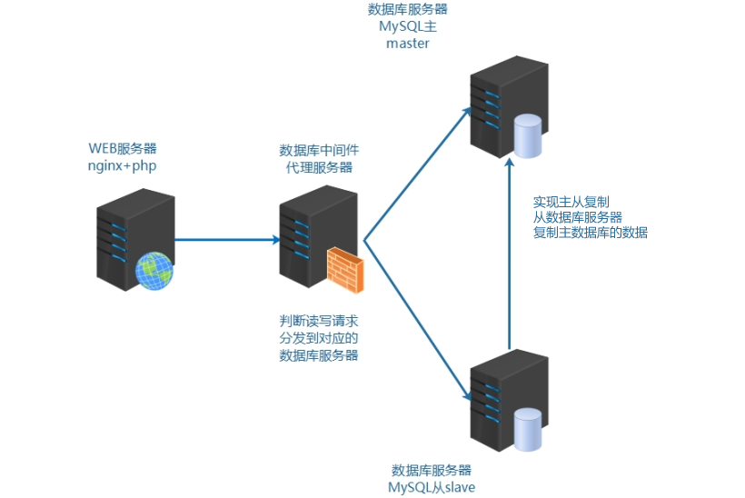

> 我们目前受限于配置，所以做的事一主一从的 MySQL，实际场景中，最起码要做一主两从的 MySQL。

<font style="color:rgb(51, 51, 51);">特点：</font>

<font style="color:rgb(51, 51, 51);">a.代码开源</font>

<font style="color:rgb(51, 51, 51);">学习中间件技术,数据库技术，代码是必须有的。</font>

<font style="color:rgb(51, 51, 51);">b.兼容 MySQL 语法的分布式查询引擎</font>

* <font style="color:rgb(51, 51, 51);">兼容MySQL语法。</font>
* <font style="color:rgb(51, 51, 51);">兼容MySQL值类型。</font>
* <font style="color:rgb(51, 51, 51);">使用基于规则优化与代价的优化器。</font>
* <font style="color:rgb(51, 51, 51);">独立的物理执行引擎。</font>

<font style="color:rgb(51, 51, 51);">c.自定义功能算法开发</font>

* <font style="color:rgb(51, 51, 51);">分片算法,序列号算法,负载均衡算法等都可自定义加载。</font>
* <font style="color:rgb(51, 51, 51);">查询引擎可脱离网络框架运行。</font>

<font style="color:rgb(51, 51, 51);">d.自定义处理过程</font>

<font style="color:rgb(51, 51, 51);">自研DSL操纵物理查询计划。</font>

<font style="color:rgb(51, 51, 51);">支持SQL转发,缓存结果集。</font>

## <font style="color:rgb(51, 51, 51);">MyCAT2 工作原理图</font>

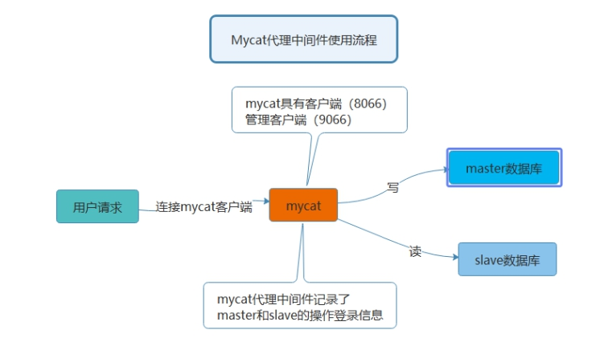

> MyCat 可以做读写分离，也可以做高可用。它的高可用是指如果后面的某个 MySQL 服务器挂掉了，它就不往该服务器转发请求了，有一个心跳检测机制。而且主服务器挂掉后，可以在剩余的从服务器中选择一个作为新的主服务器。

<font style="color:rgb(51, 51, 51);">Mycat 数据库中间件</font>

<font style="color:rgb(51, 51, 51);">国内最活跃的、性能最好的开源数据库中间件！</font>

<font style="color:rgb(51, 51, 51);">官方网址：</font>[<font style="color:rgb(65, 131, 196);">http://www.mycatone.top/</font>](http://www.mycatone.top/)

<font style="color:rgb(51, 51, 51);">因为 mycat2 是由 java 语言开发，必须使用 java 的允许环境进行启动和操作</font>

## <font style="color:rgb(51, 51, 51);">准备机器</font>

克隆一台最小化安装的服务器作为 MyCat 服务器。

<font style="color:rgb(51, 51, 51);">最好保证 4 核 6G 以上，因为 MyCAT2 占用内存与 CPU 比较大（</font>**<font style="color:rgb(51, 51, 51);">受环境限制，我这里改为了 2 个核心，2G 内存</font>**<font style="color:rgb(51, 51, 51);">）</font>

然后修改 IP（192.168.19.113）、MAC、主机名、hosts 文件等等。

## <font style="color:rgb(51, 51, 51);">JDK 安装</font>

Java 是编程语言的一种，与之类似的还有很多，Python、Go、PHP 等。

语言分为两种：解释性语言（Python、PHP）、编译型语言（Java）。

解释型：每次运行都需要对代码进行重新解析。

编译型：首次运行时需要对源代码进行编译，产生一个中间文件.class，然后对其进行运行。以后再运行相同代码时，不需要重新编译，而是直接调用之前编译好的 .class 字节码文件，直接运行。

**<font style="color:rgb(51, 51, 51);">问：公司服务器部署的 java 环境是 jdk 还是 jre？</font>**

<font style="color:rgb(51, 51, 51);">答：</font>

<font style="color:rgb(51, 51, 51);">jre java解析运行环境 一般情况编译过的可执行的java程序 ，jre就够用了。</font>

<font style="color:rgb(51, 51, 51);">jdk javac 编译的环境 如果服务器上传是源代码文件 就可以编译，之后再执行。</font>

<font style="color:rgb(51, 51, 51);">实际业务环境中，如果存在需要编译的情况，就选择jdk。</font>

<font style="color:rgb(51, 51, 51);">oracle jdk（sun公司=>oracle公司收购）</font>

<font style="color:rgb(51, 51, 51);">open jdk（完全免费的jdk环境）</font>

<https://www.oracle.com/technetwork/java/javase/downloads/jdk8-downloads-2133151.html>

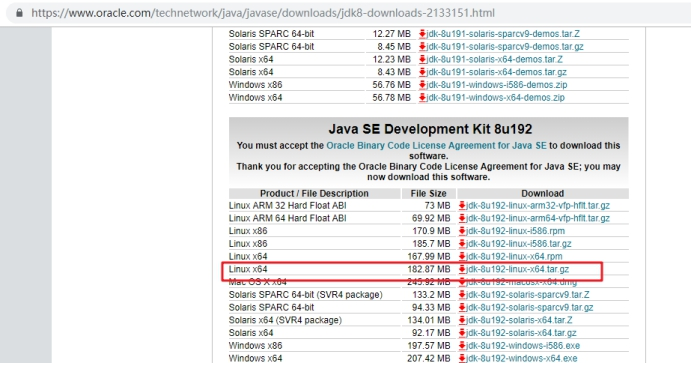

第一步：上传 JDK 安装包到 MyCat 服务器中

第二步：解压并安装

```properties
tar xvf jdk-8u192-linux-x64.tar.gz
mkdir /usr/local/java
mv jdk1.8.0_192 /usr/local/java/

注：最终完整路径/usr/local/java/jdk1.8.0_192
```

第三步：<font style="color:rgb(51, 51, 51);">配置环境变量</font>

```properties
卸载Linux服务器中本身自带的JDK
rpm -evh java-1.8.0-openjdk-headless-1.8.0.362.b09-4.el9.x86_64 --nodeps

vim /etc/profile
export PATH=$PATH:/usr/local/java/jdk1.8.0_192/bin

source /etc/profile

查看JDK版本信息
java -version
```

***

<font style="color:rgb(51, 51, 51);">最终脚本：jdk.sh</font>

```properties
#!/bin/bash
tar xvf jdk-8u192-linux-x64.tar.gz
mkdir -p /usr/local/java
mv jdk1.8.0_192 /usr/local/java/
rpm -e java-1.8.0-openjdk-headless-1.8.0.362.b09-4.el9.x86_64 --nodeps
echo 'export PATH=$PATH:/usr/local/java/jdk1.8.0_192/bin' >> /etc/profile
source /etc/profile
```

执行：

```properties
source jdk.sh
```

## <font style="color:rgb(51, 51, 51);">MyCAT2 安装</font>

<font style="color:rgb(51, 51, 51);">下载地址：</font>[<font style="color:rgb(65, 131, 196);">https://github.com/MyCATApache/Mycat2</font>](https://github.com/MyCATApache/Mycat2)<font style="color:rgb(51, 51, 51);">，需要编译，直接使用提供给大家的软件包</font>

<font style="color:rgb(51, 51, 51);">第一步：安装 MyCAT</font>

```properties
# mkdir mycat2  # 上传软件到此目录，mycat2-install-template-1.21.zip 以及 mycat2-1.21-release-jar-with-dependencies.jar

# cd mycat2/
# unzip mycat2-install-template-1.21.zip

# mv mycat /usr/local/
# cp mycat2-1.21-release-jar-with-dependencies.jar /usr/local/mycat/lib/

# cd /usr/local/mycat/

# ls
bin  conf  lib  logs
```

<font style="color:rgb(51, 51, 51);">第二步：设置数据源</font>

<font style="color:rgb(51, 51, 51);">前提：使用管理员账号</font>

**<font style="color:rgb(51, 51, 51);">master 服务器：</font>**

```properties
mysql> CREATE USER 'root'@'%' IDENTIFIED WITH mysql_native_password BY '123';
mysql> GRANT ALL ON *.* TO 'root'@'%';
```

<font style="color:rgb(51, 51, 51);">配置数据源（也就是让 MyCat 能够知道你的 MySQL 数据库在哪里，其实以后 web 服务器操作数据库的话连接的是 MyCat，然后 MyCat 再将请求转给具体的 MySQL 数据库）</font>

```properties
# cd conf/datasources

把mycat带的数据源配置正确
# vim prototypeDs.datasource.json

{
        "dbType":"mysql",
        "idleTimeout":60000,
        "initSqls":[],
        "initSqlsGetConnection":true,
        "instanceType":"READ_WRITE",
        "maxCon":1000,
        "maxConnectTimeout":3000,
        "maxRetryCount":5,
        "minCon":1,
        "name":"prototypeDs",
        "password":"123",
        "type":"JDBC",
        "url":"jdbc:mysql://192.168.19.111:3306/mysql?useUnicode=true&serverTimezone=Asia/Shanghai&characterEncoding=UTF-8",
        "user":"root",
        "weight":0
}


需要修改位置：
1. 代表要连接数据源的MySQL密码
"password":"123"
2. 代表要连接数据源的MySQL数据库信息，就写你master服务器的IP地址
"url":"jdbc:mysql://192.168.19.111:3306/mysql?useUnicode=true&serverTimezone=Asia/Shanghai&characterEncoding=UTF-8"
3. 代表要连接数据源的MySQL账号
"user":"root"
```

## <font style="color:rgb(51, 51, 51);">目录说明</font>

```properties
bin ：mycat二进制文件目录
conf：配置文件目录
logs：目录可以查看到错误日志
```

## <font style="color:rgb(51, 51, 51);">启动 MyCAT2</font>

<font style="color:rgb(51, 51, 51);">默认不进行任何配置，mycat 也是可以启动的：</font>

```properties
# chmod +x /usr/local/mycat/bin/*
# /usr/local/mycat/bin/mycat console	=> 表示前台的方式启动mycat

# 然后重新开一个终端，确认mycat是否真的启动，查看它的端口 9066 8066（其实我们以后用的是8066端口）
# ss -naltp | grep 8066
8066:MyCAT客户端
9066:MyCAT管理端
```

***

如果启动不成功，报错：Ignoring option MaxPerSize:support was removed in 8.0

<font style="color:rgb(51, 51, 51);">原因分析：因为系统不能够在规定时间内，启动 mycat，可以设置启动等待时间延长（配置低）</font>

<font style="color:rgb(51, 51, 51);">部署好 mycat 之后，先启动一下，是否能够正常启动。能正常启动就不需要修改。如果报上面的错，就按下面的操作：</font>

```properties
# vim conf/wrapper.conf
111 wrapper.startup.timeout=300  		==>  添加这一行
112 wrapper.ping.timeout=120 		  	==>  默认存在
```

<font style="color:rgb(51, 51, 51);">常见错误就几种情况：</font>

<font style="color:rgb(51, 51, 51);">① 配置低，服务无法启动，报错：</font><code><font style="color:rgb(51, 51, 51);background-color:rgb(243, 244, 244);">Ignoring option MaxPerSize:support was removed in 8.0</font></code>

<font style="color:rgb(51, 51, 51);">解决思路：增大内存或者调整配置文件中的启动超时时间</font>

```properties
# vim conf/wrapper.conf
111 wrapper.startup.timeout=300  		==>  添加这一行
112 wrapper.ping.timeout=120 		    ==>  默认存在
```

<font style="color:rgb(51, 51, 51);">② 数据源报 Access Denied，往往</font><code><font style="color:rgb(51, 51, 51);background-color:rgb(243, 244, 244);">/usr/local/mycat/conf/datasources/prototypeDs.datasource.json</font></code>

<font style="color:rgb(51, 51, 51);">要么账号密码不对，要么连接地址不对，要么账号没有权限，严格按照这个路径排查。</font>

## <font style="color:rgb(51, 51, 51);">配置 MyCAT2</font>

停止掉目前的 MyCat，目前我们是通过前台方式启动的，直接 ctrl + c 就可以停止。

<font style="color:rgb(51, 51, 51);">第一步：进入数据源配置目录</font>

```properties
cd /usr/local/mycat/conf/datasources/
```

<font style="color:rgb(51, 51, 51);">配置</font><code><font style="color:rgb(51, 51, 51);background-color:rgb(243, 244, 244);">prototypeDs.datasource.json</font></code><font style="color:rgb(51, 51, 51);">文件</font>

```properties
{
        "dbType":"mysql",
        "idleTimeout":60000,
        "initSqls":[],
        "initSqlsGetConnection":true,
        "instanceType":"READ_WRITE",
        "maxCon":1000,
        "maxConnectTimeout":3000,
        "maxRetryCount":5,
        "minCon":1,
        "name":"prototypeDs",
        "password":"123",
        "type":"JDBC",
        "url":"jdbc:mysql://192.168.19.111:3306/mysql?useUnicode=true&serverTimezone=Asia/Shanghai&characterEncoding=UTF-8",
        "user":"root",
        "weight":0
}
```

<font style="color:rgb(51, 51, 51);">第二步：重新启动 MyCAT（后台方式去启动）</font>

```properties
/usr/local/mycat/bin/mycat start

MyCat启动后，会有自己的日志文件，在 /usr/local/mycat/logs/wrapper.log
```

第三步：使用 MySQL 客户端连接 MyCat（其实可以将 MyCat 当作 MySQL 服务器一样连接，我们连接 MyCat，然后 MyCat 又去操作 MySQL）

```properties
# 安装MySQL客户端
[root@mycat ~]# yum -y install mysql

mysql-server：MySQL的服务器端
mysql：MySQL客户端
安装客户端后，我们就可以使用mysql命令去连接MyCat了。
MyCat默认的账号是root、密码是123456，可以查看：
[root@mycat ~]# cat /usr/local/mycat/conf/users/root.user.json
{
        "dialect":"mysql",
        "ip":null,
        "password":"123456",
        "transactionType":"proxy",
        "username":"root"
}

# 连接MyCat
[root@mycat ~]# mysql -h127.0.0.1 -uroot -p123456 -P8066
mysql> show databases;
+--------------------+
| `Database`         |
+--------------------+
| information_schema |
| mysql              |
| performance_schema |
+--------------------+
3 rows in set (0.14 sec)
```

第四步：使用 DataGrip 连接 MyCat

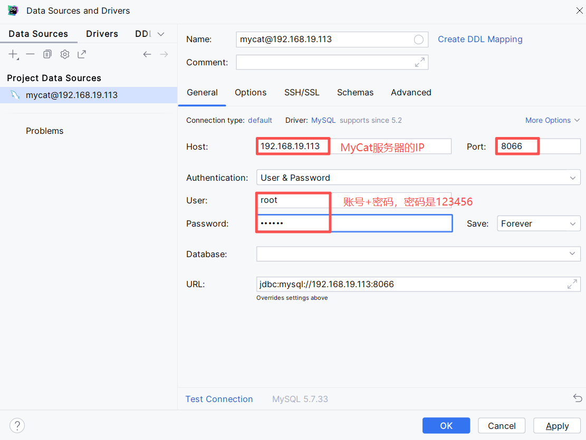

第五步：<font style="color:rgb(51, 51, 51);">创建 db1 数据库并设置数据源</font>

```properties
mysql> create database db1 default charset=utf8;

mysql> show databases;
+--------------------+
| `Database`         |
+--------------------+
| db1                |
| information_schema |
| mysql              |
| performance_schema |
+--------------------+
4 rows in set (0.00 sec)
```

<font style="color:rgb(51, 51, 51);">创建完成后，系统会自动在</font><code><font style="color:rgb(51, 51, 51);background-color:rgb(243, 244, 244);">/usr/local/mycat/conf/schemas</font></code><font style="color:rgb(51, 51, 51);">目录下生成 db1.schema.json</font>

```properties
[root@mycat ~]# ll /usr/local/mycat/conf/schemas
总用量 16
-rw-r--r-- 1 root root  142  6月  7 18:33 db1.schema.json
-rw-r--r-- 1 root root 2463  3月  4  2022 information_schema.schema.json
-rw-r--r-- 1 root root 5299  9月 29  2021 mysql.schema.json

[root@mycat ~]# vim /usr/local/mycat/conf/schemas/db1.schema.json
{
        "customTables":{},
        "globalTables":{},
        "normalProcedures":{},
        "normalTables":{},
        "schemaName":"db1",
        "targetName":"prototype",
        "shardingTables":{},
        "views":{}
}

"targetName":"prototype"：就表示mycat要连接的MySQL数据库集群的名称，这个名字可以自己随便起！一般叫prototype
```

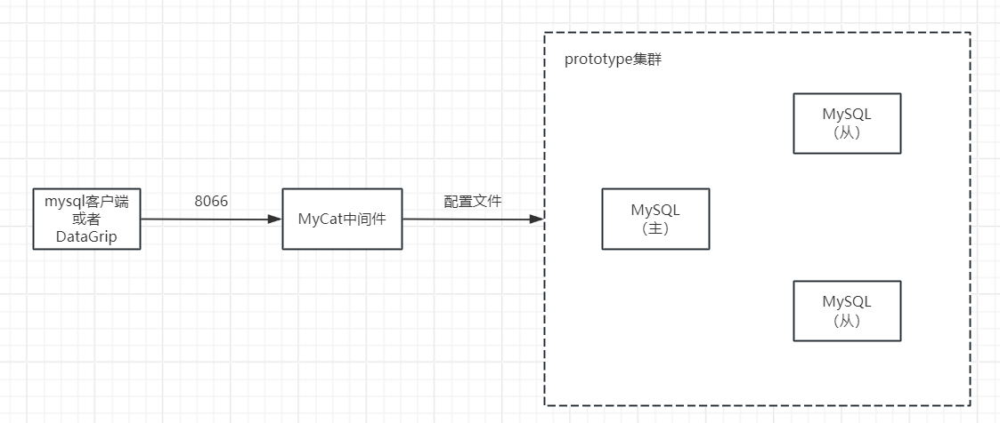

> 通过 MySQL 客户端连接 MyCat 后，能够看到的数据库就会显示到上面的目录中。
>
> 如果我们现在在 master 服务器中创建一个数据库：

```properties
mysql> create database school default charset=utf8;

mysql> show databases;
+--------------------+
| Database           |
+--------------------+
| information_schema |
| db1                |
| mycat              |
| mysql              |
| performance_schema |
| school             |
| sys                |
+--------------------+
```

但是，我们在 MyCat 中是看不到刚刚在 master 服务器中新建的数据库信息：

```properties
mysql> show databases;
+--------------------+
| `Database`         |
+--------------------+
| db1                |
| information_schema |
| mysql              |
| performance_schema |
+--------------------+

之所以能够看到mysql数据库，是因为上面我们在mycat的配置文件中配置了连接的是111服务器(master)中的mysql数据库。
之所以能够看到performance_schema和information_schema数据库，是因为mysql数据库要依赖它俩。
之所以能够看到db1，是因为这个数据库是我们通过MySQL客户端连接MyCat创建的。

之所以看不到上面master服务器中创建的school数据库，是因为我们不是通过MyCat创建的该数据库，而且我们并没有在上面的MyCat配置文件中配置要连接school数据库。
```

第六步：<font style="color:rgb(51, 51, 51);">添加数据源，在 mycat 服务器的 MySQL 客户端执行以下操作，目的是为了告诉 mycat，数据库集群中每台 MySQL 服务器的信息</font>

```properties
-- 创建一个主数据库连接（负责读写分离中的写操作）
mysql> /*+ mycat:createDataSource{
"name":"rwSepw",
"url":"jdbc:mysql://192.168.19.111:3306/db1?useSSL=false&characterEncoding=UTF-8&useJDBCCompliantTimezoneShift=true",
"user":"root",
"password":"123"
} */;

-- 创建一个从数据库连接（负责读写分离中的读操作）
mysql> /*+ mycat:createDataSource{
"name":"rwSepr",
"url":"jdbc:mysql://192.168.19.112:3306/db1?useSSL=false&characterEncoding=UTF-8&useJDBCCompliantTimezoneShift=true",
"user":"root",
"password":"123"
} */;

-- 查看mycat中的数据源信息
mysql> /*+ mycat:showDataSources{} */;
```

<font style="color:rgb(51, 51, 51);">扩展：删除数据源操作（不需要操作）</font>

```properties
mysql> /*+ mycat:dropDataSource{"name":"rwSepw"} */;
mysql> /*+ mycat:dropDataSource{"name":"rwSepr"} */;
```

<font style="color:rgb(51, 51, 51);">第七步：添加数据集群（关键）</font>

```properties
# 告诉mycat，上面添加的多个MySQL数据库服务器中，哪些是主服务器，哪些是从服务器
mysql> /*! mycat:createCluster{"name":"prototype","masters":["rwSepw"],"replicas":["rwSepr"]} */;

# 查看目前集群的信息
mysql> /*+ mycat:showClusters{} */;

说明：
/*!*/ 语法：
MySQL 兼容的注释语法
这种注释中的内容会被 MySQL 服务器执行，但被其他数据库忽略（条件判断）
在 MyCAT 中表示这是一个需要执行的命令
通常用于执行 MyCAT 的管理命令，如创建集群等
简单理解：/*!*/主要用于实现MyCAT写操作！

/*+*/ 语法：
/*+*/通常用于查询提示(Query Hints)
在 MyCAT 中用于执行一些查询类的命令，如显示信息
一般用于不会修改配置的查询操作
简单理解：/*+*/主要用于实现MyCAT读操作！
```

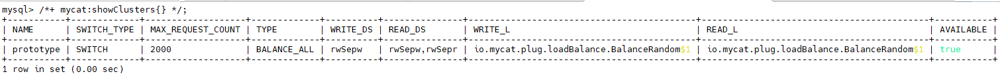

<font style="color:rgb(51, 51, 51);">扩展：删除数据集群（不需要操作）</font>

```properties
mysql> /*+ mycat:dropCluster{"name":"prototype"} */;
```

<font style="color:rgb(51, 51, 51);">第八步：重启 MyCAT</font>

```properties
[root@mycat ~]# /usr/local/mycat/bin/mycat restart
```

<font style="color:rgb(51, 51, 51);">通过查看端口或者进程的方式，确认是否启动：</font>

```properties
[root@mycat ~]# netstat -tnlp
```

<font style="color:rgb(51, 51, 51);">启动不了，一定要看错误日志：</font>

<font style="color:rgb(51, 51, 51);">① 翻译错误</font>

<font style="color:rgb(51, 51, 51);">② 养成看日志的习惯，自身存在日志看自身；自身不存在的看 messages 日志</font>

```properties
cat /usr/local/mycat/logs/wrapper.log
```

## <font style="color:rgb(51, 51, 51);">读写分离集群测试</font>

<font style="color:rgb(51, 51, 51);">第一步：测试之前，把 master、slave、mycat 机器都拍一个快照</font>

<font style="color:rgb(51, 51, 51);">第二步：在 db1 这个数据库中创建一个测试数据表 test\_table，在 mycat 服务器中的 MySQL 客户端做如下操作：</font>

```properties
-- 选择数据库db1，然后创建一个test_table数据表，表中有两个字段，id与hostname主机名称
mysql> use db1;
mysql> create table test_table(
    id int auto_increment,
    hostname varchar(255),
    primary key(id)
);
```

<font style="color:rgb(51, 51, 51);">第三步：插入数据与读取数据测试（在 mycat 服务器中的 MySQL 客户端做如下操作）</font>

```properties
-- 向test_table表中插入一条数据
-- @@hostname是MySQL内置变量，表示当前主机名称
mysql> insert into test_table(hostname) values (@@hostname);
mysql> select * from test_table;
+----+---------------+
| id | hostname      |
+----+---------------+
|  1 | master.lhp.cn |
+----+---------------+

其实可以多插入几次，但是会发现每次插入的数据，最终的hostname都是master.lhp.cn，表示都是由主服务器执行了写入的sql语句！
```

第四步：在 slave 服务器做如下操作：

```properties
-- 一定要返回slave服务器的MySQL终端，不能在MyCAT中执行以下语句，然后选择db1数据库，强制向其test_table表中插入一条数据 => 破坏了主从结构 => 目的是为了造成主服务器中db1数据库的test_table表中的数据和从服务器中的不一致！ 然后我们通过mycat去查询数据时，就可以看到是在主、从服务器中依次查询的！
mysql> use db1;
mysql> insert into test_table(hostname) values (@@hostname);

mysql> select * from test_table;
+----+---------------+
| id | hostname      |
+----+---------------+
|  1 | master.lhp.cn |
|  2 | slave.lhp.cn  |
+----+---------------+
```

> 现在主服务器中 test\_table 表有 1 条数据，从服务器中 test\_table 表有 2 条数据！主从结构其实被我们破坏了，但是我们可以测试读写是否分离！

第五步：在 mycat 服务器的 MySQL 客户端操作：

```properties
-- 返回MyCAT查看读是否进行分离
mysql> select * from test_table;
-- 通过以上查询结果可知，MyCAT已经将读操作进行了分离，默认采用轮询算法，1次master,1次slave，或者总体是平均的！
```

## 常见问题说明

<font style="color:rgb(51, 51, 51);">① 遇到问题不要紧张，翻译错误，看日志，如果实在翻译有问题，可以使用大模型读取错误或者日志的最后50行左右或者具体报错的内容。</font>

<font style="color:rgb(51, 51, 51);">② 注意事项：MyCAT、MySQL8 都属于高内存型应用，MyCAT（Java开发）、MySQL8（不低于6G内存），如果MyCAT、MySQL8内存低于6G，MyCAT本身无法启动，Java异常，8066打开的，但是就是连接不上！</font>

<font style="color:rgb(51, 51, 51);">③ mycat 与 master、slave 数据不一致，比如 mycat 有一个 db1 数据库，但是 master 和 slave 没有，就会导致出现异常，mycat 无法启动。</font>

<font style="color:rgb(51, 51, 51);">解决思路：因为数据不一致，只能对 MyCAT 进行重置</font>

```properties
清理一些文件：cd /usr/local/mycat/conf

rm -rf clusters/prototype.cluster.json

rm -rf datasources/rwSep*

rm -rf schemas/db1.schema.json

删除完成后，重启MyCAT

也就是说，我们在上面通过给mycat写的关于设置数据源、集群等的sql命令，最终都落实到了mycat的配置文件中了！
```

## Cluster 集群配置选项说明

`vim /usr/local/mycat/conf/clusters/prototype.cluster.json`

<font style="color:rgb(51, 51, 51);">readBalanceType：查询负载均衡策略</font>

```properties
可选值 :
BALANCE_ALL( 默认值 )
获取集群中所有数据源，读取操作轮询所有机器

BALANCE_ALL_READ
获取集群中允许读的数据源，获取所有从服务器，然后在这些机器上轮询

BALANCE_READ_WRITE
获取集群中允许读写的数据源 ，但允许读的数据源优先，所有机器参与读操作，优先从服务器

BALANCE_NONE
获取集群中允许写数据源 ，即主节点中选择，所有读操作都直接打在主服务器上
```

<font style="color:rgb(51, 51, 51);">switchType：主从切换</font>

```properties
NOT_SWITCH: 不进行主从切换
SWITCH: 进行主从切换
```

<font style="color:rgb(51, 51, 51);">MyCAT 不仅可以实现读写分离，还能实现高可用操作。</font>

<font style="color:rgb(51, 51, 51);">SWITCH（默认）：如果主从服务器中的主服务器宕机了，则从服务器则会自动升级为主服务器。</font>

<font style="color:rgb(51, 51, 51);">NOT\_SWITCH：正好相反，如果主从服务器中的主服务器宕机了，则从服务器不会升级为主服务器。</font>

***

<font style="color:rgb(51, 51, 51);">这里说的 MyCAT 主从切换和 MGR 中的主从切换有所不同。</font>

<font style="color:rgb(51, 51, 51);">MGR 主从切换，是真正意义的主从切换。主节点宕机了，则从节点选举出新的主节点，选择了新主节点以后，其他的所有从节点都会自动重定向到主节点，成为其的附属节点(从节点)。</font>

<font style="color:rgb(51, 51, 51);">而 MyCAT 中的主从切换，强调的请求路由地址，如果主节点心跳检测失败，则系统会自动移除此节点，然后把所有的写入操作转入从节点。在 MyCAT 层面已经实现了主从切换，但是 MySQL 本质并没有进行切换操作。</font>

# <font style="color:rgb(51, 51, 51);">四、MyCAT 客户端与管理端</font>

## <font style="color:rgb(51, 51, 51);">客户端</font>

直接面向客户（MySQL 数据库的客户端、DataGrip 软件、web 服务器）

<font style="color:rgb(51, 51, 51);">测试查看代理客户端 8066，负责对接 Web</font>

```properties
# 安装mysql客户端（mysql-server服务器端，mysql客户端）
# yum install mysql -y
# mysql -h 127.0.0.1 -uroot -p123456 -P8066
```

<font style="color:rgb(51, 51, 51);">启动 MyCAT => 通过 8066 端口代理连接真实数据库服务器：</font>

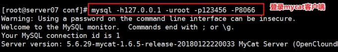

<font style="color:rgb(51, 51, 51);">使用 show databases 以及 show tables 操作，查看数据信息。其实我们就可以发现，我们原来怎样操作 MySQL 数据库的，那么现在就怎样操作 MyCat，客户端其实是感知不到具体你用的是 MyCat 还是 MySQL 的。</font>

## <font style="color:rgb(51, 51, 51);">管理端</font>

```properties
ss -naltp | grep 9066
LISTEN 0      4096   [::ffff:127.0.0.1]:9066             *:*    users:(("java",pid=101467,fd=51))
```

> <font style="color:rgb(119, 119, 119);">MyCAT2 中和 MyCAT 有所不同，MyCAT 早期版本，9066 是可以正常登录，从管理端才能看到集群等信息，但是在MyCAT2 中，把所有功能都集成在 8066 了，所以 9066 虽然被占用，但是不需要用户参与管理！</font>

# <font style="color:rgb(51, 51, 51);">五、MyCAT2 其他配置</font>

## <font style="color:rgb(51, 51, 51);">修改 MyCAT2 登录密码</font>

```properties
cd /usr/local/mycat/conf/users
vim root.user.json
{
"dialect":"mysql",
"ip":null,
"password":"123456",      # 修改这里
"transactionType":"xa",
"username":"root"
}
```

> 修改完，需要重启 mycat 进行测试。

## <font style="color:rgb(51, 51, 51);">修改服务器 server 配置</font>

```properties
cd /usr/local/mycat/conf/
vim server.json
{
  "loadBalance":{
    "defaultLoadBalance":"BalanceRandom",
    "loadBalances":[]
  },
  "mode":"local",
  "properties":{},
  "server":{
    "bufferPool":{

    },
    "idleTimer":{
      "initialDelay":3,
      "period":60000,
      "timeUnit":"SECONDS"
    },
    "ip":"0.0.0.0",
    "mycatId":1,
    "port":8066,
    "serverVersion":"5.7.31",   # 这里添加一行，隐藏mycat的信息，直接写成你自己的MySQL版本信息
    "reactorNumber":8,
    "tempDirectory":null,
    "timeWorkerPool":{
      "corePoolSize":0,
      "keepAliveTime":1,
      "maxPendingLimit":65535,
      "maxPoolSize":2,
      "taskTimeout":5,
      "timeUnit":"MINUTES"
    },
    "workerPool":{
      "corePoolSize":1,
      "keepAliveTime":1,
      "maxPendingLimit":65535,
      "maxPoolSize":1024,
      "taskTimeout":5,
      "timeUnit":"MINUTES"
    }
  }
}
```


> 更新: 2026-06-09 09:13:54  
> 原文: <https://www.yuque.com/u41736172/az9urv/otzeog9gn9p90gk4>