# 03.JAVA智慧养老单体项目部署上线

# 一、准备工作

1. 将node1、node2、node3三台服务器启动
2. 将node2服务器中的后端项目启动起来，我们使用外部Tomcat服务器的方式启动（在项目启动后浏览器访问一下后端系统来验证一下）


> 因为node2中运行的是后端系统，它要依赖于MySQL数据库、redis缓存，所以我们在启动Tomcat运行后端系统时，一定要确保node1中的MySQL和redis已经启动好！否则会报错！
>
> 后端系统起来之后就不要关闭了，今天我们要部署前端系统。部署好前端进行验证时就需要访问后端。

# 二、前端系统部署

## Nginx服务器

### Nginx服务器介绍

Nginx(发音为“Engine-X”)是一款高性能的**Web服务器**和**反向代理服务器**。它最初是为了提供更高效的静态文件处理而设计的，但现在广泛应用于**负载均衡、反向代理、缓存**等多种用途。基于C语言开发，在合适的便件上(如多核 CPU 和足够的内存)，Nginx 可以处理 50,000 到 100,000 个并发连接，甚至更多。


**Nginx 能做什么?**

1. Web 服务器：它可以处理并响应来自用户的 HTTP 请求，展示网站内容。
2. 反向代理服务器：它接收用户的请求，然后将请求转发给其他服务器来处理。这对于负载均衡和保护后端服务器很有用。
3. 负载均衡：它可以把用户的请求分配到多个后端服务器上，从而减少单一服务器的负担，提高网站的稳定性和处理能力。
4. 缓存：它可以缓存常用的内容，提高网站响应速度，减轻后端服务器的压力。
5. SSL/TLS 加密：支持 HTTPS，保护网站与用户之间的通信安全
6. 反向代理 + 负载均衡的组合：常用于大规模网站，将用户请求分配到不同的服务器，增强性能和可扩展性。

```shell
做网站的“服务员”：当你输入网址，Nginx 就像一个服务员，快速地把网页内容从服务器里拿出来，展示出来。

分担工作量：如果网站的流量非常大，Nginx 会把请求分发给多个后端服务器，这样每个服务器的负担不至于太重，网站也更稳定，这就像是有多个服务员来分担工作，避免一个服务员忙不过来。

缓存加速：Nginx 还会记住一些常用的网页，直接从记忆中取出来给你，避免每次都从头开始字，提高访问速度

保安：Mginx也能充当网站的“保安"，通过 HTTPS(加密通信)保护用户和网站之间的信息安全
```

### 部署安装Nginx服务器（node3）

第一步：安装Nginx服务器

```shell
# yum -y install nginx
```

第二步：启动Nginx服务

```shell
# systemctl start nginx
# systemctl enable nginx
# systemctl status nginx
```

第三步：防火墙放行Nginx端口

```shell
# firewall-cmd --add-port 80/tcp --permanent
# firewall-cmd --reload
# firewall-cmd --list-all
```

第四步：浏览器访问Nginx


**Nginx目录介绍：**

```shell
1. /etc/nginx目录：里面放的都是一些Nginx的配置文件

2. /var/www/html目录：这里是Nginx默认的根目录，也就是我们放前端项目的地方

3. /usr/share/nginx目录：这个目录通常包含Nginx程序相关的文件（我们访问Nginx能出来默认的网页效果，是因为在/usr/share/nginx/html目录中有一个index.html，用来验证Nginx是否安装成功的）

4. /var/log/nginx目录：Nginx会把日志文件存放在这个目录中。有两个重要文件：
  1) access.log：记录所有的客户端请求，包括请求的URL、响应状态码、请求来源等
  2) error.log：记录Nginx在运行时遇到的错误信息、警告等
```

## 打包部署前端项目

第一步：在终端中，执行打包命令

```shell
npm run build:prod
```

之所以执行这个`npm run build:prod`命令，是因为前端项目中已经定义好了：

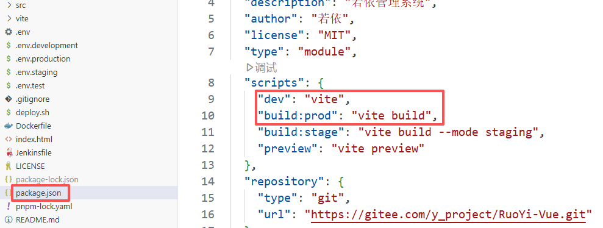

比如：运行项目`npm run dev`，打包项目`npm run build:prod`

打包前端项目后，项目中的那些后端地址其实就没有用了。因为用户访问前端项目后，前端项目是通过Nginx的反向代理来转发请求到后端的，我们需要在Nginx中配置反向代理相关内容，这时候才配置后端的地址信息。

打包命令执行完成之后，在项目中就会多出来一个dist目录，该目录中就包含了HTML、css、js等资源文件，我们就是将它们部署到生产环境中。


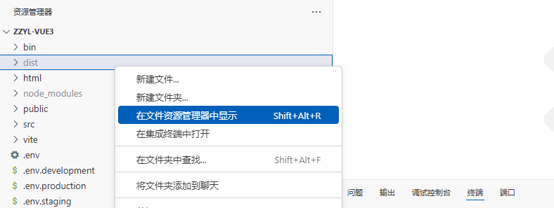


第二步：将前端打包后的项目代码上传到`/var/www`目录中

```shell
# mkdir /var/www
# cd /var/www/
# ls
dist
```

第三步：配置Nginx的配置文件1

```shell
# vim /etc/nginx/nginx.conf
# 添加相关内容：
# 在http的目录下，添加以下三个add_header信息，用于设置跨域
add_header Access-Control-Allow-Origin *;
add_header Access-Control-Allow-Methods "GET, POST, OPTIONS, PUT, DELETE";
add_header Access-Control-Allow-Headers "Origin, X-Requested-With, Content-Type, Accept, Authorization";

这几行的配置主要用于设置跨域资源共享（CORS），它们在Nginx中用来允许其他域名访问你的资源。CORS允许通过浏览器发起跨域http请求，常用于web应用与不同域名的API交互时，解决浏览器的同源策略限制。
```

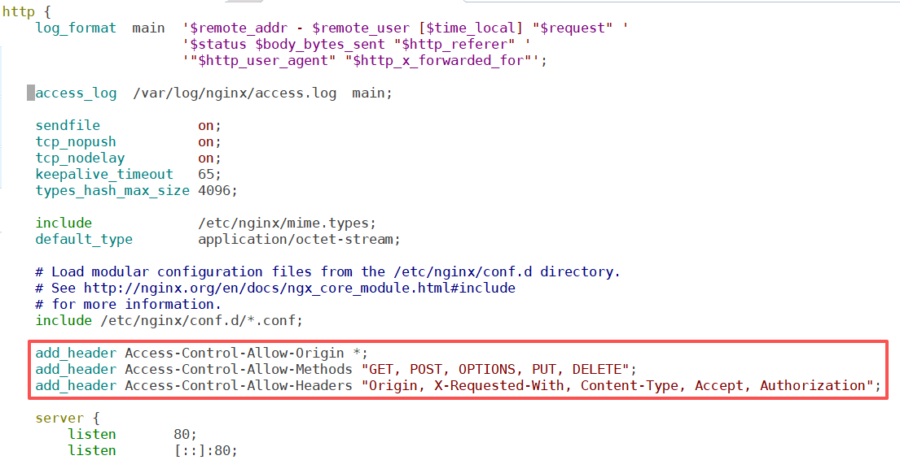

第四步：配置Nginx配置文件2

```shell
在Nginx配置文件中的server块下，添加以下三行内容，删除原有的server_name和root
client_max_body_size 60m;			# 限制客户端请求体的最大大小
client_body_buffer_size 512k;	# 设置Nginx用于缓冲客户端请求体的内存大小
client_header_buffer_size 2k; # 设置Nginx用于缓冲请求头的内存大小

说明：
这些配置项与Nginx处理客户端请求的请求体大小、请求头缓冲区等相关，主要用于控制Nginx在处理上传文件、请求体内容和请求头时的行为
```

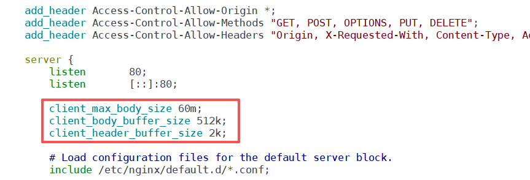

第五步：配置Nginx配置文件3

```shell
在server模块中，继续添加以下内容
location / {
  root 			/var/www/dist;
  index 		index.html 		index.htm;
  proxy_set_header 		Upgrade			$http_upgrade;
  proxy_set_header		Connection	upgrade;
  try_files	$uri	$uri/		/index.html;
}

location /prod-api/ {
  proxy_pass	http://192.168.126.192:8080/zzyl-admin/;
  proxy_set_header	Upgrade			$http_upgrade;
  proxy_set_header	Connection	upgrade;
}
```

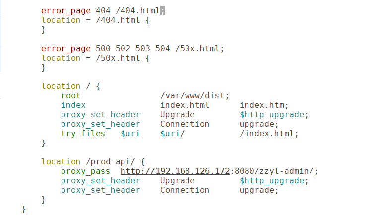

之所以，往后端转发请求的时候，路径匹配的是`/prod-api/`是因为前端已经设置好了：

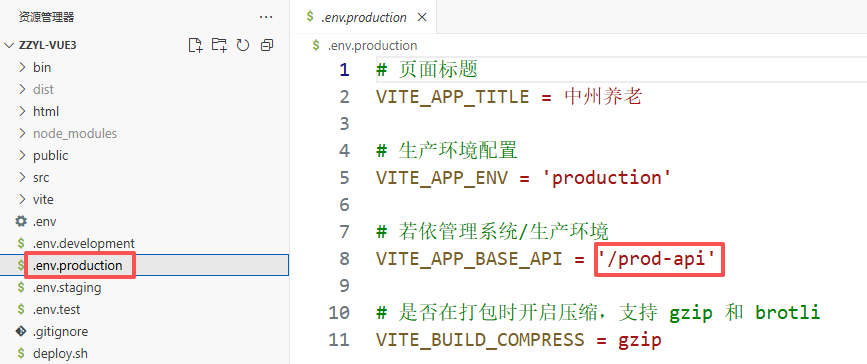

第六步：重启Nginx服务

```shell
# systemctl restart nginx
或者重新加载Nginx的配置（不停止服务）
# nginx -s reload
或者
# systemctl reload nginx
```

第七步：浏览器访问前端项目，地址是：http://192.168.19.173/login


## 最终的nginx的配置文件内容

`grep -Ev '^#|^$|^[ ]+#' /etc/nginx/nginx.conf`

```properties
user nginx;
worker_processes auto;
error_log /var/log/nginx/error.log;
pid /run/nginx.pid;
include /usr/share/nginx/modules/*.conf;
events {
    worker_connections 1024;
}
http {
    log_format  main  '$remote_addr - $remote_user [$time_local] "$request" '
                      '$status $body_bytes_sent "$http_referer" '
                      '"$http_user_agent" "$http_x_forwarded_for"';
    access_log  /var/log/nginx/access.log  main;
    sendfile            on;
    tcp_nopush          on;
    tcp_nodelay         on;
    keepalive_timeout   65;
    types_hash_max_size 4096;
    include             /etc/nginx/mime.types;
    default_type        application/octet-stream;
    include /etc/nginx/conf.d/*.conf;
    
    add_header Access-Control-Allow-Origin *;
    add_header Access-Control-Allow-Methods "GET, POST, OPTIONS, PUT, DELETE";
    add_header Access-Control-Allow-Headers "Origin, X-Requested-With, Content-Type, Accept, Authorization";
    
    server {
        listen       80;
        listen       [::]:80;

        #删除原有的server_name和root
        
        client_max_body_size 60m;
        client_body_buffer_size 512k;
        client_header_buffer_size 2k;
        include /etc/nginx/default.d/*.conf;
        error_page 404 /404.html;
        location = /404.html {
        }
        error_page 500 502 503 504 /50x.html;
        location = /50x.html {
        }
        
        location / {
            root                /var/www/dist;
            index               index.html      index.htm;
            proxy_set_header    Upgrade         $http_upgrade;
            proxy_set_header    Connection      upgrade;
            try_files   $uri    $uri/           /index.html;
        }
        
        location /prod-api/ {
            proxy_pass  http://192.168.19.172:8080/zzyl-admin/;
            proxy_set_header    Upgrade         $http_upgrade;
            proxy_set_header    Connection      upgrade;
        }
    }
}
```

## 问题说明

如果在Linux中的nginx中部署好了前端项目后，本次项目实战中，后端项目必须使用tomcat去运行后端war包的方式去启动！！！才能一切正常！

后端项目使用jar包的方式运行的话，前端页面中会报错！

# 三、搭建DNS服务器（node3）

## 域名规划

后台管理系统域名：www.zzyl-lhp.cn

DNS服务器域名：ns.zzyl-lhp.cn

时间同步服务器域名：ntp.zzyl-lhp.cn

## 在DNS服务器上安装bind

```shell
# yum -y install bind bind-utils

说明：
bind：提供 DNS 服务器功能，用于 解析域名(包括内部和外部域名)，管理 DNS 区域和记录。
bind-uti1s:提供一些 DNS 查询工具，如 dig、nslookup、host，用于测试和调试 DNS 配置.
```

## 配置bind主配置文件

bind 的主配置文件位于`/etc/named.conf`。我们需要修改这个文件来支持内部和外部 DNS 查询。

```shell
# vim /etc/named.conf
修改options中的内容
options {
    listen-on port 53 { 127.0.0.1; 192.168.126.0/24; }; # 内部网络地址
    listen-on-v6 { none; }; # 禁用IPV6，如果不需要的话
    allow-query { 127.0.0.1; 192.168.126.0/24; }; # 允许来自内部网络的查询

    recursion yes; # 启用递归查询

    forwarders {
        8.8.8.8;	# 谷歌DNS服务器
        114.114.114.114; # 国内移动、联通、电信的DNS
    };

    dnssec-validation no;

    # 控制区域传输权限，禁止外部直接访问区域
    allow-transfer { none; };
};
```

最终文件的效果：

```shell
options {
    listen-on port 53 { 127.0.0.1; 192.168.126.0/24; };
    listen-on-v6 port 53 { none; };
    directory       "/var/named";
    dump-file       "/var/named/data/cache_dump.db";
    statistics-file "/var/named/data/named_stats.txt";
    memstatistics-file "/var/named/data/named_mem_stats.txt";
    secroots-file   "/var/named/data/named.secroots";
    recursing-file  "/var/named/data/named.recursing";
    allow-query     { 127.0.0.1; 192.168.126.0/24; };

    recursion yes;

    forwarders {
        8.8.8.8;
        114.114.114.114;
    };

    dnssec-validation no;

    managed-keys-directory "/var/named/dynamic";
    geoip-directory "/usr/share/GeoIP";

    pid-file "/run/named/named.pid";
    session-keyfile "/run/named/session.key";

    include "/etc/crypto-policies/back-ends/bind.config";

    allow-transfer { none; };
};

logging {
    channel default_debug {
            file "data/named.run";
            severity dynamic;
    };
};

zone "." IN {
    type hint;
    file "named.ca";
};

include "/etc/named.rfc1912.zones";
include "/etc/named.root.key";
```

## 配置内部区域正向解析

正向解析：通过域名解析到对应的IP地址。

```shell
# vim /etc/named.rfc1912.zones

最后添加如下内容：
zone "zzyl-lhp.cn" IN {
    type master;
    file "/var/named/zzyl-lhp.cn.zone";
    allow-update { none; };
};


# vim /var/named/zzyl-lhp.cn.zone
编写如下内容：
$TTL 1D
@       IN      SOA     ns.zzyl-lhp.cn. admin.zzyl-lhp.cn. (
                        0       ; serial
                        1D      ; refresh
                        1H      ; retry
                        1W      ; expire
                        3H )    ; minimum

        IN      NS      ns.zzyl-lhp.cn.
ns      IN      A       192.168.19.173
www     IN      A       192.168.19.173
ntp     IN      A       192.168.19.173
@       IN      A       192.168.19.173
```

## 配置内部反向解析

通过IP地址能够解析到对应的域名（主机名）

```shell
# vim /etc/named.rfc1912.zones
在最后添加如下内容
zone "126.168.192.in-addr.arpa" IN {
    type master;
    file "/var/named/192.168.126.zone";
    allow-update { none; };
};

# vim /var/named/192.168.126.zone
编辑如下内容
$TTL 1D
@       IN SOA  ns.zzyl-lhp.cn. admin.zzyl-lhp.cn. (
                        0       ; serial
                        1D      ; refresh
                        1H      ; retry
                        1W      ; expire
                        3H )    ; minimum

        IN      NS      ns.zzyl-lhp.cn.
173     IN      PTR     ns
173     IN      PTR     ntp
173     IN      PTR     www
173     IN      PTR     @
```

## 语法检测

```shell
配置文件语法检查
# named-checkconf /etc/named.conf

区域文件语法检查
# named-checkzone zzyl-lhp.cn /var/named/zzyl-lhp.cn.zone
# named-checkzone 126.168.192.in-addr.arpa /var/named/192.168.126.zone
```

## 启动DNS服务

```shell
# systemctl start named
# systemctl enable named
# systemctl status named
```

## 配置防火墙

```shell
# firewall-cmd --add-service dns --permanent
# firewall-cmd --reload
# firewall-cmd --list-all
```

## 配置各个节点的DNS配置

### node1服务器

在 node1服务器中，将 DNS 地址设置为 node3 服务器的 IP 地址，因为 node3 是我们自己搭建好的DNS 服务器。

```shell
# vim /etc/NetworkManager/system-connections/ens33.nmconnection
修改dns的配置
dns=192.168.126.173;

重启NetworkManager，那么最新配置的DNS就生效了
# systemctl restart NetworkManager

# ping www.zzyl-lhp.cn
# ping ntp.zzyl-lhp.cn
# ping ns.zzyl-lhp.cn
# ping zzyl-lhp.cn
```

在 node1 服务器中，将时间同步的配置文件中时间服务器的地址修改为相应的域名。

```shell
# vim /etc/chrony.conf
server ntp.zzyl-lhp.cn iburst

# systemctl restart chronyd
# systemctl status chronyd
# chronyc sources
```

### Windows系统

修改我们 Windows 系统的 DNS 配置，指定 DNS 为 node3 中搭建好的 DNS 服务器，也就是设置 DNS为 node3 的 IP 地址。


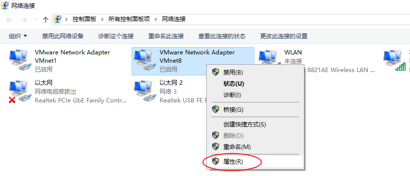

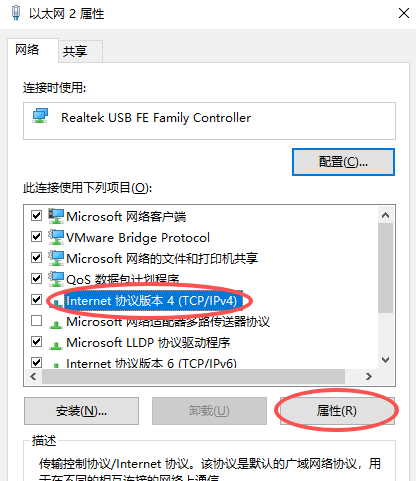

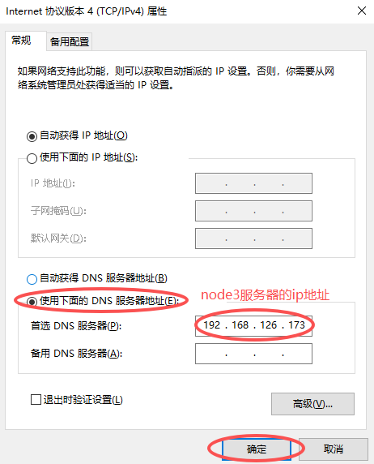

然后一路点击确定。

## 测试

浏览器访问测试：`http://www.zzyl-lhp.cn`

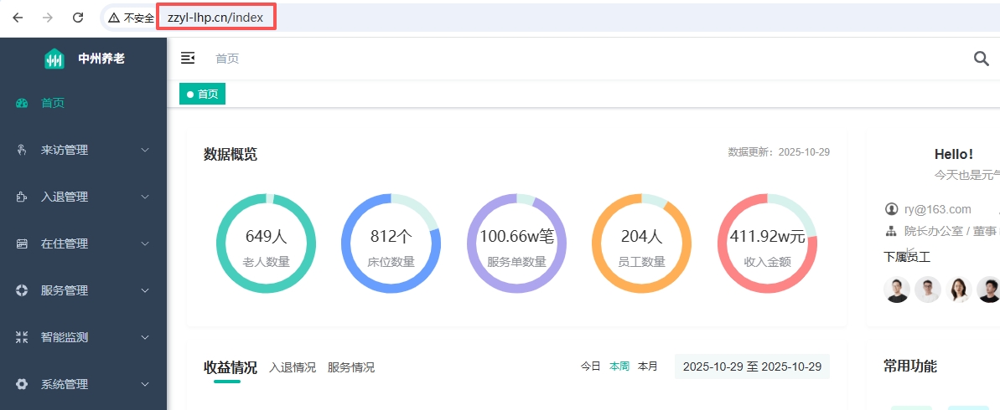

# 四、日志服务

目的：就是将node2上面的后端项目相关的日志文件和node3上面的前端项目相关的日志文件同步到node1服务器上，方便运维人员查看日志！

## 需求

在node1节点中，单独挂载一块磁盘，用于存储中州养老项目的日志数据，同时支持后续扩容。

```powershell
初始磁盘大小：50G
采用LVM方案
挂载点：/mnt/zzyl_logs

日志需求说明：
node3节点的Nginx的access.log和error.log开启日志轮转方案，每日轮转一次，至少保留6个。

后台系统 node2：/home/ruoyi/logs 已有日志轮转，无需配置
sys-info.xxxx-xx-xx.log
sys-user.xxxx-xx-xx.log
sys-error.xxxx-xx-xx.log

对日志，进行周期性同步，每日凌晨1点，准时同步之前（不含当天日志）的Nginx和后台系统日志到 /mnt/zzyl_logs

注意：涉及到名字的命令，要求见名知义即可，可以任意定义
```

## 添加磁盘（node1）

关闭node1节点，然后添加一块磁盘，50G。

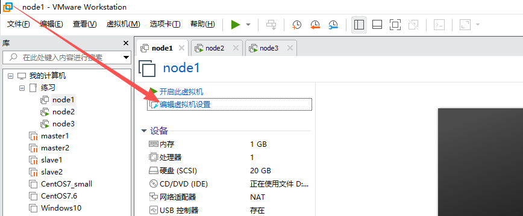

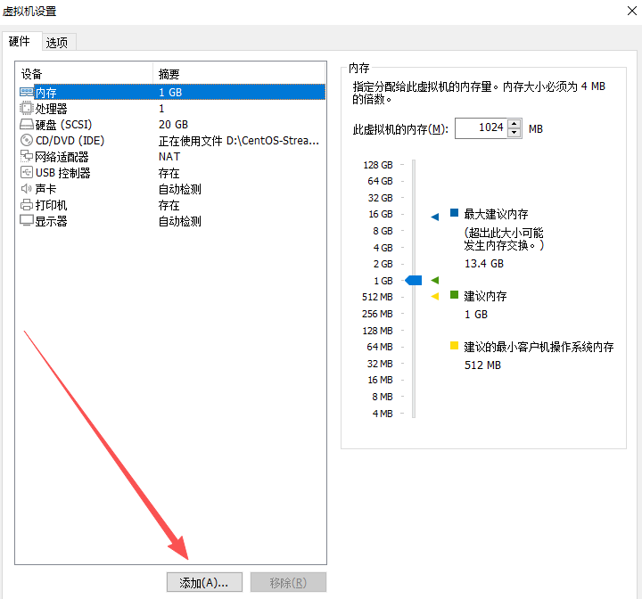

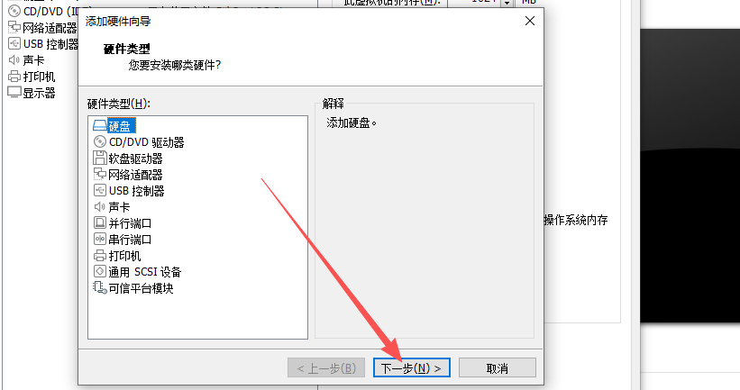

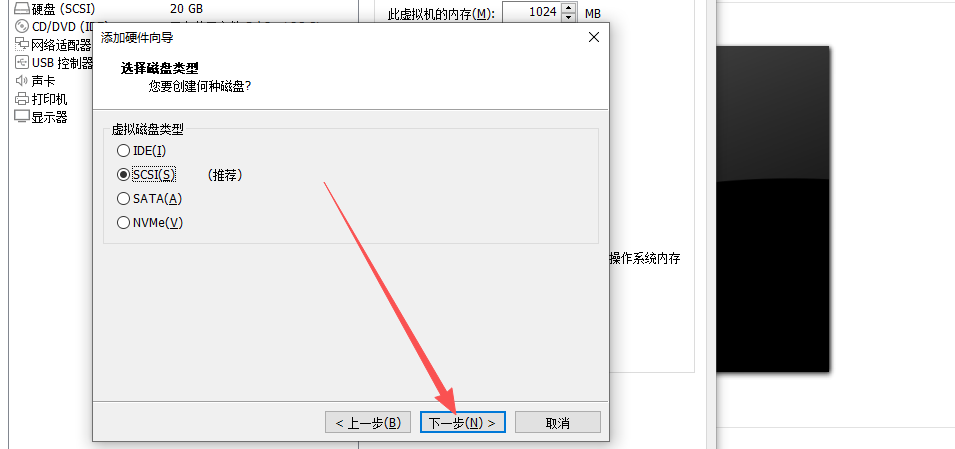

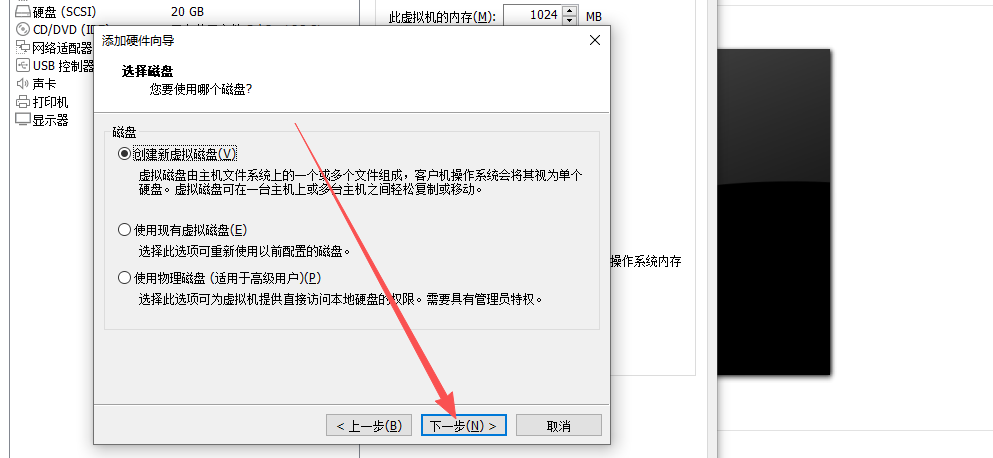

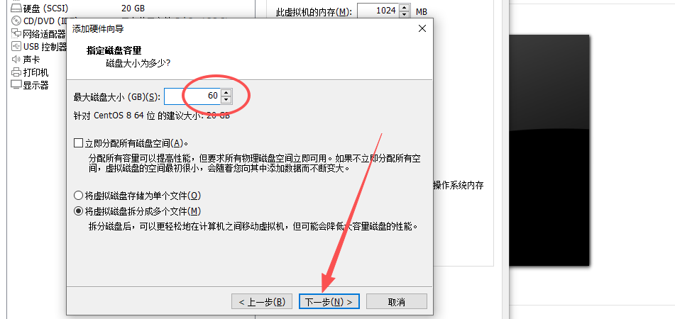


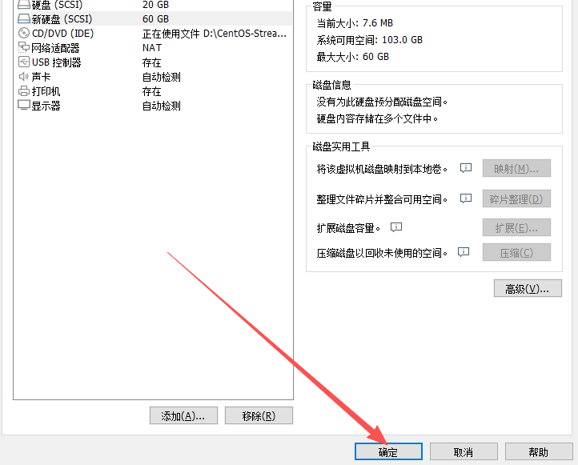

最后，开启node1机器。

因为我们刚刚关过node1，node1中部署的是MySQL和redis，所以启动node1之后，最好验证一下MySQL和redis是否正常启动了（虽说我们之前设置了开机自启）

```powershell
# systemctl status mysqld
# systemctl status redis
```

## LVM管理

```powershell
查看磁盘设备情况
# lsblk

创建物理卷
# pvcreate /dev/sdb

创建卷组，将上面的物理卷加入到卷组中
# vgcreate vg_zzyl_log_data /dev/sdb

查看卷组
# vgdisplay vg_zzyl_log_data

创建逻辑卷
# lvcreate -L +50GB -n lv_zzyl_log_data vg_zzyl_log_data

# lvcreate -l +100%FREE -n lv_zzyl_log_data vg_zzyl_log_data

查看逻辑卷信息
# lvdisplay vg_zzyl_log_data/lv_zzyl_log_data

格式化逻辑卷
# mkfs.xfs /dev/vg_zzyl_log_data/lv_zzyl_log_data

创建挂载点
# mkdir /mnt/zzyl_logs

挂载逻辑卷
# mount /dev/vg_zzyl_log_data/lv_zzyl_log_data /mnt/zzyl_logs

查看挂载情况
# df -hT
```

## 配置Nginx日志轮转

> 后台系统的日志已经配置了日志轮转了，我们只需要配置Nginx日志轮转。

```powershell
在node3服务器中做如下操作：
进入配置日志轮转的目录
# cd /etc/logrotate.d/
# ll
-rw-r--r--. 1 root root 130 10月 14  2019 btmp
-rw-r--r--. 1 root root 160 10月  8  2024 chrony
-rw-r--r--. 1 root root  88  9月  9  2022 dnf
-rw-r--r--. 1 root root  93 11月  7  2024 firewalld
-rw-r--r--. 1 root root 162  6月  6 18:09 kvm_stat
-rw-r--r--  1 root root 514  7月 10 23:07 named
-rw-r--r--  1 root root 261  6月 19 17:37 nginx
-rw-r--r--. 1 root root 226  5月  7 21:14 rsyslog
-rw-r--r--. 1 root root 289  5月 21 03:21 sssd
-rw-r--r--  1 root root 188  8月 20  2024 vsftpd
-rw-r--r--. 1 root root 145 10月 14  2019 wtmp

# vim nginx
/var/log/nginx/*.log {
    create 0640 nginx root
    daily
    rotate 6
    dateext
    dateformat -%Y-%m-%d
    missingok
    notifempty
    compress
    delaycompress
    sharedscripts
    postrotate
        /bin/kill -USR1 `cat /run/nginx.pid 2>/dev/null` 2>/dev/null || true
    endscript
}

可以看到，其实我们安装完Nginx后，它已经自动配置好了日志轮转，每日轮转。保留10份！那就不需要我们再配置了！我们只需要将 rotate 改为 6 即可。

# vim nginx
第4行 rotate 6

# systemctl restart logrotate

强制对Nginx日志进行轮转，看是否好使（要想看轮转效果，目前的日志文件中必须有点内容！）
# logrotate -f /etc/logrotate.d/nginx
# ls /var/log/nginx/
access.log  access.log-2026-05-09  error.log  error.log-2026-05-09
```

## 部署日志同步

### 分析

对日志，进行周期性同步，每日凌晨1点，准时同步之前（不含当天日志）的Nginx和后台系统日志到 `/mnt/zzyl_logs`目录中。

```powershell
需求：我们只需要同步前一天及其之前的日志文件。也就是日志文件名中带日期的就是需要同步的。因为当天的日志文件名中是不带日期的。

数据源：
node2: /home/ruoyi/logs 中的三个日志文件：
      sys-info.2025-05-05.log
      sys-user.2025-05-05.log
      sys-error.2025-05-05.log
node3: /var/log/nginx 中的两个日志文件
      access.log.1
      error.log.1

目的地：
node1: /mnt/zzyl_logs


我们后面只需要在node1节点中编写同步的定时任务、同步的脚本，让node1到点后，从node2、node3中指定位置下载文件！！！
```

### 安装rsync工具

需要在 node1、node2、node3 中都安装`rsync`工具。

```powershell
# yum -y install rsync
```

### 编写定时任务进行日志同步

在 node1 节点编写：

```powershell
# crontab -e
0 1 * * * /usr/bin/rsync -avz --delete root@192.168.126.172:/home/ruoyi/logs/sys-*.*.log /mnt/zzyl_logs/
0 1 * * * /usr/bin/rsync -avz --delete root@192.168.126.173:/var/log/nginx/*.log.* /mnt/zzyl_logs/
```

> 如果大家晚上不关掉3个节点的话，第二天是可以看到同步的日志效果的。如果关机的话，是没法运行的。


> 更新: 2026-05-11 08:47:44  
> 原文: <https://www.yuque.com/u41736172/az9urv/acdv4gqy1on4fxkk>