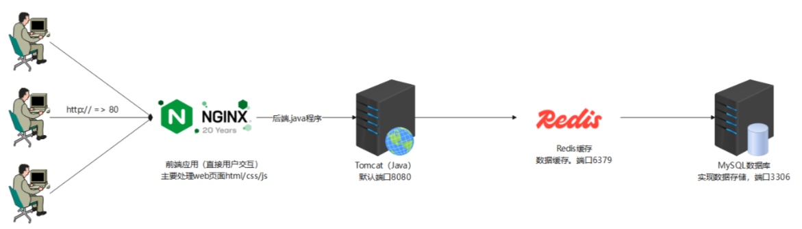
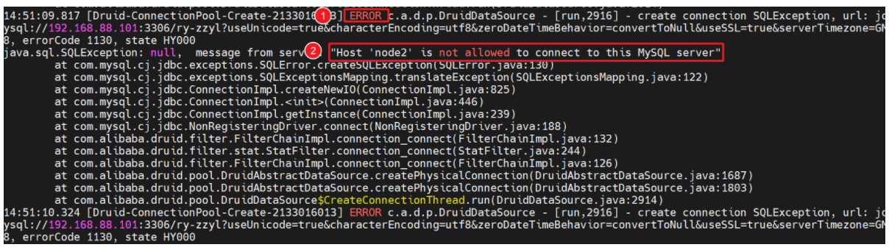
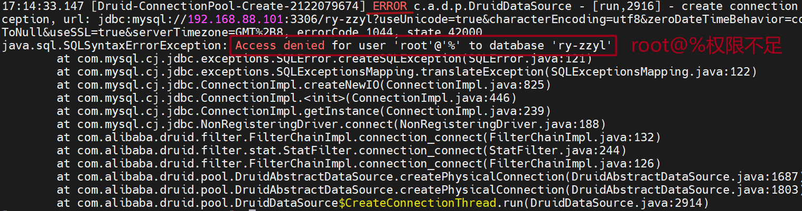

# 04.中州养老 Web 一键部署

# 项目目的

思路 + 积累 + 借助于AI大模型（AI+Shell）

学一键部署不是让大家一个命令一个命令输入，也不需要死记硬背！！！

学习本章节目的：① 积累脚本（掌握各种软件安装脚本）② 回顾中州养老的一键部署 ③ 掌握生产环境下Shell脚本是如何编写的



# 一、node1 服务部署

## ssh 免密

在 node1 服务器上执行，对 node2、node3 实现免密操作

```shell
if [ ! -f ~/.ssh/id_rsa ]; then
  ssh-keygen -t rsa -b 2048 -N "" -f ~/.ssh/id_rsa
fi

for i in 192.168.126.172 192.168.126.173
do
    ssh-copy-id -o StrictHostKeyChecking=no root@$i
done
```

扩展：完全免密

提前安装 expect => `dnf install expect -y`

```shell
#!/bin/bash

# 检查是否存在 id_rsa 密钥
if [ ! -f ~/.ssh/id_rsa ]; then
  ssh-keygen -t rsa -b 2048 -N "" -f ~/.ssh/id_rsa
fi

# 循环将公钥复制到目标主机
for i in 192.168.126.172 192.168.126.173
do
  /usr/bin/expect <<EOF
  spawn ssh-copy-id -o StrictHostKeyChecking=no root@$i
  expect {
    "yes/no" { send "yes\r"; exp_continue }
    "password:" { send "123456\r" }
  }
  expect eof
EOF
done
```

## mysql 部署

前置准备：

```shell
mkdir -p /usr/local/zzyl_project/sql_data
上传sql代码到ry-zzyl_20240913.sql
```

```shell
#!/bin/bash
dnf install -y https://dev.mysql.com/get/mysql80-community-release-el9-1.noarch.rpm
dnf repolist enabled | grep mysql
[ $? -eq 0 ] && dnf install -y mysql-community-server --nogpgcheck
rpm -q mysql-community-server &> /dev/null
if [ $? -ne 0 ]; then
    echo 'mysql未安装成功，请排查问题！'
    exit
fi
systemctl start mysqld
systemctl enable mysqld
grep password /var/log/mysqld.log |cut -d' ' -f13 > /root/mysql_pass.txt
TEMP_PASSWORD=`cat /root/mysql_pass.txt`

# 登录 MySQL 并执行配置
MYSQL_ROOT_PASSWORD="LiHuPeng@123"
mysql --connect-timeout=10 -uroot -p"$TEMP_PASSWORD" --connect-expired-password <<EOF
-- 设置新的 root 密码
ALTER USER 'root'@'localhost' IDENTIFIED BY '$MYSQL_ROOT_PASSWORD';
-- 创建一个 root@% 账号
CREATE USER 'root'@'%' IDENTIFIED BY '$MYSQL_ROOT_PASSWORD';
-- 预留知识点：暂未设置账号权限
-- 删除匿名用户
DELETE FROM mysql.user WHERE User='';
-- 删除 test 数据库
DROP DATABASE IF EXISTS test;
-- 刷新权限
FLUSH PRIVILEGES;
EOF

cd /usr/local/zzyl_project/sql_data
mysql -uroot  < ry-zzyl_20240913.sql -pLiHuPeng@123


说明：
mysql中账号，root@localhost是账号，localhost代表这个账号只能在本机连接使用
            root@%是账号，%代表这个账号可以在任意主机连接使用
            
导入.sql文件（数据文件）到mysql数据库里面
mysql -u账号 < .sql文件 -p密码
```

> mysql> create user 'root'@'%' identified by 'LiHuPeng@123'; 在 MySQL 软件中创建管理员账号root@%
>
> mysql> grant all on *.* to 'root'@'%'; grant 代表给账号分配权限，*.*，左边的 \* 代表所有数据库，右边代表所有数据表

常见问题说明：

`问题1：cat /root/mysql_pass.txt`，发现没有密码，什么原因？

答：因为操作系统不是纯净的，之前肯定安装过 mysql 软件，导致本次安装无法初始化，无法初始化就不会产生密码。解决方案：可以使用我分发的 node1 替换你原有的机器。

<code>问题2：``<font style="color:rgb(216,57,49);">ERROR 1045</font>`` (28000): Access denied for user 'root'@'``localhost``' (using password: YES)</code>，1045 是一个比较经典错误，代表<font style="color:rgb(216,57,49);">密码输入有误 或者 之前服务器上已经安装过 mysql了，密码已经被更改为 LiHuPeng@123</font>

<font style="color:rgb(216,57,49);"></font>

`问题3：`MySQL 如何登录？如何验证数据库是否导入成功？

<font style="color:rgb(216,57,49);">答：mysql -uroot -pLiHuPeng@123，进入到数据库，显示 mysql> show databases;，退出数据库mysql> exit</font>

<font style="color:rgb(216,57,49);"></font>

`问题4：`ERROR 2002 (HY000): Can't connect to local MySQL server through socket '/var/lib/mysql/mysql.sock' (2)

<font style="color:rgb(216,57,49);">答：出现以上问题的主要原因在于</font><code><font style="color:rgb(216,57,49);">Can't connect to local MySQL server</font></code><font style="color:rgb(216,57,49);">，简单来说就是你的MySQL 没有启动！！！解决方案：systemctl start mysqld</font>

<font style="color:rgb(216,57,49);"></font>

`问题5`：密码没有被修改，密码不是 LiHuPeng@123，怎么办？

<font style="color:rgb(216,57,49);">答：检索旧密码，grep password /var/log/mysqld.log，如何改密码以及设置权限</font>

```shell
mysql -uroot -p
Enter password: 输入刚才找到的旧密码

mysql> ALTER USER 'root'@'localhost' IDENTIFIED BY 'LiHuPeng@123';
mysql> CREATE USER 'root'@'%' IDENTIFIED BY 'LiHuPeng@123';
```

## redis 部署

```shell
# 更新dnf相关软件包 【可选】  时间较长 预计20分钟
# dnf update -y
# 安装redis操作
dnf install redis -y
# 修改redis相关配置
sed -i '75s#127\.0\.0\.1#0\.0\.0\.0#' /etc/redis/redis.conf
sed -i '903a requirepass 123456' /etc/redis/redis.conf
# 启动redis
systemctl start redis
systemctl enable redis
```

## Shell 编码习惯

脚本执行时，可以使用<code><font style="color:rgb(216,57,49);">sh/bash -x 脚本.sh</font></code>，了解底层所有代码是否正常执行！！！

改了配置文件的，如 Redis，更改了`/etc/redis/redis.conf`文件，确认<font style="color:rgb(216,57,49);">75行</font>和<font style="color:rgb(216,57,49);">904行</font>是否更改成功！！！

大家养成看日志的习惯，软件跑的不正常，和我们期望的不一致，一定要看日志。

> MySQL ：<font style="color:rgb(216,57,49);">tail -100 /var/log/mysqld.log</font>
>
> Redis 主要确认配置文件 和<font style="color:rgb(216,57,49);"> systemctl status redis</font>

重点：软件本身如果有日志的，报错的时候首先看日志如 `/var/log/mysqld.log`，如果没有日志看系统日志如<code><font style="color:rgb(216,57,49);">/var/log/messages</font></code>

# 二、node2 服务部署

## jdk11

```shell
mkdir -p /export/software
cd /export/software
dnf install wget -y
wget https://download.java.net/openjdk/jdk11.0.0.2/ri/openjdk-11.0.0.2_linux-x64.tar.gz
tar -xf openjdk-11.0.0.2_linux-x64.tar.gz -C /usr/local/
# 添加到环境变量
echo 'export JAVA_HOME=/usr/local/jdk-11.0.0.2' >> /etc/profile
echo 'export PATH=$JAVA_HOME/bin:$PATH' >> /etc/profile
echo 'export CLASSPATH=$JAVA_HOME/lib:$CLASSPATH' >> /etc/profile
source /etc/profile

执行脚本
source jdk11.sh
-----------------------------------------------------------------------------------
普及一个概念：wget命令
用于在线下载程序或软件，wget 软件下载地址!

软件安装完成后，则直接使用java -version查看是否生效
java -version
```

## tomcat

编写 tomcat 脚本之前，必须把 <font style="color:rgb(216,57,49);">zzyl-admin.war </font>这个软件上传到服务器的 <font style="color:rgb(216,57,49);">/root </font>目录中

```shell
# 设置中州养老项目默认上传目录
mkdir -p /home/ruoyi/uploadPath
cd /export/software/
wget https://dlcdn.apache.org/tomcat/tomcat-9/v9.0.100/bin/apache-tomcat-9.0.100.tar.gz
tar -xzf apache-tomcat-9.0.100.tar.gz -C /usr/local/
cd /usr/local/apache-tomcat-9.0.100
mv /root/zzyl-admin.war webapps/
./bin/shutdown.sh
./bin/startup.sh


注意：/usr/local等价于Windows中的Program files
面试：Tomcat启动脚本是什么？Tomcat项目目录是哪里？
答：startup.sh启动脚本，默认情况下，项目源码都是放置于tomcat下面的webapps目录
```

tomcat 常见错误说明：

如果遇到问题，先不急，重点看 Tomcat 的日志：

```shell
cd /usr/local/apache-tomcat-9.0.100/
tail -100 logs/catalina.out
```

第一种情况：数据库连接失败



前台浏览器访问，弹出404，提示未找到，根本原因还是数据库无法访问导致！！！

造成以上问题的可能有两种情况：

① 防火墙没关 => 阻挡了3306、6379等端口访问，造成 Tomcat 中的项目无法访问 Redis 以及 MySQL

```shell
systemctl  stop  firewalld
```

② MySQL 的确没有给 root 账号开辟远程访问权限，如果没有开启，需要手工开启。



```shell
mysql -e "grant all on *.* to root@'%';" -pLiHuPeng@123

说明：
mysql -e：代表不需要进入mysql，就可以在终端中设置权限
grant分配权限
all代表所有权限
on，针对哪个数据库的哪个表设置权限
*.*，任意数据库的任意表
to，针对哪个账号
root@'%',主要针对root账号

特别说明：如果以上命令无法执行，则代表root@%根本不存在，需要手工创建后，在分配权限
mysql -e "CREATE USER 'root'@'%' IDENTIFIED BY 'LiHuPeng@123';" -pLiHuPeng@123
```

权限设置完成后，一定要重启 Tomcat 软件

```shell
cd /usr/local/apache-tomcat-9.0.100
./bin/shutdown.sh
./bin/startup.sh

注意：Tomcat重启后，不要急查看效果，等待3-5分钟，在进行查看，否则可能Tomcat还没有重启成功。
```

第二种情况：前端报 404，MySQL 正常，Tomcat 不仅要访问 MySQL 还要访问 Redis，如果 Redis 没有配置好，也会导致 404

```shell
vim  /etc/redis/redis.conf
75      bind 0.0.0.0 -::1
904     requirepass 123456

systemctl  restart  redis
```

> Tomcat 运行常见问题说明
>
> Java 软件运行都很慢，1-吃内存（内存够大，最小4G）2-Tomcat 启动后，略微等待3-5分钟。
>
> 大家养成看 Tomcat 日志习惯 => 安装目录下有一个 logs 文件 => `tail -100 logs/catalina.out`
>
> Tomcat 无法启动，80-90%，要么是连接不上 MySQL，要么 MySQL 里面没有数据，要么 Redis，没有开启远程访问。
>
> 启动没有问题后，在浏览器中，输入 http://192.168.126.172:8080/zzyl-admin

# 三、node3 服务部署

## nginx

要求：要把前端代码 dist.zip 提前放入 /root 目录下

```shell
dnf install nginx -y
systemctl start nginx
systemctl enable nginx
mkdir -p /var/www/

sed -i '37a \
    add_header Access-Control-Allow-Origin *;\
    add_header Access-Control-Allow-Methods "GET, POST, OPTIONS, PUT, DELETE";\
    add_header Access-Control-Allow-Headers "Origin, X-Requested-With, Content-Type, Accept, Authorization";' /etc/nginx/nginx.conf
        
sed -i '46a \
        location / {\
            root   /var/www/dist;\
            index  index.html index.htm;\
            proxy_set_header   Upgrade          $http_upgrade;\
            proxy_set_header   Connection       upgrade;\
            try_files $uri $uri/ /index.html;\
        }\
        location /prod-api/ {\
            proxy_pass http:\/\/192.168.126.172:8080\/zzyl-admin\/;\
            proxy_set_header   Upgrade          $http_upgrade;\
            proxy_set_header   Connection       upgrade;\
        }' /etc/nginx/nginx.conf

mv /root/dist.zip /var/www/
cd /var/www/
unzip dist.zip

nginx -s reload
```

如果是远程执行，需要使用：

```shell
#!/bin/bash
ssh -t root@192.168.126.173 <<EOF
dnf install nginx -y
systemctl start nginx
systemctl enable nginx
mkdir -p /var/www/
mv /root/dist.zip /var/www/
cd /var/www/
unzip dist.zip
chown -R nginx:nginx /var/www

sed -i '36a \
add_header Access-Control-Allow-Origin *;\n \
add_header Access-Control-Allow-Methods "GET, POST, OPTIONS, PUT, DELETE";\n \
add_header Access-Control-Allow-Headers "Origin, X-Requested-With, Content-Type, Accept, Authorization";\n
' /etc/nginx/nginx.conf

sed -i '46a \
location / {\n \
root   /var/www/dist;\n \
index  index.html index.htm;\n \
proxy_set_header   Upgrade          \$http_upgrade;\n \
proxy_set_header   Connection       upgrade;\n \
try_files \$uri \$uri/ /index.html;\n\
}\n \
location /prod-api/ {\n \
proxy_pass http:\/\/192.168.88.102:8080\/zzyl-admin\/;\n \
proxy_set_header   Upgrade          \$http_upgrade;\n \
proxy_set_header   Connection       upgrade;\n \
}' /etc/nginx/nginx.conf

nginx -s reload
EOF
```

Nginx 常见问题说明：

本身安装很简单，真正容易出错的，是 Nginx 中的配置文件 => `vim /etc/nginx/nginx.conf`

如果配置文件写错了，可以通过`nginx -t`查看

# 四、最终脚本

node1：lnmt.sh

提前准备：

node1 服务器：<font style="color:rgb(216,57,49);">mkdir -p /usr/local/zzyl\_project/sql\_data</font>，然后把 `.sql` 脚本上传到这个目录！！！

node2 服务器：把 <font style="color:rgb(216,57,49);">zzyl-admin.war </font>源码放入 /root 目录下

node3 服务器：把 <font style="color:rgb(216,57,49);">dist.zip </font>前端源码放入 /root 目录下

```shell
echo "开始实现SSH免密登录..."
echo "==================================="
# 检查是否存在 id_rsa 密钥
if [ ! -f ~/.ssh/id_rsa ]; then
  ssh-keygen -t rsa -b 2048 -N "" -f ~/.ssh/id_rsa
fi

yum install expect -y
# 循环将公钥复制到目标主机
for i in 192.168.126.172 192.168.126.173
do
  /usr/bin/expect <<EOF
  spawn ssh-copy-id -o StrictHostKeyChecking=no root@$i
  expect {
    "yes/no" { send "yes\r"; exp_continue }
    "password:" { send "123456\r" }
  }
  expect eof
EOF
done

echo "开始实现MySQL安装部署..."
echo "==================================="
dnf install -y https://dev.mysql.com/get/mysql80-community-release-el9-1.noarch.rpm
dnf repolist enabled | grep mysql
[ $? -eq 0 ] && dnf install -y mysql-community-server --nogpgcheck
rpm -q mysql-community-server &> /dev/null
systemctl start mysqld
systemctl enable mysqld

TEMP_PASSWORD=$(grep password /var/log/mysqld.log |cut -d' ' -f13)
echo $TEMP_PASSWORD > /tmp/mysql_password.txt
chmod 600 /tmp/mysql_password.txt

# 登录 MySQL 并执行配置
MYSQL_ROOT_PASSWORD="LiHuPeng@123"
mysql --connect-timeout=10 -uroot -p"$TEMP_PASSWORD" --connect-expired-password <<EOF
-- 设置新的 root 密码
ALTER USER 'root'@'localhost' IDENTIFIED BY '$MYSQL_ROOT_PASSWORD';
-- 删除匿名用户
DELETE FROM mysql.user WHERE User='';
-- 禁止 root 远程登录
UPDATE mysql.user SET Host='localhost' WHERE User='root' AND Host='%';
-- 删除 test 数据库
DROP DATABASE IF EXISTS test;
-- 刷新权限
FLUSH PRIVILEGES;
EOF

cd /usr/local/zzyl_project/sql_data
mysql -uroot  < ry-zzyl_20240913.sql -pLiHuPeng@123

mysql -e "create user root@'%' identified by 'LiHuPeng@123';" -pLiHuPeng@123
mysql -e "grant all on *.* to root@'%';" -pLiHuPeng@123

echo "开始实现Redis安装部署..."
echo "==================================="
# 更新dnf相关软件包 【可选】  时间较长 预计20分钟
# dnf update -y
# 安装redis操作
dnf install redis -y
# 修改redis相关配置
sed -i '75s/127\.0\.0\.1/0.0.0.0/' /etc/redis/redis.conf
sed -i '903a requirepass 123456' /etc/redis/redis.conf
# 启动redis
systemctl start redis
systemctl enable redis

echo "切换到node2服务器..."

ssh root@192.168.126.172 <<'EOF'
echo "开始实现JDK安装部署..."
echo "==================================="
mkdir -p /export/software
cd /export/software
dnf install wget -y
wget https://download.java.net/openjdk/jdk11.0.0.2/ri/openjdk-11.0.0.2_linux-x64.tar.gz
tar -xf openjdk-11.0.0.2_linux-x64.tar.gz -C /usr/local/
# 添加到环境变量
echo 'export JAVA_HOME=/usr/local/jdk-11.0.0.2' >> /etc/profile
echo 'export PATH=$JAVA_HOME/bin:$PATH' >> /etc/profile
echo 'export CLASSPATH=$JAVA_HOME/lib:$CLASSPATH' >> /etc/profile
source /etc/profile

echo "开始实现Tomcat安装部署..."
echo "==================================="
mkdir -p /home/ruoyi/uploadPath
cd /export/software/
wget https://dlcdn.apache.org/tomcat/tomcat-9/v9.0.100/bin/apache-tomcat-9.0.100.tar.gz
tar -xzf apache-tomcat-9.0.100.tar.gz -C /usr/local/
cd /usr/local/apache-tomcat-9.0.100
mv /root/zzyl-admin.war webapps/
./bin/shutdown.sh &> /dev/null
sleep 5
./bin/startup.sh
EOF

ssh root@192.168.126.173 <<'EOF'
dnf install nginx -y
systemctl start nginx
systemctl enable nginx
mkdir -p /var/www/

sed -i '36a \
add_header Access-Control-Allow-Origin *;\n \
add_header Access-Control-Allow-Methods "GET, POST, OPTIONS, PUT, DELETE";\n \
add_header Access-Control-Allow-Headers "Origin, X-Requested-With, Content-Type, Accept, Authorization";\n
' /etc/nginx/nginx.conf

sed -i '46a \
location / {\n \
root   /var/www/dist;\n \
index  index.html index.htm;\n \
proxy_set_header   Upgrade          \$http_upgrade;\n \
proxy_set_header   Connection       upgrade;\n \
try_files \$uri \$uri/ /index.html;\n\
}\n \
location /prod-api/ {\n \
proxy_pass http:\/\/192.168.126.172:8080\/zzyl-admin\/;\n \
proxy_set_header   Upgrade          \$http_upgrade;\n \
proxy_set_header   Connection       upgrade;\n \
}' /etc/nginx/nginx.conf

mv /root/dist.zip /var/www/
cd /var/www/
unzip dist.zip
chown -R nginx:nginx /var/www/

nginx -s reload
EOF
```

node1 执行以上脚本

```shell
source lnmt.sh
```

扩展：EOF 中的变量，默认被系统解析解决方案

```shell
ssh root@192.168.126.172 <<EOF
echo "开始实现JDK安装部署..."
echo "==================================="
# 添加到环境变量
echo 'export JAVA_HOME=/usr/local/jdk-11.0.0.2' >> /etc/profile
echo 'export PATH=\$JAVA_HOME/bin:\$PATH' >> /etc/profile
echo 'export CLASSPATH=$JAVA_HOME/lib:\$CLASSPATH' >> /etc/profile
EOF
```

如果不想变量被解析，而是原样写入目标文件，可以考虑使用 `\` 进行转义，让系统把 `$` 当做普通字符处理！！！

还可以这样操作，EOF 本身使用双引号，所以其内部变量会被解析，我们可以强制 EOF 为单引号 `<<'EOF'`

```shell
ssh root@192.168.126.172 <<'EOF'
echo "开始实现JDK安装部署..."
echo "==================================="
# 添加到环境变量
echo 'export JAVA_HOME=/usr/local/jdk-11.0.0.2' >> /etc/profile
echo 'export PATH=$JAVA_HOME/bin:$PATH' >> /etc/profile
echo 'export CLASSPATH=$JAVA_HOME/lib:$CLASSPATH' >> /etc/profile
EOF
```


> 更新: 2026-05-10 21:14:40  
> 原文: <https://www.yuque.com/u41736172/az9urv/plciafo6d2h4cgsw>