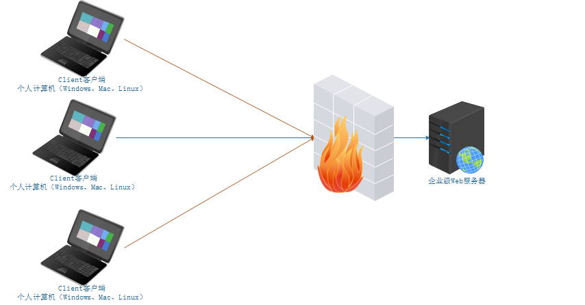
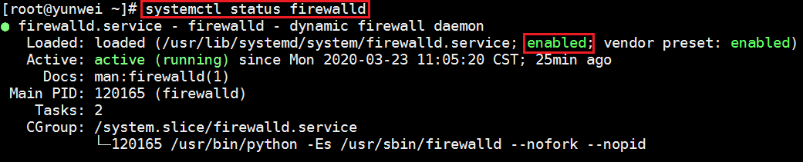
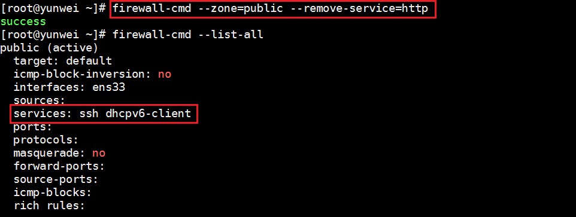
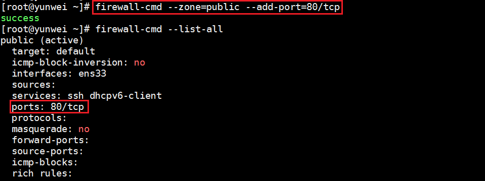
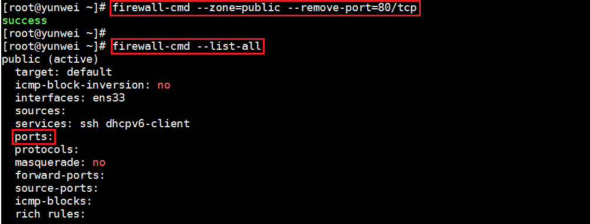

# 05.防火墙

# <font style="color:rgb(51, 51, 51);">一、Linux 中防火墙 firewalld</font>
## <font style="color:rgb(51, 51, 51);">什么是防火墙</font>
<font style="color:rgb(51, 51, 51);">防火墙：防范一些网络攻击。有软件防火墙、硬件防火墙之分。</font>


<font style="color:rgb(51, 51, 51);">防火墙选择让正常请求通过，从而保证网络安全性。</font>

<font style="color:rgb(51, 51, 51);">Windows 防火墙：</font>


<font style="color:rgb(51, 51, 51);">Windows防火墙的划分与开启、关闭操作：</font>


## <font style="color:rgb(51, 51, 51);">防火墙的作用</font>


## <font style="color:rgb(51, 51, 51);">Linux 中的防火墙分类</font>
<font style="color:rgb(51, 51, 51);">CentOS5、CentOS6 => 防火墙 => iptables 防火墙</font>

<font style="color:rgb(51, 51, 51);">CentOS7 => 防火墙 => firewalld 防火墙</font>

> <font style="color:rgb(119, 119, 119);">firewalld = fire火 wall墙 daemon守护进程</font>
>

## <font style="color:rgb(51, 51, 51);">firewalld 防火墙</font>
### <font style="color:rgb(51, 51, 51);">区域</font>
<font style="color:rgb(51, 51, 51);">firewalld 增加了区域 (zone) 的概念，所谓区域是指，firewalld </font>**<font style="color:rgb(51, 51, 51);">预先准备了几套防火墙策略的集合</font>**<font style="color:rgb(51, 51, 51);">，类似于</font>**<font style="color:rgb(51, 51, 51);">策略的模板</font>**<font style="color:rgb(51, 51, 51);">，用户可以根据需求选择区域。</font>

<font style="color:rgb(51, 51, 51);">常见区域及相应策略规则(规则：哪些端口或服务可以通过防火墙，哪些不能通过)</font>

| **<font style="color:rgb(51, 51, 51);">区域</font>** | **<font style="color:rgb(51, 51, 51);">默认策略</font>** |
| :--- | :--- |
| <font style="color:rgb(51, 51, 51);">trusted</font> | <font style="color:rgb(51, 51, 51);">允许所有数据包</font> |
| <font style="color:rgb(51, 51, 51);">home</font> | <font style="color:rgb(51, 51, 51);">拒绝流入的流量，除非与流出的流量相关，允许 ssh,mdns,ippclient,amba-client,dhcpv6-client 服务通过</font> |
| <font style="color:rgb(51, 51, 51);">internal</font> | <font style="color:rgb(51, 51, 51);">等同于 home</font> |
| <font style="color:rgb(51, 51, 51);">work</font> | <font style="color:rgb(51, 51, 51);">拒绝流入的流量，除非与流出的流量相关，允许 ssh,ipp-client,dhcpv6-client 服务通过</font> |
| **<font style="color:rgb(51, 51, 51);">public</font>** | <font style="color:rgb(51, 51, 51);">拒绝流入的流量，除非与流出的流量相关，允许 ssh,dhcpv6-client 服务通过</font> |
| <font style="color:rgb(51, 51, 51);">external</font> | <font style="color:rgb(51, 51, 51);">拒绝流入的流量，除非与流出的流量相关，允许ssh服务通过</font> |
| <font style="color:rgb(51, 51, 51);">dmz</font> | <font style="color:rgb(51, 51, 51);">拒绝流入的流量，除非与流出的流量相关，允许ssh服务通过</font> |
| <font style="color:rgb(51, 51, 51);">block</font> | <font style="color:rgb(51, 51, 51);">拒绝流入的流量，除非与流出的流量相关，非法流量采取拒绝操作</font> |
| <font style="color:rgb(51, 51, 51);">drop</font> | <font style="color:rgb(51, 51, 51);">拒绝流入的流量，除非与流出的流量相关，非法流量采取丢弃操作</font> |


<font style="color:rgb(51, 51, 51);">案例：在 Linux 系统中安装 httpd 服务（Web服务），占用计算机的 80 端口</font>

```shell
# yum install httpd -y
# systemctl start httpd
```

<font style="color:rgb(51, 51, 51);">安装启动完成后，在浏览器中，输入http://服务器的IP地址/即可访问httpd服务页面</font>


> <font style="color:rgb(119, 119, 119);">以上操作只能使用Google浏览器、360浏览器或者Firefox火狐浏览器，一定不要使用IE</font>
>

<font style="color:rgb(51, 51, 51);">以上问题的原因在于：firewalld 防火墙已经把 httpd（80 端口）屏蔽了，所以没有办法访问这台服务器的80 端口（httpd 服务）</font>

<font style="color:rgb(51, 51, 51);">临时解决办法：</font>

```shell
# systemctl stop firewalld
```


### <font style="color:rgb(51, 51, 51);">运行模式和永久模式</font>
<font style="color:rgb(51, 51, 51);">运行模式（临时模式）：此模式下，配置的防火墙策略立即生效，但是不写入配置文件</font>

<font style="color:rgb(51, 51, 51);">永久模式：此模式下，配置的防火墙策略写入配置文件，但是需要 reload 重新加载才能生效。</font>

<font style="color:rgb(51, 51, 51);">firewalld 默认采用运行模式。</font>

## <font style="color:rgb(51, 51, 51);">防火墙设置</font>
### <font style="color:rgb(51, 51, 51);">防火墙的启动、停止以及查看运行状态</font>
<font style="color:rgb(51, 51, 51);">查看运行状态</font>

```shell
# systemctl status firewalld
```



<font style="color:rgb(51, 51, 51);">停止防火墙（学习环境任意操作，生产环境一定不要停止防火墙）</font>

```shell
# systemctl stop firewalld
```

> <font style="color:rgb(119, 119, 119);">记住：防火墙一旦停止，其设置的所有规则会全部失效！</font>
>

<font style="color:rgb(51, 51, 51);">启动防火墙</font>

```shell
# systemctl start firewalld
```

### <font style="color:rgb(51, 51, 51);">防火墙重启与重载操作</font>
<font style="color:rgb(51, 51, 51);">重启操作</font>

```shell
# systemctl restart firewalld
```

> <font style="color:rgb(119, 119, 119);">restart = stop + start，重启首先停止服务，然后在重新启动服务</font>
>

<font style="color:rgb(51, 51, 51);">重载操作</font>

```shell
# systemctl reload firewalld
```

<font style="color:rgb(51, 51, 51);">我们对防火墙的配置文件做了更改（永久模式），需要使用 reload 进行重载让其立即生效</font>

> <font style="color:rgb(119, 119, 119);">reload并没有停止正在运行的防火墙服务，只是在服务的基础上变换了防火墙规则</font>
>

### <font style="color:rgb(51, 51, 51);">把防火墙设置为开机启动与开机不启动</font>
<font style="color:rgb(51, 51, 51);">开机启动</font>

```shell
# systemctl enable firewalld
```

<font style="color:rgb(51, 51, 51);">开机不启动</font>

```shell
# systemctl disable firewalld
```

## <font style="color:rgb(51, 51, 51);">firewalld 防火墙规则</font>
### <font style="color:rgb(51, 51, 51);">firewalld 管理工具</font>
<font style="color:rgb(51, 51, 51);">基本语法：</font>

```shell
# firewall-cmd [选项1] [选项2] [...N]
```

### <font style="color:rgb(51, 51, 51);">查看防火墙默认的区域（zone）</font>
```shell
# firewall-cmd --get-default-zone
```

<font style="color:rgb(51, 51, 51);">运行效果：</font>


### <font style="color:rgb(51, 51, 51);">查看所有支持的区域（zones）</font>
```shell
# firewall-cmd --get-zones
```

<font style="color:rgb(51, 51, 51);">运行结果：</font>


> <font style="color:rgb(119, 119, 119);">为什么要有区域的概念：其实不同的区域就是不同的规则</font>
>

### <font style="color:rgb(51, 51, 51);">查看当前区域的规则设置</font>
```shell
# firewall-cmd --list-all
```


### <font style="color:rgb(51, 51, 51);">查看所有区域的规则设置</font>
```shell
# firewall-cmd --list-all-zones
```

<font style="color:rgb(51, 51, 51);">运行结果：</font>


### <font style="color:rgb(51, 51, 51);">添加允许通过的服务或端口（重点）</font>
#### <font style="color:rgb(51, 51, 51);">通过服务的名称添加规则</font>
```shell
# firewall-cmd --zone=public --add-service=服务的名称
备注：服务必须存储在/usr/lib/firewalld/services目录中
```

<font style="color:rgb(51, 51, 51);">案例：把 http 服务添加到防火墙的规则中，允许通过防火墙</font>

```shell
# firewall-cmd --zone=public --add-service=http
```


<font style="color:rgb(51, 51, 51);">扩展：把http服务从防火墙规则中移除，不允许其通过防火墙</font>

```shell
# firewall-cmd --zone=public --remove-service=http
# firewall-cmd --list-all
```



#### <font style="color:rgb(51, 51, 51);">通过服务的端口号添加规则</font>
```shell
# firewall-cmd --zone=public --add-port=端口号/tcp
```

<font style="color:rgb(51, 51, 51);">案例：把80/tcp添加到防火墙规则中，允许通过防火墙</font>

```shell
# ss -naltp |grep httpd
httpd :::80
# 允许80端口通过firewalld防火墙
# firewall-cmd --zone=public --add-port=80/tcp
```

<font style="color:rgb(51, 51, 51);">运行效果：</font>



<font style="color:rgb(51, 51, 51);">案例：从firewalld防火墙中把80端口的规则移除掉</font>

```shell
# firewall-cmd --zone=public --remove-port=80/tcp
```



### <font style="color:rgb(51, 51, 51);">永久模式 permanent</font>
<font style="color:rgb(51, 51, 51);">在 Linux 的新版防火墙 firewalld 中，其模式一共分为两大类：运行模式（临时模式）+ 永久模式。</font>

<font style="color:rgb(51, 51, 51);">运行模式：不会把规则保存到防火墙的配置文件中，设置完成后立即生效</font>

<font style="color:rgb(51, 51, 51);">永久模式：会把规则写入到防火墙的配置文件中，但是其需要 reload 重载后才会立即生效</font>

```shell
# 根据服务名称添加规则（永久）
# firewall-cmd --zone=public --add-service=服务名称 --permanent
# firewall-cmd --reload

# 根据端口号添加规则（永久）
# firewall-cmd --zone=public --add-port=服务占用的端口号 --permanent
# firewall-cmd --reload
```

<font style="color:rgb(51, 51, 51);">案例：把80端口添加到firewalld防火墙规则中，要求永久生效</font>

```shell
# firewall-cmd --zone=public --add-port=80/tcp --permanent
# firewall-cmd --reload

# firewall-cmd --list-all
```


> 更新: 2026-05-11 14:48:40  
> 原文: <https://www.yuque.com/u41736172/az9urv/umhh0o5lh202hnmf>