# 06.Vue

# 一、Vue 介绍

## 什么是 Vue

<font style="color:rgb(51, 51, 51);">Vue (发音为 /vjuː/，类似 </font>**<font style="color:rgb(51, 51, 51);">view</font>**<font style="color:rgb(51, 51, 51);">) ，官网地址 </font>[<font style="color:rgb(65, 131, 196);">https://cn.vuejs.org</font>](https://cn.vuejs.org)<font style="color:rgb(51, 51, 51);">，一款用于构建用户界面的 JavaScript 框架。它基于标准 HTML、CSS 和 JavaScript 构建，并提供了一套声明式的、组件化的编程模型，帮助你高效地开发用户界面，无论是简单还是复杂的界面，Vue 都可以胜任。它的作者尤雨溪（Evan You）是一位美籍华人。</font>

<font style="color:rgb(51, 51, 51);">不同于老牌的 jQuery 库，Vue 的设计思想和理念是先进和现代的，是一个精简的 MVVM。它通过双向数据绑定把 View 层和 Model 层连接起来，通过对数据的操作就可以完成对页面视图的渲染，使用起来也很容易上手。</font>

<font style="color:rgb(51, 51, 51);">在前端开发中，Vue 是当前最流行的前端框架之一。</font>

<font style="color:rgb(51, 51, 51);">js 脚本语言 => jquery 库 => Vue 框架</font>

## <font style="color:rgb(51, 51, 51);">开发工具介绍</font>

<font style="color:rgb(51, 51, 51);">前端开发工具有：</font>

**<font style="color:rgb(51, 51, 51);">webstorm</font>**

<font style="color:rgb(51, 51, 51);">与 idea 是都是 jetbrains 公司出的产品，使用风格跟 idea 类似</font>

**<font style="color:rgb(51, 51, 51);">vscode</font>**

<font style="color:rgb(51, 51, 51);">vscode 是近几年最火的前端开发工具，比 webstorm 轻量，支持丰富的插件安装，喜欢的同学也可以使用 vscode 进行开发。</font>

<font style="color:rgb(51, 51, 51);">HBuilder 等等。</font>

<font style="color:rgb(51, 51, 51);">我们还是继续用之前安装的 IDEA，它也可以做前端开发。</font>

## <font style="color:rgb(51, 51, 51);">Vue 入门案例</font>

### 创建项目

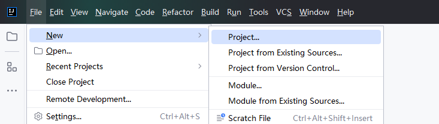

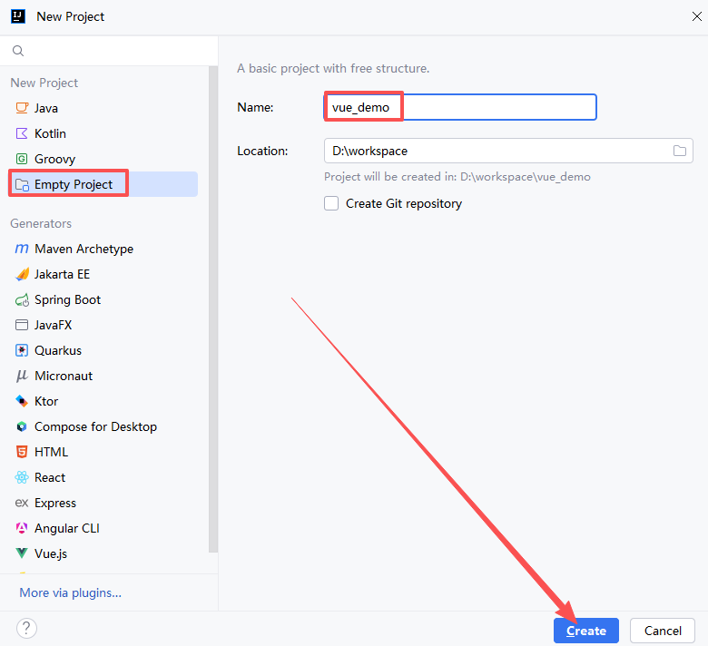

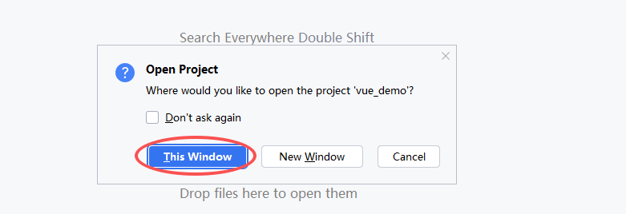

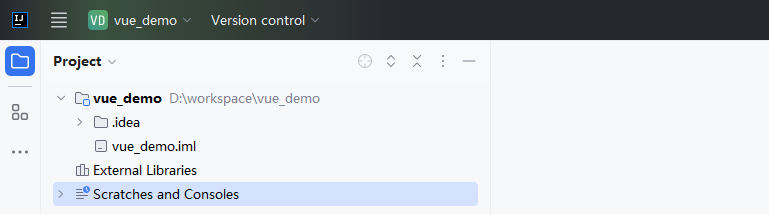

### 导入 vue 文件

创建 js 目录：

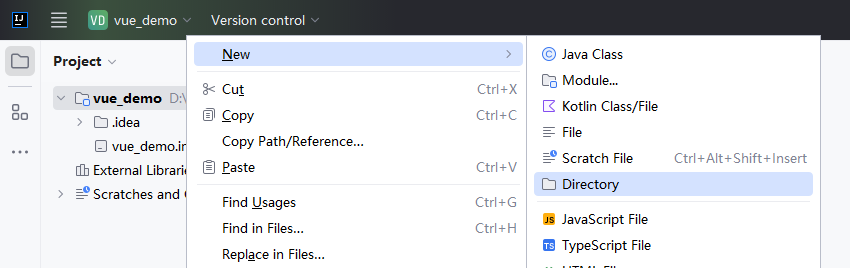

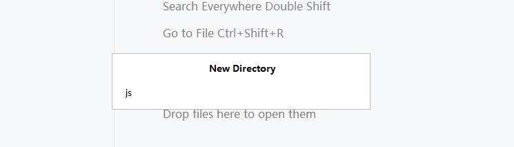

复制资料中的 Vue 文件到 js 目录中：

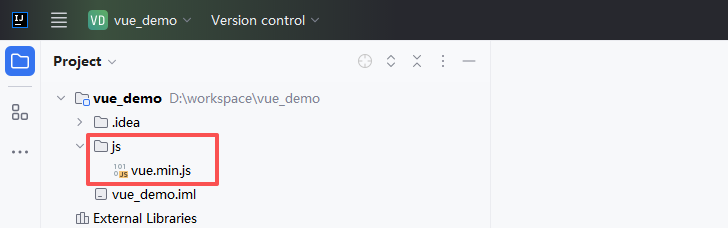

### 创建网页文件

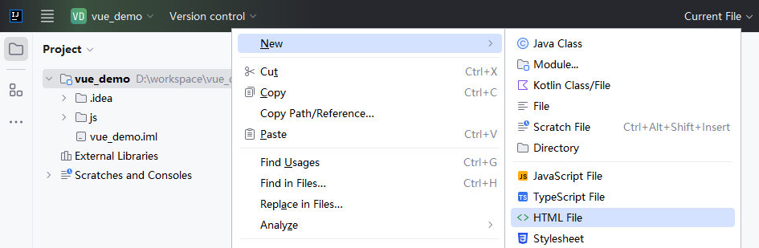

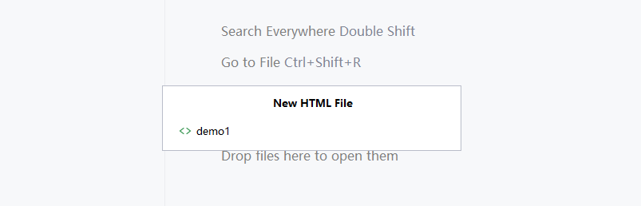

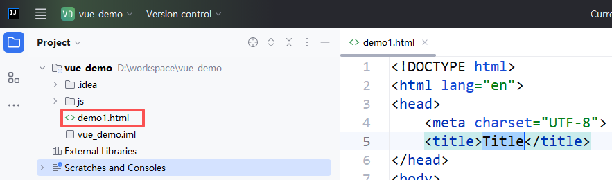

### 编写网页代码

```html
<!DOCTYPE html>
<html lang="en">
<head>
    <meta charset="UTF-8">
    <title>Title</title>
    <!-- 1.引入vue.js文件到网页中 -->
    <script src="js/vue.min.js"></script>
</head>
<body>

    <!-- 2.编写标签，显示数据 -->
    <div id="app">
        {{msg}}
    </div>

    <!-- 3.编写vue相关代码 -->
    <script>
        new Vue({
            el: '#app', // el即element,表示该Vue实例要渲染页面中的元素
            data: { // 定义数据，之后就可以在页面中通过{{变量名}}获取显示
                msg: 'Hello Vue'
            }
        })
    </script>
</body>
</html>
```

### 运行代码

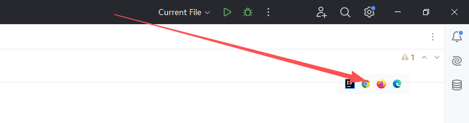

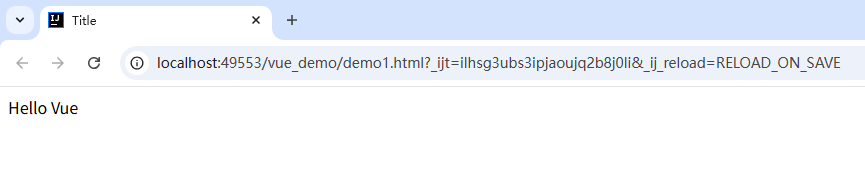

### 总结

<font style="color:rgb(51, 51, 51);">每个 Vue 应用都是通过用 </font><code><font style="color:rgb(51, 51, 51);background-color:rgb(243, 244, 244);">Vue</font></code><font style="color:rgb(51, 51, 51);"> 函数创建一个新的 </font>**<font style="color:rgb(51, 51, 51);">Vue 实例</font>**<font style="color:rgb(51, 51, 51);">开始的，上面的示例中一个页面创建一个</font>**<font style="color:rgb(51, 51, 51);">Vue 实例</font>**<font style="color:rgb(51, 51, 51);">：</font>

```javascript
new Vue({
    // 参数
})
```

<font style="color:rgb(51, 51, 51);">在构造函数中传入一个对象，并且在对象中可以声明各种 Vue 需要的数据和方法，包括：</font>

* <font style="color:rgb(51, 51, 51);">el：绑定的页面元素 id</font>
* <font style="color:rgb(51, 51, 51);">data：渲染页面需要的数据</font>

# <font style="color:rgb(51, 51, 51);">二 、Vue 常用指令</font>

## <font style="color:rgb(51, 51, 51);">插值表达式{{}}</font>

插值表达式{{}}，我们在上面的入门案例中已经用过了。

作用：获取 Vue 中定义的变量，显示到网页中。

案例：

```html
<!DOCTYPE html>
<html lang="en">
<head>
    <meta charset="UTF-8">
    <title>Title</title>
    <script src="js/vue.min.js"></script>
</head>
<body>
    <div id="app">
        姓名：{{name}} <br>
        年龄：{{age}}
    </div>

    <script>
        new Vue({
            el: '#app',
            data: {
                name: 'lucy',
                age: 18
            }
        })
    </script>
</body>
</html>
```

## v-html 指令

作用：将获取到的变量的值输出到元素（标签）的内部。

案例：

```html
<!DOCTYPE html>
<html lang="en">
<head>
    <meta charset="UTF-8">
    <title>Title</title>
    <script src="js/vue.min.js"></script>
</head>
<body>
    <div id="app">
        <ul>
            <li v-html="name"></li>
            <li v-html="sex"></li>
            <li v-html="age"></li>
        </ul>
    </div>

    <script>
        new Vue({
            el: '#app',
            data: {
                name: 'zhangsan',
                age: 18,
                sex: '男'
            }
        })
    </script>
</body>
</html>
```

## v-bind 指令

作用：v-bind 指令是给 HTML 标签的**属性**绑定变量的。

案例：

```html
<!DOCTYPE html>
<html lang="en">
<head>
    <meta charset="UTF-8">
    <title>Title</title>
    <script src="js/vue.min.js"></script>
</head>
<body>
    <div id="app">
        <input type="text" v-bind:value="name">
        <input type="text" v-bind:value="age">
        <br>
        <!-- v-bind:属性="变量" 可以简写为 :属性="变量" -->
        <input type="text" :value="name">
        <input type="text" :value="age">
    </div>

    <script>
        new Vue({
            el: '#app',
            data: {
                name: 'zhangsan',
                age: 18
            }
        })
    </script>
</body>
</html>
```

> v-bind 是单向绑定，也就是说 Vue 对象中定义的变量是什么值，页面中值就是多少！如果页面中的值发生变量，Vue 对象中变量的值是不会发生变化的！

## v-model 指令

v-model：双向数据绑定指令，主要用在表单中，可以达到：表单项中的内容发生改变，vue 中定义的数据就跟着发生改变；vue 中定义的数据发生改变，则表单项中的内容也跟着发生改变。

<font style="color:rgb(0, 0, 0);">案例：</font>

```html
<!DOCTYPE html>
<html lang="en">
<head>
    <meta charset="UTF-8">
    <title>Title</title>
    <script src="js/vue.min.js"></script>
</head>
<body>
    <div id="app">
        <input type="text" v-model="name">
        {{name}}
    </div>

    <script>
        new Vue({
            el: '#app',
            data: {
                name: 'zhangsan',
                age: 18
            }
        })
    </script>
</body>
</html>
```

## v-on 指令

作用：v-on 指令用来给元素绑定事件！一旦触发事件后，就会调用 Vue 对象中我们自定义的函数（方法）！

案例 1：

```html
<!DOCTYPE html>
<html lang="en">
<head>
    <meta charset="UTF-8">
    <title>Title</title>
    <script src="js/vue.min.js"></script>
</head>
<body>
    <div id="app">
        <button v-on:click="test1">我是一个按钮</button>
        <br>
        <!-- v-on可以简写为@ -->
        <button @click="test2">我是另一个按钮</button>
    </div>

    <script>
        new Vue({
            el: '#app',
            data: {

            },
            methods: {
                test1(){
                    alert('你好~')
                },

                test2(){
                    alert('哈哈')
                }
            }
        })
    </script>
</body>
</html>
```

案例 2：

```html
<!DOCTYPE html>
<html lang="en">
<head>
    <meta charset="UTF-8">
    <title>Title</title>
    <script src="js/vue.min.js"></script>
</head>
<body>
    <div id="app">
        姓名：<input type="text" v-model="name"><br><br>
        年龄：<input type="text" v-model="age"><br><br>
        <button @click="save">保存</button>
    </div>

    <script>
        new Vue({
            el: '#app',
            data: {
                name: '',
                age: ''
            },
            methods: {
                save(){
                    // 函数内调用上面data中定义的变量需要使用：this.变量名
                    alert('姓名：' + this.name + ', 性别：' + this.age)
                }
            }
        })
    </script>
</body>
</html>
```

## v-if 指令

作用：v-if 用来做条件判断而，如果条件成立，标签内容就会显示，如果条件不成立，标签内容就不会显示。

案例：

```html
<!DOCTYPE html>
<html lang="en">
<head>
    <meta charset="UTF-8">
    <title>Title</title>
    <script src="js/vue.min.js"></script>
</head>
<body>
    <div id="app">
        <h1 v-if="flag">我是标题</h1>
        <button @click="toggle">显示/隐藏</button>
    </div>

    <script>
        new Vue({
            el: '#app',
            data: {
                flag: true
            },
            methods: {
                toggle(){
                    this.flag = !this.flag
                }
            }
        })
    </script>
</body>
</html>
```

## v-for 指令

作用：v-for 指令用来遍历集合（数组）数据。

```html
<!DOCTYPE html>
<html lang="en">
<head>
    <meta charset="UTF-8">
    <title>Title</title>
    <script src="js/vue.min.js"></script>
</head>
<body>
    <div id="app">
        <table border="1" cellspacing="0">
            <tr>
                <td>编号</td>
                <td>姓名</td>
                <td>性别</td>
                <td>年龄</td>
            </tr>
            <tr v-for="user in users">
                <td v-html="user.id"></td>
                <td v-html="user.name"></td>
                <td v-html="user.sex"></td>
                <td v-html="user.age"></td>
            </tr>
        </table>
    </div>

    <script>
        new Vue({
            el: '#app',
            data: {
                users: [
                    {id:1, name:'张无忌', sex:'男', age:28},
                    {id:2, name:'赵敏', sex:'女', age:18},
                    {id:3, name:'小昭', sex:'女', age:19},
                    {id:4, name:'谢逊', sex:'男', age:55},
                    {id:5, name:'周芷若', sex:'女', age:23}
                ]
            }
        })
    </script>
</body>
</html>
```

# <font style="color:rgb(51, 51, 51);">三、Vue 生命周期</font>

## <font style="color:rgb(51, 51, 51);">Vue 的生命周期</font>

* <font style="color:rgb(51, 51, 51);">生命周期概念：事物从出生到死亡的过程</font>
* <font style="color:rgb(51, 51, 51);">Vue 的生命周期：Vue实例从创建到销毁的过程 ，这些过程中会伴随着一些函数的自调用。我们称这些函数为钩子函数</font>
* <font style="color:rgb(51, 51, 51);">生命周期作用：生命周期中有多个事件钩子，让我们在控制整个Vue实例的过程时更容易形成好的逻辑</font>

<font style="color:rgb(51, 51, 51);">对于一个 Vue 实例，它的生命周期就是从创建到销毁的整个过程中，所经历的方法，如下图所示</font>

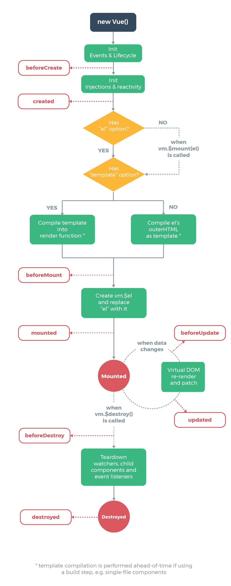

## <font style="color:rgb(51, 51, 51);">钩子函数</font>

<font style="color:rgb(51, 51, 51);">Vue 钩子函数就是生命周期中，每个阶段对应的方法：</font>

| **<font style="color:rgb(51, 51, 51);">钩子函数</font>** | **<font style="color:rgb(51, 51, 51);">生命周期阶段</font>** |
| :--- | :--- |
| <font style="color:rgb(51, 51, 51);">beforeCreate</font> | <font style="color:rgb(51, 51, 51);">vue 对象创建之前调用</font> |
| **<font style="color:rgb(51, 51, 51);background-color:#FBDE28;">created</font>** | **<font style="color:rgb(51, 51, 51);background-color:#FBDE28;">vue 创建之后</font>** |
| <font style="color:rgb(51, 51, 51);">beforeMount</font> | <font style="color:rgb(51, 51, 51);">页面渲染之前</font> |
| <font style="color:rgb(51, 51, 51);">mounted</font> | <font style="color:rgb(51, 51, 51);">页面渲染之后</font> |
| <font style="color:rgb(51, 51, 51);">beforeUpdate</font> | <font style="color:rgb(51, 51, 51);">修改页面之前</font> |
| <font style="color:rgb(51, 51, 51);">updated</font> | <font style="color:rgb(51, 51, 51);">修改页面之后</font> |
| <font style="color:rgb(51, 51, 51);">beforeDestroy</font> | <font style="color:rgb(51, 51, 51);">页面关闭之前</font> |
| <font style="color:rgb(51, 51, 51);">destroyed</font> | <font style="color:rgb(51, 51, 51);">页面关闭之后</font> |

<font style="color:rgb(51, 51, 51);">上面这么多钩子函数，我们重点就掌握 created 函数即可，这个函数会在页面渲染数据之前执行。而且是自动执行。</font>

<font style="color:rgb(51, 51, 51);">案例：</font>

```html
<!DOCTYPE html>
<html lang="en">
<head>
    <meta charset="UTF-8">
    <title>Title</title>
    <script src="js/vue.min.js"></script>
</head>
<body>
    <div id="app">
        <h1 v-html="msg"></h1>
    </div>

    <script>
        new Vue({
            el: '#app',
            data: {
                msg: ''
            },
            created(){ // 钩子函数，在页面渲染数据之前执行，会自动执行
                this.msg = 'hello world!'
            }
        })
    </script>
</body>
</html>
```

总结：目前我们 vue 完整的结构写法：

```html
<!DOCTYPE html>
<html lang="en">
<head>
    <meta charset="UTF-8">
    <title>Title</title>
    <script src="js/vue.min.js"></script>
</head>
<body>
    <div id="app">
        
    </div>

    <script>
        new Vue({ // 创建Vue对象
            el: '#app', // 作用在id=app的元素上
            data: { // 自定义的数据变量
                
            },
            created(){  // 钩子函数，在页面渲染数据前自动执行
                // 在钩子函数中调用data中定义的变量需要使用 this.变量名
                // 在钩子函数中调用methods中定义的方法需要使用 this.方法名()
            },
            methods: { // 可以自定义多个方法
                test(){ // 自定义的方法
                    // 在自定义方法中调用data中定义的变量需要使用 this.变量名
                }
            }
        })
    </script>
</body>
</html>
```

# 四、Axios

## 概述

* <font style="color:rgb(47, 47, 47);">axios 是独立于 vue 的一个项目，基于 promise 用于浏览器和 node.js 的 http 客户端</font>
* <font style="color:rgb(47, 47, 47);">在浏览器中可以帮助我们完成 ajax 请求的发送</font>
* <font style="color:rgb(47, 47, 47);">在 node.js 中可以向远程接口发送请求</font>

<font style="color:rgb(47, 47, 47);">ajax</font>

## <font style="color:rgb(47, 47, 47);">环境准备</font>

### 创建 Maven 项目

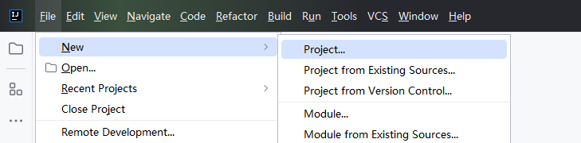

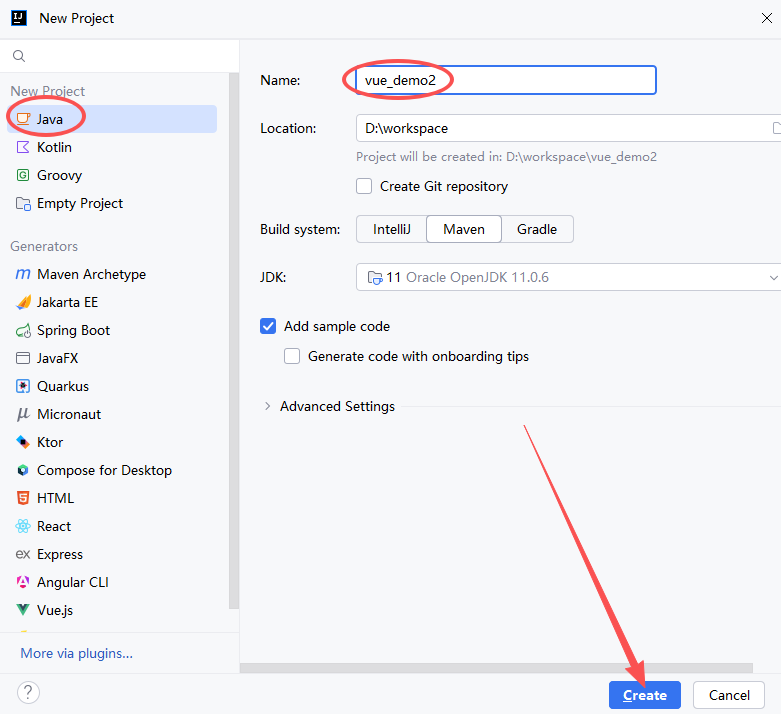

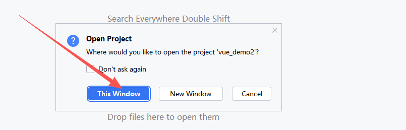

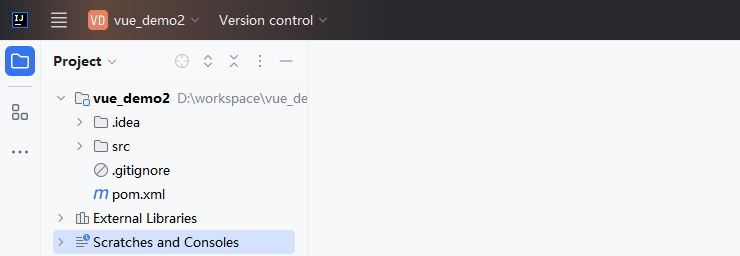

### 修改项目的 Maven

将项目中使用的 Maven 环境改为自己的 Maven。（默认用的是 IDEA 的）

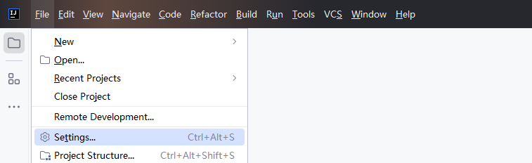

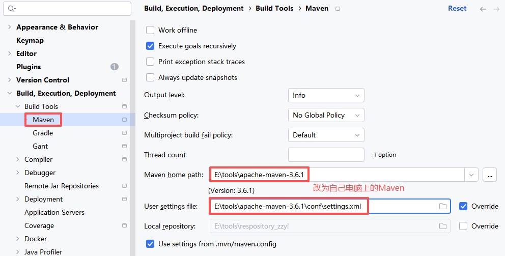

### 添加依赖

```xml
<?xml version="1.0" encoding="UTF-8"?>
<project xmlns="http://maven.apache.org/POM/4.0.0"
         xmlns:xsi="http://www.w3.org/2001/XMLSchema-instance"
         xsi:schemaLocation="http://maven.apache.org/POM/4.0.0 http://maven.apache.org/xsd/maven-4.0.0.xsd">
    <modelVersion>4.0.0</modelVersion>

    <groupId>com.lhp</groupId>
    <artifactId>vue_demo2</artifactId>
    <version>1.0-SNAPSHOT</version>

    <properties>
        <maven.compiler.source>11</maven.compiler.source>
        <maven.compiler.target>11</maven.compiler.target>
        <project.build.sourceEncoding>UTF-8</project.build.sourceEncoding>
    </properties>

    <!--继承父项目，这个父项目是SpringBoot提供的，它就是定义好了各种依赖的版本-->
    <parent>
        <groupId>org.springframework.boot</groupId>
        <artifactId>spring-boot-starter-parent</artifactId>
        <version>2.1.13.RELEASE</version>
    </parent>

    <dependencies>
        <!--引入web模块的启动器-->
        <dependency>
            <groupId>org.springframework.boot</groupId>
            <artifactId>spring-boot-starter-web</artifactId>
        </dependency>

        <dependency>
            <groupId>org.projectlombok</groupId>
            <artifactId>lombok</artifactId>
        </dependency>
    </dependencies>
</project>
```

### 编写配置文件

目前不需要写什么内容。空的即可。

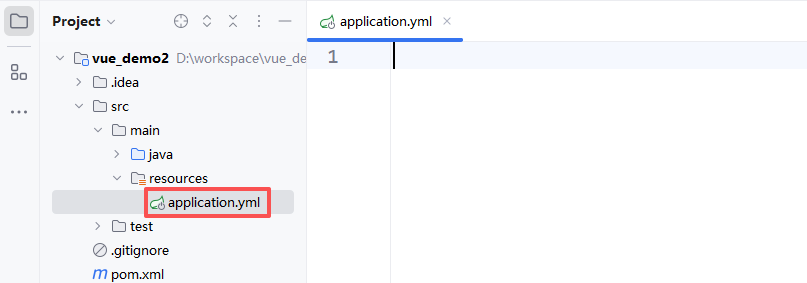

### 编写启动类

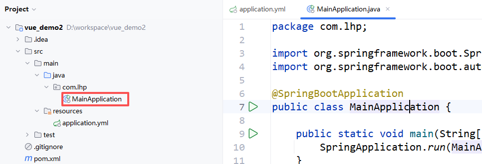

```java
package com.lhp;

import org.springframework.boot.SpringApplication;
import org.springframework.boot.autoconfigure.SpringBootApplication;

@SpringBootApplication
public class MainApplication {

    public static void main(String[] args) {
        SpringApplication.run(MainApplication.class, args);
    }
}
```

### 编写实体类

```java
package com.lhp.pojo;

import lombok.AllArgsConstructor;
import lombok.Data;
import lombok.NoArgsConstructor;

@Data
@AllArgsConstructor
@NoArgsConstructor
public class User {

    private Integer id;
    private String name;
    private String sex;
    private Integer age;
    private String address;
}
```

### 编写 controller 层代码

```java
package com.lhp.controller;

import com.lhp.pojo.User;
import org.springframework.web.bind.annotation.GetMapping;
import org.springframework.web.bind.annotation.RequestMapping;
import org.springframework.web.bind.annotation.RestController;

import java.util.ArrayList;
import java.util.List;

@RestController
@RequestMapping("/user")
public class UserController {

    @GetMapping("/findAll")
    public List<User> findAll(){
        List<User> users = new ArrayList<User>();
        users.add(new User(1, "贾宝玉", "男", 19, "山西太原"));
        users.add(new User(2, "林黛玉", "女", 16, "山东济南"));
        users.add(new User(3, "薛宝钗", "女", 21, "河南郑州"));
        users.add(new User(4, "元春", "女", 35, "河北石家庄"));
        users.add(new User(5, "甄士隐", "男", 59, "北京海淀"));
        return users;
    }
}
```

### 准备 js 文件

在 resources 目录下创建 static 目录，放置静态资源：vue 和 axios 的文件。

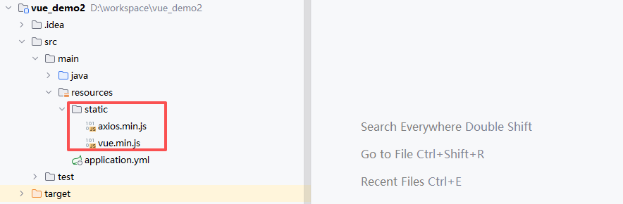

## 编写页面代码

第一步：创建页面，在 resouces 目录下创建 public 目录，然后创建 user.html

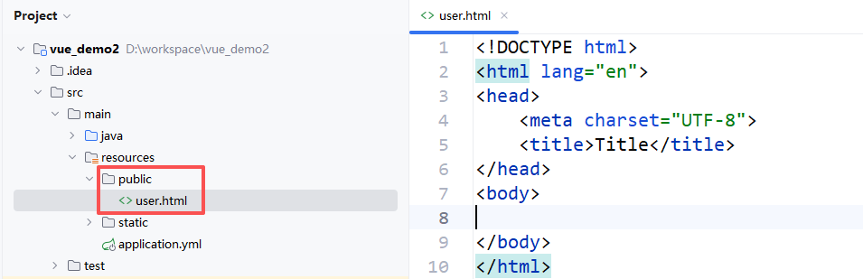

第二步：编写页面代码

```java
<!DOCTYPE html>
<html lang="en">
<head>
    <meta charset="UTF-8">
    <title>Title</title>

    <script src="vue.min.js"></script>
    <script src="axios.min.js"></script>

    <style>
        table {
            border: 1px solid orange;
            border-collapse: collapse;
            width: 500px;
            line-height: 25px;
            text-align: center;
        }
        tr,td{
            border: 1px solid orange;
            border-collapse: collapse;
        }
        tr:nth-child(even) {
            background-color: aqua;
        }
    </style>
</head>
<body>
    <div id="app">
        <table>
            <tr>
                <td>编号</td>
                <td>姓名</td>
                <td>性别</td>
                <td>年龄</td>
                <td>地址</td>
            </tr>
            <tr v-for="user in users">
                <td v-html="user.id"></td>
                <td v-html="user.name"></td>
                <td v-html="user.sex"></td>
                <td v-html="user.age"></td>
                <td v-html="user.address"></td>
            </tr>
        </table>
    </div>

    <script>
        new Vue({
            el: '#app',
            data: {
                users: []
            },
            created(){
                this.findAll()
            },
            methods: {
                findAll(){
                    axios.get('http://localhost:8080/user/findAll')
                        .then(response => {
                            console.log(response.data)
                            this.users = response.data
                        })
                }
            }
        })
    </script>
</body>
</html>
```

# 五、综合案例-前后端整合

## 需求

实现前后端整合，后端使用 SpringBoot+Mybatis 实现数据的增删改查，前端使用 Vue+HTML 实现数据的展示。

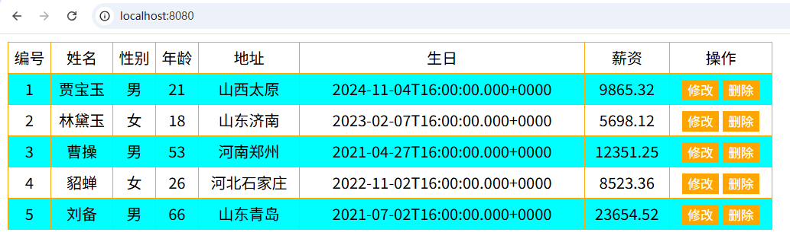

## 环境准备

### 创建数据库及表

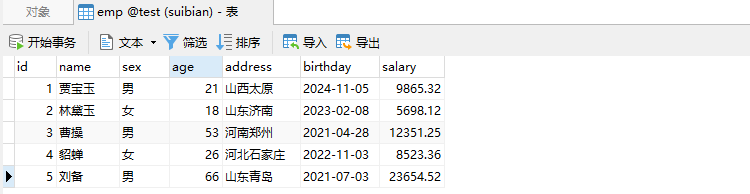

### 创建项目

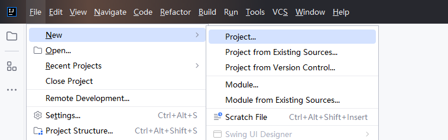

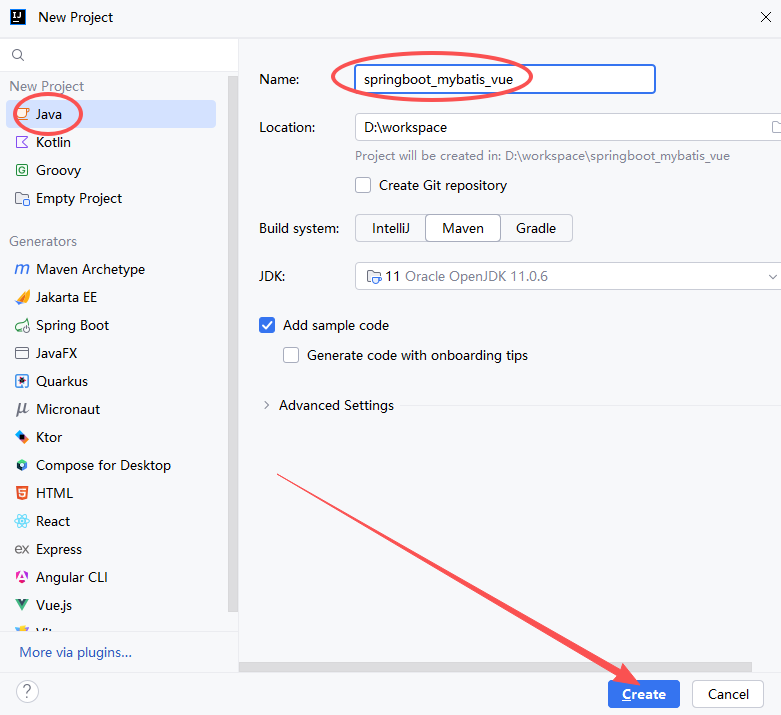

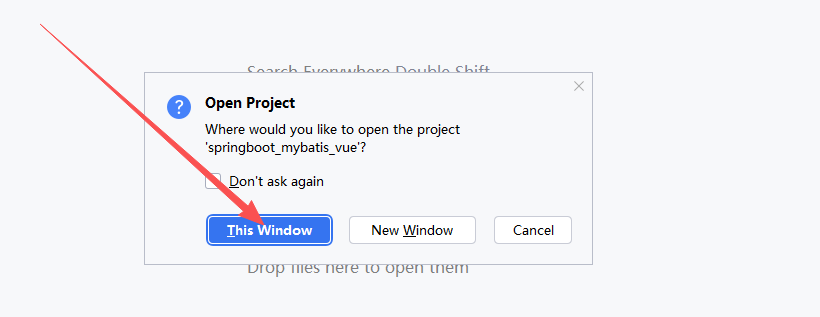

### 修改 Maven 环境

大家使用的 IDEA 创建好 Maven 项目后，使用的是 IDEA 自带的 Maven 软件！

我们改为自己的 Maven。（默认用的是 IDEA 的 Maven）

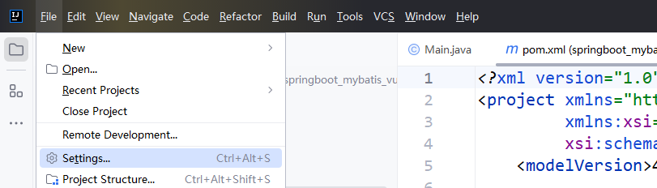

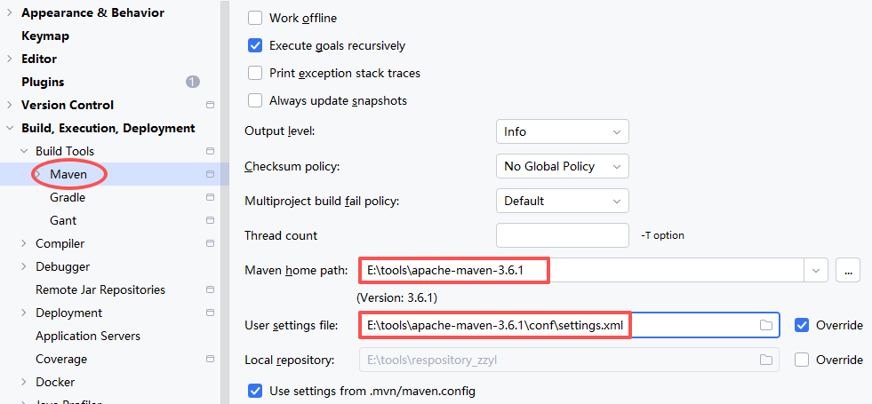

### 添加依赖

```xml
<?xml version="1.0" encoding="UTF-8"?>
<project xmlns="http://maven.apache.org/POM/4.0.0"
         xmlns:xsi="http://www.w3.org/2001/XMLSchema-instance"
         xsi:schemaLocation="http://maven.apache.org/POM/4.0.0 http://maven.apache.org/xsd/maven-4.0.0.xsd">
    <modelVersion>4.0.0</modelVersion>

    <groupId>com.lhp</groupId>
    <artifactId>springboot_mybatis_vue</artifactId>
    <version>1.0-SNAPSHOT</version>

    <properties>
        <maven.compiler.source>11</maven.compiler.source>
        <maven.compiler.target>11</maven.compiler.target>
        <project.build.sourceEncoding>UTF-8</project.build.sourceEncoding>
    </properties>

    <parent>
        <groupId>org.springframework.boot</groupId>
        <artifactId>spring-boot-starter-parent</artifactId>
        <version>2.1.13.RELEASE</version>
    </parent>

    <dependencies>

        <!--引入web启动器-->
        <dependency>
            <groupId>org.springframework.boot</groupId>
            <artifactId>spring-boot-starter-web</artifactId>
        </dependency>

        <!--引入mybatis启动器-->
        <dependency>
            <groupId>org.mybatis.spring.boot</groupId>
            <artifactId>mybatis-spring-boot-starter</artifactId>
            <version>2.1.1</version>
        </dependency>

        <!--引入数据库驱动-->
        <dependency>
            <groupId>mysql</groupId>
            <artifactId>mysql-connector-java</artifactId>
            <version>5.1.47</version>
        </dependency>

        <!--引入lombok依赖-->
        <dependency>
            <groupId>org.projectlombok</groupId>
            <artifactId>lombok</artifactId>
            <version>1.18.12</version>
            <scope>provided</scope>
        </dependency>
    </dependencies>
</project>
```

### 编写配置文件

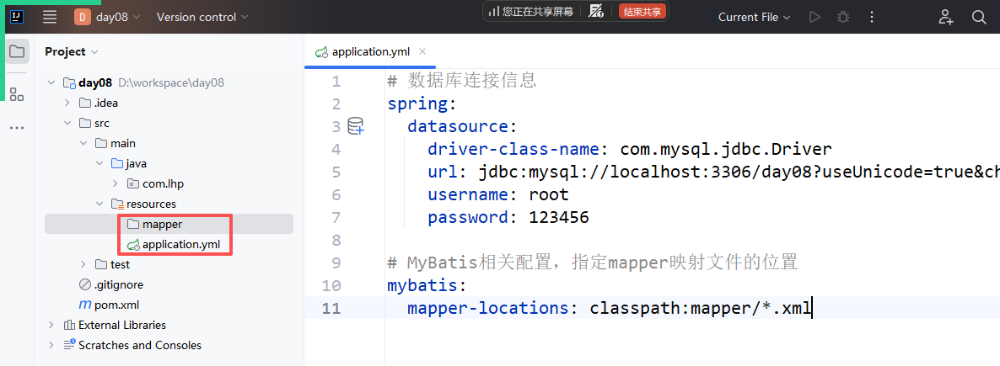

application.yml

```yaml
# 数据库连接信息
spring:
  datasource:
    driver-class-name: com.mysql.jdbc.Driver
    url: jdbc:mysql://localhost:3306/test?useUnicode=true&characterEncoding=utf-8&serverTimezone=Asia/Shanghai
    username: root
    password: 123456

# MyBatis相关配置，指定mapper映射文件的位置
mybatis:
  mapper-locations: classpath:mapper/*.xml
```

### 编写启动类

```java
package com.lhp;

import org.mybatis.spring.annotation.MapperScan;
import org.springframework.boot.SpringApplication;
import org.springframework.boot.autoconfigure.SpringBootApplication;


@SpringBootApplication
@MapperScan("com.lhp.mapper")
public class MainApplication {

    public static void main(String[] args) {
        SpringApplication.run(MainApplication.class, args);
    }
}
```

### 编写实体类

```java
package com.lhp.entity;

import lombok.Data;
import java.util.Date;

@Data
public class Emp {
    private Integer id;
    private String name;
    private String sex;
    private Integer age;
    private String address;
    private Date birthday;
    private Double salary;
}
```

### 导入 js 文件

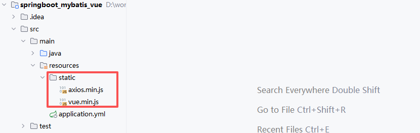

## 实现列表展示功能


### 编写 mapper 层代码

```java
package com.lhp.mapper;

import com.lhp.entity.Emp;
import java.util.List;


public interface EmpMapper {
    
    List<Emp> getEmps();
}
```

```xml
<?xml version="1.0" encoding="UTF-8" ?>
<!DOCTYPE mapper
        PUBLIC "-//mybatis.org//DTD Mapper 3.0//EN"
        "http://mybatis.org/dtd/mybatis-3-mapper.dtd">
<mapper namespace="com.lhp.mapper.EmpMapper">

    <select id="getEmps" resultType="com.lhp.entity.Emp">
        select * from emp
    </select>
</mapper>
```

### 编写 service 层代码

```java
package com.lhp.service;

import com.lhp.entity.Emp;
import java.util.List;


public interface EmpService {
    
    List<Emp> getEmps();
}
```

```java
package com.lhp.service.impl;

import com.lhp.entity.Emp;
import com.lhp.mapper.EmpMapper;
import com.lhp.service.EmpService;
import org.springframework.beans.factory.annotation.Autowired;
import org.springframework.stereotype.Service;
import java.util.List;


@Service
public class EmpServiceImpl implements EmpService {
    
    @Autowired
    private EmpMapper empMapper;

    @Override
    public List<Emp> getEmps() {
        return empMapper.getEmps();
    }
}
```

### 编写 controller 层代码

```java
package com.lhp.controller;

import com.lhp.entity.Emp;
import com.lhp.service.EmpService;
import org.springframework.beans.factory.annotation.Autowired;
import org.springframework.web.bind.annotation.GetMapping;
import org.springframework.web.bind.annotation.RequestMapping;
import org.springframework.web.bind.annotation.RestController;
import java.util.List;


@RestController
@RequestMapping("/emp")
public class EmpController {

    @Autowired
    private EmpService empService;
    
    @GetMapping("/getEmps")
    public List<Emp> getEmps(){
        return empService.getEmps();
    }
}
```

### 编写页面代码

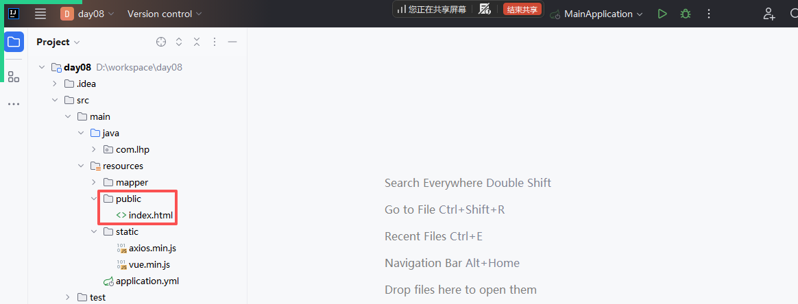

```html
<!DOCTYPE html>
<html lang="en">
<head>
    <meta charset="UTF-8">
    <title>Title</title>

    <script src="vue.min.js"></script>
    <script src="axios.min.js"></script>

    <!-- 样式代码，可以让页面效果更好些 -->
    <style>
        table {
            border: 1px solid orange;
            border-collapse: collapse;
            width: 800px;
            line-height: 30px;
            text-align: center;
        }
        tr,td{
            border: 1px solid orange;
            border-collapse: collapse;
        }
        tr:nth-child(even) {
            background-color: aqua;
        }

        button {
            background-color: orange;
            border: none;
            color: white;
            cursor: pointer;
        }
    </style>
</head>
<body>
    <div id="app">
        <table>
            <tr>
                <td>编号</td>
                <td>姓名</td>
                <td>性别</td>
                <td>年龄</td>
                <td>地址</td>
                <td>生日</td>
                <td>薪资</td>
                <td>操作</td>
            </tr>
            <tr v-for="e in emps">
                <td v-html="e.id"></td>
                <td v-html="e.name"></td>
                <td v-html="e.sex"></td>
                <td v-html="e.age"></td>
                <td v-html="e.address"></td>
                <td v-html="e.birthday"></td>
                <td v-html="e.salary"></td>
                <td>
                    <button>修改</button>
                    <button>删除</button>
                </td>
            </tr>
        </table>
    </div>

    <script>
        new Vue({
            el: '#app',
            data: {
                emps: []
            },
            created(){
                this.getEmps()
            },
            methods: {
                getEmps(){
                    axios.get('emp/getEmps')
                        .then(response => {
                            this.emps = response.data
                        })
                }
            }
        })
    </script>
</body>
</html>
```

### 启动项目运行


***

日期格式不是很好，解决方案：

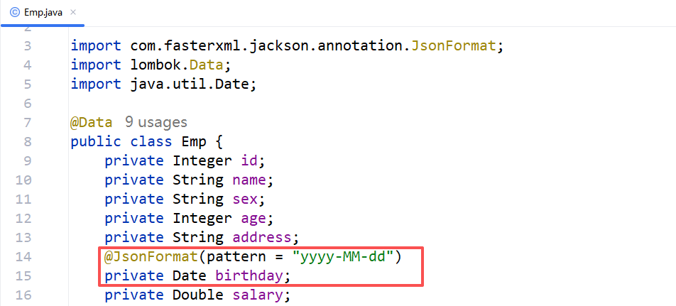

然后重启项目，访问：

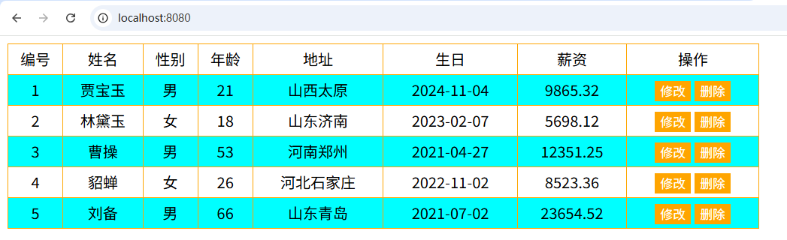

## 实现添加功能

### 编写 mapper 层代码

```java
package com.lhp.mapper;

import com.lhp.entity.Emp;
import java.util.List;


public interface EmpMapper {
    
    void addEmp(Emp emp);

    List<Emp> getEmps();
}
```

```xml
<?xml version="1.0" encoding="UTF-8" ?>
<!DOCTYPE mapper
        PUBLIC "-//mybatis.org//DTD Mapper 3.0//EN"
        "http://mybatis.org/dtd/mybatis-3-mapper.dtd">
<mapper namespace="com.lhp.mapper.EmpMapper">

    <insert id="addEmp">
        insert into emp values(null,#{name},#{sex},#{age},#{address},#{birthday},#{salary})
    </insert>

    <select id="getEmps" resultType="com.lhp.entity.Emp">
        select * from emp
    </select>
</mapper>
```

### 编写 service 层代码

```java
package com.lhp.service;

import com.lhp.entity.Emp;
import java.util.List;


public interface EmpService {
    
    void addEmp(Emp emp);

    List<Emp> getEmps();
}
```

```java
package com.lhp.service.impl;

import com.lhp.entity.Emp;
import com.lhp.mapper.EmpMapper;
import com.lhp.service.EmpService;
import org.springframework.beans.factory.annotation.Autowired;
import org.springframework.stereotype.Service;
import java.util.List;


@Service
public class EmpServiceImpl implements EmpService {

    @Autowired
    private EmpMapper empMapper;

    @Override
    public void addEmp(Emp emp) {
        empMapper.addEmp(emp);
    }

    @Override
    public List<Emp> getEmps() {
        return empMapper.getEmps();
    }
}
```

### 编写 controller 层代码

```java
package com.lhp.controller;

import com.lhp.entity.Emp;
import com.lhp.service.EmpService;
import org.springframework.beans.factory.annotation.Autowired;
import org.springframework.web.bind.annotation.*;

import java.util.List;


@RestController
@RequestMapping("/emp")
public class EmpController {

    @Autowired
    private EmpService empService;

    @PostMapping("/addEmp")
    public String addEmp(@RequestBody Emp emp){
        empService.addEmp(emp);
        return "success";
    }

    @GetMapping("/getEmps")
    public List<Emp> getEmps(){
        return empService.getEmps();
    }
}
```

### 编写页面代码

```html
<!DOCTYPE html>
<html lang="en">
<head>
    <meta charset="UTF-8">
    <title>Title</title>

    <script src="vue.min.js"></script>
    <script src="axios.min.js"></script>

    <style>
        table {
            border: 1px solid orange;
            border-collapse: collapse;
            width: 800px;
            line-height: 30px;
            text-align: center;
        }
        tr,td{
            border: 1px solid orange;
            border-collapse: collapse;
        }
        tr:nth-child(even) {
            background-color: aqua;
        }

        button {
            background-color: orange;
            border: none;
            color: white;
            cursor: pointer;
        }
    </style>
</head>
<body>
    <div id="app">
        <table>
            <tr>
                <td>编号</td>
                <td>姓名</td>
                <td>性别</td>
                <td>年龄</td>
                <td>地址</td>
                <td>生日</td>
                <td>薪资</td>
                <td>操作</td>
            </tr>
            <tr v-for="e in emps">
                <td v-html="e.id"></td>
                <td v-html="e.name"></td>
                <td v-html="e.sex"></td>
                <td v-html="e.age"></td>
                <td v-html="e.address"></td>
                <td v-html="e.birthday"></td>
                <td v-html="e.salary"></td>
                <td>
                    <button>修改</button>
                    <button>删除</button>
                </td>
            </tr>
        </table>

        <button @click="toAddEmp">添加员工</button>
        <br>
        <div v-if="addFlag">
            姓名：<input type="text" v-model="emp.name"><br>
            性别：<input type="radio" v-model="emp.sex" name="sex" value="男">男
            <input type="radio" v-model="emp.sex" name="sex" value="女">女
            <br>
            年龄：<input type="text" v-model="emp.age"><br>
            地址：<input type="text" v-model="emp.address"><br>
            生日：<input type="date" v-model="emp.birthday"><br>
            薪资：<input type="text" v-model="emp.salary"><br>
            <button @click="addEmp">保存</button>
        </div>
    </div>

    <script>
        new Vue({
            el: '#app',
            data: {
                emps: [],
                addFlag: false,
                emp: {}
            },
            created(){
                this.getEmps()
            },
            methods: {
                getEmps(){
                    axios.get('emp/getEmps')
                        .then(response => {
                            this.emps = response.data
                        })
                },

                toAddEmp(){
                    this.addFlag = true
                },

                addEmp(){
                    axios.post('http://localhost:8080/emp/addEmp', this.emp)
                        .then(response => {
                            this.getEmps()
                            this.addFlag = false
                            this.emp = {}
                        })
                }
            }
        })
    </script>
</body>
</html>
```

### 启动项目运行

## 实现数据回显功能

### 编写页面代码

```html
<!DOCTYPE html>
<html lang="en">
<head>
    <meta charset="UTF-8">
    <title>Title</title>

    <script src="vue.min.js"></script>
    <script src="axios.min.js"></script>

    <style>
        table {
            border: 1px solid orange;
            border-collapse: collapse;
            width: 800px;
            line-height: 30px;
            text-align: center;
        }
        tr,td{
            border: 1px solid orange;
            border-collapse: collapse;
        }
        tr:nth-child(even) {
            background-color: aqua;
        }

        button {
            background-color: orange;
            border: none;
            color: white;
            cursor: pointer;
        }
    </style>
</head>
<body>
    <div id="app">
        <table>
            <tr>
                <td>编号</td>
                <td>姓名</td>
                <td>性别</td>
                <td>年龄</td>
                <td>地址</td>
                <td>生日</td>
                <td>薪资</td>
                <td>操作</td>
            </tr>
            <tr v-for="e in emps">
                <td v-html="e.id"></td>
                <td v-html="e.name"></td>
                <td v-html="e.sex"></td>
                <td v-html="e.age"></td>
                <td v-html="e.address"></td>
                <td v-html="e.birthday"></td>
                <td v-html="e.salary"></td>
                <td>
                    <button @click="toUpdate(e)">修改</button>
                    <button>删除</button>
                </td>
            </tr>
        </table>

        <button @click="toAddEmp">添加员工</button>
        <br>
        <div v-if="addFlag">
            姓名：<input type="text" v-model="emp.name"><br>
            性别：<input type="radio" v-model="emp.sex" name="sex" value="男">男
            <input type="radio" v-model="emp.sex" name="sex" value="女">女
            <br>
            年龄：<input type="text" v-model="emp.age"><br>
            地址：<input type="text" v-model="emp.address"><br>
            生日：<input type="date" v-model="emp.birthday"><br>
            薪资：<input type="text" v-model="emp.salary"><br>
            <button @click="addEmp">保存</button>
        </div>

        <div v-if="updateFlag">
            姓名：<input type="text" v-model="emp.name"><br>
            性别：<input type="radio" v-model="emp.sex" name="sex" value="男">男
            <input type="radio" v-model="emp.sex" name="sex" value="女">女
            <br>
            年龄：<input type="text" v-model="emp.age"><br>
            地址：<input type="text" v-model="emp.address"><br>
            生日：<input type="date" v-model="emp.birthday"><br>
            薪资：<input type="text" v-model="emp.salary"><br>
            <button @click="">保存</button>
        </div>
    </div>

    <script>
        new Vue({
            el: '#app',
            data: {
                emps: [],
                addFlag: false,
                emp: {},
                updateFlag: false
            },
            created(){
                this.getEmps()
            },
            methods: {
                getEmps(){
                    axios.get('emp/getEmps')
                        .then(response => {
                            this.emps = response.data
                        })
                },

                toAddEmp(){
                    this.addFlag = true
                },

                addEmp(){
                    axios.post('emp/addEmp', this.emp)
                        .then(response => {
                            this.getEmps()
                            this.addFlag = false
                            this.emp = {}
                        })
                },

                toUpdate(e){
                    this.emp = e
                    this.updateFlag = true
                }
            }
        })
    </script>
</body>
</html>
```

### 启动项目运行

## 实现修改功能

### 编写 mapper 层代码

```java
package com.lhp.mapper;

import com.lhp.entity.Emp;
import java.util.List;


public interface EmpMapper {

    void updateEmp(Emp emp);

    void addEmp(Emp emp);

    List<Emp> getEmps();
}
```

```xml
<?xml version="1.0" encoding="UTF-8" ?>
<!DOCTYPE mapper
        PUBLIC "-//mybatis.org//DTD Mapper 3.0//EN"
        "http://mybatis.org/dtd/mybatis-3-mapper.dtd">
<mapper namespace="com.lhp.mapper.EmpMapper">

    <insert id="addEmp">
        insert into emp values(null,#{name},#{sex},#{age},#{address},#{birthday},#{salary})
    </insert>
    
    <update id="updateEmp">
        update emp set name=#{name}, sex=#{sex}, age=#{age}, address=#{address}, birthday=#{birthday}, salary=#{salary} where id=#{id}
    </update>

    <select id="getEmps" resultType="com.lhp.entity.Emp">
        select * from emp
    </select>
</mapper>
```

### 编写 service 层代码

```java
package com.lhp.service;

import com.lhp.entity.Emp;
import java.util.List;


public interface EmpService {

    void updateEmp(Emp emp);

    void addEmp(Emp emp);

    List<Emp> getEmps();
}
```

```java
package com.lhp.service.impl;

import com.lhp.entity.Emp;
import com.lhp.mapper.EmpMapper;
import com.lhp.service.EmpService;
import org.springframework.beans.factory.annotation.Autowired;
import org.springframework.stereotype.Service;
import java.util.List;


@Service
public class EmpServiceImpl implements EmpService {

    @Autowired
    private EmpMapper empMapper;

    @Override
    public void updateEmp(Emp emp) {
        empMapper.updateEmp(emp);
    }

    @Override
    public void addEmp(Emp emp) {
        empMapper.addEmp(emp);
    }

    @Override
    public List<Emp> getEmps() {
        return empMapper.getEmps();
    }
}
```

### 编写 controller 层代码

```java
package com.lhp.controller;

import com.lhp.entity.Emp;
import com.lhp.service.EmpService;
import org.springframework.beans.factory.annotation.Autowired;
import org.springframework.web.bind.annotation.*;

import java.util.List;


@RestController
@RequestMapping("/emp")
public class EmpController {

    @Autowired
    private EmpService empService;

    @PostMapping("/updateEmp")
    public String updateEmp(@RequestBody Emp emp) {
        empService.updateEmp(emp);
        return "success";
    }

    @PostMapping("/addEmp")
    public String addEmp(@RequestBody Emp emp){
        empService.addEmp(emp);
        return "success";
    }

    @GetMapping("/getEmps")
    public List<Emp> getEmps(){
        return empService.getEmps();
    }
}
```

### 编写页面代码

```html
<!DOCTYPE html>
<html lang="en">
<head>
    <meta charset="UTF-8">
    <title>Title</title>

    <script src="vue.min.js"></script>
    <script src="axios.min.js"></script>

    <style>
        table {
            border: 1px solid orange;
            border-collapse: collapse;
            width: 800px;
            line-height: 30px;
            text-align: center;
        }
        tr,td{
            border: 1px solid orange;
            border-collapse: collapse;
        }
        tr:nth-child(even) {
            background-color: aqua;
        }

        button {
            background-color: orange;
            border: none;
            color: white;
            cursor: pointer;
        }
    </style>
</head>
<body>
    <div id="app">
        <table>
            <tr>
                <td>编号</td>
                <td>姓名</td>
                <td>性别</td>
                <td>年龄</td>
                <td>地址</td>
                <td>生日</td>
                <td>薪资</td>
                <td>操作</td>
            </tr>
            <tr v-for="e in emps">
                <td v-html="e.id"></td>
                <td v-html="e.name"></td>
                <td v-html="e.sex"></td>
                <td v-html="e.age"></td>
                <td v-html="e.address"></td>
                <td v-html="e.birthday"></td>
                <td v-html="e.salary"></td>
                <td>
                    <button @click="toUpdate(e)">修改</button>
                    <button>删除</button>
                </td>
            </tr>
        </table>

        <button @click="toAddEmp">添加员工</button>
        <br>
        <div v-if="addFlag">
            姓名：<input type="text" v-model="emp.name"><br>
            性别：<input type="radio" v-model="emp.sex" name="sex" value="男">男
            <input type="radio" v-model="emp.sex" name="sex" value="女">女
            <br>
            年龄：<input type="text" v-model="emp.age"><br>
            地址：<input type="text" v-model="emp.address"><br>
            生日：<input type="date" v-model="emp.birthday"><br>
            薪资：<input type="text" v-model="emp.salary"><br>
            <button @click="addEmp">保存</button>
        </div>

        <div v-if="updateFlag">
            姓名：<input type="text" v-model="emp.name"><br>
            性别：<input type="radio" v-model="emp.sex" name="sex" value="男">男
            <input type="radio" v-model="emp.sex" name="sex" value="女">女
            <br>
            年龄：<input type="text" v-model="emp.age"><br>
            地址：<input type="text" v-model="emp.address"><br>
            生日：<input type="date" v-model="emp.birthday"><br>
            薪资：<input type="text" v-model="emp.salary"><br>
            <button @click="updateEmp">保存</button>
        </div>
    </div>

    <script>
        new Vue({
            el: '#app',
            data: {
                emps: [],
                addFlag: false,
                emp: {},
                updateFlag: false
            },
            created(){
                this.getEmps()
            },
            methods: {
                getEmps(){
                    axios.get('emp/getEmps')
                        .then(response => {
                            this.emps = response.data
                        })
                },

                toAddEmp(){
                    this.addFlag = true
                },

                addEmp(){
                    axios.post('emp/addEmp', this.emp)
                        .then(response => {
                            this.getEmps()
                            this.addFlag = false
                            this.emp = {}
                        })
                },

                toUpdate(e){
                    this.emp = e
                    this.updateFlag = true
                },

                updateEmp(){
                    axios.post('emp/updateEmp', this.emp)
                        .then(response => {
                            this.getEmps()
                            this.updateFlag = false
                            this.emp = {}
                        })
                }
            }
        })
    </script>
</body>
</html>
```

### 启动项目运行

## 实现删除功能

### 编写 mapper 层代码

```java
package com.lhp.mapper;

import com.lhp.entity.Emp;
import java.util.List;


public interface EmpMapper {
    
    void deleteEmp(int id);

    void updateEmp(Emp emp);

    void addEmp(Emp emp);

    List<Emp> getEmps();
}
```

```xml
<?xml version="1.0" encoding="UTF-8" ?>
<!DOCTYPE mapper
        PUBLIC "-//mybatis.org//DTD Mapper 3.0//EN"
        "http://mybatis.org/dtd/mybatis-3-mapper.dtd">
<mapper namespace="com.lhp.mapper.EmpMapper">

    <insert id="addEmp">
        insert into emp values(null,#{name},#{sex},#{age},#{address},#{birthday},#{salary})
    </insert>

    <update id="updateEmp">
        update emp set name=#{name}, sex=#{sex}, age=#{age}, address=#{address}, birthday=#{birthday}, salary=#{salary} where id=#{id}
    </update>
    
    <delete id="deleteEmp">
        delete from emp where id=#{id}    
    </delete>

    <select id="getEmps" resultType="com.lhp.entity.Emp">
        select * from emp
    </select>
</mapper>
```

### 编写 service 层代码

```java
package com.lhp.service;

import com.lhp.entity.Emp;
import java.util.List;


public interface EmpService {
    void deleteEmp(int id);

    void updateEmp(Emp emp);

    void addEmp(Emp emp);

    List<Emp> getEmps();
}
```

```java
package com.lhp.service.impl;

import com.lhp.entity.Emp;
import com.lhp.mapper.EmpMapper;
import com.lhp.service.EmpService;
import org.springframework.beans.factory.annotation.Autowired;
import org.springframework.stereotype.Service;
import java.util.List;


@Service
public class EmpServiceImpl implements EmpService {

    @Autowired
    private EmpMapper empMapper;

    @Override
    public void deleteEmp(int id) {
        empMapper.deleteEmp(id);
    }

    @Override
    public void updateEmp(Emp emp) {
        empMapper.updateEmp(emp);
    }

    @Override
    public void addEmp(Emp emp) {
        empMapper.addEmp(emp);
    }

    @Override
    public List<Emp> getEmps() {
        return empMapper.getEmps();
    }
}
```

### 编写 controller 层代码

```java
package com.lhp.controller;

import com.lhp.entity.Emp;
import com.lhp.service.EmpService;
import org.springframework.beans.factory.annotation.Autowired;
import org.springframework.web.bind.annotation.*;

import java.util.List;


@RestController
@RequestMapping("/emp")
public class EmpController {

    @Autowired
    private EmpService empService;

    @GetMapping("/deleteEmp/{id}")
    public String deleteEmp(@PathVariable int id){
        empService.deleteEmp(id);
        return "success";
    }

    @PostMapping("/updateEmp")
    public String updateEmp(@RequestBody Emp emp) {
        empService.updateEmp(emp);
        return "success";
    }

    @PostMapping("/addEmp")
    public String addEmp(@RequestBody Emp emp){
        empService.addEmp(emp);
        return "success";
    }

    @GetMapping("/getEmps")
    public List<Emp> getEmps(){
        return empService.getEmps();
    }
}
```

### 编写页面代码

```html
<!DOCTYPE html>
<html lang="en">
<head>
    <meta charset="UTF-8">
    <title>Title</title>

    <script src="vue.min.js"></script>
    <script src="axios.min.js"></script>

    <style>
        table {
            border: 1px solid orange;
            border-collapse: collapse;
            width: 800px;
            line-height: 30px;
            text-align: center;
        }
        tr,td{
            border: 1px solid orange;
            border-collapse: collapse;
        }
        tr:nth-child(even) {
            background-color: aqua;
        }

        button {
            background-color: orange;
            border: none;
            color: white;
            cursor: pointer;
        }
    </style>
</head>
<body>
    <div id="app">
        <table>
            <tr>
                <td>编号</td>
                <td>姓名</td>
                <td>性别</td>
                <td>年龄</td>
                <td>地址</td>
                <td>生日</td>
                <td>薪资</td>
                <td>操作</td>
            </tr>
            <tr v-for="e in emps">
                <td v-html="e.id"></td>
                <td v-html="e.name"></td>
                <td v-html="e.sex"></td>
                <td v-html="e.age"></td>
                <td v-html="e.address"></td>
                <td v-html="e.birthday"></td>
                <td v-html="e.salary"></td>
                <td>
                    <button @click="toUpdate(e)">修改</button>
                    <button @click="deleteEmp(e.id)">删除</button>
                </td>
            </tr>
        </table>

        <button @click="toAddEmp">添加员工</button>
        <br>
        <div v-if="addFlag">
            姓名：<input type="text" v-model="emp.name"><br>
            性别：<input type="radio" v-model="emp.sex" name="sex" value="男">男
            <input type="radio" v-model="emp.sex" name="sex" value="女">女
            <br>
            年龄：<input type="text" v-model="emp.age"><br>
            地址：<input type="text" v-model="emp.address"><br>
            生日：<input type="date" v-model="emp.birthday"><br>
            薪资：<input type="text" v-model="emp.salary"><br>
            <button @click="addEmp">保存</button>
        </div>

        <div v-if="updateFlag">
            姓名：<input type="text" v-model="emp.name"><br>
            性别：<input type="radio" v-model="emp.sex" name="sex" value="男">男
            <input type="radio" v-model="emp.sex" name="sex" value="女">女
            <br>
            年龄：<input type="text" v-model="emp.age"><br>
            地址：<input type="text" v-model="emp.address"><br>
            生日：<input type="date" v-model="emp.birthday"><br>
            薪资：<input type="text" v-model="emp.salary"><br>
            <button @click="updateEmp">保存</button>
        </div>
    </div>

    <script>
        new Vue({
            el: '#app',
            data: {
                emps: [],
                addFlag: false,
                emp: {},
                updateFlag: false
            },
            created(){
                this.getEmps()
            },
            methods: {
                getEmps(){
                    axios.get('emp/getEmps')
                        .then(response => {
                            this.emps = response.data
                        })
                },

                toAddEmp(){
                    this.addFlag = true
                },

                addEmp(){
                    axios.post('emp/addEmp', this.emp)
                        .then(response => {
                            this.getEmps()
                            this.addFlag = false
                            this.emp = {}
                        })
                },

                toUpdate(e){
                    this.emp = e
                    this.updateFlag = true
                },

                updateEmp(){
                    axios.post('emp/updateEmp', this.emp)
                        .then(response => {
                            this.getEmps()
                            this.updateFlag = false
                            this.emp = {}
                        })
                },

                deleteEmp(id){
                    axios.get('emp/deleteEmp/'+id)
                        .then(response => {
                            this.getEmps()
                        })
                }
            }
        })
    </script>
</body>
</html>
```


> 更新: 2026-03-15 10:18:15  
> 原文: <https://www.yuque.com/u41736172/az9urv/tixk1w3cq6dziil7>