# 07.ElementUI

# 一、ElementUI 介绍
## 概述
Element，一套为开发者、设计师和产品经理准备的基于 Vue 2.0 的桌面端组件库。

官网地址：[https://element.eleme.cn/#/zh-CN](https://element.eleme.cn/#/zh-CN)

## 入门案例
### 创建项目
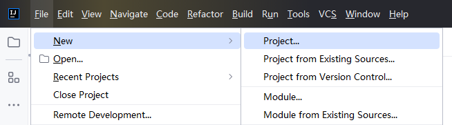

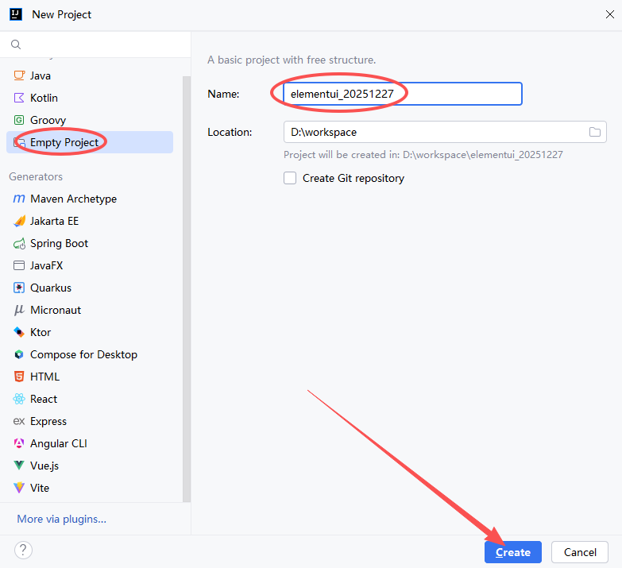

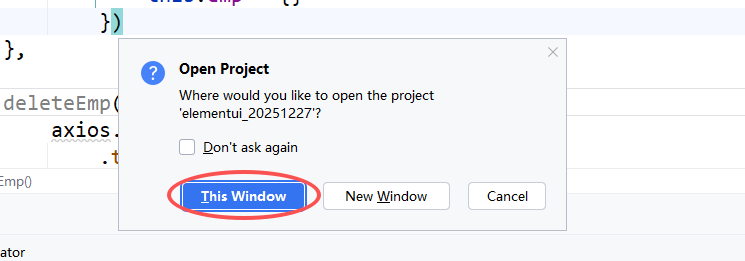

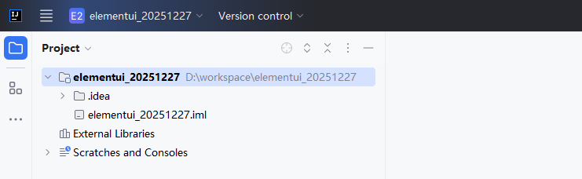

### 导入资源文件
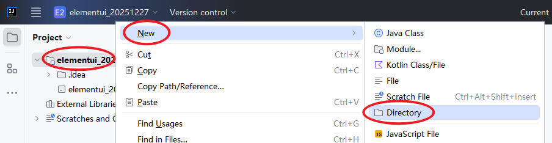

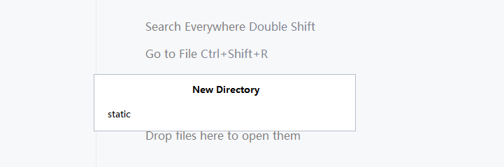

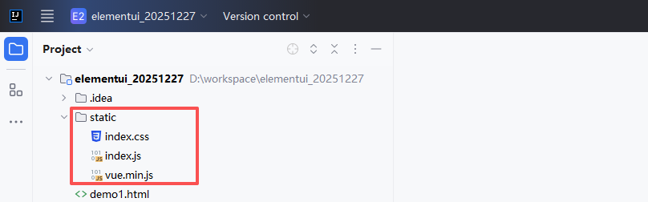

index.css 和 index.js 从资料中复制。

### 编写页面
```html
<!DOCTYPE html>
<html lang="en">
<head>
    <meta charset="UTF-8">
    <title>Title</title>
    <script src="static/vue.min.js"></script>
    <link rel="stylesheet" href="static/index.css">
    <script src="static/index.js"></script>
</head>
<body>
    <div id="app">
        <el-table
                :data="tableData"
                border
                style="width: 77%">
            <el-table-column
                    prop="date"
                    label="日期"
                    width="150">
            </el-table-column>
            <el-table-column
                    prop="name"
                    label="姓名"
                    width="120">
            </el-table-column>
            <el-table-column
                    prop="province"
                    label="省份"
                    width="120">
            </el-table-column>
            <el-table-column
                    prop="city"
                    label="市区"
                    width="120">
            </el-table-column>
            <el-table-column
                    prop="address"
                    label="地址"
                    width="300">
            </el-table-column>
            <el-table-column
                    prop="zip"
                    label="邮编"
                    width="120">
            </el-table-column>
            <el-table-column
                    fixed="right"
                    label="操作"
                    width="100">
                <template slot-scope="scope">
                    <el-button @click="handleClick(scope.row)" type="text" size="small">查看</el-button>
                    <el-button type="text" size="small">编辑</el-button>
                </template>
            </el-table-column>
        </el-table>
    </div>

    <script>
        new Vue({
            el: '#app',
            data: {
                tableData: [{
                    date: '2016-05-02',
                    name: '王小虎',
                    province: '上海',
                    city: '普陀区',
                    address: '上海市普陀区金沙江路 1518 弄',
                    zip: 200333
                }, {
                    date: '2016-05-04',
                    name: '王小虎',
                    province: '上海',
                    city: '普陀区',
                    address: '上海市普陀区金沙江路 1517 弄',
                    zip: 200333
                }, {
                    date: '2016-05-01',
                    name: '王小虎',
                    province: '上海',
                    city: '普陀区',
                    address: '上海市普陀区金沙江路 1519 弄',
                    zip: 200333
                }, {
                    date: '2016-05-03',
                    name: '王小虎',
                    province: '上海',
                    city: '普陀区',
                    address: '上海市普陀区金沙江路 1516 弄',
                    zip: 200333
                }]
            }
        })
    </script>
</body>
</html>
```

### 效果图
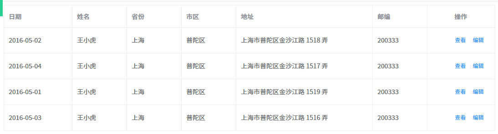

# 二、ElementUI 常用组件
## <font style="color:rgb(31, 47, 61);">Button 按钮</font>
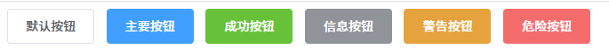

```html
<!DOCTYPE html>
<html lang="en">
<head>
    <meta charset="UTF-8">
    <title>Title</title>
    <script src="static/vue.min.js"></script>
    <link rel="stylesheet" href="static/index.css">
    <script src="static/index.js"></script>
</head>
<body>
<div id="app">
    <el-row>
        <el-button>默认按钮</el-button>
        <el-button type="primary">主要按钮</el-button>
        <el-button type="success">成功按钮</el-button>
        <el-button type="info">信息按钮</el-button>
        <el-button type="warning">警告按钮</el-button>
        <el-button type="danger">危险按钮</el-button>
    </el-row>
</div>

<script>
    new Vue({
        el: '#app',
        data: {

        }
    })
</script>
</body>
</html>
```

## <font style="color:rgb(31, 47, 61);">Form 表单</font>
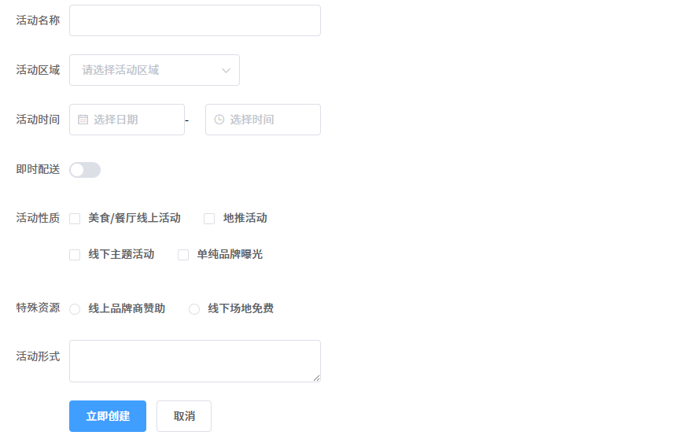

```html
<!DOCTYPE html>
<html lang="en">
<head>
    <meta charset="UTF-8">
    <title>Title</title>
    <script src="static/vue.min.js"></script>
    <link rel="stylesheet" href="static/index.css">
    <script src="static/index.js"></script>
</head>
<body>
<div id="app" style="width: 400px">
    <el-form ref="form" :model="form" label-width="80px">
        <el-form-item label="活动名称">
            <el-input v-model="form.name"></el-input>
        </el-form-item>
        <el-form-item label="活动区域">
            <el-select v-model="form.region" placeholder="请选择活动区域">
                <el-option label="区域一" value="shanghai"></el-option>
                <el-option label="区域二" value="beijing"></el-option>
            </el-select>
        </el-form-item>
        <el-form-item label="活动时间">
            <el-col :span="11">
                <el-date-picker type="date" placeholder="选择日期" v-model="form.date1" style="width: 100%;"></el-date-picker>
            </el-col>
            <el-col class="line" :span="2">-</el-col>
            <el-col :span="11">
                <el-time-picker placeholder="选择时间" v-model="form.date2" style="width: 100%;"></el-time-picker>
            </el-col>
        </el-form-item>
        <el-form-item label="即时配送">
            <el-switch v-model="form.delivery"></el-switch>
        </el-form-item>
        <el-form-item label="活动性质">
            <el-checkbox-group v-model="form.type">
                <el-checkbox label="美食/餐厅线上活动" name="type"></el-checkbox>
                <el-checkbox label="地推活动" name="type"></el-checkbox>
                <el-checkbox label="线下主题活动" name="type"></el-checkbox>
                <el-checkbox label="单纯品牌曝光" name="type"></el-checkbox>
            </el-checkbox-group>
        </el-form-item>
        <el-form-item label="特殊资源">
            <el-radio-group v-model="form.resource">
                <el-radio label="线上品牌商赞助"></el-radio>
                <el-radio label="线下场地免费"></el-radio>
            </el-radio-group>
        </el-form-item>
        <el-form-item label="活动形式">
            <el-input type="textarea" v-model="form.desc"></el-input>
        </el-form-item>
        <el-form-item>
            <el-button type="primary" @click="onSubmit">立即创建</el-button>
            <el-button>取消</el-button>
        </el-form-item>
    </el-form>
</div>
</body>

<script>
    new Vue({
        el: '#app',
        data: {
            form: {
                name: '',
                region: '',
                date1: '',
                date2: '',
                delivery: false,
                type: [],
                resource: '',
                desc: ''
            },
            options: [{
                value: '选项1',
                label: '黄金糕'
            }, {
                value: '选项2',
                label: '双皮奶'
            }, {
                value: '选项3',
                label: '蚵仔煎'
            }, {
                value: '选项4',
                label: '龙须面'
            }, {
                value: '选项5',
                label: '北京烤鸭'
            }],
            value: ''
        },
        methods: {
            onSubmit() {
                console.log('submit!');
            }
        }
    })
</script>
</body>
</html>
```

## <font style="color:rgb(31, 47, 61);">Table 表格</font>
上面入门案例已做。

## <font style="color:rgb(31, 47, 61);">Pagination 分页</font>
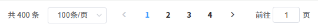

```html
<!DOCTYPE html>
<html lang="en">
<head>
    <meta charset="UTF-8">
    <title>Title</title>
    <script src="static/vue.min.js"></script>
    <link rel="stylesheet" href="static/index.css">
    <script src="static/index.js"></script>
</head>
<body>
<div id="app" style="width: 400px">
    <el-pagination
            @size-change="handleSizeChange"
            @current-change="handleCurrentChange"
            :current-page="currentPage4"
            :page-sizes="[100, 200, 300, 400]"
            :page-size="100"
            layout="total, sizes, prev, pager, next, jumper"
            :total="400">
    </el-pagination>
</div>
</body>

<script>
    new Vue({
        el: '#app',
        data: {
            currentPage1: 5,
            currentPage2: 5,
            currentPage3: 5,
            currentPage4: 4
        },
        methods: {
            handleSizeChange(val) {
                console.log(`每页 ${val} 条`);
            },
            handleCurrentChange(val) {
                console.log(`当前页: ${val}`);
            }
        }
    })
</script>
</body>
</html>
```

## <font style="color:rgb(31, 47, 61);">Dialog 对话框</font>


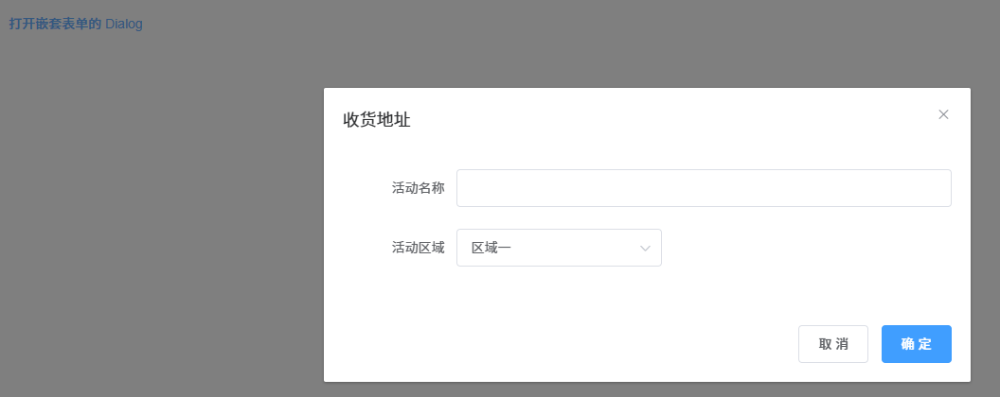

```html
<!DOCTYPE html>
<html lang="en">
<head>
    <meta charset="UTF-8">
    <title>Title</title>
    <script src="static/vue.min.js"></script>
    <link rel="stylesheet" href="static/index.css">
    <script src="static/index.js"></script>
</head>
<body>
<div id="app" style="width: 400px">
    <el-button type="text" @click="dialogFormVisible = true">打开嵌套表单的 Dialog</el-button>

    <el-dialog title="收货地址" :visible.sync="dialogFormVisible">
        <el-form :model="form">
            <el-form-item label="活动名称" :label-width="formLabelWidth">
                <el-input v-model="form.name" autocomplete="off"></el-input>
            </el-form-item>
            <el-form-item label="活动区域" :label-width="formLabelWidth">
                <el-select v-model="form.region" placeholder="请选择活动区域">
                    <el-option label="区域一" value="shanghai"></el-option>
                    <el-option label="区域二" value="beijing"></el-option>
                </el-select>
            </el-form-item>
        </el-form>
        <div slot="footer" class="dialog-footer">
            <el-button @click="dialogFormVisible = false">取 消</el-button>
            <el-button type="primary" @click="dialogFormVisible = false">确 定</el-button>
        </div>
    </el-dialog>
</div>
</body>

<script>
    new Vue({
        el: '#app',
        data: {
            dialogTableVisible: false,
            dialogFormVisible: false,
            form: {
                name: '',
                region: '',
                date1: '',
                date2: '',
                delivery: false,
                type: [],
                resource: '',
                desc: ''
            },
            formLabelWidth: '120px'
        },
        methods: {

        }
    })
</script>
</body>
</html>
```


> 更新: 2026-03-15 14:54:17  
> 原文: <https://www.yuque.com/u41736172/az9urv/ezg44ttl80z59f28>