# 08.综合案例

# 一、案例介绍
## 案例效果


## 涉及技术
Maven、SpringBoot、Mybatis、MySQL、Vue、axios、ElementUI、easyexcel、echarts。

# 二、项目搭建
## 创建数据库及表
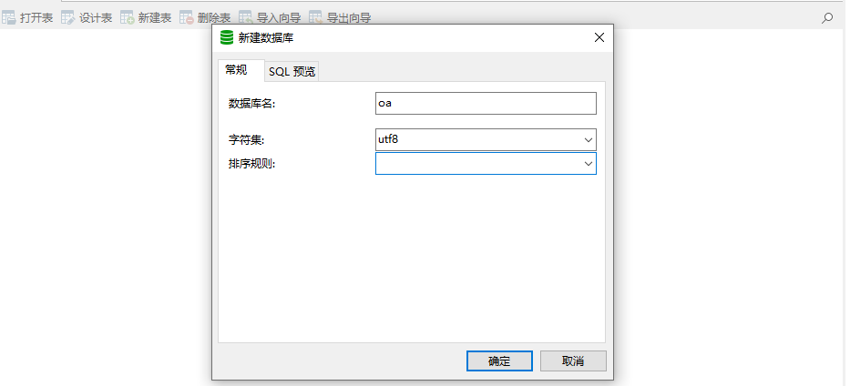

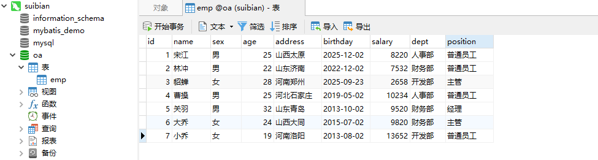

## 创建 Maven 项目
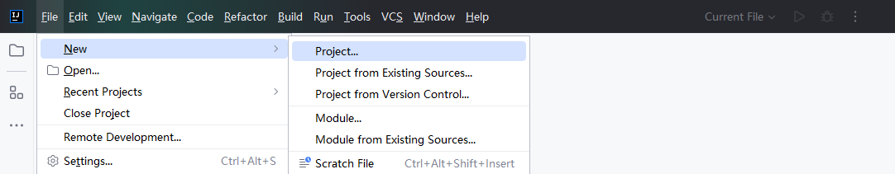

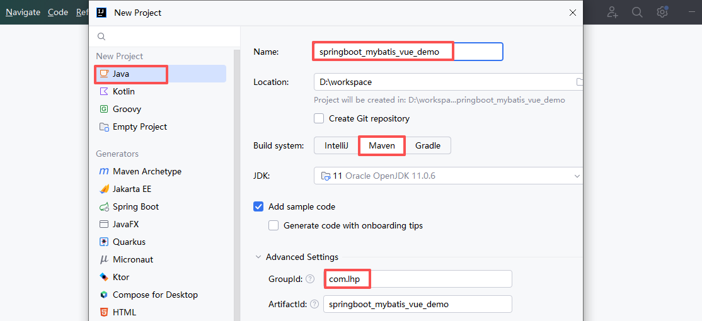

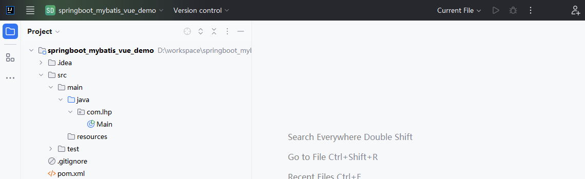

## 修改 Maven 配置
IDEA 创建的 Maven 项目，默认使用的是 IDEA 自带的 Maven 工具，我们可以切换为使用自己的 Maven！

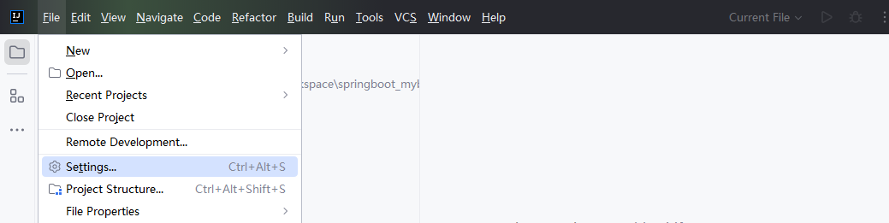

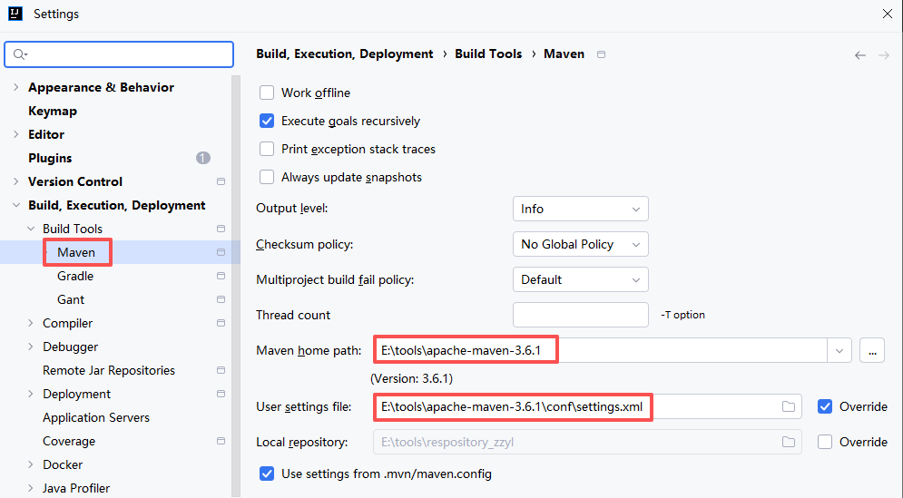

## 添加依赖
```xml
<?xml version="1.0" encoding="UTF-8"?>
<project xmlns="http://maven.apache.org/POM/4.0.0"
         xmlns:xsi="http://www.w3.org/2001/XMLSchema-instance"
         xsi:schemaLocation="http://maven.apache.org/POM/4.0.0 http://maven.apache.org/xsd/maven-4.0.0.xsd">
    <modelVersion>4.0.0</modelVersion>

    <groupId>com.lhp</groupId>
    <artifactId>springboot_mybatis_vue_demo</artifactId>
    <version>1.0-SNAPSHOT</version>

    <properties>
        <maven.compiler.source>11</maven.compiler.source>
        <maven.compiler.target>11</maven.compiler.target>
        <project.build.sourceEncoding>UTF-8</project.build.sourceEncoding>
    </properties>

    <parent>
        <groupId>org.springframework.boot</groupId>
        <artifactId>spring-boot-starter-parent</artifactId>
        <version>2.1.13.RELEASE</version>
    </parent>

    <dependencies>
        <!--引入web启动器-->
        <dependency>
            <groupId>org.springframework.boot</groupId>
            <artifactId>spring-boot-starter-web</artifactId>
        </dependency>

        <!--引入mybatis启动器-->
        <dependency>
            <groupId>org.mybatis.spring.boot</groupId>
            <artifactId>mybatis-spring-boot-starter</artifactId>
            <version>2.1.1</version>
        </dependency>

        <!--引入数据库驱动-->
        <dependency>
            <groupId>mysql</groupId>
            <artifactId>mysql-connector-java</artifactId>
            <version>5.1.47</version>
        </dependency>

        <!--引入lombok依赖-->
        <dependency>
            <groupId>org.projectlombok</groupId>
            <artifactId>lombok</artifactId>
            <version>1.18.12</version>
            <scope>provided</scope>
        </dependency>
    </dependencies>
</project>
```

## 编写配置文件
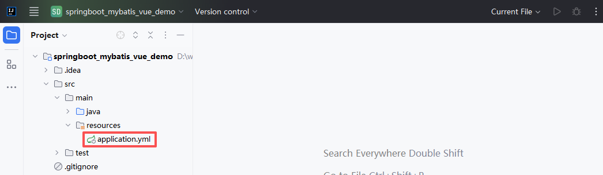

application.yml

```yaml
# 数据库连接信息
spring:
  datasource:
    driver-class-name: com.mysql.jdbc.Driver
    url: jdbc:mysql://localhost:3306/oa?useUnicode=true&characterEncoding=utf-8&serverTimezone=Asia/Shanghai
    username: root
    password: 123456

# MyBatis相关配置，指定mapper映射文件的位置
mybatis:
  mapper-locations: classpath:mapper/*.xml
```

在 resources 目录下创建一个 mapper 文件夹，用来放 Mybatis 的映射文件的：

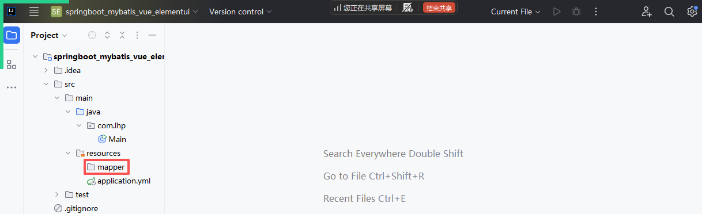

## 编写启动类
```java
package com.lhp;

import org.mybatis.spring.annotation.MapperScan;
import org.springframework.boot.SpringApplication;
import org.springframework.boot.autoconfigure.SpringBootApplication;


@SpringBootApplication
@MapperScan("com.lhp.mapper")
public class MainApplication {

    public static void main(String[] args) {
        SpringApplication.run(MainApplication.class, args);
    }
}
```

## 编写实体类
```java
package com.lhp.pojo;

import lombok.Data;
import java.util.Date;

@Data
public class Emp {

    private Integer id;
    private String name;
    private String sex;
    private Integer age;
    private String address;
    private Date birthday;
    private Double salary;
    private String dept;
    private String position;
}
```

## 导入静态资源
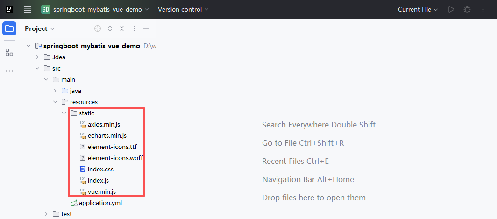

# 三、实现列表基本展示功能
## 编写 mapper 层代码
```java
package com.lhp.mapper;

import com.lhp.pojo.Emp;
import org.apache.ibatis.annotations.Param;
import java.util.List;


public interface EmpMapper {
    
    List<Emp> findEmp();
}
```

```xml
<?xml version="1.0" encoding="UTF-8" ?>
<!DOCTYPE mapper
        PUBLIC "-//mybatis.org//DTD Mapper 3.0//EN"
        "http://mybatis.org/dtd/mybatis-3-mapper.dtd">
<mapper namespace="com.lhp.mapper.EmpMapper">
    
    <select id="findEmp" resultType="com.lhp.pojo.Emp">
        select * from emp 
    </select>
</mapper>
```

## 编写 service 层代码
```java
package com.lhp.service;

import com.lhp.pojo.Emp;
import java.util.List;


public interface EmpService {
    
    List<Emp> findEmp();
}
```

```java
package com.lhp.service.impl;

import com.lhp.mapper.EmpMapper;
import com.lhp.pojo.Emp;
import com.lhp.service.EmpService;
import org.springframework.beans.factory.annotation.Autowired;
import org.springframework.stereotype.Service;
import java.util.List;


@Service
public class EmpServiceImpl implements EmpService {

    @Autowired
    private EmpMapper empMapper;

    @Override
    public List<Emp> findEmp() {
        return empMapper.findEmp();
    }
}
```

## 编写 controller 层代码
```java
package com.lhp.controller;

import com.lhp.pojo.Emp;
import com.lhp.service.EmpService;
import org.springframework.beans.factory.annotation.Autowired;
import org.springframework.web.bind.annotation.GetMapping;
import org.springframework.web.bind.annotation.RequestMapping;
import org.springframework.web.bind.annotation.RestController;
import java.util.List;


@RestController
@RequestMapping("/emp")
public class EmpController {

    @Autowired
    private EmpService empService;

    @GetMapping("/findEmp")
    public List<Emp> findEmp(){
        return empService.findEmp();
    }
}
```

## 编写页面代码
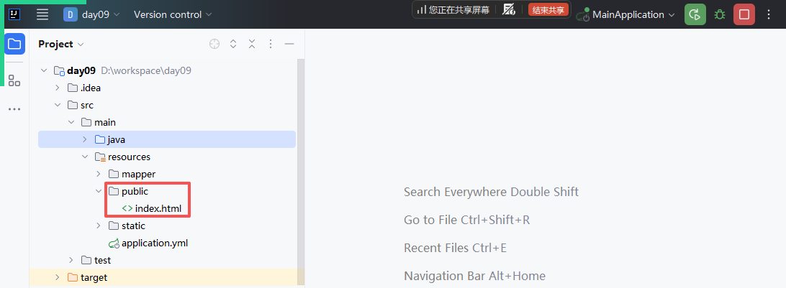

```html
<!DOCTYPE html>
<html lang="en">
<head>
    <meta charset="UTF-8">
    <title>Title</title>
    <script src="vue.min.js"></script>
    <script src="axios.min.js"></script>
    <link rel="stylesheet" href="index.css">
    <script src="index.js"></script>
</head>
<body>
    <div id="app">
        <el-table
                :data="emps"
                border
                style="width: 100%">
            <el-table-column
                    prop="id"
                    label="编号">
            </el-table-column>
            <el-table-column
                    prop="name"
                    label="姓名"
                    width="120">
            </el-table-column>
            <el-table-column
                    prop="sex"
                    label="性别">
            </el-table-column>
            <el-table-column
                    prop="age"
                    label="年龄">
            </el-table-column>
            <el-table-column
                    prop="address"
                    label="地址">
            </el-table-column>
            <el-table-column
                    prop="birthday"
                    label="生日">
            </el-table-column>
            <el-table-column
                    prop="salary"
                    label="薪资">
            </el-table-column>
            <el-table-column
                    prop="dept"
                    label="部门">
            </el-table-column>
            <el-table-column
                    prop="position"
                    label="职位">
            </el-table-column>
            <el-table-column
                    fixed="right"
                    label="操作"
                    width="100">
                <template slot-scope="scope">
                    <el-button type="text" size="small">编辑</el-button>
                    <el-button @click="handleClick(scope.row)" type="text" size="small">删除</el-button>
                </template>
            </el-table-column>
        </el-table>
    </div>

    <script>
        new Vue({
            el: '#app',
            data: {
                emps: []
            },
            created(){
                this.findEmp()
            },
            methods: {
                findEmp(){
                    console.log(axios)
                    axios.get('emp/findEmp').then(res => {
                        console.log(res)
                        this.emps = res.data
                    })
                }
            }
        })
    </script>
</body>
</html>
```

## 启动测试
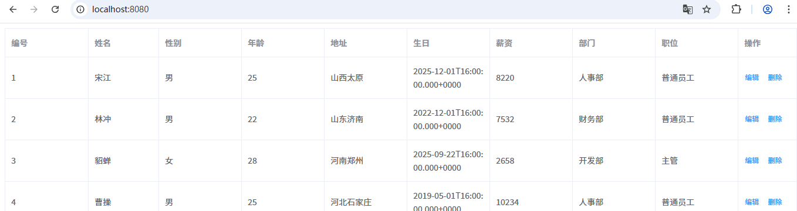

## 解决日期显示的问题
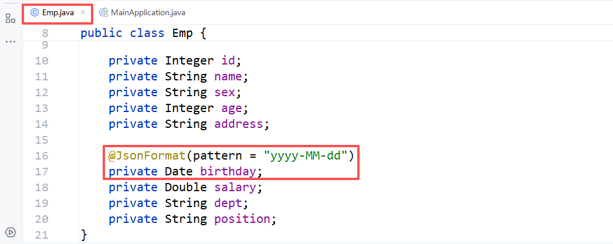

然后重启项目，访问：

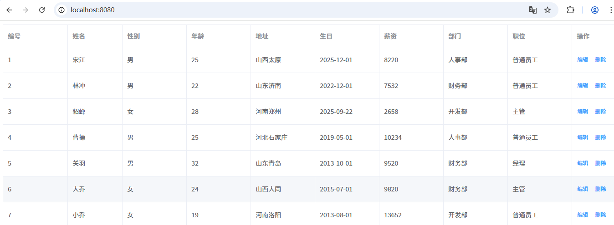

# 四、实现条件查询功能
## 编写 mapper 层代码
```java
package com.lhp.mapper;

import com.lhp.pojo.Emp;
import org.apache.ibatis.annotations.Param;
import java.util.List;


public interface EmpMapper {

    List<Emp> findEmp(@Param("name") String name, @Param("dept") String dept);
}
```

```xml
<?xml version="1.0" encoding="UTF-8" ?>
<!DOCTYPE mapper
        PUBLIC "-//mybatis.org//DTD Mapper 3.0//EN"
        "http://mybatis.org/dtd/mybatis-3-mapper.dtd">
<mapper namespace="com.lhp.mapper.EmpMapper">

    <select id="findEmp" resultType="com.lhp.pojo.Emp">
        select * from emp
        <where>
            <if test="name != null and name != ''">
                name like concat('%', #{name}, '%')
            </if>
            <if test="dept != null and dept != ''">
                and dept = #{dept}   
            </if>
        </where>
    </select>
</mapper>
```

## 编写 service 层代码
```java
package com.lhp.service;

import com.lhp.pojo.Emp;

import java.util.List;


public interface EmpService {

    List<Emp> findEmp(String name, String dept);
}
```

```java
package com.lhp.service.impl;

import com.lhp.mapper.EmpMapper;
import com.lhp.pojo.Emp;
import com.lhp.service.EmpService;
import org.springframework.beans.factory.annotation.Autowired;
import org.springframework.stereotype.Service;
import java.util.List;


@Service
public class EmpServiceImpl implements EmpService {

    @Autowired
    private EmpMapper empMapper;

    @Override
    public List<Emp> findEmp(String name, String dept) {
        return empMapper.findEmp(name, dept);
    }
}
```

## 编写 controller 层代码
```java
package com.lhp.controller;

import com.lhp.pojo.Emp;
import com.lhp.service.EmpService;
import org.springframework.beans.factory.annotation.Autowired;
import org.springframework.web.bind.annotation.GetMapping;
import org.springframework.web.bind.annotation.RequestMapping;
import org.springframework.web.bind.annotation.RestController;
import java.util.List;


@RestController
@RequestMapping("/emp")
public class EmpController {

    @Autowired
    private EmpService empService;

    @GetMapping("/findEmp")
    public List<Emp> findEmp(String name, String dept){
        return empService.findEmp(name, dept);
    }
}
```

## 编写页面代码
```html
<!DOCTYPE html>
<html lang="en">
<head>
    <meta charset="UTF-8">
    <title>Title</title>
    <script src="vue.min.js"></script>
    <script src="axios.min.js"></script>
    <link rel="stylesheet" href="index.css">
    <script src="index.js"></script>
</head>
<body>
    <div id="app">
        <el-form :inline="true" class="demo-form-inline">
            <el-form-item label="姓名">
                <el-input v-model="name" placeholder="姓名"></el-input>
            </el-form-item>
            <el-form-item label="部门">
                <el-select clearable v-model="dept" placeholder="部门">
                    <el-option label="人事部" value="人事部"></el-option>
                    <el-option label="财务部" value="财务部"></el-option>
                    <el-option label="开发部" value="开发部"></el-option>
                </el-select>
            </el-form-item>
            <el-form-item>
                <el-button type="primary" @click="findEmp">查询</el-button>
            </el-form-item>
        </el-form>

        <el-table
                :data="emps"
                border
                style="width: 100%">
            <el-table-column
                    prop="id"
                    label="编号">
            </el-table-column>
            <el-table-column
                    prop="name"
                    label="姓名"
                    width="120">
            </el-table-column>
            <el-table-column
                    prop="sex"
                    label="性别">
            </el-table-column>
            <el-table-column
                    prop="age"
                    label="年龄">
            </el-table-column>
            <el-table-column
                    prop="address"
                    label="地址">
            </el-table-column>
            <el-table-column
                    prop="birthday"
                    label="生日">
            </el-table-column>
            <el-table-column
                    prop="salary"
                    label="薪资">
            </el-table-column>
            <el-table-column
                    prop="dept"
                    label="部门">
            </el-table-column>
            <el-table-column
                    prop="position"
                    label="职位">
            </el-table-column>
            <el-table-column
                    fixed="right"
                    label="操作"
                    width="100">
                <template slot-scope="scope">
                    <el-button type="text" size="small">编辑</el-button>
                    <el-button @click="handleClick(scope.row)" type="text" size="small">删除</el-button>
                </template>
            </el-table-column>
        </el-table>
    </div>

    <script>
        new Vue({
            el: '#app',
            data: {
                emps: [],
                name: '',
                dept: ''
            },
            created(){
                this.findEmp()
            },
            methods: {
                findEmp(){
                    console.log(axios)
                    axios.get('emp/findEmp?name='+this.name+'&dept='+this.dept).then(res => {
                        console.log(res)
                        this.emps = res.data
                    })
                }
            }
        })
    </script>
</body>
</html>
```

## 启动测试


# 五、实现添加功能
## 编写 mapper 层代码
```java
public interface EmpMapper {

    void addEmp(Emp emp);
```

```xml
<?xml version="1.0" encoding="UTF-8" ?>
<!DOCTYPE mapper
        PUBLIC "-//mybatis.org//DTD Mapper 3.0//EN"
        "http://mybatis.org/dtd/mybatis-3-mapper.dtd">
<mapper namespace="com.lhp.mapper.EmpMapper">
    <insert id="addEmp">
        insert into emp values(null, #{name}, #{sex}, #{age}, #{address}, #{birthday}, #{salary}, #{dept}, #{position})
    </insert>
```

## 编写 service 层代码
```java
public interface EmpService {
    
    void addEmp(Emp emp);
```

```java
@Service
public class EmpServiceImpl implements EmpService {

    @Autowired
    private EmpMapper empMapper;

    @Override
    public void addEmp(Emp emp) {
        empMapper.addEmp(emp);
    }
```

## 编写 controller 层代码
```java
@RestController
@RequestMapping("/emp")
public class EmpController {

    @Autowired
    private EmpService empService;
    
    @PostMapping("/addEmp")
    public void addEmp(@RequestBody Emp emp){
        empService.addEmp(emp);
    }
```

## 编写页面代码
```html
<!DOCTYPE html>
<html lang="en">
<head>
    <meta charset="UTF-8">
    <title>Title</title>
    <script src="vue.min.js"></script>
    <script src="axios.min.js"></script>
    <link rel="stylesheet" href="index.css">
    <script src="index.js"></script>
</head>
<body>
    <div id="app">

        <el-form :inline="true" class="demo-form-inline">
            <el-form-item label="姓名">
                <el-input v-model="name" placeholder="姓名"></el-input>
            </el-form-item>
            <el-form-item label="部门">
                <el-select clearable v-model="dept" placeholder="部门">
                    <el-option label="人事部" value="人事部"></el-option>
                    <el-option label="财务部" value="财务部"></el-option>
                    <el-option label="开发部" value="开发部"></el-option>
                </el-select>
            </el-form-item>
            <el-form-item>
                <el-button type="primary" @click="findEmp">查询</el-button>
            </el-form-item>

            <el-form-item>
                <el-button type="primary" @click="saveFlag = true">添加</el-button>
            </el-form-item>
        </el-form>

        <el-table
                :data="emps"
                border
                style="width: 100%">
            <el-table-column
                    prop="id"
                    label="编号">
            </el-table-column>
            <el-table-column
                    prop="name"
                    label="姓名"
                    width="120">
            </el-table-column>
            <el-table-column
                    prop="sex"
                    label="性别">
            </el-table-column>
            <el-table-column
                    prop="age"
                    label="年龄">
            </el-table-column>
            <el-table-column
                    prop="address"
                    label="地址">
            </el-table-column>
            <el-table-column
                    prop="birthday"
                    label="生日">
            </el-table-column>
            <el-table-column
                    prop="salary"
                    label="薪资">
            </el-table-column>
            <el-table-column
                    prop="dept"
                    label="部门">
            </el-table-column>
            <el-table-column
                    prop="position"
                    label="职位">
            </el-table-column>
            <el-table-column
                    fixed="right"
                    label="操作"
                    width="100">
                <template slot-scope="scope">
                    <el-button type="text" size="small">编辑</el-button>
                    <el-button @click="handleClick(scope.row)" type="text" size="small">删除</el-button>
                </template>
            </el-table-column>
        </el-table>

        <el-dialog title="添加员工" :visible.sync="saveFlag">
            <el-form ref="form" :model="emp" label-width="80px">
                <el-form-item label="员工姓名">
                    <el-input v-model="emp.name"></el-input>
                </el-form-item>

                <el-form-item label="员工性别">
                    <el-radio-group v-model="emp.sex">
                        <el-radio label="男">男</el-radio>
                        <el-radio label="女">女</el-radio>
                    </el-radio-group>
                </el-form-item>

                <el-form-item label="员工年龄">
                    <el-input v-model="emp.age"></el-input>
                </el-form-item>

                <el-form-item label="出生地址">
                    <el-input v-model="emp.address"></el-input>
                </el-form-item>

                <el-form-item label="出生日期">
                    <el-col :span="11">
                        <el-date-picker type="date" placeholder="选择日期" v-model="emp.birthday" style="width: 100%;"></el-date-picker>
                    </el-col>
                </el-form-item>

                <el-form-item label="薪资待遇">
                    <el-input v-model="emp.salary"></el-input>
                </el-form-item>

                <el-form-item label="所属部门">
                    <el-select v-model="emp.dept" placeholder="请选择部门">
                        <el-option label="人事部" value="人事部"></el-option>
                        <el-option label="财务部" value="财务部"></el-option>
                        <el-option label="开发部" value="开发部"></el-option>
                    </el-select>
                </el-form-item>

                <el-form-item label="所属职位">
                    <el-select v-model="emp.position" placeholder="请选择职位">
                        <el-option label="普通员工" value="普通员工"></el-option>
                        <el-option label="主管" value="主管"></el-option>
                        <el-option label="经理" value="经理"></el-option>
                    </el-select>
                </el-form-item>
            </el-form>
            <div slot="footer" class="dialog-footer">
                <el-button @click="saveFlag = false">取 消</el-button>
                <el-button type="primary" @click="addEmp">确 定</el-button>
            </div>
        </el-dialog>
    </div>

    <script>
        new Vue({
            el: '#app',
            data: {
                emps: [],
                name: '',
                dept: '',
                saveFlag: false,
                emp: {}
            },
            created(){
                this.findEmp()
            },
            methods: {
                findEmp(){
                    console.log(axios)
                    axios.get('emp/findEmp?name='+this.name+'&dept='+this.dept).then(res => {
                        console.log(res)
                        this.emps = res.data
                    })
                },

                addEmp(){
                    axios.post('emp/addEmp', this.emp).then(res => {
                        this.saveFlag = false
                        this.$message({
                            message: '添加成功',
                            type: 'success'
                        });
                        this.emp = {}
                        this.findEmp()
                    })
                }
            }
        })
    </script>
</body>
</html>
```

## 启动测试
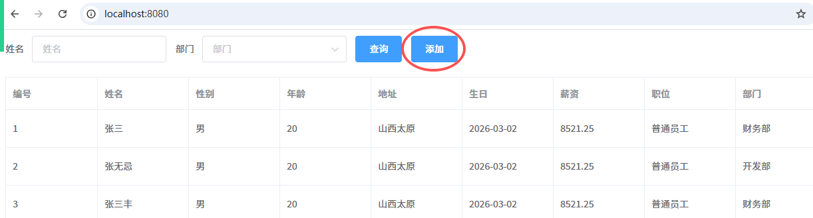

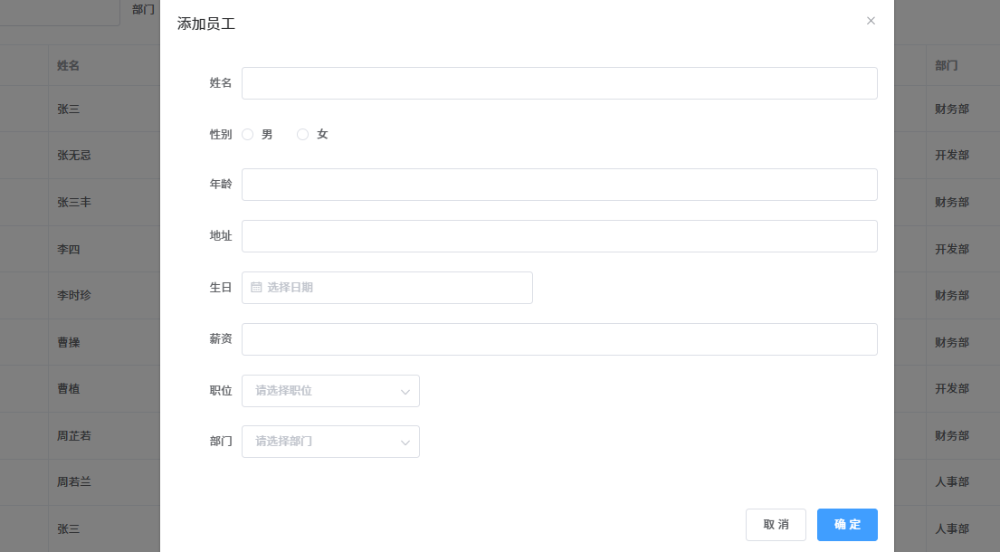

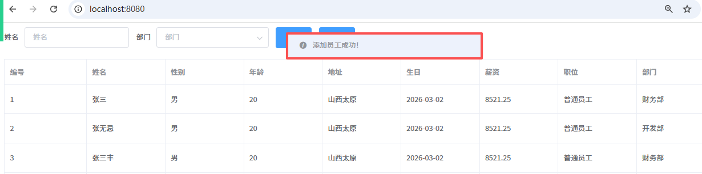

# 六、实现修改回显功能
## 编写页面代码
```html
<!DOCTYPE html>
<html lang="en">
<head>
    <meta charset="UTF-8">
    <title>Title</title>
    <script src="vue.min.js"></script>
    <script src="axios.min.js"></script>
    <link rel="stylesheet" href="index.css">
    <script src="index.js"></script>
</head>
<body>
    <div id="app">

        <el-form :inline="true" class="demo-form-inline">
            <el-form-item label="姓名">
                <el-input v-model="name" placeholder="姓名"></el-input>
            </el-form-item>
            <el-form-item label="部门">
                <el-select clearable v-model="dept" placeholder="部门">
                    <el-option label="人事部" value="人事部"></el-option>
                    <el-option label="财务部" value="财务部"></el-option>
                    <el-option label="开发部" value="开发部"></el-option>
                </el-select>
            </el-form-item>
            <el-form-item>
                <el-button type="primary" @click="findEmp">查询</el-button>
            </el-form-item>

            <el-form-item>
                <el-button type="primary" @click="saveFlag = true">添加</el-button>
            </el-form-item>
        </el-form>

        <el-table
                :data="emps"
                border
                style="width: 100%">
            <el-table-column
                    prop="id"
                    label="编号">
            </el-table-column>
            <el-table-column
                    prop="name"
                    label="姓名"
                    width="120">
            </el-table-column>
            <el-table-column
                    prop="sex"
                    label="性别">
            </el-table-column>
            <el-table-column
                    prop="age"
                    label="年龄">
            </el-table-column>
            <el-table-column
                    prop="address"
                    label="地址">
            </el-table-column>
            <el-table-column
                    prop="birthday"
                    label="生日">
            </el-table-column>
            <el-table-column
                    prop="salary"
                    label="薪资">
            </el-table-column>
            <el-table-column
                    prop="dept"
                    label="部门">
            </el-table-column>
            <el-table-column
                    prop="position"
                    label="职位">
            </el-table-column>
            <el-table-column
                    fixed="right"
                    label="操作"
                    width="100">
                <template slot-scope="scope">
                    <el-button type="text" size="small" @click="toUpdate(scope.row)">编辑</el-button>
                    <el-button @click="handleClick(scope.row)" type="text" size="small">删除</el-button>
                </template>
            </el-table-column>
        </el-table>

        <el-dialog title="添加员工" :visible.sync="saveFlag">
            <el-form ref="form" :model="emp" label-width="80px">
                <el-form-item label="员工姓名">
                    <el-input v-model="emp.name"></el-input>
                </el-form-item>

                <el-form-item label="员工性别">
                    <el-radio-group v-model="emp.sex">
                        <el-radio label="男">男</el-radio>
                        <el-radio label="女">女</el-radio>
                    </el-radio-group>
                </el-form-item>

                <el-form-item label="员工年龄">
                    <el-input v-model="emp.age"></el-input>
                </el-form-item>

                <el-form-item label="出生地址">
                    <el-input v-model="emp.address"></el-input>
                </el-form-item>

                <el-form-item label="出生日期">
                    <el-col :span="11">
                        <el-date-picker type="date" placeholder="选择日期" v-model="emp.birthday" style="width: 100%;"></el-date-picker>
                    </el-col>
                </el-form-item>

                <el-form-item label="薪资待遇">
                    <el-input v-model="emp.salary"></el-input>
                </el-form-item>

                <el-form-item label="所属部门">
                    <el-select v-model="emp.dept" placeholder="请选择部门">
                        <el-option label="人事部" value="人事部"></el-option>
                        <el-option label="财务部" value="财务部"></el-option>
                        <el-option label="开发部" value="开发部"></el-option>
                    </el-select>
                </el-form-item>

                <el-form-item label="所属职位">
                    <el-select v-model="emp.position" placeholder="请选择职位">
                        <el-option label="普通员工" value="普通员工"></el-option>
                        <el-option label="主管" value="主管"></el-option>
                        <el-option label="经理" value="经理"></el-option>
                    </el-select>
                </el-form-item>
            </el-form>
            <div slot="footer" class="dialog-footer">
                <el-button @click="saveFlag = false">取 消</el-button>
                <el-button type="primary" @click="addEmp">确 定</el-button>
            </div>
        </el-dialog>

        <el-dialog title="编辑员工" :visible.sync="updateFlag">
            <el-form ref="form" :model="emp" label-width="80px">
                <el-form-item label="员工姓名">
                    <el-input v-model="emp.name"></el-input>
                </el-form-item>

                <el-form-item label="员工性别">
                    <el-radio-group v-model="emp.sex">
                        <el-radio label="男">男</el-radio>
                        <el-radio label="女">女</el-radio>
                    </el-radio-group>
                </el-form-item>

                <el-form-item label="员工年龄">
                    <el-input v-model="emp.age"></el-input>
                </el-form-item>

                <el-form-item label="出生地址">
                    <el-input v-model="emp.address"></el-input>
                </el-form-item>

                <el-form-item label="出生日期">
                    <el-col :span="11">
                        <el-date-picker type="date" placeholder="选择日期" v-model="emp.birthday" style="width: 100%;"></el-date-picker>
                    </el-col>
                </el-form-item>

                <el-form-item label="薪资待遇">
                    <el-input v-model="emp.salary"></el-input>
                </el-form-item>

                <el-form-item label="所属部门">
                    <el-select v-model="emp.dept" placeholder="请选择部门">
                        <el-option label="人事部" value="人事部"></el-option>
                        <el-option label="财务部" value="财务部"></el-option>
                        <el-option label="开发部" value="开发部"></el-option>
                    </el-select>
                </el-form-item>

                <el-form-item label="所属职位">
                    <el-select v-model="emp.position" placeholder="请选择职位">
                        <el-option label="普通员工" value="普通员工"></el-option>
                        <el-option label="主管" value="主管"></el-option>
                        <el-option label="经理" value="经理"></el-option>
                    </el-select>
                </el-form-item>
            </el-form>
            <div slot="footer" class="dialog-footer">
                <el-button @click="updateFlag = false">取 消</el-button>
                <el-button type="primary" @click="updateEmp">确 定</el-button>
            </div>
        </el-dialog>
    </div>

    <script>
        new Vue({
            el: '#app',
            data: {
                emps: [],
                name: '',
                dept: '',
                saveFlag: false,
                emp: {},
                updateFlag: false
            },
            created(){
                this.findEmp()
            },
            methods: {
                findEmp(){
                    console.log(axios)
                    axios.get('emp/findEmp?name='+this.name+'&dept='+this.dept).then(res => {
                        console.log(res)
                        this.emps = res.data
                    })
                },

                addEmp(){
                    axios.post('emp/addEmp', this.emp).then(res => {
                        this.saveFlag = false
                        this.$message({
                            message: '添加成功',
                            type: 'success'
                        });
                        this.emp = {}
                        this.findEmp()
                    })
                },

                toUpdate(row){
                    this.emp = row
                    this.updateFlag = true
                },

                updateEmp(){
                    
                }
            }
        })
    </script>
</body>
</html>
```

## 启动测试
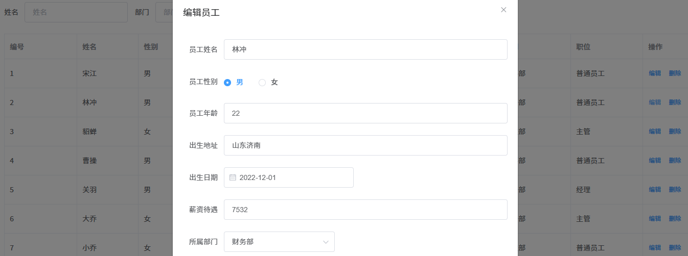

# 七、实现修改功能
## 编写 mapper 层代码
```java
public interface EmpMapper {

    void updateEmp(Emp emp);
```

```xml
<?xml version="1.0" encoding="UTF-8" ?>
<!DOCTYPE mapper
        PUBLIC "-//mybatis.org//DTD Mapper 3.0//EN"
        "http://mybatis.org/dtd/mybatis-3-mapper.dtd">
<mapper namespace="com.lhp.mapper.EmpMapper">

    <update id="updateEmp">
        update emp set name=#{name}, sex=#{sex}, age=#{age}, address=#{address}, 
                       birthday=#{birthday}, salary=#{salary}, dept=#{dept}, 
                       position=#{position} where id=#{id}
    </update>
```

## 编写 service 层代码
```java
public interface EmpService {
    
    void updateEmp(Emp emp);
```

```java
@Service
public class EmpServiceImpl implements EmpService {

    @Autowired
    private EmpMapper empMapper;

    @Override
    public void updateEmp(Emp emp) {
        empMapper.updateEmp(emp);
    }
```

## 编写 controller 层代码
```java
@RestController
@RequestMapping("/emp")
public class EmpController {

    @Autowired
    private EmpService empService;
    
    @PostMapping("/updateEmp")
    public void updateEmp(@RequestBody Emp emp){
        empService.updateEmp(emp);
    }
```

## 编写页面代码
```html
<!DOCTYPE html>
<html lang="en">
<head>
    <meta charset="UTF-8">
    <title>Title</title>
    <script src="vue.min.js"></script>
    <script src="axios.min.js"></script>
    <link rel="stylesheet" href="index.css">
    <script src="index.js"></script>
</head>
<body>
    <div id="app">

        <el-form :inline="true" class="demo-form-inline">
            <el-form-item label="姓名">
                <el-input v-model="name" placeholder="姓名"></el-input>
            </el-form-item>
            <el-form-item label="部门">
                <el-select clearable v-model="dept" placeholder="部门">
                    <el-option label="人事部" value="人事部"></el-option>
                    <el-option label="财务部" value="财务部"></el-option>
                    <el-option label="开发部" value="开发部"></el-option>
                </el-select>
            </el-form-item>
            <el-form-item>
                <el-button type="primary" @click="findEmp">查询</el-button>
            </el-form-item>

            <el-form-item>
                <el-button type="primary" @click="saveFlag = true">添加</el-button>
            </el-form-item>
        </el-form>

        <el-table
                :data="emps"
                border
                style="width: 100%">
            <el-table-column
                    prop="id"
                    label="编号">
            </el-table-column>
            <el-table-column
                    prop="name"
                    label="姓名"
                    width="120">
            </el-table-column>
            <el-table-column
                    prop="sex"
                    label="性别">
            </el-table-column>
            <el-table-column
                    prop="age"
                    label="年龄">
            </el-table-column>
            <el-table-column
                    prop="address"
                    label="地址">
            </el-table-column>
            <el-table-column
                    prop="birthday"
                    label="生日">
            </el-table-column>
            <el-table-column
                    prop="salary"
                    label="薪资">
            </el-table-column>
            <el-table-column
                    prop="dept"
                    label="部门">
            </el-table-column>
            <el-table-column
                    prop="position"
                    label="职位">
            </el-table-column>
            <el-table-column
                    fixed="right"
                    label="操作"
                    width="100">
                <template slot-scope="scope">
                    <el-button type="text" size="small" @click="toUpdate(scope.row)">编辑</el-button>
                    <el-button @click="handleClick(scope.row)" type="text" size="small">删除</el-button>
                </template>
            </el-table-column>
        </el-table>

        <el-dialog title="添加员工" :visible.sync="saveFlag">
            <el-form ref="form" :model="emp" label-width="80px">
                <el-form-item label="员工姓名">
                    <el-input v-model="emp.name"></el-input>
                </el-form-item>

                <el-form-item label="员工性别">
                    <el-radio-group v-model="emp.sex">
                        <el-radio label="男">男</el-radio>
                        <el-radio label="女">女</el-radio>
                    </el-radio-group>
                </el-form-item>

                <el-form-item label="员工年龄">
                    <el-input v-model="emp.age"></el-input>
                </el-form-item>

                <el-form-item label="出生地址">
                    <el-input v-model="emp.address"></el-input>
                </el-form-item>

                <el-form-item label="出生日期">
                    <el-col :span="11">
                        <el-date-picker type="date" placeholder="选择日期" v-model="emp.birthday" style="width: 100%;"></el-date-picker>
                    </el-col>
                </el-form-item>

                <el-form-item label="薪资待遇">
                    <el-input v-model="emp.salary"></el-input>
                </el-form-item>

                <el-form-item label="所属部门">
                    <el-select v-model="emp.dept" placeholder="请选择部门">
                        <el-option label="人事部" value="人事部"></el-option>
                        <el-option label="财务部" value="财务部"></el-option>
                        <el-option label="开发部" value="开发部"></el-option>
                    </el-select>
                </el-form-item>

                <el-form-item label="所属职位">
                    <el-select v-model="emp.position" placeholder="请选择职位">
                        <el-option label="普通员工" value="普通员工"></el-option>
                        <el-option label="主管" value="主管"></el-option>
                        <el-option label="经理" value="经理"></el-option>
                    </el-select>
                </el-form-item>
            </el-form>
            <div slot="footer" class="dialog-footer">
                <el-button @click="saveFlag = false">取 消</el-button>
                <el-button type="primary" @click="addEmp">确 定</el-button>
            </div>
        </el-dialog>

        <el-dialog title="编辑员工" :visible.sync="updateFlag">
            <el-form ref="form" :model="emp" label-width="80px">
                <el-form-item label="员工姓名">
                    <el-input v-model="emp.name"></el-input>
                </el-form-item>

                <el-form-item label="员工性别">
                    <el-radio-group v-model="emp.sex">
                        <el-radio label="男">男</el-radio>
                        <el-radio label="女">女</el-radio>
                    </el-radio-group>
                </el-form-item>

                <el-form-item label="员工年龄">
                    <el-input v-model="emp.age"></el-input>
                </el-form-item>

                <el-form-item label="出生地址">
                    <el-input v-model="emp.address"></el-input>
                </el-form-item>

                <el-form-item label="出生日期">
                    <el-col :span="11">
                        <el-date-picker type="date" placeholder="选择日期" v-model="emp.birthday" style="width: 100%;"></el-date-picker>
                    </el-col>
                </el-form-item>

                <el-form-item label="薪资待遇">
                    <el-input v-model="emp.salary"></el-input>
                </el-form-item>

                <el-form-item label="所属部门">
                    <el-select v-model="emp.dept" placeholder="请选择部门">
                        <el-option label="人事部" value="人事部"></el-option>
                        <el-option label="财务部" value="财务部"></el-option>
                        <el-option label="开发部" value="开发部"></el-option>
                    </el-select>
                </el-form-item>

                <el-form-item label="所属职位">
                    <el-select v-model="emp.position" placeholder="请选择职位">
                        <el-option label="普通员工" value="普通员工"></el-option>
                        <el-option label="主管" value="主管"></el-option>
                        <el-option label="经理" value="经理"></el-option>
                    </el-select>
                </el-form-item>
            </el-form>
            <div slot="footer" class="dialog-footer">
                <el-button @click="updateFlag = false">取 消</el-button>
                <el-button type="primary" @click="updateEmp">确 定</el-button>
            </div>
        </el-dialog>
    </div>

    <script>
        new Vue({
            el: '#app',
            data: {
                emps: [],
                name: '',
                dept: '',
                saveFlag: false,
                emp: {},
                updateFlag: false
            },
            created(){
                this.findEmp()
            },
            methods: {
                findEmp(){
                    console.log(axios)
                    axios.get('emp/findEmp?name='+this.name+'&dept='+this.dept).then(res => {
                        console.log(res)
                        this.emps = res.data
                    })
                },

                addEmp(){
                    axios.post('emp/addEmp', this.emp).then(res => {
                        this.saveFlag = false
                        this.$message({
                            message: '添加成功',
                            type: 'success'
                        });
                        this.emp = {}
                        this.findEmp()
                    })
                },

                toUpdate(row){
                    this.emp = row
                    this.updateFlag = true
                },

                updateEmp(){
                    axios.post('emp/updateEmp', this.emp).then(res => {
                        this.updateFlag = false
                        this.$message({
                            message: '修改成功',
                            type: 'success'
                        });
                        this.emp = {}
                        this.findEmp()
                    })
                }
            }
        })
    </script>
</body>
</html>
```

## 启动测试
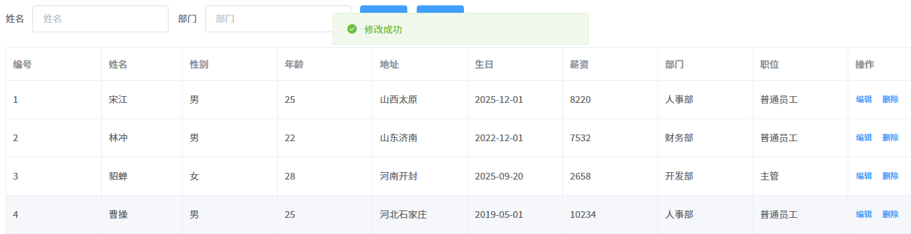

# 八、实现删除功能
## 编写 mapper 层代码
```java
public interface EmpMapper {
    
    void deleteEmp(Integer id);
```

```xml
<?xml version="1.0" encoding="UTF-8" ?>
<!DOCTYPE mapper
        PUBLIC "-//mybatis.org//DTD Mapper 3.0//EN"
        "http://mybatis.org/dtd/mybatis-3-mapper.dtd">
<mapper namespace="com.lhp.mapper.EmpMapper">

    <delete id="deleteEmp">
        delete from emp where id = #{id}
    </delete>
```

## 编写 service 层代码
```java
public interface EmpService {
    
    void deleteEmp(Integer id);
```

```java
@Service
public class EmpServiceImpl implements EmpService {

    @Autowired
    private EmpMapper empMapper;

    @Override
    public void deleteEmp(Integer id) {
        empMapper.deleteEmp(id);
    }
```

## 编写 controller 层代码
```java
@RestController
@RequestMapping("/emp")
public class EmpController {

    @Autowired
    private EmpService empService;
    
    @GetMapping("/deleteEmp")
    public void deleteEmp(Integer id){
        empService.deleteEmp(id);
    }
```

## 编写页面代码
```html
<!DOCTYPE html>
<html lang="en">
<head>
    <meta charset="UTF-8">
    <title>Title</title>
    <script src="vue.min.js"></script>
    <script src="axios.min.js"></script>
    <link rel="stylesheet" href="index.css">
    <script src="index.js"></script>
</head>
<body>
    <div id="app">

        <el-form :inline="true" class="demo-form-inline">
            <el-form-item label="姓名">
                <el-input v-model="name" placeholder="姓名"></el-input>
            </el-form-item>
            <el-form-item label="部门">
                <el-select clearable v-model="dept" placeholder="部门">
                    <el-option label="人事部" value="人事部"></el-option>
                    <el-option label="财务部" value="财务部"></el-option>
                    <el-option label="开发部" value="开发部"></el-option>
                </el-select>
            </el-form-item>
            <el-form-item>
                <el-button type="primary" @click="findEmp">查询</el-button>
            </el-form-item>

            <el-form-item>
                <el-button type="primary" @click="saveFlag = true">添加</el-button>
            </el-form-item>
        </el-form>

        <el-table
                :data="emps"
                border
                style="width: 100%">
            <el-table-column
                    prop="id"
                    label="编号">
            </el-table-column>
            <el-table-column
                    prop="name"
                    label="姓名"
                    width="120">
            </el-table-column>
            <el-table-column
                    prop="sex"
                    label="性别">
            </el-table-column>
            <el-table-column
                    prop="age"
                    label="年龄">
            </el-table-column>
            <el-table-column
                    prop="address"
                    label="地址">
            </el-table-column>
            <el-table-column
                    prop="birthday"
                    label="生日">
            </el-table-column>
            <el-table-column
                    prop="salary"
                    label="薪资">
            </el-table-column>
            <el-table-column
                    prop="dept"
                    label="部门">
            </el-table-column>
            <el-table-column
                    prop="position"
                    label="职位">
            </el-table-column>
            <el-table-column
                    fixed="right"
                    label="操作"
                    width="100">
                <template slot-scope="scope">
                    <el-button type="text" size="small" @click="toUpdate(scope.row)">编辑</el-button>
                    <el-button @click="deleteEmp(scope.row)" type="text" size="small">删除</el-button>
                </template>
            </el-table-column>
        </el-table>

        <el-dialog title="添加员工" :visible.sync="saveFlag">
            <el-form ref="form" :model="emp" label-width="80px">
                <el-form-item label="员工姓名">
                    <el-input v-model="emp.name"></el-input>
                </el-form-item>

                <el-form-item label="员工性别">
                    <el-radio-group v-model="emp.sex">
                        <el-radio label="男">男</el-radio>
                        <el-radio label="女">女</el-radio>
                    </el-radio-group>
                </el-form-item>

                <el-form-item label="员工年龄">
                    <el-input v-model="emp.age"></el-input>
                </el-form-item>

                <el-form-item label="出生地址">
                    <el-input v-model="emp.address"></el-input>
                </el-form-item>

                <el-form-item label="出生日期">
                    <el-col :span="11">
                        <el-date-picker type="date" placeholder="选择日期" v-model="emp.birthday" style="width: 100%;"></el-date-picker>
                    </el-col>
                </el-form-item>

                <el-form-item label="薪资待遇">
                    <el-input v-model="emp.salary"></el-input>
                </el-form-item>

                <el-form-item label="所属部门">
                    <el-select v-model="emp.dept" placeholder="请选择部门">
                        <el-option label="人事部" value="人事部"></el-option>
                        <el-option label="财务部" value="财务部"></el-option>
                        <el-option label="开发部" value="开发部"></el-option>
                    </el-select>
                </el-form-item>

                <el-form-item label="所属职位">
                    <el-select v-model="emp.position" placeholder="请选择职位">
                        <el-option label="普通员工" value="普通员工"></el-option>
                        <el-option label="主管" value="主管"></el-option>
                        <el-option label="经理" value="经理"></el-option>
                    </el-select>
                </el-form-item>
            </el-form>
            <div slot="footer" class="dialog-footer">
                <el-button @click="saveFlag = false">取 消</el-button>
                <el-button type="primary" @click="addEmp">确 定</el-button>
            </div>
        </el-dialog>

        <el-dialog title="编辑员工" :visible.sync="updateFlag">
            <el-form ref="form" :model="emp" label-width="80px">
                <el-form-item label="员工姓名">
                    <el-input v-model="emp.name"></el-input>
                </el-form-item>

                <el-form-item label="员工性别">
                    <el-radio-group v-model="emp.sex">
                        <el-radio label="男">男</el-radio>
                        <el-radio label="女">女</el-radio>
                    </el-radio-group>
                </el-form-item>

                <el-form-item label="员工年龄">
                    <el-input v-model="emp.age"></el-input>
                </el-form-item>

                <el-form-item label="出生地址">
                    <el-input v-model="emp.address"></el-input>
                </el-form-item>

                <el-form-item label="出生日期">
                    <el-col :span="11">
                        <el-date-picker type="date" placeholder="选择日期" v-model="emp.birthday" style="width: 100%;"></el-date-picker>
                    </el-col>
                </el-form-item>

                <el-form-item label="薪资待遇">
                    <el-input v-model="emp.salary"></el-input>
                </el-form-item>

                <el-form-item label="所属部门">
                    <el-select v-model="emp.dept" placeholder="请选择部门">
                        <el-option label="人事部" value="人事部"></el-option>
                        <el-option label="财务部" value="财务部"></el-option>
                        <el-option label="开发部" value="开发部"></el-option>
                    </el-select>
                </el-form-item>

                <el-form-item label="所属职位">
                    <el-select v-model="emp.position" placeholder="请选择职位">
                        <el-option label="普通员工" value="普通员工"></el-option>
                        <el-option label="主管" value="主管"></el-option>
                        <el-option label="经理" value="经理"></el-option>
                    </el-select>
                </el-form-item>
            </el-form>
            <div slot="footer" class="dialog-footer">
                <el-button @click="updateFlag = false">取 消</el-button>
                <el-button type="primary" @click="updateEmp">确 定</el-button>
            </div>
        </el-dialog>
    </div>

    <script>
        new Vue({
            el: '#app',
            data: {
                emps: [],
                name: '',
                dept: '',
                saveFlag: false,
                emp: {},
                updateFlag: false
            },
            created(){
                this.findEmp()
            },
            methods: {
                findEmp(){
                    console.log(axios)
                    axios.get('emp/findEmp?name='+this.name+'&dept='+this.dept).then(res => {
                        console.log(res)
                        this.emps = res.data
                    })
                },

                addEmp(){
                    axios.post('emp/addEmp', this.emp).then(res => {
                        this.saveFlag = false
                        this.$message({
                            message: '添加成功',
                            type: 'success'
                        });
                        this.emp = {}
                        this.findEmp()
                    })
                },

                toUpdate(row){
                    this.emp = row
                    this.updateFlag = true
                },

                updateEmp(){
                    axios.post('emp/updateEmp', this.emp).then(res => {
                        this.updateFlag = false
                        this.$message({
                            message: '修改成功',
                            type: 'success'
                        });
                        this.emp = {}
                        this.findEmp()
                    })
                },

                deleteEmp(row){
                    this.$confirm('确定要删除'+row.name+'吗?', '提示', {
                        confirmButtonText: '确定',
                        cancelButtonText: '取消',
                        type: 'warning'
                    }).then(() => {
                        axios.get('emp/deleteEmp?id='+row.id).then(res => {
                            this.$message({
                                message: '删除成功',
                                type: 'success'
                            });
                            this.findEmp()
                        })
                    }).catch(() => {
                        this.$message({
                            type: 'info',
                            message: '已取消删除'
                        });
                    });
                }
            }
        })
    </script>
</body>
</html>
```

## 启动测试
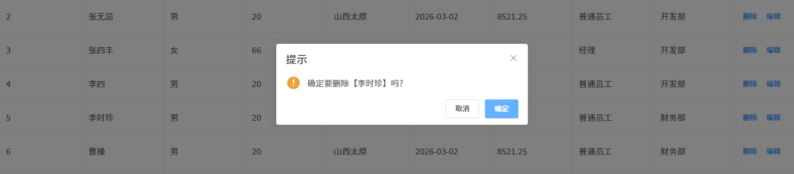


# 九、实现分页功能
## 添加依赖
```xml
<dependency>
  <groupId>com.github.pagehelper</groupId>
  <artifactId>pagehelper-spring-boot-starter</artifactId>
  <version>1.4.1</version>
</dependency>
```

## 修改 service 层代码
```java
package com.lhp.service;

import com.github.pagehelper.PageInfo;
import com.lhp.pojo.Emp;

import java.util.List;


public interface EmpService {

    void deleteEmp(Integer id);

    void updateEmp(Emp emp);

    void addEmp(Emp emp);

    PageInfo<Emp> findEmp(String name, String dept, Integer pageNum, Integer pageSize);
}
```

```java
package com.lhp.service.impl;

import com.github.pagehelper.PageHelper;
import com.github.pagehelper.PageInfo;
import com.lhp.mapper.EmpMapper;
import com.lhp.pojo.Emp;
import com.lhp.service.EmpService;
import org.springframework.beans.factory.annotation.Autowired;
import org.springframework.stereotype.Service;
import java.util.List;


@Service
public class EmpServiceImpl implements EmpService {

    @Autowired
    private EmpMapper empMapper;

    @Override
    public void deleteEmp(Integer id) {
        empMapper.deleteEmp(id);
    }

    @Override
    public void updateEmp(Emp emp) {
        empMapper.updateEmp(emp);
    }

    @Override
    public void addEmp(Emp emp) {
        empMapper.addEmp(emp);
    }

    @Override
    public PageInfo<Emp> findEmp(String name, String dept, Integer pageNum, Integer pageSize) {
        PageHelper.startPage(pageNum, pageSize);
        List<Emp> emp = empMapper.findEmp(name, dept);
        PageInfo<Emp> pageInfo = new PageInfo<Emp>(emp);
        return pageInfo;
    }
}
```

## 修改 controller 层代码
```java
package com.lhp.controller;

import com.github.pagehelper.PageInfo;
import com.lhp.pojo.Emp;
import com.lhp.service.EmpService;
import org.springframework.beans.factory.annotation.Autowired;
import org.springframework.web.bind.annotation.*;

import java.util.List;


@RestController
@RequestMapping("/emp")
public class EmpController {

    @Autowired
    private EmpService empService;

    @GetMapping("/deleteEmp")
    public void deleteEmp(Integer id){
        empService.deleteEmp(id);
    }

    @PostMapping("/updateEmp")
    public void updateEmp(@RequestBody Emp emp){
        empService.updateEmp(emp);
    }

    @PostMapping("/addEmp")
    public void addEmp(@RequestBody Emp emp){
        empService.addEmp(emp);
    }

    @GetMapping("/findEmp")
    public PageInfo<Emp> findEmp(String name, String dept, 
                                 @RequestParam(defaultValue = "1") Integer pageNum, 
                                 @RequestParam(defaultValue = "3") Integer pageSize){
        return empService.findEmp(name, dept, pageNum, pageSize);
    }
}
```

## 修改页面代码
```html
<!DOCTYPE html>
<html lang="en">
<head>
    <meta charset="UTF-8">
    <title>Title</title>
    <script src="vue.min.js"></script>
    <script src="axios.min.js"></script>
    <link rel="stylesheet" href="index.css">
    <script src="index.js"></script>
</head>
<body>
    <div id="app">

        <el-form :inline="true" class="demo-form-inline">
            <el-form-item label="姓名">
                <el-input v-model="name" placeholder="姓名"></el-input>
            </el-form-item>
            <el-form-item label="部门">
                <el-select clearable v-model="dept" placeholder="部门">
                    <el-option label="人事部" value="人事部"></el-option>
                    <el-option label="财务部" value="财务部"></el-option>
                    <el-option label="开发部" value="开发部"></el-option>
                </el-select>
            </el-form-item>
            <el-form-item>
                <el-button type="primary" @click="findEmp">查询</el-button>
            </el-form-item>

            <el-form-item>
                <el-button type="success" @click="saveFlag = true">添加</el-button>
            </el-form-item>
        </el-form>

        <el-table
                :data="emps"
                border
                style="width: 100%">
            <el-table-column
                    prop="id"
                    label="编号">
            </el-table-column>
            <el-table-column
                    prop="name"
                    label="姓名"
                    width="120">
            </el-table-column>
            <el-table-column
                    prop="sex"
                    label="性别">
            </el-table-column>
            <el-table-column
                    prop="age"
                    label="年龄">
            </el-table-column>
            <el-table-column
                    prop="address"
                    label="地址">
            </el-table-column>
            <el-table-column
                    prop="birthday"
                    label="生日">
            </el-table-column>
            <el-table-column
                    prop="salary"
                    label="薪资">
            </el-table-column>
            <el-table-column
                    prop="dept"
                    label="部门">
            </el-table-column>
            <el-table-column
                    prop="position"
                    label="职位">
            </el-table-column>
            <el-table-column
                    fixed="right"
                    label="操作"
                    width="100">
                <template slot-scope="scope">
                    <el-button type="text" size="small" @click="toUpdate(scope.row)">编辑</el-button>
                    <el-button @click="deleteEmp(scope.row)" type="text" size="small">删除</el-button>
                </template>
            </el-table-column>
        </el-table>

        <el-pagination
                @size-change="handleSizeChange"
                @current-change="handleCurrentChange"
                :current-page="pageNum"
                :page-sizes="[2, 3, 4, 5]"
                :page-size="pageSize"
                layout="total, sizes, prev, pager, next, jumper"
                :total="total">
        </el-pagination>

        <el-dialog title="添加员工" :visible.sync="saveFlag">
            <el-form ref="form" :model="emp" label-width="80px">
                <el-form-item label="员工姓名">
                    <el-input v-model="emp.name"></el-input>
                </el-form-item>

                <el-form-item label="员工性别">
                    <el-radio-group v-model="emp.sex">
                        <el-radio label="男">男</el-radio>
                        <el-radio label="女">女</el-radio>
                    </el-radio-group>
                </el-form-item>

                <el-form-item label="员工年龄">
                    <el-input v-model="emp.age"></el-input>
                </el-form-item>

                <el-form-item label="出生地址">
                    <el-input v-model="emp.address"></el-input>
                </el-form-item>

                <el-form-item label="出生日期">
                    <el-col :span="11">
                        <el-date-picker type="date" placeholder="选择日期" v-model="emp.birthday" style="width: 100%;"></el-date-picker>
                    </el-col>
                </el-form-item>

                <el-form-item label="薪资待遇">
                    <el-input v-model="emp.salary"></el-input>
                </el-form-item>

                <el-form-item label="所属部门">
                    <el-select v-model="emp.dept" placeholder="请选择部门">
                        <el-option label="人事部" value="人事部"></el-option>
                        <el-option label="财务部" value="财务部"></el-option>
                        <el-option label="开发部" value="开发部"></el-option>
                    </el-select>
                </el-form-item>

                <el-form-item label="所属职位">
                    <el-select v-model="emp.position" placeholder="请选择职位">
                        <el-option label="普通员工" value="普通员工"></el-option>
                        <el-option label="主管" value="主管"></el-option>
                        <el-option label="经理" value="经理"></el-option>
                    </el-select>
                </el-form-item>
            </el-form>
            <div slot="footer" class="dialog-footer">
                <el-button @click="saveFlag = false">取 消</el-button>
                <el-button type="primary" @click="addEmp">确 定</el-button>
            </div>
        </el-dialog>

        <el-dialog title="编辑员工" :visible.sync="updateFlag">
            <el-form ref="form" :model="emp" label-width="80px">
                <el-form-item label="员工姓名">
                    <el-input v-model="emp.name"></el-input>
                </el-form-item>

                <el-form-item label="员工性别">
                    <el-radio-group v-model="emp.sex">
                        <el-radio label="男">男</el-radio>
                        <el-radio label="女">女</el-radio>
                    </el-radio-group>
                </el-form-item>

                <el-form-item label="员工年龄">
                    <el-input v-model="emp.age"></el-input>
                </el-form-item>

                <el-form-item label="出生地址">
                    <el-input v-model="emp.address"></el-input>
                </el-form-item>

                <el-form-item label="出生日期">
                    <el-col :span="11">
                        <el-date-picker type="date" placeholder="选择日期" v-model="emp.birthday" style="width: 100%;"></el-date-picker>
                    </el-col>
                </el-form-item>

                <el-form-item label="薪资待遇">
                    <el-input v-model="emp.salary"></el-input>
                </el-form-item>

                <el-form-item label="所属部门">
                    <el-select v-model="emp.dept" placeholder="请选择部门">
                        <el-option label="人事部" value="人事部"></el-option>
                        <el-option label="财务部" value="财务部"></el-option>
                        <el-option label="开发部" value="开发部"></el-option>
                    </el-select>
                </el-form-item>

                <el-form-item label="所属职位">
                    <el-select v-model="emp.position" placeholder="请选择职位">
                        <el-option label="普通员工" value="普通员工"></el-option>
                        <el-option label="主管" value="主管"></el-option>
                        <el-option label="经理" value="经理"></el-option>
                    </el-select>
                </el-form-item>
            </el-form>
            <div slot="footer" class="dialog-footer">
                <el-button @click="updateFlag = false">取 消</el-button>
                <el-button type="primary" @click="updateEmp">确 定</el-button>
            </div>
        </el-dialog>
    </div>

    <script>
        new Vue({
            el: '#app',
            data: {
                emps: [],
                name: '',
                dept: '',
                saveFlag: false,
                emp: {},
                updateFlag: false,
                pageNum: 1,
                pageSize: 3,
                total: 0
            },
            created(){
                this.findEmp()
            },
            methods: {
                findEmp(){
                    console.log(axios)
                    axios.get('emp/findEmp?name='+this.name+'&dept='+this.dept+'&pageNum='+this.pageNum+'&pageSize='+this.pageSize).then(res => {
                        console.log(res)
                        this.emps = res.data.list
                        this.total = res.data.total
                    })
                },

                handleSizeChange(val) {
                    console.log(`每页 ${val} 条`);
                    this.pageSize = val
                    this.pageNum = 1
                    this.findEmp()
                },

                handleCurrentChange(val) {
                    console.log(`当前页: ${val}`);
                    this.pageNum = val
                    this.findEmp()
                },

                addEmp(){
                    axios.post('emp/addEmp', this.emp).then(res => {
                        this.saveFlag = false
                        this.$message({
                            message: '添加成功',
                            type: 'success'
                        });
                        this.emp = {}
                        this.findEmp()
                    })
                },

                toUpdate(row){
                    this.emp = row
                    this.updateFlag = true
                },

                updateEmp(){
                    axios.post('emp/updateEmp', this.emp).then(res => {
                        this.updateFlag = false
                        this.$message({
                            message: '修改成功',
                            type: 'success'
                        });
                        this.emp = {}
                        this.findEmp()
                    })
                },

                deleteEmp(row){
                    this.$confirm('确定要删除'+row.name+'吗?', '提示', {
                        confirmButtonText: '确定',
                        cancelButtonText: '取消',
                        type: 'warning'
                    }).then(() => {
                        axios.get('emp/deleteEmp?id='+row.id).then(res => {
                            this.$message({
                                message: '删除成功',
                                type: 'success'
                            });
                            this.findEmp()
                        })
                    }).catch(() => {
                        this.$message({
                            type: 'info',
                            message: '已取消删除'
                        });
                    });
                }
            }
        })
    </script>
</body>
</html>
```

## 启动测试


# 十、实现导出功能
阿里巴巴 easyexcel

参考：[https://easyexcel.opensource.alibaba.com/docs/current/quickstart/write](https://easyexcel.opensource.alibaba.com/docs/current/quickstart/write)

## 添加依赖
```xml
<dependency>
    <groupId>com.alibaba</groupId>
    <artifactId>easyexcel</artifactId>
    <version>3.1.0</version>
</dependency>
```

## 标注注解
```java
package com.lhp.pojo;

import com.alibaba.excel.annotation.ExcelProperty;
import com.fasterxml.jackson.annotation.JsonFormat;
import lombok.Data;
import java.util.Date;

@Data
public class Emp {

    @ExcelProperty("编号")
    private Integer id;

    @ExcelProperty("姓名")
    private String name;

    @ExcelProperty("性别")
    private String sex;

    @ExcelProperty("年龄")
    private Integer age;

    @ExcelProperty("地址")
    private String address;

    @JsonFormat(pattern = "yyyy-MM-dd")
    @ExcelProperty("生日")
    private Date birthday;

    @ExcelProperty("薪资")
    private Double salary;

    @ExcelProperty("部门")
    private String dept;

    @ExcelProperty("职位")
    private String position;
}
```

## 编写 controller 层代码
```java
@RestController
@RequestMapping("/emp")
public class EmpController {

    @Autowired
    private EmpService empService;

    @GetMapping("/exportEmp")
    public String exportEmp(HttpServletResponse response) throws IOException {

        PageInfo<Emp> pageInfo = empService.findEmp(null, null, 1, 1000);

        String fileName = "D:/员工信息-" + System.currentTimeMillis() + ".xlsx";
        // 这里 需要指定写用哪个class去写，然后写到第一个sheet，名字为模板 然后文件流会自动关闭
        // 如果这里想使用03 则 传入excelType参数即可
        EasyExcel.write(fileName, Emp.class)
                .sheet("员工信息")
                .doWrite(() -> {
                    // 分页查询数据
                    return pageInfo.getList();
                });
        return fileName;
    }
```

## 编写页面代码
```html
<!DOCTYPE html>
<html lang="en">
<head>
    <meta charset="UTF-8">
    <title>Title</title>
    <script src="vue.min.js"></script>
    <script src="axios.min.js"></script>
    <link rel="stylesheet" href="index.css">
    <script src="index.js"></script>
</head>
<body>
    <div id="app">

        <el-form :inline="true" class="demo-form-inline">
            <el-form-item label="姓名">
                <el-input v-model="name" placeholder="姓名"></el-input>
            </el-form-item>
            <el-form-item label="部门">
                <el-select clearable v-model="dept" placeholder="部门">
                    <el-option label="人事部" value="人事部"></el-option>
                    <el-option label="财务部" value="财务部"></el-option>
                    <el-option label="开发部" value="开发部"></el-option>
                </el-select>
            </el-form-item>
            <el-form-item>
                <el-button type="primary" @click="findEmp">查询</el-button>
            </el-form-item>

            <el-form-item>
                <el-button type="success" @click="saveFlag = true">添加</el-button>
            </el-form-item>

            <el-form-item>
                <el-button type="success" @click="exportEmp">导出</el-button>
            </el-form-item>
        </el-form>

        <el-table
                :data="emps"
                border
                style="width: 100%">
            <el-table-column
                    prop="id"
                    label="编号">
            </el-table-column>
            <el-table-column
                    prop="name"
                    label="姓名"
                    width="120">
            </el-table-column>
            <el-table-column
                    prop="sex"
                    label="性别">
            </el-table-column>
            <el-table-column
                    prop="age"
                    label="年龄">
            </el-table-column>
            <el-table-column
                    prop="address"
                    label="地址">
            </el-table-column>
            <el-table-column
                    prop="birthday"
                    label="生日">
            </el-table-column>
            <el-table-column
                    prop="salary"
                    label="薪资">
            </el-table-column>
            <el-table-column
                    prop="dept"
                    label="部门">
            </el-table-column>
            <el-table-column
                    prop="position"
                    label="职位">
            </el-table-column>
            <el-table-column
                    fixed="right"
                    label="操作"
                    width="100">
                <template slot-scope="scope">
                    <el-button type="text" size="small" @click="toUpdate(scope.row)">编辑</el-button>
                    <el-button @click="deleteEmp(scope.row)" type="text" size="small">删除</el-button>
                </template>
            </el-table-column>
        </el-table>

        <el-pagination
                @size-change="handleSizeChange"
                @current-change="handleCurrentChange"
                :current-page="pageNum"
                :page-sizes="[2, 3, 4, 5]"
                :page-size="pageSize"
                layout="total, sizes, prev, pager, next, jumper"
                :total="total">
        </el-pagination>

        <el-dialog title="添加员工" :visible.sync="saveFlag">
            <el-form ref="form" :model="emp" label-width="80px">
                <el-form-item label="员工姓名">
                    <el-input v-model="emp.name"></el-input>
                </el-form-item>

                <el-form-item label="员工性别">
                    <el-radio-group v-model="emp.sex">
                        <el-radio label="男">男</el-radio>
                        <el-radio label="女">女</el-radio>
                    </el-radio-group>
                </el-form-item>

                <el-form-item label="员工年龄">
                    <el-input v-model="emp.age"></el-input>
                </el-form-item>

                <el-form-item label="出生地址">
                    <el-input v-model="emp.address"></el-input>
                </el-form-item>

                <el-form-item label="出生日期">
                    <el-col :span="11">
                        <el-date-picker type="date" placeholder="选择日期" v-model="emp.birthday" style="width: 100%;"></el-date-picker>
                    </el-col>
                </el-form-item>

                <el-form-item label="薪资待遇">
                    <el-input v-model="emp.salary"></el-input>
                </el-form-item>

                <el-form-item label="所属部门">
                    <el-select v-model="emp.dept" placeholder="请选择部门">
                        <el-option label="人事部" value="人事部"></el-option>
                        <el-option label="财务部" value="财务部"></el-option>
                        <el-option label="开发部" value="开发部"></el-option>
                    </el-select>
                </el-form-item>

                <el-form-item label="所属职位">
                    <el-select v-model="emp.position" placeholder="请选择职位">
                        <el-option label="普通员工" value="普通员工"></el-option>
                        <el-option label="主管" value="主管"></el-option>
                        <el-option label="经理" value="经理"></el-option>
                    </el-select>
                </el-form-item>
            </el-form>
            <div slot="footer" class="dialog-footer">
                <el-button @click="saveFlag = false">取 消</el-button>
                <el-button type="primary" @click="addEmp">确 定</el-button>
            </div>
        </el-dialog>

        <el-dialog title="编辑员工" :visible.sync="updateFlag">
            <el-form ref="form" :model="emp" label-width="80px">
                <el-form-item label="员工姓名">
                    <el-input v-model="emp.name"></el-input>
                </el-form-item>

                <el-form-item label="员工性别">
                    <el-radio-group v-model="emp.sex">
                        <el-radio label="男">男</el-radio>
                        <el-radio label="女">女</el-radio>
                    </el-radio-group>
                </el-form-item>

                <el-form-item label="员工年龄">
                    <el-input v-model="emp.age"></el-input>
                </el-form-item>

                <el-form-item label="出生地址">
                    <el-input v-model="emp.address"></el-input>
                </el-form-item>

                <el-form-item label="出生日期">
                    <el-col :span="11">
                        <el-date-picker type="date" placeholder="选择日期" v-model="emp.birthday" style="width: 100%;"></el-date-picker>
                    </el-col>
                </el-form-item>

                <el-form-item label="薪资待遇">
                    <el-input v-model="emp.salary"></el-input>
                </el-form-item>

                <el-form-item label="所属部门">
                    <el-select v-model="emp.dept" placeholder="请选择部门">
                        <el-option label="人事部" value="人事部"></el-option>
                        <el-option label="财务部" value="财务部"></el-option>
                        <el-option label="开发部" value="开发部"></el-option>
                    </el-select>
                </el-form-item>

                <el-form-item label="所属职位">
                    <el-select v-model="emp.position" placeholder="请选择职位">
                        <el-option label="普通员工" value="普通员工"></el-option>
                        <el-option label="主管" value="主管"></el-option>
                        <el-option label="经理" value="经理"></el-option>
                    </el-select>
                </el-form-item>
            </el-form>
            <div slot="footer" class="dialog-footer">
                <el-button @click="updateFlag = false">取 消</el-button>
                <el-button type="primary" @click="updateEmp">确 定</el-button>
            </div>
        </el-dialog>
    </div>

    <script>
        new Vue({
            el: '#app',
            data: {
                emps: [],
                name: '',
                dept: '',
                saveFlag: false,
                emp: {},
                updateFlag: false,
                pageNum: 1,
                pageSize: 3,
                total: 0
            },
            created(){
                this.findEmp()
            },
            methods: {
                findEmp(){
                    console.log(axios)
                    axios.get('emp/findEmp?name='+this.name+'&dept='+this.dept+'&pageNum='+this.pageNum+'&pageSize='+this.pageSize).then(res => {
                        console.log(res)
                        this.emps = res.data.list
                        this.total = res.data.total
                    })
                },

                handleSizeChange(val) {
                    console.log(`每页 ${val} 条`);
                    this.pageSize = val
                    this.pageNum = 1
                    this.findEmp()
                },

                handleCurrentChange(val) {
                    console.log(`当前页: ${val}`);
                    this.pageNum = val
                    this.findEmp()
                },

                addEmp(){
                    axios.post('emp/addEmp', this.emp).then(res => {
                        this.saveFlag = false
                        this.$message({
                            message: '添加成功',
                            type: 'success'
                        });
                        this.emp = {}
                        this.findEmp()
                    })
                },

                toUpdate(row){
                    this.emp = row
                    this.updateFlag = true
                },

                updateEmp(){
                    axios.post('emp/updateEmp', this.emp).then(res => {
                        this.updateFlag = false
                        this.$message({
                            message: '修改成功',
                            type: 'success'
                        });
                        this.emp = {}
                        this.findEmp()
                    })
                },

                deleteEmp(row){
                    this.$confirm('确定要删除'+row.name+'吗?', '提示', {
                        confirmButtonText: '确定',
                        cancelButtonText: '取消',
                        type: 'warning'
                    }).then(() => {
                        axios.get('emp/deleteEmp?id='+row.id).then(res => {
                            this.$message({
                                message: '删除成功',
                                type: 'success'
                            });
                            this.findEmp()
                        })
                    }).catch(() => {
                        this.$message({
                            type: 'info',
                            message: '已取消删除'
                        });
                    });
                },

                exportEmp(){
                    axios.get('emp/exportEmp').then(res => {
                        this.$message({
                            message: '导出成功，路径是：' + res.data,
                            type: 'success'
                        });
                    })
                }
            }
        })
    </script>
</body>
</html>
```

## 启动测试
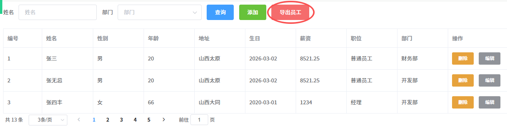

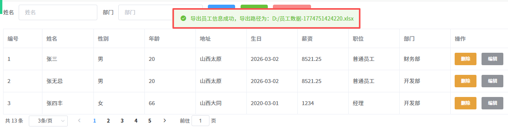

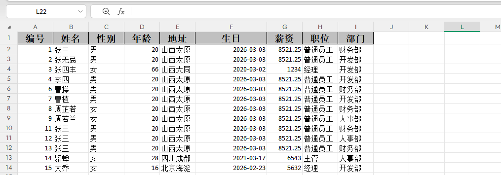

# 十一、实现导入功能
## 添加依赖
```xml
<dependency>
    <groupId>cn.hutool</groupId>
    <artifactId>hutool-all</artifactId>
    <version>5.7.20</version>
    <scope>compile</scope>
</dependency>
```

## 编写 service 层代码
```java
public interface EmpService {

    void imortEmp(List<Emp> emps);
```

```java
@Service
public class EmpServiceImpl implements EmpService {

    @Autowired
    private EmpMapper empMapper;

    @Override
    public void imortEmp(List<Emp> emps) {
        for (Emp emp : emps) {
            empMapper.addEmp(emp);
        }
    }
```

## 编写 controller 层代码
```java
@RestController
@RequestMapping("/emp")
public class EmpController {

    @Autowired
    private EmpService empService;

    @PostMapping("/importEmp")
    public void importEmp(MultipartFile file) throws IOException {
        List<List<Object>> list = ExcelUtil.getReader(file.getInputStream(), 0).read(1);
        List<Emp> emps = new ArrayList<>();
        for (List<Object> o : list) {
            Emp emp = new Emp();
            emp.setName(o.get(0).toString());
            emp.setSex(o.get(1).toString());
            emp.setAge(Integer.parseInt(o.get(2).toString()));
            emp.setAddress(o.get(3).toString());
            emp.setBirthday(DateUtil.parse(o.get(4).toString(), "yyyy-MM-dd"));
            emp.setSalary(Double.parseDouble(o.get(5).toString()));
            emp.setDept(o.get(6).toString());
            emp.setPosition(o.get(7).toString());
            emps.add(emp);
        }
        empService.imortEmp(emps);
    }
```

## 编写页面代码
```html
<!DOCTYPE html>
<html lang="en">
<head>
    <meta charset="UTF-8">
    <title>Title</title>
    <script src="vue.min.js"></script>
    <script src="axios.min.js"></script>
    <link rel="stylesheet" href="index.css">
    <script src="index.js"></script>
</head>
<body>
    <div id="app">

        <el-form :inline="true" class="demo-form-inline">
            <el-form-item label="姓名">
                <el-input v-model="name" placeholder="姓名"></el-input>
            </el-form-item>
            <el-form-item label="部门">
                <el-select clearable v-model="dept" placeholder="部门">
                    <el-option label="人事部" value="人事部"></el-option>
                    <el-option label="财务部" value="财务部"></el-option>
                    <el-option label="开发部" value="开发部"></el-option>
                </el-select>
            </el-form-item>
            <el-form-item>
                <el-button type="primary" @click="findEmp">查询</el-button>
            </el-form-item>

            <el-form-item>
                <el-button type="success" @click="saveFlag = true">添加</el-button>
            </el-form-item>

            <el-form-item>
                <el-button type="warning" @click="exportEmp">导出</el-button>
            </el-form-item>

            <el-form-item>
                <el-upload
                        class="upload-demo"
                        action="http://localhost:8080/emp/importEmp"
                        :on-success="handleSuccess"
                        :show-file-list="false">
                    <el-button type="primary">导入</el-button>
                </el-upload>
            </el-form-item>
        </el-form>

        <el-table
                :data="emps"
                border
                style="width: 100%">
            <el-table-column
                    prop="id"
                    label="编号">
            </el-table-column>
            <el-table-column
                    prop="name"
                    label="姓名"
                    width="120">
            </el-table-column>
            <el-table-column
                    prop="sex"
                    label="性别">
            </el-table-column>
            <el-table-column
                    prop="age"
                    label="年龄">
            </el-table-column>
            <el-table-column
                    prop="address"
                    label="地址">
            </el-table-column>
            <el-table-column
                    prop="birthday"
                    label="生日">
            </el-table-column>
            <el-table-column
                    prop="salary"
                    label="薪资">
            </el-table-column>
            <el-table-column
                    prop="dept"
                    label="部门">
            </el-table-column>
            <el-table-column
                    prop="position"
                    label="职位">
            </el-table-column>
            <el-table-column
                    fixed="right"
                    label="操作"
                    width="100">
                <template slot-scope="scope">
                    <el-button type="text" size="small" @click="toUpdate(scope.row)">编辑</el-button>
                    <el-button @click="deleteEmp(scope.row)" type="text" size="small">删除</el-button>
                </template>
            </el-table-column>
        </el-table>

        <br>

        <el-pagination
                @size-change="handleSizeChange"
                @current-change="handleCurrentChange"
                :current-page="pageNum"
                :page-sizes="[2, 3, 4, 5]"
                :page-size="pageSize"
                layout="total, sizes, prev, pager, next, jumper"
                :total="total">
        </el-pagination>

        <el-dialog title="添加员工" :visible.sync="saveFlag">
            <el-form ref="form" :model="emp" label-width="80px">
                <el-form-item label="员工姓名">
                    <el-input v-model="emp.name"></el-input>
                </el-form-item>

                <el-form-item label="员工性别">
                    <el-radio-group v-model="emp.sex">
                        <el-radio label="男">男</el-radio>
                        <el-radio label="女">女</el-radio>
                    </el-radio-group>
                </el-form-item>

                <el-form-item label="员工年龄">
                    <el-input v-model="emp.age"></el-input>
                </el-form-item>

                <el-form-item label="出生地址">
                    <el-input v-model="emp.address"></el-input>
                </el-form-item>

                <el-form-item label="出生日期">
                    <el-col :span="11">
                        <el-date-picker type="date" placeholder="选择日期" v-model="emp.birthday" style="width: 100%;"></el-date-picker>
                    </el-col>
                </el-form-item>

                <el-form-item label="薪资待遇">
                    <el-input v-model="emp.salary"></el-input>
                </el-form-item>

                <el-form-item label="所属部门">
                    <el-select v-model="emp.dept" placeholder="请选择部门">
                        <el-option label="人事部" value="人事部"></el-option>
                        <el-option label="财务部" value="财务部"></el-option>
                        <el-option label="开发部" value="开发部"></el-option>
                    </el-select>
                </el-form-item>

                <el-form-item label="所属职位">
                    <el-select v-model="emp.position" placeholder="请选择职位">
                        <el-option label="普通员工" value="普通员工"></el-option>
                        <el-option label="主管" value="主管"></el-option>
                        <el-option label="经理" value="经理"></el-option>
                    </el-select>
                </el-form-item>
            </el-form>
            <div slot="footer" class="dialog-footer">
                <el-button @click="saveFlag = false">取 消</el-button>
                <el-button type="primary" @click="addEmp">确 定</el-button>
            </div>
        </el-dialog>

        <el-dialog title="编辑员工" :visible.sync="updateFlag">
            <el-form ref="form" :model="emp" label-width="80px">
                <el-form-item label="员工姓名">
                    <el-input v-model="emp.name"></el-input>
                </el-form-item>

                <el-form-item label="员工性别">
                    <el-radio-group v-model="emp.sex">
                        <el-radio label="男">男</el-radio>
                        <el-radio label="女">女</el-radio>
                    </el-radio-group>
                </el-form-item>

                <el-form-item label="员工年龄">
                    <el-input v-model="emp.age"></el-input>
                </el-form-item>

                <el-form-item label="出生地址">
                    <el-input v-model="emp.address"></el-input>
                </el-form-item>

                <el-form-item label="出生日期">
                    <el-col :span="11">
                        <el-date-picker type="date" placeholder="选择日期" v-model="emp.birthday" style="width: 100%;"></el-date-picker>
                    </el-col>
                </el-form-item>

                <el-form-item label="薪资待遇">
                    <el-input v-model="emp.salary"></el-input>
                </el-form-item>

                <el-form-item label="所属部门">
                    <el-select v-model="emp.dept" placeholder="请选择部门">
                        <el-option label="人事部" value="人事部"></el-option>
                        <el-option label="财务部" value="财务部"></el-option>
                        <el-option label="开发部" value="开发部"></el-option>
                    </el-select>
                </el-form-item>

                <el-form-item label="所属职位">
                    <el-select v-model="emp.position" placeholder="请选择职位">
                        <el-option label="普通员工" value="普通员工"></el-option>
                        <el-option label="主管" value="主管"></el-option>
                        <el-option label="经理" value="经理"></el-option>
                    </el-select>
                </el-form-item>
            </el-form>
            <div slot="footer" class="dialog-footer">
                <el-button @click="updateFlag = false">取 消</el-button>
                <el-button type="primary" @click="updateEmp">确 定</el-button>
            </div>
        </el-dialog>
    </div>

    <script>
        new Vue({
            el: '#app',
            data: {
                emps: [],
                name: '',
                dept: '',
                saveFlag: false,
                emp: {},
                updateFlag: false,
                pageNum: 1,
                pageSize: 3,
                total: 0
            },
            created(){
                this.findEmp()
            },
            methods: {
                findEmp(){
                    console.log(axios)
                    axios.get('emp/findEmp?name='+this.name+'&dept='+this.dept+'&pageNum='+this.pageNum+'&pageSize='+this.pageSize).then(res => {
                        console.log(res)
                        this.emps = res.data.list
                        this.total = res.data.total
                    })
                },

                handleSizeChange(val) {
                    console.log(`每页 ${val} 条`);
                    this.pageSize = val
                    this.pageNum = 1
                    this.findEmp()
                },

                handleCurrentChange(val) {
                    console.log(`当前页: ${val}`);
                    this.pageNum = val
                    this.findEmp()
                },

                addEmp(){
                    axios.post('emp/addEmp', this.emp).then(res => {
                        this.saveFlag = false
                        this.$message({
                            message: '添加成功',
                            type: 'success'
                        });
                        this.emp = {}
                        this.findEmp()
                    })
                },

                toUpdate(row){
                    this.emp = row
                    this.updateFlag = true
                },

                updateEmp(){
                    axios.post('emp/updateEmp', this.emp).then(res => {
                        this.updateFlag = false
                        this.$message({
                            message: '修改成功',
                            type: 'success'
                        });
                        this.emp = {}
                        this.findEmp()
                    })
                },

                deleteEmp(row){
                    this.$confirm('确定要删除'+row.name+'吗?', '提示', {
                        confirmButtonText: '确定',
                        cancelButtonText: '取消',
                        type: 'warning'
                    }).then(() => {
                        axios.get('emp/deleteEmp?id='+row.id).then(res => {
                            this.$message({
                                message: '删除成功',
                                type: 'success'
                            });
                            this.findEmp()
                        })
                    }).catch(() => {
                        this.$message({
                            type: 'info',
                            message: '已取消删除'
                        });
                    });
                },

                exportEmp(){
                    axios.get('emp/exportEmp').then(res => {
                        this.$message({
                            message: '导出成功，路径是：' + res.data,
                            type: 'success'
                        });
                    })
                },

                handleSuccess(res, file) {
                    this.$message({
                        message: '导入成功',
                        type: 'success'
                    });
                    this.findEmp()
                }
            }
        })
    </script>
</body>
</html>
```

## 启动测试
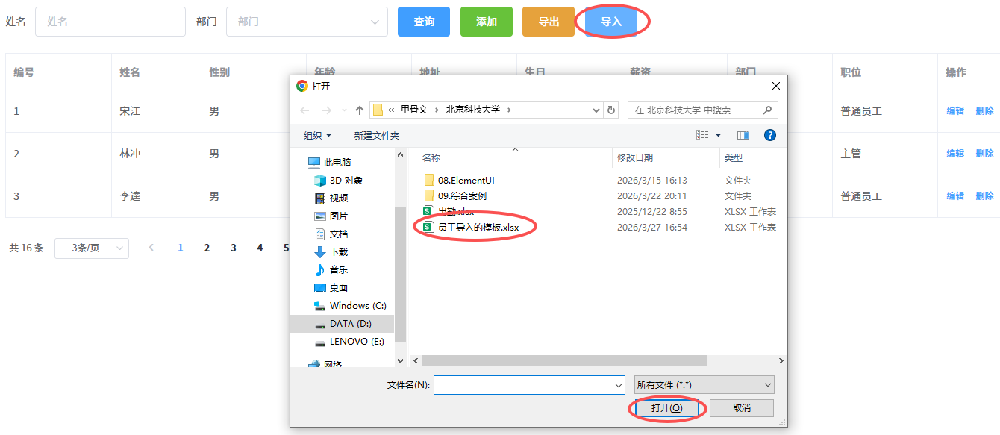

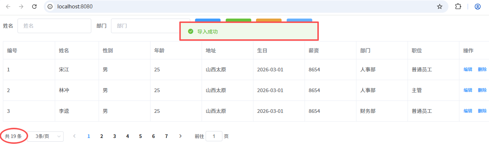

# 十二、数据统计
参考：[https://lib.cccbs.net/js/echarts/2.2.1/doc/start.html](https://lib.cccbs.net/js/echarts/2.2.1/doc/start.html)

## 编写实体类代码
```java
package com.lhp.pojo;

import lombok.Data;

@Data
public class EmpDeptStats {

    private String dept;
    private int count;
}
```

## 编写 mapper 层代码
```java
public interface EmpMapper {
    
    List<EmpDeptStats> findEmpDeptStats();
```

```xml
<mapper namespace="com.lhp.mapper.EmpMapper">

    <select id="findEmpDeptStats" resultType="com.lhp.pojo.EmpDeptStats">
        select dept, count(*) count from emp group by dept
    </select>
```

## 编写 service 层代码
```java
public interface EmpService {
    
    List<EmpDeptStats> findEmpDeptStats();
```

```java
@Service
public class EmpServiceImpl implements EmpService {

    @Autowired
    private EmpMapper empMapper;

    @Override
    public List<EmpDeptStats> findEmpDeptStats() {
        return empMapper.findEmpDeptStats();
    }
```

## 编写 controller 层代码
```java
@RestController
@RequestMapping("/emp")
public class EmpController {

    @Autowired
    private EmpService empService;

    @GetMapping("/findEmpDeptStats")
    public List<EmpDeptStats> findEmpDeptStats(){
        return empService.findEmpDeptStats();
    }
```

## 编写页面代码
```html
<!DOCTYPE html>
<html lang="en">
<head>
    <meta charset="UTF-8">
    <title>Title</title>
    <script src="vue.min.js"></script>
    <script src="axios.min.js"></script>
    <link rel="stylesheet" href="index.css">
    <script src="index.js"></script>
    <script src="echarts.min.js"></script>
</head>
<body>
    <div id="app">

        <el-form :inline="true" class="demo-form-inline">
            <el-form-item label="姓名">
                <el-input v-model="name" placeholder="姓名"></el-input>
            </el-form-item>
            <el-form-item label="部门">
                <el-select clearable v-model="dept" placeholder="部门">
                    <el-option label="人事部" value="人事部"></el-option>
                    <el-option label="财务部" value="财务部"></el-option>
                    <el-option label="开发部" value="开发部"></el-option>
                </el-select>
            </el-form-item>
            <el-form-item>
                <el-button type="primary" @click="findEmp">查询</el-button>
            </el-form-item>

            <el-form-item>
                <el-button type="success" @click="saveFlag = true">添加</el-button>
            </el-form-item>

            <el-form-item>
                <el-button type="warning" @click="exportEmp">导出</el-button>
            </el-form-item>

            <el-form-item>
                <el-upload
                        class="upload-demo"
                        action="http://localhost:8080/emp/importEmp"
                        :on-success="handleSuccess"
                        :show-file-list="false">
                    <el-button type="primary">导入</el-button>
                </el-upload>
            </el-form-item>

            <el-form-item>
                <el-button type="danger" @click="findEmpDeptStats">部门人数统计</el-button>
            </el-form-item>
        </el-form>

        <el-table
                :data="emps"
                border
                style="width: 100%">
            <el-table-column
                    prop="id"
                    label="编号">
            </el-table-column>
            <el-table-column
                    prop="name"
                    label="姓名"
                    width="120">
            </el-table-column>
            <el-table-column
                    prop="sex"
                    label="性别">
            </el-table-column>
            <el-table-column
                    prop="age"
                    label="年龄">
            </el-table-column>
            <el-table-column
                    prop="address"
                    label="地址">
            </el-table-column>
            <el-table-column
                    prop="birthday"
                    label="生日">
            </el-table-column>
            <el-table-column
                    prop="salary"
                    label="薪资">
            </el-table-column>
            <el-table-column
                    prop="dept"
                    label="部门">
            </el-table-column>
            <el-table-column
                    prop="position"
                    label="职位">
            </el-table-column>
            <el-table-column
                    fixed="right"
                    label="操作"
                    width="100">
                <template slot-scope="scope">
                    <el-button type="text" size="small" @click="toUpdate(scope.row)">编辑</el-button>
                    <el-button @click="deleteEmp(scope.row)" type="text" size="small">删除</el-button>
                </template>
            </el-table-column>
        </el-table>

        <br>

        <el-pagination
                @size-change="handleSizeChange"
                @current-change="handleCurrentChange"
                :current-page="pageNum"
                :page-sizes="[2, 3, 4, 5]"
                :page-size="pageSize"
                layout="total, sizes, prev, pager, next, jumper"
                :total="total">
        </el-pagination>

        <el-dialog title="添加员工" :visible.sync="saveFlag">
            <el-form ref="form" :model="emp" label-width="80px">
                <el-form-item label="员工姓名">
                    <el-input v-model="emp.name"></el-input>
                </el-form-item>

                <el-form-item label="员工性别">
                    <el-radio-group v-model="emp.sex">
                        <el-radio label="男">男</el-radio>
                        <el-radio label="女">女</el-radio>
                    </el-radio-group>
                </el-form-item>

                <el-form-item label="员工年龄">
                    <el-input v-model="emp.age"></el-input>
                </el-form-item>

                <el-form-item label="出生地址">
                    <el-input v-model="emp.address"></el-input>
                </el-form-item>

                <el-form-item label="出生日期">
                    <el-col :span="11">
                        <el-date-picker type="date" placeholder="选择日期" v-model="emp.birthday" style="width: 100%;"></el-date-picker>
                    </el-col>
                </el-form-item>

                <el-form-item label="薪资待遇">
                    <el-input v-model="emp.salary"></el-input>
                </el-form-item>

                <el-form-item label="所属部门">
                    <el-select v-model="emp.dept" placeholder="请选择部门">
                        <el-option label="人事部" value="人事部"></el-option>
                        <el-option label="财务部" value="财务部"></el-option>
                        <el-option label="开发部" value="开发部"></el-option>
                    </el-select>
                </el-form-item>

                <el-form-item label="所属职位">
                    <el-select v-model="emp.position" placeholder="请选择职位">
                        <el-option label="普通员工" value="普通员工"></el-option>
                        <el-option label="主管" value="主管"></el-option>
                        <el-option label="经理" value="经理"></el-option>
                    </el-select>
                </el-form-item>
            </el-form>
            <div slot="footer" class="dialog-footer">
                <el-button @click="saveFlag = false">取 消</el-button>
                <el-button type="primary" @click="addEmp">确 定</el-button>
            </div>
        </el-dialog>

        <el-dialog title="编辑员工" :visible.sync="updateFlag">
            <el-form ref="form" :model="emp" label-width="80px">
                <el-form-item label="员工姓名">
                    <el-input v-model="emp.name"></el-input>
                </el-form-item>

                <el-form-item label="员工性别">
                    <el-radio-group v-model="emp.sex">
                        <el-radio label="男">男</el-radio>
                        <el-radio label="女">女</el-radio>
                    </el-radio-group>
                </el-form-item>

                <el-form-item label="员工年龄">
                    <el-input v-model="emp.age"></el-input>
                </el-form-item>

                <el-form-item label="出生地址">
                    <el-input v-model="emp.address"></el-input>
                </el-form-item>

                <el-form-item label="出生日期">
                    <el-col :span="11">
                        <el-date-picker type="date" placeholder="选择日期" v-model="emp.birthday" style="width: 100%;"></el-date-picker>
                    </el-col>
                </el-form-item>

                <el-form-item label="薪资待遇">
                    <el-input v-model="emp.salary"></el-input>
                </el-form-item>

                <el-form-item label="所属部门">
                    <el-select v-model="emp.dept" placeholder="请选择部门">
                        <el-option label="人事部" value="人事部"></el-option>
                        <el-option label="财务部" value="财务部"></el-option>
                        <el-option label="开发部" value="开发部"></el-option>
                    </el-select>
                </el-form-item>

                <el-form-item label="所属职位">
                    <el-select v-model="emp.position" placeholder="请选择职位">
                        <el-option label="普通员工" value="普通员工"></el-option>
                        <el-option label="主管" value="主管"></el-option>
                        <el-option label="经理" value="经理"></el-option>
                    </el-select>
                </el-form-item>
            </el-form>
            <div slot="footer" class="dialog-footer">
                <el-button @click="updateFlag = false">取 消</el-button>
                <el-button type="primary" @click="updateEmp">确 定</el-button>
            </div>
        </el-dialog>

        <el-dialog
                title="部门人数统计"
                :visible.sync="empDeptStatsFlag"
                width="60%">
            <!-- 为ECharts准备一个具备大小（宽高）的Dom -->
            <div id="main" style="height:400px"></div>
        </el-dialog>
    </div>

    <script>
        new Vue({
            el: '#app',
            data: {
                emps: [],
                name: '',
                dept: '',
                saveFlag: false,
                emp: {},
                updateFlag: false,
                pageNum: 1,
                pageSize: 3,
                total: 0,
                empDeptStatsFlag: false
            },
            created(){
                this.findEmp()
            },
            methods: {
                findEmp(){
                    console.log(axios)
                    axios.get('emp/findEmp?name='+this.name+'&dept='+this.dept+'&pageNum='+this.pageNum+'&pageSize='+this.pageSize).then(res => {
                        console.log(res)
                        this.emps = res.data.list
                        this.total = res.data.total
                    })
                },

                handleSizeChange(val) {
                    console.log(`每页 ${val} 条`);
                    this.pageSize = val
                    this.pageNum = 1
                    this.findEmp()
                },

                handleCurrentChange(val) {
                    console.log(`当前页: ${val}`);
                    this.pageNum = val
                    this.findEmp()
                },

                addEmp(){
                    axios.post('emp/addEmp', this.emp).then(res => {
                        this.saveFlag = false
                        this.$message({
                            message: '添加成功',
                            type: 'success'
                        });
                        this.emp = {}
                        this.findEmp()
                    })
                },

                toUpdate(row){
                    this.emp = row
                    this.updateFlag = true
                },

                updateEmp(){
                    axios.post('emp/updateEmp', this.emp).then(res => {
                        this.updateFlag = false
                        this.$message({
                            message: '修改成功',
                            type: 'success'
                        });
                        this.emp = {}
                        this.findEmp()
                    })
                },

                deleteEmp(row){
                    this.$confirm('确定要删除'+row.name+'吗?', '提示', {
                        confirmButtonText: '确定',
                        cancelButtonText: '取消',
                        type: 'warning'
                    }).then(() => {
                        axios.get('emp/deleteEmp?id='+row.id).then(res => {
                            this.$message({
                                message: '删除成功',
                                type: 'success'
                            });
                            this.findEmp()
                        })
                    }).catch(() => {
                        this.$message({
                            type: 'info',
                            message: '已取消删除'
                        });
                    });
                },

                exportEmp(){
                    axios.get('emp/exportEmp').then(res => {
                        this.$message({
                            message: '导出成功，路径是：' + res.data,
                            type: 'success'
                        });
                    })
                },

                handleSuccess(res, file) {
                    this.$message({
                        message: '导入成功',
                        type: 'success'
                    });
                    this.findEmp()
                },

                findEmpDeptStats(){
                    axios.get('emp/findEmpDeptStats').then(res => {
                        this.empDeptStatsFlag = true
                        console.log(res.data)

                        // 横轴是部门名称
                        // 纵轴是人数
                        var depts = []
                        var counts = []
                        for(var i = 0; i < res.data.length; i++){
                            depts[i] = res.data[i].dept
                            counts[i] = res.data[i].count
                        }

                        console.log("depts:", depts)
                        console.log("counts:", counts)

                        // 该方法是确保对话框都显示完成后，再执行里面的代码
                        this.$nextTick(() => {
                            // 基于准备好的dom，初始化echarts图表
                            console.log(document.getElementById('main'))
                            var myChart = echarts.init(document.getElementById('main'));
                            var option = {
                                tooltip: {
                                    show: true
                                },
                                legend: {
                                    data:['人数']
                                },
                                xAxis : [
                                    {
                                        type : 'category',
                                        data : depts
                                    }
                                ],
                                yAxis : [
                                    {
                                        type : 'value'
                                    }
                                ],
                                series : [
                                    {
                                        "name":"人数",
                                        "type":"bar",
                                        "data":counts
                                    }
                                ]
                            };

                            // 为echarts对象加载数据
                            myChart.setOption(option);
                        })
                    })
                }
            }
        })
    </script>
</body>
</html>
```

## 启动测试
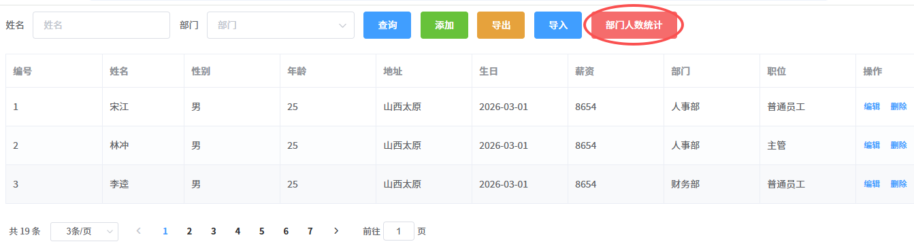

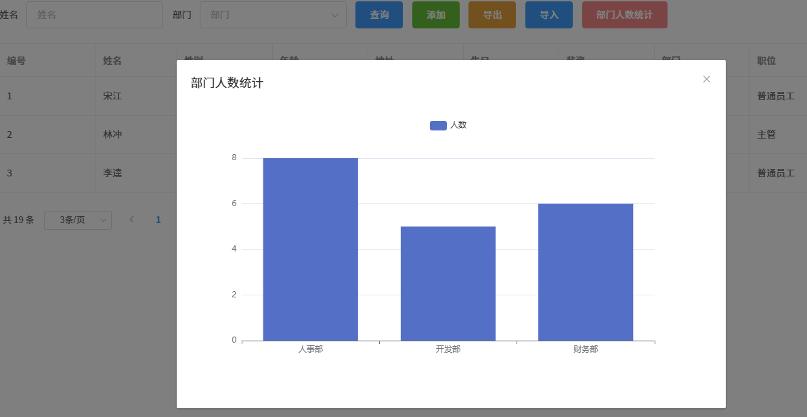

# 十三、表单校验--扩展
## 说明
目前，我们在添加一个员工时，如果用户没有输入员工的名字、生日等信息，直接就点击了保存按钮，则会给数据库添加一条空信息的数据！不合适！

我们应该在用户点击保存按钮的时候，对一些员工信息进行校验，比如：名字必须输入、生日必须选择一个日期、部门必须选择一个等等！

解决办法：

可以通过 ElementUI 中提供的表单校验来解决！

## 修改前端页面
```html
<!DOCTYPE html>
<html lang="en">
<head>
    <meta charset="UTF-8">
    <title>Title</title>

    <script src="vue.min.js"></script>
    <script src="axios.min.js"></script>
    <link rel="stylesheet" href="index.css">
    <script src="index.js"></script>
    <script src="echarts.min.js"></script>
</head>
<body>
    <div id="app">

        <el-form :inline="true" class="demo-form-inline">
            <el-form-item label="姓名">
                <el-input v-model="name" placeholder="姓名"></el-input>
            </el-form-item>
            <el-form-item label="部门">
                <el-select v-model="dept" clearable  placeholder="部门">
                    <el-option label="人事部" value="人事部"></el-option>
                    <el-option label="财务部" value="财务部"></el-option>
                    <el-option label="开发部" value="开发部"></el-option>
                </el-select>
            </el-form-item>
            <el-form-item>
                <el-button type="primary" @click="findEmp">查询</el-button>
            </el-form-item>

            <el-form-item>
                <el-button type="success" @click="toAdd">添加</el-button>
            </el-form-item>

            <el-form-item>
                <el-button type="danger" @click="exportEmp">导出员工</el-button>
            </el-form-item>

            <el-form-item>
                <el-upload
                        class="upload-demo"
                        :show-file-list="false"
                        :on-success="handleSuccess"
                        action="http://localhost:8080/emp/importEmp">
                    <el-button type="primary">导入员工</el-button>
                </el-upload>
            </el-form-item>

            <el-form-item>
                <el-button type="danger" @click="findEmpDeptStats">部门人数统计</el-button>
            </el-form-item>
        </el-form>

        <el-table
                :data="emps"
                border
                style="width: 100%">
            <el-table-column
                    type="index"
                    width="100"
                    label="编号">
            </el-table-column>
            <el-table-column
                    prop="name"
                    label="姓名">
            </el-table-column>
            <el-table-column
                    prop="sex"
                    label="性别">
            </el-table-column>
            <el-table-column
                    prop="age"
                    label="年龄">
            </el-table-column>
            <el-table-column
                    prop="address"
                    label="地址">
            </el-table-column>
            <el-table-column
                    prop="birthday"
                    label="生日">
            </el-table-column>
            <el-table-column
                    prop="salary"
                    label="薪资">
            </el-table-column>
            <el-table-column
                    prop="position"
                    label="职位">
            </el-table-column>
            <el-table-column
                    prop="dept"
                    label="部门">
            </el-table-column>
            <el-table-column
                    fixed="right"
                    label="操作"
                    width="200">
                <template slot-scope="scope">
                    <el-button @click="deleteEmp(scope.row)" type="warning" size="small">删除</el-button>
                    <el-button @click="toUpdate(scope.row)" type="info" size="small">编辑</el-button>
                </template>
            </el-table-column>
        </el-table>

        <el-pagination
                @size-change="handleSizeChange"
                @current-change="handleCurrentChange"
                :current-page="pageNum"
                :page-sizes="[3, 5, 6, 8]"
                :page-size="pageSize"
                layout="total, sizes, prev, pager, next, jumper"
                :total="total">
        </el-pagination>

        <el-dialog
                title="添加员工"
                :visible.sync="addFlag"
                width="60%"
                :before-close="handleClose">
            <el-form ref="form" :rules="rules" :model="emp" label-width="80px">
                <el-form-item label="姓名" prop="name">
                    <el-input v-model="emp.name"></el-input>
                </el-form-item>

                <el-form-item label="性别">
                    <el-radio-group v-model="emp.sex">
                        <el-radio label="男"></el-radio>
                        <el-radio label="女"></el-radio>
                    </el-radio-group>
                </el-form-item>

                <el-form-item label="年龄">
                    <el-input v-model="emp.age"></el-input>
                </el-form-item>

                <el-form-item label="地址">
                    <el-input v-model="emp.address"></el-input>
                </el-form-item>

                <el-form-item label="生日" prop="birthday">
                    <el-col :span="11">
                        <el-date-picker type="date" placeholder="选择日期" v-model="emp.birthday" style="width: 100%;"></el-date-picker>
                    </el-col>
                </el-form-item>

                <el-form-item label="薪资">
                    <el-input v-model="emp.salary"></el-input>
                </el-form-item>

                <el-form-item label="职位">
                    <el-select v-model="emp.position" placeholder="请选择职位">
                        <el-option label="普通员工" value="普通员工"></el-option>
                        <el-option label="主管" value="主管"></el-option>
                        <el-option label="经理" value="经理"></el-option>
                    </el-select>
                </el-form-item>

                <el-form-item label="部门" prop="dept">
                    <el-select v-model="emp.dept" placeholder="请选择部门">
                        <el-option label="人事部" value="人事部"></el-option>
                        <el-option label="财务部" value="财务部"></el-option>
                        <el-option label="开发部" value="开发部"></el-option>
                    </el-select>
                </el-form-item>
            </el-form>

            <span slot="footer" class="dialog-footer">
                <el-button @click="addFlag = false">取 消</el-button>
                <el-button type="primary" @click="addEmp">确 定</el-button>
            </span>
        </el-dialog>

        <el-dialog
                title="修改员工"
                :visible.sync="updateFlag"
                width="60%"
                :before-close="handleClose">
            <el-form ref="form" :model="emp" label-width="80px">
                <el-form-item label="姓名">
                    <el-input v-model="emp.name"></el-input>
                </el-form-item>

                <el-form-item label="性别">
                    <el-radio-group v-model="emp.sex">
                        <el-radio label="男"></el-radio>
                        <el-radio label="女"></el-radio>
                    </el-radio-group>
                </el-form-item>

                <el-form-item label="年龄">
                    <el-input v-model="emp.age"></el-input>
                </el-form-item>

                <el-form-item label="地址">
                    <el-input v-model="emp.address"></el-input>
                </el-form-item>

                <el-form-item label="生日">
                    <el-col :span="11">
                        <el-date-picker type="date" placeholder="选择日期" v-model="emp.birthday" style="width: 100%;"></el-date-picker>
                    </el-col>
                </el-form-item>

                <el-form-item label="薪资">
                    <el-input v-model="emp.salary"></el-input>
                </el-form-item>

                <el-form-item label="职位">
                    <el-select v-model="emp.position" placeholder="请选择职位">
                        <el-option label="普通员工" value="普通员工"></el-option>
                        <el-option label="主管" value="主管"></el-option>
                        <el-option label="经理" value="经理"></el-option>
                    </el-select>
                </el-form-item>

                <el-form-item label="部门">
                    <el-select v-model="emp.dept" placeholder="请选择部门">
                        <el-option label="人事部" value="人事部"></el-option>
                        <el-option label="财务部" value="财务部"></el-option>
                        <el-option label="开发部" value="开发部"></el-option>
                    </el-select>
                </el-form-item>
            </el-form>

            <span slot="footer" class="dialog-footer">
                <el-button @click="updateFlag = false">取 消</el-button>
                <el-button type="primary" @click="updateEmp">确 定</el-button>
            </span>
        </el-dialog>

        <el-dialog
                title="部门人数统计"
                :visible.sync="empDeptStatsFlag"
                width="50%">
            <!-- 为ECharts准备一个具备大小（宽高）的Dom -->
            <div id="main" style="height:400px"></div>
        </el-dialog>
    </div>

    <script>
        new Vue({
            el: '#app',
            data: { // 自定义变量
                emps: [],
                name: '',
                dept: '',
                addFlag: false,
                emp: {},
                updateFlag: false,
                pageNum: 1, // 第几页
                pageSize: 3, // 每页显示多少条
                total: 0, // 总条数
                empDeptStatsFlag: false,
                rules: { // 定义表单校验规则
                    name: [
                        { required: true, message: '请输入员工姓名', trigger: 'blur' },
                        { min: 2, max: 30, message: '长度在 2 到 30 个中文字符', trigger: 'blur' }
                    ],
                    birthday: [
                        { type: 'date', required: true, message: '请选择生日日期', trigger: 'change' }
                    ],
                    dept: [
                        { required: true, message: '请选择部门', trigger: 'change' }
                    ]
                }
            },
            created(){
                this.findEmp()
            },
            methods: {
                findEmp(){
                    axios.get('emp/findEmp?name='+this.name+'&dept='+this.dept+'&pageNum='+this.pageNum+'&pageSize='+this.pageSize).then(res => {
                        this.emps = res.data.list
                        this.total = res.data.total
                    })
                },

                handleSizeChange(val) {
                    console.log(`每页 ${val} 条`);
                    this.pageSize = val
                    this.findEmp()
                },

                handleCurrentChange(val) {
                    this.pageNum = val
                    this.findEmp()
                },

                toAdd(){
                    // 弹出对话框
                    this.addFlag = true
                },

                handleClose(done) {
                    this.$confirm('确认关闭？')
                        .then(_ => {
                            done();
                        })
                        .catch(_ => {});
                },

                addEmp(){

                    this.$refs['form'].validate((valid) => {
                        if (valid) {
                            axios.post('emp/addEmp', this.emp).then(res => {

                                // 关闭对话框
                                this.addFlag = false

                                this.emp = {}

                                // 提示成功
                                this.$message('添加员工成功！');
                                // 再次执行一遍查询员工的方法
                                this.findEmp()
                            })
                        } else {
                            return false;
                        }
                    });
                },

                toUpdate(row){
                    this.emp = row
                    this.updateFlag = true
                },

                updateEmp(){
                    axios.post('emp/updateEmp', this.emp).then(res => {
                        // 关闭对话框
                        this.updateFlag = false

                        this.emp = {}

                        // 提示成功
                        this.$message('修改员工成功！');
                        // 再次执行一遍查询员工的方法
                        this.findEmp()
                    })
                },

                deleteEmp(row){

                    this.$confirm('确定要删除【'+row.name+'】吗?', '提示', {
                        confirmButtonText: '确定',
                        cancelButtonText: '取消',
                        type: 'warning'
                    }).then(() => {

                        axios.get('emp/deleteEmp?id='+row.id).then(res => {
                            this.findEmp()
                        })

                        this.$message({
                            type: 'success',
                            message: '删除成功!'
                        });
                    }).catch(() => {
                        this.$message({
                            type: 'info',
                            message: '已取消删除'
                        });
                    });
                },

                exportEmp(){
                    axios.get('emp/exportEmp').then(res => {
                        this.$message({
                            message: '导出员工信息成功，导出路径为：' + res.data,
                            type: 'success'
                        });
                    })
                },

                handleSuccess(res, file) {
                    this.$message({
                        message: '导入员工信息成功！',
                        type: 'success'
                    });
                    this.findEmp()
                },

                findEmpDeptStats(){
                    axios.get('emp/findEmpDeptStats').then(res => {
                        // 获取到后端返回统计数据 [{"dept":"人事部", count: 3},{"dept":"人事部", count: 3},{"dept":"人事部", count: 3}]
                        // res.data

                        var depts = []
                        var counts = []

                        // 循环后端返回的数据，将结果进行处理
                        for(var i = 0; i < res.data.length; i++){
                            depts[i] = res.data[i].dept
                            counts[i] = res.data[i].count
                        }

                        // 显示对话框
                        this.empDeptStatsFlag = true

                        // 下面代码要等到浏览器中将要显示的对话框都显示出来之后才能执行
                        this.$nextTick(() => {
                            // 基于准备好的dom，初始化echarts图表
                            var myChart = echarts.init(document.getElementById('main'));

                            var option = {
                                tooltip: {
                                    show: true
                                },
                                legend: {
                                    data:['人数']
                                },
                                xAxis : [
                                    {
                                        type : 'category',
                                        data : depts
                                    }
                                ],
                                yAxis : [
                                    {
                                        type : 'value'
                                    }
                                ],
                                series : [
                                    {
                                        "name":"人数",
                                        "type":"bar",
                                        "data":counts
                                    }
                                ]
                            };

                            // 为echarts对象加载数据
                            myChart.setOption(option);
                        })
                    })
                }
            }
        })
    </script>
</body>
</html>
```

# 十四、Git 的使用
## 团队开发
在实际工作中，我们都是一个团队在完成项目的开发，每个成员负责项目中的一部分模块。每个人将自己的模块开发完后，需要将团队所有成员的代码给整合起来。

在这个过程中，会涉及到如下**问题：**

1. 什么时候进行代码的整合

2. 怎样进行代码的整合，并且整合后怎样将代码同步给所有团队成员

3. 怎样有选择性的将我们本地部分开发好的功能和其他成员的代码整合起来，并且如果整合后有问题的话，还可以回退到之前的状态

解决：

**我们就是需要一款管理代码的软件 + 能够存储代码的公共空间。**

该软件具备如下特点：

1. 管理本地代码

2. 管理公共空间的代码

3. 能够实现代码的整合和回退

那这款工具其实就是我们要学习的版本控制工具。常见的有：SVN 和 <font style="background-color:rgb(255,255,0);">Git </font>等。

## **<font style="color:rgb(0,0,0);">Git 介绍</font>**
Git 是一个免费的、开源的分布式版本控制系统，可以快速高效地处理从小型到大型的项目。

本质：项目开发的管理工具，使用 Git 可以方便的完成团队的协作开发。以及项目开发过程中的代码管理。实现团队协作时候的资源共享。

## Git 安装


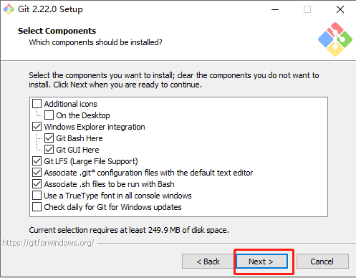

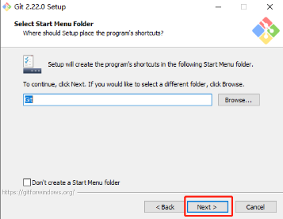


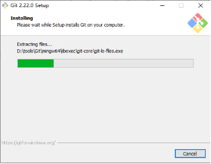

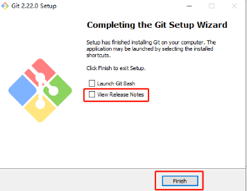

## 设置签名
+ 形式
    - 用户名：lihupeng
    - email 地址：[lihupeng@qq.com](mailto:lihupeng@qq.com)
+ 作用：区分不同开发人员的身份
+ 注意：这里设置的签名和登录远程仓库（代码托管中心）的账号、密码没有任何关系
+ 命令：
    - git config --global user.name lihupeng
    - git config --global user.email [lihupeng@qq.com](mailto:lihupeng@qq.com)

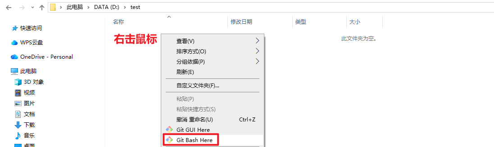


## 存储流程


1. 工作区、暂存区和本地仓库，说的其实都是我们本地电脑。

2. 我们可以在工作区创建文件写代码，写完后，该文件处于已修改状态（modified）。已修改状态就表明文件进行了修改，但还没有提交保存。

3. 使用命令git add 可以将处于 modified 状态的文件添加到暂存区，这时文件处于已暂存状态（staged）。已暂存状态就表示将已修改的文件放到了暂存区，下次提交代码时要提交它。

4. 使用命令 git commit 可以将暂存区的文件提交到本地仓库，这时文件处于已提交状态（commited）。已提交状态就表示该文件已经被保存在了本地仓库中，并且生成一个新的版本。

## <font style="color:rgb(0,0,0);">远程仓库操作（码云）</font>
github、gitee

### <font style="color:rgb(0,0,0);">注册码云账号</font>
网址：[https://gitee.com/](https://gitee.com/)

### 创建 SSH Key
我们之后要让本地电脑去远程连接服务器，服务器需要对我们的身份进行识别，SSH key 可以让本地电脑和码云之间建立安全的加密连接。

步骤如下：

1. 在 Git 窗口中运行命令 ssh-keygen -t rsa -C "lihupeng@qq.com"，会有三次提示输入，直接回车即可。
2. 在用户家目录下生成 .ssh 目录，里面有一个 id_rsa.pub 文件，保存的就是公钥。

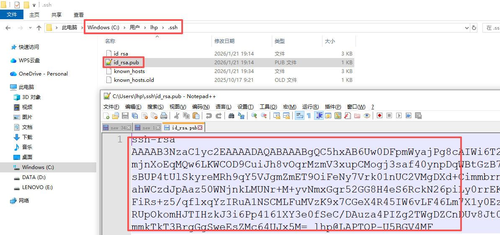

3. 登录码云，设置公钥：


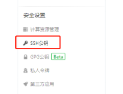

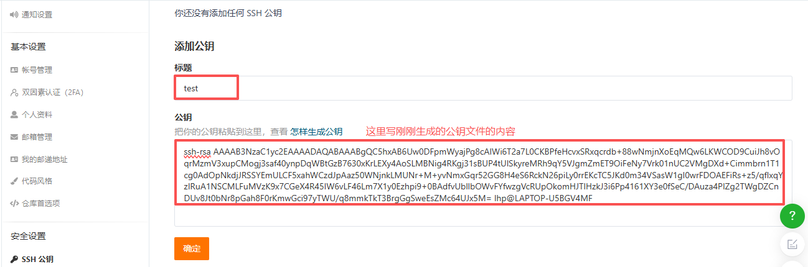

4. 验证 key 是否添加成功
+ 在 Git 窗口中，执行命令 ssh -T git@git.oschina.net 
+ Git 使用 SSH 连接第一次验证服务器的 key 时，需要你进行确认，此时输入 yes 回车即可。 
+ 再次执行 ssh -T git@git.oschina.net 

### <font style="color:rgb(0,0,0);">创建远程仓库</font>
目前我们已经在码云注册了账号了，就可以在码云上创建我们自己的一个仓库，然后拉取这个仓库中的代码或者往仓库中上传代码！

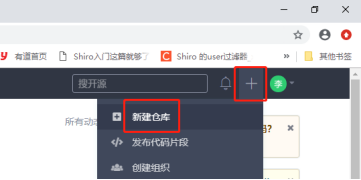

填写好仓库名称、公有/私有、语言，点击创建即可！

## <font style="color:rgb(0,0,0);">IDEA 中使用 Git</font>
### IDEA 和 Git 集成
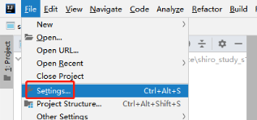


### <font style="color:rgb(0,0,0);">创建远程仓库</font>
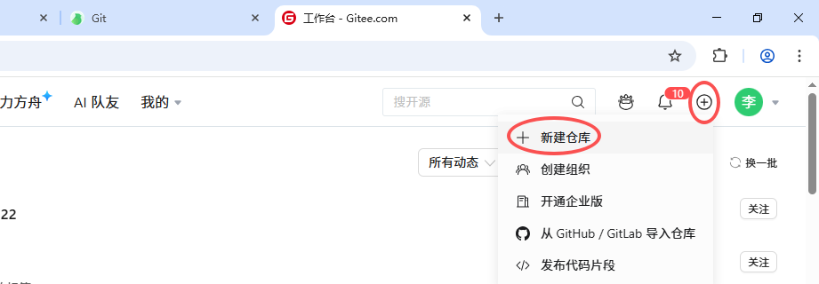

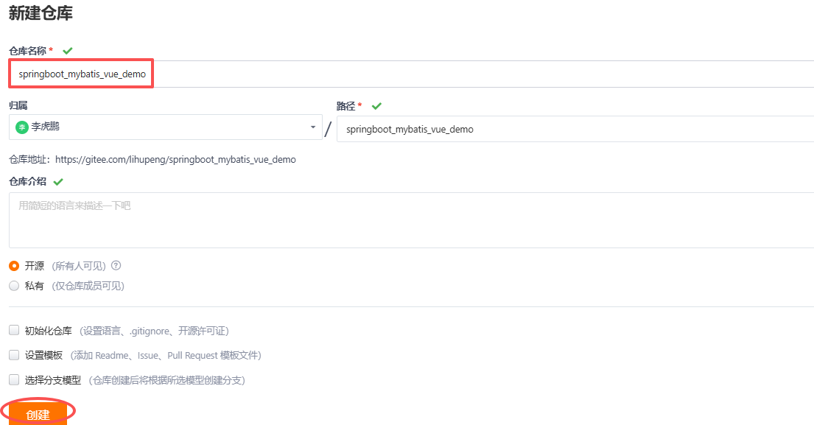

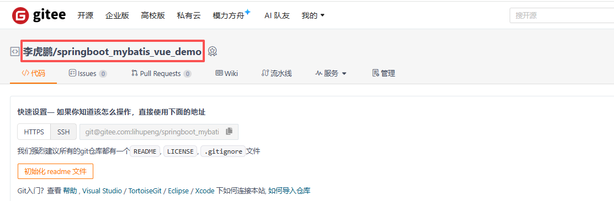

### <font style="color:rgb(0,0,0);">创建项目，搭建环境</font>
在 IDEA 中创建一个普通的 java 项目，然后创建个模块，将基本的开发环境给搭建好。

**<font style="background-color:#FBDE28;">我们就使用我们目前的项目即可！！！</font>**


### 设置当前项目为 Git 工作区
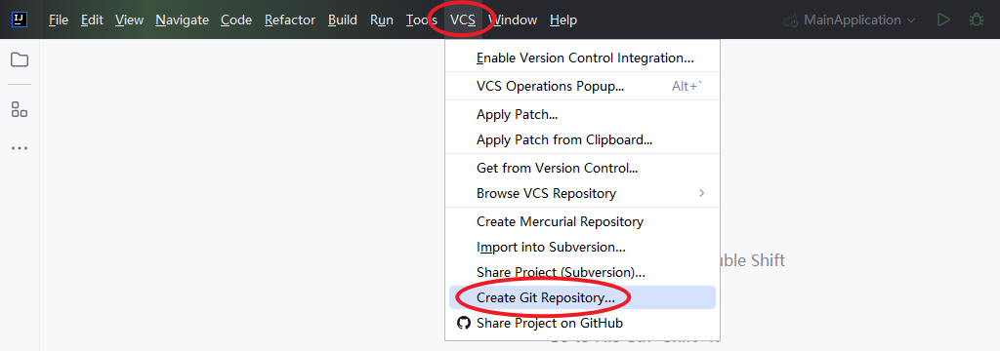

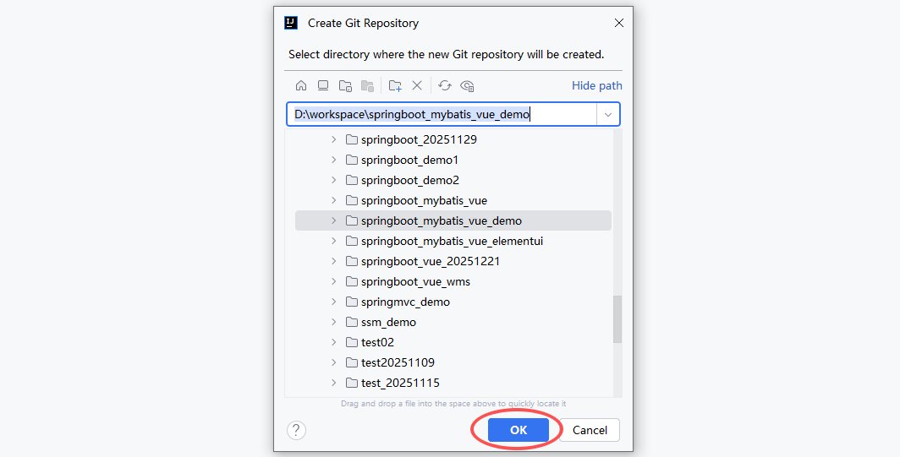

### 添加项目到暂存区
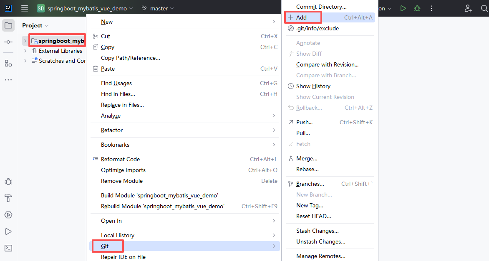

### 提交并推送
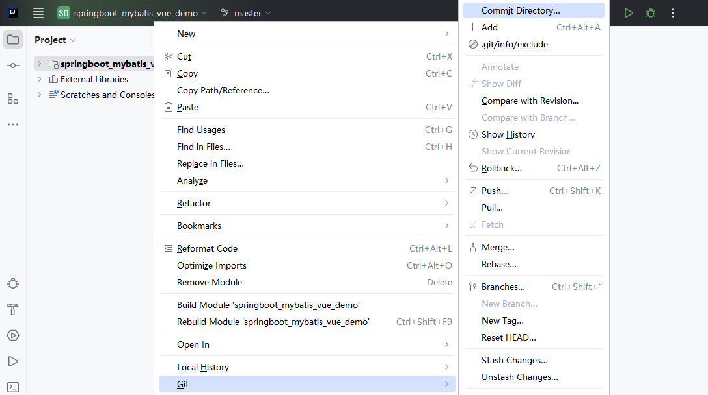

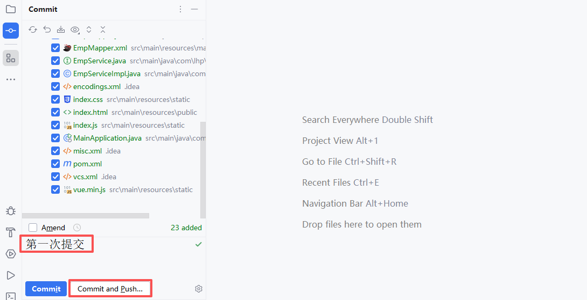

填写远程仓库的地址：

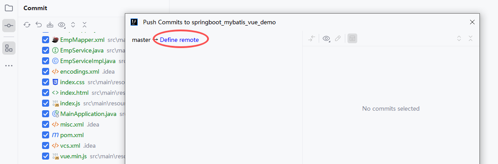

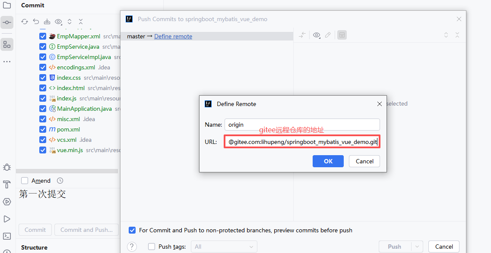

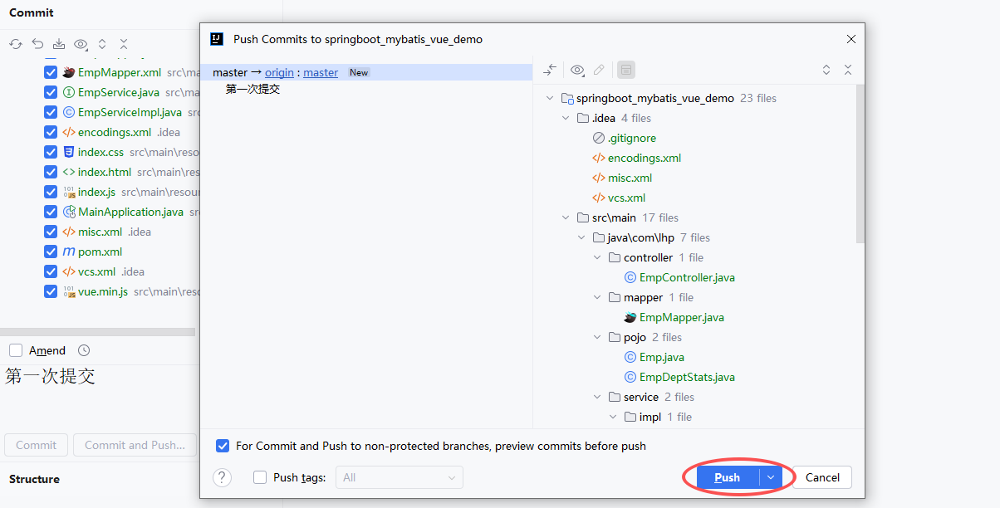

如果弹出对话框，需要输入账号密码的话，就输入自己 gitee 的账号和密码：


到此提交成功！！！

然后可以去远程仓库中查看，发现已经有了代码了！

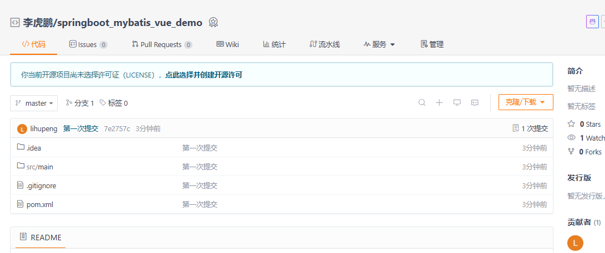

### IDEA 中从远程仓库克隆代码
刚加入到项目组的成员，需要从远程仓库中去获取完整的项目代码。操作如下：


### 提交并推送
以后我们自己新增或者修改了某个代码文件后，需要将本次操作提交到本地仓库然后推送到远程仓库：

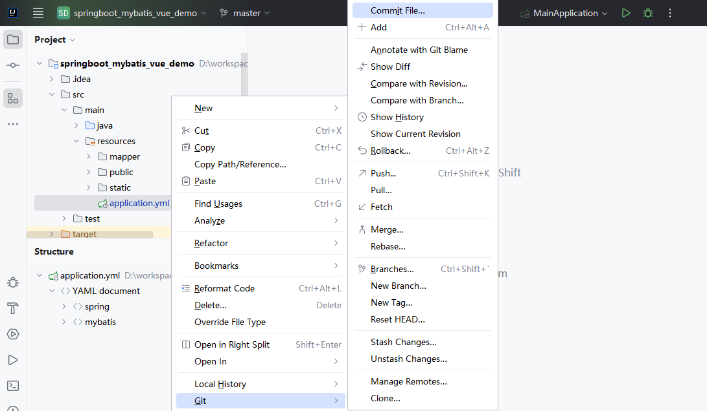

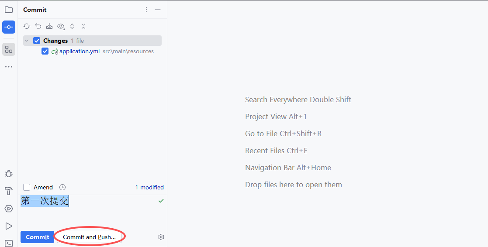

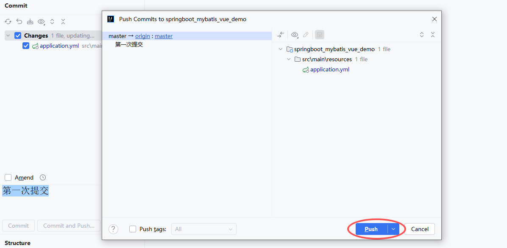

### 更新代码
第二天上班后，我们需要更新一下自己的代码。因为昨天可能有同事往远程仓库推送代码了！所以我们需要将远程仓库的代码更新到自己电脑上！

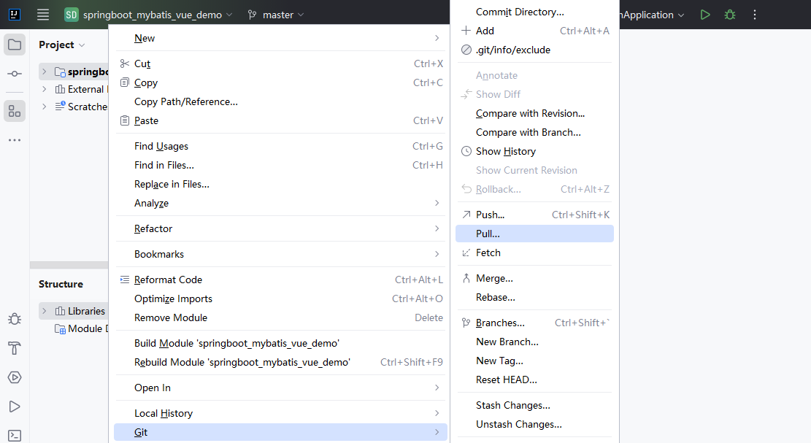

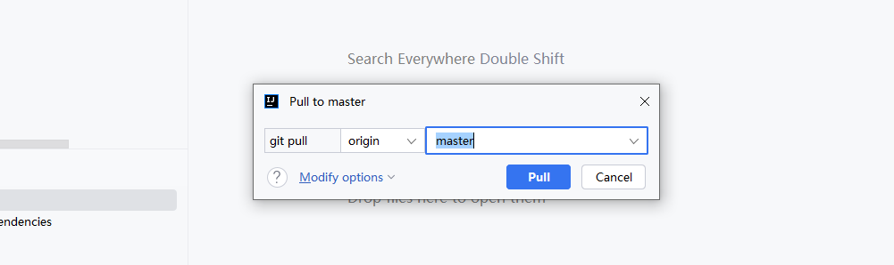

# 十五、提交的资料
需要大家提交本次实训的相关资料，资料如下：

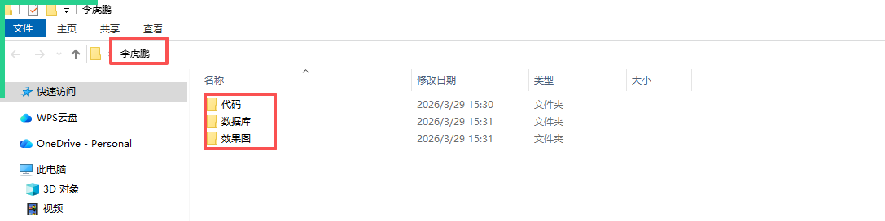

1. 以自己名字命名的文件夹
2. 代码文件夹中放置自己的项目代码
3. 数据库文件夹中放置自己项目数据库信息，导出方式如下：

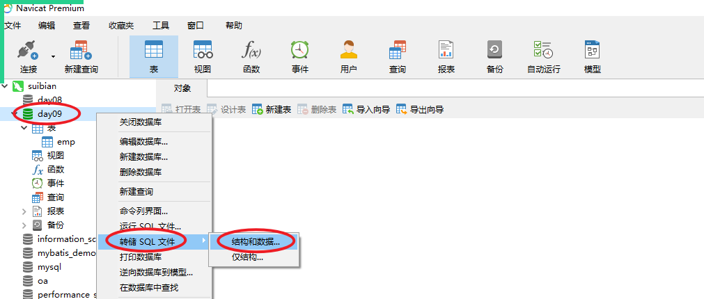

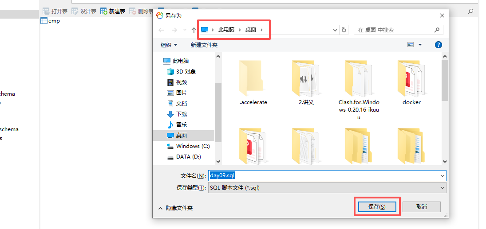

4. 效果图文件夹中放置自己项目运行效果截图，将截图命名好，比如：列表展示功能.png、条件查询功能.png、添加功能.png、修改功能.png、部门人数统计功能.png 等等
5. 最后，将整个文件夹打包，比如打包为：李虎鹏.zip 或者 李虎鹏.rar，然后发给老师或者发送到群里即可！


> 更新: 2026-03-29 15:47:46  
> 原文: <https://www.yuque.com/u41736172/az9urv/is2ed6qa8r9c55ex>