# 02.CentOS7系统部署

# 一、Linux系统概述

## 常见的操作系统

常见操作系统有：Windows、MacOS、Unix/Linux。 类UNIX

Windows：其是微软公司研发的收费操作系统（闭源）。

Windows 系统体系分为两类：用户操作系统、Server 操作系统。

用户操作系统：win 95、win 98、win NT、win Me、win xp、vista、win7、win8、win10。

MacOS：其是由苹果公司开发的一款收费（变相收费，买电脑送系统）操作系统。该系统从

终端角度来看分为：watch OS、IOS、MacOS。其表现突出的地方：底层优化实现的很好、安全性要更加高点（闭源）。

Linux：Linux 是目前全球使用量最多的服务器操作系统（开源）。其体系很强大，其分支有很多（数不胜数），其目前主要的分支有：RedHat（红帽）、CentOS、Debian、乌班图（ubuntu）等等。其在世界范围最大的使用分支是安卓。

## Linux的起源

**Linus(林纳斯·托瓦兹)**：Linux 的开发作者，被称为Linux 之父，Linux 诞生时是芬兰赫尔辛基大学的在校大学生。**Stallman 斯特曼**：开源文化的倡导人。

## Linux 的含义

狭义：由Linus 编写的一段内核代码。

广义：广义上的Linux 是指由Linux内核衍生的各种Linux发行版本。（CentOS、Ubuntu）

> 注意：以后提及到的Linux 都是广义上的Linux

## Linux发行版介绍

### RHEL

RHEL是Red Hat Enterprise Linux的缩写，是Red Hat公司的Linux系统。

### CentOS

CentOS（Community Enterprise Operating System，中文意思是：社区企业操作系统）是Linux发行版之一，它是来自于Red Hat Enterprise Linux依照开放源代码规定释出的源代码所编译而成。由于出自同样的源代码，因此有些要求高度稳定性的服务器以CentOS替代商业版的Red Hat Enterprise Linux使用。两者的不同，在于CentOS并不包含封闭源代码软件。

### Ubuntu

Ubuntu（友帮拓、优般图、乌班图）是一个以桌面应用为主的开源GNU/Linux操作系统，Ubuntu 是基于Debian GNU/Linux，支持x86、amd64（即x64）和ppc架构，由全球化的专业开发团队（Canonical Ltd）打造的。

### Debian

广义的Debian是指一个致力于创建自由操作系统的合作组织及其作品，由于Debian项目众多内核分支中以Linux宏内核为主，而且 Debian开发者所创建的操作系统中绝大部分基础工具来自于GNU工程 ，因此 “Debian” 常指Debian GNU/Linux。

# 二、Linux系统安装

## Linux系统安装方式

目前安装操作系统方式有2 种：真机安装、虚拟机安装。

真机安装：使用真实的电脑进行安装，像安装windows 操作系统一样，真机安装的结果就是替换掉当前的windows 操作系统；（缺点：对系统进行格式化，重新安装）

虚拟机安装：通过一些特定的手段，来进行模拟安装，并不会影响当前计算机的真实操作系统；

> 如果是学习或者测试使用，强烈建议使用虚拟机安装方式。

## 虚拟机概念

什么是虚拟机？

虚拟机，有些时候想模拟出一个真实的电脑环境，碍于使用真机安装代价太大，因此而诞生的一款可以模拟操作系统运行的软件。

虚拟机目前有2 个比较有名的产品：vmware 出品的vmware workstation、oracle 出品的virtual Box。

## 虚拟机软件的安装

第一步：复制VMware软件包到Windows系统中

第二步：双击VMware安装包，进行软件的安装

第三步：勾选软件的许可协议

第四步：设置VMware安装路径以及勾选增强型的键盘程序

第五步：用户体验设置

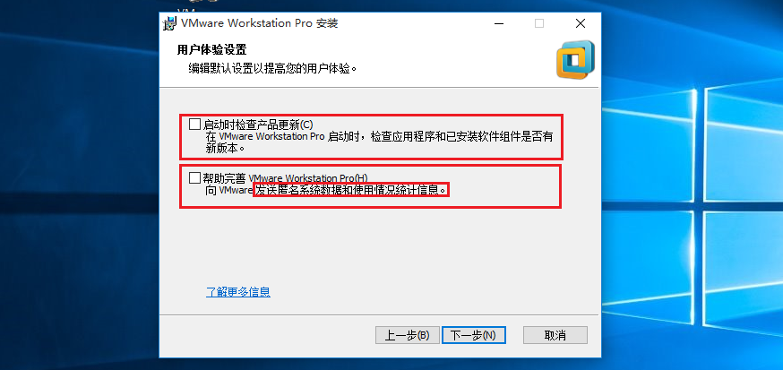

下一步、下一步，直到软件安装完成即可。

第六步：安装完成后，输入许可证密钥，破解VMware软件

输入密钥：<code>ZF3R0-FHED2-M80TY-8QYGC-NPKYF</code>

VMware17的密钥是：<code>MC60H-DWHD5-H80U9-6V85M-8280D</code>

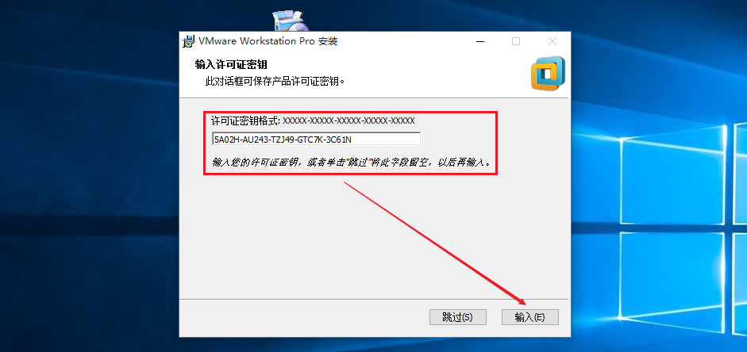

> 特别注意：VMware WorkStation安装完毕后，其在网络适配器中会产生两张虚拟网卡。
>
> VMnet1与VMnet8，如果没有产生这两张网卡，则操作系统必须重装！

## Linux系统环境部署

Linux系统版本选择：CentOS7.6 x64，【镜像一般都是CentOS\*.iso文件】

问题：为什么不选择最新版的10版本？

7.x 目前依然是主流

7.x 的各种系统操作模式是基础

第一步：创建新的虚拟机

第二步：选择自定义设置

第三步：选择稍后安装操作系统

第四步：选择要安装的操作系统类型

第五步：设置操作系统的名称与安装路径

第六步：CPU选择1颗2核

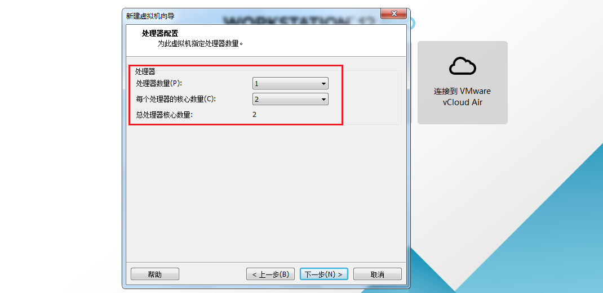

第七步：内存设置为2048MB（2GB）

第八步：设置网络模式为NAT模式（共享上网）

设置完毕后，下一步、下一步、下一步...直到虚拟机创建完成。

## 安装CentOS7.6操作系统(上)

第一步：选择CD/DVD光驱，如下图所示

第二步：选择CentOS7.6光盘文件（CentOS-7.6-x86\_64-DVD-1810.iso，不需要解压）

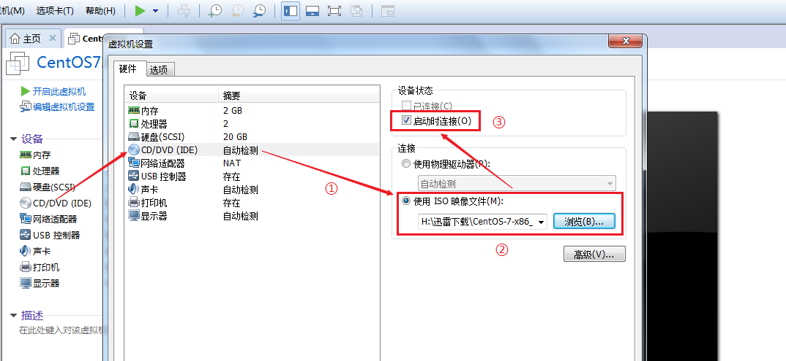

第三步：启动CentOS7.6操作系统光盘镜像

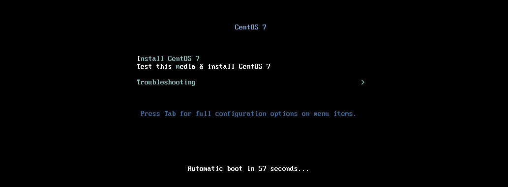

使用方向键向上移动到第一个菜单

回车，进入安装菜单

再次按回车，进入到CentOS7.6的安装界面。 ctrl + alt 可以释放鼠标！

## 安装CentOS7.6操作系统(中)

第一步：选择安装时使用的语言（全英文）

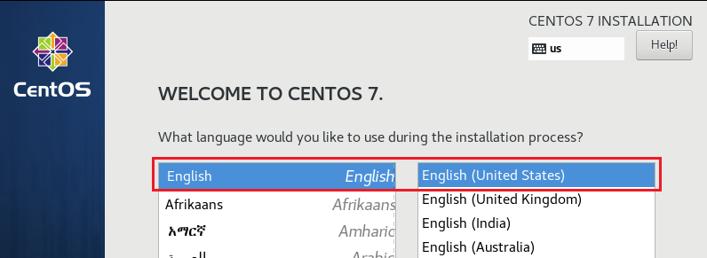

第二步：设置时间 => 亚洲/上海 => Asia/Shanghai

第三步：选择安装系统界面以及需要安装的软件（非常重要）

第四步：自动分区

由于还没有学习过Linux的分区技术，所以我们暂时选择自动分区。

第五步：连接网络

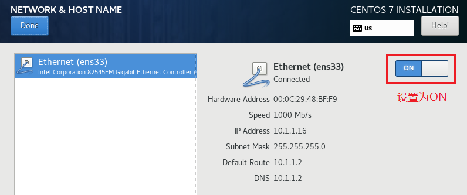

第六步：给root管理员设置密码以及创建一个普通的用户

root账号默认已经存在，但是没有密码，需要人为设置。设置完成后，还需要创建一个普通的账号如lhp。

> root密码：123456，超级管理员，实际工作中越复杂越好
>
> lhp密码：123456，普通账号

## 安装CentOS7.6操作系统(下)

第一步：安装完成后，单击Reboot按钮，重启计算机

第二步：选择同意CentOS7授权

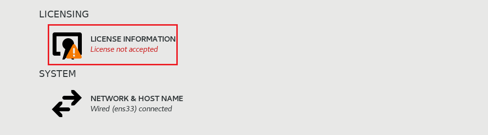

第三步：勾选同意以上许可协议

设置完成后，单击完成配置，到此CentOS7.6就全部安装完成了！

# 三、给CentOS7操作系统拍摄快照

## 什么是快照

快照可以理解就是一个快速的备份操作。

为什么要拍摄快照：就是为了做一个系统的备份，防止小伙伴们误操作，导致系统不可用。

## VMware实现快照

第一步：选择虚拟机=>快照=>拍摄快照

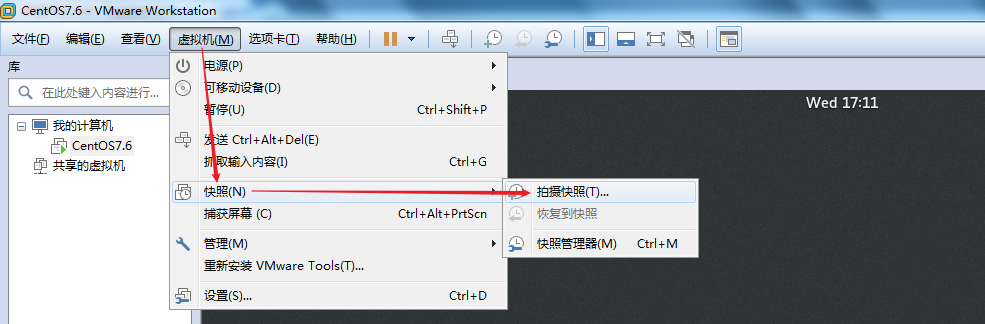

第二步：设置快照的名称

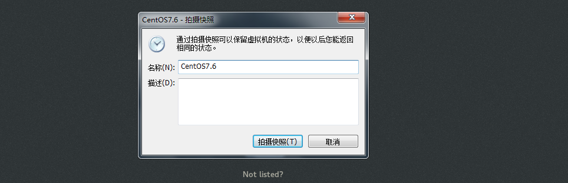

设置完成后，单击拍摄快照，一闪，备份完成。

## 恢复快照

当有一天，我们的Linux系统不小心损坏了，不用单击。单击虚拟机菜单=>快照=>恢复到快照即可立即恢复。

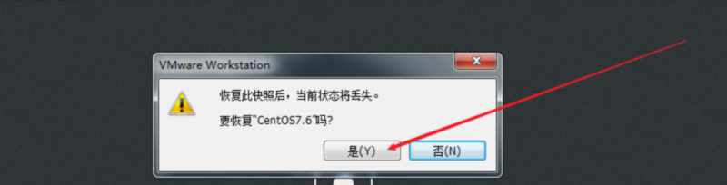

## 问题

有些同学的VMware不支持在虚拟机处于开机的情况下拍摄快照！

解决办法：

将虚拟机给关闭，然后拍摄快照！

# 四、锁屏时间配置

## 什么是锁屏

当我们的计算机静止不动，5分钟后，会自动锁定屏幕。

解锁还需要重新输入密码，很麻烦，所以应该解除5分钟限制。

## 解除5分钟锁屏限制

第一步：单击设置菜单

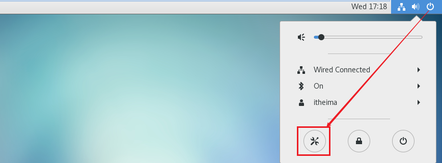

第二步：选择Power（节能）

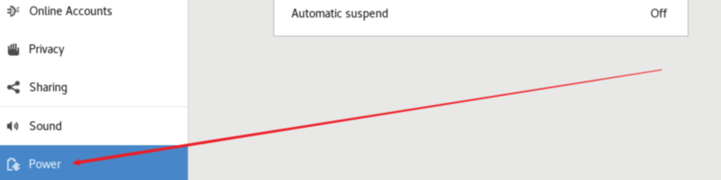

第三步：设置锁屏时间

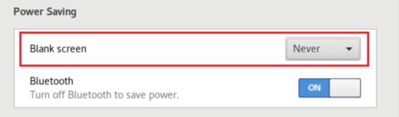

> 更新: 2026-03-02 15:42:00  
> 原文: <https://www.yuque.com/u41736172/az9urv/slc48yzgrbvaff1x>