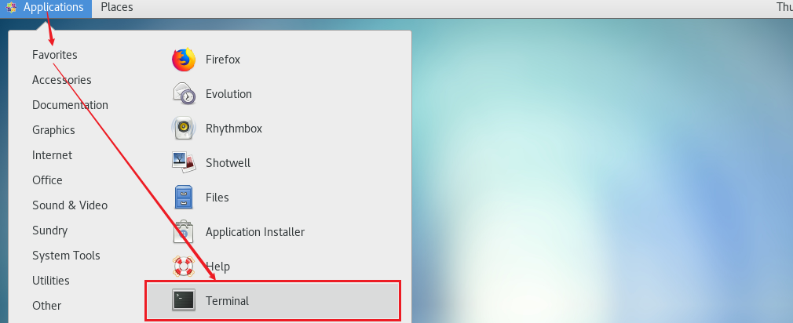
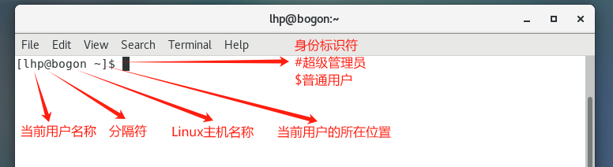
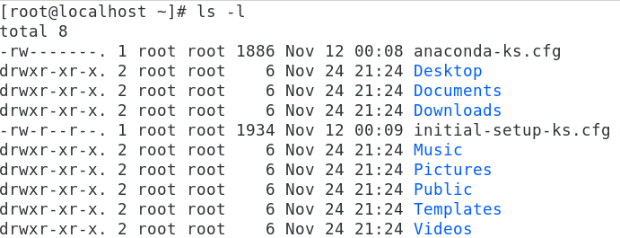
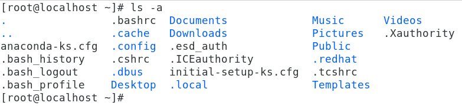
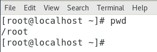

# 03.Linux基础命令

# <font style="color:rgb(51, 51, 51);">一、Linux系统使用注意</font>

## <font style="color:rgb(51, 51, 51);">Linux严格区分大小写</font>

Linux 和Windows不同，Linux严格区分大小写的，包括文件名和目录名、命令、命令选项、配置文件设置选项等。

例如，Win7 系统桌面上有文件夹叫做Test，当我们在桌面上再新建一个名为 test 的文件夹时，系统会提示文件夹命名冲突。

<font style="color:rgb(51, 51, 51);">Windows演示：</font>


<font style="color:rgb(51, 51, 51);">Linux演示：</font>


<font style="color:rgb(51, 51, 51);">Linux 系统不会，Linux 系统认为 Test 文件和 test 文件不是同一个文件，因此在 Linux 系统中，Test文件和 test 文件可以位于同一目录下。</font>

<font style="color:rgb(51, 51, 51);">我们在操作 Linux 系统时要注意区分大小写的不同。</font>

## <font style="color:rgb(51, 51, 51);">Linux文件"扩展名"</font>

<font style="color:rgb(51, 51, 51);">我们都知道，Windows 是依赖扩展名区分文件类型的，比如，".txt" 是文本文件、".exe" 是执行文件，但 Linux 不是。 Linux 系统通过权限位标识来确定文件类型，常见的文件类型有普通文件、目录、链接文件、块设备文件、字符设备文件等几种。Linux 的可执行文件就是普通文件被赋予了可执行权限。</font>


<font style="color:rgb(51, 51, 51);">Linux 中的一些特殊文件还是要求写 "扩展名" 的，但 Linux 不依赖扩展名来识别文件类型，写这些扩展名是为了帮助运维人员来区分不同的文件类型。</font>

<font style="color:rgb(51, 51, 51);">这样的文件扩展名主要有以下几种：</font>

**<font style="color:rgb(51, 51, 51);">压缩包</font>**<font style="color:rgb(51, 51, 51);">：Linux 下常见的压缩文件名有 </font>*<font style="color:rgb(51, 51, 51);">.gz、</font>*<font style="color:rgb(51, 51, 51);">.bz2、</font>*<font style="color:rgb(51, 51, 51);">.zip、</font>*<font style="color:rgb(51, 51, 51);">.tar.gz、</font>*<font style="color:rgb(51, 51, 51);">.tar.bz2、</font>*<font style="color:rgb(51, 51, 51);">.tgz 等。 为什么压缩包一定要写扩展名呢？很简单，如果不写清楚扩展名，那么管理员不容易判断压缩包的格式，虽然有命令可以帮助判断，但是直观一点更加方便。就算没写扩展名，在 Linux 中一样可以解压缩，不影响使用。</font>

**<font style="color:rgb(51, 51, 51);">二进制软件包</font>**<font style="color:rgb(51, 51, 51);">：CentOS 中所使用的二进制安装包是 RPM 包，所有的 RPM 包都用".rpm"扩展名结尾，目的同样是让管理员一目了然。</font>

**<font style="color:rgb(51, 51, 51);">程序文件</font>**<font style="color:rgb(51, 51, 51);">：Shell 脚本一般用 ".sh" 扩展名结尾。</font>

**<font style="color:rgb(51, 51, 51);">网页文件</font>**<font style="color:rgb(51, 51, 51);">：网页文件一般使用 ".php" 等结尾，不过这是网页服务器的要求，而不是 Linux 的要求。</font>

## <font style="color:rgb(51, 51, 51);">Linux中所有内容以文件形式保存</font>

**<font style="color:rgb(51, 51, 51);">Linux中，一切皆文件</font>**

> <font style="color:rgb(119, 119, 119);">在Windows是文件的，在Linux下也是文件。在Windows中不是文件的，在Linux系统中也是文件。</font>

<font style="color:rgb(51, 51, 51);">我们目前还没有学习权限标识符，怎么判断文件的类型呢？</font>

<font style="color:rgb(51, 51, 51);">可以通过文件的颜色</font>


<font style="color:rgb(51, 51, 51);">然后使用ls命令，查看文件的颜色</font>

```shell
# ls
```

<font style="color:rgb(51, 51, 51);">普通文件：通过ls命令查看时，如果显示</font><font style="color:red;">黑色</font><font style="color:rgb(51, 51, 51);">，代表其是一个普通的文件</font>

<font style="color:rgb(51, 51, 51);">文件夹：通过ls命令查看时，如果显示</font><font style="color:red;">天蓝色</font><font style="color:rgb(51, 51, 51);">，代表其是一个文件夹</font>

## <font style="color:rgb(51, 51, 51);">Linux系统的文件目录结构</font>


<font style="color:rgb(51, 51, 51);">在 Linux 根目录（/）下包含很多的子目录，称为一级目录。</font><font style="color:rgb(51, 51, 51);">例如 bin、boot、dev 等。</font>

<font style="color:rgb(51, 51, 51);">同时，各一级目录下还含有很多子目录，称为二级目录。例如 /bin/bash、/bin/ed 等。</font>

## <font style="color:rgb(51, 51, 51);">Linux系统的文件目录用途</font>

<font style="color:rgb(51, 51, 51);">Linux 基金会发布了 FHS （Filesystem Hierarchy Standard 文件系统层次化标准）。规定了主要文件夹的用途。</font>

| **<font style="color:rgb(51, 51, 51);">一级目录</font>** | **<font style="color:rgb(51, 51, 51);">功能（作用）</font>** |
| :--- | :--- |
| <font style="color:rgb(51, 51, 51);">/bin/</font> | <font style="color:rgb(51, 51, 51);">存放系统命令，普通用户和 root 都可以执行。放在 /bin 下的命令在单用户模式下也可以执行</font> |
| <font style="color:rgb(51, 51, 51);">/boot/</font> | <font style="color:rgb(51, 51, 51);">系统启动目录，保存与系统启动相关的文件，如内核文件和启动引导程序（grub）文件等</font> |
| <font style="color:rgb(51, 51, 51);">/dev/</font> | <font style="color:rgb(51, 51, 51);">设备文件保存位置</font> |
| <font style="color:rgb(51, 51, 51);">/etc/</font> | <font style="color:rgb(51, 51, 51);">配置文件保存位置。系统内所有采用默认安装方式（rpm 安装）的服务配置文件全部保存在此目录中，如用户信息、服务的启动脚本、常用服务的配置文件等</font> |
| <font style="color:rgb(51, 51, 51);">/home/</font> | <font style="color:rgb(51, 51, 51);">普通用户的主目录（也称为家目录）。在创建用户时，每个用户要有一个默认登录和保存自己数据的位置，就是用户的主目录，所有普通用户的主目录是在 /home/ 下建立一个和用户名相同的目录。如用户 liming 的主目录就是 /home/liming</font> |
| <font style="color:rgb(51, 51, 51);">/lib/</font> | <font style="color:rgb(51, 51, 51);">系统调用的函数库保存位置</font> |
| <font style="color:rgb(51, 51, 51);">/media/</font> | <font style="color:rgb(51, 51, 51);">挂载目录。系统建议用来挂载媒体设备，如软盘和光盘</font> |
| <font style="color:rgb(51, 51, 51);">/mnt/</font> | <font style="color:rgb(51, 51, 51);">挂载目录。早期 Linux 中只有这一个挂载目录，并没有细分。系统建议这个目录用来挂载额外的设备，如 U 盘、移动硬盘和其他操作系统的分区</font> |
| <font style="color:rgb(51, 51, 51);">/misc/</font> | <font style="color:rgb(51, 51, 51);">挂载目录。系统建议用来挂载 NFS 服务的共享目录。虽然系统准备了三个默认挂载目录 /media/、/mnt/、/misc/，但是到底在哪个目录中挂载什么设备可以由管理员自己决定。例如，笔者在接触 Linux 的时候，默认挂载目录只有 /mnt/，所以养成了在 /mnt/ 下建立不同目录挂载不同设备的习惯，如 /mnt/cdrom/ 挂载光盘、/mnt/usb/ 挂载 U 盘，都是可以的</font> |
| <font style="color:rgb(51, 51, 51);">/opt/</font> | <font style="color:rgb(51, 51, 51);">第三方安装的软件保存位置。这个目录是放置和安装其他软件的位置，手工安装的源码包软件都可以安装到这个目录中。不过笔者还是习惯把软件放到 /usr/local/ 目录中，也就是说，/usr/local/ 目录也可以用来安装软件</font> |
| <font style="color:rgb(51, 51, 51);">/root/</font> | <font style="color:rgb(51, 51, 51);">root 的主目录。普通用户主目录在 /home/ 下，root 主目录直接在“/”下</font> |
| <font style="color:rgb(51, 51, 51);">/sbin/</font> | <font style="color:rgb(51, 51, 51);">保存与系统环境设置相关的命令，只有 root 可以使用这些命令进行系统环境设置，但也有些命令可以允许普通用户查看</font> |
| <font style="color:rgb(51, 51, 51);">/srv/</font> | <font style="color:rgb(51, 51, 51);">服务数据目录。一些系统服务启动之后，可以在这个目录中保存所需要的数据</font> |
| <font style="color:rgb(51, 51, 51);">/tmp/</font> | <font style="color:rgb(51, 51, 51);">临时目录。系统存放临时文件的目录，在该目录下，所有用户都可以访问和写入。建议此目录中不能保存重要数据，最好每次开机都把该目录清理</font> |

# <font style="color:rgb(51, 51, 51);">二、Linux命令入门</font>

## <font style="color:rgb(51, 51, 51);">开启终端</font>

<font style="color:rgb(51, 51, 51);">后期Linux 服务器都是以纯命令行的形式运行的，那在桌面模式下是否有命令输入的地方？</font>

<font style="color:rgb(51, 51, 51);">可以使用终端输入命令，在顶部单击应用程序菜单，选择系统工具，选择终端即可。</font>



<font style="color:rgb(51, 51, 51);">打开后，效果如下图所示：</font>



如果觉得字体小，可以通过快捷键：ctrl shift +

## <font style="color:rgb(51, 51, 51);">命令与选项</font>

<font style="color:rgb(51, 51, 51);">什么是Linux 的命令？</font>

<font style="color:rgb(51, 51, 51);">答：就是指在Linux 终端（命令行）中输入的内容就称之为命令。</font>


<font style="color:rgb(51, 51, 51);">一个完整的命令的标准格式：Linux 通用的格式</font>

<code><font style="color:rgb(51, 51, 51);"># 命令 (空格) [选项] (空格) [参数]</font></code>

```shell
# ls

# ls -l

# tail -n 3 readme.txt
```

<font style="color:rgb(51, 51, 51);">注意：后期被"\[]"包裹的表示该项为可选项，可写可不写，具体得看需要一个命令可以包含多个选项。操作对象也可以是多个。</font>

## <font style="color:rgb(51, 51, 51);">Linux命令补全</font>

<font style="color:rgb(51, 51, 51);">键盘上有一个按键：Tab键</font>


<font style="color:rgb(51, 51, 51);">当我们在Linux系统的终端中，输入命令时，可以无需完整的命令，只需要记住命令的前几个字母即可，然后按Tab键，系统会自动进行补全操作。</font>

```shell
# syst + Tab键
# systemc + Tab键
# systemctl
```

<font style="color:rgb(51, 51, 51);">有些命令可能都以某几个字母开头，这个时候，只需要按两次Tab键，其就会显示所有命令。</font>

```shell
# clea + Tab键 + Tab键
```

> <font style="color:rgb(119, 119, 119);">Tab键的功能特别强大：其不仅可以补全命令还可以补全Linux的文件路径</font>

# <font style="color:rgb(51, 51, 51);">三、Linux基础命令</font>

## <font style="color:rgb(51, 51, 51);">ls命令</font>

### <font style="color:rgb(51, 51, 51);">用法一</font>

<font style="color:rgb(51, 51, 51);">主要功能：ls完整写法list show，以平铺的形式显示当前目录下的文件信息</font>

<font style="color:rgb(51, 51, 51);">基本语法：</font>

```shell
# ls
```


### <font style="color:rgb(51, 51, 51);">用法二</font>

<font style="color:rgb(51, 51, 51);">主要功能：显示其他目录下的文件信息</font>

```shell
# ls 其他目录的绝对路径或相对路径
```

> <font style="color:rgb(119, 119, 119);">扩展：ls后面跟的路径既可以是绝对路径也可以是相对路径</font>

**<font style="color:rgb(51, 51, 51);">绝对路径</font>**<font style="color:rgb(51, 51, 51);">：不管当前工作路径是在哪，目标路径都会从“/”磁盘根下开始。案例：访问lhp用户的家目录，查看有哪些文件</font>

```shell
# ls /home/lhp
```


<font style="color:red;">绝对路径必须以左斜杠开头，一级一级向下访问，不能越级</font>

<font style="color:red;"></font>

**<font style="color:rgb(51, 51, 51);">相对路径</font>**<font style="color:rgb(51, 51, 51);">：除绝对路径之外的路径称之为相对路径，相对路径得有一个相对物（当前工作路径）。</font>

<font style="color:rgb(51, 51, 51);">只要看到路径以“/”开头则表示该路径是绝对路径，除了以“/”开头的路径称之为相对路径。</font>

<font style="color:rgb(51, 51, 51);">当前位置：/home/lhp目录下</font>

<font style="color:rgb(51, 51, 51);">../：表示上级目录（上一级）</font>

<font style="color:rgb(51, 51, 51);">./ ：表示当前目录（同级），普通文件./可以省略，可执行文件（绿色）必须加./</font>

<font style="color:rgb(51, 51, 51);">文件夹名称/：表示下级目录（下一级），注意这个斜杠/</font>

### <font style="color:rgb(51, 51, 51);">用法三</font>

<font style="color:rgb(51, 51, 51);">基本语法：</font>

```shell
# ls [选项] [路径]
选项说明：
-l ：ls -l，代表以详细列表的形式显示当前或其他目录下的文件信息(简写命令=>ll)
-h ：ls -lh，通常与-l结合一起使用，代表以较高的可读性显示文件的大小(kb/mb/gb)
-a ：ls -a，a是all缩写，代表显示所有文件（也包含隐藏文件=>大部分以.开头）
```

<font style="color:rgb(51, 51, 51);">计算机中的单位：</font>

```shell
# 1TB = 1024GB
# 1GB = 1024MB
# 1MB = 1024KB
# 1KB（千字节） = 1024B（字节）
```






## <font style="color:rgb(51, 51, 51);">pwd命令</font>

<font style="color:rgb(51, 51, 51);">主要功能：pwd=print working directory，打印当前工作目录（告诉我们，我们当前位置）</font>

<font style="color:rgb(51, 51, 51);">基本语法：</font>

```shell
# pwd
```



## <font style="color:rgb(51, 51, 51);">cd命令</font>

<font style="color:rgb(51, 51, 51);">主要功能：cd全称change directory，切换目录（从一个目录跳转到另外一个目录）</font>

<font style="color:rgb(51, 51, 51);">基本语法：</font>

```shell
# cd [路径]
选项说明：
路径既可以是绝对路径，也可以是相对路径
```

<font style="color:rgb(51, 51, 51);">案例一：切换到/usr/local这个程序目录</font>

```shell
# cd /usr/local
```

<font style="color:rgb(51, 51, 51);">案例二：比如我们当前在/home/lhp下，切换到根目录/下</font>

```shell
# cd /home/lhp
# cd ./../../
```

<font style="color:rgb(51, 51, 51);">案例三：当我们在某个路径下，如何快速回到自己的家目录</font>

```shell
# cd
或
# cd ~
```

练习：

```shell
1. 进入到/usr/local目录中

2. 查看/usr/local目录中有哪些东西

3. 查看/tmp目录中有哪些东西

4. 切换到/var目录

5. 详细将/var目录中的内容列出来

6. 回到家目录
```

## <font style="color:rgb(51, 51, 51);">clear命令</font>

<font style="color:rgb(51, 51, 51);">主要功能：清屏</font>

<font style="color:rgb(51, 51, 51);">基本语法：</font>

```shell
# clear
```

清理屏幕的快捷键：`ctrl + l`

## <font style="color:rgb(51, 51, 51);">whoami命令</font>

<font style="color:rgb(51, 51, 51);">作用：用户获取当前用户的用户名</font>

```shell
用法：直接输入whoami回车
示例代码：
# whoami
含义：获取当前用户的用户名
```

## <font style="color:rgb(51, 51, 51);">reboot命令</font>

<font style="color:rgb(51, 51, 51);">主要功能：立即重启计算机</font>

<font style="color:rgb(51, 51, 51);">基本语法：</font>

```shell
# reboot
或者
# init 6
```

## <font style="color:rgb(51, 51, 51);">shutdown命令</font>

<font style="color:rgb(51, 51, 51);">主要功能：立即关机或延迟关机</font>

<font style="color:rgb(51, 51, 51);">立即关机基本语法：</font>

```shell
# shutdown -h 0或now
# shutdown -h 0
# shutdown -h now
选项说明：
-h ：halt缩写，代表关机
```

<font style="color:rgb(51, 51, 51);">延迟关机基本语法：</font>

```shell
# shutdown -h 分钟数
代表多少分钟后，自动关机
```

<font style="color:rgb(51, 51, 51);">案例1：10分钟后自动关机</font>

```shell
# shutdown -h 10
```

<font style="color:rgb(51, 51, 51);">案例2：后悔了，取消关机</font>

```shell
光标一直不停的闪，取消关机
# 按Ctrl + C（CentOS6，中断关机。CentOS7中还需要使用shutdown -c命令）
# shutdown -c
```

## <font style="color:rgb(51, 51, 51);">history命令</font>

<font style="color:rgb(51, 51, 51);">主要功能：显示系统以前输入的前1000条命令</font>

<font style="color:rgb(51, 51, 51);">基本语法：</font>

```shell
# history
```

> 扩展：
>
> `# !历史命令的id`可以再次执行该命令，比如`# !25`执行历史命令中编号为25的命令
>
> `# !abc`执行最近一次输入的以abc开头的命令
>
> 我们可以修改家目录中的`.bashrc`，设置历史命令保存条数！

## <font style="color:rgb(51, 51, 51);">hostnamectl命令</font>

<font style="color:rgb(51, 51, 51);">主要功能：用于设置计算机的主机名称（给计算机起个名字），此命令是CentOS7新增的命令。</font>

<font style="color:rgb(51, 51, 51);">hostnamectl ： hostname + control</font>

### <font style="color:rgb(51, 51, 51);">获取计算机的主机名称</font>

```shell
# hostname	CentOS6
# hostnamectl  CentOS7
```

### <font style="color:rgb(51, 51, 51);">设置计算机的主机名称</font>

<font style="color:rgb(51, 51, 51);">Centos7中主机名分3类，静态的（static）、瞬态的（transient）和灵活的（pretty）。</font>

<font style="color:rgb(51, 51, 51);">① 静态static主机名称：电脑关机或重启后，设置的名称亦然有效</font>

<font style="color:rgb(51, 51, 51);">② 瞬态transient主机名称：临时主机名称，电脑关机或重启后，设置的名称就失效了</font>

<font style="color:rgb(51, 51, 51);">③ 灵活pretty主机名称：可以包含一些特殊字符</font>

<font style="color:rgb(51, 51, 51);">CentOS 7中和主机名有关的文件为/etc/hostname，它是在系统初始化的时候被读取的，并且内核根据它的内容设置瞬态主机名。</font>

> <font style="color:rgb(119, 119, 119);">更改主机名称，让其永久生效？① 使用静态的 ② 改/etc/hostname文件</font>

```shell
# hostnamectl --static set-hostname 主机名称
温馨提示：--static也可以省略不写
```

<font style="color:rgb(51, 51, 51);">案例：把计算机的主机名称永久设置为yunwei.lhp.cn</font>

```shell
# hostnamectl --static set-hostname yunwei.lhp.cn
# su 立即生效
```


> 更新: 2026-03-03 15:01:31  
> 原文: <https://www.yuque.com/u41736172/az9urv/lpgbfmvqsy8w2xts>