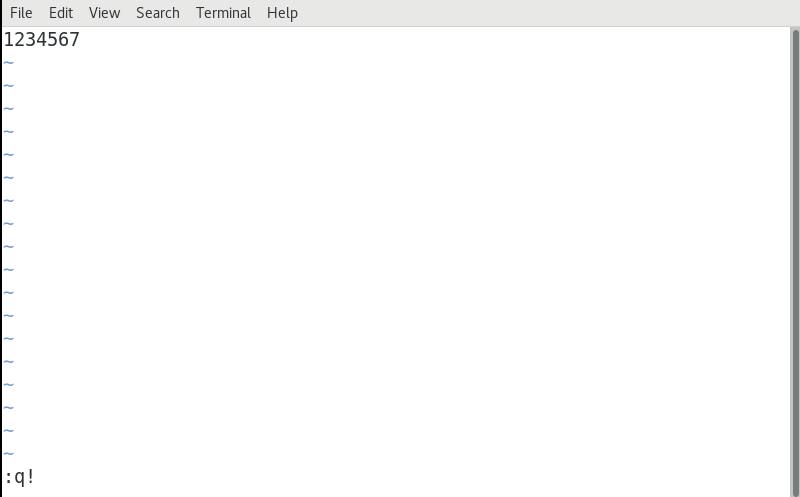

# 05.Linux文件管理（下）

# <font style="color:rgb(51, 51, 51);">一、VIM编辑器</font>

## <font style="color:rgb(51, 51, 51);">vi概述</font>

<font style="color:rgb(51, 51, 51);">vi（visual editor）编辑器通常被简称为vi，它是Linux和Unix系统上最基本的文本编辑器，类似于Windows 系统下的notepad（记事本）编辑器。</font>

## <font style="color:rgb(51, 51, 51);">vim编辑器</font>

<font style="color:rgb(51, 51, 51);">Vim(Vi improved)是vi编辑器的加强版，比vi更容易使用。vi的命令几乎全部都可以在vim上使用。</font>

## <font style="color:rgb(51, 51, 51);">vim编辑器的三种模式</font>

### <font style="color:rgb(51, 51, 51);">命令模式</font>

<font style="color:rgb(51, 51, 51);">使用VIM编辑器时，默认处于命令模式。在该模式下可以移动光标位置，可以通过快捷键对文件内容进行复制、粘贴、删除等操作。</font>

### <font style="color:rgb(51, 51, 51);">编辑模式或输入模式</font>

<font style="color:rgb(51, 51, 51);">在命令模式下输入小写字母a或小写字母i即可进入编辑模式，在该模式下可以对文件的内容进行编辑。</font>

### <font style="color:rgb(51, 51, 51);">末行模式</font>

<font style="color:rgb(51, 51, 51);">在命令模式下输入冒号:即可进入末行模式，可以在末行输入命令来对文件进行查找、替换、保存、退出等操作。</font>

# <font style="color:rgb(51, 51, 51);">二、VIM三种模式的关系</font>

## <font style="color:rgb(51, 51, 51);">VIM三种模式</font>

<font style="color:rgb(51, 51, 51);">命令模式/编辑模式/末行模式</font>

## <font style="color:rgb(51, 51, 51);">VIM三种模式的关系</font>


# <font style="color:rgb(51, 51, 51);">三、VIM编辑器的使用</font>

## <font style="color:rgb(51, 51, 51);">使用vim打开文件</font>

<font style="color:rgb(51, 51, 51);">基本语法：</font>

```shell
# vim  文件名称
```

<font style="color:rgb(51, 51, 51);">① 如果文件已存在，则直接打开</font>

<font style="color:rgb(51, 51, 51);">② 如果文件不存在，则vim编辑器会自动在内存中创建一个新文件</font>

<font style="color:rgb(51, 51, 51);">案例：使用vim命令打开readme.txt文件</font>

```shell
# vim readme.txt
```

## <font style="color:rgb(51, 51, 51);">vim编辑器保存文件</font>

<font style="color:rgb(51, 51, 51);">在任何模式下，连续按两次Esc键，即可返回到命令模式。然后按冒号：，进入到末行模式，输入wq，代表保存并退出。</font>


## <font style="color:rgb(51, 51, 51);">vim编辑器强制退出（不保存）</font>

<font style="color:rgb(51, 51, 51);">在任何模式下，连续按两次Esc键，即可返回到命令模式。然后按冒号：，进入到末行模式，输入q!，代表强制退出但是不保存文件。</font>

-

## <font style="color:rgb(51, 51, 51);">命令模式下的相关操作</font>

### <font style="color:rgb(51, 51, 51);">如何进入命令模式</font>

<font style="color:rgb(51, 51, 51);">答：在Linux操作系统中，当我们使用vim命令直接打开某个文件时，默认进入的就是命令模式。如果我们处于其他模式（编辑模式、可视化模式以及末行模式）可以连续按两次Esc键也可以返回命令模式。</font>

### <font style="color:rgb(51, 51, 51);">命令模式下我们能做什么</font>

<font style="color:rgb(51, 51, 51);">① 移动光标 ② 复制 粘贴 ③ 剪切 粘贴 删除 ④ 撤销与恢复</font>

### <font style="color:rgb(51, 51, 51);">移动光标到首行或末行（重点）</font>

<font style="color:rgb(51, 51, 51);">移动光标到首行 => gg</font>

<font style="color:rgb(51, 51, 51);">移动光标到末行 => G</font>

### <font style="color:rgb(51, 51, 51);">翻屏</font>

<font style="color:rgb(51, 51, 51);">向上 翻屏，按键：</font><code><font style="color:rgb(51, 51, 51);background-color:rgb(243, 244, 244);">ctrl + b （before） 或 PgUp</font></code>

<font style="color:rgb(51, 51, 51);">向下 翻屏，按键：</font><code><font style="color:rgb(51, 51, 51);background-color:rgb(243, 244, 244);">ctrl + f （after） 或 PgDn</font></code>

<font style="color:rgb(51, 51, 51);">向上翻半屏，按键：</font><code><font style="color:rgb(51, 51, 51);background-color:rgb(243, 244, 244);">ctrl + u （up）</font></code>

<font style="color:rgb(51, 51, 51);">向下翻半屏，按键：</font><code><font style="color:rgb(51, 51, 51);background-color:rgb(243, 244, 244);">ctrl + d （down）</font></code>

### <font style="color:rgb(51, 51, 51);">快速定位光标到指定行</font>

<font style="color:rgb(51, 51, 51);">行号 + G，如150G代表快速移动光标到第150行。</font>

### <font style="color:rgb(51, 51, 51);">复制/粘贴</font>

<font style="color:rgb(51, 51, 51);">① 复制当前行（光标所在那一行）</font>

<font style="color:rgb(51, 51, 51);">按键：yy</font>

<font style="color:rgb(51, 51, 51);">粘贴：在想要粘贴的地方按下p 键【将粘贴在光标所在行的下一行】,如果想粘贴在光标所在行之前，则使用P键</font>

<font style="color:rgb(51, 51, 51);">② 从当前行开始复制指定的行数，如复制5行，5yy</font>

<font style="color:rgb(51, 51, 51);">粘贴：在想要粘贴的地方按下p 键【将粘贴在光标所在行的下一行】,如果想粘贴在光标所在行之前，则使用P键</font>

### <font style="color:rgb(51, 51, 51);">剪切/删除</font>

<font style="color:rgb(51, 51, 51);">在VIM编辑器中，剪切与删除都是dd</font>

<font style="color:rgb(51, 51, 51);">如果剪切了文件，但是没有使用p进行粘贴，就是删除操作</font>

<font style="color:rgb(51, 51, 51);">如果剪切了文件，然后使用p进行粘贴，这就是剪切操作</font>

<font style="color:rgb(51, 51, 51);">① 剪切/删除当前光标所在行</font>

<font style="color:rgb(51, 51, 51);">按键：dd （删除之后下一/行上移）</font>

<font style="color:rgb(51, 51, 51);">粘贴：p</font>

<font style="color:rgb(51, 51, 51);">注意：dd 严格意义上说是剪切命令，但是如果剪切了不粘贴就是删除的效果。</font>

<font style="color:rgb(51, 51, 51);">② 剪切/删除多行（从当前光标所在行开始计算）</font>

<font style="color:rgb(51, 51, 51);">按键：数字dd</font>

<font style="color:rgb(51, 51, 51);">粘贴：p</font>

### <font style="color:rgb(51, 51, 51);">撤销/恢复</font>

<font style="color:rgb(51, 51, 51);">撤销：u（undo）</font>

<font style="color:rgb(51, 51, 51);">恢复：ctrl + r 恢复（取消）之前的撤销操作【重做，redo】</font>

### <font style="color:rgb(51, 51, 51);">总结</font>

<font style="color:rgb(51, 51, 51);">① 怎么进入命令模式（vim 文件名称，在任意模式下，可以连续按两次Esc键即可返回命令模式）</font>

<font style="color:rgb(51, 51, 51);">② 命令模式能做什么？移动光标、复制/粘贴、剪切/删除、撤销与恢复</font>

<font style="color:rgb(51, 51, 51);">首行 => gg，末行 => G 翻屏（了解） 快速定位 行号G，如150G</font>

<font style="color:rgb(51, 51, 51);">yy p 5yy p</font>

<font style="color:rgb(51, 51, 51);">dd p 5dd p</font>

<font style="color:rgb(51, 51, 51);">u</font>

<font style="color:rgb(51, 51, 51);">ctrl + r</font>

## <font style="color:rgb(51, 51, 51);">末行模式下的相关操作</font>

### <font style="color:rgb(51, 51, 51);">如何进入末行模式</font>

<font style="color:rgb(51, 51, 51);">进入末行模式的方法只有一个，在命令模式下使用冒号：的方式进入。</font>

### <font style="color:rgb(51, 51, 51);">末行模式下我们能做什么</font>

<font style="color:rgb(51, 51, 51);">文件保存、退出、查找与替换、显示行号、paste模式等等</font>

### <font style="color:rgb(51, 51, 51);">保存/退出（重点）</font>

<font style="color:rgb(51, 51, 51);">:w => 代表对当前文件进行保存操作，但是其保存完成后，并没有退出这个文件</font>

<font style="color:rgb(51, 51, 51);">:q => 代表退出当前正在编辑的文件，但是一定要注意，文件必须先保存，然后才能退出</font>

<font style="color:rgb(51, 51, 51);">:wq => 代表文件先保存后退出（保存并退出）</font>

<font style="color:rgb(51, 51, 51);">如果一个文件在编辑时没有名字，则可以使用:wq 文件名称，代表把当前正在编辑的文件保存到指定的名称中，然后退出</font>

<font style="color:rgb(51, 51, 51);">:q! => 代表强制退出但是文件未保存（不建议使用）</font>

### <font style="color:rgb(51, 51, 51);">查找/搜索（重点）</font>

<font style="color:rgb(51, 51, 51);">切换到命令模式，然后输入斜杠/（也是进入末行模式的方式之一）</font>

<font style="color:rgb(51, 51, 51);">进入到末行模式后，输入要查找或搜索的关键词，然后回车</font>

<font style="color:rgb(51, 51, 51);">如果在一个文件中，存在多个满足条件的结果。在搜索结果中切换上/下一个结果：N/n （大写N代表上一个结果，小写n代表next）</font>

<font style="color:rgb(51, 51, 51);">如果需要取消高亮，则需要在末行模式中输入</font><code><font style="color:rgb(51, 51, 51);background-color:rgb(243, 244, 244);">:noh</font></code><font style="color:rgb(51, 51, 51);">【no highlight】</font>

### <font style="color:rgb(51, 51, 51);">文件内容的替换</font>

<font style="color:rgb(51, 51, 51);">第一步：首先要进入末行模式（在命令模式下输入冒号:）</font>

<font style="color:rgb(51, 51, 51);">第二步：根据需求替换内容</font>

<font style="color:rgb(51, 51, 51);">针对整个文档中的所有关键词进行替换（只要满足条件就进行替换操作）</font>

```shell
:%s/要替换的关键词/替换后的关键词/g
```

<font style="color:rgb(51, 51, 51);">案例：替换整个文档中的hello关键词为hi</font>

```shell
:%s/hello/hi/g
```

### <font style="color:rgb(51, 51, 51);">显示行号</font>

<font style="color:rgb(51, 51, 51);">基本语法：</font>

```shell
:set nu
nu = number，行号
```

取消显示行号：

```shell
:set nonu
```

### <font style="color:rgb(51, 51, 51);">总结</font>

<font style="color:rgb(51, 51, 51);">① 如何进入末行模式，必须从命令模式中使用冒号进行切换</font>

<font style="color:rgb(51, 51, 51);">② 末行模式下能做什么？保存、退出、查找、替换、显示行号</font>

<font style="color:rgb(51, 51, 51);">③ 保存 => :w</font>

<font style="color:rgb(51, 51, 51);">④ 退出 => :q，先保存后退出。:wq :wq 文件名称 :q!</font>

<font style="color:rgb(51, 51, 51);">⑤ 查找功能 => 命令模式输入/斜杠 + 关键词（高亮显示）=> :noh</font>

<font style="color:rgb(51, 51, 51);">⑥ 替换功能</font>

<font style="color:rgb(51, 51, 51);">:%s/要替换的关键词/替换后的关键词/g</font>

<font style="color:rgb(51, 51, 51);">⑦ 显示行号 => :set nu 取消行号 => :set nonu</font>

# <font style="color:rgb(51, 51, 51);">四、编辑模式</font>

## <font style="color:rgb(51, 51, 51);">编辑模式的作用</font>

<font style="color:rgb(51, 51, 51);">编辑模式的作用比较简单，主要是实现对文件的内容进行编辑模式。</font>

## <font style="color:rgb(51, 51, 51);">如何进入编辑模式</font>

<font style="color:rgb(51, 51, 51);">首先你需要进入到命令模式，然后使用小写字母a或小写字母i，进入编辑模式。</font>

<font style="color:rgb(51, 51, 51);">命令模式 + i ： insert缩写，代表在光标之前插入内容</font>

<font style="color:rgb(51, 51, 51);">命令模式 + a ： append缩写，代表在光标之后插入内容</font>

## <font style="color:rgb(51, 51, 51);">退出编辑模式</font>

<font style="color:rgb(51, 51, 51);">在编辑模式中，直接按Esc，即可从编辑模式退出到命令模式。</font>

## <font style="color:rgb(51, 51, 51);">异常退出解决方案</font>

<font style="color:rgb(51, 51, 51);">什么是异常退出：在编辑文件之后并没有正常的去wq（保存退出），而是遇到突然关闭终端或者断电的情况，则会显示下面的效果，这个情况称之为</font>**<font style="color:rgb(51, 51, 51);">异常退出</font>**<font style="color:rgb(51, 51, 51);">：</font>


> <font style="color:rgb(119, 119, 119);">温馨提示：每个文件的异常文件都会有所不同，其命名规则一般为</font><code><font style="color:rgb(119, 119, 119);background-color:rgb(243, 244, 244);">.文件名称.swp</font></code>

<font style="color:rgb(51, 51, 51);">解决办法：将交换文件（在编程过程中产生的临时文件）删除掉即可【在上述提示界面按下D 键或者使用rm 指令删除交换文件】</font>

```shell
# rm -rf .1.php.swp
```

# <font style="color:rgb(51, 51, 51);">五、查看文件的内容</font>

## <font style="color:rgb(51, 51, 51);">cat命令</font>

<font style="color:rgb(51, 51, 51);">基本语法：</font>

```shell
# cat 文件名称
111
222
333
444
```

## <font style="color:rgb(51, 51, 51);">head命令</font>

<font style="color:rgb(51, 51, 51);">基本语法：</font>

```shell
# head -n 文件名称
```

<font style="color:rgb(51, 51, 51);">主要功能：查看一个文件的前n 行，如果不指定n，则默认显示前10 行</font>

<font style="color:rgb(51, 51, 51);">案例：查询linux.txt文件中的前10行</font>

```shell
# head linux.txt
```

<font style="color:rgb(51, 51, 51);">案例：查询linux.txt文件中的前3行</font>

```shell
# head -3 linux.txt
```

## <font style="color:rgb(51, 51, 51);">tail命令</font>

<font style="color:rgb(51, 51, 51);">基本语法：</font>

```shell
# tail -n 文件名称
```

<font style="color:rgb(51, 51, 51);">主要功能：查看一个文件的最后n 行，如果不指定n，则默认显示最后10 行</font>

<font style="color:rgb(51, 51, 51);">案例：查询linux.txt文件的最后10行</font>

```shell
# tail linux.txt
```

<font style="color:rgb(51, 51, 51);">案例：查询linux.txt文件的最后3行</font>

```shell
# tail -3 linux.txt
```

## <font style="color:rgb(51, 51, 51);">less分屏显示文件内容</font>

<font style="color:rgb(51, 51, 51);">基本语法：</font>

```shell
# less 文件名称
```

> <font style="color:rgb(119, 119, 119);">特别注意：less命令不是加载整个文件到内存，而是一点一点进行加载，相对而言，读取大文件时，效率比较高。</font>

| **<font style="color:rgb(51, 51, 51);">按键</font>** | **<font style="color:rgb(51, 51, 51);">功能</font>** |
| :--- | :--- |
| <font style="color:rgb(51, 51, 51);">回车键</font> | <font style="color:rgb(51, 51, 51);">向下移动一行。</font> |
| <font style="color:rgb(51, 51, 51);">d</font> | <font style="color:rgb(51, 51, 51);">向下移动半页。</font> |
| <font style="color:rgb(51, 51, 51);">空格键</font> | <font style="color:rgb(51, 51, 51);">向下移动一页。</font> |
| <font style="color:rgb(51, 51, 51);">b</font> | <font style="color:rgb(51, 51, 51);">向上移动一页。</font> |
| <font style="color:rgb(51, 51, 51);">上下方向键</font> | <font style="color:rgb(51, 51, 51);">向上与向下移动，less命令特有功能键</font> |
| <font style="color:rgb(51, 51, 51);">less -N 文件名称</font> | <font style="color:rgb(51, 51, 51);">显示行号</font> |
| <font style="color:rgb(51, 51, 51);">/ 字符串</font> | <font style="color:rgb(51, 51, 51);">搜索指定的字符串。</font> |
| <font style="color:rgb(51, 51, 51);">q</font> | <font style="color:rgb(51, 51, 51);">退出less</font> |


> 更新: 2025-08-28 15:13:23  
> 原文: <https://www.yuque.com/u41736172/az9urv/kzvewyvlyang5yaa>