# 08.LAMP环境部署

# <font style="color:rgb(51, 51, 51);">一、YUM</font>

## <font style="color:rgb(51, 51, 51);">什么是YUM</font>

<font style="color:rgb(51, 51, 51);">在CentOS系统中，软件管理方式通常有三种方式：</font><code><font style="color:rgb(51, 51, 51);background-color:rgb(243, 244, 244);">rpm安装</font></code><font style="color:rgb(51, 51, 51);">、</font><code><font style="color:rgb(51, 51, 51);background-color:rgb(243, 244, 244);">yum安装</font></code><font style="color:rgb(51, 51, 51);">以及</font><code><font style="color:rgb(51, 51, 51);background-color:rgb(243, 244, 244);">编译安装</font></code><font style="color:rgb(51, 51, 51);">。</font>

* <font style="color:rgb(51, 51, 51);">RPM安装：指的是官方已经将源码包经过编译产生的二进制软件包，名称一般是 xxx.rpm。我们在安装这种rpm包时，如果软件包有依赖的话，需要自己解决依赖。</font>
* **<font style="color:rgb(51, 51, 51);">YUM安装</font>**<font style="color:rgb(51, 51, 51);">：基于rpm包管理，能够从</font>**<font style="color:rgb(51, 51, 51);">指定的服务器</font>**<font style="color:rgb(51, 51, 51);">(yum源）自动下载RPM包并且安装，可以自动处理依赖性关系，并且一次安装所有依赖的软件包，无须繁琐地一次次下载、安装。</font>
* 编译安装：从过程上来讲比较麻烦，包需要用户自行下载，下载的是源码包，需要进行编译操作，编译好了才能进行安装，这个过程对于刚接触Linux的人来说比较麻烦，而且还容易出错。好处在于是源码包，对于有需要自定义模块的用户来说非常方便。

<font style="color:rgb(51, 51, 51);">难度：编译安装 > rpm安装 > yum安装（有网络 + yum源支持）</font>

## <font style="color:rgb(51, 51, 51);">YUM源配置</font>

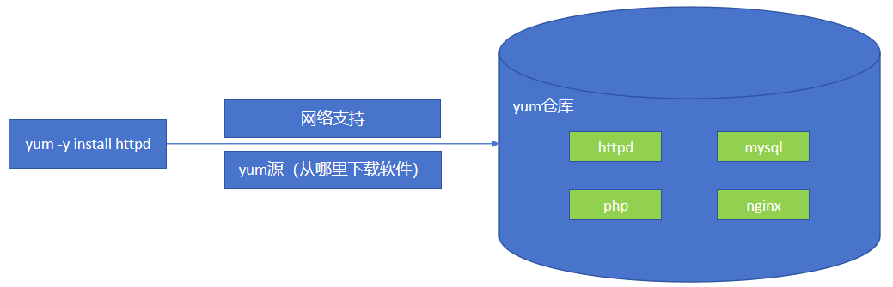

<font style="color:rgb(51, 51, 51);">YUM源配置文件所在路径 => /etc/yum.repos.d文件夹</font>

<font style="color:rgb(51, 51, 51);">配置Linux系统的yum镜像源为阿里云：</font>

```shell
进入到yum源的目录中
# cd /etc/yum.repos.d

第一步：备份CentOS-Base.repo这个源（更改后缀名.repo => .repo.bak）
# mv CentOS-Base.repo CentOS-Base.repo.bak

第二步：使用wget命令下载阿里云的镜像文件
# wget -O /etc/yum.repos.d/CentOS-Base.repo http://mirrors.aliyun.com/repo/Centos-7.repo

选项说明：
-O ：指定文件下载的位置以及名称
第三步：清理YUM缓存
# yum clean all

第四步：重新建立缓存（让新YUM源生效）
# yum makecache

第五步：查看yum镜像仓库
# yum repolist
```

## <font style="color:rgb(51, 51, 51);">YUM命令详解</font>

### <font style="color:rgb(51, 51, 51);">搜索要安装的软件</font>

```shell
# yum search 软件名称的关键词
```

<font style="color:rgb(51, 51, 51);">案例：搜索阿里云仓库中的vim软件</font>

```shell
# yum search vim
```

<font style="color:rgb(51, 51, 51);">案例：搜索firefox火狐浏览器</font>

```shell
# yum search firefox
```

### <font style="color:rgb(51, 51, 51);">使用yum安装软件</font>

<font style="color:rgb(51, 51, 51);">基本语法：</font>

```shell
# yum install 软件名称关键词 [选项]
选项：
-y ：yes缩写，确认安装，不提示。
```

<font style="color:rgb(51, 51, 51);">案例：使用yum命令安装vim编辑器</font>

```shell
# yum install vim -y
```

<font style="color:rgb(51, 51, 51);">案例：使用yum命令安装firefox浏览器</font>

```shell
# yum install firefox -y
```

### <font style="color:rgb(51, 51, 51);">使用yum卸载软件</font>

```shell
# yum remove 软件名称关键词 [选项]
选项：
-y ：yes缩写，确认卸载，不提示。
```

<font style="color:rgb(51, 51, 51);">案例：把firefox火狐浏览器进行卸载操作</font>

```shell
# yum remove firefox -y
```

<font style="color:rgb(51, 51, 51);">案例：把httpd软件进行卸载操作</font>

```shell
# yum remove httpd -y
```

### <font style="color:rgb(51, 51, 51);">使用yum更新软件</font>

<font style="color:rgb(51, 51, 51);">基本语法：</font>

```shell
# yum update 软件名称关键词 [选项]
选项：
-y ：yes缩写，确认更新，不提示
```

<font style="color:rgb(51, 51, 51);">案例：把vim编辑器进行更新操作</font>

```shell
# yum update vim -y
```

<font style="color:rgb(51, 51, 51);">案例：把firefox火狐浏览器进行更新操作</font>

```shell
# yum update firefox -y
```

# <font style="color:rgb(51, 51, 51);">二、LAMP环境部署</font>

## <font style="color:rgb(51, 51, 51);">什么是LAMP</font>

<font style="color:rgb(51, 51, 51);">LAMP：</font>**<font style="color:rgb(51, 51, 51);">L</font>**<font style="color:rgb(51, 51, 51);">inux + </font>**<font style="color:rgb(51, 51, 51);">A</font>**<font style="color:rgb(51, 51, 51);">pache + </font>**<font style="color:rgb(51, 51, 51);">M</font>**<font style="color:rgb(51, 51, 51);">ySQL + </font>**<font style="color:rgb(51, 51, 51);">P</font>**<font style="color:rgb(51, 51, 51);">HP LAMP 架构（组合）</font>

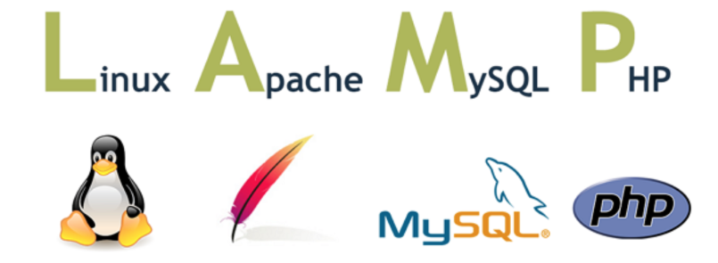

<font style="color:rgb(51, 51, 51);">Apache：Apache是世界使用排名第一的Web服务器软件。</font>

<font style="color:rgb(51, 51, 51);">PHP：一种专门用于Web开发的编程语言。</font>

<font style="color:rgb(51, 51, 51);">MySQL：MySQL是一个关系型数据库管理系统，主要用于永久存储项目数据。</font>

## <font style="color:rgb(51, 51, 51);">AMP三者之间的关系</font>


<font style="color:rgb(51, 51, 51);">Apache：用于接收用户的请求（输入网址，返回网页=>结果）</font>

<font style="color:rgb(51, 51, 51);">PHP：注册、登录、加入购物车、下单、支付等动态功能（有编程语言的支持）</font>

<font style="color:rgb(51, 51, 51);">MySQL：永久保存数据，比如你在网站上注册的用户和密码、你加入购物车的产品、你的产品订单</font>

<font style="color:rgb(51, 51, 51);">LAMP = Linux + Apache + PHP + MySQL</font>

## <font style="color:rgb(51, 51, 51);">LAMP部署前期准备</font>

### <font style="color:rgb(51, 51, 51);">关闭防火墙</font>

因为我们目前还没有深入的学习防火墙，目前先关掉，否则会影响我们后期的部署。

```shell
关闭防火墙
# systemctl stop firewalld

设置防火墙开机不启动
# systemctl disable firewalld
```

### <font style="color:rgb(51, 51, 51);">关闭SELinux</font>

*<font style="color:rgb(51, 51, 51);">SELinux</font>*<font style="color:rgb(51, 51, 51);">(Security-Enhanced Linux) 是美国国家安全局（NSA）对于强制访问控制的实现，是 Linux历史上最杰出的新安全子系统。 </font>

<font style="color:rgb(51, 51, 51);">获取SELinux的状态：</font>

```shell
获取SELinux状态
# getenforce

关闭SELinux
# setenforce 0
```

<font style="color:rgb(51, 51, 51);">永久关闭SELinux：编辑SELinux的配置文件</font>

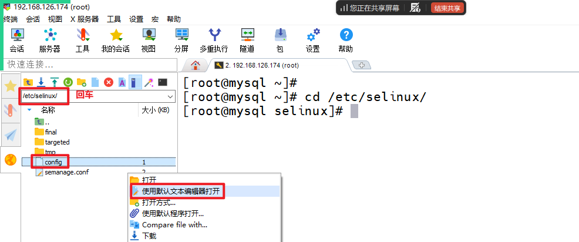

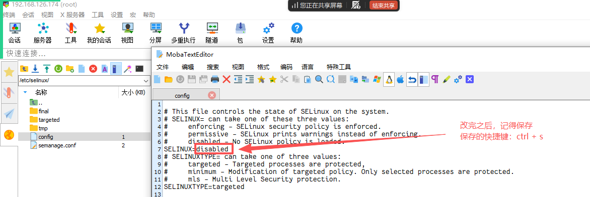

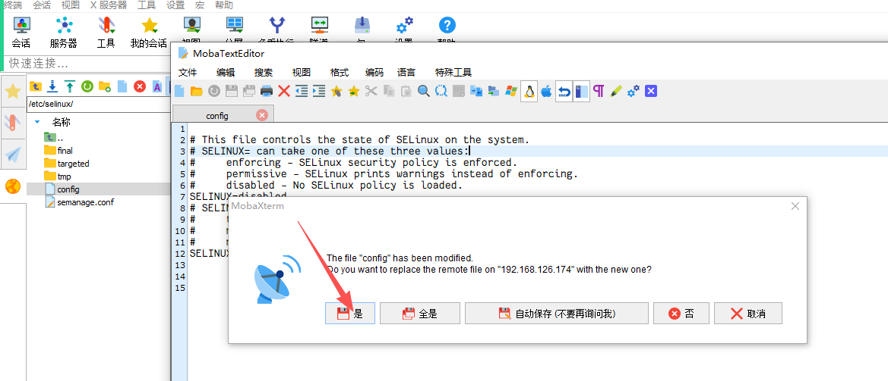

### <font style="color:rgb(51, 51, 51);">检查系统中是否已安装Apache</font>

```shell
查看系统中是否安装httpd软件
# rpm -qa | grep httpd
```

### <font style="color:rgb(51, 51, 51);">检查系统中是否已安装MySQL</font>

```shell
# rpm -qa | grep mysql
```

### <font style="color:rgb(51, 51, 51);">检查系统中是否已安装PHP</font>

```shell
# rpm -qa | grep php
```

## Apache服务器

平时说的Linux服务器，这里的服务器指的是硬件服务器！

上面提到的Apache服务器，这里的服务器指的是软件服务器！意思是有一个软件，名字叫Apache！软件服务器就是用来跑程序员们写好的代码的！

### 名词解释

#### HTML

HyperText Markup Language ，超级 文本 标记 语言

#### 网页

使用HTML,PHP,JAVA语言格式书写的文件。

#### 主页

网页中呈现用户的第一个页面。

index.html 页面就是我们的首页

#### 网站

多个网页组合而成的一台网站服务器

#### URL

<http://www.baidu.com:80/1.html>

ftp://192.168.142.143:21/1.txt

Uniform Resource Locator

统一资源定位符

访问网站的地址

### Apache介绍

Apache就是一个web服务器软件，我们将其运行起来后，它就可以提供web服务，也就是用户就可以通过浏览器中输入网址访问这个Apache服务器中的网页信息！

Apache官网：www.apache.org

软件包名称：httpd

服务端口：80/tcp(http)、443/tcp(https)

主配置文件：/etc/httpd/conf/httpd.conf

子配置文件：/etc/httpd/conf.d/\*.conf（子配置文件必须以.conf结尾，名字随意）

主目录：**/var/www/html**，网站源代码默认位置

### <font style="color:rgb(51, 51, 51);">Apache安装</font>

<font style="color:rgb(51, 51, 51);">第一步：安装httpd软件</font>

```shell
# yum install httpd -y
```

<font style="color:rgb(51, 51, 51);">第二步：配置/etc/httpd/conf/httpd.conf文件</font>

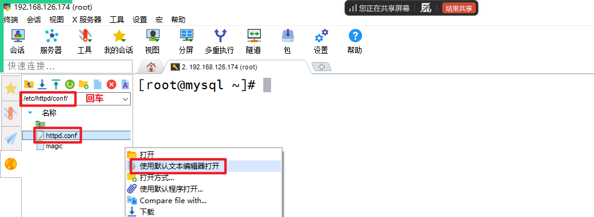

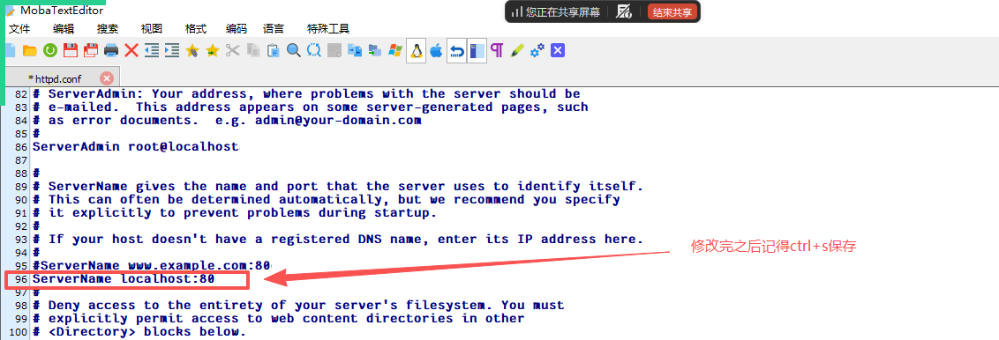

`ServerName localhost:80`

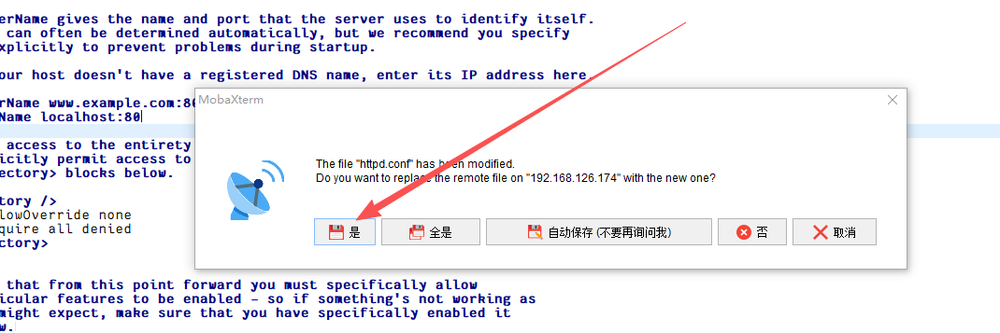

> <font style="color:rgb(119, 119, 119);">localhost ： 代表本机，对应的IP地址可以是127.0.0.1或本机的公网IP</font>

<font style="color:rgb(51, 51, 51);">第三步：启动httpd服务</font>

```shell
# systemctl start httpd
```

<font style="color:rgb(51, 51, 51);">第四步：把httpd服务添加到开机启动项中</font>

```shell
# systemctl enable httpd
```

<font style="color:rgb(51, 51, 51);">第五步：在Windows的浏览器中，访问，注意，IP地址要写自己的Linux服务器的IP地址！！！</font>

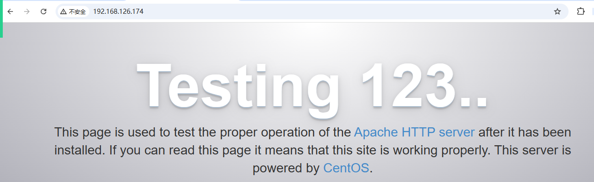

### 入门案例

在httpd服务器默认的目录`/var/www/html`中，编写一个html网页：

```shell
# vim /var/www/html/index.html
<h1>大家好，我是一级标题</h1>
<h2>大家好，我是二级标题</h2>
```

<font style="color:rgb(51, 51, 51);">然后，再次通过Linux系统的IP去访问</font>

<font style="color:rgb(51, 51, 51);">通过上面的入门案例，可以知道我们往Apache服务器的主目录放了一些网页文件，然后将Apache服务器启动来了后，用户就可以通过浏览器去访问Apache服务器中的网页资源了！</font>

<font style="color:rgb(51, 51, 51);">http://linux IP地址:端口号/网页文件</font>

<font style="color:rgb(51, 51, 51);">http://192.168.126.165:80/index.html</font>

<font style="color:rgb(51, 51, 51);">简写：</font>

<font style="color:rgb(51, 51, 51);">http://192.168.126.165</font>

## <font style="color:rgb(51, 51, 51);">MySQL数据库</font>

### <font style="color:rgb(51, 51, 51);">下载MySQL的官网yum源</font>

<font style="color:rgb(51, 51, 51);">由于目前的yum源上默认没有mysql-server。所以必须去官网下载后再安装</font>

```shell
下载一个MySQL的rpm包，这个包安装完之后在Linux系统中就配置了MySQL官方提供的MySQL的yum源
# wget http://dev.mysql.com/get/mysql-community-release-el7-5.noarch.rpm
```

### <font style="color:rgb(51, 51, 51);">安装MySQL的官网镜像源</font>

```shell
安装下面的rpm包，其实是帮我们配置好了MySQL的yum源
# rpm -ivh mysql-community-release-el7-5.noarch.rpm

选项说明：
-i：install，安装
-v：view，显示进度
-h：以#号的形式显示进度
```

### <font style="color:rgb(51, 51, 51);">使用yum安装mysql最新版软件</font>

```shell
# yum install mysql-community-server -y
```

> <font style="color:rgb(119, 119, 119);">MySQL软件是一个C/S架构的软件，拥有客户端与服务器端。mysql-server服务器端（内部也包含了客户端），community代表社区版（免费开源）</font>

### <font style="color:rgb(51, 51, 51);">启动mysql，查看端口占用情况</font>

```shell
# systemctl start mysqld
# netstat -tnlp |grep mysqld
```

### <font style="color:rgb(51, 51, 51);">MySQL数据库初始化</font>

<font style="color:rgb(51, 51, 51);">默认情况下，数据库没有密码，也没有任何数据，必须要初始化</font>

#### <font style="color:rgb(51, 51, 51);">初始化数据，设置root密码（MySQL管理员）</font>

```shell
# mysql_secure_installation
```

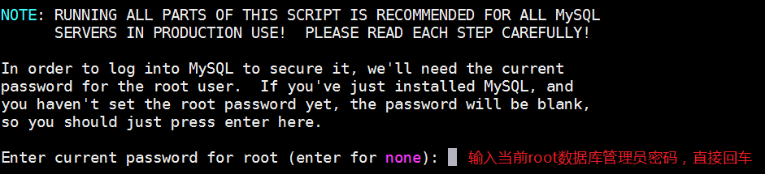

> <font style="color:rgb(119, 119, 119);">扩展：以上说的root和Linux中的root不是同一个用户，这个root代表MySQL数据库的管理员，只不过这个管理员也叫root。</font>


> <font style="color:rgb(119, 119, 119);">学习环境下，密码越简单越好。生产环境下越复杂越好。</font>


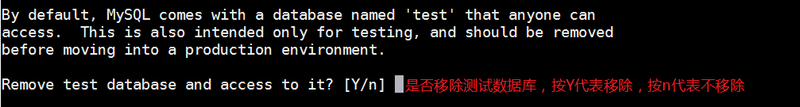


#### <font style="color:rgb(51, 51, 51);">把mysqld服务添加到开机启动项</font>

```shell
# systemctl enable mysqld
```

#### <font style="color:rgb(51, 51, 51);">连接MySQL数据库，测试</font>

```shell
# mysql -u root -p 回车
Enter password:输入刚才设置的密码，如123，回车
mysql> show databases;    =>   代表显示所有数据库
mysql> exit
```

## <font style="color:rgb(51, 51, 51);">PHP安装</font>

### <font style="color:rgb(51, 51, 51);">使用yum命令安装php软件</font>

```shell
# yum install php -y
```

### <font style="color:rgb(51, 51, 51);">使用systemctl启动php软件（重启Apache）</font>

```shell
# systemctl restart httpd
```

> <font style="color:rgb(119, 119, 119);">为什么启动php就是重启Apache呢？答：因为LAMP架构中，PHP是以模块的形式追加到Apache的内核中，所以启动php就相当于重置Apache软件</font>

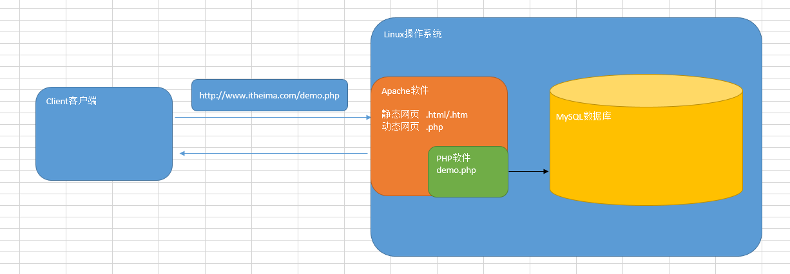

## <font style="color:rgb(51, 51, 51);">测试LAMP环境是否可以使用</font>

第一步：在Windows中，创建一个文件demo.php，文件中的内容如下：

```php
<?php
	echo 'hello world';
?>
```

第二步：将Windows中的demo.php文件上传到Linux服务器的`/var/www/html`目录中

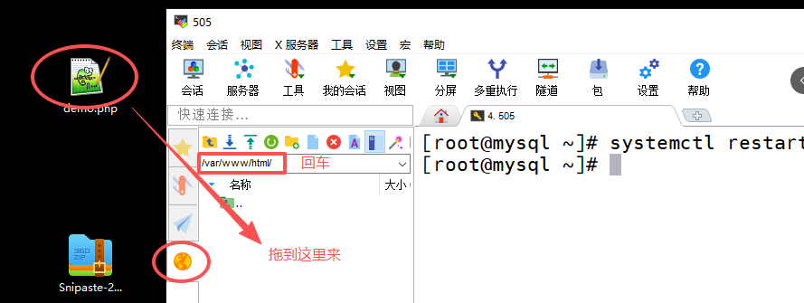

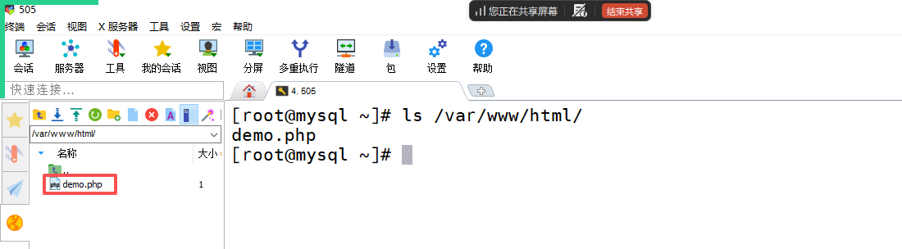

第三步：通过Windows中的浏览器，输入网址访问demo.php，查看效果


如果能显示上面的效果，就说明我们的LAMP环境没毛病！


> 更新: 2026-03-05 14:48:56  
> 原文: <https://www.yuque.com/u41736172/az9urv/zsh3ly0x3yvspum8>