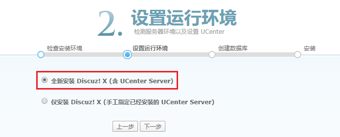
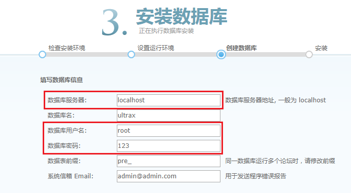
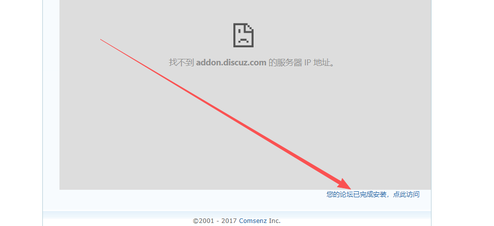

# 09.项目部署

# <font style="color:rgb(51, 51, 51);">一、部署Discuz!论坛</font>
## <font style="color:rgb(51, 51, 51);">Discuz!论坛概述</font>
<font style="color:rgb(51, 51, 51);">Discuz！论坛是基于PHP + MySQL进行开发的一套开源的论坛系统。</font>


## <font style="color:rgb(51, 51, 51);">下载源代码</font>
<font style="color:rgb(51, 51, 51);">下载地址：</font>[<font style="color:rgb(51, 51, 51);">https://gitee.com/ComsenzDiscuz/DiscuzX</font>](https://gitee.com/ComsenzDiscuz/DiscuzX)<font style="color:rgb(51, 51, 51);"> （码云）</font>

<font style="color:rgb(51, 51, 51);">不需要自己下载，使用群里发的压缩包就可以！</font>


## <font style="color:rgb(51, 51, 51);">使用MX软件把Discuz源代码上传</font>
将Windows中的源代码文件，上传到Linux服务器的家目录中！


## <font style="color:rgb(51, 51, 51);">使用unzip对discuz.zip压缩包进行解压</font>
```shell
# unzip discuz.zip
```

## <font style="color:rgb(51, 51, 51);">移动discuz中的文件到/var/www/html目录</font>
```shell
先将/var/www/html目录中的内容删除干净
# rm -rf /var/www/html/*

# mv discuz/* /var/www/html/
```

## <font style="color:rgb(51, 51, 51);">打开浏览器，输入IP地址</font>


## <font style="color:rgb(51, 51, 51);">单击同意许可，继续安装</font>


## <font style="color:rgb(51, 51, 51);">给/var/www/html目录设置可写权限</font>
```shell
# chmod -R a+w /var/www/html
```

> <font style="color:rgb(119, 119, 119);">注意：以上操作是给所有文件添加一个w权限，但是生产环境尽量针对指定文件添加权限。</font>
>

<font style="color:rgb(119, 119, 119);">设置完权限后，你再次刷新浏览器，就有写的权限了！</font>

## <font style="color:rgb(51, 51, 51);">解决PHP扩展问题</font>


<font style="color:rgb(51, 51, 51);">以上提示代表，安装PHP时没有按照php-mysqli扩展，所以会出现以上问题。</font>

```shell
# yum install php-mysqli -y
# systemctl restart httpd
```

## <font style="color:rgb(51, 51, 51);">设置运行环境</font>


## <font style="color:rgb(51, 51, 51);">设置MySQL数据库的相关信息</font>


## <font style="color:rgb(51, 51, 51);">设置管理员账号和密码</font>


## <font style="color:rgb(51, 51, 51);">安装完成后，访问论坛首页</font>


<font style="color:rgb(51, 51, 51);">部署后，访问论坛首页，如下图所示：</font>


访问**前台系统**的地址：http://linux系统IP地址

访问**后台系统**的地址：http://linux系统IP地址/admin.php

# 二、相关说明
## 提交的资料
需要每个组写一份答辩的PPT，PPT中的内容包括但不限于：

+ 组员信息
+ 项目背景
+ 项目介绍
+ 技术架构
+ 部署过程
+ 项目效果
+ 遇到的问题及解决办法（如有）
+ 总结、感悟、心得等等

答辩完成后，答辩的PPT需要提交给老师，学校要收集大家的答辩PPT。

## 成绩说明
成绩包括四部分：

+ 平时的出勤（100分）
+ 日报成绩（100分）
+ 答辩成绩（100分）
+ 报告成绩（100分，本校给）


> 更新: 2026-03-05 15:44:32  
> 原文: <https://www.yuque.com/u41736172/az9urv/oor4sa0kg0dk02ax>