# 02.JDBC技术

# 一、JDBC概述

## 数据的持久化

持久化(persistence)：把数据保存到可掉电式存储设备中以供之后使用。大多数情况下，特别是企业级应用，数据持久化意味着将内存中的数据保存到硬盘上加以”固化”，而持久化的实现过程大多通过各种关系数据库来完成。

持久化的主要应用是将内存中的数据存储在关系型数据库中，当然也可以存储在磁盘文件、XML数据文件中。

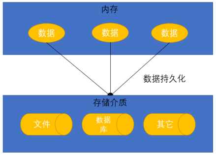

## Java中的数据存储技术

在Java中，数据库存取技术可分为如下几类：

* JDBC直接访问数据库
* 持久化框架，如Hibernate、Mybatis等

**JDBC是java访问数据库的基石，Hibernate、MyBatis等只是更好的封装了JDBC。**

## JDBC概述

* JDBC(Java Database Connectivity)是一个独立于特定数据库管理系统、通用的SQL数据库存取和操作的公共接口（一组API），定义了用来访问数据库的标准Java类库，（java.sql,javax.sql）使用这些类库可以以一种标准的方法、方便地访问数据库资源。
* JDBC为访问不同的数据库提供了一种统一的途径，为开发者屏蔽了一些细节问题。
* JDBC的目标是使Java程序员使用JDBC可以连接任何提供了JDBC驱动程序的数据库系统，这样就使得程序员无需对特定的数据库系统的特点有过多的了解，从而大大简化和加快了开发过程。
* 如果没有JDBC，那么Java程序访问数据库时是这样的：

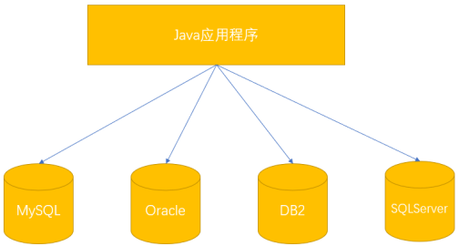

* 有了JDBC，Java程序访问数据库时是这样的：

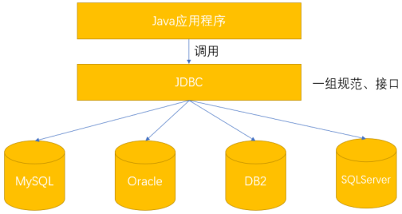

**最终的实际情况如下：**

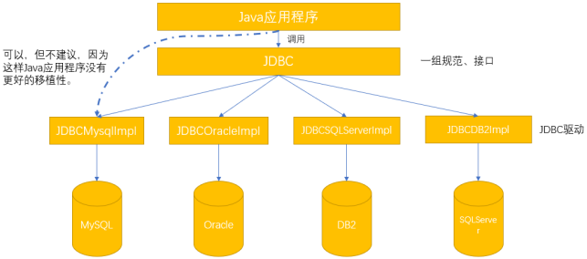

# 二、获取数据库连接

## 要素一：Driver接口

### **<font style="color:rgb(0,0,0);">Driver接口介绍</font>**

* java.sql.Driver接口是所有JDBC驱动程序需要实现的接口。这个接口是提供给数据库厂商使用的，不同数据库厂商提供不同的实现。
* 在程序中不需要直接去访问实现了Driver接口的类，而是由驱动程序管理器类(java.sql.DriverManager)去调用这些Driver实现。

`MySQL的驱动：com.mysql.jdbc.Driver（com.mysql.jdbc.cj.Driver）`

**我们在使用JDBC技术去连接操作某个数据库，那就需要导入这个数据库的驱动包。**

### 加载与注册JDBC驱动

* 加载驱动：加载JDBC 驱动需调用Class 类的静态方法forName()，向其传递要加载的JDBC 驱动的类名Class.forName(“com.mysql.jdbc.Driver”);
* 注册驱动：DriverManager 类是驱动程序管理器类，负责管理驱动程序使用DriverManager.registerDriver(com.mysql.jdbc.Driver)来注册驱动
* 通常不用显式调用DriverManager 类的registerDriver() 方法来注册驱动程序类的实例，因为Driver 接口的驱动程序类都包含了静态代码块，在这个静态代码块中，会调用DriverManager.registerDriver() 方法来注册自身的一个实例。

## 要素二：URL

* JDBC URL 用于标识一个被注册的驱动程序，驱动程序管理器通过这个URL 选择正确的驱动程序，从而建立到数据库的连接。
* JDBC URL的标准由三部分组成，各部分间用冒号分隔。
  * jdbc:子协议:子名称
  * 协议：JDBC URL中的协议总是jdbc
  * 子协议：子协议用于标识一个数据库驱动程序
  * 子名称：一种标识数据库的方法。子名称可以依不同的子协议而变化，用子名称的目的是为了定位数据库提供足够的信息。包含主机名(对应服务端的ip地址)，端口号，数据库名
* 举例：

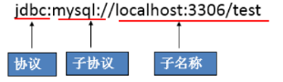

* 常用写法

`jdbc:mysql://localhost:3306/数据库名称?useUnicode=true&characterEncoding=utf8`

## 要素三：用户名和密码

* user,password可以用“属性名=属性值”方式告诉数据库
* 可以调用DriverManager 类的getConnection() 方法建立到数据库的连接

## 数据库连接案例

### 创建项目

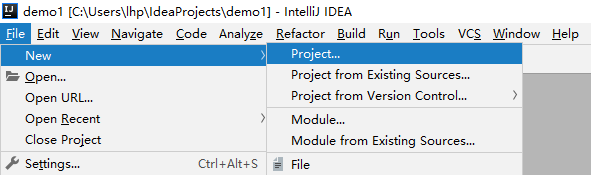

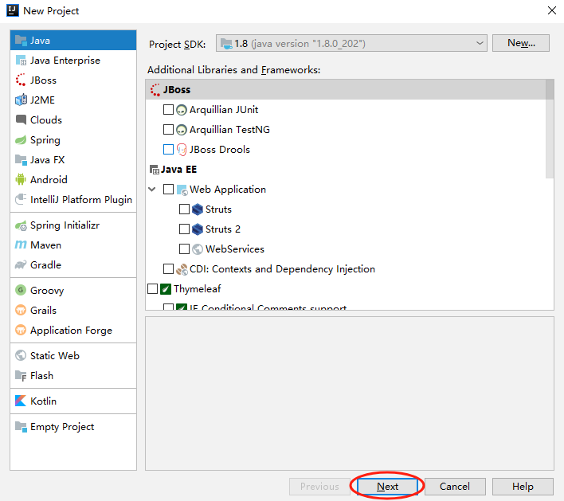

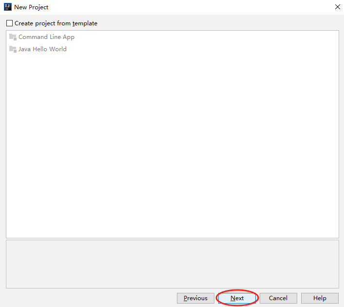

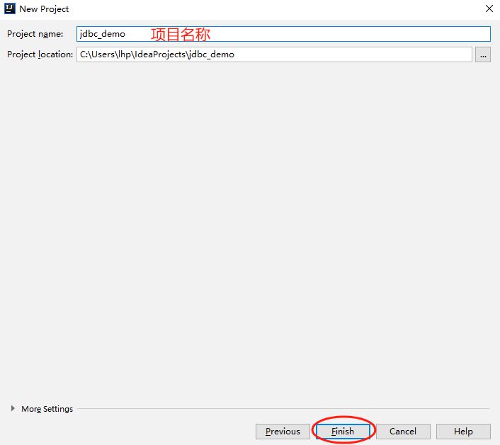

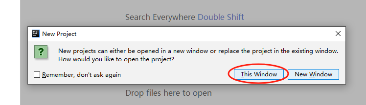

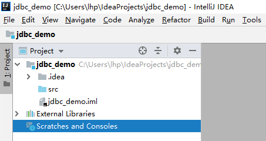

### 导入数据库驱动包

创建lib文件夹

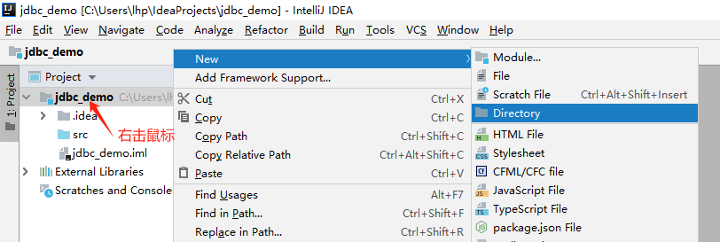

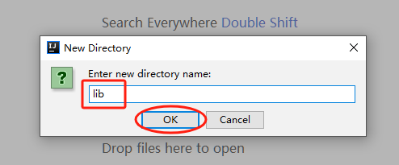

粘贴mysql-connector-java-5.1.5-bin.jar到lib文件夹中

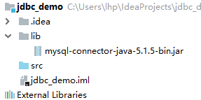

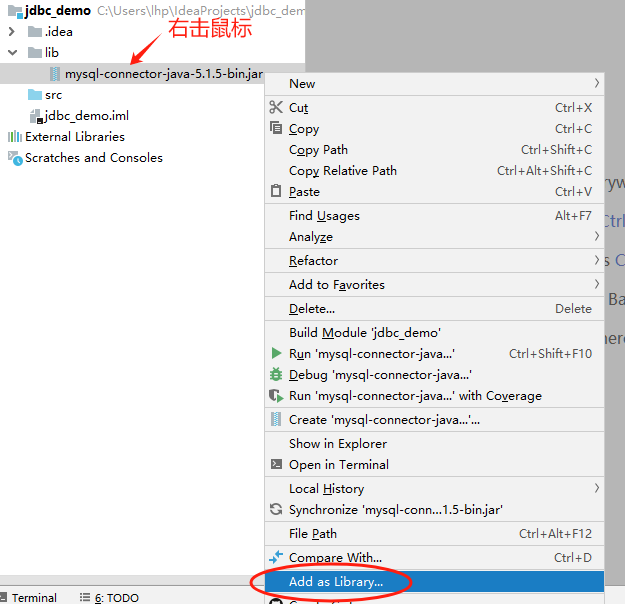

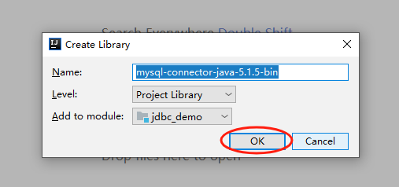

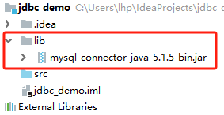

### 编写代码

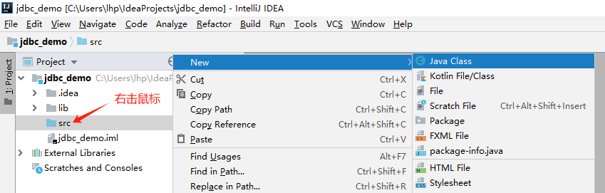

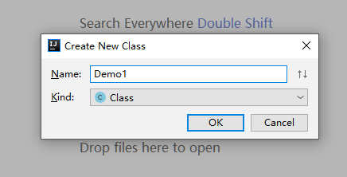

```shell
import java.sql.Connection;
import java.sql.DriverManager;
import java.sql.SQLException;

public class Demo1 {

    public static void main(String[] args) throws ClassNotFoundException, SQLException {

        // 加载数据库驱动
        Class.forName("com.mysql.jdbc.Driver");

        String url = "jdbc:mysql://localhost:3306/test?useUnicode=true&characterEncoding=utf8";
        String user = "root";
        String password = "123456";

        // 获取数据库连接
        Connection connection = DriverManager.getConnection(url, user, password);

        System.out.println(connection);
    }
}
```

### 运行结果

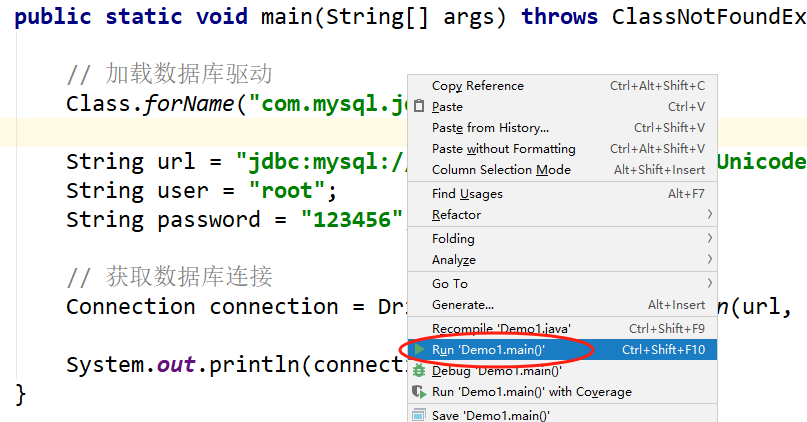

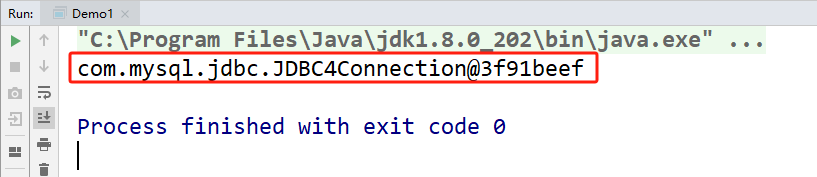

# 三、使用PreparedStatement实现CRUD操作

## 操作和访问数据库

* 数据库连接被用于向数据库服务器发送命令和SQL 语句，并接受数据库服务器返回的结果。其实一个数据库连接就是一个Socket连接。
* 在java.sql 包中可以使用以下接口对数据库进行操作：
  * Statement：用于执行静态SQL 语句并返回它所生成结果的对象。
  * PrepatedStatement：SQL 语句被预编译并存储在此对象中，可以使用此对象多次高效地执行该语句。

## 使用Statement操作数据表的弊端

* 通过调用Connection 对象的createStatement() 方法创建该对象。该对象用于执行静态的SQL 语句，并且返回执行结果。
* Statement 接口中定义了下列方法用于执行SQL 语句：

```shell
int excuteUpdate(String sql)：执行更新操作INSERT、UPDATE、DELETE
ResultSet executeQuery(String sql)：执行查询操作SELECT
```

* 但是使用Statement操作数据表存在弊端：
  * 存在拼串操作，繁琐
  * 存在SQL注入问题
* SQL 注入是利用某些系统没有对用户输入的数据进行充分的检查，而在用户输入数据中注入非法的SQL 语句段或命令(如：`SELECT * FROM users WHERE username = 'admin' OR '1'='1' AND password = 'password';`) ，从而利用系统的SQL 引擎完成恶意行为的做法。
* 对于Java 而言，要防范SQL 注入，只要用PreparedStatement(从Statement扩展而来) 取代Statement 就可以了。

**所以，我们以后对数据库的操作使用PrepareStatement最好，不要使用Statement。**

## Statement使用演示

主要为了演示一下SQL注入问题。顺便使大家了解一下登录的流程及JDBC的使用！

### 准备工作

使用navicat创建数据库，名称为sygy

创建数据库表user，字段有：id、username、password

### 编写代码

```shell
import java.sql.*;
import java.util.Scanner;

public class Demo2 {

    public static void main(String[] args) throws ClassNotFoundException, SQLException {

        // 加载数据库驱动
        Class.forName("com.mysql.jdbc.Driver");

        // 获取数据库连接
        String url = "jdbc:mysql://localhost:3306/sygy?useUnicode=true&characterEncoding=utf8";
        String user = "root";
        String password = "123456";
        Connection connection = DriverManager.getConnection(url, user, password);

        // 创建语句对象
        Statement statement = connection.createStatement();

        Scanner scanner = new Scanner(System.in);
        // 输入用户名
        System.out.println("请输入用户名：");
        String username = scanner.next();
        // 输入密码
        System.out.println("请输入密码：");
        String pwd = scanner.next();

        // 编写sql语句
        String sql = "select * from user where username='"+username+"' and password = '"+pwd+"'";

        // 执行sql语句，得到结果集
        ResultSet resultSet = statement.executeQuery(sql);

        // 判断结果集是否有内容
        if(resultSet.next()){
            System.out.println("登录成功");
        }else{
            System.out.println("登录失败");
        }

        // 关闭连接释放资源(暂时这么写，后面我们会调整)
        resultSet.close();
        statement.close();
        connection.close();
    }
}
```

### 运行结果

正常输入是没问题的。

如果输入账号是：zs'#   那么不论输入什么密码都能登录，<font style="color:rgb(51, 51, 51);">#号在mysql中起到注释的作用，导致#后面的sql语句被注释掉，password条件没有启动作用。所以，只要sql中拼接的用户名在数据库中存在就可以登录成功。</font>

因此，推荐大家使用PrepareStatement。它可以有效的防止SQL注入。

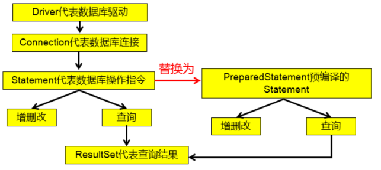

## PreparedStatement的使用

### **<font style="color:rgb(0,0,0);">PreparedStatement介绍</font>**

* 可以通过调用Connection 对象的preparedStatement(String sql) 方法获取PreparedStatement 对象
* PreparedStatement 接口是Statement 的子接口，它表示一条预编译过的SQL 语句
* PreparedStatement 对象所代表的SQL 语句中的参数用问号(?)来表示，调用PreparedStatement 对象的setXxx() 方法来设置这些参数. setXxx() 方法有两个参数，第一个参数是要设置的SQL 语句中的参数的索引(从1开始)，第二个是设置的SQL 语句中的参数的值

### **<font style="color:rgb(0,0,0);">PreparedStatement与Statement</font>**

* 使用PreparedStatement的代码的可读性和可维护性更好。
* PreparedStatement 能最大可能提高性能：
  * DBServer会对预编译语句提供性能优化。因为预编译语句有可能被重复调用，所以语句在被DBServer的编译器编译后的执行代码被缓存下来，那么下次调用时只要是相同的预编译语句就不需要编译，只要将参数直接传入编译过的语句执行代码中就会得到执行。
  * 在statement语句中,即使是相同操作但因为数据内容不一样,所以整个语句本身不能匹配,没有缓存语句的意义.事实是没有数据库会对普通语句编译后的执行代码缓存。这样每执行一次都要对传入的语句编译一次。
* PreparedStatement 可以防止SQL 注入

### **<font style="color:rgb(0,0,0);">数据库操作步骤</font>**

JDBC对数据库的操作主要就是以下步骤：

1. 加载数据库驱动
2. 获取数据库连接
3. 编写sql语句
4. 创建预编译语句对象
5. 执行sql语句
6. 得到结果

### **<font style="color:rgb(0,0,0);">使用ps实现添加</font>**

创建一张emp表，有字段：id、name、sex、age。

```shell
import java.sql.Connection;
import java.sql.DriverManager;
import java.sql.PreparedStatement;

public class Demo3 {

    public static void main(String[] args) throws Exception {

        // 加载数据库驱动
        Class.forName("com.mysql.jdbc.Driver");

        // 获取数据库连接
        String url = "jdbc:mysql://localhost:3306/sygy?useUnicode=true&characterEncoding=utf8";
        String user = "root";
        String password = "123456";
        Connection connection = DriverManager.getConnection(url, user, password);

        // 编写sql语句
        String sql = "insert into emp values(null, ?, ?, ?)";

        // 创建预编译语句对象
        PreparedStatement ps = connection.prepareStatement(sql);

        // 给sql语句中的占位符赋值
        ps.setString(1, "张三");
        ps.setString(2, "男");
        ps.setInt(3, 20);

        // 执行sql语句
        ps.executeUpdate();

        // 关闭连接，释放资源
        ps.close();
        connection.close();
    }
}
```

### 使用ps实现修改

```shell
import java.sql.Connection;
import java.sql.DriverManager;
import java.sql.PreparedStatement;
import java.sql.SQLException;

public class Demo4 {

    public static void main(String[] args) {

        Connection connection = null;
        PreparedStatement ps = null;

        try {
            // 加载数据库驱动
            Class.forName("com.mysql.jdbc.Driver");
            // 获取数据库连接
            String url = "jdbc:mysql://localhost:3306/sygy?useUnicode=true&characterEncoding=utf8";
            String user = "root";
            String password = "123456";
            connection = DriverManager.getConnection(url, user, password);

            // 编写sql语句
            String sql = "update emp set name=?, sex=?, age=? where id = ?";

            // 创建预编译语句对象
            ps = connection.prepareStatement(sql);

            // 给sql中的占位符赋值
            ps.setString(1, "小美");
            ps.setString(2, "女");
            ps.setInt(3, 18);
            ps.setInt(4, 1);

            // 执行sql语句
            ps.executeUpdate();

        } catch (Exception e) {

            e.printStackTrace();
        }finally {

            // 关闭连接释放资源
            if(ps != null){
                try {
                    ps.close();
                } catch (SQLException e) {
                    e.printStackTrace();
                }
            }
            if(connection != null){
                try {
                    connection.close();
                } catch (SQLException e) {
                    e.printStackTrace();
                }
            }
        }
    }
}
```

### 使用ps实现查询

```shell
```

### 使用ps实现删除

```shell
```

### 资源的释放

* 释放ResultSet, Statement,Connection。
* 数据库连接（Connection）是非常稀有的资源，用完后必须马上释放，如果Connection不能及时正确的关闭将导致系统宕机。Connection的使用原则是尽量晚创建，尽量早的释放。
* 可以在finally中关闭，保证及时其他代码出现异常，资源也一定能被关闭。


> 更新: 2025-02-17 07:20:22  
> 原文: <https://www.yuque.com/u41736172/az9urv/tkacuks23wtmvmmk>