# 01.CentOS7.6系统安装部署

# 一、学习目标
1. 了解操作系统发展史以及作用
2. 掌握虚拟机软件安装
3. 新建虚拟机以及CentOS系统安装
4. 掌握备份操作系统

# 二、操作系统概述
## 计算机发展史
第一台计算机是1946 年2 月14 日诞生日，第一台名称ENIAC。体积一间屋子的大小，重量高达28t。

第一代：1946 – 1958 => 12 年 （电子管）

第二代：1958 – 1964 => 6 年 （晶体管）

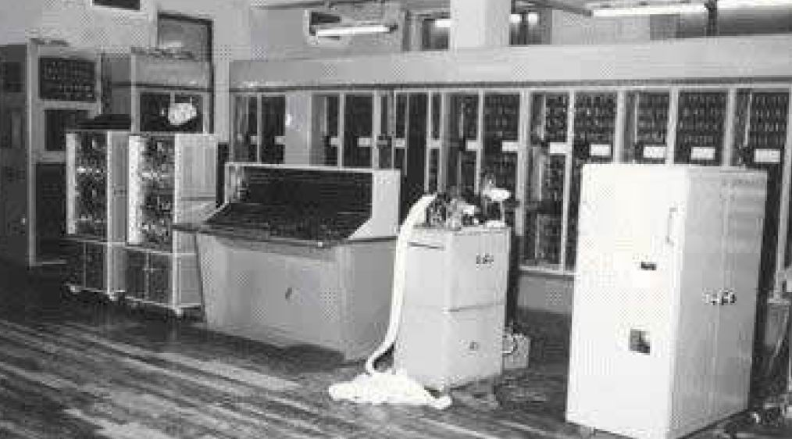

第三代：1964 – 1970 => 6 年 （集成电路）

第四代：1970 – 至今 （大规模集成电路）

## 计算机组成
**CPU、内存、**风扇、**硬盘**、显示器、主板、电源、声卡、网卡、显卡、鼠标、键盘等

## 计算机资源（重点）
计算机资源分为2 部分：硬件资源、软件资源

硬件：一般硬件是指计算机的物理组成，由真实（看得见，摸得着）的设备组成的

软件：软件一般是指应用程序，应用程序程序是由开发人员去按照编程语言的特定的规则去编写的程序。除了上述的应用程序之外，操作系统也属于软件资源的范畴，它属特殊的软件。

> 问题：为什么在打开一个应用程序之后（吃鸡游戏），当玩家在敲击键盘和移动鼠标的时候里面人物会有对应的行为表现呢？
>

答：用户敲击键盘/移动鼠标（硬件操作） → 硬件的驱动（软件资源） → 操作系统（软件） → 硬件支持（cpu） → 操作系统（软件） → 驱动（显卡驱动） → 显示在屏幕上（硬件）

所以由此可知，操作系统是软件资源与硬件资源之间的**桥梁**。

用户与计算机中软件进行交互的时候，离不开操作系统

## 操作系统
常见操作系统有：Windows、MacOS、Unix/Linux。 类UNIX

Windows：其是微软公司研发的收费操作系统（闭源）。

Windows 系统体系分为两类：用户操作系统、Server 操作系统。

用户操作系统：win 95、win 98、win NT、win Me、win xp、vista、win7、win8、win10。

MacOS：其是由苹果公司开发的一款收费（变相收费，买电脑送系统）操作系统。该系统从终端角度来看分为：watch OS、IOS、MacOS。其表现突出的地方：底层优化实现的很好、安全性要更加高点（闭源）。 operation system

Linux：Linux 是目前全球使用量最多的服务器操作系统（开源）。其体系很强大，其分支有很多（数不胜数），其目前主要的分支有：RedHat（红帽）、CentOS、Debian、乌班图（ubuntu）等等。其在世界范围最大的使用分支是安卓。

闭源：不开放源代码，用户是没有办法看到软件的底层实现。

开源：表示开放源代码。

## 为什么需要Linux操作系统
> 问题：windows 既然可以使用傻瓜式的方式进行操作，例如使用ctrl+c 表示复制，ctrl+v 表示粘贴等，为什么还需要使用/学习Linux 系统？
>

① 性能问题，Windows 服务器操作系统不如Linux 高；

② 稳定性问题：

底层架构：Linux 更加稳定，其开机时间可以达到好几年不关机；

开源：因为开源，人人都可以看到源代码，就可以为其提供自己的补丁，补丁可以提高稳定性和安全性；

③ 安全性问题：

Linux 操作系统，相对于Windows 操作系统要更加安全；

④ 远程管理方面：

Windows 不及Linux 操作高效。

⑤ 服务器价格昂贵的，需要对资源进行充分利用，充分把计算机资源用到项目上（访问并发、性能），而不是把资源浪费在图形化界面或者方便程度上；

# 三、Linux发展史
## Linux 起源

**Linus(林纳斯·托瓦兹)**：Linux 的开发作者，被称为Linux 之父，Linux 诞生时是芬兰赫尔辛基大学的在校大学生。**Stallman 斯特曼**：开源文化的倡导人。

## Linux 的含义
狭义：由Linus 编写的一段内核代码。

广义：广义上的Linux 是指由Linux内核衍生的各种Linux发行版本。（CentOS、Ubuntu）

> 注意：以后提及到的Linux 都是广义上的Linux
>

## Linux特点
开放性（开源）、多用户、多任务、良好的用户界面、优异的性能与稳定性

多用户多任务：

单用户：一个用户，在登录计算机（操作系统），只能允许同时登录一个用户；

单任务：一个任务，允许用户同时进行的操作任务数量；

多用户：多个用户，在登录计算机（操作系统），允许同时登录多个用户进行操作；

多任务：多个任务，允许用户同时进行多个操作任务；

Windows 属于：单用户、多任务。

而Linux系统则属于：多用户、多任务。

## Linux分支(Linux衍生版：Linux厂商基于Linux内核)
分支：Linux 分支有很多，现在比较有名的redhat、ubuntu、debian、centos（Community Enterprise Operating System）、suse 等等。

redhat红帽（redhat企业版、centos社区版）、ubuntu（乌班图）、debian、suse

中国Linux系统：红旗（Redflag）、麒麟、深度OS（推荐，和Windows基本一致）

**CentOS7.6**

# 四、Linux系统安装
## Linux系统安装方式
目前安装操作系统方式有2 种：真机安装、虚拟机安装。

真机安装：使用真实的电脑进行安装，像安装windows 操作系统一样，真机安装的结果就是替换掉当前的windows 操作系统；（缺点：对系统进行格式化，重新安装）

虚拟机安装：通过一些特定的手段，来进行模拟安装，并不会影响当前计算机的真实操作系统；

> 如果是学习或者测试使用，强烈建议使用虚拟机安装方式。
>

## 虚拟机概念
什么是虚拟机？

虚拟机，有些时候想模拟出一个真实的电脑环境，碍于使用真机安装代价太大，因此而诞生的一款可以模拟操作系统运行的软件。

虚拟机目前有2 个比较有名的产品：vmware 出品的vmware workstation、oracle 出品的virtual Box。

## 虚拟机的安装
第一步：复制VMware软件包到Windows系统中

第二步：双击VMware安装包，进行软件的安装

第三步：勾选软件的许可协议

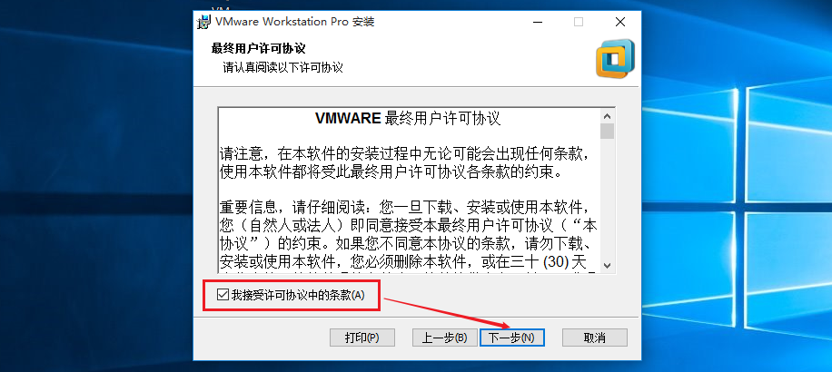

第四步：设置VMware安装路径以及勾选增强型的键盘程序

第五步：用户体验设置

下一步、下一步，直到软件安装完成即可。

第六步：安装完成后，输入许可证密钥，破解VMware软件

输入密钥：

> 特别注意：VMware WorkStation安装完毕后，其在网络适配器中会产生两张虚拟网卡。
>
> VMnet1与VMnet8，如果没有产生这两张网卡，则操作系统必须重装！
>

## Linux系统环境部署
Linux系统版本选择：CentOS7.6 x64，【镜像一般都是CentOS*.iso文件】

> 问题：为什么不选择最新版的8 版本？
>
> 7.x 目前依然是主流
>
> 7.x 的各种系统操作模式是基础
>

官网：[https://www.centos.org/](https://www.centos.org/) ，从官网下载得到的镜像文件：

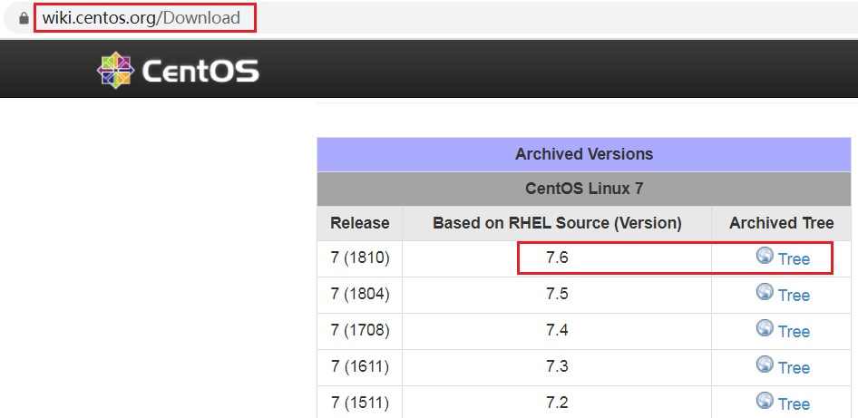

Centos7.6版本下载地址：

[http://vault.centos.org/7.6.1810/isos/x86_64/CentOS-7-x86_64-Everything-1810.iso](http://vault.centos.org/7.6.1810/isos/x86_64/CentOS-7-x86_64-Everything-1810.iso)

第一步：创建新的虚拟机

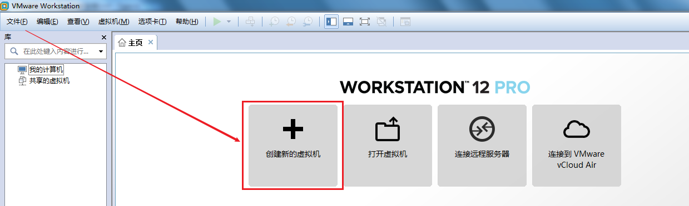

第二步：选择自定义设置

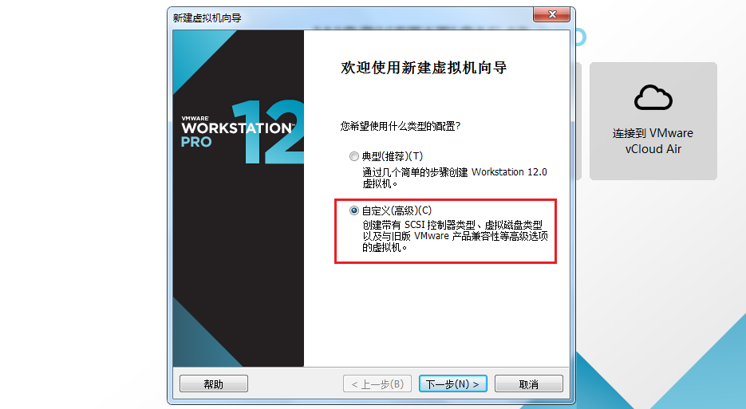

第三步：选择稍后安装操作系统

第四步：选择要安装的操作系统类型

第五步：设置操作系统的名称与安装路径

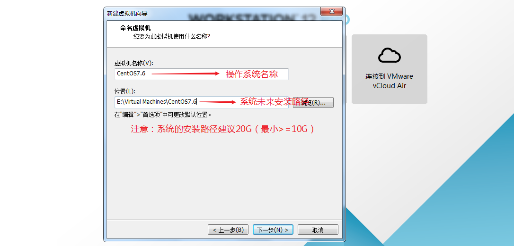

第六步：CPU选择1颗2核

第七步：内存设置为2048MB（2GB）

第八步：设置网络模式为NAT模式（共享上网）

设置完毕后，下一步、下一步、下一步...直到虚拟机创建完成。

## 安装CentOS7.6操作系统(上)
第一步：选择CD/DVD光驱，如下图所示

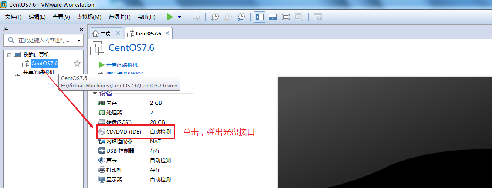

第二步：选择CentOS7.6光盘文件（CentOS-7.6-x86_64-DVD-1810.iso，不需要解压）

第三步：开启虚拟机，启动CentOS7.6操作系统光盘镜像

使用方向键向上移动到第一个菜单

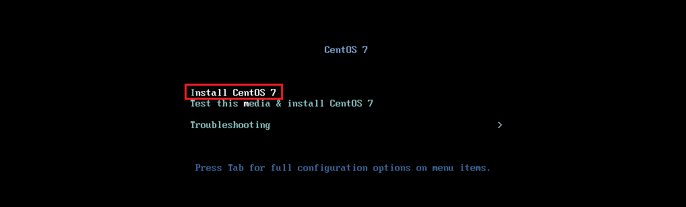

回车，进入安装菜单

再次按回车，进入到CentOS7.6的安装界面。

## 安装CentOS7.6操作系统(中)
第一步：选择安装时使用的语言（全英文）

第二步：设置时间 => 亚洲/上海 => Asia/Shanghai

第三步：选择安装系统界面以及需要安装的软件（非常重要）

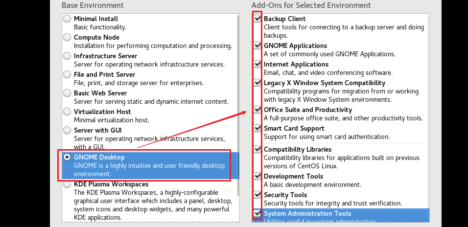

第四步：自动分区

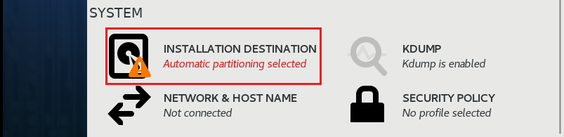

由于还没有学习过Linux的分区技术，所以我们暂时选择自动分区。

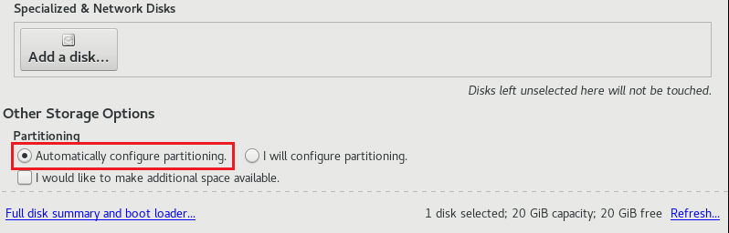

第五步：连接网络

第六步：给root管理员设置密码以及创建一个普通的用户

root账号默认已经存在，但是没有密码，需要人为设置。设置完成后，还需要创建一个普通的账号如lhp。

> root密码：123456，超级管理员，实际工作中越复杂越好
>
> lhp密码：123456，普通账号
>

## 安装CentOS7.6操作系统(下)
第一步：安装完成后，单击Reboot按钮，重启计算机

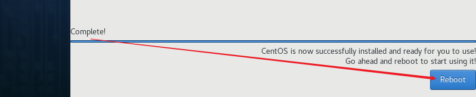

第二步：选择同意CentOS7授权

第三步：勾选同意以上许可协议

设置完成后，单击完成配置，到此CentOS7.6就全部安装完成了！

# 五、备份操作系统
在VMware中备份的方式有2 种：快照或克隆。

## 快照
快照：又称还原点，就是保存在拍快照时候的系统的状态（包含了所有的内容），在后期的时候随时可以恢复。

> 注意：侧重在于短期备份，需要频繁备份的时候都可以使用快照，做快照的时候虚拟机中操作系统一般处于开启状态
>

****

**使用VMware实现拍摄快照，具体操作步骤，参考如下**

第一步：启动Linux的操作系统（快照备份是在系统启动后进行操作的）

第二步：单击VMware菜单栏=>虚拟机=>快照=>选择拍摄快照

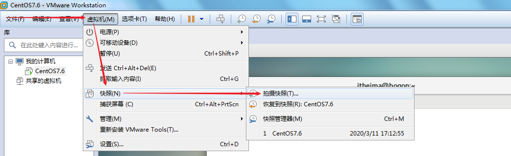

第三步：输入拍摄快照的名称（为什么要有名字？为了方便后期的恢复操作）

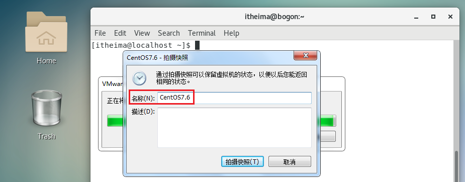

**使用VMware实现恢复快照，具体操作步骤，参考如下**

第一步：模拟Linux操作系统故障（比如系统文件被删除、系统损坏等等）

第二步：选择VMware菜单栏=>虚拟机=>快照=>恢复到快照（根据拍摄时的名称进行恢复）

## 克隆
克隆：就是复制的意思。

> 注意：克隆侧重长期备份，做克隆的时候是必须得关闭（了解）
>

**克隆：使用VMware实现克隆，具体操作步骤，参考如下**

第一步：使用关机按钮或相关的关机命令对Linux进行关机操作

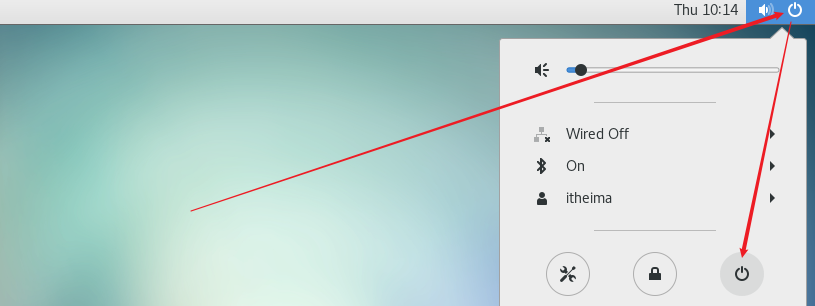

第二步：在要克隆的操作系统菜单上，鼠标右键，选择管理，选择克隆

第三步：根据向导进行克隆备份

下一步、下一步，选择克隆类型，**一定要选择完整克隆**

设置克隆机的名称以及存储路径（此路径剩余可用空间必须>=10G）

克隆完成后，效果如下图所示：产生了一个全新的操作系统

克隆侧重长期备份，做克隆的时候是必须得关闭操作系统（了解）

应用场景：快速创建多台计算机

## 快照与克隆的区别
克隆与快照的最大的区别：克隆之后是2 台机器，而快照之后依旧是1 台机器（类似windows的还原点）。后期的危险操作前建议使用快照。

# 六、锁屏时间配置
## 什么是锁屏
当我们的计算机静止不动，5分钟后，会自动锁定屏幕。

解锁还需要重新输入密码，很麻烦，所以应该解除5分钟限制。

## 解除5分钟锁屏限制
第一步：单击设置菜单

第二步：选择Power（节能）

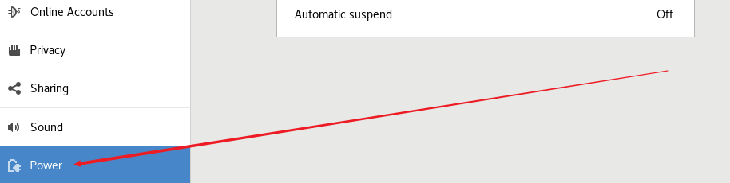

第三步：设置锁屏时间

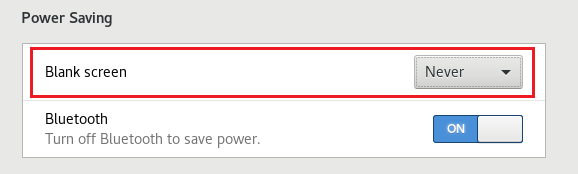

> 更新: 2025-03-05 19:23:24  
> 原文: <https://www.yuque.com/u41736172/az9urv/fd46u7kbztaycws4>