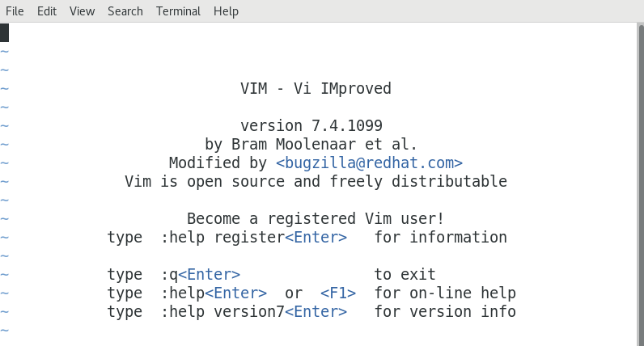
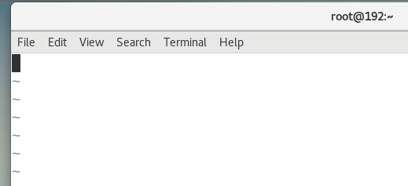
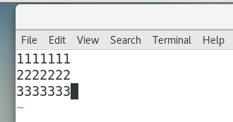
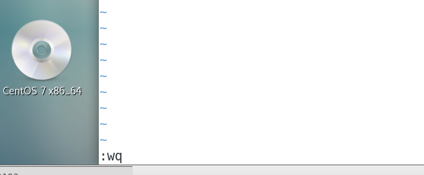
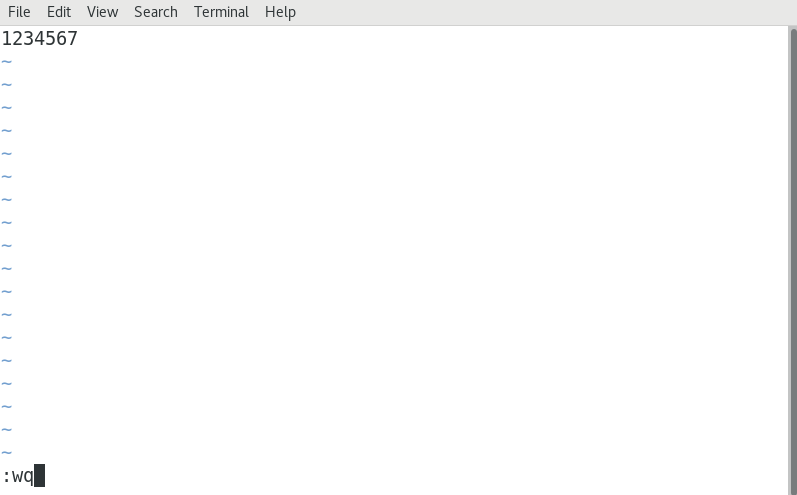
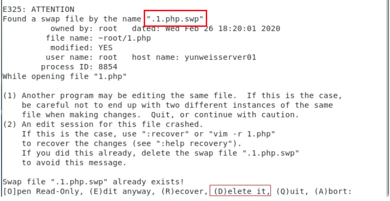

# 04.Linux文件管理（下）

# <font style="color:rgb(51, 51, 51);">一、VIM编辑器</font>

## <font style="color:rgb(51, 51, 51);">vi概述</font>

<font style="color:rgb(51, 51, 51);">vi（visual editor）编辑器通常被简称为vi，它是Linux和Unix系统上最基本的文本编辑器，类似于Windows 系统下的notepad（记事本）编辑器。</font>

## <font style="color:rgb(51, 51, 51);">vim编辑器</font>

<font style="color:rgb(51, 51, 51);">Vim(Vi improved)是vi编辑器的加强版，比vi更容易使用。vi的命令几乎全部都可以在vim上使用。</font>

## <font style="color:rgb(51, 51, 51);">vim编辑器的安装</font>

### <font style="color:rgb(51, 51, 51);">已安装</font>

<font style="color:rgb(51, 51, 51);">Centos通常都已经默认安装好了 vi 或 Vim 文本编辑器，我们只需要通过vim命令就可以直接打开vim编辑器了，如下图所示：</font>



### <font style="color:rgb(51, 51, 51);">未安装</font>

<font style="color:rgb(51, 51, 51);">有些精简版的Linux操作系统，默认并没有安装vim编辑器（可能自带的是vi编辑器）。当我们在终端中输入vim命令时，系统会提示"command not found"。</font>

<font style="color:rgb(51, 51, 51);">解决办法：有网的前提下，可以使用yum工具对vim编辑器进行安装</font>

```shell
# yum install vim -y
```

## <font style="color:rgb(51, 51, 51);">vim编辑器的四种模式（重点）</font>

### <font style="color:rgb(51, 51, 51);">命令模式</font>

<font style="color:rgb(51, 51, 51);">使用VIM编辑器时，默认处于命令模式。在该模式下可以移动光标位置，可以通过快捷键对文件内容进行复制、粘贴、删除等操作。</font>

### <font style="color:rgb(51, 51, 51);">编辑模式或输入模式</font>

<font style="color:rgb(51, 51, 51);">在命令模式下输入小写字母a或小写字母i即可进入编辑模式，在该模式下可以对文件的内容进行编辑。</font>

### <font style="color:rgb(51, 51, 51);">末行模式</font>

<font style="color:rgb(51, 51, 51);">在命令模式下输入冒号:即可进入末行模式，可以在末行输入命令来对文件进行查找、替换、保存、退出等操作。</font>

### <font style="color:rgb(51, 51, 51);">可视化模式（了解）</font>

<font style="color:rgb(51, 51, 51);">可以做一些列选操作（通过方向键选择某些列的内容）</font>

# <font style="color:rgb(51, 51, 51);">二、VIM四种模式的关系</font>

## <font style="color:rgb(51, 51, 51);">VIM四种模式</font>

<font style="color:rgb(51, 51, 51);">命令模式/编辑模式/末行模式/可视化模式</font>

## <font style="color:rgb(51, 51, 51);">VIM四种模式的关系</font>


# <font style="color:rgb(51, 51, 51);">三、VIM编辑器的使用</font>

## vim入门案例

1. 在家目录中创建一个hello.txt文件

```shell
# touch hello.txt
```

2. 使用vim编辑器打开hello.txt文件

```shell
# vim hello.txt
```



目前是在命令模式。

3. 往hello.txt文件中随便写一些内容

按小写字母 i 或者小字母 a，就由命令模式进入到插入模式了



4. 保存文件并退出。

在插入模式下，按ESC，就可以进入到命令模式。

在命令模式中，输入冒号，进入末行模式。

在末行模式中，输入wq，就是保存并退出文件。



## <font style="color:rgb(51, 51, 51);">使用vim打开文件</font>

<font style="color:rgb(51, 51, 51);">基本语法：</font>

```shell
# vim  文件名称
```

<font style="color:rgb(51, 51, 51);">① 如果文件已存在，则直接打开</font>

<font style="color:rgb(51, 51, 51);">② 如果文件不存在，则vim编辑器会自动在内存中创建一个新文件</font>

<font style="color:rgb(51, 51, 51);">案例：使用vim命令打开readme.txt文件</font>

```shell
# vim readme.txt
```

## <font style="color:rgb(51, 51, 51);">vim编辑器保存文件</font>

<font style="color:rgb(51, 51, 51);">在任何模式下，连续按两次Esc键，即可返回到命令模式。然后按冒号：，进入到末行模式，输入wq，代表保存并退出。</font>



## <font style="color:rgb(51, 51, 51);">vim编辑器强制退出（不保存）</font>

<font style="color:rgb(51, 51, 51);">在任何模式下，连续按两次Esc键，即可返回到命令模式。然后按冒号：，进入到末行模式，输入q!，代表强制退出但是不保存文件。</font>


## <font style="color:rgb(51, 51, 51);">命令模式下的相关操作（重点）</font>

### <font style="color:rgb(51, 51, 51);">如何进入命令模式</font>

<font style="color:rgb(51, 51, 51);">答：在Linux操作系统中，当我们使用vim命令直接打开某个文件时，默认进入的就是命令模式。如果我们处于其他模式（编辑模式、可视化模式以及末行模式）可以连续按两次Esc键也可以返回命令模式。</font>

### <font style="color:rgb(51, 51, 51);">命令模式下我们能做什么</font>

<font style="color:rgb(51, 51, 51);">① 移动光标 ② 复制 粘贴 ③ 剪切 粘贴 删除 ④ 撤销与恢复等等</font>

### <font style="color:rgb(51, 51, 51);">移动光标到首行或末行（重点）</font>

<font style="color:rgb(51, 51, 51);">移动光标到首行 => gg</font>

<font style="color:rgb(51, 51, 51);">移动光标到末行 => G</font>

### <font style="color:rgb(51, 51, 51);">翻屏</font>

<font style="color:rgb(51, 51, 51);">向上 翻屏，按键：</font><code><font style="color:rgb(51, 51, 51);background-color:rgb(243, 244, 244);">ctrl + b （before） 或 </font>**<font style="color:rgb(51, 51, 51);background-color:rgb(243, 244, 244);">PgUp</font>**</code>

<font style="color:rgb(51, 51, 51);">向下 翻屏，按键：</font><code><font style="color:rgb(51, 51, 51);background-color:rgb(243, 244, 244);">ctrl + f （after） 或 </font>**<font style="color:rgb(51, 51, 51);background-color:rgb(243, 244, 244);">PgDn</font>**</code>

<font style="color:rgb(51, 51, 51);">向上翻半屏，按键：</font><code><font style="color:rgb(51, 51, 51);background-color:rgb(243, 244, 244);">ctrl + u （up）</font></code>

<font style="color:rgb(51, 51, 51);">向下翻半屏，按键：</font><code><font style="color:rgb(51, 51, 51);background-color:rgb(243, 244, 244);">ctrl + d （down）</font></code>

**<font style="color:rgb(51, 51, 51);background-color:rgb(243, 244, 244);">Home   End</font>**

### <font style="color:rgb(51, 51, 51);">快速定位光标到指定行（重点）</font>

<font style="color:rgb(51, 51, 51);">行号 + G，如150G代表快速移动光标到第150行。</font>

### <font style="color:rgb(51, 51, 51);">复制/粘贴（重点）</font>

<font style="color:rgb(51, 51, 51);">① 复制当前行（光标所在那一行）</font>

<font style="color:rgb(51, 51, 51);">按键：yy</font>

<font style="color:rgb(51, 51, 51);">粘贴：在想要粘贴的地方按下p 键【将粘贴在光标所在行的下一行】,如果想粘贴在光标所在行之前，则使用P键</font>

<font style="color:rgb(51, 51, 51);">② 从当前行开始复制指定的行数，如复制5行，5yy</font>

<font style="color:rgb(51, 51, 51);">粘贴：在想要粘贴的地方按下p 键【将粘贴在光标所在行的下一行】,如果想粘贴在光标所在行之前，则使用P键</font>

### <font style="color:rgb(51, 51, 51);">剪切/删除（重点）</font>

<font style="color:rgb(51, 51, 51);">在VIM编辑器中，剪切与删除都是dd</font>

<font style="color:rgb(51, 51, 51);">如果剪切了文件，但是没有使用p进行粘贴，就是删除操作</font>

<font style="color:rgb(51, 51, 51);">如果剪切了文件，然后使用p进行粘贴，这就是剪切操作</font>

<font style="color:rgb(51, 51, 51);">① 剪切/删除当前光标所在行</font>

<font style="color:rgb(51, 51, 51);">按键：dd （删除之后下一行上移）</font>

<font style="color:rgb(51, 51, 51);">粘贴：p</font>

<font style="color:rgb(51, 51, 51);">注意：dd 严格意义上说是剪切命令，但是如果剪切了不粘贴就是删除的效果。</font>

<font style="color:rgb(51, 51, 51);">② 剪切/删除多行（从当前光标所在行开始计算）</font>

<font style="color:rgb(51, 51, 51);">按键：数字dd</font>

<font style="color:rgb(51, 51, 51);">粘贴：p</font>

<font style="color:rgb(51, 51, 51);">特殊用法：</font>

<font style="color:rgb(51, 51, 51);">③ 剪切/删除光标所在的当前行（光标所在位置）之后的内容，但是删除之后下一行不上移</font>

<font style="color:rgb(51, 51, 51);">按键：D，删除光标所在行中光标后面的内容，如果光标在该行的行首，那就将这一行都删除，并且下面的内容不上移</font>

### <font style="color:rgb(51, 51, 51);">撤销/恢复（重点）</font>

<font style="color:rgb(51, 51, 51);">撤销：u（undo）</font>

<font style="color:rgb(51, 51, 51);">恢复：ctrl + r 恢复（取消）之前的撤销操作【重做，redo】</font>

### <font style="color:rgb(51, 51, 51);">总结</font>

<font style="color:rgb(51, 51, 51);">① 怎么进入命令模式（vim 文件名称，在任意模式下，可以连续按两次Esc键即可返回命令模式）</font>

<font style="color:rgb(51, 51, 51);">② 命令模式能做什么？移动光标、复制/粘贴、剪切/删除、撤销与恢复</font>

<font style="color:rgb(51, 51, 51);">首行 => gg，末行 => G 翻屏（了解） 快速定位 行号G，如150G</font>

<font style="color:rgb(51, 51, 51);">yy p 5yy p</font>

<font style="color:rgb(51, 51, 51);">dd p 5dd p</font>

<font style="color:rgb(51, 51, 51);">u</font>

<font style="color:rgb(51, 51, 51);">ctrl + r</font>

## <font style="color:rgb(51, 51, 51);">末行模式下的相关操作（重点）</font>

### <font style="color:rgb(51, 51, 51);">如何进入末行模式</font>

<font style="color:rgb(51, 51, 51);">进入末行模式的方法只有一个，在命令模式下使用冒号：的方式进入。</font>

### <font style="color:rgb(51, 51, 51);">末行模式下我们能做什么</font>

<font style="color:rgb(51, 51, 51);">文件保存、退出、查找与替换、显示行号、paste模式等等</font>

### <font style="color:rgb(51, 51, 51);">保存/退出（重点）</font>

<font style="color:rgb(51, 51, 51);">:w => 代表对当前文件进行保存操作，但是其保存完成后，并没有退出这个文件</font>

<font style="color:rgb(51, 51, 51);">:q => 代表退出当前正在编辑的文件，但是一定要注意，文件必须先保存，然后才能退出</font>

**<font style="color:rgb(51, 51, 51);">:wq</font>**<font style="color:rgb(51, 51, 51);"> => 代表文件先保存后退出（保存并退出）</font>

<font style="color:rgb(51, 51, 51);">如果一个文件在编辑时没有名字，则可以使用:wq 文件名称，代表把当前正在编辑的文件保存到指定的名称中，然后退出</font>

**<font style="color:rgb(51, 51, 51);">:q!</font>**<font style="color:rgb(51, 51, 51);"> => 代表强制退出但是文件未保存（不建议使用）</font>

### <font style="color:rgb(51, 51, 51);">查找/搜索（重点）</font>

<font style="color:rgb(51, 51, 51);">切换到命令模式，然后输入斜杠/（也是进入末行模式的方式之一）</font>

<font style="color:rgb(51, 51, 51);">进入到末行模式后，输入要查找或搜索的关键词，然后回车</font>

<font style="color:rgb(51, 51, 51);">如果在一个文件中，存在多个满足条件的结果。在搜索结果中切换上/下一个结果：N/n （大写N代表上一个结果，小写n代表next）</font>

<font style="color:rgb(51, 51, 51);">如果需要取消高亮，则需要在末行模式中输入</font><code><font style="color:rgb(51, 51, 51);background-color:rgb(243, 244, 244);">:noh</font></code><font style="color:rgb(51, 51, 51);">【no highlight】</font>

### <font style="color:rgb(51, 51, 51);">文件内容的替换（重点）</font>

<font style="color:rgb(51, 51, 51);">第一步：首先要进入末行模式（在命令模式下输入冒号:）</font>

<font style="color:rgb(51, 51, 51);">第二步：根据需求替换内容</font>

<font style="color:rgb(51, 51, 51);">① 只替换光标所在这一行的第一个满足条件的结果（只能替换1次）</font>

```shell
:s/要替换的关键词/替换后的关键词   +  回车
```

<font style="color:rgb(51, 51, 51);">案例：把hello centos中的centos替换为centos7.6</font>

```shell
切换光标到hello centos这一行
:s/centos/centos7.6
```

<font style="color:rgb(51, 51, 51);">② 替换光标所在这一行中的所有满足条件的结果（替换多次，只能替换一行）</font>

```shell
:s/要替换的关键词/替换后的关键词/g		g=global全局替换
```

<font style="color:rgb(51, 51, 51);">案例：把hello centos中的所有centos都替换为centos7.6</font>

```shell
切换光标到hello centos这一行
:s/centos/centos7.6/g
```

<font style="color:rgb(51, 51, 51);">③ 针对整个文档中的所有行进行替换，只替换每一行中满足条件的第一个结果</font>

```shell
:%s/要替换的关键词/替换后的关键词
```

<font style="color:rgb(51, 51, 51);">案例：把每一行中的第一个hello关键词都替换为hi</font>

```shell
:%s/hello/hi
```

<font style="color:rgb(51, 51, 51);">④ 针对整个文档中的所有关键词进行替换（只要满足条件就进行替换操作）</font>

```shell
:%s/要替换的关键词/替换后的关键词/g
```

<font style="color:rgb(51, 51, 51);">案例：替换整个文档中的hello关键词为hi</font>

```shell
:%s/hello/hi/g
```

### <font style="color:rgb(51, 51, 51);">显示行号</font>

<font style="color:rgb(51, 51, 51);">基本语法：</font>

```shell
:set nu
nu = number，行号
```

> <font style="color:rgb(119, 119, 119);">取消行号 => :set nonu</font>

### <font style="color:rgb(51, 51, 51);">set paste模式(了解)</font>

<font style="color:rgb(51, 51, 51);">为什么要使用paste模式？</font>

<font style="color:rgb(51, 51, 51);">问题：在终端Vim中粘贴代码时，发现插入的代码会有多余的缩进，而且会逐行累加。原因是终端把粘贴的文本存入键盘缓存（Keyboard Buffer）中，Vim则把这些内容作为用户的键盘输入来处理。导致在遇到换行符的时候，如果Vim开启了自动缩进，就会默认的把上一行缩进插入到下一行的开头，最终使代码变乱。</font>

<font style="color:rgb(51, 51, 51);">在粘贴数据之前，输入下面命令开启paste模式</font><font style="color:rgb(51, 51, 51);">:set paste</font>

<font style="color:rgb(51, 51, 51);">粘贴完毕后，输入下面命令关闭paste模式:set nopaste</font>

### <font style="color:rgb(51, 51, 51);">总结</font>

<font style="color:rgb(51, 51, 51);">① 如何进入末行模式，必须从命令模式中使用冒号进行切换</font>

<font style="color:rgb(51, 51, 51);">② 末行模式下能做什么？保存、退出、查找、替换、显示行号以及paste模式</font>

<font style="color:rgb(51, 51, 51);">③ 保存 => :w</font>

<font style="color:rgb(51, 51, 51);">④ 退出 => :q，先保存后退出。:wq :wq 文件名称 :q!</font>

<font style="color:rgb(51, 51, 51);">⑤ 查找功能 => 命令模式输入/斜杠 + 关键词（高亮显示）=> :noh</font>

<font style="color:rgb(51, 51, 51);">⑥ 替换功能</font>

<font style="color:rgb(51, 51, 51);">:s/要替换的关键词/替换后的关键词</font>

<font style="color:rgb(51, 51, 51);">:s/要替换的关键词/替换后的关键词/g</font>

<font style="color:rgb(51, 51, 51);">:%s/要替换的关键词/替换后的关键词</font>

<font style="color:rgb(51, 51, 51);">:%s/要替换的关键词/替换后的关键词/g</font>

<font style="color:rgb(51, 51, 51);">⑦ 显示行号 => :set nu 取消行号 => :set nonu</font>

<font style="color:rgb(51, 51, 51);">⑧ paste模式 => 将来在粘贴代码的时候为了保存原格式 => 粘贴之前 => :set paste</font>

# <font style="color:rgb(51, 51, 51);">四、编辑模式</font>

## <font style="color:rgb(51, 51, 51);">编辑模式的作用</font>

<font style="color:rgb(51, 51, 51);">编辑模式的作用比较简单，主要是实现对文件的内容进行编辑模式。</font>

## <font style="color:rgb(51, 51, 51);">如何进入编辑模式</font>

<font style="color:rgb(51, 51, 51);">首先你需要进入到命令模式，然后使用小写字母a或小写字母i，进入编辑模式。</font>

<font style="color:rgb(51, 51, 51);">命令模式 + i ： insert缩写，代表在光标之前插入内容</font>

<font style="color:rgb(51, 51, 51);">命令模式 + a ： append缩写，代表在光标之后插入内容</font>

## <font style="color:rgb(51, 51, 51);">退出编辑模式</font>

<font style="color:rgb(51, 51, 51);">在编辑模式中，直接按Esc，即可从编辑模式退出到命令模式。</font>

# <font style="color:rgb(51, 51, 51);">五、可视化模式（了解）</font>

## <font style="color:rgb(51, 51, 51);">如何进入到可视化模式</font>

<font style="color:rgb(51, 51, 51);">在命令模式中，直接按ctrl + v（可视块）或V（可视行）或v（可视），然后按下↑ ↓ ← →方向键来选中需要复制的区块，按下y 键进行复制（不要按下yy），最后按下p 键粘贴</font>

<font style="color:rgb(51, 51, 51);">退出可视模式按下Esc</font>

## <font style="color:rgb(51, 51, 51);">可视化模式复制操作</font>

<font style="color:rgb(51, 51, 51);">第一步：在命令模式下，直接按小v，进入可视化模式</font>

<font style="color:rgb(51, 51, 51);">第二步：使用方向键↑ ↓ ← →选择要复制的内容，然后按y键</font>

<font style="color:rgb(51, 51, 51);">第三步：移动光标，停在需要粘贴的位置，按p键进行粘贴操作</font>

<font style="color:rgb(51, 51, 51);">（也可以试试ctrl + v和V的方式进入可视化模式）</font>

## <font style="color:rgb(51, 51, 51);">为配置文件添加#多行注释（重点）</font>

<font style="color:rgb(51, 51, 51);">第一步：按Esc退出到命令模式，按gg切换到第1行</font>

<font style="color:rgb(51, 51, 51);">第二步：然后按Ctrl+v进入到可视化区块模式（列模式）</font>

<font style="color:rgb(51, 51, 51);">第三步：在行首使用上下键选择需要注释的多行</font>

<font style="color:rgb(51, 51, 51);">第四步：按下键盘（大写）“I”键，进入插入模式（Shift + i）</font>

<font style="color:rgb(51, 51, 51);">第五步：输入#号注释符</font>

<font style="color:rgb(51, 51, 51);">第六步：输入完成后，连续按两次Esc即可完成添加多行注释的过程</font>

## <font style="color:rgb(51, 51, 51);">为配置文件去除#多行注释（重点）</font>

<font style="color:rgb(51, 51, 51);">第一步：按Esc退出到命令模式，按gg切换到第1行</font>

<font style="color:rgb(51, 51, 51);">第二步：然后按Ctrl+v进入可视化区块模式（列模式）</font>

<font style="color:rgb(51, 51, 51);">第三步：使用键盘上的方向键的上下选中需要移除的#号注释</font>

<font style="color:rgb(51, 51, 51);">第四步：直接按Delete键即可完成删除注释的操作</font>

# <font style="color:rgb(51, 51, 51);">六、VIM编辑器实用功能</font>

## <font style="color:rgb(51, 51, 51);">代码着色</font>

<font style="color:rgb(51, 51, 51);">之前说过vim 是vi 的升级版本，其中比较典型的区别就是vim 更加适合coding，因为vim比vi 多一个代码着色的功能，这个功能主要是为程序员提供编程语言上的语法显示效果，如下：</font>

<font style="color:rgb(51, 51, 51);">第一步：定义后缀名为网页文件的代码文件</font>

```shell
# vim index.php
```

<font style="color:rgb(51, 51, 51);">第二步：编写对应的PHP代码</font>

```shell
<?php
	echo 'hello world';
?>
```

<font style="color:rgb(51, 51, 51);">在VIM编辑器中，我们可以通过</font><code><font style="color:rgb(51, 51, 51);background-color:rgb(243, 244, 244);">:syntax on</font></code><font style="color:rgb(51, 51, 51);">或</font><code><font style="color:rgb(51, 51, 51);background-color:rgb(243, 244, 244);">:syntax off</font></code><font style="color:rgb(51, 51, 51);">开启或关闭代码着色功能。</font>

## <font style="color:rgb(51, 51, 51);">异常退出解决方案</font>

<font style="color:rgb(51, 51, 51);">什么是异常退出：在编辑文件之后并没有正常的去wq（保存退出），而是遇到突然关闭终端或者断电的情况，则会显示下面的效果，这个情况称之为异常退出：</font>



> <font style="color:rgb(119, 119, 119);">温馨提示：每个文件的异常文件都会有所不同，其命名规则一般为</font><code><font style="color:rgb(119, 119, 119);background-color:rgb(243, 244, 244);">.文件名称.swp</font></code>

<font style="color:rgb(51, 51, 51);">解决办法：将交换文件（在编程过程中产生的临时文件）删除掉即可【在上述提示界面按下D 键或者使用rm 指令删除交换文件】</font>

```shell
# rm .1.php.swp
```

## <font style="color:rgb(51, 51, 51);">退出vim编辑器</font>

<font style="color:rgb(51, 51, 51);">回顾：在vim中，退出正在编辑的文件可以使用</font><code><font style="color:rgb(51, 51, 51);background-color:rgb(243, 244, 244);">:q</font></code><font style="color:rgb(51, 51, 51);">或者</font><code><font style="color:rgb(51, 51, 51);background-color:rgb(243, 244, 244);">:wq</font></code>

<font style="color:rgb(51, 51, 51);">除了上面的这个语法之外，vim 还支持另外一个保存退出(针对内容)方法</font><code><font style="color:rgb(51, 51, 51);background-color:rgb(243, 244, 244);">:x</font></code>

<font style="color:rgb(51, 51, 51);">① </font><code><font style="color:rgb(51, 51, 51);background-color:rgb(243, 244, 244);">:x</font></code><font style="color:rgb(51, 51, 51);">在文件没有修改的情况下，表示直接退出（等价于:q），在文件修改的情况下表示保存并退出（:wq）</font>

<font style="color:rgb(51, 51, 51);">② 如果文件没有被修改，但是使用wq 进行退出的话，则文件的修改时间会被更新；但是如果文件没有被修改，使用x 进行退出的话，则文件修改时间不会被更新的；主要是会混淆用户对文件的修改时间的认定。</font>

# <font style="color:rgb(51, 51, 51);">七、查看文件的内容</font>

## <font style="color:rgb(51, 51, 51);">cat命令</font>

### <font style="color:rgb(51, 51, 51);">输出文件内容</font>

<font style="color:rgb(51, 51, 51);">基本语法：</font>

```shell
# cat 文件名称
111
222
333
444
```

<font style="color:rgb(51, 51, 51);">主要功能：正序输出文件的内容</font>

### <font style="color:rgb(51, 51, 51);">合并多个文件内容</font>

<font style="color:rgb(51, 51, 51);">基本语法：</font>

```shell
# cat 文件名称1  文件名称2  ... > 合并后的文件名称
```

<font style="color:rgb(51, 51, 51);">主要功能：把文件名称1、文件名称2、...中的内容的合并到一个文件中</font>

## <font style="color:rgb(51, 51, 51);">tac命令</font>

<font style="color:rgb(51, 51, 51);">基本语法：</font>

```shell
# tac 文件名称
444
333
222
111
```

<font style="color:rgb(51, 51, 51);">主要功能：倒序输出文件的内容</font>

## <font style="color:rgb(51, 51, 51);">head命令</font>

<font style="color:rgb(51, 51, 51);">基本语法：</font>

```shell
# head -n 文件名称
```

<font style="color:rgb(51, 51, 51);">主要功能：查看一个文件的前n 行，如果不指定n，则默认显示前10 行</font>

<font style="color:rgb(51, 51, 51);">案例：查询linux.txt文件中的前10行</font>

```shell
# head linux.txt
```

<font style="color:rgb(51, 51, 51);">案例：查询linux.txt文件中的前3行</font>

```shell
# head -3 linux.txt
```

## <font style="color:rgb(51, 51, 51);">tail命令</font>

<font style="color:rgb(51, 51, 51);">基本语法：</font>

```shell
# tail -n 文件名称
```

<font style="color:rgb(51, 51, 51);">主要功能：查看一个文件的最后n 行，如果不指定n，则默认显示最后10 行</font>

<font style="color:rgb(51, 51, 51);">案例：查询linux.txt文件的最后10行</font>

```shell
# tail linux.txt
```

<font style="color:rgb(51, 51, 51);">案例：查询linux.txt文件的最后3行</font>

```shell
# tail -3 linux.txt
```

## <font style="color:rgb(51, 51, 51);">tail -f命令</font>

<font style="color:rgb(51, 51, 51);">基本语法：</font>

```shell
# tail  -f  文件名称
```

<font style="color:rgb(51, 51, 51);">主要功能：动态查看一个文件内容的输出信息（主要用于将来查询日志文件的变化）</font>

<font style="color:rgb(51, 51, 51);">案例：查询系统的/var/log/messages文件的日志信息</font>

```shell
# tail -f /var/log/messages

# 动态查看文件的后200行内容
# tail -200f /var/log/messages
```

<font style="color:rgb(51, 51, 51);">退出方式可以直接按快捷键：Ctrl + C，中断操作</font>

## <font style="color:rgb(51, 51, 51);">more分屏显示文件内容（了解）</font>

<font style="color:rgb(51, 51, 51);">基本语法：</font>

```shell
# more 文件名称
```

> <font style="color:rgb(119, 119, 119);">特别注意：more命令在加载文件时并不是一点一点进行加载，而是打开文件时就已经把文件的全部内容加载到内存中了。如果打开文件较大，则可能会出现卡顿情况。</font>

<font style="color:rgb(51, 51, 51);">more命令拥有一些交互功能，可以通过快捷键进行操作这个more的阅读器。</font>

| **<font style="color:rgb(51, 51, 51);">按键</font>** | **<font style="color:rgb(51, 51, 51);">功能</font>** |
| :--- | :--- |
| <font style="color:rgb(51, 51, 51);">回车键</font> | <font style="color:rgb(51, 51, 51);">向下移动一行。</font> |
| <font style="color:rgb(51, 51, 51);">d</font> | <font style="color:rgb(51, 51, 51);">向下移动半页。</font> |
| <font style="color:rgb(51, 51, 51);">空格键</font> | <font style="color:rgb(51, 51, 51);">向下移动一页。</font> |
| <font style="color:rgb(51, 51, 51);">b</font> | <font style="color:rgb(51, 51, 51);">向上移动一页，后期引入功能，早期more只能前进不能后退</font> |
| <font style="color:rgb(51, 51, 51);">q</font> | <font style="color:rgb(51, 51, 51);">退出 more。</font> |

> <font style="color:rgb(119, 119, 119);">早期more命令没有现在这么强大，其只能前进不能后退</font>

## <font style="color:rgb(51, 51, 51);">less分屏显示文件内容（重点）</font>

<font style="color:rgb(51, 51, 51);">基本语法：</font>

```shell
# less 文件名称
```

> <font style="color:rgb(119, 119, 119);">特别注意：less命令不是加载整个文件到内存，而是一点一点进行加载，相对而言，读取大文件时，效率比较高。</font>

<font style="color:rgb(51, 51, 51);">另外：less可以通过上下方向键显示上下内容，退出时不会在Shell中留下刚显示的内容</font>

<font style="color:rgb(51, 51, 51);">less 命令的执行也会打开一个交互界面，下面是一些常用交互命令（和more类似）：</font>

| **<font style="color:rgb(51, 51, 51);">按键</font>** | **<font style="color:rgb(51, 51, 51);">功能</font>** |
| :--- | :--- |
| <font style="color:rgb(51, 51, 51);">回车键</font> | <font style="color:rgb(51, 51, 51);">向下移动一行。</font> |
| <font style="color:rgb(51, 51, 51);">d</font> | <font style="color:rgb(51, 51, 51);">向下移动半页。</font> |
| <font style="color:rgb(51, 51, 51);">空格键</font> | <font style="color:rgb(51, 51, 51);">向下移动一页。</font> |
| <font style="color:rgb(51, 51, 51);">b</font> | <font style="color:rgb(51, 51, 51);">向上移动一页。</font> |
| <font style="color:rgb(51, 51, 51);">上下方向键</font> | <font style="color:rgb(51, 51, 51);">向上与向下移动，less命令特有功能键</font> |
| <font style="color:rgb(51, 51, 51);">less -N 文件名称</font> | <font style="color:rgb(51, 51, 51);">显示行号</font> |
| <font style="color:rgb(51, 51, 51);">/ 字符串</font> | <font style="color:rgb(51, 51, 51);">搜索指定的字符串。</font> |
| <font style="color:rgb(51, 51, 51);">q</font> | <font style="color:rgb(51, 51, 51);">退出less</font> |

<font style="color:rgb(51, 51, 51);">cat,more,less三者的对比：</font>

|  | **cat** | **more** | **<font style="color:rgb(51, 51, 51);">less</font>** |
| :--- | :--- | :--- | :--- |
| <font style="color:rgb(51, 51, 51);">作用</font> | <font style="color:rgb(51, 51, 51);">显示小文件(一屏以内)</font> | <font style="color:rgb(51, 51, 51);">显示大文件（超过一屏）</font> | <font style="color:rgb(51, 51, 51);">显示大文件（超过一屏）</font> |
| <font style="color:rgb(51, 51, 51);">交互命令</font> | <font style="color:rgb(51, 51, 51);">无</font> | <font style="color:rgb(51, 51, 51);">有</font> | <font style="color:rgb(51, 51, 51);">有</font> |
| <font style="color:rgb(51, 51, 51);">上下键翻行</font> | <font style="color:rgb(51, 51, 51);">无</font> | <font style="color:rgb(51, 51, 51);">无</font> | <font style="color:rgb(51, 51, 51);">有</font> |

# <font style="color:rgb(51, 51, 51);">八、文件统计命令</font>

## <font style="color:rgb(51, 51, 51);">wc命令</font>

<font style="color:rgb(51, 51, 51);">基本语法：</font>

```shell
# wc [选项] 文件名称
选项说明：
-l：表示lines，行数（以回车/换行符为标准）
-w：表示words，单词数 依照空格来判断单词数量
-c：表示bytes，字节数（空格，回车，换行）
```

<font style="color:rgb(51, 51, 51);">案例：统计linux.txt文件的总行数</font>

```shell
# wc -l linux.txt
```

<font style="color:rgb(51, 51, 51);">案例：统计linux.txt文件中的单词数</font>

```shell
# wc -w linux.txt
```

<font style="color:rgb(51, 51, 51);">案例：统计文件的字节数（数字、字母一般1个字符=1个字节，中文和编码格式有关，如utf-8编码格式，1个汉字占用3个字节，GBK编码一个汉字占用2个字节）</font>

```shell
# wc -c linux.txt
```

> <font style="color:rgb(119, 119, 119);">扩展：wc \[选项] 文件的名称可以统计一个文件的信息，实际情况下，我们选项还可以一起使用</font>

<font style="color:rgb(51, 51, 51);">案例：统计一个文件的总行数、总单词数以及总字节数</font>

```shell
# wc -wlc linux.txt
或
# wc -lwc linux.txt
或
# wc -clw linux.txt
```

## <font style="color:rgb(51, 51, 51);">du命令</font>

<font style="color:rgb(51, 51, 51);">基本语法：</font>

```shell
# du [选项] 统计的文件或文件夹
选项说明：
-s ：summaries，只显示汇总的大小，统计文件夹的大小
-h ：以较高的可读性显示文件或文件夹的大小，（KB/MB/GB/TB)
```

<font style="color:rgb(51, 51, 51);">主要功能：查看文件或目录(会递归显示子目录)占用磁盘空间大小</font>

<font style="color:rgb(51, 51, 51);">案例：显示readme.txt文件的大小（占用磁盘空间，不显示文件大小的单位）</font>

```shell
# du readme.txt
```

<font style="color:rgb(51, 51, 51);">案例：显示readme.txt文件的大小（占用磁盘空间，显示文件大小的单位）</font>

```shell
# du -h readme.txt
```

<font style="color:rgb(51, 51, 51);">案例：统计wechat文件夹的大小</font>

```shell
# du -sh wechat
```

<font style="color:rgb(51, 51, 51);">案例：统计/etc目录的大小</font>

```shell
# du -sh /etc
```

扩展：生成一个指定大小的文件

```shell
# dd if=/dev/zero of=abc.txt bs=1M count=2

说明：
if：input file，输入文件，从哪个文件中获取内容
of：output file，输出文件，将内容输出到哪里
bs：每次输出的大小是多少
count：输出几次
```

# <font style="color:rgb(51, 51, 51);">九、文件处理命令</font>

## <font style="color:rgb(51, 51, 51);">find命令</font>

<font style="color:rgb(51, 51, 51);">基本语法：</font>

```shell
# find 搜索路径 [选项]
选项说明：
-name：指定要搜索文件的名称，支持*星号通配符（Shift + 8）
-type：代表搜索的文件类型，f代表普通文件，d代表文件夹=>加快检索速度
```

<font style="color:rgb(51, 51, 51);">主要功能：当我们查找一个文件时，必须使用的一个命令。</font>

<font style="color:rgb(51, 51, 51);">案例：搜索/var目录中boot.log文件（普通文件）</font>

```shell
# find /var -name "boot.log" -type f
```

<font style="color:rgb(51, 51, 51);">案例：全盘搜索ssh目录</font>

```shell
# find / -name "ssh" -type d 
```

> <font style="color:rgb(119, 119, 119);">特别注意：实际工作时，尽量减少全盘检索，比较消耗资源</font>

<font style="color:rgb(51, 51, 51);">扩展功能：find实现模糊查询（必须结合通配符）</font>

<font style="color:rgb(51, 51, 51);">案例：搜索/var/log目录下的所有的以".log"结尾的文件信息</font>

> <font style="color:rgb(119, 119, 119);">\* ：通配符，代表任意个任意字符。如\*.log代表以.log结尾的文件，apache\*代表搜索以apache开头的文件信息</font>

## <font style="color:rgb(51, 51, 51);">grep命令</font>

<font style="color:rgb(51, 51, 51);">基本语法：</font>

```shell
# grep [选项] 要搜索的关键词 搜索的文件名称
选项说明：
-n ：代表显示包含关键词的行号信息
```

<font style="color:rgb(51, 51, 51);">单位：行，一行一行向下搜索</font>

<font style="color:rgb(51, 51, 51);">主要功能：在文件中直接找到包含指定关键词的那些行，并把这些信息高亮显示出来</font>

<font style="color:rgb(51, 51, 51);">案例：在initial-setup-ks.cfg文件中搜索包含关键词"network"的行</font>

```shell
# grep network initial-setup-ks.cfg
```

<font style="color:rgb(51, 51, 51);">案例：在initial-setup-ks.cfg文件中搜索包含关键词"network"的行，然后显示行号信息</font>

```shell
# grep -n network initial-setup-ks.cfg
```

<font style="color:rgb(51, 51, 51);">扩展语法：</font>

```shell
# grep 要搜索的关键词 多个文件的名称
```

<font style="color:rgb(51, 51, 51);">主要功能：在多个文件中查找包含指定关键词的那些行，并高亮显示出来</font>

<font style="color:rgb(51, 51, 51);">案例：搜索/var/log目录下所有文件，找到包含关键词"network"的所有行信息</font>

```shell
# grep network /var/log/*
```

## <font style="color:rgb(51, 51, 51);">echo命令</font>

<font style="color:rgb(51, 51, 51);">基本语法：</font>

```shell
# echo "文本内容"
```

<font style="color:rgb(51, 51, 51);">主要功能：在终端中输入指定的文本内容</font>

<font style="color:rgb(51, 51, 51);">案例：在终端中，输出hello world字符串</font>

```shell
# echo "hello world"
```

## <font style="color:rgb(51, 51, 51);">输出重定向</font>

<font style="color:rgb(51, 51, 51);">场景：一般命令的输出都会显示在终端中，有些时候需要将一些命令的执行结果想要保存到文件中进行后续的分析/统计，则这时候需要使用到的输出重定向技术。</font>

<font style="color:rgb(51, 51, 51);">></font><font style="color:rgb(51, 51, 51);"> ：标准输出重定向 : 覆盖输出，会覆盖掉原先的文件内容</font>

<font style="color:rgb(51, 51, 51);">></font><font style="color:rgb(51, 51, 51);">>：追加重定向 : 追加输出，不会覆盖原始文件内容，会在原始内容末尾继续添加</font>

<font style="color:rgb(51, 51, 51);">案例：把echo输出的"hello world"写入到readme.txt文件中</font>

```shell
# echo "hello world" > readme.txt
```

<font style="color:rgb(51, 51, 51);">以上程序的主要功能代表把echo命令的执行结果，输出写入到readme.txt文件中，如果readme.txt文件中存在内容，则首先清空，然后在写入hello world</font>

<font style="color:rgb(51, 51, 51);">案例：把echo输出的"hello linux"写入到readme.txt，要求不能覆盖原来的内容</font>

```shell
# echo "hello linux" >> readme.txt
```


> 更新: 2025-03-27 15:43:41  
> 原文: <https://www.yuque.com/u41736172/az9urv/bpt903n8gmaz7kgg>