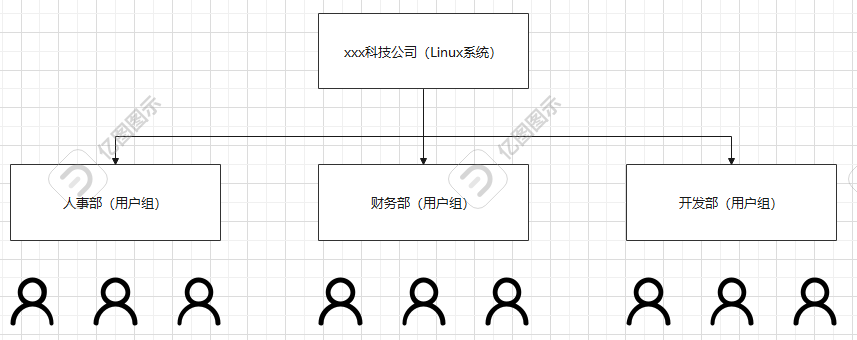
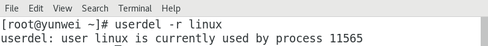

# 05.Linux用户管理

# <font style="color:rgb(51, 51, 51);">一、学习目标</font>

1. 了解用户和用户组的概念
2. 可以添加useradd和删除userdel用户,修改用户密码passwd
3. 可以添加groupadd和删除groupdel用户组

# <font style="color:rgb(51, 51, 51);">二、用户与用户组的概念</font>

## <font style="color:rgb(51, 51, 51);">为什么要做用户与用户组管理</font>

<font style="color:rgb(51, 51, 51);">服务器要添加多账户的作用：</font>

<font style="color:rgb(51, 51, 51);">针对不同用户分配不同的权限，不同权限可以限制用户可以访问到的系统资源</font>

<font style="color:rgb(51, 51, 51);">提高系统的安全性 </font>

<font style="color:rgb(51, 51, 51);">帮助系统管理员对使用系统的用户进行跟踪</font>

## <font style="color:rgb(51, 51, 51);">用户和组的关系</font>



<font style="color:rgb(51, 51, 51);">理论上Linux系统中的每个用户在创建时都应该有一个对应的用户组，这个组就称之为用户的主组。同时，有些情况下，某个用户需要临时使用某个组的权限，那这个组就称之为这个用户的附属组或附加组。</font>

> <font style="color:rgb(119, 119, 119);">主组只能拥有一个，但是附属组或附加组可以同时拥有多个 => 亲爹，干爹（多个）</font>

## <font style="color:rgb(51, 51, 51);">用户组操作</font>

<font style="color:rgb(51, 51, 51);">用户组的操作无疑三件事：用户组的添加、用户组的修改以及用户组的删除操作</font>

<font style="color:rgb(51, 51, 51);">组：group</font>

<font style="color:rgb(51, 51, 51);">添加：add</font>

<font style="color:rgb(51, 51, 51);">修改：mod</font>

<font style="color:rgb(51, 51, 51);">删除：del</font>

### <font style="color:rgb(51, 51, 51);">用户组的添加</font>

<font style="color:rgb(51, 51, 51);">基本语法：</font>

```shell
# groupadd [选项]  用户组的组名称
选项说明：
-g ：代表用户组的组ID编号，自定义组必须从1000开始，不能重复（1-999是系统用户组的编号）
```

<font style="color:rgb(51, 51, 51);">案例：在系统中添加一个hr的用户组</font>

```shell
# groupadd hr
```

<font style="color:rgb(51, 51, 51);">案例：在系统中添加一个test的用户组并指定编号1100</font>

```shell
# groupadd -g 1100 test
```

<font style="color:rgb(51, 51, 51);">问题：我们刚才创建的hr以及test用户组到底添加到哪里了？</font>

<font style="color:rgb(51, 51, 51);">答：默认情况下，我们添加的用户组都会放在一个系统文件中，文件位置=>/etc/group</font>

```shell
# tail -3 /etc/group
hr:x:1004:
test:x:1100:
```

### <font style="color:rgb(51, 51, 51);">/etc/group文件解析</font>

<font style="color:rgb(51, 51, 51);">由以上命令的执行结果可知，在/etc/group文件中，其一共拥有三个冒号，共四列。每列含义：</font>

```shell
# tail -5 /etc/group 
postfix:x:89:
tcpdump:x:72:
lhp:x:1000:lhp
hr:x:1001:
test:x:1100:

第一列：用户组的组名称
第二列：用户组的组密码，使用一个x占位符
第三列：用户组的组ID编号，1-999代表系统用户组的组编号，1000以后的代表自定义组的组编号
CentOS6 => 1-499,500...
CentOS7 => 1-999,1000...
第四列：用户组内的用户信息（如果一个用户的附属组或附加组为这个组名，则该用户显示在此位置）
```

### <font style="color:rgb(51, 51, 51);">用户组的修改</font>

<font style="color:rgb(51, 51, 51);">基本语法：</font>

```shell
# groupmod [选项 选项的值] 原来组的组名称
选项说明：
-g ：gid缩写，设置一个自定义的用户组ID数字，1000以后
-n ：name缩写，设置新的用户组的名称
```

<font style="color:rgb(51, 51, 51);">案例：把hr用户组更名为szhr</font>

```shell
# groupmod -n szhr hr
```

<font style="color:rgb(51, 51, 51);">案例：把test用户组的组编号由1100更改为1003</font>

```shell
# groupmod -g 1003 test
```

<font style="color:rgb(51, 51, 51);">案例：把zhangsan组的组名称更改为admin且用户组的组编号更改为1004</font>

```shell
# groupmod -g 1004 -n admin zhangsan
```

### <font style="color:rgb(51, 51, 51);">用户组的删除</font>

<font style="color:rgb(51, 51, 51);">基本语法：</font>

```shell
# groupdel 用户组名称
```

<font style="color:rgb(51, 51, 51);">案例：使用groupdel删除test用户组</font>

```shell
# groupdel test
```

## <font style="color:rgb(51, 51, 51);">用户操作</font>

<font style="color:rgb(51, 51, 51);">用户：user</font>

<font style="color:rgb(51, 51, 51);">添加：add</font>

<font style="color:rgb(51, 51, 51);">修改：mod</font>

<font style="color:rgb(51, 51, 51);">删除：del</font>

### <font style="color:rgb(51, 51, 51);">用户的添加</font>

<font style="color:rgb(51, 51, 51);">基本语法：</font>

```shell
# useradd [选项 选项的值] 用户名称
选项说明：
-g ：代表添加用户时指定用户所属组的主组，唯一的组信息（重要）
-s ：代表指定用户可以使用的Shell类型，默认为/bin/bash（拥有大部分权限）还可以是/sbin/nologin，代表账号创建成功，但是不能用于登录操作系统。
/bin/bash => 给人使用的（运维工程师）
/sbin/nologin => 给软件使用的

-G ：代表添加用户时指定用户所属组的附属组或附加组，可以指定多个，用逗号隔开即可(了解)
-u ：代表添加用户时指定的用户ID编号，CentOS6从500开始，CentOS7中从1000开始(了解)
-c ：代表用户的备注信息，zs:123456:(张三的账号)  comment
-d ：代表用户的家目录，默认为/home/用户名称。可以使用-d进行更改
-n ：取消建立以用户名称为名的群组（了解）
```

<font style="color:rgb(51, 51, 51);">案例：在系统中创建一个linuxuser账号</font>

```shell
# useradd linuxuser
```

<font style="color:rgb(51, 51, 51);">问题：我们并没有为linuxuser账号指定所属的主组，可以成功创建账号么？</font>

<font style="color:rgb(51, 51, 51);">答：可以，因为在创建账号时，如果没有明确指定用户所属的主组，默认情况下，系统会自动在用户组中创建一个与用户linuxuser同名的用户组，这个组就是这个用户的主组。</font>

<font style="color:rgb(51, 51, 51);">问题：刚才创建的linuxuser账号能不能用于登录操作系统</font>

<font style="color:rgb(51, 51, 51);">答：不行，因为Linux的登录账号必须要求有密码，如果一个账号没有密码是无法登录操作系统的。</font>

<font style="color:rgb(51, 51, 51);"></font>

<font style="color:rgb(51, 51, 51);">案例：在系统中创建一个账号zhangsan，指定用户所属的主组为xiaomi</font>

```shell
第一步：查询一下xiaomi的组ID编号
# tail -5 /etc/group
xiaomi:x:1000:
第二步：根据组的编号添加用户
# useradd -g 1000 zhangsan
```

<font style="color:rgb(51, 51, 51);">案例：在系统中创建一个账号lisi，指定主组为xiaomi，此用户只能被软件所使用，不能用于登录操作系统</font>

```shell
# useradd -g 1000 -s /sbin/nologin lisi
```

<font style="color:rgb(51, 51, 51);">案例：在系统中创建一个wangwu，指定主组为wangwu，附属组为xiaomi</font>

```shell
# useradd -G 1000 wangwu
```

### <font style="color:rgb(51, 51, 51);">用户信息查询</font>

<font style="color:rgb(51, 51, 51);">基本语法：</font>

```shell
# id 用户名称
```

<font style="color:rgb(51, 51, 51);">主要功能：查询某个指定的用户信息</font>

<font style="color:rgb(51, 51, 51);">案例：查询linuxuser用户的信息</font>

```shell
# id linuxuser
uid=1002(linuxuser) gid=1005(linuxuser) groups=1005(linuxuser)
uid：用户编号
gid：用户所属的主组的编号
groups：用户的主组以及附属组信息，第一个是主组，后面的都是附属组或附加组信息
```

### <font style="color:rgb(51, 51, 51);">与用户相关的用户文件</font>

<font style="color:rgb(51, 51, 51);">组：</font><code><font style="color:rgb(51, 51, 51);">/etc/group</font></code><font style="color:rgb(51, 51, 51);">文件</font>

<font style="color:rgb(51, 51, 51);">用户：</font><code><font style="color:rgb(51, 51, 51);">/etc/passwd</font></code><font style="color:rgb(51, 51, 51);">文件，每创建一个用户，其就会在此文件中追加一行</font>

```shell
# vim /etc/passwd
root:x:0:0:root:/root:/bin/bash
zhaoliu:x:1005:1010::/home/zhaoliu:/sbin/nologin

由上图可知，一共拥有7列

第1列：用户名称
第2列：用户的密码，使用一个x占位符，真实密码存储在/etc/shadow(1-用户名，2-加密密码)
第3列：数字，用户的ID编号
第4列：数字，用户的主组ID编号
第5列：代表注释信息，useradd -c "备注信息" 用户名称
第6列：用户的家目录，默认在/home/用户名称
第7列：用户可以使用的Shell类型，useradd -s /bin/bash或/sbin/nologin 用户名称
```

### <font style="color:rgb(51, 51, 51);">用户修改操作</font>

<font style="color:rgb(51, 51, 51);">用户：user，添加：add，修改：mod，删除：del</font>

<font style="color:rgb(51, 51, 51);">基本语法：</font>

```shell
# usermod [选项 选项的值] 用户名称
选项说明：
-g ：修改用户所属的主组的编号
-l ：login name修改用户的名称
-s ：修改用户可以使用的Shell类型，如/bin/bash => /sbin/nologin

扩展：
-L：锁定用户，锁定后用户无法登陆系统lock
-U：解锁用户unlock

了解：
-G ：修改用户附属组的编号信息
-d ：修改用户的家目录
-c ：修改用户的备注信息
```

<font style="color:rgb(51, 51, 51);">案例：修改zhangsan账号信息，更名为zs</font>

```shell
# usermod -l zs zhangsan
```

<font style="color:rgb(51, 51, 51);">案例：修改wangwu账号信息，把用户的主组的编号更新为1000（xiaomi）</font>

```shell
# usermod -g 1000 wangwu
```

<font style="color:rgb(51, 51, 51);">案例：禁止linuxuser账号登录Linux操作系统</font>

```shell
# usermod -s /sbin/nologin linuxuser
```

<font style="color:rgb(51, 51, 51);">案例：禁止linux用户登录操作（Ctrl + Alt + F2 ~ F6）</font>

> <font style="color:rgb(119, 119, 119);">Linux系统除了默认的图形化界面，其实还有5个隐藏的字符界面，按Ctrl + Alt + F1~F6</font>
>
> <font style="color:rgb(119, 119, 119);">有些电脑开启Fn功能键，所以如果Ctrl + Alt + F1~F6不生效，则可以按Ctrl + Alt + Fn + F1~F6</font>

```shell
# usermod -L linux
```

<font style="color:rgb(51, 51, 51);">案例：解锁linux用户</font>

```shell
# usermod -U linux
```

> <font style="color:rgb(119, 119, 119);">问题：账号已经解锁，但是无法登录</font>
>
> <font style="color:rgb(119, 119, 119);">① 当前账号没有设置密码，因为Linux操作系统不允许没有密码的操作进行登录</font>
>
> <font style="color:rgb(119, 119, 119);">② 当前用户的Shell类型为/sbin/nologin，所以其无法登录</font>

### <font style="color:rgb(51, 51, 51);">passwd命令</font>

<font style="color:rgb(51, 51, 51);">基本语法：</font>

```shell
# passwd 用户名称
```

<font style="color:rgb(51, 51, 51);">主要功能：为某个用户设置密码（添加或修改），可以给自己也可以给别人设置</font>

<font style="color:rgb(51, 51, 51);">案例：修改自己的密码</font>

```shell
[root@yunwei ~]# passwd
```

<font style="color:rgb(51, 51, 51);">案例：为linux账号添加一个密码，密码：123456</font>

```shell
[root@yunwei ~]# passwd linux
```

> <font style="color:rgb(119, 119, 119);">特别注意：在Linux操作系统中，如果一个账号没有密码，则无法登录操作系统。</font>

### <font style="color:rgb(51, 51, 51);">su命令</font>

<font style="color:rgb(51, 51, 51);">基本语法：</font>

```shell
# su [-] 用户名称
选项：
- ：横杠（减号），代表切换用户的同时，切换目录到用户的家
```

<font style="color:rgb(51, 51, 51);">主要功能：切换用户的账号</font>

> <font style="color:rgb(119, 119, 119);">从超级管理员切换到普通用户，root => lhp，不需要输入lhp的密码</font>
>
> <font style="color:rgb(119, 119, 119);">从普通账号切换到超级管理员，lhp => root，需要输入root的密码</font>
>
> <font style="color:rgb(119, 119, 119);">从普通账号切换到普通账号，lhp => linuxuser，也需要输入linuxuser密码</font>

### <font style="color:rgb(51, 51, 51);">wheel组（了解）</font>

<font style="color:rgb(51, 51, 51);">Linux系统中，理论上只有在wheel组中的普通用户，才可以通过su命令切换到root账户，默认所有普通用户都能切换到root，只要知道root密码，换句话说，默认此配置不生效</font>

### <font style="color:rgb(51, 51, 51);">用户删除操作</font>

<font style="color:rgb(51, 51, 51);">基本语法：</font>

```shell
# userdel [选项] 用户名称
选项说明：
-r ：删除用户的同时，删除用户的家（默认不删除）
```

<font style="color:rgb(51, 51, 51);">案例：删除用户但是不删除用户的家目录</font>

```shell
# userdel zs
```

<font style="color:rgb(51, 51, 51);">案例：删除用户的同时删除用户的家目录</font>

```shell
# userdel -r lisi
```

> <font style="color:rgb(119, 119, 119);">删除账号流程：① 删除账号 ② 确认是否删除用户家 ③ 删除用户主组（没有其他用户）</font>

<font style="color:rgb(119, 119, 119);"></font>

<font style="color:rgb(51, 51, 51);">扩展：当我们想要删除某个账号时，系统提示当前账号正在被某个进程所使用</font>



<font style="color:rgb(51, 51, 51);">解决方案：</font>

<font style="color:rgb(51, 51, 51);">第一种方案：找到登录的这个用户，然后将其直接注销</font>

<font style="color:rgb(51, 51, 51);">第二种方案：</font>

```shell
# kill [-9] 进程的ID编号
选项说明：-9代表强制结束某个进程
主要功能：用于结束某个进程的继续运行
```

<font style="color:rgb(51, 51, 51);">案例：结束11565进程</font>

```shell
# kill 11565
```

<font style="color:rgb(51, 51, 51);">简单粗暴，kill 对应用户的全部进程（尽量斩草除根，结束父进程）</font>

```shell
# ps -ef |grep linux
ps命令：查看进程
-ef ：查看系统的所有进程
|：管道命令
grep linux：搜索包含了linux关键词的所有进程
```

<font style="color:rgb(51, 51, 51);">结束完成后，再次使用userdel删除即可</font>

<font style="color:rgb(51, 51, 51);"></font>


> 更新: 2025-04-03 14:01:21  
> 原文: <https://www.yuque.com/u41736172/az9urv/vftiei64t99n14fv>