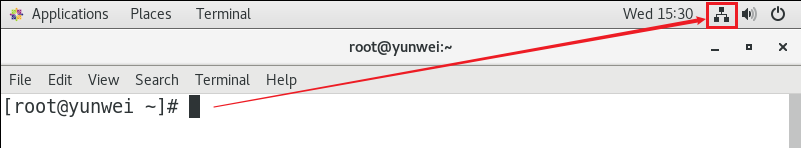
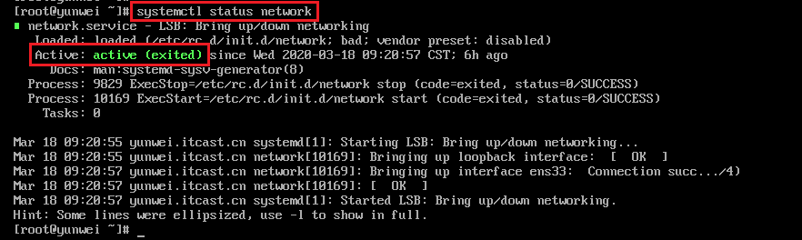
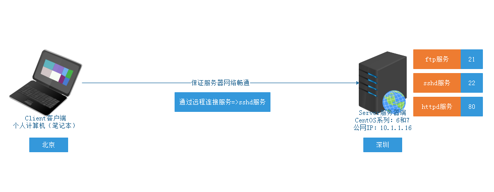
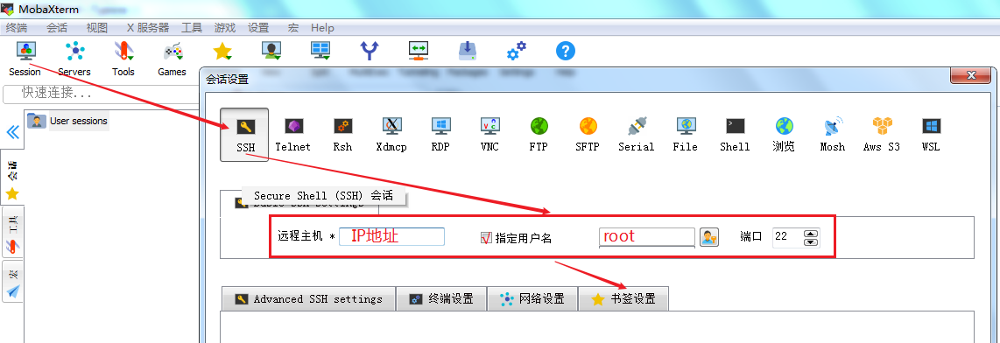
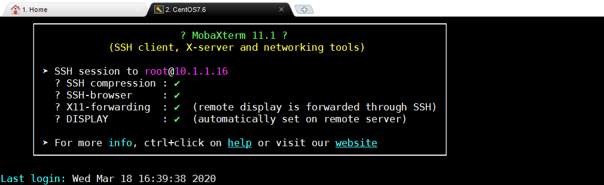
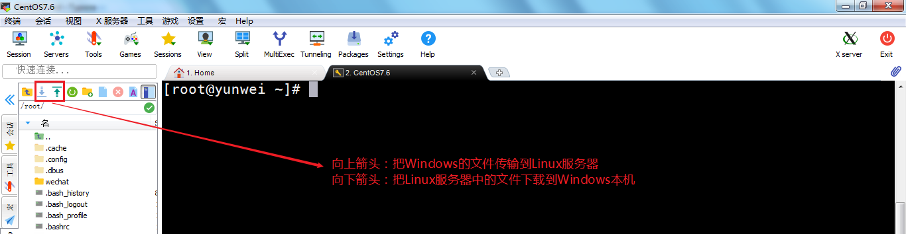

# 07.Linux网络配置与远程管理

# <font style="color:rgb(51, 51, 51);">一、Linux网络管理</font>
## <font style="color:rgb(51, 51, 51);">获取计算机的网络信息</font>
<font style="color:rgb(51, 51, 51);">基本语法：</font>

```shell
# ifconfig
```

> <font style="color:rgb(119, 119, 119);">Windows => ipconfig，Linux => ifconfig</font>
>

<font style="color:rgb(51, 51, 51);">第一步：连接网络</font>



<font style="color:rgb(51, 51, 51);">第二步：使用ifconfig命令，获取计算机的网络信息</font>

```shell
# ifconfig
ens33: flags=4163<UP,BROADCAST,RUNNING,MULTICAST>  mtu 1500
        inet 10.1.1.16  netmask 255.255.255.0  broadcast 10.1.1.255
        inet6 fe80::e472:7b78:c871:8e12  prefixlen 64  scopeid 0x20<link>
        ether 00:0c:29:48:bf:f9  txqueuelen 1000  (Ethernet)
        RX packets 254  bytes 54837 (53.5 KiB)
        RX errors 0  dropped 0  overruns 0  frame 0
        TX packets 287  bytes 42006 (41.0 KiB)
        TX errors 0  dropped 0 overruns 0  carrier 0  collisions 0
        
解析：inet 10.1.1.16  netmask 255.255.255.0  broadcast 10.1.1.255
inet 10.1.1.16 ：代表ens33网卡的IP地址，将来远程连接就是用这个IP
netmask ：子网掩码，一般为255.255.255.0
broadcast ：广播地址，10.1.1.255
```

> <font style="color:rgb(119, 119, 119);">CentOS6 => eth0 ， CentOS7 => ens33</font>
>

<font style="color:rgb(51, 51, 51);">ens33 ：是默认的网卡，我们获取的IP也要从这个网卡中获取</font>

<font style="color:rgb(51, 51, 51);">lo（loop，循环）：表示回环网卡，只有一个固定的IP地址，127.0.0.1代表本机</font>

<font style="color:rgb(51, 51, 51);">virbr0：虚拟网络接口，因为我们使用vmware虚拟机安装Centos，所以其会产生virbr0虚拟网络接口</font>

## <font style="color:rgb(51, 51, 51);">与网卡相关的配置文件</font>
<font style="color:rgb(51, 51, 51);">Linux系统中，一切皆文件。所以保存网络信息的也是通过一个文件来完成的。</font>

```shell
# vim /etc/sysconfig/network-scripts/ifcfg-ens33
TYPE="Ethernet"
BOOTPROTO="dhcp"
NAME="ens33"
UUID="6c809893-d12c-46af-9987-4c05b2773c91"
DEVICE="ens33"
ONBOOT="yes"

参数解析：
TYPE ：网络类型，Ethernet以太网
BOOTPROTO：IP的获取方式，dhcp代表自动获取，static或者none代表手工设置
NAME ：网卡的名称（名字），ens33
UUID ：代表网卡的UUID编号（必须是唯一的）
DEVICE ：设备名称
ONBOOT ：代表网卡是否随计算机开机启动，yes随计算机开机启动，no代表不启动
```

## <font style="color:rgb(51, 51, 51);">查询计算机的网络状态</font>
<font style="color:rgb(51, 51, 51);">基本语法：</font>

```shell
# systemctl  status  network

systemctl = system + control = 系统控制
```

<font style="color:rgb(51, 51, 51);">主要功能：查询计算机网络的状态，网络是否正常连接。</font>



<font style="color:rgb(51, 51, 51);">Active ： active（正常）或 inactive（dead，网络状态不正常没有连接）</font>

## <font style="color:rgb(51, 51, 51);">systemctl启动/重启/停止网络</font>
```shell
# systemctl start network
# systemctl stop network
# systemctl restart network

选项解析：
start ：启动
stop ：停止
restart ：重启
```

# <font style="color:rgb(51, 51, 51);">二、Linux远程连接与文件传输</font>
## <font style="color:rgb(51, 51, 51);">为什么需要远程连接</font>


## <font style="color:rgb(51, 51, 51);">SSH协议</font>
<font style="color:rgb(51, 51, 51);">简单说，SSH是一种网络协议，用于计算机之间的加密登录。</font>

## <font style="color:rgb(51, 51, 51);">sshd服务</font>
<font style="color:rgb(51, 51, 51);">当我们在计算机中安装了sshd软件，启动后，就会在进程中产生一个sshd进程，其遵循计算机的SSH协议。默认情况下，sshd服务随系统自动安装的。</font>

```shell
# systemctl  status  sshd
```

## <font style="color:rgb(51, 51, 51);">sshd服务的端口号</font>
<font style="color:rgb(51, 51, 51);">SSH协议，其规定了远程连接与传输的端口号，所以sshd服务启动后，就会占用计算机的22号端口。</font>

> <font style="color:rgb(119, 119, 119);">端口号能解决什么问题？答：能让我们的计算机区分出不同的服务</font>
>



## <font style="color:rgb(51, 51, 51);">使用MX软件连接Linux服务器</font>
### <font style="color:rgb(51, 51, 51);">Putty</font>
<font style="color:rgb(51, 51, 51);">官网：</font>[<font style="color:rgb(51, 51, 51);">www.putty.org</font>](https://links.jianshu.com/go?to=http%3A%2F%2Fwww.putty.org)

<font style="color:rgb(51, 51, 51);">PuTTY为一开放源代码软件，主要由Simon Tatham维护，使用MIT licence授权。</font>

### <font style="color:rgb(51, 51, 51);">SecureCRT</font>
<font style="color:rgb(51, 51, 51);">官网：</font>[<font style="color:rgb(51, 51, 51);">www.vandyke.com</font>](https://links.jianshu.com/go?to=http%3A%2F%2Fwww.vandyke.com)<font style="color:rgb(51, 51, 51);"> SecureCRT是一款支持SSH(SSH1和SSH2)的终端仿真程序，简单地说是Windows下登录UNIX或Linux服务器主机的软件。（颜色方案不是特别好看）</font>

### <font style="color:rgb(51, 51, 51);">XShell</font>
<font style="color:rgb(51, 51, 51);">官网：</font>[<font style="color:rgb(51, 51, 51);">www.netsarang.com</font>](https://links.jianshu.com/go?to=http%3A%2F%2Fwww.netsarang.com)

<font style="color:rgb(51, 51, 51);">Xshell是一个强大的安全终端模拟软件，它支持SSH1, SSH2, 以及Microsoft Windows 平台的TELNET 协议。Xshell 通过互联网到远程主机的安全连接以及它创新性的设计和特色帮助用户在复杂的网络环境中享受他们的工作。</font>

<font style="color:rgb(51, 51, 51);">缺点：收费</font>

<font style="color:rgb(51, 51, 51);">双击安装包，顶多改一个安装路径，其他都是一路下一步！</font>

### <font style="color:rgb(51, 51, 51);">MobaXterm</font>
<font style="color:rgb(51, 51, 51);">官网：</font>[<font style="color:rgb(51, 51, 51);">https://mobaxterm.mobatek.net/</font>](https://mobaxterm.mobatek.net/)

<font style="color:rgb(51, 51, 51);">① 获取Linux的的IP地址</font>

```shell
# ifconfig
10.1.1.16
```

<font style="color:rgb(51, 51, 51);">② 打开MX软件，单击Session，创建一个SSH远程连接</font>



<font style="color:rgb(51, 51, 51);">③ 设置书签（给这台服务器起个名字）</font>


<font style="color:rgb(51, 51, 51);">④ 输入CentOS7.6的root管理员密码</font>

<font style="color:rgb(51, 51, 51);">管理员：root</font>

<font style="color:rgb(51, 51, 51);">密 码：123456</font>



## <font style="color:rgb(51, 51, 51);">使用MX实现文件传输</font>



> 更新: 2025-04-03 16:35:44  
> 原文: <https://www.yuque.com/u41736172/az9urv/gn0cda5ane5nm57g>