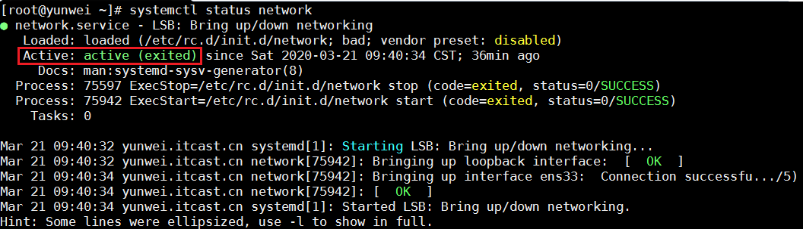
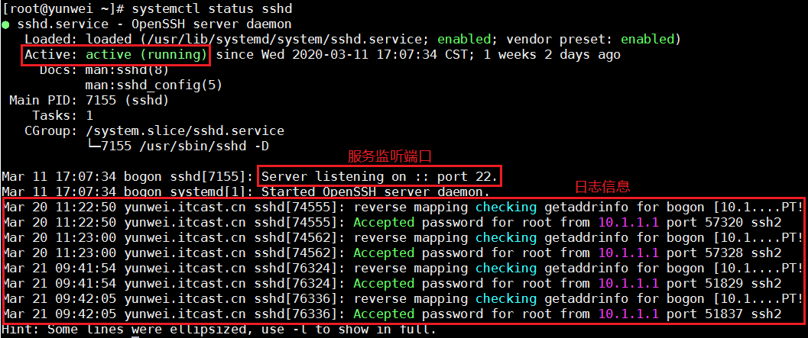
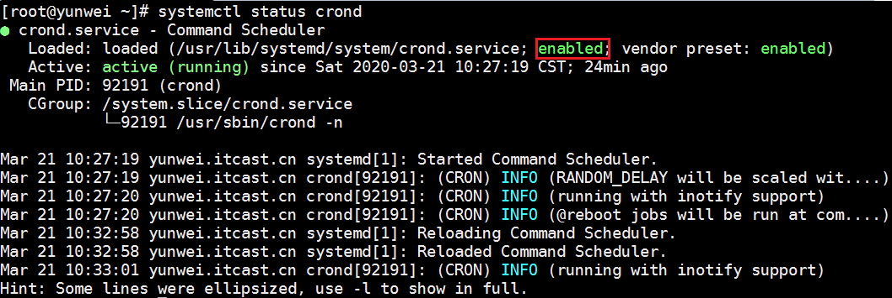
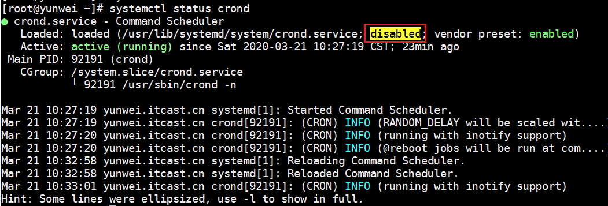
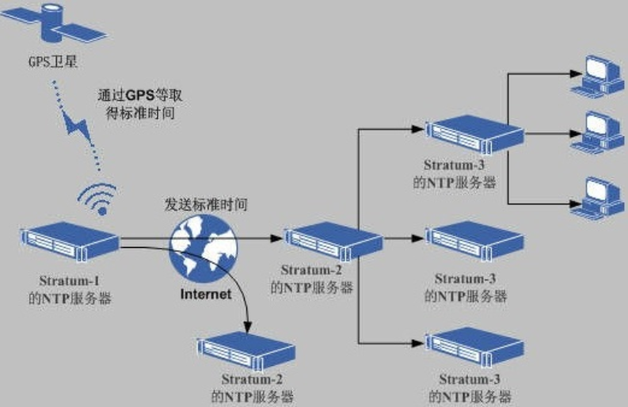
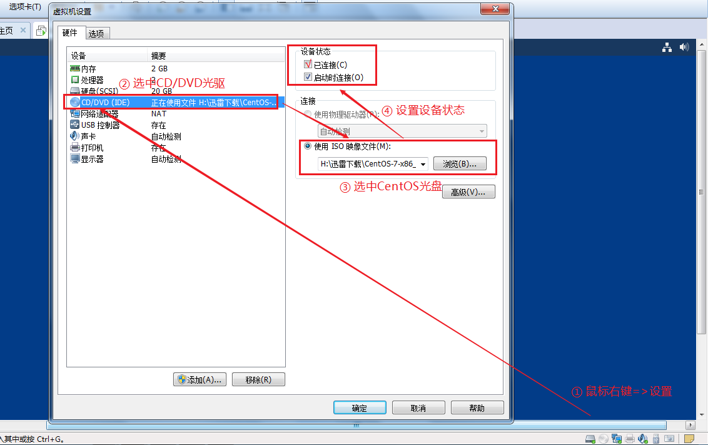
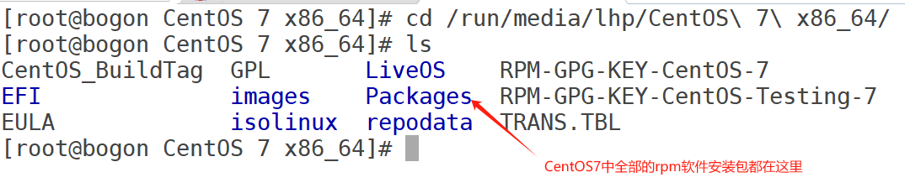
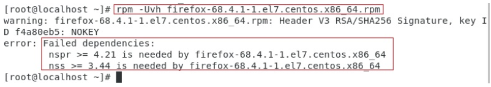

# 09.Linux系统服务

# <font style="color:rgb(51, 51, 51);">一、学习目标</font>
1. 了解systemctl命令用途
2. 掌握使用systemctl开启，关闭，重启服务
3. 了解常见自有服务ntpd,firewalld,crond的作用
4. 掌握ntpdate时间同步原理与实现
5. 掌握防火墙的相关操作（添加和删除简单规则，开启，关闭防火墙）
6. 了解源码包和二进制包的区别
7. 掌握rpm包的卸载、安装以及更新操作
8. 了解计划任务的作用
9. 掌握计划任务的编辑

# <font style="color:rgb(51, 51, 51);">二、自有服务概述</font>
<font style="color:rgb(51, 51, 51);">服务是一些特定的进程，自有服务就是系统开机后就自动运行的一些进程，一旦客户发出请求，这些进程就自动为他们提供服务，windows系统中，把这些自动运行的进程，称为"服务"</font>

<font style="color:rgb(51, 51, 51);">举例：当我们使用SSH客户端软件连接linux的时候，我们的服务器为什么会对连接做出响应？是因为SSH服务开机就自动运行了。</font>

**<font style="color:rgb(51, 51, 51);">所谓自有服务，简单来说，可以理解为Linux系统开机自动运行的服务（程序）。</font>**

# <font style="color:rgb(51, 51, 51);">三、systemctl管理系统服务</font>
## <font style="color:rgb(51, 51, 51);">systemctl概述</font>
<font style="color:rgb(51, 51, 51);">CentOS6版本：</font>

<font style="color:rgb(51, 51, 51);">service命令（管理服务开启、停止以及重启）+ chkconfig（定义开机启动项）</font>

```shell
# service network start|stop|restart
```

**<font style="color:rgb(51, 51, 51);">CentOS7版本：</font>**

<font style="color:rgb(51, 51, 51);">systemctl命令 = system系统 + control控制（服务管理+开机启动项管理）</font>

```shell
# systemctl start|stop|restart|reload network
```

## <font style="color:rgb(51, 51, 51);">显示系统服务</font>
<font style="color:rgb(51, 51, 51);">基本语法：</font>

```shell
# systemctl [选项]
选项说明：
list-units --type service --all：列出所有服务（包含启动的和没启动的）
list-units --type service：列出所有启动的服务
```

<font style="color:rgb(51, 51, 51);">案例：列出Linux系统中所有的服务（包含启动的和没启动的）</font>

```shell
# systemctl list-units --type service --all
```

<font style="color:rgb(51, 51, 51);">案例：只列出已经启动的Linux系统服务</font>

```shell
# systemctl list-units --type service
```

<font style="color:rgb(51, 51, 51);">案例：把systemctl显示系统服务与管道命令相结合，筛选我们想要的服务信息</font>

```shell
# systemctl list-units --type service | grep sshd
```

## <font style="color:rgb(51, 51, 51);">Linux系统服务管理</font>
### <font style="color:rgb(51, 51, 51);">status查看状态</font>
<font style="color:rgb(51, 51, 51);">查看系统服务的状态</font>

```shell
# systemctl status 服务名
```

<font style="color:rgb(51, 51, 51);">案例：查询系统中网络服务的状态信息</font>

```shell
# systemctl status network
```



<font style="color:rgb(51, 51, 51);">案例：查询系统中sshd服务的状态信息</font>

```shell
# systemctl status sshd
```



### <font style="color:rgb(51, 51, 51);">stop停止服务</font>
```shell
# systemctl stop 系统服务的名称
```

<font style="color:rgb(51, 51, 51);">案例：使用systemctl命令停止network网络服务</font>

```shell
# systemctl stop network
```

### <font style="color:rgb(51, 51, 51);">start启动服务</font>
```shell
# systemctl start 系统服务的名称
```

<font style="color:rgb(51, 51, 51);">案例：使用systemctl命令启动network网络服务</font>

```shell
# systemctl start network
```

### <font style="color:rgb(51, 51, 51);">restart重启服务</font>
```shell
# systemctl restart 系统服务的名称
等价于
# systemctl stop 系统服务的名称
# systemctl start 系统服务的名称
```

<font style="color:rgb(51, 51, 51);">案例：使用systemctl命令重启crond计划任务的服务信息</font>

```shell
# systemctl restart crond
```

### <font style="color:rgb(51, 51, 51);">reload热重载技术</font>
```shell
# systemctl reload 系统服务名称
```

<font style="color:rgb(51, 51, 51);">reload：重新加载指定服务的配置文件（并非所有服务都支持reload，通常使用restart)</font>

> <font style="color:rgb(119, 119, 119);">有些服务，如Nginx，更改了配置文件，但是不能重启Nginx服务，只是想立即让我们配置文件的更改生效，则就可以使用热重载技术了。</font>
>

<font style="color:rgb(51, 51, 51);">案例：使用热重载技术重新加载crond服务</font>

```shell
# systemctl reload crond
```

## <font style="color:rgb(51, 51, 51);">服务持久化（开机自启与开机不自启）</font>
<font style="color:rgb(51, 51, 51);"> 所谓服务持久化，就是服务在开机的时候，是否自动启动。</font>

### <font style="color:rgb(51, 51, 51);">开机自启</font>
```shell
# systemctl enable 系统服务的名称
```

<font style="color:rgb(51, 51, 51);">案例：把network网络服务设置为开机自启动</font>

```shell
# systemctl enable network
network.service is not a native service, redirecting to /sbin/chkconfig.
Executing /sbin/chkconfig network on

以上提示代表network.service不是一个本地的系统服务，所以想设置开机自启需要使用/sbin/chkconfig进行操作
# /sbin/chkconfig network on
```

<font style="color:rgb(51, 51, 51);">案例：把crond计划任务的服务信息添加到开机自启动中</font>

```shell
# systemctl enable crond
```



### <font style="color:rgb(51, 51, 51);">开机不自启</font>
```shell
# systemctl disable 系统服务的名称
```

<font style="color:rgb(51, 51, 51);">案例：把crond计划任务的服务信息从开机自启动中移除</font>

```shell
# systemctl disable crond
```



# <font style="color:rgb(51, 51, 51);">四、扩展：系统运行级别</font>
## <font style="color:rgb(51, 51, 51);">什么是运行级别</font>
<font style="color:rgb(51, 51, 51);">运行级别全称（Running Level），代表Linux系统的不同运行模式</font>

## <font style="color:rgb(51, 51, 51);">CentOS6的运行级别</font>
```shell
# vim /etc/inittab
0   系统关机状态   halt (Do NOT set initdefault to this)
1   单用户工作状态   Single user mode (类似Windows的安全模式，Linux忘记密码)
2   多用户状态（没有NFS） Multiuser, without NFS (The same as 3, if you do not have networking)
3   多用户状态（有NFS）   Full multiuser mode (字符模式,服务基本都是此模式)
4   系统未使用，留给用户   unused
5   图形界面    X11 (图形模式，个人计算机都是此模式)
6   系统正常关闭并重新启动   reboot (Do NOT set initdefault to this)
```

## <font style="color:rgb(51, 51, 51);">CentOS7的运行级别</font>
```shell
0   shutdown.target
1   emergency.target
2   rescure.target
3   multi-user.target   字符模式
4   无
5   graphical.target    图形模式
6   系统正常关闭并重新启动   reboot (Do NOT set initdefault to this)
```

## <font style="color:rgb(51, 51, 51);">init命令（临时更改运行模式）</font>
```shell
# init 模式编号
```

<font style="color:rgb(51, 51, 51);">案例：立即关机</font>

```shell
# shutdown -h 0或now
或
# halt -p
或
# init 0
```

<font style="color:rgb(51, 51, 51);">案例：立即重启</font>

```shell
# reboot
或
# init 6
```

<font style="color:rgb(51, 51, 51);">案例：把计算机切换到字符模式（黑窗口）</font>

```shell
# init 3
```

<font style="color:rgb(51, 51, 51);">案例：把计算机切换到图形模式（图形界面）</font>

```shell
# init 5
```

## <font style="color:rgb(51, 51, 51);">CentOS6中的chkconfig</font>
<font style="color:rgb(51, 51, 51);">问题：在CentOS7中，设置network开机启动时，系统要求使用chkconfig命令</font>

```shell
# chkconfig network on
```

<font style="color:rgb(51, 51, 51);">设置完成后，怎么查看network有没有随开机自动启动呢？</font>

```shell
# chkconfig --list |grep network 
network        	0:off	1:off	2:on	3:on	4:on	5:on	6:off

0 关机模式
1 单用户模式
2 多用户模式（无NFS）
3 字符模式
4 自定义模式
5 图形模式
6 重启模式
只要3和5是on就表示开机自启动了
```

# <font style="color:rgb(51, 51, 51);">五、NTP时间同步服务</font>
## <font style="color:rgb(51, 51, 51);">什么是NTP服务</font>
<font style="color:rgb(51, 51, 51);">NTP是网络时间协议(Network Time Protocol)，它是用来同步网络中各个计算机的时间的协议。</font>

<font style="color:rgb(51, 51, 51);">工作场景：</font>

<font style="color:rgb(51, 51, 51);">公司开发了一个电商网站，由于访问量很大，网站后端由100台服务器组成集群。50台负责接收订单，50台负责安排发货，接收订单的服务器需要记录用户下订单的具体时间，把数据传给负责发货的服务器，由于100台服务器时间各不相同，记录的时间经常不一致，甚至会出现下单时间是明天，发货时间是昨天的情况。</font>

## <font style="color:rgb(51, 51, 51);">NTP时间同步的原理</font>
<font style="color:rgb(51, 51, 51);">问题：标准时间是哪里来的？</font>

<font style="color:rgb(51, 51, 51);">现在的标准时间是由原子钟报时的国际标准时间UTC（Universal Time Coordinated，世界协调时)，所以NTP获得UTC的时间来源可以是原子钟、天文台、卫星，也可以从Internet上获取。</font>

<font style="color:rgb(51, 51, 51);">在NTP中，定义了时间按照服务器的等级传播，</font>**<font style="color:rgb(51, 51, 51);">Stratum层的总数限制在15以内</font>**

<font style="color:rgb(51, 51, 51);">工作中，通常我们会直接使用各个组织提供的，现成的NTP服务器</font>



## <font style="color:rgb(51, 51, 51);">从哪里找合适的NTP服务器呢？</font>
<font style="color:rgb(51, 51, 51);">NTP授时网站：</font>[<font style="color:rgb(51, 51, 51);">http://www.ntp.org.cn/pool.php</font>](http://www.ntp.org.cn/pool.php)


## <font style="color:rgb(51, 51, 51);">NTP时间同步操作</font>
### <font style="color:rgb(51, 51, 51);">手工同步</font>
<font style="color:rgb(51, 51, 51);">基本语法：</font>

```shell
# ntpdate NTP服务器的IP地址或域名
```

<font style="color:rgb(51, 51, 51);">案例：查看Linux系统时间</font>

```shell
# date
```

<font style="color:rgb(51, 51, 51);">案例：从NTP服务器中同步系统时间</font>

```shell
# ntpdate cn.ntp.org.cn
```

### <font style="color:rgb(51, 51, 51);">自动同步</font>
<font style="color:rgb(51, 51, 51);">基本语法：</font>

```shell
① 启动ntpd服务
# systemctl start ntpd
② 把ntpd服务追加到系统开机启动项中
# systemctl enable ntpd
```

<font style="color:rgb(51, 51, 51);">问题1：启动ntpd服务后，是不是时间就自动同步了？</font>

<font style="color:rgb(51, 51, 51);">启动后就自动同步了</font>

<font style="color:rgb(51, 51, 51);">问题2：需不需要让ntpd服务，开机自动运行？</font>

<font style="color:rgb(51, 51, 51);">需要</font>

<font style="color:rgb(51, 51, 51);">ntpd服务配置文件位置 /etc/ntp.conf</font>

# <font style="color:rgb(51, 51, 51);">六、Linux下的软件包管理</font>
## <font style="color:rgb(51, 51, 51);">什么是软件包</font>
<font style="color:rgb(51, 51, 51);">这是什么？</font>


<font style="color:rgb(51, 51, 51);">由以上图解可知，这个PCQQ2019.exe是Windows中的软件安装包。</font>

> <font style="color:rgb(119, 119, 119);">所谓的Linux软件包就是Linux下软件的安装程序</font>
>

## <font style="color:rgb(51, 51, 51);">Linux下软件的安装方式</font>
<font style="color:rgb(51, 51, 51);">① RPM软件包安装 => 软件名称.rpm</font>

<font style="color:rgb(51, 51, 51);">② YUM包管理工具 => yum install 软件名称 -y</font>

<font style="color:rgb(51, 51, 51);">③ 源码安装 => 下载软件的源代码 => 编译 => 安装（最麻烦的，但是也最稳定）</font>

## <font style="color:rgb(51, 51, 51);">二进制软件包</font>
<font style="color:rgb(51, 51, 51);">二进制包，也就是源码包经过成功编译之后产生的包。</font>

<font style="color:rgb(51, 51, 51);">二进制包是 Linux 下默认的软件安装包，目前主要有以下 2 大主流的二进制包管理系统：</font>

+ <font style="color:rgb(51, 51, 51);">RPM 包管理系统：功能强大，安装、升级、査询和卸载非常简单方便，因此很多 Linux 发行版都默认使用此机制作为软件安装的管理方式，例如 Fedora、CentOS、SuSE 等。</font>
+ <font style="color:rgb(51, 51, 51);">DPKG 包管理系统：由 Debian Linux 所开发的包管理机制，通过 DPKG 包，Debian Linux 就可以进行软件包管理，主要应用在 Debian 和 Ubuntu 中。</font>

**<font style="color:rgb(51, 51, 51);">RPM</font>**<font style="color:rgb(51, 51, 51);">是RedHat Package Manager（RedHat软件包管理工具）的缩写</font>

<font style="color:rgb(51, 51, 51);">作用：rpm 的作用类似于豌豆荚，华为应用市场，App Store，主要作用是对linux 服务器上的软件包进行对应管理操作，管理分为：查询、卸载、安装/更新。</font>

## <font style="color:rgb(51, 51, 51);">获取*.rpm软件包</font>
<font style="color:rgb(51, 51, 51);">a. 去官网去下载（</font>[<font style="color:rgb(51, 51, 51);">http://rpm.pbone.net</font>](http://rpm.pbone.net)<font style="color:rgb(51, 51, 51);">）；</font>

<font style="color:rgb(51, 51, 51);">b. 不介意老版本的话，可以从光盘（或者镜像文件）中读取；CentOS7.6*.iso</font>

## <font style="color:rgb(51, 51, 51);">查询系统中已安装的rpm软件</font>
```shell
# rpm -qa |grep 要搜索的软件名称
选项说明：
-q ：query，查询操作
-a ：all，代表所有
```

<font style="color:rgb(51, 51, 51);">案例1：查询计算机中已安装的rpm软件包</font>

```shell
# rpm -qa
```

<font style="color:rgb(51, 51, 51);">案例2：搜索计算机中已安装的firefox软件包</font>

```shell
# rpm -qa |grep firefox
```

## <font style="color:rgb(51, 51, 51);">卸载CentOS系统中的rpm软件包</font>
```shell
# rpm -e 软件名称 [选项]
选项说明：
--nodeps ：强制卸载
```

<font style="color:rgb(51, 51, 51);">案例：把系统中的firefox浏览器进行卸载操作</font>

```shell
# rpm -qa |grep firefox
firefox-60.2.2-1.el7.centos.x86_64

# rpm -e firefox-60.2.2-1.el7.centos.x86_64
```

## <font style="color:rgb(51, 51, 51);">rpm软件包的安装</font>
<font style="color:rgb(51, 51, 51);">基本语法：</font>

```shell
# rpm -ivh 软件包的名称.rpm
选项说明：
-i：install，安装
-v：显示进度条 
-h：表示以"#"形式显示进度条
```

## <font style="color:rgb(51, 51, 51);">rpm软件包的获取（光盘）</font>
<font style="color:rgb(51, 51, 51);">第一步：在VMware虚拟机中加载CentOS7.6的安装光盘（是在虚拟机Linux系统的右下角的光盘图标上进行右击）</font>



<font style="color:rgb(51, 51, 51);">第二步：使用 # lsblk（list block devices）或者df -T 查看块状设备的信息</font>

```shell
# lsblk
[root@yunwei ~]# lsblk
NAME            MAJ:MIN RM  SIZE RO TYPE MOUNTPOINT
sda               8:0    0   20G  0 disk
├─sda1            8:1    0    1G  0 part /boot
└─sda2            8:2    0   19G  0 part
  ├─centos-root 253:0    0   17G  0 lvm  /
  └─centos-swap 253:1    0    2G  0 lvm  [SWAP]
sr0              11:0    1  4.3G  0 rom  /run/media/lhp/CentOS 7 x86_64
由以上图解可知，/dev/sr0代表光驱设备 => 挂载点 => /run/media/lhp/CentOS 7 x86_64文件夹
或
# df -hT
```

> <font style="color:rgb(119, 119, 119);">Linux操作系统的中所有存储设备必须先挂载后使用</font>
>

<font style="color:rgb(51, 51, 51);">第三步：使用cd命令，切换到挂载目录</font>

```shell
# cd /run/media/lhp/CentOS\ 7\ x86_64
```



<font style="color:rgb(51, 51, 51);">第四步：使用cd命令，切换到Packages软件包中</font>

```shell
# cd Packages
```

<font style="color:rgb(51, 51, 51);">第五步：查询我们要安装的软件包</font>

```shell
# ls |grep firefox
```

<font style="color:rgb(51, 51, 51);">第六步：使用rpm -ivh命令安装软件</font>

```shell
# rpm -ivh firefox-60.2.2-1.el7.centos.x86_64.rpm
```

> <font style="color:rgb(119, 119, 119);">输入firefox + Tab，让其自动补全</font>
>

## <font style="color:rgb(51, 51, 51);">rpm软件包的升级</font>
<font style="color:rgb(51, 51, 51);">基本语法：</font>

```shell
# rpm -Uvh 升级后的软件包名称.rpm
选项说明：
-U ：Update，更新操作
```

<font style="color:rgb(51, 51, 51);">案例：使用rpm -Uvh对firefox-60.2.2版本进行升级</font>

```shell
# rpm -Uvh firefox-68.4.1-1.el7.centos.x86_64.rpm
```

## <font style="color:rgb(51, 51, 51);">rpm扩展</font>
### <font style="color:rgb(51, 51, 51);">依赖关系</font>
<font style="color:rgb(51, 51, 51);">一个软件必须先有其他软件才能运行，例如之前xmind启动过程中提示的缺少DLL，称之为依赖</font>

<font style="color:rgb(51, 51, 51);">WAMP（Windows + Apache + MySQL + PHP）安装前必须先安装VC++ 2014 x86_64，这种情况就称之为有依赖关系。</font>

<font style="color:rgb(51, 51, 51);">60.8.0的firefox可以更新成功</font>

<font style="color:rgb(51, 51, 51);">下面我们尝试更新到68.4.1的版本</font>

```shell
用法：rpm -Uvh 软件包名称

# rpm -Uvh firefox-68.4.1-1.el7.centos.x86_64.rpm
使用rpm命令，安装68.4.1版本的软件包
```



<font style="color:rgb(51, 51, 51);">错误提示：</font>

<font style="color:rgb(51, 51, 51);">error：Failed dependencies:</font>

<font style="color:rgb(51, 51, 51);">提示安装68版本的firefox需要依赖nspr4.21的版本，nss的3.44的版本，这就是我们说的依赖关系。</font>

<font style="color:rgb(51, 51, 51);">为了解决依赖关系的问题，有另外一个管理工具叫做yum，后面我们会讲到。</font>

```shell
A软件
A软件 => 需要依赖B软件
B软件 => 需要依赖C软件
C软件
```

<font style="color:rgb(51, 51, 51);">依赖关系的解决：使用YUM软件包管理工具对其进行安装（自动解决依赖关系）</font>

```shell
# yum install firefox -y
```

### <font style="color:rgb(51, 51, 51);">查看文件所属的包名</font>
<font style="color:rgb(51, 51, 51);">基本语法：f = file</font>

```shell
# rpm -qf 文件名称
```

<font style="color:rgb(51, 51, 51);">主要功能：判断某个文件所属的包名称</font>

<font style="color:rgb(51, 51, 51);">案例：查询/etc/ntp.conf 属于哪个软件包</font>

```shell
# rpm -qf /etc/ntp.conf
ntp-4.2.6p5-28.el7.centos.x86_64
```

### <font style="color:rgb(51, 51, 51);">查询软件安装完成后，生成了哪些文件</font>
<font style="color:rgb(51, 51, 51);">基本语法：l = list，显示这个软件安装后生成了哪些文件</font>

```shell
# rpm -ql 软件名称
```

<font style="color:rgb(51, 51, 51);">案例1：查询firefox软件生成了哪些文件</font>

```shell
# rpm -ql firefox

特别说明：软件安装完成后，一共生成了以下几类文件
配置文件类：/etc目录
程序文件本身，二进制文件命令：/usr/bin或/usr/sbin目录
文档手册：/usr/share/doc或man目录
```

<font style="color:rgb(51, 51, 51);">案例2：查询openssh软件生成了哪些文件</font>

```shell
# rpm -ql openssh
```

## <font style="color:rgb(51, 51, 51);">光盘的挂载与解挂</font>
<font style="color:rgb(51, 51, 51);">在Linux操作系统中，所有的存储设备都必须先挂载然后才能使用。</font>

<font style="color:rgb(51, 51, 51);">问题：为什么当我们直接访问/run/media/lhp/CentOS 7 x86_64就相当于访问光盘</font>

<font style="color:rgb(51, 51, 51);">答：主要原因就是因为CentOS7的操作系统自动把光驱设备挂载到此目录了，访问这个目录就相当于访问光盘。</font>

### <font style="color:rgb(51, 51, 51);">解挂</font>
```shell
# cd ~
# umount /run/media/lhp/CentOS\ 7\ x86_64
```

<font style="color:rgb(51, 51, 51);">常见问题：当我们执行以上命令时，系统提示target is busy！</font>

<font style="color:rgb(51, 51, 51);">出现以上问题的主要原因在于我们当前所在的目录为挂载目录。</font>

### <font style="color:rgb(51, 51, 51);">挂载</font>
```shell
# mount 设备文件 挂载目录
```

> <font style="color:rgb(119, 119, 119);">提示：光驱的设备文件为/dev/sr0</font>
>

<font style="color:rgb(51, 51, 51);">案例：把光驱挂载到/mnt/cdrom目录</font>

```shell
# mkdir /mnt/cdrom
# mount /dev/sr0 /mnt/cdrom
mount: /dev/sr0 is write-protected, mounting read-only
```

<font style="color:rgb(51, 51, 51);">案例：把/mnt/cdrom进行解挂操作</font>

```shell
# cd ~
# umount /mnt/cdrom
```


> 更新: 2025-04-03 19:52:30  
> 原文: <https://www.yuque.com/u41736172/az9urv/acla5bcifnu68z2z>