# 10.Linux防火墙与进程

# <font style="color:rgb(51, 51, 51);">一、Linux中防火墙firewalld</font>
## <font style="color:rgb(51, 51, 51);">什么是防火墙</font>
<font style="color:rgb(51, 51, 51);">防火墙：防范一些网络攻击。有软件防火墙、硬件防火墙之分。</font>


<font style="color:rgb(51, 51, 51);">防火墙选择让正常请求通过，从而保证网络安全性。</font>

<font style="color:rgb(51, 51, 51);">Windows防火墙：</font>


<font style="color:rgb(51, 51, 51);">Windows防火墙的划分与开启、关闭操作：</font>


## <font style="color:rgb(51, 51, 51);">防火墙的作用</font>


## <font style="color:rgb(51, 51, 51);">Linux中的防火墙分类</font>
<font style="color:rgb(51, 51, 51);">CentOS5、CentOS6 => 防火墙 => iptables防火墙</font>

<font style="color:rgb(51, 51, 51);">CentOS7 => 防火墙 => firewalld防火墙</font>

> <font style="color:rgb(119, 119, 119);">firewalld = fire火 wall墙 daemon守护进程</font>
>

## <font style="color:rgb(51, 51, 51);">firewalld防火墙</font>
### <font style="color:rgb(51, 51, 51);">区域</font>
<font style="color:rgb(51, 51, 51);">firewalld增加了区域(zone)的概念，所谓区域是指，firewalld</font>**<font style="color:rgb(51, 51, 51);">预先准备了几套防火墙策略的集合</font>**<font style="color:rgb(51, 51, 51);">，类似于</font>**<font style="color:rgb(51, 51, 51);">策略的模板</font>**<font style="color:rgb(51, 51, 51);">，用户可以根据需求选择区域。</font>

<font style="color:rgb(51, 51, 51);">常见区域及相应策略规则(规则：哪些端口或服务可以通过防火墙，哪些不能通过)</font>

| **<font style="color:rgb(51, 51, 51);">区域</font>** | **<font style="color:rgb(51, 51, 51);">默认策略</font>** |
| :--- | :--- |
| <font style="color:rgb(51, 51, 51);">trusted</font> | <font style="color:rgb(51, 51, 51);">允许所有数据包</font> |
| <font style="color:rgb(51, 51, 51);">home</font> | <font style="color:rgb(51, 51, 51);">拒绝流入的流量，除非与流出的流量相关，允许ssh,mdns,ippclient,amba-client,dhcpv6-client服务通过</font> |
| <font style="color:rgb(51, 51, 51);">internal</font> | <font style="color:rgb(51, 51, 51);">等同于home</font> |
| <font style="color:rgb(51, 51, 51);">work</font> | <font style="color:rgb(51, 51, 51);">拒绝流入的流量，除非与流出的流量相关，允许ssh,ipp-client,dhcpv6-client服务通过</font> |
| **<font style="color:rgb(51, 51, 51);">public</font>** | <font style="color:rgb(51, 51, 51);">拒绝流入的流量，除非与流出的流量相关，允许ssh,dhcpv6-client服务通过</font> |
| <font style="color:rgb(51, 51, 51);">external</font> | <font style="color:rgb(51, 51, 51);">拒绝流入的流量，除非与流出的流量相关，允许ssh服务通过</font> |
| <font style="color:rgb(51, 51, 51);">dmz</font> | <font style="color:rgb(51, 51, 51);">拒绝流入的流量，除非与流出的流量相关，允许ssh服务通过</font> |
| <font style="color:rgb(51, 51, 51);">block</font> | <font style="color:rgb(51, 51, 51);">拒绝流入的流量，除非与流出的流量相关，非法流量采取拒绝操作</font> |
| <font style="color:rgb(51, 51, 51);">drop</font> | <font style="color:rgb(51, 51, 51);">拒绝流入的流量，除非与流出的流量相关，非法流量采取丢弃操作</font> |


<font style="color:rgb(51, 51, 51);">案例：在Linux系统中安装httpd服务（Web服务），占用计算机的80端口</font>

```shell
# yum install httpd -y
# systemctl start httpd
```

<font style="color:rgb(51, 51, 51);">安装启动完成后，在浏览器中，输入http://服务器的IP地址/即可访问httpd服务页面</font>


> <font style="color:rgb(119, 119, 119);">以上操作只能使用Google浏览器、360浏览器或者Firefox火狐浏览器，一定不要使用IE</font>
>

<font style="color:rgb(51, 51, 51);">以上问题的原因在于：firewalld防火墙已经把httpd（80端口）屏蔽了，所以没有办法访问这台服务器的80端口（httpd服务）</font>

<font style="color:rgb(51, 51, 51);">临时解决办法：</font>

```shell
# systemctl stop firewalld
```


### <font style="color:rgb(51, 51, 51);">运行模式和永久模式</font>
<font style="color:rgb(51, 51, 51);">运行模式：此模式下，配置的防火墙策略</font>**<font style="color:rgb(51, 51, 51);">立即生效</font>**<font style="color:rgb(51, 51, 51);">，但是不写入配置文件</font>

<font style="color:rgb(51, 51, 51);">永久模式：此模式下，配置的防火墙策略写入配置文件，但是需要reload重新加载才能生效。</font>

<font style="color:rgb(51, 51, 51);">firewalld默认采用运行模式</font>

## <font style="color:rgb(51, 51, 51);">防火墙设置</font>
### <font style="color:rgb(51, 51, 51);">防火墙的启动、停止以及查看运行状态</font>
<font style="color:rgb(51, 51, 51);">查看运行状态</font>

```shell
# systemctl status firewalld
```


<font style="color:rgb(51, 51, 51);">停止防火墙（学习环境任意操作，生产环境一定不要停止防火墙）</font>

```shell
# systemctl stop firewalld
```

> <font style="color:rgb(119, 119, 119);">记住：防火墙一旦停止，其设置的所有规则会全部失效！</font>
>

<font style="color:rgb(51, 51, 51);">启动防火墙</font>

```shell
# systemctl start firewalld
```

### <font style="color:rgb(51, 51, 51);">防火墙重启与重载操作</font>
<font style="color:rgb(51, 51, 51);">重启操作</font>

```shell
# systemctl restart firewalld
```

> <font style="color:rgb(119, 119, 119);">restart = stop + start，重启首先停止服务，然后在重新启动服务</font>
>

<font style="color:rgb(51, 51, 51);">重载操作</font>

```shell
# systemctl reload firewalld
```

<font style="color:rgb(51, 51, 51);">我们对防火墙的配置文件做了更改（永久模式），需要使用reload进行重载让其立即生效</font>

> <font style="color:rgb(119, 119, 119);">reload并没有停止正在运行的防火墙服务，只是在服务的基础上变换了防火墙规则</font>
>

### <font style="color:rgb(51, 51, 51);">把防火墙设置为开机启动与开机不启动</font>
<font style="color:rgb(51, 51, 51);">开机启动</font>

```shell
# systemctl enable firewalld
```

<font style="color:rgb(51, 51, 51);">开机不启动</font>

```shell
# systemctl disable firewalld
```

## <font style="color:rgb(51, 51, 51);">firewalld防火墙规则</font>
### <font style="color:rgb(51, 51, 51);">firewalld管理工具</font>
<font style="color:rgb(51, 51, 51);">基本语法：</font>

```shell
# firewall-cmd [选项1] [选项2] [...N]
```

### <font style="color:rgb(51, 51, 51);">查看防火墙默认的区域（zone）</font>
```shell
# firewall-cmd --get-default-zone
```

<font style="color:rgb(51, 51, 51);">运行效果：</font>


### <font style="color:rgb(51, 51, 51);">查看所有支持的区域（zones）</font>
```shell
# firewall-cmd --get-zones
```

<font style="color:rgb(51, 51, 51);">运行结果：</font>


> <font style="color:rgb(119, 119, 119);">为什么要有区域的概念：其实不同的区域就是不同的规则</font>
>

### <font style="color:rgb(51, 51, 51);">查看当前区域的规则设置</font>
```shell
# firewall-cmd --list-all
```

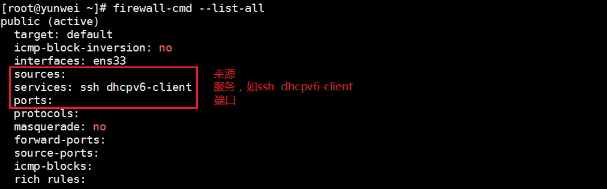

### <font style="color:rgb(51, 51, 51);">查看所有区域的规则设置</font>
```shell
# firewall-cmd --list-all-zones
```

<font style="color:rgb(51, 51, 51);">运行结果：</font>

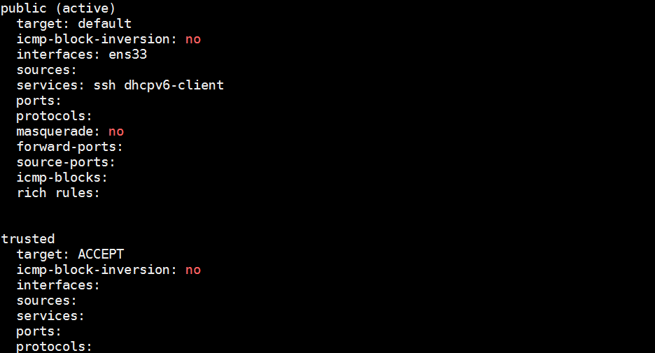

### <font style="color:rgb(51, 51, 51);">添加允许通过的服务或端口（重点）</font>
#### <font style="color:rgb(51, 51, 51);">通过服务的名称添加规则</font>
```shell
# firewall-cmd --zone=public --add-service=服务的名称
备注：服务必须存储在/usr/lib/firewalld/services目录中
```

<font style="color:rgb(51, 51, 51);">案例：把http服务添加到防火墙的规则中，允许通过防火墙</font>

```shell
# firewall-cmd --zone=public --add-service=http
```

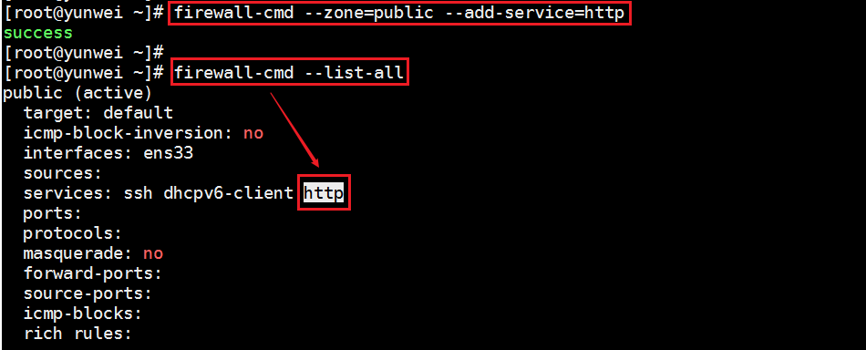

<font style="color:rgb(51, 51, 51);">扩展：把http服务从防火墙规则中移除，不允许其通过防火墙</font>

```shell
# firewall-cmd --zone=public --remove-service=http
# firewall-cmd --list-all
```


#### <font style="color:rgb(51, 51, 51);">通过服务的端口号添加规则</font>
```shell
# firewall-cmd --zone=public --add-port=端口号/tcp
```

<font style="color:rgb(51, 51, 51);">案例：把80/tcp添加到防火墙规则中，允许通过防火墙</font>

```shell
# ss -naltp |grep httpd
httpd :::80
# 允许80端口通过firewalld防火墙
# firewall-cmd --zone=public --add-port=80/tcp
```

<font style="color:rgb(51, 51, 51);">运行效果：</font>


<font style="color:rgb(51, 51, 51);">案例：从firewalld防火墙中把80端口的规则移除掉</font>

```shell
# firewall-cmd --zone=public --remove-port=80/tcp
```


### <font style="color:rgb(51, 51, 51);">永久模式permanent</font>
<font style="color:rgb(51, 51, 51);">在Linux的新版防火墙firewalld中，其模式一共分为两大类：运行模式（临时模式）+ 永久模式。</font>

<font style="color:rgb(51, 51, 51);">运行模式：不会把规则保存到防火墙的配置文件中，设置完成后立即生效</font>

<font style="color:rgb(51, 51, 51);">永久模式：会把规则写入到防火墙的配置文件中，但是其需要reload重载后才会立即生效</font>

```shell
# 根据服务名称添加规则（永久）
# firewall-cmd --zone=public --add-service=服务名称 --permanent
# firewall-cmd --reload

# 根据端口号添加规则（永久）
# firewall-cmd --zone=public --add-port=服务占用的端口号 --permanent
# firewall-cmd --reload
```

<font style="color:rgb(51, 51, 51);">案例：把80端口添加到firewalld防火墙规则中，要求永久生效</font>

```shell
# firewall-cmd --zone=public --add-port=80/tcp --permanent
# firewall-cmd --reload	或者 systemctl reload firewalld

# firewall-cmd --list-all
```

# <font style="color:rgb(51, 51, 51);">二、引言</font>
<font style="color:rgb(51, 51, 51);">在运维的日常工作中，监视系统的运行状况是每天例行的工作，在 Windows 中我们可以很直观的使用"任务管理器"来进行进程管理，了解系统的运行状态</font>

<font style="color:rgb(51, 51, 51);">通常，使用"任务管理器"主要有 3 个目的：</font>

1. <font style="color:rgb(51, 51, 51);">利用"应用程序"和"进程"标签来査看系统中到底运行了哪些程序和进程；</font>
2. <font style="color:rgb(51, 51, 51);">利用"性能"和"用户"标签来判断服务器的健康状态；</font>
3. <font style="color:rgb(51, 51, 51);">在"应用程序"和"进程"标签中强制中止任务和进程；</font>


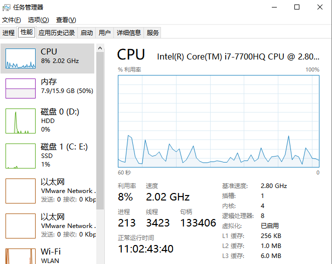

<font style="color:rgb(51, 51, 51);">在工作中，我们很少会用到Linux的图形化界面，更多时候会使用命令进行进程管理，但是进程管理的主要目的是一样的，即：</font>

**<font style="color:rgb(51, 51, 51);">查看系统中运行的程序和进程</font>**

**<font style="color:rgb(51, 51, 51);">判断服务器的健康状态：CPU、内存、磁盘</font>**

**<font style="color:rgb(51, 51, 51);">停止不需要的进程。</font>**

# <font style="color:rgb(51, 51, 51);">三、Linux进程与程序</font>
## <font style="color:rgb(51, 51, 51);">了解一下进程与程序的关系</font>
**<font style="color:rgb(51, 51, 51);">进程</font>**<font style="color:rgb(51, 51, 51);">是正在执行的一个程序或命令，每个进程都是一个运行的实体，并占用一定的系统资源。</font>**<font style="color:rgb(51, 51, 51);">程序</font>**<font style="color:rgb(51, 51, 51);">是人使用计算机语言编写的可以实现特定目标或解决特定问题的代码集合。</font>

<font style="color:rgb(51, 51, 51);">简单来说，程序是人使用计算机语言编写的，可以实现一定功能，并且可以执行的代码集合。进程是正在执行中的程序。</font>

**<font style="color:rgb(51, 51, 51);">举例</font>**<font style="color:rgb(51, 51, 51);">：谷歌浏览器是一个程序，当我们打开谷歌浏览器，就会在系统中看到一个浏览器的进程，当程序被执行时，程序的代码都会被加载入内存，操作系统给这个进程分配一个 ID，称为 </font>**<font style="color:rgb(51, 51, 51);">PID</font>**<font style="color:rgb(51, 51, 51);">（进程 ID）。我们打开多个谷歌浏览器，就有多个浏览器子进程，但是这些进程使用的程序，都是chrome。</font>

> <font style="color:rgb(119, 119, 119);">PID = Process ID = 进程编号</font>
>

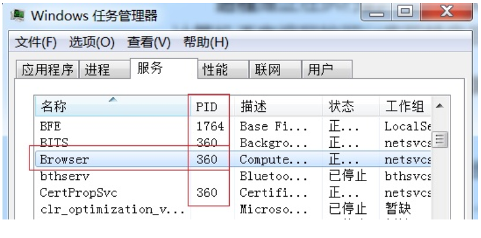

## <font style="color:rgb(51, 51, 51);">Linux下的进程管理工作</font>
<font style="color:rgb(51, 51, 51);">进程查看，通过查看，判断健康状态</font>

<font style="color:rgb(51, 51, 51);">进程终止</font>

<font style="color:rgb(51, 51, 51);">进程优先级控制</font>

# <font style="color:rgb(51, 51, 51);">四、Linux下进程管理命令</font>
## <font style="color:rgb(51, 51, 51);">任务背景</font>
<font style="color:rgb(51, 51, 51);">工作场景：</font>

<font style="color:rgb(51, 51, 51);">小黑入职到一家公司，接到的第一项任务，就是监控生产服务器的性能，提到服务器性能，我们首先想到的就是CPU，内存和磁盘。</font>

## <font style="color:rgb(51, 51, 51);">使用top命令动态监测CPU信息</font>
<font style="color:rgb(51, 51, 51);">基本语法：</font>

```shell
# top
```

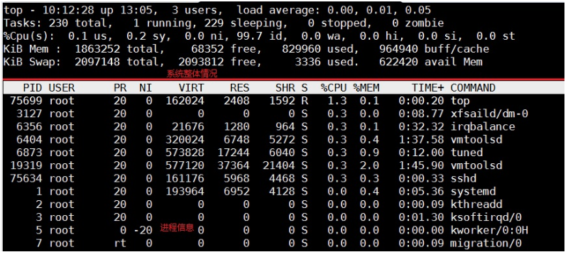

## <font style="color:rgb(51, 51, 51);">系统的整体情况</font>
### <font style="color:rgb(51, 51, 51);">第一行</font>
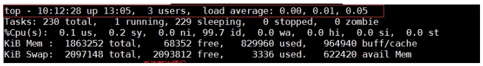

| **<font style="color:rgb(51, 51, 51);">内 容</font>** | **<font style="color:rgb(51, 51, 51);">说 明</font>** |
| :--- | :--- |
| <font style="color:rgb(51, 51, 51);">10:12:28</font> | <font style="color:rgb(51, 51, 51);">系统当前时间</font> |
| <font style="color:rgb(51, 51, 51);">up 13:05</font> | <font style="color:rgb(51, 51, 51);">系统的运行时间.本机己经运行 13 小时 05 分钟</font> |
| <font style="color:rgb(51, 51, 51);">3 users</font> | <font style="color:rgb(51, 51, 51);">当前登录了三个用户</font> |
| <font style="color:rgb(51, 51, 51);">load average: 0.00,0.01，0.05</font> | <font style="color:rgb(51, 51, 51);">系统在之前 1 分钟、5 分钟、15 分钟的平均负载。如果 CPU 是单核的，则这个数值超过 1 就是高负载：如果 CPU 是四核的，则这个数值超过 4 就是高负载</font> |


### <font style="color:rgb(51, 51, 51);">第二行</font>
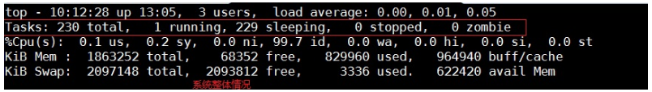

| <font style="color:rgb(51, 51, 51);">Tasks: 230 total</font> | <font style="color:rgb(51, 51, 51);">系统中的进程总数</font> |
| :--- | :--- |
| <font style="color:rgb(51, 51, 51);">1 running</font> | <font style="color:rgb(51, 51, 51);">正在运行的进程数</font> |
| <font style="color:rgb(51, 51, 51);">229 sleeping</font> | <font style="color:rgb(51, 51, 51);">睡眠的进程数</font> |
| <font style="color:rgb(51, 51, 51);">0 stopped</font> | <font style="color:rgb(51, 51, 51);">正在停止的进程数</font> |
| <font style="color:rgb(51, 51, 51);">0 zombie</font> | <font style="color:rgb(51, 51, 51);">僵尸进程数。如果不是 0，则需要手工检查僵尸进程</font> |


### <font style="color:rgb(51, 51, 51);">第三行</font>
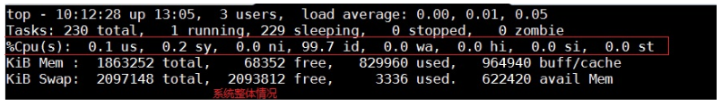

| **<font style="color:rgb(51, 51, 51);">内 容</font>** | **<font style="color:rgb(51, 51, 51);">说 明</font>** |
| :--- | :--- |
| <font style="color:rgb(51, 51, 51);">Cpu(s): 0.1 %us</font> | <font style="color:rgb(51, 51, 51);">用户模式占用的 CPU 百分比</font> |
| <font style="color:rgb(51, 51, 51);">0.1%sy</font> | <font style="color:rgb(51, 51, 51);">系统模式占用的 CPU 百分比</font> |
| <font style="color:rgb(51, 51, 51);">0.0%ni</font> | <font style="color:rgb(51, 51, 51);">改变过优先级的用户进程占用的 CPU 百分比</font> |
| <font style="color:rgb(51, 51, 51);">99.7%id</font> | <font style="color:rgb(51, 51, 51);">idle缩写，空闲 CPU 占用的 CPU 百分比</font> |
| <font style="color:rgb(51, 51, 51);">0.1%wa</font> | <font style="color:rgb(51, 51, 51);">等待输入/输出的进程占用的 CPU 百分比</font> |
| <font style="color:rgb(51, 51, 51);">0.0%hi</font> | <font style="color:rgb(51, 51, 51);">硬中断请求服务占用的 CPU 百分比</font> |
| <font style="color:rgb(51, 51, 51);">0.1%si</font> | <font style="color:rgb(51, 51, 51);">软中断请求服务占用的 CPU 百分比</font> |
| <font style="color:rgb(51, 51, 51);">0.0%st</font> | <font style="color:rgb(51, 51, 51);">st（steal time）意为虚拟时间百分比，就是当有虚拟机时，虚拟 CPU 等待实际 CPU 的时间百分比</font> |


**<font style="color:rgb(51, 51, 51);">问题：如果我的机器有4核CPU，我想查看每一核心分别的负载情况怎能办？</font>**

<font style="color:rgb(51, 51, 51);">答：交换快捷键 “1”</font>

> <font style="color:rgb(119, 119, 119);">CPU负载测试 => cat /dev/urandom |md5sum</font>
>

### <font style="color:rgb(51, 51, 51);">第四行</font>
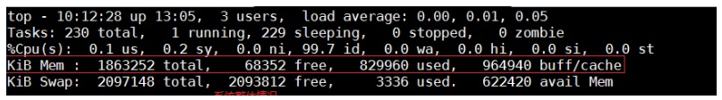

| **<font style="color:rgb(51, 51, 51);">内 容</font>** | **<font style="color:rgb(51, 51, 51);">说 明</font>** |
| :--- | :--- |
| <font style="color:rgb(51, 51, 51);">Mem: 1863252 total</font> | <font style="color:rgb(51, 51, 51);">物理内存的总量，单位为KB</font> |
| <font style="color:rgb(51, 51, 51);">829960 used</font> | <font style="color:rgb(51, 51, 51);">己经使用的物理内存数量</font> |
| <font style="color:rgb(51, 51, 51);">68352 free</font> | <font style="color:rgb(51, 51, 51);">空闲的物理内存数量。我们使用的是虚拟机，共分配了 628MB内存，所以只有53MB的空闲内存</font> |
| <font style="color:rgb(51, 51, 51);">96490 buff/cache</font> | <font style="color:rgb(51, 51, 51);">作为缓冲的内存数量</font> |


> <font style="color:rgb(119, 119, 119);">扩展：真正剩余内存 = free + buff/cache，真正使用内存 = used - buff/cache</font>
>

### <font style="color:rgb(51, 51, 51);">第五行</font>
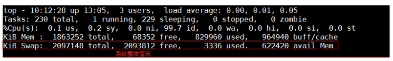

| **<font style="color:rgb(51, 51, 51);">内 容</font>** | **<font style="color:rgb(51, 51, 51);">说 明</font>** |
| :--- | :--- |
| <font style="color:rgb(51, 51, 51);">Swap: 2097148 total</font> | <font style="color:rgb(51, 51, 51);">交换分区（虚拟内存）的总大小</font> |
| <font style="color:rgb(51, 51, 51);">3336 used</font> | <font style="color:rgb(51, 51, 51);">已经使用的交换分区的大小</font> |
| <font style="color:rgb(51, 51, 51);">2093812 free</font> | <font style="color:rgb(51, 51, 51);">空闲交换分区的大小</font> |
| <font style="color:rgb(51, 51, 51);">622420 avail Mem</font> | <font style="color:rgb(51, 51, 51);">可用内存</font> |


<font style="color:rgb(51, 51, 51);">在Linux操作系统分区时，最少需要3个分区：</font>

<font style="color:rgb(51, 51, 51);">① /boot分区 ： 系统分区</font>

<font style="color:rgb(51, 51, 51);">② swap交换分区 ：一般情况下为内存的1~2倍，但是尽量不要超过2G</font>

<font style="color:rgb(51, 51, 51);">③ /分区 ：根分区，所有文件都存放于此</font>

> <font style="color:rgb(119, 119, 119);">swap分区：就是当计算机的内存不足时，系统会自动从硬盘中划出一块区域充当内存使用。</font>
>

<font style="color:rgb(51, 51, 51);">我们通过 top 命令的整体信息部分，就可以判断服务器的健康状态。如果 1 分钟、5 分钟、15 分钟的平均负载高于CPU核数，说明系统压力较大。如果物理内存的空闲内存过小，则也证明系统压力较大。</font>

<font style="color:rgb(51, 51, 51);">问题：根据以上信息，目前我们的系统压力如何？</font>

<font style="color:rgb(51, 51, 51);">答：看CPU负载及内存的使用情况</font>

<font style="color:rgb(51, 51, 51);"></font>

<font style="color:rgb(51, 51, 51);">问题：如果我们发现CPU负载过大，接下来怎么办？</font>

<font style="color:rgb(51, 51, 51);">答：如果1分钟、5分钟以及15分钟全部超过CPU的总核心数（必须引起警觉），这个时候就要查看底部的进程信息了。</font>

> <font style="color:rgb(119, 119, 119);">经验之谈：如果一个总核数=8核心的CPU，理论上平均负载达到16，也还可以坚持很长一段时间。</font>
>

## <font style="color:rgb(51, 51, 51);">系统的进程信息</font>
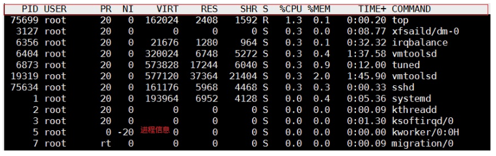

| **<font style="color:rgb(51, 51, 51);">列</font>** | 说明 |
| :--- | :--- |
| <font style="color:rgb(51, 51, 51);">PID</font> | <font style="color:rgb(51, 51, 51);">进程的 ID。</font> |
| <font style="color:rgb(51, 51, 51);">USER</font> | <font style="color:rgb(51, 51, 51);">该进程所属的用户。</font> |
| <font style="color:rgb(51, 51, 51);">PR</font> | <font style="color:rgb(51, 51, 51);">优先级，数值越小优先级越高。</font> |
| <font style="color:rgb(51, 51, 51);">NI</font> | <font style="color:rgb(51, 51, 51);">NICE优先级，数值越小优先级越高，取值范围-20到19，默认都是0</font> |
| <font style="color:rgb(51, 51, 51);">VIRT</font> | <font style="color:rgb(51, 51, 51);">该进程使用的虚拟内存的大小，单位为 KB。</font> |
| <font style="color:rgb(51, 51, 51);">RES</font> | <font style="color:rgb(51, 51, 51);">该进程使用的物理内存的大小，单位为 KB。</font> |
| <font style="color:rgb(51, 51, 51);">SHR</font> | <font style="color:rgb(51, 51, 51);">共享内存大小，单位为 KB。计算一个进程实际使用的内存 = 常驻内存（RES）- 共享内存（SHR）</font> |
| <font style="color:rgb(51, 51, 51);">S</font> | <font style="color:rgb(51, 51, 51);">进程状态。其中S 表示睡眠，R 表示运行</font> |
| <font style="color:rgb(51, 51, 51);">%CPU</font> | <font style="color:rgb(51, 51, 51);">该进程占用 CPU 的百分比。</font> |
| <font style="color:rgb(51, 51, 51);">%MEM</font> | <font style="color:rgb(51, 51, 51);">该进程占用内存的百分比。</font> |
| <font style="color:rgb(51, 51, 51);">TIME+</font> | <font style="color:rgb(51, 51, 51);">该进程共占用的 CPU 时间。</font> |
| <font style="color:rgb(51, 51, 51);">COMMAND</font> | <font style="color:rgb(51, 51, 51);">进程名</font> |


**<font style="color:rgb(51, 51, 51);">问题：如果我们发现CPU负载过大，接下来怎么办？</font>**

<font style="color:rgb(51, 51, 51);">答：查看占用CPU最多的进程</font>

**<font style="color:rgb(51, 51, 51);">问题：如何查看占用CPU最多的进程？</font>**

<font style="color:rgb(51, 51, 51);">答：交互操作快捷键P，P（大写）：，表示将结果按照CPU 使用率从高到低进行降序排列</font>

**<font style="color:rgb(51, 51, 51);">问题：如果我们发现内存可用量很小，接下来怎么办？</font>**

<font style="color:rgb(51, 51, 51);">答：查看占用内存最多的进程，使用交互快捷键M（大写）：表示将结果按照内存（MEM）从高到低进行降序排列</font>

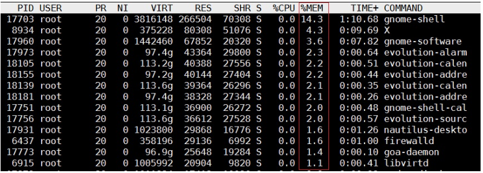

**<font style="color:rgb(51, 51, 51);">问题：当我们查看完系统状态，需要做什么？</font>**

<font style="color:rgb(51, 51, 51);">答：退出，使用q，按键盘上的q，就会回到#提示符的状态。</font>

## <font style="color:rgb(51, 51, 51);">free查看内存使用情况</font>
<font style="color:rgb(51, 51, 51);">基本语法：</font>

```shell
# free [选项]  1GB = 1024MB  1MB = 1024KB
选项说明：
-m : 以MB的形式显示内存大小
```

<font style="color:rgb(51, 51, 51);">案例：显示计算机的内存使用情况</font>

```shell
# free -m
```

<font style="color:rgb(51, 51, 51);">和Centos6相比，buffer和cached被合成一组，加入了一个available。</font>

<font style="color:rgb(51, 51, 51);">关于此available，即系统可用内存，用户不需要去计算buffer/cache，即可以看到还有多少内存可用，更加简单直观</font>

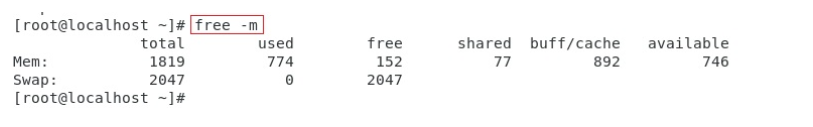

## <font style="color:rgb(51, 51, 51);">df查看磁盘剩余空间</font>
<font style="color:rgb(51, 51, 51);">基本语法：</font>

```shell
# df [选项]
-h ：以较高的可读性显示磁盘剩余空间大小
```

> <font style="color:rgb(119, 119, 119);">df = disk free = 磁盘 剩余</font>
>

<font style="color:rgb(51, 51, 51);">这几列依次是：</font>

| **<font style="color:rgb(51, 51, 51);">列</font>** | 说明 |
| :--- | :--- |
| <font style="color:rgb(51, 51, 51);">Filesystem</font> | <font style="color:rgb(51, 51, 51);">磁盘名称</font> |
| <font style="color:rgb(51, 51, 51);">Size</font> | <font style="color:rgb(51, 51, 51);">总大小</font> |
| <font style="color:rgb(51, 51, 51);">Used</font> | <font style="color:rgb(51, 51, 51);">被使用的大小</font> |
| <font style="color:rgb(51, 51, 51);">Avail</font> | <font style="color:rgb(51, 51, 51);">剩余大小</font> |
| <font style="color:rgb(51, 51, 51);">Use%</font> | <font style="color:rgb(51, 51, 51);">使用百分比</font> |
| <font style="color:rgb(51, 51, 51);">Mounted on</font> | <font style="color:rgb(51, 51, 51);">挂载路径（相当于Windows 的磁盘符）</font> |


## <font style="color:rgb(51, 51, 51);">ps查看系统进程信息</font>
<font style="color:rgb(51, 51, 51);">top ：动态查看系统进程的信息（每隔3s切换一次）</font>

<font style="color:rgb(51, 51, 51);">ps ：静态查看系统进程的信息（只能查询运行ps命令瞬间，系统的进程信息）</font>

<font style="color:rgb(51, 51, 51);">基本语法：</font>

```shell
# ps [选项]
选项说明：
-e : 等价于“-A”，表示列出全部（all）的进程
-f : 表示full，显示全部的列（显示全字段）
```

<font style="color:rgb(51, 51, 51);">案例：显示当前系统中所有进程的信息</font>

```shell
# ps -ef
```

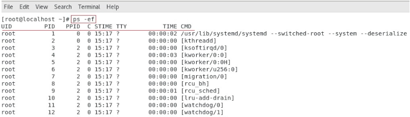

| <font style="color:rgb(51, 51, 51);">列</font> | 说明 |
| :--- | :--- |
| <font style="color:rgb(51, 51, 51);">UID</font> | <font style="color:rgb(51, 51, 51);">该进程执行的用户ID</font> |
| <font style="color:rgb(51, 51, 51);">PID</font> | <font style="color:rgb(51, 51, 51);">进程ID</font> |
| <font style="color:rgb(51, 51, 51);">PPID</font> | <font style="color:rgb(51, 51, 51);">该进程的父级进程ID，如果找不到，则该进程就被称之为僵尸进程（Parent Process ID）</font> |
| <font style="color:rgb(51, 51, 51);">C</font> | <font style="color:rgb(51, 51, 51);">Cpu的占用率，其形式是百分数</font> |
| <font style="color:rgb(51, 51, 51);">STIME</font> | <font style="color:rgb(51, 51, 51);">进程的启动时间</font> |
| <font style="color:rgb(51, 51, 51);">TTY</font> | <font style="color:rgb(51, 51, 51);">终端设备，发起该进程的设备识别符号，如果显示“?”则表示该进程并不是由终端设备发起</font> |
| <font style="color:rgb(51, 51, 51);">TIME</font> | <font style="color:rgb(51, 51, 51);">进程实际使用CPU的时间</font> |
| <font style="color:rgb(51, 51, 51);">CMD</font> | <font style="color:rgb(51, 51, 51);">该进程的名称或者对应的路径</font> |


> <font style="color:rgb(119, 119, 119);">经验之谈：我们在实际工作中使用ps命令其实主要用于查询某个进程的PID或PPID</font>
>

<font style="color:rgb(51, 51, 51);">工作场景</font>

<font style="color:rgb(51, 51, 51);">小黑用学到的命令，发现某个进程占用CPU很高，希望进一步查看这个进程的信息。</font>

<font style="color:rgb(51, 51, 51);">ps -ef 会列出全部进程，但是我们发现进程非常多，我们很难找到自己想要看的进程。这里需要使用过滤命令grep，来过滤掉我们不需要的信息。</font>

<font style="color:rgb(51, 51, 51);">基本语法：</font>

```shell
用法：ps -ef |grep 想要看到的进程名
示例代码：
# ps -ef |grep crond
含义：查看crond进程的详细情况
注意：查询结果中，如果只有一条则表示没查到对应的进程（这1 条表示刚才ps 指令的自身）。只有查到的结果多余1 条，才表示有对应的进程。
```

<font style="color:rgb(51, 51, 51);">案例：查询crond的进程信息</font>

```shell
# ps -ef |grep crond
root       7102      1  0 Mar23 ?        00:00:04 /usr/sbin/crond -n
root      24752  12881  0 16:34 pts/2    00:00:00 grep --color=auto crond
```

<font style="color:rgb(51, 51, 51);">问题：以上信息只有第一行是crond的进程，第二行，实际是管道命令发起时，grep所启动的进程，如何去掉？</font>

```shell
# ps -ef |grep crond |grep -v "grep"
root       7102      1  0 Mar23 ?        00:00:04 /usr/sbin/crond -n
```

> <font style="color:rgb(119, 119, 119);">grep -v 需要去除的相关信息 ： 去除包含指定关键词的那一行</font>
>

<font style="color:rgb(51, 51, 51);">扩展：ps aux命令</font>

```shell
# ps aux
```

> <font style="color:rgb(119, 119, 119);">#</font><font style="color:rgb(119, 119, 119);"> man ps</font>
>
> <font style="color:rgb(119, 119, 119);">1 UNIX options, which may be grouped and must be preceded by a dash. ps -ef</font>
>
> <font style="color:rgb(119, 119, 119);">2 BSD options, which may be grouped and must not be used with a dash.	 ps aux</font>
>

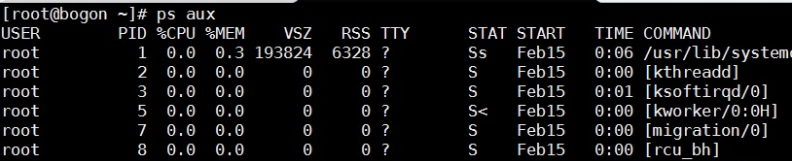

<font style="color:rgb(51, 51, 51);">USER：该 process 属于哪个使用者账号</font>

**<font style="color:rgb(51, 51, 51);">PID ：该 process 的ID</font>**

**<font style="color:rgb(51, 51, 51);">%CPU：该 process 使用掉的 CPU 资源百分比</font>**

**<font style="color:rgb(51, 51, 51);">%MEM：该 process 所占用的物理内存百分比</font>**

<font style="color:rgb(51, 51, 51);">VSZ ：该 process 使用掉的虚拟内存量 (Kbytes)</font>

<font style="color:rgb(51, 51, 51);">RSS ：该 process 占用的固定的内存量 (Kbytes)</font>

<font style="color:rgb(51, 51, 51);">TTY ：该 process 是在那个终端机上面运作，若与终端机无关，则显示 ?，另外， tty1-tty6 是本机上面的登入者程序，若为 pts/0 等等的，则表示为由网络连接进主机的程序。</font>

**<font style="color:rgb(51, 51, 51);">STAT：该程序目前的状态，主要的状态有</font>**

<font style="color:rgb(51, 51, 51);">R ：该程序目前正在运作，或者是可被运作 </font>

<font style="color:rgb(51, 51, 51);">S ：该程序目前正在睡眠当中 (可说是 idle 状态)，但可被某些讯号 (signal) 唤醒。 </font>

<font style="color:rgb(51, 51, 51);">T ：该程序目前正在侦测或者是停止了 </font>

**<font style="color:rgb(51, 51, 51);">Z ：该程序应该已经终止，但是其父程序却无法正常的终止他，造成 zombie (疆尸) 程序的状态</font>**

<font style="color:rgb(51, 51, 51);">START：该 process 被触发启动的时间</font>

<font style="color:rgb(51, 51, 51);">TIME ：该 process 实际使用 CPU 运作的时间</font>

<font style="color:rgb(51, 51, 51);">COMMAND：该程序的实际指令</font>

## <font style="color:rgb(51, 51, 51);">netstat/ss查询网络访问信息</font>
<font style="color:rgb(51, 51, 51);">基本语法：</font>

```shell
# netstat [选项] |grep 进程名称
选项说明：
-t：表示只列出tcp 协议的连接（tcp协议与udp协议）
-n：表示将地址从字母组合转化成ip 地址，将协议转化成端口号来显示  10.1.1.10:80
-l：表示过滤出"state（状态）"列中其值为LISTEN（监听）的连接
-p：表示显示发起连接的进程pid 和进程名称
```

<font style="color:rgb(51, 51, 51);">案例：查询Web Server（httpd）服务的端口信息</font>

```shell
# netstat -tnlp |grep httpd
```


<font style="color:rgb(51, 51, 51);">基本语法：</font>

```shell
# ss -naltp |grep 进程名称
```

<font style="color:rgb(51, 51, 51);">案例：查询sshd服务的端口信息</font>

```shell
# ss -naltp |grep sshd
```

> <font style="color:rgb(119, 119, 119);">netstat与ss区别？① netstat信息比较简洁，ss更加丰富 ② ss执行效率比netstat略高一些</font>
>

## <font style="color:rgb(51, 51, 51);">kill/killall杀死进程</font>
### <font style="color:rgb(51, 51, 51);">根据pid杀掉进程</font>
```shell
命令：kill
语法：kill [信号] PID
作用：kill 命令会向操作系统内核发送一个信号（多是终止信号）和目标进程的 PID，然后系统内核根据收到的信号类型，对指定进程进行相应的操作

经验：kill经常结合ps命令一起使用
```

> <font style="color:rgb(119, 119, 119);">kill命令用于杀死某个进程，这其实只是其一个功能。kill命令的实质是向进程发送信号</font>
>

<font style="color:rgb(51, 51, 51);">信号种类：</font>

| **<font style="color:rgb(51, 51, 51);">信号编号</font>** | **<font style="color:rgb(51, 51, 51);">含义</font>** |
| :--- | :--- |
| <font style="color:rgb(51, 51, 51);">9</font> | <font style="color:rgb(51, 51, 51);">杀死进程，即强制结束进程。</font> |
| <font style="color:rgb(51, 51, 51);">15</font> | <font style="color:rgb(51, 51, 51);">正常结束进程，是 kill 命令的默认信号。</font> |


<font style="color:rgb(51, 51, 51);">案例：使用kill命令杀死crond进程</font>

```shell
# ps -ef |grep crond
7102
# kill 7102
```

> <font style="color:rgb(119, 119, 119);">备注：在互联网中，经常看到kill -9 进程PID，强制杀死某个进程，kill -9 pid</font>
>

### <font style="color:rgb(51, 51, 51);">根据进程名称杀掉进程</font>
<font style="color:rgb(51, 51, 51);">基本语法：</font>

```shell
# killall [信号编号] 进程名称
```

<font style="color:rgb(51, 51, 51);">案例：使用killall命令杀死crond进程</font>

```shell
# killall crond
```

<font style="color:rgb(51, 51, 51);">案例：使用killall命令杀死httpd进程</font>

```shell
# killall httpd
```


> 更新: 2025-03-10 10:33:13  
> 原文: <https://www.yuque.com/u41736172/az9urv/uwtw0bsvb1v2785y>