# 11.开源项目上线部署实战

# <font style="color:rgb(51, 51, 51);">一、学习目标</font>

1. 了解Linux软件的安装方式
2. 掌握更新yum源
3. 掌握YUM软件安装方式
4. 了解LAMP环境以及AMP的关系
5. 了解阿里云ECS的创建过程
6. 能够yum方式搭建lamp环境
7. 能够实现Discuz!论坛部署

# <font style="color:rgb(51, 51, 51);">二、引言</font>

## <font style="color:rgb(51, 51, 51);">项目背景</font>

<font style="color:rgb(51, 51, 51);">学员小白，目前刚入职了一家电子商务公司。主要负责大型商城系统维护，公司主营母婴用品，如奶瓶、奶嘴、童装等等，最近，很多客服发现一个问题：很多宝妈会在评论区互相咨询产品相关信息。</font>

<font style="color:rgb(51, 51, 51);">于是公司决定针对这一需求，要求运维为公司迅速上线一款论坛系统，方便宝妈交流产品、育儿心得等等。</font>

## <font style="color:rgb(51, 51, 51);">项目需求</font>

<font style="color:rgb(51, 51, 51);">满足功能，并且省钱（开源项目）</font>

<font style="color:rgb(51, 51, 51);">Discuz！ = Apache + PHP + MySQL</font>

# <font style="color:rgb(51, 51, 51);">三、YUM</font>

## <font style="color:rgb(51, 51, 51);">什么是YUM</font>

<font style="color:rgb(51, 51, 51);">在CentOS系统中，软件管理方式通常有三种方式：</font><code><font style="color:rgb(51, 51, 51);background-color:rgb(243, 244, 244);">rpm安装</font></code><font style="color:rgb(51, 51, 51);">、</font><code><font style="color:rgb(51, 51, 51);background-color:rgb(243, 244, 244);">yum安装</font></code><font style="color:rgb(51, 51, 51);">以及</font><code><font style="color:rgb(51, 51, 51);background-color:rgb(243, 244, 244);">编译安装</font></code><font style="color:rgb(51, 51, 51);">。</font>

```shell
编译安装，从过程上来讲比较麻烦，包需要用户自行下载，下载的是源码包，需要进行编译操作，编译好了才能进行安装，这个过程对于刚接触Linux的人来说比较麻烦，而且还容易出错。好处在于是源码包，对于有需要自定义模块的用户来说非常方便。
```

<font style="color:rgb(51, 51, 51);">难度：编译安装 > rpm安装 > yum安装（有网络 + yum源支持）</font>

<font style="color:rgb(51, 51, 51);">Yum（全称为 </font><code><font style="color:rgb(51, 51, 51);background-color:rgb(243, 244, 244);">Yellow dog Updater, Modified</font></code><font style="color:rgb(51, 51, 51);">）是一个在Fedora和RedHat以及CentOS中的Shell前端软件包管理器。</font>

<font style="color:rgb(51, 51, 51);">基于rpm包管理，能够从</font>**<font style="color:rgb(51, 51, 51);">指定的服务器</font>**<font style="color:rgb(51, 51, 51);">(yum源）自动下载RPM包并且安装，可以自动处理依赖性关系，并且一次安装所有依赖的软件包，无须繁琐地一次次下载、安装。</font>

> <font style="color:rgb(119, 119, 119);">rpm和yum区别？答：① yum底层也是基于rpm进行安装的（yum安装的软件，可以通过rpm -qa进行查询） ② yum相对于rpm最大的优势，可以解决依赖关系。</font>
>
> <font style="color:rgb(119, 119, 119);">A => B => C</font>

## <font style="color:rgb(51, 51, 51);">YUM源配置</font>

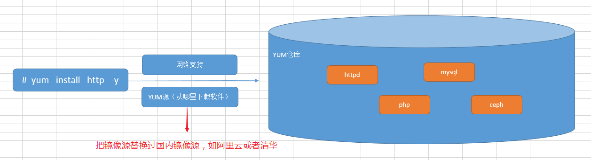

<font style="color:rgb(51, 51, 51);">YUM源配置文件所在路径 => /etc/yum.repos.d文件夹</font>

<font style="color:rgb(51, 51, 51);">-rw-r--r--. 1 root root 1991 Mar 28 2017 CentOS-Base.repo 网络yum源配置文件</font>

<font style="color:rgb(51, 51, 51);">-rw-r--r--. 1 root root 647 Mar 28 2017 CentOS-Debuginfo.repo 内核相关的更新包</font>

<font style="color:rgb(51, 51, 51);">-rw-r--r--. 1 root root 289 Mar 28 2017 CentOS-fasttrack.repo 快速通道</font>

<font style="color:rgb(51, 51, 51);">-rw-r--r--. 1 root root 630 Mar 28 2017 CentOS-Media.repo 本地yum源配置文件</font>

<font style="color:rgb(51, 51, 51);">-rw-r--r--. 1 root root 7989 Mar 28 2017 CentOS-Vault.repo 最近版本加入老版本的YUM配置 </font>

<font style="color:rgb(51, 51, 51);">扩展：在YUM镜像源中添加阿里云镜像源</font>

```shell
第一步：备份CentOS-Base.repo这个源（更改后缀名.repo => .repo.bak）
# mv CentOS-Base.repo CentOS-Base.repo.bak

第二步：使用wget命令下载阿里云的镜像文件
# wget -O /etc/yum.repos.d/CentOS-Base.repo http://mirrors.aliyun.com/repo/Centos-7.repo

选项说明：
-O ：指定文件下载的位置以及名称
第三步：清理YUM缓存
# yum clean all

第四步：重新建立缓存（让新YUM源生效）
# yum makecache
```

## <font style="color:rgb(51, 51, 51);">yum命令详解</font>

### <font style="color:rgb(51, 51, 51);">搜索要安装的软件</font>

```shell
# yum search 软件名称的关键词
```

<font style="color:rgb(51, 51, 51);">案例：搜索阿里云仓库中的vim软件</font>

```shell
# yum search vim
```

<font style="color:rgb(51, 51, 51);">案例：搜索firefox火狐浏览器</font>

```shell
# yum search firefox
```

### <font style="color:rgb(51, 51, 51);">使用yum安装软件</font>

<font style="color:rgb(51, 51, 51);">基本语法：</font>

```shell
# yum install 软件名称关键词 [选项]
选项：
-y ：yes缩写，确认安装，不提示。
```

<font style="color:rgb(51, 51, 51);">案例：使用yum命令安装vim编辑器</font>

```shell
# yum install vim -y
```

<font style="color:rgb(51, 51, 51);">案例：使用yum命令安装firefox浏览器</font>

```shell
# yum install firefox -y
```

### <font style="color:rgb(51, 51, 51);">使用yum卸载软件</font>

```shell
# yum remove 软件名称关键词 [选项]
选项：
-y ：yes缩写，确认卸载，不提示。
```

<font style="color:rgb(51, 51, 51);">案例：把firefox火狐浏览器进行卸载操作</font>

```shell
# yum remove firefox -y
```

<font style="color:rgb(51, 51, 51);">案例：把httpd软件进行强制卸载</font>

```shell
# yum remove httpd -y
```

### <font style="color:rgb(51, 51, 51);">使用yum更新软件</font>

<font style="color:rgb(51, 51, 51);">基本语法：</font>

```shell
# yum update 软件名称关键词 [选项]
选项：
-y ：yes缩写，确认更新，不提示
```

<font style="color:rgb(51, 51, 51);">案例：把vim编辑器进行更新操作</font>

```shell
# yum update vim -y
```

<font style="color:rgb(51, 51, 51);">案例：把firefox火狐浏览器进行更新操作</font>

```shell
# yum update firefox -y
```

# <font style="color:rgb(51, 51, 51);">四、LAMP概述</font>

## <font style="color:rgb(51, 51, 51);">什么是LAMP</font>

<font style="color:rgb(51, 51, 51);">LAMP：</font>**<font style="color:rgb(51, 51, 51);">L</font>**<font style="color:rgb(51, 51, 51);">inux + </font>**<font style="color:rgb(51, 51, 51);">A</font>**<font style="color:rgb(51, 51, 51);">pache + </font>**<font style="color:rgb(51, 51, 51);">M</font>**<font style="color:rgb(51, 51, 51);">ySQL + </font>**<font style="color:rgb(51, 51, 51);">P</font>**<font style="color:rgb(51, 51, 51);">HP LAMP 架构（组合）</font>

<font style="color:rgb(51, 51, 51);">LNMP：Linux + Nginx + MySQL + PHP LNMP 架构（组合）</font>

<font style="color:rgb(51, 51, 51);">LNMPA：Linux + Nginx(80) + MySQL + PHP + Apache Nginx 代理方式</font>


<font style="color:rgb(51, 51, 51);">Apache：Apache是世界使用排名第一的Web服务器软件。</font>

<font style="color:rgb(51, 51, 51);">PHP：一种专门用于Web开发的编程语言。</font>

<font style="color:rgb(51, 51, 51);">MySQL：MySQL是一个关系型数据库管理系统，主要用于永久存储项目数据。</font>

## <font style="color:rgb(51, 51, 51);">AMP三者之间的关系</font>

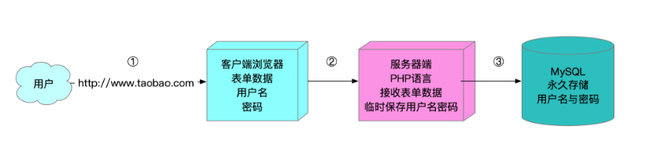

<font style="color:rgb(51, 51, 51);">Apache：用于接收用户的请求（输入网址，返回网页=>结果）</font>

<font style="color:rgb(51, 51, 51);">PHP：注册、登录、加入购物车、下单、支付等动态功能（有编程语言的支持）</font>

<font style="color:rgb(51, 51, 51);">MySQL：永久保存数据，比如你在网站上注册的用户和密码、你加入购物车的产品、你的产品订单</font>

<font style="color:rgb(51, 51, 51);">LAMP = Linux + Apache + PHP + MySQL</font>

# <font style="color:rgb(51, 51, 51);">六、LAMP环境部署</font>

## <font style="color:rgb(51, 51, 51);">LAMP部署前期准备</font>

### <font style="color:rgb(51, 51, 51);">关闭防火墙</font>

因为我们目前还没有深入的学习防火墙，目前先关掉，否则会影响我们后期的部署。

```shell
# systemctl stop firewalld
# systemctl disable firewalld
```

### <font style="color:rgb(51, 51, 51);">关闭SELinux</font>

*<font style="color:rgb(51, 51, 51);">SELinux</font>*<font style="color:rgb(51, 51, 51);">(Security-Enhanced Linux) 是美国国家安全局（NSA）对于强制访问控制的实现，是 Linux历史上最杰出的新安全子系统。</font>

<font style="color:rgb(51, 51, 51);">获取SELinux的状态：</font>

```shell
# getenforce
```

<font style="color:rgb(51, 51, 51);">临时关闭SElinux：重启后SELinux还会自动启动</font>

```shell
# setenforce 0
```

<font style="color:rgb(51, 51, 51);">永久关闭SELinux：编辑SELinux的配置文件</font>

```shell
# vim /etc/selinux/config
SELINUX=disabled
```

### <font style="color:rgb(51, 51, 51);">检查系统中是否已安装Apache</font>

```shell
# rpm -qa |grep httpd

# rpm -e httpd-2.4.6-90.el7.centos.x86_64
# rpm -e httpd-tools-2.4.6-90.el7.centos.x86_64
```

### <font style="color:rgb(51, 51, 51);">检查系统中是否已安装MySQL</font>

```shell
# rpm -qa |grep mysql
```

### <font style="color:rgb(51, 51, 51);">检查系统中是否已安装PHP</font>

```shell
# rpm -qa |grep php
```

> <font style="color:rgb(119, 119, 119);">AMP安装指南：在Linux中安装AMP必须先安装Apache，再安装MySQL，最后安装PHP</font>

## <font style="color:rgb(51, 51, 51);">LAMP环境之Apache安装</font>

<font style="color:rgb(51, 51, 51);">Apache：阿帕奇，Apache基金会</font>

<font style="color:rgb(51, 51, 51);">httpd软件 => 前身apache，随着时间的推移以及互联网行业的发展，越来越多的软件加入到了Apache的基金会。</font>

<font style="color:rgb(51, 51, 51);">第一步：安装httpd软件</font>

```shell
# yum install httpd -y
```

<font style="color:rgb(51, 51, 51);">第二步：配置/etc/httpd/conf/httpd.conf文件</font>

```shell
# vim /etc/httpd/conf/httpd.conf
/ServerName => 搜索
96 ServerName localhost:80
```

> <font style="color:rgb(119, 119, 119);">localhost ： 代表本机，对应的IP地址可以是127.0.0.1或本机的公网IP</font>

<font style="color:rgb(51, 51, 51);">第三步：启动httpd服务</font>

```shell
# systemctl start httpd
```

<font style="color:rgb(51, 51, 51);">第四步：把httpd服务添加到开机启动项中</font>

```shell
# systemctl enable httpd
```

<font style="color:rgb(51, 51, 51);">第五步：使用ss或netstat命令查询httpd占用的端口</font>

```shell
# netstat -tnlp |grep httpd
或
# ss -naltp |grep httpd
```

<font style="color:rgb(51, 51, 51);">第六步：在浏览器中，使用公网IP访问阿里云服务器</font>

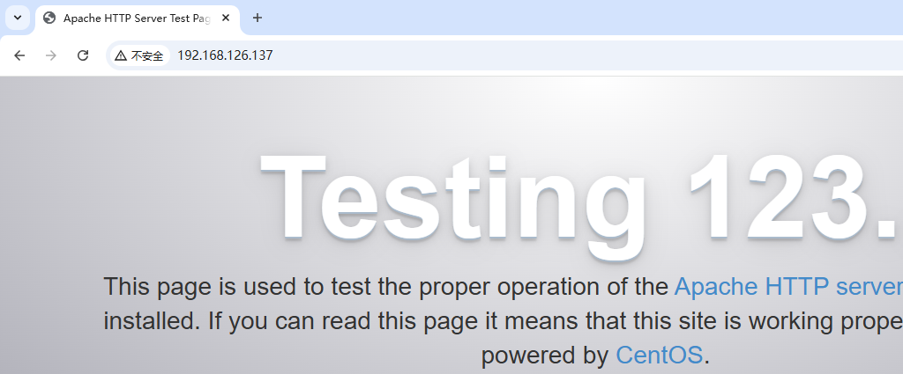

## <font style="color:rgb(51, 51, 51);">LAMP环境之MySQL安装</font>

### <font style="color:rgb(51, 51, 51);">下载MySQL的官网yum源</font>

<font style="color:rgb(51, 51, 51);">由于yum源上默认没有mysql-server。所以必须去官网下载后在安装</font>

```shell
# wget http://dev.mysql.com/get/mysql-community-release-el7-5.noarch.rpm
```

### <font style="color:rgb(51, 51, 51);">安装MySQL的官网镜像源</font>

```shell
# rpm -ivh mysql-community-release-el7-5.noarch.rpm
```

### <font style="color:rgb(51, 51, 51);">使用yum安装mysql最新版软件</font>

```shell
# yum install mysql-community-server -y
```

> <font style="color:rgb(119, 119, 119);">MySQL软件是一个C/S架构的软件，拥有客户端与服务器端。mysql-server服务器端（内部也包含了客户端），community代表社区版（免费开源）</font>

### <font style="color:rgb(51, 51, 51);">启动mysql，查看端口占用情况</font>

```shell
# systemctl start mysqld
# netstat -tnlp |grep mysqld
```

### <font style="color:rgb(51, 51, 51);">MySQL数据库初始化（重要）</font>

<font style="color:rgb(51, 51, 51);">默认情况下，数据库没有密码，也没有任何数据，必须要初始化</font>

#### <font style="color:rgb(51, 51, 51);">初始化数据，设置root密码（MySQL管理员）</font>

```shell
# mysql_secure_installation
```


> <font style="color:rgb(119, 119, 119);">扩展：以上说的root和Linux中的root不是同一个用户，这个root代表MySQL数据库的管理员，只不过这个管理员也叫root。</font>


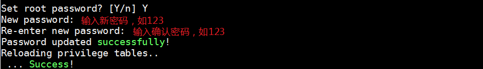

> <font style="color:rgb(119, 119, 119);">学习环境下，密码越简单越好。生产环境下越复杂越好。</font>


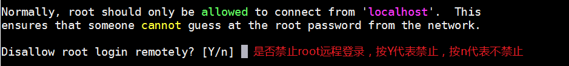


#### <font style="color:rgb(51, 51, 51);">把mysqld服务添加到开机启动项</font>

```shell
# systemctl enable mysqld
```

<font style="color:rgb(51, 51, 51);">默认已经开机启动，这里可以跳过</font>

#### <font style="color:rgb(51, 51, 51);">连接MySQL数据库，测试</font>

```shell
# mysql -u root -p 回车
Enter password:输入刚才设置的密码，如123，回车
mysql> show databases;    =>   代表显示所有数据库
mysql> exit
```

## <font style="color:rgb(51, 51, 51);">LAMP环境之PHP安装</font>

### <font style="color:rgb(51, 51, 51);">使用yum命令安装php软件</font>

```shell
# yum install php -y
```

### <font style="color:rgb(51, 51, 51);">使用systemctl启动php软件（重启Apache）</font>

```shell
# systemctl restart httpd
```

> <font style="color:rgb(119, 119, 119);">为什么启动php就是重启Apache呢？答：因为LAMP架构中，PHP是以模块的形式追加到Apache的内核中，所以启动php就相当于重置Apache软件</font>

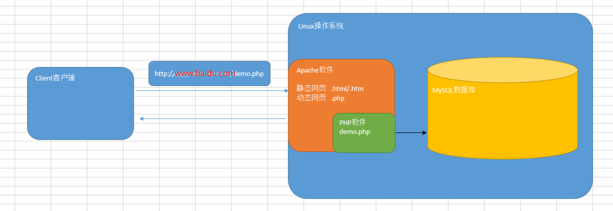

### <font style="color:rgb(51, 51, 51);">测试LAMP环境是否可以使用</font>

<font style="color:rgb(51, 51, 51);">第一步：使用cd命令进入/var/www/html目录</font>

```shell
# cd /var/www/html
Apache的项目目录 => /var/www/html，以后程序员开发的代码都是放置于此目录
```

<font style="color:rgb(51, 51, 51);">第二步：使用vim命令创建demo.php文件</font>

```shell
# vim demo.php
```

<font style="color:rgb(51, 51, 51);">第三步：编写php代码</font>

```shell
<?php
	echo 'hello world';
?>
```

<font style="color:rgb(51, 51, 51);">编写完成后，保存退出，然后在浏览器中使用http://公网IP/demo.php</font>

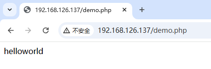

# <font style="color:rgb(51, 51, 51);">七、部署Discuz!论坛</font>

## <font style="color:rgb(51, 51, 51);">Discuz!论坛概述</font>

<font style="color:rgb(51, 51, 51);">Discuz！论坛是基于PHP + MySQL进行开发的一套开源的论坛系统。</font>


## <font style="color:rgb(51, 51, 51);">下载源代码</font>

<font style="color:rgb(51, 51, 51);">下载地址：</font>[<font style="color:rgb(51, 51, 51);">https://gitee.com/ComsenzDiscuz/DiscuzX</font>](https://gitee.com/ComsenzDiscuz/DiscuzX)<font style="color:rgb(51, 51, 51);"> （码云）</font>


## <font style="color:rgb(51, 51, 51);">使用MX软件把Discuz源代码上传</font>

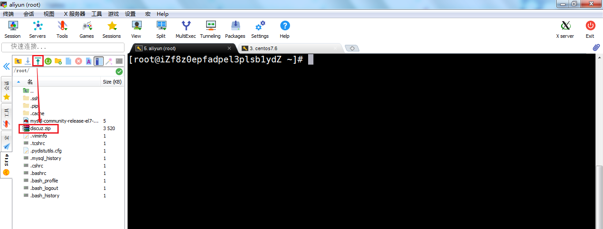

## <font style="color:rgb(51, 51, 51);">安装unzip解压缩软件</font>

```shell
# yum install unzip -y
```

## <font style="color:rgb(51, 51, 51);">使用unzip对discuz.zip压缩包进行解压</font>

```shell
# unzip discuz.zip
```

## <font style="color:rgb(51, 51, 51);">移动discuz中的文件到/var/www/html目录</font>

```shell
# mv discuz/* /var/www/html/
```

## <font style="color:rgb(51, 51, 51);">打开浏览器，输入IP地址</font>

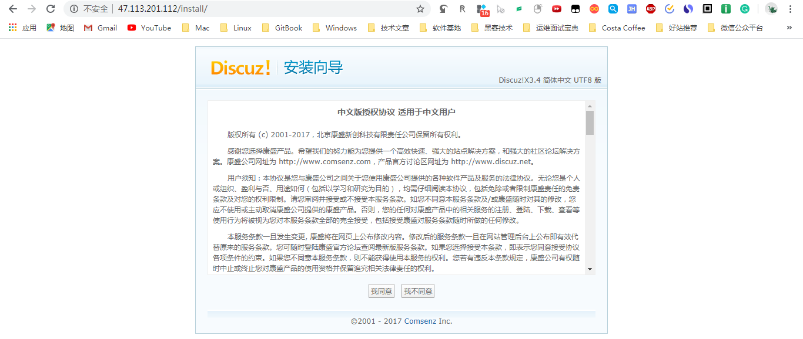

## <font style="color:rgb(51, 51, 51);">单击同意许可，继续安装</font>


## <font style="color:rgb(51, 51, 51);">给/var/www/html目录设置可写权限</font>

```shell
# chmod -R a+w /var/www/html
```

> <font style="color:rgb(119, 119, 119);">注意：以上操作是给所有文件添加一个w权限，但是生产环境尽量针对指定文件添加权限。</font>

## <font style="color:rgb(51, 51, 51);">解决PHP扩展问题</font>

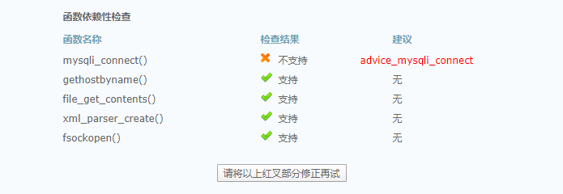

<font style="color:rgb(51, 51, 51);">以上提示代表，安装PHP时没有安装php-mysqli扩展，所以会出现以上问题。</font>

```shell
# yum install php-mysqli -y
# systemctl restart httpd
```

## <font style="color:rgb(51, 51, 51);">设置运行环境</font>


## <font style="color:rgb(51, 51, 51);">设置MySQL数据库的相关信息</font>


## <font style="color:rgb(51, 51, 51);">设置管理员账号和密码</font>

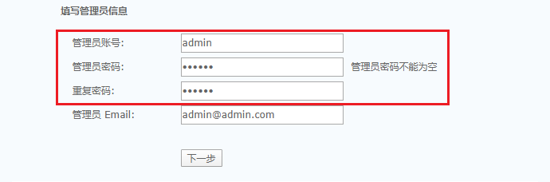

## <font style="color:rgb(51, 51, 51);">安装完成后，访问论坛首页</font>


<font style="color:rgb(51, 51, 51);">部署后，访问论坛首页，如下图所示：</font>


<font style="color:rgb(51, 51, 51);"></font>


> 更新: 2025-03-10 22:47:22  
> 原文: <https://www.yuque.com/u41736172/az9urv/hb24te1s119h5gfo>