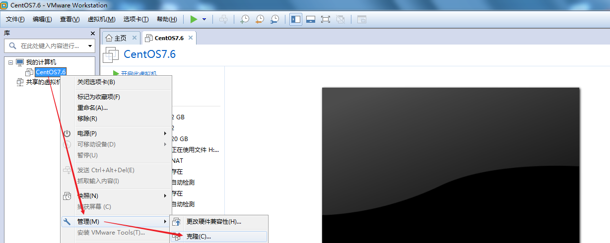
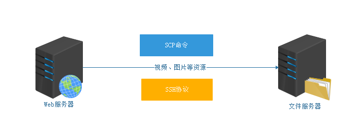

# 12.Linux高级命令与源码安装

# <font style="color:rgb(51, 51, 51);">一、find命令</font>
## <font style="color:rgb(51, 51, 51);">find命令作用</font>
<font style="color:rgb(51, 51, 51);">在Linux操作系统中，find命令主要用于进行文件的搜索。</font>

## <font style="color:rgb(51, 51, 51);">基本语法</font>
```shell
# find 搜索路径 [选项 选项的值] ...
选项说明：
-name ：根据文件的名称搜索文件，支持*通配符
-type ：f代表普通文件、d代表文件夹
```

<font style="color:rgb(51, 51, 51);">案例：搜索计算机中的所有文件，然后找到httpd.conf文件</font>

```shell
# find /etc -name "httpd.conf" -type f
```

## <font style="color:rgb(51, 51, 51);">*星号通配符</font>
<font style="color:rgb(51, 51, 51);">在Linux操作系统中，我们想要查找的文件名称不是特别清晰（只记住了前面或后面的字符），这个时候就可以使用*星号通配符了。</font>

<font style="color:rgb(51, 51, 51);">案例：获取/etc目录下，所有后缀名为.conf的文件信息</font>

```shell
# find /etc -name "*.conf" -type f
```

<font style="color:rgb(51, 51, 51);">案例：在/etc目录下，搜索所有以httpd开头的文件</font>

```shell
# find /etc -name "httpd*" -type f
```

## <font style="color:rgb(51, 51, 51);">根据文件修改时间搜索文件</font>
### <font style="color:rgb(51, 51, 51);">聊一下Windows中的文件时间概念？</font>


<font style="color:rgb(51, 51, 51);">创建时间：代表这个文件什么时间被创建</font>

<font style="color:rgb(51, 51, 51);">访问时间：代表这个文件什么时间被访问</font>

<font style="color:rgb(51, 51, 51);">修改时间：代表这个文件什么时间被修改</font>

### <font style="color:rgb(51, 51, 51);">使用stat命令获取文件的最后修改时间</font>
```shell
# stat 文件名称
Modify: 2020-03-31 10:25:20.609010605 +0800
```

### <font style="color:rgb(51, 51, 51);">创建文件时设置修改时间以及修改文件的修改时间</font>
<font style="color:rgb(51, 51, 51);">基本语法：</font>

```shell
# touch -m -d "日期时间格式" 文件名称
```

<font style="color:rgb(51, 51, 51);">作用：① 如果文件不存在，则自动创建该文件，然后设置其最后的修改时间</font>

<font style="color:rgb(51, 51, 51);">          ② 如果文件存在，touch命令就是只修改文件的最后修改时间</font>

<font style="color:rgb(51, 51, 51);">案例：创建一个a.txt文件，设置最后修改时间为2020-03-30 00:00</font>

```shell
# touch -m -d "2020-03-30 00:00" a.txt
```

<font style="color:rgb(51, 51, 51);">案例：创建一个b.txt文件，然后在设置文件的最后修改时间为2020-03-29 00:00</font>

```shell
# touch b.txt
# touch -m -d "2020-03-29 00:00" b.txt
```

<font style="color:rgb(51, 51, 51);">案例：创建一个c.txt文件，设置最后修改时间为2020-03-28 00:00</font>

```shell
# touch -m -d "2020-03-28 00:00" c.txt
```

### <font style="color:rgb(51, 51, 51);">根据文件的最后修改时间搜索文件</font>
```shell
# find 搜索路径 -mtime +days/-days
-mtime ：根据文件的最后修改时间搜索文件
+ ：加号，代表搜索几天之前的文件信息
- ：减号，代表搜索几天以内的文件信息
```

<font style="color:rgb(51, 51, 51);">案例：搜索3天以前的文件信息（不包含第3天的，而且只搜索.txt格式）</font>


```shell
# find ./ -name "*.txt" -mtime +3
```

<font style="color:rgb(51, 51, 51);">案例：搜索3天以内的文件信息（只搜索.txt格式）</font>


```shell
# find ./ -name "*.txt" -mtime -3
```

## <font style="color:rgb(51, 51, 51);">扩展选项-exec选项</font>
<font style="color:rgb(51, 51, 51);">案例：删除Linux系统中/var/log目录下10天以前的日志信息（日志文件格式*.log结尾）</font>

```shell
# find /var/log -name "*.log" -mtime +10
```

<font style="color:rgb(51, 51, 51);">第一种解决方案：使用管道命令|</font>

```shell
# find /var/log -name "*.log" -mtime +10 |rm -rf
```

<font style="color:rgb(51, 51, 51);">以上命令并不能正确的执行删除操作，原因在于rm命令和ls命令一样，都不支持管道。</font>

```shell
# find /var/log -name "*.log" -mtime +10 |xargs rm -rf
```

<font style="color:rgb(51, 51, 51);"></font>

<font style="color:rgb(51, 51, 51);">第二种解决方案：使用find命令 + -exec选项</font>

<font style="color:rgb(51, 51, 51);">基本语法：</font>

```shell
# find /var/log -name "*.log" -mtime +10 -exec rm -rf {} \;
```

## <font style="color:rgb(51, 51, 51);">dd扩展命令</font>
<font style="color:rgb(51, 51, 51);">基本语法：</font>

```shell
# dd if=/dev/zero of=文件名称 bs=1M count=1
选项说明：
if代表输入文件
of代表输出文件
bs代表字节为单位的块大小。
count代表被复制的块。
其中/dev/zero是一个字符设备，会不断返回0值字节。
```

<font style="color:rgb(51, 51, 51);">主要功能：在Linux操作系统中，生成某个大小的测试文件！</font>

<font style="color:rgb(51, 51, 51);">案例：使用dd创建一个1M大小的sun.txt文件</font>

```shell
# dd if=/dev/zero of=moon.txt bs=1M count=1
```

<font style="color:rgb(51, 51, 51);">案例：使用dd创建一个5M大小的moon.txt文件</font>

```shell
# dd if=/dev/zero of=moon.txt bs=5M count=1

if = input file
of = output file
```

## <font style="color:rgb(51, 51, 51);">根据文件的大小搜索文件</font>
<font style="color:rgb(51, 51, 51);">基本语法：</font>

```shell
# find 搜索路径 -size [文件大小，常用单位：k，M，G]
size值  : 搜索等于size值大小的文件
-size值 : [0, size值)
+size值 : (size值,正无穷大)
```

<font style="color:rgb(51, 51, 51);">案例：搜索/root目录下大小为5M的文件信息</font>

```shell
# find ./ -type f -size 5M
```

<font style="color:rgb(51, 51, 51);">案例：搜索/root目录下大小为5M以内的文件信息（5M>size>=0）</font>

```shell
# find ./ -type f -size -5M
```

<font style="color:rgb(51, 51, 51);">案例：搜索/目录中，文件大小大于100M的文件信息（size>100M）</font>

```shell
# find / -type f -size +100M
```

# <font style="color:rgb(51, 51, 51);">二、tree命令</font>
## <font style="color:rgb(51, 51, 51);">tree命令的主要作用</font>
<font style="color:rgb(51, 51, 51);">Windows和Linux都有tree命令，主要功能是创建文件列表，将所有文件以树的形式列出来</font>

## <font style="color:rgb(51, 51, 51);">使用yum命令安装tree</font>
```shell
# yum install tree -y
```

## <font style="color:rgb(51, 51, 51);">以树状结构显示路径下的文件信息</font>
<font style="color:rgb(51, 51, 51);">案例：以树状结构显示当前目录下的文件信息</font>

```shell
# tree 
```

<font style="color:rgb(51, 51, 51);">案例：以树状结构显示/var/log目录下的文件信息</font>

```shell
# tree /var/log
```

# <font style="color:rgb(51, 51, 51);">三、scp命令</font>
## <font style="color:rgb(51, 51, 51);">scp命令的主要作用</font>
<font style="color:rgb(51, 51, 51);">scp命令的主要作用是实现Linux与Linux系统之间的文件传输。</font>

> <font style="color:rgb(119, 119, 119);">完成以上实战需要两个Linux系统，解决方案可以使用克隆操作（先关机后克隆）快速生成一个Linux系统</font>
>



## <font style="color:rgb(51, 51, 51);">scp效果图</font>


<font style="color:rgb(51, 51, 51);">scp传输要求：两台计算机所使用的操作系统都必须是Linux操作系统。</font>

> <font style="color:rgb(119, 119, 119);">ssh: connect to host 10.1.1.17 port 22: Connection refused</font><font style="color:rgb(119, 119, 119);">lost connection</font>
>
> <font style="color:rgb(119, 119, 119);">出现以上问题的主要原因在于SCP命令是基于SSH协议，所以两台服务器的sshd服务必须处于开启状态，否则无法完成上传与下载操作。</font>
>

## <font style="color:rgb(51, 51, 51);">下载文件或目录</font>
<font style="color:rgb(51, 51, 51);">基本语法：</font>

```shell
# scp [选项] 用户名@linux主机地址:资源路径  linux本地文件路径
选项说明：
-r ：代表递归操作，主要针对文件夹
```

<font style="color:rgb(51, 51, 51);">案例：从10.1.1.17服务器下载/root路径下的video.mp4文件到本地的/root目录下</font>

<font style="color:rgb(51, 51, 51);">10.1.1.16：</font>

```shell
# scp root@10.1.1.17:/root/video.mp4 ./
The authenticity of host '10.1.1.17 (10.1.1.17)' can't be established.
ECDSA key fingerprint is SHA256:Wcxibo2ZQulm6bV+jEakz8IniwFgE6CUHopCxYjexrI.
ECDSA key fingerprint is MD5:48:25:21:93:ef:2b:22:25:5f:95:39:56:0c:8e:ff:75.
Are you sure you want to continue connecting (yes/no)? yes
Warning: Permanently added '10.1.1.17' (ECDSA) to the list of known hosts.
root@10.1.1.17's password:123456
```

<font style="color:rgb(51, 51, 51);">案例：从10.1.1.17服务器下载/root路径下的shop文件夹到本地的/root目录下</font>

```shell
# scp -r root@10.1.1.17:/root/shop ./
root@10.1.1.17's password:123456
```

## <font style="color:rgb(51, 51, 51);">上传文件或目录</font>
<font style="color:rgb(51, 51, 51);">基本语法：</font>

```shell
# scp [选项] linux本地文件路径 用户名@linux主机地址:远程路径
选项说明：
-r ：递归操作
```

<font style="color:rgb(51, 51, 51);">案例：把10.1.1.16服务器上的/root/video.mp4上传到10.1.1.17服务器的/root目录下</font>

<font style="color:rgb(51, 51, 51);">10.1.1.16：</font>

```shell
# scp /root/video.mp4 root@10.1.1.17:/root/
```

<font style="color:rgb(51, 51, 51);">案例：把10.1.1.16服务器上的/root/shop文件夹上传到10.1.1.17服务器的/root目录下</font>

<font style="color:rgb(51, 51, 51);">10.1.1.16：</font>

```shell
# scp -r /root/shop root@10.1.1.17:/root/
```

# <font style="color:rgb(51, 51, 51);">四、源码安装</font>
## <font style="color:rgb(51, 51, 51);">获取软件的源码包</font>
<font style="color:rgb(51, 51, 51);">可以去某个软件的官网获取，官网一般摆放的都是源码包*.tar.gz</font>

## <font style="color:rgb(51, 51, 51);">源码安装三步走</font>
<font style="color:rgb(51, 51, 51);">① 配置./configure（配置软件安装路径，也可以不配置，不配置使用默认路径）</font>

<font style="color:rgb(51, 51, 51);">② 编译make（把软件的源代码做成类似rpm的可以直接安装的软件）</font>

<font style="color:rgb(51, 51, 51);">③ 安装make install（把刚才编译好的程序进行安装到Linux系统）</font>

## <font style="color:rgb(51, 51, 51);">使用源码安装安装cmatrix代码雨</font>
<font style="color:rgb(51, 51, 51);">第一步：对软件进行解压缩</font>

```shell
# tar -zxf cmatrix-1.2a.tar.gz
```

> <font style="color:rgb(119, 119, 119);"># tar xf cmatrix-1.2a.tar.gz，因为默认解压都是使用gzip工具</font>
>

<font style="color:rgb(51, 51, 51);">第二步：进入到cmatrix文件夹，然后对软件进行配置</font>

```shell
# cd cmatrix-1.2a
# ./configure		=>  设置软件默认安装的位置等信息
```

<font style="color:rgb(51, 51, 51);">第三步：编译软件，使用make命令</font>

```shell
# make
```

<font style="color:rgb(51, 51, 51);">常见错误：</font>

```shell
cmatrix.c:37:20: fatal error: curses.h: No such file or directory
出现以上问题的主要原因在于系统中没有找到ncurses-devel软件包
```

<font style="color:rgb(51, 51, 51);">解决方案：</font>

```shell
# yum install gcc gcc-c++ ncurses-devel -y
```

然后重新执行make。（如果还不行，可以将解压后的这个压缩包删掉，重新解压，然后再配置、编译）

<font style="color:rgb(51, 51, 51);">第四步：安装软件</font>

```shell
# make install
```

<font style="color:rgb(51, 51, 51);">总结：</font>

<font style="color:rgb(51, 51, 51);">进入解压后的软件目录 => ./configure => make => make install</font>

## <font style="color:rgb(51, 51, 51);">测试代码雨效果</font>
```shell
# cmatrix
```


> 更新: 2025-03-11 22:58:17  
> 原文: <https://www.yuque.com/u41736172/az9urv/olcwgxpns4gx7q8z>