# 13.磁盘管理（上）

# <font style="color:rgb(0,0,0);">一、磁盘分区</font>

## 概述

磁盘分区是使用分区编辑器（partition editor）在磁盘上划分几个逻辑部分。碟片一旦划分为数个分区（partition），不同类的目录与文件可以存储进不同的分区。方便我们管理文件！

Windows系统中的分区：

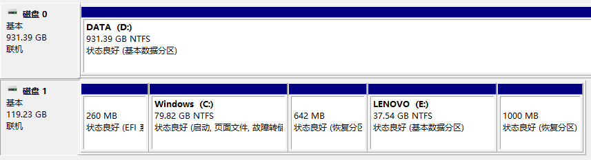

分区就好比家里面的衣柜一样，将一个衣柜划分为各个小格子，方便我们存放不同种类的衣物。

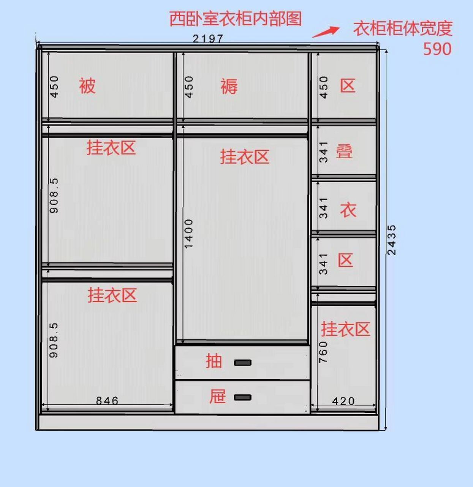

两种分区表形式：

* **MBR分区表**（主引导记录分区表）：最大支持2.1TB硬盘，最多支持4个分区
* GPT分区表（全局唯一标示分区表）：GPT支持9.4ZB硬盘（1ZB=1024PB，1PB=1024EB，1EB=1024TB）。理论上支持的分区数没有限制，但Windows限制128个主分区

我们目前还是主要考虑使用MBR分区表。

## 分区类型（MBR）

* 主分区：最多只能有4个
* 扩展分区：
  * 最多只能有1个（一块硬盘只能最多有1个扩展分区）
  * 主分区加扩展分区最多有4个
  * 不能写入数据，只能包含逻辑分区
* 逻辑分区

比如下图的分区：

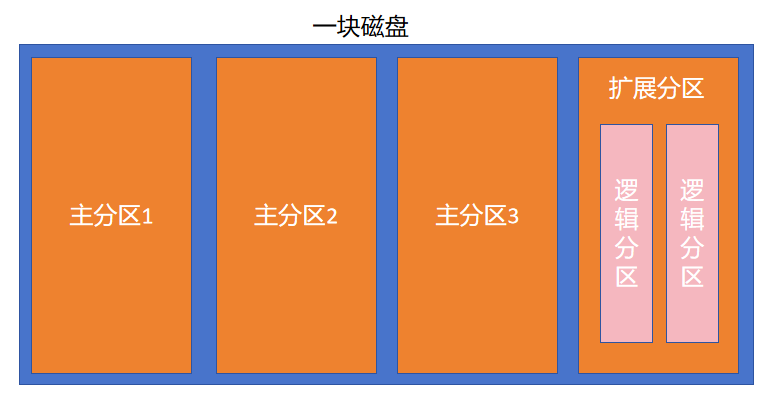

## 格式化

格式化（高级格式化）又称逻辑格式化，它是指根据用户选定的文件系统（如FAT16、FAT32、NTFS、EXT2、EXT3、EXT4等），在磁盘的特定区域写入特定数据，在分区中划出一片用于存放文件分配表、目录表等用于文件管理的磁盘空间。

> Windows的文件系统：FAT16、FAT32、NTFS
>
> Linux的文件系统：EXT2、EXT3、EXT4、XFS

格式化的目的可不是清除磁盘中的数据，而是为了写入文件系统。

格式化其实就相当于在分区内部打隔断。

**block：**

* 默认是4kb，也可以是2kb、1kb
* 一个文件所占用的block不一定是挨着的
* block是系统中存储数据最小的单位，如果没有占满一个block，那该block剩余的空间是不能存储其他内容的。比如一个文件占用了2kb，那在这个block中还剩余2kb，那么剩余的这2kb是不能存储其他文件内容的
* 一个文件就有一个inode，一个inode可以对应多个block

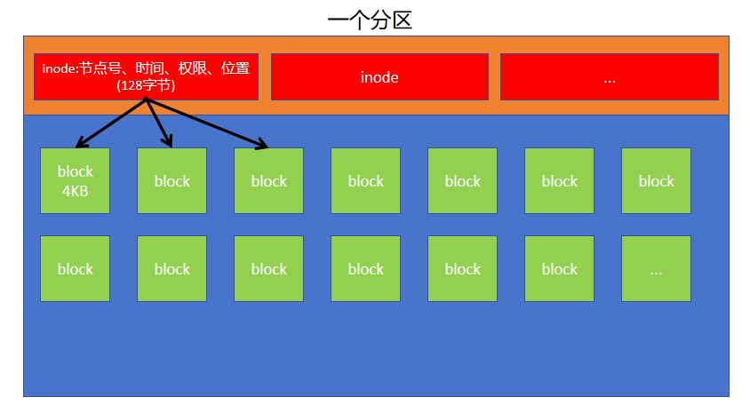

## 硬件设备文件名

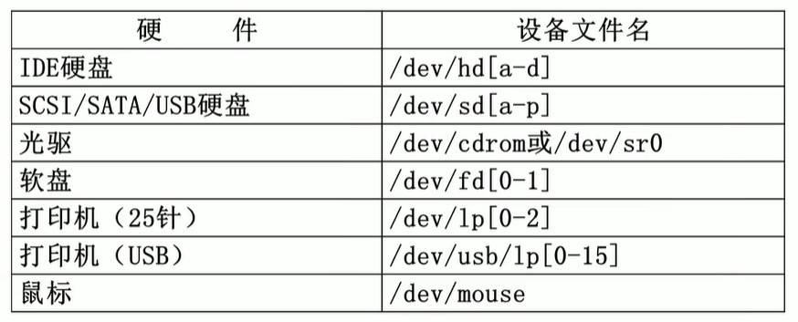

## 分区设备文件名

* /dev/hda1(IDE硬盘接口)，已经淘汰了

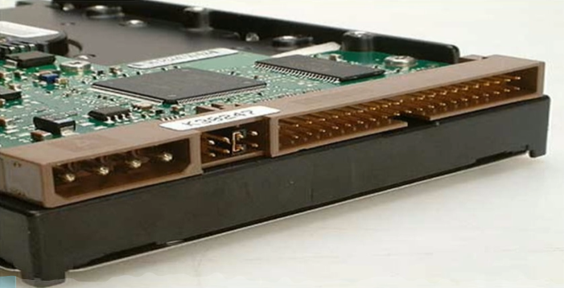

* /dev/sda(SCSI硬盘接口、**SATA硬盘接口**)，目前我们主要用的就是SATA硬盘接口

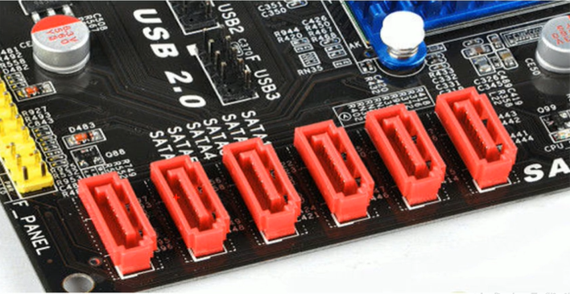

> /dev/sda1中，s表示SATA接口，d表示硬盘，a表示第一块硬盘，1表示该硬盘中的第1个分区
>
> /dev/sdb2就表示SATA接口的第二块硬盘的第2个分区
>
> /dev/sdb5就表示SATA接口的第二块硬盘的第1个逻辑分区

注意：主分区和扩展分区使用的数字肯定是1、2、3、4的。逻辑分区是从5开始的。

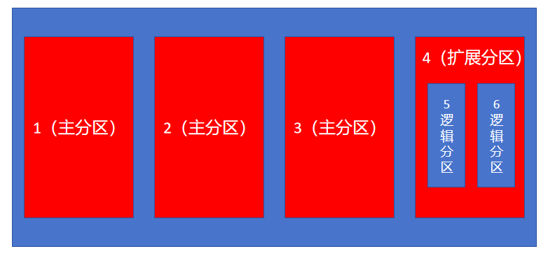

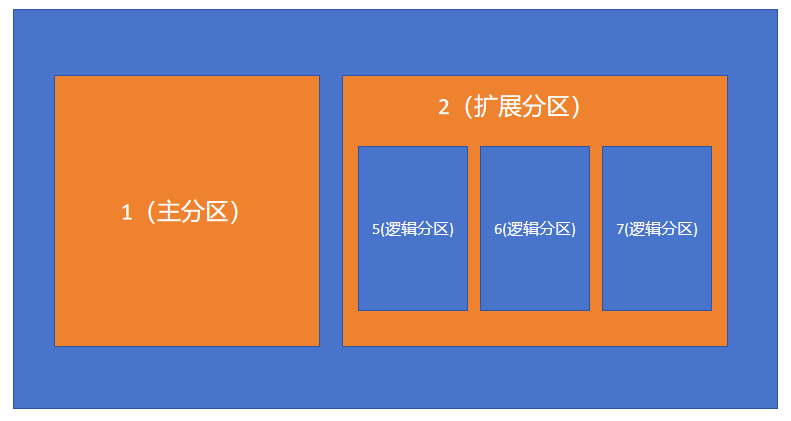

## 挂载点与挂载

* Windows中是以C、D、E等作为盘符（挂载点）
* Linux系统中是以已经存在的空目录作为挂载点！
* 将挂载点和分区连接起来的过程称为挂载
* 挂载后，我们就可以通过访问挂载点从而进入到某个分区内

## 分区的说明

* 必须分区
  * /（根分区）
  * swap分区（交换分区）
    * 当真实内存不够的时候，就会使用swap分区，充当虚拟内存
    * 如果真实内存小于4GB，swap为内存的两倍
    * 如果真实内存大于4GB，swap大小和内存一致
    * 实验环境，不大于2GB
  * /boot分区
* 常用分区
  * /home（用于文件服务器）
  * /www（用于web服务器）

从文件系统角度看Linux目录：

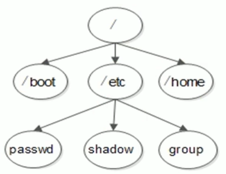

从硬盘角度看Linux目录：

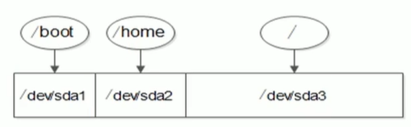

> 我们写入到/boot目录中的内容，其实就是写入到它对应的第1个分区中了
>
> 我们写入到/home目录中的内容，其实就是写入到它对应的第2个分区中了
>
> 我们写入到/etc目录中的内容，其实就是写入到/对应的第3个分区中了

# 二、挂载命令

挂载：就是将设备文件名和一个空目录连接起来的过程。

Linux所有存储设备都必须挂载才能使用，包括硬盘。

## mount命令1

命令名称：mount

命令作用：查看系统中目前的挂载情况；将设备文件和空目录进行挂载

命令所在路径：/bin/mount

执行权限：所有用户

具体格式：

```shell
# mount [-l]
# 查询系统中已经挂载的设备，-l会显示卷标名称（不咋用）
```

> 说明：swap分区是必须分区，swap分区是给系统使用的，没有挂载点，所以我们是看不到的！

## 光盘挂载

光盘里面有很多软件安装包，我们要想使用，需要将光盘进行挂载。

光盘挂载的前提依然是指定光盘的设备文件名，不同版本的Linux，设备文件名并不相同。

* CentOS 5.x之前的系统，光盘设备文件名是/dev/hdc
* CentOS 6.x之后的系统，光盘设备文件名是/dev/sr0

不论是哪个系统都有软链接/dev/cdrom（它是指向/dev/sr0），也可以作为光盘的设备文件名进行挂载

> /mnt 目录就是我们常用来挂载的目录

```shell
# 创建挂载用的目录
# mkdir /mnt/cdrom

# 挂载，将空目录和光盘挂载
# mount /dev/sr0 /mnt/cdrom

# 查看挂载情况，那么以后就可以去挂载点访问到光盘中的内容了
# mount
/dev/sr0 on /mnt/cdrom type iso9660

# 访问挂载点，查看光盘中内容
# ls /mnt/cdrom/
```

注意：这里光盘挂载可能失败，失败的话根据情况可能需要在VMware虚拟机的右下角光盘位置右击鼠标=>设置，然后进行下面的操作后。再次尝试挂载即可。

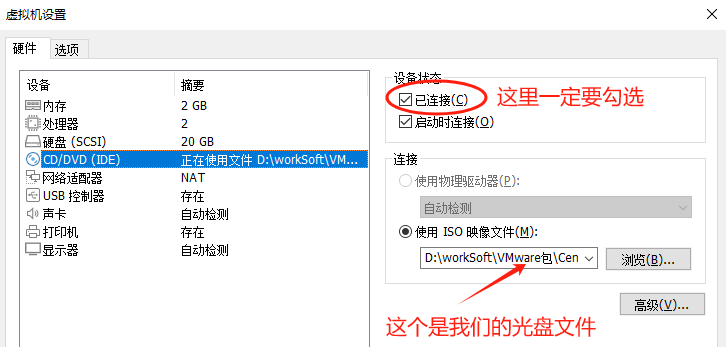

## 光盘卸载

光盘使用完之后，不用的话，我们需要将光盘进行卸载。（在真实服务器上，如果不卸载光盘，是无法拿出光盘的）

```shell
# 卸载光盘，根据设备文件名卸载
# umount /dev/sr0

# 卸载光盘，也可以根据挂载点卸载
# umount /mnt/cdrom

# 卸载完，可以通过mount命令查看设备挂载情况
# mount
```

问题：有的同学卸载光盘报错：

```shell
# 卸载光盘
# umount /dev/sr0
umount: /mnt/cdrom: target is busy.
        (In some cases useful info about processes that use
         the device is found by lsof(8) or fuser(1))

上面提示是说光盘正在忙，使用中。其实是因为我们可能当前就在光盘挂载点的目录中呢。我们可以回到家目录在卸载！
```

> 扩展：我们说过，挂载点必须是一个空目录，如果是非空的呢？
>
> 可以尝试一下，发现通过非空目录去作为挂载点后，能正常挂载，但是该目录中之前的内容就“看不见了也访问不了了”，但其实还在。如果卸载后，就又可以看见目录之前的内容了！

## 挂载U盘（了解）

U盘和硬盘其实是一样的东西，所以U盘会和硬盘共用设备文件名，所以U盘的设备文件名不像光盘一样是固定的！U盘的设备文件名是不固定的，需要手工查询，查询命令：

```shell
# fdisk -l
```

> 比如：现在系统已经有一个硬盘了，再插入U盘，则U盘的设备文件名是/dev/sdb
>
> 如果系统中已经有两个硬盘了，再插入U盘，则U盘的设备文件名是/dev/sdc

给虚拟机插入U盘的步骤：

1. 鼠标先点击进入到VMware虚拟机中
2. 插入U盘
3. 通过`fdisk -l`命令查看U盘

> 说明：如果你的Windows中VMware虚拟机的USB服务是关闭的，然后打开后，再插入U盘是不生效的，VMware虚拟机中的Linux系统是识别不到你的U盘的。可以尝试重启Windows试试。

```shell
# 查看U盘的设备文件名
# fdisk -l

# 创建空目录作为挂载点
# mkdir /mnt/usb

# 挂载U盘，需要指定一下U盘挂载的文件系统类型为 vfat
# mount -t vfat /dev/U盘设备文件名 /mnt/usb
```

问题：如果U盘中有中文，会发现中文是乱码。Linux要想正常显示中文，需要两个条件：

* 安装了中文编码和中文字体
* 操作终端需要支持中文显示，比如我们的MX

而我们当前系统时安装了中文编码和字体，MX也是支持中文的，所以可以在挂载的时候，手工指定中文编码：

```shell
# mount -t vfat -o iocharset=utf8 /dev/U盘设备文件名 /mnt/usb

-o 是在挂载的时候加载一些特殊选项
```

## 卸载U盘

道理和卸载光盘一样，可以通过挂载点卸载，也可以通过设备文件名卸载。使用umount命令。

```shell
# 通过挂载点卸载U盘
# umount /mnt/usb
```

## mount命令2

像光盘、U盘等是可以设置自动挂载的，但是不推荐，因为如果设置了自动挂载，那么开机的时候就会找你的光盘或U盘进行自动挂载，如果没有光盘或U盘，启动就会报错！

如果希望自动挂载，我们可以修改`/etc/fstab`配置文件中的内容。

```shell
# 检测配置文件/etc/fstab的内容，看是否有错，但也不一定能够完全检测出来。
# mount -a
```

`mount -a`命令其实是会检测`/etc/fstab`文件是否有问题，如果`/etc/fstab`配置文件改错了，直接重启系统，系统会启动不起来。

```shell
# mount [-t 文件系统类型] [-o 特殊选项] 设备文件名 挂载点

选项说明
-t：指定文件系统类型，可以是ext3、ext4、iso9660等文件系统
-o：指定挂载的额外选项，比如读写权限、同步异步等，如果不指定则默认值生效，一般我们使用默认值。具体参考下表。
```

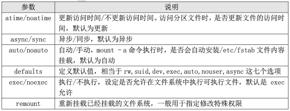

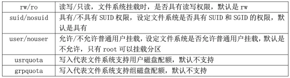

```shell
# 重新挂载
# mount -o remount 挂载点
```

后期我们会使用一下remount进行重新挂载。

## 挂载NTFS分区（了解）

Linux系统默认是不支持NTFS分区的挂载的。NTFS属于Windows中的文件系统类型。

如果需要在Linux中进行NTFS分区的挂载，需要安装一些插件。

### Linux 的驱动加载顺序

Linux 的驱动加载顺序：

* 驱动直接放入系统内核之中。这种驱动主要是系统启动加载必须的驱动，数量较少。
* 驱动以模块的形式放入硬盘。大多数驱动都以这种方式保存，保存位置在 /lib/modules/3.10.0-862.el7.x86\_64/kernel/中。
* 驱动可以被 Linux 识别，但是系统认为这种驱动一般不常用，默认不加载。如果需要加载这种驱动，需要重新编译内核，而 NTFS 文件系统的驱动就属于这种情况。
* 硬件不能被 Linux 内核识别，需要手工安装驱动。当然前提是厂商提供了该硬件针对 Linux的驱动，否则就需要自己开发驱动了。

### 使用NTFS-3G安装NTFS文件系统模块

* 下载 NTFS-3G 插件

我们从网站 <http://www.tuxera.com/community/ntfs-3g-download/>下载 NTFS-3G 插件到 Linux服务器上。

* 安装 NTFS-3G 插件

在编译安装 NTFS-3G 插件之前，要保证 gcc 编译器已经安装。具体安装命令如下：

```shell
# 解压缩
# tar -zxvf ntfs-3g_ntfsprogs-2013.1.13.tgz

# 进入解压后的目录
# cd ntfs-3g_ntfsprogs-2013.1.13

# 配置
# ./configure

# 编译
# make

# 安装
# make install
```

安装就完成了，已经可以挂载和使用Windows的NTFS分区了。不过需要注意挂载分区时的文件系统不是 ntfs，而是ntfs-3g。挂载命令如下：

```shell
# mount -t ntfs-3g 分区设备文件名 挂载点

例如：
# mount –t ntfs-3g /dev/sdb1 /mnt/win
```

# 三、硬盘结构

## <font style="color:rgb(0,0,0);">硬盘的逻辑结构</font>

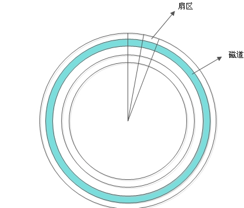

<font style="color:rgb(0,0,0);">每个扇区的大小是固定的，为 512Byte。扇区也是磁盘的最小存贮单位。</font>

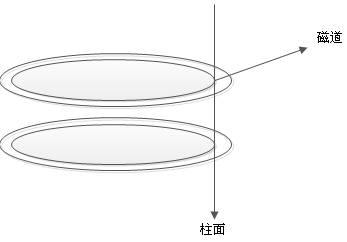

<font style="color:rgb(0,0,0);">硬盘的大小是使用“磁头数×柱面数×扇区数×每个扇区的大小”这样的公式来计算的。其中磁头数（Heads）表示硬盘总共有几个磁头，也可以理解成为硬盘有几个盘面，然后乘以二；柱面数（Cylinders）表示硬盘每一面盘片有几条磁道；扇区数（Sectors）表示每条磁道上有几个扇区；每个扇区的大小一般是 512Byte。</font>

## <font style="color:rgb(0,0,0);">硬盘接口</font>

* <font style="color:rgb(0,0,0);">IDE 硬盘接口（Integrated Drive Electronics，并口，即电子集成驱动器）也称作“ATA 硬盘”或“PATA 硬盘”，是早期机械硬盘的主要接口，ATA133 硬盘的理论速度可以达到 133MB/s （此速度为理论平均值），IDE 硬盘接口</font>
* **<font style="color:rgb(0,0,0);">SATA 接口（Serial ATA，串口）</font>**<font style="color:rgb(0,0,0);">是速度更高的硬盘标准，具备了更高的传输速度，并具备了更强的纠错能力。目前已经是 SATA 三代，理论传输速度达到 600MB/s（此速度为理论平均值）</font>
* <font style="color:rgb(0,0,0);">SCSI 接口（Small Computer System Interface，小型计算机系统接口）广泛应用在服务器上，具有应用范围广、多任务、带宽大、CPU 占用率低及支持热插拔等优点，理论传输速度达到320MB/s</font>

<font style="color:rgb(0,0,0);">目前不论是个人电脑还是服务器，我们使用的都是SATA接口。</font>

# <font style="color:rgb(0,0,0);"> 四、文件系统</font>

## Linux文件系统的特性

* super block（超级块）：记录整个文件系统的信息，包括 block 与 inode 的总量，已经使用的 inode 和 block 的数量，未使用的 inode 和 block 的数量，block 与 inode 的大小，文件系统的挂载时间，最近一次的写入时间，最近一次的磁盘检验时间等。
* data block（数据块，也称作 block）：用来实际保存数据的（柜子的隔断），block 的大小（1KB、2KB 或 4KB）和数量在格式化后就已经决定，不能改变，除非重新格式化（制作柜子的时候，隔断大小就已经决定，不能更改，除非重新制作柜子）。每个 blcok 只能保存一个文件的数据，要是文件数据小于一个 block 块，那么这个 block 的剩余空间不能被其他文件使用；要是文件数据大于一个 block 块，则占用多个 block 块。Windows 中磁盘碎片整理的原理就是把一个文件占用的多个 block 块尽量整理到一起，这样可以加快读写速度。
* inode（i 节点，柜子门上的标签）：用来记录文件的权限（r、w、x），文件的所有者和属组，文件的大小，文件的状态改变时间（ctime），文件的最近一次读取时间（atime），文 件的最近一次修改时间（mtime），文件的数据真正保存的 block 编号。每个文件需要占用一个 inode。


## Linux常见文件系统

| 文件系统 | 描述 |
| --- | --- |
| ext | Linux中最早的文件系统，由于在性能和兼容性上具有很多缺陷，现在已经很少使用 |
| ext2 | 是ext文件系统的升级版本，Red Hat Linux 7.2 版本以前的系统默认都是ext2文件<br/>系统。于 1993 年发布，支持最大 16TB 的分区和最大 2TB 的文件（1TB=1024GB=1024×1024KB） |
| ext3 | 是 ext2 文件系统的升级版本，最大的区别就是带日志功能，以便在系统突然停止时提高文件系统的可靠性。支持最大 16TB 的分区和最大 2TB 的文件 |
| ext4 | 是 ext3 文件系统的升级版。ext4 在性能、伸缩性和可靠性方面进行了大量改进。ext4的变化可以说是翻天覆地的，比如向下兼容 ext3、最大 1EB 文件系统和 16TB 文件、无限数量子目录、Extents 连续数据块概念、多块分配、延迟分配、持久预分配、快速 FSCK、日志校验、无日志模式、在线碎片整理、inode 增强、默认启用 barrier 等。它是 CentOS6.x 的默认文件系统 |
| **xfs** | XFS 最早针对 IRIX 操作系统开发，是一个高性能的日志型文件系统，能够在断电以及操作系统崩溃的情况下保证文件系统数据的一致性。它是一个 64 位的文件系统，后来进行开源并且移植到了 Linux 操作系统中，目前 CentOS 7.x 将 XFS+LVM 作为默认的文件系统。据官方所称，XFS 对于大文件的读写性能较好。 |
| swap | swap 是 Linux 中用于交换分区的文件系统（类似于 Windows 中的虚拟内存），当内存不够用时，使用交换分区暂时替代内存。一般大小为内存的 2 倍，但是不要超过 2GB。它是 Linux 的必需分区 |
| NFS | 是网络文件系统（Network File System）的缩写，是用来实现不同主机之间文件共享的一种网络服务，本地主机可以通过挂载的方式使用远程共享的资源 |
| iso9660 | 光盘的标准文件系统。Linux 要想使用光盘，必须支持 iso9660 文件系统 |
| fat | 就是 Windows 下的 fat16 文件系统，在 Linux 中识别为 fat |
| vfat | 就是 Windows 下的 fat32 文件系统，在 Linux 中识别为 vfat。支持最大 32GB 的分区和最大 4GB 的文件 |
| NTFS | 就是 Windows 下的 NTFS 文件系统，不过 Linux 默认是不能识别 NTFS 文件系统的，如果需要识别，则需要重新编译内核才能支持。它比 fat32 文件系统更加安全，速度更快，支持最大 2TB 的分区和最大 64GB 的文件 |
| ufs | Sun 公司的操作系统 Solaris 和 SunOS 所采用的文件系统 |
| proc | Linux 中基于内存的虚拟文件系统，用来管理内存存储目录/proc |
| sysfs | 和 proc 一样，也是基于内存的虚拟文件系统，用来管理内存存储目录/sysfs |
| tmpfs | 也是一种基于内存的虚拟文件系统，不过也可以使用 swap 交换分区 |

## 文件系统命令

### df命令

作用：可以查看硬盘空间的使用率

```shell
# df -ahT

选项说明：
a：显示特殊文件系统，这些文件系统几乎都是保存在内存中的。如/proc，因为是挂载在内存中，所以占用量都是0
h：单位不再只用KB，而是换算成习惯单位
T：多出了文件系统类型一列
```

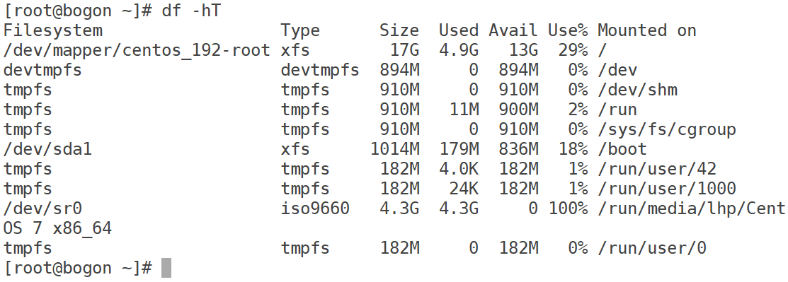

### du命令

我们之前可以使用`ls -lh 文件名或目录名`查看文件的大小，但是它显示的目录大小是不准确的。因为目录所在的block块中存放的是该目录中所有文件的文件名及其对应的inode节点号！

**统计目录的大小使用du命令。**

作用：统计目录或文件大小的

```shell
# du [选项] [目录或文件名]

选项说明：
-a：显示每个子文件的磁盘占用量。默认只统计子目录的磁盘占用量
-h：使用习惯单位显示磁盘占用量，如KB、MB或GB等
-s：统计总占用量，而不列出子目录和子文件的占用量
```

du与df命令的区别：du是用于统计文件大小的， 统计的文件大小是准确的；df是用于统计磁盘空间大小的， 统计的剩余空是准确的

### fsck文件系统修复命令

```shell
# 自动修复
# fsck -y /dev/sdb1
```

该命令不需要我们手动执行，如果文件系统出问题，那么在启动系统的时候会自动执行。

### stat命令

作用：查看文件的详细信息，比如各种时间

```shell
# stat 文件名
```

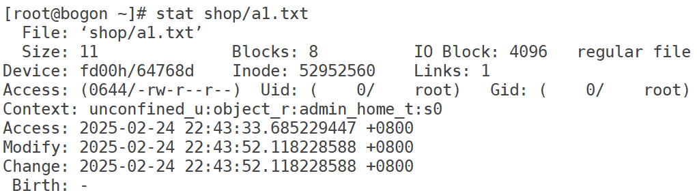

### 判断文件类型

```shell
# file 文件名			判断文件类型

# type 命令名			判断命令类型，看该命令是内置命令还是外部命令
```

上面两个命令主要是写shell程序时使用的。

# 五、磁盘分区

## 查看分区

fdisk命令可以进行查看现在的分区情况

```shell
# 查看系统所有硬盘及分区
# fdisk -l
```

> 除了使用fdisk -l命令可以查看分区外，也可以使用mount命令查看挂载情况，也能看到分区
>
> 也可以使用df -h命令，查看磁盘情况的时候也能够看到分区挂载的情况

## fdisk命令分区

目前的系统中已经对磁盘进行了分区，我们可以再添加一块硬盘，然后进行分区。

### 第一步：将Linux系统关机

```shell
shutdown -h 0
```

### 第二步：给虚拟机添加一块硬盘

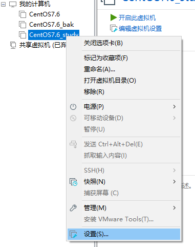

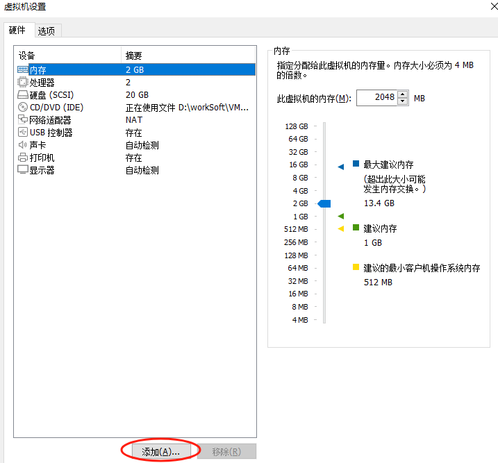

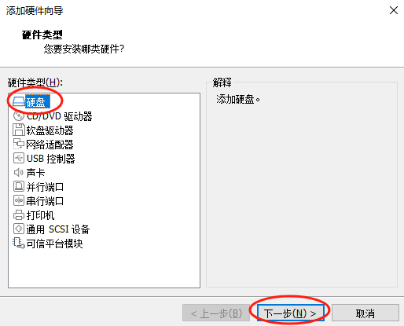

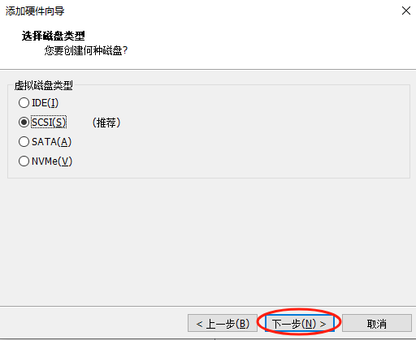

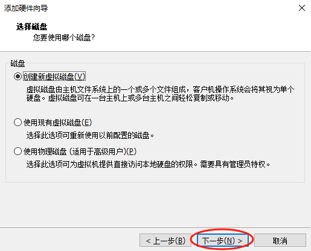

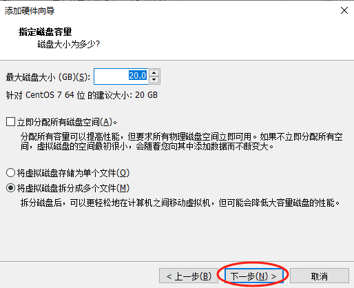

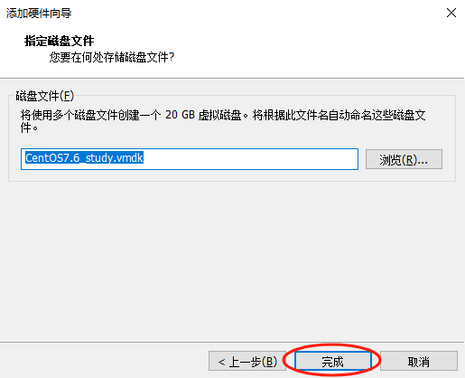

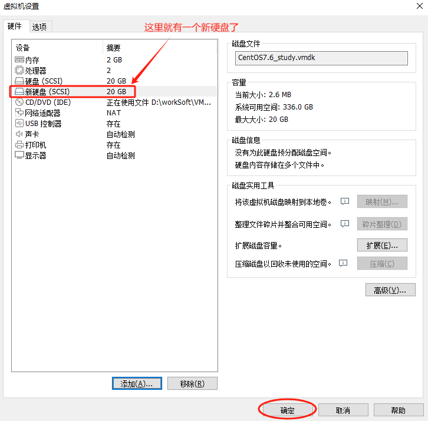

### 第三步：开机

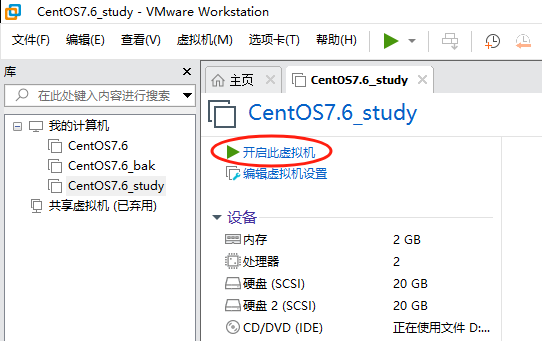

开机后，可以通过`fdisk -l`命令查看硬盘分区情况，可以看到确实有`/dev/sdb`这个磁盘，但是还没分区。

### 第四步：开始分区

需求：给新加的硬盘分一个主分区（2G），一个扩展分区（剩余的所有空间）；

给扩展分区中分一个逻辑分区（2G）

```shell
# fdisk /dev/sdb
Welcome to fdisk (util-linux 2.23.2).

Changes will remain in memory only, until you decide to write them.
Be careful before using the write command.

Device does not contain a recognized partition table
Building a new DOS disklabel with disk identifier 0xce860e2d.

Command (m for help): m		=> 查看帮助
Command action
   a   toggle a bootable flag
   b   edit bsd disklabel
   c   toggle the dos compatibility flag
   d   delete a partition
   g   create a new empty GPT partition table
   G   create an IRIX (SGI) partition table
   l   list known partition types
   m   print this menu
   n   add a new partition
   o   create a new empty DOS partition table
   p   print the partition table
   q   quit without saving changes
   s   create a new empty Sun disklabel
   t   change a partition's system id
   u   change display/entry units
   v   verify the partition table
   w   write table to disk and exit
   x   extra functionality (experts only)

Command (m for help): n		=> 新建分区
Partition type:
   p   primary (0 primary, 0 extended, 4 free)
   e   extended
Select (default p): p	=> 指定分区类型为主分区
Partition number (1-4, default 1): 1	=> 指定分区号，从1开始
First sector (2048-41943039, default 2048): 2048	=> 指定从第几个柱面开始
Last sector, +sectors or +size{K,M,G} (2048-41943039, default 41943039): +2G	=> 分区大小
Partition 1 of type Linux and of size 2 GiB is set

Command (m for help): p	=> 显示分区列表

Disk /dev/sdb: 21.5 GB, 21474836480 bytes, 41943040 sectors
Units = sectors of 1 * 512 = 512 bytes
Sector size (logical/physical): 512 bytes / 512 bytes
I/O size (minimum/optimal): 512 bytes / 512 bytes
Disk label type: dos
Disk identifier: 0xce860e2d

  设备文件名 是否Boot分区 起始柱面 结束柱面  分区大小KB 文件类型编号 系统
   Device Boot      Start         End      Blocks   Id  System
/dev/sdb1            2048     4196351     2097152   83  Linux

Command (m for help): n	=> 新建分区
Partition type:
   p   primary (1 primary, 0 extended, 3 free)
   e   extended
Select (default p): e	=> 指定分区类型为扩展分区
Partition number (2-4, default 2): 2	=> 指定分区编号
First sector (4196352-41943039, default 4196352): 4196352 => 指定起始柱面
Last sector, +sectors or +size{K,M,G} (4196352-41943039, default 41943039): 41943039 => 指定结束柱面，这里直接指定到最后，表示本次分区占用了硬盘剩下的所有的空间
Partition 2 of type Extended and of size 18 GiB is set

Command (m for help): p	=> 显示分区列表

Disk /dev/sdb: 21.5 GB, 21474836480 bytes, 41943040 sectors
Units = sectors of 1 * 512 = 512 bytes
Sector size (logical/physical): 512 bytes / 512 bytes
I/O size (minimum/optimal): 512 bytes / 512 bytes
Disk label type: dos
Disk identifier: 0xa2950284

   Device Boot      Start         End      Blocks   Id  System
/dev/sdb1            2048     4196351     2097152   83  Linux
/dev/sdb2         4196352    41943039    18873344    5  Extended

Command (m for help): n => 新建分区
Partition type:
   p   primary (1 primary, 1 extended, 2 free)
   l   logical (numbered from 5)
Select (default p): l => 设置分区类型为逻辑分区
Adding logical partition 5 => (系统已经给定逻辑分区号为5，不需要我们编写)
First sector (4198400-41943039, default 4198400): => 这里直接回车，表示使用默认值去设置开始柱面
Using default value 4198400
Last sector, +sectors or +size{K,M,G} (4198400-41943039, default 41943039): +2G => 指定逻辑分区大小
Partition 5 of type Linux and of size 2 GiB is set

Command (m for help): p	=> 显示分区列表

Disk /dev/sdb: 21.5 GB, 21474836480 bytes, 41943040 sectors
Units = sectors of 1 * 512 = 512 bytes
Sector size (logical/physical): 512 bytes / 512 bytes
I/O size (minimum/optimal): 512 bytes / 512 bytes
Disk label type: dos
Disk identifier: 0xa2950284

   Device Boot      Start         End      Blocks   Id  System
/dev/sdb1            2048     4196351     2097152   83  Linux
/dev/sdb2         4196352    41943039    18873344    5  Extended
/dev/sdb5         4198400     8392703     2097152   83  Linux

Command (m for help): w => 保存退出
The partition table has been altered!

Calling ioctl() to re-read partition table.
Syncing disks.
```

**fdisk交互指令说明：**

| 命令 | 说明 |
| --- | --- |
| a | 设置可引导标记 |
| b | 编辑 bsd 磁盘标签 |
| c | 设置 DOS 操作系统兼容标记 |
| **d** | **删除一个分区** |
| **l** | **显示已知的文件系统类型。82 为 Linux swap 分区，83 为 Linux 分区** |
| m | 显示帮助菜单 |
| **n** | **新建分区** |
| o | 建立空白 DOS 分区表 |
| **p** | **显示分区列表** |
| **q** | **不保存退出** |
| s | 新建空白 SUN 磁盘标签 |
| **t** | **改变一个分区的系统 ID** |
| u | 改变显示记录单位 |
| v | 验证分区表 |
| **w** | **保存退出** |
| x | 附加功能（仅专家） |

> 注意：一块硬盘最少得有一块主分区，然后才能建立扩展分区！！！
>
> 硬盘的一个盘片中是有一个个的磁道的，多个盘片的同一个磁道就组成了一个柱面，一个柱面的大小大概是8MB。
>
> 一块硬盘只能有一个扩展分区，所以上面第三次新建分区的时候，只能选择主分区和逻辑分区
>
> 1、2、3、4的分区号只能给主分区和扩展分区使用，逻辑分区号从5开始！

### 第五步：查看分区效果

```shell
# fdisk -l

第一块硬盘
   Device Boot      Start         End      Blocks   Id  System
/dev/sda1   *        2048     2099199     1048576   83  Linux
/dev/sda2         2099200    41943039    19921920   8e  Linux LVM

第二块硬盘（也就是我们后来加的那个新硬盘）
   Device Boot      Start         End      Blocks   Id  System
/dev/sdb1            2048     4196351     2097152   83  Linux
/dev/sdb2         4196352    41943039    18873344    5  Extended
/dev/sdb5         4198400     8392703     2097152   83  Linux
```

### 第六步：格式化分区

> 扩展分区是不能写入数据，也不能格式化的。我们只需要格式化主分区和逻辑分区即可。

```shell
# 格式化分区
# mkfs [选项] 设备文件名

选项说明：
-t：指定文件系统类型，CentOS7开始我们使用xfs文件系统类型

# 格式化 sdb1 主分区
# mkfs -t xfs /dev/sdb1

# 格式化 sdb5 逻辑分区
# mkfs -t xfs /dev/sdb5
```

### 第七步：建立挂载点

挂载点就是一个空目录

```shell
# mkdir /mnt/disk1
# mkdir /mnt/disk5
```

### 第八步：挂载

挂载就是将分区和挂载点（空目录）连接起来的过程。

```shell
# mount /dev/sdb1 /mnt/disk1

# mount /dev/sdb5 /mnt/disk5
```

### 第九步：查看挂载情况

使用mount命令查看挂载情况。（输出的内容会比较多，看最后面的信息）

```shell
# mount

/dev/sdb5 on /mnt/disk5 type xfs (rw,relatime,seclabel,attr2,inode64,noquota)
/dev/sdb1 on /mnt/disk1 type xfs (rw,relatime,seclabel,attr2,inode64,noquota)
```

或者使用 df -hT命令，不仅可以看到磁盘使用率，也可以查看挂载情况。

```shell
# df -hT	=> h 是人性化的大小显示  T 是显示文件系统类型
Filesystem                  Type      Size  Used Avail Use% Mounted on
/dev/mapper/centos_192-root xfs        17G  4.9G   13G  29% /
devtmpfs                    devtmpfs  894M     0  894M   0% /dev
tmpfs                       tmpfs     910M     0  910M   0% /dev/shm
tmpfs                       tmpfs     910M   11M  900M   2% /run
tmpfs                       tmpfs     910M     0  910M   0% /sys/fs/cgroup
/dev/sda1                   xfs      1014M  179M  836M  18% /boot
tmpfs                       tmpfs     182M   12K  182M   1% /run/user/42
tmpfs                       tmpfs     182M     0  182M   0% /run/user/0
/dev/sdb5                   xfs       2.0G   33M  2.0G   2% /mnt/disk5
/dev/sdb1                   xfs       2.0G   33M  2.0G   2% /mnt/disk1
```

> 在我们对磁盘做好分区之后，分区的大小就定了，不能说我给某个分区再加点空间！
>
> 如果我们要对磁盘做好的分区调整大小，可以使用后面学习的LVM。

## 自动挂载

我们上面做好的对硬盘先分区，然后再格式化，然后再挂载。

如果重启系统的话，挂载就没了。（分区、格式化都在）

这样的话，我们每次启动完系统之后还需要重新挂载！太麻烦了！

我们可以使用自动挂载。

> 注意，光盘、优盘、移动硬盘尽量不要做自动挂载，假如我们对光盘做了自动挂载，但是在系统启动的时候，我们没有放光盘的话就会造成系统启动失败！
>
> 所以说，最好只对固定的设备，比如磁盘做自动挂载，只要能够保证它每次开机启动时都在就行！

**系统中自动挂载，需要修改**<code>**/etc/fstab**</code>**这个配置文件就可以**。注意这个配置文件直接参与系统启动，如果修改错误，会造成系统启动失败！

```shell
# vim /etc/fstab

/dev/mapper/centos_192-root /                       xfs     defaults        0 0
UUID=fb14498b-c42f-4556-95ba-799c04e396a6 /boot     xfs     defaults        0 0
/dev/mapper/centos_192-swap swap                    swap    defaults        0 0

第一列：设备文件名（可以写设备文件名，也可以写设备文件名对应的UUID）
第二列：挂载点
第三列：文件系统类型
第四列：挂载选项
第五列：是否可以备份，0-不备份，1-每天备份，2-不定期备份
第六列：是否检测磁盘fsck，0-不检测，1-启动时检测，2-启动后检测
```

怎样查看每个分区的设备文件名对应的UUID呢？

```shell
# 查看分区的设备文件对应的UUID
# ls -l /dev/disk/by-uuid/

lrwxrwxrwx. 1 root root 10 Feb 25 22:14 17f73a79-266c-40af-89f7-97aec1fcfb36 -> ../../dm-0
lrwxrwxrwx. 1 root root  9 Feb 25 22:14 2018-11-25-23-54-16-00 -> ../../sr0
lrwxrwxrwx. 1 root root 10 Feb 25 22:14 387c2bd1-2c98-4a2b-ac2c-b1af9cde73bc -> ../../sdb1
lrwxrwxrwx. 1 root root 10 Feb 25 22:14 c670ca06-7cb6-4e8a-abd1-21d70c826340 -> ../../dm-1
lrwxrwxrwx. 1 root root 10 Feb 25 22:14 e4b732d2-78f4-4966-a359-1363e43d6c12 -> ../../sdb5
lrwxrwxrwx. 1 root root 10 Feb 25 22:14 fb14498b-c42f-4556-95ba-799c04e396a6 -> ../../sda1
```

> 如果是CentOS6及之前的系统，也可以使用 `dumpe2fs 分区设备文件名`查看分区设备文件对应的UUID

```shell
# vim /etc/fstab
/dev/mapper/centos_192-root /                       xfs     defaults        0 0
UUID=fb14498b-c42f-4556-95ba-799c04e396a6 /boot     xfs     defaults        0 0
/dev/mapper/centos_192-swap swap                    swap    defaults        0 0
UUID=387c2bd1-2c98-4a2b-ac2c-b1af9cde73bc /mnt/disk1 xfs    defaults        0 0
UUID=e4b732d2-78f4-4966-a359-1363e43d6c12 /mnt/disk5 xfs    defaults        0 0

然后保存退出

# mount -a	=> 检测上面的配置文件是否有问题，什么提示也没有，一般就没问题

# reboot		=> 重启系统，看是否已经可以自动挂载

# mount | grep /dev/sd	=> 查看挂载情况
/dev/sdb5 on /mnt/disk5 type xfs (rw,relatime,seclabel,attr2,inode64,noquota)
/dev/sdb1 on /mnt/disk1 type xfs (rw,relatime,seclabel,attr2,inode64,noquota)
/dev/sda1 on /boot type xfs (rw,relatime,seclabel,attr2,inode64,noquota)
```

上面两行背景的内容就是我们添加的让自动挂载 /dev/sdb1 和 /dev/sdb5 的配置。

## <font style="color:rgb(0,0,0);">/etc/fstab/文件修复</font>

如果我们在做自动挂载的时候，对`/etc/fstab`文件改错了，就会导致系统在启动的时候报错。**（勿尝试）**

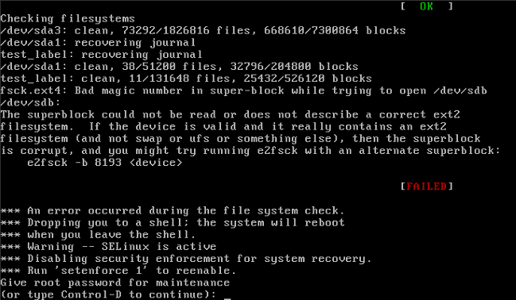

解决办法：

1. 上面提示我们输入root账户的密码，那就先输入root的密码
2. 重新挂载一下根分区，将其根分区的权限改为读写。<code><font style="color:rgb(0,0,0);"># mount -o remount,rw /</font></code>
3. <font style="color:rgb(0,0,0);">重新修改</font><code><font style="color:rgb(0,0,0);">/etc/fstab</font></code><font style="color:rgb(0,0,0);">文件，将其改正确</font>
4. <font style="color:rgb(0,0,0);">重启系统，发现就可以了</font>

<font style="color:rgb(0,0,0);"></font>

<font style="color:rgb(0,0,0);">目前我们使用的是CentOS7.6，已经对这个文件的要求不是很高了，稍微错一点影响不大！</font>

## <font style="color:rgb(0,0,0);">parted命令分区</font>

在Linux系统中有两种常见的分区表：MBR分区表（主引导记录分区表）和GPT分区表（全局唯一标示分区表），其中：

* MBR分区表：支持的最大分区是2TB（1TB=1024GB）；最多支持4个主分区，或3个主分区加1个扩展分区\*\*（我们之前使用的fdisk命令进行分区，就只能针对MBR这种分区表）\*\*
* GPT分区表：支持最大18EB的分区（1EB=1024PB，1PB=1024TB）；最多支持128个分区，其中1个系统保留分区，127个用户自定义分区

不过parted命令也有点小问题，就是命令自身分区的时候只能格式化成ext2的文件系统，不支持ext3，不支持ext4，更不支持xfs文件系统。不过也没有太大影响，因为我们可以先分区再用mkfs命令进行格式化。

### 准备工作

我们还是在`/dev/sdb`硬盘上利用parted命令进行分区。所以，首先把之前的分区都去掉吧！

之前分区的时候是：分区 => 格式化 => 挂载 => 自动挂载

现在我们先反着进行一边操作

```shell
# 取消自动挂载
# vim /etc
删除我们之前加的两行配置

# 取消挂载
# umount /dev/sdb1
# umount /dev/sdb5

# 删除分区
[root@bogon ~]# fdisk /dev/sdb
Welcome to fdisk (util-linux 2.23.2).

Changes will remain in memory only, until you decide to write them.
Be careful before using the write command.


Command (m for help): d	=> 表示要删除分区
Partition number (1,2,5, default 5): 5 => 删除逻辑分区
Partition 5 is deleted

Command (m for help): d => 表示要删除分区
Partition number (1,2, default 2): 2 => 删除2号主分区
Partition 2 is deleted

Command (m for help): d => 表示要删除分区
Selected partition 1	=> 因为就只有一个主分区了，所以不需要选择，直接就删了
Partition 1 is deleted

Command (m for help): w => 保存退出
The partition table has been altered!

Calling ioctl() to re-read partition table.
Syncing disks.
```

### 第一步：分区

使用parted命令进行GPT的分区。

```shell
# parted /dev/sdb
GNU Parted 3.1
Using /dev/sdb
Welcome to GNU Parted! Type 'help' to view a list of commands.

(parted) print => 打印分区表
Model: VMware, VMware Virtual S (scsi)
Disk /dev/sdb: 21.5GB
Sector size (logical/physical): 512B/512B
Partition Table: msdos  => 表示的就是目前使用的是MBR分区表
Disk Flags:

Number  Start  End  Size  Type  File system  Flags

(parted) mklabel gpt => 表示我们要转为gpt分区表
Warning: The existing disk label on /dev/sdb will be destroyed and
all data on this disk will be lost. Do you want to continue?

Yes/No? Yes => 意思是现有的sdb磁盘分区将被销毁而且sdb磁盘上的数据会丢失，继续吗？继续

(parted) print => 打印分区表
Model: VMware, VMware Virtual S (scsi)
Disk /dev/sdb: 21.5GB
Sector size (logical/physical): 512B/512B
Partition Table: gpt => 可以看到分区的话，分区表已经是gpt了
Disk Flags:

Number  Start  End  Size  File system  Name  Flags

(parted) mkpart => 创建一个分区
Partition name?  []? disk1 => 指定分区的名字，可以自己随意写
File system type?  [ext2]? => 指定分区的文件系统类型，只支持ext2，先用它后面再改，直接回车即可
Start? 1MB => 分区的起始位置，写1MB就行
End? 2GB => 分区的结束位置

(parted) print => 打印分区表
Model: VMware, VMware Virtual S (scsi)
Disk /dev/sdb: 21.5GB
Sector size (logical/physical): 512B/512B
Partition Table: gpt => 表示我们目前用的就是gpt分区
Disk Flags:

分区号   起始    结束    分区大小  文件系统     分区名称  标志
Number  Start   End     Size    File system  Name   Flags
 1      1049kB  2000MB  1999MB  xfs          disk1
其实可以看到它自动将分区的文件系统识别为xfs了，CentOS7使用的就是它！！！但是后面我们还是需要再格式化为xfs

(parted) quit => 退出（这里的退出其实是保存并退出）
Information: You may need to update /etc/fstab.
```

| parted | 说明 |
| --- | --- |
| check NUMBER | 做一次简单的文件系统检测 |
| cp \[FROM-DEVICE] FROM-NUMBER TO-NUMBER | 复制文件系统到另外一个分区 |
| help \[COMMAND] | 显示所有的命令帮助 |
| **mklabel,mktable LABEL-TYPE** | **创建新的磁盘卷标（分区表）** |
| mkfs NUMBER FS-TYPE | 在分区上建立文件系统 |
| **mkpart PART-TYPE \[FS-TYPE] START END** | **创建一个分区** |
| mkpartfs PART-TYPE FS-TYPE START END | 创建分区，并建立文件系统 |
| move NUMBER START END | 移动分区 |
| name NUMBER NAME | 给分区命名 |
| **print \[devices|free|list,all|NUMBER]** | **显示分区表，活动设备，空闲空间，所有分区** |
| **quit** | **退出** |
| rescue START END | 修复丢失的分区 |
| resize NUMBER START END | 修改分区大小 |
| **rm NUMBER** | **删除分区** |
| select DEVICE | 选择需要编辑的设备 |
| set NUMBER FLAG STATE | 改变分区标记 |
| toggle \[NUMBER \[FLAG]] | 切换分区表的状态 |
| unit UNIT | 设置默认的单位 |
| Version | 显示版本 |

> GPT分区可以有128个呢，它就解决了MBR分区只能有4个的局限，所以在GPT分区中就没有主分区和扩展分区的概念，你可以理解为GPT的分区都是主分区！

### 第二步：查看分区的效果

**查看分区的效果：**

```shell
# fdisk -l

#         Start          End    Size  Type            Name
 1         2048      3905535    1.9G  Microsoft basic disk1

注意：上面的分区类型是 Microsoft basic，属于正常现象
```

### 第三步：格式化分区

```shell
# 格式化我们上面的分好的分区，它的分区设备名是/dev/sdb1
# mkfs -t xfs /dev/sdb1
mkfs.xfs: /dev/sdb1 appears to contain an existing filesystem (xfs).
mkfs.xfs: Use the -f option to force overwrite. 需要我们强制覆盖一下，不然挂载的话挂载不上！

# 强制格式化分区
# mkfs -t xfs -f /dev/sdb1
```

### 第四步：挂载分区

```shell
# mount /dev/sdb1 /mnt/disk1
```

### 第五步：查看分区挂载情况

```shell
# mount|grep /dev/sd
/dev/sda1 on /boot type xfs (rw,relatime,seclabel,attr2,inode64,noquota)
/dev/sdb1 on /mnt/disk1 type xfs (rw,relatime,seclabel,attr2,inode64,noquota)
```

### 第六步：自动挂载

自动挂载和上面的fdisk分区一样，我们需要修改`/etc/fstab`文件即可！

### 其他说明

如果我们要删除分区的话，必须把自动挂载给取消，也就是修改`/etc/fstab`文件。不然我们将分区删掉后，系统重启后，会自动加载`/etc/fstab`文件进行自动挂载，而你的分区已经删了，就会导致系统启动不起来！

## swap分区增加空间

我们知道swap分区属于必须分区！

swap分区是作为虚拟内存的，当真实内存不够用时，就会用到swap分区临时充当虚拟内存！

查看swap分区的大小使用情况：

```shell
# free -h
              total        used        free      shared  buff/cache   available
Mem:           1.8G        718M        386M         20M        714M        872M
Swap:          2.0G          0B        2.0G
```

本次，我们打算给swap分区多加点大小。将sdb硬盘分一些空间给swap分区。

### 准备工作

之前我们在上面的parted分区中已经将sdb硬盘调整为GPT分区了，我们再将其调整回MBR分区。然后将之前的挂载卸载、将分区删除，然后重新利用fdisk分区。

### 第一步：取消挂载

如果之前使用了自动挂载，需要将`/etc/fstab`配置文件中的相关内容删除。

然后取消挂载：

```shell
# umount /dev/sdb1
```

### 第二步：删除分区&转换分区

删除之前的`/dev/sdb1`分区，以及将GPT分区转为MBR分区！

```shell
# parted /dev/sdb
GNU Parted 3.1
Using /dev/sdb
Welcome to GNU Parted! Type 'help' to view a list of commands.
(parted) print
Model: VMware, VMware Virtual S (scsi)
Disk /dev/sdb: 21.5GB
Sector size (logical/physical): 512B/512B
Partition Table: gpt
Disk Flags:

Number  Start   End     Size    File system  Name   Flags
 1      1049kB  2000MB  1999MB  xfs          disk1

(parted) rm => 删除分区

Partition number? 1 => 输入分区编号

(parted) print => 打印分区列表
Model: VMware, VMware Virtual S (scsi)
Disk /dev/sdb: 21.5GB
Sector size (logical/physical): 512B/512B
Partition Table: gpt
Disk Flags:

Number  Start  End  Size  File system  Name  Flags

(parted) mklabel msdos => 使用MBR分区，注意这里写的msdos指的就是MBR分区
Warning: The existing disk label on /dev/sdb will be destroyed and all data on
this disk will be lost. Do you want to continue?
Yes/No? Yes

(parted) print => 打印分区表
Model: VMware, VMware Virtual S (scsi)
Disk /dev/sdb: 21.5GB
Sector size (logical/physical): 512B/512B
Partition Table: msdos => 可以看到已经转为了MBR分区
Disk Flags:

Number  Start  End  Size  Type  File system  Flags

(parted) quit => 退出（这里的退出其实是保存并退出）
```

### 第三步：使用fdisk分区

```shell
# fdisk /dev/sdb
Welcome to fdisk (util-linux 2.23.2).

Changes will remain in memory only, until you decide to write them.
Be careful before using the write command.


Command (m for help): print => 打印分区列表信息

Disk /dev/sdb: 21.5 GB, 21474836480 bytes, 41943040 sectors
Units = sectors of 1 * 512 = 512 bytes
Sector size (logical/physical): 512 bytes / 512 bytes
I/O size (minimum/optimal): 512 bytes / 512 bytes
Disk label type: dos
Disk identifier: 0x00021269

   Device Boot      Start         End      Blocks   Id  System
   可以看到目前没有分区
Command (m for help): n => 新建分区
Partition type:
   p   primary (0 primary, 0 extended, 4 free)
   e   extended
Select (default p): p => 分区类型为主分区

Partition number (1-4, default 1): 1 => 指定分区号
First sector (2048-41943039, default 2048): => 指定起始柱面，直接回车使用默认的
Using default value 2048
Last sector, +sectors or +size{K,M,G} (2048-41943039, default 41943039): +4G => 指定分区大小
Partition 1 of type Linux and of size 4 GiB is set

Command (m for help): p => 打印分区信息

Disk /dev/sdb: 21.5 GB, 21474836480 bytes, 41943040 sectors
Units = sectors of 1 * 512 = 512 bytes
Sector size (logical/physical): 512 bytes / 512 bytes
I/O size (minimum/optimal): 512 bytes / 512 bytes
Disk label type: dos
Disk identifier: 0x00021269

   Device Boot      Start         End      Blocks   Id  System
/dev/sdb1            2048     8390655     4194304   83  Linux
Id号是83表示的是Linux的标准分区，而我们要的是swap分区，swap分区的Id号是82

Command (m for help): t => 改变分区的Id号
Selected partition 1 => 目前只有一个分区，所以不需要我们选择改哪个分区的Id号
Hex code (type L to list all codes): 82 => 设置分区的Id号为82，即swap分区
Changed type of partition 'Linux' to 'Linux swap / Solaris'

Command (m for help): p => 打印分区信息

Disk /dev/sdb: 21.5 GB, 21474836480 bytes, 41943040 sectors
Units = sectors of 1 * 512 = 512 bytes
Sector size (logical/physical): 512 bytes / 512 bytes
I/O size (minimum/optimal): 512 bytes / 512 bytes
Disk label type: dos
Disk identifier: 0x00021269

   Device Boot      Start         End      Blocks   Id  System
/dev/sdb1            2048     8390655     4194304   82  Linux swap / Solaris

Command (m for help): w => 保存退出
The partition table has been altered!

Calling ioctl() to re-read partition table.
Syncing disks.
```

### 第四步：格式化分区

之前我们格式化分区的时候使用的是`mkfs -t xfs 分区设备文件名`命令

这次我们格式的是swap分区，有点特殊：

```shell
# mkswap /dev/sdb1
mkswap: /dev/sdb1: warning: wiping old xfs signature.
Setting up swapspace version 1, size = 4194300 KiB
no label, UUID=640242bc-5e0a-4eb2-be95-eee7096a7396
```

### 第五步：查看之前的swap分区大小

```shell
# free -h
              total        used        free      shared  buff/cache   available
Mem:           1.8G        751M        350M         21M        716M        838M
Swap:          2.0G          0B        2.0G
```

### 第六步：将新分区空间加到swap分区中

```shell
# swapon /dev/sdb1
```

### 第七步：查看最新的swap分区的大小

```shell
# free -h
              total        used        free      shared  buff/cache   available
Mem:           1.8G        754M        347M         21M        716M        835M
Swap:          6.0G          0B        6.0G
这里的6G = 原来的2G + 新加的分区4G
```

### 第八步：自动挂载swap分区

上面的步骤做完后，swap分区大小确实增加了，但只是临时生效，重启就没有了。

我们可以跟之前一样，做个自动挂载！ 还是修改`/etc/fstab`配置文件，稍微有些不同，注意下。

```shell
# vim /etc/fstab

添加如下内容
/dev/sdb1		swap		swap		defaults		0		0

当然上面的设备名可以换成其对应的UUID
```

到此swap分区就做完了！注意，swap分区不是给我们用的，而是给系统内核用的；swap分区就叫swap分区，不能写为/swap！


> 更新: 2025-03-17 14:33:34  
> 原文: <https://www.yuque.com/u41736172/az9urv/rnhw2npbbyeix9pw>